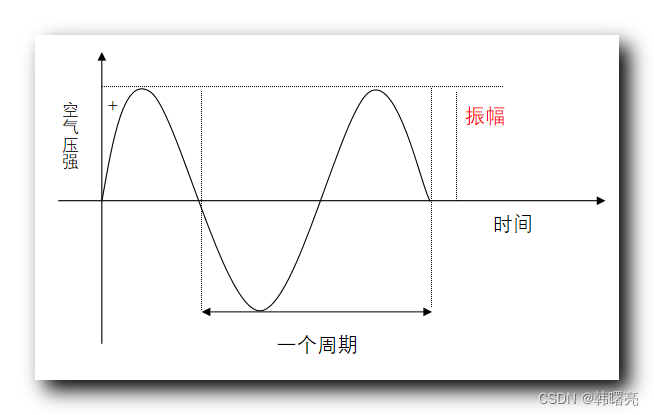
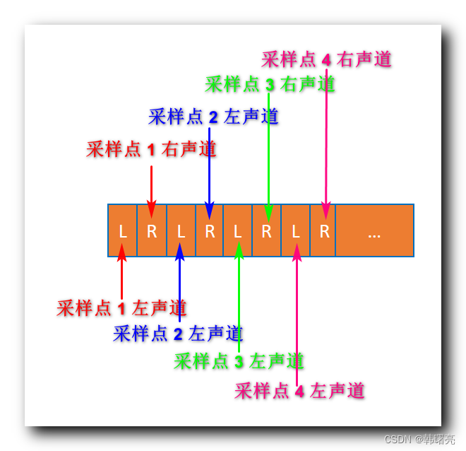
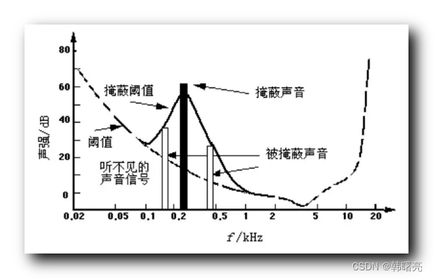
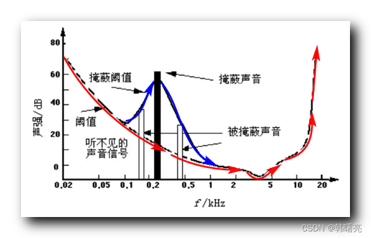
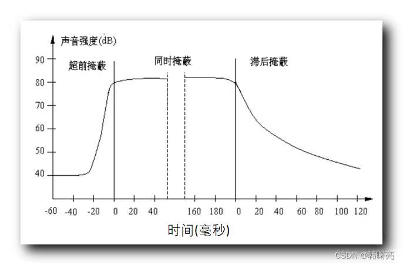

# 音频编解码原理

- 作者: 韩曙亮
- 链接: [CSDN](https://blog.csdn.net/shulianghan/category_12412153.html)

## 声音特性

声音本质:
- 物理现象: 声音是物体振动产生的物理现象, 其本质是波在介质中的传播现象.
- 声音产生: 声音是由物体振动产生的声波, 通过介质传播, 可以被人或动物的听觉器官所感知.
- 传播介质: 固体, 液体, 空气

声音频率:
声音的频率指的是物体振动的周期, 一秒钟振动多少次, 单位是赫兹 (Hz).
- 次声波: 0~20 Hz
- 人耳可听到的频率: 20~20,000 Hz
- 超声波: 20,000 ~ 1G Hz, 1G = 10^9
- 特超声波: 1G ~ 1T Hz, 1T = 10^12

声音特性:
- 音调: 振动的主要频率, 如钢琴中央 C 振动频率为 261.6 Hz, 有 261 个波峰和波谷.
- 响度: 振动的振幅, 振幅越大, 响度越大, 单位是分贝 (dB).
- 音色: 物体的材质结构决定, 本质是物体谐振产生. 如木头和金属的内部结构不同, 谐振频率不同.

声音的响度是依靠振动的振幅确定的;
声音的频率包括主频率和谐振频率.

音频的频率可以对音频文件的 PCM 采样 (声音振动的振幅值) 进行傅里叶变换, 将时域信息转化为频域信息.

## 数字音频

声音振动的物理波形如上图, 振动产生的响度值 (振幅/空气压强) 是平滑连续的模拟信号.

**脉冲编码调制 (Pulse Code Modulation, PCM)** 指的是将人耳听到的连续的模拟信号转换为数字信号的技术.

对模拟声音信号进行音频信息采样时, 采样的内容就是声音振动时产生的振幅值.

采样时, 每隔固定的时间, 就对模拟信号的振幅值采集一个样本, 这个振动的振幅值就是声音的大小.

根据**奈奎斯特采样定理 (Nyguist-Shannon Sampling theorem)**, 如果要从脉冲振幅值数字采样信号还原为原始的模拟信号, PCM 的脉冲采样频率必须是最高频率的 2 倍.

那么根据人耳能听到的频率范围和奈奎斯特采样定理, 想要保证人耳听到的声音不失真, 需要使用 40,000 Hz 以上的采样率.
常用的 44,100 Hz 的采样频率, 可以还原 0~22,050 Hz 的模拟信号.
理论上, 超过 44,100 Hz 采样频率的音频与更高采样频率的音频效果是一样的.
一些高端的录制设备或音响, 可以录制或播放更高采样率的音频.

## 采样量化

数字音频采样 (声音振幅值) 是在离散的时间点上进行的, 采样值是离散的, 不连续的.
44,100 Hz 的采样频率就是每隔 1/44,100 秒采集一个声音振幅值样本.

采样值的精度取决于采样的位数.
- 8 位 (1 字节): 可以表达出 2^8=256 个不同的值, 即 [-128, 127].
- 16 位 (2 字节): 可以表达出 2^16=65536 个不同的值, 即 [-32768, 32767].

采样的位数越低, 精度越低, 越失真.

## 采样值

物体振动产生的振幅就是声音的响度, 振幅越大响度越大, 也是采样值.

使用某个录音设备录制音频, 某个时间戳的采样值为 100, 将这个值输出到音响中, 音响的输出设置的采样位数也为 8 位, 那么就可以还原录制时的振幅.
100 和真实的音量响度, 即分贝值无关, 播放的声音大小只和录音设备有关: 如录制 50 分贝的声音, 不同录音设备录制的采样值是不同的, 相同设备使用不同参数录制的采样值也是不同的.
100 在播放设备中播放的声音分贝数也无关, 如在手机中播放为 40 分贝, 在大功率扬声器可能就是 80 分贝.

但看 100 的采样值没有意义, 只有通过播放设备才有意义.

如果播放设备不是 8 位而是 16 位, 就需要将 100 采样值转换为 16 位的采样值.
即 100 / 2^7 * 2^15 = 25600.

## 音频概念

常用的音频采样频率:
- 22,000 Hz: 无线广播
- 44,100 Hz: CD 音质
- 48,000 Hz: DVD 和数字电视音质
- 96,000 Hz: 蓝光和高清 DVD 音质
- 192,000 Hz: 蓝光和高清 DVD 音质

人耳听到超过 44,100 Hz 的采样频率的音频和更高采样频率的音频效果相同.
注: 使用高端音响设备发出的超过 44,100 Hz 采样频率的声音和低端设备发出的声音是不同的, 因为谐振不同.

常用的音频采样精度 (采样值的位数):
- 8 位: 早期数字音频系统, 每个采样点可以用 256 个不同值表示, 精度相对较低, 音频质量粗糙, 有明显的量化噪声.
- 16 位: 最常见的采样精度, 可以提供相当高的音频质量, 适用于大多数音乐, 电影, 多媒体应用.
- 24 位: 提供 2^24=16777216 个不同值, 适用于更高动态范围和更低噪声的应用场景, 如录音室或音频后期制作.
- 32 位: 提供 2^32=4294967296 (约 43 亿) 个不同值, 非常高的动态范围和信噪比, 常用于特定专业领域, 如数字音频工作站.

音频通道数:
- 单声道: 只有一个省道, 即声音只能从一个方向传来, 无法区分左右声道, 常用于简单的音频设备, 如收音机.
- 双声道: 立体声, 包括左右两个声道, 经过处理后可以模拟出人耳对声音的定位感, 使得听者能够感受到声音的方向和立体感.
- 四声道: 在双声道基础上增加后置左右两个声道, 形成环绕声, 提供更加宽广和包围感更强的音频体验, 常用于家庭影院.
- 5.1声道: 前置左右, 中置, 后置左右五个正常音频声道, 再加上一个低音炮 0.1, 常用于电影院或游戏音频.

## 比特率/码率

音频比特率指的是每秒传输音频的比特数.
单位是 BPS, Bit Per Second.
音频比特率是衡量音频质量的标准.
原始 PCM 采样的音频, 其 `比特率=采样频率*采样位数*音频通道数`

如采样频率为 44,100 Hz, 采样位数为 16 位, 单个采样 2 字节, 采样通道数为双声道, 则该音频的比特率为
`44,100*16*2=1,411,200` BPS.
即该音频一秒的比特数为 1,411,200 比特.
该数据量为 1,411,200 / 8 = 176,400 字节, 约为 172 MB.

音频的码率是指**压缩后**的音频数据的比特率, 是音频数据在单位时间内的传输速率或压缩率, 表示每秒钟传输或存储的音频数据量, 通常以 KBPS 千比特每秒为单位.
音频码率决定了音频文件的音质和文件大小之间的平衡.
未压缩的音频的比特率是确定的, 如前面定义.

音频码率的大小相关的音素有: 音频大小 (采样率, 位深度, 声道数) + 编码算法
通常情况下,
- 较高的码率通常会提供更高的音质, 因为包含更多的音频数据, 可以更好的还原原始声音信号, 但会占用更多存储空间.
- 较低的码率可以减小文件大小, 节省存储空间, 但可能会导致音质损失.

常见的音频码率:
- 96 kbps: FM 音质, 适用于对音质要求不高的场景;
- 128~160 kbps: 普通质量的音频码率, 常用于在线音乐流媒体服务和普通音乐下载, 在复杂场景中可能会丢失细节;
- 192 kbps: CD 音质, 该码率提供更高的音质, 适用于对音质要求较高的音乐和音频内容;
- 256~320 kbps: 高质量音频的码率范围, 通常被视为无损音乐, 能够提供非常接近原始录音的音质.

注: 视频码率指的是视频文件在单位时间内的数据流量, 一般是 Mbps, 表示单位时间内传送比特的数目, 通常用于衡量数字信号的传输速率.
一般情况下码率越高视频分辨率越高视频越清晰, 但不是绝对的, 有些模糊的文件码率也很高.
该单位是 Mbps, Megabits Per Second, 兆比特每秒, 是传输速率单位.
1 Mbps 即每秒传输 1,000,000 位 (Bit), 8 Bit = 1 Byte, 每秒传输的数据量为 125000 Byte/s.

## 音频帧

音频帧: 将音频送入音频编码器时, 一次性要送入指定个数的采样点.
这些指定个数又称为单元数, 这些指定个数的采样称为一个编码单元, 又称为音频帧.
换种说法可以理解为指定时间内的采样数.

音频帧的概念和编码格式紧密相关, 并由各个编码标准自己实现, 不同的编码格式的编码帧采样个数是不同的:
- MP3 编码格式的音频编码帧有 1152 个采样点;
- AAC 编码格式的音频编码帧有 1024 个采样点.

音频帧长度指的是每个音频帧的持续时间 = 采样点数 / 采样频率, 单位是秒.
音频帧长度可以指压缩后每个音频帧的数据长度.
以 MP3 压缩格式为例, 采样率是 48,000 Hz, 一个音频帧有 1152 个采样点, 则音频帧长度为 1152 / 48000 = 0.024 秒 = 24 毫秒.

采样点数与采样个数的区别:
- 单声道, 一个音频采样;
- 双声道, 两个音频采样;
- 四声道, 四个音频采样;

## 帧采样排列方式

音频编码或解码时首先要知道在音频帧中采样点的排列方式.
数据以连续帧的方式存放, 先记录第一帧再记录第二帧.
在音频帧内部的音频采样排列方式有交错模式和非交错模式两种.

交错模式: 在存储音频采样时, 下图是记录四个双声道采样点数据,
- 记录采样点 1 的左右声道;
- 记录采样点 2 的左右声道;
- 记录采样点 3 的左右声道;
- 记录采样点 4 的左右声道;

非交错模式:
- 记录 1~4 的左声道
- 记录 1~4 的右声道

## 音频压缩技术

没有经过压缩的原始音频采样是很大的, 占用的带宽和磁盘空间极大.
如采样频率为 44,100 Hz, 采样位数为 16 位, 单个采样 2 字节, 采样通道数为双声道, 则该音频的比特率为 1,411,200.

- 从数据量分析, 该音频 1 s 需要传输 172 MB 的数据, 1 首歌 3 分钟, 需要 30 G 的空间.
- 从带宽分析, 平时的 1M 带宽 (1 Mbps) 每秒钟只能传输 1 Mb 的数据, 上述音频 1 秒钟需要传输 1.4112 Mb 的数据, 即至少需要 1.4112 Mbps 的带宽才能传输一个音频, 显然是不可接受的.

音频压缩技术就是在保证声音信号在听觉方面不失真的前提下, 对数字音频信号进行压缩, 降低数据量.

数字音频压缩编码就是删除声音信号中冗余信息实现的, 即不能被人耳感知的信号.
- 低于 20 Hz 和高于 20000 Hz 的信号, 对声音的音色音调没有影响, 删除后听起来也不会有太大变化.
- 人耳听觉还有一种生理和心理升学现象, 那就是当强音信号和弱音信号同时存在时, 弱音信号会被强音信号掩蔽. 弱音信号如果被掩蔽, 即使弱音信号处于可感知范围, 也会被视为冗余信号.

掩蔽效应主要表现在频谱掩蔽效应和时域掩蔽效应两个方面.

### 频谱掩蔽效应

下图中横坐标是音频信号的频率值, 纵坐标是声音强度, 即纵坐标的声强可以视为频率的能量值.

掩蔽阈值: 当一个频率的声音强度小于某个阈值时, 人耳就听不到了, 如下图.

- 0.02 kHz 的频率下, 对应 20 Hz, 声音强度要达到 70 分贝才能被听到, 低于的信号就是冗余信号不必编码.
- 2~5 kHz 的频率下, 很小的声音就能被听到.

当某个频率的声音信号有较大的能量时, 即某个频率的声音强度很大时, 该频率附近的掩蔽阈值就会提高很多.
如图, 大约 0.3 kHz 的位置该频率的声音信号能量很大, 大约为 60 分贝, 此时 0.1~1 kHz 频率范围的掩蔽阈值会变更为蓝色曲线, 只有高于蓝色曲线的声音才能听到.

### 时域掩蔽效应

当强音信号和弱音信号同时出现时, 或前后时间相近相继出现时, 弱音信号会被强音信号掩蔽.

其原理是当强音信号出现时会引起听觉神经的强烈反应, 该反应在一定时间内抑制对弱信号的感知, 这种抑制作用的持续时间取决于强音信号的强度和持续时间, 以及弱音信号的频率和强度等因素.

时域掩蔽效应:
- 超前掩蔽: 听到强音信号之前的短暂时间内已经存在的弱音信号会被掩蔽;
- 同时掩蔽: 强音信号和弱音信号同时存在;
- 滞后掩蔽: 强音信号消失后需要经过一段时间才能重新听见弱音信号.

