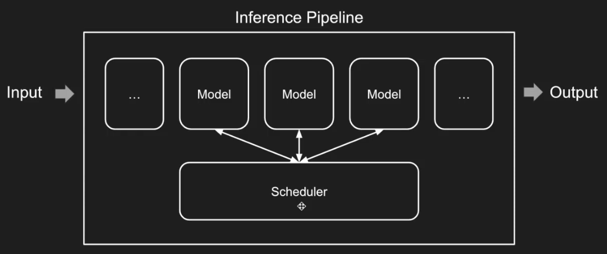
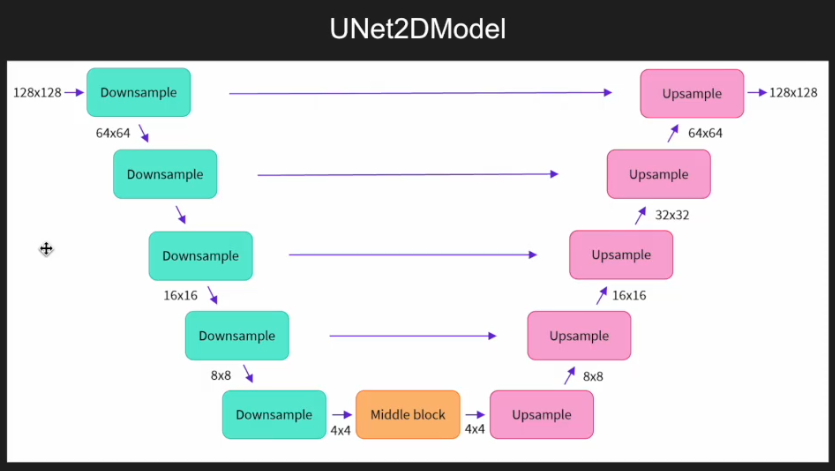

# Hugging Face Diffusers 实战教程·如何快速掌握生成式 AI

## 第一讲: Hello World!

- 时间: 2024.06.19
- 视频: [Bilibili](https://www.bilibili.com/video/BV1s1421r7Zg/)

---
### 扩散模型的现状

扩散模型的难点:
1. 相对新颖
2. 知识综合
3. 黑箱模型

Midjourney, Sora, Luma, Suno 等现有模型都基于扩散模型, 虽然应用很多, 但还没有达到极限.

扩散模型的局限性:
1. 精确性制约
2. Scaling Law 还未发生 (大算力, 更精确) → 自回归

用 AI 来模拟真实世界: 用成本较低的方式获得更多的经验. → 对扩散模型爆发的需求

---

Diffusers 是 HuggingFace 将扩散模型高度抽象化后的一个模型工具库, 将学习难度和开发成本降低.
做的最重要的事情是将基础的东西做了抽象和分层, 隐藏掉不需要了解的内容.

- 起源: OpenAI 的 [Guided Diffusion](https://github.com/openai/guided-diffusion)  → DALL-E
- 流行: [Stable Diffusion](https://github.com/CompVis/stable-diffusion) 
- 最新: Diffusers 沿用了 [HuggingFace/Transformers](https://github.com/huggingface/transformers) 的一些基础概念

目的: 用工程化的视角理解扩散模型

教程:
- 官方 Diffusers 实践资料: [Github](https://github.com/huggingface/diffusion-models-class)
- 哈佛公开课件: [PDF](https://scholar.harvard.edu/sites/scholar.harvard.edu/files/binxuw/files/stable_diffusion_a_tutorial.pdf)

---

需要注意的两个点:
- 从工程实践中学习, 先代码后理论
- 学 Diffusers 不只是学 Diffusers

Pipeline 是 Diffusers 库里生成图片的最大单位.
```
from diffusers import StableDiffusionPipeline

model_id = "sd-dreambooth-library/mr-potato-head"

pipe = StableDiffusionPipeline.from_pretrained(model_id, torch_dtype=torch.float16).to(device)

prompt = "an abstract oil painting of sks mr potato head by picasso"
image = pipe(prompt, num_inference_steps=50, guidance_scale=7.5).images[0]
```
- `from_pretrained`: 从 HuggingFace Hub 下载模型;
- `model_id` 为链接的后缀;

具体会根据模型的 `json` 文件初始化配置, 然后加载权重, 然后运行得到图片.

## 第二讲: Scheduler 和 Model

- 时间: 2024.07.11
- 视频: [Bilibili](https://www.bilibili.com/video/BV1YE421A7Jq/)

Pipeline 里有两个重要的组件: Scheduler 和 Model.
```
Input → Pipeline (Scheduler, ..., Models) → Output

noise_scheduler = DDPMScheduler(num_train_timesteps=1000)
model = UNet2DModel(...)
pipe = StableDiffusionPipeline.from_pretrained(model_id, noise_scheduler=noise_scheduler, unet=model)
```

以推理为例:



- Input: 输入的信息 (不一定是文字)
- Scheduler: 辅助信息处理, 控制信息的强弱和使用
- Model: 神经网络
- Output: 输出的图片

Diffusion 模型的简单理解:

1. 本质上仍是用神经网络来拟合 y=f(x);
2. 将噪声和图片构成对, 作为 x 和 y, 寻找它们的对应关系; (所以 Input 实际上是噪声, 而文本是用于引导的)
3. 不直接学习从噪声到图片的映射, 而是按每一步减一点噪声来学习. 即训练时不断加噪声最后变成白噪声, 推理时不断去掉噪声来生成图片.

所以推理 Pipeline 是输入白噪声, 然后通过多个 Model 逐步减去噪声, 用 Scheduler 控制具体的减去噪声的方案.

现在的大部分 Diffusion 模型都基于 U-Net.



- 既有大尺度信息又有小尺度信息.

---

Training Loop

目的: 训练神经网络, 利用从图像到噪声的过程.
前向传播, 得到预测结果, 再反向传播去调整模型权重.

Input (含原始图片信息) → Model → Prediction → Loss ← Target

- Initial Image
- Noise
- TimeSteps

根据时间步调用 Scheduler 给初始图片加噪声构造输入, 让神经网络预测, 和目标做对比, 计算损失.

---

<details>
<summary>Diffusion Pipeline 代码示例</summary

```python
#推理
from diffusers import DDPMPipeline

butterfly_pipeline = DDPMPipeline.from_pretrained(
    "johnowhitaker/ddpm-butterflies-32px",
).to(device)

images = butterfly_pipeline(batch_size=8).images
make_grid(images)
```

```python
#训练
import torchvision
from datasets import load_dataset
from torchvision import transforms

dataset = load_dataset("huggan/smithsonian_butterflies_subset", split="train")

#预处理
image_size = 32
batch_size = 64

preprocess = transforms.Compose([
    transforms.Resize((image_size, image_size)),
    transforms.RandomHorizontalFlip(),
    transforms.ToTensor(),
    transforms.Normalize([0.5], [0.5]),
])

def transform(example):
    images = [preprocess(image.convert("RGB")) for image in example["image"]]
    return {"image": images}

dataset.set_transform(transform)

# DataLoader
train_dataloader = torch.utils.data.DataLoader(
    dataset,
    batch_size=batch_size,
    shuffle=True,
)

# 打印
xb = next(iter(train_dataloader))["images"].to(device)[:8]
show_images(xb).resize((8*64, 64), resample=Image.NEAREST)
```

```python
# 定义 Scheduler
from diffusers import DDPMScheduler

noise_scheduler = DDPMScheduler(num_train_timesteps=1000)

plt.plot(noise_scheduler.alpha_cumprod.cpu() ** 0.5)
```

```python
timesteps = torch.linspace(0, 999, 8).long().to(device)
noise = torch.randn_like(xb)
noisy_xb = noise_scheduler.add_noise(xb, noise, timesteps)
show_images(noisy_xb).resize((8*64, 64), resample=Image.NEAREST)
```

```python
# 定义 Model
from diffusers import UNet2DModel

model = UNet2DModel(
    sample_size=image_size,  # the target image resolution
    in_channels=3,  # the number of input channels, 3 for RGB images
    out_channels=3,  # the number of output channels
    layers_per_block=2,  # how many ResNet layers to use per UNet block
    block_out_channels=(64, 128, 128, 256),  # More channels -> more parameters
    down_block_types=(
        "DownBlock2D",  # a regular ResNet downsampling block
        "DownBlock2D",
        "AttnDownBlock2D",  # a ResNet downsampling block with spatial self-attention
        "AttnDownBlock2D",
    ),
    up_block_types=(
        "AttnUpBlock2D",
        "AttnUpBlock2D",  # a ResNet upsampling block with spatial self-attention
        "UpBlock2D",
        "UpBlock2D",  # a regular ResNet upsampling block
    ),
)
model.to(device)
```

```python
with torch.no_grad():
    model_prediction = model(noisy_xb, timesteps).sample
model_prediction.shape
```

```python
noise_scheduler = DDPMScheduler(
    num_train_timesteps=1000, beta_schedule="squaredcos_cap_v2"
)

# Training loop
optimizer = torch.optim.AdamW(model.parameters(), lr=4e-4)

losses = []

for epoch in range(30):
    for step, batch in enumerate(train_dataloader):
        clean_images = batch["images"].to(device)
        # Sample noise to add to the images
        noise = torch.randn(clean_images.shape).to(clean_images.device)
        bs = clean_images.shape[0]

        # Sample a random timestep for each image
        timesteps = torch.randint(
            0, noise_scheduler.num_train_timesteps, (bs,), device=clean_images.device
        ).long()

        # Add noise to the clean images according to the noise magnitude at each timestep
        noisy_images = noise_scheduler.add_noise(clean_images, noise, timesteps)

        # Get the model prediction
        noise_pred = model(noisy_images, timesteps, return_dict=False)[0]

        # Calculate the loss
        loss = F.mse_loss(noise_pred, noise)
        loss.backward(loss)
        losses.append(loss.item())

        # Update the model parameters with the optimizer
        optimizer.step()
        optimizer.zero_grad()

    if (epoch + 1) % 5 == 0:
        loss_last_epoch = sum(losses[-len(train_dataloader) :]) / len(train_dataloader)
        print(f"Epoch:{epoch+1}, loss: {loss_last_epoch}")
```

</details>
