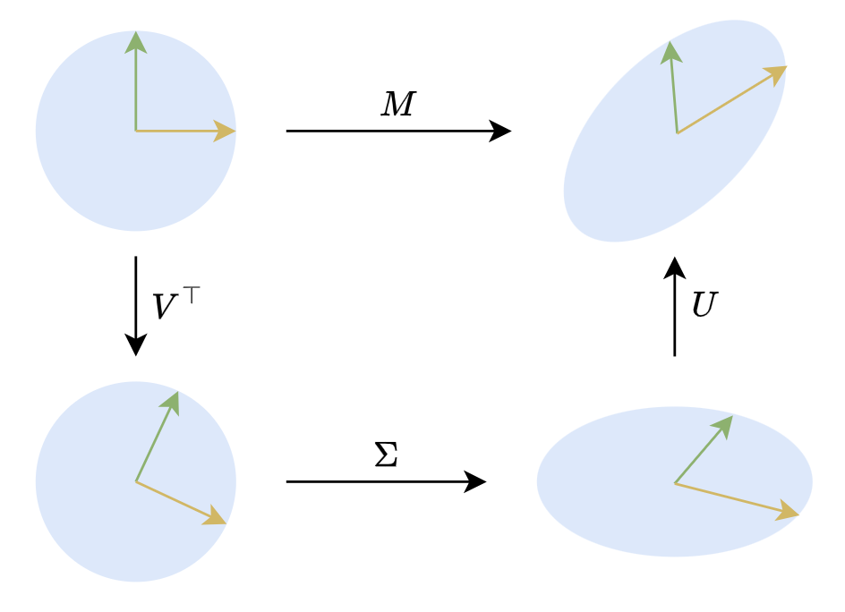

# 低秩近似之路

可能很多读者和笔者一样, 对矩阵的低秩近似有种熟悉而又陌生的感觉.
熟悉是因为低秩近似的概念和意义都不难理解, 加之目前诸如 LoRA 等基于低秩近似的微调技术遍地开花, 让低秩近似的概念在耳濡目染之间就已经深入人心.
然而低秩近似所覆盖的内容非常广, 在低秩近似相关的论文中时常能看到一些不熟悉但又让人叹为观止的新技巧, 这就导致了一种似懂非懂的陌生感.

因此, 在这个系列文章中, 笔者将试图系统梳理一下矩阵低秩近似相关的理论内容, 以补全对低秩近似的了解.

## 01. 伪逆 (Pseudo Inverse)

- 原文: <https://kexue.fm/archives/10366>
- 时间: 2024.09.16

**伪逆** 也称为 **广义逆 (Generalized Inverse)**, 顾名思义是"广义的逆矩阵". 它实际上是逆矩阵的概念对于不可逆矩阵的推广.

对于矩阵方程 $AB=M$, 如果 $A$ 是方阵且可逆, 那么直接得到 $B=A^{-1}M$.
可如果 $A$ 不可逆或者不是方阵呢? 这种情况下很可能找不到 $B$ 满足 $AB=M$.
此时如果还想继续求解, 通常是转化为优化问题:

$$
    \arg\min_{B} \| AB-M \|_F^2
$$

- $A\in\mathbb{R}^{n\times r}$, 
- $B\in\mathbb{R}^{r\times m}$, 
- $M\in\mathbb{R}^{n\times m}$,
- $\| \cdot \|_F^2$ 表示 F 范数 (Frobenius Norm), 用来衡量矩阵 $AB-M$ 与全零矩阵的距离, 其定义为:
  $$
    \| X\|_F^2 = \sqrt{\sum_{i}^{n}\sum_{j}^{m} X_{i,j}^2}
  $$

意思就是从求解精确的逆矩阵修改为最小化 $AB$ 和 $M$ 的平方误差.

本系列的主题是低秩近似, 所以假设 $r<< \min(n,m)$, 其机器学习意义就是通过低维的, 有损的输入矩阵 $A$ 和线性变换 $B$ 来重建完整的 $M$ 矩阵.

当 $m=n$ 且 $M$ 为单位矩阵时, 就得到一个只依赖于 $A$ 的结果, 记为:

$$
    A^\dagger = \arg\min_{B} \| AB-I_n \|_F^2
$$

它的作用类似于 $A$ 的逆矩阵, 所以称为 $A$ 的 (右) 伪逆.

类似地, 如果给定的是 $B$ 矩阵, 也可以将优化参数改为 $A$, 得到 $B$ 的 (左) 伪逆:

$$
    B^\dagger = \arg\min_{A} \| A B-I_n \|_F^2
$$

### 范数相关

正文

对于向量 $x=(x_1,\cdots,x_m)$, 其 $p$-范数定义为:

$$
    \| x \|_p = \left( \sum_{i=1}^m x_i^p \right)^{1/p}
$$

$p$-范数中最常见的就是 $p=2$ 的情形, 即常说的向量模长, 也叫**欧几里得范数**.
通常范数忽略下标时, 基本上就是默认 $p=2$.

对于矩阵, 至少有两种不同但都常用的范数:
其中一种就是 $F$ 范数, 它是将矩阵展平为向量来计算的范数:

$$
    \| X \|_F = \| \text{vec}(X)\|_2 = \sqrt{\sum_{i=1}^n\sum_{j=1}^m X_{i,j}^2}
$$

由于矩阵范数的多样性, 所以 $\|X\|_F$ 的下标通常不能省略, 避免引起混淆.

$F$ 范数是将矩阵当成向量然后照搬向量范数的定义而来的, 由此启发, 我们可以尝试把更多的向量运算搬到矩阵上.

例如内积:

$$
    \langle P,Q \rangle_F = \langle \text{vec}(P), \text{vec}(Q) \rangle = \sqrt{\sum_{i=1}^n\sum_{j=1}^m P_{i,j} Q_{i,j}}
$$

其中 $P$ 和 $Q$ 是 $n\times m$ 矩阵.

这称为矩阵 $P$ $Q$ 的 $F$ 内积 (Frobenius Inner Product). 它可以使用向量的迹运算来表示:

$$
    \langle P,Q \rangle_F = \text{Tr}(P^\top Q)
$$

这可以直接由矩阵乘法和迹的定义来证明.

> #TODO: 补充证明.

当 $P$, $Q$ 是由多个矩阵连乘而来时, 转换为等价的迹运算通常能帮助我们进行化简.

例如利用它可以证明正交变换不改变 $F$ 范数:
假设 $U$ 是一个正交矩阵, 可以有

$$
\begin{aligned}
    \| UM \|_F^2 &= \langle UM, UM \rangle_F \\
    &= \text{Tr}[(UM)^{\mathsf{T}}UM]\\
    &= \text{Tr}(M^{\mathsf{T}}U^{\mathsf{T}} UM)\\
    &= \text{Tr}(M^{\mathsf{T}}M)\\
    &= \| M \|_F^2
\end{aligned}
$$

 

### 矩阵求导

正文

对于一个优化目标, 最理想的结果自然是能够通过求导求出解析解.
可以发现对于前文定义的优化问题:

$$
    \arg\min_{B} \| AB-M \|_F^2
$$

其中 $AB-M$ 是关于 $B$ 的线性函数, 所以优化目标是关于 $A$ 或者 $B$ 的二次函数, 二次函数的最小值是有解析解的.

求出 $\mathcal{L}=\| AB-M \|_F^2$ 关于 $B$ 的导数, 由链式法则:

$$
    \dfrac{\partial \mathcal{L}}{\partial B_{i,j}} = \sum_{k,l} \dfrac{\partial \mathcal{L}}{\partial E_{k,l}}\dfrac{\partial E_{k,l}}{\partial B_{i,j}}
$$

其中 $\mathcal{L}=\|E\|_F^2=\sum_{i,j} E_{i,j}^2$, $E=AB-M$.

显然在求和的众多平方项中只有当 $(i,j)=(k,l)$ 时, 关于 $E_{k,l}$ 的偏导才非零, 其他项都为零.
所以 $\mathcal{L}$ 关于 $E_{k,l}$ 的导数就是 $E_{k,l}^2$ 关于 $E_{k,l}$ 的导数.
所以:

$$
    \dfrac{\partial \mathcal{L}}{\partial E_{k,l}} = 2E_{k,l} = 2[(\sum_{\alpha} A_{k,\alpha}B_{\alpha,l})-M_{k,l}]
$$

类似地, 只有当 $(\alpha,l)=(i,j)$ 时, 关于 $B_{i,j}$ 的导数才会产生非零的结果 $A_{k,i}$.
所以:

$$
    \dfrac{\partial E_{k,l}}{\partial B_{i,j}} = A_{k,i}\delta_{l,j}
$$

其中 $\delta_{l,j}$ 表示 Kronecker 符号, 表示只有当 $l=j$ 时值为 $1$, 否则为 $0$.

综上, 对于 $B_{i,j}$ 的导数:

$$
\begin{aligned}
    \dfrac{\partial \mathcal{L}}{\partial B_{i,j}} &= \sum_{k,l} \dfrac{\partial \mathcal{L}}{\partial E_{k,l}}\dfrac{\partial E_{k,l}}{\partial B_{i,j}}\\
    &= \sum_{k,l} 2E_{k,l} A_{k,i}\delta_{l,j}\\
    &= 2\sum_{k}E_{k,j}A_{k,i}
\end{aligned}
$$

如果我们约定, 标量对矩阵的梯度形状和矩阵形状本身一致, 那么上式右端项可以理解为 $A$ 的第 $i$ 行的转置乘以 $E$ 的第 $j$ 列, 可以写出:

$$
    \dfrac{\partial \mathcal{L}}{\partial B} = 2A^{\mathsf{T}}E = 2A^{\mathsf{T}}(AB-M)
$$

从直觉上, 按照通常的标量求导方式, $\mathcal{L}$ 关于 $B$ 的偏导数就是 $2(AB-M)$ 和 $A$ 的乘积.
又约定了 $\mathcal{L}$ 关于 $B$ 的偏导数的形状和 $B$ 形状一致, 即 $(r,m)$.
所以右端的两项 $2(AB-M)$ 为 $(n,m)$ 矩阵, 而 $A$ 为 $(n,r)$ 矩阵, 需要凑出一个 $(r,m)$ 的结果.

类似地, 可以得到 $\mathcal{L}$ 关于 $A$ 的偏导数:

$$
    \dfrac{\partial \mathcal{L}}{\partial A} = 2 (AB-M)B^{\mathsf{T}}
$$

 

### 基本结果

正文

现在求出了 $\mathcal{L}$ 关于 $B$ 和 $A$ 的偏导数, 让它们等于零便可以得到相应的最优解.

$$
    2A^{\mathsf{T}}(AB-M) = 0 \Rightarrow A^{\mathsf{T}}AB = A^{\mathsf{T}}M \Rightarrow B = (A^{\mathsf{T}}A)^{-1}A^{\mathsf{T}}M 
$$

$$
    2(AB-M)B^{\mathsf{T}} = 0 \Rightarrow ABB^{\mathsf{T}} = MB^{\mathsf{T}} \Rightarrow A = MB^{\mathsf{T}}(BB^{\mathsf{T}})^{-1}
$$

$M=I_n$ 代入, 得到:

$$
    A^{\dagger} = (A^{\mathsf{T}}A)^{-1}A^{\mathsf{T}}\\
    B^{\dagger} = B^{\mathsf{T}}(BB^{\mathsf{T}})^{-1}
$$

若 $A$ 或 $B$ 是可逆方阵, 那么可以容易证明伪逆就等于逆矩阵, 即 $A^\dagger=A^{-1}$ 和 $B^\dagger=B^{-1}$.

此外, 根据上式可以验证:

1. $(A^\dagger)^{\dagger}=A$, $(B^\dagger)^{\dagger}=B$ 即伪逆的伪逆等于原矩阵. 这意味着伪逆在作为近似逆矩阵的同时, 保全了自身的信息;
2. $(AA^\dagger) A = A$, $(B^\dagger B) B^\dagger= B^\dagger$, 即 $AA^\dagger$ 和 $B^\dagger B$ 虽然不是单位矩阵 $I$, 但对于 $A$ 和 $B^\dagger$ 来说, 它们起到了单位阵的作用.

矩阵的伪逆实际上是一个很宽泛的概念, 它有很多种不同形式.
这里介绍的伪逆实际上是最常见的 **Moore-Penrose 逆**, 除此之外还有 "Drazin 逆", "Bott-Duffin 逆" 等.
此处不做展开.

 

### 一般形式

正文

$$
    A^{\dagger} = (A^{\mathsf{T}}A)^{-1}A^{\mathsf{T}}\\
    B^{\dagger} = B^{\mathsf{T}}(BB^{\mathsf{T}})^{-1}
$$

这两个等式成立的关键前提是相应的 $A^{\mathsf{T}}A$ 和 $BB^{\mathsf{T}}$ 矩阵可逆.
但如果不可逆呢?

以 $A^\dagger$ 为例, 假设 $A^{\mathsf{T}}A\in \mathbb{R}^{r\times r}$ 不可逆, 那么意味着 $A$ 的秩不足 $r$, 即只能找到 $s<r$ 个列向量构成的极大线性无关组构成矩阵 $A_s \in \mathbb{R}^{n\times s}$.

那么 $A = A_s P$, 其中 $P\in \mathbb{R}^{s\times r}$ 是 $A_s$ 到 $A$ 的矩阵.

此时

$$
    \arg\min_{B} \| AB-I\|_F^2 = \arg\min_{B} \| A_s P B-I\|_F^2
$$

如果 $B$ 的最优解仍然记为 $A^\dagger$, 那么:

$$
    PA^\dagger = A_s^\dagger = (A_s^{\mathsf{T}}A_s)^{-1}A_s^{\mathsf{T}}
$$

此时的 $A_s$ 是 $s$ 满秩的, 所以 $A_s^{\mathsf{T}}A_s$ 是可逆的, 因此上式是良好定义的.

然而从 $A^\dagger$ 到 $PA^\dagger$ 是一个降维过程, 这意味着存在多个 $A^\dagger$ 使得 $PA^\dagger=A_s^\dagger$. 即最优解不唯一.

也就是说当 $A^{\mathsf{T}}A$ 不可逆时, 无法只凭借最小化优化目标 $\mathcal{L}$ 来确定唯一的伪逆 $A^\dagger$.

---

一个可能的思路时补充条件, 如 $(A^\dagger)^\dagger=A$ 或 $A^\dagger A A^\dagger=A^\dagger$, 结合 $PA^\dagger=A_s^\dagger$ 就能唯一确定 $A^\dagger$.

实际上可以用一个精妙的技巧更加优雅和统一地处理这个问题.

这个问题出在当 $A^{\mathsf{T}}A$ 不可逆时, 目标函数 $\mathcal{L}$ 不是严格正定的, 我们可以加上一个正则项来让它变得正定, 求出结果后再让正则项的权重趋于零:

$$
    A^\dagger = \lim_{\epsilon\to 0}\arg\min_{B} \|AB-I_n\|_F^2 + \epsilon \|B\|_F^2
$$

这里 $\epsilon>0$ 然后正向趋于 0.

由上式可以解得:

$$
    A^\dagger = \lim_{\epsilon\to 0}(A^{\mathsf{T}}A+\epsilon I_r)^{-1}A^{\mathsf{T}}
$$

当 $\epsilon>0$ 时, $A^{\mathsf{T}}A+\epsilon I_r$ 必然是可逆的. 因此上式是良好定义的.

由于 $\epsilon\to 0$ 时, 正则项可以忽略不计, 所以上述极限必然是存在的.
注意: 这里说的是整体极限的存在性, 当 $A^{\mathsf{T}}A$ 不可逆时, 极限 $\lim_{\epsilon\to 0}(A^{\mathsf{T}}A+\epsilon I_r)^{-1}$ 是不存在的, 只有乘上 $A^{\mathsf{T}}$ 后整体再取极限才是正常的.

上式作为伪逆的一般推广有什么优点呢?
1. 首先和先前求出的 $A^\dagger$ 表达式具有直观且形式一致的理论优雅性;
2. 其次, 形式上的一致性也使得 $A^{\mathsf{T}}A$ 可逆时 $A^\dagger$ 的一些性质得以保留, 从而在讨论 $A^\dagger$ 时无需考虑 $A^{\mathsf{T}}A$ 是否可逆.

 

### 数值计算

正文

如果直接将上式用于数值计算, 就必须取一个足够小的 $\epsilon$ 然后把 $(A^{\mathsf{T}}A+\epsilon I_r)^{-1}$ 计算出来, 这样必然会面对严重的数值不稳定性.
为了得到一个稳定的计算方式, 我们利用**实对称矩阵总可以正交对角化 (谱定理)** 这一特点, 对 $A^{\mathsf{T}}A$ 作如下分解:

$$
    A^{\mathsf{T}}A = U\Lambda U^{\mathsf{T}}
$$

其中 $U$ 是正交矩阵, $\Lambda=\text{diag}(\lambda_1,\dots,\lambda_r)$ 是特征值组成的对角矩阵.

由于 $A^{\mathsf{T}}A$ 的半正定性, 它的特征值总是非负的.
利用这个分解, 我们有

$$
\begin{aligned}
    (A^{\mathsf{T}}A+\epsilon I_r)^{-1}A^{\mathsf{T}} &= (U\Lambda U^{\mathsf{T}}+\epsilon I_r)^{-1}A^{\mathsf{T}}\\
    &= [U(\Lambda + \epsilon I_r) U^{\mathsf{T}}]^{-1}A^{\mathsf{T}}\\
    &= U (\Lambda + \epsilon I_r)^{-1} U^{\mathsf{T}} A^{\mathsf{T}}\\
\end{aligned}
$$

对于 $(\Lambda + \epsilon I_r)^{-1}$ 有

$$
    (\Lambda + \epsilon I_r)^{-1} = \text{diag}(\dfrac{1}{\lambda_1+\epsilon},\dots,\dfrac{1}{\lambda_r+\epsilon})
$$

如果 $\lambda_i>0$, 那么 

$$
    \lim_{\epsilon \to 0} (\lambda_i + \epsilon)^{-1} = \lambda_i^{-1}
$$

这是有限的结果, 不妨碍计算.

问题出现在 $\lambda_i=0$ 时,

$$
    \lim_{\epsilon \to 0} (\lambda_i + \epsilon)^{-1} = \lim_{\epsilon \to 0} \epsilon^{-1} \to \infty
$$

然而我们知道 $\epsilon\to 0$ 时正则项的影响就会消失, 所以断定极限必然不会出现无穷大值.
因此如果存在 $\lambda_i=0$, 那么右端所乘的 $U^{\mathsf{T}}A^{\mathsf{T}}$ 必然有办法抵消 $\epsilon^{-1}$ 趋于无穷大.
而能够抵消这种无穷大的只有乘以 0, 即

$$
    \lim_{\epsilon \to 0} \epsilon^{-1}\times 0 = 0
$$

也就是说 $\lambda_i=0$, 那么 $U^{\mathsf{T}}A^{\mathsf{T}}$ 给 $(\lambda_i+\epsilon)^{-1}$ 所乘的因子必然是 0.

既然如此由于 0 乘以任何数都为 0.
所以其实 $\lambda_i=0$ 时 $(\lambda_i + \epsilon)^{-1}$ 的取值并不重要, 所以可以简单地让它等于 0.

这样就得到了一种通用的计算 $A^\dagger$ 的计算方法:

$$
    A^\dagger = U \Lambda^\dagger U^{\mathsf{T}} A^{\mathsf{T}},\quad A^{\mathsf{T}}A = U\Lambda U^{\mathsf{T}}
$$

其中 $\Lambda^\dagger$ 表示对角线上的元素如果等于零则不变, 非零则取倒数.

这里让对角线为零的值不变主要是为了保持 $\Lambda^\dagger$ 和 $\Lambda$ 代入公式后的一致性.

$$
\begin{aligned}
    \Lambda^\dagger = \lim_{\epsilon\to 0}(\Lambda^{\mathsf{T}}\Lambda+\epsilon I_r)^{-1}\Lambda^{\mathsf{T}} = \text{diag}(k_1,\cdots,k_n), k_i = \begin{cases}
        \dfrac{1}{\lambda_i} & \lambda_i\neq 0\\
        0 & \lambda_i=0
    \end{cases}
\end{aligned}
$$

 

---

## 02. 奇异值分解 (Singular Value Decomposition, SVD) 

- 原文: https://kexue.fm/archives/10407
- 时间: 2024.10.01

伪逆关系到给定矩阵 $M$ 和 $A$ (或 $B$) 时优化目标 $\| AB - M \|_F^2$ 的最优解.
本篇则关注 $A$, $B$ 都不给出时的最优解, 即

$$
    \arg\min_{A,B} \| A B - M \|_F^2
$$

其中 $A\in \mathbb{R}^{n\times r}$, $B\in \mathbb{R}^{r\times m}$, $M\in \mathbb{R}^{n\times m}$.

即找到矩阵 $M$ 的最优 $r$ 秩近似 (秩不超过 $r$ 的最优近似).

### 结论初探

对于任意矩阵 $M\in \mathbb{R}^{n\times m}$, 都可以找到如下形式的奇异值分解 (Singular Value Decomposition, SVD):

$$
    M = U\Sigma V^{\mathsf{T}}
$$

其中 $U\in \mathbb{R}^{n\times n}$, $V\in \mathbb{R}^{m\times m}$, $\Sigma\in \mathbb{R}^{n\times m}$ 是非负对角矩阵, 

$$
    \Sigma_{i,j} = \begin{cases}
        \sigma_i & i=j\\
        0 & i\neq j
    \end{cases}
$$

对角线元素默认从大到小排序, 即 $\sigma_1\geq\sigma_2\geq\cdots\geq 0$.
这些对角线元素就称为奇异值 (Singular Value).

从数值计算角度看, 可以只保留 $\Sigma$ 中的非零元素, 将 $U, \Sigma, V$ 的大小降低到 $n\times r$, $r\times m$, $r\times m$. $r$ 为矩阵 $M$ 的秩. 但保留完整矩阵更易于理论分析.

SVD 对复矩阵同样成立, 但需要将正交矩阵改为酉矩阵, 转置改为共轭转置.
但本文主要关注与机器学习关系更为密切的实矩阵结果.

SVD 的基础理论包括存在性, 计算方法, 与最优低秩近似的练习等, 这些内容笔者后面都会给出自己的理解. #TODO

在二维平面下, SVD 有非常直观的几何意义.
二维的正交矩阵主要就是旋转 (还有反射, 但几何直观上可以不那么严谨), 所以 $Mx = U\Sigma V^{\mathsf{T}}x$ 就意味着任何对列向量 $x$ 的线性变换, 都可以分解为旋转+拉伸+旋转三个步骤.

### 一些应用

不管是理论分析还是数值计算, SVD 都有非常广泛的应用, 其背后的原理之一就是常用的矩阵/向量范数对正交变换具有不变性.
所以 SVD 左右两个正交矩阵夹着中间一个对角矩阵的特点, 往往能用来将很多矩阵相关的优化目标转换为等价的非负对角矩阵特例, 起到简化问题的作用.

#### 伪逆通解

先前求解伪逆的通解时:

$$
    A^\dagger = \arg\min_{B\in \mathbb{R}^{r\times n}} \|AB-I_n\|_F^2,\quad A\in \mathbb{R}^{n\times r}
$$

通过求导得到了 $A^\dagger$ 的表达式, 然后又推广到 $A$ 的秩小于 $r$ ($A^{\mathsf{T}}A$ 不可逆) 的情形.

但如果引入了 SVD, 那么问题就简化得多.
可以将 $A$ 分解为 $U\Sigma V^{\mathsf{T}}$, 然后将 $B$ 表示为 $VZU^{\mathsf{T}}$, 注意没有规定 $Z$ 是对角阵, 所以 $B=VZU^{\mathsf{T}}$ 是可以做到的.
因此

\[
    \begin{aligned}
        \min_{B} \| AB-I_n \|_F^2 &= \min_{Z} \| U\Sigma V^{\mathsf{T}} VZU^{\mathsf{T}} - I_n \|_F^2\\
        &= \min_Z \| U(\Sigma Z - I_n)U^{\mathsf{T}} \|_F^2\\
        &= \min_Z \| \Sigma Z - I_n \|_F^2\\
    \end{aligned}
\]

最后一个等号是基于 "正交变换不改变 $F$ 范数", 这样问题就简化为对角阵 $\Sigma$ 的伪逆.

下面用分块矩阵来表示 $\Sigma Z - I_n$:

\[
    \begin{aligned}
        \Sigma Z-I_n &= \begin{pmatrix}\Sigma_{[:r,:r]}\\ 0_{(n-r)\times r}\end{pmatrix} \begin{pmatrix}Z_{[:r,:r]} & Z_{[:r,r:]}\end{pmatrix} - \begin{pmatrix}I_r & 0_{r \times (n-r)}\\ 0_{(n-r)\times r} & I_{n-r}\end{pmatrix}\\
        &= \begin{pmatrix}\Sigma_{[:r,:r]}Z_{[:r,:r]}-I_r & \Sigma_{[:r,:r]}Z_{[:r,r:]}\\ 0_{(n-r)\times r} & -I_{n-r}\end{pmatrix}\\
    \end{aligned}
\]

从最后的形式可以看出, 要使得 $\Sigma Z-I_n$ 的 $F$ 范数最小, 唯一解 $Z_{[:r,:r]}=\Sigma_{[:r,:r]}^{-1}$, $Z_{[:r,r:]}=0_{r\times (n-r)}$.

即 $Z$ 就是 $\Sigma^{\mathsf{T}}$ 的非零元素都取倒数后转置, 记为 $\Sigma^\dagger$.

所以得到:

$$
    A = U\Sigma^\dagger V^{\mathsf{T}} \Rightarrow A^\dagger = V\Sigma^\dagger U^{\mathsf{T}}
$$

可以进一步证明这个结果也适用于秩小于 $r$ 的 $A$. 所以这是一个通用的形式, 一些教程也直接将之作为伪逆的定义.

此外, 还可以观察到这个形式不区分左伪逆和右伪逆, 这表明同一个矩阵的左伪逆和右伪逆是相等的.

#### 矩阵范数

利用 "正交变换不改变 $F$ 范数" 的结论, 还可以得到:

$$
    \| M\|_F^2 = \| U\Sigma V^{\mathsf{T}} \|_F^2 = \| \Sigma \|_F^2 = \sum_{i=1}^{\min (n,m)} \sigma_i^2
$$

也就是**奇异值的平方和等于 $F$ 范数的平方**.

除了 $F$ 范数, SVD 也可以用于计算谱范数. 谱范数是基于向量的范数诱导出来的谱范数, 定义为:

$$
    \| M\|_2 = \max_{\| x \| = 1} \| M x \|
$$

注意等号右端出现的范数都是向量范数 (模长, 2-范数), 因此上述定义是明确的.
由于它是向量的 2-范数诱导出来的, 所以它也称为矩阵的 2-范数.

数值上, 矩阵的谱范数等于它的最大奇异值, 即 $\| M \|_2 = \sigma_1$.

要证明这一点, 只需要将 $M$ 进行 SVD, 然后代入谱范数的定义:

$$
    \max_{\| x \| = 1} \| M x \| = \max_{\| x \| = 1} \| U\Sigma V^{\mathsf{T}} x \| = \max_{\| y\| = 1} \| \Sigma y \|
$$

第二个等号正是利用了 "正交矩阵不改变向量范数" 的特点.

现在相当于将问题简化为对角矩阵 $\Sigma$ 的谱范数, 这个较为简单, 设 $y=(y_1,\cdots,y_m)$, 那么

$$
    \| \Sigma y \|^2 = \sum_{i=1}^m \sigma_i^2 y_i^2 \leq \sum_{i=1}^m \sigma_1^2y_i^2 =\sigma_1^2 \sum_{i=1}^m y_i^2 = \sigma_1^2.
$$

所以 $\| \Sigma y \|$ 不超过 $\sigma_1$, 并且 $y=(1,0,\cdots,0)$ 时取到等号, 因此 $\| M \|_2 = \sigma_1$.

对比 $F$ 范数的结果, 还可以发现下述结论恒成立:

$$
    \| M\|_2 \leq \| M \|_F
$$

#### 低秩近似

回到最初求解 $M$ 的最优低秩近似, 将 $M$ 分解为 $U\Sigma V^{\mathsf{T}}$ 后, 可以写出:

\[
    \begin{aligned}
        \| AB-M \|_F^2 &= \| UU^{\mathsf{T}}AB VV^{\mathsf{T}} - U\Sigma V^{\mathsf{T}} \|_F^2\\
        &= \| U(U^{\mathsf{T}}AB V-\Sigma)V^{\mathsf{T}} \|_F^2\\
        &= \| U^{\mathsf{T}}AB V-\Sigma \|_F^2\\
    \end{aligned}
\]

注意 $U^{\mathsf{T}}AB V$ 仍可以代表任意秩不超过 $r$ 的矩阵, 所以通过 SVD 将矩阵 $M$ 的最优 $r$ 秩近似简化为非负对角矩阵 $\Sigma$ 的最优 $r$ 秩近似.

在 [系列-对齐全量微调 (1)](系列-对齐全量微调.md) 中用相同的思路求解过一个类似的优化问题:

引用

下面用 $G_0$ 代替 $\dfrac{\partial \mathcal{L}}{\partial W_0}$, 则目标函数可以写为:

$$
    \arg\min_{A_0,B_0}\left\| A_0 A_0^{\mathsf{T}} G_0 + G_0 B_0^{\mathsf{T}}B_0 - G_0 \right\|_F^2.
$$

当 $G_0$ 不是对角矩阵时, 将之进行 SVD 分解为 $U\Sigma V$, 其中 $U\in \mathbb{R}^{n\times n}, V\in \mathbb{R}^{m\times m}$ 为正交矩阵, $\Sigma\in \mathbb{R}^{n\times m}$ 为对角矩阵, 对角线元素非负且从大到小排列, 代入得到

$$
\begin{aligned}
    &\left\| A_0 A_0^{\mathsf{T}} G_0 + G_0 B_0^{\mathsf{T}}B_0 - G_0 \right\|_F^2\\
    =& \left\| A_0 A_0^{\mathsf{T}} U\Sigma V + U\Sigma V B_0^{\mathsf{T}}B_0 - U\Sigma V \right\|_F^2\\
    =& \left\| \textcolor{red}{U U^{\mathsf{T}}} A_0 A_0^{\mathsf{T}} U\Sigma V + U\Sigma V B_0^{\mathsf{T}}B_0 \textcolor{red}{V^{\mathsf{T}}V} - U\Sigma V \right\|_F^2\\
    =& \left\| \textcolor{red}{U}(\textcolor{red}{U^{\mathsf{T}}} A_0) (U^{\mathsf{T}}A_0)^{\mathsf{T}}\Sigma V + U\Sigma (B_0 V^{\mathsf{T}})^{\mathsf{T}}(B_0 \textcolor{red}{V^{\mathsf{T}}})\textcolor{red}{V} - U\Sigma V \right\|_F^2\\
    =& \left\| U \textcolor{cyan}{[}(\textcolor{red}{U^{\mathsf{T}}} A_0) (U^{\mathsf{T}}A_0)^{\mathsf{T}}\Sigma + \Sigma (B_0 V^{\mathsf{T}})^{\mathsf{T}}(B_0 \textcolor{red}{V^{\mathsf{T}}}) - \Sigma\textcolor{cyan}{]} V \right\|_F^2\\
    =& \left\| (\textcolor{red}{U^{\mathsf{T}}} A_0) (U^{\mathsf{T}}A_0)^{\mathsf{T}}\Sigma + \Sigma (B_0 V^{\mathsf{T}})^{\mathsf{T}}(B_0 \textcolor{red}{V^{\mathsf{T}}}) - \Sigma \right\|_F^2\\
\end{aligned}
$$

 

这将原本一般矩阵 $M$ 的优化问题转化为 $M$ 是非负对角矩阵的特例, 降低了分析难度.
若 $A,B$ 的秩不超过 $r$, 那么 $AA^{\mathsf{T}}M + MB^{\mathsf{T}}B$ 的秩顶多为 $2r$ (假设 $2r <\min (n,m)$), 所以原始问题也是求 $M$ 的最优 $2r$ 秩近似, 转化为求非负对角矩阵的最优 $2r$ 秩近似.

### 理论基础

在了解 SVD 的作用之后, 就需要补充一些理论证明.
- 首先确保 SVD 的存在性;
- 其次找出至少一种计算方案.

这样 SVD 的各种应用才算是切实可行的.
接下来用同一个过程将这两个问题一起解决.

#### 谱定理

首先需要引入一个"谱定理", 既可以说是 SVD 的特例, 也可以说是 SVD 的基础:

**谱定理: 对于任意实对称矩阵 $M\in \mathbb{R}^{n\times n}$, 都存在谱分解 (特征值分解) $M=U\Lambda U^{\mathsf{T}}$, $U\in \mathbb{R}^{n\times n}$ 为正交矩阵, $\Lambda\in \mathbb{R}^{n}$ 为对角矩阵.**

谱定理即断言任何实对称矩阵都可以被正交矩阵对角化, 这基于如下两点性质:
1. 实对称矩阵的特征值和特征向量都是实的;
2. 实对称矩阵的不同特征值对应的特征向量是正交的.

这两点性质的证明其实很简单, 此处不再展开 #TODO 补充证明.

基于这两点可以知道, 

1. 如果实对称矩阵 $M$ 有 $n$ 个不同的特征值, 那么谱定理成立:
   $$
    Mu_i =\lambda_i u_i \Rightarrow M(u_1,\cdots,u_n)=(u_1,\cdots,u_n)\text{diag}(\lambda_1,\cdots,\lambda_n)\Rightarrow MU = U\Lambda
   $$
2. 如何将结论扩展到有相等特征值的情形.
   在思考完整证明之前, 可以先从一个不严谨的角度理解, 这个不等特征值的结果是一定可以推广到一般情形的.
   从数值角度看, 两个实数绝对相等的概率几乎为零, 所以几乎不需要考虑特征值相等的情形;
   用更数学的话说, 就是特征值不等的实矩阵在全体实矩阵中稠密, 所以总可以找到一簇矩阵 $M_{\epsilon}$, 当 $\epsilon>0$ 时它的特征值两两不等, 当 $\epsilon\to 0$ 时它等于 $M$.
   但这样一来, 每个 $M_{\epsilon}$ 都可以进行特征值分解, 取 $\epsilon\to 0$ 就得到 $M$ 的谱分解.
   不幸的是, 上述这段话只能作为一个直观但不严谨的理解方式. 因为要将这段话转化为严格的证明还是很困难的.

事实上, 严格证明谱定理的最简单方法可能是数据归纳法, 即在任意 $n-1$ 阶实对称方阵都可以谱分解的假设上, 证明 $M$ 也可以谱分解.

证明的关键思路是将 $M$ 分解为某个特征向量及其 $n-1$ 维正交子空间, 从而可以应用归纳假设.
具体来说, 设 $\lambda_1$ 是 $M$ 的一个非零特征值, 对应的特征向量为 $u_1$, 那么有 $Mu_1=\lambda_1 u_1$, 可以补充 $n-1$ 个和 $u_1$ 正交的单位向量 $Q=(q_2,\cdots, q_n)$, 使得 $(u_1, Q)$ 成为一个正交矩阵.

现在考虑

$$
    \begin{pmatrix}u_1 & Q\end{pmatrix}^{\mathsf{T}} M \begin{pmatrix}u_1 &Q\end{pmatrix} = \begin{pmatrix}u_1^{\mathsf{T}}Mu_1 & u_1^{\mathsf{T}}MQ\\Q^{\mathsf{T}}Mu_1 & Q^{\mathsf{T}}MQ\end{pmatrix} = \begin{pmatrix}\lambda_1 & 0_{1\times (n-1)}\\0_{(n-1)\times 1} & Q^{\mathsf{T}}MQ\end{pmatrix}
$$

注意到 $Q^{\mathsf{T}}MQ$ 是 $n-1$ 阶方阵, 且明显是一个实对称矩阵, 根据假设可以谱分解为 $V\Lambda_2 V^{\mathsf{T}}$ (其中 $V$ 为 $n-1$ 维正交矩阵), 于是有:

$$
    (QV)^{\mathsf{T}} M QV = \Lambda_2
$$

根据这个结果, 可以考虑 $U=(u_1,QV)$, 可以验证它也是一个正交矩阵, 并且:

$$
    U^{\mathsf{T}} M U = \begin{pmatrix}u_1 & QV\end{pmatrix}^{\mathsf{T}} M \begin{pmatrix}u_1 &QV\end{pmatrix} = \begin{pmatrix}\lambda_1 & 0_{1\times (n-1)}\\0_{(n-1)\times 1} & \Lambda_2 \end{pmatrix}
$$

也就是 $U$ 正是可以将 $M$ 对角化的正交矩阵, 即 $M$ 可以完成谱分解. 从而完成了数学归纳法最关键的一步.

#### 奇异分解

在完成了谱定理的证明后, 可以正式证明 SVD 的存在性, 并给出一个实际计算的方案.

不难发现谱分解和 SVD 之间的相似性, 但也有两点明显的区别:
1. 谱分解只适用于实对称矩阵, SVD 适用于任意实矩阵;
2. SVD 的对角阵 $\Sigma$ 是非负的, 但谱分解的 $\Lambda$ 未必.

他们的具体联系在于, 若 $M$ 的 SVD 为 $U\Sigma V^{\mathsf{T}}$, 那么:

$$
    MM^{\mathsf{T}} = U\Sigma V^{\mathsf{T}}V\Sigma^{\mathsf{T}}U^{\mathsf{T}} = U\Sigma \Sigma^{\mathsf{T}}U^{\mathsf{T}} 
$$

$$
    M^{\mathsf{T}}M = V\Sigma^{\mathsf{T}}U^{\mathsf{T}}U\Sigma V^{\mathsf{T}} = V\Sigma^{\mathsf{T}}\Sigma V^{\mathsf{T}}
$$

注意 $\Sigma \Sigma^{\mathsf{T}}$ 和 $\Sigma^{\mathsf{T}} \Sigma$ 都是对角矩阵, 所以这意味着 $MM^{\mathsf{T}}$ 的谱分解为 $U\Sigma\Sigma^{\mathsf{T}}U^{\mathsf{T}}$, 而 $M^{\mathsf{T}}M$ 的谱分解为 $V\Sigma^{\mathsf{T}}\Sigma V^{\mathsf{T}}$.

这看起来将 $MM^{\mathsf{T}}$ 和 $M^{\mathsf{T}}M$ 分别做谱分解就可得到 $M$ 的 SVD 了?
确实如此, 这可以作为 SVD 的一种计算方式, 但无法直接通过它证明这样得出的 $U,\Sigma,V$ 满足 $M=U\Sigma V^{\mathsf{T}}$.

解决问题的关键是只对 $MM^{\mathsf{T}}$, $M^{\mathsf{T}}M$ 之一做谱分解, 然后通过另外的方法构造另一侧的正交矩阵.

不失一般性, 我们设 $M$ 的秩为 $r\leq m$, 考虑对 $M^{\mathsf{T}}M$ 做谱分解 $V\Lambda V^{\mathsf{T}}$, 注意 $M^{\mathsf{T}}M$ 是一个半正定矩阵, 所以 $\Lambda$ 是非负的, 并且假设对角线元素已经从大到小排列, 秩 $r$ 意味着只有前 $r$ 个 $\lambda_i$ 大于零.

我们定义:

$$
    \Sigma_{[:r,:r]} = (\Lambda_{[:r,:r]})^{1/2}, \quad U_{[:n,:r]}=MV_{[:m,:r]}\Sigma_{[:r,:r]}^{-1}
$$

可以验证:

$$
    \begin{aligned}
        U_{[:n,:r]}^{\mathsf{T}}U_{[:n,:r]}
        &=(MV_{[:m,:r]}\Sigma_{[:r,:r]}^{-1})^{\mathsf{T}}(MV_{[:m,:r]}\Sigma_{[:r,:r]}^{-1})\\
        &=\Sigma_{[:r,:r]}^{-1}V_{[:m,:r]}^{\mathsf{T}}M^{\mathsf{T}}MV_{[:m,:r]}\Sigma_{[:r,:r]}^{-1}\\
        &=\Sigma_{[:r,:r]}^{-1}V_{[:m,:r]}^{\mathsf{T}}V\Lambda V^{\mathsf{T}}V_{[:m,:r]}\Sigma_{[:r,:r]}^{-1}\\
        &=\Sigma_{[:r,:r]}^{-1}I_{[:r,:m]}\Lambda I_{[:m,:r]}\Sigma_{[:r,:r]}^{-1}\\
        &=\Sigma_{[:r,:r]}^{-1}\Lambda_{[:r,:r]}\Sigma_{[:r,:r]}^{-1}\\
        &=I_r
    \end{aligned}
$$

也就是说 $U_{[:n,:r]}$ 是正交矩阵的一部分.

接着我们有:

$$
    U_{[:n,:r]}\Sigma_{[:r,:r]}V_{[:m,:r]}^{\mathsf{T}}
    = [M V_{[:m,:r]}\Sigma_{[:r,:r]}^{-1}]\Sigma_{[:r,:r]}V_{[:m,:r]}^{\mathsf{T}}=MV_{[:m,:r]}V_{[:m,:r]}^{\mathsf{T}}
$$

注意到 $MVV^{\mathsf{T}}=M$, 而 $V_{[:m,:r]}$ 是 $V$ 的前 $r$ 列. 

根据 $M^{\mathsf{T}}M=V\Lambda V^{\mathsf{T}}$ 有 $(MV)^{\mathsf{T}} MV=\Lambda$

记 $V=(v_1,\cdots, v_m)$, 那么有 $\| Mv_i \|^2=\lambda_i$, 当 $i>r$ 时 $\lambda_i=0$, 此时 $Mv_i$ 为零向量.

所以 $M=MVV^{\mathsf{T}}=MV_{[:m,:r]}V_{[:m,:r]}^{\mathsf{T}}$, 即 $U_{[:n,:r]}\Sigma_{[:r,:r]}V_{[:m,:r]}^{\mathsf{T}} = M$.

这表明已经得到了 M 的 SVD 关键部分, 只需要将相应矩阵补零成相应大小, 就得到了完整的 SVD 形式.

### 近似定理

最后回到求 $M$ 的最优低秩近似问题.

**如果 $M\in \mathbb{R}^{n\times m} = U\Sigma V^{\mathsf{T}}$, 那么 $M$ 的最优 $r$ 秩近似为 $U_{[:n,:r]}\Sigma_{[:r,:r]}V_{[:m,:r]}^{\mathsf{T}}$**

这称为 **Eckart-Young-Mirsky 定理**.

前面低秩近似小节中知道可以通过 SVD 将一般矩阵的最优 $r$ 秩近似简化为非负对角矩阵的 $r$ 秩近似, 所以上述定理相当于说非负对角矩阵的最优 $r$ 阶近似就是只保留对角线最大的 $r$ 个元素的矩阵.
虽然结论很符合直觉, 但它确实不是显然成立的. #TODO ?

下面我们聚焦于求解:

$$
    \min_{A,B}\|AB-\Sigma \|_F^2
$$

若给定 $A$, 那么 $B=A^\dagger \Sigma$, 所以有:

$$
    \min_{A,B} \| AB-\Sigma \|_F^2 = \min_{A}\| (AA^\dagger -I_n)\Sigma \|_F^2
$$

设 $A=U_A\Sigma_A V_A^{\mathsf{T}}$, 则 $A^\dagger=V_A\Sigma_A^\dagger U_A^{\mathsf{T}}$, 所以:

$$
    \begin{aligned} 
    \Vert (AA^{\dagger} - I_n)\Sigma\Vert_F^2 =&\, \Vert (U_A\Sigma_A V_A^{\mathsf{T}}V_A \Sigma_A^{\dagger} U_A^{\mathsf{T}} - I_n)\Sigma\Vert_F^2 \\ 
    =&\, \Vert (U_A\Sigma_A \Sigma_A^{\dagger} U_A^{\mathsf{T}} - I_n)\Sigma\Vert_F^2 \\ 
    =&\, \Vert U_A (\Sigma_A \Sigma_A^{\dagger} - I_n)U_A^{\mathsf{T}}\Sigma\Vert_F^2 \\ 
    =&\, \Vert (\Sigma_A \Sigma_A^{\dagger} - I_n)U_A^{\mathsf{T}}\Sigma\Vert_F^2 \\ 
    \end{aligned}
$$

由伪逆的计算公式知道 $\Sigma_A\Sigma_A^\dagger$ 是一个对角阵, 并且对角线上前 $r_A$ 个元素为 1, 其余为 0.
所以 $(\Sigma_A \Sigma_A^{\dagger} - I_n)U_A^{\mathsf{T}}$ 相当于只保留了 $U_A^{\mathsf{T}}$ 的后 $k=n-r_A$ 行, 最终可以简化为:

$$
    \min_{A}\| (AA^\dagger -I_n)\Sigma \|_F^2 = \min_{k,U} \| U\Sigma \|_F^2
$$

根据 $F$ 范数定义可以写出

$$
    \Vert U\Sigma\Vert_F^2=\sum_{i=1}^k \sum_{j=1}^n u_{i,j}^2 \sigma_j^2 =\sum_{j=1}^n \sigma_j^2 \underbrace{\sum_{i=1}^k u_{i,j}^2}_{w_j}=\sum_{j=1}^n \sigma_j^2 w_j
$$

注意到 $w_j\in [0,1]$ 且 $\sum w_j = k$, 在此约束下右端的最小值只能是最小的 $k$ 个 $\sigma_j^2$ 之和, 又因为 $\sigma_j$ 已经降序排列.
所以:

$$
    \min_{k,U}\Vert U\Sigma\Vert_F^2=\min_k \sum_{j=n-k+1}^n \sigma_j^2 = \sum_{j=r+1}^n \sigma_j^2
$$

也就是 $\Sigma$ 与其最优 $r$ 秩近似的误差 ($F$ 范数平方) 是 $\sum_{j=r+1}^n \sigma_j^2$. 这正好是保留对角线最大的 $r$ 个元素后所产生的误差.

所以我们证明了 "非负对角阵的最优 $r$ 阶近似就是只保留对角线最大的 $r$ 个元素的矩阵".
当然这只能说是一个解, 并没有否定多解的可能性.

值得指出的一点是, Eckart-Young-Mirsky 定理不仅对 $F$ 范数成立, 对谱范数也成立, 后者的证明甚至更简单一点. 可以参阅[维基百科](https://en.wikipedia.org/wiki/Low-rank_approximation).

