# 细水长 Flow 系列

## NICE · 流模型的基本概念与实现

时间: 2018-08-11
链接: [原文](https://spaces.ac.cn/archives/5776)

动机: 机器之心的报道 [下一个 GAN? OpenAI 提出可逆生成模型 Glow](https://www.jiqizhixin.com/articles/2018-07-10-6)

本文主要是 [NICE: Non-Linear Independent Components Estimation](https://arxiv.org/abs/1410.8516) 的介绍和实现.
这篇文章也是 Glow 这个模型的基础文章之一, 可以说它就是 Glow 的奠基石.

总所周知, 当前主流的生成模型包括 VAE 和 GAN, 但事实上除了这两个之外, 还有基于 Flow 的模型.
事实上, Flow 的历史和 VAE, GAN 一样悠久, 但却鲜为人知.
在笔者看来, 大概原因是 Flow 找不到像 GAN 一样的诸如 "造假者-鉴别者" 的直观解释, 因为 Flow 整体偏数学化, 加上早期效果没有特别好但计算量又特别大, 所以很难让人提起兴趣.
不过现在看来, OpenAI 的这个好得让人惊叹的, 基于 Flow 的 Glow 模型, 估计会让更多的人投入到 Flow 模型的改进中.

生成模型的本质就是希望用一个我们知道的概率模型来拟合所给定的数据样本, 即得到一个带有参数 $\theta$ 的分布 $q_{\theta}(x)$.
然而神经网络只是万能函数逼近器, 而不是万能分布拟合器, 即原则上能够拟合任意函数, 但却不能随意拟合一个概率分布, 因为概率分布具有非负和归一化的要求.
这样一来, 能够直接写出来的只有离散型分布或连续型高斯分布.

当然从最严格的角度来看, 图像应该是一个离散的分布, 因为它是由有限个像素组成的, 而每个像素的取值也是离散有限的, 因此可以通过离散分布来描述.
这个思路的成果就是 PixelRNN 这一类模型, 称之为自回归.
其特点是无法并行, 所以计算量特别大.

所以我们更希望用连续分布来描述图像.
当然图像只是一个场景, 其他场景下也有很多连续型的数据, 所以连续型的分布的研究是很有必要的.

那么问题是对于连续型的, 也就只能写出高斯分布了, 而且很多时候为了方便处理, 只能写出各个分量独立的高斯分布, 这显然只是众多连续分布中极小的一部分, 显然是不够用的.
为了解决这个困境, 我们通过积分来创造更多的分布:

$$
    q(x) =\int q(z)q(x|z)\text{d}z. \tag{01}
$$

这里的 $q(z)$ 一般是标准高斯分布, 而 $q_{\theta}(x|z)$ 可以选择任意的条件高斯分布或狄拉克分布.
这样的积分形式可以形成很多复杂的分布.
理论上讲, 它能拟合任意分布.

有了分布形式, 需要求出参数 $\theta$, 一般使用最大似然.
假设真实数据分布为 $\tilde{p}(x)$, 那么需要最大化目标:

$$
    \mathbb{E}_{x\sim\tilde{p}(x)} [\log q(x)]\tag{02}
$$

然而 $q(x)$ 是积分形式的, 能不能计算出来很难说.

于是就出现了各种方法, VAE 和 GAN 在不同方向上避开了这个困难.
- VAE 没有直接优化目标 (02), 而是优化一个更强的上界, 这使得它只能是一个近似模型, 无法达到良好的生成效果.
- GAN 通过交替训练的方式绕开了这个困难, 保留了模型的精确性, 所以才能有较好的生成效果. 但也有自己的缺点.

### 基本思想

Flow 模型选择了一条硬路: 直接把积分算出来.

据来说, Flow 选择 $q(x|z)$ 为狄拉克分布 $\delta(x-g(z))$, 且 $g(z)$ 必须是可逆的, 即

$$
    x = g(z) \lrArr z = f(x)\tag{03}
$$

要从理论上实现可逆, 那么要求 $z$ 和 $x$ 的维度一致.
假设 $f$ $g$ 的形式已知, 那么通过方程 (01) 计算 $q(x)$ 相当于对 $q(z)$ 做一个积分变换 $z=f(x)$.

如标准正态分布
$$
    q(z) = \dfrac{1}{(2\pi)^{D/2}}\exp(-\dfrac{\|z\|^2}{2}),\tag{04}
$$

进行变换 $z=f(x)$.
此时概率密度函数的变量替换不是简单地将 $z$ 替换为 $f(x)$, 还多出了一个雅可比行列式的绝对值, 即

$$
    q(x) = \dfrac{1}{(2\pi)^{D/2}} \exp(-\dfrac{\|f(x)\|^2}{2})\left|\text{det}[\dfrac{\partial f}{\partial x}]\right|\tag{05}
$$

> #TODO 补充证明

这样对 $f$ 就有了两点要求:
1. 可逆, 并且易于求逆函数 ($g: z\to x$ 就是所需的生成模型);
2. 对应的雅可比行列式容易计算.

此时的优化目标为

$$
\begin{aligned}
    \log q(x) 
    &= \log \dfrac{1}{(2\pi)^{D/2}} \exp(-\dfrac{\|f(x)\|^2}{2})\left|\text{det}[\dfrac{\partial f}{\partial x}]\right|\\
    &= \log\dfrac{1}{(2\pi)^{D/2}} + \log \exp(-\dfrac{\|f(x)\|^2}{2}) + \log \left|\text{det}[\dfrac{\partial f}{\partial x}]\right|\\
    &= -\dfrac{D}{2}\log 2\pi - \dfrac{1}{2}\|f(x)\|^2 + \log \left|\text{det}[\dfrac{\partial f}{\partial x}]\right|
\end{aligned}\tag{06}
$$

这个优化目标是可以求解的.
并且由于 $f$ 容易求逆, 因此一旦训练完成, 就可以随机采样一个 $z$, 然后通过 $f$ 的逆函数 $g$ 来生成一个样本 $f^{-1}(z)=g(z)$, 这就得到了生成模型.

### 分块耦合

下面详细介绍 Flow 模型是如何针对难点来解决问题的.

相对而言, 行列式的计算要比函数求逆困难.
因此我们从要求 2 出发.

由于三角矩阵的行列式最容易计算, 因为三角矩阵的行列式等于对角元的乘积.
所以我们要办法使得变换 $f$ 的雅可比矩阵是三角矩阵.

NICE 的做法很精巧, 它将 $D$ 维度的 $x$ 分为两个部分 $x_1$ 和 $x_2$, 然后进行下述变换:

$$
    h_1 = x_1,\quad h_2 = x_2+m(x_1), \tag{07}
$$

其中 $x_1$ 和 $x_2$ 是 $x$ 的某种划分, $m$ 是 $x_1$ 的任意函数.
也就是将 $x$ 分为两部分, 然后按照上述公式进行变换, 得到新的变量 $h$, 这部分我们称为**加性耦合层 (Additive Coupling)**.

不失一般性, 可以将 $x$ 各个维度进行重排, 使得 $x_1=x_{1:d}$ 为前 $d$ 个元素, $x_2=x_{d+1:D}$ 为 $d+1\sim D$ 个元素.

不难看出, 这个变换的雅可比矩阵 $[\dfrac{\partial h}{\partial x}]$ 是一个三角矩阵, 而且对角线全部为 1, 用分块矩阵表示为

$$
    [\dfrac{\partial h}{\partial x}] = \begin{bmatrix}
        I_{1:d} & O \\
        \dfrac{\partial m}{\partial x_1} & I_{d+1:D}
    \end{bmatrix}\tag{08}
$$

这样得到的变换 $f$ 对应的雅可比行列式为 1, 其对数为 0, 就解决了要求 2.

同时公式 (07) 也是可逆的, 逆变换为

$$
    x_1 = h_1, x_2 = h_2-m(h_1), \tag{09}
$$

上面的变换让人十分惊喜: 可逆, 且逆变换也很简单, 并没有增加额外的计算量.
但是可以留意到公式 (07) 定义的变换的第一部分是平凡的 (恒等变换), 因此单个变换并不能获得很强的非线性, 所以需要多个简单变换的复合, 以达到强非线性, 增强拟合能力.

$$
    x=h^{(0)}\lrarr h^{(1)}\lrarr h^{(2)}\lrarr \cdots \lrarr h^{(n-1)}\lrarr h^{(n)}=z\tag{10}
$$

其中每个变换都是加性耦合层.
这就好比流水一般, 积少成多, 细水长流, 所以这样的一个流程称为一个流 (Flow).

根据链式法则:

$$
    [\dfrac{\partial z}{\partial x}] = [\dfrac{\partial h^{(n)}}{\partial h^{(0)}}]=\cdots=[\dfrac{\partial h^{(n)}}{\partial h^{(n-1)}}][\dfrac{\partial h^{(n-1)}}{\partial h^{(n-2)}}]\cdots[\dfrac{\partial h^{(1)}}{\partial h^{(0)}}].\tag{11}
$$

因为矩阵乘积的行列式等于矩阵行列式的乘积, 而每一层都是加性耦合层, 所以结果

$$
    \text{det}[\dfrac{\partial z}{\partial x}] = 1
$$

注: 考虑到后续介绍的交错, 行列式可能为 -1, 但绝对值依然为 1.

### 交错前进

可以发现如果耦合的顺序一直不变, 即

$$
\begin{aligned}
    &x_1 \to h_1^{(1)} \to h_1^{(2)} \to \cdots \to h_1^{(n-1)} \to z_1;\\
    &x_2+m_1(x_1) \to h_2^{(1)} + m_2(h_1^{(1)})\to \cdots \to h_2^{(n-1)} + m_n(h_1^{(n-1)}) \to z_2.
\end{aligned}\tag{12}
$$

那么最后 $z_1=x_1$, 第一部分依然是平凡的.

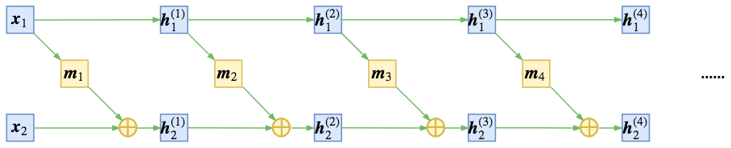

简单的耦合使得其中一部分仍然保持恒等, 信息没有充分混合.

那么为了得到不平凡的变换, 可以考虑在每次进行加性耦合前, 打乱或者反转输入的各个维度的顺序, 或者简单地直接交换这两部分的位置, 使得信息可以充分混合, 以达到更强的非线性.

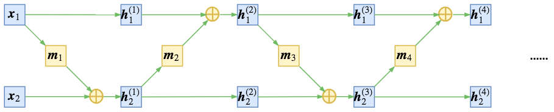

### 尺度变换

Flow 是基于可逆变换的, 所以当模型训练完成后, 同时得到一个生成模型和编码模型.
但正因为是可逆变换, 随机变量 $z$ 和输入样本 $x$ 具有相同的维度 $D$.
当指定 $z$ 服从高斯分布时, 它是遍布整个 $D$ 维空间的, 而虽然 $x$ 具有 $D$ 维大小, 但却未必是遍布整个 $D$ 维空间.
例如 MNIST 图像虽然有 784 个像素, 但有些像素不管在训练集还是在测试集都一直保持为 0, 这说明它远远没有 784 维那么大.

所以, Flow 这种基于可逆变换的模型, 天生就存在比较严重的维度浪费问题: 输入数据不是 D 维流形却编码为一个 D 维流形.

为了解决这个情况, NICE 引入了尺度变换层, 它对最后编码出来的每个维度的特征都做了尺度变换, 即 $z=s\otimes h^{(n)}$, 其中 $s=(s_1,\cdots s_D)$ 是一个需要优化的非负的参数向量, 这个向量能识别该维度的重要程度, 值越小表明越重要, 从而起到压缩流形的作用.

注意这个尺度变换层的雅可比行列式不再是 1 了, 可以计算出它的雅可比矩阵为对角阵:
$$
    [\dfrac{\partial z}{\partial x}] = \text{diag}(s)\tag{14}
$$

所以行列式为 $\prod_{i} s_i$.

根据公式 (06), 有对数似然:

$$
\begin{aligned}
    \log q(x) 
    &\sim - \dfrac{1}{2}\|s\otimes f(x)\|^2 + \log \left|\text{diag}(s)\right|\\
    &= -\dfrac{1}{2}\|s\otimes f(x)\|^2 + \sum_{i} \log s_i\\
\end{aligned}\tag{15}
$$

为什么这个尺度变换能够识别维度的重要程度呢?
其实这个尺度变换可以用一种更加清晰的方式描述:

开始的时候设 $z$ 的先验分布为标准正态分布, 即各个方差都为 1.
事实上, 可以将先验分布的方差作为训练参数, 训练后得到的方差大小不一.
而方差越小说明该维度的弥散程度越低, 如果方差为 0, 则该维度恒为均值 0, 该维度的分布也就坍缩为一个点, 从而流形少了一个维度.

不同于方程 (04), 写出带有方差的正态分布:

$$
    q(z) = \dfrac{1}{(2\pi)^{D/2}\prod_{i=1}^D \sigma_i} \exp(-\dfrac{1}{2}\sum_{i=1}^{D}\dfrac{z_i^2}{\sigma_i^2})\tag{16}
$$

将流形 $z=f(x)$ 代入, 然后取对数, 得到

$$
    \log q(x) \sim - \dfrac{1}{2}\sum_{i=1}^{D}\dfrac{f_i^2(x)}{\sigma_i^2} - \sum_{i=1}^{D}\log \sigma_i,\tag{17}
$$

对比一下方程 (15) 和方程 (17), 就有 $s_i=1/\sigma_i$.

所以尺度变换层等价于将先验分布的方差作为训练参数, 如果方差足够小就可以认为该维度所表示的流形坍缩为一个点, 从而总体流形的维度减一, 暗含了降维的可能.

### 特征解耦

将先验分布定义为各个分量相互独立的高斯分布, 除了采样方便还有什么好处呢?

在 Flow 模型中, $f^{-1}=g$ 是生成模型用于随机生成样本, 那么 $f$ 本身就是编码器.
但是不同于普通神经网络中的自编码器强迫低维重建高维来提取有效信息的做法, Flow 模型是完全可逆的, 那么就不存在信息损失的问题, 那么这个编码器还有什么价值呢.

这就涉及到"什么是好的特征"的问题了. 一个好的特征, 理想情况下各个维度之间应该是相互独立的, 实现了特征的解耦, 使得每个维度都有自己独立的含义.

由于各个分量的独立性, 有理由说当我们用 $f$ 对原始特征进行编码时, 输出的编码特征 $z$ 的各个维度是解耦的.
NICE 的全称 Non-Linear Independent Components Estimation, 非线性独立成分估计, 就是这个含义.

反过来, 由于 $z$ 每个维度的独立性, 理论上控制改变单个维度时, 就可以看出生成图像是如何随着该维度的改变而改变, 从而发现该维度的含义.

类似地, 也可以对两幅图像的编码进行插值, 得到过渡自然的生成样本, 这些在后面发展起来的 Glow 模型中体现得很充分.


### 实验复现

Keras + MNIST 数据集复现.

总结一下 NICE 模型, 它是 Flow 模型的一种, 由多个加性耦合层组成, 每个加性耦合层在耦合前需要反转输入的维度, 使得信息充分混合, 最后一层增加一个尺度缩放曾, 最后的损失函数是公式 (15) 的相反数.

加性耦合层需要将输入分为两部分, NICE 采用交错分区, 即下标为偶数的为第一部分, 下标为奇数的为第二部分, 而每个 $m(x)$ 则简单地使用多层全连接 (5 隐藏层×1000 神经元 + ReLU 激活).
NICE 中一共耦合了四个加性耦合层.

输入数据将 0~255 的图像像素压缩为 0~1, 然后给输入加上服从 `[-0.01,0]` 上均匀分布的噪声.
噪声的加入能有效地防止过拟合, 提高生成的图片质量.
也可以看成缓解维度浪费问题的一个措施, 因为 MINST 图像没办法充满 784 维, 但算上噪声维度就增加了.

虽然从损失函数看选择各种噪声的效果应该都差不多, 但选择这个噪声区间而不是 `[0,0.01]` 或 `[-0.05,0.05]` 的原因是加入噪声后理论上生成的图片也会含有噪声, 这不是我们希望的, 而加入负噪声, 会让最终生成的图片的像素稍微偏向负区间, 然后裁剪就能去掉一部分噪声, 这是针对 MNIST 的一个小技巧.

代码链接为: https://github.com/bojone/flow/blob/master/nice.py

<details>

<summary>完整代码</summary>

```python
#! -*- coding: utf-8 -*-
# Keras implement of NICE (Non-linear Independent Components Estimation)
# https://arxiv.org/abs/1410.8516

from keras.layers import *
from keras.models import Model
from keras.datasets import mnist
from keras import backend as K
from keras.callbacks import ModelCheckpoint
import imageio

(x_train, y_train), (x_test, y_test) = mnist.load_data()

image_size = x_train.shape[1]
original_dim = image_size * image_size
x_train = np.reshape(x_train, [-1, original_dim])
x_test = np.reshape(x_test, [-1, original_dim])
x_train = x_train.astype('float32') / 255
x_test = x_test.astype('float32') / 255

class Shuffle(Layer):
    """打乱层，提供两种方式打乱输入维度
    一种是直接反转，一种是随机打乱，默认是直接反转维度
    """
    def __init__(self, idxs=None, mode='reverse', **kwargs):
        super(Shuffle, self).__init__(**kwargs)
        self.idxs = idxs
        self.mode = mode
    def call(self, inputs):
        v_dim = K.int_shape(inputs)[-1]
        if self.idxs == None:
            self.idxs = list(range(v_dim))
            if self.mode == 'reverse':
                self.idxs = self.idxs[::-1]
            elif self.mode == 'random':
                np.random.shuffle(self.idxs)
        inputs = K.transpose(inputs)
        outputs = K.gather(inputs, self.idxs)
        outputs = K.transpose(outputs)
        return outputs
    def inverse(self):
        v_dim = len(self.idxs)
        _ = sorted(zip(range(v_dim), self.idxs), key=lambda s: s[1])
        reverse_idxs = [i[0] for i in _]
        return Shuffle(reverse_idxs)


class SplitVector(Layer):
    """将输入分区为两部分，交错分区
    """
    def __init__(self, **kwargs):
        super(SplitVector, self).__init__(**kwargs)
    def call(self, inputs):
        v_dim = K.int_shape(inputs)[-1]
        inputs = K.reshape(inputs, (-1, v_dim//2, 2))
        return [inputs[:,:,0], inputs[:,:,1]]
    def compute_output_shape(self, input_shape):
        v_dim = input_shape[-1]
        return [(None, v_dim//2), (None, v_dim//2)]
    def inverse(self):
        layer = ConcatVector()
        return layer


class ConcatVector(Layer):
    """将分区的两部分重新合并
    """
    def __init__(self, **kwargs):
        super(ConcatVector, self).__init__(**kwargs)
    def call(self, inputs):
        inputs = [K.expand_dims(i, 2) for i in inputs]
        inputs = K.concatenate(inputs, 2)
        return K.reshape(inputs, (-1, np.prod(K.int_shape(inputs)[1:])))
    def compute_output_shape(self, input_shape):
        return (None, sum([i[-1] for i in input_shape]))
    def inverse(self):
        layer = SplitVector()
        return layer


class AddCouple(Layer):
    """加性耦合层
    """
    def __init__(self, isinverse=False, **kwargs):
        self.isinverse = isinverse
        super(AddCouple, self).__init__(**kwargs)
    def call(self, inputs):
        part1, part2, mpart1 = inputs
        if self.isinverse:
            return [part1, part2 + mpart1] # 逆为加
        else:
            return [part1, part2 - mpart1] # 正为减
    def compute_output_shape(self, input_shape):
        return [input_shape[0], input_shape[1]]
    def inverse(self):
        layer = AddCouple(True)
        return layer


class Scale(Layer):
    """尺度变换层
    """
    def __init__(self, **kwargs):
        super(Scale, self).__init__(**kwargs)
    def build(self, input_shape):
        self.kernel = self.add_weight(name='kernel', 
                                      shape=(1, input_shape[1]),
                                      initializer='glorot_normal',
                                      trainable=True)
    def call(self, inputs):
        self.add_loss(-K.sum(self.kernel)) # 对数行列式
        return K.exp(self.kernel) * inputs
    def inverse(self):
        scale = K.exp(-self.kernel)
        return Lambda(lambda x: scale * x)


def build_basic_model(v_dim):
    """基础模型，即加性耦合层中的m
    """
    _in = Input(shape=(v_dim,))
    _ = _in
    for i in range(5):
        _ = Dense(1000, activation='relu')(_)
    _ = Dense(v_dim, activation='relu')(_)
    return Model(_in, _)


shuffle1 = Shuffle()
shuffle2 = Shuffle()
shuffle3 = Shuffle()
shuffle4 = Shuffle()

split = SplitVector()
couple = AddCouple()
concat = ConcatVector()
scale = Scale()

basic_model_1 = build_basic_model(original_dim//2)
basic_model_2 = build_basic_model(original_dim//2)
basic_model_3 = build_basic_model(original_dim//2)
basic_model_4 = build_basic_model(original_dim//2)


x_in = Input(shape=(original_dim,))
x = x_in

# 给输入加入负噪声
x = Lambda(lambda s: K.in_train_phase(s-0.01*K.random_uniform(K.shape(s)), s))(x)

x = shuffle1(x)
x1,x2 = split(x)
mx1 = basic_model_1(x1)
x1, x2 = couple([x1, x2, mx1])
x = concat([x1, x2])

x = shuffle2(x)
x1,x2 = split(x)
mx1 = basic_model_2(x1)
x1, x2 = couple([x1, x2, mx1])
x = concat([x1, x2])

x = shuffle3(x)
x1,x2 = split(x)
mx1 = basic_model_3(x1)
x1, x2 = couple([x1, x2, mx1])
x = concat([x1, x2])

x = shuffle4(x)
x1,x2 = split(x)
mx1 = basic_model_4(x1)
x1, x2 = couple([x1, x2, mx1])
x = concat([x1, x2])
x = scale(x)

encoder = Model(x_in, x)
encoder.summary()
encoder.compile(loss=lambda y_true,y_pred: K.sum(0.5 * y_pred**2, 1),
                optimizer='adam')

checkpoint = ModelCheckpoint(filepath='./best_encoder.weights',
                             monitor='val_loss',
                             verbose=1,
                             save_best_only=True)

encoder.fit(x_train,
            x_train,
            batch_size=128,
            epochs=30,
            validation_data=(x_test, x_test),
            callbacks=[checkpoint])

encoder.load_weights('./best_encoder.weights')

# 搭建逆模型（生成模型），将所有操作倒过来执行

x = x_in
x = scale.inverse()(x)

x1,x2 = concat.inverse()(x)
mx1 = basic_model_4(x1)
x1, x2 = couple.inverse()([x1, x2, mx1])
x = split.inverse()([x1, x2])
x = shuffle4.inverse()(x)

x1,x2 = concat.inverse()(x)
mx1 = basic_model_3(x1)
x1, x2 = couple.inverse()([x1, x2, mx1])
x = split.inverse()([x1, x2])
x = shuffle3.inverse()(x)

x1,x2 = concat.inverse()(x)
mx1 = basic_model_2(x1)
x1, x2 = couple.inverse()([x1, x2, mx1])
x = split.inverse()([x1, x2])
x = shuffle2.inverse()(x)

x1,x2 = concat.inverse()(x)
mx1 = basic_model_1(x1)
x1, x2 = couple.inverse()([x1, x2, mx1])
x = split.inverse()([x1, x2])
x = shuffle1.inverse()(x)

decoder = Model(x_in, x)

# 采样查看生成效果
n = 15
digit_size = 28
figure = np.zeros((digit_size * n, digit_size * n))

for i in range(n):
    for j in range(n):
        z_sample = np.array(np.random.randn(1, original_dim)) * 0.75 # 标准差取0.75而不是1
        x_decoded = decoder.predict(z_sample)
        digit = x_decoded[0].reshape(digit_size, digit_size)
        figure[i * digit_size: (i + 1) * digit_size,
               j * digit_size: (j + 1) * digit_size] = digit


figure = np.clip(figure*255, 0, 255)
imageio.imwrite('test.png', figure)
```

</details>
<br>

实验中 20 个 Epoch 内可以跑到最优, 11 秒一个 Epoch (GTX 1070), 最终的损失约为 -2200.

相比于原论文的实现, 笔者做了一些改动:
加性耦合层采用逆变换即公式 (09) 为前向, 正变换为逆向, 这是因为 $m(x)$ 采用 ReLU 激活, 导致输出非负. 因为正向是编码器, 逆向是生成器, 那么选择公式 (07) 为逆向, 生成模型会更倾向于生成正数, 和所需的图像是 0~1 取值相吻合.

虽然我们最终希望从标准正态分布中采样随机数来生成样本, 但实际上对于训练好的模型, 理想的采样方差并不一定是 1, 而是在 1 的上下波动, 一般比 1 稍小.
最终采样的正态分布的标准差称为退火参数.
在实验中选择 0.75 为退火参数, 目测此时效果最佳.

NICE 模型还是比较庞大的, 按照上述架构, 模型参数两为 $4\times5\times 1000^2=2\times 10^7$, 两千万训练一个 MNIST 生成模型.

NICE 模型的整体还是比较简单粗暴的, 首先加性耦合本身比较简单, 其次模型 $m$ 只简单地用到了全连接层, 没结合其他模块.

RealNVP 和 Glow 就是它的两个改进版本.

## RealNVP 与 Glow · 流模型的传承与升华

时间: 2018-08-26
链接: [原文](https://spaces.ac.cn/archives/5807)

Flow 模型是想办法得到一个编码器将 $x$ 编码为 $z$, 并使得 $z$ 服从标准正态分布. 而编码器是可逆的, 从而能够直接获得相应的解码器, 完成生成模型的构建.
为了完成这个构思, 不仅模型需要可逆还需要使得相应的雅可比行列式容易计算.
NICE 模型提出了加性耦合层, 通过多个加性耦合层的堆叠使得模型既具有强大的拟合能力, 又具有单位雅可比行列式.

NICE 提供了 Flow 模型这样一种新的思路, 并完成了简单的实验, 但它同时也留下了更多的未知空间.
相比于 Flow 的基本思想, NICE 的实验则显得过于粗糙: 简单地堆叠了全连接层, 且实验的说服力不够.

因此 Flow 模型还需要进一步挖掘才能在生成模型领域更加出众.
而这由其后继者 RealNVP 和 Glow 模型完成了.
它们使得 Flow 模型大放异彩, 成为生成模型领域的佼佼者.

### RealNVP

RealNVP 是 NICE 的改进, 来自论文 [Density Estimation Using Real NVP](https://arxiv.org/abs/1605.08803).

它一般化了耦合层, 并成功地在耦合模型中引入了卷积层, 使得能够更好地处理图像问题.
更进一步地, 提出了多尺度层的设计, 能够降低计算量, 还提供了强大的正则效果, 使得生成的质量得到提升.
至此, Flow 模型的一般框架开始形成.

后续的 Glow 模型基本上沿用了 RealNVP 的框架, 只是对部分内容进行了修改 (比如引入了可逆 1×1 卷积来代替排序层).
不过值得一提的是, Glow 简化了 RealNVP 的结构, 表明其中某些比较复杂的设计是没有必要的.
因此本文在介绍 RealNVP 和 Glow 时没有做严格区分, 只是突出它们的主要贡献.

#### 仿射耦合

其实 NICE 和 RealNVP 的第一作者都是 Laurent Dinh, 是 Bengio 的博士生.
在第一篇 NICE 中提出了加性耦合层, 事实上也提到了乘性耦合层, 不过没有用上.
而在 RealNVP 中, 加性和乘性耦合层结合在一起, 成为了一个一般化的 "仿射耦合层".

$$
    h_1 = x_1,\quad h_2 = s(x_1)\otimes x_2 + t(x_1),\tag{01}
$$

这里的 $s$, $t$ 都是 $x_1$ 的向量函数, 形式上第二个式子对应于 $x_2$ 的一个仿射变换, 因此称为仿射耦合层.

仿射耦合层的雅可比矩阵依然是一个三角矩阵, 但对角线并不全为 1, 用分块矩阵表示为

$$
    [\dfrac{\partial h}{\partial x}] = \begin{bmatrix}
        I_{d} & O \\
        [\dfrac{\partial s}{\partial x_1}\otimes x_2 + \dfrac{\partial t}{\partial x_1}] & s
    \end{bmatrix}\tag{02}
$$

显然, 其行列式是 $s$ 各个元素的乘积.
为了保证可逆性, 一般我们约束 $s$ 各个元素均大于零, 所以一般情况下, 我们都直接用神经网络建模输出 $\log s$, 然后取指数形式.

从仿射层大概就知道 RealNVP 的名称来源, 全称为 "Real-Valued Non-Volume Preserving Flows", 实值非体积保持流.
相对于加性耦合层的行列式为 1, RealNVP 的雅可比行列式不再恒等于 1, 而我们知道行列式的几何意义就是体积, 所以行列式等于 1 相当于体积没有变换, 而仿射耦合层的雅可比行列式不为 1 就意味着体积发生了变化, 即非体积保持.

在 NICE 中作者通过交错的方式来混和信息流, 替换为仿射耦合层后效果如下:

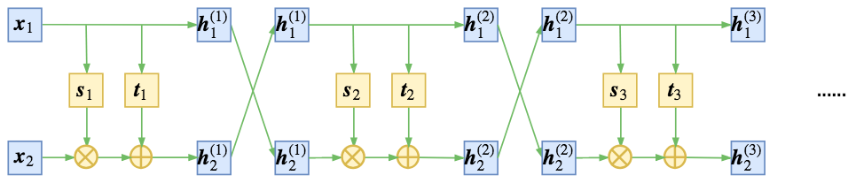

RealNVP 则通过随机的方式将方向打乱, 可以使得信息混合更加充分, 最终的损失可以更低, 这里的随机打乱就是将每一步输出的两个向量 $h_1, h_2$ 拼接起来再随机排序.

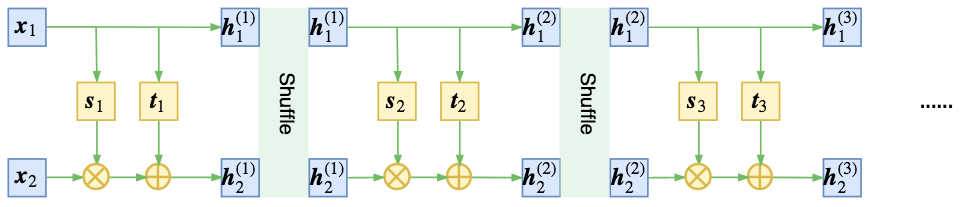

#### 引入卷积

RealNVP 给出了在 Flow 模型中合理使用卷积层的方案, 从而能够更好地处理图像问题, 并且减少参数两, 还可以更加充分发挥模型的并行性能.

注意, 不是任意情况下套用卷积都是合理的, 用卷积的前提是输入在空间维度上具有局部相关性, 而图像本身是具有局部相关性的, 因为相邻像素之间是有一定关联的, 因此一般的图像模型都可以使用卷积.

但是注意到 Flow 的两个操作:
1. 将输入分割为两个部分 $x_1$ 和 $x_2$, 然后输入到耦合层中, 而模型 $s$, $t$ 事实上只对 $x_1$ 进行处理;
2. 特征输入耦合层前需要打乱原来特征的各个维度;

这两个操作都会破坏局部相关性, 比如分割会割裂原来相邻的像素, 随机打乱也可能会将相邻像素分隔得很远.

所以如果要使用卷积, 就要想办法保留这种空间中的相关性.
一幅图像有三个轴: 高度 Height, 宽度 Width, 通道 Channel, 前两个轴属于空间轴, 显然具有局部相关性, 因此能操作的只有通道轴.
所以 RealNVP 约定分割和打乱操作都只对通道轴进行.
即沿着通道将输入分割为 $x_1$, $x_2$ 后, $x_1$ 还是具有局部相关性的, 还有沿着通道按着同一方式打乱后, 空间相关性依然得到保留, 因此在模型 $s$, $t$ 中就可以使用卷积了.

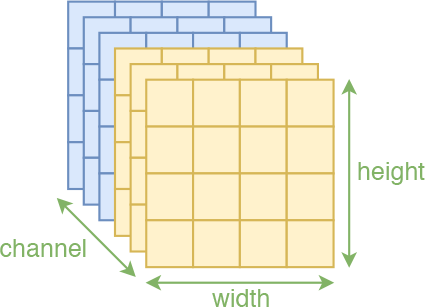 

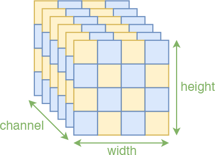

在 RealNVP 中将分割操作称为 mask, 等价于用 0/1 来区别标注原始输入.
另外还引入了一种空间轴上的交错 mask, 棋盘式, 这种特殊的分割也保留了空间局部相关性, 原论文是两种方式交替使用, 但这种棋盘式 mask 较为复杂, 且效果没有明显提升, 后续 Glow 不再使用.

一般的图像通道轴只有三维, 灰度图甚至只有一维, 如何进行对半分割和随机打乱?

为了解决这个问题, RealNVP 引入了 Squeeze 操作, 让通道轴具有更高的维度.
思想很简单, 直接 Reshape 但局部进行.
具体来说, 假设原图像为 $h\times w\times c$, 沿着空间维度分为 $2\times2\times c$ 的块, (2 可以自定义), 然后将每个块直接 reshape 为 $1\times 1\times 4c$, 最后变成了 $h/2\times w/2\times 4c$.

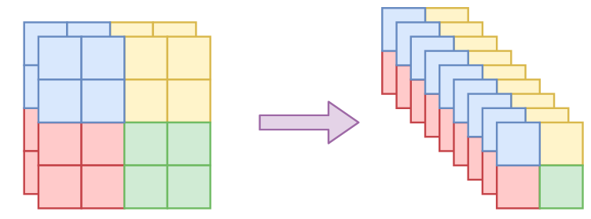

有了 squeeze 这个操作就可以增加通道轴的维数, 但依然保持局部相关性, 所以 Squeeze 操作成为 Flow 模型在图像应用中的必备操作.

#### 多尺度结构

RealNVP 的另一重要进展是加入了多尺度结构.
和卷积层一样, 这也是一个减少模型复杂度又提升结果的策略.

多尺度结构并不复杂, 如图

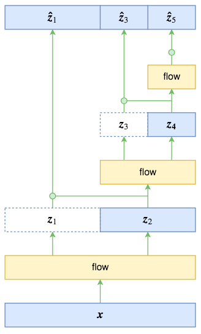

原始输入经过第一步 Flow 运算后的输出和输入的大小一样.
此时将输入对半分后直接输出 $z_1$, 而将 $z_2$ 输入到下一步的 Flow 运算中.
最终的输出由 $z_1, z_3, z_5$ 组成, 总输出大小一致.

多尺度结构有点分形的味道, 原文说它启发于 VGG.
每一步的多尺度操作直接将数据尺寸减少到原来的一半, 显然是非常可观的.
但有一个重要的细节, 在 RealNVP 和 Glow 中没有提及到的, 是最终的输出 $z_1, z_3. z_5$ 的先验分布如何选择?
按照 Flow 模型的通用假设, 直接设为标准正态分布?

事实上, 作为不同位置的多尺度输出, $z_1,z_3,z_5$ 的地位是不对等的, 而如果直接假设一个总体的标准正态分布, 就相当于强行对等它们, 这是不合理的.
最好的方案是直接写出条件概率公式

$$
    p(z_1,z_3,z_5) = p(z_1|z_3,z_5)p(z_3|z_5)p(z_5)\tag{03}
$$

由于 $z_3, z_5$ 是由 $z_2$ 完全决定的, $z_5$ 也由 $z_4$ 完全决定的, 所以条件部分可以修改为:

$$
    p(z_1,z_3,z_5) = p(z_1|z_2)p(z_3|z_4)p(z_5)\tag{04}
$$

RealNVP 和 Glow 假设右端三个概率分布都是正态分布, 其中 $p(z_1|z_2)$ 的均值方差由 $z_2$ 算出来 (可以通过卷积运算), $p(z_3|z_4)$ 的均值方差由 $z_4$ 算出来, 而 $p(z_5)$ 的均值方差则直接学习得到.

显然这样的假设会比简单地认为都是标准正态分布要有效得多.

此外还可以换一种表述方法: 上述的先验假设相当于做了如下的变量替换:

$$
    z'_1 = \dfrac{z_1-\mu(z_2)}{\sigma(z_2)}, z'_3 = \dfrac{z_3-\mu(z_4)}{\sigma(z_4)}, z'_5 = \dfrac{z_5-\mu}{\sigma}\tag{05}
$$

然后认为 $z'_1, z'_3, z'_5$ 服从标准正态分布.

和 NICE 的尺度变换一样, 这三个变换都会导致一个非 1 的雅可比行列式, 也就是要往损失函数中加入形如 $\sum_{i=1}^D\log\sigma_i$ 这一项.

由于 Flow 模型的可逆性, 输入输出维度一致, 会存在非常严重的维度浪费问题, 往往要求需要足够复杂的网络去缓解这个维度浪费现象.
多尺度结构相当于抛弃了 $p(z)$ 是标准正态分布的直接假设, 而采用了一个组合式的条件分布, 这样尽管输入输出维度一致, 但不同层次的输出地位已经不对等了, 模型可以通过控制每个条件分布的方差来抑制维度浪费的问题, 条件分布相比独立分布具有更大的灵活性.
而单纯从损失函数的角度看, 多尺度结构为模型提供了一个强有力的正则项.

### Glow

整体来看, Glow 模型在 RealNVP 的基础上引入了 1×1 可逆卷积来代替打乱通道轴的操作, 并且对 RealNVP 的原始模型做了简化和规范, 使其更易于理解和使用.

论文: https://papers.cool/arxiv/1807.03039
博客: https://blog.openai.com/glow/
源码: https://github.com/openai/glow

#### 置换矩阵

可逆 1×1 卷积源于对置换操作的一般化.
NICE 中的简单反转, RealNVP 中的随机打乱都是向量的置换操作.
事实上, 对向量的置换操作可以用矩阵乘法来描述 (初等矩阵).

那么一个自然的想法就是为什么不将置换矩阵换成可以训练的参数矩阵呢?
所谓的 1×1 可逆卷积就是这个想法的结果.

注意, 一开始提出 Flow 模型的思路时就明确指出, 变换需要满足两个条件: 可逆和雅可比行列式易于计算.
如果直接使用变换 $h=xW$, 即无偏置的全连接层并不能保证满足这两个条件.
为此, 需要做一些准备工作.

1. 让 $h$ 和 $x$ 维度一致, 即 $W$ 是方阵;
2. 线性变换的雅可比矩阵为 $W$, 行列式为 $\text{det}(W)$, 所以要将 $-\log|\text{det}(W)|$ 加入损失函数中;
3. 初始化时用随机正交矩阵初始化以保证 $W$ 的可逆性.

以上是一个基本的解决方案, 而计算矩阵行列式运算量特别大, 且容易溢出.
而 Glow 给出了一个巧妙的解决方案: LU 分解的逆运用.

任意矩阵都可以分解为:

$$
    W = PLU
$$

$P$ 是置换矩阵, 即 Shuffle 的等价矩阵; $L$ 是下三角矩阵, 其对角线元素为 $1$; $U$ 是上三角矩阵.
知道了这一分解形式, 其求雅可比行列式是很容易的, 它等于

$$
    \log|\text{det}(W)| = \sum \log |\text{diag}(U)|
$$

也就是 $U$ 的对角线元素的绝对值的对数和.
既然任何矩阵都能进行 LU 分解, 为何不直接设置 $W$ 为分解后的形式?
这样矩阵乘法运算量没有明显提升, 但求行列式的计算量大大降低, 也更加容易计算.

Glow 中给出的技巧: 随机生成一个正交矩阵, 做 LU 分解得到 $P$, $L$, $U$.
固定 $P$, 固定 $U$ 的对角线的正负号, 约束 $L$ 为对角线全 1 的下三角阵, $U$ 为上三角矩阵, 优化训练 $L$ 和 $U$ 的其他参数.

上面的描述是基于全连接的, 如果用到图像中, 就需要在每个通道向量上施行同样的运算, 这等价于 1×1 的卷积.
即共享权重可逆的全连接层.

Glow 论文做了对比实验, 损失函数值: 反转 > 打乱 > 可逆 1×1 卷积.

不过要指出的是, 虽然可逆 1×1 卷积能够降低损失, 但
1. 损失的降低不代表生成质量的提高, 尤其是在模型还没有达到最优时. 1×1 卷积只能保证模型都达到最优时, 后者会更优.
2. 可逆 1×1 卷积达到饱和所需要的 Epoch 数要远多于 Shuffle 所需.

#### ActNorm

RealNVP 使用了 BatchNormalization 层, 而 Glow 提出了 ActNorm 来替代.
实际上 ActNorm 是 NICE 的尺度变换层的一般化, 即缩放平移变换

$$
    z'=\dfrac{z-\mu}{\sigma}
$$
其中 $\mu$, $\sigma$ 都是训练参数.

Glow 提出的创新点是使用初始的 Batch 的均值方差来初始化 (虽然源码并没有这么做).

所以本质上就是缩放平移, 有助于更好地训练模型.
由于采用了这种做法, 仿射耦合层的尺度变换已经显得不那么重要了.
可以发现仿射耦合层比加性耦合层多了一个尺度变换层, 导致计算量翻倍, 但效果提升并不高 (尤其是加入了 ActNorm)

所以要训练大型模型, 为了节省资源一般只使用加性耦合层.
如 Glow 训练 256×256 的高清人脸生成模型, 就只用到了加性耦合层.

#### 源码分析

整体来看 Glow 模型并不复杂, 就是在输入加入一定量的噪声, 然后输入到一个编码器中, 最终用输出的平均平方和作为损失函数, 对数雅可比行列式可以视为正则项. 注意损失函数不是均方误差, 而仅仅是输出的平方和.

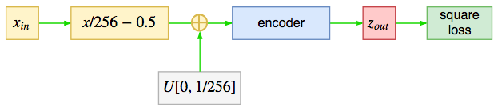

下面对编码器进行分解, 大概流程为

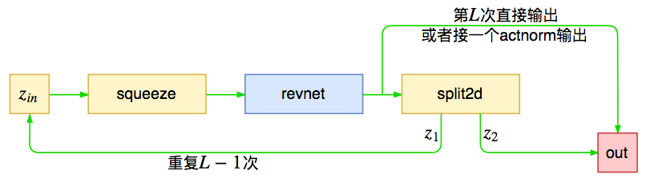

编码器由 $L$ 个模块组成, 这些模块在源码中被命名为 RevNet, 每个模块的作用是对输入进行运算, 然后将输出对半分, 一部分传入下个模块, 一部分直接输出, 即多尺度结构.
Glow 中默认 $L=3$, 对于 256×256 的人脸生成 $L=6$.

下面对 RevNet 模块进行拆解.

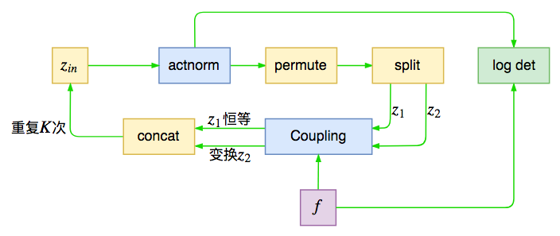

其实就是单步 Flow 运算, 在输入之前进行尺度变换, 然后打乱轴, 并且进行分割, 接着输入到耦合层中.
如此训练 $K$ 次, $K$ 为深度.
Glow 中默认 $K=32$.
其中 ActNorm 和仿射耦合层会带来非 1 的雅可比行列式, 会影响 Loss.

其中的 Split2D 不是简单的分割操作, 而是混合了对分割后的变换运算, 即前面提及的多尺度输出的先验分布假设.

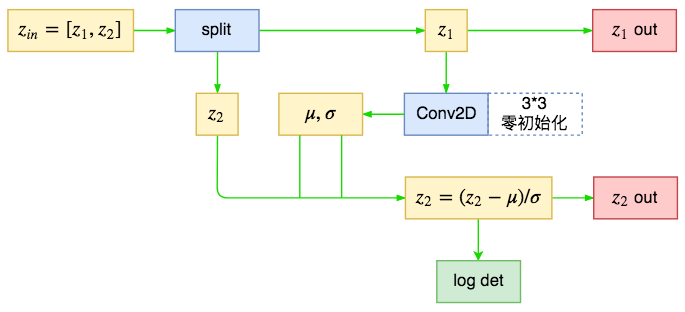

可以发现条件先验分布和 ActNorm 的区别仅仅是缩放平移量的来源.
ActNorm 的缩放平移参数是直接优化得到;
先验分布这里的缩放平移是由另一部分通过某个模型计算得到, 事实上可以认为这是一种条件式 ActNorm.

最后是 Glow 中的耦合层模型 (仿射耦合层的 $s$, $t$), 源码中直接命名为 $f$, 用了三层 ReLU 卷积:

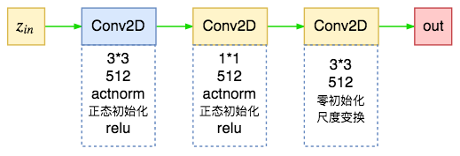

其中最后一层用零初始化, 使得初始状态下的输入输出一致, 即初始状态为恒等变换, 有利于训练深度网络.

<details>

<summary>Glow 源码分析</summary>

```python
#! -*- coding: utf-8 -*-
# Keras implement of Glow
# Glow模型的Keras版
# https://blog.openai.com/glow/

from keras.layers import *
from keras.models import Model
from keras.datasets import cifar10
from keras.callbacks import Callback
from keras.optimizers import Adam
from flow_layers import *
import imageio
import numpy as np
from scipy import misc
import glob
import os


if not os.path.exists('samples'):
    os.mkdir('samples')


imgs = glob.glob('../../CelebA-HQ/train/*.png')
img_size = 64  # for a fast try, please use img_size=32
depth = 10  # orginal paper use depth=32
level = 3  # orginal paper use level=6 for 256*256 CelebA HQ


def imread(f):
    x = misc.imread(f, mode='RGB')
    x = misc.imresize(x, (img_size, img_size))
    x = x.astype(np.float32)
    return x / 255 * 2 - 1


def data_generator(batch_size=64):
    X = []
    while True:
        np.random.shuffle(imgs)
        for f in imgs:
            X.append(imread(f))
            if len(X) == batch_size:
                X = np.array(X)
                yield X,X.reshape((X.shape[0], -1))
                X = []


def build_basic_model(in_channel):
    """基础模型，即耦合层中的模型（basic model for Coupling）
    """
    _in = Input(shape=(None, None, in_channel))
    _ = _in
    hidden_dim = 512
    _ = Conv2D(hidden_dim,
               (3, 3),
               padding='same')(_)
    # _ = Actnorm(add_logdet_to_loss=False)(_)
    _ = Activation('relu')(_)
    _ = Conv2D(hidden_dim,
               (1, 1),
               padding='same')(_)
    # _ = Actnorm(add_logdet_to_loss=False)(_)
    _ = Activation('relu')(_)
    _ = Conv2D(in_channel,
               (3, 3),
               kernel_initializer='zeros',
               padding='same')(_)
    return Model(_in, _)


squeeze = Squeeze()
inner_layers = []
outer_layers = []
for i in range(5):
    inner_layers.append([])

for i in range(3):
    outer_layers.append([])


x_in = Input(shape=(img_size, img_size, 3))
x = x_in
x_outs = []

# 给输入加入噪声（add noise into inputs for stability.）
x = Lambda(lambda s: K.in_train_phase(s + 1./256 * K.random_uniform(K.shape(s)), s))(x)

for i in range(level):
    x = squeeze(x)
    for j in range(depth):
        actnorm = Actnorm()
        permute = Permute(mode='random')
        split = Split()
        couple = CoupleWrapper(build_basic_model(3*2**(i+1)))
        concat = Concat()
        inner_layers[0].append(actnorm)
        inner_layers[1].append(permute)
        inner_layers[2].append(split)
        inner_layers[3].append(couple)
        inner_layers[4].append(concat)
        x = actnorm(x)
        x = permute(x)
        x1, x2 = split(x)
        x1, x2 = couple([x1, x2])
        x = concat([x1, x2])
    if i < level-1:
        split = Split()
        condactnorm = CondActnorm()
        reshape = Reshape()
        outer_layers[0].append(split)
        outer_layers[1].append(condactnorm)
        outer_layers[2].append(reshape)
        x1, x2 = split(x)
        x_out = condactnorm([x2, x1])
        x_out = reshape(x_out)
        x_outs.append(x_out)
        x = x1
    else:
        for _ in outer_layers:
            _.append(None)

final_actnorm = Actnorm()
final_concat = Concat()
final_reshape = Reshape()

x = final_actnorm(x)
x = final_reshape(x)
x = final_concat(x_outs+[x])

encoder = Model(x_in, x)
for l in encoder.layers:
    if hasattr(l, 'logdet'):
        encoder.add_loss(l.logdet)

encoder.summary()
encoder.compile(loss=lambda y_true,y_pred: 0.5 * K.sum(y_pred**2, 1) + 0.5 * np.log(2*np.pi) * K.int_shape(y_pred)[1],
                optimizer=Adam(1e-4))


# 搭建逆模型（生成模型），将所有操作倒过来执行

x_in = Input(shape=K.int_shape(encoder.outputs[0])[1:])
x = x_in

x = final_concat.inverse()(x)
outputs = x[:-1]
x = x[-1]
x = final_reshape.inverse()(x)
x = final_actnorm.inverse()(x)
x1 = x


for i,(split,condactnorm,reshape) in enumerate(zip(*outer_layers)[::-1]):
    if i > 0:
        x1 = x
        x_out = outputs[-i]
        x_out = reshape.inverse()(x_out)
        x2 = condactnorm.inverse()([x_out, x1])
        x = split.inverse()([x1, x2])
    for j,(actnorm,permute,split,couple,concat) in enumerate(zip(*inner_layers)[::-1][i*depth: (i+1)*depth]):
        x1, x2 = concat.inverse()(x)
        x1, x2 = couple.inverse()([x1, x2])
        x = split.inverse()([x1, x2])
        x = permute.inverse()(x)
        x = actnorm.inverse()(x)
    x = squeeze.inverse()(x)


decoder = Model(x_in, x)


def sample(path, std=1):
    """采样查看生成效果（generate samples per epoch）
    """
    n = 9
    figure = np.zeros((img_size * n, img_size * n, 3))
    for i in range(n):
        for j in range(n):
            decoder_input_shape = (1,) + K.int_shape(decoder.inputs[0])[1:]
            z_sample = np.array(np.random.randn(*decoder_input_shape)) * std
            x_decoded = decoder.predict(z_sample)
            digit = x_decoded[0].reshape(img_size, img_size, 3)
            figure[i * img_size: (i + 1) * img_size,
                   j * img_size: (j + 1) * img_size] = digit
    figure = (figure + 1) / 2 * 255
    figure = np.clip(figure, 0, 255).astype('uint8')
    imageio.imwrite(path, figure)


class Evaluate(Callback):
    def __init__(self):
        self.lowest = 1e10
    def on_epoch_end(self, epoch, logs=None):
        path = 'samples/test_%s.png' % epoch
        sample(path, 0.9)
        if logs['loss'] <= self.lowest:
            self.lowest = logs['loss']
            encoder.save_weights('./best_encoder.weights')
        elif logs['loss'] > 0 and epoch > 10:
            """在后面，loss一般为负数，一旦重新变成正数，
            就意味着模型已经崩溃，需要降低学习率。
            In general, loss is less than zero.
            If loss is greater than zero again, it means model has collapsed.
            We need to reload the best model and lower learning rate.
            """
            encoder.load_weights('./best_encoder.weights')
            K.set_value(encoder.optimizer.lr, 1e-5)


evaluator = Evaluate()

encoder.fit_generator(data_generator(),
                      steps_per_epoch=1000,
                      epochs=1000,
                      callbacks=[evaluator])
```

</details>


#### 总结

总体来看诸如 Glow 的 Flow 模型整体确实很优美, 但运算量还是偏大了, 训练时间过长, 不像一般的 GAN 那么友好.
