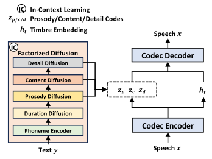
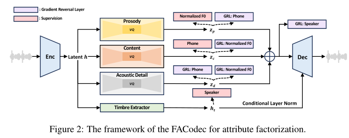
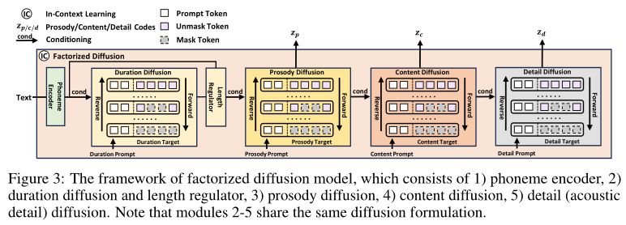

# Natural Speech 系列

## NaturalSpeech 1

## NaturalSpeech 2

## NaturalSpeech 3

NaturalSpeech 3 于 2024 年 03 月 05 日放出预印论文, 后经过两次修改.

尽管近期大规模文本转语音模型已经获得了重要进展, 但在音频质量, 相似性, 韵律上都仍表现得不够好.
由于音频包含多种复杂属性 (如内容, 韵律, 音色和其他声学细节) 使得生成面临着重大挑战, 一个自然的想法是将音频分解到单独的子空间以分别表示不同属性, 然后分别生成它们.
基于此, 以微软研究院领衔的研究团队提出了 NaturalSpeech 3, 一个基于新式分解扩散模型的文本转语音系统, 能够以零样本的方式生成自然的语音.
具体地, 有以下两点设计:
- 结合**分解向量量化 (Factorized Vector Quantization, FVQ)** 的神经编解码器将语音波形解耦到内容, 韵律, 音色和声学细节等子空间中;
- 提出分解扩散模型在每个子空间中按照对应提示词生成属性.

结合这种分解设计, NaturalSpeech 3 能够有效且高效地以分而治之的思路在解耦子空间中建模复杂音频.
实验证明 NaturalSpeech 3 超过了现有语音合成系统在音频质量, 相似性, 韵律和智能的表现, 并且达到了和人类录制相当的质量.
此外通过缩放到十亿参数和二十万小时的训练数据可以获得更好的性能.

注: 对比算法有 VALL-E, NaturalSpeech 2, Voicebox, Mega-TTS 2, UniAudio, StyleTTS 2, HierSpeech++.

整体的结构如下:

NaturalSpeech 3 由神经语音编解码器 FACodec 和分解扩散模型组成.
FACodec 将原始波形分解出五种属性: 时长, 韵律, 内容, 声学细节和音色.
需要注意的是虽然时长可以作为韵律的一个方面, 但为了能非自回归式生成语音, 仍然选择显式建模它.
采用内部对齐工具来对齐语音和音素并获得音素级别的时长.
对于其他的属性, 则通过使用分解神经编解码器隐式地学习对应的属性子空间.
然后使用分解扩散模型用于生成每个语音属性表示.
最后应用编解码器的解码器结合生成的语音属性重建音频.

下面分别介绍两个部分:

### FACodec 

源代码于 2024 年 03 月 12 日开源于 [Github/Amphion](https://github.com/open-mmlab/Amphion/tree/main/models/codec/ns3_codec)

FACodec 由一个语音编码器, 音色提取器, 三个分别用于内容, 韵律, 声学细节的分解向量量化器 (FVQ), 语音解码器组成.
那么给定一个 16kHz 的语音数据 $x$,
1. 语音编码器中采用数个卷积块, 对输入进行下采样, 采样率为 200, 以获得量化前的隐变量 $h$;
2. 音色提取器采用 Transformer 编码器将 $h$ 转换成表示音色属性的全局向量 $h_t$;
3. 对于其他三个属性, 分别使用一个分解向量量化器 (FVQ) 捕获更细粒度的语音属性表示, 并获得对应的离散标识符 (Token);
4. 语音解码器采用语音编码器的镜像结构, 但使用更多的参数以确保高质量的语音重建. 首先将韵律, 内容和声学细节的表示相加然后使用条件层归一化融合音色信息以获得解码器所需的表示 $z$

上述过程的关键在于如何能够更好地解耦语音属性.

直接将语音分解到不同的子空间中并不能保证语音成功解耦. 为此采用了一些技术以获得更好的属性解耦效果.
- 信息瓶颈: 强制模型移除不必要的信息 (如内容子空间中的韵律信息). 具体的构造方式是在三个 FVQ 中将编码器输出映射到低维空间 (8 维) 然后在这个低维空间内进行量化. 这一技术能够确保每个编码嵌入包含更少的信息, 促进信息解耦. 在量化之后将这些量化向量映射回原始维度.
- 监督学习: 为每个属性引入监督任务作为辅助任务以获得高质量的语音解耦. 
  - 对于韵律, 音高是一个重要部分, 所以使用量化后的隐变量 $z_p$ 来预测音高信息. 
  - 对每帧提取 F0 特征然后使用归一化 F0 (z score) 作为目标; 
  - 对于内容, 直接使用音素标签作为目标 (使用内部对齐工具获得帧级别的音素标签); 
  - 对于音色, 对全局音色表示 $h_t$ 应用说话人分类来预测说话人 ID.
- 梯度反转: 防止信息泄露 (如韵律泄露到内容中) 能够增强解耦能力. 使用带梯度反转层 (Gradient Reversal Layer, GRL) 的对抗分类器在隐空间中消除不想要的信息.
  - 对于韵律, 应用音素 GRL (即预测音素标签的 GRL 层) 来消除内容信息;
  - 对于内容, 因为音高是韵律的一个重要方面, 所以简单地应用 F0-GRL 来减少韵律信息;
  - 对于声学细节, 应用音素 GRL + F0 GRL 来消除内容和韵律信息;
  - 对三者输出的和应用 Speaker-GRL 来消除音色信息.
- 细节失活: 
  - 经验上发现编解码器倾向于在声学细节空间中保留不想要的信息 (如内容韵律) 因为没有应用监督任务. 
  - 直觉上没有声学细节的话解码器依靠韵律内容和音色应该可以重建音频, 即便是低质量.
  根据以上两点设计了细节失活, 即在训练时对声学细节部分的输出按概率 $p$ 进行随机失活, 以获得解耦和重建质量的权衡.
  1. 编解码器能够充分利用韵律, 内容和音色信息来重建音频, 以确保解耦能力, 即便是低质量;
  2. 可以给定声学细节以获得高质量音频.

### Factorized Diffusion Model

采用离散扩散来生成语音以获得更高的质量.
具体有以下考虑:
- 将语音分解为时长, 韵律, 内容, 声学细节等属性, 然后用具体条件顺序地生成它们.
  首先前面提过由于非自回归生成设计, 首先生成时长;
  然后直觉上声学细节应该最后生成.
- 遵循语音分解的设计, 只为对应属性的提示词应用生成模型, 并在子空间中应用离散扩散.
- 为了促进扩散模型内的上下文学习, 使用编解码器将语音提示分解为属性提示并采用部分噪音化机制生成目标语音属性. 例如为了生成韵律, 直接将无噪声的韵律提示和带噪声的目标序列进行拼接, 然后逐渐从目标序列中移除噪声.

结合这些想法, 设计了分解扩散模型, 包含了音素编码器和四个具有相同离散扩散形式的语音属性扩散模块.
1. 结合时长提示和由音素编码器输出的音素级别的文本条件, 应用时长扩散以生成语音时长. 然后应用长度调节器以获得帧级别的音素条件 $c_{ph}$;
2. 结合韵律提示和音素条件 $c_{ph}$ 生成韵律 $z_{p}$;
3. 结合内容提示, 生成韵律 $z_{p}$, 音素条件 $c_{ph}$ 为条件生成内容韵律 $z_{c}$;
4. 结合声学细节提示, 生成韵律 $z_{p}$, 音素条件 $c_{ph}$ 和内容韵律 $z_{c}$ 生成声学细节 $z_{d}$;
5. 不显式生成音色属性, 而是直接从提示直接生成音色 (对应 FACodec 的设计).
6. 最后将属性 $z_p, z_c, z_d, h_t$ 结合起来并用编解码器的解码器进行解码.

下面详细介绍扩散形式.

#### 前向过程

#### 反向过程

#### 推理部分

#### 无分类器指导