# Ch01.万物皆可 Embedding

近些年来在机器学习, 深度学习等领域, **嵌入 (Embedding)** 技术可谓发展迅猛, 遍地开花.
那么嵌入是什么?
嵌入为何能引起大家的极大关注?
嵌入有哪些新进展?

简单来说, **嵌入是用向量表示一个物体**, 这个物体可以是一个单词, 一条语句, 一个序列, 一件商品, 一个动作, 一本书, 一部电影等, 可以说嵌入涉及机器学习和深度学习的绝大部分对象.
这些对象是最基本, 最常用, 最重要的对象.
正因如此, 如何有效地表示, 学习这些对象就显得非常重要.
尤其 Word2Vec 这样的词嵌入 (Word Embedding) 的广泛应用, 更是带来了更大范围的延伸和拓展.
嵌入技术由最初的自然语言处理领域向传统机器学习, 搜索排序, 推荐, 知识图谱等领域延伸, 具体表现为由 Word Embedding 向 Item Embedding, Graph Embedding, Categorical Variables Embedding 等方向延伸.

Embedding 本身也在不断地更新, 由最初表现单一的静态向着更丰富的动态延伸和扩展.
具体表现为由静态的 Word Embedding 向 ELMo, Transformer, BERT, GPT, XLNet, ALBERT 等动态的预训练模型延伸.

本章主要涉及如下内容:
- 处理序列问题的一般步骤
- Word Embedding
- Item Embedding
- 用 Embedding 处理分类特征
- Graph Embedding
- Contextual Word Embedding
- 使用 Word Embedding 实现中文自动摘要

## 1.1.处理序列问题的一般步骤

序列问题是非常常见的, 如自然语言处理, 网页浏览, 时间序列等都与序列密不可分.
因此如何处理序列问题, 如何挖掘序列中隐含的规则和逻辑就变得十分重要.

以自然语言处理为例.
假设拿到一篇较长的文章或新闻报道之类的语言材料, 要求提炼出该材料的摘要信息, 
那么该如何处理? 需要考虑哪些内容? 涉及哪些步骤? 又从哪一步开始?

首先需要做的是一些必要的清理工作, 如清理特殊符号, 格式转换, 过滤停用词等;
然后进行分词, 索引化;
然后使用相关模型或算法把单词等标识符向量化;
最后输出给下游任务.



如上图所示, 词嵌入或预训练模型是关键, 它们的质量好坏直接影响下游任务的效果.
词嵌入与训练模型阶段涉及的算法和模型较多, 近几年也取得了长足发展, 如 Word2Vec 等方法, 刷新了自然语言处理, 语言识别, 推荐任务等在性能方面的记录.

下面从最基本的 Word2Vec 开始介绍 Word Embedding.

## 1.2.Word Embedding

因为机器无法直接接收单词, 词语, 字符等标识符 (Token), 所以把标识符数值化一直是人们研究的内容.
一开始人们使用整数来表示各个标识符, 这种方法简单但不够灵活;
后来人们使用独热编码 (One-Hot Encoding) 来表示, 这种编码方法虽然方便但是非常稀疏, 属于硬编码, 无法重载更多信息.
此后人们想到用数值向量或**标识符嵌入 (Token Embedding)** 来表示, 即通常所说的**词嵌入 (Word Embedding)**, 又称为**分布式表示**.

Word Embedding 方法真正流行起来还要归功于 Google 的 Word2Vec.

### 1.2.1.Word2Vec 之前



从上图可以看出, 独热编码是稀疏高维的硬编码, 如果一个语料有一万个不同的词, 那么每个词就需要用一万维的独热编码表示.
如果用向量或词嵌入表示, 那么这样的向量是低维且密集的, 而且向量值都是学习得到的, 而不是硬性给定的.

词嵌入的学习方法, 大致可以分为两种:

#### 1. 利用深度学习框架的 Embedding 层学习词嵌入.

在完成任务的同时学习词嵌入.
例如, 把 Embedding 作为第一层, 先随机初始化这些词向量, 然后利用深度学习框架 (PyTorch 等) 不断学习 (正向和反向), 最后得到需要的词向量.

[代码清单 1-1](PythonFiles/Ch01.01.py) 通过 PyTorch 的 `nn.Embedding` 生成词嵌入的简单例子.
```python
from torch import nn
import torch
import jieba
import numpy as np

raw_text = """越努力就越幸运"""

words = list(jieba.cut(raw_text))
print(f"Jieba 分词结果：{words=}")

word_to_idx = {i: word for i, word in enumerate(set(words))}
embeds = nn.Embedding(num_embeddings=4, embedding_dim=3)
print(f"Embedding 权重：{embeds.weight=}")

keys = word_to_idx.keys()
keys_list = list(keys)
tensor_value = torch.LongTensor(keys_list)
output = embeds(tensor_value)
print(f"Embedding 输出：{output=}")
```

运行结果为
```
Building prefix dict from the default dictionary ...
Dumping model to file cache ~
Loading model cost 0.491 seconds.
Prefix dict has been built successfully.
Jieba 分词结果：words=['越', '努力', '就', '越', '幸运']

Embedding 权重：embeds.weight=Parameter containing:
tensor([[-1.2612,  0.3341,  0.2855],
        [-0.3902,  0.0174,  1.0266],
        [ 0.0486,  1.1199,  1.4907],
        [-0.7700,  2.0776,  1.4062]], requires_grad=True)

Embedding 输出：output=tensor([[-1.2612,  0.3341,  0.2855],
        [-0.3902,  0.0174,  1.0266],
        [ 0.0486,  1.1199,  1.4907],
        [-0.7700,  2.0776,  1.4062]], grad_fn=<EmbeddingBackward0>)
```

#### 2. 使用预训练的词嵌入

利用在较大语料上预训练好的词嵌入或预训练模型, 把这些词嵌入加载到当前任务或模型中.
预训练的模型很多, 如 Word2Vec, ELMo, BERT, XLNet, ALBERT 等.
这里先介绍 Word2Vec, 其他模型将在后续进行介绍.

### 1.2.2.Word2Vec 模型

先看一个简单的示例, 示例展示了对一句话的两种预测方式.

`今天 下午 2点钟 搜索 引擎 组 开 组会`

**方法 1. 根据上下文预测目标值**

对于每个单词或词 (统称为标识符 Token), 使用该标识符周围的标识符来预测当前标识符生成的概率.
假设目标值为 `2点钟`, 我们可以使用它的上文和下文来生成或预测目标值.

**方法 2. 由目标值预测上下文**

对于每个标识符, 使用该标识符本身来预测生成其他词汇的概率.
如使用 `2点钟` 预测其上下文的每个词.

这两种方法的共同限制条件是, 对于相同的输入, 输出每个标识符的概率之和为 1.

这两种方法分别对应 Word2Vec 的两种模型, 即 **Continuous Bag-of-Words (CBOW)** 模型和 **Skip-Gram** 模型.

#### 1. CBOW 模型

CBOW 模型包含三层: 输入层 + 映射层 + 输出层

假设目标词为 $w(t)$, 使用已知的上下文 $w(t-2), w(t-1), w(t+1), w(t+2)$ 来预测目标词 $w(t)$ 出现的概率 $p(w|\text{context}(w))$.
目标函数为:
$$
    \mathcal{L} = \sum_{w\in C}\log p(w|\text{context}(w))
$$

CBOW 可以看成是多分类. 最朴素的想法就是直接使用 Softmax 来分别计算每个词对应的归一化概率, 但对于数十万词汇量的场景, 使用 Softmax 的计算量太大, 此时可以使用二分类组合形式的 Hierarchical Softmax 来降低计算量.

#### 2. Skip-Gram 模型

Skip-Gram 模型包含三层: 输入层 + 映射层 + 输出层

假设 $w(t)$ 为输入词, 在已知 $w(t)$ 的情况下预测上下文, 即 $p(\text{context}(w)|w)$.
目标函数为:
$$
    \mathcal{L} = \sum_{w\in C}\log p(\text{context}(w)|w)
$$

假设有这么一个句子: `the quick brown fox jumps over the lazy dog`

按这条语句生成一个由序列构成的数据集, 即对一些单词以及其上下文环境建立数据集, 上下文的定义方式可以是大小为 1 的窗口, 从而得到 (上下文, 目标单词) 组成的数据集.

## 1.3.Item Embedding

## 1.4.用 Embedding 处理分类特征

## 1.5.Graph Embedding

## 1.6.Contextual Word Embedding

## 1.7.使用 Word Embedding 实现中文自动摘要