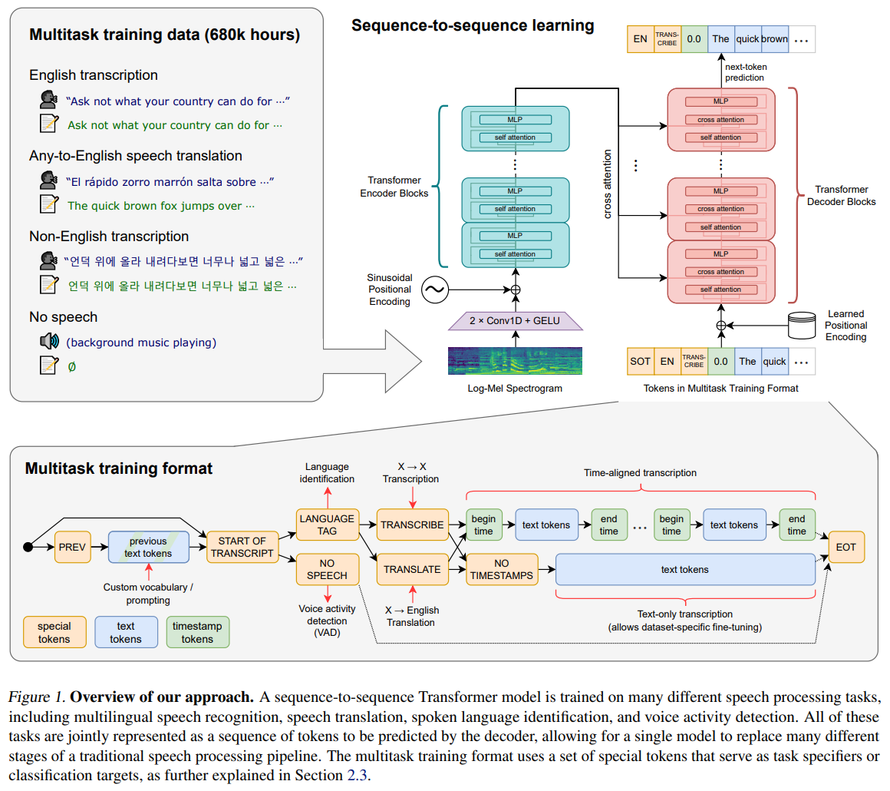

# Ch09.实战: 基于 Whisper 的语音转换

2022 年 09 月 21 日, OpenAI 开源了号称其英文语音识别能力已达人类水准的 Whisper 模型, 且它支持其他 98 种语言的自动语音识别.
Whisper 系统所提供的自动语音识别 (Automatic Speech Recognition, ASR) 模型是被训练来运行语音识别和翻译任务的, 它们能够将各种语言的语音变成文本, 也能将这些文本翻译成英文.

Whisper 是根据从网络上收集的 680k 小时的多语言和多任务监督数据进行训练的.
Whisper 模型总体结构如图所示.

可以看到 Whisper 架构是一个简单的端到端方法, 作为一个编码器-解码器转换器实现.
输入的音频被分割成 30 秒的小块, 转换为对数梅尔频谱图, 然后传入编码器.
解码器被训练来预测相应的文字说明, 其中夹杂着特殊的标记, 知道单一模型执行语言识别, 短语级别的时间戳, 多语言语音转录, 英式语音翻译等任务.

模型架构:
- 重采样: 16kHz;
- 特征提取方法: 使用 25ms 的窗口和 10ms 的步幅计算 80 通道的 Log-Mel 频谱图表示;
- 特征归一化: 输入在全局内缩放到 [-1,1], 并且在预训练数据集行具有近似为零的平均值;
- 编码器/解码器: 该模型的编码器和解码器采用 Transformer 架构.

编码的过程:
1. 编码器首先使用一个包含两个卷积层 (滤波器宽度为 3) 的词干处理输入表示, 使用 GELU 激活函数;
2. 第二个卷积层的步幅为 2;
3. 将正弦位置嵌入添加到词干的输出中, 然后应用编码器 Transformer 块;
4. Transformers 使用预激活残差块, 编码器的输出使用归一化层进行归一化.

解码的过程:
1. 使用学习位置嵌入和绑定输入输出标记表示;
2. 编码器和解码器具有相同的宽度和数量的 Transformer 块.

详情阅读 `model.py`.