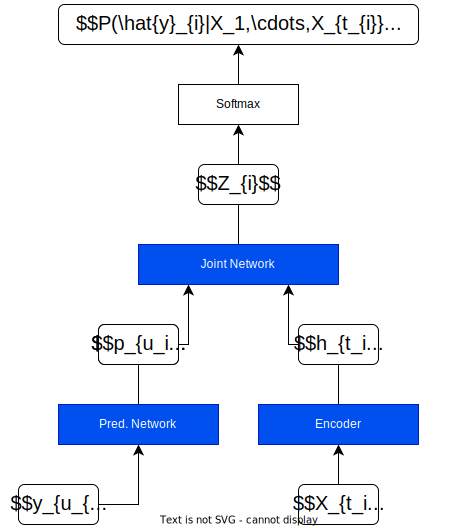

# 第 12 章 多模态语音转换模型基础

本章详解只有解码器的 GPT 系列架构.

Whisper 作为深度学习语音识别的代表, 使用基于注意力机制的编码器完成了信号特征抽取与解码的任务.
虽然其能够很好地对语音信号进行语音识别任务, 但 Whisper 在实际应用中仍面临一些挑战.
由于语音信号的复杂性, Whisper 在处理噪声环境下的语音识别任务以及转换的实时性等可能会受到一定影响.

新一代的语音识别和转换模型基于多模态的只含有解码器的语音技术, 已经在深度学习领域取得了显著的进展.
这种技术旨在克服 Whisper 等传统模型在实际应用中面临的挑战, 提高语音识别的准确性和实时性.

多模态语音技术采用多种不同的输入特征, 例如音频信号, 语音波形, 声学特征等, 通过深度神经网路对它们进行学习和转换.
与传统的 Whisper 模型相比, 多模态语音技术具有更强的表达能力和更好的性能, 可以更好地处理噪声环境下的语音信号, 提高语音识别的准确性.

此外, 多模态语音技术还可以实现快速的语音转换, 即实时地将一种语音转换为另一种语音.
这种技术可以在不同的应用场景中发挥重要作用, 例如语音助手, 虚拟人物, 语音聊天等.
通过快速地转换语音, 多模态语音技术可以提高用户体验和交互效率.

本章开始基于深度学习语音识别的最新理念: 多模态技术, 向读者介绍多模态语音识别的基本内容, 并以只具有解码器的 GPT 模型为例详细讲解其基本结构与组成.

## 12.1.语音文字转换的研究历程与深度学习

语音文字转换的研究可以追溯到 20 世纪 50 年代.
当时研究人员开始使用电子计算机来处理语音信号, 并尝试将它们转换为文本.
但是限于当时的条件, 这些尝试的准确性很低.

### 12.1.1.语音文字转换的传统方法

语音识别技术的发展历史可以追溯到 20 世纪 50 年代初期.
在那个时候, 人们开始尝试将语音转换为文本, 以便于计算机的处理.
随着计算机技术的发展, 发展出了多种算法以及基于统计学的方法来实现, 语音识别技术也逐渐得到了改进和完善.

#### 20 世纪 50 年代

20 世纪 50 年代初期, 贝尔实验室的研究人员开始尝试将语音转换为文本.
他们使用了一种叫做 Audrey 的设备, 通过对话框架来实现语音识别.

这个早期系统的一个很好的例子就是公共事业公司曾采用的自动化系统, 让客户自动抄表.
在这个例子中, 客户给系统的回应只是有限选项列表中的一个字或数字, 计算机只需要区分有限数量的不同声音模式.

现在看来, 这种设备仍然十分原始, 只能够识别一些简单的单词和数字.

#### 20 世纪 60 年代

20 世纪 60 年代, 语音识别技术得到了进一步的发展.
美国国防部资助了一项名为 warpe 的研究计划, 旨在开发一种可以识别语音的系统.
warpe 系统可以识别 1011 个单词, 但是其准确率仍然较低.

#### 20 世纪 70 年代

20 世纪 70 年代, 语音识别技术得到了一些重大的进展.
技术进步使基于模式和特征分析的语音识别系统得以发展, 其中每个字被分解成比特字节并通过关键特征 (比如它包含的元音) 进行识别.
这种方法涉及将声音数字化及将数字数据转换成频谱图, 将其分解为声音帧, 再分解单词并识别每个关键特征.

IBM 公司开发了一种名为 Shoebox 的语音识别系统, 可以识别 1000 个单词.
这种系统使用了一些新的技术, 如**动态时间规整 (Dynamic Time Warping, DTW)** 等.

为了识别可能说到的内容, 计算机必须将每个单词的关键特征与已知特征列表进行比对.
用得越多, 系统就越来越好, 因为它继承了来自用户的反馈.
这种方法比以前的方法要有效得多, 因为口语的基本声音成本数量十分有限.

#### 20 世纪 80 年代

20 世纪 80 年代, 语音识别技术得到了更加显著的进步, 但是其技术仍然不是超精确的, 因为言语中太过复杂: 不同的人会用不同的方式说出同一个词, 还有许多发音相似的词 (例如 Two 和 Too) 等等.
为了进行统计, 语音识别系统开始使用统计学方法.
在此期间推出的关键技术就是隐马尔可夫模型, 被用于构建声学模型和随机语言模型.

声学模型表征音频信号和语音单元之间的关系, 以重建实际发出的内容 (特征→音素).
语言模型基于最后一个单词预测下一个单词. 例如与其他词语相比, "早餐" 的后续词更有可能是 "面包片".

此外, 还有一个语音字典/词典, 可提供单词及其发音相关的数据, 并联系声学模型和语言模型 (音素→单词).
最终, 当前单词的语言模型得分与其声学得分相结合, 以确定假设的单词序列的可能性.

同时期, 美国国防部资助了一项名为 Dragon 的研究计划, 旨在开发一种可以识别语音的系统. 该项目为语音识别技术的发展做出了重要的贡献, 使得语音识别结束开始应用于商业领域.

#### 20 世纪 90 年代

20 世纪 90 年代, 随着计算机技术的不断发展, 借助于当时推出的微处理器带来了重大进步, 语音识别技术得到了更加广泛的应用, 逐步向商业实用领域发展.
语音识别技术开始应用于电话系统, 交互式语音应答 (Interactive Voice Response, IVR) 系统, 语音邮件等领域.

语音识别技术开始进入人们的日常生活, 计算机语音识别达到了 80% 的准确度.
从那时起, 就可以提取口语语言的含义并作出回应.
然而多数情况下, 语音技术仍然不能像键盘输入那样带给我们足够好的交流体验.

### 12.1.2.语音文字转换基于深度学习的方法

过去十年里随着人们对科学认识的加深, 研究者找到了解决语音转换文字的更为可靠的方法, 即基于深度学习的语音文本转换.
这段时间也是语音文本转换具有重大突破的时间, 与传统的方法相比较, 神经网络深度学习方法对特征统计特性的显式假设较少, 并且具有多种特性使其成为语音识别有吸引力的识别模型.

当用于估计语音特征片段的概率时, 神经网络允许以自然且有效的方式进行辨别训练.
然而, 尽管它们在分类短时间单位 (如个体音素和孤立单词) 方面有效, 早期神经网络还是很难成功进行连续的识别任务, 因为它们对时间依赖性建模的能力有限.

采用深度学习的神经网络语音转换的一个基本原则是**取消手工制作的特征工程并使用原始特征**.
这一原理首先在"原始"光谱图或线性滤波器组特征的深度自动编码器架构中成功探索, 语音波形的真正"原始"特征最近被证明可以产生出色的大规模语音识别结果.

语音转换主流厂商主要使用深度学习算法, 在实验环境中准确率在 99% 以上, 为推动新基建发展, 5G, 人工智能, 云计算等作为辅助核心基础设施的核心技术得到进一步的发展, 带动语音识别迎来了更加广阔的发展空间, 智能家居, 智能音箱, 智能车载和智能硬件等都得到了广泛的应用.

### 12.1.3.早期深度学习语音文字转换模型介绍

基于深度学习的语音文字转换是目前语音转换的研究重点, 也是最优解之一, 下面对已有的深度学习模型加以介绍.
注: 这里作者只作介绍, 后续章节不以这些模型为基础架构来学习. **目前来看, 后续的主流架构方向是单解码器为主 (以清华大学的 GLM 模型架构作为主要引领者.)**

已有的深度学习模型主要以 **连接时序分类 (Connectionist Temporal Classification, CTC)** 为基本架构来完成, 主要分类如下.

#### 1.基于 CTC 架构的语音模型方案

首先对于语音模型来说, CTC 架构并不是专用于分类任务的, 作者在此提出这个模型是为下面两种模型架构打下基础.

CTC 架构主要解决的是语音转文字的问题, 这个过程中的一个非常重要又实实在在会影响转换结果的问题是**长度对齐**.
在传统的语音识别模型中, 研究者对语音模型进行训练之前, 往往要将文本与语音进行严格的对齐操作, 然而这样会带来一些问题:
- 严格对齐要花费人力时间;
- 严格对齐之后, 模型预测出的标签只是局部分类的结果, 无法给出整个序列的输出结果, 往往要对预测出的标签做一些处理, 才可以得到最终想要的结果.
- 由于人为的因素, 因此严格对齐的标准并不统一.

虽然现在已经有了一些比较成熟的开源对齐工具供大家使用, 但是随着深度学习越来越火, 有人就会想能不能让设计的网络自己来学习对齐方式.

CTC 是一种避开输入与输出手动对齐的方式, 非常适合语音转换这种应用.

例如输入信号用音频符号序列 $X=[x_1,x_2,\cdots,x_T]$ 表示, 而对应的输出用符号序列 $Y=[y_1,y_2,\cdots,y_U]$ 表示.
为了方便训练这些数据, 希望能够找到输入 $X$ 和输出 $Y$ 之间精确的映射关系.

为了更好地理解 CTC 的对齐方法, 先举一个简单的对齐方法的例子.
假设对于一段音频, 希望输出的是 $Y=[c,a,t]$ 这个序列, 一种将输入输出对齐的方式是, 先将每个输入对应一个输出字符, 然后将重复的字符删除, 即

$$
\begin{aligned}
    \text{Input}(X) &: x_1,x_2,x_3,x_4,x_5,x_6 \\
    \text{Alignment} &: c,c,a,a,a,t\\
    \text{Output}(Y) &: c,a,t
\end{aligned}
$$

上述对齐方法可以使用, 但是存在两个问题:
1. 通常这种对齐方式是不合理的, 比如在语音识别任务中, 有些音频片可能是无声的, 这时应该是没有字符输出的.
2. 对于一些本应含有重复字符的输出, 这种对齐方法没法得到准确的输出. 例如, 输出对齐的结果为 `h h e l l l o`, 通过去重操作后得到的不是 `hello` 而是 `helo`.

为了解决上述问题, CTC 算法引入了一个新的占位符, 用于输出对齐结果.
这个占位符称为空白占位符, 通常使用符号 $\epsilon$ 表示, 这个符号在对齐结果中输出, 但是最后的去重操作会将所有的 $\epsilon$ 删除, 以得到最终的输出.
利用这个占位符可以让输入和输出拥有非常合理的对应关系.

$$
\begin{aligned}
    &h,h,e,eps,eps,l,l,l,eps,l,l,o \\
    &h,e,eps,l,eps,l,o \\
    &h,e,l,l,o \\
\end{aligned}
$$

在这个映射方式中, 如果在标定文本中有重复的字符, 对其过程中会在两个重复的字符中插入 $\epsilon$ 占位符, 从而解决上述问题.

#### 2.基于 RNN-T 架构的语音模型方案

**Recurrent Neural Network Transducer (RNN-T)** 是在 CTC 的基础上进一步发展和改进的模型.
**CTC 模型的一个主要缺点是并未考虑输出之间的依赖性**. 这意味着在 CTC 模型中, 当前帧和之前帧是完全独立的, 没有任何关联性.

RNN-T 在 CTC 模型的编码器基础上, 引入了一个新的组件: 预测网络 (Prediction Network), 它是一个将之前的输出作为输入的 RNN. 这个预测网络的隐藏向量与编码器得到的向量被一同放入一个联合网络 (Joint Network) 中.
从这个联合网络中, 我们得到了中间层的计算结果 $Z_i$, 再传递到 Softmax 层, 进而得到对应类别的概率.

整体模型的结构如下:

相较于传统模型, RNN-T 模型的训练速度更快, 模型体积更小, 同时保持了可比的准确率.
最近谷歌也将该模型进行了压缩, 并成功应用到了语音输入法 Gboard 上.

#### 3.基于 LAS 架构的语音模型方案

Listen Attend and Spell (LAS) 和 CTC, RNN-T 的思路有所不同.
它利用了注意力机制来实现有效的对齐.

LAS 模型主要由两大部分组成:

- Listener: 即 Encoder, 利用多层 RNN 从输入序列提取隐藏特征.
- Attend and Spell: 即 Attention 用来得到 Context Vector, Decoder 利用 Context Vector 以及之前的输出来产生相应的最终输出.

LAS 的模型结构如图所示:

LAS 模型由于考虑了上下文的所有信息, 因此它的精确度可能较其他模型略高, 但是程序编写较为复杂, 可能受限于算法设计者的水平.

#### 小结

以上三种是较为经典的语音转文本模型, 此模型在一定程度上解决了针对语音转换模型的问题, 但是受限于当时的科研人员的认知, 即使是最先进的 LAS 模型, 都依旧沿袭编码器-解码器这一经典的语言翻译模型的基本架构, 即输入序列 X → Encoder → 语义编码 c → 解码器 → 输出序列 Y.

但是随着研究者对深度学习认识的加强, 以单解码器进行语音-文本翻译, 以及基于单解码器的多模态融合可以更好地完成项目要求, 并且在训练形式上, 由于只存在解码器, 也能够更为准确地捕捉输入信号的特征, 因此单解码器的翻译模型成为未来发展的重要方向, 其主要代表就是智谱 AI 推出的 GLM 系列模型架构.

## 12.2.基于 GLM 架构的多模态语音文本转换模型

## 12.3.从零开始的 GPT-2 模型训练与数据输入输出详解

## 12.4.GPT-2 模型源码详解

## 12.5.具有多样性生成的 GPT-2 生成函数

