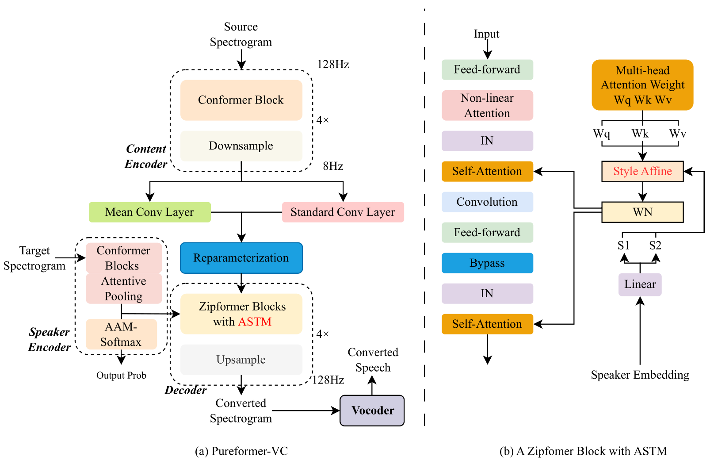
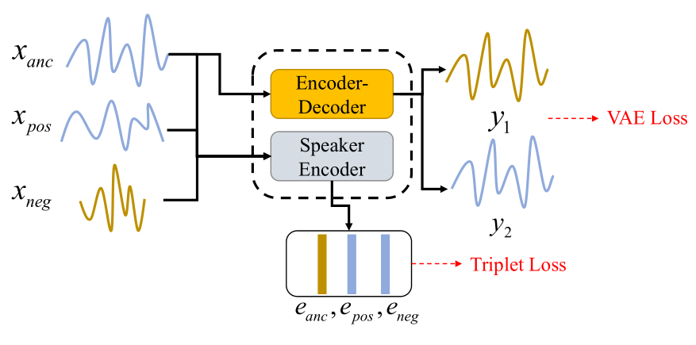
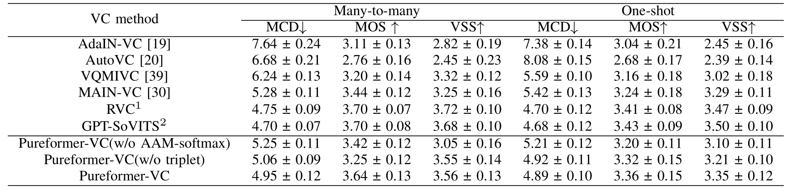
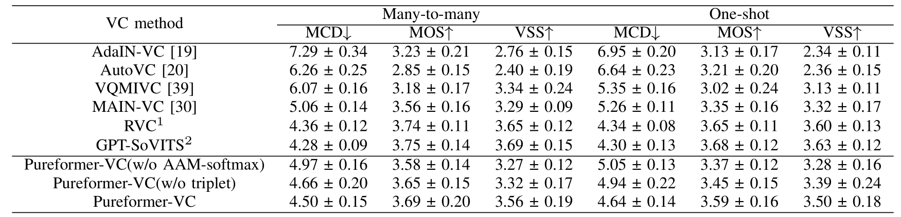
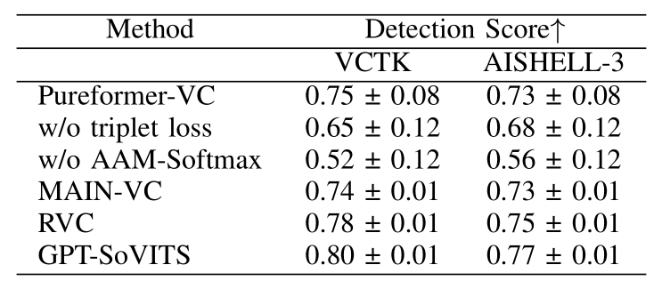
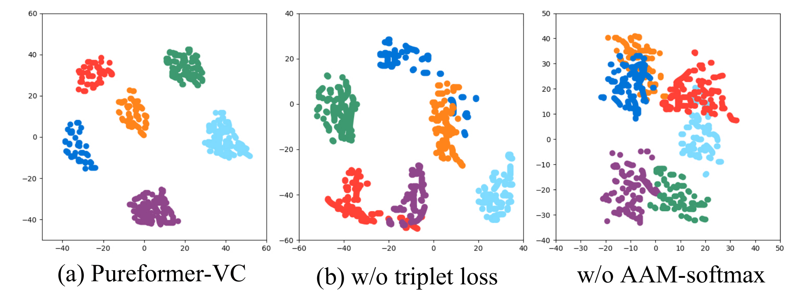

# Pureformer-VC

基本信息

- 标题: "Pureformer-VC: Non-Parallel Voice Conversion With Pure Stylized Transformer Blocks and Triplet Discriminative Training."
- 作者:
  - 01 Wenhan Yao
  - 02 Fen Xiao
  - 03 Xiarun Chen
  - 04 Jia Liu
  - 05 YongQiang He
  - 06 Weiping Wen
- 链接:
  - [ArXiv](https://arxiv.org/abs/2506.08348v1)
  - [Publication]()
  - [Github](https://github.com/ywh-my/PureformerVC)
  - [Demo]()
- 文件:
  - [ArXiv:2506.08348v1](PDF/2025.06.10_2506.08348v1__Pureformer-VC__Non-Parallel_Voice_Conversion_with_Pure_Stylized_Transformer_Blocks_and_Triplet_Discriminative_Training.pdf)
  - [Publication] #TODO

## 摘要

<!--
As a foundational technology for intelligent human-computer interaction, voice conversion (VC) seeks to transform speech from any source timbre into any target timbre.
Traditional voice conversion methods based on Generative Adversarial Networks (GANs) encounter significant challenges in precisely encoding diverse speech elements and effectively synthesizing these elements into natural-sounding converted speech.
To overcome these limitations, we introduce ***Pureformer-VC***, an encoder-decoder framework that utilizes **Conformer** blocks to build a disentangled encoder and employs **Zipformer** blocks to create a style transfer decoder.
We adopt a variational decoupled training approach to isolate speech components using a Variational Autoencoder (VAE), complemented by triplet discriminative training to enhance the speaker's discriminative capabilities.
Furthermore, we incorporate the **Attention Style Transfer Mechanism (ASTM)** with **Zipformer**'s shared weights to improve the style transfer performance in the decoder.
We conducted experiments on two multi-speaker datasets.
The experimental results demonstrate that the proposed model achieves comparable subjective evaluation scores while significantly enhancing objective metrics compared to existing approaches in many-to-many and many-to-one VC scenarios.
-->

作为智能人机交互的基础技术, **声音转换 (Voice Conversion, VC)** 旨在将任意源音色的语音转化为任意目标音色.
传统的声音转换方法基于**生成对抗网络 (Generative Adversarial Network, GAN)** 在精确编码多样语音元素并将之有效合成为自然听感的转换语音方面面临显著挑战.
为了克服这些局限性, 我们提出了 ***Pureformer-VC***, 一个编码器-解码器框架, 利用 **Conformer** 块构建一个解耦编码器并采用 **Zipformer** 块以创建风格迁移解码器.
我们采用变分解耦训练方法, 使用**变分自编码器 (Variational Autoencoder, VAE)** 以分离语音组分, 并辅以三元组判别训练以增强说话人的判别性能力.
此外, 我们将**注意力风格迁移机制 (Attention Style Transfer Mechanism, ASTM)** 和 **Zipformer** 的共享权重相结合, 以提升解码器的风格迁移性能.
我们在两个多说话人数据集上进行了实验.
实验结果表明所提模型在多对多和多对一声音转换场景下, 和现有方法对比, 取得了相当的主观评估分数并显著增强了客观指标.

## 1·引言

<!--
Voice conversion (VC) seeks to transform the speaker's timbre in speech to match that of a target speaker while preserving the original content.
The task is typically text-independent.
Traditional parallel VC research has primarily focused on feature matching methods [^Toda2007Voice], [^Helander2010Voice], [^Wu2020One-Shot], [^Erro2009Voice], [^Aihara2014Exemplar-Based], with the corpus consisting of paired utterances that have identical linguistic content.
Consequently, these methods struggle to address the challenge of converting between a wide range of different timbres and poor speech quality.
Recently, researchers have increasingly concentrated on non-parallel VC trained on multi-speaker datasets featuring randomly spoken utterances.
Non-parallel VC encompasses many-to-many and one-to-many VC tasks, designed to generate diverse timbres or a specific target timbre from various source timbres.
In this scenario, the target timbre only minimally participates or does not engage in the VC model training.
-->
声音转换 (Voice Conversion, VC) 旨在将语音中的说话人音色转化为目标说话人音色, 同时保持原有内容.
这一任务通常是与文本无关的.
传统的并行声音转换研究主要集中在特征匹配方法 [^Toda2007Voice], [^Helander2010Voice], [^Wu2020One-Shot], [^Erro2009Voice], [^Aihara2014Exemplar-Based] 上, 其语料库由具有相同语言学内容的成对语句组成.
因此, 这些方法面临着广泛不同音色之间转换以及语音质量较差等挑战.
近年来, 研究人员越来越聚焦在非并行声音转换上, 在包含随机语句的多说话人数据集上进行训练.
非并行声音转换涵盖了多对多和一对多声音转换任务, 设计用于从各种源音色生成多样的音色或特定目标音色.
在这种情况下, 目标音色仅少量参与或不参与声音转换模型的训练.

<!--
Drawing inspiration from the concept of image style transfer in computer vision, generative adversarial networks (GANs) have surfaced as a formidable tool for achieving non-parallel voice conversion (VC).
Several GAN-based VC methods have been proposed[^Kaneko2020Cyclegan-Vc3], [^Kaneko2021Maskcyclegan-Vc], [^Kameoka2018Stargan-Vc], [^Kaneko2019Stargan-Vc2], [^Li2021Starganv2-Vc], [^Chen2021Towards], which do not require explicit parallel target utterances for training.
Instead, a discriminator assesses whether a GAN-based VC model produces speech that embodies the target voice characteristics.
Consequently, GAN-based VC models learn to convert voice across trained timbres, resulting in limited timbre targets.
Within these methods, speaker encoders and style transfer functions play an essential role.
They assist the generator in understanding transformation relationships between various speaker domains, which is achieved through the integration of style transfer modules into the generators, such as **Adaptive Instance Normalization (AdaIN)** [^Huang2017Arbitrary] and **Weight Adaptive Instance Normalization (WadaIN)** [^Karras2020Analyzing].
-->
受到计算机视觉领域图像风格迁移概念的启发, 生成对抗网络已经成为实现非并行声音转换的优秀工具.
已经有数种基于 GAN 的声音转换方法被提出, 如 [^Kaneko2020Cyclegan-Vc3], [^Kaneko2021Maskcyclegan-Vc], [^Kameoka2018Stargan-Vc], [^Kaneko2019Stargan-Vc2], [^Li2021Starganv2-Vc], [^Chen2021Towards], 这些方法不需要显式的并行目标语句用于训练.
相反, 判别器用于评估基于 GAN 的声音转换模型是否生成了具有目标音色特征的语音.
因此, 基于 GAN 的声音转换模型学习在训练的音色之间转换语音, 导致了可以转换的音色目标有限.
在这些方法中, 说话人编码器和风格迁移函数起着至关重要的作用.
它们协助生成器理解不同说话人领域之间的转换关系, 这一目标通过将风格迁移模块集成到生成器中实现, 例如**自适应实例归一化 (Adaptive Instance Normalization, AdaIN)** [^Huang2017Arbitrary] 和**权重自适应实例归一化 (Weight Adaptive Instance Normalization, WadaIN)** [^Karras2020Analyzing].

<!--
However, training GAN models remains challenging due to issues with convergence and sensitivity to dataset imbalances.
In recent years, flow-based VC methods (such as **SoftVC-VITS** [^Van2022Comparison] and **YourTTS** [^Casanova2022Yourtts]), KNN-based VC approaches (like KNN-VC [^Baas2023Voice] and its derivative project [**RVC** [URL]](https://github.com/RVC-Project/Retrieval-based-Voice-Conversion-WebUI)), and Generative Large Language-based VC (GLL-VC), including [**GPT-SoVITS** [URL]](https://github.com/RVC-Boss/GPT-SoVITS), have significantly improved audio quality and training stability.
Flow-matching VC and some GLL-VC techniques utilize invertible flow architectures to transform the timbre in either the frequency domain of speech or the discrete speech unit.
The KNN-VC method substitutes the source content units with the nearest content units from the target timbre match set.
These high-quality VC methods require deep speech unit learning with a multi-speaker corpus pre-training, which can be time-consuming.
-->
然而, 训练 GAN 模型仍然面临着收敛问题和对数据集不平衡敏感性等问题.
近年来, **基于流的声音转换方法** (如 **SoftVC-VITS** [^Van2022Comparison] 和 **YourTTS** [^Casanova2022Yourtts]), **基于 KNN 的声音转换方法** (如 **KNN-VC** [^Baas2023Voice] 和其衍生项目 [**RVC** [URL]](https://github.com/RVC-Project/Retrieval-based-Voice-Conversion-WebUI)), **基于生成式大语言模型的声音转换方法 (Generative Large Language-based VC, GLL-VC)** (如 [**GPT-SoVITS** [URL]](https://github.com/RVC-Boss/GPT-SoVITS)) 显著提升了音频质量和训练稳定性.

基于流匹配的声音转换方法和一些 GLL-VC 技术使用可逆流架构, 在语音的频域或离散语音单元上进行音色转换.
KNN-VC 方法则从目标音色匹配集中查找最近邻的内容单元来替换源语音的内容单元.
这些高质量的声音转换方法通常需要在多说话人语料库上进行预训练以实现深度的语音单元学习, 这一过程可能非常耗时.

<!--
Considering that speech can be broken down into multiple components [^Qian2020Unsupervised] (e.g., timbre, pitch, content, and rhythm), disentanglement-based VC appears to be a promising approach.
This framework enables neural networks to develop distinct representations of each speech component using several encoders and a decoder [^Qian2020Unsupervised], [^Chan2022Speechsplit2].
During training, each encoder analyzes the corresponding spectrogram to create independent representations of the speech components.
The decoder then combines these components to reconstruct the original speech.
However, current methods—such as the forced decomposition in **SpeechSplit**[^Qian2020Unsupervised], [^Chan2022Speechsplit2], **INVC**[^Chou2019One-Shot], and the information bottleneck strategy in **AutoVC**[^Qian2019Autovc]—do not ensure perfect disentanglement or high-quality reconstruction.
-->
考虑到语音可以分解为多个组分 [^Qian2020Unsupervised] (如音色, 音高, 内容, 和韵律), 基于解耦的声音转换方法似乎是一个可行的方向.
这种架构使得神经网络能够使用多个编码器和解码器来开发每个语音组分的独特表示  [^Qian2020Unsupervised], [^Chan2022Speechsplit2].
在训练时, 每个编码器分析相应频谱图来创建语音组分的独立表示.
解码器随后将这些组分结合以重构原始语音.
然而, 现有方法, 例如 **SpeechSplit** [^Qian2020Unsupervised], [^Chan2022Speechsplit2], **INVC** [^Chou2019One-Shot] 的强制分解, 和 **AutoVC** [^Qian2019Autovc] 的信息瓶颈策略, 都不能保证完美的解耦或高质量的重构.

<!--
*So, how should an efficient encoder-decoder framework be constructed for VC tasks?*
-->
*所以, 如何构造高效的编码器-解码器框架来实现声音转换任务?*

<!--
We propose that an effective and practical disentangled voice conversion framework, based on an encoder-decoder architecture, must be fundamentally grounded in three essential principles: (1) encoders and decoders with distinct roles, (2) an optimization objective that enhances representational discriminability, and (3) an efficient style transfer module within the decoder to merge speech components and enable precise speech reconstruction.
In recent years, the most effective architectures in the field of speech model backbones have been several enhanced transformer-based networks, such as **Conformer**[^Gulati2020Conformer], **Paraformer**[^Gao2022Paraformer], and **Zipformer**[^Yao2023Zipformer].
These models have shown exceptional sequence modeling capabilities and have achieved significant success in applications such as automatic speech recognition[^An2024Paraformer-V2], speaker verification[^Zhang2022Mfa-Conformer], [^Liu2022Mfa], and speech enhancement[^Kim2021SE-Conformer], [^Abdulatif2024Cmgan].
Consequently, we believe that constructing a VC framework utilizing Transformer-based networks is feasible.
-->
我们提出, 一个高效且实用的解耦声音转换框架, 基于编码器-解码器架构, 必须从根本上遵循三个核心原则:
(1) 编码器和解码器具备不同作用,
(2) 增强表示辨别能力的优化目标,
(3) 解码器中包含高效的风格迁移模块, 以合并语音组分并实现精确语音重构.

近年来, 在语音模型主干网络领域中最有效的架构是基于 Transformer 的增强网络, 例如 **Conformer**[^Gulati2020Conformer], **Paraformer**[^Gao2022Paraformer], 和 **Zipformer**[^Yao2023Zipformer].
这些模型展示出了出色的序列建模能力并在自动语音识别[^An2024Paraformer-V2], 说话人验证[^Zhang2022Mfa-Conformer], [^Liu2022Mfa], 和语音增强[^Kim2021SE-Conformer], [^Abdulatif2024Cmgan] 等应用中取得了显著的成功.
因此, 我们认为, 利用基于 Transformer 的网络构造声音转换框架是可行的.

<!--
Building on the previous discussion, we present ***Pureformer-VC*** as a comprehensive solution for a practical VC framework with three technical approaches.
For the first approach, we design a specialized content encoder that combines **Conformer** blocks with IN operations.
This structure enhances the model's ability to represent linguistic information through normalized distributions while filtering out speaker characteristics.
For the decoder, we utilize **Zipformer** blocks, which have shown exceptional performance in speech acoustic modeling tasks, to ensure high-quality synthesis output.
For the second approach, we integrate the Attention Style Transfer Mechanism (ASTM) [^Wu2021Styleformer] within the **Zipformer** blocks, effectively incorporating speaker information into generated speech.
The speaker encoder is likewise constructed using **Conformer** blocks but omits IN to prevent the potential filtering of speaker information.
For the final approach, we introduce a triplet loss [^Hermans2017In] alongside the reconstruction loss, allowing the model to learn and maintain distinct distances between utterances of different timbres.
In summary, this paper's main contributions are as follows.
-  We proposed a one-shot, many-to-many VC framework called ***Pureformer-VC***.
The key modules are constructed using advanced speech encoding blocks, which assist in preserving the reconstruction quality.
-  To enhance style transfer, the shared weights in **Zipformer** are implemented using the ASTM in Styleformer.
-  We conducted one-shot and many-to-many voice conversion experiments on the VCTK and AISHELL-3 datasets.
The evaluation results indicate that our proposed method achieves comparable or even superior results in various voice conversion scenarios compared to existing methods.
-->
在前述讨论的基础上, 我们提出了 ***Pureformer-VC*** 作为一个面向实用语音转换框架的综合解决方案, 并采用了三种技术方法.
1. 我们设计了一个专用的内容编码器, 结合了 **Conformer** 块和实例归一化 (IN) 操作.
这一结构通过归一化分布增强了模型表示语言学信息的能力同时过滤掉说话人特征.
对于解码器, 我们使用了 **Zipformer** 块, 其在语音声学建模任务中的表现卓越, 以确保高质量的合成输出.
2. 我们在 **Zipformer** 块中集成了 **Attention Style Transfer Mechanism (ASTM)**[^Wu2021Styleformer], 有效地将说话人信息集成到生成的语音中.
说话人编码器则类似地使用 **Conformer** 块但省略了实例归一化, 以防止潜在的说话人信息过滤.
3. 我们引入了三元损失 [^Hermans2017In] 与重构损失相结合, 使模型能够学习和维护不同音色之间的不同距离.

总而言之, 本文的主要贡献如下:
- 我们提出了一个单样本, 多对多的声音转换框架 ***Pureformer-VC***.
关键模块是基于先进语音编码块构造的, 它们协助保持重构质量.
- 为了增强风格迁移, 在 Styleformer 的 ASTM 基础上利用 **Zipformer** 的共享权重.
- 我们在 VCTK 和 AISHELL-3 数据集上构造了单样本和多对多声音转换实验.
评估结果表明, 和现有方法相比, 我们提出的方法在多种声音转换场景中都能取得相当或甚至更好的结果.

## 2·背景

### 声音转换

<!--
Voice conversion (VC) model training can be broadly categorized into parallel and non-parallel approaches.
Early parallel methods relied on utterances with identical content but varying timbres to map features.
Techniques such as Gaussian Mixture Models (GMM-VC)[^Toda2007Voice], Directional Kernel Partial Least Squares (DKPLS)[^Helander2010Voice], Vector Quantization-based VC (VQ-VC)[^Wu2020One-Shot], frequency warping[^Erro2009Voice], and Non-Negative Matrix Factorization (NMF)[^Aihara2014Exemplar-Based] were frequently employed.
However, these approaches often yielded overly smooth outputs and demonstrated weak generative performance.
Recent technological advancements have triggered a paradigm shift toward non-parallel voice conversion, which can be systematically classified into two primary research directions:
-->
声音转换模型训练可以大致分为并行和非并行方法.
早期并行方法依赖于具有相同内容但不同音色的语句来映射特征.
诸如基于**高斯混合模型 (Gaussian Mixture Model, GMM)** 的方法 [^Toda2007Voice], **方向核部分最小二乘 (Directional Kernel Partial Least Squares, DKPLS)** 方法 [^Helander2010Voice], **基于矢量量化的声音转换 (Vector Quantization-based Voice Conversion, VQ-VC)** 方法 [^Wu2020One-Shot], **频率扭曲 (Frequency Warping)** 方法 [^Erro2009Voice], 和 **非负矩阵分解 (Non-Negative Matrix Factorization, NMF)** 方法 [^Aihara2014Exemplar-Based] 等技术被广泛使用.
然而, 这些方法通常产生过度平滑的输出, 并表现出较弱的生成性能.

近年来的技术进步引发了向非并行声音转换的范式转变, 其可以被系统性地分为两个主要研究方向:

<!--
**Domain Transfer.**
Domain transfer-based VC models, such as the series models of **StarGAN-VC** and **CycleGAN-VC**, treat each timbre as a domain and employ cyclic adversarial training to transform features across domains.
This method facilitates the generation of more realistic and diverse speech outputs.
A framework based on generative adversarial networks (GANs) has proven effective for non-parallel conversion.
-->
**领域迁移.**
基于领域迁移的声音转换模型, 例如 **StarGAN-VC** 和 **CycleGAN-VC** 的系列模型, 将每个音色视为一个领域, 并采用循环对抗训练实现领域间特征转换.
这种方法促进了生成更真实和多样化的语音输出.
基于生成对抗网络 (GAN) 的框架已经证明了非并行转换的有效性.

<!--
**Information Disentanglement.**
Information disentanglement seeks to break down speech into distinct components through an encoder, including content, timbre, pitch, and rhythm, thereby allowing flexible recombination by a decoder.
Representative models, such as **INVC**, **SpeechSplit**, and **MAIN-VC**[^Li2024Main-Vc], utilize techniques like IN and mutual information estimation to achieve effective disentanglement and reconstruction.
-->
**信息解耦**
信息解耦旨在将语音通过编码器分解为不同组分, 包括内容, 音色, 音高, 韵律, 然后在解码器中灵活重组.
代表性模型, 例如 **INVC**, **SpeechSplit**, 和 **MAIN-VC**[^Li2024Main-Vc], 采用诸如 IN 和互信息估计等技术实现有效的解耦和重构.

<!--
**Generative VC.**
We consider recent VC methods based on generative theory to be generative VC approaches, which include flow-based VC [^Van2022Comparison], [^Casanova2022Yourtts], KNN-based VC [^Baas2023Voice], [^Shao2025kNN-SVC], and GLL-VC (including GPT-SoVITS, etc.).
In the voice conversion stage, flow-based models can invert the semantics of speech into textual information and then convert it back into speech with a new timbre.
The KNN-based VC replaces the source speech's deep speech unit vectors with the given target speech.
The GLL-VC models pretrain the discrete speech semantic representations using regression training and predict different speech timbres based on reference speech prompts.
This evolution from parallel to non-parallel methods emphasizes the shift toward models with enhanced flexibility, robustness, and generative capabilities in VC tasks.
Formally, most non-parallel VC models can be represented as $y=G(x_{s},x_{y})$, where $x_{s}$ represents the speech providing the content and $x_{y}$ represents the speech supplying the speaker's voice characteristics.
-->

**生成式声音转换.**
我们将基于生成式理论的近期声音转换方法称为生成式声音转换方法, 包括基于流的声音转换 [^Van2022Comparison], [^Casanova2022Yourtts], 基于 KNN 的声音转换 [^Baas2023Voice], [^Shao2025kNN-SVC], 和 GLL-VC (包括 GPT-SoVITS 等).
在声音转换阶段, 基于流的模型可以将语音的语义反向映射到文本信息, 然后将它转换回具有新音色的语音.
基于 KNN 的方法将源语音的深度语音单元向量替换为给定的目标语音.
基于 GLL 的模型使用回归训练预训练离散语音语义表示, 并基于参考语音提示预测不同语音音色.

这种从并行到非并行方法的演化强调了向具有增强灵活性, 鲁棒性和生成能力的模型转变的趋势.
形式上, 绝大多数非并行声音转换模型可以表示为 $y=G(x_{s},x_{y})$, 其中 $x_{s}$ 表示提供内容的语音, $x_{y}$ 表示提供说话者声音特征的语音.

### 声音转换中的风格迁移学习

<!--
Style transfer learning teaches VC models to merge various speech representations.
Accordingly, the style transfer function accepts both source speaker-independent and target speaker-dependent representations.
Chou et al. [^Chou2019One-Shot] were the first to discover that IN can filter out speaker information while retaining the source content from original utterances in **INVC**.
Subsequently, the IN function found widespread application in GANs-based VC [^Kaneko2019Stargan-Vc2], [^Li2021Starganv2-Vc].
Furthermore, the **WadaIN** method implements affine operations on the convolutional kernel in Convolutional Neural Networks (CNNs), modifying the style of source data in **WadaIN-VC** [^Chen2021Towards] by convolving the source data.
However, these models depend on CNN architectures and exhibit limited reconstruction capabilities.
To leverage the self-attention mechanism in **Transformers**, the **Attention-AdaIN-VC**[^Ke2022New] incorporated the **Styleformer** block within the CNN blocks, achieving improved VC performance.
In **Styleformer**[^Wu2021Styleformer], self-attention weights are stylized using speaker representations, successfully training an image style transfer model.
In the **Styleformer**'s blocks, **ASTM** is commonly used to integrate individual embedding with self-attention layers.
We typically incorporate **ASTM** into our decoder as a style transfer module.
-->

风格迁移学习教导声音转换模型合并各种语音表示.
风格迁移函数可以同时接受和源说话人无关和目标说话人相关的表示.
**INVC** [^Chou2019One-Shot] 首次发现 IN 可以过从原始语句中过滤掉说话人信息而保留源内容.
随后, IN 函数被广泛应用于基于 GAN 的声音转换模型 [^Kaneko2019Stargan-Vc2], [^Li2021Starganv2-Vc].
此外, **WadaIN** 方法在卷积神经网络的卷积核上实现仿射操作, **WadaIN-VC**[^Chen2021Towards] 通过对源数据卷积修改源数据风格.
但是, 这些模型依赖于 CNN 架构, 并表现出有限的重构能力.

为了利用 **Transformer** 中的自注意力机制, **Attention-AdaIN-VC**[^Ke2022New] 将 **Styleformer** 块集成到 CNN 块中, 实现了更好的声音转换性能.
在 **Styleformer**[^Wu2021Styleformer] 中, 自注意力权重通过说话人表示进行风格化, 成功训练了图像风格迁移模型.
在 **Styleformer** 的块中, **ASTM** 通常被用于将单独的嵌入与自注意力层集成.
我们通常将 **ASTM** 集成到解码器中作为风格迁移模块.

## 3·方法

<a id='fig:1'>
<!--
The architecture of ***Pureformer-VC***.
-->
图 01: ***Pureformer-VC*** 的架构.
</a>

### 整体架构

<!--
The overall architecture of ***Pureformer-VC*** is depicted in [Figure.01](#fig:1)(a).
***Pureformer-VC*** consists of a content encoder, a decoder, a speaker encoder, and a vocoder.
We utilized a pre-trained **Hifi-GAN** generator [^Kong2020Hifi-Gan] as the vocoder, which remains frozen during the training stage.
-->
***Pureformer-VC*** 的整体架构如[图 01](#fig:1)(a) 所示.
***Pureformer-VC*** 由内容编码器, 解码器, 说话人编码器和声码器组成.
我们使用预训练 **HiFi-GAN**[^Kong2020Hifi-Gan] 生成器作为声码器, 其在训练阶段保持冻结.

<!--
We set the input feature mel-spectrogram as $x \in X^{[L, D]}$, where L denotes the frame number and D represents the number of mel filters.
The content encoder $E_{c}$ extracts the posterior variances of the content representation $r_{m}, r_{s}=E_{c}(x)$.
The speaker encoder $E_{s}$ generates speaker embeddings as the timbre representation $s = E_{s}(x)$ from mel-spectrograms.
The decoder $E_{d}$ takes the reparameterization variance and outputs the converted spectrogram $x_{dec}$, incorporating the style embedding for transfer.
It is important to note that *e* is a random variable that follows the standard normal distribution $N(0,1)$.
-->
我们将输入特征梅尔频谱记为 $x \in X^{[L, D]}$, 其中 L 表示帧数, D 表示梅尔滤波器的数量.
内容编码器 $E_{c}$ 提取内容表示 $r_{m}, r_{s}=E_{c}(x)$ 的后验方差.
说话人编码器 $E_{s}$ 从梅尔频谱图生成说话人嵌入 $s = E_{s}(x)$, 作为音色表示.
解码器 $E_{d}$ 采用重参数方差, 输出转换后的频谱图 $x_{dec}$, 并融合风格嵌入进行转移.
值得注意的是, *e* 是服从标准正态分布 $N(0,1)$ 的随机变量.

### 内容编码器+VAE 训练

<!--
The content encoder parameterizes and approximates the variational distribution of $q_{\phi}(z|x)$.
Each **Conformer** block was constructed with an IN function and an AveragePooling1D layer following the convolution module to reduce the time dimension by half.
There are four continuous blocks as shown in [Figure.01](#fig:1) (a); thus, the output spectrogram's frame length is decreased by 16.
Finally, the content encoder outputs the reparameterization of the content representation by two convolution layers:
-->
内容编码器参数化并近似 $q_{\phi}(z|x)$ 的变分分布.
每个 **Conformer** 块都采用 IN 函数和后跟平均池化层的卷积模块来减半时间维度.
如[图 01](#fig:1)(a) 所示有四个连续块, 因此, 输出频谱图的帧长度按 16 倍减少.
最后, 内容编码器通过两个卷积层输出内容表示的重参数化:

$$
\begin{aligned}
r_m &= Mean\_Conv(h_{enc}) \\
r_{s} &= Std\_Conv(h_{enc}) \\
r_{c} &= r_{m} + e*r_{s}
\end{aligned}
$$

<!--
The $Mean\_Conv$ and $Std\_Conv$ denote the two convolution layers after the output $h_{enc}$ of **Conformer** blocks.
Thus, the variable $r_{c}$ follows a normal distribution with mean $r_{m}$ and variance $r_{s}$.
The reparameterization operation ensures that the speech latent variables input into the decoder remain typically distributed while also preserving the gradient propagation in the model.
It turns out to optimize the **Evidence Lower Bound (ELBO)**[^Zhu2020Batch] of $log (p(x))$:
-->
$Mean\_Conv$ 和 $Std\_Conv$ 表示 **Conformer** 块的输出 $h_{enc}$ 后的两个卷积层.
因此, 变量 $r_{c}$ 服从具有均值 $r_{m}$ 和方差 $r_{s}$ 的正态分布.
重参数化操作确保模型中的语音潜变量输入到解码器中仍然具有典型分布, 同时也保留了梯度传播.
通过优化 $log (p(x))$ 的**证据下界 (Evidence Lower Bound, ELBO)**[^Zhu2020Batch], 我们可以得到:

$$
L_{elbo} = E[logP_{\theta}(x|z)] - KL(q_{\phi}(z|x) || p(z))
$$

<!--
where $\phi$ denotes the encoder network and $\theta$ represents the decoder.
-->
其中 $\phi$ 表示编码器网络, $\theta$ 表示解码器.

<!--
The first term above is the reconstruction loss, while the second is the KullbackLeibler divergence between the approximate posterior and the prior.
-->
第一项是重构损失, 第二项是近似后验与先验之间的 Kullback-Leibler 散度.

<!--
Thus, the VAE training loss can be summarized as:
-->
因此, VAE 训练损失可以写为:

$$
\begin{aligned}
L_{vae}(x,x_{dec}) = &E\left[ |x-x_{dec}| \right] + \\
0.5 \cdot &E[r_{c} + r_{m}^2 - log(r_{m}^2) - 1 ]
\end{aligned}
$$

<!--
The $r_{c}$ is derived from the input mel-spectrogram $x$.
-->
$r_c$ 是根据输入梅尔频谱图 $x$ 计算得到的.

### 解码器中的自注意力风格迁移机制

<!--
ASTM aids the decoder in learning the timbral characteristics of the target speech.
We built the decoder using 4 **Zipformer** blocks with ASTM, as illustrated in [Figure.01](#fig:1)(b).
The decoder merges the content and timbre representations of the speech.
-->
自注意力风格迁移机制辅助解码器学习目标语音的音色特征.
我们使用四个 **Zipformer** 块构建解码器, 如[图 01](#fig:1)(b) 所示.
解码器合并了语音的内容和音色表示.

<!--
To generate speech with diverse voice styles, we apply the **ASTM** to the weights in the self-attention mechanism of **Zipformer** blocks.
During the model initialization phase, the **ASTM** initially sets some attention weights $w_{q}, w_{k}, w_{v}, w_{u}$.
These weights are infused with the style characteristics of the split speaker embedding vector $s_{1}, s_{2} = split(E_{s}(x))$ as follows:
-->
为了生成具有多样化声音风格的语音, 我们将 **ASTM** 应用于 **Zipformer** 块中的自注意力机制.
在模型初始化阶段, **ASTM** 初始设置一些注意力权重 $w_{q}, w_{k}, w_{v}, w_{u}$.
这些权重被注入了分离说话人嵌入的风格特征 $s_{1}, s_{2} = split(E_{s}(x))$, 如下所示:
$$
\begin{aligned}
w_{q} = w_{q} \cdot s_{1} + s_{2}, w_{k} = w_{k} \cdot s_{1} +s_{2}\\
w_{v} = w_{v} \cdot s_{1} + s_{2}, w_{u} = w_{u} \cdot s_{1} +s_{2}
\end{aligned}
$$

<!--
Then, we apply **weight normalization (WN)** [^Salimans2016Weight] to the weights to achieve improved convergence performance.
WN takes the weight $w$ and normalizes it at the output dimension $i,j$ as follows:
-->
然后, 我们应用 **权重归一化 (Weight Normalization, WN)** [^Salimans2016Weight] 操作, 以提高收敛性能.
WN 将权重 $w$ 归一化到输出维度 $i,j$ 上, 如下所示:

$$
\begin{aligned}
w_{ij}' = w_{ij} \cdot \frac{1}{\sqrt{w_{ij}^2}}
\end{aligned}
$$

<!--
Using the WN operation, we scale the output of each weight $w \in \{ w_{q},w_{k},w_{v},w_{u} \}$ back to a unit standard deviation.
The WN aids the model in accelerating training convergence following the attention calculation with stylized weights.
Consequently, in the self-attention layers, the stylized attention is as follows:
-->
使用 WN 操作, 我们将每个权重的输出 $w \in \{ w_{q},w_{k},w_{v},w_{u} \}$ 缩放回到单位标准差.
WN 辅助模型加速训练收敛, 遵循风格化权重注意力计算.
因此, 在自注意力层中, 风格化注意力如下所示:

$$
\begin{aligned}
x' &= norm(s_{1} \cdot x + s_{2}) \\
out &= \frac{wn(w_{q})x' \cdot (wn(w_{k})x')^{t}}{\sqrt{d}} \cdot wn(w_{k})x' + wn(w_{u})x'
\end{aligned}
$$

<!--
The $norm$ represents a non-parameterized layer normalization function.
Additionally, $d$ indicates the output dimension for each weight, and $wn$ refers to the WN.
The stylized attention output is connected residually.
-->
$norm$ 表示非参数化层归一化函数.
此外, $d$ 表示每个权重的输出维度, $wn$ 表示 WN.
风格化注意力输出使用残差连接.

### 说话人编码器+加性角度边距损失

<!--
The speaker encoder is designed to extract timbre representations from mel-spectrograms, allowing the model to capture speaker-specific features that are critical for VC.
For its backbone, we use a structure made up of several **Conformer** blocks from **MFA-Conformer**[^Zhang2022Mfa-Conformer].
Importantly, these **Conformer** blocks are configured **without the IN functions** to ensure the preservation of speaker-related information.
-->
说话人编码器被设计用于从梅尔频谱中提取音色表示, 允许模型捕获对声音转换至关重要的特定说话者特征.
我们使用 **MFA-Conformer**[^Zhang2022Mfa-Conformer] 的多个 **Conformer** 块作为骨干结构.
重要的是, 这些 **Conformer** 块没有采用 IN 函数, 以确保保留说话人相关信息.

<!--
To further enhance the quality of the extracted embeddings, we incorporate the **Additive Angular Margin Softmax (AAM-softmax)** layer.
This parameterized loss function optimizes the learning of compact and well-separated clusters in the embedding space for different speakers.
By introducing a fixed angular margin between classes, the **AAM-softmax** layer encourages the encoder to produce discriminative and robust embeddings, thus improving the overall performance of speaker representation in the VC process.
-->
为了进一步增强提取嵌入的质量, 我们整合了**加性角度边距 SoftMax (AAM-Softmax)** 层.
该参数化损失函数优化在嵌入空间中对不同说话者的紧凑且良好分离聚类的学习.
通过在类间引入固定的角度边距, **AAM-SoftMax** 层鼓励编码器生成具有判别性和鲁棒性的嵌入, 因此提升了声音转换过程中说话人表示的整体性能.

### 三元组损失+数据采样策略

<!--
Considering the previous disentanglement-based VC models, both the source and target mel-spectrograms were identical during the training stage but differed during the inference stage.
This discrepancy between training and inference diminishes the model's generalization capability and results in poor speech quality when the target spectrograms lack speaker information.
To address this issue, we utilize the triplet loss, as shown in [Figure.02](#fig:2), which is an unsupervised learning technique featuring discriminative training that allows the speaker encoder to discern the differences in timbre among various voices.
The triplet loss training necessitates a unique data sampling strategy.
-->
考虑到先前的基于解耦的声音转换模型, 在训练阶段源和目标梅尔频谱图相同, 但在推理阶段不同.
这种训练和推理之间的差异降低了模型的泛化能力, 导致当目标频谱图缺少说话者信息时语音质量较差.
为了解决这一问题, 我们使用如[图 02](#fig:2) 所示的三元组损失, 这是一种无监督学习技术用于判别性训练, 使得说话人编码器能够区分不同声音的音色特征.
三元组损失训练需要独特的数据采样策略.

<!--
During the training stage, we sample three utterance segments of equal length from the dataset: an anchor sample $x_{anc}$, a positive sample $x_{pos}$, and a negative sample $x_{neg}$.
As illustrated in [Figure.02](#fig:2), the anchor sample and the positive sample share the same timbre, while the negative sample is from a different speaker than the anchor.
Therefore, let $nm$ represent the L2 normalization.
We can use the speaker encoder outputs of the three samples to calculate a triplet loss:
-->
在训练阶段, 我们从数据集中采样三个等长的语句片段: 锚样本 $x_{anc}$, 正样本 $x_{pos}$, 负样本 $x_{neg}$.
如[图 02](#fig:2) 所示, 锚样本和正样本共享相同的音色, 而负样本来自不同的说话者.
因此, 记 $nm$ 为 L2 归一化.
我们可以使用三个样本的说话人编码器输出来计算三元组损失:

$$
\begin{aligned}
e_{anc},e_{pos},e_{neg} = E_{s}(x_{anc}),E_{s}(x_{pos}),E_{s}(x_{neg})
\end{aligned}
$$

$$
\begin{aligned}
L_{tri} = E[nm(e_{anc}) * nm(e_{pos})^t] - \\\notag   E[nm(e_{anc}) * nm(e_{neg})^t]  + \delta
\end{aligned}
$$

<!--
The $\delta$ is a hyper-parameter to control the speaker similarity.
Denoting the VC model as $G_{vc}$, the total model's output can be described as follows:
-->
$\delta$ 是控制说话人相似性的超参数.
记 VC 模型为 $G_{vc}$, 总模型的输出可以表示如下:

$$
\begin{aligned}
y_{1} = G_{vc}(x_{anc},x_{neg})\\
y_{2} = G_{vc}(x_{anc},x_{pos})
\end{aligned}
$$

### 训练目标

<!--
The training objective of the ***Pureformer-VC*** model includes VAE loss, AAM-softmax loss, and triplet loss.
The total VAE loss is based on two outputs $y_{1},y_{2}$ as shown in [Figure.02](#fig:2) and can be denoted as:
-->
***Pureformer-VC*** 模型的训练目标包括 VAE 损失, AAM-softmax 损失, 以及三元组损失.
总 VAE 损失基于如[图 02](#fig:2) 所示的两个输出 $y_{1},y_{2}$, 可以表示如下:

$$
\begin{aligned}
L_{t-vae} = \lambda_{1}(L_{vae}(x_{anc},y_{1}) + \lambda_{2}L_{vae}(x_{anc},y_{2}))
\end{aligned}
$$

<!--
The AAM-softmax loss can be computed using the three true labels of samples $C$ and the predictions of the speaker encoder:
-->
AAM-SoftMax 损失可以使用样本的三个真实标签 $C$ 和说话人编码器的预测计算:

$$
L_{t-aam} = \sum_{c_{i}\in C}
L_{aam}(c_{i},x_{i})
$$

<!--
Finally, the triplet loss helps the speaker encoder to distinguish the embeddings.
The total training objective is as follows:
-->
最后, 三元组损失帮助说话人编码器区分嵌入.
总的训练目标如下:
$$
L_{total} = L_{t-vae} + \lambda_{3}L_{t-aam} + \lambda_{4}L_{tri}
$$

<a id='fig:2'>
<!--
The illustration of training objective.
-->
图 02: 训练目标的示意图.
</a>

### 声码器

<!--
The vocoder has the same structure as the **HiFi-GAN** generator.
In our study, it was pre-trained on the same dataset used for the VC training.
-->
声码器具有与 **HiFi-GAN** 生成器相同的结构.
在我们的研究中, 它在 VC 训练时使用相同的数据集进行预训练.

## 4·实验

### 实验设置

<!--
**Datasets and Feature Setup.**
-->
**数据集和特征设置**

<!--
To evaluate the effectiveness of ***Pureformer-VC***, we conducted a comparative experiment and an ablation study on VCTK[^Veaux2020VCTK] and AISHELL-3[^Shi2020Aishell-3] datasets.
The VCTK corpus includes 109 English speakers, each reading about 400 utterances.
The AISHELL-3 corpus contains roughly 85 hours of emotion-neutral recordings spoken by 218 native Chinese Mandarin speakers and 88035 utterances.
-->
为了评估 ***Pureformer-VC*** 的有效性, 我们在 VCTK[^Veaux2020VCTK] 和 AISHELL-3[^Shi2020Aishell-3] 上构造了一个比较实验和消融实验.
VCTK 语料库包含了 109 个英语说话人, 每位阅读了约 400 个语句.
AISHELL-3 语料库大致包含了由 218 位本地中文普通话说话人和 88035 个语句组成的 85 小时情绪中立的录音.

<!--
The mel-spectrogram extraction process must align with the pre-trained vocoder and adhere to the algorithm outlined in the **HiFi-GAN** framework[^Kong2020Hifi-Gan].
The signal hyperparameters are defined as follows: 80 Mel frequency filters, 1024 FFT bins, a window length of 1024, a hop length of 256, a sampling rate of 22,050 Hz, and a maximum frequency of 8 kHz.
The final input features are log-mel spectrograms, obtained by applying the logarithm to the extracted mel-spectrograms.
-->
梅尔频谱提取过程必须和预训练声码器对齐, 并遵循 **HiFi-GAN** 框架[^Kong2020Hifi-Gan]中概述的算法.
信号超参数定义如下:
- 80 个梅尔频率滤波器,
- 1024 个 FFT 桶,
- 窗长为 1024,
- 帧移为 256,
- 采样率为 22,050 Hz,
- 最大频率为 8 kHz.

最后的输入特征是对数梅尔频谱图, 由对提取的梅尔频谱图应用对数变换得到.

<!--
Considering batch sampling during the training stage, we randomly selected an utterance from one speaker.
We then sampled two utterances from another speaker to create a training sample: $\{x_{anc},x_{pos},x_{neg}\}$.
Five speakers are randomly chosen as unseen speakers for each corpus.
-->
考虑在训练阶段的批量采样, 我们随机选择一个说话人中的一个语句.
然后从另一个说话人中采样两个语句来创建训练样本: $\{x_{anc},x_{pos},x_{neg}\}$.
每一个语料库中随机选择 5 个未见说话人.

<!--
**Training Setup.**
-->
**训练设置**

<!--
In the training stage, the batch size is 16.
The learning rate is constant at $2 \times 10^{-4}$.
The ***Pureformer-VC*** is trained by **Adam optimizer**[^Kingma2014Adam] with $ \beta_{1} = 0.9, \beta_{2} = 0.99, \epsilon = 1 \times 10^{-6}$.
The $\lambda_{1}$ is set to 10 and $\lambda_{2}$ ranges from $1 \times 10-4 $ to 1.
Both the $\lambda_{3},\lambda_{4}$ are set to 1.
The $\delta$ is 0.3.
-->
在训练阶段, 批量大小为 16.
学习率保持恒定为 $2 \times 10^{-4}$.
***Pureformer-VC*** 使用 **Adam 优化器**[^Kingma2014Adam] 进行训练, 其中 $\beta_{1} = 0.9, \beta_{2} = 0.99, \epsilon = 1 \times 10^{-6}$.
$\lambda_{1}$ 设置为 10, $\lambda_{2}$ 范围从 $1 \times 10-4 $ 到 1.
$\lambda_{3},\lambda_{4}$ 都设置为 1.
$\delta$ 设置为 0.3.

<!--
**Baseline Setup.**
-->
**基线设置**

<!--
We compared ***Pureformer-VC*** with recent VC frameworks, such as **AdaIN-VC**[^Chou2019One-Shot], **AutoVC**[^Qian2019Autovc], **VQMIVC**[^Wang2021Vqmivc], **MAIN-VC**[^Li2024Main-Vc], **RVC**, and **GPT-SoVITS**.
The experiments are conducted in a many-to-many, one-shot (any-to-any) setup.
We further evaluate the performance of the proposed model in cross-lingual VC, where the source utterance's language differs from that of the target language.
-->
我们将 ***Pureformer-VC*** 与最近的 VC 框架, 如 **AdaIN-VC**[^Chou2019One-Shot], **AutoVC**[^Qian2019Autovc], **VQMIVC**[^Wang2021Vqmivc], **MAIN-VC**[^Li2024Main-Vc], **RVC**, 和 **GPT-SoVITS** 进行了比较.
实验采用了多到多, 单样本 (任意到任意) 设置.
我们进一步评估了所提出的模型在跨语言 VC 中的性能, 其中源语句的语言与目标语言不同.

### 度量和评估

<!--
We assess the naturalness and intelligibility of the generated speech using subjective metrics, such as the **Mean Opinion Score (MOS)**.
Additionally, we utilize objective metrics to evaluate timbre similarity with the target speech, including the **Voice Similarity Score (VSS)** and **Mel-Cepstral Distortion (MCD)**.
Higher scores indicate greater effectiveness of the voice conversion (VC) system.
-->
我们使用主观度量, 如**平均意见得分 (Mean Opinion Score, MOS)**, 来评估生成的语音的自然度和易用性.
此外, 我们利用客观度量来评估声音的音色相似性与目标语音, 包括**声音相似性得分 (Voice Similarity Score, VSS)** 和 **梅尔倒谱失真 (Mel-Cepstral Distortion, MCD)**.
得分越高, 声音转换系统的效果越好.

<!--
**Mean Opinion Score (MOS)**.
The Mean Opinion Score (MOS) is a widely used metric for assessing the subjective quality of speech or audio.
It is based on ratings from human listeners, who are asked to evaluate the quality of speech samples using a scale that typically ranges from 1 to 5.
A higher MOS signifies better reconstruction quality.
-->
**平均意见得分**是一个广泛使用的度量, 用于评估语音或音频的主观质量.
它基于来自人类的评价, 听众被要求对语音样本的质量进行评分, 评分通常在 1 到 5 之间.
MOS 越高, 语音重构质量越好.

<!--
**Voice similarity score (VSS)**.
The Voice Similarity Score (VSS) is an objective metric that quantifies the degree of resemblance between generated speech and authentic or target speech in terms of timbre, tone, and voice quality.
VSS is calculated based on embedding similarity derived from a pre-trained speaker verification model (Resemblyzer) [^Desplanques2020Ecapa-TDNN].
Higher scores represent greater similarity, indicating improved voice conversion (VC) performance.
-->
**声音相似性得分**是一种客观度量, 它衡量生成语音与真实或目标语音的音色, 音调, 和语音质量之间的相似度.
VSS 基于预训练说话人验证模型 (Resemblyzer) [^Desplanques2020Ecapa-TDNN] 提供的嵌入相似性计算.
得分越高, 表示声音转换性能越好.

<!--
**Mel-cepstral distortion (MCD)**.
The MCD is an objective quantitative measure that evaluates the Mel-cepstral divergence between the source and generated utterances.
The lower the MCD, the better the reconstruction effect.
During the testing phase, both many-to-many and one-shot (any-to-any) VC are conducted using non-parallel data.
For evaluation, 10 source/target speech pairs are fed into each VC model under two scenarios.
After this, 5 participants are invited to rate the speech samples.
-->
**梅尔倒谱失真**是一种客观量化度量, 它评估源语音和生成语音之间的梅尔倒谱散度.
MCD 越低, 重构效果越好.

在测试阶段, 多到多和单样本 (任意到任意) 的声音转换都采用非并行数据进行实验.
为了评估, 10 个源/目标语音对分别输入到每个 VC 模型中, 并在两个场景下进行评估.
之后, 5 位参与者被邀请对语音样本进行评分.

## 5·结果

### 对比实验
<!--
[Table.01](#table:1) and [Table.02](#table:2) present a comparative analysis of the ***Pureformer-VC*** against baseline methods in both many-to-many and one-shot VC settings across both datasets.
-->
[表格 01](#table:1) 和[表格 02](#table:2) 展示了 ***Pureformer-VC*** 在多到多和单样本 (任意到任意) VC 设置下, 与基线方法在两个数据集上的比较.

<a id=table:1>
<!--
Comparison of baseline and proposed methods for many-to-many and one-shot VC on the VCTK dataset (with a $95\%$ confidence interval).
-->
表格 01: 基线和所提方法在 VCTK 数据集上多到多和单样本声音转换的比较 (置信区间为 $95\%$).
</a>

<a id=table:2>
<!--
Comparison of baseline and proposed methods for many-to-many and one-shot VC on the AISHELL-3 dataset (with a $95\%$ confidence interval).
-->
表格 02: 基线和所提方法在 AISHELL-3 数据集上多到多和单样本声音转换的比较 (置信区间为 $95\%$).
</a>

<!--
**MCD and MOS metrics.**
The MOS and MCD can evaluate the effectiveness of speech reconstruction, collectively referred to as reconstruction metrics.
Since the original sampling rate of the AISHELL-3 dataset is higher than that of the VCTK dataset, the quality of speech reconstruction is superior, resulting in better reconstruction metrics for the AISHELL-3 dataset.
The ***Pureformer-VC*** outperforms the encoder-decoder baseline models in both many-to-many and one-shot experimental configurations with respect to reconstruction metrics.
However, when compared to state-of-the-art methods like RVC and GPT-SoVITS, the ***Pureformer-VC*** still exhibits a slight performance gap.
These results showcase the effectiveness of the pure **Transformer** architecture.
-->
**MCD 和 MOS 度量.**
MOS 和 MCD 可以评估语音重构的有效性, 统称为重构度量.
由于 AISHELL-3 数据集的采样率高于 VCTK 数据集, 语音重构的质量要更高, 因此 AISHELL-3 数据集的重构度量优于 VCTK 数据集.
***Pureformer-VC*** 在多到多和单样本实验配置下, 相对于编码器-解码器基线模型.
然而, 当与 RVC 和 GPT-SoVITS 等最新方法进行比较时, ***Pureformer-VC*** 仍然表现出微小的性能差距.
这些结果表明了纯 Transformer 架构的有效性.

<!--
**VSS metric.**
The VSS evaluation measures the similarity between the generated target timbre and the actual target timbre using a resemblyzer.
Compared to the four classic encoder-decoder-based VC baselines, the ***Pureformer-VC*** surpasses them in the VSS metric.
However, a slight gap remains in the VSS performance between PVC and the state-of-the-art models RVC and GPT-SoVITS.
As shown in the results, we further investigated the impact of removing either the AAMSoftmax loss or the triplet loss from the training objectives to assess the model's ability to represent timbre in the embedded vectors during training.
It is evident that without these two losses, the proposed model's VSS stays relatively consistent with that of the baseline model.
Therefore, incorporating these losses helps enhance the model's VC expressiveness.
-->
**VSS 度量.**
VSS 评估使用 Resemblyzer 衡量生成目标音色与实际目标音色之间的相似度.
相比四个经典的编码器-解码器-基线 VC 方法, ***Pureformer-VC*** 在 VSS 度量上优于它们.
然而, PVC 和最新模型 RVC 和 GPT-SoVITS 之间的 VSS 性能差距仍然存在微小差距.
如上所述, 我们进一步研究了从训练目标中移除 AAMSoftmax 损失或三元组损失的影响, 以评估模型在训练期间如何在嵌入向量中表示音色.

### 消融实验

<!--
We conduct ablation experiments to validate the effects of triplet loss and AAM-softmax loss on disentanglement.
We set up the following models: (a) the ***Pureformer-VC*** model, (b) the ***Pureformer-VC*** model without triplet loss (w/o triplet), and (c) the ***Pureformer-VC*** model without AAM-softmax loss (w/o AAM-softmax).
We used the resemblyzer to detect synthetic speech and evaluate conversion quality.
It assigns detection scores to fake (i.e., the VC model's experimental outputs) and authentic utterances from the target speaker after learning the target's characteristics from ten additional genuine utterances.
A higher score signifies a closer resemblance in timbre and superior speech quality.
The results are detailed in [Table.03](#table:3).
We found that the decision scores of our method are higher than those of the best baseline model, **MAIN-VC**.
Furthermore, the experiments demonstrate that both triplet loss and AAM-Softmax contribute to improving the accuracy of timbre generation.
-->
我们构造了消融实验, 以验证三元组损失和 AAM-Softmax 损失对分离的影响.
我们设置了以下模型:
(a) ***Pureformer-VC*** 模型,
(b) ***Pureformer-VC*** 模型无三元组损失 (w/o triplet),
(c) ***Pureformer-VC*** 模型无 AAM-Softmax 损失 (w/o AAM-Softmax).

我们使用 Resemblyzer 检测合成语音并评估转换质量.
在通过十条额外的真实语句学习目标特征后, 将检测分数分配给虚假语句 (即模型的实验输出) 和目标说话人的真实语句.
分数越高表示在音色更接近, 语音质量更优.
结果详细记录在[表格 03](#table:3).
我们发现, 我们的方法的决策分数高于最佳基线模型, **MAIN-VC**.
此外, 实验表明, 三元组损失和 AAM-Softmax 都有助于提高音色生成的准确性.

<a id=table:3>
<!--
Fake Detection score comparison for ablation study ablation.
-->
表格 03: 消融实验的虚假检测分数比较..
</a>

<!--
For a visual evaluation of each model's disentanglement capability, the t-SNE scatter plots of the speaker representations are shown in [Figure.03](#fig:3).
The AAM-softmax loss has a significant impact on the clustering of speaker embedding vectors, while the triplet loss helps create more distinct boundaries between categories.
-->
为了可视化每个模型的分离能力, 我们展示了说话人表示的 t-SNE 散点图, 如[图 03](#fig:3) 所示.
AAM-Softmax 损失对说话人嵌入向量的聚类有着显著影响, 而三元组损失有助于创建不同类别之间的更加明显的界限.

<a id='fig:3'>
<!--
The visualization of speaker representations extracted from 6 unseen speakers’ utterances.
-->
从六位未见说话人的语句中提取的说话人表示的可视化.
</a>

### 跨语种实验

<!--
***Pureformer-VC*** is also capable of performing cross-lingual voice conversion (CVC), where the source and target utterances are in different languages.
We trained ***Pureformer-VC*** on a mixture of the AISHELL-3 and VCTK datasets.
Due to varying pronunciation habits, the reconstruction metrics ($MOS=3.15, MCD=5.12$) and VSS ($2.95$) scores for cross-lingual voice conversion are lower than those for monolingual VC experiments.
The bilingual timbre experiments suggest that additional latent variables may be necessary to decouple the languages using special encoders for improved conversion performance.
-->
***Pureformer-VC*** 也可以执行跨语言语音转换 (Cross-lingual Voice Conversion, CVC), 其中源句和目标句的语言不同.
我们在 AISHELL-3 和 VCTK 数据集的混合上训练了 ***Pureformer-VC***.
由于发音习惯的不同, 跨语言语音转换的重构指标 ($MOS=3.15, MCD=5.12$) 和 VSS ($2.95$) 得分低于单语言语音转换实验.
双语的音色实验表明, 可能需要额外的潜变量来分离语言, 使用特殊编码器以提高转换性能.

## 6·结论

<!--
In this paper, we present a novel approach to voice conversion (VC) by leveraging a pure transformer network designed as a VAE encoder-decoder framework called ***Pureformer-VC***.
Within the decoder, we integrate a styleformer module, which enhances the model’s capacity for style transfer.
Additionally, we improve the effectiveness of the speaker encoder by incorporating triplet loss and AAMSoftmax loss.
These enhancements significantly boost the model's ability to capture and represent the nuances of different speaking voices, resulting in more accurate and robust VC.
In conclusion, the ***Pureformer-VC*** model, fortified by the strategic application of specialized loss functions and style adaptation mechanisms, represents a significant advancement in the field of VC.
-->
在本文中, 我们提出了一个用于声音转换的新方法, 通过利用纯 Transformer 网络作为 VAE 编码器-解码器框架的 ***Pureformer-VC***.
在解码器中, 我们集成了一个 Styleformer 模块, 它增强了模型的风格转移能力.
此外, 我们通过包含三元组损失和 AAMSoftmax 损失来改进说话人编码器的效果.
这些改进显著提高了模型捕捉和表示不同说话人的细微差别的能力, 实现更准确和更稳健的声音转换.
总的来说, ***Pureformer-VC*** 模型, 由专用损失函数和风格适应机制的策略应用, 是声音转换领域的一个重要进步.

## 参考文献

[^Toda2007Voice]: Voice Conversion Based on Maximum-Likelihood Estimation of Spectral Parameter Trajectory. IEEE Transactions on Audio, Speech, and Language Processing 2007.
[^Helander2010Voice]: Voice Conversion Using Partial Least Squares Regression. IEEE Transactions on Audio, Speech, and Language Processing 2010.
[^Wu2020One-Shot]: One-Shot Voice Conversion by Vector Quantization. ICASSP 2020-2020 IEEE International Conference on Acoustics, Speech and Signal Processing (ICASSP) 2020.
[^Erro2009Voice]: Voice Conversion Based on Weighted Frequency Warping. IEEE Transactions on Audio, Speech, and Language Processing 2009.
[^Aihara2014Exemplar-Based]: Exemplar-Based Emotional Voice Conversion Using Non-Negative Matrix Factorization. Signal and Information Processing Association Annual Summit and Conference (APSIPA), 2014 Asia-Pacific 2014.
[^Kaneko2020Cyclegan-Vc3]: Cyclegan-Vc3: Examining and Improving Cyclegan-VCS for Mel-Spectrogram Conversion. arXiv:2010.11672.
[^Kaneko2021Maskcyclegan-Vc]: Maskcyclegan-Vc: Learning Non-Parallel Voice Conversion With Filling in Frames. ICASSP 2021-2021 IEEE International Conference on Acoustics, Speech and Signal Processing (ICASSP) 2021.
[^Kameoka2018Stargan-Vc]: Stargan-Vc: Non-Parallel Many-to-Many Voice Conversion Using Star Generative Adversarial Networks. 2018 IEEE Spoken Language Technology Workshop (SLT) 2018.
[^Kaneko2019Stargan-Vc2]: Stargan-Vc2: Rethinking Conditional Methods for Stargan-Based Voice Conversion. arXiv:1907.12279.
[^Li2021Starganv2-Vc]: Starganv2-Vc: A Diverse, Unsupervised, Non-Parallel Framework for Natural-Sounding Voice Conversion. arXiv:2107.10394.
[^Chen2021Towards]: Towards Low-Resource Stargan Voice Conversion Using Weight Adaptive Instance Normalization. ICASSP 2021-2021 IEEE International Conference on Acoustics, Speech and Signal Processing (ICASSP) 2021.
[^Huang2017Arbitrary]: Arbitrary Style Transfer in Real-Time With Adaptive Instance Normalization. Proceedings of the IEEE International Conference on Computer Vision 2017.
[^Karras2020Analyzing]: Analyzing and Improving the Image Quality of Stylegan. Proceedings of the IEEE/CVF Conference on Computer Vision and Pattern Recognition 2020.
[^Van2022Comparison]: A Comparison of Discrete and Soft Speech Units for Improved Voice Conversion. ICASSP 2022-2022 IEEE International Conference on Acoustics, Speech and Signal Processing (ICASSP) 2022.
[^Casanova2022Yourtts]: Yourtts: Towards Zero-Shot Multi-Speaker TTS and Zero-Shot Voice Conversion for Everyone. International Conference on Machine Learning 2022.
[^Baas2023Voice]: Voice Conversion With Just Nearest Neighbors. arXiv:2305.18975.
[^Qian2020Unsupervised]: Unsupervised Speech Decomposition via Triple Information Bottleneck. International Conference on Machine Learning 2020.
[^Chan2022Speechsplit2]: Speechsplit2.0: Unsupervised Speech Disentanglement for Voice Conversion Without Tuning Autoencoder Bottlenecks. ICASSP 2022-2022 IEEE International Conference on Acoustics, Speech and Signal Processing (ICASSP) 2022.
[^Chou2019One-Shot]: One-Shot Voice Conversion by Separating Speaker and Content Representations With Instance Normalization. arXiv:1904.05742.
[^Qian2019Autovc]: Autovc: Zero-Shot Voice Style Transfer With Only Autoencoder Loss. International Conference on Machine Learning 2019.
[^Gulati2020Conformer]: Conformer: Convolution-Augmented Transformer for Speech Recognition. arXiv:2005.08100.
[^Gao2022Paraformer]: Paraformer: Fast and Accurate Parallel Transformer for Non-Autoregressive End-to-End Speech Recognition. arXiv:2206.08317.
[^Yao2023Zipformer]: Zipformer: A Faster and Better Encoder for Automatic Speech Recognition. arXiv:2310.11230.
[^An2024Paraformer-V2]: Paraformer-V2: An Improved Non-Autoregressive Transformer for Noise-Robust Speech Recognition. arXiv:2409.17746.
[^Zhang2022Mfa-Conformer]: Mfa-Conformer: Multi-Scale Feature Aggregation Conformer for Automatic Speaker Verification. arXiv:2203.15249.
[^Liu2022Mfa]: MFA: TDNN With Multi-Scale Frequency-Channel Attention for Text-Independent Speaker Verification With Short Utterances. ICASSP 2022-2022 IEEE International Conference on Acoustics, Speech and Signal Processing (ICASSP) 2022.
[^Kim2021SE-Conformer]: SE-Conformer: Time-Domain Speech Enhancement Using Conformer.. Interspeech 2021.
[^Abdulatif2024Cmgan]: Cmgan: Conformer-Based Metric-Gan for Monaural Speech Enhancement. IEEE/ACM Transactions on Audio, Speech, and Language Processing 2024.
[^Hermans2017In]: In Defense of the Triplet Loss for Person Re-Identification. arXiv:1703.07737.
[^Li2024Main-Vc]: MAIN-VC: Lightweight Speech Representation Disentanglement for One-Shot Voice Conversion. arXiv:2405.00930.
[^Shao2025kNN-SVC]: kNN-SVC: Robust Zero-Shot Singing Voice Conversion With Additive Synthesis and Concatenation Smoothness Optimization. ICASSP 2025-2025 IEEE International Conference on Acoustics, Speech and Signal Processing (ICASSP) 2025.
[^Ke2022New]: A New Spoken Language Teaching Tech: Combining Multi-Attention and AdaIN for One-Shot Cross Language Voice Conversion. 2022 13th International Symposium on Chinese Spoken Language Processing (ISCSLP) 2022.
[^Wu2021Styleformer]: Styleformer: Real-Time Arbitrary Style Transfer via Parametric Style Composition. Proceedings of the IEEE/CVF International Conference on Computer Vision 2021.
[^Kong2020Hifi-Gan]: Hifi-Gan: Generative Adversarial Networks for Efficient and High Fidelity Speech Synthesis. Advances in Neural Information Processing Systems 2020.
[^Zhu2020Batch]: A Batch Normalized Inference Network Keeps the KL Vanishing Away. arXiv:2004.12585.
[^Salimans2016Weight]: Weight Normalization: A Simple Reparameterization to Accelerate Training of Deep Neural Networks. Advances in Neural Information Processing Systems 2016.
[^Veaux2020VCTK]: VCTK Corpus: English Multi-Speaker Corpus for CSTR Voice Cloning. arXiv:2012.11929.
[^Shi2020Aishell-3]: Aishell-3: A Multi-Speaker Mandarin TTS Corpus and the Baselines. arXiv:2010.11567.
[^Kingma2014Adam]: Adam: A Method for Stochastic Optimization. arXiv:1412.6980.
[^Wang2021Vqmivc]: Vqmivc: Vector Quantization and Mutual Information-Based Unsupervised Speech Representation Disentanglement for One-Shot Voice Conversion. arXiv:2106.10132.
[^Desplanques2020Ecapa-Tdnn]: Ecapa-Tdnn: Emphasized Channel Attention, Propagation and Aggregation in TDNN Based Speaker Verification. arXiv:2005.07143.