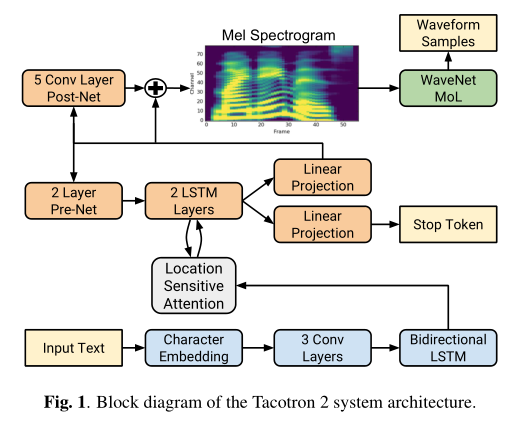

# Tacotron2

基本信息

- 标题: "Natural TTS Synthesis by Conditioning WaveNet on Mel Spectrogram Predictions"
- 作者:
  - 01 Jonathan Shen,
  - 02 Ruoming Pang,
  - 03 Ron J. Weiss,
  - 04 Mike Schuster,
  - 05 Navdeep Jaitly,
  - 06 Zongheng Yang,
  - 07 Zhifeng Chen,
  - 08 Yu Zhang,
  - 09 Yuxuan Wang,
  - 10 RJ Skerry-Ryan,
  - 11 Rif A. Saurous,
  - 12 Yannis Agiomyrgiannakis,
  - 13 Yonghui Wu
- 链接:
  - [ArXiv](https://arxiv.org/abs/1712.05884)
  - [Publication](https://doi.org/10.1109/ICASSP.2018.8461368)
  - [Github]
    - 2018.05.04 [NVIDIA/tacotron2](https://github.com/NVIDIA/tacotron2)
    - [coqui-ai/TTS](https://github.com/coqui-ai/TTS/blob/dev/TTS/tts/models/tacotron2.py)
  - [Demo](https://google.github.io/tacotron/publications/tacotron2)
- 文件:
  - [ArXiv](_PDF/1712.05884v2__Tacotron2__Natural_TTS_Synthesis_by_Conditioning_WaveNet_on_Mel_Spectrogram_Predictions.pdf)
  - [Publication](_PDF/1712.05884p0__Tacotron2__ICASSP2018.pdf)

## Abstract: 摘要

<table>
<tr>
<td width="50%">

This paper describes ***Tacotron2***, a neural network architecture for speech synthesis directly from text.
The system is composed of a recurrent sequence-to-sequence feature prediction network that maps character embeddings to mel-scale spectrograms, followed by a modified WaveNet model acting as a vocoder to synthesize time-domain waveforms from those spectrograms.
Our model achieves a mean opinion score (MOS) of 4.53 comparable to a MOS of 4.58 for professionally recorded speech.
To validate our design choices, we present ablation studies of key components of our system and evaluate the impact of using mel spectrograms as the conditioning input to WaveNet instead of linguistic, duration, and F0 features.
We further show that using this compact acoustic intermediate representation allows for a significant reduction in the size of the WaveNet architecture.

</td>
<td>

本文描述了 ***Tacotron2***, 一个神经网络架构用于直接从文本进行语音合成.
该系统由循环序列到序列特征预测网络 (将字符嵌入映射到梅尔尺度频谱图) 后接修改版的 WaveNet 模型 (作为声码器用于从这些频谱图合成时域波形) 组成.
我们的模型达到了 4.53 的平均意见得分, 而专业录制的语音的平均意见得分为 4.58.
为了验证我们的设计选择, 我们展示了我们系统中关键组件的消融实验, 并评估使用梅尔频谱而不是语言时长和 F0 特征作为 WaveNet 的条件输入的影响.
我们进一步展示了使用这一紧凑声学中间表示可以显著减小 WaveNet 架构的大小.

</td>
</tr>
</table>

## 1·Introduction: 引言

<table>
<tr>
<td width="50%">

Generating natural speech from text (text-to-speech synthesis, TTS) remains a challenging task despite decades of investigation [^01].
Over time, different techniques have dominated the field.
**Concatenative Synthesis** with unit selection, the process of stitching small units of pre-recorded waveforms together [^02], [^03] was the state-of-the-art for many years.
**Statistical Parametric Speech Synthesis** [^04], [^05], [^06], [^07], which directly generates smooth trajectories of speech features to be synthesized by a vocoder, followed, solving many of the issues that concatenative synthesis had with boundary artifacts.
However, the audio produced by these systems often sounds muffled and unnatural compared to human speech.

[^01]: [Book: Text-to-Speech Synthesis.](../../_Books/2009_Text-to-Speech_Synthesis.md) Cambridge University Press 2009.
[^02]: Unit Selection in a Concatenative Speech Synthesis System Using a Large Speech Database. ICASSP 1996.
[^03]: Automatically Clustering Similar Units for Unit Selection in Speech Synthesis. Eurospeech 1997.
[^04]: Speech Parameter Generation Algorithms for HMM-Based Speech Synthesis. ICASSP 2000.
[^05]: Statistical Parametric Speech Synthesis. Speech Communication 2009.
[^06]: Statistical Parametric Speech Synthesis Using Deep Neural Networks. ICASSP 2013.
[^07]: Speech Synthesis Based on Hidden Markov Models. IEEE 2013.

</td>
<td>

</td>
</tr>
<tr>
<td>

**WaveNet**[^08], a generative model of time domain waveforms, produces audio quality that begins to rival that of real human speech and is already used in some complete TTS systems (**DeepVoice**[^09], **DeepVoice2**[^10], **DeepVoice3**[^11]).
The inputs to WaveNet (linguistic features, predicted log fundamental frequency (F0), and phoneme durations), however, require significant domain expertise to produce, involving elaborate text-analysis systems as well as a robust lexicon (pronunciation guide).

[^08]: [**WaveNet**: A Generative Model for Raw Audio.](../Vocoder/2016.09.12_WaveNet.md) ArXiv 2016.
[^09]: [**Deep Voice**: Real-time Neural Text-to-Speech.](../TTS0_System/2017.02.25_DeepVoice.md) ArXiv 2017.
[^10]: [**Deep Voice 2**: Multi-Speaker Neural Text-to-Speech.](../TTS0_System/2017.05.24_DeepVoice2.md) ArXiv 2017.
[^11]: [**Deep Voice 3**: 2000-Speaker Neural Text-to-Speech.](../Acoustic/2017.10.20_DeepVoice3.md) ArXiv 2017.

</td>
<td>

</td>
</tr>
<tr>
<td>

**Tacotron**[^12], a **Sequence-to-Sequence** architecture[^13] for producing magnitude spectrograms from a sequence of characters, simplifies the traditional speech synthesis pipeline by replacing the production of these linguistic and acoustic features with a single neural network trained from data alone.
To vocode the resulting magnitude spectrograms, Tacotron uses the **Griffin-Lim** algorithm[^14] for phase estimation, followed by an inverse short-time Fourier transform.
As the authors note, this was simply a placeholder for future neural vocoder approaches, as Griffin-Lim produces characteristic artifacts and lower audio quality than approaches like WaveNet.

[^12]: [**Tacotron**: Towards End-to-End Speech Synthesis.](../Acoustic/2017.03.29_Tacotron.md) InterSpeech 2017.
[^13]: [Sequence-to-Sequence Learning with Neural Networks.](../_Basis/2014.09.10_Seq2Seq.md) 2014.
[^14]: [Signal Estimation from Modified Short-Time Fourier Transform](../Vocoder/1984.04.00_Griffin-Lim.md)

</td>
</tr>
<tr>
<td>

In this paper, we describe a unified, entirely neural approach to speech synthesis that combines the best of the previous approaches: a sequence-to-sequence **Tacotron**-style[^12] model that generates mel spectrograms, followed by a modified WaveNet vocoder (**DeepVoice**[^10], **Speaker-Dependent WaveNet**[^15]).
Trained directly on normalized character sequences and corresponding speech waveforms, our model learns to synthesize natural sounding speech that is difficult to distinguish from real human speech.

[^15]: Speaker-Dependent WaveNet Vocoder. InterSpeech 2017.

</td>
<td>

</td>
</tr>
<tr>
<td>

**DeepVoice3**[^11] describes a similar approach.
However, unlike our system, its naturalness has not been shown to rival that of human speech.
**Char2Wav**[^16] describes yet another similar approach to end-to-end TTS using a neural vocoder.
However, they use different intermediate representations (traditional vocoder features) and their model architecture differs significantly.

[^16]: [**Char2Wav**: End-to-End Speech Synthesis.](../E2E/2017.02.18_Char2Wav.md) ICLR 2017.

</td>
<td>

</td>
</tr>
</table>

## 2·Related Works: 相关工作

None

## 3·Methodology: 方法

<table>
<tr>
<td width="50%">

Our proposed system consists of two components, shown in Figure.01: (1) a recurrent sequence-to-sequence feature prediction network with attention which predicts a sequence of mel spectrogram frames from an input character sequence, and (2) a modified version of WaveNet which generates time-domain waveform samples conditioned on the predicted mel spectrogram frames.

</td>
<td>

</td>
</tr>
</table>

### 3.1.Intermediate Feature Representation: 中间特征表示

<table>
<tr>
<td width="50%">

In this work we choose a low-level acoustic representation: mel-frequency spectrograms, to bridge the two components.
Using a representation that is easily computed from time-domain waveforms allows us to train the two components separately.
This representation is also smoother than waveform samples and is easier to train using a squared error loss because it is invariant to phase within each frame.

</td>
<td>

</td>
</tr>
<tr>
<td>

A mel-frequency spectrogram is related to the linear-frequency spectrogram, i.e., the short-time Fourier transform (STFT) magnitude.
It is obtained by applying a nonlinear transform to the frequency axis of the STFT, inspired by measured responses from the human auditory system, and summarizes the frequency content with fewer dimensions.
Using such an auditory frequency scale has the effect of emphasizing details in lower frequencies, which are critical to speech intelligibility, while de-emphasizing high frequency details, which are dominated by fricatives and other noise bursts and generally do not need to be modeled with high fidelity.
Because of these properties, features derived from the mel scale have been used as an underlying representation for speech recognition for many decades [^17].

[^17]: Comparison of Parametric Representations for Monosyllabic Word Recognition in Continuously Spoken Sentences. TASLP 1980.

</td>
<td>

</td>
</tr>
<tr>
<td>

While linear spectrograms discard phase information (and are therefore lossy), algorithms such as **Griffin-Lim**[^14] are capable of estimating this discarded information, which enables time-domain conversion via the inverse short-time Fourier transform.
Mel spectrograms discard even more information, presenting a challenging inverse problem.
However, in comparison to the linguistic and acoustic features used in WaveNet, the mel spectrogram is a simpler, lower-level acoustic representation of audio signals.
It should therefore be straightforward for a similar WaveNet model conditioned on mel spectrograms to generate audio, essentially as a neural vocoder.
Indeed, we will show that it is possible to generate high quality audio from mel spectrograms using a modified WaveNet architecture.

</td>
<td>

</td>
</tr>
</table>

### 3.2.Spectrogram Prediction Network: 频谱预测网络

<table>
<tr>
<td width="50%">

As in Tacotron, mel spectrograms are computed through a short-time Fourier transform (STFT) using a 50 ms frame size, 12.5 ms frame hop, and a Hann window function.
We experimented with a 5 ms frame hop to match the frequency of the conditioning inputs in the original WaveNet, but the corresponding increase in temporal resolution resulted in significantly more pronunciation issues.

</td>
<td>

</td>
</tr>
<tr>
<td>

We transform the STFT magnitude to the mel scale using an 80 channel mel filterbank spanning 125 Hz to 7.6 kHz, followed by log dynamic range compression.
Prior to log compression, the filterbank output magnitudes are clipped to a minimum value of 0.01 in order to limit dynamic range in the logarithmic domain.

</td>
<td>

</td>
</tr>
<tr>
<td>

The network is composed of an encoder and a decoder with attention.
The encoder converts a character sequence into a hidden feature representation which the decoder consumes to predict a spectrogram.
Input characters are represented using a learned 512-dimensional character embedding, which are passed through a stack of 3 convolutional layers each containing 512 filters with shape5 × 1, i.e., where each filter spans 5 characters, followed by **Batch Normalization**[^18] and ReLU activations.
As in Tacotron, these convolutional layers model longer-term context (e.g.,N-grams) in the input character sequence.
The output of the final convolutional layer is passed into a single bi-directional[^19] **LSTM**[^20] layer containing 512 units (256 in each direction) to generate the encoded features.

[^18]: [**Batch Normalization**: Accelerating Deep Network Training by Reducing Internal Covariate Shift.](../../Modules/Normalization/2015.02.11_BatchNorm.md) ICML 2015.
[^19]: Bidirectional Recurrent Neural Networks. TSP 1997.
[^20]: [**LSTM**: Long Short-Term Memory.](../_Basis/2014.02.05_LSTM.md) Neural Computation. 1997.

</td>
<td>

</td>
</tr>
<tr>
<td>

The encoder output is consumed by an attention network which summarizes the full encoded sequence as a fixed-length context vector for each decoder output step.
We use the location-sensitive attention from [^21], which extends the additive attention mechanism [^22] to use cumulative attention weights from previous decoder time steps as an additional feature.
This encourages the model to move forward consistently through the input, mitigating potential failure modes where some subsequences are repeated or ignored by the decoder.
Attention probabilities are computed after projecting inputs and location features to 128-dimensional hidden representations.
Location features are computed using 32 1-D convolution filters of length 31.

[^21]: Attention-Based Models for Speech Recognition. NIPS 2015.
[^22]: Neural Machine Translation by Jointly Learning to Align and Translate. ICLR 2015.

</td>
<td>

</td>
</tr>
<tr>
<td>

The decoder is an autoregressive recurrent neural network which predicts a mel spectrogram from the encoded input sequence one frame at a time.
The prediction from the previous time step is first passed through a small pre-net containing 2 fully connected layers of 256 hidden ReLU units.
We found that the pre-net acting as an information bottleneck was essential for learning attention.
The pre-net output and attention context vector are concatenated and passed through a stack of 2 uni-directional LSTM layers with 1024 units.
The concatenation of the LSTM output and the attention context vector is projected through a linear transform to predict the target spectrogram frame.
Finally, the predicted mel spectrogram is passed through a 5-layer convolutional post-net which predicts a residual to add to the prediction to improve the overall reconstruction.
Each post-net layer is comprised of 512 filters with shape5 × 1with batch normalization, followed by tanh activations on all but the final layer.

</td>
<td>

</td>
</tr>
<tr>
<td>

We minimize the summed mean squared error (MSE) from before and after the post-net to aid convergence.
We also experimented with a log-likelihood loss by modeling the output distribution with a Mixture Density Network [^23], [^24] to avoid assuming a constant variance over time, but found that these were more difficult to train and they did not lead to better sounding samples.

[^23]: Mixture Density Networks. 1994.
[^24]: PhD Thesis: On Supervised Learning from Sequential Data with Applications for Speech Recognition. 1999.

</td>
<td>

</td>
</tr>
<tr>
<td>

In parallel to spectrogram frame prediction, the concatenation of decoder LSTM output and the attention context is projected down to a scalar and passed through a sigmoid activation to predict the probability that the output sequence has completed.
This “stop token” prediction is used during inference to allow the model to dynamically determine when to terminate generation instead of always generating for a fixed duration.
Specifically, generation completes at the first frame for which this probability exceeds a threshold of 0.5.

</td>
<td>

</td>
</tr>
<tr>
<td>

The convolutional layers in the network are regularized using **Dropout**[^25] with probability 0.5, and LSTM layers are regularized using **Zoneout**[^26] with probability 0.1.
In order to introduce output variation at inference time, dropout with probability 0.5 is applied only to layers in the pre-net of the autoregressive decoder.

[^25]: [**Dropout**: A Simple Way to Prevent Neural Networks from Overfitting.](../_Basis/Dropout.md) JMLR 2014.
[^26]: [**Zoneout**: Regularizing RNNs by Randomly Preserving Hidden Activations.](../_Basis/Zoneout.md) ICLR 2017.

</td>
<td>

</td>
</tr>
<tr>
<td>

In contrast to the original Tacotron, our model uses simpler building blocks, using vanilla LSTM and convolutional layers in the encoder and decoder instead of “CBHG” stacks and GRU recurrent layers.
We do not use a “reduction factor”, i.e., each decoder step corresponds to a single spectrogram frame.

</td>
<td>

</td>
</tr>
</table>

### 3.3.WaveNet Vocoder: WaveNet 声码器

<table>
<tr>
<td width="50%">

We use a modified version of the **WaveNet**[^08] architecture to invert the mel spectrogram feature representation into time-domain waveform samples.
As in the original architecture, there are 30 dilated convolution layers, grouped into 3 dilation cycles, i.e., the dilation rate of layer k (k = 0 . . . 29) is2k (mod 10).
To work with the 12.5 ms frame hop of the spectrogram frames, only 2 upsampling layers are used in the conditioning stack instead of 3 layers.

</td>
<td>

</td>
</tr>
<tr>
<td>

Instead of predicting discretized buckets with a softmax layer, we follow **PixelCNN++**[^27] and **Parallel WaveNet**[^28] and use a 10-component mixture of logistic distributions (MoL) to generate 16-bit samples at 24 kHz.
To compute the logistic mixture distribution, the WaveNet stack output is passed through a ReLU activation followed by a linear projection to predict parameters (mean, log scale, mixture weight) for each mixture component.
The loss is computed as the negative log-likelihood of the ground truth sample.

[^27]: **PixelCNN++**: Improving the PixelCNN with Discretized Logistic Mixture Likelihood and Other Modifications. ICLR 2017.
[^28]: [**Parallel WaveNet**: Fast High-Fidelity Speech Synthesis.](../Vocoder/2017.11.28_Parallel_WaveNet.md) ArXiv 2017..

</td>
<td>

</td>
</tr>
</table>

## 4·Experiments: 实验

### 4.1.Training Setup: 训练设置

[^29]: [**Adam**: A Method for Stochastic Optimization.](../../Modules/Optimization/2014.12.22_Adam.md) ICLR 2015.

### 4.2.Evaluation: 评价

[^30]: Recent Advances in Google Real-Time HMM-Driven Unit Selection Synthesize. InterSpeech 2016.
[^31]: Fast, Compact, and High-Quality LSTM-RNN Based Statistical Parametric Speech Synthesizers for Mobile Devices. InterSpeech 2016.

### 4.3.Ablation Studies: 消融研究

## 5·Results: 结果

## 6·Conclusions: 结论

<table>
<tr>
<td width="50%">

This paper describes ***Tacotron2***, a fully neural TTS system that combines a sequence-to-sequence recurrent network with attention to predicts mel spectrograms with a modified WaveNet vocoder.
The resulting system synthesizes speech with Tacotron-level prosody and WaveNet-level audio quality.
This system can be trained directly from data without relying on complex feature engineering, and achieves state-of-the-art sound quality close to that of natural human speech.

</td>
<td>

</td>
</tr>
</table>