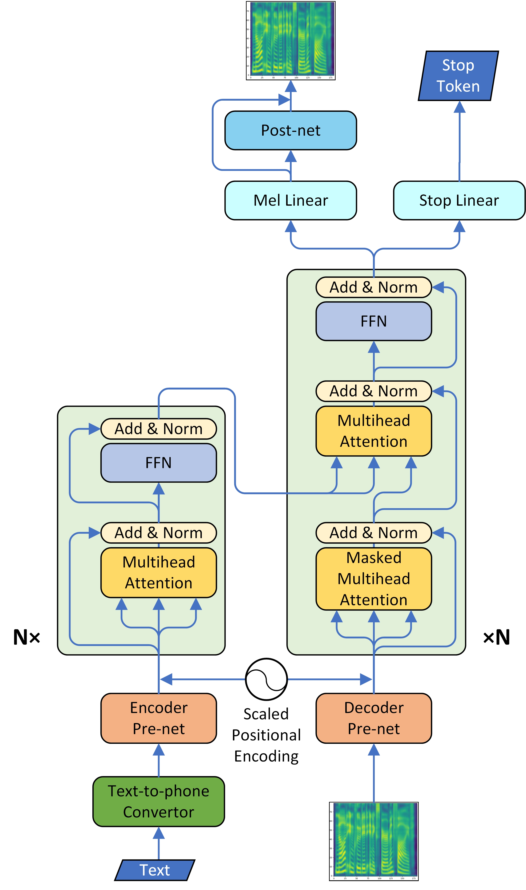

# Transformer TTS/Transtron

基本信息

- 标题: "Neural Speech Synthesis with Transformer Network"
- 作者:
  - 01 Naihan Li
  - 02 Shujie Liu (刘树杰)
  - 03 Yanqing Liu
  - 04 Sheng Zhao (赵胜)
  - 05 Ming Liu
- 链接:
  - [ArXiv](https://arxiv.org/abs/1809.08895)
  - [Publication](https://doi.org/10.1609/aaai.v33i01.33016706)
  - [Github]()
  - [Demo]()
- 文件:
  - [ArXiv](_PDF/1809.08895v3__TransformerTTS__Neural_Speech_Synthesis_with_Transformer_Network.pdf)
  - [Publication](_PDF/1809.08895p0__TransformerTTS__AAAI2019.pdf)

## Abstract: 摘要

Although end-to-end neural text-to-speech (TTS) methods (such as Tacotron2) are proposed and achieve state-of-the-art performance, they still suffer from two problems:
1. low efficiency during training and inference;
2. hard to model long dependency using current recurrent neural networks (RNNs).

Inspired by the success of Transformer network in neural machine translation (NMT), in this paper, we introduce and adapt the multi-head attention mechanism to replace the RNN structures and also the original attention mechanism in Tacotron2.
With the help of multi-head self-attention, the hidden states in the encoder and decoder are constructed in parallel, which improves training efficiency.
Meanwhile, any two inputs at different times are connected directly by a self-attention mechanism, which solves the long range dependency problem effectively.
Using phoneme sequences as input, our Transformer TTS network generates mel spectrograms, followed by a WaveNet vocoder to output the final audio results.
Experiments are conducted to test the efficiency and performance of our new network.
For the efficiency, our Transformer TTS network can speed up the training about 4.25 times faster compared with Tacotron2.
For the performance, rigorous human tests show that our proposed model achieves state-of-the-art performance (outperforms Tacotron2 with a gap of 0.048) and is very close to human quality (4.39 vs 4.44 in MOS).

## 1·Introduction: 引言

## 2·Related Works: 相关工作

## 3·Methodology: 方法

## 4·Experiments: 实验

## 5·Results: 结果

## 6·Conclusions: 结论

We propose a neural TTS model based on Tacotron2 and Transformer, and make some modification to adapt Transformer to neural TTS task.
Our model generates audio samples of which quality is very closed to human recording, and enables parallel training and learning long-distance dependency so that the training is sped up and the audio prosody is much more smooth.
We find that batch size is crucial for training stability, and more layers can refine the detail of generated mel spectrograms especially for high frequency regions thus improve model performance.

Even thought Transformer has enabled parallel training, autoregressive model still suffers from two problems, which are slow inference and exploration bias.
Slow inference is due to the dependency of previous frames when infer current frame, so that the inference is sequential, while exploration bias comes from the autoregressive error accumulation.
We may solve them both at once by building a non-autoregressive model, which is also our current research in progress.
