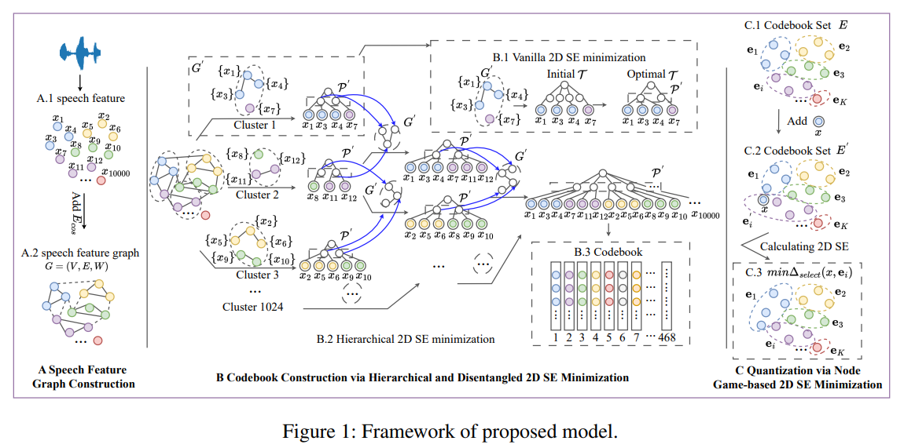

# 神经音频编解码器 (Neural Audio Codec)

## EnCodec

- 标题: High Fidelity Neural Audio Compression.
- 机构: MetaAI FAIR Team
- 代码: [Facebook Research](http://github.com/facebookresearch/encodec)
- 时间: 2022.10.24
- 发表: TMLR2023

## SpeechTokenizer

- 标题: SpeechTokenizer: Unified Speech Tokenizer for Speech Large Language Models.
- 代码: [Github](https://github.com/ZhangXInFD/SpeechTokenizer/)
- 时间: 2023.08.31
- 发表: ICLR2024

对比: EnCodec, HuBERT

## SECodec

- 标题: Structural Entropy-Based Compressive Speech Representation Codec for Speech Language Models.
- 机构: 中国-昆明理工大学
- 代码: [暂未开源](https://github.com/wlq2019/SECodec)
- 时间: 2024.12.16
- 发表: AAAI2025

动机:
1. 码本大小直接影响 Codec 的性能和下游任务的训练效率;
2. 码本大小在合理范围时, 基于欧氏距离的量化可能导致音频失真.

方法: 从信息论视角出发, 提出基于**结构熵 (Structural Entropy)** 的 SECodec:
1. 将语音建模为图结构, 在图中对语音特征节点进行聚类, 并通过分层且解耦地最小化二维结构熵来提取对应的码本.
2. 提出了新量化方法, 为每个输入的原始语音节点自适应地选择其所属聚类的最合适的 Token.

对比: EnCodec, SpeechTokenizer

# Benchmark

- SLMTokBench: SpeechTokenizer 使用的基准.
  - 代码: [0nutation 暂未开源](https://github.com/0nutation/SLMTokBench)
  - 替代链接: [CodecEvaluation](https://github.com/xzm2004260/CodecEvaluation)