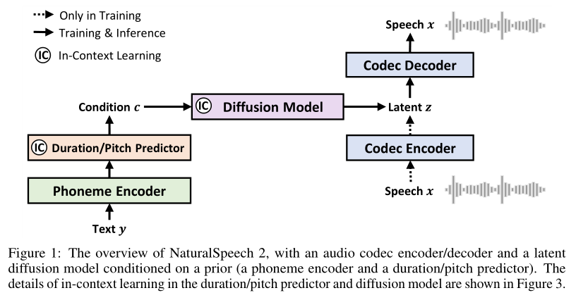
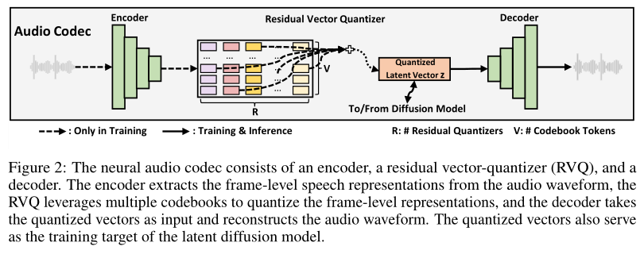

# NaturalSpeech 2

基本信息

- 标题: NaturalSpeech 2: Latent Diffusion Models are Natural and Zero-Shot Speech and Singing Synthesizers
- 作者:
  - 01 [Kai Shen](../../Authors/Kai_Shen_(沈锴).md)
  - 02 [Zeqian Ju](../../Authors/Zeqian_Ju_(琚泽谦).md)
  - 03 [Xu Tan](../../Authors/Xu_Tan_(谭旭).md)
  - 04 [Yanqing Liu](../../Authors/Yanqing_Liu.md)
  - 05 [Yichong Leng](../../Authors/Yichong_Leng.md)
  - 06 [Lei He](../../Authors/Lei_He_(何磊).md)
  - 07 [Tao Qin](../../Authors/Tao_Qin_(秦涛).md)
  - 08 [Sheng Zhao](../../Authors/Sheng_Zhao_(赵胜).md)
  - 09 [Jiang Bian](../../Authors/Jiang_Bian_(边江).md)
- 机构:
  - [ICLR 2024](../../Publications/ICLR.md)
- 时间:
  - 预印时间: 2023.04.18 ArXiv v1
  - 预印时间: 2023.05.04 ArXiv v2
  - 预印时间: 2023.05.30 ArXiv v3
  - 发表时间: 2024.01.16
  - 更新笔记: 2024.06.25
- 发表:
  - 期刊/会议
- 链接:
  - [ArXiv](https://arxiv.org/abs/2304.09116)
  - [DOI](https://openreview.net/forum?id=Rc7dAwVL3v)
  <!-- - [Github]() -->
  - [Demo](https://speechresearch.github.io/naturalspeech2)
  - [Scholar](https://scholar.google.com/scholar?cluster=14054874329026525619)
- 标签:
  - [语音合成](../../Tags/SpeechSynthesis.md)
  - [零样本](../../Tags/Zero-Shot.md)
  - [模型-扩散模型](../../Tags/Model_Diffusion.md)
- 页数: 22
- 引用: 53
- 被引: 95
- 数据:
  - [Multilingual LibriSpeech](../../Datasets/2020.12.07_MLS.md)
  - [LibriSpeech](../../Datasets/2015.04.19_LibriSpeech.md)
  - [VCTK](../../Datasets/2012.08.00_VCTK.md)
- 对比:
  - [YourTTS](../../Models/E2E/2021.12.04_YourTTS.md)
  - [Tacotron](../../Models/TTS2_Acoustic/2017.03.29_Tacotron.md) AR
  - [Transformer TTS](../TTS2_Acoustic/2018.09.19_TransformerTTS.md) AR
  - [FastSpeech](../../Models/TTS2_Acoustic/2019.05.22_FastSpeech.md) NAR
  - [NaturalSpeech](../../Models/E2E/2022.05.09_NaturalSpeech.md) NAR
  - [VALL-E](../../Models/Speech_LLM/2023.01.05_VALL-E.md)
- 复现:
  - 2023.04.19 [lucidrains/naturalspeech2-pytorch](https://github.com/lucidrains/naturalspeech2-pytorch)
  - 2023.12.16 [open-mmlab/Amphion](https://github.com/open-mmlab/Amphion/tree/main/models/tts/naturalspeech2)

## Abstract: 摘要

> Scaling text-to-speech (TTS) to large-scale, multi-speaker, and in-the-wild datasets is important to capture the diversity in human speech such as speaker identities, prosodies, and styles (e.g., singing).
> Current large TTS systems usually quantize speech into discrete tokens and use language models to generate these tokens one by one, which suffer from unstable prosody, word skipping/repeating issue, and poor voice quality.
> In this paper, we develop ***NaturalSpeech2***, a TTS system that leverages a neural audio codec with residual vector quantizers to get the quantized latent vectors and uses a diffusion model to generate these latent vectors conditioned on text input.
> To enhance the zero-shot capability that is important to achieve diverse speech synthesis, we design a speech prompting mechanism to facilitate in-context learning in the diffusion model and the duration/pitch predictor.
> We scale ***NaturalSpeech2*** to large-scale datasets with 44K hours of speech and singing data and evaluate its voice quality on unseen speakers.
> ***NaturalSpeech2*** outperforms previous TTS systems by a large margin in terms of prosody/timbre similarity, robustness, and voice quality in a zero-shot setting, and performs novel zero-shot singing synthesis with only a speech prompt.
> Audio samples are available at https://speechresearch.github.io/naturalspeech2.

## 1.Introduction: 引言

> Human speech is full of diversity, with different speaker identities (e.g., gender, accent, timbre), prosodies, styles (e.g., speaking, singing), etc.
> Text-to-speech (TTS) ([Text-to-Speech Synthesis](); [A Survey on Neural Speech Synthesis](../../Surveys/2021.06.29_A_Survey_on_Neural_Speech_Synthesis_63P/_ToC.md)) aims to synthesize natural and human-like speech with both good quality and diversity.
> With the development of neural networks and deep learning, TTS systems ([Tacotron](../../Models/TTS2_Acoustic/2017.03.29_Tacotron.md); [Tacotron2](../../Models/TTS2_Acoustic/2017.12.16_Tacotron2.md); [Transformer TTS](../TTS2_Acoustic/2018.09.19_TransformerTTS.md); [FastSpeech](../../Models/TTS2_Acoustic/2019.05.22_FastSpeech.md); [FastSpeech2](../../Models/TTS2_Acoustic/2020.06.08_FastSpeech2.md); [DelightfulTTS](../../Models/TTS2_Acoustic/2021.10.25_DelightfulTTS.md); [DelightfulTTS2](../../Models/TTS2_Acoustic/2022.07.11_DelightfulTTS2.md); [VITS](../../Models/E2E/2021.06.11_VITS.md); [NaturalSpeech](../../Models/E2E/2022.05.09_NaturalSpeech.md) have achieved good voice quality in terms of intelligibility and naturalness, and some systems (e.g., [NaturalSpeech](../../Models/E2E/2022.05.09_NaturalSpeech.md)) even achieves human-level voice quality on single-speaker recording-studio benchmarking datasets (e.g., [LJSpeech](../../Datasets/2017.07.05_LJSpeech.md)).
> Given the great achievements in speech intelligibility and naturalness made by the whole TTS community, now we enter a new era of TTS where speech diversity becomes more and more important in order to synthesize natural and human-like speech.

> Previous speaker-limited recording-studio datasets are not enough to capture the diverse speaker identities, prosodies, and styles in human speech due to limited data diversity.
> Instead, we can train TTS models on a large-scale corpus to learn these diversities, and as a by-product, these trained models can generalize to the unlimited unseen scenarios with few-shot or zero-shot technologies.
> Current large-scale TTS systems ([VALL-E](../../Models/Speech_LLM/2023.01.05_VALL-E.md); [SPEAR-TTS](../../Models/Speech_LLM/2023.02.07_SPEAR-TTS.md); [FoundationTTS](../../Models/Speech_LLM/2023.03.06_FoundationTTS.md)) usually quantize the continuous speech waveform into discrete tokens and model these tokens with autoregressive language models.
> This pipeline suffers from several limitations: 
> 1. The speech (discrete token) sequence is usually very long (a 10s speech usually has thousands of discrete tokens) and the autoregressive models suffer from error propagation and thus unstable speech outputs. 
> 2. There is a dilemma between the codec and language model: on the one hand, the codec with token quantization ([VQ-VAE](../../Modules/VQ/2017.11.02_VQ-VAE.md); [VQ-VAE-2](../../Modules/VQ/VQ-VAE-2.md) or [VQ-GAN](../../Models/_Basis/2020.12.17_VQGAN.md)) usually has a low bitrate token sequence, which, although eases the language model generation, incurs information loss on the high-frequency fine-grained acoustic details; 
> on the other hand, some improving methods ([SoundStream](../../Models/Speech_Neural_Codec/2021.07.07_SoundStream.md); [EnCodec](../../Models/Speech_Neural_Codec/2022.10.24_EnCodec.md)) use multiple residual discrete tokens to represent a speech frame, which increases the length of the token sequence multiple times if flattened and incurs difficulty in language modeling.

> In this paper, we propose ***NaturalSpeech2***, a TTS system with latent diffusion models to achieve expressive prosody, good robustness, and most importantly strong zero-shot ability for speech synthesis.
> As shown in Figure.01, we first train a neural audio codec that converts a speech waveform into a sequence of latent vectors with a codec encoder, and reconstructs the speech waveform from these latent vectors with a codec decoder.
> After training the audio codec, we use the codec encoder to extract the latent vectors from the speech in the training set and use them as the target of the latent diffusion model, which is conditioned on prior vectors obtained from a phoneme encoder, a duration predictor, and a pitch predictor.
> During inference, we first generate the latent vectors from the text/phoneme sequence using the latent diffusion model and then generate the speech waveform from these latent vectors using the codec decoder.

> We elaborate on some design choices in ***NaturalSpeech2*** (shown in Table.01) as follows.
> - Continuous vectors instead of discrete tokens.
> To ensure the speech reconstruction quality of the neural codec, previous works usually quantize speech with multiple residual quantizers.
> As a result, the obtained discrete token sequence is very long (e.g., if using 8 residual quantizers for each speech frame, the resulting flattened token sequence will be 8 times longer), and puts much pressure on the acoustic model (autoregressive language model).
> Therefore, we use continuous vectors instead of discrete tokens, which can reduce the sequence length and increase the amount of information for fine-grained speech reconstruction (see Section 3.1).
> - Diffusion models instead of autoregressive models.
> We leverage diffusion models to learn the complex distributions of continuous vectors in a non-autoregressive manner and avoid error propagation in autoregressive models (see Section 3.2).
> - Speech prompting mechanisms for in-context learning.
> To encourage the diffusion models to follow the characteristics in the speech prompt and enhance the zero-shot capability, we design speech prompting mechanisms to facilitate in-context learning in the diffusion model and pitch/duration predictors (see Section 3.3).

> Benefiting from these designs, ***NaturalSpeech2*** is more stable and robust than previous autoregressive models, and only needs one acoustic model (the diffusion model) instead of two-stage token prediction as in ([AudioLM](../../Models/Speech_LLM/2022.09.07_AudioLM.md); [VALL-E](../../Models/Speech_LLM/2023.01.05_VALL-E.md)), and can extend the styles beyond speech (e.g., singing voice) due to the duration/pitch prediction and non-autoregressive generation.

> We scale ***NaturalSpeech2*** to 400M model parameters and 44K hours of speech data, and generate speech with diverse speaker identities, prosody, and styles (e.g., singing) in zero-shot scenarios (given only a few seconds of speech prompt).
> Experiment results show that ***NaturalSpeech2*** can generate natural speech in zero-shot scenarios and outperform the previous strong TTS systems.
> Specifically, 
> 1. it achieves more similar prosody with both the speech prompt and ground-truth speech; 
> 2. it achieves comparable or better naturalness (in terms of CMOS) than the ground-truth speech on [LibriSpeech](../../Datasets/2015.04.19_LibriSpeech.md) and [VCTK](../../Datasets/2012.08.00_VCTK.md) test sets; 
> 3. it can generate singing voices in a novel timbre either with a short singing prompt, or interestingly with only a speech prompt, which unlocks the truly zero-shot singing synthesis (without a singing prompt).
> 
> Audio samples can be found in https://speechresearch.github.io/naturalspeech2.

## 2.Related Works: 相关工作

> We introduce some background of ***NaturalSpeech2***, including the journey of text-to-speech synthesis on pursuing natural voice with high quality and diversity, neural audio codec models, and generative models for audio synthesis.

### 2.1.TTS for Natural Voice: Quality and Diversity

> Text-to-speech systems ([Tacotron](../../Models/TTS2_Acoustic/2017.03.29_Tacotron.md); [Tacotron2](../../Models/TTS2_Acoustic/2017.12.16_Tacotron2.md); [Transformer-TTS](../TTS2_Acoustic/2018.09.19_TransformerTTS.md); [FastSpeech](../../Models/TTS2_Acoustic/2019.05.22_FastSpeech.md); [DelightfulTTS](../../Models/TTS2_Acoustic/2021.10.25_DelightfulTTS.md); [DelightfulTTS2](../../Models/TTS2_Acoustic/2022.07.11_DelightfulTTS2.md); [DiffSinger](../../Models/Singing_Voice/2021.05.06_Diffsinger.md); [VITS](../../Models/E2E/2021.06.11_VITS.md); [NaturalSpeech](../../Models/E2E/2022.05.09_NaturalSpeech.md)) aim to generate natural voice with both high quality and diversity.
> While previous neural TTS systems can synthesize high-quality voice on single-speaker recording-studio datasets (e.g., [LJSpeech](../../Datasets/2017.07.05_LJSpeech.md)) and even achieve human-level quality (e.g., [NaturalSpeech](../../Models/E2E/2022.05.09_NaturalSpeech.md)), they cannot generate diverse speech with different speaker identities, prosodies, and styles, which are critical to ensure the naturalness of the synthesized speech.
> Thus, some recent works ([VALL-E](../../Models/Speech_LLM/2023.01.05_VALL-E.md); [SPEAR-TTS](../../Models/Speech_LLM/2023.02.07_SPEAR-TTS.md); [FoundationTTS](../../Models/Speech_LLM/2023.03.06_FoundationTTS.md)) attempt to scale the TTS systems to large-scale, multi-speaker, and in-the-wild datasets to pursue diversity.

> These systems usually leverage a neural codec to convert speech waveform into discrete token sequence and an autoregressive language model to generate discrete tokens from text, which suffers from a dilemma as shown in Table.02: 
> 1. If the audio codec quantizes each speech frame into a single token with vector-quantizer (VQ) ([VQ-VAE](../../Modules/VQ/2017.11.02_VQ-VAE.md); [VQ-VAE-2](../../Modules/VQ/VQ-VAE-2.md); [VQ-GAN](../../Models/_Basis/2020.12.17_VQGAN.md)), this could ease the token generation in the language model due to short sequence length, but will affect the waveform reconstruction quality due to large compression rate or low bitrate. 
> 2. If the audio codec quantizes each speech frame into multiple tokens with residual vector-quantizer (RVQ) ([SoundStream](../../Models/Speech_Neural_Codec/2021.07.07_SoundStream.md); [EnCodec](../../Models/Speech_Neural_Codec/2022.10.24_EnCodec.md)), this will ensure high-fidelity waveform reconstruction, but will cause difficulty in autoregressive model generation (error propagation and robust issues) due to the increased length in the token sequence.
> 
> Thus, previous works such as [AudioLM](../../Models/Speech_LLM/2022.09.07_AudioLM.md) leverage two-stage language models to first generate some coarse-grained tokens in each frame and then generate the remaining fine-grained tokens, which are complicated and incur cascaded errors.
> To avoid the above dilemma, we leverage a neural codec with continuous vectors and a latent diffusion model with non-autoregressive generation.

### 2.2.Neural Audio Codec

> Neural audio codec ([WaveNet](../../Models/TTS3_Vocoder/2016.09.12_WaveNet.md); [LPCNet](../../Models/TTS3_Vocoder/2018.10.28_LPCNet.md); [SoundStream](../../Models/Speech_Neural_Codec/2021.07.07_SoundStream.md); [EnCodec](../../Models/Speech_Neural_Codec/2022.10.24_EnCodec.md)) refers to a kind of neural network model that converts audio waveform into compact representations with a codec encoder and reconstructs audio waveform from these representations with a codec decoder.
> Since audio codec is traditionally used for audio compression and transmission, the compression rate is a critical metric and thus discrete tokens with low bitrate are usually chosen as the compact representations.
> For example, [SoundStream](../../Models/Speech_Neural_Codec/2021.07.07_SoundStream.md) and [EnCodec](../../Models/Speech_Neural_Codec/2022.10.24_EnCodec.md) leverage vector-quantized variational auto-encoders (VQ-VAE) with multiple residual vector-quantizers to compress speech into multiple tokens, and have been used as the intermediate representations for speech/audio generation ([AudioLM](../../Models/Speech_LLM/2022.09.07_AudioLM.md); [AudioGen](../../Models/Speech_LLM/2022.09.30_AudioGen.md); [VALL-E](../../Models/Speech_LLM/2023.01.05_VALL-E.md); [SPEAR-TTS](../../Models/Speech_LLM/2023.02.07_SPEAR-TTS.md); [FoundationTTS](../../Models/Speech_LLM/2023.03.06_FoundationTTS.md)).

> Although good reconstruction quality and low bitrate can be achieved by residual vector quantizers, they are mainly designed for compression and transmission purposes and may not be suitable to serve as the intermediate representation for speech/audio generation.
> The discrete token sequence generated by residual quantizers is usually very long (R times longer if R residual quantizers are used), which is difficult for the language models to predict.
> Inaccurate predictions of discrete tokens will cause word skipping, word repeating, or speech collapse issues when reconstructing speech waveforms from these tokens.
> In this paper, we design a neural audio codec to convert speech waveform into continuous vectors instead of discrete tokens, which can maintain enough fine-grained details for precise waveform reconstruction without increasing the length of the sequence.

### 2.3.Generative Models for Speech Synthesis

> Different generative models have been applied to speech or audio synthesis, and among these, autoregressive models and diffusion models are the two most prominent methods.
> Autoregressive models have long been used in speech synthesis for waveform generation ([WaveNet](../../Models/TTS3_Vocoder/2016.09.12_WaveNet.md)) or acoustic feature generation ([Tacotron](../../Models/TTS2_Acoustic/2017.03.29_Tacotron.md)).
> Inspired by the success of autoregressive models in language generation [26]; [27]; [28], autoregressive models have been applied in speech and audio generation ([AudioLM](../../Models/Speech_LLM/2022.09.07_AudioLM.md); [AudioGen](../../Models/Speech_LLM/2022.09.30_AudioGen.md); [VALL-E](../../Models/Speech_LLM/2023.01.05_VALL-E.md); [SPEAR-TTS](../../Models/Speech_LLM/2023.02.07_SPEAR-TTS.md); [FoundationTTS](../../Models/Speech_LLM/2023.03.06_FoundationTTS.md)).
> Meanwhile, diffusion models have also been widely used in speech synthesis for waveform generation ([DiffWave](../../Models/TTS3_Vocoder/2020.09.21_DiffWave.md); [WaveGrad](../../Models/TTS3_Vocoder/2020.09.02_WaveGrad.md)) and acoustic feature generation ([Diff-TTS](../../Models/TTS2_Acoustic/Diff-TTS.md); [Grad-TTS](../../Models/TTS2_Acoustic/2021.05.13_Grad-TTS.md)).

> Although both models are based on iterative computation (following the left-to-right process or the denoising process), autoregressive models are more sensitive to sequence length and error propagation, which cause unstable prosody and robustness issues (e.g., word skipping, repeating, and collapse).
> Considering text-to-speech has a strict monotonic alignment and strong source-target dependency, we leverage diffusion models enhanced with duration prediction and length expansion, which are free from robust issues.

## 3.Methodology: 方法论

原文

> In this section, we introduce ***NaturalSpeech2***, a TTS system for natural and zero-shot voice synthesis with high fidelity/expressiveness/robustness on diverse scenarios (various speaker identities, prosodies, and styles).
> As shown in Figure.01, ***NaturalSpeech2*** consists of a neural audio codec (an encoder and a decoder) and a diffusion model with a prior (a phoneme encoder and a duration/pitch predictor).
> Since speech waveform is complex and high-dimensional, following the paradigm of regeneration learning [33], we first convert speech waveform into latent vectors using the audio codec encoder and reconstruct speech waveform from the latent vectors using the audio codec decoder.
> Next, we use a diffusion model to predict the latent vectors conditioned on text/phoneme input.
> We introduce the detailed designs of neural audio codec in Section 3.1 and the latent diffusion model in Section 3.2, as well as the speech prompting mechanism for in-context learning in Section 3.3.

 

这一节介绍 ***NaturalSpeech2***, 一种基于神经音频编解码器和隐变量扩散模型的自然语音合成系统, 能够在多种场景下 (不同说话人, 语调和风格) 生成高质量, 高精度, 健壮的自然语音.
如图 01 所示, ***NaturalSpeech2*** 由神经音频编解码器 (编码器和解码器) 和含有先验的扩散模型 (音素编码器和时长/音高预测器) 组成.
因为语音波形很复杂且高维, 遵循表示学习的范式, 我们首先将语音波形使用音频编解码器的编码器转化到隐向量, 然后使用音频编解码器的解码器对其重构成语音波形.
然后, 我们使用扩散模型基于文本/音素输入为条件预测隐向量.
我们在 3.1 节介绍神经音频编解码的详细设计, 3.2 节介绍潜在扩散变量, 3.3 节介绍上下文学习的语音提示机制.

### 3.1.Neural Audio Codec with Continuous Vectors: 用于连续向量的神经音频编解码器

> We use a neural audio codec to convert speech waveform into continuous vectors instead of discrete tokens, as analyzed in Section 2.1 and 2.2.
> Audio codec with continuous vectors enjoys several benefits: 
> 1. Continuous vectors have a lower compression rate and higher bitrate than discrete tokens2, which can ensure high-quality audio reconstruction. 
> 2. Each audio frame only has one vector instead of multiple tokens as in discrete quantization, which will not increase the length of the hidden sequence.
> 
> As shown in Figure.02, our neural audio codec consists of an audio encoder, a residual vector-quantizer (RVQ), and an audio decoder: 
> 1. The audio encoder consists of several convolutional blocks with a total downsampling rate of 200 for 16KHz audio, i.e., each frame corresponds to a 12.5ms speech segment. 
> 2. The residual vector-quantizer converts the output of the audio encoder into multiple residual vectors following [SoundStream](../../Models/Speech_Neural_Codec/2021.07.07_SoundStream.md).
> The sum of these residual vectors is taken as the quantized vectors, which are used as the training target of the diffusion model. 
> 3. The audio decoder mirrors the structure of the audio encoder, which generates the audio waveform from the quantized vectors.
>
> The working flow of the neural audio codec is as follows.
> - Audio Encoder: $h = f_{enc}(x)$;
> - Residual Vector Quantizer: $\{e_{j}^{i}\}_{}j=1 ^{R}= f_{rvq}(h^i), z^i = \sum_{j=1}^{R} e_{j}^{i}, z=\{ z^i \}_{i=1}^{n}$;
> - Audio Decoder: $x=f_{dec}(z)$
>
> where $f_{enc}, $f_{rvq}$, and $f_{dec}$ denote the audio encoder, residual vector quantizer, and audio decoder. 
> $x$ is the speech waveform, $h$ is the hidden sequence obtained by the audio encoder with a frame length of $n$, and $z$ is the quantized vector sequence with the same length as $h$. 
> $i$ is the index of the speech frame, $j$ is the index of the residual quantizer and $R$ is the total number of residual quantizers, and $e_j^i$ is the embedding vector of the codebook ID obtained by the $j$-th residual quantizer on the $i$-th hidden frame (i.e., $h^i$).
> The training of the neural codec follows the loss function in [SoundStream](../../Models/Speech_Neural_Codec/2021.07.07_SoundStream.md).
>

我们使用一个神经音频编解码器将语音波形转换为连续向量而不是离散标识符, 如 2.1 节和 2.2 节所述.
采用连续向量的音频编解码器有几点好处:
1. 连续向量比离散标识符的压缩率更低, 比特率更高, 可以确保高质量的音频重构.
2. 每个音频帧只有一个向量, 而不是如离散量化那样有多个标识符, 这将不会增加隐藏序列的长度.

如图 02 所示, 我们的神经音频编解码器由一个音频编码器, 残差向量量化器, 音频解码器组成:
1. 音频编码器由数个卷积块组成, 对于 16KHz 的音频总的下采样率为 200, 即每帧对应一个 12.5ms 的语音片段.
2. 残差向量量化器将音频编码器的输出转换为多个残差向量, 如 [SoundStream](../../Models/Speech_Neural_Codec/2021.07.07_SoundStream.md).
   这些残差向量的和作为量化后的向量, 作为扩散模型的训练目标.
3. 音频解码器镜像音频解码器的结果, 从量化向量生成音频波形.

神经音频编解码器的工作流如下:
- 音频编码器: $h = f_{enc}(x)$;
- 残差向量量化器: $\{e_{j}^{i}\}_{}j=1 ^{R}= f_{rvq}(h^i), z^i = \sum_{j=1}^{R} e_{j}^{i}, z=\{ z^i \}_{i=1}^{n}$;
- 音频解码器: $x = f_{dec}(z)$;

其中, 
- $f_{enc}$: 音频编码器;
- $f_{rvq}$: 残差向量量化器;
- $f_{dec}$: 音频解码器;
- $x$: 语音波形;
- $h$: 帧长为 $n$ 音频编码器输出的隐藏序列;
- $z$: 量化向量序列, 和 $h$ 一样长;
- $i$: 第 $i$ 个语音帧的索引;
- $j$: 第 $j$ 个残差量化器的索引;
- $R$: 残差量化器的总数;
- $e_j^i$: 由第 $j$ 个残差量化器对第 $i$ 个语音帧上计算得到的码本 ID 的嵌入向量.

神经编解码器的训练遵循 [SoundStream](../../Models/Speech_Neural_Codec/2021.07.07_SoundStream.md) 中的损失函数.

> Actually, to obtain continuous vectors, we do not need vector quantizers, but just an autoencoder or variational autoencoder.
> However, for regularization and efficiency purposes, we use residual vector quantizers with a very large number of quantizers ($R$ in Figure.02) and codebook tokens ($V$ in Figure.02) to approximate the continuous vectors.
> By doing this, we have two benefits: 
> 1. When training latent diffusion models, we do not need to store continuous vectors which are memory-cost.
> Instead, we just store the codebook embeddings and the quantized token IDs, which are used to derive the continuous vectors using Equation 1. 
> 2. When predicting the continuous vectors, we can add an additional regularization loss on discrete classification based on these quantized token IDs (see $Loss_{ce−rvq}$ in Section 3.2).

实际上为了获得连续向量, 我们不需要向量量化器, 而是只有一个自编码器或变分自编码器.
然而, 为了正则化和效率, 我们使用具有非常大量化器数 $R$ 和码本标识符 $V$ 的残差向量量化器, 即图 02 中的 $R$ 和 $V$ 用于近似连续向量.
这么做有两个好处:
1. 在训练潜在扩散模型时, 我们不需要存储连续向量, 这很消耗内存.
   我们只保存码本嵌入和量化后标识符的 ID, 通过公式 01 导出连续向量;
2. 在预测连续向量时, 我们可以基于这些量化后的标识符 ID 在离散分类上增加额外的正则化损失 $Loss_{ce−rvq}$.

### 3.2.Latent Diffusion Model with Non-Autoregressive Generation

> We leverage a diffusion model to predict the quantized latent vector z conditioned on the text sequence y.
> We leverage a prior model that consists of a phoneme encoder, a duration predictor, and a pitch predictor to process the text input and provide a more informative hidden vector c as the condition of the diffusion model.

> #### Diffusion Formulation.
> We formulate the diffusion (forward) process and denoising (reverse) process as a stochastic differential equation (SDE) [34], respectively.
> The forward SDE transforms the latent vectors z0 obtained by the neural codec (i.e., z) into Gaussian noises:
where wt is the standard Brownian motion, t ∈ [0, 1], and βt is a non-negative noise schedule function.
> Then the solution is given by:
0 By properties of Ito’s integral, the conditional distribution of zt given z0 is Gaussian: p(zt|z0) ∼ N (ρ(z0, t), Σt), where ρ(z0, t) = e− 1 The reverse SDE transforms the Gaussian noise back to data z0 with the following process:
where ˜w is the reverse-time Brownian motion.
> Moreover, we can consider an ordinary differential equation (ODE) [34] in the reverse process:
We can train a neural network sθ to estimate the score ∇ log pt(zt) (the gradient of the log-density of noisy data), and then we can sample data z0 by starting from Gaussian noise z1 ∼ N (0, 1) and numerically solving the SDE in Equation 4 or ODE in Equation 5.
> In our formulation, the neural network sθ(zt, t, c) is based on [WaveNet](../../Models/TTS3_Vocoder/2016.09.12_WaveNet.md), which takes the current noisy vector zt, the time step t, and the condition information c as input, and predicts the data ˆz0 instead of the score, which we found results in better speech quality.
> Thus, ˆz0 = sθ(zt, t, c).
> The loss function to train the diffusion model is as follows.
where the first term is the data loss, the second term is the score loss, and the predicted score is calculated by Σ−1 t (ρ(ˆz0, t) − zt), which is also used for reverse sampling based on Equation 4 or 5 in inference.
> The third term Lce−rvq is a novel cross-entropy (CE) loss based on residual vectorquantizer (RVQ).
> Specifically, for each residual quantizer j ∈ [1, R], we first get the residual vector ˆz0 − (cid:80)j−1 i=1 ei, where ei is the ground-truth quantized embedding in the i-th residual quantizer (ei is also introduced in Equation 1).
> Then we calculate the L2 distance between the residual vector with each codebook embedding in quantizer j and get a probability distribution with a softmax function, and then calculate the cross-entropy loss between the ID of the ground-truth quantized embedding ej and this probability distribution.
> Lce−rvq is the mean of the cross-entropy loss in all R residual quantizers, and λce−rvq is set to 0.1 during training.

> #### Prior Model: Phoneme Encoder and Duration/Pitch Predictor 
> The phoneme encoder consists of several Transformer blocks ([Transformer](../_Transformer/2017.06.12_Transformer.md); [FastSpeech](../../Models/TTS2_Acoustic/2019.05.22_FastSpeech.md)), where the standard feed-forward network is modified as a convolutional network to capture the local dependency in phoneme sequence.
> Both the duration and pitch predictors share the same model structure with several convolutional blocks but with different model parameters.
> The ground-truth duration and pitch information is used as the learning target to train the duration and pitch predictors, with an L1 duration loss Ldur and pitch loss Lpitch.
> During training, the ground-truth duration is used to expand the hidden sequence from the phoneme encoder to obtain the frame-level hidden sequence, and then the ground-truth pitch information is added to the frame-level hidden sequence to get the final condition information c.
> During inference, the corresponding predicted duration and pitch are used.

> The total loss function for the diffusion model is as follows:

### 3.3.Speech Prompting for In-Context Learning

> To facilitate in-context learning for better zero-shot generation, we design a speech prompting mechanism to encourage the duration/pitch predictor and the diffusion model to follow the diverse information (e.g., speaker identities) in the speech prompt.
> For a speech latent sequence z, we randomly cut off a segment zu:v with frame index from u to v as the speech prompt, and concatenate the remaining speech segments z1:u and zv:n to form a new sequence z\u:v as the learning target of the diffusion model.
> As shown in Figure.03, we use a Transformer-based prompt encoder to process the speech prompt zu:v (zp in the figure) to get a hidden sequence.
> To leverage this hidden sequence as the prompt, we have two different strategies for the duration/pitch predictor and the diffusion model: 
> 1. For the duration and pitch predictors, we insert a Q-K-V attention layer in the convolution layer, where the query is the hidden sequence of the convolution layer, and the key and value is the hidden sequence from the prompt encoder. 
> 2. For the diffusion model, instead of directly attending to the hidden sequence from the prompt encoder that exposes too many details to the diffusion model and may harm the generation, we design two attention blocks: in the first attention block, we use m randomly initialized embeddings as the query sequence to attend to the prompt hidden sequence, and get a hidden sequence with a length of m as the attention results [36]; [37]; [38]; in the second attention block, we leverage the hidden sequence in the [WaveNet](../../Models/TTS3_Vocoder/2016.09.12_WaveNet.md) layer as the query and the m-length attention results as the key and value.
> 
> We use the attention results of the second attention block as the conditional information of a FiLM layer [39] to perform affine transform on the hidden sequence of the [WaveNet](../../Models/TTS3_Vocoder/2016.09.12_WaveNet.md) in the diffusion model.
> Please refer to Appendix B for the details of [WaveNet](../../Models/TTS3_Vocoder/2016.09.12_WaveNet.md) architecture used in the diffusion model.

### 3.4.Connection to NaturalSpeech

> ***NaturalSpeech2*** is an advanced edition of the NaturalSpeech Series.
> Compared to its previous version [NaturalSpeech](../../Models/E2E/2022.05.09_NaturalSpeech.md), ***NaturalSpeech2*** has the following connections and distinctions.
> First, goal.
> While both [NaturalSpeech](../../Models/E2E/2022.05.09_NaturalSpeech.md) and ***NaturalSpeech2*** aim at synthesizing natural voices (with good speech quality and diversity), their focuses are different.
> NaturalSpeech focuses on speech quality by synthesizing voices that are on par with human recordings and only tackling single-speaker recording-studio datasets (e.g., [LJSpeech](../../Datasets/2017.07.05_LJSpeech.md)).
> ***NaturalSpeech2*** focuses on speech diversity by exploring the zero-shot synthesis ability based on large-scale, multi-speaker, and in-the-wild datasets.
> Second, architecture.
> ***NaturalSpeech2*** keeps the basic components in NaturalSpeech, such as the encoder and decoder for waveform reconstruction, and the prior module (phoneme encoder, duration/pitch predictor).
> However, it leverages 
> 1. a diffusion model to increase the modeling power to capture the complicated and diverse data distribution in large-scale speech datasets, 
> 2. a residual vector quantizer to regularize the latent vectors to trade off the reconstruction quality and prediction difficulty, 
> 3. a speech prompting mechanism to enable zero-shot ability that is not covered in single-speaker synthesis system.

## 4.Experiments: 实验

> In this section, we introduce the experimental settings to train and evaluate ***NaturalSpeech2***, including the dataset, model configuration, baselines for comparison, training and inference, and evaluation metrics.

### 4.1.Datasets

> #### Training Dataset 
> To train the neural audio codec and the diffusion model, we use the English subset of [Multilingual LibriSpeech (MLS)](../../Datasets/2020.12.07_MLS.md) as the training data, which contains 44K hours of transcribed speech data derived from LibriVox audiobooks.
> The number of distinct speakers is 2742 for males and 2748 for females respectively.
> The sample rate is 16KHz for all speech data.
> The input text sequence is first converted into a phoneme sequence using grapheme-to-phoneme conversion [42] and then aligned with speech using our internal alignment tool to obtain the phoneme-level duration.
> The frame-level pitch sequence is extracted from the speech using PyWorld3.

> #### Evaluation Dataset 
> We employ two benchmark datasets for evaluation: 
> 1) [LibriSpeech](../../Datasets/2015.04.19_LibriSpeech.md) test-clean, which contains 40 distinct speakers and 5.4 hours of annotated speech data. 
> 2) [VCTK dataset](../../Datasets/2012.08.00_VCTK.md), which contains 108 distinct speakers.
> 
> For [LibriSpeech](../../Datasets/2015.04.19_LibriSpeech.md) test-clean, we randomly sample 15 utterances for each speaker and form a subset of 600 utterances for evaluation.
> For [VCTK](../../Datasets/2012.08.00_VCTK.md), we randomly sample 5 utterances for each speaker, resulting in a subset of 540 utterances for evaluation.
> Specifically, to synthesize each sample, we randomly select a different utterance of the same speaker and crop it into a σ-second audio segment to form a σ-second prompt.
> Note that both the speakers in [LibriSpeech](../../Datasets/2015.04.19_LibriSpeech.md) test-clean and [VCTK](../../Datasets/2012.08.00_VCTK.md) are not seen during training.
> Thus, we aim to conduct zero-shot speech synthesis.

> The singing datasets follow a similar process in the speech dataset, and the details are shown in Section 5.6.

### 4.2.Model Configuration and Comparison

> #### Model Configuration 
> The phoneme encoder is a 6-layer [Transformer](../_Transformer/2017.06.12_Transformer.md) with 8 attention heads, 512 embedding dimensions, 2048 1D convolution filter size, 9 convolution 1D kernel size, and 0.1 dropout rate.
> The pitch and duration predictor share the same architecture of 30-layer 1D convolution with ReLU activation and layer normalization, 10 Q-K-V attention layers for in-context learning, which have 512 hidden dimensions and 8 attention heads and are placed every 3 1D convolution layers.
> We set the dropout to 0.5 in both duration and pitch predictors.
> For the speech prompt encoder, we use a 6-layer [Transformer](../_Transformer/2017.06.12_Transformer.md) with 512 hidden size, which has the same architecture as the phoneme encoder.
> As for the m query tokens in the first Q-K-V attention in the prompting mechanism in the diffusion model (as shown in Figure.03), we set the token number m to 32 and the hidden dimension to 512.

> The diffusion model contains 40 [WaveNet](../../Models/TTS3_Vocoder/2016.09.12_WaveNet.md) layers, which consist of 1D dilated convolution layers with 3 kernel size, 1024 filter size, and 2 dilation size.
> Specifically, we use a FiLM layer [39] at every 3 [WaveNet](../../Models/TTS3_Vocoder/2016.09.12_WaveNet.md) layers to fuse the condition information processed by the second Q-K-V attention in the prompting mechanism in the diffusion model.
> The hidden size in [WaveNet](../../Models/TTS3_Vocoder/2016.09.12_WaveNet.md) is 512, and the dropout rate is 0.2.

> More details of the model configurations are shown in Appendix A.

> #### Model Comparison 
> We choose the previous zero-shot TTS model [YourTTS](../../Models/E2E/2021.12.04_YourTTS.md) as the baseline, with the official code and pre-trained checkpoint4, which is trained on [VCTK](../../Datasets/2012.08.00_VCTK.md), [LibriTTS](../../Datasets/2019.04.05_LibriTTS.md) and [TTS-Portuguese](../../Datasets/TTS-Portuguese.md).
> We also choose [VALL-E](../../Models/Speech_LLM/2023.01.05_VALL-E.md) that is based on discrete audio codec and autoregressive language model for comparison, which can help demonstrate the advantages of the designs in ***NaturalSpeech2***.
> We directly collect some audio samples from its demo page for comparison.

### 4.3.Model Training and Inference

> We first train the audio codec using 8 NVIDIA TESLA V100 16GB GPUs with a batch size of 200 audios per GPU for 440K steps.
> We follow the implementation and experimental setting of [SoundStream](../../Models/Speech_Neural_Codec/2021.07.07_SoundStream.md) and adopt Adam optimizer with 2e−4 learning rate.
> Then we use the trained codec to extract the quantized latent vectors for each audio to train the diffusion model in ***NaturalSpeech2***.

> The diffusion model in ***NaturalSpeech2*** is trained using 16 NVIDIA TESLA V100 32GB GPUs with a batch size of 6K frames of latent vectors per GPU for 300K steps (our model is still underfitting and longer training will result in better performance).
> We optimize the models with the AdamW optimizer with 5e − 4 learning rate, 32k warmup steps following the inverse square root learning schedule.

> During inference, for the diffusion model, we find it beneficial to use a temperature τ and sample the terminal condition zT from N (0, τ −1I) [Grad-TTS](../../Models/TTS2_Acoustic/2021.05.13_Grad-TTS.md).
> We set τ to 1.22.
> To balance the generation quality and latency, we adopt the Euler ODE solver and set the diffusion steps to 150.

### 4.4.Evaluation Metrics

> We use both objective and subjective metrics to evaluate the zero-shot synthesis ability of ***NaturalSpeech2*** and compare it with baselines.

> #### Objective Metrics 
> We evaluate the TTS systems with the following objective metrics:
> - Prosody Similarity with Prompt.
> We evaluate the prosody similarity (in terms of pitch and duration) between the generated speech and the prompt speech, which measures how well the TTS model follows the prosody in speech prompt in zero-shot synthesis.
> We calculate the prosody similarity with the following steps: 
>   1. we extract phoneme-level duration and pitch from the prompt and the synthesized speech; 
>   2. we calculate the mean, standard variation, skewness, and kurtosis ([FastSpeech2](../../Models/TTS2_Acoustic/2020.06.08_FastSpeech2.md)) of the pitch and duration in each speech sequence; 
>   3. we calculate the difference of the mean, standard variation, skewness, and kurtosis between each paired prompt and synthesized speech and average the differences among the whole test set.
> - Prosody Similarity with Ground Truth.
> We evaluate the prosody similarity (in terms of pitch and duration) between the generated speech and the ground-truth speech, which measures how well the TTS model matches the prosody in the ground truth.
> Since there is correspondence between two speech sequences, we calculate the Pearson correlation and RMSE of the pitch/duration between the generated and ground-truth speech, and average them on the whole test set.
> - Word Error Rate.
> We employ an ASR model to transcribe the generated speech and calculate the word error rate (WER).
> The ASR model is a CTC-based [HuBERT](../../Models/Speech_Representaion/2021.06.14_HuBERT.md) pre-trained on [Librilight](../../Datasets/2019.12.17_Libri-Light.md) and fine-tuned on the 960 hours training set of [LibriSpeech](../../Datasets/2015.04.19_LibriSpeech.md).
> We use the official code and checkpoint5.

> #### Subjective Metrics 
> We conduct human evaluation and use the intelligibility score and mean opinion score as the subjective metrics:
> - Intelligibility Score.
> Neural TTS models often suffer from the robustness issues such as word skipping, repeating, and collapse issues, especially for autoregressive models.
> To demonstrate the robustness of ***NaturalSpeech2***, following the practice in [FastSpeech](../../Models/TTS2_Acoustic/2019.05.22_FastSpeech.md), we use the 50 particularly hard sentences (see Appendix C) and conduct an intelligibility test.
> We measure the number of repeating words, skipping words, and error sentences as the intelligibility score.
> - CMOS and SMOS.
> Since synthesizing natural voices is one of the main goals of ***NaturalSpeech2***, we measure naturalness using comparative mean option score (CMOS) with 12 native speakers as the judges.
> We also use the similarity mean option score (SMOS) between the synthesized and prompt speech to measure the speaker similarity, with 6 native speakers as the judges.

## 5.Results: 结果

> In this section, we conduct a series of experiments to compare the ***NaturalSpeech2*** with the baselines from the following aspects: 
> 1. Generation Quality, by evaluating the naturalness of the synthesized audio; 
> 2. Generation Similarity, by evaluating how well the TTS system follows prompts; 
> 3. Robustness, by calculating the WER and an additional intelligibility test.

### 5.1.Generation Quality

> We conduct CMOS test to evaluate the generation quality (i.e., naturalness).
> We randomly select 20 utterances from the [LibriSpeech](../../Datasets/2015.04.19_LibriSpeech.md) and [VCTK](../../Datasets/2012.08.00_VCTK.md) tests and crop the prompt speech to 3s.
> To ensure high-quality generation, we use a speech scoring model [WavLM](../../Models/Speech_Representaion/2021.10.26_WavLM.md) to filter the multiple samples generated by the diffusion model with different starting Gaussian noises z1.
> Table.03 shows a comparison of ***NaturalSpeech2*** against baseline [YourTTS](../../Models/E2E/2021.12.04_YourTTS.md) and the ground truth.
> We have several observations: 
> 1. ***NaturalSpeech2*** is comparable to the ground-truth recording in [LibriSpeech](../../Datasets/2015.04.19_LibriSpeech.md) (+0.04 is regarded as on par) and achieves much better quality on [VCTK](../../Datasets/2012.08.00_VCTK.md) datasets (−0.30 is a large gap), which demonstrates the naturalness of the speech generated by ***NaturalSpeech2*** is high enough. 
> 2. NaturalSpeech shows 0.65 and 0.58 CMOS gain over [YourTTS](../../Models/E2E/2021.12.04_YourTTS.md) in [LibriSpeech](../../Datasets/2015.04.19_LibriSpeech.md) and [VCTK](../../Datasets/2012.08.00_VCTK.md), respectively, which shows the superiority of ***NaturalSpeech2*** over this baseline.

### 5.2.Generation Similarity

> We use two metrics to evaluate the speech similarity: 1) prosody similarity between the synthesized and prompt speech. 2) SMOS test.
> To evaluate the prosody similarity, we randomly sample one sentence for each speaker for both [LibriSpeech](../../Datasets/2015.04.19_LibriSpeech.md) test-clean and [VCTK](../../Datasets/2012.08.00_VCTK.md) dataset to form the test sets.
> Specifically, to synthesize each sample, we randomly and independently sample the prompt speech with σ = 3 seconds.
> Note that [YourTTS](../../Models/E2E/2021.12.04_YourTTS.md) has seen 97 speakers in [VCTK](../../Datasets/2012.08.00_VCTK.md) in training, but we still compare ***NaturalSpeech2*** with [YourTTS](../../Models/E2E/2021.12.04_YourTTS.md) on all the speakers in [VCTK](../../Datasets/2012.08.00_VCTK.md) (i.e., the 97 speakers are seen to [YourTTS](../../Models/E2E/2021.12.04_YourTTS.md) but unseen to ***NaturalSpeech2***).

> We apply the alignment tool to obtain phoneme-level duration and pitch and calculate the prosody similarity metrics between the synthesized speech and the prompt speech as described in Section 4.4.
> The results are shown in Table.04.
> We have the following observations: 
> 1. ***NaturalSpeech2*** consistently outperforms the baseline [YourTTS](../../Models/E2E/2021.12.04_YourTTS.md) in both [LibriSpeech](../../Datasets/2015.04.19_LibriSpeech.md) and [VCTK](../../Datasets/2012.08.00_VCTK.md) on all metrics, which demonstrates that our proposed ***NaturalSpeech2*** can mimic the prosody of prompt speech much better. 
> 2. Although [YourTTS](../../Models/E2E/2021.12.04_YourTTS.md) has seen 97 from 108 speakers in [VCTK](../../Datasets/2012.08.00_VCTK.md) dataset, our model can still outperform it by a large margin, which demonstrates the advantages of ***NaturalSpeech2***.

> Furthermore, we also compare prosody similarity between synthesized and ground-truth speech in Appendix D.

> We further evaluate the speaker similarity using SMOS test.
> We randomly select 10 utterances from [LibriSpeech](../../Datasets/2015.04.19_LibriSpeech.md) and [VCTK](../../Datasets/2012.08.00_VCTK.md) datasets respectively, following the setting in the CMOS test.
> The length of the prompt speech is set to 3s.
> The results are shown in Table.05.
> ***NaturalSpeech2*** outperforms [YourTTS](../../Models/E2E/2021.12.04_YourTTS.md) by 1.25 and 0.77 SMOS scores for [LibriSpeech](../../Datasets/2015.04.19_LibriSpeech.md) and [VCTK](../../Datasets/2012.08.00_VCTK.md), respectively, which shows that ***NaturalSpeech2*** is significantly better in speaker similarity.

### 5.3.Robustness

> We use the full test set of [LibriSpeech](../../Datasets/2015.04.19_LibriSpeech.md) and [VCTK](../../Datasets/2012.08.00_VCTK.md) as described in Section 4.1 to synthesize the speech and compute the word error rate (WER) between the transcribed text and ground-truth text.
> To synthesize each sample, we use a 3-second prompt by randomly cropping the whole prompt speech.
> The results are shown in Table.06.
> We observe that: 
> 1. ***NaturalSpeech2*** significantly outperforms [YourTTS](../../Models/E2E/2021.12.04_YourTTS.md) in [LibriSpeech](../../Datasets/2015.04.19_LibriSpeech.md) and [VCTK](../../Datasets/2012.08.00_VCTK.md), indicating better synthesis of high-quality and robust speech. 
> 2. Our synthesized speech is comparable to the ground-truth speech in [LibriSpeech](../../Datasets/2015.04.19_LibriSpeech.md) and surpasses that in [VCTK](../../Datasets/2012.08.00_VCTK.md).
> 
> The higher WER results in [VCTK](../../Datasets/2012.08.00_VCTK.md) may stem from a noisy environment and the lack of ASR model fine-tuning in that dataset.

> Autoregressive TTS models often suffer from alignment mismatch between phoneme and speech, resulting in severe word repeating and skipping.
> To further evaluate the robustness of the diffusionbased TTS model, we adopt the 50 particularly hard sentences in [FastSpeech](../../Models/TTS2_Acoustic/2019.05.22_FastSpeech.md) to evaluate the robustness of the TTS systems.
> We can find that the non-autoregressive models such as [FastSpeech](../../Models/TTS2_Acoustic/2019.05.22_FastSpeech.md), [NaturalSpeech](../../Models/E2E/2022.05.09_NaturalSpeech.md), and also ***NaturalSpeech2*** are robust for the 50 hard cases, without any intelligibility issues.
> As a comparison, the autoregressive models such as [Tacotron](../../Models/TTS2_Acoustic/2017.03.29_Tacotron.md), [Transformer TTS](../TTS2_Acoustic/2018.09.19_TransformerTTS.md), and [VALL-E](../../Models/Speech_LLM/2023.01.05_VALL-E.md) will have a high error rate on these hard sentences.
> The comparison results are provided in Table.07.

### 5.4.Comparison with Other TTS Systems

> In this section, we compare ***NaturalSpeech2*** with the zeroshot TTS model [VALL-E](../../Models/Speech_LLM/2023.01.05_VALL-E.md).
> We directly download the first 16 utterances from VALL-E demo page6, which consists of 8 samples from [LibriSpeech](../../Datasets/2015.04.19_LibriSpeech.md) and 8 samples from [VCTK](../../Datasets/2012.08.00_VCTK.md).
> We evaluate the CMOS and SMOS in Table.08.

> From the results, we find that ***NaturalSpeech2*** outperforms VALL-E by 0.3 in SMOS and 0.31 in CMOS, respectively.
> The SMOS results show that ***NaturalSpeech2*** is significantly better in speaker similarity.
> The CMOS results demonstrate that the speech generated by ***NaturalSpeech2*** is much more natural and of higher quality.

### 5.5.Ablation Study

> In this section, we perform ablation experiments. 
> 1. To study the effect of the speech prompt, we remove the Q-K-V attention layers in the diffusion (abbr. w/o. diff prompt), and the duration and pitch predictors (abbr. w/o. dur/pitch prompt), respectively. 
> 2. To study the effect of the cross-entropy (CE) loss Lce−rvq based on RVQ, we disable the CE loss by setting λce−rvq to 0 (abbr. w/o. CE loss). 
> 3. To study the effectiveness of two Q-K-V attention in speech prompting for diffusion in Section 3.3, we remove the first attention that adopts m randomly initialized query sequence to attend to the prompt hidden and directly use one Q-K-V attention to attend to the prompt hidden (abbr. w/o. query attn).
> We report the prosody similarity metric between synthesized and prompt speech in Table.09.
> More ablation results between synthesized and ground-truth speech are included in Appendix E.

> We have the following observations: 
> 1. Disabling speech prompt in the diffusion model significantly degrades prosody similarity (e.g., from 10.11 to 21.69 for the mean of the pitch or even can not converge), highlighting its importance for high-quality TTS synthesis. 
> 2. Disabling cross-entropy loss worsens performance, as the residual vector quantizer’s layer-wise cross entropy provides regularization for precise latent representations. 
> 3. Disabling query attention strategy also degrades prosody similarity.
> 
> In practice, we find that applying cross-attention to prompt hidden will leak details and thus mislead generation.

> In addition, since the prompt length is an important hyper-parameter for zero-shot TTS, we would like to investigate the effect of the prompt length.
> We follow the setting of prosody similarity between synthesized and prompt speech in Section 5.2.
> Specifically, we vary the prompt length by σ = {3, 5, 10} seconds and report the prosody similarity metrics of ***NaturalSpeech2***.
> The results are shown in Table.10.
> We observe that when the prompt is longer, the similarity between the generated speech and the prompt is higher for ***NaturalSpeech2***.
> It shows that the longer prompt reveals more details of the prosody, which help the TTS model to generate more similar speech.

### 5.6.Zero-Shot Singing Synthesis

> In this section, we explore ***NaturalSpeech2*** to synthesize singing voice in a zero-shot setting, either given a singing prompt or only a speech prompt.

> For singing data collection, we crawl a number of singing voices and their paired lyrics from the Web.
> For singing data preprocessing, we utilize a speech processing model to remove the backing vocal and accompaniment in the song, and an ASR model to filter out samples with misalignments.
> The dataset is then constructed using the same process as speech data, ultimately containing around 30 hours of singing data.
> The dataset is upsampled and mixed with speech data for singing experiments.

> We use speech and singing data together to train ***NaturalSpeech2*** with a 5e − 5 learning rate.
> In inference, we set the diffusion steps to 1000 for better performance.
> To synthesize a singing voice, we use the ground-truth pitch and duration from another singing voice, and use different singing prompts to generate singing voices with different singer timbres.
> Interestingly, we find that ***NaturalSpeech2*** can generate a novel singing voice using speech as the prompt.
> See the demo page7 for zero-shot singing synthesis with either singing or speech as the prompt.

### 5.7.Extension to Voice Conversion and Speech Enhancement

> In this section, we extend ***NaturalSpeech2*** to another two speech synthesis tasks: 1) voice conversion and 2) speech enhancement.
> See the demo page8 for zero-shot voice conversion and speech enhancement examples.

### 5.7.1.Voice Conversion

> Besides zero-shot text-to-speech and singing synthesis, ***NaturalSpeech2*** also supports zero-shot voice conversion, which aims to convert the source audio zsource into the target audio ztarget using the voice of the prompt audio zprompt.
> Technically, we first convert the source audio zsource into an informative Gaussian noise z1 using a source-aware diffusion process and generate the target audio ztarget using a target-aware denoising process, shown as follows.

> #### Source-Aware Diffusion Process. 
> In voice conversion, it is helpful to provide some necessary information from source audio for target audio in order to ease the generation process.
> Thus, instead of directly diffusing the source audio with some Gaussian noise, we diffuse the source audio into a starting point that still maintains some information in the source audio.
> Specifically, inspired by the stochastic encoding process in [Diffusion Autoencoder](../../Models/_Basis/2021.11.30_DiffusionAutoencoders.md), we obtain the starting point z1 from zsource as follows:

> where Σ−1 is the predicted score at t.
> We can think of this process as the reverse of ODE (Equation 5) in the denoising process. t (ρ(ˆsθ(zt, t, c), t) − zt) 

> #### Target-Aware Denoising Process. 
> Different from the TTS which starts from the random Gaussian noise, the denoising process of voice conversion starts from the z1 obtained from the source-aware diffusion process.
> We run the standard denoising process as in the TTS setting to obtain the final target audio ztarget, conditioned on c and the prompt audio zprompt, where c is obtained from the phoneme and the duration sequence of the source audio and the predicted pitch sequence.

> As a consequence, we observe that ***NaturalSpeech2*** is capable of producing speech that exhibits similar prosody to the source speech, while also replicating the timbre specified by the prompt.

### 5.7.2.Speech Enhancement

> ***NaturalSpeech2*** can be extended to speech enhancement, which is similar to the extension of voice conversion.
> In this setting, we assume that we have the source audio z′ source which contains background noise ( z′ denotes the audio with background noise), the prompt with background noise z′ prompt for the source-aware diffusion process, and the prompt without background noise zprompt for target-aware denoising process.
> Note that z′ prompt have the same background noise.

> To remove the background noise, firstly, we apply the source-aware diffusion process by z′ source and z′ prompt and obtain the z1 as in Equation 8.
> The source audio’s duration and pitch are utilized in this procedure.
> Secondly, we run the target-aware denoising process to obtain the clean audio by z1 and the clean prompt zprompt.
> Specifically, we use the phoneme sequence, duration sequence, and pitch sequence of the source audio in this procedure.
> As a result, we find that ***NaturalSpeech2*** can effectively eliminate background noise while simultaneously preserving crucial aspects such as prosody and timbre.

## 6.Conclusions: 结论

原文

> In this paper, we develop ***NaturalSpeech2***, a TTS system that leverages a neural audio codec with continuous latent vectors and a latent diffusion model with non-autoregressive generation to enable natural and zero-shot text-to-speech synthesis.
> To facilitate in-context learning for zero-shot synthesis, we design a speech prompting mechanism in the duration/pitch predictor and the diffusion model.
> By scaling ***NaturalSpeech2*** to 400M model parameters, 44K hours of speech, and 5K speakers, it can synthesize speech with high expressiveness, robustness, fidelity, and strong zero-shot ability, outperforming previous TTS systems.
> For future work, we will explore efficient strategies such as consistency models ([ConsistencyModel](../../Models/_Basis/ConsistencyModel.md); [ComoSpeech](../../Models/Diffusion/2023.05.11_CoMoSpeech.md)) to speed up the diffusion model and explore large-scale speaking and singing voice training to enable more powerful mixed speaking/singing capability.

> Broader Impacts: Since ***NaturalSpeech2*** could synthesize speech that maintains speaker identity, it may carry potential risks in misuse of the model, such as spoofing voice identification or impersonating a specific speaker.
> We conducted the experiments under the assumption that the user agree to be the target speaker in speech synthesis.
> If the model is generalized to unseen speakers in the real world, it should include a protocol to ensure that the speaker approves the use of their voice and a synthesized speech detection model.

 

本文开发了 ***NaturalSpeech2***, 一个文本转语音系统, 其采用了用于连续隐变量的神经音频编解码器和用于非自回归生成的潜在扩散模型, 能够实现自然和零样本文本转语音合成.
为了方便零样本合成, 我们在时长/音高预测器和扩散模型中设计了语音提示机制.
通过缩放 ***NaturalSpeech2*** 模型参数到 400 M, 语音数据量为 44K 小时, 说话人数量为 5K, 我们能够实现语音的高精度, 鲁棒性, 真实度, 以及强大的零样本能力, 超过了之前的文本转语音系统.
至于未来的工作, 我们将探索一些有效策略如一致性模型 ([ConsistencyModel](../../Models/_Basis/ConsistencyModel.md); [ComoSpeech](../../Models/Diffusion/2023.05.11_CoMoSpeech.md)) 用于加速扩散模型, 并且探索大规模的说话和歌唱声音训练以获得更强的混合说话/歌唱能力.

广泛影响: 因为 ***NaturalSpeech2*** 能够合成语音保持说话人的身份, 它可能存在潜在的滥用风险, 例如欺骗语音识别或冒充特定说话人的能力.
我们在假设用户同意作为目标说话人的语音合成实验中进行了实验.
如果模型被推广到真实世界中未见过的说话人, 它应该包含一个协议来确保说话人的声音同意被使用, 和一个合成语音检测模型.