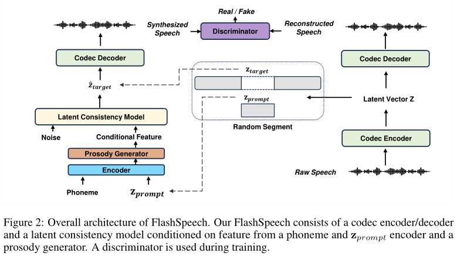

# FlashSpeech

基本信息

- 标题: "FlashSpeech: Efficient Zero-Shot Speech Synthesis"
- 作者:
  - 01 Zhen Ye
  - 02 Zeqian Ju
  - 03 Haohe Liu
  - 04 Xu Tan
  - 05 Jianyi Chen
  - 06 Yiwen Lu
  - 07 Peiwen Sun
  - 08 Jiahao Pan
  - 09 Weizhen Bian
  - 10 Shulin He
  - 11 Qifeng Liu
  - 12 Yike Guo
  - 13 Wei Xue
- 链接:
  - [ArXiv](https://arxiv.org/abs/2404.14700) v3
  - [Publication]
  - [Github]
  - [Demo](https://flashspeech.github.io/)
- 文件:
  - [ArXiv](_PDF/2404.14700v3__FlashSpeech__Efficient_Zero-Shot_Speech_Synthesis.pdf)
  - [Publication]

## Abstract·摘要

原文

Recent progress in large-scale zero-shot speech synthesis has been significantly advanced by language models and diffusion models.
However, the generation process of both methods is slow and computationally intensive.
Efficient speech synthesis using a lower computing budget to achieve quality on par with previous work remains a significant challenge.
In this paper, we present ***FlashSpeech***, a large-scale zero-shot speech synthesis system with approximately 5\% of the inference time compared with previous work.
***FlashSpeech*** is built on the latent consistency model and applies a novel adversarial consistency training approach that can train from scratch without the need for a pre-trained diffusion model as the teacher.
Furthermore, a new prosody generator module enhances the diversity of prosody, making the rhythm of the speech sound more natural.
The generation processes of ***FlashSpeech*** can be achieved efficiently with one or two sampling steps while maintaining high audio quality and high similarity to the audio prompt for zero-shot speech generation.
Our experimental results demonstrate the superior performance of ***FlashSpeech***.
Notably, ***FlashSpeech*** can be about 20 times faster than other zero-shot speech synthesis systems while maintaining comparable performance in terms of voice quality and similarity.
Furthermore, ***FlashSpeech*** demonstrates its versatility by efficiently performing tasks like voice conversion, speech editing, and diverse speech sampling.
Audio samples can be found in [this https URL](https://flashspeech.github.io/).

近期, 大型零样本语音合成在语言模型和扩散模型的推动下取得显著进展.
然而, 这两种方法的生成过程缓慢且计算密集.
在较低的计算预算下实现和之前工作相媲美的语音合成质量仍然是一个重大挑战.
本工作介绍了 ***FlashSpeech***, 一个仅需先前工作推理时间 5% 的大型零样本语音合成系统.
***FlashSpeech*** 建立在潜在一致性模型之上, 并采用了一种新的对抗一致性训练方法, 能够从零训练而无需使用预训练的扩散模型作为教师.
此外, 一个新的韵律生成器模块增强了韵律多样性, 使得语音的节奏听起来更自然.
***FlashSpeech*** 的生成过程能够通过一两个采样步骤高效实现, 同时保持高音质与零样本语音生成时参考音频的高相似性.
我们的实验结果说明了 ***FlashSpeech*** 的优越性.
值得注意的是, ***FlashSpeech*** 相比其他零样本语音合成系统快 20 倍, 但在语音质量和相似度方面保持了与之前工作相当的性能.
此外, ***FlashSpeech*** 的多样性使其能够高效完成诸如语音转换、语音编辑和多样化语音采样等任务.
音频示例可以在[此链接](https://flashspeech.github.io/)中找到.

## 1.Introduction·引言

原文

In recent years, the landscape of speech synthesis has been transformed by the advent of large-scale generative models.
Consequently, the latest research efforts have achieved notable advancements in zero-shot speech synthesis systems by significantly increasing the size of both datasets and models.
Zero-shot speech synthesis, such as Text-to-Speech (TTS), Voice Conversion (VC) and Editing, aims to generate speech that incorporates unseen speaker characteristics from a reference audio segment during inference, without the need for additional training.
Current advanced zero-shot speech synthesis systems typically leverage Language Models (LMs) for in-context speech generation on the large-scale dataset.
>
However, the generation process of these methods needs a long-time iteration.
For example, [VALL-E (2023)](../Speech_LLM/2023.01.05_VALL-E.md) builds on the language model to predict 75 audio token sequences for a 1-second speech, in its first-stage AutoRegressive (AR) token sequence generation.
When using a Non-AutoRegressive (NAR) [Latent Diffusion Model](2021.12.20_LDM.md) based framework, [NaturalSpeech2 (2023)](2023.04.18_NaturalSpeech2.md) still requires 150 sampling steps.
As a result, although these methods can produce human-like speech, they require significant computational time and cost.
>
Some efforts have been made to accelerate the generation process.
[Voicebox (2023)](../../Models/Speech_LLM/2023.06.23_VoiceBox.md) adopts [Flow-Matching (2022)](../Flow/2022.10.06_Flow_Matching.md) so that fewer sampling steps (Number of function evaluations (NFE): 64) can be achieved because of the optimal transport path.
[CLaM-TTS (2024)](../Speech_LLM/2024.04.03_CLaM-TTS.md) proposes a mel-codec with a superior compression rate and a latent language model that generates a stack of tokens at once.
Although the slow generation speed issue has been somewhat alleviated, the inference speed is still far from satisfactory for practical applications.
Moreover, the substantial computational time of these approaches leads to significant computational cost overheads, presenting another challenge.

近年来, 随着大型生成模型的出现, 语音合成领域发生了巨大转变.
因此, 最新的研究工作通过显著增加数据集和模型大小, 在零样本语音合成系统方面取得了显著进展.
零样本语音合成, 如文本转语音, 声音转换, 编辑, 旨在在推理时将未见过的发言人特征嵌入到语音中, 而无需额外的训练.
当前先进的零样本语音合成系统通常使用语言模型和扩散类模型在大规模数据集上进行上下文文本生成.

然而, 这些方法的生成过程需要很长时间的迭代.
- [VALL-E (2023)](../Speech_LLM/2023.01.05_VALL-E.md) 在第一阶段的自回归标识符序列生成过程中, 语言模型预测 1 秒语音需要预测 75 个音频标识符序列.
- [NaturalSpeech2 (2023)](2023.04.18_NaturalSpeech2.md) 使用基于非自回归潜在扩散模型的框架, 但仍然需要 150 个采样步骤.

因此, 尽管这些方法能够生成类似于人类的语音, 但它们需要大量的计算时间和成本.

已经有一些工作尝试加速生成过程.
- [Voicebox (2023)](../../Models/Speech_LLM/2023.06.23_VoiceBox.md) 采用[流匹配 (Flow Matching, FM)](../Flow/2022.10.06_Flow_Matching.md), 由于最优传输路径可以实现较少的采样步骤.
- [CLaM-TTS (2024)](../Speech_LLM/2024.04.03_CLaM-TTS.md) 提出了一种更优压缩率的 mel-codec, 以及一个潜在语言模型, 一次生成一系列 token.
尽管慢速生成速度问题有所缓解, 但对于实际应用来说, 推理速度仍然不足.
此外, 这些方法的大量计算时间导致了额外的计算开销, 这又是一个挑战.

原文

The fundamental limitation of speech generation stems from the intrinsic mechanisms of language models and diffusion models, which require considerable time either auto-regressively or through a large number of denoising steps.
Hence, the primary objective of this work is to accelerate inference speed and reduce computational costs while preserving generation quality at levels comparable to the prior research.
>
In this paper, we propose ***FlashSpeech*** as the next step towards efficient zero-shot speech synthesis.
To address the challenge of slow generation speed, we leverage the [Latent Consistency Model (LCM) (2023)](2023.10.06_LCM.md), a recent advancement in generative models.
Building upon the previous non-autoregressive TTS system ([NaturalSpeech2 (2023)](2023.04.18_NaturalSpeech2.md)), we adopt the encoder of a neural audio codec to convert speech waveforms into latent vectors as the training target for our LCM.
To train this model, we propose a novel technique called adversarial consistency training, which utilizes the capabilities of pre-trained speech language models ([WavLM](../Speech_Representaion/2021.10.26_WavLM.md); [HuBERT (2021)](../Speech_Representaion/2021.06.14_HuBERT.md); [Wav2Vec2.0 (2020)](../Speech_Representaion/2020.06.20_Wav2Vec2.0.md)) as discriminators.
This facilitates the transfer of knowledge from large pre-trained speech language models to speech generation tasks, efficiently integrating adversarial and consistency training to improve performance.
The LCM is conditioned on prior vectors obtained from a phoneme encoder, a prompt encoder, and a prosody generator.
Furthermore, we demonstrate that our proposed prosody generator leads to more diverse expressions and prosody while preserving stability.

语音生成的根本限制在于语言模型和扩散模型的内在机制, 以自回归方式或需要大量去噪步骤从而需要相当的时间.
因此, 本项工作的主要目标是加速推理速度并降低计算成本, 同时保持生成质量与之前研究水平相当.

本文提出了 ***FlashSpeech*** 作为高效零样本语音合成的下一步.
为了解决生成速度慢的问题, 我们采用了[潜在一致性模型 (Latent Consistency Model, LCM)](2023.10.06_LCM.md), 这是近年来生成模型的最新进展.
基于先前非自回归文本转语音系统 [NaturalSpeech2 (2023)](2023.04.18_NaturalSpeech2.md), 我们采用神经音频编解码器的编码器, 将语音波形转换为隐向量, 作为 LCM 的训练目标.
为了训练该模型, 我们提出了一个新的名为对抗一致性训练 (Adversarial Consistency Training) 的技术, 该技术利用了预训练的语音语言模型的能力作为判别器.
这有助于将知识从大型预训练语音语言模型迁移到语音生成任务中, 有效地集成对抗性和一致性训练, 提高性能.
LCM 将音素编码器, 提示编码器和韵律生成器获得的先验向量作为条件.
此外, 我们证明了所提出的韵律生成器能够产生更具多样性的表达和韵律, 同时保持稳定性.

原文

Our contributions can be summarized as follows:
- We propose ***FlashSpeech***, an efficient zero-shot speech synthesis system that generates voice with high audio quality and speaker similarity in zero-shot scenarios.
- We introduce adversarial consistency training, a novel combination of consistency and adversarial training leveraging pre-trained speech language models, for training the latent consistency model from scratch, achieving speech generation in one or two steps.
- We propose a prosody generator module that enhances the diversity of prosody while maintaining stability.
- ***FlashSpeech*** significantly outperforms strong baselines in audio quality and matches them in speaker similarity.
Remarkably, it achieves this at a speed approximately 20 times faster than comparable systems, demonstrating unprecedented efficiency.

我们的贡献可以总结如下:
- 我们提出 ***FlashSpeech***, 一种高效的零样本语音合成系统, 能够在零样本场景下生成高音质和发言人相似度的语音.
- 我们引入对抗一致性训练, 一种利用预训练语音语言模型的一致性和对抗训练的新型组合, 用于从零训练潜在一致性模型, 实现语音生成在一或两步.
- 我们提出了一个韵律生成器模块, 增强了韵律多样性, 同时保持稳定性.
- ***FlashSpeech*** 显著优于强基线在音频质量和发言人相似度方面的表现, 与它们相当.
值得注意的是, 它在速度上与相当的系统相当, 展示了前所未有的效率.

## 2.Related Work·相关工作

### 2.1.Larger-Scale Speech Synthesis

原文

Motivated by the success of the large language model, the speech research community has recently shown increasing interest in scaling the sizes of model and training data to bolster generalization capabilities, producing natural speech with diverse speaker identities and prosody under zero-shot settings.
The pioneering work is [VALL-E (2023)](../Speech_LLM/2023.01.05_VALL-E.md), which adopts the [EnCodec (2022)](../Speech_Neural_Codec/2022.10.24_EnCodec.md) to discretize the audio waveform into tokens.
Therefore, a language model can be trained via in-context learning that can generate the target utterance where the style is consistent with prompt utterance.
However, generating audio in such an autoregressive manner ([LM-VC (2023)](); [VoiceCraft (2024)](../Speech_LLM/2024.03.25_VoiceCraft.md)) can lead to unstable prosody, word skipping, and repeating issues ([FastSpeech2](../TTS2_Acoustic/2020.06.08_FastSpeech2.md); Tan et al.(2021); [NaturalSpeech2](../../Models/Diffusion/2023.04.18_NaturalSpeech2.md))
To ensure the robustness of the system, non-autoregressive methods such as [NaturalSpeech2 (2023)](2023.04.18_NaturalSpeech2.md) and [Voicebox (2023)](../../Models/Speech_LLM/2023.06.23_VoiceBox.md) utilize diffusion-style model (VP-diffusion Song et al.(2020) or [Flow-Matching (2022)](../Flow/2022.10.06_Flow_Matching.md)) to learn the distribution of a continuous intermediate vector such as mel-spectrogram or latent vector of codec.
Both LM-based methods Zhao et al.(2023) and diffusion-based methods show superior performance in speech generation tasks.
However, their generation is slow due to the iterative computation.
Considering that many speech generation scenarios require real-time inference and low computational costs, we employ the latent consistency model for large-scale speech generation that inference with one or two steps while maintaining high audio quality.

由于 LLM 的成功, 音频研究社区近期展示了在扩大模型尺寸和训练数据数量以支持泛化能力,

### 2.2.Acceleration of Speech Synthesis

原文

Since early neural speech generation models Tan et al.(2021) use autoregressive models such as Tacotron Wang et al.(2017) and TransformerTTS Li et al.(2019), causing slow inference speed, with $\mathcal{O}(n)$ computation, whereNis the sequence length.
To address the slow inference speed, [FastSpeech (2019)](../TTS2_Acoustic/2019.05.22_FastSpeech.md), [FastSpeech2](../TTS2_Acoustic/2020.06.08_FastSpeech2.md) proposes to generate a mel-spectrogram in a non-autoregressive manner.
However, these models Ren et al.(2022) result in blurred and over-smoothed mel-spectrograms due to the regression loss they used and the capability of modeling methods.
To further enhance the speech quality, diffusion models are utilized Popov et al.(2021a); Jeong et al.(2021); Popov et al.(2021b) which increase the computation to $\mathcal{O}(T)$, where $T$ is the diffusion steps.
Therefore, distillation techniques Luo (2023) for diffusion-based methods such as CoMoSpeech Ye et al.(2023), CoMoSVC Lu et al.(2024) and Reflow-TTS Guan et al.(2023) emerge to reduce the sampling steps back to $\mathcal{O}(1)$, but require additional pre-trained diffusion as the teacher model.
Unlike previous distillation techniques, which require extra training for the diffusion model as a teacher and are limited by its performance, our proposed adversarial consistency training technique can directly train from scratch, significantly reducing training costs.
In addition, previous acceleration methods only validate speaker-limited recording-studio datasets with limited data diversity.
To the best of our knowledge, ***FlashSpeech*** is the first work that reduces the computation of a large-scale speech generation system back to $\mathcal{O}(1)$.

### 2.3.Consistency Model

原文

The Consistency Model is proposed in [Song et al.(2023)](); [Song and Dhariwal.(2023)]() to generate high-quality samples by directly mapping noise to data.
Furthermore, many variants [Kong et al.(2023)](); [Lu et al.(2023)](); [Sauer et al.(2023)](); [Kim et al.(2023a)]() are proposed to further increase the generation quality of images.
The [Latent Consistency Model (2023)](2023.10.06_LCM.md) is proposed by Luo et al. which can directly predict the solution of PF-ODE in latent space.
However, the [original LCM](2023.10.06_LCM.md) employs consistency distillation on the pre-trained **Latent Diffusion Model (LDM)** which leverages large-scale off-the-shelf image diffusion models Rombach et al.(2022).
Since there are no pre-trained large-scale TTS models in the speech community, and inspired by the techniques Song and Dhariwal (2023); Kim et al.(2023a); Lu et al.(2023); Sauer et al.(2023); Kong et al.(2023), we propose the novel adversarial consistency training method which can directly train the large-scale latent consistency model from scratch utilizing the large pre-trained speech language model Chen et al.(2022b); [HuBERT (2021)](../Speech_Representaion/2021.06.14_HuBERT.md); Baevski et al. (2020) such as WavLM for speech generation.

## 3.Method·方法

### 3.1.Overview·总览

Our work is dedicated to advancing the speech synthesis efficiency, achieving $\mathcal{O}(1)$ computation cost while maintaining comparable performance to prior studies that require $\mathcal{O}(T)$ or $\mathcal{O}(N)$ computations.
The framework of the proposed method, ***FlashSpeech***, is illustrated in Fig.02.
***FlashSpeech*** integrates a neural codec, an encoder for phonemes and prompts, a prosody generator, and an [LCM](2023.10.06_LCM.md), which are utilized during both the training and inference stages.
Exclusively during training, a conditional discriminator is employed.
***FlashSpeech*** adopts the in-context learning paradigm [VALL-E (2023)](../Speech_LLM/2023.01.05_VALL-E.md), initially segmenting the latent vector $\mathbf{z}$, extracted from the codec, into $\mathbf{z}_{target}$ and $\mathbf{z}_{prompt}$.
Subsequently, the phoneme and $\mathbf{z}_{prompt}$ are processed through the encoder to produce the hidden feature.
A prosody generator then predicts pitch and duration based on the hidden feature.
The pitch and duration embeddings are combined with the hidden feature and inputted into the [LCM](2023.10.06_LCM.md) as the conditional feature.
The [LCM](2023.10.06_LCM.md) model is trained from scratch using adversarial consistency training.
After training, ***FlashSpeech*** can achieve efficient generation within one or two sampling steps.

本项工作专注于提高语音合成效率, 在保持和先前工作相近性能的同时, 将 $\mathcal{O}(T)$ 或 $\mathcal{O}(N)$ 计算量降低到 $\mathcal{O}(1)$.
图 02 展示了所提方法 ***FlashSpeech*** 的框架.

***FlashSpeech*** 继承了神经编解码器, 音素和提示的编码器, 韵律生成器, 和一个潜在一致性模型 (Latent Consistency Model, LCM), 并在训练和推理阶段都使用它们.
仅在训练阶段使用条件判别器 (Conditional Discriminator).
***FlashSpeech*** 采用了 [VALL-E (2023)](../Speech_LLM/2023.01.05_VALL-E.md) 的上下文学习范式, 首先将从编解码器提取出的隐向量 $\mathbf{z}$ 分割为 $\mathbf{z}_{target}$ 和 $\mathbf{z}_{prompt}$.
然后, 音素和 $\mathbf{z}_{prompt}$ 通过编码器产生隐特征.
韵律生成器基于隐特征预测音高和时长.
音高和时长嵌入和隐特征结合后作为条件特征输入到 LCM 种.
LCM 模型使用对抗一致训练从零开始训练.
训练完成后, ***FlashSpeech*** 可以在一到两个采样步内实现高效生成.

### 3.2.Latent Consistency Model

The Consistency Model ([Song et al.(2023)]()) is a new family of generative models that enables one-step or few-step generation.

一致性模型是一类新的生成模型能够进行一步或几步生成.

Let us denote the data distribution by $p_{data}(\mathbf{x})$.
The core idea of the consistency model is to learn the function that maps any points on a trajectory of the PF-ODE to that trajectory’s origin, which can be formulated as:

数据分布记为 $p_{data}(\mathbf{x})$.
一致性模型的核心思想是学习一个映射函数, 将 PF-ODE 轨迹上的任意点映射到该轨迹的起点, 可以表示为:

$$
  f(\mathbf{x}_\sigma, \sigma) = \mathbf{x}_{\sigma_{\min}},\tag{01}
$$

where $f(\cdot,\cdot)$ is the consistency function and $\mathbf{x}_{\sigma}$ represents the data $\mathbf{x}$ perturbed by adding zero-mean Gaussian noise with standard deviation $\sigma$.
$\sigma_{\min}$ is a fixed small positive number.

其中 $f(\cdot, \cdot)$ 是一致性函数, $\mathbf{x}_{\sigma}$ 表示数据 $\mathbf{x}$ 添加零均值 $\sigma$ 标准差的高斯噪声扰动后的数据.
$\sigma_{\min}$ 是固定的小正数.

Then $\mathbf{x}_{\sigma_{\min}}$ can then be viewed as an approximation sample from the data distribution $p_{data}(\mathbf{x})$.
To satisfy property in Eq.01, following Song et al.(2023), we parameterize the consistency model as

$\mathbf{x}_{\sigma_{\min}}$ 可以视为数据分布 $p_{data}(\mathbf{x})$ 的近似采样.
为了满足如方程 01 所示的性质, 遵循 Song et al., 我们将一致性模型参数化为

$$
  f_{\theta}(\mathbf{x}_{\sigma}, \sigma) = c_{skip}(\sigma)\mathbf{x} + c_{out}(\sigma) F_{\theta}(\mathbf{x}_{\sigma}, \sigma),\tag{02}
$$

where $f_{\theta}$ is to estimate consistency function $f$ by learning from data, $F_{\theta}$ is a deep neural network with parameter $\theta$, $c_{skip}(\sigma)$ and $c_{out}(\sigma)$ are differentiable functions with $c_{skip}(\sigma_{\min})=1$ and $c_{out}(\sigma_{\min})=0$ to ensure boundary condition.

其中
- $f_{\theta}$ 通过从数据中学习得到, 用于估计一致性函数 $f$,
- $F_{\theta}$ 是具有参数 $\theta$ 的深度神经网络,
- $c_{skip}(\sigma)$ 和 $c_{out}(\sigma)$ 是可微函数, 且 $c_{skip}(\sigma_{\min})=1$ 和 $c_{out}(\sigma_{\min})=0$ 用于确保边界条件.

A valid consistency model should satisfy the self-consistency property (Song et al.(2023))

一个有效的一致性模型需要满足自一致性:

$$
  f_{\theta}(\mathbf{x}_\sigma, \sigma) = f_{\theta}(\mathbf{x}_{\sigma'}, \sigma'),\quad \forall \sigma, \sigma' \in [\sigma_{\min}, \sigma_{\max}].\tag{03}
$$

where $\sigma_{\max}=80$ and $\sigma_{\min}=0.002$ following Karras et al. (2022); Song et al. (2023); Song and Dhariwal (2023).
Then the model can generate samples in one step by evaluating

$$
  \mathbf{x}_{\sigma_{\min}} = f_{\theta}(\mathbf{x}_{\sigma_{\max}}, \sigma_{\max})\tag{04}
$$

from distribution $\mathbf{x}_{\sigma_{\max}}\sim\mathcal{N}(0,\sigma_{\max}^2 \mathbf{I})$.

As we apply a consistency model on the latent space of audio, we use the latent feature $\mathbf{z}$ which are extracted prior to the residual quantization layer of the codec.

$$
  \mathbf{z} = CodecEncoder(\mathbf{y})\tag{05}
$$

where $\mathbf{y}$ is the speech waveform.

Futhermore, we add the feature from the prosody generator and encoder as the conditional feature $c$, our objective has changed to achieve

### 3.3.Adversarial Consistency Training

A major drawback of the [LCM](2023.10.06_LCM.md) is that it needs to pre-train a diffusion-based teacher model in the first stage, and then perform distillation to produce the final model.
This would make the training process complicated, and the performance would be limited as a result of the distillation.
To eliminate the reliance on the teacher model training, in this paper, we propose a novel adversarial consistency training method to train [LCM](2023.10.06_LCM.md) from scratch.
Our training procedure is outlined in Fig.03, which has three parts:

### 3.3.1.Consistency Training

### 3.3.2.Adversarial Training

### 3.3.3.Combined Together

### 3.4.Prosody Generator

#### 3.4.1.Analysis of Prosody Prediction

Previous regression methods for prosody prediction ([FastSpeech2](../TTS2_Acoustic/2020.06.08_FastSpeech2.md); [NaturalSpeech2 (2023)](2023.04.18_NaturalSpeech2.md)), due to their deterministic mappings and assumptions of unimodal distribution, often fail to capture the inherent diversity and expressiveness of human speech prosody.
This leads to predictions that lack variation and can appear over-smoothed.
On the other hand, diffusion methods ([Voicebox (2023)](../../Models/Speech_LLM/2023.06.23_VoiceBox.md); Li et al.(2023)) for prosody prediction offer a promising alternative by providing greater prosody diversity.
However, they come with challenges regarding stability, and the potential for unnatural prosody.
Additionally, the iterative inference process in DMs requires a significant number of sampling steps that may also hinder real-time appli
cation.
Meanwhile, LM-based methods ([Mega-TTS2](../Speech_LLM/2023.07.14_Mega-TTS2.md); [VALL-E (2023)](../Speech_LLM/2023.01.05_VALL-E.md)) also need a long time for inference.
To alleviate these issues, our prosody generator consists of a prosody regression module and a prosody refinement module to enhance the diversity of prosody regression results with efficient one-step consistency model sampling.

#### 3.4.2.Prosody Refinement via Consistency Model

>As shown in 4, our prosody generator consists of two parts which are prosody regression and prosody refinement.
We first train the prosody regression module to get a deterministic output.
Next, we freeze the parameters of the prosody regression module and use the residual of ground truth prosody and deterministic predicted prosody as the training target for prosody refinement.
We adopt a consistency model as a prosody refinement module.
The conditional feature of the consistency model is the feature from prosody regression before the final projection layer.
Thus, the residual from a stochastic sampler refines the output of a deterministic prosody regression and produces a diverse set of plausible prosody under the same transcription and audio prompt.
One option for the final prosody output p final can be represented as: p final= pres+ p init,(18) where p final denotes the final prosody output, p res represents the residual output from the prosody refinement module, capturing the variations between the ground truth prosody and the deterministic prediction, p init is the initial deterministic prosody prediction from the prosody regression module.
However, this formulation may negatively affect prosody stability, a similar observation is found in ([Audiobox](); [Voicebox (2023)](../../Models/Speech_LLM/2023.06.23_VoiceBox.md)).
More specifically, higher diversity may cause less stability and sometimes produce unnatural prosody.
To address this, we introduce a control factor  $\alpha$  that finely tunes the balance between stability and diversity in the prosodic output: p final=  $\alpha$  p res+ p init(19) where  $\alpha$  is a scalar value ranging between 0 and 1.
This adjustment allows for controlled incorporation of variability into the prosody, mitigating issues related to stability while still benefiting from the diversity offered by the prosody refinement module.

### 3.5.Applications

This section elaborates on the practical applications of ***FlashSpeech***.
We delve into its deployment across various tasks such as zero-shot TTS, speech editing, voice conversion, and diverse speech sampling.
All the sample audios of applications are available on the demo page.

#### 3.5.1.Zero-Shot TTS

Given a target text and reference audio, we first convert the text to phoneme using g2p (grapheme-to-phoneme conversion).
Then we use the codec encoder to convert the reference audio into $z_{prompt}$.
Speech can be synthesized efficiently through ***FlashSpeech*** with the phoneme input and $z_{prompt}$, achieving high-quality text-to-speech results without requiring pre-training on the specific voice.

#### 3.5.2.Voice Conversion

Voice conversion aims to convert the source audio into the target audio using the speaker’s voice of the reference audio.
Following [NaturalSpeech2 (2023)](2023.04.18_NaturalSpeech2.md); Preechakul et al.(2022), we first apply the reverse of ODE to diffuse the source audio into a starting point that still maintains some information in the source audio.
After that, we run the sampling process from this starting point with the reference audio as z prompt and condition c.
The condition c uses the phoneme and duration from the source audio and the pitch is predicted by the prosody generator.
This method allows for zero-shot voice conversion while preserving the linguistic content of the source audio, and achieving the same timbre as the reference audio.

#### 3.5.3.Speech Editing

Given the speech, the original transcription, and the new transcription, we first use MFA (Montreal Forced Aligner) to align the speech and the original transcription to get the duration of each word.
Then we remove the part that needs to be edited to construct the reference audio.
Next, we use the new transcription and reference to synthesize new speech.
Since this task is consistent with the in-context learning, we can concatenate the remaining part of the raw speech and the synthesized part as the final speech, thus enabling precise and seamless speech editing.

#### 3.5.4.Diverse Speech Sampling

***FlashSpeech*** leverages its inherent stochastic it y to generate a variety of speech outputs under the same conditions.
By employing stochastic sampling in its prosody generation and [LCM](2023.10.06_LCM.md), ***FlashSpeech*** can produce diverse variations in pitch, duration, and overall audio characteristics from the same phoneme input and audio prompt.
This feature is particularly useful for generating a wide range of speech expressions and styles from a single input, enhancing applications like voice acting, synthetic voice variation for virtual assistants, and more personalized speech synthesis.
In addition, the synthetic data via speech sampling can also benefit other tasks such as ASR (Rossenbach et al. (2020)).

## 4.Experiment

In the experimental section, we begin by introducing the datasets and the configurations for training in our experiments.
Following this, we show the evaluation metrics and demonstrate the comparative results against various zero-shot TTS models.
Subsequently, ablation studies are conducted to test the effectiveness of several design choices.
Finally, we also validate the effectiveness of other tasks such as voice conversion.
We show our speech editing and diverse speech sampling results on our demo page.

### 4.1.Experimental Settings

#### 4.1.1.Data and Preprocessing

We use the English subset of Multilingual LibriSpeech (MLS) Pratap et al.(2020), including 44.5k hours of transcribed audiobook data and it contains 5490 distinct speakers.
The audio data is resampled at a frequency of 16kHz.
The input text is transformed into a sequence of phonemes through grapheme-to-phoneme conversion Sun et al.(2019) and then we use our internal alignment tool aligned with speech to obtain the phoneme-level duration.
We adopt a hop size of 200 for all frame-level features.
The pitch sequence is extracted using PyWorld2. we adopt [EnCodec (2022)](../Speech_Neural_Codec/2022.10.24_EnCodec.md) as our audio codec.
We use a modified version3and train it on MLS.
We use the dense features extracted before the residual quantization layer as our latent vector z.

#### 4.1.2.Training Details

Our training consists of two stages, in the first stage we train [LCM](2023.10.06_LCM.md) and the prosody regression part.
We use 8 H800 80GB GPUs with a batch size of 20k frames of latent vectors per GPU for 650k steps.
We use the AdamW optimizer with a learning rate of 3e-4, warm up the learning rate for the first 30k updates and then linear decay it.
We deactivate adversarial training withλadv= 0 before 600K training iterations.
For hyper-parameters, we setain Equation(12)to 0.03.
In equation(10), σi=�σ1/ρmin+i−1N(k)−1�σ1/ρmax− σ1/ρmin��ρ,wherei ∈ [1, N(k)],ρ = 7, σmin= 0.002, σmax= 80.
For N(k) in Equation(11), we sets0= 10, s1= 1280, K = 600k.
After 600k steps, we activate adversarial loss, and N(k) can be considered as fixed to 1280.
We crop the waveform length fed into the discriminator into minimum waveform length in a minibatch.
In addition, the weight of the feature extractor WavLM and the codec decoder are frozen.
In the second stage, we train 150k steps for the prosody refinement module with consistency training in Equation(10).
Different from the above setting, we empirically sets1= 160,K = 150k.
During training, only the weight of the prosody refinement part is updated.

#### 4.1.3.Model Details

The model structures of the prompt encoder and phoneme encoder are follow [NaturalSpeech2 (2023)](2023.04.18_NaturalSpeech2.md).
The neural function part in [LCM](2023.10.06_LCM.md) is almost the same as the [NaturalSpeech2 (2023)](2023.04.18_NaturalSpeech2.md).
We rescale the sinusoidal position embedding in the neural function part by a factor of 1000.
As for the prosody generator, we adopt 30 non-casual [WaveNet (2016)](../TTS3_Vocoder/2016.09.12_WaveNet.md) layers for the neural function part in the prosody refinement module and the same configurations for prosody regression parts in [NaturalSpeech2 (2023)](2023.04.18_NaturalSpeech2.md).
And we set $\alpha= 0.2$ for the prosody refinement module empirically.
For the discriminator’s head, we stack 5 convolutional layers with weight normalization Salimans and Kingma (2016) for binary classification.

### 4.2.Evaluation Metrics

We use both objective and subjective evaluation metrics, including
- [Real-time-factor (RTF)](../../Evaluations/RTF.md): RTF measures the time taken for the system to generate one second of speech.
This metric is crucial for evaluating the efficiency of our system, particularly for applications requiring real-time processing.
We measure the time of our system end-to-end on an NVIDIA V100 GPU following [NaturalSpeech2 (2023)](2023.04.18_NaturalSpeech2.md).
- Sim-O and Sim-R: These metrics assess the speaker similarity.
Sim-R measures the objective similarity between the synthesized speech and the reconstruction reference speech through the audio codec, using features embedding extracted from the pre-trained speaker verification model [VALL-E (2023)](../Speech_LLM/2023.01.05_VALL-E.md); [ClaM-TTS (2024)](2024.04.../_tmp/2024.04.03_CLaM-TTS.md
Sim-O is calculated with the original reference speech.
Higher scores in Sim-O and Sim-R indicate a higher speaker similarity.
- WER (Word Error Rate): To evaluate the accuracy and clarity of synthesized speech from the TTS system, we employ the Automatic Speech Recognition (ASR) model Wang et al.
(2023a)5to transcribe generated audio.
The discrepancies between these transcriptions and original texts are quantified using the [Word Error Rate (WER)](../../Evaluations/WER.md), a crucial metric indicating intelligibility and robustness.
- CMOS, SMOS, UTMOS: we rank the comparative mean option score (CMOS) and similarity mean option score (SMOS) using mturk.
The prompt for CMOS refers to ’Please focus on the audio quality and naturalness and ignore other factors.’.
The prompt for SMOS refers to ’Please focus on the similarity of the speaker to the reference, and ignore the differences of content, grammar or audio quality.’ Each audio has been listened to by at least 10 listeners.
UTMOS Saeki et al.(2022) is a Speech MOS predictor6to measure the naturalness of speech.
We use it in ablation studies which reduced the cost for evaluation.
- Prosody JS Divergence: To evaluate the diversity and accuracy of the prosody prediction in our TTS system, we include the Prosody JS Divergence metric.
This metric employs the Jensen-Shannon (JS) divergence Menéndez et al.(1997) to quantify the divergence between the predicted and ground truth prosody feature distributions.
Prosody features, including pitch, and duration, are quantized and their distributions in both synthesized and natural speech are compared.
Lower JS divergence values indicate closer similarity between the predicted prosody features and those of the ground truth, suggesting a higher diversity of the synthesized speech.

### 4.3.Experimental Results on Zero-shot TTS

Following [VALL-E (2023)](../Speech_LLM/2023.01.05_VALL-E.md), We employ LibriSpeech Panayotov et al.(2015) test-clean for zero-shot TTS evaluation.
We adopt the cross-sentence setting in [VALL-E (2023)](../Speech_LLM/2023.01.05_VALL-E.md) that we randomly select 3-second clips as prompts from the same speaker’s speech.
The results are summarized in table 1 and figure 5.

#### 4.3.1.Evaluation Baselines

- [VALL-E (2023)](../Speech_LLM/2023.01.05_VALL-E.md): [VALL-E (2023)](../Speech_LLM/2023.01.05_VALL-E.md) predicts codec tokens using both AR and NAR models.
RTF is obtained from [ClaM-TTS (2024)](../Speech_LLM/2024.04.03_CLaM-TTS.md); [Voicebox (2023)](../../Models/Speech_LLM/2023.06.23_VoiceBox.md).
We use our reproduced results for MOS, Sim, and WER.
Additionally, we do a preference test with their official demo.
- [Voicebox (2023)](../../Models/Speech_LLM/2023.06.23_VoiceBox.md): Voicebox uses flow-matching to predict maksed mel-spectrogram.
RTF is from the original paper.
We use our reproduced results for MOS, Sim, and WER.
We also implement a preference test with their official demo.
- [NaturalSpeech2 (2023)](2023.04.18_NaturalSpeech2.md): NaturalSpeech2 uses a latent diffusion model to predict latent features of codec.
The RTF is from the original paper. the Sim, WER and samples for MOS are obtained through communication with the authors.
We also do a preference test with their official demo.
- [Mega-TTS (2023)](../Speech_LLM/2023.06.06_Mega-TTS.md) 8: Mega-TTS uses both language model and GAN to predict mel-spectrogram.
We obtain RTF from mobilespeech Ji et al.(2024) and WER from the original paper.
We do a preference test with their official demo.
- [ClaM-TTS (2024)](../Speech_LLM/2024.04.03_CLaM-TTS.md): ClaM-TTS uses the AR model to predict mel codec tokens.
We obtain the objective evaluation results from the original paper and do a preference test with their official demo.

#### 4.3.2.Generation Quality

***FlashSpeech*** stands out significantly in terms of speaker quality, surpassing other baselines in both CMOS and audio quality preference tests.
Notably, our method closely approaches ground truth recordings, underscoring its effectiveness.
These results affirm the superior quality of ***FlashSpeech*** in speech synthesis. our method.

#### 4.3.3.Generation Similarity

Our evaluation of speaker similarity utilizes Sim, SMOS, and speaker similarity preference tests, where our methods achieve 1st, 2nd, and 3rd place rankings, respectively.
These findings validate our methods’ ability to achieve comparable speaker similarity to other methods.
Despite our training data (MLS) containing approximately 5k speakers, fewer than most other methods (e.g., Librilight with about 7k speakers or self-collected data), we believe that increasing the number of speakers in our methods can further enhance speaker similarity.

#### 4.3.4.Robustness

Our methods achieve a WER of 2.7, placing them in the first echelon.
This is due to the non-autoregressive nature of our methods, which ensures robustness.

#### 4.3.5.Generation Speed

***FlashSpeech*** achieves a remarkable approximately 20x faster inference speed compared to previous work.
Considering its excellent audio quality, robustness, and comparable speaker similarity, our method stands out as an efficient and effective solution in the field of large-scale speech synthesis.

### 4.4.Ablation Studies

#### 4.4.1.Ablation Studies of LCM

We explored the impact of different pre-trained models in adversarial training on UTMOS and Sim-O.
As shown in the table 2, the baseline, which employs consistency training alone, achieved a UTMOS of 3.62 and a Sim-O of 0.45.
Incorporating adversarial training using wav2vec2-large9, hubert-large10, and wavlm-large11as discriminators significantly improved both UTMOS and Sim-O scores.
Notably, the application of adversarial training with Wavlm-large achieved the highest scores (UTMOS: 4.00, Sim-O: 0.52), underscoring the efficacy of this pre-trained model in enhancing the quality and speaker similarity of synthesized speech.
Additionally, without using the audio prompt’s feature as a condition the discriminator shows a slight decrease in performance (UTMOS: 3.97, Sim-O: 0.51), highlighting the importance of conditional features in guiding the adversarial training process.
As shown in table 3, the effect of sampling steps (NFE) on UTMOS and Sim-O revealed that increasing NFE from 1 to 2 marginally improves UTMOS (3.99 to 4.00) and Sim-O (0.51 to 0.52).
However, further increasing to 4 sampling steps slightly reduced UTMOS to 3.91 due to the accumulation of score estimation errors Chen et al.(2022a); Lyu et al.(2024).
Therefore, we use 2 steps as the default setting for [LCM](2023.10.06_LCM.md).

#### 4.4.2.Ablation Studies of Prosody Generator

In this part, we investigated the effects of a control factor, denoted as $\alpha$, on the prosodic features of pitch and duration in speech synthesis, by setting another influencing factor to zero.
Our study specifically conducted an ablation analysis to assess how $\alpha$ influences these features, emphasizing its critical role in balancing stability and diversity within our framework’s prosodic outputs.

Tab.04 elucidates the effects of varying $\alpha$ on the pitch component.
With $\alpha$ set to 0, indicating no inclusion of the residual output from prosody refinement, we observed a **Pitch JSD** of 0.072 and a WER of 2.8.
A slight modification to $\alpha= 0.2$ resulted in a reduced **Pitch JSD** of 0.067, maintaining the same WER.
Notably, setting $\alpha$ to 1, fully incorporating the prosody refinement’s residual output, further decreased the Pitch JSD to 0.063, albeit at the cost of increased WER to 3.7, suggesting a trade-off between prosody diversity and speech intelligibility.

Similar trends in table 5 are observed in the duration component analysis.
With $\alpha$  = 0, the Duration JSD was 0.0175 with a WER of 2.8.
Adjusting $\alpha$ to 0.2 slightly improved the Duration JSD to 0.0168, without affecting WER.
However, fully embracing the refinement module’s output by setting $\alpha$  = 1 yielded the most significant improvement in Duration JSD to 0.0153, which, similar to pitch analysis, came with an increased WER of 3.9.
The results underline the delicate balance required in tuning $\alpha$  to optimize between diversity and stability of prosody without compromising speech intelligibility.

### 4.5.Evaluation Results for Voice Conversion

In this section, we present the evaluation results of our voice conversion system, FlashSpeech, in comparison with state-of-the-art methods, including [YourTTS (2021)](../E2E/2021.12.04_YourTTS.md) 12 and DDDM-VC 13 Choi et al.(2024).
We conduct the experiments with their official checkpoints in our internal test set.

Our system outperforms both [YourTTS](../E2E/2021.12.04_YourTTS.md) and DDDM-VC in terms of CMOS, SMOS and Sim-O, demonstrating its capability to produce converted voices with high quality and similarity to the target speaker.
These results confirm the effectiveness of our FlashSpeech approach in voice conversion tasks.

### 4.6.Conclusions and Future Work

In this paper, we presented ***FlashSpeech***, a novel speech generation system that significantly reduces computational costs while maintaining high-quality speech output.
Utilizing a novel adversarial consistency training method and an [LCM](2023.10.06_LCM.md), ***FlashSpeech*** outperforms existing zero-shot TTS systems in efficiency, achieving speeds about 20 times faster without compromising on voice quality, similarity, and robustness.
In the future, we aim to further refine the model to improve the inference speed and reduce computational demands.
In addition, we will expand the data scale and enhance the system’s ability to convey a broader range of emotions and more nuanced prosody.
For future applications, ***FlashSpeech*** can be integrated for real-time interactions in applications such as virtual assistants and educational tools.
