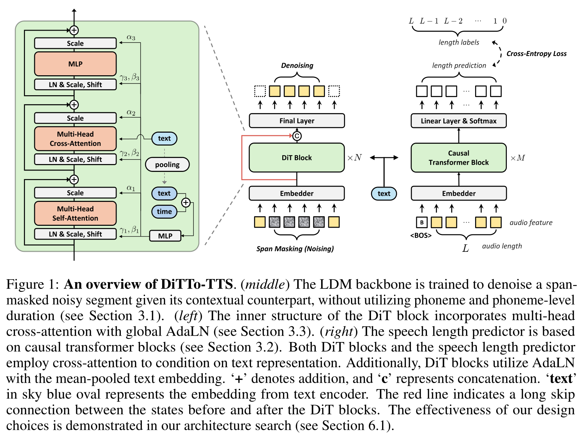

# DiTTo-TTS

基本信息

- 标题: DiTTo-TTS: Efficient and Scalable Zero-Shot Text-to-Speech with Diffusion Transformer
- 作者:
  - 01 [Keon Lee](../../Authors/Keon_Lee.md)
  - 02 [Dong Won Kim](../../Authors/Dong_Won_Kim.md)
  - 03 [Jaehyeon Kim](../../Authors/Jaehyeon_Kim.md)
  - 04 [Jaewoong Cho](../../Authors/Jaewoong_Cho.md)
- 机构:
  - [KRAFTON.AI](../../Institutions/KRAFTON.AI.md)
- 时间:
  - 预印时间: 2024.06.17 ArXiv v1
  - 更新笔记: 2024.06.18
- 发表:
  - 期刊/会议 
- 链接:
  - [ArXiv](https://arxiv.org/abs/2406.11427)
  <!-- - [DOI]()
  - [Github]() -->
  - [Demo](https://ditto-tts.github.io/)
  - [Scholar](https://scholar.google.com/scholar?cluster=)
- 标签:
  - [语音合成](../../Tags/SpeechSynthesis.md)
  - [零样本](../../Tags/Zero-Shot.md)
  - [扩散模型](../../Tags/Model_Diffusion.md)
- 页数: 21
- 引用: 80
- 被引: 0
- 数据:

## Abstract: 摘要

原文

> Large-scale diffusion models have shown outstanding generative abilities across multiple modalities including images, videos, and audio.
> However, text-to-speech (TTS) systems typically involve domain-specific modeling factors (e.g., phonemes and phoneme-level durations) to ensure precise temporal alignments between text and speech, which hinders the efficiency and scalability of diffusion models for TTS.
> In this work, we present an efficient and scalable Diffusion Transformer (DiT) that utilizes off-the-shelf pre-trained text and speech encoders.
> Our approach addresses the challenge of text-speech alignment via cross-attention mechanisms with the prediction of the total length of speech representations.
> To achieve this, we enhance the DiT architecture to suit TTS and improve the alignment by incorporating semantic guidance into the latent space of speech.
> We scale the training dataset and the model size to 82K hours and 790M parameters, respectively.
> Our extensive experiments demonstrate that the large-scale diffusion model for TTS without domain-specific modeling not only simplifies the training pipeline but also yields superior or comparable zero-shot performance to state-of-the-art TTS models in terms of naturalness, intelligibility, and speaker similarity.
> Our speech samples are available at https://ditto-tts.github.io.

 

大规模扩散模型已经证明了在多种模态 (包括图像, 视频和音频) 上的卓越生成能力.
然而, 文本转语音 (TTS) 系统通常依赖于特定于领域的建模因素 (例如, 音素和音素级别的持续时间), 以确保文本和语音之间的精确时间对齐, 这会妨碍扩散模型的效率和可扩展性用于 TTS.
在本文中, 我们提出了一个有效且可扩展的扩散 Transformer (DiT), 它利用现成的预训练文本和语音编码器.
我们的方法通过利用交叉注意机制解决了文本-语音对齐问题, 并通过预测语音表示的总长度来实现这一点.
为了实现这一点, 我们增强了 DiT 架构, 以适应 TTS 并改进了对齐.
我们将训练数据集和模型大小扩展到 82K 小时和 790M 参数, 并进行了广泛的实验, 证明了无需特定于领域的建模的大规模扩散模型对于 TTS 而言, 无需额外的训练数据, 就可以实现与最先进的 TTS 模型相媲美的零样本性能.
我们的语音示例可在 https://ditto-tts.github.io 获得.

## 1.Introduction: 引言

> Large-scale diffusion models have demonstrated impressive generative abilities in a wide range of fields including images [1], [2], videos [3], [4], and audio ([WaveGrad](../../Models/TTS3_Vocoder/2020.09.02_WaveGrad.md); [DiffWave](../TTS3_Vocoder/2020.09.21_DiffWave.md)).
> The integration of [latent diffusion models (LDMs)](../../Models/_Basis/2021.12.20_LDM.md) further amplifies their popularity [8], [9], [10], as these models significantly enhance computational efficiency.
> This efficiency is achieved through the reduction of input dimensionality using autoencoders, which also enables the diffusion models to focus on the most critical features of data ([LDM](../../Models/_Basis/2021.12.20_LDM.md)).
> However, applying LDMs to text-to-speech (TTS) presents unique challenges because TTS requires precise alignment between text and generated speech over time.
> Hence, their application to TTS often requires a complex pipeline, incorporating speech domain-specific modeling such as phoneme and duration ([Grad-TTS](../../Models/TTS2_Acoustic/2021.05.13_Grad-TTS.md), [NaturalSpeech2](../../Models/Diffusion/2023.04.18_NaturalSpeech2.md)).
> Without these components, generation performance tends to be suboptimal ([Simple-TTS](../../Models/_tmp/Simple-TTS.md), [E3-TTS](../_tmp/2023.11.02_E3-TTS.md)), while their inclusion hinders the model efficiency and scalability.

> In this work, we present a latent diffusion model for TTS that is integrated with off-the-shelf pre-trained text and speech encoders without relying on the speech domain-specific modeling.
> Our method addresses the challenge of aligning text and speech solely through cross-attention mechanisms.
> Furthermore, we introduce a module that predicts the total duration of the generated speech from a given text and speech prompt, rather than determining the duration of each individual input token.
> To accomplish this, we conduct a network architecture ablation to identify a model specifically suited for TTS applications.
> Consequently, we adopt the [Diffusion Transformer (DiT)](../../Models/_Basis_CV/DiT.md) to TTS, naming our method ***DiTTo-TTS*** (or simply ***DiTTo***).
> We also explore the significance of leveraging aligned text and speech representations, showing that performance can be enhanced by either using a text encoder jointly trained with speech data or a speech autoencoder with an auxiliary language modeling objective alongside the reconstruction objective.

> Our comprehensive experiments on English-only and multilingual evaluation demonstrate that our model not only simplifies the training process but also achieves superior or comparable zero-shot performance to state-of-the-art models in terms of naturalness, intelligibility, and speaker similarity.
> The base-sized ***DiTTo*** surpasses a state-of-the-art autoregressive model ([CLaM-TTS](../../Models/Speech_LLM/2024.04.03_CLaM-TTS.md)), offering an inference speed 4.6 times faster and a model size 3.84 times smaller.
> Additionally, we demonstrate that our model scales effectively with increases in both data and model sizes.

## 2.Related Works: 相关工作

> ### Large-scale TTS 
> Recently, large-scale TTS research progresses actively in two main directions: LLM-based autoregressive (AR) TTS and non-autoregressive (Non-AR) TTS.
> A prominent feature of LLMs is the scalability [16], [17] and their proficiency in zero-shot learning tasks, demonstrating significant capabilities without prior specific training on those tasks [18], [19], [20], [21].
> Efforts to replicate LLM’s capability in different modalities have shown progress, including vision [22], [23], [24] and audio ([VALL-E](../../Models/Speech_LLM/2023.01.05_VALL-E.md); [AudioLM](../../Models/Speech_LLM/2022.09.07_AudioLM.md); [SPEAR-TTS](../../Models/Speech_LLM/2023.02.07_SPEAR-TTS.md); [Qwen-Audio](../Speech_LLM/2023.11.14_Qwen-Audio.md)).
> [VALL-E](../../Models/Speech_LLM/2023.01.05_VALL-E.md) employs [EnCodec](../../Models/Speech_Neural_Codec/2022.10.24_EnCodec.md) for speech-to-token mapping, posing TTS tasks as AR language modeling tasks, thus enabling zero-shot capabilities in the speech domain.
> [CLaM-TTS](../../Models/Speech_LLM/2024.04.03_CLaM-TTS.md) introduces Mel-VAE to achieve superior token length compression, and enables a language model to predict multiple tokens simultaneously.
> Although this approach removes the need for cascaded modeling ([VALL-E](../../Models/Speech_LLM/2023.01.05_VALL-E.md)) to manage the number of token streams, their resource-intensive inference processes limit their applications [30].
> On the other hand, Non-AR generative models are employed to enhance the efficiency of TTS systems.
> [VoiceBox](../../Models/Speech_LLM/2023.06.23_VoiceBox.md) utilizes a flow matching [32] to generate speech, effectively casting the TTS task into a speech infilling task.
> NaturalSpeech series ([NaturalSpeech2](../../Models/Diffusion/2023.04.18_NaturalSpeech2.md), [NaturalSpeech3](../../Models/Diffusion/2024.03.05_NaturalSpeech3.md)), building upon recent advances in the [Latent Diffusion Model (LDM)](../../Models/_Basis/2021.12.20_LDM.md), incorporate auxiliary modules for controllability of various speech attribute such as content, prosody, and timbre.
> However, requiring supplementary data beyond speech-transcription pairs hinders scalability.
> [Simple-TTS](../../Models/_tmp/Simple-TTS.md) simplifies the data preparation and training process by removing auxiliary modules and the need for phoneme-level durations.
> Similarly, [E3-TTS](../_tmp/2023.11.02_E3-TTS.md) follows this approach but does not utilize a pre-trained latent autoencoder.
> However, both models have limitations in audio quality and impose a fixed length on the target audio, which is a significant constraint for speech generation.

> ### Latent Diffusion Model (LDM) 
> [LDM](../../Models/_Basis/2021.12.20_LDM.md) improves modeling efficiency of the diffusion process model [1], [34] by operating in a latent space, achieving remarkable performance in generating realistic samples.
> Initially applied in image generation, their success is attributed to the reduced dimensionality of the latent space, facilitating efficient training and sampling ([LDM](../../Models/_Basis/2021.12.20_LDM.md)).
> Notably, guided diffusion [35], [36] has been expanded to various applications of LDMs, such as image editing [37] and image retrieval [38].
> In the field of audio signals, techniques such as style transfer, inpainting, and super-resolution have been explored, along with text-guided audio and speech generation [39], [40].
> In the context of TTS, however, applying LDMs to TTS ([NaturalSpeech2](../../Models/Diffusion/2023.04.18_NaturalSpeech2.md); [NaturalSpeech3](../../Models/Diffusion/2024.03.05_NaturalSpeech3.md)) necessitates domain-specific elements such as phonemes, phoneme-level durations, and pitch.
> This is primarily due to the need for precise temporal alignment between text and speech, as well as the higher fidelity requirements inherent in audio data.

> ### Neural Audio Codec 
> Neural audio codecs, which effectively compress various types of audio using neural networks, are used as part of many TTS systems ([NaturalSpeech2](../../Models/Diffusion/2023.04.18_NaturalSpeech2.md); [CLaM-TTS](../../Models/Speech_LLM/2024.04.03_CLaM-TTS.md); [VALL-E](../../Models/Speech_LLM/2023.01.05_VALL-E.md)).
> Recent advancements employ an encoder-decoder architecture coupled with Residual Vector Quantization (RVQ) [41], [42], [43] to transform raw audio waves into discretized tokens.
> For example, [EnCodec](../../Models/Speech_Neural_Codec/2022.10.24_EnCodec.md) converts 24,000 Hz mono waveforms into 75 Hz latents.
> With a similar architecture, by focusing the compression specifically on speech rather than general audio signals, Mel-VAE ([CLaM-TTS](../../Models/Speech_LLM/2024.04.03_CLaM-TTS.md)) achieves approximately 10.76 Hz latents by compressing the mel-spectrogram.
> This reduction significantly lowers the computational cost of the speech generation module.
> Another research direction of improving neural audio codecs for TTS systems is injecting semantic information using large language models (LLMs) ([SpeechTokenizer](../../Models/Speech_Neural_Codec/2023.08.31_SpeechTokenizer.md)).

## 3.Methodology: 方法

原文

> We present a latent diffusion model (LDM) for TTS that enables the use of off-the-shelf pre-trained text and speech encoders without relying on speech domain-specific modeling, such as phoneme and duration.
> Toward this goal, we employ the following two approaches: 
> (1) introducing a speech length predictor that predicts the total length of the generated speech without relying on phoneme-level durations or requiring a fixed speech length; and 
> (2) fine-tuning the pre-trained neural audio codec using a pre-trained language model to enhance the alignment between text and speech embeddings.

 

我们提出了一个用于文本转语音的潜在扩散模型 (Latent Diffusion Model, LDM) 能够在不依赖语音领域特定建模 (例如音素和时长) 的情况下使用现成的预训练文本和语音编码器.
为了实现这一目标, 我们采用了如下两种方法:
1. 引入一个语音长度预测器, 能够在不依赖音素级别时长或要求固定语音长度的情况下预测生成语音的总长度;
2. 使用预训练的语言模型对预训练神经音频编解码器微调以增强文本和语音嵌入之间的对齐.

### 3.1.Preliminary: 预备知识

原文

> Diffusion models [1], [34] are a class of generative models that iteratively transform a simple noise distribution into a complex data distribution through a stochastic denoising process.
> They define a forward process that progressively adds Gaussian noise to the input data as time step increases.
> The reverse generative process then estimates the added noise to reconstruct the original data.
> Conditional diffusion models enhance this framework by incorporating additional information, such as text descriptions in text-to-image generation [35], [45] or phonemes and their durations in TTS ([Grad-TTS](../../Models/TTS2_Acoustic/2021.05.13_Grad-TTS.md)), [46].
> While diffusion models can operate directly on real-world data, many of them are applied in the latent space ([LDM](../../Models/_Basis/2021.12.20_LDM.md); [8], [10], [47].
> Thanks to the reduced dimensionality, this approach improves computational efficiency and output quality by allowing diffusion models to focus on the semantic information of the data while the autoencoder handles the high-frequency details that are less perceptible ([LDM](../../Models/_Basis/2021.12.20_LDM.md)).

 

扩散模型是一类迭代地将简单噪声分布转换为复杂数据分布的生成模型.
它们定义了一个正向过程, 随着时间步长的增加, 该过程逐渐向输入数据添加高斯噪声.
然后, 反向生成过程估计添加的噪声以重建原始数据.
条件扩散模型通过结合额外的信息 (如文生图中的文本描述或文本转语音的音素及其时长).
虽然扩散模型能够直接在真实世界数据上操作, 但大多都应用于隐空间.
由于维度的降低, 这种方法通过允许扩散模型专注于数据的语义信息, 同时自编码器处理那些不太明显的, 高频的细节, 从而提高了计算效率和输出质量.

原文

> In our setting, a conditional LDM can be formulated as follows.
> Given speech audio, an autoencoder produces its latent representation $z_{speech}$, and the diffusion model is trained to predict $z_{speech}$ at each diffusion step $t \in [1, T]$ conditioned on a text token sequence $x$.
> Specifically, the noised latent $z(t)$ is expressed as $\alpha_t z_{speech} + \sigma_t \epsilon$, where $\epsilon$ is sampled from the standard normal distribution and $\alpha_t$ and $\sigma_t$ are defined by a noise schedule.
> Note that $z^{(1)}$ is $z_{speech}$ and $z^{(T)}$ follows the standard normal distribution.
> We use $v$-prediction [48] as our model output $v_{\theta} (z^{(t)}, x, t)$, which predicts $v^{(t)} := \alpha_t \epsilon − \sigma_t z^{(t)}$.
> This setup provides a mean squared error objective as the training loss:

 

在我们的设置中, 一个条件潜在扩散模型可以形式化如下.
给定语音音频, 自编码器产生其隐表示 $z_{speech}$, 扩散模型被训练成在每个扩散步 $t\in [1,T]$ 以文本标识符序列 $x$ 为条件, 预测 $z_{speech}$.
具体来说, 噪声化的隐表示 $z(t)$ 被表达为 $\alpha_t z_{speech} + \sigma_t \epsilon$, 其中 $\epsilon$ 是从标准正态分布采样得到的, $\alpha_t$ 和 $\sigma_t$ 是由噪声调度定义的.
注意到 $z^{(1)}$ 是 $z_{speech}$ 而 $z^{(T)}$ 遵循标准正态分布.
我们使用 $v$-预测作为模型输出 $v_{\theta} (z^{(t)}, x, t)$, 它预测 $v^{(t)} := \alpha_t \epsilon − \sigma_t z^{(t)}$.

这种设置提供了一个均方误差目标为训练损失:

$$
    Loss_{diffusion} = E_{t\sim \mathcal{U}(1,T),\epsilon\sim\mathcal{N}(0,I)} \left[ \|v^{(t)}-v_{\theta}(z^{(t)},x,t)\|^2\right].
$$

原文

> To enrich the contextual information and facilitate zero-shot audio prompting, we incorporate a random span masking into the model training following ([VoiceBox](../../Models/Speech_LLM/2023.06.23_VoiceBox.md); [Audiobox](../../Models/Speech_LLM/2023.12.25_Audiobox.md)).
> We input $z_{mask}^{(t)} := m\odot z^{(t)} + (1-m)\odot z_{speech}$ to the model, where $\odot$ indicates element-wise multiplication and the binary masking $m$ fully masks with the probability of $0.1$ or partially masks a random contiguous segment whose size is between $70\%$ and $100\%$ of data.
> We also use the binary span masking as an additional input to the model.
> This allows the model to explicitly identify which part needs to be generated.
> The inclusion of masking modifies the training loss to:

 

为了丰富上下文信息并促进零样本音频提示, 我们遵循 [VoiceBox](../../Models/Speech_LLM/2023.06.23_VoiceBox.md); [Audiobox](../../Models/Speech_LLM/2023.12.25_Audiobox.md) 的做法, 在模型训练中引入随机跨度掩膜.

我们将 $z_{mask}^{(t)} := m\odot z^{(t)} + (1-m)\odot z_{speech}$ 输入到模型中, 其中 $\odot$ 表示逐元素相乘, 二进制掩膜 $m$ 完全掩盖概率为 $0.1$ 或部分掩盖随机连续片段, 其大小介于数据 $70\%$ 和 $100\%$ 之间.
我们也使用二进制跨度掩膜作为模型的额外输入.
这使得模型能够显式识别哪些部分需要生成.
引入掩膜会修改训练损失:

$$
    Loss_{diffusion} = E_{t\sim \mathcal{U}(1,T),\epsilon\sim\mathcal{N}(0,I)} \left[ \|m\odot (v^{(t)}-v_{\theta}(z_{mask}^{(t)},m,x,t))\|^2\right].
$$

### 3.2.Model & Training: 模型与训练

原文

> An overview of our proposed method is presented in Figure.01.

 

本文方法如图 01 所示.

原文

> #### Text Encoder
> We employ a text encoder from a pre-trained large language model $p_{\phi}$, which is parameterized by $\phi$.
> The model was pre-trained to maximize the log-likelihood of the text token sequence $\log p_{\phi}(x)$.
> The parameters of the model are kept frozen while training the diffusion model for TTS.
> We denote the output of the text encoder by $z_{text}$.

 

#### 文本编码器

我们采用预训练大语言模型的文本编码器, 其参数由 $\phi$ 决定.
模型被预训练以最大化文本标识符序列的对数似然 $\log p_{\phi}(x)$.
在训练扩散模型以进行文本转语音时, 模型的参数保持固定.
我们用 $z_{text}$ 表示文本编码器的输出.

原文

> #### Neural Audio Codec
> A neural audio codec, which is parameterized by $\psi$, comprises of three components: 
> (1) an encoder that maps a speech into a sequence of latent representations $z_{speech}$; 
> (2) a vector quantizer converting the latent vector into the discrete code representation; and 
> (3) a decoder that reconstructs the speech from a sequence of the quantized latent representations $z'_{speech}$.
> To enhance alignment between text and speech embeddings, we fine-tune the neural audio codec using the pre-trained language model.
> We introduce a learnable linear projection $f(\cdot)$ to match the dimension of the latent representation $z_{speech}$ to the language model's hidden space.
> Subsequently, we use this projected embedding in place of the embedding from the pre-trained text encoder within the cross-attention operation of the language model’s decoder.
> The neural audio codec is fine-tuned with auxiliary loss that infuse semantic content into the generated representations:

 

#### 神经音频编解码

由 $\psi$ 参数化的神经音频编解码器由三部分组成:
(1) 一个编码器, 它将语音映射为一系列隐表示 $z_{speech}$;
(2) 向量量化器, 将隐向量转换为离散代码表示;
(3) 一个解码器, 从量化隐表示序列中重构语音.
为了增强文本和语音嵌入之间的对齐, 我们使用预训练语言模型对神经音频编解码器进行微调.
我们引入了一个可学习的线性投影 $f(\cdot)$, 以匹配隐表示 $z_{speech}$ 的维度与语言模型的隐藏空间的维度.
随后, 我们将这个投影嵌入用作语言模型解码器的交叉注意力操作中的文本嵌入.
神经音频编解码器的微调采用辅助损失, 它将语义内容注入生成表示中:

$$
    Loss(\psi) = Loss_{NAC}(\psi) + \lambda Loss_{LM}(\psi),\quad Loss_{LM}(\psi) = -\log p_{\phi}(x|f_{z_{speech}})
$$

原文

> where $Loss_{NAC}(\psi)$ indicate the loss function which is used when the neural audio codec is pre-trained ([CLaM-TTS](../../Models/Speech_LLM/2024.04.03_CLaM-TTS.md)). 
> $\lambda$ controls the contribution of $Loss_{LM}$, with $\lambda = 0$ indicating the pre-training phase.
> When $\lambda > 0$, a pre-trained language decoder performs causal language modeling on text token sequences $x$, based on the speech latent vector $z_{speech}$.
> While the parameters of language model decoder are fixed, gradients are backpropagated to adjust the linear mappings $f(z_{speech})$.
> This training strategy aligns the speech latents with the linguistic latents of the pretrained language model during autoencoding.

 

其中 $Loss_{NAC}(\psi)$ 表示用于预训练神经音频编解码器的损失函数, $\lambda$ 控制 $Loss_{LM}$ 的贡献, 其值为 $0$ 时表示预训练阶段.
当 $\lambda > 0$ 时, 预训练语言模型解码器以基于语音隐向量 $z_{speech}$ 的文本标识符序列 $x$ 为条件进行语言建模.
虽然语言模型解码器的参数固定, 但梯度会反向传播到调整线性映射 $f(z_{speech})$ 上.
这种训练策略在自编码过程中将语音隐向量与预训练语言模型的语言潜在空间对齐.

原文

> #### Diffusion Model
> We are given text embedding $z_{text}$ and speech embedding $z_{speech}$.
> We train the diffusion model $v_{\theta}(\cdot)$ using the objective in Eq.01, replacing $x$ with $z_{text}$:

$$
    Loss_{Diffusion} = E_{t\sim \mathcal{U}(1,T),\epsilon\sim\mathcal{N}(0,I)} \left[ \|m\odot (v^{(t)}-v_{\theta}(z_{mask}^{(t)},m,z_{text},t))\|^2\right].
$$

> where $z^{(t)}_{mask} = m \odot z(t) + (1 − m) \odot z_{speech}$ is the masked input latent, $m$ is the binary span masking, and $t$ is the diffusion time step.
> We apply classifier-free guidance (CFG) [36] and adopt the diffusion noise schedule from [Simple-TTS](../../Models/_tmp/Simple-TTS.md).

 

#### 扩散模型

给定文本嵌入 $z_{text}$ 和语音嵌入 $z_{speech}$, 
我们使用前文的目标损失训练扩散模型 $v_{\theta}(\cdot)$, 具体将 $x$ 替换为 $z_{text}$ 如下:

$$
    Loss_{Diffusion} = E_{t\sim \mathcal{U}(1,T),\epsilon\sim\mathcal{N}(0,I)} \left[ \|m\odot (v^{(t)}-v_{\theta}(z_{mask}^{(t)},m,z_{text},t))\|^2\right].
$$

其中 $z^{(t)}_{mask} = m \odot z(t) + (1 − m) \odot z_{speech}$ 是掩盖输入隐向量, $m$ 是二进制跨度掩膜, $t$ 是扩散时间步.
我们采用分类无监督指导 (CFG) [36], 并采用 [Simple-TTS](../../Models/_tmp/Simple-TTS.md) 中的扩散噪声调度.

原文

> #### Speech Length Predictor
> We introduce a model designed to predict the total length of a generated speech for a given text rather than to estimate each phoneme’s duration, and the input noise of diffusion model is set by the length from the speech length predictor at inference time.
> As shown in Figure.01, we employ an encoder-decoder transformer for the speech length predictor.
> The encoder processes text input bidirectionally to capture comprehensive textual context, while the decoder, equipped with causal masking to prevent future lookahead, receives an audio token sequence from the encoder of the neural codec for speech prompting at inference time.
> We use cross-attention mechanisms to integrate text features from the encoder.
> We use the softmax activation in the final layer to predict the number of tokens to be generated within the given maximum length $N$.
> Specifically, the ground truth label for the remaining audio length decreases by one at each subsequent time step.
> The model is trained separate from the diffusion model, using the cross-entropy loss function.

 

#### 语音长度预测器

我们提出了一个模型, 用于给定文本预测生成语音的总长度, 而不是估计每个音素的持续时间, 扩散模型的输入噪声由语音长度预测器在推理时设置.
如图 01 所示, 我们采用编码器-解码器变压器作为语音长度预测器.
编码器双向处理文本输入, 以捕获全面的文本上下文, 而解码器, 配备了因果掩膜, 防止未来预测, 接收来自神经编解码器的音频标识符序列作为推理时刻的提示.
我们使用交叉注意力机制集成文本特征.
我们在最终层使用 softmax 激活函数, 预测在给定最大长度 $N$ 内生成的标记数量.
具体来说, 随着时间步的增加, 剩余音频长度的真值标签减少一.
模型与扩散模型分开训练, 使用交叉熵损失函数.

### 3.3.Model Architecture: 模型架构

原文

> We conduct a comprehensive model architecture search to identify the most suitable diffusion-based model for TTS, resulting in the adoption of the Diffusion Transformer (DiT) [10] model (see Section 6.1).
> We adopt the DiT model in TTS while incorporating recent architectural advancements
> for transformer variants, such as the gated linear unit with GELU activation [50], rotary position embeddings [51], and cross-attention with global adaptive layer normalization (AdaLN) [52].
> For the latent space, we employ Mel-VAE introduced in ([CLaM-TTS](../../Models/Speech_LLM/2024.04.03_CLaM-TTS.md)) which is able to compress audio sequences approximately seven times more than [EnCodec](../../Models/Speech_Neural_Codec/2022.10.24_EnCodec.md), yet maintaining superior quality.
> Due to space limitations, additional details regarding model configurations are provided in Appendix 8.4.
> We also detail down our noise scheduler and CFG in Appendix 8.6.

 

我们构造一个全面的模型架构搜索, 以确定适合 TTS 的扩散模型, 并采用扩散 Transformer (DiT) [10] 模型 (参见第 6.1 节).
我们在 TTS 中采用 DiT 模型, 并融入了最近的 Transformer 变体的架构进步, 如门控线性单元 (GELU) 激活的门控线性单元 [50], 旋转位置嵌入 [51], 以及交叉注意力与全局自适应层归一化 (AdaLN) [52].
对于隐空间, 我们采用 Mel-VAE ([CLaM-TTS](../../Models/Speech_LLM/2024.04.03_CLaM-TTS.md)) 作为替代品, 它能够在音频序列的近似压缩率上比 [EnCodec](../../Models/Speech_Neural_Codec/2022.10.24_EnCodec.md) 提高了 7 倍, 同时保持优秀的质量.
由于篇幅限制, 我们在附录 8.4 中提供了模型配置的详细信息.
我们还在附录 8.6 中详细介绍了噪声调度和 CFG.

---

## 4.Experiments: 实验

实验占位

### Dataset

### Training

### Inference

### Metrics

### Baselines

### Tasks

## 5.Results: 结果

### 5.1.Comparison with Baselines

### 5.2.Scaling Model Size

### 5.3.Aligned Text-Speech Embeddings Improve Performances

## 6.Ablation Study: 消融研究

---

## 7.Conclusions: 结论

原文

> We presented ***DiTTo-TTS***, a latent diffusion model for text-to-speech (TTS) that leverages cross-attention and the prediction of the total length of latent speech representations to achieve text-speech alignment.
> We demonstrated that the proposed method shows exceptional zero-shot performance in naturalness, intelligibility, and speaker similarity, all without relying on domain-specific elements such as phonemes and durations, while simplifying the training process as well.
> In the process of obtaining this result, we also found that fine-tuning a speech autoencoder with an auxiliary language modeling objective can significantly enhance the text-speech alignment.
> Moreover, ***DiTTo-TTS*** shows effective scalability with respect to data and model sizes.
> Our future work includes: 
> (1) exploring various noise schedules to improve output quality and distillation methods to reduce inference times; 
> (2) enhancing pronunciation accuracy by improving character input normalization; 
> (3) enabling ***DiTTo*** to understand and learn from natural language instructions.

 

我们提出了 ***DiTTo-TTS***, 一种基于隐空间扩散的文本转语音模型, 它利用交叉注意力和预测隐语音表示的总长度, 实现文本-语音对齐.
我们展示了所提出的方法在自然度、易读性和说话人相似度方面都取得了卓越的零样本性能, 而无需依赖诸如音素和持续时间等特定元素, 同时简化了训练过程.
在取得这些结果的过程中, 我们还发现微调语音自编码器与辅助语言建模目标可以显著增强文本-语音对齐.
此外, ***DiTTo-TTS*** 具有与数据和模型大小成比例的有效扩展性.
我们的未来工作包括:
(1) 探索各种噪声调度以提高输出质量和蒸馏方法以减少推理时间;
(2) 通过改进字符输入标准化提高发音准确性;
(3) 使 ***DiTTo*** 能够理解和学习自然语言指令.