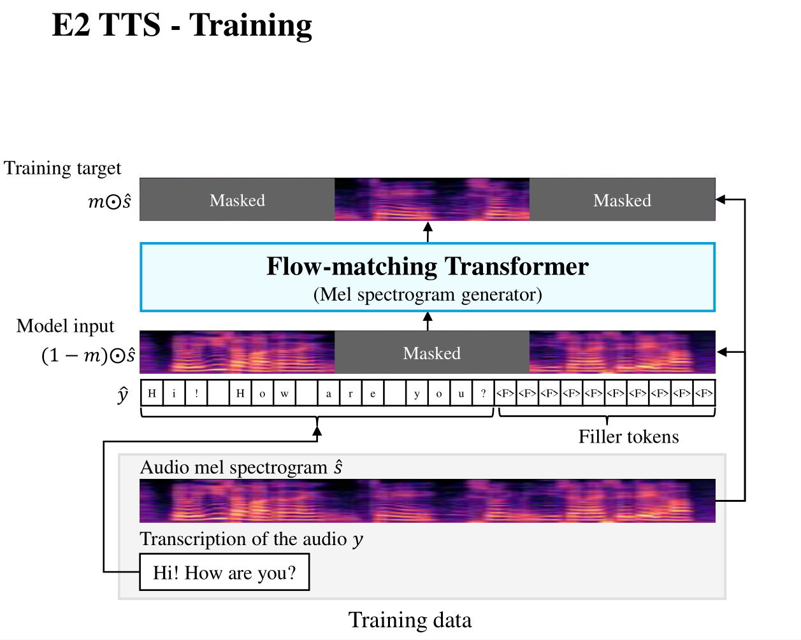
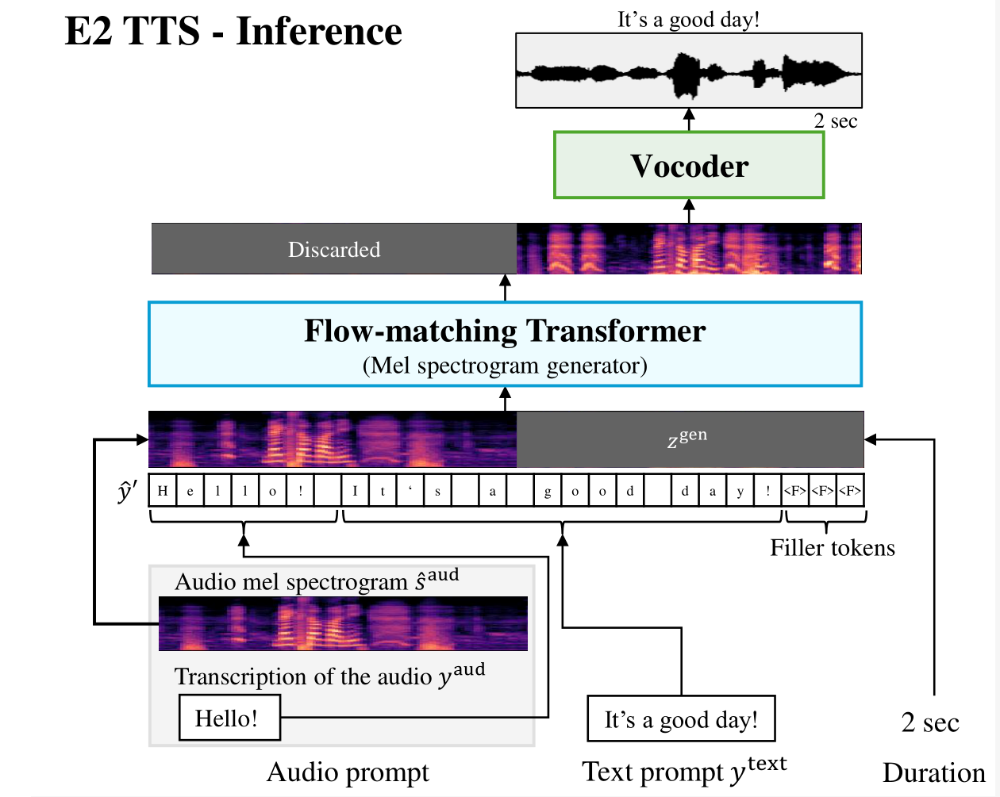
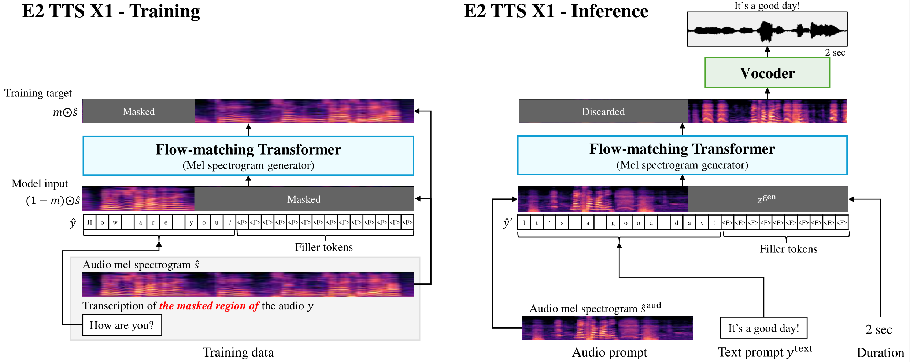

# E2 TTS

基本信息

- 标题: E2 TTS: Embarrassingly Easy Fully Non-Autoregressive Zero-Shot TTS
- 作者:
  - 01 [Sefik Emre Eskimez](../../Authors/Sefik_Emre_Eskimez.md)
  - 02 [Xiaofei Wang](../../Authors/Xiaofei_Wang_(王晓飞).md)
  - 03 [Manthan Thakker](../../Authors/Manthan_Thakker.md)
  - 04 [Canrun Li](../../Authors/Canrun_Li.md)
  - 05 [Chung-Hsien Tsai](../../Authors/Chung-Hsien_Tsai.md)
  - 06 [Zhen Xiao](../../Authors/Zhen_Xiao.md)
  - 07 [Hemin Yang](../../Authors/Hemin_Yang.md)
  - 08 [Zirun Zhu](../../Authors/Zirun_Zhu.md)
  - 09 [Min Tang](../../Authors/Min_Tang.md) 
  - 10 [Xu Tan](../../Authors/Xu_Tan_(谭旭).md)
  - 11 [Yanqing Liu](../../Authors/Yanqing_Liu.md)
  - 12 [Sheng Zhao](../../Authors/Sheng_Zhao_(赵胜).md)
  - 13 [Naoyuki Kanda](../../Authors/Naoyuki_Kanda.md)
- 机构:
  - [Microsoft](../../Institutions/Microsoft.md)
- 时间:
  - 预印时间: 2024.06.26 ArXiv v1
  - 更新笔记: 2024.07.05
- 发表:
  - 期刊/会议 
- 链接:
  - [ArXiv](https://arxiv.org/abs/2406.18009)
  - [DOI]()
  - [Github]()
  - [Demo](https://aka.ms/e2tts/)
  - [Scholar](https://scholar.google.com/scholar?cluster=)
- 标签:
  - [语音合成](../../Tags/SpeechSynthesis.md)
  - [零样本](../../Tags/Zero-Shot.md)
  - [流匹配](../../Tags/Flow-Matching.md)
- 页数: 8
- 引用: 38
- 被引: ?
- 数据:
  - [Libriheavy](../../Datasets/2023.09.15_Libriheavy.md)
- 对比:
  - [Voicebox](../Speech_LLM/2023.06.23_VoiceBox.md)
  - [VALL-E](../Speech_LLM/2023.01.05_VALL-E.md)
  - [NaturalSpeech 3](../Diffusion/2024.03.05_NaturalSpeech3.md)
- 复现:
  - 2024.07.10 [lucidrains/e2-tts-pytorch](https://github.com/lucidrains/e2-tts-pytorch)

## Abstract: 摘要

## Abstract: 摘要

> This paper introduces ***Embarrassingly Easy Text-to-Speech (E2 TTS)***, a fully non-autoregressive zero-shot text-to-speech system that offers human-level naturalness and state-of-the-art speaker similarity and intelligibility.
> In the ***E2 TTS*** framework, the text input is converted into a character sequence with filler tokens.
> The flow-matching-based mel spectrogram generator is then trained based on the audio infilling task.
> Unlike many previous works, it does not require additional components (e.g., duration model, grapheme-to-phoneme) or complex techniques (e.g., monotonic alignment search).
> Despite its simplicity, ***E2 TTS*** achieves state-of-the-art zero-shot TTS capabilities that are comparable to or surpass previous works, including Voicebox and NaturalSpeech 3.
> The simplicity of ***E2 TTS*** also allows for flexibility in the input representation.
> We propose several variants of ***E2 TTS*** to improve usability during inference.
> See this https [URL](https://aka.ms/e2tts/) for demo samples.

## 1.Introduction: 引言

> In recent years, text-to-speech (TTS) systems have seen significant improvements (**FastSpeech** [^1], **FastSpeech2** [^2], **Glow-TTS** [^3], **HiFi-GAN** [^4]), achieving a level of naturalness that is indistinguishable from human speech (**NaturalSpeech** [^5]).
> This advancement has further led to research efforts to generate natural speech for any speaker from a short audio sample, often referred to as an audio prompt.
> Early studies of zero-shot TTS used speaker embedding to condition the TTS system [^6] [^7].
> More recently, **VALL-E** [^8] proposed formulating the zero-shot TTS problem as a language modeling problem in the neural codec domain, achieving significantly improved speaker similarity while maintaining a simplistic model architecture.
> Various extensions were proposed to improve stability (**SpeechX** [^9], **VALL-T** [^10], **RALL-E** [^11]), and **VALL-E 2** [^12] recently achieved human-level zero-shot TTS with techniques including repetition-aware sampling and grouped code modeling.
>
> While the neural codec language model-based zero-shot TTS achieved promising results, there are still a few limitations based on its auto-regressive (AR) model-based architecture.
> Firstly, because the codec token needs to be sampled sequentially, it inevitably increases the inference latency.
> Secondly, a dedicated effort to figure out the best tokenizer (both for text tokens and audio tokens) is necessary to achieve the best quality (**SpeechX** [^9]).
> Thirdly, it is required to use some tricks to stably handle long sequences of audio codecs, such as the combination of AR and non-autoregressive (NAR) modeling (**VALL-E** [^8],**VALL-E 2** [^12]), multi-scale transformer (**UniAudio** [^13]), grouped code modeling (**VALL-E 2** [^12]).
>
> Meanwhile, several fully NAR zero-shot TTS models have been proposed with promising results.
> Unlike AR-based models, fully NAR models enjoy fast inference based on parallel processing.
> **NaturalSpeech2** [^14] and **NaturalSpeech3** [^15] estimate the latent vectors of a neural audio codec based on diffusion models (**DDPM** [^16], [^17]).
> **Voicebox** [^18] and **MatchaTTS** [^19] used a **flow-matching** [^20] model conditioned by an input text.
> However, one notable challenge for such NAR models is how to obtain the alignment between the input text and the output audio, whose length is significantly different.
> **NaturalSpeech2** [^14], **NaturalSpeech3** [^15], and **Voicebox** used a frame-wise phoneme alignment for training the model.
> **MatchaTTS** [^19], on the other hand, used monotonic alignment search (MAS) (**Grad-TTS** [^21], **Glow-TTS** [^3]) to automatically find the alignment between input and output.
> While MAS could alleviate the necessity of the frame-wise phoneme aligner, it still requires an independent duration model to estimate the duration of each phoneme during inference.
> More recently, **E3 TTS** [^22] proposed using cross-attention from the input sequence, which required a carefully designed **U-Net** [^23] architecture.
> As such, fully NAR zero-shot TTS models require either an explicit duration model or a carefully designed architecture.
> One of our findings in this paper is that such techniques are not necessary to achieve high-quality zero-shot TTS, and they are sometimes even harmful to naturalness.
> <u>Footnote: Concurrent with our work, **Seed-TTS** [^24] proposed a diffusion model-based zero-shot TTS, named **Seed-TTS**$_{DiT}$.
> Although it appears to share many similarities with our approach, the authors did not elaborate on the details of their model, making it challenging to compare with our work.</u>
>
> Another complexity in TTS systems is the choice of the text tokenizer.
> As discussed above, the AR-model-based system requires a careful selection of tokenizer to achieve the best result.
> On the other hand, most fully NAR models assume a monotonic alignment between text and output, with the exception of E3 TTS, which uses cross-attention.
> These models impose constraints on the input format and often require a text normalizer to avoid invalid input formats.
> When the model is trained based on phonemes, a grapheme-to-phoneme converter is additionally required.
> 
> In this paper, we propose ***Embarrassingly Easy TTS (E2 TTS)***, a fully NAR zero-shot TTS system with a surprisingly simple architecture.
> ***E2 TTS*** consists of only two modules: a flow-matching-based mel spectrogram generator and a vocoder.
> The text input is converted into a character sequence with filler tokens to match the length of the input character sequence and the output mel-filterbank sequence.
> The mel spectrogram generator, composed of a vanilla Transformer with U-Net style skip connections, is trained using a speech-infilling task (**Voicebox** [^18]).
> Despite its simplicity, ***E2 TTS*** achieves state-of-the-art zero-shot TTS capabilities that are comparable to, or surpass, previous works, including Voicebox and NaturalSpeech 3.
> The simplicity of ***E2 TTS*** also allows for flexibility in the input representation.
> We propose several variants of ***E2 TTS*** to improve usability during inference.

注: 对原文内容进行了重排
- 第三章 方法 对应 原文第二章
- 第四章 实验 对应 原文第三章前三节
- 第五章 结果 对应 原文第三章后三节
- 第六章 结论 对应 原文第四章

## 2.Related Works: 相关工作

~~None~~

## 3.Methodology: 方法

<!-- > Fig.01. An overview of the training (left) and the inference (right) processes of ***E2 TTS***. -->

### 3.1.Training: 训练

原文

> Fig.01 (a) provides an overview of ***E2 TTS*** training.
> Suppose we have a training audio sample $s$ with transcription $y=(c_1, c_2, ..., c_M)$, where $c_i$ represents the $i$-th character of the transcription.
> <u>Footnote: Alternatively, we can represent $y$ as a sequence of Unicode bytes [^25].</u>
> First, we extract its mel-filterbank features $\hat{s}\in\mathbb{R}^{D\times T}$, where $D$ denotes the feature dimension and $T$ represents the sequence length.
> We then create an extended character sequence $\tilde{y}$, where a special filler token $\langle F\rangle$ is appended to $y$ to make the length of $\tilde{y}$ equal to $T$.
> <u>Footnote: We assume $M\le T$, which is almost always valid.</u>

 

图 01 (a) 展示了 ***E2 TTS*** 的训练过程.
假设我们有训练用的音频样本 $s$, 对应的转写文本为 $y=(c_1, c_2, ..., c_M)$, 其中 $c_i$ 表示第 $i$ 个字符. <u>注: 也可以用 Unicode 字节序列来表示 $y$.</u>

首先, 我们提取其梅尔滤波器组特征 $\hat{s}\in\mathbb{R}^{D\times T}$, 其中 $D$ 表示特征维度, $T$ 表示序列长度.
然后, 我们创建扩展的字符序列 $\tilde{y}$, 其中一个特殊填充符号 $\langle F\rangle$ 被添加到 $y$ 后, 使得 $\tilde{y}$ 的长度等于 $T$. <u>注: 我们假设文本字符长度小于音频序列长度 $M\le T$, 这几乎总是成立的.</u>

$$
\hat{y} = (c_1, c_2, \ldots, c_M, \underbrace{\langle F\rangle, \ldots, \langle F\rangle}_{(T-M) \text{ times}}).\tag{01}
$$

原文

> A spectrogram generator, consisting of a vanilla Transformer [^26] with **U-Net** [^23] style skip connection, is then trained based on the speech infilling task (**Voicebox** [^18]).
> More specifically, the model is trained to learn the distribution $P(m\odot\hat{s}|(1-m)\odot\hat{s}, \hat{y})$, where $m\in\{0,1\}^{D\times T}$ represents a binary temporal mask, and $\odot$ is the Hadamard product.
> ***E2 TTS*** uses the conditional **flow-matching** [^20] to learn such distribution.

 

由原始 Transformer 和 U-Net 类型的跳跃连接构成的频谱生成器, 基于语音填充任务进行训练.
具体来说, 模型被训练于学习概率分布 $P(m\odot\hat{s}|(1-m)\odot\hat{s}, \hat{y})$, 其中 $m\in\{0,1\}^{D\times T}$ 表示二值时序掩码, $\odot$ 为 Hadamard 积.
***E2 TTS*** 使用条件化流匹配来学习这样的分布.

### 3.2.Inference: 推理

原文

> Fig.01 (b) provides an overview of the inference with ***E2 TTS***.
> Suppose we have an audio prompt $s^{aud}$ and its transcription $y^{aud}=(c'_1, c'_2, ..., c'_{M^{aud}})$ to mimic the speaker characteristics.
> We also suppose a text prompt $y^{text}=(c''_1, c''_2, ..., c''_{M^{text}})$.
> In the ***E2 TTS*** framework, we also require the target duration of the speech that we want to generate, which may be determined arbitrarily.
> The target duration is internally represented by the frame length $T^{gen}$.
>
> First, we extract the mel-filterbank features $\hat{s}^{aud}\in\mathbb{R}^{D\times T^{aud}}$ from $s^{aud}$.
> We then create an extended character sequence $\hat{y}'$ by concatenating $y^{aud}$, $y^{text}$, and repeated $\langle F\rangle$, as follows:

 

图 01 (b) 展示了 ***E2 TTS*** 的推理过程.
假设有参考音频 $s^{aud}$ 和它的转写文本 $y^{aud}=(c'_1, c'_2, ..., c'_{M^{aud}})$, 用来模仿说话人的特征.
假设有文本提示 $y^{text}=(c''_1, c''_2, ..., c''_{M^{text}})$.

在 ***E2 TTS*** 框架中, 我们还需要指定生成语音的目标时长, 这可能是任意给定的.
目标时长是由内部表示的帧长度 $T^{gen}$ 给定的.

首先, 我们提取参考音频 $s^{aud}$ 的梅尔滤波器组特征 $\hat{s}^{aud}\in\mathbb{R}^{D\times T^{aud}}$.
然后我们将 $y^{aud}$, $y^{text}$, 以及重复 $\langle F\rangle$ 连接起来, 得到扩展的字符序列 $\hat{y}'$.

$$
  \hat{y}' = (c'_1, c'_2, \ldots, c'_{M^{aud}}, c''_1, c''_2, \ldots, c''_{M^{text}}, \underbrace{\langle F\rangle, \ldots, \langle F\rangle}_{\mathcal{T} \text{ times}}),\tag{02}
$$

原文

> where $\mathcal{T}=T^{aud}+T^{gen}-M^{aud}-M^{text}$, which ensures the length of $\hat{y}'$ is equal to $T^{aud}+T^{gen}$.
> <u>Footnote: To ensure $\mathcal{T}\ge 0$, $T^{gen}$ needs to satisfy $T^{gen}\ge M^{aud}+M^{text}-T^{aud}$, which is almost always valid in the TTS scenario.</u>
>
> The mel spectrogram generator then generates mel-filterbank features $\tilde{s}$ based on the learned distribution of $P(\tilde{s}|[\hat{s}^{aud}; z^{gen}], \hat{y}')$, where $z^{gen}$ is an all-zero matrix with a shape of ${D\times T^{gen}}$, and $[;]$ is a concatenation operation in the dimension of $T^*$.
> The generated part of $\tilde{s}$ are then converted to the speech signal based on the vocoder.

 

其中 $\mathcal{T} = T^{aud} + T^{gen} - M^{aud} - M^{text}$, 这保证 $\hat{y}'$ 的长度等于 $T^{aud}+T^{gen}$. 
<u>注: 为了确保 $\mathcal{T}\ge 0$, $T^{gen}$ 需要满足 $T^{gen}\ge M^{aud}+M^{text}-T^{aud}$, 这在 TTS 场景下几乎总是成立的.</u>

然后梅尔频谱生成器基于学习到的分布 $P(\tilde{s}|[\hat{s}^{aud}; z^{gen}], \hat{y}')$ 生成梅尔滤波器组特征 $\tilde{s}$.
其中 $z^{gen}$ 为全零矩阵, 形状为 ${D\times T^{gen}}$, $[;]$ 为在 $T^*$ 维度上的连接操作.
$\tilde{s}$ 的生成部分基于声码器被转换为语音信号.

### 3.3.Flow-Matching-Based Mel Spectrogram Generator: 基于流匹配的梅尔频谱生成器

> ***E2 TTS*** leverages conditional **flow-matching** [^20], which incorporates the principles of continuous normalizing flows [^27].
> This model operates by transforming a simple initial distribution $p_0$ into a complex target distribution $p_1$ that characterizes the data.
> The transformation process is facilitated by a neural network, parameterized by $\theta$, which is trained to estimate a time-dependent vector field, denoted as $v_t(x;\theta)$, for $t \in [0, 1]$.
> From this vector field, we derive a flow, $\phi_{t}$, which effectively transitions $p_0$ into $p_1$.
> The neural network's training is driven by the conditional flow matching objective:

$$
\mathcal{L}^{\text{CFM}}(\theta) = \mathbb{E}_{t,q(x_1), p_t(x|x_1)} \left\| u_t(x|x_1) - v_t(x;\theta) \right\|^2,\tag{03}
$$

> where $p_t$ is the probability path at time $t$, $u_t$ is the designated vector field for $p_t$, $x_1$ symbolizes the random variable corresponding to the training data, and $q$ is the distribution of the training data.
> In the training phase, we construct both a probability path and a vector field from the training data, utilizing an optimal transport path: $p_t(x|x_1)=\mathcal{N}(x|tx_1, (1-(1-\sigma_{min})t)^2I)$ and $u_t(x|x_1)=(x_1-(1-\sigma_{min})x)/(1-(1-\sigma_{min})t)$.
> For inference, we apply an ordinary differential equation solver [^27] to generate the log mel-filterbank features starting from the initial distribution $p_0$.
>
> We adopt the same model architecture with the audio model of Voicebox (Fig.02 of **Voicebox** [^18]) except that the frame-wise phoneme sequence is replaced into $\hat{y}$.
> Specifically, Transformer with U-Net style skip connection (**Voicebox** [^18]) is used as a backbone.
> The input to the mel spectrogram generator is $m\odot\hat{s}$, $\hat{y}$, the flow step $t$, and noisy speech $s_t$.
> $\hat{y}$ is first converted to character embedding sequence $\tilde{y}\in\mathbb{R}^{E\times T}$.
> Then, $m\odot\hat{s}$, $s_t$, $\tilde{y}$ are all stacked to form a tensor with a shape of $(2\cdot D+E)\times T$, followed by a linear layer to output a tensor with a shape of $D\times T$.
> Finally, an embedding representation, $\hat{t}\in\mathbb{R}^D$, of $t$ is appended to form the input tensor with a shape of $\mathbb{R}^{D\times (T+1)}$ to the Transformer.
> The Transformer is trained to output a vector field $v_t$ with the conditional flow-matching objective $\mathcal{L}^{CFM}$.

### 3.4.Relationship to Voicebox: 与 Voicebox 的关联

> ***E2 TTS*** has a close relationship with the Voicebox.
> From the perspective of the Voicebox, ***E2 TTS*** replaces a frame-wise phoneme sequence used in conditioning with a character sequence that includes a filler token.
> This change significantly simplifies the model by eliminating the need for a grapheme-to-phoneme converter, a phoneme aligner, and a phoneme duration model.
> From another viewpoint, the mel spectrogram generator of ***E2 TTS*** can be viewed as a joint model of the grapheme-to-phoneme converter, the phoneme duration model, and the audio model of the Voicebox.
> This joint modeling significantly improves naturalness while maintaining speaker similarity and intelligibility, as will be demonstrated in our experiments.

### 3.5.Extension of E2 TTS: E2 TTS 的扩展

> Fig. 2. An overview of the training (left) and the inference (right) processes of E2 TTS X1.

#### 3.5.1.Extension 1: Eliminating the need for transcription of audio prompts in inference

> In certain application contexts, obtaining the transcription of the audio prompt can be challenging.
> To eliminate the requirement of the transcription of the audio prompt during inference, we introduce an extension, illustrated in Fig.02.
> This extension, referred to as ***E2 TTS X1***, assumes that we have access to the transcription of the masked region of the audio, which we use for $y$.
> During inference, the extended character sequence $\tilde{y}'$ is formed without $y^{aud}$, namely,

$$
    \tilde{y}' = (c''_1, c''_2, \ldots, c''_{M^{text}}, \underbrace{\langle F\rangle, \ldots, \langle F\rangle}_{\mathcal{T} \text{ times}}).\tag{04}
$$

> The rest of the procedure remains the same as in the basic ***E2 TTS***.
>
> The transcription of the masked region of the training audio can be obtained in several ways.
> One method is to simply apply ASR to the masked region during training, which is straightforward but costly.
> In our experiment, we employed the **Montreal Forced Aligner** [^28] to determine the start and end times of words within each training data sample.
> The masked region was determined in such a way that we ensured not to cut the word in the middle.

#### 3.5.2.Extension 2: Enabling explicit indication of pronunciation for parts of words in a sentence

> In certain scenarios, users want to specify the pronunciation of a specific word such as unique foreign names.
> Retraining the model to accommodate such new words is both expensive and time-consuming.
>
> To tackle this challenge, we introduce another extension that enables us to indicate the pronunciation of a word during inference.
> In this extension, referred to as ***E2 TTS X2***, we occasionally substitute a word in $y$ with a phoneme sequence enclosed in parentheses during training, as depicted in Fig.~\ref{fig:extension_2_fig}.
> In our implementation, we replaced the word in $y$ with the phoneme sequence from the CMU pronouncing dictionary [^29] with a 15\% probability.
> During inference, we simply replace the target word with phoneme sequences enclosed in parentheses.
>
> It's important to note that $y$ is still a simple sequence of characters, and whether the character represents a word or a phoneme is solely determined by the existence of parentheses and their content.
> It's also noteworthy that punctuation marks surrounding the word are retained during replacement, which allows the model to utilize these punctuation marks even when the word is replaced with phoneme sequences.

## 4.Experiments: 实验

### 4.1.Training Data: 训练数据

> We utilized the **Libriheavy** [^30] dataset to train our models.
> The Libriheavy dataset comprises 50,000 hours of read English speech from 6,736 speakers, accompanied by transcriptions that preserve case and punctuation marks.
> It is derived from the **Librilight** [^31] dataset contains 60,000 hours of read English speech from over 7,000 speakers.
> For ***E2 TTS*** training, we used the case and punctuated transcription without any pre-processing.
> We also used a proprietary 200,000 hours of training data to investigate the scalability of ***E2 TTS*** model.

### 4.2.Model Configurations: 模型配置

> We constructed our proposed ***E2 TTS*** models using a Transformer architecture.
> The architecture incorporated **U-Net** [^23] style skip connections, 24 layers, 16 attention heads, an embedding dimension of 1024, a linear layer dimension of 4096, and a dropout rate of 0.1.
> The character embedding vocabulary size was 399.
> <u>Footnote: We used all characters and symbols that we found in the training data without filtering.</u>
> The total number of parameters amounted to 335 million.
> We modeled the 100-dimensional log mel-filterbank features, extracted every 10.7 milliseconds from audio samples with a 24 kHz sampling rate.
> A **BigVGAN** [^32]-based vocoder was employed to convert the log mel-filterbank features into waveforms.
> The masking length was randomly determined to be between 70\% and 100\% of the log mel-filterbank feature length during training.
> In addition, we randomly dropped all the conditioning information with a 20\% probability for **classifier-free guidance (CFG)** [^33].
> All models were trained for 800,000 mini-batch updates with an effective mini-batch size of 307,200 audio frames.
> We utilized a linear decay learning rate schedule with a peak learning rate of $7.5\times10^{-5}$ and incorporated a warm-up phase for the initial 20,000 updates.
> We discarded the training samples that exceeded 4,000 frames.
>
> In a subset of our experiments, we initialized ***E2 TTS*** models using a pre-trained model in an unsupervised manner.
> This pre-training was conducted on an anonymized dataset, which consisted of 200,000 hours of unlabeled data.
> The pre-training protocol, which involved 800,000 mini-batch updates, followed the scheme outlined in [^34].
>
> In addition, we trained a regression-based duration model by following that of **Voicebox** [^18].
> It is based on a Transformer architecture, consisted of 8 layers, 8 attention heads, an embedding dimension of 512, a linear layer dimension of 2048, and a dropout rate of 0.1.
> The training process involved 75,000 mini-batch updates with 120,000 frames.
> We used this duration model for estimating the target duration for the fair comparison to the Voicebox baseline.
> Note that we will also show that ***E2 TTS*** is robust for different target duration in Section 5.3.

### 4.3.Evaluation Data & Metrics: 评估数据及指标

> In order to assess our models, we utilized the test-clean subset of the **LibriSpeech-PC** dataset [^35], which is an extension of **LibriSpeech** [^36] that includes additional punctuation marks and casing.
> We specifically filtered the samples to retain only those with a duration between 4 and 10 seconds.
> Since **LibriSpeech-PC** [^35] lacks some of the utterances from LibriSpeech, the total number of samples was reduced to 1,132, sourced from 39 speakers.
> For the audio prompt, we extracted the last three seconds from a randomly sampled speech file from the same speaker for each evaluation sample.
>
> We carried out both objective and subjective evaluations.
> For the objective evaluations, we generated samples using three random seeds, computed the objective metrics for each, and then calculated their average.
> We computed the word error rate (WER) and speaker similarity (SIM-o).
> The WER is indicative of the intelligibility of the generated samples, and for its calculation, we utilized a **HuBERT**-large-based [^37] ASR system.
> The SIM-o represents the speaker similarity between the audio prompt and the generated sample, which is estimated by computing the cosine similarity between the speaker embeddings of both.
> For the calculation of SIM-o, we used a **WavLM**-large-based [^38] speaker verification model.  
>
> For the subjective assessments, we conducted two tests: the Comparative Mean Opinion Score (CMOS) and the Speaker Similarity Mean Opinion Score (SMOS).
> We evaluated 39 samples for both tests, with one sample per speaker from our test-clean set.
> Each sample was assessed by 12 Native English evaluators.
> In the CMOS test (**NaturalSpeech3** [^15]), evaluators were shown the ground-truth sample and the generated sample side-by-side without knowing which was the ground-truth, and were asked to rate the naturalness on a 7-point scale (from -3 to 3), where a negative value indicates a preference for the ground-truth and a positive value indicates the opposite.
> In the SMOS test, evaluators were presented with the audio prompt and the generated sample, and asked to rate the speaker similarity on a scale of 1 (not similar at all) to 5 (identical), with increments of 1.

## 5.Results: 结果

### 5.1.Main Results: 主要结果

> In our experiments, we conducted a comparison between our ***E2 TTS*** models and four other models: **Voicebox** [^18], **VALL-E** [^8], and **NaturalSpeech3** [^15].
> We utilized our own reimplementation of the Voicebox model, which was based on the same model configuration with ***E2 TTS*** except that the Voicebox model is trained with frame-wise phoneme alignment.
> During the inference, we used CFG with a guidance strength of 1.0 for both ***E2 TTS*** and Voicebox.
> We employed the midpoint ODE solver with a number of function evaluations of 32.
>
> Table~\ref{tab:main_results} presents the objective evaluation results for the baseline and ***E2 TTS*** models across various configurations.
> By comparing the (B4) and (P1) systems, we observe that the ***E2 TTS*** model achieved better WER and SIM-o than the Voicebox model when both were trained on the Libriheavy dataset.
> This trend holds even when we initialize the model with unsupervised pre-training [^34] ((B5) vs. (P2)), where the (P2) system achieved the best WER (1.9\%) and SIM-o (0.708) which are better than those of the ground-truth audio.
> Finally, by using larger training data (P3), ***E2 TTS*** achieved the same best WER (1.9\%) and the second best SIM-o (0.707) even when the model is trained from scratch, showcasing the scalability of ***E2 TTS***.
> It is noteworthy that ***E2 TTS*** achieved superior performance compared to all strong baselines, including VALL-E, NaturalSpeech 3, and Voicebox, despite its extremely simple framework.
>
> Table~\ref{tab:subj_results} illustrated the subjective evaluation results for NaturalSpeech 3, Voicebox, and ***E2 TTS***.
> Firstly, all variants of ***E2 TTS***, from (P1) to (P3), showed a better CMOS score compared to NaturalSpeech 3 and Voicebox.
> In particular, the (P2) model achieved a CMOS score of -0.05, which is considered to have a level of naturalness indistinguishable from the ground truth (**NaturalSpeech3** [^15]; **Seed-TTS** [^24]).
> <u>Footnote: In the evaluation, ***E2 TTS*** was judged to be better in 33\% of samples, while the ground truth was better in another 33\% of samples.
> The remaining samples were judged to be of equal quality.</u>
> The comparison between (B4) and (P1) suggests that the use of phoneme alignment was the major bottleneck in achieving better naturalness.
> Regarding speaker similarity, all the models we tested showed a better SMOS compared to the ground truth, a phenomenon also observed in **NaturalSpeech3** [^15].
> <u>Footnote: In LibriSpeech, some speakers utilized varying voice characteristics for different characters in the book, leading to a low SMOS for the ground truth.</u>
> Among the tested systems, ***E2 TTS*** achieved a comparable SMOS to Voicebox and NaturalSpeech 3.
>
> Overall, ***E2 TTS*** demonstrated a robust zero-shot TTS capability that is either superior or comparable to strong baselines, including Voicebox and NaturalSpeech 3.
> The comparison between Voicebox and ***E2 TTS*** revealed that the use of phoneme alignment was the primary obstacle in achieving natural-sounding audio.
> With a simple training scheme, ***E2 TTS*** can be easily scaled up to accommodate large training data.
> This resulted in human-level speaker similarity, intelligibility, and a level of naturalness that is indistinguishable from a human's voice in the zero-shot TTS setting, despite the framework’s extreme simplicity.

### 5.2.Evaluation of E2 TTS Extensions: E2 TTS 扩展的评估

#### 5.2.1.Evaluation of the Extension 1

> The results for the ***E2 TTS X1*** models are shown in Table~\ref{tab:e2ttse1}.
> These results indicate that the ***E2 TTS X1*** model has achieved results nearly identical to those of the ***E2 TTS*** model, especially when the model was initialized by unsupervised pre-training [^34].
> ***E2 TTS X1*** does not require the transcription of the audio prompt, which greatly enhances its usability.

#### 5.2.2.Evaluation of the Extension 2

> In this experiment, we trained the ***E2 TTS X2*** models with a phoneme replacement rate of 15\%.
> During inference, we randomly replaced words in the test-clean dataset with phoneme sequences, with a probability ranging from 0\% up to 50\%.
>
> Table~\ref{tab:e2ttse2} shows the result.
> We first observed that ***E2 TTS X2*** achieved parity results when no words were replaced with phoneme sequences.
> This shows that we can introduce extension 2 without any drawbacks.
> We also observed that the ***E2 TTS X2*** model showed only marginal degradation of WER, even when we replaced 50\% of words with phoneme sequences.
> This result indicates that we can specify the pronunciation of a new term without retraining the ***E2 TTS*** model.

### 5.3.Analysis of the System Behavior: 系统行为分析

#### 5.3.1.Training Progress

> Fig.~\ref{fig:abl_prg_p1} illustrates the training progress of the (B4)-Voicebox, (B5)-Voicebox, (P1)-E2 TTS, and (P2)-***E2 TTS*** models.
> The upper graphs represent the training progress as measured by WER, while the lower graphs depict the progress as measured by SIM-o.
> We present a comparison between (B4)-Voicebox and (P1)-E2 TTS, as well as between (B5)-Voicebox and (P2)-E2 TTS.
> The former pair was trained from scratch, while the latter was initialized by unsupervised pre-training [^34].
> 
> From the WER graphs, we observe that the Voicebox models demonstrated a good WER even at the 10\% training point, owing to the use of frame-wise phoneme alignment.
> On the other hand, ***E2 TTS*** required significantly more training to converge.
> Interestingly, ***E2 TTS*** achieved a better WER at the end of the training.
> We speculate this is because the ***E2 TTS*** model learned a more effective grapheme-to-phoneme mapping based on the large training data, compared to what was used for Voicebox.
>
> From the SIM-o graphs, we also observed that ***E2 TTS*** required more training iteration, but it ultimately achieved a better result at the end of the training.
> We believe this suggests the superiority of ***E2 TTS***, where the audio model and duration model are jointly learned as a single flow-matching Transformer.

#### 5.3.2.Impact of Audio Prompt Length

> During the inference of ***E2 TTS***, the model needs to automatically identify the boundary of $y^{aud}$ and $y^{text}$ in $\hat{y}$ based on the audio prompt $\hat{s}^{aud}$.
> Otherwise, the generated audio may either contain a part of $y^{aud}$ or miss a part of $y^{text}$.
> This is not a trivial problem, and ***E2 TTS*** could show a deteriorated result when the length of the audio prompt $\hat{s}^{aud}$ is long.
>
> To examine the capability of ***E2 TTS***, we evaluated the WER and SIM-o with different audio prompt lengths.
> The result is shown in Fig.~\ref{fig:abl_prompt_dur}.
> In this experiment, we utilized the entire audio prompts instead of using the last 3 seconds, and categorized the result based on the length of the audio prompts.
> As shown in the figure, we did not observe any obvious pattern between the WER and the length of the audio prompt.
> This suggests that ***E2 TTS*** works reasonably well even when the prompt length is as long as 10 seconds.
> On the other hand, SIM-o significantly improved when the audio prompt length increased, which suggests the scalability of ***E2 TTS*** with respect to the audio prompt length.

#### 5.3.3.Impact of Changing the Speech Rate

> We further examined the model's ability to produce suitable content when altering the total duration input.
> In this experiment, we adjusted the total duration by multiplying it by $\frac{1}{sr}$, where $sr$ represents the speech rate.
> The results are shown in Fig.~\ref{fig:abl_spd}.
> As depicted in the graphs, the ***E2 TTS*** model exhibited only a moderate increase in WER while maintaining a high SIM-o, even in the challenging cases of $sr=0.7$ and $sr=1.3$.
> This result suggests the robustness of ***E2 TTS*** with respect to the total duration input.

## 6.Conclusions: 结论

> We introduced ***E2 TTS***, a novel fully NAR zero-shot TTS.
> In the ***E2 TTS*** framework, the text input is converted into a character sequence with filler tokens to match the length of the input character sequence and the output mel-filterbank sequence.
> The flow-matching-based mel spectrogram generator is then trained based on the audio infilling task.
> Despite its simplicity, ***E2 TTS*** achieved state-of-the-art zero-shot TTS capabilities that were comparable to or surpass previous works, including Voicebox and NaturalSpeech 3.
> The simplicity of ***E2 TTS*** also allowed for flexibility in the input representation.
> We proposed several variants of ***E2 TTS*** to improve usability during inference.

[^1]: [FastSpeech](../../Models/TTS2_Acoustic/2019.05.22_FastSpeech.md)
[^2]: [FastSpeech2](../../Models/TTS2_Acoustic/2020.06.08_FastSpeech2.md)
[^3]: [Glow-TTS](../../Models/TTS2_Acoustic/2020.05.22_Glow-TTS.md)
[^4]: [HiFi-GAN](../../Models/TTS3_Vocoder/2020.10.12_HiFi-GAN.md)
[^5]: [NaturalSpeech](../../Models/E2E/2022.05.09_NaturalSpeech.md)
[^6]: [Neural Voice Cloning with a Few Samples]
[^7]: [Transfer Learning from Speaker Verification to Multispeaker Text-To-Speech Synthesis]
[^8]: [VALL-E](../../Models/Speech_LLM/2023.01.05_VALL-E.md)
[^9]: [SpeechX](../../Models/Speech_LLM/2023.08.14_SpeechX.md)
[^10]: [VALL-T](../../Models/Speech_LLM/2024.01.25_VALL-T.md)
[^11]: [RALL-E](../../Models/Speech_LLM/2024.04.04_RALL-E.md)
[^12]: [VALL-E 2](../../Models/Speech_LLM/2024.06.08_VALL-E2.md)
[^13]: [UniAudio](../../Models/Speech_LLM/2023.10.01_UniAudio.md)
[^14]: [NaturalSpeech2](../../Models/Diffusion/2023.04.18_NaturalSpeech2.md)
[^15]: [NaturalSpeech3](../../Models/Diffusion/2024.03.05_NaturalSpeech3.md)
[^16]: [DDPM]
[^17]: []
[^18]: [Voicebox](../../Models/Speech_LLM/2023.06.23_VoiceBox.md)
[^19]: [Matcha-TTS]
[^20]: [Flow-Matching]
[^21]: [Grad-TTS](../../Models/TTS2_Acoustic/2021.05.13_Grad-TTS.md)
[^22]: [E3 TTS](../../Models/Diffusion/2023.11.02_E3_TTS.md)
[^23]: [U-Net]
[^24]: [Seed-TTS](../../Models/Speech_LLM/2024.06.04_Seed-TTS.md)
[^25]: [Bytes are All You Need: End-To-End Multilingual Speech Recognition and Synthesis with Bytes]
[^26]: [Transformer](../../Models/_Transformer/2017.06.12_Transformer.md)
[^27]: [NeuralODE]
[^28]: [MFA]
[^29]: [The Carnegie Mellon University Pronouncing Dictionary]
[^30]: [LibriHeavy](../../Datasets/2023.09.15_Libriheavy.md)
[^31]: [Libri-Light](../../Datasets/2019.12.17_Libri-Light.md)
[^32]: [BigVGAN](../../Models/TTS3_Vocoder/2022.06.09_BigVGAN.md)
[^33]: [Classifier-Free Diffusion Guidance]
[^34]: [An Investigation of Noise Robustness for Flow-Matching-Based Zero-Shot TTS]
[^35]: [LibriSpeech-PC](../../Datasets/LibriSpeech-PC.md)
[^36]: [LibriSpeech](../../Datasets/2015.04.19_LibriSpeech.md)
[^37]: [HuBERT](../../Models/Speech_Representaion/2021.06.14_HuBERT.md)
[^38]: [WavLM](../../Models/Speech_Representaion/2021.10.26_WavLM.md)