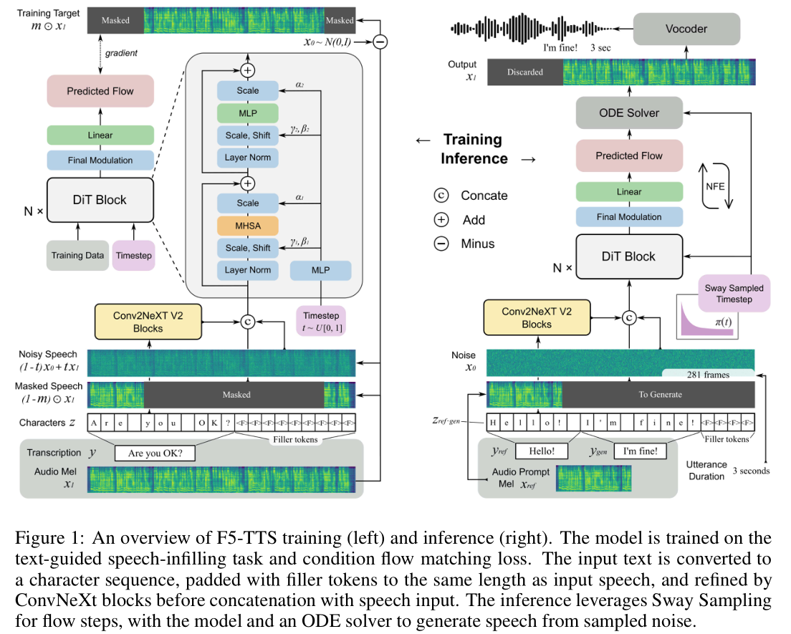

# F5-TTS

基本信息

- 标题: "F5-TTS: A Fairytaler that Fakes Fluent and Faithful Speech with Flow Matching"
- 作者:
  - 01 Yushen Chen - Shanghai Jiao Tong University
  - 02 Zhikang Niu - Shanghai Jiao Tong University
  - 03 Ziyang Ma - Shanghai Jiao Tong University
  - 04 Keqi Deng - University of Cambridge
  - 05 Chunhui Wang - Geely Automobile Research Institute
  - 06 Jian Zhao - Geely Automobile Research Institute
  - 07 Kai Yu - Shanghai Jiao Tong University
  - 08 Xie Chen - Shanghai Jiao Tong University - chenxie95@sjtu.edu.cn
- 链接:
  - [ArXiv](https://arxiv.org/abs/2410.06885)
  - [Publication]
  - [Github](https://github.com/SWivid/F5-TTS)
  - [Demo](https://swivid.github.io/F5-TTS)
- 文件:
  - [ArXiv v1](_PDF/2024.10.09_2410.06885v1__F5-TTS__A_Fairytaler_that_Fakes_Fluent_and_Faithful_Speech_with_Flow_Matching.pdf)
  - [ArXiv v2](_PDF/2024.10.15_2410.06885v2__F5-TTS__A_Fairytaler_that_Fakes_Fluent_and_Faithful_Speech_with_Flow_Matching.pdf)
  - [ArXiv v3](_PDF/2025.05.20_2410.06885v3__F5-TTS__A_Fairytaler_that_Fakes_Fluent_and_Faithful_Speech_with_Flow_Matching.pdf)
  - [Publication] #TODO

## 摘要

<!--
This paper introduces ***F5-TTS***, a fully non-autoregressive text-to-speech system based on flow matching with Diffusion Transformer (DiT).
Without requiring complex designs such as duration model, text encoder, and phoneme alignment, the text input is simply padded with filler tokens to the same length as input speech, and then the denoising is performed for speech generation, which was originally proved feasible by **E2 TTS**.
However, the original design of **E2 TTS** makes it hard to follow due to its slow convergence and low robustness.
To address these issues, we first model the input with ConvNeXt to refine the text representation, making it easy to align with the speech.
We further propose an inference-time Sway Sampling strategy, which significantly improves our model's performance and efficiency.
This sampling strategy for flow step can be easily applied to existing flow matching based models without retraining.
Our design allows faster training and achieves an inference RTF of 0.15, which is greatly improved compared to state-of-the-art diffusion-based TTS models.
Trained on a public 100K hours multilingual dataset, our ***F5-TTS*** exhibits highly natural and expressive zero-shot ability, seamless code-switching capability, and speed control efficiency.
We have released all codes and checkpoints to promote community development, at [Github](https://SWivid.github.io/F5-TTS/).
-->

本文介绍了 ***F5-TTS***, 一个基于流匹配和 DiT 的完全非自回归文本到语音系统.
无需复杂的设计, 如时长模型, 文本编码器和音素对齐, 文本输入只需要通过补充填充符号使得长度与输入语音相同, 然后进行去噪以生成语音, 这一方式最初由 **E2 TTS** 证明是可行的.
然而, **E2 TTS** 的原始设计使其难以跟随研究, 这是因为其缓慢的收敛和低鲁棒性.

为了解决这些问题, 我们首先使用 ConvNeXt 模型对输入进行建模, 优化文本表示使其更容易与语音对齐.
我们进一步提出了一个推理时摇摆采样策略, 它显著提高了模型的性能和效率.
这个采样策略可以很容易地应用到现有的基于流匹配的模型上, 而不需要重新训练.

我们的设计允许更快的训练, 并实现了推理 RTF 为 0.15, 这比现有的基于流匹配的 TTS 模型的最新水平提高了很多.

在一个公开的 100K 小时多语言数据集上训练, 我们的 ***F5-TTS*** 具有高度自然和富有表现力的零样本能力, 无缝切换能力, 以及速度控制的效率.

演示样本可以在[此处](https://swivid.github.io/F5-TTS)找到.
我们发布所有代码和检查点, 以促进社区开发 ([Github](https://github.com/SWivid/F5-TTS)).

</td>
</tr>
</table>

## 1·引言

<--
Recent research in Text-to-Speech (TTS) has experienced great advancement~\citep{tacotron2,transtts,fastspeech2,glowtts,vits,gradtts,viola,ns1}.
With a few seconds of audio prompt, current TTS models are able to synthesize speech for any given text and mimic the speaker of audio prompt~\citep{valle,vallex}.
The synthesized speech can achieve high fidelity and naturalness that they are almost indistinguishable from human speech~\citep{ns2,ns3,valle2,voicebox}.
-->

</td>
<td>

文本转语音的近期研究取得了显著进展 ([Tacotron2](../Acoustic/2017.12.16_Tacotron2.md)[^01]; [Transformer-TTS](../Acoustic/2018.09.19_TransformerTTS.md)[^02]; [FastSpeech 2](../Acoustic/2020.06.08_FastSpeech2.md)[^03]; [Glow-TTS](../Acoustic/2020.05.22_Glow-TTS.md)[^04]; [VITS](../E2E/2021.06.11_VITS.md)[^05]; [Grad-TTS](../Acoustic/2021.05.13_Grad-TTS.md)[^06]; [VioLA](../SpeechLM/ST2ST/2023.05.25_VioLA.md)[^07]; [NaturalSpeech](../E2E/2022.05.09_NaturalSpeech.md)[^08]).
通过几秒钟的音频提示, 当前的 TTS 模型能够为任何给定的文本合成语音, 并模仿参考音频中的说话人 ([VALL-E](../SpeechLM/ST2S/2023.01.05_VALL-E.md-E.md)[^09]; [VALL-E X [10]](../SpeechLM/ST2S/2023.03.07_VALL-E_X.md)).
合成的语音可以达到几乎与人类语音无法区分的高保真度和自然度 ([NaturalSpeech 2 [11]](2023.04.18_NaturalSpeech2.md); [NaturalSpeech 3 [12]](2024.03.05_NaturalSpeech3.md); [VALL-E 2 [13]](../SpeechLM/ST2S/2024.06.08_VALL-E_2.md); [Voicebox [14]](../SpeechLM/2023.06.23_VoiceBox.md)).

<--
While autoregressive (AR) based TTS models exhibit an intuitive way of consecutively predicting the next token(s) and have achieved promising zero-shot TTS capability, the inherent limitations of AR modeling require extra efforts addressing issues such as inference latency and exposure bias~\citep{ellav,vallt,valler,ralle,voicecraft}.
Moreover, the quality of speech tokenizer is essential for AR models to achieve high-fidelity synthesis~\citep{soundstream,encodec,audiodec,hificodec,speechtokenizer,dmel,ndvq}.
Thus, there have been studies exploring direct modeling in continuous space~\citep{ardittts,ar-wovq,melle} to enhance synthesized speech quality recently.
-->

尽管基于自回归 (AR) 的 TTS 模型展示了直观的方式, 即连续预测下一个 Token, 并实现了有前景的零样本 TTS 能力, 但自回归建模的固有限制需要额外努力来解决推理延迟和暴露偏差等问题 ([ELLA-V [15]](../SpeechLM/ST2S/2024.01.14_ELLA-V.md); [VALL-T [16]](../SpeechLM/ST2S/2024.01.25_VALL-T.md); [VALL-E R [17]](../SpeechLM/ST2S/2024.06.12_VALL-E_R.md); [RALL-E [18]](../SpeechLM/ST2S/2024.04.04_RALL-E.md); [VoiceCraft [19]](../SpeechLM/2024.03.25_VoiceCraft.md)).
此外, 语音分词器的质量对于自回归模型实现高保真合成至关重要 ([SoundStream [20]](../Tokenizer/2021.07.07_SoundStream.md); [EnCodec [21]](../Tokenizer/2022.10.24_EnCodec.md); [AudioDec [22]](../Tokenizer/2023.05.26_AudioDec.md); [HiFi-Codec [23]](../Tokenizer/2023.05.04_HiFi-Codec.md); [SpeechTokenizer [24]](../SpeechCodec/2023.08.31_SpeechTokenizer.md); [dMel [25]](../SpeechCodec/2024.07.22_dMel.md); [NDVQ [26]](../SpeechCodec/2024.09.19_NDVQ.md)).
因此, 最近的研究探索了在连续空间中直接建模 ([ARDiT [27]](2024.06.08_ARDiT.md); [MAR [28]](../CV/2024.06.17_MAR.md); [MELLE [29]](../SpeechLM/ST2S/2024.07.11_MELLE.md)), 以提高合成语音的质量.

<--
Although AR models demonstrate impressive zero-shot performance as they perform implicit duration modeling and can leverage diverse sampling strategies, non-autoregressive (NAR) models benefit from fast inference through parallel processing, and effectively balance synthesis quality and latency.
Notably, diffusion models~\citep{ddpm,score} contribute most to the success of current NAR speech models~\citep{ns2,ns3}.
In particular, Flow Matching with Optimal Transport path (FM-OT)~\citep{cfm-ot} is widely used in recent research fields not only text-to-speech~\citep{voicebox,voiceflow,matchatts,dittotts,e2tts} but also image generation~\citep{sd3} and music generation~\citep{fluxmusic}.
-->

尽管自回归模型展示了令人印象深刻的零样本性能, 因为它们执行隐式的时长建模并可以利用多种采样策略, 但非自回归 (NAR) 模型通过并行处理受益于快速推理, 并有效平衡了合成质量和延迟.
值得注意的是, 扩散模型 ([DDPM [30]](_2020.06.19_DDPM.md); [Song et al.(2020) [31]](_2020.11.26_Score-Based_Generative_Modeling_through_SDE.md)) 对当前非自回归语音模型的成功贡献最大 ([NaturalSpeech 2 [11]](2023.04.18_NaturalSpeech2.md); [NaturalSpeech 3 [12]](2024.03.05_NaturalSpeech3.md)).
特别是, [最优传输的流匹配技术 (FM-OT) [32]](../FlowMatching/_2022.10.06_Flow_Matching.md) 在最近的文本转语音 ([Voicebox [14]](../SpeechLM/2023.06.23_VoiceBox.md); [VoiceFlow [33]](../FlowMatching/2023.09.10_VoiceFlow.md); [Matcha-TTS [34]](2023.09.06_Matcha-TTS.md); [DiTTo-TTS [35]](2024.06.17_DiTTo-TTS.md); [**E2 TTS** [36]](2024.06.26_E2_TTS.md)) 以及图像生成 ([StableDiffusion3 [37]](2024.03.05_StableDiffusion3.md)) 和音乐生成 ([FluxMusic [38]](2024.09.01_FluxMusic.md)) 等研究领域中得到了广泛应用.

<--
Unlike AR-based models, the alignment modeling between input text and synthesized speech is crucial and challenging for NAR-based models.
While NaturalSpeech 3 \citep{ns3} and Voicebox \citep{voicebox} use frame-wise phoneme alignment; Matcha-TTS \citep{matchatts} adopts monotonic alignment search \citep{glowtts} and relies on a phoneme-level duration model; recent works find that introducing such rigid alignment between text and speech hinders the model from generating results with higher naturalness~\citep{e2tts,seedtts}.
-->

与基于自回归的模型不同, 输入文本与合成语音之间的对齐建模对于基于非自回归的模型至关重要且具有挑战性.
尽管 [NaturalSpeech 3 [12]](2024.03.05_NaturalSpeech3.md) 和[Voicebox [14]](../SpeechLM/2023.06.23_VoiceBox.md) 使用帧级音素对齐; [Matcha-TTS [34]](2023.09.06_Matcha-TTS.md) 采用单调对齐搜索并依赖于音素级时长模型; 最近的研究发现, 在文本和语音之间引入这种刚性和不灵活的对齐会阻碍模型生成更高自然度的结果 ([**E2 TTS** [36]](2024.06.26_E2_TTS.md); [Seed-TTS [39]](../SpeechLM/2024.06.04_Seed-TTS.md)).

<--
E3 TTS~\citep{e3tts} abandons phoneme-level duration and applies cross-attention on the input sequence but yields limited audio quality.
DiTTo-TTS~\citep{dittotts} uses Diffusion Transformer (DiT)~\citep{dit} with cross-attention conditioned on encoded text from a pretrained language model.
To further enhance alignment, it uses the pretrained language model to finetune the neural audio codec, infusing semantic information into the generated representations.
In contrast, E2 TTS~\citep{e2tts}, based on Voicebox~\citep{voicebox}, adopts a simpler way, which removes the phoneme and duration predictor and directly uses characters padded with filler tokens to the length of mel spectrograms as input.
This simple scheme also achieves very natural and realistic synthesized results.
However, we found that robustness issues exist in E2 TTS for the text and speech alignment.
Seed-TTS~\citep{seedtts} employs a similar strategy and achieves excellent results, though not elaborated in model details.
In these ways of not explicitly modeling phoneme-level duration, models learn to assign the length of each word or phoneme according to the given total sequence length, resulting in improved prosody and rhythm.
-->

- [E3 TTS [40]](2023.11.02_E3_TTS.md) 放弃了音素级时长, 并在输入序列上应用交叉注意力, 但音频质量有限.
- [DiTTo-TTS [35]](2024.06.17_DiTTo-TTS.md) 使用 [Diffusion Transformer (DiT) [41]](_2022.12.19_DiT.md), 并在预训练语言模型的编码文本上进行交叉注意力条件化.
为了进一步增强对齐, 它使用预训练语言模型微调神经音频编解码器, 将语义信息注入生成的表示中.
- 相比之下, [**E2 TTS** [36]](2024.06.26_E2_TTS.md) 基于 [Voicebox [14]](../SpeechLM/2023.06.23_VoiceBox.md), 采用了一种更简单的方式, 即移除音素和时长预测器, 并直接使用填充了填充标记的字符作为输入, 长度与梅尔频谱图相同.
这种简单的方案也实现了非常自然和逼真的合成结果.
然而, 我们发现 **E2 TTS** 在文本和语音对齐方面存在鲁棒性问题.
- [Seed-TTS [39]](../SpeechLM/2024.06.04_Seed-TTS.md) 采用了类似的策略并取得了优异的结果, 尽管模型细节未详细阐述.

在这些不显式建模音素级时长的方式中, 模型根据给定的总序列长度学习分配每个单词或音素的长度, 从而改善了韵律和节奏.

<--
In this paper, we propose ***F5-TTS***, a ***Fairytaler that Fakes Fluent and Faithful speech with Flow matching***.
Maintaining the simplicity of pipeline without phoneme alignment, duration predictor, text encoder, and semantically infused codec model, F5-TTS leverages the Diffusion Transformer with ConvNeXt V2~\citep{convnextv2} to better tackle text-speech alignment during in-context learning.
We stress the deep entanglement of semantic and acoustic features in the E2 TTS model design, which has inherent problems and will pose alignment failure issues that could not simply be solved with re-ranking.
With in-depth ablation studies, our proposed ***F5-TTS*** demonstrates stronger robustness, in generating more faithful speech to the text prompt, while maintaining comparable speaker similarity.
Additionally, we introduce an inference-time sampling strategy for flow steps substantially improving naturalness, intelligibility, and speaker similarity of generation.
This approach can be seamlessly integrated into existing flow matching based models without retraining.
-->

在本文中, 我们提出了 ***F5-TTS, 一个通过流匹配生成流畅和忠实语音的童话故事讲述者***.
在保持流水线简单性的同时, ***F5-TTS*** 利用 Diffusion Transformer 与 [ConvNeXt V2 [42]](../_Basis/2023.01.02_ConvNeXt_V2.md) 更好地处理上下文学习中的文本-语音对齐.
我们强调了 **E2 TTS** 模型设计中语义和声学特征的深度纠缠, 这存在固有问题, 并将导致对齐失败问题, 这些问题无法通过重新排序简单解决.
通过深入的消融研究, 我们提出的 ***F5-TTS*** 展示了更强的鲁棒性, 在生成更忠实于文本提示的语音的同时, 保持了可比拟的说话者相似性.
此外, 我们引入了一种推理时采样策略, 显著提高了生成语音的自然度、可理解性和说话者相似性.
这种方法可以无缝集成到现有的基于流匹配的模型中, 而无需重新训练.

## 2·背景

### 2.1·Flow Matching: 流匹配

<--
The Flow Matching (FM) objective is to match a probability path $p_t$ from a simple distribution $\displaystyle p_0$, e.g., the standard normal distribution $p(x) = \mathcal{N}(x|0,I)$, to $\displaystyle p_1$ approximating the data distribution $q$.
In short, the FM loss regresses the vector field $u_t$ with a neural network $v_t$ as

$$
\mathcal{L}_{FM}(\theta) = E_{t, p_t(x)} \left\| v_t(x) - u_t(x) \right\|^2,
\tag{01}
$$

where $\theta$ parameterizes the neural network, $t\sim\mathcal{U}[0,1]$ and $x\sim p_t(x)$.
$v_t$ is trained over the entire flow step and data range, ensuring it learns to handle the entire transformation process from the initial distribution to the target distribution.
-->

流匹配的目标是匹配一个概率路径 $p_t$ 从一个简单的分布 $p_0$, 例如标准正态分布 $p(x) = \mathcal{N}(x|0,I)$, 到 $p_1$ 近似数据分布 $q$.
简而言之, 流匹配损失通过神经网络 $v_t$ 回归向量场 $u_t$, 即

$$
\mathcal{L}_{FM}(\theta) = E_{t, p_t(x)} \left\| v_t(x) - u_t(x) \right\| ^2,
$$

其中 $\theta$ 参数化神经网络, $t \sim \mathcal{U}[0,1]$ 和 $x \sim p_t(x)$.
模型 $v_t$ 在整个流步骤和数据范围内进行训练, 确保它学习从初始分布到目标分布的整个变换过程.

<--
As we have no prior knowledge of how to approximate $p_t$ and $u_t$, a conditional probability path $p_t(x|x_1) = \mathcal{N}(x\ |\ \mu_t(x_1),\sigma_t(x_1)^2I)$ is considered in actual training, and the Conditional Flow Matching (CFM) loss is proved to have identical gradients w.r.t.$\theta$~\citep{cfm-ot}.
$x_1$ is the random variable corresponding to training data.
$\mu$ and $\sigma$ is the time-dependent mean and scalar standard deviation of Gaussian distribution.
-->

由于我们没有关于如何近似 $p_t$ 和 $u_t$ 的先验知识, 实际训练中考虑了条件概率路径 $p_t(x|x_1) = \mathcal{N}(x\ |\ \mu_t(x_1),\sigma_t(x_1)^2I)$, 并且证明了条件Flow Matching (CFM) 损失在 $\theta$ 上具有相同的梯度 ([Flow Matching [32]](../FlowMatching/_2022.10.06_Flow_Matching.md)).
$x_1$ 是与训练数据对应的随机变量.
$\mu$ 和 $\sigma$ 是高斯分布的时间依赖均值和标量标准差.

<--
Remember that the goal is to construct target distribution (data samples) from initial simple distribution, e.g., Gaussian noise.
With the conditional form, the flow map $\psi_t(x)=\sigma_t(x_1)x+\mu_t(x_1)$ with $\mu_0(x_1)=0$ and $\sigma_0(x_1)=1$, $\mu_1(x_1)=x_1$ and $\sigma_1(x_1)=0$ is made to have all conditional probability paths converging to $p_0$ and $p_1$ at the start and end.
The flow thus provides a vector field $d\psi_t(x_0)/dt = u_t(\psi_t(x_0)|x_1)$.
Reparameterize $p_t(x|x_1)$ with $x_0$, we have
$$
\mathcal{L}_{\text{CFM}}(\theta) = E_{t, q(x_{1}), p(x_0)} \| v_{t}(\psi_t(x_0)) - \frac{d}{dt}\psi_t(x_0) \|^2.
\tag{02}
$$

Further leveraging Optimal Transport form $\psi_t(x)=(1-t)x+tx_1$, we have the OT-CFM loss,

$$
\mathcal{L}_{\text{CFM}}(\theta) = E_{t, q(x_{1}), p(x_0)} \| v_{t}((1-t)x_0+tx_1) - (x_1-x_0) \|^2.
\tag{03}
$$

To view in a more general way~\citep{snrtheory}, if formulating the loss in terms of log signal-to-noise ratio (log-SNR) $\lambda$ instead of flow step $t$, and parameterizing to predict $x_0$ ($\epsilon$, commonly stated in diffusion model) instead of predict $x_1-x_0$, the CFM loss is equivalent to the v-prediction~\citep{vpredict} loss with cosine schedule.
-->

记住, 目标是构建从初始简单分布 (例如高斯噪声) 到目标分布 (数据样本).
通过条件形式, 流映射 $\psi_t(x)=\sigma_t(x_1)x+\mu_t(x_1)$ 使得所有条件概率路径在开始和结束时分别收敛到 $p_0$ 和 $p_1$, 其中 $\mu_0(x_1)=0$ 和 $\sigma_0(x_1)=1$, $\mu_1(x_1)=x_1$ 和 $\sigma_1(x_1)=0$.
因此, 流提供了一个向量场 $d\psi_t(x_0)/dt = u_t(\psi_t(x_0)|x_1)$.
通过重新参数化 $p_t(x|x_1)$ 为 $x_0$, 我们有

$$
\mathcal{L}_{\text{CFM}}(\theta) = E_{t, q(x_{1}), p(x_0)} \| v_{t}(\psi_t(x_0)) - \frac{d}{dt}\psi_t(x_0) \| ^2.
$$

进一步利用最优传输形式 $\psi_t(x)=(1-t)x+tx_1$, 我们得到OT-CFM损失,

$$
\mathcal{L}_{\text{CFM}}(\theta) = E_{t, q(x_{1}), p(x_0)} \| v_{t}((1-t)x_0+tx_1) - (x_1-x_0) \| ^2.
$$

以更一般的方式来看 ([VDM++ [43]](2023.09.25_VDM++.md)) , 如果以对数信噪比 (log-SNR) $\lambda$ 而不是流步骤 $t$ 来表示损失, 并且参数化以预测 $x_0$ ($\epsilon$, 通常在扩散模型中提到) 而不是预测 $x_1-x_0$, CFM损失等价于 $v$-预测 ([Salimans et al.(2022) [44]](_2022.02.01_Progressive_Distillation.md)) 损失, 采用余弦调度.

<--
For inference, given sampled noise $x_0$ from initial distribution $p_0$, flow step $t\in[0,1]$ and condition with respect to generation task, the ordinary differential equation (ODE) solver~\citep{torchdiffeq} is used to evaluate $\psi_1(x_0)$ the integration of $d\psi_t(x_0)/dt$ with $\psi_0(x_0)=x_0$.
The number of function evaluations (NFE) is the times going through the neural network as we may provide multiple flow step values from 0 to 1 as input to approximate the integration.
Higher NFE will produce more accurate results and certainly take more calculation time.
-->

对于推理, 给定从初始分布 $p_0$ 采样的噪声 $x_0$, 流步骤 $t \in [0,1]$ 和生成任务的条件, 使用常微分方程 (ODE) 求解器 ([TorchDiffEq [45]](../../OpenSource/Original/TorchDiffEq/Main.md)) 来评估 $\psi_1(x_0)$, 即 $d\psi_t(x_0)/dt$ 的积分, 其中 $\psi_0(x_0)=x_0$.
函数评估次数 (NFE) 是遍历神经网络的次数, 因为我们可能提供从0到1的多个流步骤值作为输入来近似积分.
更高的NFE将产生更准确的结果, 当然也会花费更多的计算时间.

### 2.2·Classifier-Free Guidance: 无分类器引导

<--
Classifier Guidance (CG) is proposed by \citet{cg}, functions by adding the gradient of an additional classifier, while such an explicit way to condition the generation process may have several problems.
Extra training of the classifier is required and the generation result is directly affected by the quality of the classifier.
Adversarial attacks might also occur as the guidance is introduced through the way of updating the gradient.
Thus deceptive images with imperceptible details to human eyes may be generated, which are not conditional.
-->

由 [ADM [46]](2021.05.11_ADM.md) 提出的**分类器引导 (Classifier Guidance, CG)**, 通过添加额外的分类器的梯度来实现其功能, 然而这种显式的为生成过程进行条件化的方式可能存在一些问题.
- 分类器需要额外训练, 生成的结果直接由分类器的质量直接影响.
- 由于引导是通过更新梯度的方式引入的, 对抗攻击也可能发生.

因此可能会生成对人眼来说细节难以察觉的欺骗性图像, 这些图像并非条件化的.

<--
Classifier-Free Guidance (CFG)~\citep{cfg} proposes to replace the explicit classifier with an implicit classifier without directly computing the explicit classifier and its gradient.
The gradient of a classifier can be expressed as a combination of conditional generation probability and unconditional generation probability.
By dropping the condition with a certain rate during training, and linear extrapolating the inference outputs with and without condition $c$, the final guided result is obtained.
We could balance between fidelity and diversity of the generated samples with
$$
v_{t,CFG} = v_{t}(\psi_t(x_0),c) + \alpha (v_{t}(\psi_t(x_0),c)-v_{t}(\psi_t(x_0)))
$$

in CFM case, where $\alpha$ is the CFG strength.
(Note that the inference time will be doubled if CFG.)
(Model $v_t$ will execute the forward process twice, once with condition, and once without.)
-->

**[无分类器引导 (Classifier-Free Guidance, CFG) [47]](_2022.07.26_Classifier-Free_Guidance.md)** 提出使用隐式分类器来替代显式分类器, 而无需直接计算显式分类器及其梯度.
分类器的梯度可以表示为条件生成概率和无条件生成概率的组合.
通过在训练时以一定概率丢失条件, 并对有条件和无条件 $c$ 的推理输出进行线性外推, 最终得到引导结果.

我们可以通过以下方式在生成样本的保真度和多样性之间取得平衡:

$$
v_{t,CFG} = v_{t}(\psi_t(x_0),c) + \alpha (v_{t}(\psi_t(x_0),c)-v_{t}(\psi_t(x_0)))
\tag{04}
$$

在 CFM 情况下, $\alpha$ 是 CFG 强度.
(注意, 如果使用 CFG, 推理时间将会加倍.)
(模型 $v_t$ 将执行一次带条件的前向过程和一次无条件的前向过程.)

## 3·Methodology: 方法

<--
This work aims to build a high-level text-to-speech synthesis system.
We trained our model on the text-guided speech-infilling task \citep{a3t,voicebox}.
Based on recent research \citep{dittotts,e2tts,e1tts}, it is promising to train without phoneme-level duration predictor and can achieve higher naturalness in zero-shot generation deprecating explicit phoneme-level alignment.
We propose our advanced architecture with faster convergence and more robust generation.
We also propose an inference-time flow step sampling strategy, which significantly improves our model's performance in faithfulness to reference text and speaker similarity.
-->

本工作旨在构建一个高级的文本转语音合成系统.
我们在文本引导的语音填充任务上训练我们的模型 ([A^3T [48]](../SpeechRepresentation/2022.03.18_A^3T.md); [Voicebox [14]](../SpeechLM/2023.06.23_VoiceBox.md)).

基于近期的研究 ([DiTTo-TTS [35]](2024.06.17_DiTTo-TTS.md); [**E2 TTS** [36]](2024.06.26_E2_TTS.md); [E1 TTS [49]](2024.09.14_E1_TTS.md)), 有望在没有音素级别的时长预测器的情况下训练, 并在零样本生成中实现更高的自然度, 摒弃显式的音素级别对齐.

我们采用了与 [**E2 TTS** [36]](2024.06.26_E2_TTS.md) 类似的流水线, 提出了我们的先进架构 ***F5-TTS***, 解决了 **E2 TTS** 的缓慢收敛 (颤音在早期阶段学得很好, 但学会对齐却遇到了困难) 和健壮性问题 (在困难的生成案例上失败).

我们还提出了一种在推理时用于流步骤的**摇摆采样 (Sway Sampling)**策略, 这显著提高了模型在真实文本和说话者相似性方面的性能.

### 3.1·Pipeline: 流水线

#### Training: 训练

<--
The infilling task is to predict a segment of speech given its surrounding audio and full text (for both surrounding transcription and the part to generate).
For simplicity, we reuse the symbol $x$ to denote an audio sample and $y$ the corresponding transcript for a data pair $(x, y)$.
As shown in Fig.01 (left), the acoustic input for training is an extracted mel spectrogram features $x_1\in \mathbb{R}^{F\times N}$ from the audio sample $x$, where $F$ is mel dimension and $N$ is the sequence length.
In the scope of CFM, we pass in the model the noisy speech $(1-t)x_0+tx_1$ and the masked speech $(1-m)\odot x_1$, where $x_0$ denotes sampled Gaussian noise, $t$ is sampled flow step, and $m\in\{0,1\}^{F\times N}$ represents a binary temporal mask.
-->

<--
Following E2 TTS, we directly use alphabets and symbols for English.
We opt for full pinyin to facilitate Chinese zero-shot generation.
By breaking the raw text into such character sequence and padding it with filler tokens $\langle F \rangle$ to the same length as mel frames, we form an extended sequence $z$ with $c_i$ denoting the $i$-th character:

$$
z = (c_1, c_2, \ldots, c_M, \underbrace{\langle F \rangle, \ldots, \langle F \rangle}_{(N-M)\text{ times}}).
\tag{05}
$$

The model is trained to reconstruct $m\odot x_1$ with $(1-m)\odot x_1$ and $z$, which equals to learn the target distribution $p_1$ in form of $P(m\odot x_1|(1-m)\odot x_1,z)$ approximating real data distribution $q$.
-->

填充任务是给定某个语音片段的周围音频和完整文本 (包括周围的转录和需要生成的部分), 来预测该语音片段.
为了简单起见, 我们使用符号 $x$ 表示音频样本, $y$ 表示对应的转录, 构成数据对 $(x, y)$.
如图 01 (左) 所示, 训练时使用的声学输入是从音频样本 $x$ 中提取的梅尔频谱特征 $x_1\in \mathbb{R}^{F\times N}$, 其中 $F$ 是梅尔维度, $N$ 是序列长度.

在 CFM 的范围内, 我们将加噪语音 $(1-t)x_0+tx_1$ 和掩码语音 $(1-m)\odot x_1$ 作为模型的输入, 其中 $x_0$ 表示采样的高斯噪声, $t$ 表示采样的流步骤, $m\in\{0,1\}^{F\times N}$ 表示二进制时序掩码.

遵循 **E2 TTS**, 对于英语, 我们直接使用英文字母和符号.
对于中文, 我们选择全拼以方便中文零样本生成.
通过将原始文本分解为这样的字符序列, 并使用填充符号填充到与梅尔帧长度相同的长度, 我们得到扩展序列 $z$ 如下:

$$
z = (c_1, c_2, \ldots, c_M, \underbrace{\langle F \rangle, \ldots, \langle F \rangle}_{(N-M)\text{ 次}}).
$$

模型被训练以使用 $(1-m)\odot x_1$ 和 $z$ 来重构 $m\odot x_1$, 这等价于学习目标分布 $p_1$ 的形式 $P(m\odot x_1|(1-m)\odot x_1,z)$ 逼近真实数据分布 $q$.

#### Inference: 推理

<--
To generate a speech with the desired content, we have the audio prompt's mel spectrogram features $x_{ref}$, its transcription $y_{ref}$, and a text prompt $y_{gen}$.
Audio prompt serves to provide speaker characteristics and text prompt is to guide the content of generated speech.
-->

为了生成具有所需内容的语音, 我们拥有参考音频的梅尔频谱特征 $x_{ref}$, 对应的转录 $y_{ref}$, 以及文本提示 $y_{gen}$.
参考音频用于提供说话人特点, 参考文本用于引导生成语音的内容.

<--
The sequence length $N$, or duration, has now become a pivotal factor that necessitates informing the model of the desired length for sample generation.
One could train a separate model to predict and deliver the duration based on $x_{ref}$, $y_{ref}$ and $y_{gen}$.
Here we simply estimate the duration based on the ratio of the number of characters in $y_{gen}$ and $y_{ref}$.
We assume that the sum-up length of characters is no longer than mel length, thus padding with filler tokens is done as during training.
-->

序列长度 $N$ (或时长) 已经成为决定样本生成长度的关键因素, 因此需要告知模型期望的长度.
可以训练一个单独的模型来基于 $x_{ref}$, $y_{ref}$ 和 $y_{gen}$ 预测和提供时长.

这里, 我们简单地根据 $y_{gen}$ 和 $y_{ref}$ 的字符数量比例来估计时长.
我们假设字符总长度不超过梅尔长度, 因此像训练时一样用填充符号填充.

<--
To sample from the learned distribution, the converted mel features $x_{ref}$, along with concatenated and extended character sequence $z_{ref\cdot gen}$ serve as the condition in Eq.04.
We have
$$
v_t(\psi_t(x_0),c) = v_t((1-t)x_0+tx_1|x_{ref}, z_{ref\cdot gen}),
\tag{06}
$$

See from Fig.01 (right), we start from a sampled noise $x_0$, and what we want is the other end of flow $x_1$.
Thus we use the ODE solver to gradually integrate from $\psi_0(x_0)=x_0$ to $\psi_1(x_0)=x_1$, given $d\psi_t(x_0)/dt=v_t(\psi_t(x_0),x_{ref}, z_{ref\cdot gen})$.
During inference, the flow steps are provided in an ordered way, $e.g.$, uniformly sampled a certain number from 0 to 1 according to the NFE setting.
After getting the generated mel with model $v_t$ and ODE solver, we discard the part of $x_{ref}$.
Then we leverage a vocoder to convert the mel back to waveform.
-->

为了从学习到的分布中采样, 转换后的梅尔特征 $x_{ref}$ 以及连接和扩展的字符序列 $z_{ref\cdot gen}$ 都作为 Eq.04 (CFG 公式) 中的条件.

$$
v_t(\psi_t(x_0),c) = v_t((1-t)x_0+tx_1|x_{ref}, z_{ref\cdot gen}),
$$

从图 01 (右) 可以看到, 我们从采样的噪声 $x_0$ 开始, 而我们想要的是流的另一端 $x_1$.
因此, 我们使用 ODE 求解器来逐步从 $\psi_0(x_0)=x_0$ 到 $\psi_1(x_0)=x_1$ 积分, 给定 $d\psi_t(x_0)/dt=v_t(\psi_t(x_0),x_{ref}, z_{ref\cdot gen})$.

在推理时, 流步骤是按顺序提供的, 例如根据 NFE 设置从 0 到 1 均匀采样一定数量.

通过模型 $v_t$ 和 ODE 求解器获得生成的梅尔频谱后, 我们丢弃 $x_{ref}$ 的部分.

然后, 我们利用 Vocoder 将梅尔转换回语音信号.

### 3.2·F5-TTS

<--
**E2 TTS** directly concatenates the padded character sequence with input speech sequence, deeply entangling semantic and acoustic features with a large length gap of effective information, which is the underlying cause of hard training and poses several problems in a zero-shot scenario (Sec.5.1).
To alleviate the problem of slow convergence and low robustness, we propose ***F5-TTS*** which accelerates training and inference and shows a strong robustness in generation.
Also, an inference-time Sway Sampling is introduced, which allows inference faster (using less NFE) while maintaining performance.
This sampling way of flow step can be directly applied to other CFM-based models without retraining.
-->

**E2 TTS** 直接将填充后的字符序列和输入语音拼接, 因此在有效信息长度差距较大时深度耦合语义和声学特征, 这是训练困难的底层原因, 并在零样本场景下带来几个问题 ([Sec.5.1](#sec:modelarchitecture)).
为了缓解缓慢收敛和低鲁棒性问题, 我们提出了 ***F5-TTS*** 算法, 它加速了训练和推理, 并在生成中显示出强大的鲁棒性.

此外, 引入了推理时摇摆采样, 它允许推理更快 (使用更少的 NFE) 而保持性能.
这种流步骤的采样方式可以直接应用于其他 CFM 模型.

#### Model: 模型

<--
As shown in Fig.01, we use latent Diffusion Transformer (DiT)~\citep{dit} as backbone.
To be specific, we use DiT blocks with zero-initialized adaptive Layer Norm (adaLN-zero).
To enhance the model's alignment ability, we also leverage ConvNeXt V2 blocks~\citep{convnextv2}.
Its predecessor ConvNeXt V1~\citep{convnext} is used in many works and shows a strong temporal modeling capability in speech domain tasks~\citep{vocos,convnexttts}.
-->

如图 01 所示, 我们使用潜在的 [扩散 Transformer (DiT) [41]](_2022.12.19_DiT.md) 作为主干网络.

具体来说, 我们使用带有零初始化的自适应层归一化 (adaLN-zero) 的 DiT 块.

为了增强模型的对齐能力, 我们还使用了 [ConvNeXt V2 块 [42]](../_Basis/2023.01.02_ConvNeXt_V2.md).
其前身 [ConvNeXt V1 [50]](../_Basis/2022.01.10_ConvNeXt.md) 被用于许多工作中, 并在语音领域任务中显示出强大的时间建模能力 ([Vocos [51]](../Vocoder/2023.03.01_Vocos.md); [ConvNeXt-TTS [52]](../E2E/2024.03.18_ConvNeXt-TTS.md)).

<--
As described in Sec.3.1, the model input is character sequence, noisy speech, and masked speech.
Before concatenation in the feature dimension, the character sequence first goes through ConvNeXt blocks.
Experiments have shown that this way of providing individual modeling space allows text input to better prepare itself before later in-context learning.
Unlike the phoneme-level force alignment done in Voicebox, a rigid boundary for text is not explicitly introduced.
The semantic and acoustic features are jointly learned with the entire model.
Not directly feeding the model with inputs of significant length gap as E2 TTS does, the proposed text refinement mitigates the impact of using inputs with mismatched effective information lengths, despite equal physical length in magnitude as E2 TTS.
-->

如[第 3.1 节](#sec:pipeline)所述, 模型输入是字符序列, 噪声语音和掩码语音.

在特征维度中进行拼接之前, 字符序列首先通过 ConvNeXt 块.
实验表明, 这种提供单独建模空间的方式允许文本输入在后续的上下文学习前更好地准备自己.
与 Voicebox 中进行的音素级强制对齐不同, 没有显式引入文本的刚性边界.

语义和声学特征通过整个模型共同学习.

并且与 **E2 TTS** 那样以显著长度差异 (有效信息的长度) 的输入方式不同, 我们的设计缓解了这种差距.

<--
The flow step $t$ for CFM is provided as the condition of adaLN-zero rather than appended to the concatenated input sequence in Voicebox.
We found that an additional mean pooled token of text sequence for adaLN condition is not essential for the TTS task, maybe because the TTS task requires more rigorously guided results and the mean pooled text token is more coarse.
-->

CFM 的流步骤 $t$ 作为 adaLN-zero 的条件提供, 而不是像 Voicebox 那样附加到连接的输入序列中.
我们发现, 对于 TTS 任务, adaLN 条件的额外文本序列的均值池化 Token 不是必需的, 可能是因为 TTS 任务需要更严格引导的结果, 而均值池化的文本 Token 更为粗糙.

<--
We adopt some position embedding settings in Voicebox.
The flow step is embedded with a sinusoidal position.
The concatenated input sequence is added with a convolutional position embedding.
We apply a rotary position embedding (RoPE)~\citep{rope} for self-attention rather than symmetric bi-directional ALiBi bias~\citep{alibi}.
And for extended character sequence $z$, we also add it with an absolute sinusoidal position embedding before feeding it into ConvNeXt blocks.
-->

我们采用了 Voicebox 中的一些位置嵌入设置.
流步骤使用正弦位置进行嵌入.
拼接的输入序列添加了卷积位置嵌入.
我们对自注意力应用了 [旋转位置嵌入 (RoPE) [53]](../../Modules/PositionEmb/RoPE.md), 而不是对称的双向 [ALiBi [54]](../../Modules/Attention/AliBi.md) 偏置.
对于扩展的字符序列 $\hat{y}$, 我们在将其输入 ConvNeXt 块之前也添加了绝对正弦位置嵌入.

<--
Compared with Voicebox and E2 TTS, we abandoned the U-Net~\citep{unet} style skip connection structure and switched to using DiT with adaLN-zero.
Without a phoneme-level duration predictor and explicit alignment process, and nor with extra text encoder and semantically infused neural codec model in DiTTo-TTS, we give the text input a little freedom (individual modeling space) to let it prepare itself before concatenation and in-context learning with speech input.
-->

与 Voicebox 和 **E2 TTS** 相比, 我们放弃了 [U-Net](../_Basis/U-Net.md) 风格的跳跃连接结构, 转而使用带有 adaLN-zero 的 DiT.
在没有音素级时长预测器和显式对齐过程的情况下, 也没有 DiTTo-TTS 中的额外文本编码器和语义注入的神经编解码模型, 我们给文本输入一点自由 (单独建模空间), 让它在和语音输入进行拼接和上下文学习之前准备自己.

#### Sampling: 采样

<--
As stated in Sec.2.1, the CFM could be viewed as v-prediction with a cosine schedule.
For image synthesis, \citet{sd3} propose to further schedule the flow step with a single-peak logit-normal~\citep{lognorm} sampling, in order to give more weight to intermediate flow steps by sampling them more frequently.
We speculate that such sampling distributes the model's learning difficulty more evenly over different flow step $t\in[0,1]$.
-->

<--
In contrast, we train our model with traditional uniformly sampled flow step $t\sim \mathcal{U}[0,1]$ but apply a non-uniform sampling during inference.
In specific, we define a ***Sway Sampling*** function as
$$
f_{sway}(u;s) = u+s\cdot(\cos(\frac{\pi}{2}u)-1+u),
\tag{07}
$$
which is monotonic with coefficient $s\in[-1,\frac{2}{\pi-2}]$.

We first sample $u\sim \mathcal{U}[0,1]$, then apply this function to obtain sway sampled flow step $t$.
With $s<0$, the sampling is sway to left; with $s>0$, the sampling is sway to right; and $s=0$ case equals to uniform sampling.
Fig.03 shows the probability density function of Sway Sampling on flow step $t$.
-->

<--
Conceptually, CFM models focus more on sketching the contours of speech in the early stage ($t\to0$) from pure noise and later focus more on the embellishment of fine-grained details.
Therefore, the alignment between speech and text will be determined based on the first few generated results.
With a scale parameter $s<0$, we make model inference more with smaller $t$, thus providing the ODE solver with more startup information to evaluate more precisely in initial integration steps.
-->

## 4·实验

### 4.1·数据集

<--
We utilize the in-the-wild multilingual speech dataset Emilia~\citep{emilia} to train our base models.
After simply filtering out transcription failure and misclassified language speech, we retain approximately 95K hours of English and Chinese data.
We also trained small models for ablation study and architecture search on WenetSpeech4TTS~\citep{wenet4tts} Premium subset, consisting of a 945 hours Mandarin corpus.
Base model configurations are introduced below, and small model configurations are in Appendix \ref{appx:smallmodels}.
Three test sets are adopted for evaluation, which are LibriSpeech-PC \textit{test-clean}~\citep{librispeechpc}, Seed-TTS \textit{test-en}~\citep{seedtts} with 1088 samples from Common Voice~\citep{commonvoice}, and Seed-TTS \textit{test-zh} with 2020 samples from DiDiSpeech~\citep{didispeech} [Github](https://github.com/BytedanceSpeech/seed-tts-eval).
Most of the previous English-only models are evaluated on different subsets of LibriSpeech \textit{test-clean} while the used prompt list is not released, which makes fair comparison difficult.
Thus we build and release a 4-to-10-second LibriSpeech-PC subset with 1127 samples to facilitate community comparisons.
-->

### 4.2·训练

<--
Our base models are trained to 1.2M updates with a batch size of 307,200 audio frames (0.91 hours), for over one week on 8 NVIDIA A100 80G GPUs.
The AdamW optimizer~\citep{adamw} is used with a peak learning rate of 7.5e-5, linearly warmed up for 20K updates, and linearly decays over the rest of the training.
We set 1 for the max gradient norm clip.
The ***F5-TTS*** base model has 22 layers, 16 attention heads, 1024/2048 embedding/feed-forward network (FFN) dimension for DiT; and 4 layers, 512/1024 embedding/FFN dimension for ConvNeXt V2; in total 335.8M parameters.
The reproduced **E2 TTS**, a 333.2M flat U-Net equipped Transformer, has 24 layers, 16 attention heads, and 1024/4096 embedding/FFN dimension.
Both models use RoPE as mentioned in Sec.\ref{sec:f5tts}, a dropout rate of 0.1 for attention and FFN, the same convolutional position embedding as in Voicebox\citep{voicebox}.
-->

<--
We directly use alphabets and symbols for English, use [jieba](https://github.com/fxsjy/jieba) and [pypinyin](https://github.com/mozillazg/python-pinyin) to process raw Chinese characters to full pinyins.
The character embedding vocabulary size is 2546, counting in the special filler token and all other language characters exist in the Emilia dataset as there are many code-switched sentences.
For audio samples we use 100-dimensional log mel-filterbank features with 24 kHz sampling rate and hop length 256.
A random 70\% to 100\% of mel frames is masked for infilling task training.
For CFG (Sec.\ref{sec:cfg}) training, first the masked speech input is dropped with a rate of 0.3, then the masked speech again but with text input together is dropped with a rate of 0.2 \citep{voicebox}.
We assume that the two-stage control of CFG training may have the model learn more with text alignment.
-->

### Inference: 推理

<--
The inference process is mainly elaborated in Sec.3.1.
We use the Exponential Moving Averaged (EMA)~\citep{ema} weights for inference, and the Euler ODE solver for F5-TTS (midpoint for E2 TTS as described in \citet{e2tts}).
We use the pretrained vocoder Vocos~\citep{vocos} to convert generated log mel spectrograms to audio signals.
-->

### Baselines: 基线

<--
We compare our models with leading TTS systems including, (mainly)
autoregressive models: VALL-E 2~\citep{valle2}, MELLE~\citep{melle}, FireRedTTS~\citep{fireredtts} and CosyVoice~\citep{cosyvoice};
non-autoregressive models: Voicebox~\citep{voicebox}, NaturalSpeech 3~\citep{ns3}, DiTTo-TTS~\citep{dittotts}, MaskGCT~\citep{maskgct}, Seed-TTS$_{DiT}$~\citep{seedtts} and our reproduced E2 TTS~\citep{e2tts}.
Details of compared models see Appendix.A.
-->

### Metrics: 度量

<--
We measure the performances under cross-sentence task \citep{valle, voicebox}.
We report Word Error Rate (WER) and speaker Similarity between generated and the original target speeches (SIM-o \citep{voicebox}) for objective evaluation.
For WER, we employ Whisper-large-v3~\citep{whisper} to transcribe English and Paraformer-zh~\citep{funasr} for Chinese, following~\citep{seedtts}.
For SIM-o, we use a WavLM-large-based~\citep{wavlm} speaker verification model to extract speaker embeddings for calculating the cosine similarity of synthesized and ground truth speeches.
We use Comparative Mean Opinion Scores (CMOS) and Similarity Mean Opinion Scores (SMOS) for subjective evaluation.
Details of subjective evaluations can be found in Appendix.C.
-->

## 5·结果

<--
Tab.01 and Tab.02 show the main results of objective and subjective evaluations.
We report the average score of three random seed generation results with our model and open-sourced baselines.
We use by default a CFG strength of 2 and a Sway Sampling coefficient of $-1$ for our ***F5-TTS***.
-->

<--
F5-TTS achieves a WER of 2.42 on LibriSpeech-PC test-clean with 32 NFE, demonstrating its robustness in zero-shot generation.
Inference with 16 NFE, F5-TTS gains an RTF of 0.15 while still supporting high-quality generation with a WER of 2.53.
The reproduced E2 TTS shows an excellent speaker similarity (SIM) but much worse WER in the zero-shot scenario, indicating the inherent deficiency of alignment robustness.
-->

<--
From the evaluation results on the Seed-TTS test sets, F5-TTS behaves similarly with a close WER to ground truth and comparable SIM scores.
It produces smooth and fluent speech in zero-shot generation with a CMOS of 0.31 (0.21) and SMOS of 3.89 (3.83) on Seed-TTS \textit{test-en} (\textit{test-zh}), and surpasses some baseline models trained with larger scales.
As stated in Sec.3.1, we simply estimate duration based on the ratio of the audio prompt's transcript length and the text prompt length, rather than relying on an extra duration predictor.
It is also worth mentioning that Seed-TTS with the best result is trained with orders of larger model size and dataset (several million hours) than ours.
-->

<--
A robustness test on ELLA-V \citep{ellav} hard sentences is further included in Appendix.B.5.
The ablation of vocoders and additional evaluation with a non-PC test set are in Appendix.B.6.
An analysis of training stability with varying data scales is in Appendix.B.7.
-->

### 5.1·模型架构的消融实验

<--
To clarify our F5-TTS's efficiency and stress the limitation of E2 TTS.
We conduct in-depth ablation studies.
We trained small models (all around 155M parameters) to 800K updates on the WenetSpeech4TTS Premium 945 hours Mandarin dataset with half the batch size compared to base models.
Configuration details see Appendix.B.1.
-->

<--
Fig.02 shows the overall trend of productive small models' WER and SIM scores evaluated on Seed-TTS \textit{test-zh}.
F5-TTS (32 NFE \textit{w/o} SS) achieves a WER of 4.17 and a SIM of 0.54 at 800K updates, while E2 TTS is 9.63 and 0.53.
We were first faced with unsatisfactory results with reproduced E2 TTS in Mandarin.
On the one hand, E2 TTS converges slowly; on the other hand, we found that E2 TTS consistently failed (unable to solve with re-ranking) on 7\% test samples (WER$>$50\%) all along the training process, speculated of larger distribution gap with train set.
To disclose the possible reasons for E2 TTS's deficiency, we investigate the models' behaviors with different inputs.
See from Tab.\ref{tab:ablationinput} in Appendix~\ref{appx:ablationinput}, by dropping the audio prompt, and synthesizing speech solely with the text prompt, E2 TTS is free of failures (F5-TTS also benefits but because of more standard output that is easier to be recognized by the ASR model).
This phenomenon implied a deep entanglement of semantic and acoustic features within E2 TTS's model design, and it greatly hinders real-world application as the failed generation cannot be solved with re-ranking.
Supervised fine-tuning facing out-of-domain data or a tremendous pretraining scale under the slow convergence speed is mandatory for E2 TTS, which is inconvenient for industrial deployment and a crushing burden for individuals.
-->

<--
From Tab.03 GFLOPs, structures without many skip connections natively allow faster training and inference.
However, pure adaLN DiT (F5-TTS\textit{$-$Conv2Text}) failed to learn alignment given simply padded character sequences, while MMDiT \citep{sd3} learned fast and collapsed fast, resulting in severe repeated utterance with wild timbre and prosody.
We assume that the pure MMDiT structure is far too flexible for TTS task that requires faithful generation following guidance.
Thus we focus on enhancing the modeling ability of DiT.
Based on the concept of refining the input text representation to better align with speech modality, and keep the simplicity of system design, F5-TTS is proven effective.
F5-TTS easily handles zero-shot generation, showing stronger robustness.
-->

<--
We further ablate with adding the same branch for input speech (F5-TTS\textit{$+$Conv2Audio}), and also conduct experiments to figure out whether the long skip connection and the refinement of input text are beneficial to the counterpart backbone, \textit{i.e.} F5-TTS and E2 TTS, named F5-TTS\textit{$+$LongSkip} and E2 TTS\textit{$+$Conv2Text} respectively.
From Fig.\ref{fig:modelarchitecture}, F5-TTS\textit{$+$Conv2Audio} trades much alignment robustness (+1.61 WER) with a slightly higher speaker similarity (+0.01 SIM).
The long skip connection structure can not simply fit into DiT to improve speaker similarity, while the ConvNeXt for input text refinement can not directly apply to the flat U-Net Transformer to improve WER as well, both showing significant degradation of performance.
-->

### 5.2·Ablation of Sway Sampling: 摇摆采样的消融实验

<--
It is clear from Fig.03 that a Sway Sampling with more negative $s$ value further improves performance.
Appendix.B.3 with massive ablation results on base models, provides more evidence of the effectiveness of the proposed strategy.
-->

<--
To be more concrete and intuitive, we conduct a "leak and override" experiment.
We first replace the Gaussian noise input $x_0$ at inference time with a ground-truth-information-leaked input $(1-t')x_0+t'x_{ref}'$, where $t'=0.1$ and $x_{ref}'$ is a duplicate of the audio prompt mel features.
Then, we provide a text prompt different from the duplicated audio transcript and let the model continue the subsequent inference (skip the flow steps before $t'$).
The model succeeds in overriding leaked utterances and producing speech following the text prompt if Sway Sampling is used, and fails without.
Uniformly sampled flow steps will have the model producing speech dominated by leaked information, speaking the duplicated audio prompt's context.
Similarly, a leaked timbre can be overridden with another speaker's utterance as an audio prompt, leveraging Sway Sampling.
-->

<--
The experiment result is a shred of strong evidence proving that the early flow steps are crucial for sketching the silhouette of target speech based on given prompts faithfully, the later steps focus more on formed intermediate noisy output, where our sway-to-left sampling ($s<0$) finds the profitable niche and takes advantage of it.
We emphasize that our inference-time Sway Sampling can be easily applied to existing CFM-based models without retraining.
And we will work in the future to combine it with training-time noise schedulers and distillation techniques to further boost efficiency.
-->

## 6·结论

<--
This work introduces ***F5-TTS***, a fully non-autoregressive text-to-speech system based on flow matching with diffusion transformer (DiT).
With a tidy pipeline, literally text in and speech out, ***F5-TTS*** achieves state-of-the-art zero-shot ability compared to existing works trained on industry-scale data.
We adopt ConvNeXt for text modeling and propose the test-time Sway Sampling strategy to further improve the robustness of speech generation and inference efficiency.
Our design allows faster training and inference, by achieving a test-time RTF of 0.15, which is competitive with other heavily optimized TTS models of similar performance.
We will open-source our code, and models, to enhance transparency and facilitate reproducible research in this area.
-->

本工作介绍了 ***F5-TTS***, 一种基于流匹配与 DiT 的完全非自回归文本转语音系统.
通过简洁的流水线, 文本输入和语音输出, ***F5-TTS*** 实现了与现有工业级数据训练的模型相比的零样本能力.
我们采用 ConvNeXt 进行文本建模, 并提出了测试时 Sway Sampling 策略, 以进一步提高语音生成和推理效率的鲁棒性.
我们的设计允许更快的训练和推理, 实现了测试时 RTF 为 0.15, 与类似性能的其他高度优化的 TTS 模型相当.
我们公开了我们的代码和模型, 以增强透明度并促进可重复研究的领域.

## 参考文献
