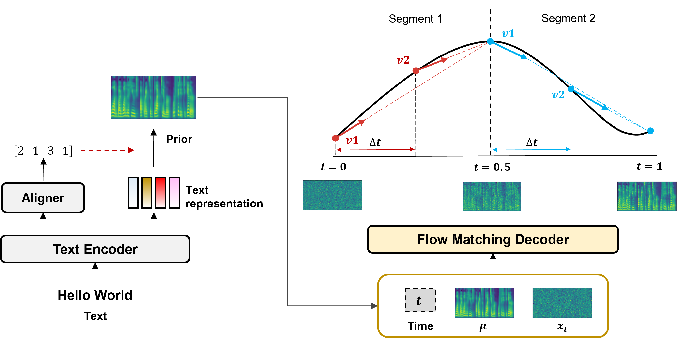

# RapFlow-TTS

基本信息

- 标题: "RapFlow-TTS: Rapid and High-Fidelity Text-to-Speech with Improved Consistency Flow Matching."
- 作者:
  - 01 Hyun Joon Park (NAVER Cloud & Korea University, Republic of Korea)
  - 02 Jeongmin Liu (NAVER Cloud, Republic of Korea)
  - 03 Jin Sob Kim (Korea University, Republic of Korea)
  - 04 Jeong Yeol Yang (Korea University, Republic of Korea)
  - 05 Sung Won Han (Korea University, Republic of Korea)
  - 06 Eunwoo Song (NAVER Cloud & Seoul National University, Republic of Korea)
- 链接:
  - [ArXiv](https://arxiv.org/abs/2506.16741)
  - [Publication]
  - [Github](https://github.com/naver-ai/RapFlow-TTS)
  - [Demo](https://tts-demo.github.io/rap.github.io/)
- 文件:
  - [ArXiv](_PDF/2025.06.20_2506.16741v1__RapFlow-TTS__Rapid_and_High-Fidelity_Text-to-Speech_with_Improved_Consistency_Flow_Matching.pdf)
  - [Publication] #TODO InterSpeech2025

## 摘要

<!--
We introduce ***RapFlow-TTS***, a rapid and high-fidelity TTS acoustic model that leverages velocity consistency constraints in Flow Matching (FM) training.
Although ordinary differential equation (ODE)-based TTS generation achieves natural-quality speech, it typically requires a large number of generation steps, resulting in a trade-off between quality and inference speed.
To address this challenge, ***RapFlow-TTS*** enforces consistency in the velocity field along the FM-straightened ODE trajectory, enabling consistent synthetic quality with fewer generation steps.
Additionally, we introduce techniques such as time interval scheduling and adversarial learning to further enhance the quality of the few-step synthesis.
Experimental results show that ***RapFlow-TTS*** achieves high-fidelity speech synthesis with a 5- and 10-fold reduction in synthesis steps than the conventional FM- and score-based approaches, respectively.
-->

本文提出了 ***RapFlow-TTS***，一个在**流匹配 (Flow Matching, FM)** 训练中利用速度一致性约束的快速且高保真的 TTS 声学模型.
尽管基于常微分方程的 TTS 生成可以实现自然质量的语音, 但往往需要大量的生成步骤, 从而需要在质量和推理速度之间进行权衡.

为了解决这一挑战, ***RapFlow-TTS*** 在流匹配直化的 ODE 轨迹上强制在速度场中保持一致性, 从而实现用更少的生成步骤获得一致的合成质量.
此外, 我们引入了如时间区间调度和对抗训练等技术以进一步增强少步合成的质量.
实验结果表明, ***RapFlow-TTS*** 能够实现高保真语音合成, 其生成步骤比传统的基于流匹配和得分的模型减少了 5-10 倍.

## 1·引言

<!--
Text-to-speech (TTS), also known as speech synthesis, aims to synthesize high-fidelity speech, given an input text (**Tacotron**[^Wang2017Tacotron], **Tacotron2**[^Shen2018Tacotron2], **Glow-TTS**[^Kim2020Glow-TTS]).
Among the various generative modeling approaches (**FastSpeech**[^Ren2019FastSpeech], **Flow-TTS**[^Miao2020Flow-TTS], **TransformerTTS**[^Li2019TransformerTTS], **FastSpeech2**[^Ren2020FastSpeech2], **Diff-TTS**[^Jeong2021Diff-TTS]), ordinary differential equations (ODE)-based models (**Grad-TTS**[^Popov2021Grad-TTS], **DEX-TTS**[^Park2024DEX-TTS]) have become strong solutions for outstanding TTS.
One representative method involves diffusion models using stochastic differential equations (SDE) (**Score-Based Generative Modeling**[^Song2020Score], **EDM**[^Karras2022EDM]), e.g., **Grad-TTS**[^Popov2021Grad-TTS].
It trains a score network with an SDE-based diffusion process and solves the probability flow ODE for speech synthesis.
However, ODE trajectories obtained by diffusion models are complicated (**FM**[^Lipman2022FM], **CFM**[^Tong2023CFM]), requiring numerous steps to generate high-quality speech (**VoiceFlow**[^Guo2024VoiceFlow]).
Since TTS functions as a user interaction channel, the slow inference speed caused by numerous diffusion steps is a major drawback of diffusion-based TTS.
-->

文本转语音, 也称为语音合成, 旨在给定输入文本合成高保真语音 (**Tacotron**[^Wang2017Tacotron], **Tacotron2**[^Shen2018Tacotron2], **Glow-TTS**[^Kim2020Glow-TTS]).
在各种生成式建模方法中 (**FastSpeech**[^Ren2019FastSpeech], **Flow-TTS**[^Miao2020Flow-TTS], **TransformerTTS**[^Li2019TransformerTTS], **FastSpeech2**[^Ren2020FastSpeech2], **Diff-TTS**[^Jeong2021Diff-TTS]), 基于常微分方程的模型已经成为了杰出 TTS 的代表方案.
一个代表性方法涉及到使用随机微分方程的扩散模型 (**Score-Based Generative Modeling**[^Song2020Score], **EDM**[^Karras2022EDM]), 如 **Grad-TTS**[^Popov2021Grad-TTS].
它训练了一个基于 SDE 扩散过程的得分网络, 并求解概率流 ODE 以进行语音合成.
然而, 由扩散模型获得的 ODE 轨迹是复杂的 (**FM**[^Lipman2022FM], **CFM**[^Tong2023CFM]), 需要多步才能生成高质量语音 (**VoiceFlow**[^Guo2024VoiceFlow]).
因为 TTS 作为用户交互渠道, 由大量扩散步数导致的推理速度缓慢是基于扩散的 TTS 的主要缺陷.

<!--
To resolve this limitation, researchers investigated improved ODE-based models (**FM**[^Lipman2022FM], **CFM**[^Tong2023CFM], **Rectified Flow**[^Liu2022RectifiedFlow], **Consistency Model**[^Song2023ConsistencyModel]) for TTS.
For example, **CoMoSpeech**[^Ye2023CoMoSpeech] applied consistency distillation (**Consistency Model**[^Song2023ConsistencyModel]) to transfer the knowledge of a diffusion teacher model to a consistent student model.
As the consistency constraint maps any point on the ODE trajectory to the endpoint, i.e., the target data, the student model can consistently produce high-quality speech regardless of the number of diffusion steps.
However, the complexity of diffusion-based ODE trajectories limited the effective construction of consistency models along those trajectories.
-->

为了解决这一局限性, 研究人员研究了改进的基于 ODE 的模型 (**FM**[^Lipman2022FM], **CFM**[^Tong2023CFM], **Rectified Flow**[^Liu2022RectifiedFlow], **Consistency Model**[^Song2023ConsistencyModel]) 用于 TTS.
例如: **CoMoSpeech**[^Ye2023CoMoSpeech] 利用一致性蒸馏 (**Consistency Model**[^Song2023ConsistencyModel]) 将知识从扩散教师模型迁移到一致学生模型.
通过一致性约束将 ODE 轨迹上的任意点映射到终点, 即目标数据, 学生模型可以不管扩散步数就能一致地产生高质量语音.
然而, 基于扩散的 ODE 轨迹的复杂性限制了在这些轨迹上进行一致性模型的有效构造.

<!--
Meanwhile, flow matching (FM), which learns the vector field for the ODE and probability path, is another approach for improving ODE-based models.
Using an optimal transport plan that makes the probability path linear in time (**FM**[^Lipman2022FM], **CFM**[^Tong2023CFM]), the ODE trajectory tends to be straight, making the few-step performance of FM superior to that of the diffusion models.
In TTS frameworks, **Matcha-TTS**[^Mehta2024Matcha-TTS] and **VoiceFlow**[^Guo2024VoiceFlow] adopted the FM-based straight ODE trajectory, demonstrating high-quality speech synthesis with even fewer generation steps than conventional diffusion-based models.
However, completely generalizing the real distribution to a straight ODE trajectory is difficult; thus, the quality of the few-step synthesized speech has not yet reached that of the ground truth.
In summary, previous ODE-based TTS approaches failed to simultaneously satisfy both aspects, i.e., inference speed and speech synthesis quality.
-->

同时, 流匹配 (Flow Matching, FM), 学习 ODE 和概率路径的向量场, 是用于改进基于 ODE 的模型的另一种方法.
使用最优传输规划, 使得概率路径在时间上线性 (**FM**[^Lipman2022FM], **CFM**[^Tong2023CFM]), ODE 轨迹趋向于直线, 这使得流匹配的少步性能优于扩散模型.
在 TTS 框架中, **Matcha-TTS**[^Mehta2024Matcha-TTS] 和 **VoiceFlow**[^Guo2024VoiceFlow] 采用了基于流匹配的直线 ODE 轨迹, 展示了高质量语音合成, 甚至比传统扩散模型的少步合成都要少.
然而, 将真实分布完全泛化到直线 ODE 轨迹是困难的; 因此, 少步合成的语音质量还没有达到真实语料的质量.
总而言之, 之前基于 ODE 的 TTS 方法没能同时满足推理速度和语音合成质量的要求.

<!--
In this study, we present ***RapFlow-TTS***, a rapid and high-fidelity TTS acoustic model that effectively addresses the limitations above.
Inspired by advancements in image generation, we adopt **Consistency FM**[^Yang2024ConsistencyFM], a novel FM method that explicitly enforces self-consistency in the velocity field.
By imposing consistency constraints on the velocity values, consistency FM directly defines straight flows from different time points to a common endpoint.
This allows ***RapFlow-TTS*** to learn how to produce consistent outputs along the straight trajectory more effectively, unlike diffusion-based methods with complicated trajectories, yielding a more effective consistency model.
Consequently, high-quality speech synthesis is achievable with only a few generation steps.
To the best of our knowledge, ***RapFlow-TTS*** is the first TTS framework based on consistency FM.
-->

在本研究中, 我们提出了 ***RapFlow-TTS***, 一个有效地解决上述局限性的快速且高保真的 TTS 声学模型.
受到图像生成的进步启发, 我们采用了 **一致性流匹配 (Consistency Flow Matching)**[^Yang2024ConsistencyFM], 一种新的流匹配方法, 它显式地在速度场中强制自身一致性.
通过在速度值上施加一致性约束, 一致性流匹配直接定义从不同时间点到共同终点的直线流.
这使得 ***RapFlow-TTS*** 能够更有效地学习如何在直线轨迹上产生一致的输出, 与具有复杂轨迹的扩散模型相比, 可以产生更有效的一致性模型.
因此, 高质量语音合成可以用很少的生成步骤实现.
至于我们所知, ***RapFlow-TTS*** 是首个基于一致性流匹配的 TTS 框架.

<!--
Furthermore, we propose several improved training techniques to enhance the performance, including shared dropout, Huber loss, time-interval scheduling, and adversarial learning, none of which have been explored in the context of consistency FM.
Experimental results show that the proposed ***RapFlow-TTS*** can synthesize more natural speech in just 2 steps, reducing generation steps by 5 to 10 times compared to previous ODE-based methods.
Our code and demos are available at [Github.IO](https://tts-demo.github.io/rap.github.io/).
-->

此外, 我们提出了一些改进的训练技术用于增强性能, 包括共享随机失活, Huber 损失, 时间区间调度, 对抗学习, 这些技术都没有在一致性流匹配的上下文中探索过.
实验结果表明所提出的 ***RapFlow-TTS*** 在 2 步内可以合成更自然的语音, 与之前基于 ODE 的方法相比, 生成步骤减少了 5-10 倍.
我们的代码和演示可以在 [Github.IO](https://tts-demo.github.io/rap.github.io/) 上获得.

## 2·背景

Here, we review the **Consistency FM**[^Yang2024ConsistencyFM] method for training the ***RapFlow-TTS***.
Given a time index $t\in[0,1]$, sampled from a uniform distribution, FM learns a ground truth vector field $u_{t}$ to build the probability path $p_{t}(x_{t})$ from the random noise $x_{0} \sim p_{0}$ to target data $x_{1} \sim p_{1}$.
The vector field is defined as an ODE for a flow $\phi_{t}$, where $\phi_{t}$ is a function that transforms data over time, as follows:

$$
\frac{d}{dt}\phi_{t}(x)=u_{t}(\phi_{t}(x)); \quad \phi_{0}(x)=x,
\tag{01}
$$

The solution of Eq.01, i.e., flow, represents the sampling path.
For training FM models, a simple regression with the ground-truth vector field is applied as follows:

$$
\mathcal{L}_{FM}=||v_{\theta}(t, x_{t}) - u(t, x_{t})||^{2}_{2},
\tag{02}
$$

where $v_{\theta}(t, x_{t})$ denotes the learnable vector field network.

In contrast to the FM, consistency FM trains the vector field by ensuring that any point on the trajectory reaches the same endpoint with the same velocity.
Let the linearly interpolated noise sample at time $t$ be ${x}_{t}=tx_{1} + (1-t)x_{0}$.
Its objective function is composed of a straight flow loss $\mathcal{L}_{sf}$ and a velocity consistency loss $\mathcal{L}_{vc}$ as follows:

$$
\begin{aligned}
\mathcal{L}_{cfm}&=\mathcal{L}_{sf}+\alpha\mathcal{L}_{vc},\\
\mathcal{L}_{sf}&=||f_{\theta}(t, x_{t}) - f_{\theta^{-}}(t+\Delta t, x_{t+\Delta t})||^{2}_{2},\\
\mathcal{L}_{vc}&=||v_{\theta}(t, x_{t}) - v_{\theta^{-}}(t+\Delta t, x_{t+\Delta t})||^{2}_{2},\\
f_{\theta}(t,x_{t})&=x_{t}+(1-t) \times v_{\theta}(t,x_{t}),
\end{aligned}
\tag{03}
$$

where $\theta^{-}$ denotes model parameters with a stop gradient; $\alpha$ denotes a loss weight; and $\Delta t$ denotes a time interval.
Since $f_{\theta}$ guides $x_{t}$ to the estimated endpoint of the trajectory, the straight flow loss constrains consistency from the trajectory viewpoint, ensuring straight flow.
In contrast, the velocity consistency loss directly enforces the consistency of the vector field.
This allows the consistency FM to learn how to produce consistent outputs along the straightened trajectory, accurately estimating the target distribution even with a few-step generation.

## 3·方法

Figure 1: Overview of ***RapFlow-TTS*** with multi-segment consistency flow matching.

### 3.1·结合一致性流匹配的 TTS

For ***RapFlow-TTS***, we follow the network design of **Matcha-TTS**[^Mehta2024Matcha-TTS] thanks to its fast and lightweight properties.
As shown in [Figure.01](#Fig.01), ***RapFlow-TTS*** consists of a text encoder, an aligner, and a flow matching decoder.
The text encoder extracts the context representations from the input text, and the aligner maps these representations to prior mel-spectrograms $\mu$.
The text encoder and aligner are trained using duration loss $\mathcal{L}_{dur}$ and prior loss $\mathcal{L}_{prior}$ based on the MAS algorithm as in **Glow-TTS**[^Kim2020Glow-TTS], **Grad-TTS**[^Popov2021Grad-TTS].

Consistency FM trains the FM decoder to construct a probability path $p_{t}$ that transports the random noise $x_{0} \sim p_{0}$ to target mel-spectrogram's distribution $x_{1} \sim p_{1}$.
We condition the consistency FM objective with the prior $\mu$ to synthesize speech corresponding to the given input text.
We also adopt a multi-segment objective for flexible transportation between complex distributions (**Consistency FM**[^Yang2024ConsistencyFM]).
In detail, the time range $t \in [0,1]$ is divided into $S$ segments of equal size, where each segment corresponds to the time range $[i/S, (i+1)/S]$ for $i=0,1,..., S-1$.
Then, the objective function of segmented consistency FM is expressed as follows:

$$
\begin{aligned}
\mathcal{L}_{cfm}&=\mathcal{L}_{sf}+\alpha\mathcal{L}_{vc},\\
\mathcal{L}_{sf}&=||f^{i}_{\theta}(t, x_{t}, \mu) - f^{i}_{\theta^{-}}(t+\Delta t, x_{t+\Delta t}, \mu)||^{2}_{2}, \\
\mathcal{L}_{vc}&=||v^{i}_{\theta}(t, x_{t}, \mu) - v^{i}_{\theta^{-}}(t+\Delta t, x_{t+\Delta t}, \mu)||^{2}_{2}, \\
f^{i}_{\theta}(t,x_{t}, \mu)&=x_{t}+((i+1)/S-t) \times v^{i}_{\theta}(t,x_{t}, \mu),
\end{aligned}
\tag{04}
$$

Consequently, ***RapFlow-TTS*** learns straight flow with a consistent vector field in each segment, effectively representing the data distribution by a piecewise linear trajectory.

In practice, we apply a two-stage training strategy to effectively optimize the ***RapFlow-TTS*** model.
In the first stage (the first $N$ epochs), we aim to train ***RapFlow-TTS*** to have a straight flow by focusing on the trajectory viewpoint.
To achieve it, we optimize ***RapFlow-TTS*** using only the straight flow loss $\mathcal{L}_{sf}$ in Eq.04, slightly modifying the loss term as $||f^{i}_{\theta}(t, x_{t}, \mu)-x^{i}||^{2}_{2}$, where $x^{i}$ is the ground-truth endpoint at each segment, defined as $x^{i}=(i+1)/S \times x_{1} + (1-(i+1)/S)\times x_{0}$.
Because this loss guides the ground-truth endpoint on the trajectory, ***RapFlow-TTS*** can learn the vector field with a straight flow that represents the real data distribution.

In the second stage (the following $N$ epochs), we train ***RapFlow-TTS*** to have a straight flow with a consistent vector field using the entire $\mathcal{L}_{cfm}$ in Eq.04.
By training consistency FM on a straight ODE trajectory, ***RapFlow-TTS*** can learn consistency more easily than diffusion-based methods, constructing a more effective consistency model.
As a result, ***RapFlow-TTS*** has the properties of consistency and straight flow, thus synthesizing high-quality speech in fewer synthesis steps.

### 3.2·改进技术

We introduce several techniques to improve the consistency FM model for ***RapFlow-TTS***.
All of these methods enhance few-step synthesis performance, and their effectiveness will be further analyzed in Section 4.3.

### Encoder Freeze

We freeze the encoder and optimize only $\mathcal{L}_{cfm}$ for training efficiency in the second stage.
It also stabilizes consistency training by keeping the condition $\mu$ frozen.

### Shared Dropout

Although diffusion-based consistency models and rectified flow (**iCT**[^Song2023iCT], **SimpleReFlow**[^Kim2025SimpleReFlow]) proved that applying dropout improves the sample quality, the effect of dropout in consistency FM has not been investigated.
Based on **iCT**[^Song2023iCT], while training the consistency FM model in the second stage, we apply dropout using the same random state for $v_{\theta}$ and $v_{\theta^{-}}$.
Empirically, we use a dropout ratio of 0.05.

### Pseudo-Huber Loss

Our loss in Eq.04 is composed of the $\ell_{2}$ metric.
However, the $\ell_{2}$ metric imposes a large penalty on outliers, which can lead to an imbalanced loss with respect to time $t$, potentially increasing the gradient variance (**ReFlow++**[^Lee2024ReFlow++]).
To mitigate this issue, we adopt the pseudo-Huber metric, which is less sensitive to outliers.
We follow the implemented metric from **iCT**[^Song2023iCT], defined as $d(x,y)=\sqrt{||x-y||^{2}_{2}+c^{2}}-c$, where $c=0.00054\sqrt{d}$ and $d$ is the data dimension size.

### Delta Scheduling

The term $\Delta t$ in Eq.04 is a parameter representing the time interval between two points on the trajectory, similar to the discretization size parameter in diffusion-based **Consistency Models**[^Song2023ConsistencyModel].
This implies that a small $\Delta t$ reduces the bias but increases the variance of the model, and vice versa for a large $\Delta t$.
Since a small bias and large variance are desirable near the end of the training, inspired by **Consistency Models**[^Song2023ConsistencyModel], we employ scheduling that progressively reduces $\Delta t$ during the training.
To train the model uniformly across diverse $\Delta t$, we utilize linear step scheduling.
In practice, $\Delta t$ decreases from 0.1 to 0.001 over $K$ intervals, and each $\Delta t$ is used during $N/K$ epochs.

### Adversarial Learning

To enhance synthesis quality, we utilize adversarial learning after the second stage.
We adopt MSE-based adversarial loss $\mathcal{L}_{adv}$ (**LSGAN**[^Mao2017LSGAN]) and feature matching loss $\mathcal{L}_{fm}$ (**ImprovedGAN**[^Salimans2016ImprovedGAN]) on the mel-spectrogram levels using a Conv2d discriminator (**StyleTTS**[^Li2022StyleTTS]).
Furthermore, we extend it to multi-segment adversarial learning for consistency FM.
Let $x^{i}$ and $\hat{x}^{i}$ be the ground-truth and estimated endpoint at each segment, where each is obtained by $(i+1)/S \times x_{1} + (1-(i+1)/S)\times x_{0}$ and $f^{i}_{\theta}(t,x_{t}, \mu)$, respectively.
Then, the objective function is defined as follows:

$$
\begin{aligned}
\mathcal{L}_{adv}=||D(\hat{x}^{i})||^{2}_{2} + ||1-D(x^{i})||^{2}_{2}, \\
\mathcal{L}_{fm} = \sum\nolimits_{l=1}^{L} ||D^{l}(\hat{x}^{i})-D^{l}(x^{i})||_{1}, \\
\end{aligned}
\tag{05}
$$

where $D$ indicates the discriminator; $D^{l}$ denotes the $l^{th}$ feature map of $D$.
By applying multi-segment adversarial learning, we improve the endpoint quality of each segment, yielding better few-step performance.
Finally, in this stage, we optimize $\mathcal{L}_{cfm}$, $\mathcal{L}_{adv}$, and $\mathcal{L}_{fm}$ with the ratio of 3, 1, and 2.

## 4·实验

### 数据集

To verify ***RapFlow-TTS***, we conducted experiments on the **LJSpeech**[^Ito2017LJSpeech] and **VCTK**[^Yamagishi2019VCTK] datasets.
The LJSpeech is a single-speaker English dataset containing about 24 hours of audio clips.
For the dataset split, we followed the settings of previous work in **Tacotron2**[^Shen2018Tacotron2].
The VCTK is a multi-speaker English dataset composed of about 44 hours of speech recorded by 110 speakers.
We randomly split the train, valid, and test sets in the ratios of 80\%, 10\%, and 10\%, respectively.
To make the models compatible with the HiFiGAN vocoder used in the experiments, we followed the acoustic settings of **HiFiGAN-V1**[^Kong2020HiFi-GAN].

### 基线

For comparison, we set the following systems as baselines:
1. GT, ground truth;
2. VOC, ground truth reconstructed by the vocoder;
3. **FastSpeech2**[^Ren2020FastSpeech2], Transformer-based TTS;
4. **Grad-TTS**[^Popov2021Grad-TTS], diffusion-based TTS;
5. **CoMoSpeech**[^Ye2023CoMoSpeech], consistency model with diffusion-based TTS;
6. **VoiceFlow**[^Guo2024VoiceFlow], rectified flow for TTS;
7. **Matcha-TTS**[^Mehta2024Matcha-TTS], flow matching for TTS.

We recorded the performance of the baselines after training with their official codes.
Since there is no official code for **FastSpeech2**, we used [Meta's checkpoint](https://github.com/facebookresearch/fairseq).

### 实践细节

For training, we set the number of epochs $N$ to 1400 and 1000 for the LJSpeech and VCTK datasets, respectively.
We additionally used 150 and 50 epochs for adversarial learning, respectively.
We used Adam optimizer with a learning rate of $1\times10^{-4}$ and batch size of 16.
Regarding the hyperparameters of consistency FM, we set the multi-segment size $S$ to 2, the bin size $K$ for delta scheduling to 8, and the loss weight $\alpha$ in Eq.04 to $1\times10^{-5}$.
The encoder freeze and shared dropout were applied as defaults, and the results with other techniques were shown through $\dagger$ notation in the experiments.
In addition, we followed the network hyperparameters of Matcha-TTS.
Finally, we applied an Euler solver to the ODE-based TTS models to synthesize speech.
To investigate the few-step performance of ODE-based models, we set the number of function evaluations (NFE) to 2.
To ensure reasonable performance for models that do not build a consistency model, such as Matcha-TTS and Grad-TTS, we also recorded their performances using NFE of 10 and 25, respectively.

### 评估指标

We assessed the results in terms of speech intelligibility, naturalness, and real-time factor (RTF).
For intelligibility, we measured word error rate (WER) by applying the **Whisper**[^Radford2023Whisper]-M-based ASR model to the synthesized speech.
Regarding naturalness, we conducted a mean opinion score (MOS) test.
Twenty participants were asked to assess the naturalness of the synthesized speech by scoring it from 1 to 5 ranges.
Twenty utterances were randomly selected from each system.
In addition, we used **NISQA**[^Mittag2021NISQA], a model-based naturalness assessment method, for ablation studies.
We provided evaluation results with a 95\% confidence interval.
Finally, we recorded the RTF, the ratio between the model synthesis time and duration of the synthesized speech, using a single Tesla V100 GPU to compare the inference speeds.

## 5·结果

### 基本结果

Table.01 shows the evaluation results of which findings can be analyzed as follows:
Firstly, the conventional score-based (**Grad-TTS**) and FM-based (**VoiceFlow** and **Matcha-TTS**) models exhibited significant degradation in naturalness (MOS) with the 2-step synthesis compared to the many-step synthesis.
By training with the consistency FM objective, the proposed ***RapFlow-TTS*** achieved superior performance with a 5- to 10-fold reduction in NFE than previous methods.
In addition, it outperformed **CoMoSpeech** in both speech intelligibility (WER) and naturalness.
These results indicate that training consistency on a straightened ODE path leads to an effective consistency model, thereby improving few-step performance.
However, the limited performance of the 2-step synthesis of the previous methods is attributed to the construction of consistency models on complex ODE paths (**CoMoSpeech**) or the absence of consistency in FM-based methods (**Matha-TTS** and **VoiceFlow**).
Secondly, the improved techniques in ***RapFlow-TTS***$^{\dagger}$ contributed to significant enhancements in both the intelligibility and naturalness aspects.
This is an encouraging result considering that the 2-step speed of ***RapFlow-TTS*** is comparable to the speed of FastSpeech2, which is generally adopted as a benchmark for fast TTS models.
In summary, ***RapFlow-TTS*** synthesizes high-quality speech with fewer steps, achieved through consistency FM and improved training strategies, mitigating the inference speed limitations of previous ODE-based TTS.

### 消融实验

In the first block of Table.02, we analyzed the results of consistency FM and default techniques such as encoder freeze and shared dropout.
Experiment (A) represents the results from stage 1, described in Section 3.1, where only a straight flow was trained without consistency.
Experiment (B) presents the results of stage 2, in which the consistency FM was additionally trained at the stage-1 model.
Despite some decrease in speech intelligibility, we observed a notable improvement in naturalness.
It demonstrates that building a consistency model on a straight ODE trajectory is effective in enhancing the quality of the few-step synthesis.
Meanwhile, experiment (C) and (D) show the results obtained using encoder freeze and shared dropout, respectively.
Although the impact of the encoder freeze on the performance was not substantial, we empirically observed that it increased training speed by 1.3 times.
Shared dropout improved the robustness of the consistency FM model, leading to enhanced performance across all metrics.

In the second block of Table.02, we investigated the effectiveness of other improved techniques for ***RapFlow-TTS*** as follows: Firstly, in experiment (E), replacing the $\ell_{2}$ metric with the Huber metric improved the speech naturalness by reducing the gradient variance.
Although we observed a slight decrease in WER performance, we adopted this strategy since we prioritized naturalness enhancement.
Secondly, delta scheduling (experiment (F)) improved both WER and NISQA.
It indicates that the strategy, progressively reducing $\Delta t$ during training, is effective for performance improvement by minimizing the bias at the end of training.
In addition, the performance degradation observed when using exponential scheduling suggests that linear scheduling, which uniformly trains various $\Delta t$ during training, is appropriate.
Lastly, in experiment (G), we validated the effects of adversarial learning.
This strategy yielded the most significant improvements compared to previous techniques.
By learning the ground-truth characteristics at the endpoints of each segment, Rapflow-TTS with adversarial learning can synthesize high-quality speech even in 2-step.

Finally, in experiment (H), where we combined all improved techniques, ***RapFlow-TTS*** achieved the best WER and NISQA.
It suggests that each technique contributes to performance improvement as its unique method without redundancy.
Furthermore, we utilized NFE of 10 and 25 for experiment (H) to analyze the performance of ***RapFlow-TTS*** depending on NFE.
We observed that naturalness slightly improved as NFE increased, while speech intelligibility deteriorated.
This can be attributed to the characteristics of consistency models (**CoMoSpeech**[^Ye2023CoMoSpeech]), where performance improvements are minimal or even degrade in many-step synthesis.
In future work, we further analyze this issue and explore potential improvements.

### 多说话人数据集结果

To verify ***RapFlow-TTS*** on the multi-speaker dataset, we conducted experiments on the VCTK dataset.
Considering the increase in dataset size and number of speakers, we raised the shared dropout to 0.1 for model robustness.
As depicted in Table.03, ***RapFlow-TTS*** without improved techniques demonstrated lower speech intelligibility compared to the stage-1 model.
However, in terms of naturalness, it significantly outperformed the stage-1 model in 2-step synthesis, even achieving a quality comparable to the stage-1 model's 10-step performance.
In addition, the improved techniques substantially enhanced both speech intelligibility and naturalness, enabling the synthesis of high-quality and intelligible speech in only 2 steps.
These experimental results indicate that ***RapFlow-TTS*** can achieve an outstanding few-step synthesis performance even on multi-speaker datasets.

## 6·结论

In this study, we proposed ***RapFlow-TTS***, the ODE-based TTS model capable of fast and high-fidelity speech synthesis.
Based on consistency FM, ***RapFlow-TTS*** constructs a consistency model on a straight flow.
By leveraging both the straight trajectory and the velocity-consistency property, high-quality speech synthesis was achievable in significantly fewer steps.
In addition, training techniques such as time interval scheduling and adversarial learning further enhanced performance.
As a result, ***RapFlow-TTS*** outperformed existing ODE-based models and effectively overcame the trade-off between quality and speed.

## 参考文献

[^Wang2017Tacotron]: [Tacotron](../Acoustic/2017.03.29_Tacotron.md)
[^Shen2018Tacotron2]: [Tacotron2](../Acoustic/2017.12.16_Tacotron2.md)
[^Kim2020Glow-TTS]: [Glow-TTS](../Acoustic/2020.05.22_Glow-TTS.md)
[^Ren2019FastSpeech]: [FastSpeech](../Acoustic/2019.05.22_FastSpeech.md)
[^Miao2020Flow-TTS]: [Flow-TTS](../Acoustic/2020.04.09_Flow-TTS.md)
[^Li2019TransformerTTS]: [TransformerTTS](../Acoustic/2018.09.19_TransformerTTS.md)
[^Ren2020FastSpeech2]: [FastSpeech2](../Acoustic/2020.06.08_FastSpeech2.md)
[^Jeong2021Diff-TTS]: [Diff-TTS](../Acoustic/2021.04.03_Diff-TTS.md)
[^Popov2021Grad-TTS]: [Grad-TTS](../Acoustic/2021.05.13_Grad-TTS.md)
[^Park2024DEX-TTS]: [DEX-TTS](../Diffusion/2024.06.27_DEX-TTS.md)
[^Song2020Score]: [Score-Based Generative Modeling through SDE](../Diffusion/2020.11.26_Score-Based_Generative_Modeling_through_SDE.md)
[^Karras2022EDM]: [EDM](../Diffusion/2022.06.01_EDM.md)
[^Lipman2022FM]: [Flow Matching](2022.10.06_Flow_Matching_for_Generative_Modeling.md)
[^Tong2023CFM]: [CFM](2023.02.01_Conditional_Flow_Matching.md)
[^Guo2024VoiceFlow]: [VoiceFlow](2023.09.10_VoiceFlow.md)
[^Liu2022RectifiedFlow]: [Rectified Flow](2022.09.07_RectifiedFlow.md)
[^Song2023ConsistencyModel]: [Consistency Model](../Diffusion/2023.03.02_ConsistencyModel.md)
[^Ye2023CoMoSpeech]: [CoMoSpeech](../Diffusion/2023.05.11_CoMoSpeech.md)
[^Mehta2024Matcha-TTS]: [Matcha-TTS](../Diffusion/2023.09.06_Matcha-TTS.md)
[^Yang2024ConsistencyFM]: [Consistency Flow Matching](2024.07.02_Consistency_Flow_Matching.md)
[^Song2023iCT]: [iCT](../Diffusion/2023.10.22_iCT.md)
[^Kim2025SimpleReFlow]: [Simple ReFlow](2024.10.10_SimpleReFlow.md)
[^Lee2024ReFlow++]: [ReFlow++](2024.05.30_ReFlow++.md)
[^Mao2017LSGAN]: [LSGAN](../_Basis/2016.11.13_LSGAN.md)
[^Salimans2016ImprovedGAN]: [Improved Techniques for Training GANs](../_Basis/2016.06.10_ImprovedGAN.md)
[^Li2022StyleTTS]: [StyleTTS](../TTS2_Acoustic/2022.05.30_StyleTTS.md)
[^Ito2017LJSpeech]: [LJSpeech](../../Datasets/2017.07.05_LJSpeech.md)
[^Yamagishi2019VCTK]: [VCTK](../../Datasets/2012.08.00_VCTK.md)
[^Kong2020HiFi-GAN]: [HiFi-GAN](../Vocoder/2020.10.12_HiFi-GAN.md)
[^Radford2023Whisper]: [Whisper](../ASR/2022.12.06_Whisper.md)
[^Mittag2021NISQA]: [NISQA](../../Evaluations/2021.04.19_NISQA.md)
