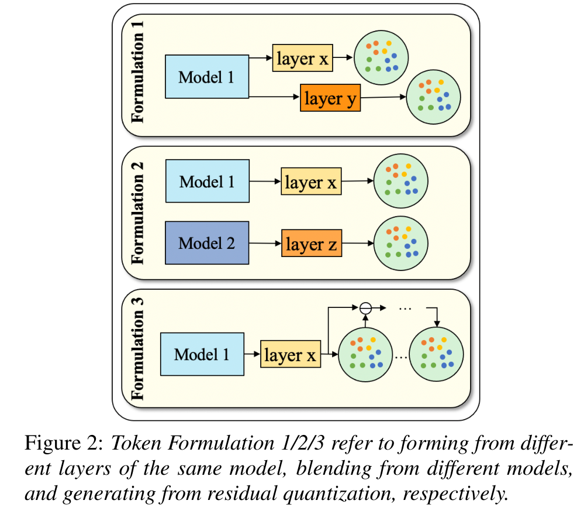

# TokSing

基本信息

- 标题: TokSing: Singing Voice Synthesis based on Discrete Tokens
- 作者:
  - [Yuning Wu](../../Authors/Yuning_Wu.md)
  - [Chunlei Zhang](../../Authors/Chunlei_Zhang.md)
  - [Jiatong Shi](../../Authors/Jiatong_Shi.md)
  - [Yuxun Tang](../../Authors/Yuxun_Tang.md)
  - [Shan Yang](../../Authors/Shan_Yang.md)
  - [Qin Jin](../../Authors/Qin_Jin.md)
- 机构:
  - [中国人民大学](../../Institutions/RUC_中国人民大学.md)
  - [腾讯 AI 实验室](../../Institutions/TecentAI.md)
  - [CMU](../../Institutions/CMU_美国卡内基梅隆大学.md)
- 时间:
  - 预印时间: 2024.06.12 ArXiv v1
  - 更新笔记: 2024.06.13
- 发表:
  - [InterSpeech](../../Publications/InterSpeech.md)
- 链接:
  - [ArXiv](https://arxiv.org/abs/2406.08416)
  - [DOI]()
  - [Github]()
  - [Demo]()
- 标签:
  - [歌声合成](../../Tags/SingingVoiceSynthesis.md)
  - [自监督学习](../../Tags/Learning_Self-Supervised.md)
  - [离散表示](../../Tags/DiscreteRepresentation.md)
- 页数: 5
- 引用: 34
- 被引: 0

## Abstract·摘要

原文

> Recent advancements in speech synthesis witness significant benefits by leveraging discrete tokens extracted from **Self-Supervised Learning (SSL)** models.
> Discrete tokens offer higher storage efficiency and greater operability in intermediate representations compared to traditional continuous Mel spectrograms.
> However, when it comes to **Singing Voice Synthesis (SVS)**, achieving higher levels of melody expression poses a great challenge for utilizing discrete tokens.
> In this paper, we introduce ***TokSing***, a discrete-based SVS system equipped with a token formulator that offers flexible token blendings.
> We observe a melody degradation during discretization, prompting us to integrate a melody signal with the discrete token and incorporate a specially-designed melody enhancement strategy in the musical encoder.
> Extensive experiments demonstrate that our ***TokSing*** achieves better performance against the Mel spectrogram baselines while offering advantages in intermediate representation space cost and convergence speed. 

 

近期在语音合成的进展显示, 通过利用由自监督学习模型提取的离散标识符可以带来显著的好处.
和传统的连续梅尔频谱相比, 离散标识符作为中间表示能够提供更高的存储效率和更大的可操作性.
然而, 涉及到歌声合成领域时, 利用离散标识符以获得更高水平的旋律表达是个巨大的挑战.
本文提出了 ***TokSing***, 一个配置了标识符形式化器的离散的歌声合成系统, 提供了灵活的标识符混合.
在离散化过程中观察到了旋律退化, 这提示了我们将旋律信号和离散标识符相结合, 并在音乐编码器中加入特别设计的旋律增强策略.
大量的实验表明我们的 ***TokSing*** 相比梅尔频谱基线能达到更好的性能, 同时在中间表示空间成本和收敛速率表现出了优势.

## 1.Introduction·引言

原文

> **Singing Voice Synthesis (SVS)** aims to generate vocal sounds given music scores with melody and lyrics.
> Traditional SVS systems ([Xiaoicesing](2020.06.11_Xiaoicesing.md); [Xiaoicesing2](2022.10.26_Xiaoicesing2.md); [DiffSinger](2021.05.06_Diffsinger.md); [Seq2Seq SVS with PE](../../Models/Singing_Voice/Seq2Seq_SVS_PE.md); [Singing-Tacotron](2022.02.16_Singing-Tacotron.md); [Bytesting](../../Models/Singing_Voice/Bytesting.md)) primarily focus on enhancing acoustic models to generate Mel spectrograms from scores, which are then converted into waveforms by vocoders ([HiFi-GAN](../../Models/TTS3_Vocoder/2020.10.12_HiFi-GAN.md); [BigVGAN](../../Models/TTS3_Vocoder/2022.06.09_BigVGAN.md)).
> Recently, there has been a growing trend towards using discrete tokens, a representation with superior storage efficiency and controllability, for speech understanding and generation tasks ([Exploration of Efficient End-to-End ASR using Discretized Input from Self-Supervised Learning](), [Towards Universal Speech Discrete Tokens: A Case Study for ASR and TTS](), [SpeechGPT](../Speech_LLM/2023.05.18_SpeechGPT.md), [SPEAR-TTS](../../Models/Speech_LLM/2023.02.07_SPEAR-TTS.md)).
> Discrete tokens can be obtained from raw audio through vector quantization ([SoundStream](../../Models/Speech_Neural_Codec/2021.07.07_SoundStream.md); [EnCodec](../../Models/Speech_Neural_Codec/2022.10.24_EnCodec.md); [DAC](../../Models/Speech_Neural_Codec/2023.06.11_Descript-Audio-Codec.md)) or generated by clustering ([Some Methods for Classification and Analysis of Multivariate Observations]()) on hidden embeddings of SSL models ([HuBERT](../../Models/Speech_Representaion/2021.06.14_HuBERT.md); [Wav2Vec2.0](../../Models/Speech_Representaion/2020.06.20_Wav2Vec2.0.md); [WavLM](../../Models/Speech_Representaion/2021.10.26_WavLM.md); [VQ-Wav2Vec](../../Models/Speech_Representaion/2019.10.12_VQ-Wav2Vec.md)) pretrained on large-scale audios.
> Different from speech processing, singing adds the complexity of melodic expression on top of speech, requiring vocal sound that meets the musical score requirements and delivers high-quality listening experiences.
> Therefore, applying discrete tokens in SVS faces some unique challenges.
> Firstly, limited by copyright restrictions and strict recording environments, there is currently no dedicated singing SSL model, and existing SSL models contain scarce singing data ([Seq2Seq_SVS_PE](../../Models/Singing_Voice/Seq2Seq_SVS_PE.md); [SingAug](../../Models/Singing_Voice/SingAug.md); [ACE-Opencpop](../../Datasets/ACE-Opencpop.md)).
> Therefore, setting suitable tokens for singing synthesis remains challenging.
> Secondly, although lyrics are inherently discrete among the information encompassed within singing, the melody requires more refined expression, for example, the fundamental frequency of the same note can vary delicately between the frames it covers, especially in cases involving sustained notes, high pitches, vibratos, and other techniques requiring advanced vocal skills ([DAR-SVS](../../Models/Singing_Voice/DAR-SVS.md)).
> Therefore, there is a risk of losing the acoustic details of the melody during the process of discretization.
> Consequently, constructing a discrete token-based SVS system that meets the demands of melody expression poses a challenge.

 

**歌唱语音合成 (SVS)** 旨在根据带有旋律和歌词的乐谱生成歌声.
传统的SVS系统 ([Xiaoicesing](2020.06.11_Xiaoicesing.md); [Xiaoicesing2](2022.10.26_Xiaoicesing2.md); [DiffSinger](2021.05.06_Diffsinger.md); [Seq2Seq SVS with PE](../../Models/Singing_Voice/Seq2Seq_SVS_PE.md); [Singing-Tacotron](2022.02.16_Singing-Tacotron.md); [Bytesting](../../Models/Singing_Voice/Bytesting.md)) 主要集中在通过增强声学模型来从乐谱生成梅尔频谱图, 然后通过声码器 ([HiFi-GAN](../../Models/TTS3_Vocoder/2020.10.12_HiFi-GAN.md); [BigVGAN](../../Models/TTS3_Vocoder/2022.06.09_BigVGAN.md)) 将其转换为波形.
最近, 使用离散标识符的趋势日益增长, 这种表示具有优越的存储效率和可控性, 适用于语音理解和生成任务 ([探索使用自监督学习离散化输入的高效端到端ASR](), [面向通用语音离散标识符：ASR和TTS的案例研究](), [SpeechGPT](../Speech_LLM/2023.05.18_SpeechGPT.md), [SPEAR-TTS](../../Models/Speech_LLM/2023.02.07_SPEAR-TTS.md)) .
离散标识符可以通过向量量化 ([SoundStream](../../Models/Speech_Neural_Codec/2021.07.07_SoundStream.md); [EnCodec](../../Models/Speech_Neural_Codec/2022.10.24_EnCodec.md); [DAC](../../Models/Speech_Neural_Codec/2023.06.11_Descript-Audio-Codec.md)) 或通过聚类 ([多变量观测的分类和分析方法]()) 在SSL模型的隐藏嵌入上生成 ([HuBERT](../../Models/Speech_Representaion/2021.06.14_HuBERT.md); [Wav2Vec2.0](../../Models/Speech_Representaion/2020.06.20_Wav2Vec2.0.md); [WavLM](../../Models/Speech_Representaion/2021.10.26_WavLM.md); [VQ-Wav2Vec](../../Models/Speech_Representaion/2019.10.12_VQ-Wav2Vec.md)) , 这些模型在大规模音频上进行了预训练.

与语音处理不同, 歌唱在语音之上增加了旋律表达的复杂性, 要求生成的歌声符合乐谱要求并提供高质量的听觉体验.
因此, 在SVS中应用离散标识符面临一些独特的挑战.
首先, 受限于版权限制和严格的录音环境, 目前没有专门的歌唱SSL模型, 现有的SSL模型中包含的歌唱数据稀缺 ([Seq2Seq_SVS_PE](../../Models/Singing_Voice/Seq2Seq_SVS_PE.md); [SingAug](../../Models/Singing_Voice/SingAug.md); [ACE-Opencpop](../../Datasets/ACE-Opencpop.md)) .
因此, 为歌唱合成设置合适的标识符仍然具有挑战性.
其次, 尽管歌词在歌唱所包含的信息中本质上是离散的, 但旋律需要更精细的表达, 例如, 同一音符的基本频率在其覆盖的帧之间可以微妙地变化, 特别是在涉及持续音符, 高音, 颤音和其他需要高级声乐技巧的情况 ([DAR-SVS](../../Models/Singing_Voice/DAR-SVS.md)) .
因此, 在离散化过程中存在丢失旋律声学细节的风险.
因此, 构建一个满足旋律表达需求的基于离散标识符的SVS系统是一个挑战.

原文

> In this study, we focus on addressing the above two challenges: finding suitable token formulations for singing and constructing a discrete token-based SVS system that meets the demands of melody expression.
> Firstly, we introduce a method for formulating tokens tailored to singing tasks and provide various flexible formulation strategies.
> Due to the diversity in pretraining tasks and datasets, different SSL models can offer valuable insights into singing semantics and acoustics, potentially providing complementary benefits to each other.
> Additionally, drawing from past research ([WavLM](../../Models/Speech_Representaion/2021.10.26_WavLM.md); [SUPERB](../../Evaluations/SUPERB.md); [Multi-Resolution_HuBERT](../Speech_Representaion/2023.10.04_MR-HuBERT.md)), it is evident that the influence of various intermediate layers in an SSL model differs across downstream tasks.
> This suggests a distribution of diverse knowledge across the layers.
> Based on the above reasons, we propose a token formulator that allows token blending across different models and layers.
> Secondly, for the discrete SVS system, we incorporate melody control signals to enhance the generated melody expression.
> Finally, combining the above methods, we propose a new SVS framework, namely ***TokSing***, using discrete token sequences and melody-oriented signals as system intermediates.
> Our main contributions include: 
> (1) We introduce a token formulator for training and provide multiple token formulations, offering flexibility in token sourcing and blending. 
> (2) We propose a discrete token based SVS framework, ***TokSing***, which achieves melody expression enhancement by integrating melody control signals to offset the loss of melodic intricacies in tokens. 
> (3) Extensive experiments in both single-singer and multi-singer scenarios demonstrate that our proposed ***TokSing*** framework achieves better performance with lower storage cost and higher convergence speed.

 

在本研究中, 我们专注于解决上述两个挑战：为歌唱任务找到合适的标识符构成方法, 并构建一个满足旋律表达需求的基于离散标识符的SVS系统.
首先, 我们引入了一种为歌唱任务量身定制的标识符构成方法, 并提供了多种灵活的构成策略.
由于预训练任务和数据集的多样性, 不同的SSL模型可以为歌唱语义和声学提供宝贵的见解, 可能相互提供互补的好处.
此外, 借鉴过去的研究 ([WavLM](../../Models/Speech_Representaion/2021.10.26_WavLM.md)；[SUPERB](../../Evaluations/SUPERB.md)；[Multi-Resolution_HuBERT](../Speech_Representaion/2023.10.04_MR-HuBERT.md)) , 很明显, SSL模型中不同中间层对下游任务的影响各不相同.
这表明知识在层间分布多样.
基于上述原因, 我们提出了一种标识符构成器, 允许跨不同模型和层的标识符混合.
其次, 对于离散SVS系统, 我们整合了旋律控制信号以增强生成的旋律表达.
最后, 结合上述方法, 我们提出了一个新的SVS框架, 即***TokSing***, 使用离散标识符序列和面向旋律的信号作为系统中间件.
我们的主要贡献包括：
(1) 我们引入了一种标识符构成器用于训练, 并提供了多种标识符构成方法, 提供了标识符来源和混合的灵活性.
(2) 我们提出了一个基于离散标识符的SVS框架, ***TokSing***, 通过整合旋律控制信号来抵消标识符中旋律细节的损失, 实现了旋律表达的增强.
(3) 在单歌手和多歌手场景下的广泛实验表明, 我们提出的***TokSing***框架在性能上取得了更好的表现, 同时具有更低的存储成本和更高的收敛速度.

## 2.Methodology·方法

原文

> Figure 1 illustrates the overall framework of our discrete-based SVS system, containing: 
> (1) A token formulator extracts the hidden embeddings of the SSL model and quantizes them into tokens through clustering, with enhancements applied for better predictions. 
> (2) A musical encoder inputs the music score and predicts target tokens and melody signals, where enhancement is applied for better predictions; 
> (3) A vocoder converts tokens and melody signals into singing waveforms.
> Details of the three components are presented in the following subsections.

 

> Figure 1: Discrete-based SVS system architecture. The system contains three parts: a token formulator, a musical encoder and a vocoder. LF0, the logarithm of the fundamental frequency melody signal, serves as the melody signal. The ablations of melody prediction modules (purple blocks) and melody enhancing module (pink block) are discussed in Section 3.4. dji represents discrete token.

图 01 展示了我们基于离散的SVS系统的整体框架, 包含以下三个部分：
(1) 标识符构成器提取SSL模型的隐藏嵌入, 并通过聚类将其量化为标识符, 同时应用增强以提高预测质量.
(2) 音乐编码器输入乐谱并预测目标标识符和旋律信号, 同样应用增强以提高预测质量；
(3) 声码器将标识符和旋律信号转换为歌唱波形.
以下小节将详细介绍这三个组件.

### 2.1.Token Formulation

原文

> There are typically two ways to formulate discrete tokens.
> One way is to use a [Variational Quantized Variational Autoencoder (VQ-VAE)](../_Basis/2017.11.02_VQ-VAE.md) to derive discrete representations from raw audio. 
> [SoundStream](../../Models/Speech_Neural_Codec/2021.07.07_SoundStream.md) introduces a residual vector quantizer (RVQ) and can reconstruct audios from multi-layer Codec tokens with Codec decoder.
> The other way involves quantizing tokens through clustering the hidden embeddings of SSL models.
> The pre-training task and the corpus of these models directly influence token generation.
> Previous research on speech understanding tasks ([WavLM](../../Models/Speech_Representaion/2021.10.26_WavLM.md); [Multi-Resolution_HuBERT](../Speech_Representaion/2023.10.04_MR-HuBERT.md); [MMM](../../Models/_tmp/MMM.md)) suggests that different hidden layers contain diverse information suitable for various downstream tasks, with shallow layers focusing more on identity and deeper layers on content-related features.
> We leverage and compare these tokens for SVS task.

 

通常有两种方法来构成离散标识符.
一种方法是使用[变分量化变分自编码器 (VQ-VAE) ](../_Basis/2017.11.02_VQ-VAE.md)从原始音频中提取离散表示.
[SoundStream](../../Models/Speech_Neural_Codec/2021.07.07_SoundStream.md)引入了残差向量量化器 (RVQ) , 并能够从多层编解码器标识符中通过编解码器解码器重建音频.
另一种方法涉及通过聚类SSL模型的隐藏嵌入来量化标识符.
这些模型的预训练任务和语料库直接影响标识符的生成.
先前关于语音理解任务的研究 ([WavLM](../../Models/Speech_Representaion/2021.10.26_WavLM.md)；[Multi-Resolution_HuBERT](../Speech_Representaion/2023.10.04_MR-HuBERT.md)；[MMM](../../Models/_tmp/MMM.md)) 表明, 不同的隐藏层包含适合各种下游任务的多样化信息, 其中浅层更多关注身份特征, 而深层更多关注与内容相关的特征.
我们利用并比较这些标识符用于SVS任务.

原文

> These tokens can serve as intermediate representations, however, the information conveyed by a single token is limited.
> Inspired by [MMM](../../Models/_tmp/MMM.md), we propose a more flexible token formulation that involves blending tokens, which can be categorized into three basic types as in Figure 2: Type 1 involves selecting tokens from different layers of the same SSL model.
> Type 2 contains tokens from different SSL models that may relate to different pre-training corpora and tasks, taking advantages from different SSL models without additional training overhead.
> Lastly, by using RVQ, multiple-layer tokens can be obtained from the hidden embeddings of SSL models in a residual manner.
> Alternatively, we can utilize codec tokens directly obtained from audio encoders pre-trained on large-scale corpora ([SoundStream](../../Models/Speech_Neural_Codec/2021.07.07_SoundStream.md); [EnCodec](../../Models/Speech_Neural_Codec/2022.10.24_EnCodec.md)).
> These three basic types can be utilized individually or combined strategically to offer greater flexibility and interpretability.

 

这些标识符可以作为中间表示, 然而, 单个标识符传达的信息是有限的.
受 [MMM](../../Models/_tmp/MMM.md) 启发, 我们提出了一种更灵活的标识符构成方法, 涉及标识符混合, 如图2所示, 可以分为三种基本类型：类型1涉及从同一SSL模型的不同层中选择标识符.
类型2包含来自不同SSL模型的标识符, 这些模型可能与不同的预训练语料库和任务相关, 利用不同SSL模型的优势而不增加额外的训练开销.
最后, 通过使用RVQ, 可以从SSL模型的隐藏嵌入中以残差方式获得多层标识符.
或者, 我们可以直接利用从大规模语料库上预训练的音频编码器获得的编解码器标识符 ([SoundStream](../../Models/Speech_Neural_Codec/2021.07.07_SoundStream.md)；[EnCodec](../../Models/Speech_Neural_Codec/2022.10.24_EnCodec.md)) .
这三种基本类型可以单独使用或策略性地组合, 以提供更大的灵活性和可解释性.

### 2.2.Musical Encoder

原文

> The music encoder conducts acoustic modeling of the transition from musical scores to intermediate representations.
> It takes lyrics and corresponding note sequences containing pitch and duration information as input and outputs intermediate representations at the frame level.
> SVS requires adherence to the timing variations specified by the given musical scores, which demands higher accuracy in duration prediction.
> Hence, we employ a non-autoregressive (NAR) model with an explicit duration prediction module for modeling following ([Xiaoicesing2](2022.10.26_Xiaoicesing2.md); [FastSpeech](../../Models/TTS2_Acoustic/2019.05.22_FastSpeech.md); [Phoneix](../../Models/_tmp/Phoneix.md).

> In addition to the precise timing constraints, singing places a premium on pitch accuracy.
> As mentioned earlier, the discretization process may entail the degradation of pitch variations in singing, which is validated by our experiments in Section 3.3.
> To compensate for the loss of melody changes, we include a melody signal in addition to tokens by using the logarithm of the fundamental frequency.
> To further enhance the accuracy of melody prediction, we introduce a melody encoder to encode the input pitch and utilize a melody predictor for pitch prediction (see purple blocks in Figure 1).

> We compute melody loss function $Loss_{m}$ using Euclidean distance between the extracted $m_i$ from the raw audio and the predicted $m'_i$ as: $Loss_{m} = \sum_{i=1}^{N} |mi − m'_i|$, where $N$ represents the number of frames.

> The tokens generated by the musical encoder might still encapsulate certain pitch-related details.
> Therefore, the output of the score decoder is enhanced with the predicted $m'_i$, jointly passed to the token predictor for better prediction.
> We compute the token prediction loss Ltok using the cross-entropy loss as: $Loss_{tok} = -\dfrac{1}{N} \sum_{i=1}^{N}\sum_{j=1}^{M} (d_i^j)\log (\hat{d}_i^j)$, where $d_i^j$ represents the N ground truth token, $\hat{d}_i^j$ represents the predicted token and $M$ is the number of tokens layers.

 

音乐编码器进行从乐谱到中间表示的声学建模.
它接受歌词和包含音高及持续时间信息的相应音符序列作为输入, 并输出帧级别的中间表示.
SVS需要遵循乐谱指定的时序变化, 这要求在持续时间预测方面具有更高的准确性.
因此, 我们采用了一个非自回归 (NAR) 模型, 该模型具有明确的持续时间预测模块, 用于建模 (参见[Xiaoicesing2](2022.10.26_Xiaoicesing2.md)；[FastSpeech](../../Models/TTS2_Acoustic/2019.05.22_FastSpeech.md)；[Phoneix](../../Models/_tmp/Phoneix.md)) .

除了精确的时序约束外, 歌唱对音高准确性有很高的要求.
如前所述, 离散化过程可能涉及歌唱中音高变化的退化, 这在第3.3节的实验中得到了验证.
为了补偿旋律变化的损失, 我们在标识符之外加入了旋律信号, 使用基频的对数.
为了进一步提高旋律预测的准确性, 我们引入了一个旋律编码器来编码输入音高, 并使用一个旋律预测器进行音高预测 (见图1中的紫色块) .

我们使用欧几里得距离计算旋律损失函数 $Loss_{m}$, 该距离是原始音频中提取的 $m_i$ 与预测的 $m'_i $之间的距离： $Loss_{m} = \sum_{i=1}^{N} |mi − m'_i|$, 其中 $N$ 表示帧的数量.

音乐编码器生成的标识符可能仍然包含某些与音高相关的细节.
因此, 乐谱解码器的输出与预测的 $m'_i$ 一起增强, 共同传递给标识符预测器以获得更好的预测.
我们使用交叉熵损失计算标识符预测损失 $Loss_{tok} = -\dfrac{1}{N} \sum_{i=1}^{N}\sum_{j=1}^{M} (d_i^j)\log (\hat{d}_i^j)$), 其中 $d_i^j$ 表示真实标识符, $\hat{d}_i^j$ 表示预测的标识符, $M$ 是标识符层的数量.

### 2.3.Vocoder

原文

> The backbone of the vocoder adopts the adversarial network from [HiFi-GAN](../../Models/TTS3_Vocoder/2020.10.12_HiFi-GAN.md), comprising a generator and two discriminators: the Multi-Period Discriminator (MPD) and the MultiScale Discriminator (MSD).
> Following previous works ([Direct S2ST](../../Models/_tmp/2021.07.12_Direct_S2ST.md); [ESPnet-ST-v2](../../Models/_tmp/ESPnet-ST-v2.md)), we replace Mel spectrograms with discrete tokens.
> The tokens are encoded by extra embedding layers and then concatenated with melody signal, passed to the upsampling layers.
> Different choices of vocoders are compared in Section 3.3.

 

声码器的主干采用了来自 [HiFi-GAN](../../Models/TTS3_Vocoder/2020.10.12_HiFi-GAN.md) 的对抗网络, 包括一个生成器和两个判别器：多周期判别器 (MPD) 和多尺度判别器 (MSD) .
遵循先前的工作 ([Direct S2ST](../../Models/_tmp/2021.07.12_Direct_S2ST.md)；[ESPnet-ST-v2](../../Models/_tmp/ESPnet-ST-v2.md)) , 我们用离散标识符替换了梅尔频谱图.
标识符通过额外的嵌入层进行编码, 然后与旋律信号连接, 传递给上采样层.
在第3.3节中比较了不同选择的声码器.

## 3.Experiments·实验

### 3.1.Experimental Setting

原文

> We conduct experiments in single-singer and multi-singer scenarios.
> All singing audios have score notations of pitch, duration, and lyrics.
> During training, audios are preprocessed according to the SSL model’s sampling rate and hop size.
> #### Datasets: 
> We carry out experiments on two public datasets: 
> (1) [Opencpop](../../Datasets/Opencpop.md) comprises 5.2 hours of 100 songs featuring a Mandarin female vocalist.
> We follow the official split in training and testing sets, with provided sentence-level segmentation. 
> (2) [ACE-Opencpop](../../Datasets/ACE-Opencpop.md) is a dataset derived from [Opencpop](../../Datasets/Opencpop.md)’s music scores, containing multi-singers synthesized using the ACE Studio1 with detailed manual tuning.
> The dataset encompasses 30 singers with diverse genders and vocal styles, accumulating approximately 150 hours of total duration.

> #### Token Formulation: 
> To acquire suitable token sources, we conduct resynthesis experiments across different hidden layers of various SSL models, aggregating them with a weighted sum approach.
> We select layers with higher weights as token sources for the following experiments.
> Eventually, the 6th and 23rd layers of the WavLM-large2 model, as well as the 6th layer of the HuBERT-large model3 are chosen, which also exhibit strong performance in speech understanding tasks ([SUPERB](../../Evaluations/SUPERB.md); [Multi-Resolution_HuBERT](../Speech_Representaion/2023.10.04_MR-HuBERT.md)).
> Additionally, setting the optimal number of clustering centers can be influenced by the phoneme inventory of the language and the number of singers involved.
> We compare the performance across exponential powers of 2 ranging from 32 to 1024.
> Ultimately, we set the number of clustering centers to 128 for the single-singer dataset and 1024 for the multi-singer dataset.

> #### Model configurations: 
> The musical encoder adopts a NAR architecture in [FastSpeech](../../Models/TTS2_Acoustic/2019.05.22_FastSpeech.md) with an explicit duration predictor.
> The encoding and decoding of score utilize a transformer based structure following [Xiaoicesing](2020.06.11_Xiaoicesing.md), employing a 384-dim embedding layer to encode lyrics, pitches, and durations from music scores.
> The prediction of melody aligns with [VISinger](../../Models/Singing_Voice/2021.10.17_VISinger.md) and the ground-truth melody signals are extracted from raw audios using pyworld 4 and computed by natural logarithm.
> The predicted ones are passed through a simple fully connected network (pink block in Figure 1) to the token predictor.
> In vocoder, a 768-dim and a 256dim embedding layer are used to encode the token and melody signal, respectively.
> The parameters of the generator and discriminator are consistent with [HiFi-GAN](../../Models/TTS3_Vocoder/2020.10.12_HiFi-GAN.md).
> For the multi-singer dataset, a singer embedding layer is integrated for musical encoder but is not used in vocoder.

> #### Training and Inference: 
> The model employs the Adam optimizer with a learning rate of 0.001.
> The batch size is set to 16 for training.
> The inference is performed by averaging the best five models with the lowest loss on the validation set.

> #### Evaluation Metric: 
> We use common objective metrics, including Mel Cepstral Distortion (MCD), Root Mean Square Error of Fundamental Frequency (F0), Semitone Accuracy (SA).
> Additionally, we conduct four subjective evaluations, including the clarity in lyric pronunciation (Pron), fluency in melody expression (Melody), proficiency in singing technique (Tech), rated on an integer scale from 1 to 3, followed by an overall listening experience (MOS) rating on a scale from 1 to 5.
> We randomly select 30 identical samples from each system and invite 20 native-speaker annotators to rate them.
> All annotators undergo pre-annotation tests to ensure they are musically competent.
> We report the MOS score at a confidence interval of 95%.

 

我们在单歌手和多歌手场景下进行了实验.
所有歌唱音频都有音高, 持续时间和歌词的乐谱符号.
在训练期间, 音频根据SSL模型的采样率和跳跃大小进行预处理.
数据集：我们在两个公共数据集上进行了实验：
(1) [Opencpop](../../Datasets/Opencpop.md) 包含5.2小时的100首歌曲, 由一位普通话女歌手演唱.
我们遵循官方的训练和测试集分割, 并提供了句子级别的分割.
(2) [ACE-Opencpop](../../Datasets/ACE-Opencpop.md) 是从 [Opencpop](../../Datasets/Opencpop.md)的音乐乐谱中衍生出来的数据集, 使用ACE Studio1进行了多歌手的合成, 并进行了详细的手动调音.
该数据集涵盖了30位具有不同性别和声乐风格的歌手, 总时长约为150小时.
标识符构成：为了获得合适的标识符来源, 我们进行了跨不同SSL模型隐藏层的重新合成实验, 并采用加权求和方法进行聚合.
我们选择权重较高的层作为以下实验的标识符来源.
最终, 选择了WavLM-large2模型的第6层和第23层, 以及HuBERT-large模型的第6层, 这些层在语音理解任务中也表现出强大的性能 ([SUPERB](../../Evaluations/SUPERB.md)；[Multi-Resolution_HuBERT](../Speech_Representaion/2023.10.04_MR-HuBERT.md)) .
此外, 设置最佳的聚类中心数量可能会受到语言的音素库存和涉及的歌手数量的影响.
我们比较了从32到1024的指数2的幂次的表现.
最终, 我们为单歌手数据集设置了128个聚类中心, 为多歌手数据集设置了1024个聚类中心.
模型配置：音乐编码器采用了 [FastSpeech](../../Models/TTS2_Acoustic/2019.05.22_FastSpeech.md) 中的 NAR 架构, 具有明确的持续时间预测器.
乐谱的编码和解码采用了基于Transformer的结构, 遵循 [Xiaoicesing](2020.06.11_Xiaoicesing.md), 使用384维的嵌入层来编码乐谱中的歌词, 音高和持续时间.
旋律的预测与 [VISinger](../../Models/Singing_Voice/2021.10.17_VISinger.md) 一致, 从原始音频中使用 pyworld提取真实旋律信号, 并通过自然对数计算.
预测的旋律信号通过一个简单的全连接网络 (图1中的粉色块) 传递给标识符预测器.
在声码器中, 使用768维和256维的嵌入层分别编码标识符和旋律信号.
生成器和判别器的参数与 [HiFi-GAN](../../Models/TTS3_Vocoder/2020.10.12_HiFi-GAN.md) 一致.
对于多歌手数据集, 音乐编码器中集成了一个歌手嵌入层, 但在声码器中未使用.
训练和推理：模型采用学习率为0.001的Adam优化器.
批量大小设置为16进行训练.
推理是通过在验证集上损失最低的五个最佳模型进行平均来执行的.
评估指标：我们使用常见的客观指标, 包括梅尔倒谱失真 (MCD) , 基频的均方根误差 (F0) , 半音准确度 (SA) .
此外, 我们进行了四个主观评估, 包括歌词发音的清晰度 (Pron) , 旋律表达的流畅度 (Melody) , 歌唱技巧的熟练度 (Tech) , 评分范围为1到3的整数, 以及整体听觉体验 (MOS) , 评分范围为1到5.
我们从每个系统中随机选择30个相同的样本, 并邀请20位母语为普通话的注释者进行评分.
所有注释者在注释前都经过了预注释测试, 以确保他们在音乐方面有足够的资质.
我们报告了95%置信区间下的MOS分数.

### 3.2.Comparison Experiments

原文

> We compare our discrete-based SVS system, ***TokSing***, with a fastspeech-like Mel spectrograms-based system [Xiaoicesing2](2022.10.26_Xiaoicesing2.md) and a VAE-structured latent variance-based system [VISinger2](../../Models/Singing_Voice/2022.11.05_VISinger2.md).
> As mentioned in Section 2.2, singing is more sensitive to the duration variations of notes.
> Therefore, all systems employ acoustic models with explicit length regulation in a NAR manner.
> ***TokSing*** achieves better performance in both subjective and objective metrics, especially in the perception of melody.
> Cases of the generated segments (see Figure 3) also demonstrate that ***TokSing*** can exhibit more nuanced performance in melody variations.

> As shown in Figure 4, ***TokSing*** also shows its advantages in both space cost and convergence speed as it only requires one token and one melody signal to represent a frame, resulting in much lower dimensions than Mel spectrogram-based and latent variance-based systems.
> Additionally, ***TokSing*** converges faster and more stably than the system based on Mel spectrograms.
> We calculate the MCD scores on the test set every five epochs.
> ***TokSing*** converges (TOurs) significantly earlier than the Mel spectrogram-based system (TMel).

 

我们将我们的基于离散的SVS系统, ***TokSing***, 与基于梅尔频谱图的快速语音类似系统 [Xiaoicesing2](2022.10.26_Xiaoicesing2.md) 和基于VAE结构的潜在变量系统 [VISinger2](../../Models/Singing_Voice/2022.11.05_VISinger2.md) 进行了比较.
如第2.2节所述, 歌唱对音符持续时间的变化更为敏感.
因此, 所有系统都采用了具有明确长度调节的NAR方式的声学模型.
***TokSing*** 在主观和客观指标上都取得了更好的表现, 尤其是在旋律感知方面.
生成的片段案例 (见图 03) 也表明, ***TokSing*** 能够在旋律变化方面展现出更细腻的表现.

如图 04 所示, ***TokSing*** 在空间成本和收敛速度方面也显示出其优势, 因为它只需要一个标识符和一个旋律信号来表示一个帧, 导致维度远低于基于梅尔频谱图和基于潜在变量的系统.
此外, ***TokSing*** 比基于梅尔频谱图的系统收敛得更快, 更稳定.
我们每五个 epoch 计算一次测试集上的MCD分数.
***TokSing*** 比基于梅尔频谱图的系统 (TMel) 显著更早地收敛 (TOurs) .

### 3.3.Ablation of the Reconstruction in Vocoder 

原文

> We note in Section 2.2 that discretization may entail melody degradation.
> We conduct reconstruction experiments from the hidden layer of SSL models and from tokens extracted using the same layer.
> Results in Table 2 indicate a significant decrease in melody quality when using only tokens.
> To mitigate the melody loss during discretization, we introduce a melody signal described in Section 2.2 as an additional auxiliary representation.
> The results validate the effectiveness of this strategy both in the vocoder and when connected to the musical encoder.
> Although discrete tokens may not outperform Mel spectrogram-based vocoders in reconstruction experiments, they contribute to better overall performance in the SVS system.
> This suggests that discrete representations alleviate the modeling difficulty in the acoustic model.
> Compared to vocoders trained directly on the intermediate layers of self-supervised models, discrete-based vocoders still have room for further improvement.

> Additionally, we test the reconstruction quality by training a new vocoder using codec tokens and those reconstructed by the codec decoder.
> For the former, we select the first layer of codec tokens from [EnCodec](../../Models/Speech_Neural_Codec/2022.10.24_EnCodec.md) (non-causal) (referred to as Codec Token + LF 0 in Table2).
> For the latter, we follow the encoder-decoder codec architecture of the same model to reconstruct singing audios (referred to as Codec Decoder in Table 2).
> Examples of more codec decoder reconstructions can be found in Figure 3 (e) and (f).
> The experiments indicate that the performance of codec tokens is inferior to tokens obtained from the SSL model.
> Furthermore, the codec decoder performs poorly in pitch accuracy.

 

我们在第2.2节中注意到, 离散化可能会导致旋律质量下降.
我们进行了从SSL模型的隐藏层和使用相同层提取的标识符进行重建的实验.
表2中的结果表明, 仅使用标识符时旋律质量显著下降.
为了减轻离散化过程中的旋律损失, 我们引入了第2.2节中描述的旋律信号作为额外的辅助表示.
结果验证了这种策略在声码器和连接到音乐编码器时的有效性.
尽管离散标识符在重建实验中可能不会超过基于梅尔频谱图的声码器, 但它们有助于在SVS系统中实现更好的整体性能.
这表明离散表示减轻了声学模型中的建模难度.
与直接在自监督模型的中间层上训练的声码器相比, 基于离散的声码器仍有进一步改进的空间.

此外, 我们通过训练一个新的声码器来测试重建质量, 该声码器使用编解码器标识符和由编解码器解码器重建的标识符.
对于前者, 我们从 [EnCodec](../../Models/Speech_Neural_Codec/2022.10.24_EnCodec.md) (非因果) 中选择了第一层编解码器标识符 (在表 02 中称为 Codec Token + LF 0) .
对于后者, 我们遵循同一模型的编码器-解码器编解码器架构来重建歌唱音频 (在表2中称为Codec Decoder) .
更多编解码器解码器重建的示例可以在图 03 (e) 和 (f) 中找到.
实验表明, 编解码器标识符的性能不如从 SSL 模型获得的标识符.
此外, 编解码器解码器在音高准确性方面表现不佳.

### 3.4.Ablation of Musical Encoder.

原文

> Section 2.2 mentions that tokens may also carry some melody information.
> Therefore, in addition to introducing a melody predictor, we employ a melody enhancement strategy to assist in token prediction (implementation details in Section 3.1).
> The ablation experiments presented in Table 3 demonstrate that both the melody predictor and the melody enhancement strategy enhance the performance of SVS system, particularly in terms of melody expression.

 

第 2.2 节提到, 标识符也可能携带一些旋律信息.
因此, 除了引入旋律预测器之外, 我们还采用了一种旋律增强策略来辅助标识符预测 (实施细节见第3.1节) .
表3中展示的消融实验表明, 旋律预测器和旋律增强策略都提高了SVS系统的性能, 特别是在旋律表达方面.

### 3.5.Ablation of Token Formulations

原文

> We compare the performance of single-layer tokens with the three formulations of multi-layer token formulations mentioned in Section 2.1.
> The single-layer tokens originate from the 6th layer of WavLM-large.
> For multi-layer token formulations, Formulation 1 incorporates tokens from the 23rd layer of the same model; Formulation 2 adds the 6th layer from a different model, HuBERT-large; and Formulation 3 applies a four-layer residual clustering.
> Both subjective and objective evaluations indicate that all multi-layer formulations enhance performance to varying degrees.
> It is noteworthy that although residual clustering in Formulation 3 improves the performance of the vocoder by encoding more details, it also increases the prediction difficulty in the musical encoder.
> We observe a noticeable decrease in prediction accuracy in the later layers of residual clustering.

 

我们将单层标识符的性能与第 2.1 节中提到的三种多层标识符构成方法进行了比较.
单层标识符来自 WavLM-large 的第 6 层.
对于多层标识符构成, 构成1整合了同一模型第23层的标识符；构成2添加了不同模型HuBERT-large的第6层标识符；构成3应用了四层残差聚类.
主观和客观评估都表明, 所有多层构成方法都在不同程度上提高了性能.
值得注意的是, 尽管构成3中的残差聚类通过编码更多细节提高了声码器的性能, 但它也增加了音乐编码器中的预测难度.
我们观察到残差聚类后期层的预测准确性有明显下降.

### 3.6.Transfer Learning

原文

> Experiments in Section 3.3 suggest potential for improving the token-based vocoder, compared to the vocoder trained on SSL model hidden layers.
> In Table 5, we explore transfer learning to enhance vocoder, which is first pretrained on [ACE-Opencpop](../../Datasets/ACE-Opencpop.md), and then finetuned on [Opencpop](../../Datasets/Opencpop.md).
> The results indicate that transfer learning can further improve vocoder. 

 

第 3.3 节中的实验表明, 与在 SSL 模型隐藏层上训练的声码器相比, 基于标识符的声码器有改进的潜力.
在表 05 中, 我们探索了迁移学习以增强声码器, 该声码器首先在 [ACE-Opencpop](../../Datasets/ACE-Opencpop.md) 上进行预训练, 然后针对 [Opencpop](../../Datasets/Opencpop.md) 进行微调.
结果表明, 迁移学习可以进一步提高声码器的性能.

## 4.Conclusion

原文

> This paper proposes a SVS framework ***TokSing*** based on discrete representations.
> A melody enhancement strategy is introduced to compensate for the loss of melody information during the discretization process.
> Experiments demonstrate that the discrete tokens are more efficient for singing representation and achieves superior singing synthesis quality with lower spatial overhead compared to traditional continuous representations.

 

本文提出了一种基于离散表示的 SVS 框架 ***TokSing***.
引入了一种旋律增强策略, 以补偿离散化过程中旋律信息的损失.
实验表明, 离散标识符在歌唱表示方面更高效, 并且与传统的连续表示相比, 实现了更优的歌唱合成质量, 同时具有更低的空间开销.