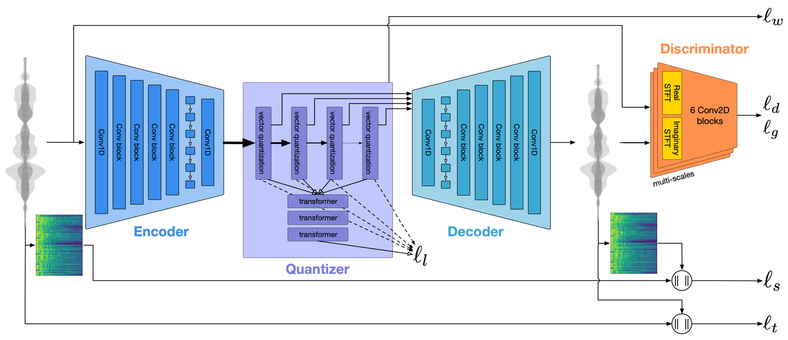

# EnCodec

<details>
<summary>基本信息</summary>

- 标题: "High Fidelity Neural Audio Compression"
- 作者:
  - 01 Alexandre Défossez (Meta AI, FAIR Team, Paris, France)
  - 02 Jade Copet (Meta AI, FAIR Team, Paris, France)
  - 03 Gabriel Synnaeve (Meta AI, FAIR Team, Paris, France)
  - 04 Yossi Adi (Meta AI, FAIR Team, Tel-Aviv, Israel)
- 链接:
  - [ArXiv](https://arxiv.org/abs/2210.13438)
  - [Publication](https://openreview.net/forum?id=ivCd8z8zR2)
  - [Github](https://github.com/facebookresearch/encodec)
  - [Demo](https://ai.honu.io/papers/encodec/samples.html)
- 文件:
  - [ArXiv](_PDF/2210.13438v1__Encodec__High_Fidelity_Neural_Audio_Compression.pdf)
  - [Publication](_PDF/2210.13438p0__Encodec__TMLR2023.pdf)

</details>

## Abstract: 摘要

<details>
<summary>展开原文</summary>

We introduce a state-of-the-art real-time, high-fidelity, audio codec leveraging neural networks.
It consists in a streaming encoder-decoder architecture with quantized latent space trained in an end-to-end fashion.
We simplify and speed-up the training by using a single multiscale spectrogram adversary that efficiently reduces artifacts and produce high-quality samples.
We introduce a novel loss balancer mechanism to stabilize training: the weight of a loss now defines the fraction of the overall gradient it should represent, thus decoupling the choice of this hyper-parameter from the typical scale of the loss.
Finally, we study how lightweight Transformer models can be used to further compress the obtained representation by up to 40%, while staying faster than real time.
We provide a detailed description of the key design choices of the proposed model including: training objective, architectural changes and a study of various perceptual loss functions.
We present an extensive subjective evaluation (MUSHRA tests) together with an ablation study for a range of bandwidths and audio domains, including speech, noisy-reverberant speech, and music.
Our approach is superior to the baselines methods across all evaluated settings, considering both 24 kHz monophonic and 48 kHz stereophonic audio.
Code and models are available at https://github.com/facebookresearch/encodec.

</details>
<br>

本文介绍一个基于神经网络的 SoTA 实时高保真音频编解码器.
它由流式编码器-解码器架构和量化隐空间构成, 以端到端的范式进行训练.
我们通过使用单个多尺度频谱对抗来简化并加速训练, 这能够有效地减少伪影并生成高质量样本.
我们引入了一种新的损失平衡机制来稳定训练: 损失的权重现在定义了它在总体梯度应占的比例, 从而将这个超参数的选择与损失的典型尺度解耦.
最后, 我们研究了如何使用轻量级 Transformer 模型将获得的表示进一步压缩高达 40%, 同时保持比实时更快.
我们详细描述了所提模型的关键设计选择, 包括: 训练目标, 架构变化, 以及各种感知损失函数的研究.
我们提供了广泛的主观评估 (MUSHRA 测试), 并对不同带宽和音频领域的音频进行了详细的分析, 包括语音, 噪声-反射语音, 以及音乐.
所提方法在所有评估设置中都优于基线方法, 考虑到 24 kHz 单声道和 48 kHz 立体声音频.
代码和模型可在 https://github.com/facebookresearch/encodec 获得.

## 1·Introduction: 引言

Recent studies suggest that streaming audio and video have accounted for the majority of the internet traffic in 2021 (82% according to (Cisco, 2021)).
With the internet traffic expected to grow, audio compression is an increasingly important problem.
In lossy signal compression we aim at minimizing the bitrate of a sample while also minimizing the amount of distortion according to a given metric, ideally correlated with human perception.
Audio codecs typically employ a carefully engineered pipeline combining an encoder and a decoder to remove redundancies in the audio content and yield a compact bitstream.
Traditionally, this is achieved by decomposing the input with a signal processing transform and trading off the quality of the components that are less likely to influence perception.
Leveraging neural networks as trained transforms via an encoder-decoder mechanism has been explored by Morishima et al.(1990); Rippel et al.(2019); [SoundStream (2021)](../SpeechCodec/2021.07.07_SoundStream.md).
Our research work is in the continuity of this line of work, with a focus on audio signals.

The problems arising in lossy neural compression models are twofold: first, the model has to represent a wide range of signals, such as not to overfit the training set or produce artifact laden audio outside its comfort zone.
We solve this by having a large and diverse training set (described in Section 4.1), as well as discriminator networks (see Section 3.4) that serve as perceptual losses, which we study extensively in Section 4.5.1, Tab.02.
The other problem is that of compressing efficiently, both in compute time and in size.
For the former, we limit ourselves to models that run in real-time on a single CPU core.
For the latter, we use residual vector quantization of the neural encoder floating-point output, for which various approaches have been proposed (Van Den Oord et al., 2017; [SoundStream (2021)](../SpeechCodec/2021.07.07_SoundStream.md)).

Accompanying those technical contributions, we posit that designing end-to-end neural compression models is a set of intertwined choices, among which at least the encoder-decoder architecture, the quantization method, and the perceptual loss play key parts.
Objective evaluations exist and we report scores on them in our ablations (Section 4.5.1).
But the evaluation of lossy audio codecs necessarily relies on human perception, so we ran extensive human evaluation for multiple points in this design space, both for speech and music.
Those evaluations (MUSHRA) consist in having humans listen to, compare, and rate excerpts of speech or music compressed with competitive codecs and variants of our method, and the uncompressed ground truth.
This allows to compare variants of the whole pipeline in isolation, as well as their combined effect, in Section 4.5.1 (Fig.03 and Tab.01).
Finally, our best model, **EnCodec**, reaches state-of-the-art scores for speech and for music at 1.5, 3, 6, 12 kbps at 24 kHz, and at 6, 12, and 24 kbps for 48 kHz with stereo channels.

## 2·Related Works: 相关工作

### Speech and Audio Synthesis·语音与音频合成

Recent advancements in neural audio generation enabled computers to efficiently generate natural sounding audio.
The first convincing results were achieved by autoregressive models such as [WaveNet (2016)](../Vocoder/2016.09.12_WaveNet.md), at the cost of slow inference.
While many other approaches were explored ([Parallel WaveGAN (2019)](../Vocoder/2019.10.25_Parallel_WaveGAN.md); Kalchbrenner et al., 2018; Goel et al., 2022), the most relevant ones here are those based on [Generative Adversarial Networks (GAN)](../_Basis/2014.06.10_GAN.md) ([MelGAN (2019)](../Vocoder/2019.10.08_MelGAN.md); [Parallel WaveGAN (2019)](../Vocoder/2019.10.25_Parallel_WaveGAN.md); [HiFi-GAN (2020)](../Vocoder/2020.10.12_HiFi-GAN.md); [HiFi++ (2022)](../_tmp/2022.03.24_HiFi++.md)) were able to match the quality of autoregressive by combining various adversarial networks operate at different multi-scale and multi-period resolutions.
Our work uses and extends similar adversarial losses to limit artifacts during audio generation.

近期在神经音频生成的进展使得计算机能够高效地生成听起来很自然的音频.
自回归模型 (如 WaveNet (2016)) 获得了首个令人信服的成果, 其代价是推理效率低.
尽管这期间出现了许多其他方法, 但最相关的是那些基于 GAN (2014) 的工作, 它们通过在不同的多尺度和多周期分辨率上结合各种对抗网络从而能够与自回归生成的质量相媲美.
本项工作使用且扩展了类似的对抗损失以限制音频生成过程中出现的各种干扰和失真.

### Audio Codec·音频编解码器

Low bitrate parametric speech and audio codecs have long been studied (Atal & Hanauer, 1971; Juang & Gray, 1982), but their quality has been severely limited.
Despite some advances (Griffin & Lim, 1985; McCree et al., 1996), modeling the excitation signal has remained a challenging task.
The current state-of-the-art traditional audio codecs are Opus (Valin et al., 2012) and Enhanced Voice Service (EVS) (Dietz et al., 2015).
These methods produce high coding efficiency for general audio while supporting various bitrates, sampling rates, and real-time compression.

低码率的参数化语音和音频编解码器已经经过了很长期的研究, 但它们的质量严重受限.
尽管有一些进展, 但建模刺激信号仍然是一个具有挑战性的任务.
当前最佳的传统音频编解码器是 Opus (2012) 和 EVS (2015).
这些方法能够为一般音频提供高效率的编码, 同时支持各种码率, 采样率, 以及实时压缩.

Neural based audio codecs have been recently proposed and demonstrated promising results (Kleijn et al., 2018; Valin & Skoglund, 2019b; Lim et al., 2020; Kleijn et al., 2021; [SoundStream (2021)](../SpeechCodec/2021.07.07_SoundStream.md); Omran et al., 2022; Lin et al., 2022; Jayashankar et al., 2022; Li et al.; Jiang et al., 2022), where most methods are based on quantizing the latent space before feeding it to the decoder.
In Valin & Skoglund (2019b), an LPCNet (Valin & Skoglund, 2019a) vocoder was conditioned on hand-crafted features and a uniform quantizer.
Gârbacea et al. (2019) conditioned a WaveNet based model on discrete units obtained from a VQ-VAE (Van Den Oord et al., 2017; Razavi et al., 2019) model, while Skoglund & Valin (2019) tried feeding the Opus codec (Valin et al., 2012) to a WaveNet to further improve its perceptual quality.
Jayashankar et al. (2022); Jiang et al. (2022) propose an auto-encoder with a vector quantization layer applied over the latent representation and minimizing the reconstruction loss, while Li et al. suggested using Gumbel-Softmax (GS) (Jang et al., 2017) for representation quantization.
The most relevant related work to ours is the [SoundStream (2021)](../SpeechCodec/2021.07.07_SoundStream.md) model, in which the authors propose a fully convolutional encoder decoder architecture with a Residual Vector Quantization (RVQ) (Gray, 1984; Vasuki & Vanathi, 2006) layers.
The model was optimized using both reconstruction loss and adversarial perceptual losses.

近期提出的基于神经网络的编解码器已经展示了不错的结果, 其中大多数方法都基于量化隐空间, 然后将其输入到解码器中.
- LPCNet (2019) 声码器使用手工特征和均匀量化器进行条件化;
- Gârbacea 等人使用 VQ-VAE (2017) 获得的离散单元对基于 WaveNet 的模型进行条件化;
- Skoglund 等人尝试将 Opus 编解码器输入到 WaveNet 中以进一步提升其感知质量;
- Jayashankar 等人提出了一个在隐表示上使用矢量量化层的自编码器, 并最小化重构损失;
- Li 等人提出用 Gumbel-Softmax 以表示量化.

与本文最相关的工作是 [SoundStream (2021)](../SpeechCodec/2021.07.07_SoundStream.md), 它提出了一个带有残差矢量量化 (Residual Vector Quantization, RVQ) 层的全卷积编码器-解码器架构. 该模型通过重构损失和对抗感知损失进行优化.

### Audio Discretization·音频离散化

Representing audio and speech using discrete values was proposed to various tasks recently.
Dieleman et al. (2018); Dhariwal et al. (2020) proposed a hierarchical VQ-VAE based model for learning discrete representation of raw audio, next combined with an autoregressive model, demonstrating the ability to generate high quality music.
Similarly, Lakhotia et al. (2021); Kharitonov et al. (2021) demonstrated that self-supervised learning methods for speech (e.g., [HuBERT (2021)](../SpeechRepresentation/2021.06.14_HuBERT.md)), can be quantized and used for conditional and unconditional speech generation.
Similar methods were applied to speech resynthesis (Polyak et al., 2021), speech emotion conversion (Kreuk et al., 2021), spoken dialog system (Nguyen et al., 2022), and speech-to-speech translation (Lee et al., 2021a;b; Popuri et al., 2022).

近期使用离散值表示音频和语音被提出用于各种任务.
- Dieleman 等人提出了一个基于层次化 VQ-VAE 的模型用于学习原始音频的离散表示, 然后和自回归模型结合, 展示了生成高质量音乐的能力;
- 类似地, Lakhotia 等人展示了语音的自监督学习方法 (如 HuBERT (2021)) 能够量化并用于条件和非条件语音生成;
- 类似的方法被用于语音合成, 语音情感转换, 口语对话系统, 以及语音到语音的翻译.

## 3·Methodology: 方法

An audio signal of duration $d$ can be represented by a sequence $\mathbf{x}\in[−1,1]^{C_a\times T}$ with $C_a$ the number of audio channels, $T=d \cdot f_{sr}$ the number of audio samples at a given sample rate $f_{sr}$.
The **EnCodec** model is composed of three main components:
1. First, an encoder network $E$ is input an audio extract and outputs a latent representation $\mathbf{z}$;
2. Next, a quantization layer $Q$ produces a compressed representation $\mathbf{z}_q$, using vector quantization;
3. Lastly, a decoder network $G$ reconstructs the time-domain signal, $\hat{\mathbf{x}}$, from the compressed latent representation $\mathbf{z}_q$.

The whole system is trained end-to-end to minimize a reconstruction loss applied over both time and frequency domain, together with a perceptual loss in the form of discriminators operating at different resolutions.

时长为 $d$ 的音频信号可以由一个序列 $\mathbf{x}\in [-1,1]^{C_a\times T}$ 表示, 其中 $C_a$ 是音频通道数, $T=d \cdot f_{sr}$ 是给定采样率 $f_{sr}$ 下音频样本数.
**EnCodec** 模型由三个主要组件组成:
1. 首先, 编码器网络 $E$ 输入音频信号并输出隐变量表示 $\mathbf{z}$;
2. 然后, 量化层 $Q$ 使用矢量量化产生压缩表示 $\mathbf{z}_q$;
3. 最后, 解码器网络 $G$ 从压缩的隐变量表示 $\mathbf{z}_q$ 重构时域信号 $\hat{\mathbf{x}}$.

整个系统以端到端的方式训练, 最小化同时应用在时域和频域上的重构损失, 以及在不同分辨率下操作的鉴别器形式的感知损失.

A visual description of the proposed method can be seen in Fig.01.

图 01 展示了所提出的方法的可视化描述.



### 3.1·Encoder & Decoder Architecture·编码器与解码器架构

The **EnCodec** model is a simple streaming, convolutional-based encoder-decoder architecture with sequential modeling component applied over the latent representation, both on the encoder and on the decoder side.
Such modeling framework was shown to provide great results in various audio-related tasks, e.g., source separation and enhancement (Défossez et al., 2019; Defossez et al., 2020), neural vocoders ([MelGAN (2019)](../Vocoder/2019.10.08_MelGAN.md); [HiFi-GAN (2020)](../Vocoder/2020.10.12_HiFi-GAN.md)), audio codec ([SoundStream (2021)](../SpeechCodec/2021.07.07_SoundStream.md)), and artificial bandwidth extension ([SEANet (2020)](../_Basis/2020.09.04_SEANet.md); Li et al., 2021).
We use the same architecture for 24 kHz and 48 kHz audio.

**EnCodec** 模型是一个简单的流式, 基于卷积的编码器-解码器架构, 其中在隐表示上应用序列建模组件, 编码器和解码器两侧都有.
这种建模框架在音频相关任务中取得了卓越的结果, 如音源分离和增强, 神经声码器, 音频编解码器, 人工带宽扩展.
我们对 24 kHz 和 48 kHz 音频使用相同的架构.

#### Encoder-Decoder·编码器-解码器

The encoder model $E$ consists in a 1D convolution with $C$ channels and a kernel size of 7 followed by $B$ convolution blocks.
Each convolution block is composed of a single residual unit followed by a down-sampling layer consisting in a strided convolution, with a kernel size $K$ of twice the stride $S$.
The residual unit contains two convolutions with kernel size 3 and a skip-connection.
The number of channels is doubled whenever down-sampling occurred.
The convolution blocks are followed by a two-layer LSTM for sequence modeling and a final 1D convolution layer with a kernel size of 7 and $D$ output channels.
Following [SoundStream (2021)](../SpeechCodec/2021.07.07_SoundStream.md); Li et al. (2021), we use $C= 32$, $B=4$ and $(2, 4, 5, 8)$ as strides.
We use ELU as a non-linear activation function (Clevert et al., 2015) either layer normalization (Ba et al., 2016) or weight normalization (Salimans & Kingma, 2016).
We use two variants of the model, depending on whether we target the low-latency streamable setup, or a high fidelity non-streamable usage.
With this setup, the encoder outputs 75 latent steps per second of audio at 24 kHz, and 150 at 48 kHz.
The decoder mirrors the encoder, using transposed convolutions instead of strided convolutions, and with the strides in reverse order as in the encoder, outputting the final mono or stereo audio.

编码器模型 $E$ 由具有 $C$ 个通道数的一维卷积, 后跟 $B$ 个卷积核大小为 7 的卷积块.
每个卷积块由一个残差单元和一个带步长的卷积组成的下采样层构成, 其中卷积核大小 $K$ 为步长 $S$ 的两倍.
残差单元由两个卷积核大小为 3 的卷积和一个跳跃连接组成.
通道数每当下采样发生时进行翻倍.
卷积块后面是一个两层 LSTM 用于序列建模, 最后一个 1D 卷积层具有卷积核大小为 7 和 $D$ 个输出通道.

遵循 [SoundStream (2021)](../SpeechCodec/2021.07.07_SoundStream.md) 的设置, 我们使用 $C=32$, $B=4$, $(2, 4, 5, 8)$ 作为步长.
我们使用 ELU 作为非线性激活函数, 层归一化或权重归一化.
我们使用两个变体模型, 取决于我们的目标是低延迟流式, 或高精度非流式.
在这一设置下, 编码器 24 kHz 时输出 75 隐步长每秒的音频, 48 kHz 时为 150 个.

解码器与编码器镜像, 使用转置卷积代替步长卷积, 步长顺序与编码器相反, 输出最终单声道或立体声音频.

#### Non-streamable·非流式

In the non-streamable setup, we use for each convolution a total padding of $K−S$, split equally before the first time step and after the last one (with one more before if $K−S$ is odd).
We further split the input into chunks of 1 seconds, with an overlap of 10 ms to avoid clicks, and normalize each chunk before feeding it to the model, applying the inverse operation on the output of the decoder, adding a negligible bandwidth overhead to transmit the scale.
We use layer normalization (Ba et al., 2016), computing the statistics including also the time dimension in order to keep the relative scale information.

在非流式设置下, 我们为每个卷积使用 $K−S$ 的总填充, 在第一个时间步之前和最后一个时间步之后均匀分割 (如果 $K−S$ 为奇数, 则再多分割一次).
我们进一步将输入划分为一秒的块, 并使用 10 毫秒的重叠避免点击, 并在输入到模型之前对每个块进行归一化, 然后在解码器输出上应用逆操作, 并在输出上添加微小的带宽开销以传输尺度.
我们使用层归一化, 计算包括时间维度的统计信息, 以保持相对尺度信息.

#### Streamable·流式

For the streamable setup, all padding is put before the first time step.
For a transposed convolution with stride $s$, we output the $s$ first time steps, and keep the remaining $s$ steps in memory for completion when the next frame is available, or discarding it at the end of a stream.
Thanks to this padding scheme, the model can output 320 samples (13 ms) as soon as the first 320 samples (13 ms) are received.
We replace the layer normalization with statistics computed over the time dimension with weight normalization (Salimans & Kingma, 2016), as the former is ill-suited for a streaming setup.
We notice a small gain over the objective metrics by keeping a form of normalization, as demonstrated in Tab.A.3.

对于流式设置, 所有填充在第一个时间步前进行.
对于具有步长为 $s$ 的转置卷积, 我们输出前 $s$ 个时间步, 并将剩余 $s$ 个时间步保存在内存中, 以便在下一帧可用时完成, 或者在流结束时丢弃.
由于这种填充方案, 模型可以在收到前 320 个样本 (13 毫秒) 后立即输出 320 个样本 (13 毫秒).
我们用权重归一化替换层归一化, 因为前者不适合流式设置.
我们注意到在保持某种形式的归一化的情况下, 目标指标的性能有所提升, 如表 A.3 所示.

### 3.2·Residual Vector Quantization·残差矢量量化

We use Residual Vector Quantization (RVQ) to quantize the output of the encoder as introduced by [SoundStream (2021)](../SpeechCodec/2021.07.07_SoundStream.md).
Vector quantization consists in projecting an input vector onto the closest entry in a codebook of a given size.
RVQ refines this process by computing the residual after quantization, and further quantizing it using a second codebook, and so forth.

我们使用残差矢量量化 (Residual Vector Quantization, RVQ) 来量化编码器输出.
矢量量化是将输入向量投影到给定大小的码本中最近的元素.
RVQ 通过在量化后计算残差改进这一过程, 并使用第二个码本进一步量化, 依此类推.

We follow the same training procedure as described by Dhariwal et al. (2020) and [SoundStream (2021)](../SpeechCodec/2021.07.07_SoundStream.md).
The codebook entry selected for each input is updated using an exponential moving average with a decay of 0.99, and entries that are not used are replaced with a candidate sampled from the current batch.
We use a straight-through-estimator (Bengio et al., 2013) to compute the gradient of the encoder, e.g. as if the quantization step was the identity function during the backward phase.
Finally, a commitment loss, consisting of the MSE between the input of the quantizer and its output, with gradient only computed with respect to its input, is added to the overall training loss.

我们遵循 Dhariwal 等人的相同训练过程.
对于每个输入, 选择的码本元素是使用指数移动平均更新的, 衰减率为 0.99, 且未使用的元素被替换为当前批次中候选采样的元素.
我们使用直通估计器用于计算编码器的梯度, 例如, 假设量化步骤在反向阶段是恒等函数.
最后, 一个提交损失, 由量化器的输入与其输出之间的 MSE 组成, 只计算其输入的梯度, 被添加到整体训练损失中.

By selecting a variable number of residual steps at train time, a single model can be used to support multiple bandwidth target ([SoundStream (2021)](../SpeechCodec/2021.07.07_SoundStream.md)).
For all of our models, we use at most 32 codebooks (16 for the 48 kHz models) with 1024 entries each, e.g. 10 bits per codebook.
When doing variable bandwidth training, we select randomly a number of codebooks as a multiple of 4, i.e. corresponding to a bandwidth 1.5, 3, 6, 12 or 24 kbps at 24 kHz.
Given a continuous latent represention with shape [B, D, T] that comes out of the encoder, this procedure turns it into a discrete set of indexes [B, Nq, T] with Nq the number of codebooks selected.
This discrete representation can changed again to a vector by summing the corresponding codebook entries, which is done just before going into the decoder.

通过在训练时选择可变数量的残差步骤, 单个模型可以支持多个带宽目标.
对于我们的所有模型, 我们使用至多 32 个码本 (48 kHz 模型为 16 个), 每个码本具有 1024 个元素, 例如, 每个码本 10 比特.
在进行可变带宽训练时, 我们随机选择 4 的倍数个码本, 即对应于 24 kHz 时带宽为 1.5, 3, 6, 12 或 24 kbps.
给定编码器输出的连续潜在表示 [B, D, T], 这一过程将其转换为离散索引集 [B, Nq, T], 其中 Nq 是所选码本的数量.
这个离散表示可以再转换为向量, 这就是将相应码本元素求和得到的结果.

### 3.3·Language Modeling and Entropy Coding·语言模型和熵编码

We additionally train a small Transformer based language model (Vaswani et al., 2017) with the objective of keeping faster than real time end-to-end compression/decompression on a single CPU core.
The model consists of 5 layers, 8 heads, 200 channels, a dimension of 800 for the feed-forward blocks, and no dropout.
At train time, we select a bandwidth and the corresponding number of codebooks `Nq=32`.
For a time step t, the discrete representation obtained at time t −1 is transformed into a continuous representation using learnt embedding tables, one for each codebook, and which are summed.
For t=0, a special token is used instead.
The output of the Transformer (`out`, `states`, `offset`) is fed into Nq linear layers with as many output channels as the cardinality of each codebook (e.g. 1024), giving us the logits of the estimated distribution over each codebook for time t.
We thus neglect potential mutual information between the codebooks at a single time step.
This allows to speedup inference (as opposed to having one time step per codebook, or a multi-stage prediction) with a limited impact over the final cross entropy.
Each attention layer has a causal receptive field of 3.5 seconds, and we offset by a random amount the initial position of the sinusoidal position embedding to emulate being in a longer sequence.
We train the model on sequences of 5 seconds.

我们还训练了一个基于 Transformer 的小型语言模型, 目的是在单个 CPU 核上实现实时端到端压缩/解压缩速度更快.
该模型由五层 `num_layers=5`, 八个注意力头 `n_heads=8`, 两百个通道 `dim=200`, 一个维度为八百的前馈块 `hidden_dim=dim*hidden_scale=200*4=800`, 且无随机失活.
在训练时, 我们选择一个带宽和对应的码本数量 Nq.
对于 t 时间步, 在 t-1 时间步获得的离散表示, 使用每个码本的学习嵌入表, 并求和得到连续表示.
当 t=0 时, 采用特殊标记.
Transformer 的输出被输入到 Nq 个线性层, 输出通道数与每个码本的基数相同 (例如, 1024), 给出了 t 时间步每个码本的估计分布的对数概率.
因此, 我们忽略了在单个时间步中码本之间的潜在信息.
这使得推理 (与具有多个码本或多阶段预测的预测相比) 得以加速, 且对最终交叉熵的影响有限.
每个注意力层都有一个 3.5 秒的因果感受野, 且我们随机偏移了初始位置的正弦位置嵌入, 以模拟处于更长的序列中.
我们在 5 秒序列上训练模型.

<details>
<summary>代码</summary>

```python
class StreamingTransformerEncoderLayer(nn.TransformerEncoderLayer):
    def forward(self, x: torch.Tensor, x_past: torch.Tensor, past_context: int):  # type: ignore
        if self.norm_first:
            sa_input = self.norm1(x)
            x = x + self._sa_block(sa_input, x_past, past_context)


            x = x + self._ff_block(self.norm2(x))
        else:
            sa_input = x
            x = self.norm1(x + self._sa_block(sa_input, x_past, past_context))
            x = self.norm2(x + self._ff_block(x))

        return x, sa_input

    # self-attention block
    def _sa_block(self, x: torch.Tensor, x_past: torch.Tensor, past_context: int):  # type: ignore
        _, T, _ = x.shape
        _, H, _ = x_past.shape

        queries = x
        keys = torch.cat([x_past, x], dim=1)
        values = keys

        queries_pos = torch.arange(H, T + H, device=x.device).view(-1, 1)
        keys_pos = torch.arange(T + H, device=x.device).view(1, -1)
        delta = queries_pos - keys_pos
        valid_access = (delta >= 0) & (delta <= past_context)
        x = self.self_attn(queries, keys, values,
   attn_mask=~valid_access,
   need_weights=False)[0]
        return self.dropout1(x)

class StreamingTransformerEncoder(nn.Module):
    def __init__(self, dim, hidden_scale: float = 4., num_heads: int = 8, num_layers: int = 5,
                 max_period: float = 10000, past_context: int = 1000, gelu: bool = True,
                 norm_in: bool = True, dropout: float = 0., **kwargs):
        super().__init__()
        assert dim % num_heads == 0
        hidden_dim = int(dim * hidden_scale)

        self.max_period = max_period
        self.past_context = past_context
        activation: tp.Any = F.gelu if gelu else F.relu

        self.norm_in: nn.Module
        if norm_in:
            self.norm_in = nn.LayerNorm(dim)
        else:
            self.norm_in = nn.Identity()

        self.layers = nn.ModuleList()
        for idx in range(num_layers):
            self.layers.append(
                StreamingTransformerEncoderLayer(
                    dim, num_heads, hidden_dim,
                    activation=activation, batch_first=True, dropout=dropout, **kwargs))

    def forward(self, x: torch.Tensor,
                states: tp.Optional[tp.List[torch.Tensor]] = None,
                offset: tp.Union[int, torch.Tensor] = 0):
        B, T, C = x.shape
        if states is None:
            states = [torch.zeros_like(x[:, :1]) for _ in range(1 + len(self.layers))]

        positions = torch.arange(T, device=x.device).view(1, -1, 1) + offset
        pos_emb = create_sin_embedding(positions, C, max_period=self.max_period)

        new_state: tp.List[torch.Tensor] = []
        x = self.norm_in(x)
        x = x + pos_emb

        for layer_state, layer in zip(states, self.layers):
            x, new_layer_state = layer(x, layer_state, self.past_context)
            new_layer_state = torch.cat([layer_state, new_layer_state], dim=1)
            new_state.append(new_layer_state[:, -self.past_context:, :])
        return x, new_state, offset + T


class LMModel(nn.Module):
    def __init__(
      self,
      n_q : int = 32,
      card: int = 1024,
      dim : int = 200,
      **kwargs):
        super().__init__()
        self.card = card
        self.n_q = n_q
        self.dim = dim
        self.transformer = m.StreamingTransformerEncoder(dim=dim, **kwargs)
        self.emb = nn.ModuleList([nn.Embedding(card + 1, dim) for _ in range(n_q)])
        self.linears = nn.ModuleList([nn.Linear(dim, card) for _ in range(n_q)])

    def forward(
      self,
      indices: torch.Tensor,
      states: tp.Optional[tp.List[torch.Tensor]] = None,
      offset: int = 0):
        B, K, T = indices.shape
        input_ = sum([self.emb[k](indices[:, k]) for k in range(K)])
        out, states, offset = self.transformer(input_, states, offset)
        logits = torch.stack([self.linears[k](out) for k in range(K)], dim=1).permute(0, 3, 1, 2)
        return torch.softmax(logits, dim=1), states, offset
```

</details>
<br>

#### Entropy Encoding·熵编码

We use a range based arithmetic coder (Pasco, 1976; Rissanen & Langdon, 1981) in order to leverage the estimated probabilities given by the language model.
As noted by Ballé et al. (2018), evaluation of the same model might lead to different results on different architectures, or with different evaluation procedures due to floating point approximations.
This can lead to decoding errors as the encoder and decoder will not use the exact same code.
We observe in particular that the difference between batch evaluation (e.g. all time steps at once), and the real-life streaming evaluation that occurs in the decoder can lead to difference larger than 10−8.
We first round the estimated probabilities with a precision of 10−6, although evaluations in more contexts would be needed for practical deployment.
We use a total range width of 224, and assign a minimum range width of 2.
We discuss the impact on the processing time in Section 4.6.

我们使用基于范围的算术编码器来利用语言模型给出的估计概率.
正如 Ballé 等人所指出, 相同模型的评估可能会导致不同架构或不同评估过程的结果, 因为浮点近似会导致不同结果.
这可能导致解码错误, 因为编码器和解码器将不会使用相同的代码.
特别是, 我们观察到批处理评估 (例如, 一次处理所有时间步) 与实际流式解码过程中发生的评估之间的差异可以导致差异大于 10−8.
我们首先将估计概率四舍五入到 10−6 的精度, 虽然在实际部署中可能需要更多的评估.
我们使用总范围宽度为 224, 并赋予最小范围宽度为 2.
我们在 4.6 节中讨论处理时间的影响.

### 3.4·Training Objectives·训练目标

We detail the training objective that combines a reconstruction loss term, a perceptual loss term (via discriminators), and the RVQ commitment loss.

我们将详细介绍训练目标: 重构损失项, 感知损失项 (通过判别器), 和 RVQ 提交损失项.

#### Reconstruction Loss·重构损失

The reconstruction loss term is comprised of a time and a frequency domain loss term.
We minimize the L1 distance between the target and compressed audio over the time domain, i.e. $l_t(\mathbf{x}, \hat{\mathbf{x}})=\|\mathbf{x}-\hat{\mathbf{x}}\|_1$.
For the frequency domain, we use a linear combination between the L1 and L2 losses over the mel-spectrogram using several time scales ([Parallel WaveGAN (2019)](../Vocoder/2019.10.25_Parallel_WaveGAN.md); Gritsenko et al., 2020).
Formally, ‘f(x, ˆx) =1 |α| · |s|X αi∈α X i∈e kSi(x) − Si(ˆx)k1+ αikSi(x) − Si(ˆx)k2,(1) whereSiis a 64-bins mel-spectrogram using a normalized STFT with window size of 2iand hop length of 2i/4,e=5, .., 11is the set of scales, andαrepresents the set of scalar coefficients balancing between the L1 and L2 terms.
Unlike Gritsenko et al. (2020), we take αi= 1.

#### Discriminative Loss·判别损失

To further improve the quality of the generated samples, we introduce a perceptual loss term based on a multi-scale STFT-based (MS-STFT) discriminator, illustrated in Fig.02.
Multi scale discriminators are popular for capturing different structures in audio signals ([MelGAN (2019)](../Vocoder/2019.10.08_MelGAN.md); [HiFi-GAN (2020)](../Vocoder/2020.10.12_HiFi-GAN.md); [GAN Vocoder (2021)](../Vocoder/2021.03.09_GAN_Vocoder.md)).
The MS-STFT discriminator consists in identically structured networks operating on multi-scaled complex-valued STFT with the real and imaginary parts concatenated.
Each sub-network is composed of a 2D convolutional layer (using kernel size 3 x 8 with 32 channels), followed by 2D convolutions with increasing dilation rates in the time dimension of 1, 2 and 4, and a stride of 2 over the frequency axis.
A final 2D convolution with kernel size 3 x 3 and stride (1, 1) provide the final prediction.
We use 5 different scales with STFT window lengths of [2048, 1024, 512, 256, 128].
For 48 kHz audio, we double the size of each STFT window and train the discriminator every two batches, and for stereophonic audio, we process separately the left and right channels.
We use LeakyReLU as a no weight normalization (Salimans & Kingma, 2016) to our discriminator network.
The MS-STFT discriminator model architecture is visually depicted in Fig.02.
The adversarial loss for the generator is constructed as follows,‘g(ˆx) =1 KPkmax(0,1−Dk(ˆx))), whereKis the number of discriminators.
Similarly to previous work on neural vocoders ([MelGAN (2019)](../Vocoder/2019.10.08_MelGAN.md); [HiFi-GAN (2020)](../Vocoder/2020.10.12_HiFi-GAN.md); [GAN Vocoder (2021)](../Vocoder/2021.03.09_GAN_Vocoder.md)), we additionally include a relative feature matching loss for the generator.
Formally, ‘feat(x, ˆx) =1 KL K X k=1 L X l=1 kDlk(x) − Dlk(ˆx)k1 mean�kDlk(x)k1� ,(2) where themeanis computed over all dimensions, (Dk) are the discriminators, andLis the number of layers in discriminators.
The discriminators are trained to minimize the following hinge-loss adversarial loss function: Ld(x, ˆx) =1 KPKk=1max(0,1− Dk(x)) +max(0,1 +Dk(ˆx)), whereKis the number of discriminators.
Given that the discriminator tend to overpower easily the decoder, we update its weight with a probability of 2/3 at 24 kHz, and 0.5 at 48 kHz.

#### Multi-Bandwidth Training·多带宽训练

At 24 kHz, we train the model to support the bandwidths 1.5, 3, 6, 12, and 24 kbps by selecting the appropriate number of codebooks to keep in the RVQ step, as explained in Section 3.2.
At 48 kHz, we train to support 3, 6, 12 and 24 kbps.
We also noticed that using a dedicated discriminator per-bandwidth is beneficial to the audio quality.
Thus, we select a given bandwidth for the entire batch, and evaluate and update only the corresponding discriminator.

#### VQ Commitment Loss·VQ 提交损失

As mentioned in Section 3.2, we add a commitment losslwbetween the output of the encoder, and its quantized value, with no gradient being computed for the quantized value.
For each residual stepc ∈ {1, ..C}(withCdepeding on the bandwidth target for the current batch), notingzcthe current residual and qc(zc) the nearest entry in the corresponding codebook, we define lwas lw= C X c=1 kzc− qc(zc)k22.(3) Overall, the generator is trained to optimize the following loss, summed over the batch, LG= λt· ‘t(x, ˆx) + λf· ‘f(x, ˆx) + λg· ‘g(ˆx) + λfeat· ‘feat(x, ˆx) + λw· ‘w(w),(4) where λt, λf, λg, λfeat, and λwthe scalar coefficients to balance between the terms.

#### Balancer

We introduce a loss balancer in order to stabilize training, in particular the varying scale of the gradients coming from the discriminators.
We also find that the balancer makes it easier to reason about the different loss weights, independently of their scale.
Let us take a number of losses (‘i)ithat depends only on the output of the modelˆx.
We definegi=∂‘i ∂ˆx, andhkgik2iβthe exponential moving average ofgiover the last training batches.
Given a set of weights (λi) and a reference norm R, we define ˜gi= Rλi Pjλj· gi hkgik2iβ.(5) We then backpropagate into the networkPi˜gi, instead of the originalPiλigi.
This changes the optimization problem but allows to make theλiinterpretable irrespectively of the natural scale of each loss.
IfPiλi= 1, then each weight can be interpreted as the fraction of the model gradient that come from the corresponding loss.
We takeR= 1 andβ= 0.999.
All the generator losses from Eq. (4) fit into the balancer, except for the commitment loss, as it is not defined with respect to the output of the model.


## 4·Experiments: 实验

### 4.1·Dataset

We train **EnCodec** on 24 kHz monophonic across diverse domains, namely: speech, noisy speech, music and general audio while we train the fullband stereo **EnCodec** on only 48 kHz music.
For speech, we use the clean speech segments from DNS Challenge 4 (Dubey et al., 2022) and the Common Voice dataset (Ardila et al., 2019).
For general audio, we use on AudioSet (Gemmeke et al., 2017) together with FSD50K (Fonseca et al., 2021).
For music, we rely on the Jamendo dataset (Bogdanov et al., 2019) for training and evaluation and we further evaluate our models on music using a proprietary music dataset.
Data splits are detailed in Appendix A.1.

For training and validation, we define a mixing strategy which consists in either sampling a single source from a dataset or performing on the fly mixing of two or three sources.
Specifically, we have four strategies: (s1) we sample a single source from Jamendo with probability 0.32; (s2) we sample a single source from the other datasets with the same probability; (s3) we mix two sources from all datasets with a probability of 0.24; (s4) we mix three sources from all datasets except music with a probability of 0.12.

The audio is normalized by file and we apply a random gain between -10 and 6 dB.
We reject any sample that has been clipped.
Finally we add reverberation using room impulse responses provided by the DNS challenge with probability 0.2, and RT60 in the range [0.3, 1.3] except for the single-source music samples.
For testing, we use four categories: clean speech from DNS alone, clean speech mixed with FSDK50K sample, Jamendo sample alone, proprietary music sample alone.

### 4.2·Baselines

Opus (Valin et al., 2012) is a versatile speech and audio codec standardized by the IETF in 2012.
It scales from 6 kbps narrowband monophonic audio to 510 kbps fullband stereophonic audio.
EVS (Dietz et al., 2015) is a codec standardized in 2014 by 3GPP and developed for Voice over LTE (VoLTE).
It supports a range of bitrates from 5.9 kbps to 128 kbps, and audio bandwidths from 4 kHz to 20 kHz.
It is the successor of AMR-WB (Bhagat et al., 2012).We use both codecs to serve as traditional digital signal processing baselines.
We also utilize MP3 compression at 64 kbps as an additional baseline for the stereophonic signal compression case.
MP3 uses lossy data compression by approximating the accuracy of certain components of sound that are considered to be beyond hearing capabilities of most humans.
Finally, we compare **EnCodec** to the SoundStream model from the official implementation available in Lyra 21at 3.2 kbps and 6 kbps on audio upsampled to 32 kHz.
We also reproduced a version of [SoundStream (2021)](../SpeechCodec/2021.07.07_SoundStream.md) with minor improvements.
Namely, we use the relative feature loss introduce in Section 3.4, and layer normalization (applied separately for each time step) in the discriminators, except for the first and last layer, which improved the audio quality during our preliminary studies.
Results a reported in Tab.A.2 in the Appendix A.3.

### 4.3·Evaluation Methods

We consider both subjective and objective evaluation metrics.
For the subjective tests we follow the MUSHRA protocol (Series, 2014), using both a hidden reference and a low anchor.
Annotators were recruited using a crowd-sourcing platform, in which they were asked to rate the perceptual quality of the provided samples in a range between 1 to 100.
We randomly select 50 samples of 5 seconds from each category of the the test set and force at least 10 annotations per samples.
To filter noisy annotations and outliers we remove annotators who rate the reference recordings less then 90 in at least 20% of the cases, or rate the low-anchor recording above 80 more than 50% of the time.
For objective metrics, we use ViSQOL (Hines et al., 2012; Chinen et al., 2020)2, together with the Scale-Invariant Signal-to-Noise Ration (SI-SNR) (Luo & Mesgarani, 2019; Nachmani et al., 2020; Chazan et al., 2021).

### 4.4·Training

We train all models for 300 epochs, with one epoch being 2,000 updates with the Adam optimizer with a batch size of 64 examples of 1 second each, a learning rate of 3·10−4,β1= 0.5, andβ2= 0.9.
All the models are traind using 8 A100 GPUs.
We use the balancer introduced in Section 3.4 with weightsλt= 0.1,λf= 1, λg= 3, λfeat= 3 for the 24 kHz models.
For the 48 kHz model, we use instead λg= 4, λfeat= 4.

## 5·Results: 结果

We start with the results for **EnCodec** with a bandwidth in{1.5,3,6,12}kbps and compare them to the baselines.
Results for the streamable setup are reported in Fig.03 and a breakdown per category in Tab.01.
We additionally explored other quantizers such as Gumbel-Softmax and DiffQ (see details in Appendix A.2), however, we found in preliminary results that they provide similar or worse results, hence we do not report them.
When considering the same bandwidth, **EnCodec** is superior to all evaluated baselines considering the MUSHRA score.
Notice, **EnCodec** at 3kbps reaches better performance on average than Lyra-v2 using 6kbps and Opus at 12kbps.
When considering the additional language model over the codes, we can reduce the bandwidth by∼25−40%.
For instance, we can reduce the bandwidth of the 3 kpbs model to 1.9 kbps.
We observe that for higher bandwidth, the compression ratio is lower, which could be explained by the small size of the Transformer model used, making hard to model all codebooks together.

### 5.1·Ablation study

Next, we perform an ablation study to better evaluate the effect of the discriminator setup, streaming, multi target bandwidth, and balancer.
We provide more detailed ablation studies in the Appendix, Section A.3.

#### The effect of discriminators setup

Various discriminators were proposed in prior work to improve the perceptual quality of the generated audio.
The Multi-Scale Discriminator (MSD) model proposed by [MelGAN (2019)](../Vocoder/2019.10.08_MelGAN.md) and adopted in ([HiFi-GAN (2020)](../Vocoder/2020.10.12_HiFi-GAN.md); [HiFi++ (2022)](../_tmp/2022.03.24_HiFi++.md); [SoundStream (2021)](../SpeechCodec/2021.07.07_SoundStream.md)), operates on the raw waveform at different resolutions.
We adopt the same MSD configuration as described in [SoundStream (2021)](../SpeechCodec/2021.07.07_SoundStream.md).
Kong et al. (2020) additionally propose the Multi-Period Discriminator (MPD) model, which reshapes the waveform to a 2D input with multiple periods.
Next, the STFT Discriminator (Mono-STFTD) model was introduced in [SoundStream (2021)](../SpeechCodec/2021.07.07_SoundStream.md), where a single network operates over the complex-valued STFT.
We evaluate our MS-STFTD discriminator against three other discriminator configurations: (i) MSD+Mono STFTD (as in [SoundStream (2021)](../SpeechCodec/2021.07.07_SoundStream.md)); (ii) MPD only; (iii) MS-STFTD only; (vi) MS-STFTD+MPD.
Results are reported in Tab.02.
Results suggest that using only a multi-scale STFT-based discriminator such as MS STFTD, is enough to generate high quality audio.
Additionally, it simplifies the model training and reduces training time.
Including the MPD discriminator, adds a small gain when considering the MUSHRA score.

#### The effect of the streamable modeling

We also investigate streamable vs.
non-streamable setups and report results in Tab.03.
Unsurprisingly, we notice a small degradation switching from non-streamable to streamable but the performance remains strong while this setting enables streaming inference.

#### The effect of the balancer

Lastly, we present results evaluating the impact of the balancer.
We train the  **EnCodec** model considering various valuesλt,λf,λg, andλfeatwith and without the balancer.
Results are reported in Tab.A.4 in the Appendix.
As expected, results suggest the balancer significantly stabilizes the training process.
See Appendix A.3 for more details.

### 5.2·Stereo Evaluation

All previously reported results considered only the monophonic setup.Although it makes sense when considering speech data, however for music data, stereo compression is highly important.
We adjust our current setup to stereo by only modifying our discriminator setup as described in Section 3.4.
Results for **EnCodec** working at 6 kbps, **EnCodec** with Residual Vector Quantization (RVQ) at 6 kbps, and Opus at 6 kbps, and MP3 at 64 kbps are reported in Tab.04.
**EnCodec** is significantly outperforms Opus at 6kbps and is comparable to MP3 at 64kbps, while **EnCodec** at 12kpbs achieve comparable performance to **EnCodec** at 24kbps.
Using a language model and entropy coding gives a variable gain between 20% to 30%.

### 5.3·Latency and computation time

We report the initial latency and real time factor on Tab.05.
The real-time factor is here defined as the ratio between the duration of the audio and the processing time, so that it is greater than one when the method is faster than real time.
We profiled all models on a single thread of a MacBook Pro 2019 CPU at 6 kbps.

#### Initial latency

The 24 kHz streaming  **EnCodec** model has an initial latency (i.e., without the computation time) of 13.3 ms.
The 48 kHz non-streaming version has an initial latency of 1 second, due to the normalizations used.
Note that using entropy coding increases the initial latency, because the stream cannot be “flushed”with each frame, in order to keep the overhead small.
Thus decoding the frame at time t, requires for the frame t + 1 to be partially received, increasing the latency by 13ms.

#### Real time factor

While our model is worse than Lyra v2 in term of processing speed, it processes the audio 10 times faster than real time, making it a good candidate for real life applications.
The gain from the entropy coding comes at a cost, although the processing is still faster than real time and could be used for applications where latency is not essential (e.g.
streaming).
At 48 kHz, the increased number of step size lead to a slower than real time processing, although a more efficient implementation, or using accelerated hardware would improve the RTF.
It could also be used for archiving where real time processing is not required.

## 6·Conclusions: 结论

We presented **EnCodec**: a state-of-the-art real-time neural audio compression model, producing high-fidelity audio samples across a range of sample rates and bandwidth.
We showed subjective and objective results from 24kHz monophonic at 1.5 kbps (Fig.03) to 48kHz stereophonic (Tab.04).
We improved sample quality by developing a simple but potent spectrogram-only adversarial loss which efficiently reduces artifacts and produce high-quality samples.
Besides, we stabilized training and improved the interpretability of the weights for losses through a novel gradient balancer.
Finally, we also demonstrated that a small Transformer model can be used to further reduce the bandwidth by up to 40% without further degradation of quality, in particular for applications where low latency is not essential (e.g.
music streaming).


## Appendix
### A.1·Experimental Details
#### Datasets Details
#### SoundStream Model
### A.2·Alternative Quantizers
#### A.2.1·DiffQ Quantizer
##### Pseudo Quantization Noise
##### Test Time Quantization
##### Sparsity
#### A.2.2·Gumbel-Softmax Quantizer
### A.3·Additional Results
#### Comparing to SoundStream
#### The Effect of the Model Architecture
#### The Effect of the Balancer
### A.4·Societal Impact
