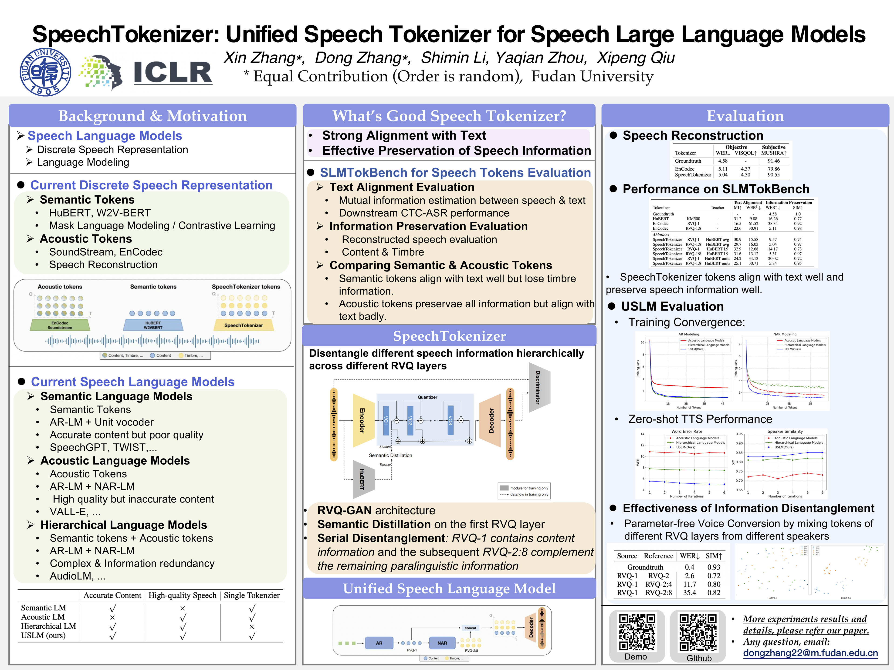

# SpeechTokenizer

基本信息

- 标题: "SpeechTokenizer: Unified Speech Tokenizer for Speech Large Language Models"
- 作者:
  - 01 Xin Zhang,
  - 02 Dong Zhang,
  - 03 Shimin Li,
  - 04 Yaqian Zhou,
  - 05 Xipeng Qiu
- 链接:
  - [ArXiv](https://arxiv.org/abs/2308.16692)
  - [Publication](https://openreview.net/forum?id=AF9Q8Vip84)
  - [Github](https://github.com/ZhangXInFD/SpeechTokenizer/)
  - [Demo](https://0nutation.github.io/SpeechTokenizer.github.io/)
- 文件:
  - [ArXiv](_PDF/2308.16692v2__SpeechTokenizer__Unified_Speech_Tokenizer_for_Speech_Language_Models.pdf)
  - [Publication](_PDF/2308.16692p0__SpeechTokenizer__ICLR2024.pdf)

## Abstract: 摘要

原文

Current speech large language models build upon discrete speech representations, which can be categorized into semantic tokens and acoustic tokens.
However, existing speech tokens are not specifically designed for speech language modeling.
To assess the suitability of speech tokens for building speech language models, we established the first benchmark, ***SLMTokBench***.
Our results indicate that neither semantic nor acoustic tokens are ideal for this purpose.
Therefore, we propose ***SpeechTokenizer***, a unified speech tokenizer for speech large language models.
***SpeechTokenizer*** adopts the Encoder-Decoder architecture with residual vector quantization (RVQ).
Unifying semantic and acoustic tokens, ***SpeechTokenizer*** disentangles different aspects of speech information hierarchically across different RVQ layers.
Furthermore, We construct a ***Unified Speech Language Model (USLM)*** leveraging ***SpeechTokenizer***.
Experiments show that ***SpeechTokenizer*** performs comparably to EnCodec in speech reconstruction and demonstrates strong performance on the ***SLMTokBench*** benchmark.
Also, ***USLM*** outperforms VALL-E in zero-shot Text-to-Speech tasks.

 

现有的语音大语言模型建立在离散的语音表示之上, 语音表示可以分类为语义 Token 和声学 Token.
然而, 现有的语音 Token 并没有专为语音语言建模设计.

为了评估语音 Token 适合构建语音语言模型的程度, 我们建立了首个基准, ***SLMTokBench***.
我们的结果表明语义 Token 和声学 Token 用于构建语音语言模型时都不够理想.

因此, 我们提出 ***SpeechTokenizer***, 一个统一的语音 Tokenizer 用于语音大语言模型.
***SpeechTokenizer*** 采用 Encoder-Decoder 架构与残差向量量化 (RVQ) 结合, 统一语义和声学 Token, 并在不同 RVQ 层上解耦层次化解耦语音信息的不同方面.

我们还利用 ***SpeechTokenizer*** 构造了一个 ***统一语音语言模型 (Unified Speech Language Model, USLM)***.

实验表明 ***SpeechTokenizer*** 在语音重建方面与 EnCodec 相当, 并且在 ***SLMTokBench*** 基准上表现出强大的性能.
此外, ***USLM*** 超过 VALL-E 在零样本文本到语音任务中的表现.

## 1·Introduction: 引言

## 2·Related Works: 相关工作

## 3·Methodology: 方法

## 4·Experiments: 实验

## 5·Results: 结果

## 6·Conclusions: 结论