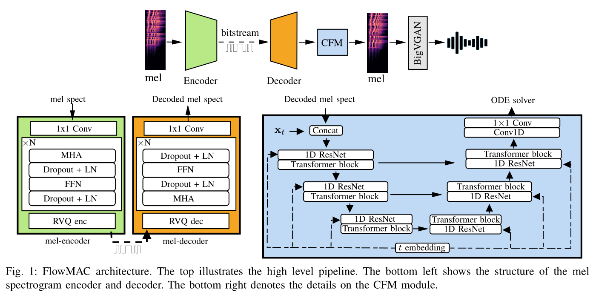

# FlowMAC

基本信息

- 标题: "FlowMAC: Conditional Flow Matching for Audio Coding at Low Bit Rates"
- 作者:
  - 01 Nicola Pia
  - 02 Martin Strauss
  - 03 Markus Multrus
  - 04 Bernd Edler
- 链接:
  - [ArXiv](https://arxiv.org/abs/2409.17635)
  - [Publication] Submitted to ICASSP 2025
  - [Github]
  - [Demo]
- 文件:
  - [ArXiv](_PDF/2409.17635v1__FlowMAC__Conditional_Flow_Matching_for_Audio_Coding_at_Low_Bit_Rates.pdf)
  - [Publication] #TODO

## Abstract: 摘要

展开原文

This paper introduces ***FlowMAC***, a novel neural audio codec for high-quality general audio compression at low bit rates based on conditional flow matching (CFM).
***FlowMAC*** jointly learns a mel spectrogram encoder, quantizer and decoder.
At inference time the decoder integrates a continuous normalizing flow via an ODE solver to generate a high-quality mel spectrogram.
This is the first time that a CFM-based approach is applied to general audio coding, enabling a scalable, simple and memory efficient training.
Our subjective evaluations show that ***FlowMAC*** at 3 kbps achieves similar quality as state-of-the-art GAN-based and DDPM-based neural audio codecs at double the bit rate.
Moreover, ***FlowMAC*** offers a tunable inference pipeline, which permits to trade off complexity and quality.
This enables real-time coding on CPU, while maintaining high perceptual quality.

 

本文介绍 ***FlowMAC***, 一种新式神经音频编解码器, 基于条件流匹配 (Conditional Flow Matching, CFM) 在低比特率下实现高质量的通用音频压缩.
***FlowMAC*** 联合学习梅尔频谱编码器, 量化器和解码器.
在推理时, 解码器通过 ODE 求解器整合连续标准化流以生成高质量的梅尔频谱.
这是首次将基于条件流匹配的方法应用于通用音频编码, 实现可扩展, 简单且内存高效的训练.
我们的主观评估展示了 ***FlowMAC*** 在 3 kbps 时获得和当前最佳的基于 GAN 和 DDPM 的神经音频编解码器在双倍比特率下的相似质量.
此外, ***FlowMAC*** 提供了一个可调的推理管道, 提供复杂度和质量之间的权衡.
这能够在保持高感知质量的同时, 在 CPU 上实现实时编码.

## 1·Introduction: 引言

展开原文

In the modern digital world, audio codecs are used on a day-to-day basis, so every technological advancement can have a large impact.
In recent years, deep neural networks (DNNs) revolutionized the field of audio compression.
Early approaches~\cite{firstnn_coding,knet_coding,zhen2020efficientscalableneuralresidual} control the compression at via entropy-based losses and ensure good quality via reconstruction losses.
With the advent of deep generative models the quality of neural codecs at bit rates lower than 12 kbps greatly improved.

While for speech coding many different approaches were proven to be successful~\cite{wavenet_coding,lpcnet_coding,ssmgan,cascade_coding}, the general audio codec [SoundStream [8]](../SpeechCodec/2021.07.07_SoundStream.md) established a new paradigm of training a residual [VQ-VAE [9]](../../Modules/VQ/2017.11.02_VQ-VAE.md) via an additional GAN loss end-to-end (e2e).
For this, a DNN-encoder extracts a learned latent, a residual VQ generates the bit stream, and a DNN-decoder synthesizes the audio.
All the modules are jointly learned via a combination of multiple spectral reconstruction, VQ-VAE codebook and commitment and adversarial losses.

Various improvements on the design of [SoundStream](2021.07.07_SoundStream.md) were proposed afterwards.
[EnCodec [10]](../SpeechCodec/2022.10.24_EnCodec.md) used recurrent networks and an improved compression capability via entropy coding based on language models in the quantizer.
The [Descript-Audio-Codec (DAC) [11]](2023.06.11_Descript-Audio-Codec.md) achieved high quality extending on the model size, using innovative audio-specific activations~\cite{snake}, and scaling up the discriminator architecture.

The e2e VQ-GAN approach offers a great flexibility in the design and complexity of the codec~\cite{tfnet, [NESC [14]](NESC.md); [FunCodec [15]](../SpeechCodec/2023.09.14_FunCodec.md)}.
However, it often entails a complicated and unstable training pipeline, which sometimes fails to meet quality expectations for challenging signal types, particularly at bit rates lower than 6 kbps.

**Denoising Diffusion Probabilistic Models (DDPMs)** were proposed recently for speech ~\cite{ladiffcodec} and general audio ([MBD [17]](MBD.md); [SemantiCodec [18]](../SpeechCodec/2024.04.30_SemantiCodec.md)).
While [SemantiCodec [18]](../SpeechCodec/2024.04.30_SemantiCodec.md) targets semantic coding at ultra low bit rates, [MultiBandDiffusion (MBD) [17]](MBD.md) is a decoder model that enables high-quality synthesis of the EnCodec latent at 1.5, 3 and 6 kbps for general audio.
This model uses a time-domain subband-based decoding scheme and achieves state-of-the-art quality for music.
The high complexity of this model makes it hard to use in embedded devices and its dependency on a pre-trained bit stream might limit its compression capabilities.

VQ-GANs entail a highly involved training pipeline and the existing DDPMs are computationally heavy models.
This demonstrates the need for a solution that is easy to train, while offering high quality performance at acceptable complexity.

Recently, a new paradigm to train continuous normalizing flows (CNFs) called [conditional flow matching (CFM) [19]](../Diffusion/2022.10.06_Flow_Matching.md) emerged and demonstrated state-of-the-art quality for both image ([StableDiffusion3 [20]](../Diffusion/2024.03.05_StableDiffusion3.md)) and audio generation ([Matcha-TTS [21]](../Diffusion/2023.09.06_Matcha-TTS.md); [P-Flow [22]](../Flow/P-Flow.md); [VoiceBox [23]](../SpeechLM/2023.06.23_VoiceBox.md)).
This approach offers a simple training pipeline at much lower inference and training costs compared to DDPMs.

In this work, we present the ***Flow Matching Audio Codec (FlowMAC)***, a new audio compression model for low bit rate coding of general audio at $24$ kHz audio based on CFM.
Our proposed approach learns a mel spectrogram encoder, residual VQ, and decoder via a combination of a simple reconstruction loss and the CFM objective.
The CFM-based decoder generates realistic mel spectrograms from the discrete latent, which is then converted to waveform domain via an efficient version of [BigVGAN [24]](../TTS3_Vocoder/2022.06.09_BigVGAN.md).
The model design is simple and the training pipeline is stable and efficient.

Our contributions can be summarized as follows:
- We introduce ***FlowMAC***, a CFM-based mel spectrogram codec offering a simple and efficient training pipeline.
- Our listening test results demonstrate that ***FlowMAC*** achieves state-of-the-art quality at 3 kbps matching GAN-based and DDPM-based solutions at double the bit rate.
- We propose an efficient version of ***FlowMAC*** capable of coding at high quality and faster than real time on a CPU.

 

## 2·Flow Matching Fundamentals: 流匹配基础

展开原文

For neural audio coding, we learn an encoder-decoder architecture that compresses input mel spectrograms into a quantized bit stream.
We then use the information from this bit stream to condition a CFM-based mel spectrogram decoder for high-quality mel spectrogram generation.
To this end, we consider the distribution $q$ of mel spectrograms of the input audio signals and we learn a time-dependent vector field $\mathbf{u}_t$, whose flow transforms a Gaussian prior $p_0$ into $q$.

[Flow Matching [19]](../Diffusion/2022.10.06_Flow_Matching.md) describes a method to fit a time-dependent probability density path $p_t:[0,1] \times \mathbb{R}^d \rightarrow \mathbb{R}^{\ge 0}$ between a simple sampling distribution $p_0(\mathbf{x})$ and the target data distribution $q(\mathbf{x})$, where $t \in [0,1]$ and $\mathbf{x} \in \mathbb{R}^d$.
More precisely it defines a framework to train a CNF $\phi_t$ via learning its associated vector field $\mathbf{u}_t$ directly.

Following Section 4.1 in [Flow Matching [19]](../Diffusion/2022.10.06_Flow_Matching.md) we define

\[
p_t(\mathbf{x}|\mathbf{x}_1) = \mathcal{N}\left(\mathbf{x}; \mu_t(\mathbf{x}_1), \sigma_t(\mathbf{x}_1)^2\mathbf{I}\right),
\]

where $\mathbf{x}_1\sim q(\mathbf{x}_1)$ sampled from the train set, $\mu_t(x) = t \mathbf{x}_1$, and $\sigma_t = 1 - (1 - \sigma_\text{min})t$ with $\sigma_\text{min} \ll 1$.
This defines a Gaussian path where $p_0$ is the standard Gaussian and $p_1$ is a Gaussian centered at $\mathbf{x}_1$ with small variance.
Theorem 3 in [Flow Matching [19]](../Diffusion/2022.10.06_Flow_Matching.md) shows that this probability path is generated by the Optimal Transport Conditional Vector Field

\[
\mathbf{u}_t(\mathbf{x}|\mathbf{x}_1) = \frac{\mathbf{x}_1 - (1 - \sigma_\text{min})\mathbf{x}}{1 - (1 - \sigma_\text{min})t}.
\]

This yields the conditional flow matching objective

\[
\begin{aligned}
	\mathcal{L}_{\textup{CFM}}(\theta)
  &= \mathbb{E}_{t,q(\mathbf{x}_1),p_t(\mathbf{x}|\mathbf{x}_1)} \|\mathbf{v}_t(\mathbf{x};\theta) - \mathbf{u}_t(\mathbf{x}|\mathbf{x}_1)\|^2\\
	& = \mathbb{E}_{t,q(\mathbf{x}_1),p_0(\mathbf{x}_0)} \|\mathbf{v}_t(\mathbf{x};\theta) - \left(\mathbf{x}_1 - (1 - \sigma_\text{min})\mathbf{x}_0\right)\|^2
\end{aligned}
\]

where $\mathbf{v}_t(\mathbf{x}, \theta)$ denotes a DNN parametrized by $\theta$, the time step $t \sim \mathbb{U}[0,1]$ is sampled from a uniform distribution.

For our system the neural network $\mathbf{v}_t(\mathbf{x};\theta)$ is additionally conditioned on the decoded bit stream $c$ obtained from a learned mel spectrogram compression network.
During inference, $\mathbf{v}_t$ takes $c$ as input and a Gaussian noise sample $\mathbf{x}_0$ and outputs the derivatives of the corresponding CNF.
This flow is then integrated using an ODE solver, e.g. the Euler method.

 

## 3·Methodology: 方法

展开原文

The architecture of ***FlowMAC*** is illustrated in Fig.01.

 

***FlowMAC*** 的架构如下图所示.

### 3.1.Mel Encoder-Decoder: 梅尔频谱编码器-解码器

展开原文

The $128$ mel spectrogram bands are calculated on the input $24$ kHz audio with hop size $512$ and window of $2048$ samples, hence, yielding 47 frames per second.
Mean and standard deviations are calculated offline for the whole dataset and used as fixed normalization factors for the input.
The normalized mel spectrogram passes through a 1$\times$1 convolutional layer with 128 channels to extract features for the encoder.
The encoder is a sequence of multi-head attention (MHA), dropout, layer normalization, feed-forward and dropout layers, producing a latent vector to be quantized.
The network block is repeated $N=6$ times.

The decoder architecture follows the same structure as the encoder.
Finally, a 1$\times$1 convolutional layer serves as a final projection layer to generate the decoded quantized mel spectrogram.
The sum of MSE and MAE losses ($\mathcal{L}_{prior}$) serves as reconstruction loss for the input mel spectrogram.

For quantization we use a learned residual VQ based on [VQ-VAE [9]](../../Modules/VQ/2017.11.02_VQ-VAE.md), with projections to small dimensional spaces similar to [DAC [11]](2023.06.11_Descript-Audio-Codec.md).
***FlowMAC*** uses a codebook size of 256 and 8 quantizer stages and a downsampling dimension 16 for the 128-dimensional latent.
Using 8 bits per level with 47 frames per second results in a rounded total of 3 kbps.

 

对输入的 24 kHz 的音频以 512 样本的帧移, 2048 样本的窗口大小来计算出 128 个梅尔频谱图频带, 即每秒 47 帧.
即一秒 24000 个采样点, 每帧有 512 个采样点不同, 那么得到帧数 24000/512 ≈ 47.
均值和标准差则是在整个数据集上离线计算, 并作为固定的归一化因子作用于输入.
归一化的梅尔频谱通过 128 个通道的卷积核为 $1\times 1$ 的卷积层来提取特征, 作为编码器的输入.
编码器是多头注意力, 随机失活, 层归一化, 前馈网络, 随机失活层的序列, 产生一个隐向量用于后续量化.
网络块重复 $N=6$ 次.

解码器架构遵循编码器的架构.
最后, 一个 $1\times 1$ 卷积层作为最终的映射层生成解码后的量化梅尔频谱图.
MSE 和 MAE 损失的和作为输入的梅尔频谱的重构损失.

对于量化, 我们使用基于 VQ-VAE 的学习好的残差矢量量化, 和类似 [DAC [11]](2023.06.11_Descript-Audio-Codec.md) 的投影层, 将隐向量投影到小维度空间.
***FlowMAC*** 对 128 维的隐向量使用 256 大小的码本和 8 个量化阶段, 16 维度的下采样维度.
使用 8 比特每级, 47 帧每秒的码率, 得到总码率 3 kbps.

### 3.2.CFM Module: 条件流匹配模块

展开原文

The CFM architecture follows [Matcha-TTS [21]](../Diffusion/2023.09.06_Matcha-TTS.md) and uses a U-Net with residual 1D convolutional blocks and transformer blocks with snake beta activations ([BigVGAN [24]](../TTS3_Vocoder/2022.06.09_BigVGAN.md)).
Finally, the output of the U-Net passes through a 1D Block consisting of a 1D convolution, group normalization and a [Mish activation [25]](../../Modules/Activation/2019.08.23_Mish.md), after which a 1$\times$1 convolutional layer creates the final output.
The corresponding time-step embeddings use a RoPE-Embedding as in [Grad-TTS [26]](../TTS2_Acoustic/2021.05.13_Grad-TTS.md).

The CFM decoder is conditioned on the decoded quantized mel spectrogram via concatenation to the input Gaussian noise to estimate the corresponding vector field.
The optimization criteria $\mathcal{L}_{\text{CFM}}$ is defined in Section 2.

Overall, the training objective for the whole system is then

\[
	\mathcal{L} = \lambda_p \mathcal{L}_{prior} + \lambda_v\mathcal{L}_{q} + \mathcal{L}_{\text{CFM}},
\]

where $\lambda_p=0.01$ and $\lambda_v=0.25$ denote weighting factors for the prior and VQ-VAE loss ($\mathcal{L}_{q}$).
To improve the CFM training, we sample the timestep $t$ according to a logit normal distribution ([StableDiffusion3 [20]](../Diffusion/2024.03.05_StableDiffusion3.md)) for each mini-batch.
In addition, we train our model with a [Classifier-Free Guidance (CFG) [27]](../Diffusion/2022.07.26_Classifier-Free_Guidance.md) technique, where the decoded mel spectrogram condition is set to zero with a probability of $p_g=0.2$, which improves signal quality.

 

条件流匹配架构遵循 [Matcha-TTS [21]](../Diffusion/2023.09.06_Matcha-TTS.md), 使用残差 1D 卷积块和 Snake Beta 激活的 Transformer 块 ([BigVGAN [24]](../TTS3_Vocoder/2022.06.09_BigVGAN.md)).
最后, U-Net 的输出经过由一维卷积, 组归一化和 [Mish [25]](../../Modules/Activation/2019.08.23_Mish.md) 激活函数组成的一维模块, 然后通过 $1\times 1$ 卷积层生成最终输出.
对应的时间步嵌入则和 [Grad-TTS [26]](../TTS2_Acoustic/2021.05.13_Grad-TTS.md) 中相同使用旋转嵌入.

条件流匹配解码器以解码后的量化梅尔频谱图作为条件, 与输入的高斯噪声向量通过拼接的方式来估计对应的向量场.
优化评价指标 $\mathcal{L}_{\text{CFM}}$ 定义在第 2 节.

总体而言, 整个系统的训练目标为

\[
	\mathcal{L} = \lambda_p \mathcal{L}_{prior} + \lambda_v\mathcal{L}_{q} + \mathcal{L}_{\text{CFM}},
\]

其中 $\lambda_p = 0.01$ 和 $\lambda_v = 0.25$ 分别为先验损失和 VQ-VAE 损失的权重因子.
为了提升条件流匹配的训练, 我们为每个小批量根据对数正态分布 ([StableDiffusion3 [20]](../Diffusion/2024.03.05_StableDiffusion3.md)) 采样时间步 $t$.
此外, 我们使用 [Classifier-Free Guidance (CFG) [27]](../Diffusion/2022.07.26_Classifier-Free_Guidance.md) 技术训练模型, 其中解码后的梅尔频谱图条件以概率为 $p_g=0.2$ 设为零, 这可以提升信号质量.

### 3.3.Mel-to-Audio Module: 梅尔频谱转音频模块

展开原文

As mel-to-audio module, we re-train a smaller version of [BigVGAN [24]](../TTS3_Vocoder/2022.06.09_BigVGAN.md) on our data: We adapt the mel spectrogram calculation to fit the setting described in Section 3.1.
Then, we decrease the decoder initial channels to 1024 and use an additional upsampling layer.
This yields a smaller architecture than the original BigVGAN.

Notice that the dependence of our system on this mel-to-audio module for the final audio synthesis leads to a highest achievable quality dictated by BigVGAN's performance.
This is saturated by our mel spectrogram codec and our subjective evaluations confirm this phenomenon.

 

对于梅尔频谱转音频模块, 我们在我们的数据上重新训练了一个较小的 [BigVGAN [24]](../TTS3_Vocoder/2022.06.09_BigVGAN.md) 版本: 我们对梅尔频谱图计算方式进行了适配, 以符合第 3.1 节中描述的设置.
然后, 我们减少解码器的初始通道数为 1024, 并使用额外的上采样层.
这就产生了一个比原始 BigVGAN 架构更小的架构.

注意到, 我们的系统依赖这个梅尔频谱转音频模块来产生最终的音频合成, 这就决定了能够达到的最高质量取决于 BigVGAN 的性能.
这一性能受到我们梅尔频谱编解码器的限制, 并且我们的主观评价也证实了这一现象.

### 3.4.FlowMAC Inference: 推理

展开原文

Thanks to the residual vector quantizer we achieve bit rate scalability via dropping out codebook levels at inference time.
Moreover, the iterative nature of the Euler method used for inference enables some freedom on the number of function evaluations (NFE) for the CFM decoder.
***FlowMAC*** works at 1.5 and 3 kbps, uses 32 steps for the ODE solver and factor 1 for the CFG, hence, leading to a total of 64 NFE.

Early experimentation showed that the quality of the mel coder subsystem quickly saturates.
To test this, we introduce ***FlowMAC-CQ***, a separately trained model at 6 kbps.
For this we use the same hyperparameters and NFE as for ***FlowMAC***.
Finally, we test the quality-complexity trade-off via using a single step for the Euler method and no CFG, hence, obtaining ***FlowMAC-LC*** and using 1 NFE.

Informal listening showed that using more than 64 NFE did not bring significant improvement in quality.
Careful attention needs to be placed on the choice of the CFG factor: values smaller than 0.2 usually lead to noisy signals (except for the single-step Euler method) and values bigger that 2 overestimate the energy and introduce unwanted artifacts.

 

得益于残差矢量量化器, 我们可以在推理时丢弃码本层级, 实现比特率可扩展性.
此外, 用于推理的欧拉方法的迭代性质使得 CFM 解码器中对于函数评估数 (Number of Function Evaluations, NFE) 有一定的自由度.
***FlowMAC*** 在 1.5 和 3 kbps 之间工作, ODE 求解器使用 32 步, 而 CFG 因子为 1, 因此总共有 64 的 NFE.

早期的实验表明, 梅尔频谱编解码器子系统的质量很快就会饱和.
为了验证这一点, 我们引入了 ***FlowMAC-CQ***, 它是单独训练的模型, 工作在 6 kbps.
该模型使用与 ***FlowMAC*** 相同的超参数和 NFE.
最后, 我们通过使用单步欧拉方法和不使用 CFG, 获得 ***FlowMAC-LC*** 并使用 1 NFE, 来测试质量-复杂度权衡.

非正式的听觉测试表明, 在超过 64 NFE 的情况下, 并没有显著的质量提升.
需要注意的是, CFG 因子的选择: 值小于 0.2 往往会导致噪声信号 (除非使用单步欧拉方法), 值大于 2 可能会过度估计能量并引入不需要的伪影.

## 4·Experiments: 实验

### 4.1.Setup: 实验设置

展开原文

We train both ***FlowMAC*** and BigVGAN on a combination of the full [LibriTTS [28]](../../Datasets/2019.04.05_LibriTTS.md) clean and dev train subsets as in [BigVGAN [24]](../TTS3_Vocoder/2022.06.09_BigVGAN.md) and an internal music database consisting of $640$ hours of high-quality music of various genres.
The sampling rate for all data points was $24$ kHz.

BigVGAN was trained following the official implementation [Github [29]](https://github.com/NVIDIA/BigVGAN) for 1M iterations on a single A100 GPU.
***FlowMAC*** was trained with the Adam optimizer with learning rate $10^{-4}$, a segment length of 2 s and batch size of 128 for 700k iterations on a single RTX3080.

 

### 4.2.Subjective Evaluations: 主观评价

展开原文

To evaluate the proposed system, we perform a [P.808 DCR [30]](../../Evaluations/P.808_DCR.md) listening test with naive listeners and a [MUSHRA [31]](../../Evaluations/MUSHRA.md) listening test with expert listeners.
To this end, we design a test set of 12 items carefully selected to represent typical challenging signals for audio codecs.
The test set includes 4 clean and noisy speech samples (male, female, child and speech over music, including fast and emotional speech with varying prosody), 5 music items of various genres (including rock, pop, classical and electronic), and 3 out-of-distribution items (castanets, harpsichord and glockenspiel).

For the P.808 DCR test we compare ***FlowMAC*** to state-of-the-art DNN-based audio codecs and a well-known legacy codec.
We select the GAN-based audio codecs [DAC [11]](2023.06.11_Descript-Audio-Codec.md) and [EnCodec [10]](../SpeechCodec/2022.10.24_EnCodec.md), and the DDPM-baseline [MBD [17]](MBD.md).
We use the official implementations and pre-trained weights for all those models ([MusicGen [32]](../SpeechLM/2023.06.08_MusicGen.md) [Github](https://github.com/facebookresearch/audiocraft/); [DAC Github [33]](https://github.com/descriptinc/descript-audio-codec)).
We recognize that the training sets vary strongly between the conditions.
Still, we consider it useful to compare our system with well-established and robust codecs.

As a measure of the highest achievable quality with ***FlowMAC*** we include the copy-synthesis of the signals via BigVGAN.
As a benchmark legacy-condition we use an internal implementation of the [MPEG-D USAC Standard [34]](../../Evaluations/USAC.md).
This works on full-band audio, but we downsample the decoded signal to 24 kHz to more closely measure the differences in the codecs at this sample rate.
This puts USAC at a disadvantage and may result in lower scores for it.
As a lower anchor a low-pass filter with cutoff frequency of 3.5 kHz was used.

The P.808 DCR offers a good overall idea of the average quality of the different conditions in the test.
The MUSHRA test provides finer comparisons between a subset of the most promising conditions.
Therefore, BigVGAN, ***FlowMAC*** at 3 kbps, [DAC](2023.06.11_Descript-Audio-Codec.md) at 6 kbps, MBD at 6 kbps and USAC at 8 kbps are selected for the MUSHRA test.

 

### 4.3.Complexity: 复杂度

展开原文

We measure the complexity of the DNN-based codec systems included in the MUSHRA listening test and ***FlowMAC-LC*** in terms of numbers of parameters and real-time factor (RTF).
Table~\ref{tab:cx} summarizes the results.
The only condition able to generate the audio faster than real time is ***FlowMAC-LC***.
We do not report the complexity figures for USAC, but we notice it is significantly faster than the DNN-based codecs.
The implementation of the DNN codecs are not optimized for synthesis speed.
We notice that none of the codecs is able to operate at low algorithmic delay, hence faster than real time generation would not enable the application of these codecs in telecommunications.

 

## 5·Results: 结果

展开原文

Figure~\ref{fig:p808} illustrates the results of the P.808 DCR listening test with 46 listeners.
The results from the naive listeners confirm that both ***FlowMAC*** and ***FlowMAC-LC*** are the best models at 3 kbps, being on average on par with EnCodec and MBD at 6 kbps.
***FlowMAC*** at 1.5 kbps shows a significant quality drop, while no significant quality improvement is achieved by the 6 kbps version ***FlowMAC-CQ***.
As expected, the copy-synthesis with BigVGAN offers the highest achievable quality for our system.
***FlowMAC-LC***'s average rating are lower than the high-complexity version. Still, the test confirms that it is a competitive baseline.
For naive listeners the higher frequency resolution of [DAC](2023.06.11_Descript-Audio-Codec.md) 44.1 kHz at 8 kbps offers does not offer an advantage over the 24 kHz model.

Overall we notice that the all DNN conditions achieve comparable quality with the legacy USAC condition at similar bit rates, the only exception being ***FlowMAC*** at 3 kbps.

The results of the MUSHRA test with 14 listeners are illustrated in Figure~\ref{fig:mushra}.
While USAC 8 kbps has a quality advantage on average over the other codecs here, this test demonstrates that ***FlowMAC*** at 3 kbps performs similar to [DAC](2023.06.11_Descript-Audio-Codec.md) 6 kbps and both conditions outperform MBD 6 kbps.
We notice that the performance of the DNN-based codecs highly varies for different items in the test set.
In particular, ***FlowMAC*** performs poorly on the out-of-distribution test items, while its performance is on average comparable with [DAC](2023.06.11_Descript-Audio-Codec.md) for speech and music.
The copy-synthesis from BigVGAN performs best average and offers an measurement of the highest quality achievable with ***FlowMAC***.
We notice that these results more clearly highlight fine difference between the codecs, but are overall in accordance with our P.808 test results.

 

## 6·Conclusions: 结论

展开原文

This work proposed ***FlowMAC***, a low bit rate neural audio codec for high-quality coding at 3 kbps.
We present a novel approach for training and synthesis for a neural audio codec based on CFM.
Our subjective evaluations demonstrate that ***FlowMAC*** outperforms strong baselines while offering manageable complexity.

 

本项工作提出了 ***FlowMAC***, 一种低比特率神经音频编解码器, 用于在 3 kbps 下进行高质量编码.
我们提出了一种基于条件流匹配 (CFM) 的神经音频编解码器训练和合成方法.
我们的主观评价表明, ***FlowMAC*** 优于强基线, 同时保持可管理的复杂度.
