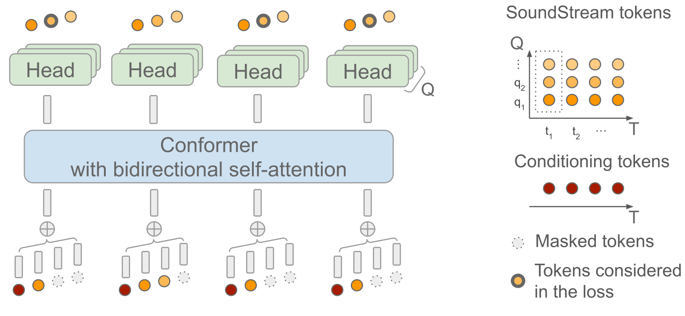

# SoundStorm

基本信息

- 标题: "SoundStorm: Efficient Parallel Audio Generation"
- 作者:
  - 01 Zalan Borsos
  - 02 Matt Sharifi
  - 03 Damien Vincent
  - 04 Eugene Kharitonov
  - 05 Neil Zeghidour
  - 06 Marco Tagliasacchi
- 链接:
  - [ArXiv](https://arxiv.org/abs/2305.09636)
  - [Publication](https://openreview.net/forum?id=KknWbD5j95) ICLR2024Reject
  - [Github]
  - [Demo](https://google-research.github.io/seanet/soundstorm/examples/)
- 文件:
  - [ArXiv](_PDF/2305.09636v1__SoundStorm__Efficient_Parallel_Audio_Generation.pdf)
  - [Publication] #TODO

## Abstract·摘要

原文

We present ***SoundStorm***, a model for efficient, non-autoregressive audio generation.
***SoundStorm*** receives as input the semantic tokens of [AudioLM (2022)](2022.09.07_AudioLM.md) and relies on bidirectional attention and confidence-based parallel decoding to generate the tokens of a neural audio codec.
Compared to the autoregressive generation approach of [AudioLM (2022)](2022.09.07_AudioLM.md), our model produces audio of the same quality and with higher consistency in voice and acoustic conditions, while being two orders of magnitude faster.
***SoundStorm*** generates 30 seconds of audio in 0.5 seconds on a TPU-v4.
We demonstrate the ability of our model to scale audio generation to longer sequences by synthesizing high-quality, natural dialogue segments, given a transcript annotated with speaker turns and a short prompt with the speakers’ voices.
Audio samples are available at https://google-research.github.io/seanet/soundstorm/examples/

 

我们提出了 ***SoundStorm***, 一个用于高效非自回归音频生成的模型.
***SoundStorm*** 以 AudioLM 的语义 token 作为输入, 并依赖于双向注意力和基于置信度的并行解码来生成神经音频编解码器的 token.
与 AudioLM 的自回归生成方法相比, ***SoundStorm*** 能够生成相同质量的音频, 且在声音和声学条件下具有更高的一致性的同时, 速度快两个数量级.
我们通过合成高质量, 自然对话片段来展示模型扩展音频生成更长序列的能力.
这些对话片段需要给定一个带有说话者转录脚本和一个带有说话人声音的简短提示.

## 1·Introduction·引言

Modeling discrete representations of audio produced by neural codecs ([SoundStream (2021)](../SpeechCodec/2021.07.07_SoundStream.md); [EnCodec (2022)](../SpeechCodec/2022.10.24_EnCodec.md)) makes the task of audio generation amenable to the powerful Transformer-based sequence-to-sequence modeling approaches ([Transformer (2017)](../_Transformer/2017.06.12_Transformer.md)).
Casting unconditional and conditional audio generation as sequence-to-sequence modeling has unlocked rapid progress in speech continuation ([AudioLM (2022)](2022.09.07_AudioLM.md)), text-to-speech ([VALL-E (2023)](2023.01.05_VALL-E.md); [SPEAR-TTS (2023)](2023.02.07_SPEAR-TTS.md)), and general audio and music generation ([AudioGen (2022)](2022.09.30_AudioGen.md); [MusicLM (2023)](2023.01.26_MusicLM.md)).

建模由神经编解码器生成的音频离散表示使得音频生成任务可以采用强大的基于 Transformer 序列到序列建模方法.
将无条件和有条件音频生成视为序列到序列建模已经解锁了在语音延续, 文本转语音, 一般音频和音乐生成方面的快速发展.

For generating high-quality audio by modeling the tokens of a neural codec, the rate of the discrete representation must be increased, resulting in either an exponential growth in codebook size or in long token sequences.
While the exponential growth of the codebook is prohibitive due to memory limitations, in turn, long token sequences also present computational challenges for autoregressive models.
In particular, attention-based models, which are the main focus of this work, will incur quadratic runtime complexity with respect to the sequence length for calculating the self-attention.
Thus, addressing the trade-off between perceptual quality and runtime is one of the core challenges for audio generation.

为了通过建模神经编解码器的 token 来生成高质量音频, 离散表示的比率必须增加, 导致代码本尺寸或长 token 序列呈指数增长.
虽然由于内存限制, codebook 的指数增长是不可行的, 但反过来, 长 token 序列也为自回归模型带来了计算挑战.
特别是基于注意力模型, 和用于计算自注意力的序列长度呈二次时间复杂性.
因此, 解决感知质量和运行时间的权衡是音频生成的一个核心挑战.

The problem of generating long audio token sequences can be addressed by at least three orthogonal approaches or a combination thereof:
1) Efficient attention mechanisms ([Reformer (2020)](); [Performers (2021)](); [Nyströmformer (2021)](); [Perceiver AR (2022)]()),
2) Non-autoregressive, parallel decoding schemes ([NAT (2017)](); [Mask-Predict (2019)](); [MaskGIT (2022)](../_Transformer/2022.02.08_MaskGIT.md)),
3) Custom architectures adapted to the special structure of the tokens produced by neural audio codecs ([AudioGen (2022)](2022.09.30_AudioGen.md); [VALL-E (2023)](2023.01.05_VALL-E.md); [RQ-Transformer (2022)]()).

However, in the context of modeling the token sequence of neural audio codecs, either unconditionally or based on weak conditioning such as text, the efficient generation of long, high-quality audio segments remains an open problem.

生成长音频 token 序列问题可以通过至少三种正交方法或组合来解决:
1) 高效注意力机制;
2) 非自回归并行解码方案;
3) 适用于由神经音频编解码器生成的 token 特殊结构的自定义网络结构.

然而在神经音频编解码器的 token 序列建模的背景下, 无论是在无条件还是弱条件 (如文本) 下, 高效生成长且高质量的音频片段仍是一个开放问题.

We believe that it is the special structure of the audio token sequence that holds the most promise for future advances in long-sequence audio modeling.
Concretely, both [SoundStream (2021)](../SpeechCodec/2021.07.07_SoundStream.md) and [EnCodec (2022)]() rely on Residual Vector Quantization (RVQ), where each compressed audio frame is quantized by a series of quantizers, with each quantizer operating on the residual of the previous one, and the number of quantizers control-ling the overall bitrate.
This induces a hierarchical token structure, where tokens from finer RVQ levels contribute less to the perceptual quality, allowing for efficient factorizations and approximations of the joint distribution of the token sequence.
Hence, the models and decoding schemes should take this special structure of the input into account for efficient training and inference.

我们认为，音频标记序列的特殊结构对于未来在长序列音频建模方面的进步最有希望。
具体来说，SoundStream（2021）和EnCodec（2022）都依赖于Residual Vector Quantization（RVQ），其中每个压缩的音频帧由一系列量化器进行量化，每个量化器在之前的量化器的残差上操作，量化器的数量控制总体比特率。
这引入了分层的标记结构，其中来自更精细RVQ级别的标记对感知质量的贡献较小，允许对标记序列的联合分布进行有效的因式分解和近似。
因此，模型和解码方案应该考虑到输入的这种特殊结构，以便进行高效的训练和推理。

In this work, we present ***SoundStorm***, a method for efficient and high-quality audio generation.
***SoundStorm*** addresses the problem of generating long audio token sequences by relying on:
1) an architecture adapted to the hierarchical structure of the audio tokens,
2) a parallel, non-autoregressive, confidence-based decoding scheme inspired by [MaskGIT (2022)](../_Transformer/2022.02.08_MaskGIT.md) for residual vector-quantized token sequences.

我们提出了 ***SoundStorm***, 一种用于高效高质量音频生成的方法.
***SoundStorm*** 通过以下方式解决生成长音频 token 序列问题:
1) 适用于音频 token 层次结构的架构;
2) 用于残差矢量量化 token 序列的并行非自回归, 基于置信度解码方案.

***SoundStorm*** relies on a bidirectional attention-based [Conformer (2020)]() that is trained to predict masked audio tokens produced by [SoundStream](../SpeechCodec/2021.07.07_SoundStream.md) given a condition-ing signal such as the semantic tokens of [AudioLM (2022)](2022.09.07_AudioLM.md).
On the input side, it sums up the embeddings of the tokens corresponding to the same [SoundStream](../SpeechCodec/2021.07.07_SoundStream.md) frame, such that the internal sequence length for the self-attention is identical to the number of [SoundStream](../SpeechCodec/2021.07.07_SoundStream.md) frames, and independent of the number of quantizers in the RVQ.
The output embeddings are then processed by separate heads per RVQ level to predict the masked target tokens.
At inference time, given the conditioning signal, ***SoundStorm*** starts with all audio tokens masked out, and fills in the masked tokens RVQ level-by-level over several iterations, predicting multiple tokens in parallel during a single iteration within a level.
To support this inference scheme, we propose a masking scheme for training that mimics the inference procedure.

***SoundStorm*** 依赖于一个基于双向注意力的Conformer（2020）, 该 Conformer 经过训练以预测由 SoundStream 生成的掩码音频标记, 给定一个条件信号, 例如 AudioLM（2022）的语义标记.
在输入方面, 它将对应于同一 SoundStream 帧的标记的嵌入相加, 使得自注意力的内部序列长度与 SoundStream 帧的数量相同, 并且与 RVQ 中的量化器数量无关.
然后输出嵌入由每个 RVQ 级别的单独头处理以预测掩码目标标记.
在推理时间, 给定条件信号, ***SoundStorm*** 从所有音频标记都被掩码开始, 然后在几次迭代中逐级填充掩码标记, 在每个级别的一次迭代中并行预测多个标记.
为了支持这种推理方案, 我们提出了一种训练掩码方案, 该方案模仿推理过程.

We demonstrate that ***SoundStorm*** can serve as [AudioLM (2022)](2022.09.07_AudioLM.md)'s acoustic generator, replacing both [AudioLM (2022)](2022.09.07_AudioLM.md)'s stage two (coarse acoustic model) and stage three (fine acoustic model).
***SoundStorm*** produces audio two orders of magnitude faster than [AudioLM (2022)](2022.09.07_AudioLM.md)'s hierarchical autoregressive acoustic generator with matching quality and improved consistency in terms of speaker identity and acoustic conditions.
Furthermore, we show that ***SoundStorm***, coupled with the text-to-semantic modeling stage of [SPEAR-TTS (2023)](2023.02.07_SPEAR-TTS.md), can synthesize high-quality, natural dialogues, allowing one to control the spoken content(via transcripts), speaker voices (via short voice prompts)and speaker turns (via transcript annotations).
When synthesizing dialogues of 30 seconds, we measure a runtime of 2 seconds on a single [TPU-v4 (2023)]().

我们展示了 ***SoundStorm*** 可以作为 AudioLM 的声学生成器, 取代 AudioLM 的第二阶段 (粗声学模型) 和第三阶段 (细声学模型)
***SoundStorm*** 生成的音频速度比 AudioLM 的分层自回归声学生成器快两个数量级, 同时保持相同质量和提高的语音和声学条件一致性.
此外, 我们展示了 ***SoundStorm*** 与 SPEAR-TTS (2023) 的文本到语义建模阶段相结合, 可以合成高质量自然的对话, 允许通过脚本控制说话内容, 通过短语音提示控制说话者声音和通过脚本注释控制说话者轮次.
在合成 30 秒的对话时, 我们在单个 TPU-v4（2023）上测量的运行时间为 2 秒.

## 2·Related Works·相关工作

### Modeling the Tokens of Neural Audio Codecs

Unsupervised speech embeddings ([Wav2Vec2.0](../SpeechRepresentation/2020.06.20_Wav2Vec2.0.md); [HuBERT](../SpeechRepresentation/2021.06.14_HuBERT.md); [W2V-BERT](../SpeechRepresentation/2021.08.07_W2V-BERT.md)) have provided a low-framerate representation of the underlying signal which remains rich enough after discretization for language models to generate intelligible speech from a specific speaker as a sequence of tokens ([Generative Spoken Language Modeling (2021)]()).
Neural audio codecs ([SoundStream (2021)](../SpeechCodec/2021.07.07_SoundStream.md); [EnCodec (2022)](../SpeechCodec/2022.10.24_EnCodec.md)), with their ability of reconstructing high-quality audio at very low bitrates, subsequently allowed for extending discrete modeling to audio signals as diverse as multi-speaker speech and piano ([AutoLM (2022)](); [SPEAR-TTS (2023)](2023.02.07_SPEAR-TTS.md)), music ([MusicLM (2023)](2023.01.26_MusicLM.md)) or sound effects ([AudioGen (2022)](2022.09.30_AudioGen.md)).
In particular, [AudioLM (2022)](2022.09.07_AudioLM.md) introduces a hierarchical sequence-to-sequence approach where high-level semantic tokens are generated as an intermediate representation, which is then used as a conditioning signal for predicting tokens of a [SoundStream (2021)](../SpeechCodec/2021.07.07_SoundStream.md) codec.
While this hierarchical approach has demonstrated remarkable results for speech ([SPEAR-TTS (2023)](2023.02.07_SPEAR-TTS.md)) and music modeling ([MusicLM (2023)](2023.01.26_MusicLM.md); [SingSong (2023)]()), the computational cost of modeling flattened SoundStream tokens with self-attention scales quadratically with the sequence length and thus the bitrate of the neural codec, preventing these models from generating long-form audio with high quality.
***SoundStorm*** alleviates this issue by modeling the multi-level tokens of the neural codec in parallel, inducing a two-order of magnitude speed-up over autoregressive modeling and unlocking the ability to scale audio generation abilities both in quality and in sequence length.

无监督语音嵌入提供了基础信号的低帧率表示, 在离散化后仍然保留足够丰富的信息, 使得语言模型从特定说话人处以一系列 token 的形式生成可理解的语音.
神经音频编解码器, 由于它们能够在非常低比特率下重建高质量音频的能力, 允许将离散建模扩展到多说话人语音, 钢琴, 音乐或声效.
特别是 AutoLM (2022) 引入了一种层次序列到序列方法, 高级别语义 token 作为中间表示, 之后作为条件信号用于预测 SoundStream 编解码器的 token.
虽然这一层次方法已经在语音和音乐建模方面获得了显著成果, 但使用自注意力对扁平化 SoundStream token 进行建模的计算成本随着序列长度和神经编解码器的比特率呈二次增长, 从而阻止了这些模型生成高质量的长形式音频.
***SoundStorm*** 通过并行建模神经编解码器的多级别 token 来缓解这一问题, 与自回归建模相比速度提高了两个数量级, 并在质量和序列长度方面扩展音频生成能力.

### RVQ-Aware Architectures

A common design choice for modeling RVQ token sequences is to sum the embeddings corresponding to the same RVQ input embedding (frame) in order to reduce the sequence length.
Operating on such sequences, [AudioGen (2022)](2022.09.30_AudioGen.md) proposes a Transformer with $Q$ separate heads for the different RVQ levels, predicting the tokens for an RVQ frame in parallel.
While providing a significant speedup for inference, the authors found that, for text-to-audio generation, this approach has an inferior performance compared to modeling the token sequence of a neural audio codec with similar bitrate and reconstruction quality, but with a single level of quantization.

对于建模残差矢量量化 token 序列的常见设计是将对应同一个 RVQ 输入嵌入 (帧) 的嵌入相加以减少序列长度.
在处理这一序列时, AudioGen (2022) 提出了一个具有 $Q$ 个分别用于不同 RVQ 级别的独立头的 Transformer, 并并行预测 RVQ 帧的 tokens.
虽然为推理提供了显著的加速, 但作者发现对于文本到音频生成, 与具有相似比特率和重建质量但只有一级量化的神经音频编解码器的 token 序列建模相比, 这种方法性能较差.

[VALL-E (2023)](2023.01.05_VALL-E.md) instead relies on a hybrid approach, where the tokens corresponding to the first RVQ level are predicted autoregressively, and the subsequent levels are produced non-autoregressively.
The latter is achieved by a model that sums up the embeddings from the same RVQ input frame, and applies bidirectional self-attention to predict all tokens from RVQ level $q+1$ given all tokens from levels $1,\cdots,q$, the acoustic prompt, and the phoneme sequence.
During inference, tokens starting from the second level of the RVQ are produced iteratively, performing greedy decoding (choosing the most likely tokens) level-by-level.
Level-wise greedy decoding represents the baseline for our method.

VALL-E (2023) 则依赖于混合方法, 其中对应第一个 RVQ 级别的 token 是自回归预测的, 后续级别以非自回归生成.
后者通过一个模型实现, 将来自同一个 RVQ 输入帧的嵌入求和, 且应用双向自注意力在给定 $1,\cdots,q$ 级别, 声学提示和音素序列的情况下预测 RVQ $q+1$ 级别的 token.
在推理时, 从 RVQ 的第二级开始迭代式生成 token, 逐级执行贪心解码 (选择最可能的 token).
逐级贪心解码表示我们方法的基线.

Modeling sequences produced by RVQ has been also investigated in domains other than audio.
For example, the [RQ-Transformer (2022)]() also adds up the embeddings corresponding to the same RVQ input frame, but factorizes the full joint distribution efficiently with a spatial and a depth Transformer, for modeling autoregressively the RVQ frames and tokens within the frames, respectively.
While it has not been demonstrated yet, this approach, potentially coupled with parallel decoding schemes, is a promising future avenue for audio generation.

除了音频领域, RVQ 产生的序列建模也在其他领域进行了研究.
例如 RQ-Transformer (2022) 也将对应于同一 RVQ 输入帧的嵌入相加, 但通过空间和深度 Transformer 有效地分解了联合分布, 分别用于自回归建模 RVQ 帧和帧内的 token.
虽然还没有展示, 但这种方法可能与并行解码方案结合, 是音频生成的有前景的未来方向.

### Parallel Decoding

In order to improve the inference time and to allow bidirectional non-causal attention on the input sequence, parallel decoding schemes have been proposed for text ([NAT (2017)](); [Mask-Predict (2019)]()), image ([MaskGIT (2022)](../_Transformer/2022.02.08_MaskGIT.md)) and video generation ([Phenaki (2022)]()).
Of particular relevance to our work is the parallel, iterative sampling scheme of [MaskGIT (2022)](../_Transformer/2022.02.08_MaskGIT.md).
During inference time, MaskGIT starts from masked tokens, and in each round, predicts a portion of the tokens based on confidence scores.
The portion of the predicted tokens in each round is controlled by a schedule, and usually progressively increases over the iterations - once predicted, the tokens are treated as fixed.
Our proposed decoding scheme can be seen as the extension of MaskGIT’s decoding to token sequences produced by residual quantization.

为了提高推理时间以及允许在输入序列上进行双向非因果注意力, 已经有了用于文本, 图像和视频生成的并行解码方案.
和本项工作最相关的是 MaskGIT (2022) 的并行, 迭代采样方案.
在推理时, MaskGIT 从掩码标记开始, 在每一轮中, 根据置信度分数预测一部分 token.
每轮预测的部分 token 通过一个计划表控制, 通常在迭代中逐渐增加 - 一旦预测, token 被视为固定.
我们提出的解码方案可以视为 MaskGIT 的解码在残差量化生成的 token 序列的扩展.

## 3·Methodology·方法

***SoundStorm*** receives as input a sequence of discrete tokens representing the conditioning signal and produces as output a sequence of SoundStream tokens, which can be decoded back to audio waveforms.
We assume that the conditioning signal is time-aligned with the SoundStream frames or can be upsampled to the same rate.
Such a conditioning signal is, for example, the semantic token sequence used in [AudioLM (2022)](2022.09.07_AudioLM.md), [SPEAR-TTS (2023)](2023.02.07_SPEAR-TTS.md), or [MusicLM](2023.01.26_MusicLM.md), which makes our method a drop-in replacement for the acoustic generators of these models.

We leave the extension to other types of conditioning signals via cross-attention or to unconditional sampling for future work, and focus our presentation of ***SoundStorm*** as the acoustic generator within [AudioLM (2022)](2022.09.07_AudioLM.md), replacing both [AudioLM (2022)](2022.09.07_AudioLM.md)'s coarse and fine acoustic modeling stages.

### 3.1.网络架构

The architecture of the model is illustrated in Figure 1.

At the input side, we interleave the time-aligned conditioning tokens with the SoundStream tokens at the frame level, embed the resulting sequence, sum the embeddings corresponding to the same frame, including the embedding of the conditioning token, and pass the resulting continuous embeddings to a Conformer.
Consequently, the sequence length for bidirectional self-attention in the Conformer is determined by the number of SoundStream frames (typically 50 per second), and thus is independent of the number of RVQ levels $Q$, allowing one to handle audio with length on the order of minutes.
At the output side, we use $Q$ dense layers as heads to produce the target SoundStream tokens.

在输入侧, 我们将时间对齐的条件 token 和 SoundStream token 在帧级别交错, 嵌入结果序列, 对应同一帧的嵌入求和, 包括条件 token 嵌入, 并将结果连续嵌入传递给 Conformer.
因此, Conformer 中使用的双向自注意力的序列长度由 SoundStream 帧数决定, 和 RVG 级别数无关, 从而可以处理长度为分钟级的音频.
在输出侧, 我们使用 $Q$ 个稠密层作为头来产生目标 SoundStream token.

### 3.2·Masking

For designing our masking and decoding, we extend the masking and confidence-based parallel decoding scheme of [MaskGIT (2022)](../_Transformer/2022.02.08_MaskGIT.md) to token sequences produced by RVQ.
At a high level, our approach can be seen as following the strategy of [MaskGIT (2022)](../_Transformer/2022.02.08_MaskGIT.md) per RVQ level in a coarse-to-fine order.
The coarse-to-fine ordering is of particular importance, since it not only respects the conditional dependencies between levels of the RVQ hierarchy, but also exploits the conditional independence of tokens from finer levels given all tokens from coarser levels.
The tokens of finer levels are responsible for local, fine acoustic details and can thus be sampled in parallel without a loss of audio quality.

为了设计我们的掩码和解码, 我们将 MaskGIT (2022) 中的掩码和基于置信度的并行解码方案扩展到由 RVQ 生成的 token 序列.
在高级别, 我们的方法可以视为按粗到细顺序逐个 RVQ 级别遵循 MashGIT 策略.
粗到细的顺序特别重要, 因为不仅遵循了 RVQ 层次结构中各个级别之间的条件依赖性, 还利用了给定所有更粗级别 token 时来自更细级别 token 的条件无关性.
较细级别的 token 负责局部的, 精细的声学细节, 因此可以并行采样而不损失音频质量.

We design our masking scheme for training accordingly.
To enable voice prompting, we randomly sample a timestep $t\in\{1,\cdots,T\}$, where $T$ denotes the maximum sequence length, and we do not mask any tokens before this timestep.
The conditioning tokens are never masked.
Let $Y\in\{1,\cdots, C\}^{T\times Q}$ denote the SoundStream tokens, where $C$ indicates the codebook size used in each RVQ level out of the $Q$ levels.
Our masking scheme proceeds as follows:
- Sample the prompt delimiter timestep $t\sim\mathcal{U}\{0,T-1\}$;
- Sample the current RVQ level $q\sim\mathcal{U}\{1,Q\}$;
- Sample the mask $M \in \{0, 1\}^T$ according to a cosine schedule ([MaskGIT (2022)](../_Transformer/2022.02.08_MaskGIT.md)) for level $q$, i.e., sample the masking ratio $p = \cos(u)$ where $u \sim \mathcal{U}[0, \pi/2]$, and sample iid $M_i\sim \text{Bernoulli}(p)$.
- Mask the selected non-prompt tokens at the current RVQ level $q$ (mask $Y_{t',q}$ if $M_{t'}= 1$ and $t'>t$) and all non-prompt tokens at finer RVQ levels ($Y_{>t,>q}$).

我们对应地设计了我们的掩码方案.
为了能够语音提示, 我们随机采样一个时间步并不对该时间步之前的 token 进行掩盖.
条件 token 不会被掩盖.
记 SoundStream token 为 $Y\in\{1,\cdots, C\}^{T\times Q}$, $C$ 为在每个 RVQ 级别中使用的码本尺寸, 一共有 $Q$ 个级别.
我们的掩码方案如下:
- 采样提示的分隔符时间步 $t$;
- 采样当前 RVQ 级别 $q$;
- 根据余弦调度对级别 $q$ 采样掩码 $M$, 即先采样掩码率, 再按照伯努利分布采样掩码;
- 当前 RVQ 级别对非提示 token 进行掩码.

Given a masked token sequence, we train the model with cross-entropy loss with the ground-truth tokens as target, where the loss is only calculated on the masked tokens within the $q$-th RVQ level.
An example of this masking scheme is illustrated in Figure01, with $T = 4$, $Q = 3$, $t = 0$ and $q = 2$.

给定一个掩码 token 序列, 我们用和目标 token 之间的交叉熵损失函数来训练模型, 其中损失只在第 $q$ 个 RVQ 级别的掩码 token 上计算.
掩码方案的例子如图一所示.

### 3.3·Iterative Parallel Decoding

Given a conditioning signal, our decoding scheme starts with all SoundStream tokens masked out except for the ones of the prompt (if provided).
Then, it proceeds to sampling the tokens RVQ level-wise in a coarse-to-fine order, only proceeding to level $q + 1$ when all tokens for levels $1,\cdots, q$ have been sampled.
Within an RVQ level, we use the confidence-based sampling scheme of [MaskGIT (2022)](../_Transformer/2022.02.08_MaskGIT.md).
Namely, we perform multiple forward passes, and at each iteration $i$, we sample candidates for the masked positions, retaining $p_i$ of them based on confidence scores, where $p_i$ follows a cosine schedule.
Compared to [MaskGIT (2022)](../_Transformer/2022.02.08_MaskGIT.md), we use greedy decoding instead of confidence-based sampling for the last iteration within each RVQ level, which we found to improve the perceived audio quality.

给定一个条件信号, 我们的解码方案从除了提示之外的所有 SoundStream token 开始.
然后, 它逐级在粗到细顺序中采样 tokens.
在一个级别内, 我们使用基于置信度的采样方案.
具体来说, 我们执行多次前向传递, 在第 $i$ 次迭代中我们采样掩码位置的候选, 根据置信度分数保留 $p_i$ 个, $p_i$ 服从余弦调度.
和 MaskGIT 相比, 我们在每个 RVQ 级别的最后一次迭代中使用贪心解码而不是基于置信度采样, 我们发现这样能够提高感知到的音频质量.

Performing the decoding RVQ level-wise makes it possible to exploit the conditional independence assumption in finer levels, namely that multiple finer tokens can be sampled in parallel since they represent local, fine acoustic details.
This implies that we can decrease the number of forward passes significantly as we progress to finer RVQ levels during decoding.

逐级进行解码使得我们可以利用更细级别中的条件独立性假设, 即多个更细的 token 可以并行采样, 因为它们表示局部且精细的声音细节.
这意味着随着我们在解码中进行到更细 RVQ 级别时可以显著减少前向传递的次数.

## 4·Experiments·实验

### 4.1.模型训练和推理设置

### 4.2.语音清晰度, 音频质量, 声音表示和声学一致性

## 5.对话合成

## 6·Conclusions·结论

In this paper we present ***SoundStorm***, a model that can synthesize high-quality audio from discrete conditioning tokens efficiently.
When compared to the acoustic generator of [AudioLM (2022)](2022.09.07_AudioLM.md), ***SoundStorm*** is two orders of magnitude faster and achieves higher temporal consistency when generating long audio samples.
By combining a text-to-semantic token model similar to [SPEAR-TTS (2023)](2023.02.07_SPEAR-TTS.md) with ***SoundStorm***, we can scale text-to-speech synthesis to longer contexts and generate natural dialogues with multiple speaker turns, controlling both the voices of the speakers and the generated content.

本项工作提出了 ***SoundStorm***, 一个可以高效地从离散条件 token 生成高质量音频的模型.
和 AudioLM (2022) 的声学生成器相比, ***SoundStorm*** 运行速度快两个数量级, 且在生成长音频样本时获得更高的时序一致性.
通过结合类似于 SPEAR-TTS (2023) 的文本到语义 token 模型, 能够将文本转语音合成扩展到更长内容和生成具有多个说话人轮次的自然对话, 同时控制说话人的声音和生成的内容.

## 7·Broader Impact·更广泛的影响

***SoundStorm*** is a model for high-quality, efficient generation of neural audio codec-derived representations of audio.
In this work, we use it as a replacement for the acoustic generation pipeline of [AudioLM (2022)](2022.09.07_AudioLM.md) and [SPEAR-TTS (2023)](2023.02.07_SPEAR-TTS.md).
We acknowledge that the audio samples produced by the model may be influenced by the biases present in the training data, for instance in terms of represented accents and voice characteristics.
In our generated samples, we demonstrate that we can reliably control speaker characteristics via prompting.
However, a more thorough analysis of any training data and its limitations would be an area of future work in line with our responsible AI principles.

***SoundStorm*** 是一个用于高质量, 高效生成神经音频编解码器导出音频表示的模型.
我们将其作为 AudioLM (2022) 和 SPEAR-TTS (2023) 的声学生成管道的替代品.
我们承认模型生成的音频样本可能会受到训练数据中偏差的影响, 例如在代表的口音和声音特征方面.
在生成样本中, 我们展示了可以通过提示可靠地控制说话人特征.
然而对于训练数据及其局限性进行更彻底地分析将是未来工作的一个领域, 与我们的负责任 AI 元组保持一致.

In turn, the ability to mimic a voice can have numerous malicious applications, including bypassing biometric identification and for the purpose of impersonation.
Thus, it is crucial to put in place safeguards against potential misuse: to this end, we have verified that the audio generated by ***SoundStorm*** remains detectable by a dedicated classifier (98.5%　using the same classifier as [AudioLM (2022)](2022.09.07_AudioLM.md)).
Hence, as a component of a larger system, we believe that ***SoundStorm*** would be unlikely to introduce additional risks to those discussed previously by [AudioLM (2022)](2022.09.07_AudioLM.md) and [SPEAR-TTS (2023)](2023.02.07_SPEAR-TTS.md).
At the same time, relaxing the memory and computational requirements of [AudioLM (2022)](2022.09.07_AudioLM.md) would make research in the domain of audio generation more accessible to a wider community.
In the future, we plan to explore other approaches for detecting synthesized speech, e.g., audio watermarking, so that any potential product usage of this technology strictly follows our responsible AI principles.

反过来, 模仿声音的能力可能有许多恶意应用, 包括绕过生物识别认证和用于冒充.
因此, 必须采取措施防止潜在的滥用: 为此我们验证了 ***SoundStorm*** 生成的音频仍然可以被专用的分类器检测到 (AudioLM (2022) 相同 的分类器, 检测率为 98.5%).
因此作为更大系统的一部分, 我们认为 ***SoundStorm*** 不太可能引入由 AudioLM (2022) 和 SPEAR-TTS (2023) 讨论的额外风险.
同时, 放松 AudioLM (2022) 的内存和计算要求将使得音频生成领域的研究对更广泛社区更可访问.
未来我们计划探索检测合成语音的其他方法, 例如音频水印, 以便任何潜在的产品使用这种技术严格遵循我们的负责任 AI 原则.
