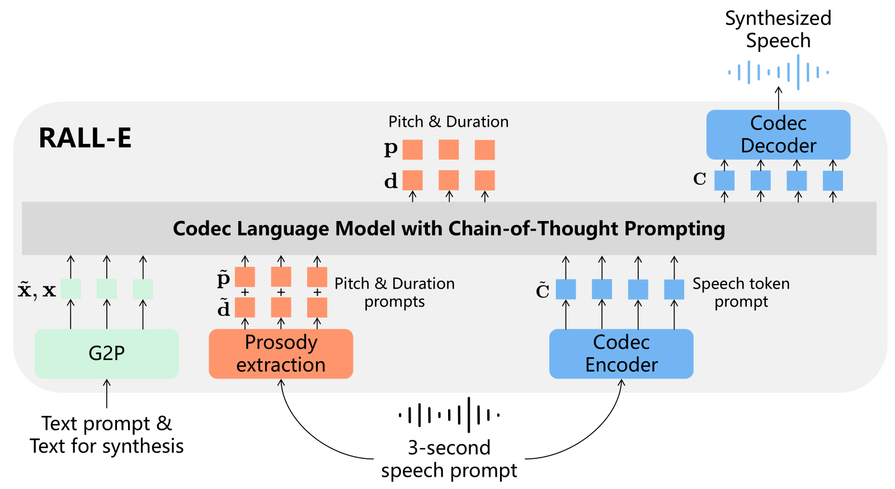
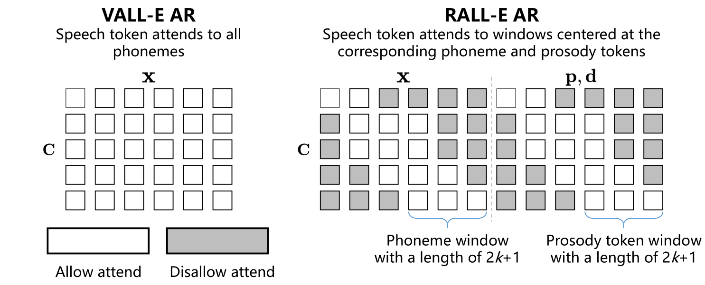

# RALL-E

基本信息

- 标题: "RALL-E: Robust Codec Language Modeling with Chain-of-Thought Prompting for Text-to-Speech Synthesis"
- 作者:
  - 01 Detai Xin (辛德泰)
  - 02 Xu Tan (谭旭)
  - 03 Kai Shen (沈锴)
  - 04 Zeqian Ju (琚泽谦)
  - 05 Dongchao Yang (杨东超)
  - 06 Yuancheng Wang (王远程)
  - 07 Shinnosuke Takamichi (高道慎之介)
  - 08 Hiroshi Saruwatari (猿渡洋)
  - 09 Shujie Liu (刘树杰)
  - 10 Jinyu Li (李劲宇)
  - 11 Sheng Zhao (赵胜)
- 链接:
  - [ArXiv](https://arxiv.org/abs/2404.03204)
  - [Publication]
  - [Github]
  - [Demo](https://ralle-demo.github.io/RALL-E)
- 文件:
  - [ArXiv](_PDF/2404.03204v3__RALL-E__Robust_Codec_Language_Modeling_with_Chain-of-Thought_Prompting_for_TTS_Synthesis.pdf)
  - [Publication] #TODO

## Abstract: 摘要

展开原文

We present ***RALL-E***, a robust language modeling method for ***text-to-speech (TTS)*** synthesis.
While previous work based on ***large language models (LLMs)*** shows impressive performance on zero-shot TTS, such methods often suffer from poor robustness, such as unstable prosody (weird pitch and rhythm/duration) and a high ***word error rate (WER)***, due to the autoregressive prediction style of language models.
The core idea behind ***RALL-E*** is ***chain-of-thought (CoT)*** prompting, which decomposes the task into simpler steps to enhance the robustness of LLM-based TTS.
To accomplish this idea, ***RALL-E*** first predicts prosody features (pitch and duration) of the input text and uses them as intermediate conditions to predict speech tokens in a CoT style.
Second, ***RALL-E*** utilizes the predicted duration prompt to guide the computing of self-attention weights in Transformer to enforce the model to focus on the corresponding phonemes and prosody features when predicting speech tokens.
Results of comprehensive objective and subjective evaluations demonstrate that, compared to a powerful baseline method [VALL-E (2023)](../SpeechLM/2023.01.05_VALL-E.md), ***RALL-E*** significantly improves the WER of zero-shot TTS from 6.3% (without reranking) and 2.1% (with reranking) to 2.8% and 1.0%, respectively.
Furthermore, we demonstrate that ***RALL-E*** correctly synthesizes sentences that are hard for [VALL-E (2023)](../SpeechLM/2023.01.05_VALL-E.md) and reduces the error rate from 68% to 4%.

 

我们提出了 ***RALL-E***, 一种鲁棒的用于文本转语音合成的语言建模方法.
之前基于***大语言模型 (Large Language Models, LLMs)*** 的工作在零样本文本转语音任务方面表现出色, 但同时也存在一些不稳定性, 如不稳定韵律 (奇怪的音高和节奏/时长) 和高***词错误率 (Word Error Error, WER)***, 这些都与语言模型的自回归预测方式有关.
***RALL-E*** 的核心思想是***思维链 (Chain-of-Thought, CoT)*** 提示, 它将任务分解为更简单的步骤, 以提升基于大语言模型的文本转语音合成的鲁棒性.
为了实现这一思想, ***RALL-E*** 首先预测输入文本的韵律特征 (音高和时长), 并将它们作为中间条件用于预测思维链形式的语音 Tokens.
其次, ***RALL-E*** 利用预测的时长提示来引导 Transformer 中的自注意力权重计算, 以强制模型在预测语音 Token 时专注于相应的音素和韵律特征.
综合的客观评估和主观评估说明, 相比 [VALL-E (2023)](../SpeechLM/2023.01.05_VALL-E.md), ***RALL-E*** 显著提升了零样本文本转语音的词错误率表现, 从 6.3% (不使用 reranking) 和 2.1% (使用 reranking) 分别下降到 2.8% 和 1.0%.
此外, 我们还展示了 ***RALL-E*** 能够正确合成 [VALL-E (2023)](../SpeechLM/2023.01.05_VALL-E.md) 难以合成的句子, 并将错误率从 68% 下降到 4%.

## 1·Introduction

***Large language models (LLMs)*** have demonstrated great progress in natural language generation [1, 20].
With a sufficient model size LLMs emerge powerful in-context learning abilities that can handle unseen tasks with a text instruction (usually called prompt) in a zero-shot or few-shot manner [31].
Moreover, the simple yet effective next-token prediction task of LLMs makes it easy to apply LLMs on other fields, such as vision [5] and speech synthesis [29], as long as the data can be converted to discrete speech tokens.
This work focuses on the language modeling of ***text-to-speech (TTS)*** synthesis.
Recent work [14,29] have shown that TTS can be modeled by a decoder-only language model by using a neural codec [4,34] to convert continuous waveforms into discrete tokens.
These methods, typically leverage tens of thousands of hours of speech data, emerge in-context learning ability that can clone a speaker’s voice by providing a short audio prompt to the language model, and thus have impressive performance on zero-shot TTS.
However, due to the sequential generation property of language models, such codec language models suffer from poor robustness.
Although the ***AutoRegressive (AR)*** prediction style of language models enables the model to generate speech with diverse prosody patterns, they can also cause bad cases with unnatural prosody.
Moreover, since there is no strict alignment between text and speech, the models can omit or repeat words in the input text.
This is quite different from TTS methods based on ***Non-AutoRegressive (NAR)*** generative models [12,16,25], which predicts all tokens at the same time, thus have high robustness but relatively low diversity.
As suggested by previous work [12,33], LLM-based TTS have a higher ***Word Error Rate (WER)*** than NAR TTS even if they have similar performance on other metrics.
To alleviate this problem, a simple but effective method is to sample the same input text multiple times and select the best one [14,33].
However, such a reranking method further increases the inference time.
In this paper, we present ***RALL-E*** (the abbreviation of **Robust VALL-E**), a method to improve the robustness of LLM-based TTS.
The core idea of ***RALL-E*** is inspired from the ***Chain-of-Thought (CoT)*** prompting [32].
In CoT prompting, the LLM is instructed to generate an intermediate result that is used as a condition for the prediction of the final result.
The CoT prompting breaks a complex task into several simpler steps, so that can improve the robustness of LLMs, especially on hard tasks like arithmetic [32].
To adapt CoT prompting to LLM-based TTS, ***RALL-E*** predicts prosody tokens (pitch and duration) before predicting speech tokens to stabilize the prosody.
Given an input sentence, ***RALL-E*** first predicts phoneme-level pitch and duration of the input, then predicts speech tokens conditioning on both the input phonemes and the predicted prosody tokens.
Furthermore, ***RALL-E*** utilizes the predicted duration to mask irrelevant phonemes and prosody tokens when computing self-attention weights, so that the codec language model is enforced to concentrate on tokens around the phoneme and prosody token the speech token corresponds to.
We use [VALL-E (2023) [29]](../SpeechLM/2023.01.05_VALL-E.md), a recent powerful LLM-based TTS method, as the baseline, and conduct experiments on a large dataset with 44K hours speech data.
Results of comprehensive objective and subjective evaluations demonstrate that RALL significantly improves the robustness of LLM-based TTS by reducing the WER on the LibriSpeech [18] test-clean set from6.3%(w/o reranking) and2.1%(with reranking) to2.8%and 1.0%, respectively.
Furthermore, we evaluate the performance of ***RALL-E*** on 50 particularly hard sentences.
As demonstrated in Tab.01, compared to [VALL-E (2023)](../SpeechLM/2023.01.05_VALL-E.md), ***RALL-E*** significantly reduces WER from68%to4%by eliminating almost all types of error, which demonstrates the superior robustness of ***RALL-E*** (see Section 4.4 for more details).
The contributions of this work are summarized as follows:
- We present ***RALL-E***, a robust codec language modeling method with chain-of-thought prompting for TTS.
***RALL-E*** improves the robustness of LLM-based TTS by (1) incorporating prosody tokens as chain-of-thought prompting to stabilize the generation of speech tokens and (2) using duration-guided masking to enhance the alignment between phoneme and speech tokens.
- We conduct comprehensive objective and subjective evaluations.
Experimental results demonstrate that ***RALL-E*** obtains significantly better robustness than the baseline [VALL-E (2023)](../SpeechLM/2023.01.05_VALL-E.md) and two previous works.
- We further evaluate ***RALL-E*** on sentences that are particularly hard to synthesize for LLM-based TTS.
The results demonstrate that ***RALL-E*** correctly synthesizes hard sentences and reduces the error rate from68%to4%compared to [VALL-E (2023)](../SpeechLM/2023.01.05_VALL-E.md), which closely approaches the performance of non-autoregressive TTS.
Audio samples can be found at https://ralle-demo.github.io/RALL-E.

## 2·Related Work

### LLM-Based TTS

Inspired by the success of LLMs [1,20], several recent works adopt language models to model TTS ([SPEAR-TTS (2023)](../SpeechLM/2023.02.07_SPEAR-TTS.md), [VALL-E (2023)](../SpeechLM/2023.01.05_VALL-E.md), [UniAudio (2023)](../SpeechLM/2023.10.01_UniAudio.md)) and begin to use decoder-only architecture based on Transformer.
In such models, text and speech tokens are concatenated together and fed to a single transformer.
The whole model is trained on a next-token prediction task like a language model.
The LLM-based TTS systems are typically trained on tens of thousands of hours of speech data and have hundreds of millions of parameters, hence can leverage the emergent abilities of LLMs like in-context learning [31] to enable zero-shot TTS ([VALL-E (2023)](../SpeechLM/2023.01.05_VALL-E.md)).
Besides, recent works ([AudioPalM (2023)](../SpeechLM/2023.06.22_AudioPaLM.md); [VioLA (2023)](../SpeechLM/2023.05.25_VioLA.md (2023)](../../Models/Speech_LLM/2023.10.01_UniAudio.md)) have shown the decoder-only architecture can be used to learn multiple tasks, as the input and output are processed jointly by a language model, and the model can be signaled to generate results for different tasks by inputting pre-defined special tokens.
***RALL-E*** focuses on the robustness problem of LLM-based TTS.

从大语言模型的成功获得灵感, 近期的一些工作将语言模型应用于建模语音合成并开始使用仅有 Transformer 解码器的架构.
这些模型将文本和语音标记串联起来, 输入到单个 Transformer 中.
整个模型在下一个标记预测任务上进行训练, 如语言模型一样.
基于大语言模型的语音合成系统通常是在数千小时语音数据上训练的, 具有数百万个参数, 因此可以利用语言模型的自然语言推理能力, 如上下文学习, 实现零样本语音合成.
除此之外, 近期的工作 [22,30,33] 表明, 仅有解码器架构的模型可以学习多个任务, 因为输入和输出是由语言模型一起处理的, 并且模型可以根据预定义的特殊标记信号生成不同任务的结果.
***RALL-E*** 着重于语言模型建模语音合成的健壮性问题.

### Robust Autoregressive TTS

The robustness of AR TTS is a popular topic in the literature.
For encoder-decoder AR TTS, several previous works enforce the attention weights to be monotonic [2,9, 36] that can effectively improve the robustness.
In addition, Shen et al.[24] proposed a non-attentive Tacotron, in which the attention module was replaced by a duration predictor to determine the alignment path before decoding.
For decoder-only TTS, a key difference is that the attention weights are computed on text and context at the same time, hence the whole attention weights should not be monotonic.
Song et al. proposed [ELLA-V (2024)](../SpeechLM/2024.01.14_ELLA-V.md) that interleaves the speech tokens with phonemes by inserting a phoneme token and a special ***End Of Phone(EOP)*** token at the beginning and end of the speech tokens corresponding to the phoneme, respectively.
While the inserted phoneme and the EOP token indicate the duration of each phoneme, such an implicit way entangles the prediction of speech tokens and duration together.
***RALL-E*** disentangles the predictions of duration and speech tokens by predicting the duration of all phonemes before the speech tokens, hence has higher controllability over the generation process.
Du et al. proposed [VALL-T (2024)](../SpeechLM/2024.01.25_VALL-T.md) that uses an unsupervised transducer loss [7] to implicitly model the duration of phonemes.
Compared to RALL-E, although VALL-T doesn’t rely on external alignment tools during training, its training time is considerably decelerated since the transducer loss requires the model to perform a forward process for every phoneme.
Besides, like [ELLA-V (2024)](../SpeechLM/2024.01.14_ELLA-V.md), [VALL-T (2024)](../SpeechLM/2024.01.25_VALL-T.md) also entangles the predictions of duration and speech tokens, thus has weaker controllability than RALL-E.

自回归语音合成的健壮性是一个热门话题.
对于编码器-解码器自回归语音合成, 之前的工作已经提出了强化注意力权重为单调的策略 [2,9, 36], 能够有效提升语音合成的健壮性.
此外, Shen 等人提出了一个非注意力的 Tacotron, 其中替换了注意力模块, 用一个时长预测器在解码前确定对齐路径.

对于仅有解码器的语音合成, 关键区别是注意力权重是同时计算文本和上下文的, 因此注意力权重不应该是单调的.
Song 等人提出 [ELLA-V (2024)](../SpeechLM/2024.01.14_ELLA-V.md), 其中插入了一个音素标记和一个特殊的结束音素标记, 前者对应于音素的时长, 后者对应于音素的结束.
这种隐式的方式将语音标记和时长预测联系在一起, 导致模型对生成过程的控制力较弱.
***RALL-E*** 通过预测所有音素的时长, 解耦了时长和语音标记的预测, 因此可以更好地控制生成过程.
Du 等人提出 [VALL-T (2024)](../SpeechLM/2024.01.25_VALL-T.md), 使用无监督的转换器损失 [7] 模型音素的时长.
与 ***RALL-E*** 相比, VALL-T 虽然在训练过程中不依赖外部对齐工具, 但训练时间显著减少, 因为转换器损失需要模型对每个音素进行一次前向计算.
此外, 与 [ELLA-V (2024)](../SpeechLM/2024.01.14_ELLA-V.md) 一样, [VALL-T (2024)](../SpeechLM/2024.01.25_VALL-T.md) 也将时长和语音标记联系在一起, 因此控制力较弱.

## 3·RALL-E

The overview of ***RALL-E*** is illustrated in Fig.01.

The core idea of ***RALL-E*** is CoT prompting that generates intermediate results to assist and stabilize the generation of speech tokens and improve the robustness of LLM-based TTS.
To accomplish this idea, we first propose to predict two kinds of phoneme-level prosody tokens: pitch and duration before predicting the speech tokens.
The distributions of the prosody tokens are modeled together with speech tokens by a single Transformer so that they can influence the duration and pitch of the predicted speech tokens.
To further utilize the predicted duration to guide the generation and improve the robustness, we propose duration-guided masking to enhance the alignment between speech tokens, phonemes, and prosody tokens learned by the language model.
At each decoding step of the speech tokens, ***RALL-E*** masks phonemes and prosody tokens that are irrelevant to the synthesis of the current speech token based on the duration information.
In the following sections, we first briefly introduce [VALL-E (2023)](../SpeechLM/2023.01.05_VALL-E.md) since we apply the proposed method to it in the experiments.
We then formulate and introduce ***RALL-E*** in detail.
It should be stressed that, though we use [VALL-E (2023)](../SpeechLM/2023.01.05_VALL-E.md) to implement ***RALL-E***, the proposed method can be applied in any decoder-only AR TTS model.

### 3.1·Preliminary: VALL-E

We inherit most symbols from the original paper of [VALL-E (2023)](../SpeechLM/2023.01.05_VALL-E.md) for ease of reading.
Readers are recommended to refer to the original paper for more details.

Generally, [VALL-E (2023)](../SpeechLM/2023.01.05_VALL-E.md) is a decoder-only LLM-based TTS system that uses two Transformers [28] to predict speech tokens from the text.
The speech tokens here are extracted from [EnCodec (2022)](../Speech_Neural_Codec/2022.10.24_EnCodec.md), a neural audio codec based on residual vector quantization (RVQ) [34] that can convert continuous speech signal into discrete tokens.
After predicting the discrete tokens, the waveforms can be reconstructed by feeding the tokens into the decoder of EnCodec.
An RVQ typically contains $N$ quantization layers ($N = 8$ in [VALL-E (2023)](../SpeechLM/2023.01.05_VALL-E.md)), hence at each time step the encoded speech has $N$ tokens.
Formally, given speech $\mathbf{y}$ and its transcription $\mathbf{x}$, the discrete speech token matrix $\mathbf{C}$ encoded by the codec has a shape of $T \times N$, where $T$ is the total time step.
In addition tox, to clone a speaker’s voice and utilize the in-context learning ability of LLMs, [VALL-E (2023)](../SpeechLM/2023.01.05_VALL-E.md) receives a short prompt $\tilde{\mathbf{C}}^{T'\times N}$ as input before predicting $\mathbf{C}$.
Hence, [VALL-E (2023)](../SpeechLM/2023.01.05_VALL-E.md) models and maximizes the following distribution:

$$
  \mathbb{P}(\mathbf{C}|\mathbf{x},\tilde{\mathbf{C}}).\tag{1}
$$

[VALL-E (2023)](../SpeechLM/2023.01.05_VALL-E.md) predicts speech tokens hierarchically where the speech tokens of the 1st layer of RVQ are first predicted by an AR Transformer, and the tokens of the rest layers are predicted by a NAR Transformer.
This is because RVQ uses a residual quantization method, i.e. higher layers encode the information that is not encoded by the lower layers, hence tokens of the1st layer contain most information of the waveforms, and the information encoded by the rest layers gradually decreases.
The AR Transformer takes the phoneme sequence $\mathbf{x}$, and speech tokens of the1st layer of the prompt $\tilde{c}_{:,1}$ as input to predict the target speech tokens of the1st layer $\mathbf{c}_{:,1}$ sequentially, i.e. maximizes the following distribution:

$$
  \mathbb{P}(\mathbf{c}_{:,1}|\mathbf{x},\tilde{\mathbf{c}}_{:,1};\theta_{AR})=\prod_{t=1}^T\mathbb{P}(\mathbf{c}_{t,1}|\mathbf{x},\mathbf{c}_{<t,1},\tilde{\mathbf{c}}_{:,1};\theta_{AR}),\tag{2}
$$

where $\theta_{\text{AR}}$ is the trainable parameters of the AR Transformer.
The NAR Transformer predicts all target speech tokens $\mathbf{c}_{:,j}$ of the $j$-th layer at the same time with the phoneme sequence $\mathbf{x}$, the prompt $\tilde{\mathbf{C}}$, and target speech tokens $\mathbf{c}_{:,<j}$ of all layers less than $j$ as the conditions, i.e. maximizes the following distribution:

$$
  \mathbb{P}(\mathbf{c}_{:,2:N}|\mathbf{x},\tilde{\mathbf{C}};\theta_{NAR})=\prod_{j=2}^N\mathbb{P}(\mathbf{c}_{:,j}|\mathbf{x},\mathbf{c}_{:,<j},\tilde{\mathbf{C}};\theta_{NAR}),\tag{3}
$$

where $\theta_{\text{NAR}}$ is the trainable parameters of the NAR Transformer.
By combining Eq.2 and Eq.3, [VALL-E (2023)](../SpeechLM/2023.01.05_VALL-E.md) breaks Eq.1 into the following form:

$$
  \mathbb{P}(\mathbf{C}|\mathbf{x},\tilde{\mathbf{C}})=\mathbb{P}(\mathbf{c}_{:,1}|\mathbf{x},\tilde{\mathbf{c}}_{:,1};\theta_{AR})\mathbb{P}(\mathbf{c}_{:,2:N}|\mathbf{x},\tilde{\mathbf{C}};\theta_{NAR}).\tag{4}
$$

It is noteworthy that in practice the two Transformers have the same architecture but have different attention masks during computation. Specifically, both the two Transformers use a bidirectional mask for the phoneme sequence $\mathbf{x}$, which means every phoneme $x_i$ can attend to all other phonemes $x_{\neq i}$.
However, for the speech tokens, the AR Transformers uses a unidirectional mask so that $\mathbf{c}_{t,1}$ can only attend to previous tokens $\mathbf{c}_{<t,1}$, while the NAR Transformer still uses a bidirectional mask.

### 3.2·Prosody Tokens as Chain-of-Thought Prompts

One of the problems of LLM-based TTS is that it directly generates speech from phonemes with no restriction on the prosody, e.g. pitch, duration, etc, which usually results in speech with unstable prosody.
A similar problem is also observed in Wei et al.[32] where the authors find LLMs cannot directly answer a complex question like arithmetic and propose CoT prompting to solve this problem.
The idea of CoT prompting is breaking a complex task into several simpler tasks so that LLMs can utilize the intermediate results to reach the final answers.
As shown in Wei et al.[32], by CoT prompting the correct rate of LLMs on complex tasks can be significantly improved.
This motivates us to adapt CoT prompting to LLM-based TTS by generating intermediate prosody tokens before generating speech tokens to alleviate the robustness problem of LLM-based TTS.

基于大语言模型的语音合成的问题之一是它直接从音素生成语音, 而对韵律没有限制, 如音高, 时长等, 这通常会导致生成韵律不稳定的语音.
Wei 等人的研究中也能观察到相似问题, 他们发现基于语言模型的语音合成系统不能直接回答复杂的问题, 如算术等, 从而提出了思维链提示来解决这个问题.
思维链提示的思想是将复杂任务分解为若干个简单任务使得大语言模型能够利用中间结果来获得最终答案.
如 Wei 等人所展示的, 通过思维链提示, 可以显著提高大语言模型在复杂任务上的正确率.
这激励我们将思维链提示应用于基于大语言模型的语音合成, 通过在生成语音之前生成中间韵律标记来缓解基于语言模型的语音合成系统的健壮性问题.

To incorporate pitch and duration in the AR Transformer of [VALL-E (2023)](../SpeechLM/2023.01.05_VALL-E.md), we first get the alignment between phonemes and speech tokens and extract the pitch value for each speech token.
We then compute phoneme-level pitch value based on the duration and linearly quantize it to $M_p$ buckets.
We define a maximal duration value $M_d$, and all duration values that exceed $M_d$ will be truncated to the maximum.
***RALL-E*** predicts the two prosody tokens before the speech tokens in a CoT style.

为了在 [VALL-E (2023)](../SpeechLM/2023.01.05_VALL-E.md) 的自回归 Transformer 中整合音高和时长, 我们首先获得音素和语音 token 之间的对齐, 并提取每个语音 token 的音高值.
然后我们基于时长计算音素级别的音高值, 并将其线性量化到 $M_p$ 个桶中.
我们定义一个最大时长值 $M_d$, 超出该值的时长值将被截断.
***RALL-E*** 以 CoT 风格在语音 tokens 前预测两个韵律 tokens.

Formally, assume $p$, $d$ are the discrete pitch and duration sequences of the target speech tokens $\mathbf{C}$, $\tilde{\mathbf{p}}$, $\tilde{\mathbf{d}}$ are the ones of the prompt $\tilde{\mathbf{C}}$, we model and maximize the following distribution:

形式上, 假设 $p$, $d$ 是目标语音 tokens $\mathbf{C}$ 的离散音高和时长序列, $\tilde{\mathbf{p}}$, $\tilde{\mathbf{d}}$ 是提示 $\tilde{\mathbf{C}}$ 的音高和时长序列, 我们可以建模并最大化下列分布:

$$
  \mathbb{P}(\mathbf{p},\mathbf{d}|\mathbf{x},\tilde{\mathbf{p}},\tilde{\mathbf{d}};\theta_{AR})=\prod_{t=1}^L\mathbb{P}(p_t,d_t|\mathbf{x},\mathbf{p}_{<t},\mathbf{d}_{<t},\tilde{\mathbf{p}},\tilde{\mathbf{d}};\theta_{AR}),\tag{5}
$$

where $L$ is the length of $\mathbf{x}$.

其中 $L$ 为 $\mathbf{x}$ 的长度.

In practice, the model predicts $p_t$ and $d_t$ with two separate heads, and their embeddings are summed up and fed to the model for the prediction of the next step.

实际上, 模型通过两个独立的头预测 $p_t$ 和 $d_t$, 他们的嵌入将被求和后输入模型以进行下一步的预测.

***RALL-E*** then predicts the speech tokens with $p$ and $d$ as a new condition, which makes Eq.2 becomes:

***RALL-E*** 然后以 $p$ 和 $d$ 作为新的条件, 使得方程 2 变为:

$$
\mathbb{P}(\mathbf{c}_{:,1}|\mathbf{x},\tilde{\mathbf{c}}_{:,1},\mathbf{p},\tilde{\mathbf{p}},\mathbf{d},\tilde{\mathbf{d}};\theta_{AR})=\prod_{t=1}^T\mathbb{P}(\mathbf{c}_{t,1}|\mathbf{x},\mathbf{c}_{<t,1},\tilde{\mathbf{c}}_{:,1},\mathbf{p},\tilde{\mathbf{p}},\mathbf{d},\tilde{\mathbf{d}};\theta_{AR}).\tag{6}
$$

The above two equations can be jointly optimized by the AR Transformer.
Although the proposed method adds additional $L$ decoding steps, since $L<<T$, it intuitively has little influence on the efficiency.

上面的两个方程可以通过 AR Transformer 联合优化.
尽管所提出的方法增加了 $L$ 个解码步骤, 但由于 $L<<T$, 其实际影响很小.

For the NAR Transformer, we simply sum the embeddings of the phoneme, pitch, and duration together as the input. This makes Eq.3 becomes:

对于非自回归 Transformer, 我们只需将音素, 音高, 时长的嵌入向量相加作为输入. 这使得方程 3 变为:
$$
\begin{aligned}\mathbb{P}(\mathbf{c}_{:,2:N}|\mathbf{x},\tilde{\mathbf{C}},\mathbf{p},\tilde{\mathbf{p}},\mathbf{d},\tilde{\mathbf{d}};\theta_{NAR})&=\prod_{j=2}^N\mathbb{P}(\mathbf{c}_{:,j}|\mathbf{x},\mathbf{c}_{:,<j},\tilde{\mathbf{C}},\mathbf{p},\tilde{\mathbf{p}},\mathbf{d},\tilde{\mathbf{d}};\theta_{NAR}).\end{aligned}\tag{7}
$$

### 3.3·Enhancing Alignment with Duration-Guided Masking

As the left side of Fig.02 illustrates, since the speech token attends to all phonemes in the AR Transformer of [VALL-E (2023)](../SpeechLM/2023.01.05_VALL-E.md), the alignment between the phonemes and the speech tokens is implicitly modeled by the self-attention of [VALL-E (2023)](../SpeechLM/../SpeechLM/2023.01.05_VALL-E.md).
This can be imprecise and causes errors like word omissions or hallucinations.
Though ***RALL-E*** introduces prosody CoT prompting to guide and stabilize the generation, we still find the model can fail to align in the experiments.
We thus propose duration guided masking to fully utilize the intermediate duration results and boost the robustness.

如图 2 左侧所示, 由于 [VALL-E (2023)](../SpeechLM/2023.01.05_VALL-E.md) 的自回归 Transformer 中的语音 token 能够关注到所有音素, 因此音素和语音 token 的对齐是通过自注意力隐式建模的.
然而, 这种对齐可能不精确, 导致诸如词汇遗漏或幻觉等错误.
尽管 ***RALL-E*** 提出了韵律 CoT 提示来引导和稳定生成, 但我们仍然发现模型在实验中可能无法对齐.
因此, 我们提出了时长导向掩码 (duration-guided masking) 来充分利用中间时长结果并提升鲁棒性.

As the right side of Fig.02 illustrates, in the proposed duration-guided masking, the speech token is restricted to only attend on a phoneme (prosody token) window centered at the phoneme (prosody token) it corresponds to.
We define the window size ask, thus each speech token can attend on $2k + 1$ phonemes and $2k + 1$ prosody tokens.
All phonemes and prosody tokens at other positions will be masked out, hence their attention weights are always zero.
When $k = 0$ the speech token strictly attends to the phoneme it corresponds to.
If the alignment is perfect this should be enough.
However, in the experiments, we found that the alignment results obtained by our alignment tool usually have errors.
We thus loosen the restriction by also allowing the speech token to attend at the near phonemes of the corresponding phoneme.
Another reason for this design is that the pronunciation of a phoneme is usually dependent on near phonemes.
As one will see in [Section.4.3]() and [Appendix.A](), the experimental results verify the effectiveness of this design.

如图 2 右侧所示, 在所提出的时长导向掩码中, 语音 token 只能关注到与其对应的音素 (韵律 token) 处于中心位置的窗口内的音素 (韵律 token).
我们定义窗口大小为 $k$, 因此每个语音 token 可以关注到 $2k + 1$ 个音素和 $2k + 1$ 个韵律 token.
所有其他位置的音素和韵律 token 都将被掩码掉, 因此它们的注意力权重总是为零.
当 $k = 0$ 时, 语音 token 严格关注到它对应的音素.
然而, 在实验中, 我们发现所获得的对齐结果经常存在错误.
因此, 我们通过允许语音 token 关注到与其对应的音素相邻的音素来放松限制.
另一个原因是, 一个音素的发音通常依赖于附近的音素.
如 [第 4.3 节]() 和 [附录 A]() 所示, 实验结果证实了这种设计的有效性.

For the NAR Transformer, we obtained almost no gain when applying the proposed masking strategy to it in our preliminary experiments.
Thus we only apply the masking strategy on the AR Transformer.

对于非自回归 Transformer, 我们在初步实验中并未获得所提出的掩码策略的明显收益.
因此, 我们只在自回归 Transformer 上应用掩码策略.

The general inference procedure follows [VALL-E (2023)](../SpeechLM/2023.01.05_VALL-E.md) with two differences.
First, before sampling the speech tokens $\mathbf{c}_{:,1}$ the prosody tokens $\mathbf{p}$ and $\mathbf{d}$ are sampled conditioning on the phoneme sequence $\mathbf{x}$ and acoustic prompt $\tilde{\mathbf{p}}$, $\tilde{\mathbf{d}}$.
Second, although normal language models depend on a special token `<eos>` as the stop condition, since we know the total duration $D = \sum^L_{t=1}d_t$, we propose a duration guided inference method that forces the inference to stop at the $D$-th step.
This method ensures no phoneme is omitted or repeated as it continues the inference if the `<eos>` token is predicted before the $D$-th step and stops at the right step as guided by the predicted duration..

整体推理过程遵循 [VALL-E (2023)](../SpeechLM/2023.01.05_VALL-E.md) 的一般过程, 但有两个差别.
首先, 在采样语音 tokens $\mathbf{c}_{:,1}$ 之前, 先采样韵律 tokens $\mathbf{p}$ 和 $\mathbf{d}$ 作为条件, 条件是音素序列 $\mathbf{x}$ 和声学提示 $\tilde{\mathbf{p}}$, $\tilde{\mathbf{d}}$.
其次, 虽然普通语言模型依赖于特殊符号 `<eos>` 作为停止条件, 但由于我们知道总时长 $D = \sum^L_{t=1}d_t$, 我们提出了一个时长导向推理方法, 强制推理停止于 $D$-th 步.
这种方法可以确保不会遗漏或重复任何音素, 因为如果在 $D$-th 步预测到 `<eos>` 符号, 推理就会继续, 直到预测的时长达到要求的时长.

## 4·Experiments

### 4.1·Setup

#### Data

#### Model Configuration

#### Training and Inference

#### Baseline Methods

#### Objective Metrics
##### Word Error Rate (WER)
##### Reranked WER (WER-R)
##### Substitution (Sub), Deletion (Del), Insertion (Ins)
##### UTMOS
##### Speaker Similarity (SIM)

#### Subjective Metrics

### 4.2·Main Results

### 4.3·Ablation Study

### 4.4·Evaluation on Hard Sentences

## 5·Conclusion

This paper presents ***RALL-E***, a robust codec language modeling method with CoT prompting for TTS.
To address the robustness problem of LLM-based TTS, ***RALL-E*** (1) incorporates prosody features (pitch and duration) in the LLM as a CoT prompting to assist and stabilize the generation of speech tokens, and (2) proposes duration-guided masking that enforces the model to attend on relevant phonemes (prosody features) corresponding to each speech token.
We conduct comprehensive objective and subjective evaluations and demonstrate that ***RALL-E*** can significantly improve the robustness of LLM-based TTS compared to the baseline [VALL-E (2023)](../SpeechLM/2023.01.05_VALL-E.md) and two previous works.
Furthermore, we show that ***RALL-E*** can correctly synthesize sentences that are particularly hard to synthesize for [VALL-E (2023)](../SpeechLM/2023.01.05_VALL-E.md) with a 4% error rate that even approaches the performance of non-autoregressive TTS.

## A.Window Size Study

## B.Transcript of the 50 hard sentences
