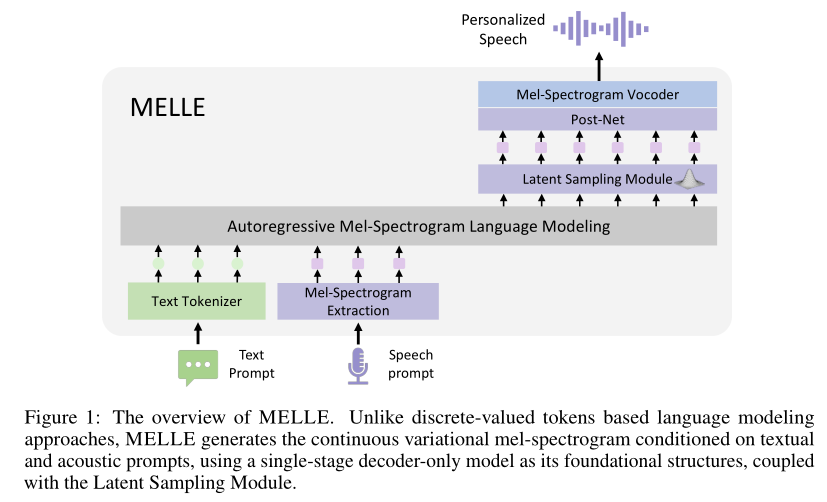

# MELLE

基本信息

- 标题: "Autoregressive Speech Synthesis without Vector Quantization"
- 作者:
  - 01 Lingwei Meng - 香港中文大学
  - 02 Long Zhou (周龙) - Microsoft
  - 03 Shujie Liu (刘树杰) - Microsoft
  - 04 Sanyuan Chen (陈三元) - Microsoft
  - 05 Bing Han - Microsoft
  - 06 Shujie Hu - 香港中文大学
  - 07 Yanqing Liu - Microsoft
  - 08 Jinyu Li (李劲宇) - Microsoft
  - 09 Sheng Zhao (赵胜) - Microsoft
  - 10 Xixin Wu - 香港中文大学
  - 11 Helen Meng (蒙美玲) - 香港中文大学
  - 12 Furu Wei (韦福如) - Microsoft
- 链接:
  - [ArXiv](https://arxiv.org/abs/2407.08551)
  - [Publication]()
  - [Github]()
  - [Demo](https://aka.ms/melle)
- 文件:
  - [ArXiv](_PDF/2407.08551v1__MELLE__Autoregressive_Speech_Synthesis_without_Vector_Quantization.pdf)
  - [Publication] #TODO

## Abstract: 摘要

原文

We present ***MELLE***, a novel continuous-valued tokens based language modeling approach for text to speech synthesis (TTS).
***MELLE*** autoregressively generates continuous mel-spectrogram frames directly from text condition, bypassing the need for vector quantization, which are originally designed for audio compression and sacrifice fidelity compared to mel-spectrograms.
Specifically, (i) instead of cross-entropy loss, we apply regression loss with a proposed spectrogram flux loss function to model the probability distribution of the continuous-valued tokens. (ii) we have incorporated variational inference into ***MELLE*** to facilitate sampling mechanisms, thereby enhancing the output diversity and model robustness.
Experiments demonstrate that, compared to the two-stage codec language models VALL-E and its variants, the single-stage ***MELLE*** mitigates robustness issues by avoiding the inherent flaws of sampling discrete codes, achieves superior performance across multiple metrics, and, most importantly, offers a more streamlined paradigm.
See https://aka.ms/melle for demos of our work.

 

本文介绍一种新的基于连续值 Token 的语言建模方法 ***MELLE***, 用于文本到语音合成 (TTS).
***MELLE*** 直接从文本条件生成连续的梅尔频谱帧, 绕过了向量量化的需求, 这原本是设计用于音频压缩但相比梅尔频谱牺牲了保真度.
具体地, 我们使用回归损失而不是交叉熵损失, 即提出频谱流动损失函数用于建模连续值 Token 的概率分布; 我们将变分推断整合进 ***MELLE*** 中, 提升采样机制, 从而增强模型鲁棒性和输出多样性.
实验说明, 相比两阶段的编解码器语言模型 **VALL-E** 及其变体, 单阶段的 ***MELLE*** 能够通过避免采样离散编码的固有缺陷来缓解稳健性问题, 在多个指标上都取得了优异的性能, 最重要的是, 它提供了一种更简洁的范式.
可以访问 https://aka.ms/melle 获得相关的演示音频.

## 1.Introduction: 引言

The objective of next-token prediction, which involves predicting the next discrete token based on the previous tokens as condition, is foundational to the recent progress observed in autoregressive large language models (LLMs).
Recently, the success of LLMs in natural language processing (NLP) tasks has encouraged the exploration of autoregressive language modeling approaches in audio synthesis fields (**AudioLM (2022)**; **VALL-E (2023)**).
Neural codec language models, exemplified by **VALL-E (2023)** and **VALL-E X (2023)**, reveal the potential of such principle in the zero-shot text-to-speech (TTS) task via leveraging large-scale multi-lingual multi-speaker multi-domain training corpus.
Unlike traditional TTS systems that rely heavily on complex and multi-step pipelines, they utilize a decoder-only approach to predict neural codec codes, which are discrete tokens encoded from continuous waveforms leveraging neural codec models (**SoundStream (2021)**; **EnCodec (2022)**).

Although achieving impressive naturalness and diversity in synthesized audios, VALL-E and its variants are plagued by following several drawbacks.
First, neural codec codes, originally designed for audio compression, exhibit lower fidelity compared to the well-established mel-spectrogram \citep{puvvada2024discrete}.
This phenomenon is also observed in the field of graphics, where the reconstruction quality of vector-quantized tokenizers typically lags behind that of their continuous-valued counterparts \citep{rombach2022high,huang2023not,kaiming2024autoregressive}.
Second, the codec language model VALL-E suffers from robustness issues stemming from its random sampling strategy, which is inherited from text language model for selecting discrete tokens.
This issue is more pronounced with acoustic tokens as opposed to textual ones due to the greater similarity among consecutive codec codes, which can lead to continuous stretches of silence or persistent noise (**VALL-E (2023)**; **ELLA-V (2024)**).
Third, neural codec language models typically necessitate a complicated two-pass decoding process, involving an autoregressive (AR) model for generating coarse primary audio tokens, followed by a non-autoregressive (NAR) model to iteratively predict the rest multiple codebook codes for refinement.
This multi-step procedure compromises inference efficiency, leading to increased computational demands and doubled storage requirements.

To address the limitations associated with discrete tokens based codec language models, we are rethinking the potential of continuous speech representations and aim to determine whether continuous-valued tokens can supplant discrete-valued tokens within the paradigm of autoregressive speech synthesis models.
The successful implementation of the autoregressive model without discrete vector quantization faces two key challenges.
- **How to set training objective for continuous representation?**
The continuous space significantly differs from that of vector-quantized tokens, for which autoregressive language models typically adopt a next-token prediction objective, with cross-entropy loss to measure the discrepancy between the predicted distribution and the ground truth.
- **How to enable sampling mechanism in continuous space?**
The sampling strategy is a critical component in both text generation and speech synthesis systems, as it introduces diversity into the output and enhances the generalization ability.
However, continuous-valued tokens based models can not employ top-p random sampling method used in discrete codec language models.

In this work, we propose a continuous mel-spectrogram\footnote{We leave the exploration of other continuous representations, such as VAE latent hidden states, for future research endeavors.} based autoregressive language model (called ***MELLE***) for text-to-speech synthesis, as illustrated in Figure.01. ***MELLE*** is a robust single-pass zero-shot TTS model which autoregressively predicts mel-spectrogram frames based on previous mel-spectrogram and text tokens, thereby avoiding the inherent flaws associated with sampling discrete codec codes.
The mel-spectrogram is then converted into waveform utilizing an off-the-shelf vocoder.
In response to the aforementioned challenges, we first substitute cross-entropy loss with regression loss and introduce a spectrogram flux loss to promote variation of predicted mel-spectrograms and eliminate repetition issues.
Second, we design a latent sampling module, derived from variational inference, functions as a sequence sampling strategy thereby enhancing the diversity of the generated audio samples.
As an option, by adjusting the reduction factor, ***MELLE*** can predict multiple frames at one step and accelerate inference, thereby further alleviating the robustness issues associated with long-sequence modeling and maintaining satisfactory performance.

We conducted evaluations of our ***MELLE*** on both the large-scale 50K-hour [Libriheavy](../../Datasets/2023.09.15_Libriheavy.md) training dataset and the relatively small 960-hour [LibriSpeech](../../Datasets/2015.04.19_LibriSpeech.md) training dataset.
Following recent works, we use LibriSpeech test-clean set for zero-shot TTS evaluation.
Experimental results demonstrate that the proposed ***MELLE*** is on par with **VALL-E 2 (2024)** in objective metrics, and surpasses **VALL-E 2 (2024)** in subjective metrics.
It also outperforms previous neural codec language models, including VALL-E and its other variants, achieving superior performance across multiple metrics that reflect naturalness, robustness, similarity, and inference efficiency.

Specifically, ***MELLE*** surpasses the ground truth audios in WER (1.47\% vs. 1.61\%), achieving a 47.9\% relative reduction in WER compared to VALL-E and an 8.1\% reduction compared to **VALL-E 2 (2024)** on the continuation inference task for zero-shot TTS.
For subjective evaluations, ***MELLE*** is more favorably received by human listeners than previous models, achieving comparable performance to the original ground truth in terms of MOS (4.20 vs. 4.29) and CMOS (-0.032 for ours vs. ground truth), and an even higher SMOS (4.40 vs. 3.94) than the ground-truth speech.

## 2.Related Works: 相关工作

### Traditional TTS: 传统文本转语音

原文

Traditional speech synthesis methods can be categorized concatenative systems, parametric systems, and end-to-end neural systems.
Concatenative TTS systems deconstruct original audio waves into smaller segments and then reassembles them using algorithms like Viterbi, followed by signal processing techniques, to create new audio waves.
Parametric TTS systems convert speech waves into spectrograms, utilizing acoustic parameters such as fundamental frequency and duration to synthesize new audio outputs.
With the rapid development of neural networks, end-to-end neural TTS systems are proposed to simplify previous speech synthesis pipeline via a single neural network, eliminating the need for the production of these linguistic and acoustic features ([Tacotron](../TTS2_Acoustic/2017.03.29_Tacotron.md); [TransformerTTS](../TTS2_Acoustic/2018.09.19_TransformerTTS.md); [FastSpeech](../TTS2_Acoustic/2019.05.22_FastSpeech.md)).

The advanced end-to-end neural TTS models, such as [Tacotron](../TTS2_Acoustic/2017.03.29_Tacotron.md), [TransformerTTS](../TTS2_Acoustic/2018.09.19_TransformerTTS.md), and [FastSpeech](../TTS2_Acoustic/2019.05.22_FastSpeech.md), usually generate mel-spectrograms directly from texts, then synthesize the audio results from the mel-spectrogram by a vocoder such as **WaveNet (2016)**.
TransformerTTS employs Transformer-based encoder-decoder network as the main framework to replace RNN structures in Tacotron.
FastSpeech further improve the speech quality and decoding efficiency using the non-autoregressive generation model with a duration module.
These model are trained on small-scale, clean, single-speaker or few-speaker dataset, such as LJSpeech and LibriTTS.
Our ***MELLE*** leverages the well-established mel-spectrogram as the intermediate representation, however, it differs significantly in two key aspects:
(1) we adopt decoder-only network as foundational structure with improved methods, such as variational inference and spectrogram flux loss,
(2) ***MELLE*** is capable of zero-shot TTS via training on large-scale speech-text paired data, like [Libriheavy](../../Datasets/2023.09.15_Libriheavy.md).

 

传统的语音合成方法可以划分为拼接型系统, 参数系统, 端到端神经系统.
拼接型文本转语音系统将原始音频波形解构为更小的片段, 然后使用一些算法如 Viterbi 算法进行重组, 后接信号处理技术, 以创造新的音频波形.
参数文本转语音系统将语音波形转换为频谱, 使用声学参数如基频和时长, 以合成新的音频输出.
随着神经网络的迅猛发展, 端到端文本转语音系统通过单个神经网络简化之前的语音合成管道, 移除了需要生成这些语言特征和声学特征的部分.

先进的端到端神经文本转语音模型, 通常直接从文本中直接生成梅尔频谱, 然后通过声码器从梅尔频谱中生成音频结果.
- Transformer-TTS 应用基于 Transformer 的编码器和解码器网络作为主要框架替换掉 Tacotron 中的 RNN 结构.
- FastSpeech 使用带有时长模块的非自回归生成模型来提升语音质量和解码效率.

这些模型在小规模, 干净, 单说话人或数个说话人数据集上训练.

我们的 ***MELLE*** 利用了成熟的梅尔频谱作为中间表示, 然而, 它与传统的语音合成模型有两个显著的区别:
- 我们采用 Decoder-Only 网络作为基础架构, 加入改进方法, 例如变分推断和频谱流动损失.
- ***MELLE*** 能够通过训练大规模的语音文本配对数据, 实现零样本 TTS.

### Zero-Shot TTS: 零样本文本转语音

原文

Motivated by the zero-shot and in-context learning capabilities of large language models (LLMs) on natural language processing (NLP) tasks, various research works are proposed to address zero-shot TTS through a language modeling approach.
**VALL-E (2023)** first regards TTS tasks as a conditional language task, which utilizes neural codec codes as intermediate representation instead of mel-spectrogram, then uses a codec decoder to recover the waveform from predicted codec codes.
VALL-E employs two-stage modeling method, with an autoregressive model for generating coarse audio tokens, followed by a non-autoregressive model to iteratively predict multi-codebook codes for refinement.
**VALL-E X (2023)** extends VALL-E into multi-lingual scenario to support zero-shot cross-lingual speech synthesis and speech-to-speech translation.
[Mega-TTS](2023.06.06_Mega-TTS.md) proposes to disentangle the multiple attributes in speech, such as content, timbre, prosody, and phase attributes, then model each of them according to their intrinsic properties with a language modeling approach.
**ELLA-V (2024)**, [RALL-E](2024.04.04_RALL-E.md), and [VALL-E R](2024.06.12_VALL-E_R.md) aims to improve robustness and stability of VALL-E via additional fine-grained speech-text alignment information.
[BASE TTS](2024.02.12_BASE-TTS.md) employs discrete tokens derived from [WavLM](../Speech_Representaion/2021.10.26_WavLM.md) and scales the codec language model to larger parameters and training data.
[Seed-TTS](2024.06.04_Seed-TTS.md) replaces NAR model in VALL-E with a diffusion model, which generates continuous speech representations according generated speech tokens from AR stage.
In parallel to our work, **VALL-E 2 (2024)** shares the same architecture as VALL-E but employs a repetition-aware sampling strategy that promotes more deliberate sampling choices.

Other studies have investigated fully non-autoregressive approaches to increase the speed of model inference.
For instance, [SoundStorm](2023.05.16_SoundStorm.md) adapts a parallel, non-autoregressive, confidence-based decoding scheme for the generation of codec codes.
[StyleTTS2](2023.06.13_StyleTTS2.md) and [NaturalSpeech 3](../Diffusion/2024.03.05_NaturalSpeech3.md) use diffusion model to achieve better TTS synthesis.
[Voicebox](2023.06.23_VoiceBox.md) and [Audiobox](2023.12.25_Audiobox.md) employ non-autoregressive flow-matching based models for transcript-guided speech generation.
Recently, [E2 TTS](../Diffusion/2024.06.26_E2_TTS.md) presents a fully non-autoregressive TTS systems consisting of flow-matching-based mel-spectrogram generator trained with the audio infilling task, and a vocoder.
Different previous works, ***MELLE*** leverages continuous-valued tokens based autoregressive language modeling approach with variational inference for text-to-speech synthesis.

 

受到大型语言模型 (LLM) 在自然语言处理 (NLP) 任务上的零样本学习能力的启发, 现今已经提出了各种研究工作, 试图通过语言模型的方法解决零样本文本转语音.

- VALL-E 是首个将文本转语音任务视为条件话语言任务, 使用神经编解码器导出的编码而非梅尔频谱作为中间表示, 然后使用编解码器的解码器将预测的编解码器编码复原为波形.
  VALL-E 使用两阶段建模方法, 自回归模型用于生成粗粒度的音频 Token, 后跟非自回归模型用于迭代式预测多码本编码以细化.
- VALL-E X 将 VALL-E 扩展到多语言场景以支持零样本跨语言语音合成和语音到语音翻译.
- Mega-TTS 提出将语音的多个属性解耦出来, 例如内容, 音色, 韵律和相位属性, 然后对每个属性根据其固有特性使用语言建模方法进行建模.
- ELLA-V, RALL-E, VALL-E R 通过额外的细粒度语音文本对齐信息来提升 VALL-E 的鲁棒性和稳定性.
- BASE TTS 采用由 WavLM 导出的离散 Token, 并将编解码器语言模型扩展到更大的参数和训练数据.
- Seed-TTS 将 VALL-E 中的 NAR 模型替换为扩散模型, 该模型根据自回归阶段生成的语音 Token 来生成连续语音表示.
- **VALL-E 2 (2024)** 采用和 VALL-E 相同的架构, 但是用重复感知采样策略来促进更有意识的采样选择.

其他研究则试图探索完全非自回归的方法来提升模型推理速度.
- SoundStorm 采用并行, 非自回归, 基于置信度解码方案以生成编解码器编码.
- StyleTTS2 和 NaturalSpeech3 采用扩散模型用于实现更好的文本转语音合成.
- Voicebox 和 Audiobox 采用非自回归基于流匹配的模型用于转录导向的语音生成.
- E2 TTS 提出由基于流匹配的梅尔频谱生成器和声码器组成的完全非自回归文本转语音, 其中梅尔频谱生成器基于音频填充任务进行训练.

不同于之前的工作, ***MELLE*** 利用基于连续值 Token 的自回归语言模型方法, 并采用变分推断, 实现文本转语音合成.

## 3.Methodology: 方法

### 3.1.Problem Formulation: Mel-Spectrogram Language Modeling   问题形式化: 梅尔频谱语言建模

原文

This study regards zero-shot TTS as an autoregressive mel-spectrogram language modeling task.
Instead of predicting highly-compressed neural codec codes like VALL-E and its variants, ***MELLE*** directly predicts continuous mel-spectrograms which are then converted to waveforms with an off-the-shelf vocoder.
Taking well-established mel-spectrogram as the training target, it strives to achieve higher fidelity and naturalness.

Given an audio sample with byte-pair-encoded (BPE) text content $\pmb{x} = [x_0, x_1, \ldots, x_{L-1}]$, ***MELLE*** is optimized to predict the mel-spectrogram $\pmb{y} = [\pmb{y}_0, \pmb{y}_1, \ldots, \pmb{y}_{T-1}]$ extracted from the corresponding audio.
Specifically, at each autoregressive step, ***MELLE*** is expected to predict the next mel-spectrogram frame $\pmb{y}_{t}$ conditioned on the text prompt $\pmb{x}$ and the previous generated mel-spectrograms $\pmb{y}_{<t}$, which is equivalent to maximizing the following distribution:

$$
  p(\pmb{y} \mid \pmb{x}; \theta) = \prod_{t=0}^{T-1} p(\pmb{y}_t \mid \pmb{y}_{<t}, \pmb{x}; \theta)\tag{01}
$$

where $\pmb{y}_{<t}$ denotes $[\pmb{y}_0, \pmb{y}_1,..., \pmb{y}_{t-1}]$ and $\theta$ represents the parameters of ***MELLE***.

Inspired by previous neural TTS models ([TransformerTTS](../TTS2_Acoustic/2018.09.19_TransformerTTS.md)), we can also set a reduction factor $r$ (e.g., 2 or 4) to control the number of mel-spectrogram frames predicted at each decoding step, providing a balance between computational efficiency and the generation of high-quality speech.
Formally, the original mel-spectrogram sequences $\pmb{y}$ will be partitioned into $\pmb{y}^r = [\pmb{y}_{0:r}, \pmb{y}_{r:2r}, ..., \pmb{y}_{(T-r):T}]$ with reduction factor $r$, and the likelihood function can be expressed as follows:

$$
p(\pmb{y} \mid \pmb{x}; \theta) = \prod_{t=0}^{T/r-1} p(\pmb{y}_{t\cdot r:(t+1)\cdot r} \mid \pmb{y}_{<t\cdot r}, \pmb{x}; \theta)\tag{02}
$$

During inference, ***MELLE*** executes zero-shot TTS tasks via prompting like VALL-E.
Given the text content $\bm{x}$ for synthesis, text transcription $\tilde{\bm{x}}$ and mel-spectrogram $\tilde{\bm{y}}$ of speech prompt, the model is designed to generate the target mel-spectrogram $\bm{y}$ of the corresponding content while preserving the characteristics of the original speaker in prompt, with maximum likelihood probability as $\argmax_{\bm{y}} p(\bm{y}_{t\cdot r:(t+1)\cdot r} \mid [\tilde{\bm{x}}; \bm{x}; \tilde{\bm{y}}; \bm{y}_{<t\cdot r}]; \theta)$ at each step, where $[;]$ means concatenation operation and it backs to standard mode if $r=1$.

 

本项研究将零样本文本转语音视为自回归梅尔频谱语言建模任务.
和 VALL-E 及其变体预测高度压缩的神经编解码器编码不同, ***MELLE*** 直接预测连续梅尔频谱, 然后使用现成的声码器将之转换为波形.
将成熟的梅尔频谱作为训练目标, 试图实现更高的保真度和自然度.

给定一个带有字节对编码文本内容的音频样本 $\pmb{x} = [x_0, x_1, \ldots, x_{L-1}]$, ***MELLE*** 被优化以预测从相应音频中提取的梅尔频谱图 $\pmb{y} = [\pmb{y}_0, \pmb{y}_1, \ldots, \pmb{y}_{T-1}]$.
具体地, 在每个自回归步, ***MELLE*** 根据文本提示 $\pmb{x}$ 和之前生成的梅尔频谱 $\pmb{y}_{<t}$ 预测下一个梅尔频谱帧 $\pmb{y}_{t}$, 等价于最大化下列分布:

$$
  p(\pmb{y} \mid \pmb{x}; \theta) = \prod_{t=0}^{T-1} p(\pmb{y}_t \mid \pmb{y}_{<t}, \pmb{x}; \theta)\tag{01}
$$

受到之前的神经文本转语音模型 Transformer-TTS 的启发, 我们同样可以设置一个缩减因子 $r$ 用于控制每个解码步骤预测的梅尔频谱帧数, 提供了计算效率和高质量语音生成的平衡.

具体形式化: 原始的梅尔频谱序列 $\pmb{y}$ 将被分割为 $\pmb{y}^r = [\pmb{y}_{0:r}, \pmb{y}_{r:2r}, ..., \pmb{y}_{(T-r):T}]$ 形式, 其中 $r$ 为缩减因子, 似然函数表示为

$$
  p(\pmb{y} \mid \pmb{x}; \theta) = \prod_{t=0}^{T/r-1} p(\pmb{y}_{t\cdot r:(t+1)\cdot r} \mid \pmb{y}_{<t\cdot r}, \pmb{x}; \theta)\tag{02}
$$

在推理时, ***MELLE*** 通过类似 VALL-E 的提示执行零样本文本转语音任务.
给定文本内容 $\pmb{x}$, 语音提示 $\tilde{\pmb{x}}$ 和相应的梅尔频谱 $\tilde{\pmb{y}}$, 模型被设计用于生成相应内容的目标梅尔频谱 $\pmb{y}$, 同时保持原始提示语音的特征, 在每步最大化下列分布的似然概率 $\argmax_{\pmb{y}} p(\pmb{y}_{t\cdot r:(t+1)\cdot r} \mid [\tilde{\pmb{x}}; \pmb{x}; \tilde{\pmb{y}}; \pmb{y}_{<t\cdot r}]; \theta)$, 其中 $[;]$ 表示拼接操作, 若 $r=1$ 则回到标准模式.

### 3.2.Architecture: 架构

原文

As illustrated in Figure.01, ***MELLE*** comprises the following main components: pre-nets that respectively convert text into sub-word tokens and extract mel-spectrograms from speech, before projecting them to the model dimension; an autoregressive (AR) Transformer decoder that serves as the language model; a latent sampling module that samples latent embedding from a predicted Gaussian distribution, and then projects it back to the spectrogram space; a stop prediction layer that determines the end of the speech and a convolutional post-net for spectrogram refinement, similar to the methods described in ([Tacotron2](../TTS2_Acoustic/2017.12.16_Tacotron2.md); [TransformerTTS](../TTS2_Acoustic/2018.09.19_TransformerTTS.md)).
Finally, a vocoder is used to recover the speech from generated mel-spectrogram.

Unlike neural codec language models that iteratively predict multi-layer codec codes, we do not require an additional non-autoregressive (NAR) model thanks to the completeness of the mel-spectrogram.
This simplification significantly improve computational and storage efficiency.
Moreover, by adjusting the reduction factor, ***MELLE*** can generate multiple mel-spectrogram frames at one step, further enhancing efficiency while still maintaining superior performance.

 

如图所示, ***MELLE*** 由如下主要成分组成:
- 预网络: 分别将文本转换为 sub-word token, 从音频提取梅尔频谱, 之后将它们映射到模型维度;
- 自回归 Transformer 解码器: 作为语言模型;
- 隐采样模块: 从预测的高斯分布采样隐嵌入, 并将其映射回梅尔频谱空间;
- 停止预测层: 确定音频的结束;
- 卷积后网络: 用于频谱精细化, 类似于 Tacotron2 和 Transformer-TTS.
- 声码器: 从生成的梅尔频谱恢复语音.

和神经编解码语言模型迭代式预测多层编解码器编码不同, 由于梅尔频谱的完整性, 我们不需要额外的非自回归模型.
这种简化显著提高计算和存储效率.
此外, 通过调整缩减因子, ***MELLE*** 可以一次生成多个梅尔频谱帧, 进一步提高效率, 同时仍然保持优秀性能.

#### 3.2.1.Autoregressive Language Model: 自回归语言模型

原文

We employ a unidirectional Transformer decoder as the language model (LM) to autoregressively generates acoustic continuous features based on the textual input and acoustic prompts.
Specifically, input text tokens $\pmb{x}$, with an appended <EOS> token, are first converted into embeddings by the text embedding layer based on their indices.
Simultaneously, we employ a multi-layer perceptron, named pre-net, to project the mel-spectrogram $\pmb{y}$ to the language model dimension.
The LM, consisting of blocks of multi-head attention and feed-forward layers, takes the concatenation of text and acoustic embeddings as input to model the dependency between semantic and acoustic information.
The output of the LM $\pmb{e}_t$ at time step $t$ is subsequently processed by the following modules of ***MELLE*** to synthesize the next-frame output, which is detailed in the following section.

 

我们采用单向 Transformer 解码器作为语言模型, 基于文本输入和声学提示自回归地生成声学连续特征.
具体地, 输入文本 Token $\pmb{x}$ 后附加 <EOS> 标记, 首先被文本嵌入层基于索引转换为嵌入.
同时, 我们采用多层感知机 (MLP), 名为预网络, 将梅尔频谱 $\pmb{y}$ 映射到语言模型维度.
语言模型由多头注意力和前馈层块组成, 接受文本和声学嵌入的拼接作为输入, 建模语义和声学信息之间的依赖关系.
语言模型的输出 $\pmb{e}_t$ 随后被 ***MELLE*** 的后续模块处理, 用于生成下一帧输出, 具体细节见下一节.

#### 3.2.2.Latent Sampling Module: 隐采样模块

原文

Sampling strategy is an critical part in TTS systems, as it not only introduces diversity in the output, but also enhances the generalization ability of the model.
For example, Tacotron-like models ([Tacotron](../TTS2_Acoustic/2017.03.29_Tacotron.md); [Tacotron2](../TTS2_Acoustic/2017.12.16_Tacotron2.md)) enable dropout in their pre-net during inference to introduce variation;
Neural codec language models (**VALL-E (2023)**; **VALL-E X (2023)**) adopt the top-p random sampling to avoid the collapse outputs leading by greedy search;
Diffusion-based ([NaturalSpeech2](../Diffusion/2023.04.18_NaturalSpeech2.md); [NaturalSpeech3](../Diffusion/2024.03.05_NaturalSpeech3.md)) and flow-matching-based methods ([Voicebox](2023.06.23_VoiceBox.md)) restore speech representations from the sampling of a simpler distribution.

In this study, inspired by variational autoencoders (VAEs) \citep{kingma2014vae, blei2017vi_review}, we integrate a novel latent sampling module within ***MELLE***, aimed at enhancing both expressive diversity and robustness, as shown in Figure \ref{fig:modules} (left).
Based on $\pmb{e}_t$, the output of the LM, this module predicts a distribution, from which a latent embedding $\pmb{z}_t$ is sampled.

Specifically, we assume that $\pmb{z}_t$ follows a multivariate Gaussian distribution where each dimension is independent.
As depicted in Figure \ref{fig:modules}, a linear layer ($\mathbf{W} [\cdot] + \mathbf{b}$) predicts a mean vector $\mathbf{\mu}_t$ and a log-magnitude variance vector $\log\pmb{\sigma}_t^2$ of the multivariate Gaussian distribution based on $\pmb{e}_t$.
Leveraging the reparameterization technique, a $\pmb{z}_t$ is sampled as

$$
\begin{aligned}
&\bm{z}_t = \bm{\mu}_t + \bm{\sigma}_t \odot \bm{\epsilon} \\ \text{where}\quad\bm{\epsilon} &\sim \mathcal{N}(0, \bm{I}), \quad  [\bm{\mu}_t, \log \bm{\sigma}_t^2] = \mathbf{W} \bm{e}_t + \mathbf{b}
\end{aligned}
$$

Therefore, the probability density function can be defined as
$$
\begin{aligned}
&p_\theta(\bm{z}_t \mid \bm{e}_t) = \mathcal{N}(\bm{z}_t \mid \bm{\mu}_t, \mathrm{diag}(\bm{\sigma}_t^2))
\end{aligned}
$$

Note that the latent sampling module is differentiable with the reparameterization technique. Next, the latent variable $\bm{z}_t$ is passed through a multi-layer perceptron (MLP) with residual connections, mapping it to the mel-spectrogram space as $\bm{y}'_{t}$, where $t=0, 1, ..., T-1$.

 

采样策略是文本转语音系统的核心部分, 不仅在输出中引入多样性, 还能增强模型的泛化能力.
例如, Tacotron 类模型在推理时在他们的预网络中启用随机失活以引入变化.
神经编解码语言模型采用 Top-P 采样以避免由贪婪搜索导致的输出崩溃.
基于扩散的方法和基于流匹配的方法则从更简单的分布的采样中恢复语音表示.

在本研究中, 受到变分自编码器的启发, 我们在 ***MELLE*** 中继承了一种新颖的隐采样模块, 旨在增强表达多样性和鲁棒性. 如图 02 的左侧所示.
基于语言模型的输出 $\pmb{e}_t$, 该模块预测一个分布, 从中采样隐嵌入 $\pmb{z}_t$.

具体地, 我们假设 $z_t$ 服从多元高斯分布, 每个维度相互独立.
如图 02 所示, 使用一个线性层 $\mathbf{W}[\cdot]+\mathbf{b}$ 基于 $\pmb{e}_t$ 的多元高斯分布预测均值向量 $\mathbf{\mu}_t$ 和对数尺度方差向量 $\log\pmb{\sigma}_t^2$.
利用重采样技术, 隐变量 $\pmb{z}_t$ 可以采样为
$$
\begin{aligned}
&\pmb{z}_t = \pmb{\mu}_t + \pmb{\sigma}_t \odot \pmb{\epsilon} \\ \text{where}\quad\pmb{\epsilon} &\sim \mathcal{N}(0, \pmb{I}), \quad  [\pmb{\mu}_t, \log \pmb{\sigma}_t^2] = \mathbf{W} \pmb{e}_t + \mathbf{b}
\end{aligned}
$$

因此, 密度函数可以定义为
$$
\begin{aligned}
&p_\theta(\pmb{z}_t \mid \pmb{e}_t) = \mathcal{N}(\pmb{z}_t \mid \pmb{\mu}_t, \mathrm{diag}(\pmb{\sigma}_t^2))
\end{aligned}
$$

注: 隐采样模块是可微的, 采用了重采样技术.

#### 3.2.3.Stop Prediction Layer and Post-Net: 停止预测层和后网络

原文

Since ***MELLE*** directly predicts continuous mel-spectrograms rather than discrete tokens, it cannot generate an `<EOS>` token to indicate the end of generation.
Instead, we use a linear layer as a binary classifier, taking $\pmb{e}_t$ to determine if the generation should conclude, as depicted in Figure \ref{fig:modules} (mid).
Following previous neural TTS models ([Tacotron](../TTS2_Acoustic/2017.03.29_Tacotron.md); [Tacotron2](../TTS2_Acoustic/2017.12.16_Tacotron2.md)), we employ multiple convolutional blocks as the post-net to produce a residual that is added to $\pmb{y}'=\{\pmb{y}'_{0}, \pmb{y}'_{1}, ..., \pmb{y}'_{T-1}\}$, resulting in the refined mel-spectrogram $\pmb{y}''=\{\pmb{y}''_{0}, \pmb{y}''_{1}, ..., \pmb{y}''_{T-1}\}$, as shown in Figure \ref{fig:modules} (right).
During training, the model is trained using teacher-forcing; while during inference, post-net processes $\pmb{y}'$ after the AR generation concludes.

 

因为 ***MELLE*** 直接预测连续的梅尔频谱图而非离散标记, 因此无法生成 `<EOS>` 标记来指示生成结束.
所以我们使用一个线性层作为二分类器, 以 $\pmb{e}_t$ 为依据判断生成是否结束, 如图 02 中右侧所示.

遵循之前的神经网络文本转语音模型, 我们采用多卷积块作为后网络以生成残差, 并将其加到 $\pmb{y}'=\{\pmb{y}'_{0}, \pmb{y}'_{1}, ..., \pmb{y}'_{T-1}\}$ 上, 得到修正后的梅尔频谱图 $\pmb{y}''=\{\pmb{y}''_{0}, \pmb{y}''_{1}, ..., \pmb{y}''_{T-1}\}$, 如图 02 中右侧所示.
在训练时, 模型使用教师强迫方式训练;
在推理时, 后网络在自回归生成结束后处理 $\pmb{y}'$.

### 3.3.Training Objective: 训练目标

原文

The training process of ***MELLE*** is efficient and straightforward, due to the absence of VALL-E's complex hierarchical structure.
As illustrated in Figure.01, during training, a single end-to-end autoregressive model is optimized with the teacher-forcing manner using four loss functions: (1) a regression loss; (2) a Kullback-Leibler (KL) divergence loss; (3) a novel spectrogram flux loss; and (4) a binary cross entropy (BCE) loss for stop prediction.
They work collaboratively to enhance overall performance:

 

因为没有 VALL-E 那样的复杂层次结构, ***MELLE*** 的训练过程是高效且直接的.
如图 01 所示, 在训练时, 单个端到端的自回归模型以教师强制的方式进行优化, 采用四个损失函数: (1) 回归损失; (2) KL 散度损失; (3) 新的频谱流动损失; (4) 用于停止预测的二元交叉熵损失.
他们共同作用, 以提升整体性能:

$$
\begin{aligned}
\mathcal{L} = \mathcal{L}_{\text{reg}} + \lambda \mathcal{L}_{\text{KL}} + \beta\mathcal{L}_{\text{flux}} + \gamma \mathcal{L}_{\text{stop}}
\end{aligned}
$$

#### Regression Loss: 回归损失

原文

The regression loss is a fundamental component of the training objective, ensuring the accurate prediction of mel-spectrogram frames, like conventional TTS ([TransformerTTS](../TTS2_Acoustic/2018.09.19_TransformerTTS.md)).
The regression loss, $\mathcal{L}_{\text{reg}}$, is composed of a combination of L1 and L2 losses, applied to both intermediate prediction $\pmb{y}'$ and final prediction $\pmb{y}''$ of the mel-spectrogram.
It is defined as follows:

$$
\begin{aligned}
\mathcal{L}_{\text{reg}}(\pmb{y}, \pmb{y}', \pmb{y}'')
   &= \mathcal{L}_{\text{L1}}(\pmb{y}, \pmb{y}') + \mathcal{L}_{\text{L2}}(\pmb{y}, \pmb{y}') + \mathcal{L}_{\text{L1}}(\pmb{y}, \pmb{y}'') + \mathcal{L}_{\text{L2}}(\pmb{y}, \pmb{y}'') \notag \\
   &= \|\pmb{y} - \pmb{y}'\|_1 + \|\pmb{y} - \pmb{y}'\|_2^2 + \|\pmb{y} - \pmb{y}''\|_1 + \|\pmb{y} - \pmb{y}''\|_2^2
\end{aligned}
$$

where $\pmb{y}$ represents the ground-truth mel-spectrogram target.

 

回归损失是训练目标的基本组成部分, 用于确保梅尔频谱帧的精确预测, 如传统文本转语音模型 Transformer-TTS.
回归损失由 L1 和 L2 损失组合构成, 对中间预测 $\pmb{y}'$ 和最终预测 $\pmb{y}''$ 均应用.
其定义如下:

$$
\begin{aligned}
\mathcal{L}_{\text{reg}}(\pmb{y}, \pmb{y}', \pmb{y}'')
   &= \mathcal{L}_{\text{L1}}(\pmb{y}, \pmb{y}') + \mathcal{L}_{\text{L2}}(\pmb{y}, \pmb{y}') + \mathcal{L}_{\text{L1}}(\pmb{y}, \pmb{y}'') + \mathcal{L}_{\text{L2}}(\pmb{y}, \pmb{y}'') \notag \\
   &= \|\pmb{y} - \pmb{y}'\|_1 + \|\pmb{y} - \pmb{y}'\|_2^2 + \|\pmb{y} - \pmb{y}''\|_1 + \|\pmb{y} - \pmb{y}''\|_2^2
\end{aligned}
$$

#### KL Divergence Loss: KL散度损失

原文

We introduce a Kullback-Leibler (KL) divergence loss based on the concept of variational inference \citep{kingma2014vae, blei2017vi_review}, to enhance the diversity and stability of ***MELLE***.
The KL divergence measures the difference between the predicted latent distribution $p_\theta(\pmb{z}_t \mid \pmb{e}_t)$ and a simpler distribution $p(\pmb{z}_t)$.
Unlike \cite{kingma2014vae}, which selects \( p(\pmb{z}_t) \) as a standard normal distribution, we let \(\pmb{z}_t\) possess the same dimensionality as the mel-spectrogram and define \( p(\pmb{z}_t) \) as \(\mathcal{N}(\pmb{y}_t, \pmb{I})\).
This can be seen as a shortcut on the optimization path thus accelerates the model's learning.
Combining equation (\ref{eq:gaussian}), the KL divergence loss among $T$ time steps can be analytically computed as

 

我们基于变分推断引入 KL 散度损失以增强 ***MELLE*** 的多样性和稳定性.
KL 散度衡量预测的隐分布 $p_\theta(\pmb{z}_t|\pmb{e}_t)$ 和相似分布 $p(\pmb{z}_t)$ 之间的差异.
和 VAE 选择 $p(\pmb{z}_t)$ 为标准正态分布不同, 我们让 $\pmb{z}_t$ 具有与梅尔频谱图相同的维度, 并定义 $p(\pmb{z}_t)$ 为 $\mathcal{N}(\pmb{y}_t, \pmb{I})$.
这可以看作是优化路径上的一个捷径, 加快模型的学习速度.
将公式 (\ref{eq:gaussian}) 代入, 对于 $T$ 个时间步, KL 散度损失可以用如下形式计算 ($d$ 为特征空间的维度):

$$
\begin{aligned}
\mathcal{L}_\text{KL}(\pmb{y}, \pmb{z}) &= \sum_{t=0}^{T-1} D_{\text{KL}}(p_\theta(\pmb{z}_t \mid \pmb{e}_t) \parallel p(\pmb{z}_t)) \notag\\
&=\frac{1}{2} \sum_{t=0}^{T-1} \sum_{i=1}^d \left( \pmb{\sigma}_t^2[i] + (\pmb{\mu}_t[i]-\pmb{y}_t[i])^2 - 1 - \log\pmb{\sigma}_t^2[i] \right)
\end{aligned}
$$

原文

where \( d \) is the dimensionality of the feature space.
The detailed derivation is provided in Appendix \ref{appendix:derivation}.
By integrating the KL divergence into the loss function, ***MELLE*** achieves a balance between reconstruction quality and latent space regularization, ultimately contributing to enhanced expressive diversity and robustness of the generated mel-spectrograms.

 

详细推导在附录中给出. #TODO

通过将 KL 散度整合到损失函数中, ***MELLE*** 实现了在重构质量和隐空间正则化之间取得平衡, 从而促进生成的梅尔频谱图的更具多样性和鲁棒性.

#### The Spectrogram Flux Loss: 频谱流动损失

原文

To encourage the dynamic variation of the generated mel-spectrogram frames, we propose a novel spectrogram flux loss as a regularization term.
This loss function penalizes low variability between consecutive frames, thereby promoting changes and preventing the generation of overly static mel-spectrograms:

$$
\begin{aligned}
\mathcal{L}_{\text{flux}}(\pmb{y}, \pmb{\mu}) = - \sum_{t=1}^{T-1} \|\pmb{\mu}_t - \pmb{y}_{t-1}\|_1
\end{aligned}
$$

where the L1 norm is employed to measure the difference between the predicted Gaussian mean vector $\pmb{\mu}_t$ and the previous ground truth frame $\pmb{y}_{t-1}$.
By summing the negative value of the differences, the loss function rewards variations between frames, and the model is encouraged to reduces the generation of overly static frames that leading to repetition or endless silence in synthesized audio.

Additionally, by penalizing flat predictions, the model is incentivized to produce more diverse and dynamic frame sequences, thereby preventing monotonic and unnatural speech.

 

为了鼓励生成的梅尔频谱帧的动态变化, 我们提出了一个新的频谱流动损失作为正则化项.
这一损失函数惩罚连续帧之间的低变化性, 从而促进变化和防止生成过于静态的梅尔频谱图:

$$
\begin{aligned}
\mathcal{L}_{\text{flux}}(\pmb{y}, \pmb{\mu}) = - \sum_{t=1}^{T-1} \|\pmb{\mu}_t - \pmb{y}_{t-1}\|_1
\end{aligned}
$$

其中 L1 范数用于衡量预测的高斯分布均值向量和先前真实帧之间的差异.
通过对差异的负值求和, 损失函数对帧之间的变化进行奖励, 模型被鼓励减少过于静态的帧的生成, 避免导致重复或无限静音的合成音频.

此外, 通过惩罚平坦预测, 模型被鼓励产生更具多样性和动态的帧序列, 从而防止产生单调和不自然的语音.

#### Stop Prediction Loss: 停止预测损失

原文

We use a linear layer to project the output of the LM to a logit and calculate the BCE loss, $\mathcal{L}_{\text{stop}}$, for stop prediction, like [TransformerTTS](../TTS2_Acoustic/2018.09.19_TransformerTTS.md) and [SpeechT5](2021.10.14_SpeechT5.md).
During this calculation, positive and negative frames are extremely imbalanced, as each utterance has only one positive frame indicating "stop." To address this, we impose a larger weight (100) for the positive frames in the BCE loss.

 

我们使用一个线性层将语言模型的输出映射到几率值, 并计算二元交叉熵损失用于停止预测, 如 Transformer-TTS 和 SpeechT5.
在计算时, 正样本帧和负样本帧相当不平衡, 因为每条发言只有一个正样本帧表示停止.
为了解决这个问题, 我们为 BCE 损失中的正样本帧赋予更大的权重 (100).

### 3.4.Inference: In-Context Learning for Mel-Spectrogram 推理: 梅尔频谱的上下文学习

原文

During inference, we perform zero-shot text-to-speech by autoregressively predicting the mel-spectrogram.
Given the text content $\pmb{x}$ for synthesis, and a piece of speech prompt (with text transcription $\tilde{\pmb{x}}$ and mel-spectrogram $\tilde{\pmb{y}}$), at each time step \( t \), ***MELLE*** generates the next-frame mel-spectrogram \( \pmb{y}_t' \) from a latent embedding $\pmb{z}_t$, which is sampled from a distribution conditioned on the concatenation of $\tilde{\pmb{x}}$, $\pmb{x}$, $\tilde{\pmb{y}}$, and $\pmb{y}_{<t}$.
After the AR generation process concludes, the coarse mel-spectrogram \( \pmb{y}' \) passes through the post-net to obtain the refined spectrogram \( \pmb{y}'' \), which is then converted to speech audio using an off-the-shelf vocoder.
If the reduction factor $r$ is set, the input and predicted mel-spectrograms will be grouped by that factor.

In contrast to neural codec language models (e.g., VALL-E) that rely on multi-stage iterative predictions across multi-layer codec codes and require the manual configuration of sampling parameters, ***MELLE*** accomplishes speech synthesis in a single forward pass and automatically samples from learned distributions that are unique to each input.
This automated approach ensures adaptive and consistent sampling, reduces human effort, and makes the method domain-independent.
With the strong in-context learning capability from LLM, ***MELLE*** is capable of generating high-fidelity, natural-sounding speech for unseen speakers without fine-tuning.

 

在推理时, 我们通过自回归地预测梅尔频谱实现零样本文本转语音.
给定待合成的文本内容, 一段语音提示 (对应转写文本和梅尔频谱), ***MELLE*** 在每个时间步 $t$ 从隐嵌入生成下一个梅尔频谱帧, 而隐嵌入从 (语音提示转写文本 $\tilde{\pmb{x}}$, 待合成文本 $\mathbf{x}$, 语音提示梅尔频谱 $\tilde{\pmb{y}}$, 之前帧的梅尔频谱 $\pmb{y}_{<t}$) 的拼接为条件的分布中采样得到.
在自回归生成过程结束后, 粗粒度的梅尔频谱 $\pmb{y}'$ 通过后网络获得细化的频谱 $\pmb{y}''$, 然后使用现成的声码器将之转换为波形.
如果设置了缩减因子 $r$, 输入和预测的梅尔频谱将以此进行分组.

和神经编解码语言模型依赖于在多层编解码器编码上的多阶段迭代预测和需要手动配置采样参数不同, ***MELLE*** 在单次前向过程完成语音合成并自动地从每个输入独有的学习到的分布中采样.
这种自动化的方法确保了自适应和一致的采样, 减少了人力, 并使得方法不依赖于领域.
通过 LLM 的强有力的上下文学习能力, ***MELLE*** 能够为未见过的发言人生成高质量, 自然的语音, 而无需微调.

## 4.Experiments: 实验

#TODO

## 5.Results: 结果

#TODO

## 6.Conclusions: 结论

原文

In this study, we propose a continuous acoustic representation-based language modeling approach for zero-shot text-to-speech synthesis tasks, thereby eliminating the use of discrete vector quantization.
By exploring the potential of mel-spectrograms within the paradigm of language modeling, the proposed ***MELLE*** directly predicts mel-spectrograms conditioned on text content and speech prompt.
This approach eliminates the need for the two-pass training and inference procedures typical of neural codec language model VALL-E, and can further accelerate decoding by setting the reduction factor.
With the aid of latent sampling and spectrogram flux loss, ***MELLE*** is capable of producing more diverse and robust predictions, attaining results comparable to human performance in subjective evaluations.

 

本项研究提出了基于连续声学表示的语言建模方法用于零样本文本转语音合成任务, 因此消除了离散向量量化的使用.
通过探索梅尔频谱在语言建模范式中的应用潜力, 我们所提出的 ***MELLE*** 以文本内容和语音提示为条件预测梅尔频谱.
这一方法消除了神经编解码器语言模型 VALL-E 的两阶段训练和推理过程, 并通过设置缩小因子进一步加速解码.
通过隐变量采样和频谱流动损失, ***MELLE*** 能够产生更具多样性和鲁棒性的预测, 在主观评价上取得了与人类相当的成绩.
