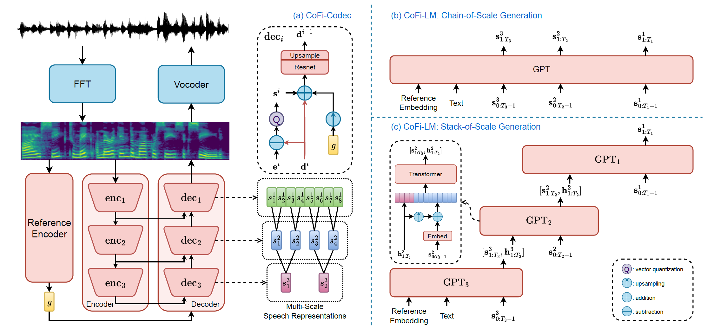

# CoFi-Speech

基本信息

- 标题: "Speaking from Coarse to Fine: Improving Neural Codec Language Model via Multi-Scale Speech Coding and Generation"
- 作者:
  - 01 Haohan Guo,
  - 02 Fenglong Xie,
  - 03 Dongchao Yang,
  - 04 Xixin Wu,
  - 05 Helen Meng
- 链接:
  - [ArXiv](https://arxiv.org/abs/2409.11630)
  - [Publication]
  - [Github]
  - [Demo](https://hhguo.github.io/DemoCoFiSpeech)
- 文件:
  - [ArXiv](_PDF/2409.11630v1__CoFi-Speech__Speaking_from_Coarse_to_Fine_Improving_Neural_Codec_Language_Model_via_Multi-Scale_Speech_Coding_&_Generation.pdf)
  - [Publication] #TODO

## Abstract: 摘要

展开原文

The neural codec language model (CLM) has demonstrated remarkable performance in text-to-speech (TTS) synthesis.
However, troubled by `recency bias`, CLM lacks sufficient attention to coarse-grained information at a higher temporal scale, often producing unnatural or even unintelligible speech.
This work proposes ***CoFi-Speech***, a coarse-to-fine CLM-TTS approach, employing multi-scale speech coding and generation to address this issue.
We train a multi-scale neural codec, ***CoFi-Codec***, to encode speech into a multi-scale discrete representation, comprising multiple token sequences with different time resolutions.
Then, we propose ***CoFi-LM*** that can generate this representation in two modes: the single-LM-based chain-of-scale generation and the multiple-LM-based stack-of-scale generation.
In experiments, ***CoFi-Speech*** significantly outperforms single-scale baseline systems on naturalness and speaker similarity in zero-shot TTS.
The analysis of multi-scale coding demonstrates the effectiveness of ***CoFi-Codec*** in learning multi-scale discrete speech representations while keeping high-quality speech reconstruction.
The coarse-to-fine multi-scale generation, especially for the stack-of-scale approach, is also validated as a crucial approach in pursuing a high-quality neural codec language model for TTS.

神经编解码语言模型 (Neural Codec Language Model, CLM) 在文本转语音领域展示了显著的性能.
然而, 由于 `recency bias` 的影响, CLM 缺乏对较高时间尺度上粗粒度信息的关注, 常常产生不自然甚至难以理解的语音.
这项工作提出了 ***CoFi-Speech***, 一种从粗到细的 CLM-TTS 方法, 采用多尺度语音编码和生成来解决这一问题.

我们训练了一个多尺度神经编解码器 ***CoFi-Codec***, 它将语音编码为多尺度离散表示, 包含不同时间分辨率的多个 Token 序列.
然后提出了 ***CoFi-LM***, 它可以以两种模式生成这一表示:
- 基于单个 LM 的链式尺度生成
- 基于多个 LM 的堆叠尺度生成.

在实验中, ***CoFi-Speech*** 在零样本文本转语音中的自然度和说话者相似度上显著优于单尺度基线系统.
多尺度编码的分析表明了 ***CoFi-Codec*** 在保持高质量语音重建的同时有效地学习了多尺度离散语音表示.

从粗到细的多尺度生成, 尤其是堆叠尺度生成方式, 也被验证为文本转语音追求高质量神经编解码语言模型的重要方法.

## 1.Introduction: 引言

The success of large language models (LLMs) in text domain ([GPT-3 [1]](../TextLM/2020.05.28_GPT-3.md); [GPT-4 [2]](../TextLM/2023.03.15_GPT-4.md); [LLaMA 2 [3]](../TextLM/2023.07.18_LLaMA2.md)) has demonstrated their great capability in discrete sequence generation.
It also inspires the birth of a new text-to-speech synthesis (TTS) paradigm based on the neural codec language model (CLM) ([VALL-E X [4]](2023.03.07_VALL-E_X.md); [TorToise-TTS [5]](../Diffusion/2023.05.12_TorToise-TTS.md); [BASE TTS [6]](2024.02.12_BASE-TTS.md)), which treats TTS as a next-token prediction task.
This framework usually relies on a neural codec ([EnCodec [7]](../Speech_Neural_Codec/2022.10.24_EnCodec.md); [HiFi-Codec [8]](../Speech_Neural_Codec/2023.05.04_HiFi-Codec.md); [DAC [9]](../Speech_Neural_Codec/2023.06.11_Descript-Audio-Codec.md)) to encode the speech audio into discrete tokens, which can be incorporated with the text sequence and generated by the LM, i.e. an auto-regressive decoder.
Finally, we obtain the speech audio from these generated speech tokens via the codec decoder.

However, different from the text, the discrete speech sequence is much longer to keep sufficient capacity to preserve phonetic and acoustic information.
This long sequence length not only increases the complexity of TTS modeling but aggregates the `recency bias` of LMs ([Attention Sorting [10]](../TextLM/T2023.09.28_Attention_Sorting.md); [PINE [11]](../TextLM/T2024.07.01_PINE.md)), i.e. overly focusing on recent tokens during auto-regressive generation.
This issue makes LM focus less on coarse-grained information ([MSMC-TTS [12]](../_tmp/2023.05.02_MSMC-TTS.md)), e.g. phonetics, prosody, and speaking style at higher and different temporal scales, hence causing unstable TTS performance, producing unnatural or even unintelligible speech.
Although monotonic attention constraints ([VALL-E R [13]](2024.06.12_VALL-E_R.md); [VALL-T [14]](2024.01.25_VALL-T.md); [ACI [15]](2024.04.30_ACI.md)) are proposed to fix stability issues, they still cannot solve `recency bias` fundamentally.
Some works ([TorToise-TTS [5]](../Diffusion/2023.05.12_TorToise-TTS.md); [SoCodec [16]](../Speech_Neural_Codec/2024.09.02_SoCodec.md); [Single-Codec [17]](../Speech_Neural_Codec/2024.06.11_Single-Codec.md)) turn to directly model shorter speech sequences with a larger frameshift to avoid this issue, but limits the fine-grained expression of LMs in TTS.
This dilemma implies the necessity of applying guidance to LMs to pay sufficient attention to both coarse-grained and fine-grained information of speech.

In this work, we propose a novel CLM-based zero-shot TTS approach, ***CoFi-Speech***, that generates speech in a coarse-to-fine manner via a multi-scale speech coding and generation approach.
In this framework, the multi-scale speech codec, ***CoFi-Codec***, decomposes speech into multiple discrete sequences with different temporal resolutions and decodes them back with a high reconstruction quality.
Then, we propose two LM-based approaches to predict this multi-scale speech representation from coarse to fine: single-LM-based chain-of-scale generation and multiple-LM-based stack-of-scale generation.
In experiments, we present subjective and objective evaluations to demonstrate that ***CoFi-Speech*** significantly outperforms baseline systems based on single-scale speech sequences on naturalness and similarity, where stack-of-scale generation performs best.
Finally, we conduct detailed ablation studies to analyze multi-scale coding and generation, to further validate the effectiveness of `speaking from coarse to fine` in achieving high-quality CLM-based TTS.

## ~~2.Related Works: 相关工作~~

## 3.Methodology: 方法

### CoFi-Codec

***CoFi-Codec*** aims to decompose speech into multiple discrete sequences with different resolutions to provide a multi-scale speech representation.
Fig.01 (a) presents a three-scale ***CoFi-Codec*** model architecture.
We first convert speech signals into the Mel spectrogram, and employ multiple encoder blocks to down-sample it into sequences at different temporal scales.
Specifically, each encoder block is applied with a 1-D convolutional ResNet block and a strided convolutional layer for down-sampling.
Meanwhile, we follow [SoCodec [16]](../Speech_Neural_Codec/2024.09.02_SoCodec.md) to apply an [ECAPA-TDNN [18]](../_tmp/ECAPA-TDNN.md)-based reference encoder to extract a global embedding $g$ from the Mel spectrogram to capture time-invariant information, e.g., speaker identity, global speaking style, acoustic environment, etc.

In decoding, we apply an equal number of decoder modules to quantize and decode these encoding sequences in a reversed order to reconstruct the Mel spectrogram from coarse to fine.
For example, in $i$-th decoder block, we first extract the residual sequence at this stage by performing $\mathbf{e}^i - \mathbf{d}^i$, i.e. removing high-scale information from the decoding sequence $\mathbf{d}^i$ out of the encoding sequence $\mathbf{e}^i$.
We then apply single-stream [VQ-VAE [19]](../../Modules/VQ/2017.11.02_VQ-VAE.md) or multi-stream vector quantization, e.g. [RQ [20]](../../Modules/VQ/ANNS_RVQ.md) and [PQ [21]](../../Modules/VQ/PQ.md), to obtain the quantized speech sequence $\mathbf{s}^i$.
It is added with $\mathbf{d}^i$ and global embedding $g$, subsequently processed by a ResNet block and a transposed convolutional layer for up-sampling to produce the next decoding sequence $\mathbf{d}^{i-1}$.
Notably, the highest-scale decoder block adopts an all-zero sequence as the decoding sequence.
Finally, the Mel spectrogram is reconstructed from the decoder, and converted to the waveform via a pre-trained neural vocoder.

In training, the model tends to overfit low-scale sequences with richer information, leading to high-scale representation collapse, i.e. nothing is preserved in the sequence.
Hence, we propose scale-wise nested dropout (SWND), which masks quantized sequences $\mathbf{s}_{1:b}$ given an index $b$ randomly sampled from $[0, N_s - 1]$, where $b=0$ indicates that no sequence is masked.
This approach forces high-scale sequence to preserve effective information for reconstruction, avoiding representation collapse.
Moreover, we apply GAN training ([Single-Codec [17]](../Speech_Neural_Codec/2024.06.11_Single-Codec.md); [SoCodec [16]](../Speech_Neural_Codec/2024.09.02_SoCodec.md)) on ***CoFi-Codec*** to improve the generation quality of the Mel spectrogram.
The loss function is written as follows:

$$
\begin{aligned}
    \mathcal{L}_c &= \lambda_{vq} * \mathcal{L}_{vq} + \lambda_{reg} *\mathcal{L}_{reg} +
    \lambda_{adv} * \mathcal{L}_{adv}
\end{aligned}
$$

where $\mathcal{L}_{vq}$ is the vector-quantization loss, i.e. the averaged L2 loss between embeddings before and after VQ, $\mathcal{L}_{reg}$ is the L2-based regression loss on Mel spectrogram, and $\mathcal{L}_{adv}$ is the adversarial loss following [SoCodec [16]](../Speech_Neural_Codec/2024.09.02_SoCodec.md).

### CoFi-LM

To predict the multi-scale discrete representation in a coarse-to-fine manner, we propose ***CoFi-LM*** in two styles: chain-of-scale (CoS) generation and stack-of-scale (SoS) generation.

**Chain-of-scale generation** is a simple extension of CLM to the multi-scale speech representation, which employs one LM to predict speech sequences in descending order of the temporal scale, as shown in Fig.01 (b).
In training, the text and speech sequences are embedded into the same space and processed by a decoder-only Transformer to estimate the probabilities of the next speech tokens.
Notably, for multi-stream speech sequence, we follow the `delay pattern` ([MusicGen [22]](2023.06.08_MusicGen.md); [LiveSpeech [23]](2024.06.05_LiveSpeech.md); [Parler-TTS [24]](2024.02.02_Parler-TTS.md)) to achieve the multi-stream prediction.
This approach explicitly constrains the LM to model multi-scale information to alleviate `recency bias`.
However, concatenating multiple sequences leads to a longer chain, causing higher computing costs and modeling complexity.
To mitigate this issue, we propose stack-of-scale generation.

**Stack-of-scale generation** employs a stack of LMs to generate speech sequences at different scales in cascade, as shown in Fig.01 (c).
It first generates the highest-scale sequence from the text and the reference embedding.
The hidden states $\textbf{h}^3_{1:T_3}$ in the last transformer layer are employed to generate the next-scale sequence.
It is placed at the head of the input sequence as the prompt, and also upsampled to be added to the lower-scale speech sequence to emphasize the alignment between these two sequences.
In this way, we recursively generate all speech sequences from coarse to fine.
This stage-wise approach enables us to better model multi-scale information while avoiding introducing long context to transformers.

Finally, we apply in-context learning (ICL) ([Seed-TTS [25]](2024.06.04_Seed-TTS.md); [CosyVoice [26]](2024.07.07_CosyVoice.md)) to ***CoFi-LM***s for zero-shot TTS.
Specifically, we extract speaker embedding and speech tokens from the reference audio as speech prompts.
The transcript of the reference audio is also concatenated with the input text as the text prompt.

## 4.Experiments: 实验

### Training Configuration

We conduct experiments with [WenetSpeech4TTS](../../Datasets/2024.06.09_WenetSpeech4TTS.md) (Basic), a Chinese dataset with 7k hours of speech data.
All audio files are normalized to the sample rate of 16kHz and converted to 80-dim Mel spectrograms with a frameshift of 10ms.
We create a byte-pair encoding (BPE) based text dictionary with 8192 tokens to encode the text.

***CoFi-Codec*** is applied with 512-dim ResNet modules, each consisting of four residual units with two 1-D convolutional layers. $\text{enc}_1$ and $\text{dec}_1$ are applied with four more residual units to better encode and reconstruct Mel spectrograms.
We train a three-scale ***CoFi-Codec*** with ordered product quantization (OPQ) ([SoCodec [16]](../Speech_Neural_Codec/2024.09.02_SoCodec.md)) to compress the Mel spectrogram into two single-stream sequences with frameshifts of 120ms and 40ms and one four-stream sequence with a frameshift of 20ms.
Each stream in each sequence has a codebook with 16,384 codewords.
In training, we set $\lambda_{vq}=1, \lambda_{reg}=1, \lambda_{adv}=0.1$ and use EMA ([VQ-VAE [19]](../../Modules/VQ/2017.11.02_VQ-VAE.md)) to update codebooks with the decay rate of 0.99.
The discriminator in [Mega-TTS 2 [28]](2023.07.14_Mega-TTS2.md) is employed for adversarial training.
The sampling probabilities for SWND are ${p_0 = 0.8, p_1 = 0.1, p_2 = 0.1}$.
Finally, a pre-trained [BigVGAN [29]](../TTS3_Vocoder/2022.06.09_BigVGAN.md)-based neural vocoder is employed to convert the Mel spectrogram to the waveform.

LMs are applied with 12-layer decoder-only Transformers with a feature dimension of 1024.
For multi-stream speech sequences, we apply a `delay pattern`.
We employ the sampling strategy with a top-p of 0.8, a top-k of 50, and a repetition penalty of 2.0.
***CoFi-Codec*** and LMs are trained using [AdamW [30]](../../Modules/Optimization/2017.11.14_AdamW.md) for 100k iterations with a batch size of 1.6k seconds.
The learning rate exponentially decays from $3\times10^{-4}$ to $1\times10^{-4}$. %\footnote{The implementation and checkpoint of our proposed system will be released after the double-blind peer review.}

### Evaluation Metrics

We create an 860-utterance test set with high diversity in speaking style and audio quality for system evaluation.
In zero-shot TTS, each utterance is paired with another out-of-training-set audio file as the reference audio.
We calculate character error rate (CER, \%), and speaker similarity (SIM, $\times10^{-2}$) to measure intelligibility, and speaker similarity.
The ASR tool for transcribing is available at [Github](https://github.com/modelscope/FunASR).
The tool for extracting speaker embedding is available at [Github](https://huggingface.co/Wespeaker/wespeaker-cnceleb-resnet34)
In \ref{ssec:tts_comparison}, we use a subset with 100 utterances for subjective evaluation.
There are 10 native speakers invited to the test to rate each audio with a score ranging from 1 to 5 in terms of naturalness (NMOS) and speaker similarity (SMOS), respectively.
In codec evaluation, We adopt Mel-cepstrum distortion (MCD, dB) and CER to measure reconstruction quality.

## 5.Results: 结果

### TTS System Comparison

As shown in Table \ref{tab:mos}, we compare ***CoFi-Speech*** with baseline systems: VALL-E and SoCodec-TTS, trained with the same dataset as ours, and the SotA industrial TTS system, CosyVoice trained with over 100k hours of data.
The baseline system VALL-E auto-regressively generates an eight-stream speech sequence with a short frameshift of 20ms along both time and stream axes.
This model troubled by `recency bias` presents serious stability issues on this challenging test set, performing the worst synthesis quality.
SoCodec-TTS compresses speech into a short speech sequence with a frameshift of only 120ms to achieve stable LM inference.
It presents high naturalness but low speaker similarity due to the lack of fine-grained information.
In contrast, ***CoFi-Speech*** leverages both coarse-grained and fine-grained information, presenting better naturalness and similarity, especially for the SoS-based approach with the highest NMOS and SMOS, even outperforming CosyVoice trained with much more data.
This significant improvement underscores the efficacy of ***CoFi-Speech*** in CLM-TTS.
Samples are available at https://hhguo.github.io/DemoCoFiSpeech

### Multi-Scale Speech Coding

We conduct objective evaluations to investigate if ***CoFi-Codec*** can decompose speech into sequences at multiple temporal scales while keeping high reconstruction quality.
As shown in Fig. \ref{fig:msc}, we evaluate speech reconstructed from top-$b$ scales.
For example, for a three-scale ***CoFi-Codec***, `$b=2$` means that we only reconstruct speech using $\textbf{s}^3$ and $\textbf{s}^2$, and mask $\textbf{s}^1$ with all-zero vectors.
The result demonstrates that ***CoFi-Codec*** learns a good multi-scale representation with the help of SWND.
The high-scale sequence preserves more effective information, presenting lower reconstruction loss over that of codec without SWND.
Moreover, compared with the single-scale ***CoFi-Codec*** and [EnCodec [7]](../Speech_Neural_Codec/2022.10.24_EnCodec.md); with a four-stream sequence on a frameshift of 20ms, ***CoFi-Codec*** presents the lowest MCD and CER.
This result validates ***CoFi-Codec*** as the expected codec, providing multi-scale discrete speech representation and keeping high reconstruction quality.

### Recency Bias: Attention Visualization

Finally, we attempt to investigate the `recency bias` issue in CLM-TTS by visualizing attention maps of different LMs when synthesizing the same utterance.
We aggregate attention maps across all heads and layers in one model by adding them together and apply the map with a scaling factor of 0.25 and a max clipping of 1.0 for clearer visualization.
As shown in Fig. \ref{fig:attn}, single-scale LM shows significant recency bias, where each speech frame pays much more attention to the nearest speech tokens and text tokens only relevant to the current pronunciation.
However, in ***CoFi-Speech-CoS***, the high-scale sequence generation presents wider attention to the text and speech context, effectively modeling coarse-grained information.
It then guides the next-scale sequence generation to render fine-grained details.
Similarly, ***CoFi-Speech-SoS*** employs multiple LMs to achieve coarse-to-fine generation.
The first LM absorbs richer contextual information to generate the high-scale sequence and guides the next LMs to generate lower-scale sequences recursively.
This validates the effectiveness of `speaking from coarse to fine` in addressing `recency bias` via explicit multi-scale modeling.

## 6.Conclusions: 结论

This work introduces ***CoFi-Speech***, a novel approach to enhance CLM-based TTS through coarse-to-fine generation.
The framework comprises two key components: 1) ***CoFi-Codec***, a multi-scale speech codec that encodes speech into the discrete, multi-scale representation and decodes them back, and 2) ***CoFi-LM***, which predicts this representation using two strategies: single-LM-based chain-of-scale generation and multiple-LM-based stack-of-scale generation.
The zero-shot TTS experiment demonstrates that ***CoFi-Speech***, especially for the stack-of-scale approach, significantly outperforms baseline systems using single-scale speech sequences in terms of naturalness and speaker similarity.
The ablation study further validates that: 1) ***CoFi-Codec*** is capable of learning multi-scale discrete representations while preserving high-quality speech reconstruction, and 2) ***CoFi-LM*** effectively improves TTS performance via explicit multi-scale modeling.
Finally, the attention visualization substantiates the efficacy of our approach in addressing `recency bias`, providing compelling evidence for its effectiveness in improving CLM-based TTS.
