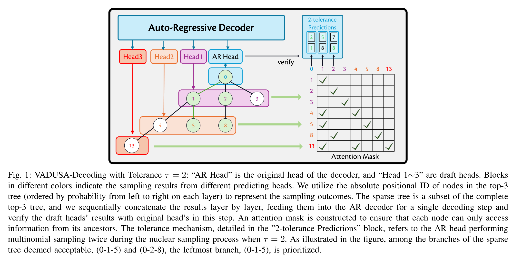
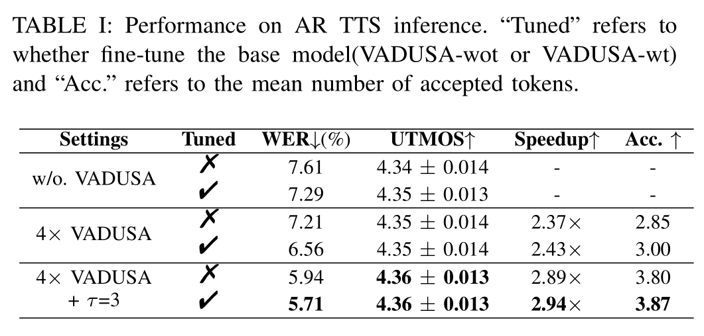
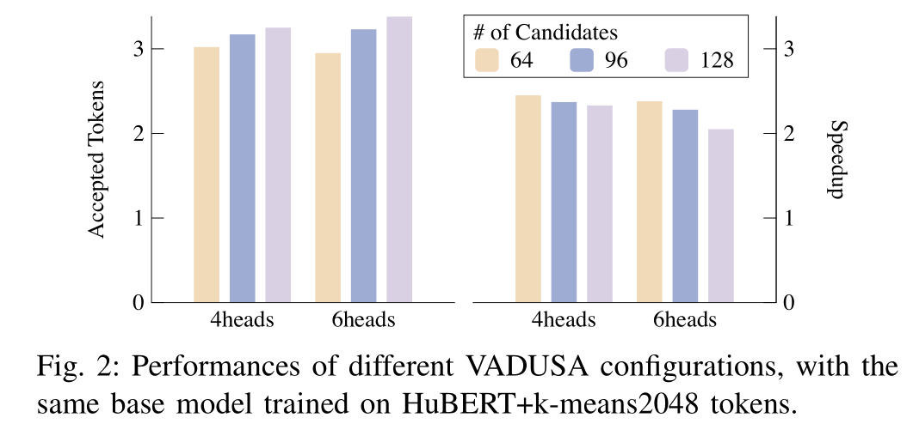
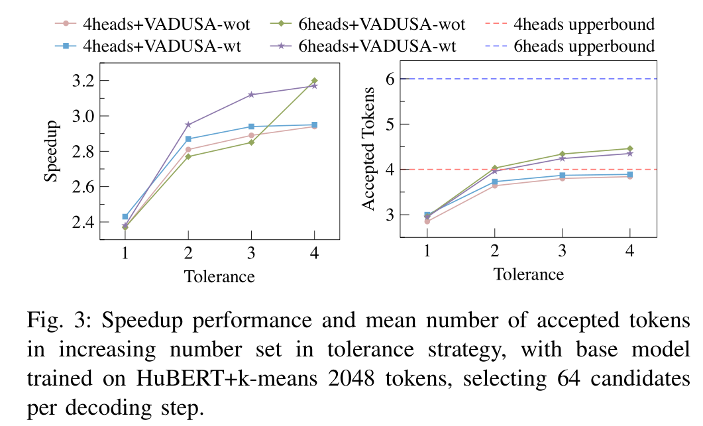
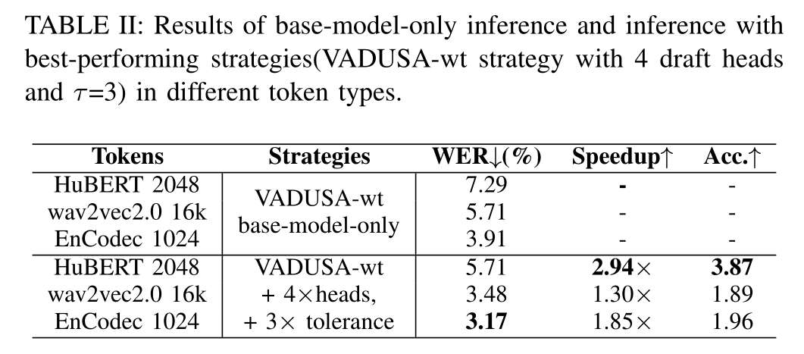
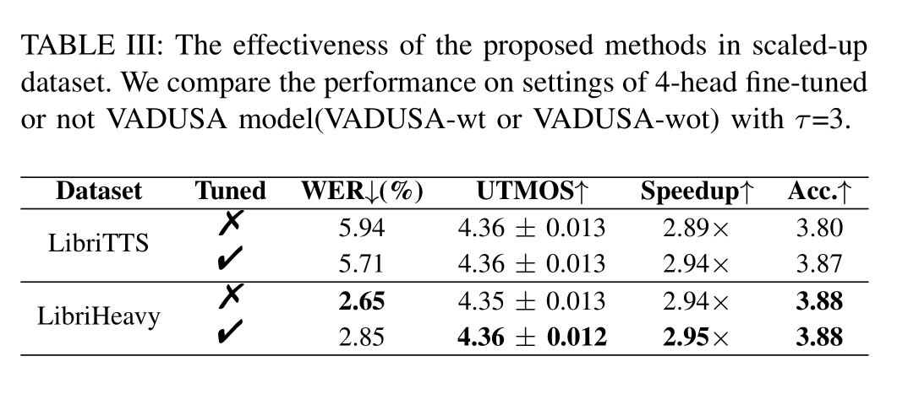

# VADUSA

基本信息

- 标题: "Fast and High-Quality Auto-Regressive Speech Synthesis via Speculative Decoding"
- 作者:
  - 01 Bohan Li,
  - 02 Hankun Wang,
  - 03 Situo Zhang,
  - 04 Yiwei Guo,
  - 05 Kai Yu
- 链接:
  - [ArXiv](https://arxiv.org/abs/2410.21951)
  - [Publication]() Submitted to ICASSP 2025
  - [Github]()
  - [Demo]()
- 文件:
  - [ArXiv](_PDF/2410.21951v1__VADUSA__Fast_and_High-Quality_Auto-Regressive_Speech_Synthesis_via_Speculative_Decoding.pdf)
  - [Publication] #TODO

## Abstract: 摘要

展开原文

The auto-regressive architecture, like GPTs, is widely used in modern Text-to-Speech (TTS) systems.
However, it incurs substantial inference time, particularly due to the challenges in the next-token prediction posed by lengthy sequences of speech tokens.
In this work, we introduce ***VADUSA***, one of the first approaches to accelerate auto-regressive TTS through speculative decoding.
Our results show that ***VADUSA*** not only significantly improves inference speed but also enhances performance by incorporating draft heads to predict future speech content auto-regressively.
Furthermore, the inclusion of a tolerance mechanism during sampling accelerates inference without compromising quality.
Our approach demonstrates strong generalization across large datasets and various types of speech tokens.

 

自回归架构, 如 GPTs, 被广泛用于现代文本转语音系统.
然而, 这种架构具有显著的推理时间开销, 尤其是由于长序列语音 Token 时的下一个 Token 预测.

在本文中, 我们介绍了 ***VADUSA***, 这是首个采用推测解码来加速自回归文本转语音的方法.
我们的结果表明 ***VADUSA*** 通过整合草稿头来自回归预测未来语音内容, 从而既显著提升了推理速度, 又增强了性能.
此外, 在采样过程中引入容忍度机制, 也能加速推理, 而不会损失质量.
我们的方法在大型数据集和各种语音 Token 类型上都表现出了强大的泛化能力.

## 1.Introduction: 引言

展开原文

Large language models (LLMs) with auto-regressive (AR) architectures ([GPT-3 [1]](../TextLM/2020.05.28_GPT-3.md); [LLaMA [2]](../TextLM/2023.02.27_LLaMA.md)) have gained significant success in recent years.
They generate text byte-pair encoding (BPE) tokens using a next-token prediction strategy ([Transformer [3]](../_Transformer/2017.06.12_Transformer.md)).
This strategy samples the next token from a multinomial distribution generated based on the history tokens, which is simple but effective in building coherence over a long context.
With the invention of discrete neural audio tokens ([HuBERT [4]](../Speech_Representaion/2021.06.14_HuBERT.md); [Wav2Vec 2.0 [5]](../Speech_Representaion/2020.06.20_Wav2Vec2.0.md); [VQ-Wav2Vec [6]](../Speech_Representaion/2019.10.12_VQ-Wav2Vec.md); [VQTTS [7]](../E2E/2022.04.02_VQTTS.md); [EnCodec [8]](../Speech_Neural_Codec/2022.10.24_EnCodec.md)), a speech utterance can also be coded as a discrete token sequence.
The paradigm in LLMs is then introduced to the speech modeling and synthesis field.
Studies like [SPEAR-TTS [9]](2023.02.07_SPEAR-TTS.md), [VALL-E [10]](2023.01.05_VALL-E.md) and [BASE-TTS [11]](2024.02.12_BASE-TTS.md) and other works ([VALL-T [12]](2024.01.25_VALL-T.md); [ELLA-V [13]](2024.01.14_ELLA-V.md)) implement decoder-only AR architectures for speech codec generation with large-scale training data, allowing for generating natural-sounding speech.

However, there is a significant difference between text and speech data: the sequence of speech tokens is often much longer than that of text tokens for the same sentence.
For example, a piece of 10-second speech needs 500 HuBERT tokens (50 Hz) ([HuBERT [4]](../Speech_Representaion/2021.06.14_HuBERT.md)) to represent, while the text transcription of the same utterance only costs approximately 20 to 40 text BPE tokens.
It is reasonable because the text is more information-dense, while speech captures finer acoustic details over time, resulting in a longer token sequence.
Moreover, the trivial AR architecture predicts only one token at each inference step, causing speech generation time especially long.
This creates a challenge between the need for low-latency spoken language synthesis and modeling long speech sequences.

To mitigate the issue, one way of previous efforts is to reduce the input/output sequence length via distillation or better information compression, i.e., build low bitrate speech tokens.
A bunch of works on neural codec ([TiCodec [14]](../Speech_Neural_Codec/2023.09.15_TiCodec.md); [Single-Codec [15]](../Speech_Neural_Codec/2024.06.11_Single-Codec.md); [WavTokenizer [16]](../Speech_Neural_Codec/2024.08.29_WavTokenizer.md)) attempt to lower the bitrate via a nicely configured vector quantize (VQ) module and a well-designed training process.
Another inspiring research is aBPE ([aBPE [17]](../Speech_Representaion/2023.10.23_aBPE.md); [Li et al. (2024) [18]](2024.07.04_On_the_Effectiveness_of_Acoustic_BPE_in_Decoder-Only_TTS.md)), which applies BPE to discrete speech tokens, achieving lossless compression and showing big potential in accelerating speech synthesis.
However, these low-bitrate tokens either compromise speech reconstruction accuracy or make the frameshift variant, affecting the naturalness and quality of speech synthesis.

Another way is to predict more speech tokens at one decoding step, which is the main focus of this paper.
This idea has developed since the RNN era, started by Subscale WavRNN ([WaveRNN [19]](../TTS3_Vocoder/2018.02.23_WaveRNN.md)).
It folds the wav token sequence in a subscaling way to realize predicting multiple tokens in parallel.
Recently, [VALL-E 2 [20]](2024.06.08_VALL-E_2.md) uses a chunk-wise manner to generate a chunk of future tokens (typically 2 tokens) in one AR iteration.
However, such methods usually lead to quality degradation because the history condition is insufficient when predicting at least half of a sequence.
In contrast, [speculative decoding [21]](../_Full/Fast_Inference_from_Transformers_via_Speculative_Decoding.md), which is widely used in LLM inference, provides acceleration without performance loss by simply incorporating an additional draft model.

In light of the potential of speculative decoding, we apply the advanced speculative decoding strategy, [MEDUSA [22]](../_Basis/MEDUSA.md), to an AR TTS model, [VALL-E [10]](2023.01.05_VALL-E.md), conducting comprehensive experiments on various discrete tokens.
In attempting to do it, we observed significant challenges.
The complexity and variability inherent in speech synthesis often resulted in suboptimal prediction accuracy and acceptance rates, making it difficult to achieve the desired acceleration and quality.
This prompted us to innovate beyond mere adaptation, leading to the development of the ***VADUSA*** method.
By integrating a tolerance mechanism, ***VADUSA*** not only accelerates the decoding process but also enhances the overall synthesis robustness and quality by effectively managing the speculative decoding's inherent uncertainty.
This novel approach proves crucial in bridging the gap between fast decoding and maintaining high synthesis fidelity.

 

采用自回归架构的大语言模型 ([GPT-3 [1]](../TextLM/2020.05.28_GPT-3.md); [LLaMA [2]](../TextLM/2023.02.27_LLaMA.md)) 在最近几年取得了显著的成功.
它们使用下一个 Token 预测策略来生成文本**字节对编码 (Byte-Pair Encoding, BPE)** Token.
这种策略基于历史 Token 从多项分布中采样下一个 Token, 简单但是有效地构建了长上下文的连贯性.

随着离散神经音频 Token 的出现 ([HuBERT [4]](../Speech_Representaion/2021.06.14_HuBERT.md); [Wav2Vec 2.0 [5]](../Speech_Representaion/2020.06.20_Wav2Vec2.0.md); [VQ-Wav2Vec [6]](../Speech_Representaion/2019.10.12_VQ-Wav2Vec.md); [VQTTS [7]](../E2E/2022.04.02_VQTTS.md); [EnCodec [8]](../Speech_Neural_Codec/2022.10.24_EnCodec.md)), 语音发言也可以被编码为离散 Token 序列.
LLM 的范式随之引入语音建模和合成领域.

诸如 [SPEAR-TTS [9]](2023.02.07_SPEAR-TTS.md), [VALL-E [10]](2023.01.05_VALL-E.md) 和 [BASE-TTS [11]](2024.02.12_BASE-TTS.md) 等研究, 实现了基于大规模训练数据的仅解码器的自回归架构的语音编解码生成, 允许生成自然发音的语音.

然而, 文本和语音数据之间存在着显著差异: 对于相同的句子, 相应的语音 Token 序列通常比文本 Token 序列更长.
例如, 一小段十秒的语音需要 500 个 HuBERT Token (50 Hz) long ([HuBERT [4]](../Speech_Representaion/2021.06.14_HuBERT.md)) 来表示, 而相应的文本转写只需要 20 到 40 个文本 BPE Token.
这是合理的, 因为文本的信息密度更高, 而语音捕捉了随时间变化的细微声学细节, 因此 Token 序列更长.

此外, 简单的自回归架构在每个推理步只预测一个 Token, 导致语音生成时间尤其长.
这就为低延迟的口语语言合成和建模长语音序列带来了挑战.

为了缓解这一问题, 之前的努力之一是通过蒸馏或更好的信息压缩来减少输入/输出序列长度, 即构建低比特率语音 Token.
一系列关于神经编解码器 ([TiCodec [14]](../Speech_Neural_Codec/2023.09.15_TiCodec.md); [Single-Codec [15]](../Speech_Neural_Codec/2024.06.11_Single-Codec.md); [WavTokenizer [16]](../Speech_Neural_Codec/2024.08.29_WavTokenizer.md)) 试图通过良好配置的向量量化 (VQ) 模块和精心设计的训练过程来降低比特率.

另一种启发性的研究是 aBPE ([aBPE [17]](../Speech_Representaion/2023.10.23_aBPE.md); [Li et al. (2024) [18]](2024.07.04_On_the_Effectiveness_of_Acoustic_BPE_in_Decoder-Only_TTS.md)), 它将 BPE 应用于离散语音 Token, 实现无损压缩, 并在加速语音合成方面显示出巨大的潜力.
然而, 这些低比特率 Token 要么牺牲了语音重构精度, 要么使得帧移变化, 影响了语音合成的自然性和质量.

另一种方法是在一个解码步预测更多的语音 Token, 这也是本文的主要关注点.
这种想法从 RNN 时代开始, 由 Subscale WavRNN ([WaveRNN [19]](../TTS3_Vocoder/2018.02.23_WaveRNN.md)) 首次提出.
它以子尺度的方式将 Wav Token 序列折叠, 实现并行预测多个 Token.
最近, [VALL-E 2 [20]](2024.06.08_VALL-E_2.md) 采用分块的方式在一个自回归迭代中生成未来 Token 块 (通常为 2 个 Token), 但这种方法往往导致质量下降, 因为在预测序列至少一半部分时历史条件是不足的.
与此相反, 推测解码 ([Speculative Decoding [21]](../_Full/Fast_Inference_from_Transformers_via_Speculative_Decoding.md)) 广泛用于 LLM 推理, 提供了加速而不损失性能的能力, 仅需将额外的草稿模型集成到架构中.

基于推测解码的潜力, 我们应用先进的推测解码策略 [MEDUSA [22]](../_Basis/MEDUSA.md) 到自回归 TTS 模型 [VALL-E [10]](2023.01.05_VALL-E.md), 进行全面实验, 探索各种离散 Token 的影响.
在尝试这样做时, 我们观察到一些重要挑战.
语音合成中固有的复杂性和可变性往往导致次优的预测准确性和接受率, 使得难以实现所需的加速和质量.
这促使我们超越单纯的适应, 开发了一种新的方法 ***VADUSA***.
通过整合容忍性机制, ***VADUSA*** 不仅能加速解码过程, 还通过有效管理推测解码的固有不确定性来增强整体合成的健壮性和质量.
这种新颖的方法在快速解码和保持高质量合成之间架起了桥梁.

## ~~2.Related Works: 相关工作~~

## 3.Methodology: 方法

展开原文

In this section, we elaborate ***VADUSA***, a novel AR TTS decoding method that simultaneously achieves fast decoding and high-quality speech synthesis.
The section first introduces [MEDUSA [22]](../_Basis/MEDUSA.md), an effective and lossless speculative decoding method for AR transformer-based models.
Then we dig into an unsatisfactory vanilla combination of [VALL-E](2023.01.05_VALL-E.md) and [MEDUSA](../_Basis/MEDUSA.md) and analyze where its limitations come from.
After that, incorporating the tolerance mechanism, we propose ***VADUSA***, a non-trivial integration for [MEDUSA](../_Basis/MEDUSA.md) and [VALL-E](2023.01.05_VALL-E.md), realizing both decoding acceleration and synthesis quality improvements.
Finally, we brief the design of TTS-oriented sparse candidate trees.

 

在本节中, 我们详细介绍了 ***VADUSA***, 一种新的自回归 TTS 解码方法, 它同时实现了快速解码和高质量语音合成.
首先, 我们介绍 [MEDUSA [22]](../_Basis/MEDUSA.md), 一种有效且无损的推测解码方法, 适用于基于 Transformer 的 AR 模型.
然后, 我们深入探讨了 [VALL-E](2023.01.05_VALL-E.md) 和 [MEDUSA](../_Basis/MEDUSA.md) 的简单组合并分析了其局限性所在.
之后, 结合容忍机制, 我们提出了 ***VADUSA***, 一种 [MEDUSA](../_Basis/MEDUSA.md) 和 [VALL-E](2023.01.05_VALL-E.md) 的非平凡集成, 实现了解码加速和合成质量的改进.
最后, 我们简要介绍了面向 TTS 的稀疏候选树的设计.

### A.Speculative Decoding and MEDUSA: 推测解码与 MEDUSA

展开原文

[Speculative decoding [21]](../_Full/Fast_Inference_from_Transformers_via_Speculative_Decoding.md) is an efficient, lossless technique for accelerating AR decoding.
The key idea is to use a small, fast draft model to generate predictions, which are then verified by the target model in parallel.
To avoid the expensive process of training a separate draft model, [MEDUSA [22]](../_Basis/MEDUSA.md) introduces several additional draft heads on top of the original model.
Specifically, in the first pass, say the original prediction head predicts the first next token $t_{1,1}$, then the $i$-th draft head is responsible for predicting the $(i+1)$-th next token $t_{1,i+1}(i \ge 1)$, enabling the generation of multiple tokens in parallel.
The generated first next token and draft tokens will be concatenated in order and input into the same model for the next forward pass.
In the second pass, the model will verify the draft tokens almost in parallel.
For example, $t_{1,2}$ will be accepted iff. it matches the 'correct token' sampled from the distribution produced by the original head of $t_{1,1}$.
Similarly, $t_{1,3}$ will be accepted iff. $t_{1,2}$ is accepted and it matches the first next token of $t_{1,2}$.
Assume that $t_{1,3}$ is accepted and $t_{1,4}$ is rejected, then the original head and draft heads of $t_{1,3}$ will predict $t_{2,1}, t_{2,2}, \dots$ to feed the third pass, and the draft acceptance length for the second pass is 2.

To make better 'guesses', [MEDUSA](../_Basis/MEDUSA.md) also considers multiple candidate tokens for each head and constructs a draft tree where the root node represents the first next token, each node a candidate token, and each root path a candidate continuation.
For each draft head, the tokens with top-$k$ logits are chosen as candidates.
Each non-leaf node has $k$ children.
The $(i+1)$-th layer has $k^{i-1}$ nodes and is filled with the top-$k$ tokens produced by the $i$-th draft head.
All the root-to-leaf paths form all possible combinations of the candidates.
With a carefully constructed tree mask, the whole tree of tokens can be verified within one forward pass (named tree attention).
This approach significantly improves both the acceptance length of drafts and the extra computational cost is also reasonable by facilitating sparse trees that will be introduced in [Section 3-D](#sparse-tree).
The simplicity of [MEDUSA](../_Basis/MEDUSA.md) draft heads and the compatibility with any transformer-based AR model make [MEDUSA](../_Basis/MEDUSA.md) highly adaptable and efficient.

 

[推测解码 [21]](../_Full/Fast_Inference_from_Transformers_via_Speculative_Decoding.md) 是一种有效且无损的用于加速自回归解码的技术.
其关键思想是使用一个小型且快速的草稿模型来生成预测, 然后由目标模型并行验证.

为了避免训练单独草稿模型的昂贵过程, [MEDUSA [22]](../_Basis/MEDUSA.md) 在原始模型之上引入了数个额外的草稿头.
具体来说, 在第一次前向传播时, 假设原始的预测头预测了第一个下一个 Token $t_{1,1}$, 那么第 $i$-个草稿头就负责预测第 $(i+1)$ 个下一个 Token $t_{1,i+1}(i \ge 1)$, 使得模型可以并行生成多个 Token.
生成的第一个下一个 Token 和草稿 Token 将按顺序连接并输入到同一个模型中进行下一次的前向传播.
在第二遍中, 模型将几乎并行地验证草稿 Token.

例如, $t_{1,2}$ 被接受当且仅当它与 $t_{1,1}$ 的原始头产生的分布所采样出的 '正确 Token' 匹配.
类似地, $t_{1,3}$ 被接受当且仅当 $t_{1,2}$ 被接受且与 $t_{1,2}$ 的第一个下一个 Token 匹配.
假设 $t_{1,3}$ 被接受且 $t_{1,4}$ 被拒绝, 那么 $t_{1,3}$ 的原始头和草稿头将预测 $t_{2,1}, t_{2,2}, \dots$ 作为第三遍的输入, 第二遍的草稿接受长度为 2.

为了使得 '猜测' 更好, [MEDUSA](../_Basis/MEDUSA.md) 还考虑每个头的多个候选 Token, 并构造了一个草稿树, 树的根节点代表第一个下一个 Token, 节点是候选 Token, 根路径是候选的延续.
对于每个草稿头, 选取其预测值的前 $k$ 个 Token 作为候选.
每个非叶节点有 $k$ 个子节点.
第 $(i+1)$ 层有 $k^{i-1}$ 个节点, 填充了第 $i$ 个草稿头所预测的前 $k$ 个 Token.
所有的根到叶路径形成了候选的组合.
通过精心构建的树掩码, 整个 Token 树可以在一次前向传播中验证 (称为树注意力 Tree Attention).
这种方法显著提高了草稿的接受长度, 并通过利用稀疏树, 额外的计算成本也可接受, 这将在 [第 3 节 D 小节](#sparse-tree) 中介绍.
[MEDUSA](../_Basis/MEDUSA.md) 草稿头的简单性和与任何基于 Transformer 的 AR 模型的兼容性使得 [MEDUSA](../_Basis/MEDUSA.md) 高度可适应和高效.

### B.Vanilla Combination and Re-thinking: 简单组合与反思

展开原文

In the vanilla version of ***VADUSA***, we simply use a [VALL-E](2023.01.05_VALL-E.md) TTS model as a base model for speech synthesis and integrate several [MEDUSA](../_Basis/MEDUSA.md) heads on top of it to speed up generation.
However, in initial experiments, we found its acceptance length is not comparable to the results of [MEDUSA](../_Basis/MEDUSA.md) on text LLMs.
This is because speech tokens such as those generated by systems like [EnCodec [8]](../Speech_Neural_Codec/2022.10.24_EnCodec.md), [HuBERT [4]](../Speech_Representaion/2021.06.14_HuBERT.md), and [Wav2Vec 2.0 [5]](../Speech_Representaion/2020.06.20_Wav2Vec2.0.md), are obtained through vector quantization or clustering of IDs, rather than having distinct abstract semantic differences like text tokens ([Choi et al. (2024) [23]](../_Full/2024.06.12_Self-Supervised_Speech_Representations_are_More_Phonetic_than_Semantic.md)).
Under the AR language modeling paradigm, multiple speech tokens often have very similar statistical features.
This means that the multinomial distributions predicted by models like [VALL-E](2023.01.05_VALL-E.md) tend to be more 'average' and selecting the highest probability top-$k$ tokens using draft heads only covers a small probability range.
Given that during validation the original head samples only once as the 'correct token', it is challenging for the draft heads in [VALL-E](2023.01.05_VALL-E.md) to make accurate predictions.

Moreover, from the perspective of improving sample quality, tree attention can be seen as an efficient version of beam search.
In beam search, by foreseeing tokens of the next few steps, we can select the combination with the highest probability to improve the sample quality.
Similarly, under tree attention, we use draft heads to foresee the future tokens, and we hope the model accepts a candidate path with a higher accept probability.

 

在 ***VADUSA*** 的原始版本中, 我们将 [VALL-E](2023.01.05_VALL-E.md) TTS 模型作为语音合成的基础模型, 并在其之上集成多个 [MEDUSA](../_Basis/MEDUSA.md) 头来加速生成.
然而, 在初步实验中, 我们发现其接受长度无法与 [MEDUSA](../_Basis/MEDUSA.md) 在文本 LLMs 的结果相比.
这是因为像 [EnCodec [8]](../Speech_Neural_Codec/2022.10.24_EnCodec.md), [HuBERT [4]](../Speech_Representaion/2021.06.14_HuBERT.md), 和 [Wav2Vec 2.0 [5]](../Speech_Representaion/2020.06.20_Wav2Vec2.0.md) 这样的系统生成的语音 Token 都是通过向量量化或 ID 聚类得到的, 而不是像文本 Token 那样具有独特的语义差异 ([Choi et al. (2024) [23]](../_Full/2024.06.12_Self-Supervised_Speech_Representations_are_More_Phonetic_than_Semantic.md)).
在自回归语言建模范式下, 多个语音 Token 往往具有非常相似的统计特征.
这意味着像 [VALL-E](2023.01.05_VALL-E.md) 这样的模型预测的多项分布往往更加 '平均', 而仅使用草稿头来选择概率最高的前 $k$ 个 Token 仅仅覆盖了很小的概率范围.
由于在验证时, 原始头只采样一次作为 '正确 Token', 因此 [VALL-E](2023.01.05_VALL-E.md) 中的草稿头在准确预测时面临着困难.

此外, 从提高样本质量的角度来看, 树注意力可以看作是 Beam 搜索的一种高效版本.
在 Beam 搜索中, 通过预见下几个步骤的 Token, 我们可以选择概率最高的组合来提高样本质量.
类似地, 在树注意力下, 我们使用草稿头来预见未来的 Token, 并希望模型接受一个概率较高的候选路径.

### C.VADUSA Decoding with the Tolerance Mechanism: 结合容忍性机制的 VADUSA 解码

展开原文

We propose ***VADUSA*** decoding method with tolerance mechanism to help the [VALL-E](2023.01.05_VALL-E.md) model achieve a higher acceleration rate and better synthesis quality concurrently.
The tolerance mechanism allows the original head to sample multiple times, which means the 'correct tokens' is also multiple.
The number of original head's samplings is controlled by the tolerance value $\tau$.
Fig.01 demonstrates the process of our method when $\tau = 2$.
For the root node and every accepted node, at most 2 children would be accepted.
If multiple paths are accepted, we choose the one with the largest accept probability.
In this way, on the one hand, with a slightly higher cost of the verification process, the acceptance length is considerably increased and finally leads to a higher real acceleration rate.
On the other hand, by choosing the best candidate path among all accepted paths, the sample quality is improved compared to a trivial single-time sampling strategy.

Note that ***VADUSA*** can still be compatible with any improved sampling strategy.
For instance, methods such as avoiding sequential repetition in [VALL-E 2 [20]](2024.06.08_VALL-E_2.md) and constraining the attention window in ACI ([MEDUSA [22]](../_Basis/MEDUSA.md)) can be integrated simply by taking the sampling outcomes of these strategies as the predictions of the original head.
If multiple tolerances are present, we can sample multiple times using the aforementioned strategies.
This ensures that while the quality of sampling is maintained, acceleration effects are also achieved.
In our experiments, we will evaluate using only the normal sampling method.

 

我们提出了 ***VADUSA*** 解码方法, 结合一个容忍性机制, 以帮助 [VALL-E](2023.01.05_VALL-E.md) 模型同时实现更高的加速比和更好的合成质量.
容忍性机制允许原始头多次采样, 这意味着 '正确 Token' 也可能是多个.
原始头的采样次数由容忍值 $\tau$ 控制.

图 01 展示了我们方法当容忍值为 2 时的过程.
对于根节点和每个被接受的节点, 最多会有两个子节点被接受.
如果多条路径被接受, 我们选择概率最大的那条路径.

通过这种方式, 一方面虽然验证过程的成本略有增加, 但接受长度显著增加, 最终获得更高的实际加速比.
另一方面, 通过在所有被接受路径中选择最佳候选路径, 样本质量相比一次性采样策略有所提高.

注意到 ***VADUSA*** 仍然可以与任何改进的采样策略兼容.
例如, [VALL-E 2 [20]](2024.06.08_VALL-E_2.md) 中避免顺序重复的方法和 ACI ([MEDUSA [22]](../_Basis/MEDUSA.md)) 中限制注意力窗口的方法, 只需将这些策略的采样结果视为原始头的预测即可.
如果存在多个容忍值, 我们可以使用上述策略多次采样.
这可以确保采样质量得到保持, 也能实现加速效果.
在我们的实验中, 我们将只使用正常采样方法进行评估.

### D.TTS-Oriented Sparse Tree Design: 面向 TTS 的稀疏树设计

展开原文

In practice, $k$ is usually set as 10, i.e., each non-leaf candidate node has 10 children, which leads to an exponential explosion in the node number of the full candidate tree.
To reduce the computational cost of tree attention, we need to design a sparse tree that only contains a tiny part of the candidate tree.
Within a constrained number of nodes, we expect the sparse tree to help the model make as many acceptances as possible.
Therefore, the design of sparse trees depends on the choice of calibration dataset and the output distribution of draft heads (otherwise, we cannot obtain the acceptance probability).
Unfortunately, the existing trees provided by [MEDUSA](../_Basis/MEDUSA.md) are based on text datasets and BPE tokenizers, which may not fit in speech synthesis scenarios.

Using the criterion of maximizing the expectation of accepted length, we use the off-the-shelf greedy algorithm in [MEDUSA [22]](../_Basis/MEDUSA.md) to build a TTS-oriented sparse tree.
Specifically, for each type of discrete audio token we use, we separately train a ***VADUSA*** model.
Then, we run forward passes with the full tree on a subset of [LibriTTS [24]](../../Datasets/2019.04.05_LibriTTS.md) to obtain the accepted probability of each node.
Finally, we run the greedy algorithm to build the sparse tree for each token type.

 

在实践中, $k$ 通常设置为 10, 即每个非叶子候选节点有 10 个子节点, 这会导致候选树的节点数量呈指数增长.
为了减少树注意力的计算成本, 我们需要设计一个仅包含候选树的一小部分的稀疏树.
在有限的节点数量内, 我们期望稀疏树能够帮助模型做到尽可能多的接受.
因此, 稀疏树的设计取决于选择的校准数据集和草稿头的输出分布 (否则, 我们无法获得接受概率).
不幸的是, [MEDUSA](../_Basis/MEDUSA.md) 提供的现有树都是基于文本数据集和 BPE 分词器, 这可能不适用于语音合成场景.

使用最大化接受长度的期望的标准, 我们使用 [MEDUSA [22]](../_Basis/MEDUSA.md) 中的贪婪算法来构建 TTS 方向的稀疏树.
具体来说, 对于我们使用的每个离散音频 Token 类型, 我们单独训练一个 ***VADUSA*** 模型.
然后, 我们在 [LibriTTS [24]](../../Datasets/2019.04.05_LibriTTS.md) 的子集上运行完整树的前向传递, 以获得每个节点的接受概率.
最后, 我们使用贪婪算法来为每个 Token 类型构建稀疏树.

## 4.Experiments: 实验

展开原文

All experiments are conducted on NVIDIA A800-SXM4-80GB GPUs, including training with different strategies and evaluation on both objective and subjective metrics.
Our implementation is adapted from the open-source repositories.
- [VALL-E](2023.01.05_VALL-E.md) Reproduction: https://github.com/lifeiteng/vall-e
- [MEDUSA](../_Basis/MEDUSA.md): https://github.com/FasterDecoding/MEDUSA.

 

所有实验都在 NVIDIA A800-SXM4-80GB 显卡上进行, 包括使用不同的策略训练和在客观和主观指标上评估.
我们的实现是基于开源仓库的.
- [VALL-E](2023.01.05_VALL-E.md) 复现: https://github.com/lifeiteng/vall-e
- [MEDUSA](../_Basis/MEDUSA.md): https://github.com/FasterDecoding/MEDUSA.

### Experimental Setups: 实验设置

#### Architecture of TTS system and draft heads: TTS 系统和草稿头的架构

展开原文

The whole system is cascaded by tokenizers of text and speech, a codec language model, and a speech-codec-based vocoder.
The codec language model, which is the main part of the system, consisted of 12 transformer layers, with 16 attention heads, 1024 hidden dimensions and 4096 feed-forward dimensions.
We utilize a grapheme-to-phoneme converter as the text tokenizer.
We tokenize speech with 2048 k-means clustering on features from the last layer of a [HuBERT-large [4]](../Speech_Representaion/2021.06.14_HuBERT.md) model.
Two additional speech tokens are used in the ablation study: [Wav2Vec 2.0 [5]](../Speech_Representaion/2020.06.20_Wav2Vec2.0.md) with its 2-group vector quantization using IDs of top 16000 statistically occuring frequency groups on [LibriTTS [24]](../../Datasets/2019.04.05_LibriTTS.md), and [EnCodec [8]](../Speech_Neural_Codec/2022.10.24_EnCodec.md) with its 8-layer residual vector quantization of 1024 size per codebook.
All models used in tokenizers are pretrained.
The vocoder, CTX-vec2wav ([UniCATS [25]](../Diffusion/2023.06.13_UniCATS.md)), is constructed by two conformer blocks with 2 layers and 184 attention dimensions and a [HiFi-GAN [26]](../TTS3_Vocoder/2020.10.12_HiFi-GAN.md), trained for converting semantic tokens to waveform. ***VADUSA*** draft heads are connected to the last transformer layer of the codec language model, constructed by a residual block with a linear layer and a [SiLU activation layer [27]](../../Modules/Activation/SiLU.md).

 

整个系统由文本和语音的分词器, 编解码语言模型, 以及基于语音-编解码的声码器级联而成.
编解码语言模型, 即系统的主要部分, 由 12 层 Transformer 层组成, 每层有 16 个注意力头, 1024 隐藏维度和 4096 前馈维度.
我们使用 Grapheme-to-Phoneme 转换器作为文本分词器.
我们使用 [HuBERT-large [4]](../Speech_Representaion/2021.06.14_HuBERT.md) 模型的最后一层的特征对语音进行 2048 个 K 均值聚类, 以进行语音分词.
在消融实验中使用了两种额外的语音 Token:
- [Wav2Vec 2.0 [5]](../Speech_Representaion/2020.06.20_Wav2Vec2.0.md) 使用 2-组向量量化, 基于 [LibriTTS [24]](../../Datasets/2019.04.05_LibriTTS.md) 统计出现频率最高的 16000 个频率组的 ID.
- [EnCodec [8]](../Speech_Neural_Codec/2022.10.24_EnCodec.md), 使用 8 层残差向量量化, 每个码本大小为 1024.

分词器中使用的所有模型均为预训练模型.

声码器 CTX-vec2wav ([UniCATS [25]](../Diffusion/2023.06.13_UniCATS.md)) 由两个具有两层和 184 个注意力维度的 Conformer 块以及 [HiFi-GAN [26]](../TTS3_Vocoder/2020.10.12_HiFi-GAN.md) 组成, 用于将语义 Token 转换为波形.
***VADUSA*** 草稿头连接到编解码语言模型的最后一个 Transformer 层, 由一个带有线性层和 SiLU 激活层的残差块构成.

#### Training Settings: 训练设置

展开原文

We perform experiments on both [LibriHeavy [28]](../../Datasets/2023.09.15_Libriheavy.md) with 50k hours of English speech data and [LibriTTS [24]](../../Datasets/2019.04.05_LibriTTS.md) with 585 hours.
For the codec language model, we train two versions as the base model on them separately as foundational training stage: one epoch on Libriheavy or 20 epochs on LibriTTS,  where the learning rates are 0.05 and the warm-up steps are set as 200.
Then we trained ***VADUSA*** heads on LibriTTS for 10 epochs with a fixed base model, mentioned as ***VADUSA-wot*** (without tuning) and fine-tuning base model, mentioned as ***VADUSA-wt*** (with tuning), where the learning rates are both 0.002 and warm-up steps are set as 40.
For the vocoder, replicas of CTX-vec2wav ([UniCATS [25]](../Diffusion/2023.06.13_UniCATS.md)) are trained for senmatic tokens of HuBERT and wav2vec2.0 on LibriTTS for 1 million steps.

 

我们在 [LibriHeavy [28]](../../Datasets/2023.09.15_Libriheavy.md) 和 [LibriTTS [24]](../../Datasets/2019.04.05_LibriTTS.md) 两个数据集上进行实验.
对于编解码语言模型, 我们分别在 LibriHeavy 或 LibriTTS 上训练两个版本作为基础模型, 作为基础训练阶段: LibriHeavy 训练 1 个 Epoch 或 LibriTTS 训练 20 个 Epoch, 学习率为 0.05, 预热步数为 200.
然后我们在 LibriTTS 上训练 ***VADUSA*** 头, 其中固定的基础模型为 ***VADUSA-wot*** (无微调), 微调后的模型为 ***VADUSA-wt*** (微调), 学习率均为 0.002, 预热步数为 40.
对于声码器, 我们在 HuBERT 和 wav2vec2.0 的语义 Token 上训练 CTX-vec2wav 的复制品 ([UniCATS [25]](../Diffusion/2023.06.13_UniCATS.md)), 训练 1 百万步.

#### Configurations in decoding strategy: 解码策略配置

展开原文

We apply the nuclear sampling method with top-$p$, setting the temperature to 0.9 and 1.0, on both the original head of the base model and the draft heads of ***VADUSA***.
The number of draft heads is set to 4 or 6.
For the draft tree, the top-$k$ value is fixed at 10 to define the branching factor, and 64 nodes are selected as candidates by default, with 96 and 128 nodes used for ablation studies.
Candidate expectations were calculated using over 3000 audio samples, each longer than 6 seconds, from the LibriTTS dataset to construct the sparse tree.
For the tolerance mechanism, we set $\tau$ values ranging from 1 to 4 across all configurations.

 

我们对基础模型的原始头和 ***VADUSA*** 的草稿头应用核采样方法, 设置 Top-P 值为 0.9, 温度为 1.0.
草稿头的数量设为 4 或 6.
对于草稿数, Top-K 的值固定为 10 以定义分支因子, 并默认选择 64 个候选节点, 96 和 128 个节点用于消融实验.
候选期望由 LibriTTS 数据集中超过 3000 个音频样本计算得出, 其中每个音频样本的长度超过 6 秒, 用于构造稀疏树.
容忍性机制的 $\tau$ 值在所有配置中从 1 到 4 之间变化.

### Evaluations: 评估

展开原文

The exploration of inference speedup is conducted by measuring the number of discrete tokens generated per second during AR inference in the codec language model.
The speedup ratio is calculated by dividing the output rate of the model equipped with ***VADUSA*** heads by that of the baseline model.
Additionally, the number of the mean accepted tokens is used to assess the effectiveness of the ***VADUSA*** decoding with the tolerance mechanism.
TTS performance is evaluated using word error rates (WER) measured by a conformer-transducer model ([Github](https://huggingface.co/nvidia/stt\_en\_fastConformer\_transducer\_large)).
We also use the UTokyo-SaruLab MOS (UTMOS) prediction system ([Github](https://github.com/sarulab-speech/UTMOS22)) to evaluate synthesis quality of the generated speech objectively.
As shown in Table.01, the experimental settings varies in three key aspects: (1) whether 4 ***VADUSA*** heads or only base model participates during inference; (2) ***VADUSA-wot*** or ***VADUSA-wt*** is used; and (3) whether the tolerance mechanism is applied by setting $\tau$=3.

The results suggest that ***VADUSA*** performs well in AR TTS systems.
Inference acceleration is substantial, with no degradation in generation quality—in fact, performance improved when the tolerance mechanism is applied or when the base model is tuned.
This improvement is particularly noticeable in models trained on smaller datasets, where the ***VADUSA*** heads help capture in-context information.
This behavior contrasts with the application of similar strategies in LLMs for natural language modeling tasks.

 

推理加速的探索通过测量编解码语言模型在自回归推理期间每秒生成的离散 Token 数量来进行.
加速比通过将带有 ***VADUSA*** 头的模型的输出速率除以基线模型的输出速率来计算.
此外, 平均接受 Token 数量用于评估结合容忍性机制的 ***VADUSA*** 解码的有效性.
TTS 性能通过一个 conformer-transducer 模型 ([Github](https://huggingface.co/nvidia/stt_en_fastConformer_transducer_large)) 计算 WER 来评估.
我们还使用 UTokyo-SaruLab MOS (UTMOS) 预测系统 ([Github](https://github.com/sarulab-speech/UTMOS22)) 来客观评估生成的语音的合成质量.
如表 1 所示, 实验设置在三个关键方面各异:
(1) 参与推理的模型是基础模型还是带有 4 个 ***VADUSA*** 头;
(2) 使用的是 ***VADUSA-wot*** 或 ***VADUSA-wt***;
(3) 是否使用容忍性机制, 即设置 $\tau$=3.

结果表明, ***VADUSA*** 在 AR TTS 系统中表现卓越.
推理加速显著, 生成质量无损——实际上, 在应用容忍性机制或微调基础模型时, 性能有所提升.
这种改进在较小数据集上尤为显著, 因为 ***VADUSA*** 头能够帮助捕捉到上下文信息.
与自然语言建模任务中的类似策略相比, 这种表现有所不同.

## 5.Results: 结果

### Ablation Study: 消融研究

展开原文

In this section, we present results from various configurations of the proposed methods.
Furthermore, we demonstrate their overall effectiveness on large public datasets and different types of discrete speech tokens, which can serve as a valuable reference for future implementations.

 

本节, 我们展示了所提出的各种方法的各种配置的结果.
此外, 我们展示了它们在大型公共数据集和不同类型的离散语音 Token 上的整体有效性, 这可以作为未来实现的有价值的参考.

#### Effectiveness analysis of VADUSA configurations and tolerance strategy: VADUSA 配置和容忍策略的有效性分析

展开原文

We adjusts the candidate length to represent the number of selected nodes in sparse tree construction.
The results, shown in Fig.02, reveal performance variations of ***VADUSA-wt*** with draft heads set to {4, 6} and candidate choices set to {64, 96, 128}.
Contrary to expectations, increasing the number of candidates does not result in improved speedup performance, due to the increased computational cost associated with accepting a higher number of candidates.
The tolerance mechanism is varied between 1 and 4, with 4 or 6 heads trained using either the ***VADUSA-wot*** or ***VADUSA-wt*** strategy.
As illustrated in Fig.03, the tolerance mechanism performs well in general ***VADUSA*** configurations, with a larger tolerance value leading to better acceleration.

 

我们调整候选长度以表示稀疏树构造中选择节点的数量.

如图 02 所示, 结果表明, 带有 4 或 6 个草稿头的 ***VADUSA-wt*** 在候选选择范围 {64, 96, 128} 上的性能变化.
与预期相反, 增加候选数量并不能提高加速性能, 这是因为接受更多候选导致的计算成本增加.

容忍性机制在 1 和 4 之间变化, 4 或 6 个头使用 ***VADUSA-wot*** 或 ***VADUSA-wt*** 策略训练.
如图 03 所示, 容忍性机制在一般的 ***VADUSA*** 配置中表现良好, 较大的容忍值获得更好的加速.

#### Performance of Different Speech Tokens: 不同语音 Token 的性能

展开原文

To demonstrate the effectiveness of the methods across different tokens, we conduct experiments on both semantic and acoustic tokens.
For semantic tokens, we utilize HuBERT-extracted tokens with 2048 k-means clusters, as well as wav2vec2.0-extracted tokens with the top-16000 frequency in LibriTTS of a combined 2-group codebook.
For acoustic tokens, we employ the EnCodec model, pre-trained with 50Hz RVQ and 8 codebooks of size 1024.
The results presented in Tab.02 indicate that ***VADUSA*** training strategies and the proposed tolerance mechanism are adaptable to both large-codebook semantic tokens and acoustic tokens.
However, due to the large codebook size of wav2vec2.0 and the remaining seven codebooks of EnCodec, the logit distributions from the prediction heads are relatively flat, resulting in low prediction accuracy and consequently reduced acceptance rates for draft heads.
This explains the suboptimal performance of decoding speedup observed in both cases.
Adjusting the top-$k$ parameter during sparse tree construction may offer a potential solution.

 

为了展示方法在不同 Token 上的有效性, 我们在语义和音频 Token 上进行实验.
对于语义 Token, 我们使用 HuBERT 提取的具有 2048 个 K 均值聚类的 Token 以及 wav2vec2.0 提取的 LibriTTS 中出现频率前 16000 的 2 组码本组合的 Token.
对于声学 Token, 我们使用预训练的 EnCodec 模型, 具有 50Hz RVQ 和 8 个大小为1024的码本.

表 02 中的结果表明, ***VADUSA*** 训练策略和提出的容忍性机制适用于大码本语义 Token 和声学 Token.
然而, 由于 wav2vec2.0 的码本大小较大以及 EnCodec 剩余的七个码本, 预测头的概率分布相对平坦, 导致预测准确性较低, 进而导致草稿头的接受率降低.
这解释了在这两种情况下观察到的解码加速的次优性能.
在稀疏树构建期间调整 top-k 参数可能提供一个潜在的解决方案.

#### Generality in large dataset: 大数据集的通用性

展开原文

Our strategies also demonstrate generalizability on a scaled-up dataset, LibriHeavy, which contains approximately 50,000 hours of audiobook audio.
Aside from the Word Error Rates (WERs), the performance of the proposed methods is consistent with that observed on the smaller LibriTTS dataset.
The discrepancy in WERs is understandable, as the capacity of additional heads to learn in-context information has inherent limitations.
This reflects a trade-off that arises when relying on draft heads within the constraints of the base model.

 

我们的策略还展示了在大型数据集 LibriHeavy 上的通用性, 该数据集包含约 50,000 小时的有声书音频.
除 WERs 以外, 所提出的方法的性能和在较小的 LibriTTS 数据集上观察到的性能保持一致.
WERs 的差异是可理解的, 因为额外的头在学习上下文信息方面的能力有固有的限制.
这反映了在基础模型约束下依赖草稿头所产生的权衡.

## 6.Conclusions: 结论

展开原文

In conclusion, ***VADUSA***, inspired by the integration of [VALL-E](2023.01.05_VALL-E.md) and [MEDUSA](../_Basis/MEDUSA.md), demonstrates impressive effectiveness in accelerating AR TTS decoding and enhancing speech quality.
This is due to the draft heads' ability to learn in-context information, expanding the capabilities of TTS models.
This approach benefits AR models like [VALL-E](2023.01.05_VALL-E.md), which often exhibit instability in speech synthesis.
By selecting the most appropriate tokens in just a few decoding steps, ***VADUSA*** reduces the likelihood of collapse caused by incorrect token selection.
The proposed tolerance mechanism further enhances this effect.
Moreover, experimental results highlight the method's generalizability, offering valuable insights for future exploration and implementation.

 

总而言之, ***VADUSA*** 受 [VALL-E](2023.01.05_VALL-E.md) 和 [MEDUSA](../_Basis/MEDUSA.md) 的集成启发, 在加速 AR TTS 解码和提升语音质量方面表现卓越.
这是由于草稿头学习上下文信息的能力, 扩展了 TTS 模型的能力.
这种方法对像 [VALL-E](2023.01.05_VALL-E.md) 这样的 AR 模型有益, 它们经常在语音合成中显示不稳定性.
通过在几步解码中选择最适合的 Token, ***VADUSA*** 减少了由于错误选择导致的崩溃的可能性.
提出的容忍性机制进一步增强了这种效果.
此外, 实验结果突出了该方法的通用性, 为未来探索和实现提供有价值的见解.