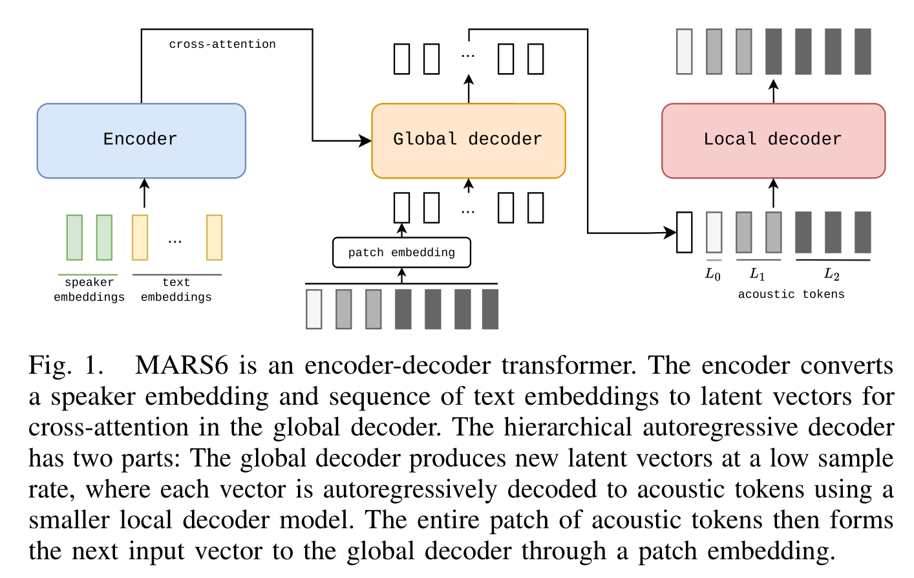

# MARS6

基本信息

- 标题: "MARS6: A Small and Robust Hierarchical-Codec Text-to-Speech Model"
- 作者:
  - 01 Matthew Baas (Camb-AI)
  - 02 Pieter Scholtz (Camb-AI)
  - 03 Arnav Mehta (Camb-AI)
  - 04 Elliott Dyson (Camb-AI)
  - 05 Akshat Prakash (Camb-AI)
  - 06 Herman Kamper (Camb-AI)
- 链接:
  - [ArXiv](https://arxiv.org/abs/2501.05787)
  - [Publication]() ICASSP 2025
  - [Github](https://github.com/Camb-ai/mars6-turbo/)
  - [Demo](https://camb-ai.github.io/mars6-turbo/)
- 文件:
  - [ArXiv](_PDF/2501.05787v1__MARS6__A_Small_and_Robust_Hierarchical-Codec_Text-to-Speech_Model.pdf)
  - [Publication] #TODO

## Abstract: 摘要

展开原文

Codec-based text-to-speech (TTS) models have shown impressive quality with zero-shot voice cloning abilities.
However, they often struggle with more expressive references or complex text inputs.
We present ***MARS6***, a robust encoder-decoder transformer for rapid, expressive TTS.
***MARS6*** is built on recent improvements in spoken language modelling.
Utilizing a hierarchical setup for its decoder, new speech tokens are processed at a rate of only 12 Hz, enabling efficient modelling of long-form text while retaining reconstruction quality.
We combine several recent training and inference techniques to reduce repetitive generation and improve output stability and quality.
This enables the 70M-parameter ***MARS6*** to achieve similar performance to models many times larger.
We show this in objective and subjective evaluations, comparing TTS output quality and reference speaker cloning ability.

 

基于编解码器的文本转语音模型在零样本声音克隆能力方面展现出了令人印象深刻的质量.
然而, 它们往往在处理更具表现力的参考音频或复杂文本输入时表现不佳.

我们提出了 ***MARS6***, 一个健壮的编码器-解码器 Transformer, 用于快速且富有表现力的文本转语音.
***MARS6*** 建立在最近在口语语言建模方面的改进之上.
在解码器中使用分层设置, 新的语音 Token 以仅 12 Hz 的速率进行处理, 从而在保持重构质量的同时高效地对长文本建模.
我们结合了几种最近的训练和推理技术来减少重复生成并提升输出的稳定性和质量.
这使得 70M 参数量的 ***MARS6*** 能够达到与规模更大数倍的模型的相似性能.
我们在客观和主观评估中展示这一点, 比较了 TTS 输出质量和参考说话人的克隆能力.

## 1·Introduction: 引言

展开原文

Text-to-speech (TTS) systems have improved many-fold in recent years, showcasing new capabilities in speaker cloning capability and naturalness ([XTTSv2 [1]](2024.06.07_XTTS.md); [VALL-E 2 [2]](2024.06.08_VALL-E_2.md); [StyleTTS2 [3]](2023.06.13_StyleTTS2.md)).
One promising area in TTS is spoken language models (SLMs) ([VALL-E [4]](2023.01.05_VALL-E.md)), where a neural audio codec converts speech into a sequence of discrete tokens.
Like text language models, SLMs are trained to predict the next discrete token autoregressively, typically using a transformer-based architecture.
But most prior SLM-based TTS systems exhibit a key limitation -- they are unstable ([RIO [5]](../../Modules/RLHF/2024.07.02_RIO.md); [VALL-E R [6]](2024.06.12_VALL-E_R.md)).
When the reference audio or text is complex or out-of-domain, SLMs often perform poorly compared other TTS methodologies.

While there have been several methods proposed to address such limitations, they are typically considered in isolation (e.g., repetition aware sampling ([VALL-E 2 [2]](2024.06.08_VALL-E_2.md))), or they drastically increase the runtime (e.g., multiple sampling ([VALL-E 2 [2]](2024.06.08_VALL-E_2.md); [MELLE [7]](2024.07.11_MELLE.md))).
To this end, we propose ***MARS6*** -- a 70M parameter SLM for robust, rapid and expressive TTS.
We combine several recent techniques, and propose some new techniques from outside the TTS domain (e.g., [odds ratio preference optimization [8]](../../Modules/RLHF/2024.03.12_ORPO.md) and a new top-$p$ fallback sampling mechanism).
***MARS6*** consists of an encoder-decoder transformer, and combines a hierarchical speech codec with a hierarchical decoder architecture to process speech tokens at a rate of 12 Hz.
Together with the aforementioned inference techniques, this makes ***MARS6*** a highly robust and capable TTS model.
It is also a showcase for a 'bag of tricks' that we introduce for SLM-based TTS.

For our experiments, we construct a difficult in-the-wild TTS evaluation set using the expressive [EARS dataset [9]](../../Datasets/2024.06.10_EARS.md).
We compare ***MARS6*** against prior diffusion- and autoregressive-based TTS models using objective and subjective evaluations.
***MARS6*** performs competitively, even against models many times its size.
When used with voice cloning based on a snippet of reference audio, ***MARS6*** captures the target speaker identity closely, surpassing prior models in subjective speaker similarity evaluations.
Our main contribution is to demonstrate that we can combine several recently proposed techniques with new techniques proposed herein during model design, training, and inference, to stabilize outputs and yield a more robust SLM-based TTS system.

Demo, samples, code, and checkpoints: https://camb-ai.github.io/mars6-turbo/.

 

文本转语音系统近年来已经大幅度地改进, 展示了在说话人克隆能力和自然度方面的新能力 ([XTTSv2 [1]](2024.06.07_XTTS.md); [VALL-E 2 [2]](2024.06.08_VALL-E_2.md); [StyleTTS2 [3]](2023.06.13_StyleTTS2.md)).
文本转语音的一个颇具前景的领域是口语语言模型 (SLMs) ([VALL-E [4]](2023.01.05_VALL-E.md)), 其中的神经音频编解码器将语音转化为离散 Token 序列.
类似文本语言模型, 口语语言模型通过训练以自回归方式预测下一个离散 Token, 通常使用基于 Transformer 的架构.
但大多数先前的基于口语语言模型的文本转语音系统存在一个关键限制: 它们不够稳定 ([RIO [5]](../../Modules/RLHF/2024.07.02_RIO.md); [VALL-E R [6]](2024.06.12_VALL-E_R.md)).
当参考音频或文本变得复杂或在域外时, 口语语言模型的表现通常不如其他文本转语音方法.

尽管已经出现了数种方法来处理这一限制, 但它们通常是孤立考虑的 (如重复感知采样 [VALL-E 2 [2]](2024.06.08_VALL-E_2.md)) 或显著增加了运行时间 (如多重采样 ([VALL-E 2 [2]](2024.06.08_VALL-E_2.md); [MELLE [7]](2024.07.11_MELLE.md))).

为此, 我们提出了 ***MARS6***, 一个 70M 参数的口语语言模型, 用于稳健快速且具有表现力的文本转语音.
我们结合了数种近期技术, 并引入一些来自 TTS 领域之外的技术 (如[赔率比偏好优化 (Odds Ratio Preference Optimization) [8]](../../Modules/RLHF/2024.03.12_ORPO.md) 和新 Top-P 回退采样机制).
***MARS6*** 由一个编码器-解码器架构 Transformer 组成, 将分层语音编解码器和分层解码器架构结合来以 12 Hz 的速率处理语音 Token.
结合之前提及的推理技术, 这使得 ***MARS6*** 成为高度稳健且功能强大的 TTS 模型.
这也是我们为基于 SLM 的 TTS 引入的一系列技巧的展示.

在我们的实验中, 我们使用 [EARS [9]](../../Datasets/2024.06.10_EARS.md) 数据集构造了一个困难的真实场景 TTS 评估集.
我们将 ***MARS6*** 和先前的基于扩散的 TTS 模型, 基于自回归的 TTS 模型进行客观和主观评估上的比较.
***MARS6*** 表现出色, 甚至能够与规模大得多的模型相比.
当基于参考音频片段进行声音克隆时, ***MARS6*** 能够紧密捕获目标说话人身份, 在主观说话人相似度评估上超越之前的模型.
我们的主要贡献在于展示我们可以将最近提出的技术和我们在模型设计训练和推理时提出的新技术相结合, 来稳定输出并得到一个更稳健的基于 SLM 的 TTS 系统.

## 2·Related Works: 相关工作

展开原文

Within SLMs, there are broadly three ways to approach speech tokenization.
The first is to tokenize speech using acoustic tokens at a fixed sample rate, as done in [EnCodec [10]](../SpeechCodec/2022.10.24_EnCodec.md) and [DAC [11]](../SpeechCodec/2023.06.11_Descript-Audio-Codec.md).
The second is to mix acoustic and semantic tokens using two different quantizers ([Baade et al. [12]](../Voice_Conversion/2024.09.01_Neural_Codec_Language_Models_for_Distangled_&_Textless_Voice_Conversion.md)), e.g., using clustered HuBERT features for semantic and EnCodec for acoustic tokens.
The third, which we explore here, is that of hierarchical acoustic codecs, such as [SNAC [13]](../SpeechCodec/2024.10.18_SNAC.md).
These codecs quantize speech into acoustic tokens in different codebooks, each with its own sampling rate.
This makes lower codebooks more 'coarse', and higher sample-rate codebooks 'fine'.
The progenitor SLM TTS model, VALL-E, and its successors ([VALL-E [4]](2023.01.05_VALL-E.md); [VALL-E 2[2]](2024.06.08_VALL-E_2.md); [VALL-E R [6]](2024.06.12_VALL-E_R.md)), uses an autoregressive transformer to predict the most coarse acoustic codebook, and a non-autoregressive model to predict the remaining codebook values.

Despite success, VALL-E and its descendants often suffer from stability issues.
Several studies have tried to address this ([ELLA-V [14]](2024.01.14_ELLA-V.md); [LiveSpeech [15]](2024.06.05_LiveSpeech.md)), e.g., by adding linguistic and phonemic constraints to improve coherence between the output speech and the given input text ([HAM-TTS [16]](2024.03.09_HAM-TTS.md)).
But most of these improvements require phoneme alignments during training.
The 'bag-of-tricks' we introduce in this paper does not require such resources.

 

在口语语言模型内, 大致有三种方式来处理语音 Token.
- 第一种, 使用固定采样率的声学 Token: 如 [EnCodec [10]](../SpeechCodec/2022.10.24_EnCodec.md) 和 [DAC [11]](../SpeechCodec/2023.06.11_Descript-Audio-Codec.md).
- 第二种, 使用两个不同的量化器来混合声学 Token 和语义 Token ([Baade et al. [12]](../Voice_Conversion/2024.09.01_Neural_Codec_Language_Models_for_Distangled_&_Textless_Voice_Conversion.md)), 如使用聚类的 HuBERT 特征来表示语义 Token, 而 EnCodec 来表示声学 Token.
- 第三种, 也是我们所探索的, 分层声学编解码器 (如 [SNAC [13]](../SpeechCodec/2024.10.18_SNAC.md)).
这些编解码器将语音量化到具有不同码本的声学 Token, 每个码本都有自己的采样率.
这使得较底层的码本更 "粗略", 而较高层的码本 "精细".

最初的口语语言模型 TTS 模型, VALL-E, 及其后继者 ([VALL-E [4]](2023.01.05_VALL-E.md); [VALL-E 2[2]](2024.06.08_VALL-E_2.md); [VALL-E R [6]](2024.06.12_VALL-E_R.md)) 使用自回归 Transformer 来预测最粗略的声学码本, 而非自回归模型来预测剩余的码本值.
尽管取得了成功, VALL-E 和其后继者仍然存在稳定性问题.
已经有一些研究试图解决这一问题 ([ELLA-V [14]](2024.01.14_ELLA-V.md); [LiveSpeech [15]](2024.06.05_LiveSpeech.md)), 如通过增加语言和音素约束来提高输出语音与给定输入文本的一致性 ([HAM-TTS [16]](2024.03.09_HAM-TTS.md)).
但大多数改进需要在训练时进行音素对齐.

我们在本文中引入的 "全套技巧" 没有这种资源需求.

## 3·Methodology: 方法

展开原文

Fig.01 shows the ***MARS6*** model, which follows an encoder-decoder architecture.
For zero-shot speaker cloning, the encoder takes in reference speaker embeddings together with the target text.
The decoder is hierarchical and made of two components: a local and global decoder, similar to the proposal of [MegaByte [17]](2023.05.12_MegaByte.md).
The global decoder takes input acoustic features in patches, and its output is fed into the local decoder to autoregressively predict all acoustic tokens for the next patch.
Details are given next.

Note: Mars is the Roman god of war.
It is also the name of a chocolate bar first produced in 1932.
***MARS6*** was our sixth internal model version.

 

图 01 展示了 ***MARS6*** 模型, 它遵循编码器-解码器架构.
对于零样本说话人克隆, 编码器接收参考说话人嵌入和目标文本.
解码器是分层的, 且由两个组件组成, 局部和全局解码器, 类似于 [MegaByte [17]](2023.05.12_MegaByte.md) 的提案.
全局解码器接收小块的声学特征, 其输出被送入局部解码器以自回归预测下一个小块的所有声学 Token.
接下来给出详细说明.

注: MARS 是罗马神话中战神之名.
它也是第一批生产于 1932 年的巧克力条的名称. ???
***MARS6*** 是我们第六个内部模型版本.

### Encoder and Input Representation: 编码器和输入表示

展开原文

The encoder is a non-causal transformer encoder using [Mish activations [18]](../../Modules/Activation/2019.08.23_Mish.md) with sinusoidal positional embeddings, similar to [Transformer [19]](../_Transformer/2017.06.12_Transformer.md).
Its input sequence consists of two parts.
First, to clone the target speaker, we compute a speaker embedding using a pretrained speaker verification model and a secondary embedding using [CLAP [20]](../_Basis/CLAP.md).
The former, being trained mostly on non-emotive speech, gives a good base speaker representation.
But, for expressive references where the speaker verifier's embeddings are less meaningful, the more broadly trained (but less speaker-specific) CLAP embedding is useful.
These two vectors are mapped to the dimension of the transformer using a projection layer, and then joined along the sequence length ('speaker embeddings' in Fig.01).
Second is the sequence of text embeddings corresponding to the desired text being spoken ('text embeddings' in Fig.01).
To reduce the token count and improve speed, the text is tokenized using [byte-pair encoding (BPE) [21]](../_Basis/2015.08.31_BPE.md) [Note: Original Citation is "A New Algorithm for Data Compression (1994)"].

To improve reference coherence and output stability, we adapt a lesson from "Physics of Language Models: Part 3.3 Knowledge Capacity Scaling Laws". #TODO
We give the encoder a way to learn when an output should be high fidelity (e.g., 48~kHz audio from [VCTK [23]](../../Datasets/2012.08.00_VCTK.md) downsampled to the 24~kHz codec sampling rate) or lower fidelity (e.g., upsampled 16~kHz audiobook data).
To indicate the target quality to the encoder, we prepend the original sample rate to the text, e.g., for 16~kHz, "Mister ..." becomes "[16000] Mister ...".

 

编码器是非因果 Transformer 编码器, 使用 [Mish 激活函数 [18]](../../Modules/Activation/2019.08.23_Mish.md) 和正弦位置嵌入, 类似于原始 [Transformer [19]](../_Transformer/2017.06.12_Transformer.md).
其输入序列由两部分组成:
- 第一部分 (图 01 中的 'speaker embeddings')
  - 为了克隆目标说话人, 我们使用预训练的说话人验证模型计算说话人嵌入, 并使用 [CLAP [20]](../_Basis/CLAP.md) 计算辅助嵌入.
  - 前者大多在非情感语音上训练, 给出了良好的基础说话人表示. 但对于表达性参考语音, 说话人验证器的嵌入不太有意义, 而更广泛训练的 (但不特定于说话人的) CLAP 嵌入则有用.
  - 这两个向量使用映射层映射到 transformer 的维度, 然后沿着序列长度连接 .
- 第二部分 (图 01 中的 'text embeddings')
  - 对应于要说的文本的文本嵌入序列.
  - 为了减少 Token 数量和提升速度, 文本使用 [字节对编码 (BPE) [21]](../_Basis/2015.08.31_BPE.md) 进行 Token 化 [注: 原文引用 "A New Algorithm for Data Compression (1994)"].

为了提升参考一致性和输出稳定性, 我们吸取了 "Physics of Language Models: Part 3.3 Knowledge Capacity Scaling Laws" (知识容量缩放律) 的经验.

我们给编码器提供了一种学习机制, 判断输出是否应该是高保真的 (如 [VCTK [23]](../../Datasets/2012.08.00_VCTK.md) 的 48~kHz 音频下采样到 24~kHz 编解码器采样率) 或低保真的 (如 16~kHz 电子书数据上采样到 24~kHz 采样率).
为了指示编码器目标质量, 我们在文本前面加上了原始采样率, 如 16~kHz 则 "Mister ..." 变为 "[16000] Mister ...".

### Global Decoder: 全局解码器

展开原文

***MARS6*** operates on hierarchical acoustic tokens from the SNAC acoustic model ([SNAC [13]](../SpeechCodec/2024.10.18_SNAC.md)).
SNAC encodes speech into discrete sequences using residual vector quantization with codebooks at different sampling rates, representing different levels in a hierarchy, where earlier codebooks are sampled less frequently.
For ***MARS6*** we use the 3-codebook [SNAC [13]](../SpeechCodec/2024.10.18_SNAC.md), with codebook sample rates of 12 ($L_0$), 24 ($L_1$), and 48 Hz ($L_2$).

Like the encoder, this decoder uses Mish activations and sinusoidal positional embeddings.
The global decoder takes patches of acoustic tokens from SNAC at 12 Hz, whereby all codebook tokens generated within $\frac{1}{12}$s are flattened and fed through a patch embedding ([MegaByte [17]](2023.05.12_MegaByte.md)) to yield a 12 Hz input vector sequence as shown in Fig.01.
This corresponds to a patch size of seven, since for every $\frac{1}{12}$s, there is one token from the 12 Hz $L_0$ codebook, two from the 24 Hz $L_1$ codebook, and four from the 48 Hz $L_2$ codebook.

 

***MARS6*** 采用 [SNAC [13]](../SpeechCodec/2024.10.18_SNAC.md) 声学模型所生成的分层声学 Token.
SNAC 使用具有不同采样率的码本的残差向量量化将语音编码为离散序列, 在层级结构中表示不同级别, 较早的码本被采样的频率较低.
对于 ***MARS6*** 我们使用 3-码本 [SNAC [13]](../SpeechCodec/2024.10.18_SNAC.md), 码本采样率分别为 12 Hz ($L_0$), 24 Hz ($L_1$), 48 Hz ($L_2$).

类似编码器, 解码器使用 Mish 激活函数和正弦位置嵌入.
全局解码器接收 SNAC 在 12 Hz 采样率下的声学 Token 的小块, 所有在 $\frac{1}{12}$s 内生成的码本 Token 被展平并送入 Patch Embedding ([MegaByte [17]](2023.05.12_MegaByte.md)) 中以得到 12 Hz 输入向量序列, 如图 01 所示.
这对应于 Patch 大小为 7, 因为每 $\frac{1}{12}$s 有一个来自 12 Hz $L_0$ 码本的 Token, 两个来自 24 Hz $L_1$ 码本的 Token, 四个来自 48 Hz $L_2$ 码本的 Token.

### Local Decoder: 局部解码器

展开原文

The global decoder's output must be converted to the full hierarchical codec tokens to vocode the output speech.
Each output vector from the global decoder is fed as the first input vector to the local decoder.
As shown in Fig.01, the local decoder then autoregressively predicts each codec token for all codebooks for the current patch in a flattened way, predicting $L_0$, then two $L_1$ tokens, then the last four $L_2$ codebook tokens.

The local decoder is also a causal autoregressive transformer.
But unlike the encoder and global decoder, it always operates on a fixed sequence length of seven.
So we use fixed, learnt positional embeddings instead of sinusoidal embeddings.

 

全局解码器的输出必须转化为完整的分层编解码器 Token 以生成输出语音.
全局编码器的每一个输出向量作为第一个输入向量被送入局部解码器.
如图 01 所示, 局部解码器随后以自回归的方式对于当前小块的所有码本以平铺的形式预测每个编解码器 Token, 预测 $L_0$ Token, 然后预测两个 $L_1$ Token, 最后预测最后四个 $L_2$ 码本 Token.

局部解码器同样是一个因果自回归 Transformer.
但与编码器和全局解码器不同, 局部解码器总是以固定序列长度为 7 进行操作.
因此, 我们使用固定的学习的位置嵌入而非正弦位置嵌入.

### Training: 训练

展开原文

The model is trained end-to-end with a standard cross-entropy loss to predict the next acoustic token.
Speaker embeddings are computed from the ground truth audio during training, while during inference they are computed from a desired reference speaker.
The local decoder is applied in parallel to the global decoder outputs during training and autoregressively during inference.
During training, an end-of-sequence token is appended to the acoustic tokens of the utterance, which the local encoder is trained to predict.

 

模型是端到端训练的, 以标准交叉熵为损失, 预测下一个声学 Token.
说话人嵌入在训练时由目标音频计算得到, 而推理时它们由所需参考说话人计算得到.
局部解码器在训练时并行应用于全局解码器的输出, 而推理时则自回归.
在训练时, 句子末尾的结束 Token 被添加到句子的声学 Token 中, 训练局部编码器以预测.

### Inference and Fine-Tuning Techniques: 推理和微调技术

展开原文

***MARS6*** is fast and small because most of its parameters operate on only a 12 Hz sequence in the global decoder.
The shorter sequence can also improve stability.
But on its own, this new architecture does not solve the SLM-robustness problem.
Below we introduce and incorporate a 'bag of tricks' for inference and fine-tuning to improve stability and performance.

 

***MARS6*** 快速小巧, 因为大部分参数都只在全局解码器的 12 Hz 序列上操作.
较短的序列也能提高稳定性.
但单独使用这个新架构无法解决 SLM 鲁棒性问题.
下面我们介绍并集成了全套技巧来提高推理和微调的稳定性和性能.

#### Fine-Tuning Setup: 微调设置

展开原文

We split model training into two parts: pretraining and fine-tuning.
Pretraining involves next-token prediction, as described earlier.
We then fine-tune the model using a curated high-quality subset of the training data.

For fine-tuning, we combine [odds ratio preference optimization (ORPO) [8]](../../Modules/RLHF/2024.03.12_ORPO.md) and [reverse inference optimization (RIO) [5]](../../Modules/RLHF/2024.07.02_RIO.md).
First, we compute the pretraining model predictions on arbitrary text using reference waveforms from a high quality subset of the training data.
We then feed these outputs back to ***MARS6*** as references, with the transcript of the original reference, and predict the original reference audio in a cyclic way, as in [RIO [5]](../../Modules/RLHF/2024.07.02_RIO.md).
We then rank the cyclic outputs based on character error rate and [UTMOS [24]](../../Evaluations/2022.04.05_UTMOS.md), and select the worst performing outputs as 'rejected' samples, and the corresponding ground truth audio as 'chosen' samples for ORPO.
While not precisely the same as either the original ORPO (where both chosen and rejected samples come from model predictions) or RIO (where both the best and worst-performing cyclic outputs are used), we found this setup to yield the best results in preliminary experiments.

We also found that the model had a tendency to get stuck producing the same acoustic token -- this is why prior work incorporate semantic tokens in addition to acoustic tokens ([Baade et al. [12]](../Voice_Conversion/2024.09.01_Neural_Codec_Language_Models_for_Distangled_&_Textless_Voice_Conversion.md)).
To remedy this, we incorporate a flux loss to penalize repetitive generations ([MELLE [25]](2024.07.11_MELLE.md)).
We adapt the flux loss used for the continuous autoregressive TTS ([MELLE [25]](2024.07.11_MELLE.md)) to discrete units, defining it as:

$$
    \mathcal{L}_{\text{flux}} = \frac{\beta}{\epsilon + \text{CrossEntropy}(\hat{\mathbf{y}_t}, y_{t-1})}
$$

where $\beta$ is a scaling coefficient for the loss term, $\epsilon$ is a small offset added for numerical stability, $\hat{\mathbf{y}}_t$ is the decoder logit predictions at timestep $t$, and $y_{t-1}$ is the ground truth codebook index of the prior timestep.
Intuitively, this penalizes the probability of the token in the prior timestep.
We apply this flux loss to $L_0$ codebook predictions, during both ORPO fine-tuning and pretraining, each with different weightings.

 

我们将模型训练划分为两部分: 预训练和微调.
- 预训练涉及到之前所述的下一个 Token 预测.
- 然后我们使用一组训练数据中的高质量子集微调模型.

微调时, 我们结合了 [ORPO [8]](../../Modules/RLHF/2024.03.12_ORPO.md) 和 [RIO [5]](../../Modules/RLHF/2024.07.02_RIO.md).
- 首先, 我们在任意文本上, 并使用来自高质量数据的子集的参考波形来计算预训练模型预测.
- 然后, 将这些输出作为参考和原始参考对应的文本重新输入到 ***MARS*** 中, 以循环的方式预测原始参考音频, 如 [RIO [5]](../../Modules/RLHF/2024.07.02_RIO.md) 中所述.
- 然后, 我们基于字符错误率和 [UTMOS [24]](../../Evaluations/2022.04.05_UTMOS.md) 对循环输出进行排序, 并选择表现最差的输出作为 '拒绝' 样本, 相应的真实参考音频作为 '选择' 样本进行 ORPO.
- 虽然和原始 ORPO (选择样本和拒绝样本都来自模型预测) 和 RIO (最佳和最差表现的循环输出都被使用) 并不完全相同, 但我们发现这一设置在初步实验中取得了最佳结果.

我们还发现模型有困在产生相同声学 Token 的倾向 -- 这就是为什么之前的工作将语义 Token 与声学 Token 相结合 ([Baade et al. [12]](../Voice_Conversion/2024.09.01_Neural_Codec_Language_Models_for_Distangled_&_Textless_Voice_Conversion.md)).
为了缓解这一问题, 我们合并了 Flux 损失来惩罚重复生成 ([MELLE [25]](2024.07.11_MELLE.md)).
我们将用于连续自回归 TTS ([MELLE [25]](2024.07.11_MELLE.md)) 的 Flux 损失适用于离散单元, 定义为:

$$
    \mathcal{L}_{\text{flux}} = \frac{\beta}{\epsilon + \text{CrossEntropy}(\hat{\mathbf{y}_t}, y_{t-1})}
$$

- $\beta$ 是损失项的缩放系数,
- $\epsilon$ 是用于数值稳定性的小偏移,
- $\hat{\mathbf{y}}_t$ 是解码器在时间步 $t$ 预测的 Logit,
- $y_{t-1}$ 是前一个时间步的码本索引.

直觉上, 这会惩罚前一个时间步的 Token 的概率.
我们将这一 Flux 损失应用于 $L_0$ 码本预测, ORPO 微调和预训练时分别使用不同的权重.

#### Inference Algorithms: 推理算法

We combine three inference methods.

- **Repetition Aware Sampling (RAS)**
  This approach from [VALL-E 2[2]](2024.06.08_VALL-E_2.md) is used on the local decoder predictions for positions corresponding to the $L_0$.
Using the notation of the original paper, we found $K=10, t_r=0.09$ to yield best results.

- **Quality Prefixing**
  As mentioned in Sec.~\ref{subsec:encoder}, in training we prepend the original sample rate of the reference to the text to give the model am indication for output quality.
  In inference, we always set this to "[48000]" to maximize output quality.

- **Top-P Backoff Sampling**
  SLM outputs can be made more stable by sampling with a low top-$p$ value.
However, sometimes this can cause the model to still get stuck in a loop.
We alleviate this by using a backoff approach similar to the temperature backoff used by [Whisper [26]](2022.12.06_Whisper.md).
Concretely, we sample with a top-$p$ of 0.2, and check the output length before vocoding.
If the predicted audio is unrealistically short, we increment the top-$p$ by 0.2 and sample again.

#### Shallow and Deep Cloning

***MARS6*** can clone from a reference in two ways -- shallow clone and deep clone.
The prior is where we compute the speaker embeddings from the reference audio and perform inference directly.
While simple, the speaker similarity is not optimal.
The latter is similar to the approach of VALL-E, where we assume knowledge of the reference transcript, and then assign a prefix to both the encoder and global decoder as the reference transcript and acoustic tokens, respectively.
This gives better prosody and speaker transfer from the reference, at the cost of inference time (longer sequence length).

## 4·Experiments: 实验

### Evaluation Data & Baselines

Many evaluation benchmarks do not capture the diversity of in-the-wild speech.
We therefore construct a new evaluation set on the emotive [EARS dataset [9]](../../Datasets/2024.06.10_EARS.md).
It includes emotional speech, different reading styles, free-form conversational speech, and non-verbal sounds recorded in an anechoic environment from 107 English speakers.
We select 43 speakers for the test set and 64 for the validation set.
Ignoring the non-verbal, free-form and 'slow' utterances, we select half of the samples (audio and transcript) for each style, and pair each sample with another of the same speaker and style to serve as the voice cloning reference.
***MARS6*** and the baseline models have, to the best of our knowledge, not seen any part of EARS.

We compare the 70M-parameter ***MARS6*** against three strong baseline models, all much larger: [XTTSv2 [1]](2024.06.07_XTTS.md) (460M parameters), [StyleTTS2 [3]](2023.06.13_StyleTTS2.md) (148M parameters), and [MetaVoice-1B [27] [URL]](https://github.com/metavoiceio/metavoice-src) (1.2B parameters).
We use the best available checkpoints and the best inference settings from each paper.

### MARS6 Implementation

#### Model

We use standard 8-layer, 512-dimensional transformers for the encoder and global decoder, and a 4-layer local decoder.
For the two speaker embeddings, we use [WavLM-SV [28] [URL]](https://huggingface.co/microsoft/wavlm-base-plus-sv) and the pretrained [MS-CLAP[20]](../_Basis/CLAP.md).
We train the BPE tokenizer to a vocabulary size of 512.

#### Training

We train ***MARS6*** for 2M steps using [AdamW [29]](../../Modules/Optimization/2017.11.14_AdamW.md) with a linearly decaying learning rate starting at $5\cdot10^{-4}$ (after a 10k step linear warmup) and ending at $2.5\cdot10^{-5}$.
We use an AdamW $\beta$ of $(0.9,0.995)$, weight decay of $2\cdot10^{-2}$, and batch size of 96.

#### Data

We train ***MARS6*** on the following publically available datasets: [LibriHeavy [30]](../../Datasets/2023.09.15_Libriheavy.md), [GLOBE [31]](../../Datasets/2024.06.21_GLOBE.md), [VCTK [23]](../../Datasets/2012.08.00_VCTK.md), [AniSpeech [32] [URL]](https://huggingface.co/datasets/ShoukanLabs/AniSpeech), and [CCv2 [33]](../../Datasets/CCv2.md).
We limit the number of utterances from each speaker to be at most 80k.
Together this results in a training dataset of roughly 46k hours.

### Evaluation metrics

#### Objective Evaluation

We measure intelligibility using the word/character error rate (W/CER) between the predicted outputs on our EARS test set and the ground truth audio.
We obtain transcripts of the generated audio using the Whisper-base speech recognition model ([Whisper [26]](2022.12.06_Whisper.md)).
We objectively measure speaker cloning ability using the equal-error rate (EER) for a pretrained speaker verification system ([X-Vectors [34]](../SpeechRepresentation/X-vectors.md)).
The verification system produces a similarity score between pairs of utterances.
We compute these similarities on (ground truth reference, generated) pairs and (ground truth reference, other ground truth) pairs from the same speaker.
The former pairs are assigned a label of 0, and latter a label of 1.
Thsese can then be used to compute an EER as in [Voice Conversion Challenge 2020 [35]](../Voice_Conversion/VC_Challenge_2020.md).
A higher EER indicates that it is harder to distinguish generated speech from ground truth examples of the reference speaker, up to a theoretical maximum of 50\%.
We also report an approximated mean naturalness metric using the pretrained [UTMOS [24]](../../Evaluations/2022.04.05_UTMOS.md) model predicting naturalness scores on a scale of 1-5.

#### Subjective Evaluation

We perform two subjective evaluations using Amazon Mechanical Turk.
In the first, we collect a mean opinion score (MOS) on a 1-5 scale.
In the second, we collect a speaker similarity score (SIM) on a 1-4 scale following the protocol of the [Voice Conversion Challenge 2020 [35]](../Voice_Conversion/VC_Challenge_2020.md).
From the EARS test set, we select 36 utterances from each baseline, the ground truth, and ***MARS6*** (both using shallow and deep clone).
We include trapping and calibration samples to filter out anomalous listeners, resulting in 1326 ratings from 2340 unique listeners.
For SIM, each evaluated utterance (from the baselines, ***MARS6***, or actual ground truth audio) is paired with another random utterance from the same speaker and speaking style.
We present the listener these samples side-by-side and ask them to rate how similar the speaker sounds on a 1-4 scale similar to [Voice Conversion Challenge 2020 [35]](../Voice_Conversion/VC_Challenge_2020.md).
After filtering anomalous listeners, we have 1980 SIM ratings from 40 unique listeners.

## 5·Results: 结果

### Intelligibility and Reference Similarity

The results on the EARS test set are given in Table~\ref{tab:1_headline_results}.
Results are mixed: for intelligibility, StyleTTS is a clear winner.
In terms of speaker similarity, ***MARS6*** using deep clone has the best SIM score, but in terms of EER, MetaVoice-1B is best.
For naturalness (MOS and UTMOS), StyleTTS2 again is the best.
But these results are perhaps a bit misleading, as can be seen by both XTTS, StyleTTS, and ***MARS6*** having better W/CER and UTMOS values than the ground truth test utterances.

While this requires further investigation, the audio samples on the demo give some insight.
Because the EARS is emotive, spontaneous, and diverse, it is less intelligible than pure read speech.
Models like StyleTTS2 and XTTSv2 appear to produce audio that is 'de-emphasized' compared to that of the reference, particularly for highly emotive references.
Meanwhile, SLM-based models like MetaVoice and ***MARS6*** appear to clone the prosody of the reference more strongly at the cost of intelligibility, indicated by the higher speaker similarity metrics (especially for deep clone).
This effect is clearly heard when a whispered reference is used, where StyleTTS2 and XTTSv2 produce clean sounding outputs that are not whispered, while ***MARS6*** correctly produces a whispered output, even if it is slightly less intelligible (higher W/CER).
So, for highly expressive speech, lower W/CER numbers do not always correspond to outputs that are faithful to the reference utterance.

We ablate the RAS, quality prefixing (Sec.~\ref{subsec:inference_algos}) and RIO ORPO fine-tuning (Sec.~\ref{subsec:fine-tuning}) in the last three rows of Table~\ref{tab:1_headline_results} by measuring the model's shallow clone performance i.t.o objective metrics.
Removing any of the individual techniques degrades intelligibility.
Speaker similarity is also worse when removing RIO ORPO.
This shows that each technique is important for ***MARS6***.

### Effect of Reference Style and Cloning Method

To demonstrate this effect a bit more, as well as profile the cases where ***MARS6*** is making intelligibility errors, we make use of the style labels in EARS.
Using these labels we plot the WER metric grouped by the style of the reference utterance in \figurename~\ref{fig:2_semiblation}.
The trends for most styles appear constant, except for one reference style -- whispers.
Most of the W/CER in Table~\ref{tab:1_headline_results} from both MetaVoice and ***MARS6*** are attributed to whispered outputs!
This, together with the audio samples, provides evidence for our earlier hypothesis.
***MARS6*** is able to produce coherent whisper outputs, however, Whisper-base cannot accurately transcribe whispers.
This also causes the poorly-cloned outputs of XTTSv2 and StyleTTS2 to be rated much higher in terms of intelligibility.

## 6·Conclusions: 结论

In this work we looked to improve the robustness of discrete neural codec-based TTS models.
To this end, we proposed ***MARS6***, which combines several existing and new techniques for speech language model design, training, and inference.
To evaluate robustness, we proposed a new test set built on the EARS dataset, consisting of harder and more diverse speech utterances than in other benchmarks.
We compared ***MARS6*** against several prior state-of-the-art TTS baselines, and found that ***MARS6*** achieves competitive results with models many multiples larger, particularly in terms of target speaker similarity.
Taken together, we show how many recent language and speech language modelling techniques can be effectively combined to achieve a compact, robust, and expressive TTS model.
