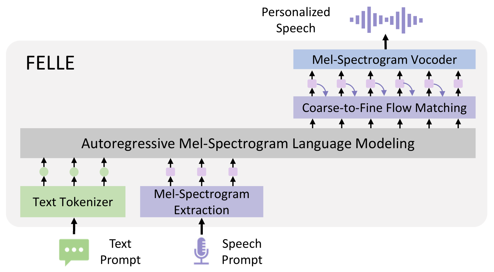
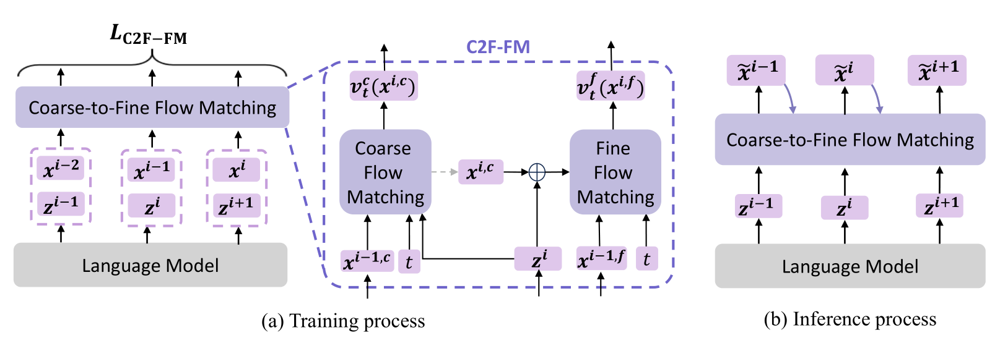

# FELLE

基本信息

- 标题: "FELLE: Autoregressive Speech Synthesis with Token-Wise Coarse-to-Fine Flow Matching"
- 作者:
  - 01 Hui Wang,
  - 02 Shujie Liu,
  - 03 Lingwei Meng,
  - 04 Jinyu Li,
  - 05 Yifan Yang,
  - 06 Shiwan Zhao,
  - 07 Haiyang Sun,
  - 08 Yanqing Liu,
  - 09 Haoqin Sun,
  - 10 Jiaming Zhou,
  - 11 Yan Lu,
  - 12 Yong Qin
- 链接:
  - [ArXiv](https://arxiv.org/abs/2502.11128)
  - [Publication]()
  - [Github]()
  - [Demo](https://aka.ms/felle)
- 文件:
  - [ArXiv](../SpeechLM/_PDF/2502.11128v1__FELLE__Autoregressive_Speech_Synthesis_with_Token-Wise_Coarse-to-Fine_Flow_Matching.pdf)
  - [Publication] #TODO

## Abstract: 摘要

<table><tr><td width="50%">

To advance continuous-valued token modeling and temporal-coherence enforcement, we propose ***FELLE***, an autoregressive model that integrates language modeling with token-wise flow matching.
By leveraging the autoregressive nature of language models and the generative efficacy of flow matching, ***FELLE*** effectively predicts continuous-valued tokens (mel-spectrograms).
For each continuous-valued token, ***FELLE*** modifies the general prior distribution in flow matching by incorporating information from the previous step, improving coherence and stability.
Furthermore, to enhance synthesis quality, ***FELLE*** introduces a coarse-to-fine flow-matching mechanism, generating continuous-valued tokens hierarchically, conditioned on the language model’s output.
Experimental results demonstrate the potential of incorporating flow-matching techniques in autoregressive mel-spectrogram modeling, leading to significant improvements in TTS generation quality, as shown in https://aka.ms/felle.

</td><td>

为了推进连续值 Token 建模和时序一致性施加, 我们提出了 ***FELLE***, 一种将语言建模和 Token 级流匹配 ( Flow-Matching) 相结合的自回归模型.
通过利用语言模型的自回归特征和流匹配的生成效率, ***FELLE*** 可以有效地预测连续值 Token (梅尔频谱).
对于每个连续值 Token, ***FELLE*** 通过将前一步的信息融入流匹配的一般先验分布中, 增强了一致性和稳定性.
此外, 为了增强合成质量, ***FELLE*** 引入了从粗到细的流匹配机制, 以语言模型的输出为条件, 层次化地生成连续值 Token.

实验结果表明了将流匹配技术整合到自回归梅尔频谱建模中的潜力, 能够带来 TTS 生成质量的显著提升.
音频示例可见 https://aka.ms/felle.

</td></tr></table>

## 1·Introduction: 引言

<table><tr><td width="50%">

The remarkable success of large language models (LLMs) (**GPT-3**[^01], **GPT-4**[^02], **Gemini 1.5**[^03]) has prompted a paradigm shift in speech synthesis, redefining it as a language modeling task.
This shift has driven notable progress in zero-shot speech synthesis (**VALL-E**[^04], **VALL-E 2**[^05]).
Consistent with the standard LLM training methodology, researchers have naturally adopted discrete-valued tokens as the foundational modeling units.
However, unlike textual data, which is inherently discrete, speech signals require complex quantization techniques to transform continuous waveforms into discrete-valued tokens.
These essential quantization processes impose fundamental constraints compared to continuous representations, particularly in terms of fidelity preservation and training complexity ([^06], **MELLE**[^07]).
Consequently, discrete token-based text-to-speech (TTS) systems often face challenges such as intricate modeling workflows and reduced output quality.
In response to these limitations, recent research has increasingly explored autoregressive (AR) modeling frameworks that leverage continuous representations (**MELLE**[^07], **SALAD**[^08], **KALL-E**[^09]), showing notable improvements in model performance and simplifying training processes.

</td><td>

大语言模型的卓越成功 (**GPT-3**[^01], **GPT-4**[^02], **Gemini 1.5**[^03]) 促使语音合成的范式转变, 被重新定义为语言建模任务.
这一转变促进了零样本语音合成的显著进展 (**VALL-E**[^04], **VALL-E 2**[^05]).

和标准的大语言模型训练方法一致, 研究人员自然地采用离散值 Token 作为基础建模单元.
然而, 和文本数据不同, 其本质上是离散的, 而语言信号要求复杂的量化技术来将连续波形转换为离散值 Token.
这些必要的量化过程相比连续表示施加了根本性限制, 尤其是在保真度和训练复杂度方面 ([^06], **MELLE**[^07]).
因此, 基于离散 Token 的 TTS 系统通常面临诸如复杂建模工作流和输出质量降低等挑战.

为了应对这些局限性, 近期研究倾向于探索使用连续表示的自回归建模架构 (**MELLE**[^07], **SALAD**[^08], **KALL-E**[^09]), 在模型性能方面显示出显著提升并简化了训练过程.

</td></tr>
<tr><td>

However, modeling continuous representations introduces its own set of challenges.
Due to the rich information contained in continuous representations, modeling them demands more advanced capabilities from models.
Conventional regression-based loss functions used in **MELLE**[^07], including mean absolute error (MAE) and mean squared error (MSE), adopt oversimplified distributional assumptions.
These assumptions may not fully capture the multimodal structures and complex features of the distribution, leading to blurred, oversimplified, or averaged predictions (**MelNet** [^10], [^11]).
Similarly, **KALL-E**[^09] relies on WaveVAE-derived distributions, but the restrictive Gaussian prior assumption in **Variational Autoencoder (VAE)**[^12] limits their ability to model complex speech patterns, leading to low-diversity and blurry samples ([^13], [^14]).

</td><td>

然而, 建模连续表示引入了其本身的挑战.
由于连续表示中包含的丰富信息, 建模它们需要模型具有更高级能力.

**MELLE**[^07] 中使用传统的基于回归的损失函数, 包括平均绝对误差 (MAE) 和均方误差 (MSE), 采取了过于简单的分布假设.
这些假设可能无法完全捕捉分布的多模态结构和复杂特征, 导致模糊, 过于简单或平均预测 (**MelNet** [^10], [^11]).

类似地, **KALL-E**[^09] 依赖于 **WaveVAE** 导出的分布, 但由于 **VAE**[^12] 中的高斯先验假设限制了它们建模复杂语音模式的能力, 导致低多样性和模糊样本 ([^13], [^14]).

</td></tr>
<tr><td>

A further limitation of existing approaches lies in the inadequate modeling of temporal dependencies.
Current methodologies primarily use autoregressive architecture to implicitly capture temporal dependencies, yet they lack explicit mechanisms to model temporal relationships.
This structural characteristic may limit their effectiveness in handling complex temporal dependencies (**VALL-E R**[^15]).
For instance, **SALAD**[^08], which is based on diffusion processes, denoises tokens independently without explicit temporal modeling.
**MELLE**[^07] applies a flux loss focused solely on increasing frame-level variability, oversimplifying the modeling of temporal relationships.
Notably, continuous-valued tokens like mel-spectrograms inherently exhibit strong correlations across temporal and frequency dimensions [^11].
Insufficient consideration of these correlations could compromise the model's ability to preserve speech's sequential characteristics, potentially affecting output naturalness and requiring additional computational resources.

</td><td>

现有方法的更多局限性在于对时序依赖的不充分建模.
现有方法主要使用自回归架构隐式捕获时序依赖, 然而它们缺乏显式机制来建模时序关系.
这种结构特征可能限制了他们在处理复杂时序依赖方面的有效性 (**VALL-E R**[^15]).

- **SALAD**[^08] 基于扩散过程, 无显式时序建模地独立对 Token 去噪.
- **MELLE**[^07] 应用 Flux 损失仅关注递增帧级变化, 过于简单地建模时序关系.

需要注意连续值 Token 如梅尔频谱在时序和频率维度上自然地具有强相关性 [^11].
对这些相关性的缺乏考虑可能会妨碍模型的能力, 潜在影响输出自然度和需要额外计算资源.

</td></tr>
<tr><td>

In this work, we introduce ***FELLE***, an autoregressive speech synthesis framework that utilizes token-wise coarse-to-fine flow matching for continuous-valued token modeling.
Unlike regression-based or VAE approaches (commonly used in other methods) constrained with preset distribution assumptions, **Flow Matching**[^16] enables flexible density estimation without restrictive prior assumptions, thereby preserving the multimodal characteristics of speech.
Meanwhile, by integrating the autoregressive properties of language models with flow-matching techniques, we develop a temporal modeling mechanism that dynamically adjusts the prior distribution of each frame through the integration of preceding contextual information.
This architecture effectively preserves temporal dependencies and ensures spectral continuity.
Moreover, we propose a coarse-to-fine flow-matching (C2F-FM) module to improve generation quality by capturing inter-frequency correlations.
It synthesizes mel-spectrogram features in multiple stages, inspired by the effectiveness of coarse-to-fine methods in discrete token modeling (**AudioLM**[^17], **Moshi**[^18]), which capture structural dependencies in sequential tasks.
Evaluations on the **LibriSpeech corpus**[^19] demonstrate the framework's competitiveness: compared to **MELLE**, our method achieves comparable Word Error Rates (WER) while delivering superior similarity scores in modeling complex mel-spectrogram patterns.
Our contributions can be summarized as:
- We propose an AR speech synthesis framework leveraging token-wise flow matching for continuous speech modeling, eliminating restrictive distribution assumptions while preserving speech signals' multimodal characteristics.
- We design a dynamic prior mechanism that modifies the vanilla prior distribution in flow matching by incorporating information from the previous step, improving coherence and stability.
- We introduce a coarse-to-fine flow matching architecture that explicitly captures inter-frequency correlations through multi-stage spectral refinement, achieving significant improvements in mel-spectrogram generation.

</td><td>

在本项工作中, 我们介绍了 ***FELLE***, 一个自回归语音合成框架, 利用 Token 级从粗到细的流匹配进行连续值 Token 建模.
和基于回归或 VAE 的方法 (在其他方法中常用) 用预设分布假设不同, **流匹配**[^16] 允许灵活的密度估计而无需受到先验假设的限制, 从而保留语音的多模态特性.

同时, 通过将语言模型的自回归性质和流匹配技术结合, 我们开发了时序建模机制, 通过整合先前的上下文信息, 动态调整每帧的先验分布.
这一架构有效地保持了时序依赖并确保了谱连续性.

此外, 我们提出了一个 ***从粗到细的流匹配 (C2F-FM)*** 模块通过捕获中间频率相关性用于提升生成质量.
它以多阶段方式合成梅尔频谱特征, 受到离散 Token 建模中从粗到细方法的有效性 (**AudioLM**[^17], **Moshi**[^18]) 的启发, 捕获了序列任务中的结构依赖.

在 **LibriSpeech 语料库**[^19] 上的评估展示了框架的竞争力: 与 **MELLE** 相比, 我们的方法取得了相当的词错误率 (WER), 同时在建模复杂梅尔频谱模式方面取得了更好的相似性分数.

我们的贡献可以总结为:
- 我们提出了自回归语音合成框架, 利用了 Token 级流匹配进行连续语音建模, 消除了分布假设限制, 保持语音信号的多模态特性.
- 我们设计了动态先验机制, 修改流匹配中的原始先验分布, 将来自先前步骤的信息融合, 提升了一致性和稳定性.
- 我们引入了一个从粗到细的流匹配架构, 通过多阶段频谱细化, 显式捕获中间频率相关性, 实现了梅尔频谱生成的显著改进.

</td></tr></table>

## 2·Related Works: 相关工作

<table><tr><td width="50%">

Zero-shot text-to-speech approaches are commonly categorized into autoregressive and non-autoregressive paradigms based on their output generation mechanisms.
Autoregressive systems typically rely on language model architectures (**VALL-E**[^04], **SPEAR-TTS**[^20], **IST-LM**[^21]), whereas non-autoregressive implementations commonly employ diffusion models and analogous methodologies (**NaturalSpeech3**[^22], **F5-TTS**[^23]).
The subsequent discussion concentrates on research efforts investigating diverse representations under the framework of autoregressive language modeling architectures.

</td><td>

零样本文本转语音方法通常基于它们的输出机制, 分为自回归和非自回归两类范式.
- 自回归系统通常依赖于语言模型架构 (**VALL-E**[^04], **SPEAR-TTS**[^20], **IST-LM**[^21]);
- 非自回归实现通常采用扩散模型和类似方法 (**NaturalSpeech3**[^22], **F5-TTS**[^23]).

后续讨论集中在自回归语言建模架构框架下研究多样性表示的研究工作.

</td></tr>
<tr><td>

**Discrete-Valued Token-Based TTS**

TTS systems based on discrete representations utilize tokenized acoustic units derived from unsupervised or semi-supervised learning frameworks.
These discrete tokens serve as compact and efficient representations of speech, capturing phonetic and prosodic attributes while reducing redundancy in data storage and computation.
**VALL-E**[^04] is a neural codec language model for text-to-speech synthesis that firstly redefines TTS as a conditional language modeling task, enabling high-quality, personalized speech generation from just a 3-second acoustic prompt, significantly advancing naturalness and speaker similarity.
Recent studies further enhance **VALL-E**’s capabilities across multilingual generalization (**VALL-E X**[^24]), decoding efficiency (**VALL-E 2**[^05]), and robustness (**ELLA-V**[^25], **RALL-E**[^26], **VALL-E R**[^15]), collectively advancing zero-shot speech synthesis in scalability, quality, and linguistic flexibility.
In contrast to the unified language modeling approach of **VALL-E** and its variants, **CosyVoice**[^27] leverages an LLM for text-to-token conversion followed by a conditional flow-matching model for token-to-spectrogram synthesis, enhancing zero-shot voice cloning through end-to-end supervised speech token learning.

</td><td>

**基于离散值 Token 的 TTS**

基于离散表示的 TTS 系统使用从无监督或半监督学习框架导出的 Tokenized 声学单元.
这些离散 Token 作为语音的紧凑且有效表示, 捕获语音和韵律属性, 同时减少数据存储和计算的冗余.

**VALL-E**[^04] 是用于文本转语音合成的神经编解码语言模型, 首先将 TTS 重定义为条件化语言建模任务, 使用仅三秒声学提示实现高质量个性化语音合成, 显著提升自然度和说话人相似性.

近期的研究进一步增强了 **VALL-E** 的能力, 共同推动了零样本语音合成的可扩展性, 质量, 和语言灵活性.
- 多语言泛化 (**VALL-E X**[^24]),
- 解码效率 (**VALL-E 2**[^05]),
- 健壮性 (**ELLA-V**[^25], **RALL-E**[^26], **VALL-E R**[^15]).

和 **VALL-E** 及其变体的统一语言建模方法不同, **CosyVoice**[^27] 利用 LLM 进行文本到 Token 的转换, 并通过条件流匹配模型实现 Token 到频谱的语音合成, 通过端到端监督语音 Token 学习增强零样本语音克隆能力.

</td></tr>
<tr><td>

**Continuous-Valued Token-Based TTS**

Recent advances in continuous representation-based TTS systems eliminate the need for cumbersome codec training while achieving promising performance.
Notably, **MELLE**[^07] proposes a single-pass language model architecture leveraging rich continuous acoustic representations, enabling precise control over prosodic features including pitch, rhythm, and timbre for high-fidelity speech synthesis.
In contrast, **SALAD**[^08] is a zero-shot text-to-speech system that employs a per-token latent diffusion model on continuous representations, enabling variable-length audio generation through semantic tokens for contextual guidance and stopping control.
While this method achieves superior intelligibility scores, it may face challenges related to time costs.
Alternatively, **KALL-E**[^09] adopts an autoregressive approach with WaveVAE to directly model speech distributions, bypassing both VAE and diffusion paradigms, demonstrating enhanced naturalness and speaker similarity through probabilistic waveform prediction.

</td><td>

**基于连续值 Token 的 TTS**

近期在基于连续表示的 TTS 系统中的进展消除了麻烦的编解码器训练, 同时实现了具有前景的性能.

**MELLE**[^07] 提出了利用丰富的连续声学表示的单步 (Single-Pass) 语言模型架构, 实现高质量语音合成对包括音高, 节奏, 和音色的韵律特征的精细控制.

**SALAD**[^08] 是基于连续表示采用逐 Token 的潜在扩散模型的零样本文本转语音系统, 通过语音 Token 进行上下文引导和停止控制实现可变长度音频生成.
虽然这一方法达到了卓越的可理解性分数, 它可能面临和时间成本相关的挑战.

**KALL-E**[^09] 采用和 WaveVAE 结合的自回归方法来直接建模语音分布, 绕过 VAE 和扩散范式, 通过概率波形预测实现增强的自然度和说话人相似性.

</td></tr>
<tr><td>

**Flow Matching**[^16] is a technique for learning a transformation that maps a prior distribution $p_0$ to a target distribution $q(x)$.
The core idea of flow matching is to define a flow $\phi_t(x)$ that evolves over time, transforming the prior distribution $p_0$ into the target distribution $q(x)$.
This flow $\phi_t(x)$ is governed by a vector field $v_t(x)$ and satisfies the following ordinary differential equation (ODE):

$$
\frac{d}{dt} \phi_t(x) = v_t(\phi_t(x)), \quad \phi_0(x) = x.
$$

Here, $\phi_0(x) = x$ indicates that at time $t = 0$, the flow $\phi_t(x)$ is an identity mapping.

While flow matching provides a principled framework for learning such transformations, it can be computationally expensive due to the difficulty of directly accessing the true vector field $u_t(x)$ and the target distribution $q(x)$.
To address this, **Conditional Flow Matching (CFM)** is introduced.
In **CFM**, the flow and the vector field are conditioned on the data $x_1$, making the optimization process more efficient.
The objective of **CFM** is to minimize the discrepancy between the conditional true vector field $u_t$ and the learned conditional vector field $v_t(x; \theta)$.
This discrepancy is measured by the following loss function:

$$
L_{\text{CFM}} = \mathbb{E}_{t, x_1, x} \left\| u_t - v_t(x; \theta) \right\|^2,
$$

where time $t$ is uniformly sampled from $\mathcal{U}[0,1]$, data points $x_1$ are drawn from the target distribution $q(x_1)$, samples $x$ are generated through the conditional probability path $p_t(x|x_1)$, and the conditional vector field $u_t \equiv u_t(x|x_1)$.

</td><td>

**流匹配**[^16] 是用于学习将先验分布 $p_0$ 映射到目标分布 $q(x)$ 的技术.
流匹配的核心思想是定义一个随时间演化的流 $\phi_t(x)$, 将先验分布 $p_0$ 转换为目标分布 $q(x)$.

这个流 $\phi_t(x)$ 由向量场 $v_t(x)$ 控制, 它满足如下常微分方程 (ODE):

$$
\frac{d}{dt} \phi_t(x) = v_t(\phi_t(x)), \quad \phi_0(x) = x.
$$

- $\phi_0(x)=x$ 表示在时间 $t=0$ 时, 流 $\phi_t(x)$ 是恒等映射.

虽然流匹配提供了学习这种变换的理论框架, 但由于直接访问真实向量场 $u_t(x)$ 和目标分布 $q(x)$ 困难, 因此计算代价高.

为了处理这一问题, 引入**条件流匹配 (Conditional Flow Matching, CFM)**.
在 **CFM** 中, 流和向量场以数据 $x_1$ 为条件, 使优化过程更加高效.
**CFM** 的目标是最小化条件真实向量场 $u_t$ 和学习到的条件向量场 $v_t(x; \theta)$ 之间的差异.
这一差异通过如下损失函数衡量:

$$
L_{\text{CFM}} = \mathbb{E}_{t, x_1, x} \left\| u_t - v_t(x; \theta) \right\|^2,
$$

- 时间 $t$ 均匀地从 $\mathcal{U}[0,1]$ 中采样.
- 数据点 $x_1$ 从目标分布 $q(x_1)$ 中采样.
- 样本 $x$ 通过条件概率路径 $p_t(x|x_1)$ 和条件向量场 $u_t \equiv u_t(x|x_1)$ 生成.

</td></tr></table>

## 3·Methodology: 方法

### Problem Formulation: Token-wise Flow Matching for AR Model   问题形式化: 自回归模型的 Token 级流匹配

<table><tr><td width="50%">

Following **MELLE**'s autoregressive language modeling framework for mel-spectrogram prediction, we reformulate zero-shot TTS through a hierarchical flow-matching mechanism at each prediction step.
Each mel-spectrogram frame $\mathbf{x}^i \in \mathbb{R}^D$ (where $D$ denotes the mel-band dimension) is treated as a continuous token, generated sequentially through an autoregressive process.
Given an input text sequence $\mathbf{y} = [y^0, \ldots, y^{N-1}]$, speech prompt $\mathbf{\widehat{x}}$, and previously generated tokens $\mathbf{x}^{<i} = [\mathbf{x}^0, \ldots, \mathbf{x}^{i-1}]$, the model predicts the current token $\mathbf{x}^i$ by integrating language model guidance into the flow-matching paradigm.

The joint distribution is decomposed autoregressively as:

$$
\begin{aligned}
p(\mathbf{X}|\mathbf{y})
&= \prod_{i=0}^{L-1} p(\mathbf{x}^i | \mathbf{x}^{<i}, \mathbf{y}, \mathbf{\widehat{x}})\\
&= \prod_{i=0}^{L-1} p_{\theta_\text{FM}}(\mathbf{x}^i | \mathbf{z}^i),\\
\mathbf{z}^i&=f_{\theta_\text{LM}}(\mathbf{x}^{<i}, \mathbf{y},\mathbf{\widehat{x}}).
\end{aligned}
$$

$\mathbf{X} = [\mathbf{x}^0, \ldots, \mathbf{x}^{L-1}] \in \mathbb{R}^{L \times D}$ denotes full mel-spectrogram sequence, $L$ represents the total number of mel-spectrogram frames.
The language model $f_{\theta_\text{LM}}(\cdot)$ generates hidden state $\mathbf{z}^i$ that captures both linguistic content and acoustic context, while $p_{\theta_\text{FM}}(\cdot | \mathbf{z}^i)$ denotes the flow-matching module that transforms prior distributions into target distributions conditioned on $\mathbf{z}^i$.

</td><td>

遵循 **MELLE** 用于梅尔频谱预测的自回归语言建模框架, 我们通过在每个预测步采用分层流匹配机制重新构建零样本文本转语音.
每个梅尔频谱帧 $\mathbf{x}^i \in \mathbb{R}^D$ ($D$ 表示梅尔频带维度) 视为一个连续的 Token, 通过自回归过程顺序生成.
给定输入文本序列 $\mathbf{y} = [y^0, \ldots, y^{N-1}]$, 语音提示 $\mathbf{\widehat{x}}$, 以及之前生成的 Token $\mathbf{x}^{<i} = [\mathbf{x}^0, \ldots, \mathbf{x}^{i-1}]$, 模型通过将语言模型引导融合到流匹配范式中以预测当前 Token $\mathbf{x}^i$.

联合分布被自回归地分解为:

$$
\begin{aligned}
p(\mathbf{X}|\mathbf{y})
&= \prod_{i=0}^{L-1} p(\mathbf{x}^i | \mathbf{x}^{<i}, \mathbf{y}, \mathbf{\widehat{x}})\\
&= \prod_{i=0}^{L-1} p_{\theta_\text{FM}}(\mathbf{x}^i | \mathbf{z}^i),\\
\mathbf{z}^i&=f_{\theta_\text{LM}}(\mathbf{x}^{<i}, \mathbf{y},\mathbf{\widehat{x}}).
\end{aligned}
$$

- $\mathbf{X} = [\mathbf{x}^0, \ldots, \mathbf{x}^{L-1}] \in \mathbb{R}^{L \times D}$ 表示完整的梅尔频谱序列, $L$ 表示梅尔频谱帧总数.
- 语言模型 $f_{\theta_\text{LM}}(\cdot)$ 生成隐藏状态 $\mathbf{z}^i$, 它捕获语言内容和声学上下文,
- $p_{\theta_\text{FM}}(\cdot | \mathbf{z}^i)$ 表示流匹配模块, 它将先验分布转换为以 $\mathbf{z}^i$ 为条件的条件分布.

</td></tr></table>

### Architecture: 架构

<table><tr><td width="50%">

The proposed framework combines an autoregressive language model with a flow-matching mechanism, which facilitates the progressive generation of high-fidelity speech.
As shown in [Figure.01](#Fig.01), the autoregressive model $f_{\theta_\text{LM}}$ extracts features from the text prompt $\mathbf{y}$ and speech prompt $\mathbf{\widehat{x}}$, generating latent representations $\mathbf{z}^i$ (where $i$ denotes the generation step) that serve as conditional inputs for the flow-matching mechanism.
The flow-matching mechanism applies a coarse-to-fine strategy to generate high-quality mel-spectrogram frames $\mathbf{x}^i$.
The main components of the approach are described in detail below.

</td><td>

所提的框架将自回归语言模型和流匹配机制相结合, 促进高质量语音的逐步生成.
如[图 01](#Fig.01) 所示, 自回归模型 $f_{\theta_\text{LM}}$ 从文本提示 $\mathbf{y}$ 和声学提示 $\mathbf{\widehat{x}}$ 中提取特征, 生成潜在表示 $\mathbf{z}^i$ (其中 $i$ 表示生成步数), 这些表示作为流匹配机制的条件输入.
流匹配机制采用从粗到细的策略生成高质量的梅尔频谱帧 $\mathbf{x}^i$.
该方法的主要组件将在下文详细描述.

</td></tr>
<tr><td colspan="2">

</td></tr>
<tr><td>

<a id="#Fig.02">Figure.01</a>: Overview of ***FELLE***, an autoregressive mel-spectrograms model that generates personalized speech from text and acoustic prompts.
At each timestep, the framework relies on the previous mel-spectrogram distribution as a prior, conditioned on the output of the language model, applying a coarse-to-fine flow-matching module to produce refined spectral features.

</td><td>

***FELLE*** 的总览, 自回归梅尔频谱模型从文本和声学提示生成个性化语音.
在每个时间步该框架依赖于之前的梅尔频谱分布作为先验, 以语言模型的输出为条件, 应用从粗到细的流匹配模块来生成精细的频谱特征.

</td></tr></table>

### Autoregressive Language Model: 自回归语言模型

<table><tr><td width="50%">

The language model, designed as a unidirectional Transformer decoder, generates acoustic features autoregressively by utilizing both text sequences and mel-spectrogram prompts.
In the initial step, the text tokens are embedded, while a pre-net maps the mel-spectrogram into the dimensional space of the LM.
By processing the combined text $\mathbf{y}$, speech prompt $\mathbf{\widehat{x}}$, and acoustic embeddings $\mathbf{x}^{<i}$, the language model $f_{\theta_\text{LM}}$ processes multi-head attention and feed-forward layers to capture the intricate relationship between linguistic and acoustic information.
The output at each time step subsequently serves as a conditioning input for the coarse-to-fine flow-matching module to synthesize the next-frame acoustic features.

</td><td>

语言模型, 设计为单向的 Transformer 解码器, 通过使用文本序列和梅尔频谱提示来自回归地生成声学特征.
在初始步骤, 文本 Token 被嵌入, 而预网络 Pre-Net 将梅尔频谱映射到语言模型的维度空间中.
通过处理合并的文本 $\mathbf{y}$, 语音提示 $\mathbf{\widehat{x}}$, 和声学嵌入 $\mathbf{x}^{<i}$, 语言模型 $f_{\theta_\text{LM}}$ 应用多头注意力和前馈层, 以捕获语言和声学信息之间的复杂关系.
后续每个时间步的输出都作为从粗到细流匹配模块的条件输入用于合成下一帧声学特征.

</td></tr></table>

### Coarse-to-Fine Flow Matching: 从粗到细的流匹配

<table><tr><td width="50%">

For high-quality mel-spectrogram generation, we introduce a coarse-to-fine flow-matching approach.
As illustrated in [Figure.02](#Fig.02), the method generates each mel-spectrogram frame based on its preceding frame, maintaining temporal consistency throughout the sequence.
The generation process is divided into two phases: a coarse generation phase followed by a fine refinement phase.
A detailed introduction will be given below.

</td><td>

为了高质量梅尔频谱生成, 我们引入从粗到细流匹配方法.
如[图 02](#Fig.02) 所示, 方法基于前面的帧生成每个梅尔频谱帧, 保持整个序列的时序一致性.
生成过程被分为两个阶段: 粗糙生成阶段 + 精细优化阶段.
下面将详细介绍该方法.

</td></tr>
<tr><td colspan="2">

</td></tr>
<tr><td>

<a id="#Fig.02">Figure.02</a>: The coarse-to-fine flow-matching module of ***FELLE***.
(a) The training process along with the detailed data flow within the coarse-to-fine module.
The gray dashed lines merely indicate the relationships between components in the model structure and are not activated during training.
(b) The inference process.

</td><td>

***FELLE*** 的从粗到细流匹配模块.
(a) 训练过程, 以及粗到细模块内部的数据流.
灰色虚线只是表示模型结构组件之间的关系, 并不在训练过程中激活.
(b) 推理过程.

</td></tr>
<tr><td>

**Prior Distribution**

Flow-matching-based methods in speech synthesis commonly adopt a simple prior distribution (**VoiceBox**[^28], **Matcha-TTS**[^29]), as prior knowledge is often challenging to define precisely (**F5-TTS**[^23]).
However, utilizing a prior distribution that closely aligns with the target distribution can significantly enhance computational efficiency and synthesis quality (**SpeechGPT**[^30]).
Given the autoregressive nature of token generation and the sequential structure of speech, ***FELLE*** employs the preceding token as an informative prior to guide the flow matching process for generating the current token.
Specifically, the prior distribution $p_0$ for the initial state $x_0^i$ of the current frame $x^i$ is derived from the mel-spectrogram of the previous frame $x^{i-1}$:

$$
\begin{aligned}
p_0(x_0^i | x^{i-1}) = \mathcal{N}(x_0^i | x^{i-1}, \sigma^2 I),
\end{aligned}
$$

where $\sigma^2 I$ represents the covariance matrix of the Gaussian noise.
For $i = 0$, where no prior frame exists, the initial state is drawn from a standard Gaussian distribution.

</td><td>

**先验分布**

语音合成中基于流匹配的方法通常采用简单的先验分布 (**VoiceBox**[^28], **Matcha-TTS**[^29]), 因为先验知识往往难以精确定义 (**F5-TTS**[^23]).
然而, 使用和目标分布相近的先验分布可以显著增强计算效率和合成质量 (**SpeechGPT**[^30]).

由于 Token 生成的自回归性质和语音的顺序结构, ***FELLE*** 采用前面的 Token 作为信息性先验来引导流匹配过程生成当前 Token.
具体来说，当前帧 $x^i$ 的初始状态 $x_0^i$ 的先验分布 $p_0$ 是从前一帧 $x^{i-1}$ 的梅尔频谱图推导出来的：

$$
\begin{aligned}
p_0(x_0^i | x^{i-1}) = \mathcal{N}(x_0^i | x^{i-1}, \sigma^2 I),
\end{aligned}
$$

- $\sigma^2 I$ 表示高斯噪声的协方差矩阵.
- 对于 $i = 0$, 无先验帧存在, 初始状态从标准高斯分布中采样.

</td></tr>
<tr><td>

**Coarse-to-Fine Generation**

Our method combines autoregressive language modeling with hierarchical flow matching.
Each step $i$ follows a two-stage process, as illustrated in [Figure.02(a)](#Fig.02): a coarse flow-matching phase that produces an initial low-resolution mel-spectrogram representation, followed by a fine flow-matching phase that enhances the output by incorporating both the coarse representation and language model outputs.

The coarse generation stage is designed to produce the low-resolution component $x^{i,c}$ of the $i$-th frame through a downsampling operation $x^{i,c} = \mathrm{Downsample}(x^i)$.
In this framework, the coarse flow-matching model predicts a vector field $v_t^c(x^{i,c}, z^i; \theta_{\text{FM}}^c)$ by conditioning on linguistic features $z^i$ extracted from the language model.

In the fine stage, the model refines this approximation by recovering details $x^{i,f}$, represented as the residual between the original frame $x^i$ and the upsampled coarse component $\text{Upsample}(x^{i,c})$.
A secondary flow-matching model predicts the vector field $v_t^f(x^{i,f}, z^i, x^{i,c}; \theta_\text{FM}^f)$, governing this process by leveraging both the features $z^i$ and the coarse component (with ground-truth coarse features $x^{i,c}$ during training and predicted values $\tilde{x}^{i,c}$ during inference) as conditional inputs.
This hierarchical conditioning allows the fine model to focus on local details while preserving global coherence from the coarse stage.

For step $i$, the training objective combines losses from both stages:
$$
\begin{aligned}
\mathcal{L}_{\text{C2F-FM}} = \underbrace{\mathbb{E}_{t, x_1^{i,c}, x^{i,c}} \left\| u_t^c - v_t^c(x^{i,c}, z^i; \theta_\text{FM}^c) \right\|^2}_{\text{Coarse Stage}} + \underbrace{\mathbb{E}_{t, x_1^{i,f}, x^{i,f}} \left\| u_t^f - v_t^f(x^{i,f}, z^i, x_1^{i,c}; \theta_\text{FM}^f) \right\|^2}_{\text{Fine Stage}},
\end{aligned}
$$
where $u_t^c$ and $u_t^f$ represent the true conditional vector fields for the coarse and fine components, respectively, and $t \sim \mathcal{U}[0,1]$.
The initial states $x_0^{i,c}$ and $x_0^{i,f}$ are similarly initialized using the prior from [Equation](#Eq.prior), applying the corresponding sampling operations.
By decoupling low-resolution structure learning from high-detail refinement, this coarse-to-fine approach generates high-fidelity mel-spectrograms while maintaining temporal consistency through autoregressive dependencies.

</td><td>

**从粗到细生成过程**

我们的方法将自回归语言建模和分层流匹配相结合.
每一步 $i$ 遵循两个阶段的过程, 如[图 02(a)](#Fig.02) 所示: 粗糙流匹配阶段, 产生初始低分辨率梅尔频谱表示, 随后由精细流匹配阶段整合粗糙表示和语言模型输出进一步增强输出.
- 粗糙生成阶段, 设计用于产生第 $i$ 帧的低分辨率组分 $x^{i,c}$, 即通过下采样操作 $x^{i,c} = \mathrm{Downsample}(x^i)$.
  在本框架中, 粗糙流匹配模型以语言模型提取的语言特征 $z_i$ 为特征, 预测向量场 $v_t^c(x^{i,c}, z^i; \theta_{\text{FM}}^c)$.
- 精细生成阶段, 模型通过恢复细节 $x^{i,f}$, 即原始帧 $x^i$ 与上采样的粗糙组分 $\text{Upsample}(x^{i,c})$ 的残差来细化近似.
  辅助的流匹配模型预测向量场 $v_t^f(x^{i,f}, z^i, x^{i,c}; \theta_\text{FM}^f)$, 以语言特征 $z^i$ 和粗糙组分 $x^{i,c}$ 为条件来控制这一过程.
  在训练时使用真实的粗糙特征 $x_{i,c}$, 在推理时使用预值 $\tilde{x}^{i,c}$.

这一分层条件化使得精细模型专注于局部细节同时保留和粗糙阶段的全局一致性.

对于第 $i$ 步, 训练目标将来自两个阶段的损失结合起来:
$$
\begin{aligned}
\mathcal{L}_{\text{C2F-FM}} = \underbrace{\mathbb{E}_{t, x_1^{i,c}, x^{i,c}} \left\| u_t^c - v_t^c(x^{i,c}, z^i; \theta_\text{FM}^c) \right\|^2}_{\text{粗糙阶段}} + \underbrace{\mathbb{E}_{t, x_1^{i,f}, x^{i,f}} \left\| u_t^f - v_t^f(x^{i,f}, z^i, x_1^{i,c}; \theta_\text{FM}^f) \right\|^2}_{\text{精细阶段}},
\end{aligned}
$$

- $u_t^c$ 和 $u_t^f$ 分别表示粗糙和精细组件的真实条件向量场.
- $t \sim \mathcal{U}[0,1]$.
- 初始状态 $x_0^{i,c}$ 和 $x_0^{i,f}$ 类似地使用[先验等式](#Eq.prior)中的先验分布初始化, 并应用相应的采样操作.

通过分离低分辨率结构学习和高分辨率细节细化, 这种从粗到细的方法生成高质量的梅尔频谱图, 并通过自回归依赖保持时序一致性.

</td></tr>
<tr><td>

**Classifier-Free Guidance (CFG)** is a powerful technique to enhance the quality and controllability of generated outputs in flow matching and diffusion models (**CFG**[^31], **iDDPM**[^32]).
In ***FELLE***, we implement CFG through joint training of coarse and fine flow matching models using both conditional and unconditional objectives.
During training, we randomly mask the speech prompt with probability $p_{\text{drop}}$ for unconditional learning, which enables each model to learn dual vector fields.

At inference, guided vector fields are computed through linear blending:

$$
\begin{aligned}
\hat{v}_t^\ast(x^\ast; \cdot) &= w v_t^\ast(x^\ast, c; \theta_\text{FM}^\ast) + (1-w) v_t^\ast(x^\ast, \bar{c}; \theta_\text{FM}^\ast),
\end{aligned}
$$

where $\ast \in \{c,f\}$ denotes the model stage, $c$ represents the full conditions, $\bar{c}$ indicates the reduced conditioning state where the speaker prompt is masked, and $w$ represents the guidance scale.

</td><td>

**无分类器引导** 是增强流匹配生成输出的质量和可控性的强力技术 (**CFG**[^31], **iDDPM**[^32]).
在 ***FELLE*** 中, 我们通过联合训练粗糙和精细流匹配模型, 同时使用条件和无条件目标, 实现 CFG.
在训练过程中, 我们以概率 $p_{\text{drop}}$ 随机掩盖语音提示进行无条件化学习, 使得每个模型都能学习双向向量场.

在推理时, 引导向量场通过线性混合计算:

$$
\begin{aligned}
\hat{v}_t^\ast(x^\ast; \cdot) &= w v_t^\ast(x^\ast, c; \theta_\text{FM}^\ast) + (1-w) v_t^\ast(x^\ast, \bar{c}; \theta_\text{FM}^\ast),
\end{aligned}
$$

- $\ast \in \{c,f\}$ 表示模型阶段 (Coarse 和 Fine),
- $c$ 表示完整条件,
- $\bar{c}$ 表示减少条件的状态, 即掩盖说话者提示,
- $w$ 表示引导尺度.

</td></tr></table>

### Training Objective: 训练目标

<table><tr><td width="50%">

In ***FELLE***, we integrate the condition loss $\mathcal{L}_\text{cond}$ in addition to coarse-to-fine loss $\mathcal{L}_{\text{C2F-FM}}$.
$\mathcal{L}_\text{cond}$ is a hybrid loss function that combines L1 and L2 norms, defined as $\mathcal{L}_{\text{cond}} = \|z_i - x_i\|_1 + \|z_i - x_i\|_2^2$, for step $i$ to regularize the conditional input for flow matching.
Additionally, we introduce a stop prediction module to the autoregressive language model.
This module, during each step of generation, transforms the hidden state output by the language model into the probability of a stop signal through a linear layer and calculates the Binary Cross-Entropy loss $\mathcal{L}_\text{stop}$ for training.
The model can automatically determine when to stop during the generation process without the need to preset length rules.
The overall training objective is:

$$
\begin{aligned}
\mathcal{L} = \mathcal{L}_{\text{C2F-FM}} + \lambda \mathcal{L}_{\text{cond}} + \alpha \mathcal{L}_{\text{stop}}
\end{aligned}
$$

where $\lambda$ and $\alpha$ control the respective contributions of $\mathcal{L}_{\text{cond}}$ and $\mathcal{L}_{\text{stop}}$.

</td><td>

在 ***FELLE*** 中, 我们将条件损失 $\mathcal{L}_\text{cond}$ 添加到从粗到细损失 $\mathcal{L}_{\text{C2F-FM}}$.
$\mathcal{L}_\text{cond}$ 是一种混合损失函数, 它将 L1 和 L2 范数相结合, 用于对流匹配的条件输入进行正则化.
定义为

$$
\mathcal{L}_{\text{cond}} = \|z_i - x_i\|_1 + \|z_i - x_i\|_2^2
$$

此外, 我们引入停止预测模块到自回归语言模型.
该模块在生成的每一步中将语言模型的隐藏状态输出通过线性层转换为停止信号的概率, 在训练时计算二元交叉熵损失 $\mathcal{L}_\text{stop}$.

总训练损失目标为:

$$
\begin{aligned}
\mathcal{L} = \mathcal{L}_{\text{C2F-FM}} + \lambda \mathcal{L}_{\text{cond}} + \alpha \mathcal{L}_{\text{stop}}
\end{aligned}
$$

- $\lambda$ 和 $\alpha$ 分别控制 $\mathcal{L}_{\text{cond}}$ 和 $\mathcal{L}_{\text{stop}}$ 的贡献.

</td></tr></table>

### Inference: 推理

<table><tr><td width="50%">

As illustrated in [Figure.02(b)](#Fig.02), the inference process employs an autoregressive language model that progressively generates hidden representations based on textual and speaker prompts.
At each step $i$, the computed latent state $z_i$ serves two key purposes.
First, it provides conditional guidance for the coarse flow-matching module, facilitating the gradual transformation from the previous mel-spectrogram approximation $\tilde{x}^{i-1,c}$ to the current coarse structural estimate $\tilde{x}^{i,c}$.
Following this coarse estimation phase, the integrated information of $\tilde{x}^{i,c}$ and $z_i$ drives the fine flow-matching module to produce the fined mel-spectrogram frame $\tilde{x}^{i,f}$.
The final output frame $\tilde{x}^i$ emerges through the integration of these complementary coarse and refined predictions.
Secondly, the latent state $z_i$ processed by the stop prediction module to compute the stop probability, which is compared against a predefined threshold to decide whether to terminate the process.
The iterative generation continues until the stop criterion is satisfied, after which a neural vocoder converts the accumulated mel-spectrogram into the final speech waveform.

</td><td>

如[图 02(b)](#Fig.02) 所示, 推理过程采用自回归语言模型, 基于文本和说话人提示逐步生成隐藏表示.
在每一步 $i$ 中, 计算的潜在状态 $z_i$ 有两个关键目的.
- 首先, 它为粗糙流匹配模块提供条件引导, 促进从前一梅尔频谱近似 $\tilde{x}^{i-1,c}$ 到当前粗糙结构估计 $\tilde{x}^{i,c}$ 的渐进转换.
  随后, 由 $\tilde{x}^{i,c}$ 和 $z_i$ 驱动的整合信息驱动精细流匹配模块产生细化的梅尔频谱帧 $\tilde{x}^{i,f}$.
  最后输出帧 $\tilde{x}^i$ 由这些互补的粗糙和细化预测的集成而产生.
- 其次, 由停止预测模块处理的潜在状态 $z_i$ 用于计算停止概率, 并与预定义的阈值进行比较, 以决定是否终止过程.
  这一迭代生成过程持续到达停止标准, 之后通过神经声码器将积累的梅尔频谱图转换为最终语音波形.

</td></tr></table>

## 4·Experiments: 实验

<table><tr><td width="50%">

</td></tr></table>

## 5·Results: 结果

<table><tr><td width="50%">

</td></tr></table>

## 6·Conclusions: 结论

<table><tr><td width="50%">

In this paper, we propose a novel autoregressive speech synthesis framework based on continuous representations, which overcomes the limitations of temporal consistency and model capacity in existing systems.
By leveraging the sequential nature of language models and the temporal dynamics of speech signals, ***FELLE*** utilizes pervious tokens to assist in the flow-matching generation process.
A coarse-to-fine flow-matching architecture is then developed, capturing both temporal and spectral correlations present in mel-spectrograms, allowing for precise modeling of each continuous token.
Experimental results show that our model consistently outperforms several baseline systems across various evaluation metrics, producing clear and natural speech with significantly improved similarity.

</td><td>

本文提出了基于连续表示的新式自回归语音合成框架, 克服了现有系统中时序一致性和模型容量的局限性.
通过使用语言模型的序列性质和语音信号的时序动态, ***FELLE*** 使用先前 Token 来协助流匹配生成过程.
从粗到细的流匹配架构被开发, 捕获梅尔频谱中的时序和频谱相关性, 允许对每个连续 Token 的精确建模.

实验结果展示我们的模型在各种评估指标上一致地优于多个基线系统, 产生清晰和自然的语言, 显著提高相似度.

</td></tr></table>

## References: 参考文献

[^01]: [**GPT-3**: Language Models Are Few-Shot Learners.](../TextLM/2020.05.28_GPT-3.md) NeurIPS2020.
[^02]: [**GPT-4**: GPT-4 Technical Report.](../TextLM/2023.03.15_GPT-4.md) ArXiv:2303.08774.
[^03]: [**Gemini 1.5**: Unlocking Multimodal Understanding Across Millions of Tokens of Context.](../TextLM/2024.03.08_Gemini_1.5.md) ArXiv:2403.05530.
[^04]: [**VALL-E**: Neural Codec Language Models Are Zero-Shot Text to Speech Synthesizers.](2023.01.05_VALL-E.md) ArXiv:2301.02111.
[^05]: [**VALL-E 2**: Neural Codec Language Models Are Human Parity Zero-Shot Text to Speech Synthesizers.](../../SpeechLM_TTS/2024.06.08_VALL-E_2.md4.06.08_VALL-E_2.md) ArXiv:2406.05370.
[^06]: Discrete Audio Representation as an Alternative to Mel-Spectrograms for Speaker and Speech Recognition. ICASSP2024.
[^07]: [**MELLE**: Autoregressive Speech Synthesis without Vector Quantization.](../../SpeechLM_TTS/2024.07.11_MELLE.md2024.07.11_MELLE.md) ArXiv:2407.08551.
[^08]: [**SALAD**: Continuous Speech Synthesis Using Per-Token Latent Diffusion.](../Diffusion/2024.10.21_SALAD.md) ArXiv:2410.16048.
[^09]: [**KALL-E**: Autoregressive Speech Synthesis with Next-Distribution Prediction.](2024.12.22_KALL-E.md) ArXiv:2412.16846.
[^10]: [**MelNet**: A Generative Model for Audio in the Frequency Domain.](../Acoustic/2019.06.04_MelNet.md) ArXiv:1906.01083.
[^11]: Revisiting Over-Smoothness in Text to Speech. ACL2022.
[^12]: [**VAE**: Auto-Encoding Variational Bayes.](../_Basis/VAE.md) ICLR2014.
[^13]: VAE with a VampPrior. AISTATS2018.
[^14]: Explicitly Minimizing the Blur Error of Variational Autoencoders. ICLR2023.
[^15]: [**VALL-E R**: Robust and Efficient Zero-Shot Text-to-Speech Synthesis via Monotonic Alignment.](../../SpeechLM_TTS/2024.06.12_VALL-E_R.md4.06.12_VALL-E_R.md) ArXiv:2406.07855.
[^16]: [**Flow Matching**: Flow Matching for Generative Modeling](../../FlowMatching/2022.10.06_Flow_Matching.md
[^17]: [**AudioLM**: A Language Modeling Approach to Audio Generation.](../PureSpeechLM/2022.09.07_AudioLM.md) TASLP2023.
[^18]: [**Moshi**: A Speech-Text Foundation Model for Real-Time Dialogue.](../SpeechLM/Interaction/2024.09.17_Moshi.md) ArXiv:2410.00037.
[^19]: [**LibriSpeech**: An ASR Corpus Based on Public Domain Audio Books.](../../Datasets/2015.04.19_LibriSpeech.md) ICASSP2015.
[^20]: [**SPEAR-TTS**: Speak, Read and Prompt: High-Fidelity Text-to-Speech with Minimal Supervision.](../../SpeechLM_TTS/2023.02.07_SPEAR-TTS.md.02.07_SPEAR-TTS.md) TACL2023.
[^21]: [**IST-LM**: Interleaved Speech-Text Language Models Are Simple Streaming Text to Speech Synthesizers.](../SpeechLM/ST2S/2024.12.20_IST-LM.md) ArXiv:2412.16102.
[^22]: [**NaturalSpeech3**: Zero-Shot Speech Synthesis with Factorized Codec and Diffusion Models.](../Diffusion/2024.03.05_NaturalSpeech3.md) ICML2024.
[^23]: [**F5-TTS**: A Fairytaler that Fakes Fluent and Faithful Speech with Flow Matching.](../../FlowMatching/2024.10.09_F5-TTS.md.md) ArXiv:2410.06885.
[^24]: [**VALL-E X**: Speak Foreign Languages with Your Own Voice: Cross-Lingual Neural Codec Language Modeling.](2023.03.07_VALL-E_X.md) ArXiv:2303.03926.
[^25]: [**ELLA-V**: Stable Neural Codec Language Modeling with Alignment-Guided Sequence Reordering.](../../SpeechLM_TTS/2024.01.14_ELLA-V.md024.01.14_ELLA-V.md) ArXiv2024.
[^26]: [**RALL-E**: Robust Codec Language Modeling with Chain-of-Thought Prompting for Text-to-Speech Synthesis.](2024.04.04_RALL-E.md) ArXiv:2404.03204.
[^27]: [**Cosyvoice**: A Scalable Multilingual Zero-Shot Text-to-Speech Synthesizer Based on Supervised Semantic Tokens.](../../SpeechLM_TTS/2024.07.07_CosyVoice.md.07.07_CosyVoice.md) ArXiv:2407.05407.
[^28]: [**VoiceBox**: Text-Guided Multilingual Universal Speech Generation at Scale.](../../FlowMatching/2023.06.23_Voicebox.md.md) NeurIPS2024.
[^29]: [**Matcha-TTS**: A Fast TTS Architecture with Conditional Flow Matching.](../../FlowMatching/2023.09.06_Matcha-TTS.md.md) ICASSP2024.
[^30]: [**SpeechGPT**: Empowering Large Language Models with Intrinsic Crossmodal Conversational Abilities.](../SpeechLM/Interaction/2023.05.18_SpeechGPT.md) EMNLP2023.
[^31]: [**CFG**: Classifier-Free Diffusion Guidance.](../Diffusion/_2022.07.26_Classifier-Free_Guidance.md) NeurIPS2021.
[^32]: [**iDDPM**: Improved Denoising Diffusion Probabilistic Models.](../../Diffusion/_2021.02.18_iDDPM.mdd) ICML2021.
