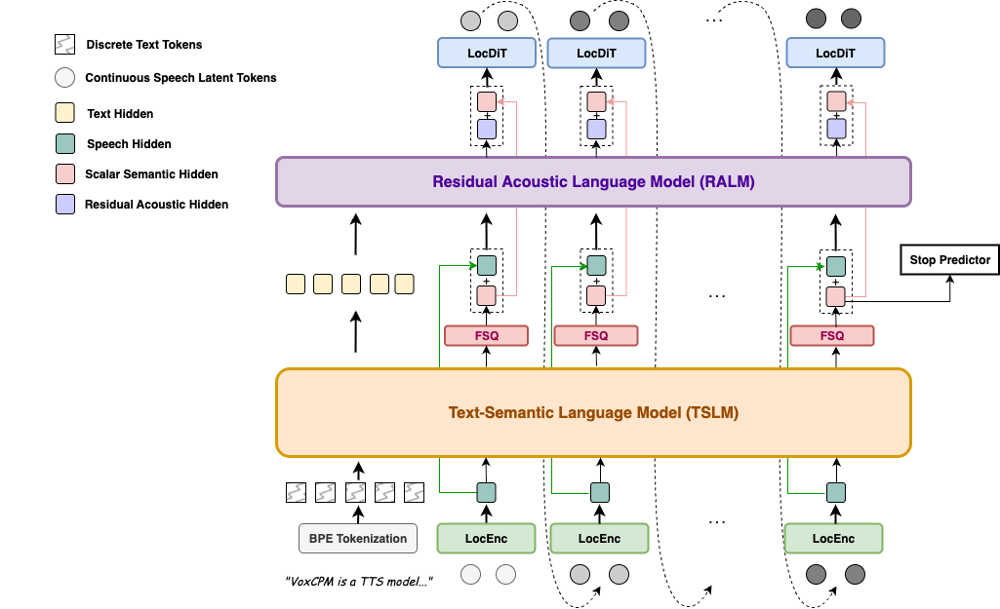
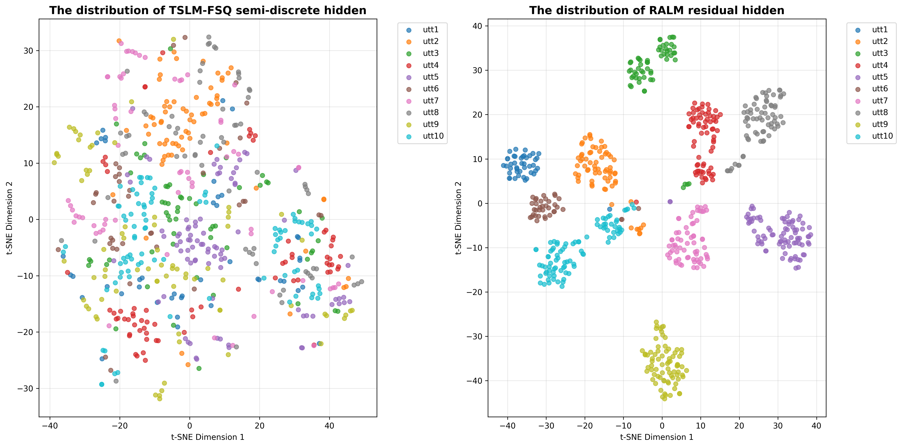

# VoxCPM: Tokenizer-Free TTS for Context-Aware Speech Generation and True-to-Life Voice Cloning

基本信息

- 标题: "VoxCPM: Tokenizer-Free TTS for Context-Aware Speech Generation and True-to-Life Voice Cloning."
- 作者:
  - 01 Yixuan Zhou
  - 02 Guoyang Zeng
  - 03 Xin Liu
  - 04 Xiang Li
  - 05 Renjie Yu
  - 06 Ziyang Wang
  - 07 Runchuan Ye
  - 08 Weiyue Sun
  - 09 Jiancheng Gui
  - 10 Kehan Li
  - 11 Zhiyong Wu
  - 12 Zhiyuan Liu
- 链接:
  - [ArXiv](https://arxiv.org/abs/2509.24650v1)
  - [Publication]()
  - [Github](https://github.com/OpenBMB/VoxCPM/)
  - [Demo](https://openbmb.github.io/VoxCPM-demopage/)
- 文件:
  - [ArXiv:2509.24650v1](PDF/2025.09.29_2509.24650v1__VoxCPM__Tokenizer-Free_TTS_for_Context-Aware_Speech_Generation_and_True-to-Life_Voice_Cloning.pdf)
  - [Publication] #TODO

## Abstract: 摘要

<!--
Generative models for speech synthesis face a fundamental trade-off: discrete tokens ensure stability but sacrifice expressivity, while continuous signals retain acoustic richness but suffer from error accumulation due to task entanglement.
This challenge has driven the field towards multi-stage pipelines that rely on pre-trained speech tokenizers, but these create a semantic-acoustic divide, limiting holistic and expressive speech generation.
We resolve these dilemma through hierarchical semantic-acoustic modeling with semi-discrete residual representations and present a novel tokenizer-free TTS model--***VoxCPM***.
Our framework introduces a differentiable quantization bottleneck that induces natural specialization: a Text-Semantic Language Model (TSLM) generates semantic-prosodic plans, while a Residual Acoustic Model (RALM) recovers fine-grained acoustic details.
This hierarchical semantic-acoustic representation guides a local diffusion-based decoder to generate high-fidelity speech latents.
Critically, the entire architecture is trained end-to-end under a simple diffusion objective, eliminating dependency on external speech tokenizers.
Trained on a massive 1.8 million hours of bilingual corpus, our ***VoxCPM-0.5B*** model achieves state-of-the-art zero-shot TTS performance among open-source systems, demonstrating that our approach delivers expressive and stable synthesis.
Besides, ***VoxCPM*** shows the capability to comprehend text to infer and generate appropriate prosody and style, delivering speech with context-aware expressiveness and natural flow.
To facilitate community-driven research and development, ***VoxCPM*** is publicly accessible under Apache 2.0.
-->
语音合成的生成式模型面临一个根本性权衡: 离散 Token 确保稳定性但牺牲了表现力, 连续信号保留了声学丰富性但由于任务耦合容易出现误差累积.
这一挑战使得研究转向依赖预训练语音分词器的多阶段流水线, 但这类方法造成了语义和声学之间的割裂, 限制了整体性和富有表现力的语音生成.
我们通过半离散残差表示的层次化语义-声学建模解决这些困境, 并提出了一个新的无分词器的 TTS 模型: ***VoxCPM***.
我们的框架引入了一个可微分的量化瓶颈引入自然的专业化: 文本-语义语言模型 (Text-Semantic Language Model, TSLM) 生成语义-韵律规划, 而残差声学模型 (Residual Acoustic Model, RALM) 恢复细粒度的声学细节.
这一层次化语义-声学表示引导局部的基于扩散的解码器以生成高保真的语音隐变量.
关键的是整个架构以端到端的方式, 在简单的扩散目标下进行训练, 消除了对额外语音分词器的依赖.

在 180w 小时的双语语料库上训练, 我们的 ***VoxCPM-0.5B*** 模型在开源系统中达到了 SoTA 的零样本 TTS 性能, 表明了该方法兼具表现力和稳定形.
此外, ***VoxCPM*** 展示了能够理解文本以推理和生成合适韵律和风格的能力, 输出具有内容感知表现力和自然流畅度的语音.
为了促进社区驱动的研究和开发, ***VoxCPM*** 在 Apache2.0 许可下公开发布.

## 1·Introduction: 引言

<!--
The pursuit of modern text-to-speech (TTS) systems has evolved beyond intelligibility toward the synthesis of genuinely human-like audio, capable of conveying subtle emotions, speaker identity, and contextual nuances (**Tacotron2**[^Shen2017Tacotron2], **DeepVoice3**[^Ping2017DeepVoice3], **FastSpeech2**[^Ren2020FastSpeech2], **TransformerTTS**[^Li2019TransformerTTS]).
This leap is critical for applications like empathetic virtual assistants and immersive digital avatars, and hinges on a core technical challenge: simultaneously capturing the fine-grained acoustic details that define vocal richness and the long-range semantic structures governing intelligibility and natural prosody.
-->
现代文本转语音系统的追求已经超越了可理解性向合成真正类人的语音, 并能够传达微妙的感情, 说话人身份和上下文细微差别 (**Tacotron2**[^Shen2017Tacotron2], **DeepVoice3**[^Ping2017DeepVoice3], **FastSpeech2**[^Ren2020FastSpeech2], **TransformerTTS**[^Li2019TransformerTTS]).
这一飞跃对共情型虚拟助手和沉浸式数字人等应用至关重要, 其核心在于一个关键技术挑战: "同时捕获定义声音丰富性的细粒度声学细节和支配可理解性和自然韵律的长程语义结构.

<!--
Inspired by the success of large language models (LLMs), a dominant paradigm frames TTS as a sequence modeling task over discrete tokens from pre-trained neural audio codecs (e.g., **EnCodec**[^Defossez2022EnCodec]).
Autoregressively or Non-autoregressively predicting these tokens from text or phonemes (**AudioLM**[^Borsos2022AudioLM], **SPEAR-TTS**[^Kharitonov2023SPEAR-TTS], **VALL-E**[^Wang2023VALL-E], **MaskGCT**[^Wang2024MaskGCT], **VoiceCraft**[^Peng2024VoiceCraft]) offers excellent scalability and in-context learning capabilities.
However, this approach faces a fundamental "quantization ceiling", as the compression process irreversibly discards subtle acoustic details.
To mitigate this quality loss, state-of-the-art TTS systems (**CosyVoice**[^Du2024CosyVoice], **CosyVoice2**[^Du2024CosyVoice2], **CosyVoice3**[^Du2025CosyVoice3], **IndexTTS2**[^Zhou2025IndexTTS2], **XTTS**[^Casanova2024XTTS]) adopt multi-stage hybrid pipelines.
Here, an LLM generates discrete tokens which condition a separate diffusion-based decoder.
While improving fidelity, this solution creates a stark semantic-acoustic divide: the LLM operates in an abstract, discrete space unaware of acoustic reality, while the diffusion model performs local refinement without high-level context.
This fragmentation prevents end-to-end optimization and limits holistic, expressive and context-aware speech synthesis.
-->
受到 LLM 成功的启发, 当前主流范式将 TTS 视为对预训练神经音频编解码器 (**EnCodec**[^Defossez2022EnCodec]) 所生成的离散 Token 的序列建模任务.
从文本或音素自回归或非自回归地预测这些 Token (**AudioLM**[^Borsos2022AudioLM], **SPEAR-TTS**[^Kharitonov2023SPEAR-TTS], **VALL-E**[^Wang2023VALL-E], **MaskGCT**[^Wang2024MaskGCT], **VoiceCraft**[^Peng2024VoiceCraft]) 展现了优异的可扩展性和上下文学习能力.

然而, 这种方法面临一个根本性的 "量化天花板": 压缩过程不可逆地丢弃了微妙的声学细节.
为了缓解这种音质损失, 当前最先进的 TTS 系统 (**CosyVoice**[^Du2024CosyVoice], **CosyVoice2**[^Du2024CosyVoice2], **CosyVoice3**[^Du2025CosyVoice3], **IndexTTS2**[^Zhou2025IndexTTS2], **XTTS**[^Casanova2024XTTS]) 采用了多阶段混合流程.
由 LLM 生成离散 Token, 作为单独基于扩散的解码器的条件.
虽然提升了保真度, 这种方案造成了明显的语义-声学割裂: LLM 在抽象的离散空间中运行, 对声学细节毫无感知; 而扩散模型仅惊醒了局部细化, 缺乏高层的上下文.
这种割裂阻碍了端到端优化, 限制了整体性, 表现力和上下文感知的语音合成.

<!--
Alternatively, other approaches directly model continuous speech representations to avoid quantization loss.
Early systems like **Tacotron2**[^Shen2017Tacotron2] and more recent models such as **MELLE**[^Meng2024MELLE] generate mel-spectrograms autoregressively.
However, predicting continuous targets under standard regression losses often yields over-smoothed and low-diversity outputs.
To address this, recent innovations have explored replacing the regression objective with a denoising process to model the distribution of the next continuous representations, spanning both non-autoregressive paradigms (**NaturalSpeech2**[^Shen2023NaturalSpeech], **VoiceBox**[^Le2023VoiceBox], **F5-TTS**[^Chen2024F5-TTS]) and autoregressive methods(**ARDiT**[^Liu2024ARDiT], **DiTAR**[^Jia2025DiTAR], **VibeVoice**[^Peng2025VibeVoice]).
Among these, autoregressive approaches have often demonstrated superior performance in capturing natural prosody and expressive variation.
This innovation successfully enhances the detail and diversity of generated continuous representations.
However, a more fundamental issue persists: in a fully continuous autoregressive model, the tasks of high-level semantic-prosodic planning and fine-grained acoustic rendering are conflated within a single learning objective.
The model is forced to simultaneously solve two disparate tasks—requiring different inductive biases—in a continuous output space.
This entanglement presents a significant challenge to the modeling capacity of a single LLM, as it must learn to be both a global planner and a local renderer without an inherent architectural bias to separate these functions.
We argue that this conflation is a root cause of instability.
The model's focus is inevitably pulled towards fitting low-level acoustic textures, which compromises its ability to maintain high-level semantic coherence, leading to the well-known problem of error accumulation over long sequences (**CAM**[^Pasini2024CAM]).
-->
另一种方法则直接建模连续语音表示, 避免量化损失.
早期系统如 **Tacotron2**[^Shen2017Tacotron2] 和近期模型如 **MELLE**[^Meng2024MELLE] 自回归地生成梅尔频谱.
但是在标准回归损失下预测连续目标通常会导致过度平滑, 多样性不足的输出.
为了解决这一问题, 近期研究尝试用去噪过程替代回归目标, 以建模下一连续表示的分布, 涵盖非自回归范式 (**NaturalSpeech2**[^Shen2023NaturalSpeech], **VoiceBox**[^Le2023VoiceBox], **F5-TTS**[^Chen2024F5-TTS]) 和自回归方法 (**ARDiT**[^Liu2024ARDiT], **DiTAR**[^Jia2025DiTAR], **VibeVoice**[^Peng2025VibeVoice]).

在这些方法中, 自回归方法在捕捉自然韵律和表现力变化方面通常表现更优, 显著提升了生成连续表示生成的连续表示的细节和多样性.
然而, 一个更根本的问题依然存在: 在完全连续自回归模型中, 高层语义-韵律规划和细粒度声学渲染被混杂在单个学习目标中.
模型被迫在同一连续输出空间中同时解决两个本质不同的任务: 而这需要不同的归纳偏置.
这种耦合对单个 LLM 的建模能力构成严峻挑战: 它必须同时作为全局规划者和局部渲染器, 却缺乏内在的架构偏置来分离这些功能.
我们认为这种混杂是导致模型不稳定的根本原因.
模型的注意力不可避免地偏向拟合低层声学纹理, 从而削弱了维持高层语义一致性, 导致在长序列上广为人知的误差累积问题 (**CAM**[^Pasini2024CAM]).

<!--
In this work, we introduce a tokenizer-free, end-to-end framework that resolves this trade-off through hierarchical semantic-acoustic modeling with semi-discrete residual representations and present a novel TTS model--***VoxCPM***.
Our key insight is that holistic and expressive speech synthesis requires explicit architectural separation between semantic-prosodic planning and acoustic rendering, yet should remain within a cohesive, end-to-end trainable system.
The core innovation is a differentiable **Finite Scalar Quantization (FSQ)**[^Mentzer2023FSQ] bottleneck that induces natural specialization:
(1) a Text-Semantic Language Model (TSLM) generates semantic-prosodic plans stabilized through quantization, focusing on linguistically meaningful patterns;
(2) a Residual Acoustic Language Model (RALM) recovers fine-grained details lost during quantization, specializing in acoustic refinement.
-->
在本文中, 我们提出了一个无需分词器的端到端框, 通过半离散残差表示的层次化语义-声学建模以解决上述权衡, 并提出了一个新 TTS 模型 **VoxCPM**.
我们的关键洞见是: 实现整体性和表现力的语音合成, 需要在架构上显式分离语义-韵律规划和声学渲染, 同时保持系统整体的端到端可训练性.
关键创新在于引入了可微分的**有限标量量化 FSQ**[^Mentzer2023FSQ] 瓶颈, 自然地诱导专业化:
(1) **文本-语义语言模型 (Text-Semantic Language Model, TSLM)** 通过量化生成稳定的语义-韵律规划, 专注于语言学上有意义的模式.
(2) **残差声学语言模型 (Residual Acoustic Language Model, RALM)** 恢复量化时丢失的细粒度细节, 专精于声学细化.

<!--
This hierarchical design enables each component to excel at its respective role while maintaining differentiability, and both of them will be used to guide a local diffusion decoder to generate high-fidelity speech latents.
Critically, the entire hierarchical model is trained end-to-end under a simple diffusion objective, seamlessly integrating planning and rendering without pre-trained tokenizers.
Trained on a massive 1.8 million hours of bilingual corpus, our ***VoxCPM-0.5B*** model achieves state-of-the-art zero-shot TTS performance among open-source systems, demonstrating that our approach delivers expressive and stable synthesis.
Our main contributions are as follows:
-  We propose an end-to-end hierarchical architecture that introduces an internal semi-discrete bottleneck to resolve the expressivity-stability trade-off.
This mechanism implicitly addresses task entanglement in continuous models by inducing a beneficial separation between semantic-prosodic planning and fine-grained acoustic modeling within a single, unified framework.
-  We introduce a residual learning strategy that, in conjunction with the bottleneck, enables a holistic yet specialized modeling process.
Unlike fragmented multi-stage pipelines, our approach achieves functional separation without architectural fragmentation, simplifying the training pipeline and eliminating dependency on external speech tokenizers.
-  We demonstrate the efficacy of our approach through large-scale training on a massive 1.8 million hours of bilingual speech.
The resulting model, ***VoxCPM-0.5B***, achieves state-of-the-art zero-shot TTS performance among open-source systems with a Real-Time Factor (RTF) as low as 0.17 on a consumer-grade NVIDIA RTX 4090 GPU, validating its practical strength.
-  We provide extensive ablation studies that conclusively validate the semi-discrete residual representations as the crucial component for robust, expressive, and context-aware synthesis.
Besides, we release the codes and models publicly to support community development and future research.
-->
这一层次化设计使得各个组件在其对应任务上发挥到极致, 同时保持可微性, 并共同引导局部扩散解码器以生成高保真语音隐变量.
关键的是, 整个层次化模型在简单扩散目标下进行端到端训练, 无缝融合规划和渲染过程, 无需依赖任何预训练的语音分词器.
在 180w 小时双语语料库上训练后, 我们的 ***VoxCPM-0.5B*** 模型在开源系统中实现了 SoTA 零样本 TTS 性能, 表明了我们的方法可以实现表现性且稳定的合成.

我们的主要贡献如下:
- 提出了端到端层次化架构, 引入了内部半离散瓶颈以解决表现力和稳定性权衡. 这一机制隐式地处理了连续模型中的任务耦合, 在单个统一架构内引入了语义-韵律规划和细粒度声学建模的有益分离.
- 引入了残差学习策略和瓶颈协同, 实现整体且专业的建模过程. 和割裂的多阶段流程不同, 我们的方法在不造成架构碎片化的前提下实现了功能解耦, 简化了训练流程并彻底摆脱了对外部语音分词器的依赖.
- 通过在 180w 小时双语语音数据上大规模训练验证了方法的有效性. ***VoxCPM-0.5B*** 在开源系统中达到了 SoTA 零样本 TTS 性能, 且 RTF 在 4090 上达到 0.17, 验证了其实际能力.
- 进行了全面的消融实验, 验证了半离散残差表示是实现稳健, 表现力, 上下文感知合成的关键组件. 此外我们发布了代码和模型以支持社区发展和未来研究.

## 2·Background: 背景

### Discrete Token-Based TTS: 基于离散 Token 的 TTS

<!--
The discrete token paradigm has emerged as a dominant approach in modern TTS, leveraging the success of large language models.
This method converts speech into discrete representations using neural audio codecs such as **EnCodec**[^Defossez2022EnCodec] and **DAC**[^Kumar2023DAC] through residual vector quantization (RVQ).
**AudioLM**[^Borsos2022AudioLM] and **VALL-E**[^Wang2023VALL-E] pioneered this direction by framing audio generation and TTS as an autoregressive sequence prediction task over discrete acoustic tokens.
Subsequent developments include **SoundStorm**[^Borsos2023SoundStorm], which introduced non-autoregressive generation for improved efficiency, and **SPEAR-TTS**[^Kharitonov2023SPEAR-TTS], which focused on multilingual capabilities with minimum supervision.
Besides, **VoiceCraft**[^Peng2024VoiceCraft] and **XTTS**[^Casanova2024XTTS] further advanced zero-shot TTS with in-context learning.
-->
离散 Token 范式已成为现代 TTS 中的主流方法, 其成功很大程度上得益于大语言模型的发展.
该方法利用神经音频编解码器 (如 **EnCodec**[^Defossez2022EnCodec] 和 **DAC**[^Kumar2023DAC]), 通过残差矢量量化 (Residual Vector Quantization, RVQ) 将语音转换为离散表示.
- **AudioLM**[^Borsos2022AudioLM] 与 **VALL-E**[^Wang2023VALL-E] 首次开创了这一方向, 将音频生成和 TTS 建模为对离散声学 Token 的自回归序列预测任务.

随后的研究进一步拓展了该范式:
- **SoundStorm**[^Borsos2023SoundStorm] 引入了非自回归生成机制, 显著提升了推理效率;
- **SPEAR-TTS**[^Kharitonov2023SPEAR-TTS] 则聚焦于在极少量监督条件下实现多语言能力.
- **VoiceCraft**[^Peng2024VoiceCraft] 与 **XTTS**[^Casanova2024XTTS] 通过上下文学习进一步推动了零样本 TTS 的性能边界.

<!--
Recent advancements have focused on enhancing the scalability, controllability and zero-shot adaptation.
**CosyVoice**[^Du2024CosyVoice] proposed supervised semantic tokens for improved zero-shot performance, while its successors, **CosyVoice2**[^Du2024CosyVoice2], **CosyVoice3**[^Du2025CosyVoice3] incorporated text-based LLM initialization, streaming synthesis, and large-scale training data for human-parity quality, low latency and in-the-wild scenarios.
**IndexTTS**[^Deng2025IndexTTS] and **IndexTTS2**[^Zhou2025IndexTTS2] introduced precise duration and emotion control in autoregressive token generation, enabling applications with strict timing and expressivity requirements.
**Spark-TTS**[^Wang2025Spark-TTS] utilized single-stream decoupled speech tokens for modeling efficiency, and **FireRedTTS**[^Guo2024FireRedTTS] along with its update **FireRedTTS-2**[^Xie2025FireRedTTS-2] established frameworks for industry-level generative speech, including long-form multi-speaker dialogue.
**OpenAudioS1**[^OpenAudio2025OpenAudioS1] used dual AR architecture and online Reinforcement Learning from Human Feedback (RLHF) to improve expressiveness and instruction-following capabilities.
**HiggsAudioV2**[^BosonAI2025HiggsAudioV2] proposed a unified audio tokenizer captures both semantic and acoustic features, and  pretrained on over 10 million hours of audio data, providing a powerful foundation model.
Despite these progresses, discrete approaches suffer from inherent quantization artifacts, limiting acoustic fidelity and prompting hybrid solutions.
-->
近期的研究进展聚焦于提升可扩展性, 可控性以及零样本适应能力.
- **CosyVoice**[^Du2024CosyVoice] 提出了监督语义 token 以提升零样本性能;
- 其后续版本 **CosyVoice2**[^Du2024CosyVoice2] 与 **CosyVoice3**[^Du2025CosyVoice3] 进一步引入了基于文本的大语言模型（LLM）初始化, 流式合成机制以及大规模训练数据, 从而在真实场景中实现媲美人声的音质, 低延迟和高鲁棒性.
- **IndexTTS**[^Deng2025IndexTTS] 与 **IndexTTS2**[^Zhou2025IndexTTS2] 在自回归 Token 生成中引入了精确的时长与情感控制, 适用于对时序精度和表现力要求严苛的应用场景.
- **Spark-TTS**[^Wang2025Spark-TTS] 采用单流解耦的语音 Token 以提升建模效率;
- **FireRedTTS**[^Guo2024FireRedTTS] 及其升级版 **FireRedTTS-2**[^Xie2025FireRedTTS-2] 构建了面向工业级语音生成的框架, 支持长篇幅多说话人的对话合成.
- **OpenAudioS1**[^OpenAudio2025OpenAudioS1] 采用双自回归架构, 并结合在线人类反馈强化学习, 以增强语音的表现力与指令遵循能力.
- **HiggsAudioV2**[^BosonAI2025HiggsAudioV2] 提出了一种统一的音频分词器, 能够同时捕捉语义与声学特征, 并在超过一千万小时的音频数据上进行预训练, 构建了一个强大的基座模型.

尽管取得了上述进展, 离散化方法仍受制于固有的量化伪影, 限制了声学保真度, 从而催生了混合解决方案.

### Continuous Representation TTS: 基于连续表示的 TTS

<!--
To circumvent quantization losses in discrete models, continuous representation approaches directly model speech features such as mel-spectrograms or audio latents.
Early systems like **Tacotron2**[^Shen2017Tacotron2] established the encoder-decoder framework for text-to-mel mapping, while **FastSpeech2**[^Ren2020FastSpeech2] introduced explicit duration modeling for alignment stability.
Inspired from **VALL-E**, **MELLE**[^Meng2024MELLE] autoregressively generated continuous mel-spectrogram frames directly from text condition, and incorporated variational inference to facilitate sampling mechanisms.
Recent developments have integrated diffusion processes to enhance detail and diversity.
Non-autoregressive models like **NaturalSpeech2**[^Shen2023NaturalSpeech] and **VoiceBox**[^Le2023VoiceBox] apply diffusion directly on continuous representations.
**F5-TTS**[^Chen2024F5-TTS] advanced flow-matching for efficient synthesis.
Autoregressive paradigms, often superior in prosody and variation, additionally possess the capability for streaming synthesis.
Innovations like **ARDiT**[^Liu2024ARDiT] use an autogressive diffusion transformer for TTS, unifying semantic coherence and acoustic naturalness via parameter sharing.
**DiTAR**[^Jia2025DiTAR] extended this with a patch-based design: a causal LM for inter-patch stability and a bidirectional local diffusion transformer for intra-patch refinement.
**VibeVoice**[^Peng2025VibeVoice] employed next-token diffusion for long-form multi-speaker synthesis.
Besides, recent models such as **CLEAR**[^Wu2025CLEAR] and **FELLE**[^Wang2025FELLE] focus on latent autoregressive modeling with token-wise coarse-to-fine hierarchies, while **MELA-TTS**[^An2025MELA-TTS] and **KALL-E**[^Xia2024KALL-E] combine joint transformer-diffusion with next-distribution prediction for improved efficiency and quality.
Despite these advances, continuous models often entangle high-level semantic planning with low-level acoustic rendering, leading to instability in long sequences without explicit separation.
-->
为规避离散模型中的量化损失, 连续表示方法直接对语音特征 (如梅尔频谱图或音频潜在表示) 进行建模.
早期系统如 **Tacotron2**[^Shen2017Tacotron2] 建立了文本到梅尔频谱的编码器-解码器框架, 而 **FastSpeech2**[^Ren2020FastSpeech2] 引入了显式的时长建模以提升对齐稳定性.
受 **VALL-E** 启发, **MELLE**[^Meng2024MELLE] 从文本条件直接自回归生成连续的梅尔频谱帧, 并引入变分推断以优化采样机制.

近期研究进一步整合扩散过程, 以增强细节表现与多样性.
- 非自回归模型如 **NaturalSpeech2**[^Shen2023NaturalSpeech] 与 **VoiceBox**[^Le2023VoiceBox] 直接在连续表示上应用扩散机制.
  - **F5-TTS**[^Chen2024F5-TTS] 则通过流匹配技术实现了高效合成.
- 自回归范式通常在韵律和变化性方面表现更优, 并具备流式合成能力.
  - **ARDiT**[^Liu2024ARDiT] 采用自回归扩散 Transformer 进行 TTS, 通过参数共享统一语义一致性与声学自然度.
  - **DiTAR**[^Jia2025DiTAR] 在此基础上引入基于 Patch 的设计: 使用因果语言模型保证 Patch 间的稳定性, 同时采用双向局部扩散 Transformer 对 Patch 内部进行精细化处理.
  - **VibeVoice**[^Peng2025VibeVoice] 则采用 下一 Token 扩散策略, 实现长篇幅多说话人语音合成.

- 此外, 近期模型如 **CLEAR**[^Wu2025CLEAR] 与 **FELLE**[^Wang2025FELLE] 聚焦于潜在空间中的自回归建模, 采用 Token 级别的由粗到细层次结构.
- 而 **MELA-TTS**[^An2025MELA-TTS] 与 **KALL-E**[^Xia2024KALL-E] 则结合联合 Transformer-扩散架构与下一分布预测, 以提升效率与音质.

尽管如此, 连续模型往往将高层语义规划与底层声学渲染耦合在一起, 在缺乏显式解耦的情况下长序列生成容易出现不稳定性.

### Hierarchical and Residual Modeling in TTS: 层次和残差建模

<!--
Hierarchical and residual approaches decompose TTS into layered tasks to balance stability and expressivity.
- **HierSpeech++**[^Lee2023HierSpeech++] employed variational inference for semantic-acoustic mapping.
- **HALL-E**[^Nishimura2024HALL-E] uses hierarchical neural codecs with LLMs for minute-long synthesis.
- **MARS6**[^Baas2025MARS6] builds robust encoder-decoder transformers with hierarchical tokens.
- **DiffStyleTTS**[^Liu2024DiffStyleTTS] applies diffusion for hierarchical prosody modeling.
- **HAM-TTS**[^Wang2024HAM-TTS] introduces hierarchical acoustic modeling with data augmentation for zero-shot TTS.
- **QTTS**[^Han2025QTTS] features hierarchical parallel architectures for residually quantized codes.
- In song generation, **LeVo**[^Lei2025LeVo] likewise introduced a hierarchical framework using two decoder-only transformers for layered modeling of mixed and separated part in a song, achieving enhanced generation quality.

These methods address flaws in prior paradigms: implicit designs lack regulated bottlenecks, tokenizer-dependent models suffer discrete losses, and fragmented stages hinder end-to-end optimization.
However, few fully integrate explicit residual designs with semi-discrete bottlenecks in a unified framework, as proposed in our work, to achieve implicit disentanglement without external dependencies.
-->
层次化与残差方法将 TTS 分解为多个层级任务, 以在稳定性与表现力之间取得平衡.
- **HierSpeech++**[^Lee2023HierSpeech++] 利用变分推断实现语义到声学的映射;
- **HALL-E**[^Nishimura2024HALL-E] 结合分层神经编解码器与大语言模型支持分钟级语音合成.
- **MARS6**[^Baas2025MARS6] 构建了具有分层 Token 的鲁棒编码器-解码器 Transformer.
- **DiffStyleTTS**[^Liu2024DiffStyleTTS] 应用扩散机制进行分层韵律建模.
- **HAM-TTS**[^Wang2024HAM-TTS] 引入分层声学建模并结合数据增强实现零样本 TTS.
- **QTTS**[^Han2025QTTS] 采用分层并行架构处理残差量化编码.
- 在歌声合成领域, **LeVo**[^Lei2025LeVo] 同样提出了一个分层框架使用两个仅解码器的 Transformer 分别建模歌曲中的混合与分离部分, 显著提升了生成质量.

这些方法旨在解决以往范式的缺陷: 隐式设计缺乏受控瓶颈, 依赖分词器的模型受限于离散化损失, 而割裂的阶段阻碍了端到端优化.

然而, 目前鲜有工作能像本文所提出的方案一样, 在统一框架中完整整合显式残差设计与半离散瓶颈, 从而在无需外部依赖的前提下实现隐式的解耦.

## 3·Methodology

> 
> 图 01: ***VoxCPM*** 的整体架构.
> 该模型采用层次化方式生成语音: 首先通过局部编码器 (LocEnc) 处理音频潜在表示, 随后利用 TSLM 与有限标量量化 FSQ 生成半离散的语音骨架, 接着通过 RALM 细化声学细节, 最后由局部扩散 Transformer (LocDiT) 生成高保真度的潜在输出.
> <!--
> Fig.01: Overall architecture of ***VoxCPM***.
> The model hierarchically generates speech by first processing audio latents through a LocEnc, then producing a semi-discrete speech skeleton with the TSLM and FSQ, refining acoustic details with the RALM, and finally generating high-fidelity latent output with the LocDiT.
> -->

### Core Design Motivation: 核心设计动机

<!--
Generative speech synthesis faces a fundamental tension between expressivity and stability.
Discrete tokenization methods (e.g., speech tokenizers with language models) ensure stable autoregressive generation but irreversibly discard fine-grained acoustic details through quantization.
Continuous approaches preserve full fidelity but suffer from error accumulation in long sequences due to information entanglement, often leading to catastrophic failure in intelligibility.
-->
生成式语音合成面临表达力和稳定性之间的根本性权衡.
- 离散分词化方法 (即语音分词器+语言模型) 能够确保稳定的自回归生成但会因为量化过程不可逆地丢失细粒度的声学细节.
- 连续方法保留了完整的保真度但由于信息耦合而在长序列生成中容易累积误差, 常常导致语音可理解性的灾难性崩溃.

<!--
Critically, we identify a key limitation in existing discrete tokenization approaches: methods that directly use FSQ or VQ to obtain discrete codebooks for language modeling face an inherent scalability challenge.
As the dimensionality increases to capture richer acoustic information, the codebook size grows exponentially, creating an unmanageably large and sparse vocabulary that language models struggle to predict accurately.
-->
关键在于, 我们指出现有的离散分词方法存在一个核心局限: 直接使用 FSQ 或 VQ 来获取离散码本以供语言建模的方法, 面临固有的可扩展性挑战.
随着维度增加以捕捉更丰富的声学信息, 码本规模呈指数级增长, 导致语言模型难以准确预测一个庞大且稀疏的词汇表.

<!--
We hypothesize that an effective solution should **structurally separate** the modeling of stable semantic-prosodic content from fine-grained acoustic details while maintaining differentiability for end-to-end training.
Our key insight is to introduce a **differentiable quantization bottleneck** that naturally induces this separation through scalar quantization, splitting information into a discrete-like skeleton for content stability and continuous residual components for detail expressivity.
-->
我们假设一种有效的解决方案应当**在结构上分离**稳定的语义-韵律内容的建模与细粒度声学细节的建模, 同时保持可微性以支持端到端训练.
我们的核心洞见是引入一个**可微分的量化瓶颈**, 通过标量量化自然地诱导这种分离: 将信息拆分为一个类离散的"骨架"以保障内容稳定性, 以及连续的残差成分以保留细节表现力.

<!--
Unlike multi-stage TTS systems composed of seperate LM and diffusion that treat quantization as a means to obtain discrete prediction targets, our approach uses quantization solely as a regularization mechanism to constrain the hidden state space.
This distinction allows us to avoid the vocabulary explosion problem while still benefiting from the stabilizing effects of discrete representations.
-->
与由独立的语言模型和扩散模型组成的多阶段 TTS 系统不同: 后者将量化视为获取离散预测目标的手段, 我们的方法仅将量化作为一种正则化机制, 用于约束隐状态空间.
这一区别使我们既能避免词汇量爆炸问题, 又能保留离散表示所带来的稳定性优势.

### Model Overview: 模型概览

<!--
***VoxCPM*** employs a hierarchical autoregressive architecture that generates sequences of continuous speech latents $\mathbf{Z} = \{\mathbf{z}_1, ..., \mathbf{z}_M\}$ conditioned on input text tokens $\mathbf{T} = \{t_1, ..., t_N\}$, where each $\mathbf{z}_i \in \mathbb{R}^{P \times D}$ represents a patch of $P$ frames with $D$-dimensional VAE latent vectors.
The generation process follows:
-->
***VoxCPM*** 采用了层次化自回归架构, 以输入文本 Token $\mathbf{T} = \{t_1, ..., t_N\}$ 为条件生成连续语音隐向量序列  $\mathbf{Z} = \{\mathbf{z}_1, ..., \mathbf{z}_M\}$, 每个 $\mathbf{z}_i \in \mathbb{R}^{P \times D}$ 表示一个 Patch, 内含 $P$ 帧 $D$ 维的 VAE 隐向量.

生成过程如下:
$$
p(\mathbf{Z}|\mathbf{T}) = \prod_{i=1}^M p(\mathbf{z}_i | \mathbf{T}, \mathbf{Z}_{<i})
$$

<!--
The core innovation lies in our hierarchical conditioning mechanism with residual representation learning.
It is made up of a local audio encoder (LocEnc), a text-semantic language model (TSLM), a residual acoustic language model (RALM) and a local diffusion transformer decoder (LocDiT).
A stop predictor is attached to the output of the TSLM to determine the endpoint of generation.
As shown in [Fig.01](#fig:architecture), each patch generation involves:
-->
核心创新在于我们的层次条件化机制和残差表示学习.
它由**局部音频编码器 LocEnc**, **文本-语义语言模型 TSLM**, **残差声学语言模型 RALM**, **局部扩散 Transformer 解码器 LocDiT** 组成.
TSLM 的输出添加了一个停止预测器, 用于判断生成过程的终止位置.
如[图 01](#fig:architecture) 所示, 每个 Patch 生成包括如下过程:

$$
\mathbf{z}_i \sim \text{LocDiT}(\mathbf{h}_i^{\text{final}}), \quad
\mathbf{h}_i^{\text{final}} = \underbrace{\text{FSQ}(\text{TSLM}(\mathbf{T}, \mathbf{E}_{<i}))}_{\text{stable skeleton}} + \underbrace{\text{RALM}(\cdot)}_{\text{residual details}}
$$

<!--
where $\mathbf{E}_{<i} = \text{LocEnc}(\mathbf{Z}_{<i})$ represents historical audio context aggregated by a lightweight LocEnc that compresses VAE latent patches into compact acoustic embeddings.
-->
其中 $\mathbf{E}_{<i} = \text{LocEnc}(\mathbf{Z}_{<i})$ 表示由轻量的 LocEnc 聚合的层次音频内容, 它将 VAE 隐向量的 Patch 压缩为紧凑的声学嵌入.

<!--
The hierarchical backbone produces a conditioning signal $\mathbf{h}_i^{\text{final}}$ that encapsulates both semantic content from TSLM (with FSQ) and acoustic details from RALM.
This signal guides the LocDiT to generate the current latent patch $z_i$ through a denoising diffusion process.
The entire model is trained end-to-end with gradients flowing through all components, including the FSQ bottleneck via straight-through estimation, ensuring coordinated optimization toward holistic speech synthesis.
-->
层次化骨干网络生成一个条件化信号 $\mathbf{h}_i^{\text{final}}$ 融合了来自 TSLM + FSQ 的语音内容和来自 RALM 的声学细节.
这一信号引导 LocDiT 通过降噪扩散过程生成当前隐向量 Patch $z_i$.
整个模型以端到端方式训练, 梯度流通每个组件, 包括通过直通估计处理的 FSQ 瓶颈, 确保各个模块协同优化实现整体性的语音合成.

### Hierarchical Semantic-Acoustic Modeling: 层次语义-声学建模

<!--
Our hierarchical modeling approach is designed to implicitly separate semantic-prosodic planning from fine-grained acoustic synthesis, addressing the fundamental stability-expressivity trade-off through structured representation learning.
-->
我们的层次建模方法设计用于隐式分离语义-韵律规划和细粒度声学合成, 通过结构表示学习处理基础的稳定性-表现力权衡.

#### Text-Semantic Language Model (TSLM)

<!--
The Text-Semantic Language Model forms the main part of our hierarchical architecture, responsible for capturing high-level linguistic structure and generating contextually appropriate speech patterns.
Unlike conventional TTS systems that typically operate on phoneme sequences, our approach leverages a pre-trained text language model (**MiniCPM4**[^Xiao2025MiniCPM4]) as its initial backbone, enabling richer contextual understanding and more natural prosody prediction directly from raw text.
Specifically, we employ character-level segmentation for Chinese BPE Tokenizer to mitigate the vocabulary sparsity issue in TTS tasks.
By processing both text tokens and historical audio context, the TSLM learns to generate semantic content and prosodic structure that evolve naturally throughout an utterance, reflecting the underlying linguistic meaning rather than simply mapping phonemes to acoustic features.
The TSLM produces continuous semantic-prosodic representations that encode both the content to be spoken and how it should be prosodically realized, serving as input to the subsequent quantization stage.
-->
TSLM 构成了层次架构的主要部分, 负责捕获高级语言学结构并生成符合上下文的语音模式.
和传统的 TTS 系统通常依赖音素序列不同, 我们采用一个预训练的文本语言模型 (**MiniCPM4**[^Xiao2025MiniCPM4]) 作为初始骨干, 从而能够直接从原始文本中实现更丰富的上下文理解, 并更自然地预测韵律.

具体而言, 我们对中文采用字符级切分的 BPE 分词器以缓解 TTS 任务中常见的词汇表稀疏问题.
通过处理文本 Token 和历史音频上下文, TSLM 学习生成在整个语句中自然演化的语义内容和韵律结构, 其输出反映的是深层的语言含义, 而不仅仅是简单地将音素映射到声学特征.
TSLM 输出的是连续的语义-韵律表示, 既编码了要说的内容, 还包含了它应该以何韵律方式实现, 这些表示随后作为后续量化阶段的输入.

#### Semi-Discrete Representation Learning via FSQ: 半离散表示学习

<!--
At the core of our approach lies the Finite Scalar Quantization (FSQ) layer, which projects the continuous hidden states from the TSLM onto a structured lattice to create a semi-discrete representation.
The FSQ operation transforms each dimension of the continuous vector through a deterministic scalar quantization:
-->
我们方法的核心是**有限标量量化 (Finite Scalar Quantization, FSQ)** 层, 它将 TSLM 输出的连续隐状态投影到一个结构化的格点 (lattice) 上, 从而生成一种**半离散表征**.
FSQ 对连续向量的每一维执行确定性的标量量化操作:

$$
\mathbf{h}_{i,j}^{\text{FSQ}} = \Delta \cdot \text{clip}\left( \text{round}\left( \frac{\mathbf{h}_{i,j}^{\text{TSLM}}}{\Delta} \right), -L, L \right)
$$

<!--
where $\Delta$ is the quantization step size, $L$ is the clipping range, and $\text{round}$ maps values to discrete levels.
This transformation creates a structured discrete representation while maintaining differentiability through the straight-through estimator during backward passes.
-->
其中：
- $\Delta$ 为量化步长;
- $L$ 为裁剪范围;
- $\text{round}(\cdot)$ 将实数值映射到最近的离散层级.

该变换在前向传播中生成结构化的离散表示, 而在反向传播中通过**直通估计器 (Straight-Through Estimator, STE)** 保持梯度可导, 从而实现端到端训练.

<!--
The FSQ layer acts as a bottleneck, analogous to the first layer of Residual Vector Quantization (RVQ), which captures a coarse semantic-prosodic skeleton (e.g., content, intonation patterns).
We term this representation "semi-discrete" as it employs a significantly larger dimensionality than standard FSQ to ensure sufficient informational capacity.
Unlike RVQ, where the first layer is a prediction target and subsequent layers model finer details, our FSQ bottleneck serves as an intermediate, differentiable inductive bias  within the continuous data flow.
It encourages the model to prioritize modeling stable, high-level components (the semantic-prosodic skeleton) by providing a clear learning signal for what information should be preserved through the bottleneck.
This structured approach mitigates error accumulation by reducing the modeling burden on the TSLM, allowing it to focus on the major components of the speech.
-->
FSQ 层在此充当一个信息瓶颈, 其作用类似于残差矢量量化中的第一层, 用于捕获语音的**粗粒度语义-韵律骨架** (例如内容语义, 语调模式等).
我们称其输出为**半离散**, 是因为我们采用了**远高于标准 FSQ 的维度**, 以确保足够的信息容量, 避免语义损失.
与传统 RVQ 不同之处: 在 RVQ 中第一层是预测目标, 后续层建模残差细节, 我们的 FSQ 瓶颈并非最终输出目标, 而是嵌入在连续数据流中的一个**可微分的归纳偏置**.
它通过明确的瓶颈约束, 向模型提供清晰的学习信号: **哪些高层、稳定的信息必须被保留**.

这种结构化设计有效**缓解了误差累积问题**:
- 通过将语义-韵律骨架"固化"在 FSQ 表示中, 减轻了 TSLM 的建模负担;
- 使 TSLM 能更专注于学习语音中的主要成分, 而将精细声学细节的建模交给后续的 RALM 和 LocDiT 模块.

最终 FSQ 不仅提升了系统鲁棒性, 还为整个分层生成流程建立了清晰的职责分工.

#### Residual Acoustic Modeling: 残差声学建模

<--
To recover the fine-grained acoustic information attenuated by quantization, we introduce the Residual Acoustic Language Model (RALM).
This module specializes in reconstructing those subtle vocal characteristics that conventional discrete methods sacrifice for stability.
It processes the quantization residuals along with contextual information to recover speaker identity, spectral fine structure, and micro-prosodic variations:
-->
为恢复因量化而衰减的细粒度声学信息, 我们引入了**残差声学语言模型 (Residual Acoustic Language Model, RALM)**.
该模块专门用于重建那些传统离散化方法为换取稳定性而牺牲的细微语音特征, 例如说话人身份, 频谱精细结构以及微观韵律变化.
RALM 在文本语义上下文与历史声学信息的共同引导下, 对量化残差进行建模, 其计算方式如下:

$$
\mathbf{h}_i^{\text{residual}} = \text{RALM}( \mathbf{H_{\text{text}}^{\text{TSLM}}}, \mathbf{H}_{<i}^{\text{FSQ}} \oplus \mathbf{E}_{<i})
$$

<!--
Here, the RALM conditions its predictions on both the TSLM hidden states of the text part $\mathbf{H_{\text{text}}^{\text{TSLM}}}$, the semi-discrete representation of speech part $\mathbf{H}_{<i}^{\text{FSQ}}$, and the historical acoustic embeddings $\mathbf{E}_{<i}$.
This residual learning approach  creates a natural division of labor: the TSLM+FSQ pathway focuses on content stability and prosodic coherence, while the RALM pathway specializes in acoustic expressivity and speaker characteristics.

The final combined representation $\mathbf{h}_i^{\text{final}} = \mathbf{h}_i^{\text{FSQ}} + \mathbf{h}_i^{\text{residual}}$ thus encapsulates both semantic stability and acoustic expressivity, creating a comprehensive signal that guides the subsequent local diffusion process.
-->
其中：
- $\mathbf{H}_{\text{text}}^{\text{TSLM}}$ 表示 TSLM 对文本部分生成的隐藏状态, 提供高层语义和韵律规划;
- $\mathbf{H}_{<i}^{\text{FSQ}}$ 是语音部分经 FSQ 量化后的半离散序列表示;
- $\mathbf{E}_{<i}$ 为历史声学嵌入 (如来自音频 VAE 的潜在 token);
- $\oplus$ 表示特征拼接或融合操作.

这种**残差学习范式**实现了自然的分工协作：
- **TSLM + FSQ 路径**专注于内容稳定性与宏观韵律连贯性；
- **RALM 路径**则专精于声学表现力、说话人特性及细微声学细节的恢复.

最终的融合表征为两者之和:

$$
\mathbf{h}_i^{\text{final}} = \mathbf{h}_i^{\text{FSQ}} + \mathbf{h}_i^{\text{residual}}
$$

该表征同时蕴含了**语义的稳健性**与**声学的丰富性**, 形成一个全面而精细的条件信号, 有效引导后续的局部扩散生成过程, 从而实现高保真, 富有表现力的语音合成.

#### Local Diffusion Transformer Decoder: 局部 DiT 解码器

<!--
The Local Diffusion Transformer (LocDiT) serves as our high-fidelity synthesis module, generating continuous latent patches conditioned on the hierarchical representation $\mathbf{h}_i^{\text{final}}$ produced by the preceding modules.
Following **DiTAR**[^Jia2025DiTAR], we employ a bidirectional Transformer architecture that enables full receptive field modeling within each patch.
To enhance generation consistency, we incorporate the previous patch $\mathbf{z}_{i-1}$ as additional conditioning context, which has been empirically validated to significantly improve output quality by framing the task as outpainting rather than independent patch generation.
Besides, we mask the LM guidance in LocDiT condition with a specific probability ratio, for enabling classifier-free guidance (CFG) during inference.
-->
局部扩散 Transformer (LocDiT) 作为我们的高保真合成模块, 负责生成连续的潜在片段, 其生成过程以先前模块输出的分层表征 $\mathbf{h}_i^{\text{final}}$ 为条件.
受 **DiTAR**[^Jia2025DiTAR] 的启发, 我们采用了一种**双向 Transformer 架构**, 使得每个片段内部能够建模完整的感受野, 从而更好地捕捉局部上下文依赖关系.

为提升生成结果在片段间的连贯性, 我们将**前一个潜在片段 $\mathbf{z}_{i-1}$** 作为额外的条件上下文引入.
这一设计将生成任务从"独立片段生成"转变为**外绘** (outpainting), 经实验验证可显著提升输出语音的流畅性与自然度.

此外, 我们在训练过程中以特定概率对 LocDiT 中的语言模型引导信号 $\mathbf{h}_i^{\text{final}}$ 进行**随机掩码**, 从而支持推理阶段的**无分类器引导**.
该机制允许在推理时通过调节引导强度灵活控制生成质量与语义保真度之间的权衡.

### Training Objective: 训练目标

<!--
The entire model is trained end-to-end using a flow-matching objective that directly optimizes the quality of the generated speech latents.
We adopt the conditional flow-matching formulation for its training stability and sampling efficiency:
-->
整个模型采用**流匹配**目标进行端到端训练, 该目标直接优化生成语音潜在表示的质量.
我们采用**条件流匹配**形式, 因其在训练稳定性与采样效率方面具有显著优势:

$$
\mathcal{L}_{\text{FM}} = \mathbb{E}{t, \mathbf{z}_i^0, \boldsymbol{\epsilon}} \left[ | \mathbf{v}_{\theta}(\mathbf{z}_i^t, t, \mathbf{h}_i^{\text{final}}, \mathbf{z}_{i-1}) - \frac{d}{dt}(\alpha_t \mathbf{z}_i^0 + \sigma_t \boldsymbol{\epsilon}) |^2 \right]
$$

<!--
where $\mathbf{z}_i^t = \alpha_t \mathbf{z}_i^0 + \sigma_t \boldsymbol{\epsilon}$ is the noisy latent at time $t$, with $\boldsymbol{\epsilon} \sim \mathcal{N}(0, I)$, and $\mathbf{v}_{\theta}$ is the velocity field predicted by the LocDiT.
-->
其中:
- $\mathbf{z}_i^t = \alpha_t \mathbf{z}_i^0 + \sigma_t \boldsymbol{\epsilon}$ 表示在时间步 $t$ 的带噪潜在变量;
- $\boldsymbol{\epsilon} \sim \mathcal{N}(0, I)$ 为标准高斯噪声;
- $\mathbf{v}_{\theta}$ 是由 LocDiT 预测的**速度场**.

<!--
Simultaneously, a binary classification loss is applied to train the model to predict the end of a speech sequence:
-->
与此同时, 我们引入一个**二分类损失**, 用于训练模型预测语音序列的终止位置:

$$
\mathcal{L}_{\text{Stop}} = \mathbb{E}_{i \sim \text{sequence}} \left[ \text{BCE}\left(s_{\theta}(\mathbf{h}_i^{\text{FSQ}}), \mathbb{1}[\text{token } i \text{ is the last}]\right) \right]
$$

<!--
where $s_{\theta}$ is a stop-logit projection layer, and BCE denotes the binary cross-entropy loss.

The gradients from this loss are backpropagated through the entire autoregressive hierarchy, including the FSQ layer (via straight-through estimation), the TSLM and the LocEnc.
This end-to-end optimization under the combined objective $\mathcal{L} = \mathcal{L}_{\text{FM}} + \lambda \mathcal{L}_{\text{Stop}}$ allows each component to learn its specialized role—semantic planning, stabilization, and acoustic refinement—in a coordinated manner, guided by the unified objective of accurately modeling the continuous speech latents.
-->
其中, $s_{\theta}$ 是一个用于输出停止 logits 的投影层, BCE 表示二元交叉熵损失.

该停止损失的梯度通过**整个自回归层级结构**反向传播, 包括 FSQ 量化层 (通过**直通估计**), TSLM 以及 LocEnc.
在联合目标函数 $\mathcal{L} = \mathcal{L}_{\text{FM}} + \lambda \mathcal{L}_{\text{Stop}}$ 的驱动下, 这种端到端优化使得各个组件能够协同学习其专业化角色:
- **TSLM 负责语义规划**
- **RALM 提供稳定性与声学细节建模**
- **LocDiT 执行声学细化**

所有模块均围绕**准确建模连续语音潜在表示**这一统一目标进行协调优化, 从而实现高质量可控且自然的语音合成.

### Causal Audio VAE: 因果音频 VAE

<!--
To enable efficient streaming synthesis, we employ a causal Variational Autoencoder that operates in a computationally efficient latent space.
VAE is trained separately using a composite objective that combines reconstruction loss in the Mel-spectrogram domain, adversarial training with multi-period and multi-scale discriminators, and a minimal KL-divergence term to regularize the latent space.
The use of a latent space rather than raw audio waveforms significantly reduces computational requirements while preserving perceptual quality.
The causal nature of the VAE ensures that both encoding and decoding operations can be performed in a streaming fashion, making the entire system suitable for real-time applications where low latency is critical.
-->
为实现高效的流式合成, 我们采用了一种**因果变分自编码器**, 该模型在计算高效的潜在空间中运行.
该 VAE 通过一个复合目标函数进行独立训练, 该目标结合了以下三项损失:
- **梅尔频谱重构损失**（Mel-spectrogram reconstruction loss）
- **多周期与多尺度判别器的对抗训练**（adversarial training）
- **极小权重的 KL 散度项**（用于对潜在空间进行正则化）

相比于直接处理原始音频波形, 使用潜在空间显著降低了计算开销, 同时仍能保持良好的感知质量.
VAE 的**因果性设计**确保了编码和解码操作均可在流式模式下进行, 使整个系统适用于对低延迟要求严苛的实时应用场景.

<!--
Specifically, the Audio VAE operates continuous speech tokens at a 25 Hz frame rate.
The VAE's architecture is similar to **DAC**[^Kumar2023DAC], with both its encoder and decoder implemented using stacked Causal Convolutional Networks (Causal CNNs).
For 16 kHz single-channel audio, the encoder achieves a 640x downsampling factor through a series of strided convolutions with a stride sequence of [2, 5, 8, 8], compressing the audio into a 25 Hz latent representation.
The decoder then reconstructs the original waveform by upsampling from this latent representation.
The training objectives consist of an adversarial (GAN) loss, a Mel-spectrogram loss, and a KL divergence loss, with the latter's weight set to a very small value $5e-5$.
-->
具体而言, 该音频 VAE 以 **25 Hz 的帧率**生成连续的语音 Token.
其架构借鉴了 **DAC**[^Kumar2023DAC] 的设计, 编码器和解码器均采用堆叠的**因果卷积网络**实现.
对于 16 kHz 的单声道音频, 编码器通过一系列带步长的卷积层（步长序列为 [2, 5, 8, 8]）实现 **640 倍的下采样**, 将原始音频压缩为 25 Hz 的潜在表示.
解码器则通过对该潜在表示进行上采样, 重建出原始波形.

训练目标包括：
- 对抗损失;
- 梅尔频谱损失;
- KL 散度损失 (其权重被设为极小值 $5 \times 10^{-5}$)

## 4·Experiments

### Datasets

We conducted experiments on two primary datasets:
(1) **Large-scale Bilingual Corpus**: To explore the best performance, we collected an internal large-scale, bilingual dataset totaling on a massive 1.8 million hours, mainly comprising of Chinese and English speech.
The raw audio was sourced from a diverse set of domains, including audiobooks, podcasts, interviews, and broadcast dramas.
To enhance model robustness and enable advanced functionalities such as pronunciation correction, we further constructed some specialized training samples by applying data augmentation techniques, including random phoneme replacement on the transcriptions.
All audio was resampled to 16kHz mono, processed with source separation, voice activity detection (VAD), and automatic speech recognition (ASR) system to obtain text-audio alignment.
(2) **Emilia Dataset**: For comparisons and ablation studies, we used the publicly available **Emilia dataset**[^He2024Emilia] (95K hours) including Chinese and English utterances.

### Architecture Configurations

We implemented ***VoxCPM*** using the Megatron framework, with a 0.5B-parameter configuration, comprising a 24-layer Text-Semantic Language Model (TSLM), initialized from the [pre-trained **MiniCPM4-0.5B** [URL]](https://huggingface.co/openbmb/MiniCPM4-0.5B)[^Xiao2025MiniCPM4], and a randomly initialized 6-layer Residual Acoustic Language Model (RALM).
The FSQ layer uses 256 dimensions with 9 scalar levels.
The LocEnc and the LocDiT has 4 Transformers layers, designed for high-efficacy latent extraction and generation.

Detail Configrations are shown in [Tab.01](#tab:model_config).

> 
> Tab.01: The model architecture of ***VoxCPM-0.5B***.

### Training Details

We trained two models for comparisons:
(1) **VoxCPM** was trained with internal large-scale bilingual corpus for 500K iterations using 40 NVIDIA H100 GPUs;
(2) **VoxCPM-Emilia** was trained on the Emilia dataset for 200K iterations using 24 H100 GPUs.

Both ***VoxCPM*** and ***VoxCPM-Emilia***  used the AdamW optimizer with a peak learning rate of $1\times10^{-4}$ and a Warmup-Stable-Decay (WSD) schedule (**MiniCPM**[^Hu2024MiniCPM]) which we found essential for optimal convergence.
Specifically, the decay phase with annealing to a very low learning rate (combined with batch size doubling) significantly enhances model performance, particularly for zero-shot speaker similarity, as demonstrated in [Tab.08](#tab:phase_performance).
All ablation studies followed the same 200K-iteration training protocol on 8 H100 GPUs using the Emilia dataset, employing a fixed learning rate (i.e., without the WSD schedule) of $1\times10^{-4}$
to ensure a consistent comparison.
For LocDiT, we mask the LM condition guidance with a probability ratio of 0.1 for enabling CFG during inference.

> 
> Tab.02: Training configurations for ***VoxCPM*** variants.

### Evaluation Metrics and Benchmarks

We employed comprehensive subjective and objective evaluations.
Objective metrics included Word / Character Error Rate (WER / CER) for intelligibility, speaker embedding cosine similarity (SIM) for voice cloning, and DNSMOS for overall quality.
Subjective evaluation involved Mean Opinion Score (MOS) tests rated by 20 native speakers on naturalness (N-MOS) and speaker similarity (S-MOS) using 5-point scales.
Models were assessed on two challenging benchmarks:
(1) [**SEED-TTS-EVAL** [URL]](https://github.com/BytedanceSpeech/seed-tts-eval), focusing on general TTS intelligibility and similarity in English and Chinese, including a "Hard" set with complex sentences;
(2) [**CV3-EVAL** [URL]](https://github.com/FunAudioLLM/CV3-Eval), derived from CosyVoice 3 competition, emphasizing  expressive and in-the-wild voice cloning.

### Baselines

We compared ***VoxCPM*** against a wide range of state-of-the-art open-source TTS systems, including **CosyVoice**[^Du2024CosyVoice], **CosyVoice2**[^Du2024CosyVoice2], **MaskGCT**[^Wang2024MaskGCT], **F5-TTS**[^Chen2024F5-TTS], **Spark-TTS**[^Wang2025Spark-TTS], **FireRedTTS**[^Guo2024FireRedTTS], **FireResTTS-2**[^Xie2025FireRedTTS-2], **IndexTTS2**[^Zhou2025IndexTTS2], **HiggsAudioV2**[^BosonAI2025HiggsAudioV2] and so on.
All baseline results were obtained using official implementations with default settings, or as reported in their original papers.

## 5·Results

### Main Results: Comparison with State-of-the-Art TTS

> 
> Tab.03: Performance on Seed-TTS-eval Benchmark

As shown in [Tab.03](#tab:tts_seed_benchmark), ***VoxCPM*** achieves state-of-the-art performance among open-source models on the SEED-TTS-EVAL benchmark.
It attains an English WER of 1.85\% and a Chinese CER of 0.93\%, surpassing strong competitors like **IndexTTS2** and **CosyVoice2**.
Concurrently, ***VoxCPM*** maintains high speaker similarity, with SIM scores of 72.9\% (EN) and 77.2\% (ZH).
This demonstrates that the proposed semi-discrete bottleneck effectively balances intelligibility and expressivity by hierarchical semantic-acoustic modeling, mitigating the instability common in continuous models while preserving details often lost in discrete models.
The ***VoxCPM-Emilia***  variant, trained on a smaller public dataset, delivers competitive results (EN-WER: 2.34\%, ZH-CER: 1.11\%).
This highlights the data efficiency and architectural robustness of our approach, as the FSQ bottleneck stabilizes the learning of semantic-acoustic representations even with less training data.
Notably, while DiTAR's phoneme-based approach shows slightly better stability,
VoxCPM's use of BPE tokens with pre-trained LLM initialization provides superior text understanding capabilities and eliminates dependency on external phonemizers.
Besides, our hierarchical design with residual acoustic modeling reduces the fundamental limitation of direct continuous token modeling, as evidenced in ablation studies.

> 
> Tab.04: Performance on CV3-eval Benchmark. `*` denotes close-sourced systems.

On the CV3-EVAL benchmark ([Tab.04](#tab:tts_cv3_combined)), designed to evaluate expressive and in-the-wild performance,
***VoxCPM*** excels with a ZH-CER of 3.40\% and an EN-WER of 4.04\%.
Its robustness is further confirmed on the challenging CV3 Hard-Test set, where it achieves an EN-WER of 7.89\%, outperforming even close-sourced CosyVoice 3.
These results underscore the model's capability to handle complex, realistic inputs, a strength attributed to the RALM's role in recovering fine-grained acoustic details subsequent to the TSLM-FSQ-based semantic-prosodic modeling.

> 
> Tab.05: Subjective Evaluations in terms of Naturalness and Speaker Similarity.

Subjective evaluations ([Tab.05](#tab:tts_mos)) further validate the objective findings, with ***VoxCPM*** achieving competitive performance across both languages.
On English tests, ***VoxCPM*** obtains the highest scores in speaker similarity and good results in naturalness.
For Chinese, while ***VoxCPM*** trails **IndexTTS2** in naturalness, it achieves slightly superior speaker similarity.
This pattern suggests that ***VoxCPM*** excels at voice cloning consistency, while **IndexTTS2** may have advantages in prosodic naturalness for Chinese.
***VoxCPM-Emilia***  shows competitive speaker similarity but relatively lower naturalness, highlighting the impact of training data scale.

### Ablation Study: Effect of the Semi-discrete Bottleneck

> 
> Tab.06: FSQ dimension selection study on the Emilia dataset.
> Note: The 256-dim was selected for the final ***VoxCPM*** configuration, with the understanding that larger training datasets needs more powerful modeling capabilities.

As shown in [Tab.06](#tab:fsq_dimension), the ablation studies on the FSQ bottleneck dimensionality provide critical insights.
The catastrophic performance degradation of the purely continuous model (w/o FSQ), especially on hard cases (ZH-CER: 24.92\%), validates our core hypothesis: entangling semantic planning and acoustic rendering in a continuous space leads to instability.
Without the inductive bias imposed by FSQ, the model struggles to separate these tasks even with a hierarchical design, resulting in error accumulation on complex utterances.

The optimal performance observed at FSQ levels (FSQ-d128/d256) reveals a key trade-off.
Lower dimensions (e.g., FSQ-d4) over-constrain the representation, limiting prosodic capacity.
Higher dimensions (e.g., FSQ-d1024) provide insufficient discretization strength, allowing task entanglement to persist.
The peak at FSQ-d256 indicates the bottleneck creates an effective "summary space": discrete enough to stabilize long-range semantic planning yet continuous enough to retain crucial prosodic and speaker information, thereby enforcing a beneficial division of labor within the model.

### Ablation Study: Effect of Residual Acoustic Modeling

> 
> Tab.07: Ablation Studies about core architecture designs.

As shown in [Tab.07](#tab:ralm_ablation), the ablation studies about the residual language modeling validate our core architectural innovations.
Notably, the purely continuous variant (w/o RALM: TSLM $\rightarrow$ LocDiT) —analogous to DiTAR's approach—shows significantly degraded performance, particularly on challenging cases.
The performance gap persists across different TSLM configurations, confirming that the challenge is fundamental to the learning objective rather than parameter allocation.
This conclusively demonstrates the advantage of our explicit separation between semantic and acoustic modeling.
Secondly, the critical role of residual acoustic input is further evidenced by the substantial degradation when ablating original acoustic embeddings (w/o $E_{<i}$ in RALM), highlighting that the RALM requires fine-grained acoustic information to accurately recover acoustic details.
Finally, the best performance of the default setting demonstrates the effectiveness of the residual connection.
By summing the TSLM and RALM hidden states, the model explicitly delegates semantic-prosodic planning to the TSLM and acoustic refinement to the RALM, achieving optimal integration.

### Effect of Training Phase on Performance

As mentioned in [Tab.02](#tab:training_schedule), the two-phase Warmup-Stable-Decay (WSD) learning rate schedule is critical for achieving optimal model performance.
The initial Stable phase allows the model to converge reliably to a strong baseline.
The subsequent Decay phase is then essential for refining the model, particularly for improving its zero-shot voice similarity capabilities.

The performance gains from this two-phase strategy are substantiated in [Tab.08](#tab:phase_performance).
Compared to the Stable phase, the Decay phase achieves consistent improvements across all metrics: reducing word error rates, while simultaneously enhancing speaker similarity.
Most notably, the model demonstrates a remarkable leap in robustness on challenging cases, with the CER on ZH-Hard dropping from 13.22\% to 8.87\%, alongside a 4.4-point SIM improvement.

> 
> Tab.08: Performance across training phases.

### Effect of LM Guidance on LocDiT

To investigate the influence of Classifier-Free Guidance (CFG) and identify the optimal inference setting, we tested different CFG value, that is, the LM (the sum of TSLM-FSQ hidden and RALM hidden) guidance on LocDiT.
As detailed in [Tab.09](#tab:cfg), the CFG scale exerts a profound and non-monotonic influence on the trade-off between speech intelligibility and speaker similarity.
The absence of CFG (a scale of 1.0) results in poor performance, characterized by high error rates and low similarity scores, as the model lacks sufficient incentive to strongly condition on the linguistic input.
Employing a moderate CFG value of 2.0 yields the optimal balance, effectively enhancing voice similarity without compromising intelligibility, while higher values ($\geq$3.0) degraded intelligibility significantly.

> 
> Tab.09: Effect of LM guidance on LocDiT, tested with **VoxCPM**.

### Analysis and Discussion

**Visual Analysis of Hierarchical Representations**

> 
> Fig.02: The T-SNE visualization of latent space distributions in zero-shot voice cloning task.

> 
> Fig.03: The T-SNE visualization of latent space distributions in text-to-speech task, without prompt speech.

To validate our core hypothesis of learned implicit semantic-acoustic disentanglement, we conducted a t-SNE visualization of the internal representations in our hierarchical model.
The resulting distributions, shown in [Fig.02](#fig:tsne1) and [Fig.03](#fig:tsne2), empirically confirm the specialized roles of the TSLM and the RALM.
[Fig.02](#fig:tsne1) illustrates the model's behavior in a zero-shot voice cloning task, where each color corresponds to a distinct utterance from an unseen speaker.
The TSLM-FSQ outputs form semantic-prosodic structure closely tied to text content, while the RALM residuals  exhibit strong speaker-related variations for acoustic rendering, confirming their specialized roles in content planning and acoustic refinement.
[Fig.03](#fig:tsne2) further demonstrates the ***VoxCPM***'s capability to infer appropriate prosody and style directly from text, when not using any speech prompt.
When processing different text genres (news, poetry, conversation), TSLM-FSQ representations cluster by semantic category, showing that the pre-trained language model backbone effectively infers appropriate prosodic patterns directly from text content.
For example, embeddings for "news" group together, separate from "story-telling" or "rap-lyrics."
The RALM outputs display greater within-category variation, indicating its role in adding fine-grained acoustic nuances to the semantic-prosodic plan.

**Expressive and Context-Aware Synthesis Capabilities**

Beyond quantitative metrics, ***VoxCPM*** shows good expressive and context-aware synthesis capabilities directly from text benfiting from the architecture design and training data.
The powerful pre-trained LM backbone provides inherent text understanding, enabling appropriate prosodic variations across different content types, as mentioned above.
When not using prompt speech, the model tends to express suitable style from contextual cues, also shown in [Fig.03](#fig:tsne2).
We strongly recommend readers to listen our [demo samples](https://openbmb.github.io/VoxCPM-demopage/).

**Scalability and Efficiency**

The performance improvement from ***VoxCPM-Emilia***  to ***VoxCPM*** highlights the architecture's scalability with increased data.
The hierarchical design allows larger models to effectively utilize increased capacity for learning complex patterns.
In terms of inference efficiency, ***VoxCPM-0.5B*** achieves a real-time factor (RTF) of 0.17 on a single NVIDIA RTX 4090, confirming practical deployment feasibility.

## 5·Conclusion

In this work, we present a novel tokenizer free TTS model ***VoxCPM*** to achieve context-aware speech generation and true-to-life voice cloning.
It resolves the fundamental trade-off between expressivity and stability in text-to-speech synthesis by introducing a unified, end-to-end framework based on hierarchical semantic-acoustic modeling with semi-discrete residual representations.
Our approach leverages a differentiable quantization bottleneck to induce a natural separation of concerns: a text-semantic language model captures high-level semantic-prosodic structure, while a residual acoustic model recovers fine-grained details.
This eliminates the dependency on external speech tokenizers and mitigates the error accumulation that plagues purely continuous autoregressive models.
Extensive experiments demonstrate that our model achieves state-of-the-art zero-shot TTS performance among open-source systems, excelling in both intelligibility and speaker similarity.
The success of ***VoxCPM*** validates that learning structured, regularized latent spaces provides a principled foundation for expressive generative audio modeling.

**Limitations**

Despite these advancements, our work still has several limitations.
First, the model's multilingual capability remains limited, as it is primarily optimized for Chinese and English, with uncertain generalization to other languages.
Second, the controllability of speech attributes—such as fine-grained prosody and emotional expression—is still constrained, lacking both intuitive user guidance and precise adjustment mechanisms.
Finally, the current AudioVAE only supports 16kHz audio generation, which restricts perceptual quality and falls short of high-fidelity application requirements that typically demand 24kHz or 44.1kHz sampling rates.
These limitations point to meaningful directions for future research.

## References

[^Shen2017Tacotron2]: [**Tacotron2**: Natural TTS Synthesis by Conditioning WaveNet on Mel Spectrogram Predictions](../Acoustic/2017.12.16_Tacotron2.md). ArXiv:1712.05884/ICASSP2018.
[^Ping2017DeepVoice3]: [**DeepVoice3**: Scaling Text-to-Speech with Convolutional Sequence Learning](../Acoustic/2017.10.20_DeepVoice3.md). ArXiv:1710.07654v3.
[^Ren2020FastSpeech2]: [**FastSpeech2**: Fast and High-Quality End-to-End Text-to-Speech](../Acoustic/2020.06.08_FastSpeech2.md). ArXiv:2006.04558/ICLR2021.
[^Li2019TransformerTTS]: [**TransformerTTS**: Neural Speech Synthesis with Transformer Network](../Acoustic/2018.09.19_TransformerTTS.md). ArXiv:1809.08895v3/AAAI2019.
[^Defossez2022EnCodec]: [**EnCodec**: High Fidelity Neural Audio Compression](../Tokenizers/2022.10.24_EnCodec.md). ArXiv:2210.13438/TMLR2023.
[^Borsos2022AudioLM]: [**AudioLM**: A Language Modeling Approach to Audio Generation](../SpeechLM/PureSpeechLM/2022.09.07_AudioLM.md). ArXiv:2209.03143/TASLP2023.
[^Kharitonov2023SPEAR-TTS]: [**SPEAR-TTS**: Speak, Read and Prompt: High-Fidelity Text-to-Speech with Minimal Supervision](2023.02.07_SPEAR-TTS.md). ArXiv:2302.03540v1.
[^Wang2023VALL-E]: [**VALL-E**: Neural Codec Language Models are Zero-Shot Text to Speech Synthesizers](2023.01.05_VALL-E.md). ArXiv:2301.02111/TASLP2025.
[^Wang2024MaskGCT]: [**MaskGCT**: Zero-Shot Text-to-Speech with Masked Generative Codec Transformer](2024.09.01_MaskGCT.md). ArXiv:2409.00750v3.
[^Peng2024VoiceCraft]: [**VoiceCraft**: Zero-Shot Speech Editing and Text-to-Speech in the Wild](2024.03.25_VoiceCraft.md). ArXiv:2403.16973v3/ACL2024.
[^Du2024CosyVoice]: [**CosyVoice**: A Scalable Multilingual Zero-shot Text-to-speech Synthesizer based on Supervised Semantic Tokens](2024.07.07_CosyVoice.md). ArXiv:2407.05407v2.
[^Du2024CosyVoice2]: [**CosyVoice2**: Scalable Streaming Speech Synthesis with Large Language Models](2024.12.13_CosyVoice2.md). ArXiv:2412.10117v3.
[^Du2025CosyVoice3]: [**CosyVoice3**: Towards In-the-wild Speech Generation via Scaling-Up and Post-training](2025.05.23_CosyVoice3.md). ArXiv:2505.17589v2.
[^Zhou2025IndexTTS2]: [**IndexTTS2**: A Breakthrough in Emotionally Expressive and Duration-Controlled Auto-Regressive Zero-Shot Text-to-Speech](2025.06.23_IndexTTS2.md). ArXiv:2506.21619v2.
[^Casanova2024XTTS]: [**XTTS**: A Massively Multilingual Zero-Shot Text-to-Speech Model](2024.06.07_XTTS.md). ArXiv:2406.04904v1.
[^Meng2024MELLE]: [**MELLE**: Autoregressive Speech Synthesis without Vector Quantization](2024.07.11_MELLE.md). ArXiv:2407.08551v2.
[^Shen2023NaturalSpeech]: NaturalSpeech 2: Latent Diffusion Models Are Natural and Zero-Shot Speech and Singing Synthesizers. The Twelfth International Conference on Learning Representations 2023.
[^Le2023VoiceBox]: [**VoiceBox**: Text-Guided Multilingual Universal Speech Generation at Scale](../FlowMatching/2023.06.23_Voicebox.md). ArXiv:2306.15687/NeurIPS2023Poster.
[^Chen2024F5-TTS]: [**F5-TTS**: A Fairytaler that Fakes Fluent and Faithful Speech with Flow Matching](../FlowMatching/2024.10.09_F5-TTS.md). ArXiv:2410.06885v3.
[^Liu2024ARDiT]: [**ARDiT**: Autoregressive Diffusion Transformer for Text-to-Speech Synthesis](../Diffusion/2024.06.08_ARDiT.md). ArXiv:2406.05551v1.
[^Jia2025DiTAR]: [**DiTAR**: Diffusion Transformer Autoregressive Modeling for Speech Generation](../Diffusion/2025.02.06_DiTAR.md). ArXiv:2502.03930v3/ICML2025.
[^Peng2025VibeVoice]: [**VibeVoice**: VibeVoice Technical Report](../Diffusion/2025.08.26_VibeVoice.md). ArXiv:2508.19205v1.
[^Pasini2024CAM]: [**CAM**: Continuous Autoregressive Models with Noise Augmentation Avoid Error Accumulation](../Music/2024.11.27_CAM.md). ArXiv:2411.18447v1/NeurIPS2024.
[^Mentzer2023FSQ]: [**FSQ**: Finite Scalar Quantization: VQ-VAE Made Simple](../../Modules/VQ/2023.09.27_FSQ.md). ArXiv:2309.15505v2.
[^Kumar2023DAC]: [**DAC**: High-Fidelity Audio Compression with Improved RVQGAN](../Tokenizers/2023.06.11_Descript-Audio-Codec.md). ArXiv:2306.06546/NeurIPS2023.
[^Borsos2023SoundStorm]: [**SoundStorm**: Efficient Parallel Audio Generation](../SpeechLM/ST2S/2023.05.16_SoundStorm.md). ArXiv:2305.09636.
[^Deng2025IndexTTS]: [**IndexTTS**: An Industrial-Level Controllable and Efficient Zero-Shot Text-To-Speech System](2025.02.08_IndexTTS.md). ArXiv:2502.05512v1.
[^Wang2025Spark-TTS]: [**Spark-TTS**: An Efficient LLM-Based Text-to-Speech Model with Single-Stream Decoupled Speech Tokens](2025.03.03_Spark-TTS.md). ArXiv:2503.01710v1.
[^Guo2024FireRedTTS]: [**FireRedTTS**: A Foundation Text-To-Speech Framework for Industry-Level Generative Speech Applications](2024.09.05_FireRedTTS.md). ArXiv:2409.03283v2.
[^Xie2025FireRedTTS-2]: [**FireRedTTS-2**: Towards Long Conversational Speech Generation for Podcast and Chatbot](2025.09.02_FireRedTTS-2.md). ArXiv:2509.02020v2.
[^OpenAudio2025OpenAudioS1]: [**OpenAudio S1**: A Cutting-Edge Text-To-Speech Model that Performs Like Voice Actors](2025.06.03_OpenAudioS1.md). .
[^BosonAI2025HiggsAudioV2]: [**HiggsAudioV2**: Redefining Expressiveness in Audio Generation](2025.07.20_HiggsAudioV2.md). .
[^Wu2025CLEAR]: [**CLEAR**: Continuous Latent Autoregressive Modeling for High-quality and Low-latency Speech Synthesis](2025.08.26_CLEAR.md). ArXiv:2508.19098v1.
[^Wang2025FELLE]: [**FELLE**: Autoregressive Speech Synthesis with Token-Wise Coarse-to-Fine Flow Matching](2025.02.16_FELLE.md). ArXiv:2502.11128v2.
[^An2025MELA-TTS]: [**MELA-TTS**: Joint transformer-diffusion model with representation alignment for speech synthesis](2025.09.18_MELA-TTS.md). ArXiv:2509.14784v1.
[^Xia2024KALL-E]: [**KALL-E**:Autoregressive Speech Synthesis with Next-Distribution Prediction](2024.12.22_KALL-E.md). ArXiv:2412.16846v2.
[^Lee2023HierSpeech++]: [**HierSpeech++**: Bridging the Gap between Semantic and Acoustic Representation of Speech by Hierarchical Variational Inference for Zero-shot Speech Synthesis](../E2E/2023.11.21_HierSpeech++.md). ArXiv:2311.12454v2.
[^Nishimura2024HALL-E]: [**HALL-E**: Hierarchical Neural Codec Language Model for Minute-Long Zero-Shot Text-to-Speech Synthesis](2024.10.06_HALL-E.md). ArXiv:2410.04380v1.
[^Baas2025MARS6]: [**MARS6**: A Small and Robust Hierarchical-Codec Text-to-Speech Model](2025.01.10_MARS6.md). ArXiv:2501.05787v1/ICASSP2025.
[^Liu2024DiffStyleTTS]: [**DiffStyleTTS**: Diffusion-based Hierarchical Prosody Modeling for Text-to-Speech with Diverse and Controllable Styles](../Diffusion/2024.12.04_DiffStyleTTS.md). ArXiv:2412.03388v1/COLING2025.
[^Wang2024HAM-TTS]: [**HAM-TTS**: Hierarchical Acoustic Modeling for Token-Based Zero-Shot Text-to-Speech with Model and Data Scaling](2024.03.09_HAM-TTS.md). ArXiv:2403.05989v1.
[^Han2025QTTS]: [**QTTS/QDAC**: Quantize More, Lose Less**: Autoregressive Generation from Residually Quantized Speech Representations](2025.07.16_QTTS.md). ArXiv:2507.12197v1.
[^Lei2025LeVo]: [**LeVo**: High-Quality Song Generation with Multi-Preference Alignment](../Music/2025.06.09_LeVo.md). ArXiv:2506.07520v2.
[^Xiao2025MiniCPM4]: [**MiniCPM4**: Ultra-Efficient LLMs on End Devices](../TextLM/2025.06.09_MiniCPM4.md). ArXiv:2506.07900v2.
[^He2024Emilia]: [**Emilia**: A Large-Scale, Extensive, Multilingual, and Diverse Dataset for Speech Generation](../../Datasets/2024.07.07_Emilia.md). ArXiv:2407.05361v1/2501.15907v1/SLT2024.
[^Hu2024MiniCPM]: [**MiniCPM**: Unveiling the Potential of Small Language Models with Scalable Training Strategies](../TextLM/2024.04.09_MiniCPM.md). ArXiv:2404.06395v3.