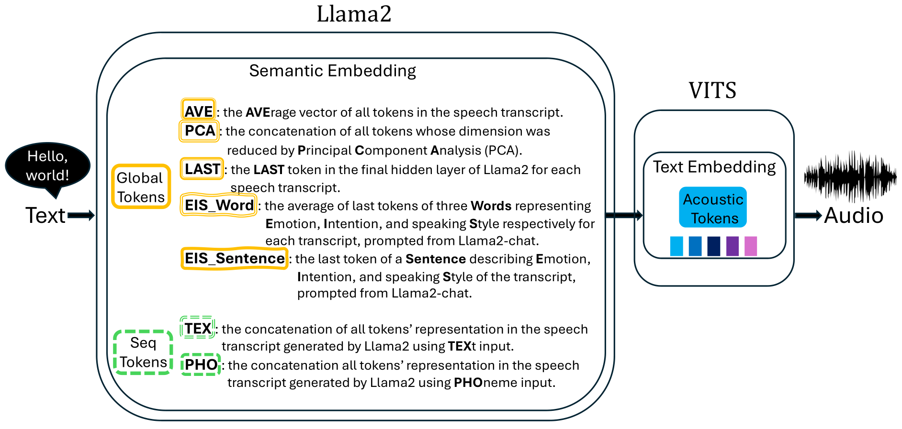

# LLaMA-VITS

基本信息

- 标题: LLaMA-VITS: Enhancing TTS Synthesis with Semantic Awareness
- 作者:
  - 01 [Xincan Feng](../../Authors/Xincan_Feng.md)
  - 02 [Akifumi Yoshimoto](../../Authors/Akifumi_Yoshimoto.md)
- 机构:
  - [奈良先端科学技术大学院大学](../../Institutions/JPN-NAIST_日本奈良先端科学技术大学院大学.md)
  - [CyberAgent](../../Institutions/JPN-CyberAgent.md)
- 时间:
  - 预印时间: 2024.04.10 ArXiv v1
  - 预印时间: 2024.04.12 ArXiv v2
  - 更新笔记: 2024.06.13
- 发表:
  - 期刊/会议
- 链接:
  - [ArXiv](https://arxiv.org/abs/2404.06714)
  - [DOI]()
  - [Github](https://github.com/xincanfeng/vitsgpt.git)
  - [Demo]()
- 标签:
  - [语音合成](../../Tags/SpeechSynthesis.md)
  - [语言模型](../../Tags/LanguageModel.md)
  - [开源](../../Tags/OpenSource.md)
- 页数: 15
- 引用: ?
- 被引: 0

## Abstract

Recent advancements in *Natural Language Processing (NLP)* have seen *Large-scale Language Models (LLMs)* excel at producing high-quality text for various purposes.
Notably, in *Text-To-Speech (TTS)* systems, the integration of **BERT** for semantic token generation has underscored the importance of semantic content in producing coherent speech outputs.
Despite this, the specific utility of *LLMs* in enhancing TTS synthesis remains considerably limited.
This research introduces an innovative approach, ***LLaMA-VITS***, which enhances TTS synthesis by enriching the semantic content of text using LLM.
***LLaMA-VITS*** integrates semantic embeddings from [LLaMA2 (2023)](../TextLM/2023.07.18_LLaMA2.md) with the [VITS](../../Models/E2E/2021.06.11_VITS.md), a leading end-to-end TTS framework.
By leveraging [LLaMA2 (2023)](../TextLM/2023.07.18_LLaMA2.md) for the primary speech synthesis process, our experiments demonstrate that ***LLaMA-VITS*** matches the naturalness of the [original VITS](../../Models/E2E/2021.06.11_VITS.md) (**ORI-VITS**) and those incorporate **BERT** (**BERT-VITS**), on the *LJSpeech* dataset, a substantial collection of neutral, clear speech.
Moreover, our method significantly enhances emotive expressiveness on the *EmoV_DB_bea_sem* dataset, a curated selection of emotionally consistent speech from the *EmoV_DB* dataset, highlighting its potential to generate emotive speech.

## 1.Introduction

*Text-to-Speech (TTS)* synthesis is a technology that transforms written text into its spoken equivalent, thereby enhancing content accessibility.
This technology finds application in the production of audiobooks (Chen et al., 2022) and virtual assistants (Wu et al., 2023).
However, **traditional TTS models**, which primarily focus on the acoustic features, often fall short in comprehending the semantic and emotional information embedded within the text.
With the significant advancements in *Natural Language Processing (NLP)* technologies, particularly through *Language Models (LMs)* such as **BERT** (Devlin et al., 2019) and **GPT** (Radford et al., 2018; Brown et al., 2020), which have demonstrated formidable capabilities in understanding and generating natural language, researchers have proposed various **BERT-based TTS models** (Mukherjee et al., 2022; Abbas et al., 2022; Li et al., 2023; Guo et al., 2022) to improve the expressiveness of synthesized speech.
Nonetheless, the effectiveness and flexibility of **BERT-based TTS models** in diverse applications are limited due to the smaller parameter size of **BERT models** and the necessity for designing specific fine-tuning tasks to enhance their capabilities.
On the other hand, **Large-scale Language Models (LLMs)**, such as [LLaMA2 (2023)](../TextLM/2023.07.18_LLaMA2.md), not only require decreasing computational re sources and achieve higher levels of text generation but also possess excellent zero-shot learning capabilities.
Moreover, they can achieve improvements comparable to fine-tuning by adjusting only a minimal number of parameters through prompt tuning (Liu et al., 2022; Tu et al., 2022).
However, the potential of these LLMs for TTS tasks has not been fully explored.
In light of this context, we introduce ***LLaMA-VITS***, a model that leverages semantic representations extracted from [LLaMA2 (2023)](../TextLM/2023.07.18_LLaMA2.md) on top of a state-of-the-art TTS model, [VITS](../../Models/E2E/2021.06.11_VITS.md), enabling the generated speech to retain acoustic information while understanding and expressing semantics and emotions.
Through comprehensive objective and subjective evaluations, ***LLaMA-VITS*** has been verified to surpass TTS baselines without semantic input or those integrated with BERT.
The main contributions encapsulate:
- We propose **LLaMA-VITS model** that utilizes the semantic understanding and expression capabilities of [LLaMA2 (2023)](../TextLM/2023.07.18_LLaMA2.md), offering equal or superior acoustic performance compared to baseline models, along with a significantly enhanced ability to understand and express semantics and emotions.
- Through empirical analysis, we demonstrate that global tokens in ***LLaMA-VITS*** provide more significant improvements than sequential to kens, contrasting with observations in **BERT-based TTS models**.
- We quantitatively verified our findings using both subjective and objective metrics.
Our code, models, audio demos, and the filtered single female speaker emotional dataset *EmoV_DB_bea_sem* are available at https://github.com/xincanfeng/vitsgpt.git.

## 2.Related Works

TTS technology has significantly advanced in learning acoustic features through structural evolution.
However, comprehending and conveying semantics remain challenging.
Since **BERT-like LMs** have demonstrated profound capabilities in understanding semantics through extensive pre-training on vast text corpora, some studies have integrated **BERT-like LMs** with TTS technology to enhance synthesized speech.
Nonetheless, research on incorporating **GPT-like LMs** within TTS technology is notably scarce.

### 2.1.Text-to-Speech Models

TTS task aims to generate natural, fluent, and easily comprehensible speech.
Traditional TTS systems, e.g., a **Statistical Parametric Speech Synthesis (SPSS)** system (Taylor, 2009), usually comprise multiple distinct components.
These include a frontend module that converts text into linguistic features (such as duration and pitch), an **acoustic model** that maps these linguistic features to acoustic features, and a vocoder responsible for generating speech waveforms from the acoustic features.
Over the past decades, the complexity of traditional models has been notable, attributed to their reliance on manually engineered features and the intricate communication between modules.

Transitioning from **Hidden Markov Models (HMM) based models** (Black et al., 2007), through **Deep Neural Networks (DNN) models** (Zen et al., 2013), to **Generative Adversarial Networks (GAN) based models** (Saito et al., 2017), there has been a no table enhancement in voice quality, yet the architectural complexity remains significant.

The advent of **end-to-end TTS models** marks a significant milestone, increasingly reducing the distinction between synthesized speech and human voice.
**End-to-end models** are capable of trans forming raw text directly into final speech output, which not only streamlines the structural complexity of TTS systems and facilitates easier deployment but also significantly reduces the dependency on manual feature engineering, simplifying the training process.
Moreover, they notably enhance the naturalness and intelligibility of the speech, thereby be coming the predominant architecture in **TTS models**.
For instance, [Char2Wav (2017)]() introduces an attentive encoder-decoder frame work for direct speech synthesis from text input.
[Tacotron (2017)](../../Models/TTS2_Acoustic/2017.03.29_Tacotron.md) undertakes training from the ground up and directly predicts linear spectrograms.
Furthermore, the speech produced by [Tacotron2 (2017)](../TTS2_Acoustic/2017.12.16_Tacotron2.md) closely mirrors the natural human voice.

In the realm of **end-to-end TTS models**, many have adopted a non-autoregressive architecture.
This architecture enables parallel data processing, where the model’s output generation does not depend on the output of the previous time step, thereby enhancing processing speed.
It also circumvents the error accumulation issue inherent in **traditional autoregressive models**, which significantly boosts TTS performance.
[FastSpeech (2019)](../TTS2_Acoustic/2019.05.22_FastSpeech.md) and its variants exemplify this trend.
[FastSpeech (2019)](../TTS2_Acoustic/2019.05.22_FastSpeech.md) employs a transformer-based architecture to generate mel-spectrograms in parallel.
Building on [FastSpeech (2019)](../TTS2_Acoustic/2019.05.22_FastSpeech.md), [FastPitch (2020)](../../Models/TTS2_Acoustic/2020.06.11_FastPitch.md) predicts pitch contours during inference, enabling the production of more expressive and high quality speech.
[FastSpeech2 (2020)](../TTS2_Acoustic/2020.06.08_FastSpeech2.md) further incorporates explicit duration prediction and introduces pitch and energy as conditional inputs.

Previous non-autoregressive approaches typically involve distinct training phases for **acoustic models** and **vocoders**.
[VITS (2021)](../E2E/2021.06.11_VITS.md) introduces a more natural-sounding output compared to these two-stage systems through its one-stage parallel end-to-end architecture.
Innovatively, [VITS (2021)](../E2E/2021.06.11_VITS.md) incorporates variational inference combined with normalizing flows and employs an adversarial training methodology.
Due to [VITS (2021)](../E2E/2021.06.11_VITS.md)’s exemplary performance across multiple benchmarks, we select it as the **foundational TTS model** for our system.

### 2.2. Fine-tuning BERT-like LMs for TTS

While **TTS models** have increasingly advanced in replicating acoustic features, insufficient training data can hinder the model’s ability to learn the semantic nuances of the same input across different contexts, thus limiting its expressiveness.
Consequently, researchers have turned to leveraging the transfer learning capabilities of **BERT-like LMs**.
Ultimately, TTS systems that incorporate pre-trained and fine-tuned **BERT-like LMs** have achieved better understandings of semantics and enhanced generated speech, marking a significant advancement.

Hayashi et al. (2019) utilized a **pre-trained BERT model** as an auxiliary input to enhance a Tacotron2 based TTS system, resulting in improved speech naturalness.
Similarly, Yang et al. (2019) applied a **pre-trained BERT model** to achieve enhanced front end accuracy.
Kenter et al. (2020) demonstrated that integrating a **BERT** model, pre-trained on extensive unlabeled data and fine-tuned for speech, into an **RNN-based TTS system** enhances prosody.
Kenter et al. (2020) specifically suggest updating the **BERT**’s parameters during the training of their **RNN-based speech synthesis model**, emphasizing the critical role of fine-tuning the **BERT** component for optimal outcomes.
As prompt tuning draws wide attention in guiding text or image generation, [PromptTTS (2022)](../Prompt/2022.11.22_PromptTTS.md) takes a prompt representation with both style and content descriptions from a **BERT** model as input to generate speech with precise style control and high speech quality.

In particular, Mukherjee et al. (2022) utilized a **pre-trained BERT model** to develop a text emotion classification model, employing the final hidden states of the initial `[CLS]` token as a comprehensive representation of the text.
Researchers such as Kenter et al. (2020); Li et al. (2021); Abbas et al. (2022) have applied word-level **BERT** to capture the semantic and syntactic structure of sentences, thereby aiding TTS synthesis.
Li et al. (2023) introduced a phoneme-level **BERT**, designed with a preliminary task of predicting corresponding graphemes in addition to regular masked phoneme predictions, to enhance the naturalness of speech synthesized from *out-of-distribution (OOD)* texts.

However, despite **BERT**’s acknowledged capacity to provide detailed word importance, syn tactic and semantic insights, and general knowledge (Hayashi et al., 2019; Kenter et al., 2020), its effectiveness is constrained by the particularities of fine-tuning approaches.
Furthermore, **BERT**’s inherent non-generative nature might limit its ability to account for information outside the immediate sentence context.

### 2.3.Integrating GPT-like LMs for TTS

Considering semantic understanding and expression capabilities, **BERT** is primarily utilized for com prehension tasks.
In comparison, **GPT** excels not only in understanding text but also in generating natural and coherent text.
Moreover, with the larger model parameters, **GPT** is particularly adept at zero-shot or few-shot learning, enabling its direct application to various tasks with little to no need for fine-tuning or structural modifications.

However, research on leveraging **GPT-like models** to aid TTS systems is very limited.
Stephenson et al. (2021) explores the potential of improving speech synthesis naturalness by text input lookahead with **GPT** prediction.
Such an approach potentially restricts TTS applications, as altering the input is often undesirable.
Furthermore, the findings were not verified by human subjective evaluation.
Saito et al. (2023) suggest employing **ChatGPT** to aid in empathetic dialogue speech synthesis by extracting the context of conversations.
They particularly instruct **ChatGPT** to produce three key words that encapsulate the intention, emotion, and speaking Style of speech observed in the dialogue history.
These keywords are subsequently utilized to train a **speech synthesis model**.
However, due to the inaccessibility of **ChatGPT** to the public, the re searchers resort to processing **ChatGPT**’s outputs with **BERT** to extract embeddings.
This approach essentially positions **ChatGPT** as an alternative to manual annotation, yet it does not delve into investigating **ChatGPT**’s internal representations and their potential impact on speech-related tasks.

In our study, we selected [LLaMA2 (2023)](../TextLM/2023.07.18_LLaMA2.md), a **GPT-like LM**, for integration into our TTS system, motivated by its technological advancements and potential for di verse applications.
[LLaMA2 (2023)](../TextLM/2023.07.18_LLaMA2.md) stands out as one of the largest publicly accessible **LMs**, rivaling proprietary models such as **GPT3.5** (OpenAI et al., 2024) and **PaLM** (540B) (Chowdhery et al., 2022), and sur passes other open-source alternatives like **MPT** and **Falcon** (Almazrouei et al., 2023) in benchmark evaluations.
Additionally, the novel architecture of [LLaMA2 (2023)](../TextLM/2023.07.18_LLaMA2.md) not only ensures enhanced security but also facilitates the extension of various down stream tasks (Touvron et al., 2023).

Related research that employs [LLaMA2 (2023)](../TextLM/2023.07.18_LLaMA2.md) in speech and other multimodal tasks (Radhakrishnan et al., 2023; Zhang et al., 2023), coupled with the ongoing efforts to reduce computing costs associated with LLaMA2, underscores the model’s significant research interest and its promising prospects in multimodal applications.

## 3.Methodology

We propose leveraging semantic embeddings de rived from a **GPT-like LM** to improve TTS synthesis.
In our work, [LLaMA2 (2023)](../TextLM/2023.07.18_LLaMA2.md) is employed as the **GPT-like model**, as elaborated in Sec.2.3, and [VITS](../E2E/2021.06.11_VITS.md) is utilized as the **TTS model** for generating audio from phoneme embeddings, as detailed in Sec.2.1.
In essence, we extract semantic embeddings $E_{s}$ from the final hidden layer of [LLaMA2 (2023)](../TextLM/2023.07.18_LLaMA2.md) and integrate them with the original acoustic text embeddings $E_{a}$ of [VITS](../E2E/2021.06.11_VITS.md), forming enhanced text embeddings $E_{as}$ for speech synthesis.
Specifically, either a global token or a sequence of tokens is used to encapsulate the semantic attributes of an input sentence for varying objectives.
The distinctions between these two token types are further explicated in Sec.3.1.

### 3.1.Semantic Embeddings Derived from LLaMA2

For each input sentence $s$, we extract information from the final hidden layer before the output of [LLaMA2 (2023)](../TextLM/2023.07.18_LLaMA2.md).
Different strategies are employed to cre ate various tokens that serve as the semantic em bedding for the sentence.

Let $E_{s}$ denote the semantic embedding of sentence $s$, and $H_{LLaMA}^F(s)$ represent the output of the [LLaMA2 (2023) model](../TextLM/2023.07.18_LLaMA2.md) for sentence $s$ at the final hidden layer $F$.
Therefore, $E_{s}$ can be expressed as:

$$
    E_{s}=  H_{LLaMA}^F(s)\tag{1}
$$

Here, $H_{LLaMA}^F(s)$ is a vector that encapsulates the semantic representation of sentence $s$ after pro cessing through all layers of the [LLaMA2 (2023)](../TextLM/2023.07.18_LLaMA2.md), culminating in the final layer.

#### Formulation for Global Tokens

We explored five types of global tokens to represent the over arching semantic features of an input sentence, namely `[AVE]`, `[PCA]`, `[LAST]`, `[EIS_Word]`, and `[EIS_Sentence]`, with each strategy employing a single token.

In the `[AVE]` strategy, the semantic token is de rived by calculating the average of all tokens’ out put vectors for sentence $s$, formulated as:

$$
    E_{s}^{AVE}= \dfrac{1}{n}\sum_{i=1}^n H_{LLaMA}^F(s,i)\tag{2}
$$

Here, $E_{s}^{AVE}$ denotes the semantic token obtained using the `[AVE]` strategy, and $H_{LLaMA}^F(s,i)$ represents the output of the $i$ th token of sentence $s$ at the final hidden layer $F$ of LLaMA2, with $s$ comprising $n$ tokens.

For the `[PCA]` strategy, we apply Principal Component Analysis to the output vectors of sentence sto extract principal components and rescale the mean of the PCA results according to the original data’s value range.
This rescaling ensures that the PCA-processed data maintains a scale consistent with the original data, preserving the relative importance of semantic information numerically.
Formulated as:

$$
    E_{s}^{PCA}= \text{PCArescale}(H_{LLaMA}^F(s)) \tag{3}
$$

In the `[LAST]` strategy, the semantic token is obtained by selecting the last token from the output vector of sentence s, as shown in the formula:

$$
    E_{s}^{LAST}= H_{LLaMA}^F(s, n)\tag{4}
$$

where $H_{LLaMA}^F(s, n)$ refers to the representation of the last token of sentence $s$ after processing through all layers of [LLaMA2 (2023)](../TextLM/2023.07.18_LLaMA2.md) at the final layer.

In the `[EIS_Word]` and `[EIS_Sentence]` strategies, unlike the above approaches that utilize the sentence itself for representation, we derive the semantic representation of sentence $s$ based on [LLaMA2 (2023)](../TextLM/2023.07.18_LLaMA2.md)’s comprehension $u$.
Adapted from Saito et al. (2023)’s practice, we employ prompts as illustrated in 2a and 2b, respectively, to obtain [LLaMA2 (2023)](../TextLM/2023.07.18_LLaMA2.md)’s understanding of sentence $s$ in terms of Emotion, Intention, and speaking Style, denoted as $u$, and calculate the average of this understanding’s representation to serve as the semantic embedding.

In the `[EIS_Word]` strategy, [LLaMA2 (2023)](../TextLM/2023.07.18_LLaMA2.md) is prompted to describe Emotion, Intention, and speaking Style with three separate words, resulting in the following formula for the final semantic token:

$$
    E_{s}^{\text{EISWord}} = \dfrac{1}{m} [\sum_{i} H_{LLaMA}^{F}(u_E, i) + \sum_j H_{LLaMA}^{F}(u_I, j) +\sum_k H_{LLaMA}^{F}(u_S, k)] \tag{5}
$$

where $u_E$, $u_I$, $u_S$ are the representations of [LLaMA2 (2023)](../TextLM/2023.07.18_LLaMA2.md)’s output expressing the sentence’s Emotion, Intention, and speaking Style at the final hid den layer, respectively, with $i$, $j$, $k$ indicating the tokens of each output word, and m being the total number of these tokens.

In the `[EIS_Sentence]` strategy, [LLaMA2 (2023)](../TextLM/2023.07.18_LLaMA2.md) is guided to describe its understanding of the input sentence’s Emotion, Intention, and speaking Style with an easy-to-understand sentence, leading to the fol lowing formula for the final semantic token:

$$
    E_s^{\text{EISSentence}} = \dfrac{1}{m}\sum_{i=1}^m H_{LLaMA}^{F}(u_{EIS}, i)\tag{6}
$$

where $u_{EIS}$ is the representation of [LLaMA2 (2023)](../TextLM/2023.07.18_LLaMA2.md)’s output expressing the understanding of the original sentence at the final hidden layer, and $m$ is the total number of tokens in this sentence representation.

#### Formulation for Sequential Tokens

In the implementation of sequential tokens strategies, we focus on utilizing the complete set of tokens from the input sentence to represent its semantic in formation.
Unlike the global token approaches, sequential tokens strategies encompass representations based on either text or phonemes, aiming to better align with the TTS model’s potential em phasis on acoustic features.
The mathematical representations for these two strategies are as follows:
Under the `[TEX]` strategy, we directly employ all tokens from the textual form of sentence $s$ to represent its semantic information.
If the output of sentence $s$ at the final hidden layer $F$ of [LLaMA2 (2023)](../TextLM/2023.07.18_LLaMA2.md) consists of $n$ tokens, then the semantic token $T_{s}^{TEX}$ is represented as a sequence:

$$
    E_s^{TEX}= \{H_{LLaMA}^F(s,1), H_{LLaMA}^F(s, 2),\cdots, H_{LLaMA}^F(s, n)\} \tag{7}
$$

In the `[PHO]` strategy, we consider the complete set of tokens from the phonemic form.
Here, $s_{pho}$ denotes the phonemic representation of sentence $s$.
If the output of $s_{pho}$ at the final hidden layerF of [LLaMA2 (2023)](../TextLM/2023.07.18_LLaMA2.md) comprises $m$ tokens, then the semantic token $T_{s}^{PHO}$ is represented as a sequence:

$$
    E_{s}^{PHO}=\{H_{LLaMA}^F(s_{pho}, 1),H_{LLaMA}^F(s_{pho}, 2),\cdots,H_{LLaMA}^F(s_{pho}, m)\}\tag{8}
$$

In both strategies, $H_{LLaMA}^F(s, i)$ and $H_{LLaMA}^F(s_{pho}, i)$ respectively represent the outputs of the $i$ th token of sentence $s$ in its textual and phonemic forms at the final hidden layer $F$ of [LLaMA2 (2023)](../TextLM/2023.07.18_LLaMA2.md).
This representation allows the TTS model to leverage the complete semantic information of a sentence, whether based on text or phonemes.

### 3.2.Fusing Semantic Embeddings with Acoustic Embeddings

To align the dimensions of semantic embedding extracted from [LLaMA2 (2023)](../TextLM/2023.07.18_LLaMA2.md), denoted as $E_{s}$, with the acoustic embeddings from [VITS](../E2E/2021.06.11_VITS.md), denoted as $E_{a}$, we employ a linear projection.
The original dimension of $E_{s}$, $d_{LLaMA}$, is projected to match the dimension of [VITS (2021)](../E2E/2021.06.11_VITS.md) acoustic embedding, $d_{VITS}$, using a linear transformation matrix $W$ of dimensions $d_{VITS}\times d_{LLaMA}$.
The projected semantic embedding, $E_s'$, is calculated as follows:

$$
    E_s'= W \cdot E_{s} \tag{9}
$$

#### Fusing Global Embedding with Acoustic Embedding

To obtain an embedding $E_{as}$ that integrates both semantic and acoustic information, for global tokens, we simply add the dimensionally unified global embedding to [VITS (2021)](../E2E/2021.06.11_VITS.md)’s acoustic em bedding, as shown in the equation:

$$
    E_{as} = E_{a} + E_s′\tag{10}
$$

#### Fusing Sequential Embeddings to Enhance Text Embeddings

We utilize the Scaled Dot Product Attention mechanism to merge sequential embeddings with [VITS (2021)](../E2E/2021.06.11_VITS.md)’s original acoustic embedding to gain enhanced embedding $E_{as}$ , which can be described by the following mathematical formulas:
First, calculate the attention scores $A$:

$$
    A = \dfrac{q\cdot k^{\mathsf{T}}}{\gamma} \tag{11}
$$

where $q$ is the acoustic embedding $E_{a}$ in [VITS (2021)](../E2E/2021.06.11_VITS.md) with dimensions $[b, t, d]$;
$k$ and $v$ denotes the semantic embedding $E_s'$ from [LLaMA2 (2023)](../TextLM/2023.07.18_LLaMA2.md), also with dimensions $[b, t, d]$;
$b$ is the batch size,tis the sequence length, and $d$ is the embedding dimension;
$\gamma$ is temperature for scaling.
$k^{\mathsf{T}}$ denotes the transpose of $k$, transforming $k$ from $[b, t, d]$ to $[b, d, t]$ for matrix multiplication.
The resulting $A$ has dimensions $[b, t, t]$.

If a source mask or target mask is present, a masking operation is applied, setting the attention scores at masked positions to a very low value (e.g.,−6e4) to nearly eliminate their weight contribution in the subsequent softmax step.

Next, apply the softmax function and dropout to the attention scores, obtaining the final attention weights $W_{attn}$:

$$
    W_{attn}= \text{Dropout}(\text{Softmax}(A))\tag{12}
$$

Finally, the output $E_{as}$ is calculated by weighting $v$ with the attention weights:

$$
    E_{as} = W_{attn}\cdot v
$$

The output $E_{as}$ , viewed as text embedding fused with semantic information, has dimensions $[b, t, d]$ that match those of $q$.

## 4.Experiments

### 4.1.Experimental Settings

We propose ***LLaMA-VITS*** which uses semantic to kens derived from [LLaMA2 (2023)](../TextLM/2023.07.18_LLaMA2.md) to enhance acoustic embedding in [VITS](../E2E/2021.06.11_VITS.md) for better TTS performance.
To show the effectiveness of our method, we experimented with two baseline models.
In the **ORI-VITS** baseline, we use the original [VITS (2021)](../E2E/2021.06.11_VITS.md) without external semantic information.
In the **BERT-VITS** baseline, we extract various semantic tokens according to for mer research introduced in Section § 2.2.
Specifically, we use the `[CLS]` token of **BERT** as the global token.
To form the baseline of the sequential token in **BERT**, we use all the tokens in the sentence trained by text or phoneme, named `[BERT_TEX]` and `[BERT_PHO]`, respectively.
In our proposed ***LLaMA-VITS***, we derive global token `[AVE]`, `[LAST]`, `[PCA]`, `[EIS_Word]`, and `[EIS_Sentence]`, and sequential tokens `[TEX]` and `[PHO]` from [LLaMA2 (2023)](../TextLM/2023.07.18_LLaMA2.md), cor responding to those in **BERT-VITS**.
We use [LLaMA2 (2023)](../TextLM/2023.07.18_LLaMA2.md) (13b) to generate semantic embeddings of dimension 5120.
`[CLS]` and `[BERT_TEX]` tokens are extracted from **BERT-base-uncased model** which has a parameter size of 110M that generates token embedding of 768 dimensions.
`[BERT_PHO]` token is extracted from **BERT-x-phone-base model** whose parameter size is 88M to generate token embedding of 768 dimensions.

#### Global Token Extraction

In our proposed ***LLaMA-VITS***, global strategy `[LAST]` only uses the last to ken in the final hidden layer of [LLaMA2 (2023)](../TextLM/2023.07.18_LLaMA2.md) for each sentence.
`[AVE]` uses the average of all tokens for each sentence.
`[PCA]` uses the concatenation of all tokens whose dimension was reduced by Principal Component Analysis (PCA).
`[EIS_Word]` and `[EIS_Sentence]` use the average of tokens for an answer, which is formed in three words or a sentence by prompts shown in Fig.02, to describe the Emotion, Intention, and speaking Style of the transcript.
In **BERT-VITS** baseline, global strategy `[CLS]` only uses the first token from the **BERT-base-uncased model** for each input sentence.

#### Sequential Token Extraction

In our proposed ***LLaMA-VITS***, sequential strategy `[TEX]` concatenates the sequence of tokens in a sentence generated by [LLaMA2 (2023)](../TextLM/2023.07.18_LLaMA2.md) using text input.
`[PHO]` concatenates the sequence of tokens of a sentence generated by [LLaMA2 (2023)](../TextLM/2023.07.18_LLaMA2.md) using phonemic input.
In the baseline **BERT-VITS**, sequential strategy `[BERT_TEX]` concatenates all the tokens in a sentence extracted from **BERT-base-uncased model**.
`[BERT_PHO]` concatenates all the tokens in a sentence extracted from **BERT-x-phone-base model**.

#### Datasets

We utilized full LJSpeech, 1-hour LJSpeech, and EmoV_DB_bea_sem dataset for experimental verification.
LJSpeech4comprises 24 hours recorded of English speech by sin gle female speaker, where we evaluate how the embeddings extracted from [LLaMA2 (2023)](../TextLM/2023.07.18_LLaMA2.md) can help improve the speech naturalness.Besides full LJSpeech dataset, we also randomly filtered 1 hour LJSpeech which contains only 1-hour records as an ablation study to show how dataset size influences.
EmoV_DB5(Adigwe et al., 2018) is a database of emotional speech that contains data for male and female actors in English and French.
EmoV_DB covers 5 emotion classes, amused, an gry, disgusted, neutral, and sleepy.
To factor out the effect of different speakers, we filtered the original EmoV_DB dataset into the speech of a specific female English speaker, bea.
Then we use [LLaMA2 (2023)](../TextLM/2023.07.18_LLaMA2.md) to predict the emotion label of the transcript cho sen from the above 5 emotion classes, and select the audio samples which has the same predicted emotion.
The filtered dataset contains 22.8-min records for training.
We named the filtered dataset EmoV_DB_bea_sem and investigated how the semantic embeddings from [LLaMA2 (2023)](../TextLM/2023.07.18_LLaMA2.md) behave in naturalness and expressiveness on it.
Please refer to Appendix A 12 for more dataset statistics.

#### Implementation, Hyper-parameters, Training

Our ***LLaMA-VITS*** system was built on the [VITS (2021)](../E2E/2021.06.11_VITS.md) framework using its original implementation, augmented with semantic embeddings de rived from [LLaMA2 (2023)](../TextLM/2023.07.18_LLaMA2.md) (Touvron et al., 2023) using its original implementation7.
For training LJSpeech, we use the public configs in the original implementation of [VITS (2021)](../E2E/2021.06.11_VITS.md).
For EmoV_DB_bea_sem, we use the same config as LJSpeech but changed batch size from 64 to 16 since this dataset is much smaller.
Besides implementing our proposed ***LLaMA-VITS***, we extracted corresponding semantic tokens `[CLS]`, `[BERT_TEX]` from **BERT-uncased-base model** and `[BERT_PHO]` from **BERT** pre-trained on phoneme for comparison.
In comparing the experimental results, we choose 100k-step results on both full LJSpeech and 1-hour LJSpeech datasets since they are rather large.
On EmoV_DB_bea_sem, we used the pre-trained checkpoint of LJSpeech on 100k step and compare the fine-tuning results on EmoV_DB_bea_sem at 150k-step since it is rather small.

#### Evaluation Metrics

Both subjective and objective metrics are implemented for a comprehensive evaluation.
In subjective evaluation, we con duct Emotion Similarity Mean Opinion Score (ES MOS) (Zhu et al., 2023) experiments to evaluate emotion similarity for EmoV_DB_bea_sem.In the subjective evaluation, we compared `[AVE]`, `[TEX]` and `[PHO]` strategies in our ***LLaMA-VITS*** with the corresponding token `[CLS]`, `[BERT_TEX]` and `[BERT_PHO]` extracted from different **BERT** models and the baseline **ORI-VITS** who does not con tain semantic tokens, with the ground truth samples GT.

In evaluating ESMOS, we randomly chose 5 samples from the total 51 test samples proportionally divided by us and received 100 test results from different speakers on Amazon Mechanical Turk.
The result significance level is thus 500.
Each participant is asked to give a score on emotion similarity compared with ground truth in a 5-scale: Excellent Match 5, Good Match 4, Fair Match 3, Poor Match 2, Bad Match 1.

In objective evaluation,we utilize UTokyo-SaruLab Mean Opinion Score (UTMOS) (Saeki et al., 2022), Mel-Cepstral Distortion (MCD), and speech recognition performance measured by Character Error Rate (CER) and Word Error Rate (WER).
UTMOS is a MOS prediction network using speech samples from previous Blizzard Challenges and Voice Conversion Challenges, which has reached the best performance in VoiceMOS Challenge 2022.
We evaluate objective intelligibility by using Whisper-large (Radford et al., 2022).
For calculating UTMOS, we use the implementation in SpeechMOS.
For calculating MCD and ASR, we use the evaluation implementation of ESPnet (Hayashi et al., 2020, 2021).

## 5.Experiment Results

We evaluated our proposed ***LLaMA-VITS*** along with baselines **ORI-VITS** and **BERT-VITS** models on three distinct datasets: the full LJSpeech, the 1 hour LJSpeech, and EmoV_DB_bea_sem.
The experimental outcomes provide a comprehensive understanding of the model performance and the impact of semantic tokens selection.
A summary of these results is articulated below and can be referenced in Table 1.

### 5.1.Results on full LJSpeech

The **ORI-VITS** baseline, achieving a UTMOS of 4.19 ± 0.05, an MCD of7.32 ± 0.61, a CER of6.2, and a WER of 16.5.
Enhancements were observed with the **BERT-VITS** baseline.Specifically, **BERT-VITS** with `[BERT_TEX]` semantic tokens demonstrated superior performance in UTMOS (4.22±0.05) and MCD (7.27 ± 0.61), indicating improved speech quality and reduced mel-cepstral distortion.
Additionally, a reduced CER of5.9and WER of15.9were noted, highlighting enhanced automatic speech recognition accuracy.
Our proposed ***LLaMA-VITS***, integrating various global and sequential semantic tokens, displayed competitive performance.The `[PCA]` strategy stood out, achieving an MCD of7.23 ± 0.61, indicating optimal mel-cepstral distortion.The `[EIS_Sentence]`, `[AVE]`, and `[LAST]` tokens yielded a top-tier UTMOS of4.21±0.04/0.05, underscoring their effectiveness in enhancing perceived speech quality.

### 5.2.Results on 1-hour LJSpeech

In the more challenging 1-hour LJSpeech dataset, all models experienced a slight performance de crease, an expected outcome given the reduced training data size.
**BERT-VITS** baseline with `[CLS]` tokens exhibited notable MCD performance (7.39 ± 0.62), while the `[BERT_PHO]` excelled in UTMOS (4.05 ± 0.07), reflecting enhanced speech naturalness and reduced mel-cepstral distortion.
***LLaMA-VITS*** with `[AVE]` tokens achieved the high est UTMOS (4.10 ± 0.07), while `[EIS_Sentence]` tokens resulted in the most favorable MCD (7.36 ± 0.59), illustrating the model’s versatility and efficacy in different token configurations.

### 5.3.Results on EmoV_DB_bea_sem

On this even more challenging dataset, a small improvement observed in **BERT-VITS** only exists in the `[BERT_TEX]` with a CER of 4.4.
While our proposed ***LLaMA-VITS*** displayed no table enhancements.
The `[TEX]` strategy achieves an ESMOS of3.22 ± 0.07, indicating much more emotiveness.
The `[LAST]` yielded the best performance on CER of4.3and WER of17.4, other strategies also perform better than or comparable to **BERT-VITS**, underscoring its effectiveness in enhancing perceived speech expressiveness.

### 5.4.Analysis

Speaking of the strengths of different tokens, **BERT** based tokens generally contribute to improving MCD and ASR scores, indicating the enriched semantic understanding translated to speech qual ity.
Tokens of ***LLaMA-VITS*** exhibited a balanced performance across all metrics, with specific to ken configurations excelling in particular aspects.
For instance, `[PCA]` token emerged as a strong contender in reducing MCD, `[AVE]` enhanced the UTMOS scores, `[TEX]` had superior performance to improve ESMOS score.
In individual comparisons, ***LLaMA-VITS***’s five global tokens generally outperformed **BERT-VITS** on the UTMOS metric for naturalness.
In the ESMOS metric for emotional expression, ***LLaMA-VITS***’s two sequential tokens also generally sur passed **BERT-VITS**, particularly the `[TEX]` token.
Therefore, we can infer that **GPT-like LMs** may have greater potential for TTS tasks than **BERT** like models.
Further, our results reflect different patterns of gains from **GPT-like** and **BERT-like models** in TTS tasks.
For instance, in the UTMOS naturalness metric, ***LLaMA-VITS***’s global tokens often outperformed sequential tokens, which is the opposite for **BERT-VITS**; in the ESMOS emotion metric, ***LLaMA-VITS***’s sequential token `[TEX]` significantly outperformed other tokens, while for **BERT-VITS**, global tokens performed better.
Overall, ***LLaMA-VITS*** showed a different pattern in UTMOS compared to **BERT-VITS**, and superior performance in ESMOS.
These results highlight the potential for further exploration of semantic to ken types and fusion methods to achieve more significant enhancements in speech synthesis, particularly in scenarios constrained by limited and complex training data.

## 6.Discussion

In this section, we discuss factors influencing current outcomes.Based on this discussion, we also point out the directions for future work in Appendix 13.

### 6.1.GPT-like vs BERT-like

Initial observations from our experiments indicate that, even without any fine-tuning of [LLaMA2 (2023)](../TextLM/2023.07.18_LLaMA2.md), ***LLaMA-VITS*** significantly outperforms both **BERT-VITS** and **ORI-VITS** in terms of emotional expressive ness.
This finding opens up avenues for future research into emotive TTS tasks.
Furthermore, a comparison between **BERT-VITS** and ***LLaMA-VITS*** highlights their distinct performance traits.
**BERT-VITS**, leveraging deep con textual embeddings, provides profound semantic insights yet encounters challenges in customization and adaptability across a range of TTS tasks.
Conversely, ***LLaMA-VITS*** can provide a more versa tile and adaptable approach, with its array of token types demonstrating particular advantages across various evaluation metrics.

### 6.2.Semantic Token Strategy

The varying effectiveness of distinct semantic to kens underscores the importance of careful selection and integration tailored to the particular goals of TTS systems.
Optimizing the type of token and method of fusion can be instrumental in enhancing aspects such as speech naturalness, emotional expressiveness, *Mel Cepstral Distortion (MCD)*, or *Automatic Speech Recognition (ASR)* performance.

## 7.Conclusion

In summary, this study exemplifies a significant stride towards optimized TTS synthesis by integrating semantic tokens, leveraging the strengths of ***LLaMA-VITS***.
Our findings, validated by comprehensive experiments on the LJSpeech and EmoV_DB_bea_sem datasets, underscore the pivotal role of semantic embeddings in enhancing speech quality, naturalness, and emotiveness.
The adaptability and efficacy of ***LLaMA-VITS***, especially, open new vistas for customized and context sensitive TTS applications.

## 8.Limitations

Compared with our baseline which uses different **BERT models**, we only tested our method using [LLaMA2 (2023)](../TextLM/2023.07.18_LLaMA2.md).
As Kenter et al. (2020) indicate for their **BERT-based TTS model**, small **BERT models** work better than big ones, but the parameter size of our proposed **GPT-based TTS** influence is yet stud ied by our research.
Although **BERT-based TTS models** are normally finetuned on speech tasks to provide more explicit acoustic information for TTS, we didn’t try designing prompts to generate acoustic features and only studied how general semantic information can help.
Our experiments were conducted only on clean datasets with limited size, and the effect on more complex datasets is to be further explored.
The integration of [LLaMA2 (2023)](../TextLM/2023.07.18_LLaMA2.md)’s embeddings introduces additional computational costs, potentially limiting real-time applications.

相比于基线模型使用了不同的 BERT 模型, 我们的方法仅使用了 LLaMA2.
