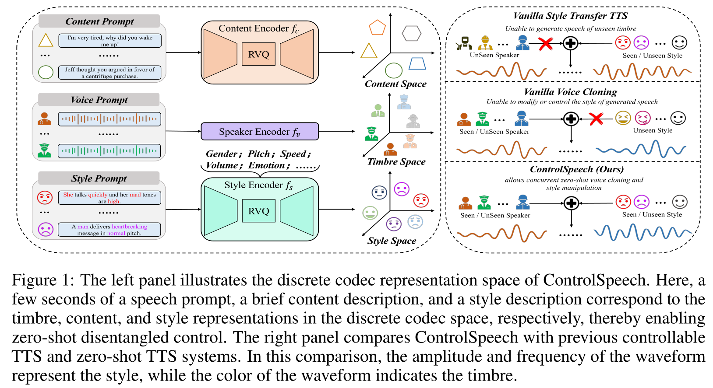
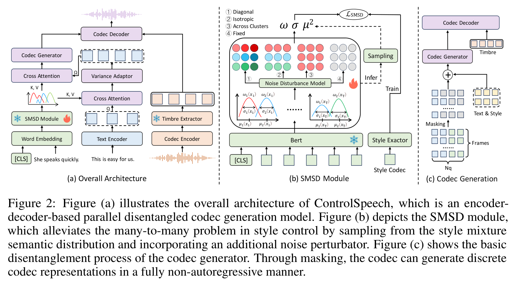

# ControlSpeech

基本信息

- 标题: ControlSpeech: Towards Simultaneous Zero-shot Speaker Cloning and Zero-shot Language Style Control With Decoupled Codec
- 作者:
  - [Shengpeng Ji](../../Authors/Shengpeng_Ji.md)
  - [Jialong Zuo](../../Authors/Jialong_Zuo.md) 
  - [Minghui Fang](../../Authors/Minghui_Fang.md) 
  - [Siqi Zheng](../../Authors/Siqi_Zheng.md)
  - [Qian Chen](../../Authors/Qian_Chen.md)
  - [Wen Wang](../../Authors/Wen_Wang.md)
  - [Ziyue Jiang](../../Authors/Ziyue_Jiang.md)
  - [Hai Huang](../../Authors/Hai_Huang.md)
  - [Xize Cheng](../../Authors/Xize_Cheng_(成曦泽).md)
  - [Rongjie Huang](../../Authors/Rongjie_Huang_(黄融杰).md) 
  - [Zhou Zhao](../../Authors/Zhou_Zhao_(赵洲).md)
- 机构:
  - [浙江大学](../../Institutions/ZJU_浙江大学.md)
- 时间:
  - 预印时间: 2024.06.03 ArXiv v1
  - 更新笔记: 2024.06.13
- 发表:
  - 期刊/会议
- 链接:
  - [ArXiv](https://arxiv.org/abs/2406.01205)
  - [DOI]()
  - [Github](https://github.com/jishengpeng/ControlSpeech)
  - [Demo]()
- 标签:
  - [零样本](../../Tags/Zero-Shot.md)
- 页数: 16
- 引用: 54
- 被引: 0

## Abstract

原文

> In this paper, we present ***ControlSpeech***, a text-to-speech (TTS) system capable of fully cloning the speaker’s voice and enabling arbitrary control and adjustment of speaking style, merely based on a few seconds of audio prompt and a simple textual style description prompt.
> Prior zero-shot TTS models and controllable TTS models either could only mimic the speaker’s voice without further control and adjustment capabilities or were unrelated to speaker-specific voice generation.
> Therefore, ***ControlSpeech*** focuses on a more challenging new task—a TTS system with controllable timbre, content, and style at the same time.
> ***ControlSpeech*** takes speech prompts, content prompts, and style prompts as inputs and utilizes bidirectional attention and mask-based parallel decoding to capture corresponding codec representations in a discrete decoupling codec space.
> Moreover, we discovered the issue of text style controllability in a many-to-many mapping fashion and proposed the ***Style Mixture Semantic Density (SMSD)*** model to resolve this problem.
> ***SMSD*** module which is based on Gaussian mixture density networks, is designed to enhance the fine-grained partitioning and sampling capabilities of style semantic information and generate speech with more diverse styles.
> In terms of experiments, we make available a controllable model toolkit called ***ControlToolkit*** with a new style controllable dataset, some replicated baseline models and propose new metrics to evaluate both the control capability and the quality of generated audio in ***ControlSpeech***.
> The relevant ablation studies validate the necessity of each component in ***ControlSpeech*** is necessary.
> We hope that ***ControlSpeech*** can establish the next foundation paradigm of controllable speech synthesis.
> The relevant code and demo are available at https://github.com/jishengpeng/ControlSpeech.

 

本项工作展示了 ***ControlSpeech***, 一个能够仅基于数秒的音频提示和简单的文本风格描述提示从而完整克隆说话人声音且能任意控制和调节说话风格的文本转语音系统.
之前的零样本文本转语音模型和可控制文本转语音模型要么只能模仿说话人声音而没有进一步控制和调节的能力, 要么和具体说话人的声音生成无关.
因此, ***ControlSpeech*** 聚焦于更具挑战性的新任务: 音色, 内容, 风格能同时可控的文本转语音系统.
***ControlSpeech*** 接受音频提示, 内容提示, 风格提示作为输入, 并采用双向注意力和基于掩码的并行解码器来捕捉离散解耦编解码空间内的相应编解码表示.
此外, 我们发现在多到多映射范式下文本风格可控性问题, 并提出 ***风格混合语音密度模型 (Style Mixture Semantic Density, SMSD)*** 模块来解决此问题.
***SMSD*** 模块基于高斯混合密度网络, 被设计用于增强风格语义信息的细粒度划分和采样能力, 并用更多样性的风格生成语音.
在实验方面, 我们提供了一个名为 ***ControlToolkit*** 的可控模型工具箱, 以及一个新的风格可控数据集, 一些复现的基线模型, 并提出新的指标来评估 ***ControlSpeech*** 的控制能力和生成音频质量.
相关的消融实验验证了 ***ControlSpeech*** 中各个组件的必要性.
我们希望 ***ControlSpeech*** 能够成为可控语音合成的下一代基础范式.
相关代码和示例可在 https://github.com/jishengpeng/ControlSpeech 获得.

## 1.Introduction

原文

> Over the past decade, the field of speech synthesis has seen remarkable advancements ([FastSpeech2](../TTS2_Acoustic/2020.06.08_FastSpeech2.md), [VITS](../E2E/2021.06.11_VITS.md), [FastDiff](../Diffusion/2022.04.21_FastDiff.md), [FastSpeech](../TTS2_Acoustic/2019.05.22_FastSpeech.md)), achieving synthesized speech that rivals real human speech in terms of expressiveness and naturalness ([NaturalSpeech](../E2E/2022.05.09_NaturalSpeech.md)).
> Recently, with the development of large language models (GPT-3, GPT-4, [LLaMA](../../Models/LLM/2023.02.27_LLaMA.md)) and generative models (DDPM, [HiFi-GAN](../TTS3_Vocoder/2020.10.12_HiFi-GAN.md), [Glow-TTS](../TTS2_Acoustic/2020.05.22_Glow-TTS.md), [BVAE-TTS](../TTS2_Acoustic/2021.01.13_BVAE-TTS.md)) in other domains, the tasks of zero-shot ([VALL-E](2023.01.05_VALL-E.md), [NaturalSpeech 2](../Diffusion/2023.04.18_NaturalSpeech2.md) [VoiceBox](2023.06.23_VoiceBox.md), [Mega-TTS](2023.06.06_Mega-TTS.md), [SoundStorm](2023.05.16_SoundStorm.md) and style-controllable speech synthesis ([PromptTTS](../_tmp/2022.11.22_PromptTTS.md), [PromptStyle](../E2E/2023.05.31_PromptStyle.md), [InstructTTS](../_tmp/2023.01.31_InstructTTS.md), [SALL-E](../../Datasets/2023.08.28_TextrolSpeech.md)) have garnered significant attention in the speech domain due to their powerful zero-shot generation and controllability capabilities.
> Zero-shot TTS ([VALL-E](2023.01.05_VALL-E.md), [NaturalSpeech 2](../../Models/Diffusion/2023.04.18_NaturalSpeech2.md); [SPEAR-TTS](2023.02.07_SPEAR-TTS.md)) refers to the ability to perfectly clone an unseen speaker’s voice using only a few seconds of a speech prompt by significantly scaling up both the corpus and model sizes.
> Style-controllable TTS ([PromptTTS](../_tmp/2022.11.22_PromptTTS.md), [InstructTTS](../_tmp/2023.01.31_InstructTTS.md)), on the other hand, allows for the control of a speaker’s style (prosody, accent, emotion, etc.) through textual descriptions.

 

在过去的十年中, 语音合成领域取得了显著的进步, 例如 [FastSpeech2](../TTS2_Acoustic/2020.06.08_FastSpeech2.md), [VITS](../E2E/2021.06.11_VITS.md), [FastDiff](../Diffusion/2022.04.21_FastDiff.md), [FastSpeech](../TTS2_Acoustic/2019.05.22_FastSpeech.md), 实现了在表达性和自然度上能与真人语音相媲美的合成语音.
近期, 随着大语言模型 (GPT-3, GPT-4, LLaMA) 和在其他领域的生成模型 (DDPM, [HiFi-GAN](../TTS3_Vocoder/2020.10.12_HiFi-GAN.md), [Glow-TTS](../TTS2_Acoustic/2020.05.22_Glow-TTS.md), [BVAE-TTS](../TTS2_Acoustic/2021.01.13_BVAE-TTS.md)) 的发展, 零样本文本转语音 ([VALL-E](2023.01.05_VALL-E.md), [NaturalSpeech 2](../Diffusion/2023.04.18_NaturalSpeech2.md) [VoiceBox](2023.06.23_VoiceBox.md), [Mega-TTS](2023.06.06_Mega-TTS.md), [SoundStorm](2023.05.16_SoundStorm.md)) 和风格可控语音合成 ([PromptTTS](../_tmp/2022.11.22_PromptTTS.md), [PromptStyle](../E2E/2023.05.31_PromptStyle.md), [InstructTTS](../_tmp/2023.01.31_InstructTTS.md), [SALL-E](../../Datasets/2023.08.28_TextrolSpeech.md)) 在语音领域受到了极大的关注, 这得益于它们强大的零样本生成和可控性能力.

- 零样本文本转语音 ([VALL-E](2023.01.05_VALL-E.md), [NaturalSpeech 2](../../Models/Diffusion/2023.04.18_NaturalSpeech2.md); [SPEAR-TTS](2023.02.07_SPEAR-TTS.md)) 指的是通过显著扩撒语料库和模型规模, 仅使用几秒钟的语音提示就能完美克隆一个未见过的说话人的声音.
- 风格可控文本转语音 ([PromptTTS](../_tmp/2022.11.22_PromptTTS.md), [InstructTTS](../_tmp/2023.01.31_InstructTTS.md)) 允许通过文本描述来控制说话人的风格 (语调, 口音, 情绪等).

原文

> However, these two types of models have their own limitations.
> As illustrated in the right panel of Fig.01, zero-shot TTS can clone the voice of any speaker, but the style is fixed and cannot be further controlled or adjusted.
> Conversely, style-controllable TTS can synthesize speech in any desired style, but it cannot specify the timbre of the synthesized voice.
> Although some efforts ([InstructTTS](../_tmp/2023.01.31_InstructTTS.md), [PromptStyle](../E2E/2023.05.31_PromptStyle.md)) have been made to use speaker IDs for control, these approaches are limited to testing on constrained in-domain datasets.
> Therefore, we propose a novel model ***ControlSpeech***, which simultaneously controls timbre, content, and style, demonstrating powerful zero-shot cloning and control capabilities at the same time.

 

但是, 这两种类型的模型有着它们的局限性.

如图 01 的右侧, 零样本文本转语音能够克隆任意说话人的声音, 但风格是固定的, 且无法控制或调整.
而风格可控文本转语音则相反, 能够合成任何想要的风格的语音, 但无法指定合成声音的音素.
尽管有一些工作 ([InstructTTS](../_tmp/2023.01.31_InstructTTS.md), [PromptStyle](../E2E/2023.05.31_PromptStyle.md)) 试图使用说话人 ID 来控制, 但这些方法仅限于在受限的数据集上进行测试.
因此, 我们提出了一种新的模型 ***ControlSpeech***, 它能同时控制音色, 内容, 风格, 展示了强大的零样本克隆和控制能力.

原文

> For this novel task, simply adding a style prompt control module or a speech prompt control module to previous model frameworks is evidently insufficient.
> The information from the two types of prompts can become entangled and interfere with each other.
> For instance, the speech prompt might contain a style different from that described by the text.
> Inspired by this observation, we attempted to incorporate the concept of an information bottleneck in ***ControlSpeech*** to achieve independent disentanglement of timbre, content, and style.
> Additionally, to attain robust zero-shot speaker cloning capabilities, a large-scale, multi-speaker training dataset ([MLS](../../Datasets/2020.12.07_MLS.md), [Libri-Light](../../Datasets/2019.12.17_Libri-Light.md)) is essential.
> Leveraging recent breakthroughs in the codec domain, we used [FACodec](../Diffusion/2024.03.05_NaturalSpeech3.md) which is pre-trained on 60,000 hours ([Libri-Light](../../Datasets/2019.12.17_Libri-Light.md)) speech as the speech tokenizer for ***ControlSpeech***.
> During the speech synthesis process, we adopted [FastSpeech2](../TTS2_Acoustic/2020.06.08_FastSpeech2.md) as the base synthesis framework and employed an advanced non-autoregressive confidence-based codec generator [5, 2, [Phenaki](../_Basis_CV/2022.10.05_Phenaki.md)] as our decoder.

 

对于这一新任务, 仅仅在之前的模型框架上简单地添加风格提示控制模块或语音提示控制模块是不够的.
这两类提示包含的信息可能会互相纠缠相互干扰.
例如, 语音提示可能包含于文本描述不同的风格.
受此观察启发, 我们尝试在 ***ControlSpeech*** 中引入信息瓶颈的概念, 以实现音色, 内容和风格的独立解耦.
此外, 为了获得强大的零样本说话人克隆能力, 一个大规模的多说话人训练数据集 ([MLS](../../Datasets/2020.12.07_MLS.md), [Libri-Light](../../Datasets/2019.12.17_Libri-Light.md)) 是必要的.
结合近期在编解码器领域的突破, 我们使用在 60,000 小时的 [Libri-Light](../../Datasets/2019.12.17_Libri-Light.md) 语音上预训练的 [FACodec](../Diffusion/2024.03.05_NaturalSpeech3.md) 作为 ***ControlSpeech*** 的语音分词器.
在语音合成过程中, 我们采用 [FastSpeech2](../TTS2_Acoustic/2020.06.08_FastSpeech2.md) 作为基础合成框架, 并采用先进的非自回归置信度编解码器生成器 (MaskGIT,2023.05.16_SoundStorm.md_SoundStorm.md), [Phenaki](../_Basis_CV/2022.10.05_Phenaki.md)) 作为解码器.

原文

> Moreover, during our experiments, we identified a many-to-many problem in style control: different style descriptions might correspond to the same audio, and a single style description might correspond to varying degrees of one style for the same speaker.
> Therefore, we designed a novel ***Style Mixture Semantic Density Sampling (SMSD)*** module to address the many-to-many issue in style control. 
> We incorporate the global semantic information of the style control and exploit sampling from a mixed distribution [53, 18] of style descriptions to achieve hierarchical control.
> Additionally, we also design a noise disturbance module in ***SMSD*** to further enhance the diversity of styles.

 

此外, 在我们的实验中, 我们发现风格控制中的多对多问题: 不同风格描述可能对应同一个音频, 单个风格描述可能对应同一个说话人单个风格的不同程度.
因此, 我们设计了一个新的 ***风格混合语义密度采样 (Style Mixture Semantic Density Sampling, SMSD)*** 模块来处理这一风格控制中的多对多问题.
我们合并了风格控制的全局语语义信息并利用从风格描述的混合分布中采样来达到层次控制的效果.
此外, 我们在 ***SMSD*** 中还设计了一个噪声扰动模块, 以进一步增强风格的多样性.

原文

> To comprehensively evaluate ***ControlSpeech***’s controllability, timbre similarity, audio quality, diversity, and generalization, we created a new dataset called ***VccmDataset*** and established new metrics based on [TextrolSpeech](../../Datasets/2023.08.28_TextrolSpeech.md).
> Considering the lack of open-source text style-controllable TTS models, we have consolidated the re-implemented baselines, ***VccmDataset*** and some evaluation scripts into a toolkit named ***ControlToolkit*** to foster further advancements in the controllable TTS field.

 

为了全面评估 ***ControlSpeech*** 的可控性, 音色相似性, 音频质量, 多样性, 泛化能力, 我们创建了一个新的数据集 ***VccmDataset***, 并基于 [TextrolSpeech](../../Datasets/2023.08.28_TextrolSpeech.md) 建立了新的评价指标.
考虑到缺乏开源的文本风格可控 TTS 模型, 我们将重新实现的基线, ***VccmDataset*** 以及一些评价脚本整合到名为 ***ControlToolkit*** 的工具箱中, 以促进可控 TTS 领域的进一步发展.

原文

> In summary, our contributions are as follows:
> - We broadened the scope of controllable speech generation tasks by proposing the ***ControlSpeech***.
> To the best of our knowledge, ***ControlSpeech*** is the first TTS model capable of zero-shot control over both timbre and style simultaneously.
> - We designed a TTS technology pathway based on disentangled codec representations and validated the necessity of this disentanglement approach.
> Additionally, within ***ControlSpeech***, we introduced the novel ***Style Mixture Semantic Density (SMSD)*** module to address the many-to-many problem in style control.
> - Given the lack of baselines and datasets in the style-controllable TTS field, we compiled a new dataset called ***VccmDataset*** and established relevant new metrics.
> We also reproduced related baselines and open-sourced them along with ***VccmDataset*** in the ***ControlToolkit***.
> - We conducted comprehensive experiments, demonstrating that ***ControlSpeech*** exhibits comparable or SOTA performance in terms of controllability, timbre similarity, audio quality, robustness, and generalization.

 

综上所述, 我们的贡献如下:
- 我们提出了 ***ControlSpeech***, 拓宽了可控语音合成任务的范围;
  据我们所知, ***ControlSpeech*** 是第一个能够同时对音色和风格进行零样本控制的 TTS 模型.
- 我们设计了一套基于分离的编解码器表示的 TTS 技术路线, 并验证了这种分离方法的必要性.
  此外, 在 ***ControlSpeech*** 中, 我们引入了新的 ***风格混合语义密度 (Style Mixture Semantic Density, SMSD)*** 模块来解决风格控制中的多对多问题.
- 由于风格可控 TTS 领域缺乏基线和数据集, 我们编译了一份名为 ***VccmDataset*** 的新数据集, 并建立了相关的新评价指标.
  我们还在 ***ControlToolkit*** 中复现了相关的基线并开源了 ***VccmDataset***.
- 我们进行了全面的实验, 证明了 ***ControlSpeech*** 在可控性, 音色相似性, 音频质量, 健壮性, 泛化能力方面都具有与 SOTA 相当或更好的性能.

## 2.Related Works

原文

> In this section, we will introduce zero-shot TTS, text prompt-based controllable TTS, and discrete codec tasks related to ***ControlSpeech***.
> Due to space constraints, the detailed discussion of related work is provided in appendix A.
> However, we encourage reviewers to closely examine the connections and distinctions between ***ControlSpeech*** and prior related work.

 

本节我们介绍零样本文本转语音, 基于文本提示的可控文本转语音, 以及和 ***ControlSpeech*** 相关的离散编解码任务.
由于篇幅限制, 相关工作的详细讨论请参见附录 A.
但是, 我们鼓励评审者仔细审查 ***ControlSpeech*** 与相关工作之间的联系和区别.
注: 由附录 A 移动至此.

### A.1.Discrete Codec Model

原文

> In recent times, neural acoustic codecs ([SoundStream](../Speech_Neural_Codec/2021.07.07_SoundStream.md), [EnCodec](../Speech_Neural_Codec/2022.10.24_EnCodec.md), [HiFi-Codec](../Speech_Neural_Codec/2023.05.04_HiFi-Codec.md), [Vocos](../TTS3_Vocoder/2023.03.01_Vocos.md), [SpeechTokenizer](../Speech_Neural_Codec/2023.08.31_SpeechTokenizer.md), [FunCodec](../Speech_Neural_Codec/2023.09.14_FunCodec.md)) have demonstrated remarkable capabilities in reconstructing high-quality audio at extremely low bitrates.
> To elaborate, [SoundStream](../Speech_Neural_Codec/2021.07.07_SoundStream.md) utilizes a model architecture comprising a fully convolutional encoder/decoder network and a residual vector quantizer (RVQ) to effectively compress speech.
> [EnCodec](../Speech_Neural_Codec/2022.10.24_EnCodec.md) employs a streaming encoder-decoder architecture with a quantized latent space, trained in an end-to-end fashion.
> [HiFi-Codec](../Speech_Neural_Codec/2023.05.04_HiFi-Codec.md) introduces a group-residual vector quantization (GRVQ) technique to reduce the number of quantizers.
> [Vocos](../TTS3_Vocoder/2023.03.01_Vocos.md) aims to bridge the gap between time-domain and Fourier-based neural vocoders for high-quality audio synthesis.
> In order to narrow the gaps between text and acoustic codec tokens, [SpeechTokenizer](../Speech_Neural_Codec/2023.08.31_SpeechTokenizer.md) and [FunCodec](../Speech_Neural_Codec/2023.09.14_FunCodec.md) introduces the concept of using semantic tokens in the first channel of discrete codecs.
> This transition helps mitigate the disparity between text and acoustic tokens.
> [Language-Codec](../Speech_Neural_Codec/2024.02.19_Language-Codec.md) employs the MCRVQ mechanism to evenly distribute information from the first three channels, thereby reducing the gap between text and acoustic tokens.
> [DAC](../Speech_Neural_Codec/2023.06.11_Descript-Audio-Codec.md) greatly improves the quality of codec reconstruction by introducing multi-scale discriminators loss.
> [FACodec](../Diffusion/2024.03.05_NaturalSpeech3.md) pioneered the concept of a disentangled codec, decomposing speech into timbre, content, prosody, and acoustic details within its discrete space, and demonstrated a certain degree of voice conversion capability.
> In an endeavor to enhance the disentangled codec, we explored modifying the parallel vector quantization structure to a residual vector quantization form and incorporating additional stylistic supervisory signals.
> However, our efforts did not yield substantial improvements compared to [FACodec](../Diffusion/2024.03.05_NaturalSpeech3.md).
> Therefore, we utilize the pre-trained [FACodec](../Diffusion/2024.03.05_NaturalSpeech3.md) to extract the corresponding codec representations in ***ControlSpeech***.

 

近段时间, 神经声学编解码器 ([SoundStream](../Speech_Neural_Codec/2021.07.07_SoundStream.md), [EnCodec](../Speech_Neural_Codec/2022.10.24_EnCodec.md), [HiFi-Codec](../Speech_Neural_Codec/2023.05.04_HiFi-Codec.md), [Vocos](../TTS3_Vocoder/2023.03.01_Vocos.md), [SpeechTokenizer](../Speech_Neural_Codec/2023.08.31_SpeechTokenizer.md), [FunCodec](../Speech_Neural_Codec/2023.09.14_FunCodec.md)) 已经在以相当低比特率重构高质量音频方面展现出卓越的能力.
下面做进一步的说明:
- [SoundStream](../Speech_Neural_Codec/2021.07.07_SoundStream.md) 利用一个由全卷积编码器/解码器网络和残差向量量化器 (RVQ) 组成的模型架构, 以有效地压缩语音.
- [EnCodec](../Speech_Neural_Codec/2022.10.24_EnCodec.md) 采用具有量化隐变量的流式编码器-解码器架构, 以端到端的方式训练.
- [HiFi-Codec](../Speech_Neural_Codec/2023.05.04_HiFi-Codec.md) 引入了组残差向量量化 (GRVQ) 技术, 以减少量化器的数量.
- [Vocos](../TTS3_Vocoder/2023.03.01_Vocos.md) 旨在将时域和基于傅里叶的神经语音合成器之间的差距缩小到足以产生高质量音频.
- [SpeechTokenizer](../Speech_Neural_Codec/2023.08.31_SpeechTokenizer.md) 和 [FunCodec](../Speech_Neural_Codec/2023.09.14_FunCodec.md) 在离散编解码的第一个通道中使用语义 Token 以减少文本和音频 Token 的差距.
- 这种转变有助于缓解文本和音频 Token 之间的差距.
- [Language-Codec](../Speech_Neural_Codec/2024.02.19_Language-Codec.md) 采用 MCRVQ 机制, 将信息均匀分配到前三个通道, 从而减少文本和声学 Token 之间的差距.
- [DAC](../Speech_Neural_Codec/2023.06.11_Descript-Audio-Codec.md) 通过引入多尺度判别器损失来大幅提高编解码器重建的质量.
- [FACodec](../Diffusion/2024.03.05_NaturalSpeech3.md) 开创了解耦编解码器的概念, 将语音分解为音色, 内容, 语调, 和声学细节, 并展示了一定程度的语音转换能力.

为了增强解耦编解码器, 我们探索了修改并行向量量化结构为残差向量量化形式, 并将额外的风格监督信号纳入其中.
然而, 与 [FACodec](../Diffusion/2024.03.05_NaturalSpeech3.md) 相比我们的努力没有产生明显的改善.
因此, 我们使用预训练的 [FACodec](../Diffusion/2024.03.05_NaturalSpeech3.md) 提取 ***ControlSpeech*** 中的相应编解码器表示.  

### A.2.Zero-shot TTS

原文

> Zero-shot speech synthesis refers to the ability to synthesize the voice of an unseen speaker based solely on a few seconds of audio prompt, also known as voice cloning.
> In recent months, with the advancement of generative large-scale models, a plethora of outstanding works have emerged.
> [VALL-E](2023.01.05_VALL-E.md) leverages discrete codec representations and combines autoregressive and non-autoregressive models in a cascaded manner, preserving the powerful contextual capabilities of language models.
> [NaturalSpeech 2](../Diffusion/2023.04.18_NaturalSpeech2.md) employs continuous vectors instead of discrete neural codec tokens and introduces in-context learning to a latent diffusion model.
> [SPEAR-TTS](2023.02.07_SPEAR-TTS.md) and [Make-A-Voice](../../Models/_../_tmp/2023.05.30_Make-A-Voice.mdntic tokens to reduce the gap between text and acoustic features.
> [VoiceBox](2023.06.23_VoiceBox.md) is a nonautoregressive flow-matching model trained to infill speech, given audio context and text.
> [Mega-TTS](2023.06.06_Mega-TTS.md), [Mega-TTS2](../_tmp/2023.07.14_Mega-TTS2.md), on the other hand, utilizes traditional mel-spectrograms, decoupling timbre and prosody and further modeling the prosody using an autoregressive approach.
> [VoiceBox](2023.06.23_VoiceBox.md) and [P-Flow](../../Models/_../_tmp/P-Flow.mdng models as generators, demonstrating robust generative performance.
> [SoundStorm](2023.05.16_SoundStorm.md) and [MobileSpeech](../../Models/_../_tmp/2024.02.14_MobileSpeech.mdn-autoregressive and mask-based iterative generation method, achieving an excellent balance between inference speed and generation quality.
> Most relevant to our work is [NaturalSpeech 3](../Diffusion/2024.03.05_NaturalSpeech3.md), which also leverages the latest disentangled codec but primarily aims to enhance zero-shot model performance.
> In contrast, we argue that a disentangled codec is inherently more suitable as the speech representation for controllable generative models.
> It is noteworthy that current zero-shot TTS models are unable to achieve arbitrary language style control.
> ***ControlSpeech*** is the first TTS model capable of simultaneously performing zero-shot timbre cloning and style control.

 

零样本语音合成指的是仅基于数秒的音频提示合成未见过的说话人声音, 也称为声音克隆.
近几个月, 随着生成式大规模模型的进步, 越来越多的优秀工作出现.
- [VALL-E](2023.01.05_VALL-E.md) 利用离散编解码器表示, 以级联的方式结合自回归和非自回归模型, 保留语言模型的强大上下文能力.
- [NaturalSpeech 2](../Diffusion/2023.04.18_NaturalSpeech2.md) 以连续向量而不是离散神经编解码器标记, 并引入隐变量扩散模型中的内在学习.
- [SPEAR-TTS](2023.02.07_SPEAR-TTS.md) 和 [Make-A-Voice](../../Models/_../_tmp/2023.05.30_Make-A-Voice.md音频特征之间的差距.
- [Mega-TTS](../_tmp/2023.06.06_Mega-TTS.md), [Mega-TTS2](../_tmp/2023.07.14_Mega-TTS2.md) 采用传统的梅尔频谱, 分离音色和语调, 并使用自回归方法进一步建模语调.
- [VoiceBox](2023.06.23_VoiceBox.md) 和 [P-Flow](../../Models/_../_tmp/P-Flow.md展示出健壮的生成性能.
- [SoundStorm](2023.05.16_SoundStorm.md) 和 [MobileSpeech](../../Models/_../_tmp/2024.02.14_MobileSpeech.md代生成方法, 实现了高效的推理速度和生成质量的良好平衡.
- 与我们的工作最相关的是 [NaturalSpeech 3](../Diffusion/2024.03.05_NaturalSpeech3.md), 它也采用最新解耦编解码器, 但主要目标是提高零样本模型性能.

但我们认为解耦编解码器在控制生成模型中更为合适.
值得注意的是, 当前的零样本 TTS 模型无法实现任意语言风格控制.
***ControlSpeech*** 是第一个 TTS 模型, 能够同时实现零样本音色克隆和风格控制.

### A.3.Text prompt based controllable TTS

原文

> Some recent studies propose to control speech style through natural language prompts, providing a more interpretable and user-friendly approach of control.
> [PromptTTS](../_tmp/2022.11.22_PromptTTS.md) employs manually annotated text prompts to describe four to five attributes of speech (gender, pitch, speaking speed, energy, and emotion) and trains model on two synthesized speaker datasets and LibriTTS.
> [InstructTTS](../_tmp/2023.01.31_InstructTTS.md) is a three-stage training approach to capture semantic information from natural language style prompts as conditioning to the TTS system.
> [Textrolspeech](../../Datasets/2023.08.28_TextrolSpeech.md) introduces an efficient architecture which treats text controllable TTS as a language model task.
> [PromptStyle](../E2E/2023.05.31_PromptStyle.md) proposes a two-stage TTS approach for cross-speaker style transfer with natural language descriptions based on [VITS](../E2E/2021.06.11_VITS.md).
> [PromptTTS 2](../_tmp/2023.09.05_PromptTTS2.md) proposes an automatic description creation pipeline leveraging LLM [4] and adopts a diffusion model to capture the one-to-many relationship.
> It is noteworthy that existing style-controllable TTS models are either speaker-independent or can only control timbre using speaker IDs, without the capability for timbre cloning.
> The introduction of ***ControlSpeech*** significantly expands the boundaries of the controllable TTS task.

 

一些近期研究提出通过自然语言提示控制语音风格, 提供了一种更具可解释性和用户友好的控制方式.
- [PromptTTS](../_tmp/2022.11.22_PromptTTS.md) 以手工注释的文本提示描述语音的四到五个属性 (性别, 音高, 说话速度, 能量, 以及情绪), 并在两个合成说话人数据集和 LibriTTS 上训练模型.
- [InstructTTS](../_tmp/2023.01.31_InstructTTS.md) 是一种三阶段训练方法, 用于从自然语言风格提示中捕获语义信息, 并将其作为条件输入到 TTS 系统.
- [Textrolspeech](../../Datasets/2023.08.28_TextrolSpeech.md) 引入了一个高效的架构, 将文本可控 TTS 视为语言模型任务.
- [PromptStyle](../E2E/2023.05.31_PromptStyle.md) 提出了一个基于 [VITS](../E2E/2021.06.11_VITS.md) 的跨说话人风格转移的两阶段 TTS 方法, 基于自然语言描述.
- [PromptTTS 2](../_tmp/2023.09.05_PromptTTS2.md) 提出了一个利用 LLM [4] 的自动描述创建管道, 并采用扩散模型来捕获一对多关系.

值得注意的是现有风格可控文本转语音模型要么和说话人无关, 要么只能通过说话人 ID 控制音色, 没有声音克隆能力.
***ControlSpeech*** 引入了语音风格可控的 TTS 模型, 扩展了控制 TTS 任务的边界.

## 3.ControlSpeech

原文

> In this section, we will first introduce the motivation and overall design of ***ControlSpeech***.
> Next, we will provide a detailed explanation of the disentanglement and generation process of the codec, followed by the ***Style Mixture Semantic Density (SMSD)*** module.
> Finally, we will discuss the training loss and inference process of ***ControlSpeech***.

 

本节, 我们首先介绍 ***ControlSpeech*** 的动机和总体设计.
然后, 我们将详细解释编解码器的解耦和生成过程, 并介绍 ***Style Mixture Semantic Density (SMSD)*** 模块.
最后, 我们将讨论 ***ControlSpeech*** 的训练损失和推理过程.

### 3.1.Overall

原文

> To achieve simultaneous zero-shot timbre cloning and style cloning, one viable approach is to leverage a large-scale pre-trained disentangled codec space.
> On one hand, extensive pre-training on a diverse speaker dataset ensures fundamental zero-shot capabilities.
> On the other hand, disentangled codec representations effectively reduce the entanglement between timbre and style.
> As illustrated in Fig.02, ***ControlSpeech*** is fundamentally an encoder-decoder model based on [FastSpeech2](../TTS2_Acoustic/2020.06.08_FastSpeech2.md) for codec generation.
> The dashed box represents frame-level features, while the solid box represents global features.
> The ***Style Mixture Semantic Density (SMSD)*** module samples style text to generate corresponding global style representations, which are then combined with text representations from the text encoder via a cross-attention module.
> These combined representations are fed into the duration prediction model and subsequently into the codec generator, which is a non-autoregressive [Conformer](../ASR/2020.05.16_Conformer.md) based on mask iteration and parallel generation.
> The timbre extractor is a Transformer encoder that converts the output of the speech encoder into a global vector, representing the timbre attributes.
> By inputting a style description $X_s$, a content text $X_c$, and a speech prompt $X_t$, ***ControlSpeech*** aims to sequentially generate the corresponding style codec $Y_s$, content codec $Y_c$, and timbre embedding $Y_t$.
> These representations are then concatenated and upsampled into speech through the [pre-trained codec decoder](../Diffusion/2024.03.05_NaturalSpeech3.md).

 

为了实现同步的零样本音色克隆和风格克隆, 一个可行的方法是利用一个大规模预训练解耦编解码空间.
一方面, 在多样说话人数据集上广泛地预训练能够确保基本的零样本能力.
另一方面, 解耦编解码表示能有效地减少音色和风格的纠缠.
如图 02 所示, ***ControlSpeech*** 是基于 [FastSpeech2](../TTS2_Acoustic/2020.06.08_FastSpeech2.md) 的编码器-解码器模型用于编解码生成.
虚线框表示帧级特征, 实线框表示全局特征.

***风格混合语义密度 (Style Mixture Semantic Density, SMSD)*** 模块采样风格文本以生成对应的全局风格表示, 并通过交叉注意模块与文本编码器的表示相结合.
这些结合的表示被输入到时长预测模型然后传入编解码生成器, 该编解码生成器是基于掩码迭代和并行生成的非自回归 [Conformer](../ASR/2020.05.16_Conformer.md).
音色提取器则是一个 Transformer 编码器, 它将语音编码器的输出转换为全局向量, 代表音色属性.
通过输入风格描述 $X_s$, 内容文本 $X_c$, 语音提示 $X_t$, ***ControlSpeech*** 试图依次生成对应的风格编解码 $Y_s$, 内容编解码 $Y_c$, 音色嵌入 $Y_t$.
这些表示之后拼接后通过预训练编解码器解码器 [FACodec](../Diffusion/2024.03.05_NaturalSpeech3.md) 进行上采样, 生成语音.

### 3.2.Decoupling and Generation of Codec

原文

> We utilize [FACodec](../Diffusion/2024.03.05_NaturalSpeech3.md) as our codec disentangler.
> During the training of ***ControlSpeech***, we freeze the corresponding codec encoder to obtain downsampled compressed audio frames $h$ from the speech $Y$.
> The frames $h$ are processed through the disentangling quantizer module and the timbre extractor module to derive the original content codec $Y_c$, prosody codec $Y_p$, acoustic codec $Y_a$, and timbre information $Y_t$.
> We exclude the content $Y_c$ and timbre information $Y_t$ of the representation collectively referred to as style $Y_s$.
> In practice, we concatenate the prosody codec $Y_p$ and the acoustic codec $Y_a$ along the channel dimension to obtain the corresponding style codec $Y_s$, as represented below:

 

$$
  Y_s = h-Y_c-Y_t = \text{concat}(Y_p,Y_a)\tag{01}
$$

我们使用 [FACodec](../Diffusion/2024.03.05_NaturalSpeech3.md) 作为我们的编解码解耦器.
在 ***ControlSpeech*** 的训练过程中, 我们冻结相应的编解码器编码器以从语音 $Y$ 获得下采样压缩的音频帧 $h$.
帧 $h$ 通过解耦量化器模块和音色提取器模块, 导出原始内容编解码 $Y_c$, 语调编解码 $Y_p$, 声学编解码 $Y_a$, 以及音色信息 $Y_t$.
我们排除内容 $Y_c$ 和音色信息 $Y_t$ 后并将其统称为风格 $Y_s$.
实际上, 我们沿着通道维度将语调编解码 $Y_p$ 和声学编解码 $Y_a$ 连接起来, 得到相应的风格编解码 $Y_s$, 如公式 01 所示.

原文

> The codec generation process comprises two stages.
> In the first stage, based on paired text-speech data $\{X, Y_{codec}\}$, where $X = \{x_1, x_2, x_3, \cdots, x_T \}$ represents the fusion of global style and aligned text and $Y_{codec}$ denotes the representation of speech through vector quantization, formula as:

$$
  Y_{codec} = Y_s+Y_c = C_{1:T,1:N}\in \mathbb{R}^{T\times N}\tag{02}
$$

> we consider $T$ as the downsampled utterance length, which is equal to the length of the text.
> $N$ represents the number of channels for every frame.
> The row vector of each acoustic code matrix $C_{t,:}$ represents the six codes for frame $t$, and the column vector of each acoustic code matrix $C_{:,i}$ represents the code sequence from the $j$-th codebook, where $i \in \{1, 2, \cdots , N \}$.

 

编解码生成过程由两个阶段组成.
在第一个阶段, 基于成对的文本-语音数据 $\{X, Y_{codec}\}$, 其中 $X = \{x_1, x_2, x_3, \cdots, x_T \}$ 表示全局风格和对齐文本的融合, $Y_{codec}$ 代表通过向量量化表示的语音表示.

$$
  Y_{codec} = Y_s+Y_c = C_{1:T,1:N}\in \mathbb{R}^{T\times N}\tag{02}
$$

我们认为 $T$ 为下采样的发言长度, 等于文本的长度.
$N$ 表示每帧的通道数.
每一行向量 $C_{t,:}$ 表示第 $t$ 帧的六个编码, 而每一列向量 $C_{:,i}$ 表示第 $j$ 个码本的码序列, 其中 $i \in \{1, 2, \cdots , N \}$.

原文

> Follow [VALL-E](2023.01.05_VALL-E.md), in the training process of ***ControlSpeech***, we randomly select a certain channel of $C_{1:T,1:N}$ for training.
> For the generation of the $i$ channel $P(C_{1:T,i} | X_{1:T}; \theta)$, we employ a mask-based generative model as our parallel decoder.
> We sample the mask $M_i \in \{0, 1\}^T$ according to a cosine schedule [5] for codec level $i$, specifically sampling the masking ratio $p = \cos(u')$ where ($u'\sim U[0,\dfrac{\pi}{2}]$) and the mask $M_i \sim Bernoulli(p)$.
> Here, $M_i$ represents the portion to be masked in the $i$-th level, while $M'_i$ denotes the unmasked portion in the $i$-th level.
> As shown in Fig.02 (c), the prediction of this portion is refined based on the prompt $j$ ($j < i$) channels and the concatenation of target text and the unmasked portion of the $i$ channel.
> Therefore, the prediction for this part can be specified as follows:

$$
  P(C_{1:T,i} | X_{1:T}; \theta) = P(M_i C_{1:T,i}|C_{1:T,<i}, X_{1:T}; M'_iC_{1:T,i};\theta)\tag{03}
$$

 

遵循 [VALL-E](2023.01.05_VALL-E.md), 在 ***ControlSpeech*** 的训练过程中, 我们随机选择 $C_{1:T,1:N}$ 中的某一通道用于训练.
对于第 $i$ 个通道的生成 $P(C_{1:T,i} | X_{1:T}; \theta)$, 我们采用基于掩码的生成模型作为并行解码器.
我们根据余弦调度 [5] 采样掩码 $M_i \in \{0, 1\}^T$, 具体地, 我们采样掩码比例 $p = \cos(u')$ 其中 ($u'\sim U[0,\dfrac{\pi}{2}]$) 以及掩码 $M_i \sim Bernoulli(p)$.
这里, $M_i$ 表示第 $i$ 级的掩码部分, 而 $M'_i$ 表示第 $i$ 级的未掩码部分.
如图 02 C 所示, 这部分的预测基于提示 $j$ ($j < i$) 通道和目标文本和未掩码部分的拼接.
因此, 对于这一部分的预测, 可以如下定义:

$$
  P(C_{1:T,i} | X_{1:T}; \theta) = P(M_i C_{1:T,i}|C_{1:T,<i}, X_{1:T}; M'_iC_{1:T,i};\theta)\tag{03}
$$

原文

> In the second stage, following [AdaSpeech](../TTS2_Acoustic/2021.03.01_AdaSpeech.md), we utilize a conditional normalization layer to fuse the previously obtained $Y_{codec} and $Y_t$, producing the input for the codec decoder.
> This input is then processed by the pre-trained decoder to generate the final speech output $Y$.
> Specifically, we first use two simple linear layers $W_{\gamma}$ and $W_{\beta}$, which take the speaker embedding $Y_s$ as input and output the scale vectors $\gamma$ and bias vectors $\beta$ respectively.
> These lightweight, learnable scale vectors $\gamma$ and bias vectors $\beta$ are then fused with $Y_{codec}$.
> This process can be described by the following formula:

$$
  Y = \text{CodecDecoder}(W_{\gamma}Y_t\dfrac{Y_{codec}-\mu_c}{\sigma_c^2} +W_{\beta} Y_t)\tag{04}
$$

> where $\mu_c$ and $\sigma_c^2$ are the mean and variance of the hidden representation of $Y_{codec}$.

 

第二个阶段, 遵循 [AdaSpeech](../TTS2_Acoustic/2021.03.01_AdaSpeech.md), 我们利用条件归一化层融合之前获得的 $Y_{codec}$ 和 $Y_t$, 产生编解码器解码器的输入.
输入被预训练解码器处理后生成最终的语音输出 $Y$.
具体来说, 我们首先使用两个简单线性层 $W_{\gamma}$ 和 $W_{\beta}$, 它们接收说话者嵌入 $Y_s$ 作为输入, 输出尺度向量 $\gamma$ 和偏差向量 $\beta$ 各自.
这些轻量化的, 可学习的尺度向量 $\gamma$ 和偏差向量 $\beta$ 随后与 $Y_{codec}$ 融合.
这一过程可以用下面的公式表示:

$$
  Y = \text{CodecDecoder}(W_{\gamma}Y_t\dfrac{Y_{codec}-\mu_c}{\sigma_c^2} +W_{\beta} Y_t)\tag{04}
$$

其中 $\mu_c$ 和 $\sigma_c^2$ 是 $Y_{codec}$ 的隐藏表示的均值和方差.

### 3.3.Style Mixture Semantic Density Modules

原文

> During our experiments, we identified a many-to-many problem in the text style control module.
> Specifically, different style texts can describe the same style of speech.
> Similar to previous approaches ([PromptTTS](../_tmp/2022.11.22_PromptTTS.md), [PromptStyle](../E2E/2023.05.31_PromptStyle.md)), we utilize a pre-trained BERT model to extract the semantic information of style descriptions, thereby enhancing the generalization of out-of-domain style descriptions.
> Moreover, it has been largely overlooked that a single style text can correspond to multiple speech instances from the same speaker.
> For example, when using a text describing a happy tone to control audio, various degrees of happiness can be attributed to that description.
> [PromptTTS 2](../_tmp/2023.09.05_PromptTTS2.md) recognized this issue and introduced a speech prompt to compensate for the details of the text description style, alleviating the one-to-many problem by incorporating additional information.
> However, in the task of simultaneously zero-shot cloning timbre and zero-shot controlling style in speech synthesis, this approach can cause interference between the speech prompt and the style prompt.
> Therefore, in ***ControlSpeech***, we designed a novel ***Style Mixture Semantic Density (SMSD)*** module to address the one-to-many problem of style representation.
> We hypothesize that the semantic representation of style $X'_s$ is a global mixture of Gaussian distributions, where different Gaussian distributions represent varying degrees of a particular style.
> During inference, we sample from the mixture of style semantic distributions to obtain an independent Gaussian distribution, with each sampled distribution reflecting different degrees of the same style.
> Additionally, to further enhance the diversity of style control, we incorporated a noise perturbation module within the MDN network of the ***SMSD*** in the ***ControlSpeech*** model. 
> **This module controls the isotropy of perturbations across different dimensions**.

 

在我们的实验中, 我们发现文本风格控制模块中存在多对多问题.
具体地, 不同风格文本可以描述相同风格的语音.
类似于之前的方法 ([PromptTTS](../_tmp/2022.11.22_PromptTTS.md), [PromptStyle](../E2E/2023.05.31_PromptStyle.md)), 我们使用预训练的 BERT 模型用于提取风格描述的语音信息, 从而增强领域外风格描述的泛化.
此外, 单个风格文本可能对应多个来自同一说话人的语音实例的情况被极大忽视.
例如, 当使用文本描述开心的语气来控制音频时, 不同的开心程度可以归因于该描述.
[PromptTTS 2](../_tmp/2023.09.05_PromptTTS2.md) 发现了这个问题, 并引入了语音提示来补偿文本描述风格的细节, 通过引入额外信息来缓解一对多问题.
然而, 在零样本克隆音色和零样本控制风格的语音合成任务中, 这种方法可能导致语音提示和风格提示之间的干扰.
因此, 在 ***ControlSpeech*** 中, 我们设计了一种新的 ***Style Mixture Semantic Density (SMSD)*** 模块来解决风格表示中的一对多问题.
我们假设风格语义表示 $X'_s$ 是高斯分布的全局混合, 其中不同的高斯分布代表不同程度的特定风格.
在推理时, 我们从风格语义分布的混合采样以获得独立高斯分布, 每个采样的分布反映出相同风格的不同程度.
此外, 为了进一步增强风格控制的多样性, 我们在 ***ControlSpeech*** 模型的 ***SMSD*** 网络中引入了噪声扰动模块.
**该模块控制不同维度的扰动的同质性.**

原文

> Specifically, the raw style prompt sequence $X_s = [X_1, X_2, X_3, \cdots, X_L]$ is prepended with a `[CLS]` token, converted into a word embedding, and fed into the BERT model, where $L$ refers to the length of style prompt.
> The hidden vector corresponding to the `[CLS]` token is regarded as the global style semantic representation $X_s$ to guide the generation and sampling of subsequent models.

> Based on MDN network [53, 18, 10, 12], suppose we want to regress response target style representation $Y'_s\in\mathbb{R}^d$ by using covariates style semantic input representation $X'_s\in\mathbb{R}^{n}$. 
> We model the conditional distribution as a mixture of Gaussian distribution, The formula is as follows:

$$
  P_{\theta}(Y'_s|X'_s) = \sum_{k=1}^K \pi_k\mathcal{N}(Y'_s|\mu^{(k)}, \sigma^{2(k)})\tag{05}
$$

> where $K$ is a hyperparameter about the number of independent Gaussian distribution and other mixture distribution parameters $\pi_k$, $\mu^{(k)}$, $\sigma^{2(k)}$ are output by a neural MDN network $f_{\theta}$ dependent on input style semantic representation $X'_s$, formula as:

$$
  \pi\in \Delta^{K-1},\quad \mu^{(k)}\in\mathbb{R}^d,\quad \sigma^{2(k)}\in S_{+}^{d}=f_{\theta}(X'_s)\tag{06}
$$

> It should be noted that the sum of the mixture weights is constrained to 1 during the training phase, which can be achieved by applying a softmax function on the corresponding neural network output $a_k$, formalized as:

$$
  \pi_{k} = \dfrac{\exp(a_k)}{\sum_{k=1}^{K} \exp(a_k)}\tag{07}
$$

 

具体地, 原始风格提示序列 $X_s = [X_1, X_2, X_3, \cdots, X_L]$ 用 `[CLS]` 标识符加在前面, 然后转换为词嵌入, 并输入 BERT 模型, 其中 $L$ 表示风格提示的长度.
对应 `[CLS]` 标识符的隐藏向量被视为全局风格语义表示 $X_s$ 来引导后续生成和采样模型.

基于 MDN 网络, 假设我们想通过协变量风格语义输入表示 $X'_s\in\mathbb{R}^{n}$ 来回归响应目标风格表示 $Y'_s\in\mathbb{R}^d$.
我们将条件分布建模为高斯混合分布, 公式如下:

$$
  P_{\theta}(Y'_s|X'_s) = \sum_{k=1}^K \pi_k\mathcal{N}(Y'_s|\mu^{(k)}, \sigma^{2(k)})\tag{05}
$$

其中 $K$ 是关于独立高斯分布数量的超参数, 其他混合分布参数 $\pi_k$, $\mu^{(k)}$, $\sigma^{2(k)}$ 由 MDN 网络 $f_\theta$ 输出, 依赖于输入风格语义表示 $X'_s$, 公式如下:

$$
  \pi\in \Delta^{K-1},\quad \mu^{(k)}\in\mathbb{R}^d,\quad \sigma^{2(k)}\in S_{+}^{d}=f_{\theta}(X'_s)\tag{06}
$$

应该注意到训练阶段混合权重的和为 1, 这可以对相应网络输出 $a_k$ 应用 Softmax 函数, 即

$$
  \pi_{k} = \dfrac{\exp(a_k)}{\sum_{k=1}^{K} \exp(a_k)}\tag{07}
$$

原文

> To further enhance the diversity of style control, we designed a specialized noise perturbation module within the ***SMSD*** module to constrain the noise model.
> As illustrated by the circles of ***SMSD*** module in Fig.02 (b), this noise perturbation module regulates the isotropy of perturbations $\varepsilon$ across different dimensions in variance $\sigma^{2(k)}$.
> The four types of perturbations from left to right in Fig.02 (b) are as follows:
>
> - Fully factored, let $\sigma^{2(k)}=f_{\theta}(X'_s)+f_{\theta}(\varepsilon)=\text{diag}(\sigma^{2(k)})\in \mathbb{R}_{+}^{d}$ where the noise level for each dimension is predicted separately.
> - Isotropic, let $\sigma^{2(k)}=f_{\theta}(X'_s)+f_{\theta}(\varepsilon)=\sigma^{2(k)}I\in \mathbb{R}_{+}$ which assumes the same noise level for each dimension over $d$.
> - Isotropic across clusters, let $\sigma^{2(k)}=f_{\theta}(X'_s)+f_{\theta}(\varepsilon)=\sigma^{2}I\in \mathbb{R}_{+}$ which assumes the same noise level for each dimension over $d$ and cluster.
> - Fixed isotropic, same as above but do not learn $\sigma^2$.

 

为了进一步增强风格控制的多样性, 我们在 ***SMSD*** 模块内设计了一个专门的噪声扰动模块, 以约束噪声模型.
如图 02 (b) 中 ***SMSD*** 模块的圆圈所示, 这个噪声扰动模块调节了扰动 $\varepsilon$ 在不同维度上的各向同性, 这些扰动位于方差 $\sigma^{2(k)}$ 中. 
图 02 (b) 中从左至右的四种扰动类型如下:
- 完全分解, 令 $\sigma^{2(k)}=f_{\theta}(X'_s)+f_{\theta}(\varepsilon)=\text{diag}(\sigma^{2(k)})\in \mathbb{R}_{+}^{d}$ 其中, 每个维度的噪声水平是分别预测的.
- 各向同性, 令 $\sigma^{2(k)}=f_{\theta}(X'_s)+f_{\theta}(\varepsilon)=\sigma^{2(k)}I\in \mathbb{R}_{+}$ 其中, 每个维度的噪声水平是相同的.
- 各向同性的簇, 令 $\sigma^{2(k)}=f_{\theta}(X'_s)+f_{\theta}(\varepsilon)=\sigma^{2}I\in \mathbb{R}_{+}$ 其中, 每个维度的噪声水平是相同的, 但在簇中.
- 固定各向同性, 与上述相同, 但不学习 $\sigma^2$.

原文

> Through the experimental analysis in the appendix G, isotropic across clusters is used as the mode of noise perturbation.
> Following the noise perturbation model, we obtain more robust mean, variance, and weight parameters for the mixture of Gaussian distributions.
> The criterion for training the ***SMSD*** module is the negative log-likelihood of the observation $Y_s$ given its input $X_s$.
> The loss function can be formulated as follows, the objective is clearly non-convex.
> Details about $Loss_{SMSD}$ are derived in the appendix B.

 

通过附录 G 的实验分析, 我们采用各向同性的簇作为噪声扰动模型.
基于噪声扰动模型, 我们获得了更加鲁棒的高斯混合分布的均值, 方差, 权重参数.
训练 ***SMSD*** 模块的标准是对观测值 $Y_s$ 给定其输入 $X_s$ 的负对数似然.
损失函数定义如下, 目标函数是非凸的.
$Loss_{SMSD}$ 的细节在附录 B 中给出.

$$
\begin{aligned}
  \mathcal{L}_{SMSD
  }& =-\log P_{\theta}(Y'_{s}|X'_{s})  \\
  &\propto-\sum_{k=1}^K(\pi_k \exp(-\dfrac{1}{2}(Y'_s-\mu^{(k)})^T (\sigma^{2(k)})^{-1} (Y'_s-\mu^{(k)})-\frac{1}{2} \text{logdet}\sigma^{2(k)})) \\
  &=-\text{logsumexp}_k(log\pi_k-\frac{1}{2}(Y_s^{'}-\mu^{(k)})^T  (\sigma^{2(k)})^{-1} (Y'_s-\mu^{(k)})-\frac{1}{2}\text{logdet}\sigma^{2(k)}) \\
  &=-\text{logsumexp}_k(\log\pi_k-\frac{1}{2}\left\|\frac{Y'_s-\mu^{(k)}}\sigma\right\|^2)
\end{aligned}\tag{08}
$$

注: 由附录 B 移动至此.

#TODO

### 3.4.Training and Inference

原文

> During the training process, the Duration Predictor is optimized using the mean square error loss, with the extracted duration serving as the training target.
> We employ the Montreal Forced Alignment (MFA) tool [39] to extract phoneme durations, and we denote the loss for the Duration Predictor as $Loss_{dur}$.
> The codec generator module is optimized using the cross-entropy loss function.
> We randomly select a channel for optimization and denote this loss as $Loss_{codec}$.
> In the ***SMSD*** module, the target style is the global style representation obtained by passing style codec $Y_{s}$ through the representation $Y_{s}$ style extractor.
> During training, we feed the ground truth style representation $Y_s$ and ground truth duration into the codec generator and duration predictor, respectively.
> Therefore, the overall loss $Loss$ for ***ControlSpeech*** can be expressed as follows:

$$
  Loss = Loss_{codec} + Loss_{dur} + Loss_{SMSD}\tag{09}
$$

> During the inference stage, we initiate the process by inputting the original stylistic descriptor $X_s$ into the BERT module to obtain the stylized semantic representation $X'_s$ into the ***SMSD*** subsequent module to obtain the corresponding $\pi$, $\mu$ and $\sigma^2$.
> By directly sampling $X_s$, we can derive the predicted style distribution.
> Subsequently, we iteratively generate discrete acoustic tokens by incorporating the predicted style into the text state and employing the confidence based sampling scheme proposed by [5, 2].
> Specifically, we perform multiple forward passes, and at each iteration $j$, we sample candidates for the masked positions.
> We then retain $P_j$ candidates based on their confidence scores, where $P_j$ follows a cosine schedule.
> Finally, by integrating the timbre prompt through the condition normalization layer and feeding it into the codec decoder, we generate the final speech output.

 

在训练过程中, 时长预测器通过均方误差损失进行优化, 其中提取的时长作为训练目标. 
我们采用蒙特利尔强制对齐 (MFA) 工具 [39] 来提取音素时长, 并将时长预测器的损失表示为$Loss_{dur}$. 
编解码器生成模块则使用交叉熵损失函数进行优化. 
我们随机选择一个通道进行优化, 并将此损失表示为 $Loss_{codec}$. 
在 ***SMSD*** 模块中, 目标风格是通过将风格编解码器 $Y_{s}$ 传递给表示 $Y_{s}$ 风格提取器获得的全球风格表示. 
在训练期间, 我们将真实风格表示$Y_s$和真实时长分别输入到编解码器生成器和时长预测器中. 
因此, ***ControlSpeech*** 的整体损失$Loss$可以表示为：

$$
  Loss = Loss_{codec} + Loss_{dur} + Loss_{SMSD}\tag{09}
$$

在推理阶段, 我们通过将原始风格描述符$X_s$输入到BERT模块中, 以获得风格化的语义表示 $X'_s$, 并将其输入到***SMSD***后续模块中, 以获得相应的 $\pi$, $\mu$和$\sigma^2$. 
通过直接采样 $X_s$, 我们可以推导出预测的风格分布. 
随后, 我们通过将预测的风格融入文本状态, 并采用[5, 2]提出的基于信心的采样方案, 迭代生成离散的声学标记. 
具体来说, 我们进行多次前向传递, 并在每次迭代 $j$ 时, 对掩码位置的候选者进行采样. 
然后, 我们根据其置信度分数保留 $P_j$ 个候选者, 其中 $P_j$ 遵循余弦调度. 
最后, 通过将音色提示通过条件归一化层集成, 并将其输入到编解码器解码器中, 我们生成最终的语音输出. 

## 4.Experiment

### 4.1.ControlToolkit

原文

> In this section, we will introduce the ***VccmDataset***, related baselines, and evaluation metrics in ***ControlToolkit***.
> Detailed experimental settings for training and inference as well as model architecture specifics, are provided in appendix C and appendix D respectively.

> ***VccmDataset*** To the best of our knowledge, there is no large-scale dataset that includes both text style prompts and speaker prompts.
> Building upon the existing [TextrolSpeech dataset](../../Datasets/2023.08.28_TextrolSpeech.md), we have developed the ***VccmDataset***.
> [TextrolSpeech](../../Datasets/2023.08.28_TextrolSpeech.md) is currently the only open-source dataset in the field of text style control, containing a total of 330 hours of speech data along with 236203 style description texts.
> Based on [TextrolSpeech](../../Datasets/2023.08.28_TextrolSpeech.md), we have optimized the pitch distribution, label boundaries, and the training and dataset splits.
> Specifically, we use the LibriTTS and emotional data from [TextrolSpeech](../../Datasets/2023.08.28_TextrolSpeech.md) as the base databases, annotating each speech sample with five attribute labels: gender, volume, speed, pitch, and emotion.
> Considering the close proximity of data values between adjacent categories, we exclude the 5% of data at the boundaries of each interval for each attribute.
> This ensures greater distinctiveness for each label.
> Particularly, due to the significant difference in pitch distribution between male and female voices, we use gender-dependent thresholds to bin the pitch into three different levels.
> We randomly selected 1,500 audio samples as the ***ControlSpeech*** test set and matched the corresponding prompt voice based on speaker IDs.
> Additionally, to evaluate ***ControlSpeech***’s performance on out-of-domain voices and styles, we further filtered an appropriate test set and enlisted language experts to compose style descriptions distinct from those in [TextrolSpeech](../../Datasets/2023.08.28_TextrolSpeech.md).
> Further details on the creation of ***VccmDataset*** can be found in appendix E.

> Baselines We have reproduced several state-of-the-art style-controllable models, including [PromptTTS](../_tmp/2022.11.22_PromptTTS.md), [PromptStyle](../E2E/2023.05.31_PromptStyle.md), [SALL-E](../../Datasets/2023.08.28_TextrolSpeech.md) and [InstructTTS](../_tmp/2023.01.31_InstructTTS.md), to serve as primary comparative models for evaluating the controllability of ***ControlSpeech***.
> For the comparison of voice cloning effectiveness, we have reproduced the [VALL-E](2023.01.05_VALL-E.md) model and the [MobileSpeech](../../Models/_../_tmp/2024.02.14_MobileSpeech.mdsenting the autoregressive paradigm and the parallel generation paradigm.
> The relevant baseline reproduction code has been integrated into the ***ControlToolkit***.

> Evaluation metrics We have aligned our objective experiments with [[PromptTTS](../_tmp/2022.11.22_PromptTTS.md), [SALL-E](../../Datasets/2023.08.28_TextrolSpeech.md), [PromptTTS 2](../_tmp/2023.09.05_PromptTTS2.md)].
> To evaluate the model’s style controllability, we use accuracy to represent the evaluation metric, which measures the correspondence between the style factors in the output speech and those in the prompts.
> The accuracy of pitch, speaking speed, and volume is calculated using signal processing tools, while emotion classification accuracy is computed using a fine-tuned emotion classification model.
> We employ the official version of the [Emotion2Vec](../Speech_Representaion/2023.12.23_Emotion2Vec.md) model for the speech emotion recognition task, which is fine-tuned on the emotional dataset of ***VccmDataset***.
> To evaluate timbre similarity (Spk-sv) between the original prompt and synthesized speech, we utilize the base-plus-sv version of [WavLM](../Speech_Representaion/2021.10.26_WavLM.md).
> Additionally, we conduct Automatic Speech Recognition (ASR) using the Whisper3 [41] model on the generated audio and calculate the word error rate (Wer) compared to the original transcriptions.
> For subjective testing, we conduct mean opinion score (MOS) evaluations on the test set to measure audio naturalness via crowdsourcing.
> We randomly select 30 samples from the test set of each dataset for subjective evaluation, and each audio sample is listened to by at least 10 testers.
> We analyze the MOS in two aspects: MOS-Q (Quality, assessing clarity and naturalness of duration and pitch) and MOS-S (Speaker similarity).
> Furthermore, for the evaluation of style-controllable many-to-many scenarios, we design specific metrics: MOS-TS (Timbre Similarity), MOS-SD (Style Diversity), and MOS-SA (Style Accuracy).
> We provide a detailed explanation of these metrics and their use cases in the many-to-many experiment section.

 

在本节中, 我们将介绍 ***VccmDataset***, 相关的基线模型以及 ***ControlToolkit*** 中的评估指标. 
训练和推理的详细实验设置以及模型架构的具体细节, 分别在附录C和附录D中提供. 

***VccmDataset*** 据我们所知, 目前没有包含文本风格提示和说话者提示的大型数据集. 
我们基于现有的 [TextrolSpeech数据集](../../Datasets/2023.08.28_TextrolSpeech.md) 开发了 ***VccmDataset***. 
[TextrolSpeech](../../Datasets/2023.08.28_TextrolSpeech.md) 是目前文本风格控制领域唯一的开源数据集, 包含总共330小时的语音数据以及236203条风格描述文本. 
基于 [TextrolSpeech](../../Datasets/2023.08.28_TextrolSpeech.md), 我们优化了音高分布, 标签边界以及训练和数据集分割. 
具体来说, 我们使用 LibriTTS 和来自 [TextrolSpeech](../../Datasets/2023.08.28_TextrolSpeech.md) 的情感数据作为基础数据库, 为每个语音样本标注了五个属性标签：性别, 音量, 速度, 音高和情感. 
考虑到相邻类别之间数据值的紧密接近, 我们排除了每个属性每个区间边界上的5%的数据. 
这确保了每个标签的更大独特性. 
特别是, 由于男性和女性声音之间的音高分布存在显著差异, 我们使用性别依赖的阈值将音高分为三个不同的级别. 
我们随机选择了1,500个音频样本作为 ***ControlSpeech*** 测试集, 并根据说话者ID匹配相应的提示声音. 
此外, 为了评估 ***ControlSpeech*** 在域外声音和风格上的表现, 我们进一步筛选了一个适当的测试集, 并请语言专家编写了与[TextrolSpeech](../../Datasets/2023.08.28_TextrolSpeech.md) 中不同的风格描述. 
关于 ***VccmDataset*** 创建的更多细节可以在附录 E 中找到. 

基线模型 我们重现了几个最先进的风格可控模型, 包括 [PromptTTS](../_tmp/2022.11.22_PromptTTS.md), [PromptStyle](../E2E/2023.05.31_PromptStyle.md), [SALL-E](../../Datasets/2023.08.28_TextrolSpeech.md)和[InstructTTS](../_tmp/2023.01.31_InstructTTS.md), 作为评估***ControlSpeech***可控性的主要比较模型. 
为了比较声音克隆的有效性, 我们重现了[VALL-E](2023.01.05_VALL-E.md)模型和[MobileSpeech](../../Models/_../_tmp/2024.02.14_MobileSpeech.md式和平行生成范式. 
相关的基线重现代码已集成到***ControlToolkit***中. 

评估指标 我们的客观实验与 ([PromptTTS](../_tmp/2022.11.22_PromptTTS.md), [SALL-E](../../Datasets/2023.08.28_TextrolSpeech.md), [PromptTTS 2](../_tmp/2023.09.05_PromptTTS2.md)) 保持一致. 
为了评估模型的风格可控性, 我们使用准确度作为评估指标, 该指标衡量输出语音中的风格因素与提示中的风格因素之间的对应关系. 
音高, 说话速度和音量的准确度使用信号处理工具计算, 而情感分类准确度则使用在***VccmDataset***情感数据上微调的情感分类模型计算. 
我们使用[Emotion2Vec](../Speech_Representaion/2023.12.23_Emotion2Vec.md)模型的官方版本来进行语音情感识别任务, 该模型在***VccmDataset***的情感数据集上进行了微调. 
为了评估原始提示与合成语音之间的音色相似度(Spk-sv), 我们使用了[WavLM](../Speech_Representaion/2021.10.26_WavLM.md)的base-plus-sv版本. 
此外, 我们使用Whisper3 [41]模型对生成的音频进行自动语音识别(ASR), 并计算与原始转录相比的字错误率(Wer). 
对于主观测试, 我们在测试集上进行平均意见分数(MOS)评估, 通过众包来衡量音频的自然度. 
我们从每个数据集的测试集中随机选择30个样本进行主观评估, 每个音频样本至少由10名测试者听取. 
我们分析MOS在两个方面：MOS-Q (质量, 评估时长和音高的清晰度和自然度) 和MOS-S (说话者相似性) . 
此外, 为了评估风格可控的多对多场景, 我们设计了特定的指标：MOS-TS (音色相似度) , MOS-SD (风格多样性) 和MOS-SA (风格准确度) . 
我们将在多对多实验部分详细解释这些指标及其用例. 

### 4.2.Evaluation on style controllability

> We first compared the performance of ***ControlSpeech*** with various models on the style controllability task.
> The evaluation was conducted on the 1,500-sample controllable test set from the ***VccmDataset***.
> To eliminate the influence of timbre variations on the controllability results of ***ControlSpeech***, we used the ground truth (GT) timbre as the prompt.
> We compared the controllability of the models using pitch accuracy, speed accuracy, energy accuracy, and emotion accuracy.
> Additionally, we measured the audio quality generated by the models using word error rate (Wer), timbre similarity (Spk-sv), and MOS-Q (Mean Opinion Score for Quality).
> The experimental results are shown in Table 1, and we drew the following conclusions:
1) The GTcodec version exhibits high reconstruction quality.
> However, it shows limitations in Wer, emotion classification accuracy, and speech speed classification accuracy.
> We believe this may be due to accumulated errors introduced by the test model.
> Additionally, the emotion classification experiment did not include neutral emotion classification results, which better highlights the model’s emotion control capabilities and presents a more challenging task for all models. 2) Comparing ***ControlSpeech*** with other baseline models on controllability metrics, we found that, except for pitch
accuracy, ***ControlSpeech*** achieved state-of-the-art results in energy, speed, and emotion classification accuracy.
> Upon analyzing the synthesized audio of ***ControlSpeech***, we noticed some instances of unnatural pitch.
> We attribute this to possible conflicts arising from simultaneously controlling different timbres and styles. 3) In terms of Spk-sv, Wer, and MOS-Q metrics, the audio generated by ***ControlSpeech*** demonstrates good timbre similarity and audio quality.
> However, it falls slightly behind PromptStyle and [InstructTTS](../_tmp/2023.01.31_InstructTTS.md) in Wer.
> We believe this is due to the limitations imposed by the [FACodec](../Diffusion/2024.03.05_NaturalSpeech3.md) approach, which constrains the upper bound of ***ControlSpeech***’s performance. 4) We further attempted to replace the GT timbre in the test set with the timbre from the prompt test set.
> We found that while the audio quality-related metrics remained unchanged, the controllability-related metrics, except for speech speed accuracy, generally decreased by 5%-10%.

### 4.3.Evaluation on the timbre cloning task

> To evaluate the timbre cloning capability of ***ControlSpeech*** in an out-of-domain speaker scenario, we compared the performance of ***ControlSpeech*** with models such as [VALL-E](2023.01.05_VALL-E.md) and MobileSpeech on the out-of-domain speaker test set from the ***VccmDataset***.
> The out-of-domain speaker test set consists of 1,086 test utterances, ensuring that none of the speakers were present in the training set.
> [VALL-E](2023.01.05_VALL-E.md) and MobileSpeech used Encodec for feature extraction during training.
> The experimental results are shown in Table 2.
> We observed that in terms of robustness metrics, the zero-shot TTS systems trained on small datasets performed even lower than ***ControlSpeech***.
> We attribute this to the performance gains from the pre-trained speaker prompt component in ***ControlSpeech***, which was trained on 60,000 hours of speaker data.
> Additionally, in the MOS metric, we found that although ***ControlSpeech*** can further control styles, it still maintains performance comparable to zero-shot TTS systems in terms of timbre cloning.

### 4.4.Evaluation on the out-of-domain style control task

> We further tested the controllability of style-controllable models under out-of-domain style descriptions.
> We compared the performance of ***ControlSpeech*** with controllable baseline models on the out-of-domain style test set from the ***VccmDataset***.
> The out-of-domain style test set comprises 100 test utterances, with style prompts rewritten by experts.
> The experimental results are shown in Table 3.
> We found that the generalization performance of ***ControlSpeech*** is significantly better than that of the baseline models.
> The accuracy of speech speed and energy is markedly higher for ***ControlSpeech***, especially in terms of energy accuracy, where there is no significant difference between the main test set and the out-of-domain style test set.
> ***ControlSpeech*** exhibits a slightly higher wer, which may be due to the limitations imposed by the decoupled codec approach.
> Similar to the results of Table 1, the pitch accuracy of ***ControlSpeech*** is slightly lower.
> We believe this is due to pitch inconsistencies arising from the simultaneous control of style and timbre cloning.

### 4.5.Evaluation on style controlled many-to-many problems

> To better evaluate the performance of style-controllable models on many-to-many tasks, we compared the results of ***ControlSpeech*** with controllable baseline models on the many-to-many test set from the ***VccmDataset***.
> Specifically, the MOS-TS metric was used to assess whether the timbre remains stable across 60 different style descriptions for four speakers.
> Additionally, we selected three pairs of six different style descriptions under 50 different timbre prompts, with pitch, speed, and energy labels set to normal, fast, normal; normal, slow, normal; high, normal, normal; low, normal, normal; normal, normal, high; and normal, normal, low, respectively.
> The MOS-SA and MOS-SD metrics represent the accuracy and diversity of style control for each pair respectively.
> The experimental results are shown in Table 4.
> We found that ***ControlSpeech*** significantly outperforms PromptStyle and [InstructTTS](../_tmp/2023.01.31_InstructTTS.md) in both the MOS-SA and MOS-SD metrics.
> This indicates that the unique ***SMSD*** module design in ***ControlSpeech*** enables it to synthesize speech that is both accurate and diverse.

### 4.6.Ablation experiment

> In this section, we validated the necessity of the decoupling scheme and the ***SMSD*** module.
> Additionally, in appendix F and appendix G, we examined the impact of hyperparameters for mixed distributions and various noise models.

> Decouple codec For the decouple codec experiment, we maintained the main framework of ***ControlSpeech*** but used a non-decoupled Encodec to represent discrete audio in the TTS model.
> Furthermore, during training, we input the speech prompt into the codec generator, allowing the model to learn corresponding timbre, content, and style representations from the speech prompt, content prompt, and style prompt, respectively.
> We refer to this experimental model as ***ControlSpeech*** w/o decoupling and evaluated it using the prompt version of the main test set from the ***VccmDataset***.
> As shown in Table 1, ***ControlSpeech*** w/o decoupling performed significantly worse in controllability compared to ***ControlSpeech***.
> This suggests that the speech prompt and style prompt may interfere with each other, making it difficult to simultaneously clone timbre and control style with this approach.

> ***SMSD*** module Regarding the ***SMSD*** module, we evaluated its effectiveness in addressing the many-to-many style control problem.
> Specifically, we replaced the ***SMSD*** module with a style encoder and referred to this experimental model as ***ControlSpeech*** w/o ***SMSD***.
> As shown in Table 4, ***ControlSpeech*** w/o ***SMSD*** performed significantly worse in the MOS-SA and MOS-SD metrics compared to ***ControlSpeech***, thus strongly validating that the ***SMSD*** module enables more fine-grained control of the model’s style and increases style diversity through style sampling.

## 5.Conclusion

原文

> In this paper, we present ***ControlSpeech***, the first TTS system capable of simultaneously performing zero-shot timbre cloning and zero-shot style control.
> Leveraging large-scale pre-trained discrete codec representations, we disentangle style, content, and timbre, and generate the corresponding codec representations through a non-autoregressive, mask-based iterative codec generator.
> Additionally, we identified a many-to-many problem in style control and designed a unique ***Style Mixed Semantic Density (SMSD)*** module to mitigate this issue.
> We constructed a new dataset called ***VccmDataset***, and established relevant evaluation metrics and baselines for the new task, all of which are open-sourced in the ***ControlToolkit***.
> The limitations of ***ControlSpeech*** and directions for future work are discussed in the appendix H.

 

在本文中, 我们介绍了 ***ControlSpeech***, 这是首个能够同时进行零样本音色克隆和零样本风格控制的文本到语音 (TTS) 系统.
我们利用大规模预训练的离散编解码器表示, 将风格、内容和音色解耦, 并通过非自回归、基于掩码的迭代编解码器生成器生成相应的编解码器表示.
此外, 我们识别了风格控制中的多对多问题, 并设计了一个独特的 ***风格混合语义密度 (SMSD)*** 模块来缓解这一问题.
我们构建了一个名为 ***VccmDataset*** 的新数据集, 并为新任务建立了相关的评估指标和基线, 所有这些都在 ***ControlToolkit*** 中开源.
***ControlSpeech*** 的局限性和未来工作方向在附录 H 中进行了讨论.

TODO

B ***SMSD*** Loss
The loss function for the ***SMSD*** module represents the conditional probability of the input style ′ representation Xs .
> We further refine this into a maximum likelihood loss involving the style distribution parameters πk, µ(k), σ2(k) derived through the MDN network and noise perturbation module.
> The detailed derivation of the loss function is as follows.
C Training and inference settings
***ControlSpeech*** was trained on ***VccmDataset*** using 8 NVIDIA A100 40G GPUs with each batch accommodating 3500 frames of the discrete codec.
> We optimized the models using the AdamW optimizer with parameters β1 = 0.9 and β2 = 0.95.
> The learning rate was warmed up for the first 5k updates, reaching a peak of 5 × 10−4, and then linearly decayed.
> We utilized the open-source [FACodec](../Diffusion/2024.03.05_NaturalSpeech3.md)’s voice conversion version as the codec encoder and decoder for ***ControlSpeech***.
> The style-controllable baseline models were trained on the same sets ***VccmDataset*** to eliminate potential biases.
> We utilize a pre-trained [BERT](../_Basis/2018.10.11_BERT.md) model consisting of 12 hidden layers with 110M parameters.
> For the implementation of the basic MDN network model, we largely followed the approach described in [12].
D Model architecture in the ***ControlSpeech***
Follow [NaturalSpeech 3](../Diffusion/2024.03.05_NaturalSpeech3.md), the basic architecture of codec encoder and codec decoder follows [DAC](../Speech_Neural_Codec/2023.06.11_Descript-Audio-Codec.md) and employs the SnakeBeta activation function ([BigVGAN](../TTS3_Vocoder/2022.06.09_BigVGAN.md)).
> The timbre extractor consists of several [Conformer](../ASR/2020.05.16_Conformer.md) blocks.
> We use Nqc = 2, Nqp = 1, Nqd = 3 as the number of quantizers for each of the three FVQ Qc, Qp, Qd, the codebook size for all the quantizers is 1024.
> Text encoder and variance adaptor share the similar architecture which is comprised of several FFT blocks or attention layers as used by [FastSpeech2](../TTS2_Acoustic/2020.06.08_FastSpeech2.md).
> The codec generator is a decoder primarily based on [Conformer](../ASR/2020.05.16_Conformer.md) blocks, similar to [MobileSpeech](../_tmp/2024.02.14_MobileSpeech.md).
> However, we opted for fewer encoder layers and a smaller parameter count in the codec generator.
E ***VccmDataset*** details
We use the gender labels available in the online metadata.
> For the remaining style factors, such as pitch, speaking speed, and volume, we initially utilize the Montreal forced alignment (MFA) [39] tool to extract phoneme durations and silence segments.
> Subsequently, we calculate the average duration of each phoneme pronunciation within voiced segments for speaking speed.
> Regarding energy, we compute the L2-norm of the ampli tude of each short-time Fourier transform (STFT) frame.
> Then the Parselmouth 3 tool is employed to extract fundamental frequency (f0) and calculate the geometric mean across all voiced regions as pitch values.
> After obtaining the three style factors’ values, we divide speech into 3 categories (high/normal/low) according to the proportion.
> To further validate ***ControlSpeech***’s ability to simultaneously control style and clone speaker timbre, the ***VccmDataset*** includes four types of test sets: the main test set, the out-of-domain speaker test set, the out-ofdomain style test set, and the special case test set.
> Each test set corresponds to different experiments: style controllability experiments, out-of-domain speaker cloning experiments, out-of-domain style controllability experiments, and many-to-many style control experiments, respectively.

## F.Ablation experiments about mixed distributions
In this section, we investigate the impact of the number of mixtures in the ***SMSD*** module on model performance.
> We conducted ablation studies under the isotropic across clusters noise perturbation mode, examining the effects of using 3, 5, and 7 mixtures.
> As shown in Table 5, the differences in the MOS-SD metric were negligible.
> However, an increase in the number of mixtures led to a decline in the MOS-SA metric, indicating that an excessive number of mixtures may reduce the model’s control accuracy.
G Ablation experiments about various noise modes
We analyzed the impact of different noise perturbation modes on the many-to-many style control problem, with the number of mixture distributions fixed at 5.
> As shown in Table 6, we found that the noise perturbation mode maintaining isotropy at the cluster centers achieved a balance between the MOS-SA and MOS-SD metrics.
H Future work and limitations
In this work, we introduced ***ControlSpeech***, the first TTS system capable of simultaneously cloning timbre and controlling style.
> While ***ControlSpeech*** has demonstrated notable controllability and cloning capabilities, there remains considerable scope for further research and improvement based on the current framework.
> - Decoupled Codec Optimization There is substantial room for performance enhancement within the existing decoupled codec model.
> Although we attempted further optimization based on [FACodec](../Diffusion/2024.03.05_NaturalSpeech3.md), no significant improvements were observed.
> However, the decoupling method of [FACodec](../Diffusion/2024.03.05_NaturalSpeech3.md) and the timbre conversion performance based on decoupled codecs still have potential for improvement, which might enhance the naturalness of synthesized speech pitch.
> Future work could explore more efficient forms of vector quantization and decoupled codec representations.
> Additionally, experimenting with a broader range of supervision signals and different methods of information fusion could provide further advancements.
> - Larger Training Datasets The field of style-controllable TTS urgently needs larger training datasets.
> Although [TextrolSpeech](../../Datasets/2023.08.28_TextrolSpeech.md) and the ***VccmDataset*** have established a foundation, achieving more advanced speech controllability will require datasets comprising tens of thousands of hours of style descriptions.
> - Diversity in Style Descriptions Current style description texts predominantly include labels such as emotion, speed, intonation, energy, and gender.
> There is still a gap between these descriptions and the diversity of human-level style descriptions.
> - Exploration of Generative Models We experimented with decoupled codecs and non-autoregressive parallel generative models.
> Future research could explore a broader range of generative model architectures and additional audio representations.

