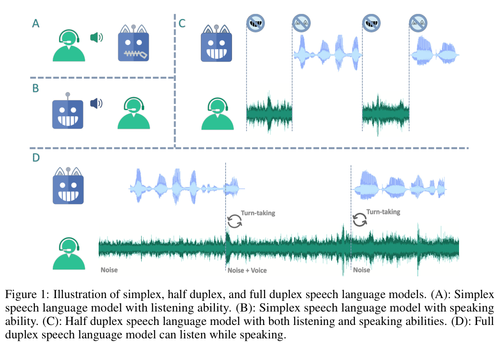

# LSLM

基本信息

- 标题: Language Model Can Listen While Speaking
- 作者:
  - 01 [Ziyang Ma](../../Authors/Ziyang_Ma_(马子阳).md)
  - 02 [Yakun Song](../../Authors/Yakun_Song.md)
  - 03 [Chenpeng Du](../../Authors/Chenpeng_Du.md)
  - 04 [Jian Cong](../../Authors/Jian_Cong.md)
  - 05 [Zhuo Chen](../../Authors/Zhuo_Chen_(陈卓).md)
  - 06 [Yuping Wang](../../Authors/Yuping_Wang.md)
  - 07 [Yuxuan Wang](../../Authors/Yuxuan_Wang_(王雨轩).md)
  - 08 [Xie Chen](../../Authors/Xie_Chen_(陈谐).md)
- 机构:
  - [上海交通大学 X-LANCE](../../Institutions/SJTU_上海交通大学.md)
  - [字节跳动](../../Institutions/ByteDance.md)
- 时间:
  - 预印时间: 2024.08.05 ArXiv v1
  - 更新笔记: 2024.08.08
- 发表:
  - 期刊/会议 
- 链接:
  - [ArXiv](https://arxiv.org/abs/2408.02622)
  - [DOI]()
  - [Github]()
  - [Demo](https://ziyang.tech/LSLM/)
  <!-- - [Scholar](https://scholar.google.com/scholar?cluster=) -->
- 标签:
  - ?
- 页数: 13
- 引用: 49
- 被引: ?
- 数据:
  - ? 
- 对比:
  - ?
- 复现:
  - ?

## Abstract: 摘要

原文

> Dialogue serves as the most natural manner of human-computer interaction (HCI). 
> Recent advancements in speech language models (SLM), have significantly enhanced speech-based conversational AI. 
> However, these models are limited to turn-based conversation, lacking the ability to interact with humans in real-time spoken scenarios, for example, being interrupted when the generated content is not satisfactory. 
> To address these limitations, we explore full duplex modeling (FDM) in interactive speech language models (iSLM), focusing on enhancing real-time interaction and, more explicitly, exploring the quintessential ability of interruption. 
> We introduce a novel model design, namely listening-while-speaking language model (***LSLM***), an end-to-end system equipped with both listening and speaking channels. 
> Our ***LSLM*** employs a token-based decoder-only TTS for speech generation and a streaming self-supervised learning (SSL) encoder for real-time audio input. 
> ***LSLM*** fuses both channels for autoregressive generation and detects turn-taking in real time. 
> Three fusion strategies—early fusion, middle fusion, and late fusion—are explored, with middle fusion achieving an optimal balance between speech generation and real-time interaction. 
> Two experimental settings, command-based FDM and voice-based FDM, demonstrate ***LSLM***'s robustness to noise and sensitivity to diverse instructions. 
> Our results highlight ***LSLM***'s capability to achieve duplex communication with minimal impact on existing systems. 
> This study aims to advance the development of interactive speech dialogue systems, enhancing their applicability in real-world contexts.
> Demo can be found at https://ddlbojack.github.io/LSLM.

 

对话是**人类与计算机交互 (Human-Computer Interaction, HCI)** 最自然的方式.
近年来, **语音语言模型 (Speech Language Model, SLM)** 的进步显著提升了基于语音的对话式人工智能.
然而, 这些模型仅限于轮流对话, 缺乏在实时口语场景中与人类互动的能力, 例如在生成内容不满意时无法被打断.
为了解决这些限制, 我们探索了**交互式语音语言模型 (interactive Speech Language Model, iSLM)** 中的**全双工建模 (Full Duplex Modeling, FDM)**, 重点是增强实时交互, 更明确地探索打断的基本能力.
我们引入了一种新颖的模型设计, 即***边听边说语言模型 (Listening-while-Speaking Language Model, LSLM)***, 这是一个配备了听和说通道的端到端系统。
我们的 ***LSLM*** 采用基于 Token 的仅解码器文本转语音进行语音生成， 并使用流式自监督学习编码器进行实时音频输入.
***LSLM*** 融合了两个通道进行自回归生成, 并实时检测对话轮换.
我们探索了三种融合策略: 早期融合, 中期融合, 晚期融合. 其中中期融合在语音生成和实时交互之间达到了最佳平衡.
两种实验设置: 基于命令的 FDM 和基于语音的 FDM, 展示了 ***LSLM*** 对噪声的鲁棒性和对多样指令的敏感性.
我们的结果突出了 ***LSLM*** 能够在对现有系统影响较小的情况下实现双工通信的能力.
本研究旨在推动交互式语音对话系统的发展, 增强其在现实世界中的应用性.
演示可在 https://ddlbojack.github.io/LSLM 找到.

## 1.Introduction: 引言

原文

> Dialogue is the most natural way of **Human-Computer Interaction (HCI)**. 
> With the rapid development of [GPT-style [29]](../LLM/GPT.md) large language models (LLM) and the scaling of [Transformer [39]](../_Transformer/2017.06.12_Transformer.md)-style architectures, textual conversational AI, such as ChatGPT ([InstrcutGPT [27]](../LLM/InstructGPT.md), [GPT-4 [01]](../LLM/GPT-4.md)) and [LLaMA [36]](../LLM/2023.02.27_LLaMA.md), [LLaMA2 [37]](../LLM/2023.07.18_LLaMA2.md), have become a significant part of daily life. 
> However, these models are limited to text input and output and cannot interact directly with humans in arbitrary scenarios.
>
> Incorporating spoken and auditory interfaces into conversational AI enhances HCI convenience. 
> Leveraging techniques from text LLMs, the speech language model (SLM) processes speech similarly to text. 
> This paradigm involves encoding the speech signal into discrete tokens or continuous embeddings, modeling them with a language model, and decoding the speech tokens or embeddings back to the speech signal.
> Some studies ([GSLM [19]](2021.02.01_GSLM.md); [pGSLM [17]](2021.09.07_pGSLM.md); [dGSLM [26]](2022.03.30_dGSLM.md)) utilizes this paradigm for speech continuation, generating expressive speech and natural multi-round dialogue. 
> Other research employs this paradigm to task-specific applications, such as decoder-only high-fidelity TTS ([VALL-E [40]](2023.01.05_VALL-E.md); [AudioLM [03]](2022.09.07_AudioLM.md); [Seed-TTS [31]](2024.06.04_Seed-TTS.md); [CosyVoice [13]](2024.07.04_CosyVoice.md)) and decoder-only streaming ASR ([Speech ReaLLM [33]](2024.06.13_Speech_ReaLLM.md); [Tsunoo et al.[38]](../ASR/2024.06.23_Decoder-only_Architecture_for_Streaming_E2E_Speech_Recognition.md); [Chen et al.[04]](../ASR/2024.06.27_Streaming_Decoder-Only_ASR_with_Discrete_Speech_Units.md); [BESTOW [08]](2024.06.28_BESTOW.md))
> Moreover, [SpeechGPT [48]](2023.05.18_SpeechGPT.md) and [LauraGPT [05]](2023.10.07_LauraGPT.md) initialize SLMs using LLMs, expanding speech tokens to the LLM vocabulary and continuing training on speech.
> This empowers SLM to comprehend semantic information and equips SLM with dialogue capability. 
> Despite these advances, all these models are limited to turn-based conversations and cannot handle real-time sound or interruptions, limiting their applicability in real-life scenarios. 
>
> Interaction and turn-taking are essential abilities for natural communication among humans. 
> At the dawn of the end-to-end speech dialogue system explosion, we focus on investigating **Full Duplex Modeling (FDM)** in **interactive Speech Language Models (iSLM)**, a crucial topic affecting user experience. 
> [Lin et. al [22]](../_tmp/2022.05.30_Duplex_Conversation.md) proposes to process real-time audio input with a separate comprehension module. 
> Other works ([Zhang et al.[49]](Beyond_the_Turn-Based_Game__Enabling_Real-Time_Conversations_with_Duplex_Models.md); [Wang et al.[41]](A_Full_Duplex_Speech_Dialogue_Scheme_Based_on_LLMs.md)) suggest modifying the order in which text tokens are organized in the LLM to tackle the duplex modeling problem. 
> All these models are based on text-centric LLMs that require external ASR and TTS modules for spoken dialogue. 
> As a result, latency remains perceivable and the paralinguistic ability is still lacking. 
> We believe the FDM capability should be an intrinsic capability of SLMs, enabling simultaneous listening and speaking. 
>
> To engage FDM capability for iSLM, we propose ***Listening-while-Speaking Language Model (LSLM)***, an end-to-end model with both listening and speaking channels. 
> The proposed ***LSLM*** uses a token-based decoder-only TTS to model the ability to speak and a streaming self-supervised learning (SSL) encoder to model the ability to listen. 
> ***LSLM*** fuses these two channels and detects turn-taking in real time.
> We explore three strategies for fusing duplex signals: **Early Fusion**, **Middle Fusion**, and **Late Fusion**. 
> Experiments demonstrate that middle fusion achieves a good balance between speech generation and real-time interaction capabilities.
>
> In addition, interactive dialogue systems for realistic scenarios have two important features: 
> (1) Listening channels are not always clean. 
> Users may interact with iSLMs in different scenarios, containing high-frequency noise (e.g., telephone ringing) and low-frequency noise (e.g., white noise). 
> (2) It is possible that the iSLM interacts with an unseen speaker. iSLMs should recognize and respond to new voices and instructions, not dismiss them as noise. 
> Therefore, iSLM should have both robustness to noise and sensitivity to unseen speakers. 
> To test ***LSLM***, we designed two scenarios: **Command-based FDM**, where ***LSLM*** is interrupted by a specific command, and **Voice-based FDM**, where ***LSLM*** can be interrupted by various words from unseen speakers. 
> Experimental results show that ***LSLM*** with a listening channel is robust to noisy input and sensitive to turning-taking.
>
> Our contributions are summarized as follows:
>
> 1. We formulate an important task, **Full Duplex Modeling (FDM)**, applied in the **interactive speech language model (iSLM)**. 
> 2. We propose ***Listening-while-Speaking Language Model (LSLM)***, an end-to-end single model with the focus of modeling the turn-taking problem.
> ***LSLM*** can listen to the outside signal and provide feedback in real time while speaking.
> 3. We introduce three methods for fusing duplex signals: **Early Fusion**, **Middle Fusion**, and **Late Fusion**, with Middle Fusion providing the optimal tradeoff between speech generation and real-time interaction. 
> 4. We tested the FDM ability of the proposed ***LSLM*** in two scenarios: **Command-based FDM** and **Voice-based FDM**.
> Experiments indicate that our proposed ***LSLM*** can achieve duplexing capability with little impact on the previous system. 

 

对话是**人机交互 (Human-Computer Interaction, HCI)** 最自然的方式.

随着 [GPT 类型 [29]](../LLM/GPT.md) 的大型语言模型（LLM）的迅速发展和 [Transformer 类型 [39]](../_Transformer/2017.06.12_Transformer.md) 架构的扩展, 文本对话 AI, 如 ChatGPT ([InstrcutGPT [27]](../LLM/InstructGPT.md); [GPT-4 [01]](../LLM/GPT-4.md)) 和 LLaMA ([LLaMA [36]](../LLM/2023.02.27_LLaMA.md); [LLaMA2 [37]](../LLM/2023.07.18_LLaMA2.md)), 已经成为日常生活的重要组成部分.
然而, 这些模型仅限于文本输入和输出, 无法在任意场景中直接与人类交互.

将语音和听觉接口融入对话 AI 增强了人机交互的便利性。
利用文本大语言模型的技术, **语音语言模型 (Speech Language Model, SLM)** 以类似文本的方式处理语音.
这一范式涉及将语音信号编码为离散 Token 或连续嵌入, 用语言模型对其建模, 并将语音 Token 或嵌入解码回语音信号.
- 一些研究 ([GSLM [19]](2021.02.01_GSLM.md); [pGSLM [17]](2021.09.07_pGSLM.md); [dGSLM [26]](2022.03.30_dGSLM.md)) 利用这一范式进行语音续写, 生成富有表现力的语音和自然的多轮对话.
- 其他研究则采用这一范式进行特定任务的应用, 如
  - 基于仅解码器架构的高保真文本转语音 ([VALL-E [40]](2023.01.05_VALL-E.md); [AudioLM [03]](2022.09.07_AudioLM.md)；[Seed-TTS [31]](2024.06.04_Seed-TTS.md); [CosyVoice [13]](2024.07.04_CosyVoice.md));
  - 仅解码器的流式自动语音识别 ([Speech ReaLLM [33]](2024.06.13_Speech_ReaLLM.md); [Tsunoo et al. [38]](../ASR/2024.06.23_Decoder-only_Architecture_for_Streaming_E2E_Speech_Recognition.md); [Chen et al. [04]](../ASR/2024.06.27_Streaming_Decoder-Only_ASR_with_Discrete_Speech_Units.md); [BESTOW [08]](2024.06.28_BESTOW.md)).
- 此外, [SpeechGPT [48]](2023.05.18_SpeechGPT.md) 和 [LauraGPT [05]](2023.10.07_LauraGPT.md) 使用 LLM 初始化 SLM, 将语音 Token 扩展到 LLM 词汇表, 并在语音上继续训练.
  这使得 SLM 能够理解语义信息, 并赋予 SLM 对话的能力.

尽管取得了这些进展, 但所有这些模型都局限于轮次对话, 无法处理实时声音或中断, 限制了它们在现实场景中的应用.

交互和轮次转换是人类自然交流的基本能力.
在端到端语音对话系统爆发的黎明, 我们专注于研究**交互式语音语言模型 (interactive Speech Language Model, iSLM)** 中的 **全双工建模 (Full Duplex Modeling, FDM)**. 这是一个影响用户体验的关键话题.
注: 双工 (Duplex) 是通信术语, 指的是在通信系统中, 信息可以在两个方向上同时传输的能力. 全双工为双方可同时传输和接收信息, 半双工为双方轮流发送和接收信息, 无法同时进行.

- [Lin et al. [22]](../_tmp/2022.05.30_Duplex_Conversation.md) 提出用一个单独的理解模块处理实时音频输入.
- 其他工作 ([Zhang et al. [49]](Beyond_the_Turn-Based_Game__Enabling_Real-Time_Conversations_with_Duplex_Models.md)；[Wang et al. [41]](A_Full_Duplex_Speech_Dialogue_Scheme_Based_on_LLMs.md)) 建议修改 LLM 中文本 Token 的组织顺序以解决全双工建模问题.

所有这些模型都基于以文本为中心的大语言模型, 需要外部 ASR 和 TTS 模块进行语音对话.
因此, 延迟仍然可感知, 副语言能力仍然不足.
我们相信 FDM 能力应该是 SLM 的内在能力, 能实现同时听和说.

为了实现交互式语音语言模型 iSLM 的全双工建模 FDM 能力, 我们提出了 ***边听边说语言模型 (Listening-while-Speaking Language Model, LSLM)***, 一种新的具有听说双通道的端到端模型.
所提出的 ***LSLM*** 使用基于 Token 的仅解码器架构的文本转语音来建模说话能力, 使用流式自监督学习编码器来建模听觉能力.
***LSLM*** 融合了这两个通道并实时检测轮次转换.
我们探索了混合双工信号的三种策略: **早期融合 (Early Fusion)**, **中期融合 (Middle Fusion)**, 和 **晚期融合 (Late Fusion)**.
实验结果表明, 中期融合能够在语音生成和实时交互能力之间取得良好的平衡.

此外, 现实场景中的交互对话系统有两个重要特征:
(1) 听觉通道并不总是干净的. 用户可能在不同场景中和 iSLM 交互, 其中包含高频噪声 (如电话铃声) 和低频噪声 (如白噪声).
(2) 可能需要和未见过的说话人交互. iSLM 应该能识别和响应新的声音和指令, 而不是视为噪声.

因此, iSLM 应该对噪声具有鲁棒性, 对未见过的说话人敏感.
为了测试 ***LSLM***, 我们设计了两个场景: (1) **命令式 FDM**, 其中 ***LSLM*** 被特定命令打断, 以及 **声音式 FDM**, 其中 ***LSLM*** 会被来自未见过的说话人的各种词语打断.

我们的贡献总结如下:
1. 我们制定了一个重要任务: **全双工建模 (FDM)**, 应用于**交互式语音语言模型 (iSLM)**;
2. 我们提出了 ***边听边说语言模型 (LSLM)***, 一种专注于建模轮次转换问题的端到端单模型, ***LSLM*** 可以在说话时实时听取部信号并提供反馈;
3. 我们引入三种混合双工信号的方法: **早期融合 (Early Fusion)**, **中期融合 (Middle Fusion)**, 和 **晚期融合 (Late Fusion)**, 中期融合提供了最佳的语音生成和实时交互之间的平衡;
4. 我们测试了 ***LSLM*** 在两种场景下的 FDM 能力: **命令式 FDM** 和 **声音式 FDM**, 实验表明我们所提的 ***LSLM*** 可以在对之前系统影响很小的情况下实现全双工能力.

## 2.Related Works: 相关工作

原文

> Figure.01 illustrates the distinctions between simplex, half duplex, and full duplex speech language models from a telecommunication perspective.
> An SLM with full duplex modeling (FDM) capability can be referred to as an interactive speech language model (iSLM). 

 

图 01 展示了从通信角度上单工, 半双工, 全双工语音语言模型之间的区别.
具有全双工建模能力的 SLM 可以称为交互式语音语言模型 (iSLM).
A. 单工语音语言模型 (听觉能力);
B. 单工语音语言模型 (说话能力);
C. 半双工语音语言模型 (轮流听说能力);
D. 全双工语音语言模型 (同时听说能力).

### Simplex and Half Duplex Speech Language Model: 单工和半双工语音语言模型

原文

> Simplex SLMs, depicted in Figure.01(A) and Figure.01(B), are limited to a single channel, either for listening or speaking. 
> With the assistance of LLM, simplex SLMs exhibit strong understanding capabilities. 
> Representative works include LLM-based ASR ([Yu et al. [46]](../ASR/2023.09.25_Connecting_Speech_Encoder_&_LLM_for_ASR.md); [SLAM-ASR [24]](../ASR/2024.02.13_SLAM-ASR.md); [MaLa-ASR [45]](../ASR/2024.06.09_MaLa-ASR.md); [Seed-ASR [32]](../ASR/2024.07.05_Seed-ASR.md)), LLM-based speech translation ([COSMIC [28]](2023.11.03_COSMIC.md); [SALM [07]](SALM.md); [Huang et al. [16]](Investigating_Decoder-Only_LLMs_for_STT_Translation.md), [LLaST [06]](2024.07.22_LLaST.md)), and LLM-based speech emotion understanding ([SECap [44]](2023.12.16_SECap.md); [Spoken-LLM [21]](2024.02.20_Spoken-LLM.md); [AffectGPT [20]](2024.07.10_AffectGPT.md)). 
> Similarly, simplex SLMs have demonstrated robust generation capabilities, as seen in LLM-based TTS ([LLM&VALL-E [15]](LLM&VALL-E.md), [T5-TTS [25]](2024.06.25_T5-TTS.md); [BASE TTS [18]](2024.02.12_BASE-TTS.md); [Seed-TTS [31]](2024.06.04_Seed-TTS.md)). 
> Some research leverages the powerful in-context learning capabilities of LLMs to extend task-specific abilities to more universal applications, such as speech understanding ([Wav2Prompt [11]](Wav2Prompt.md)), audio understanding ([LTU [14]](2023.05.18_LTU.md)), or both ([SALMONN [35]](2023.10.20_SALMONN.md); [Qwen-Audio [09]](2023.11.14_Qwen-Audio.md); [Qwen2-Audio [10]](2024.07.15_Qwen2-Audio.md)). 
> Despite their growing power and versatility, simplex SLMs are limited to one-way communication (either human $\rightarrow$ machine or machine $\rightarrow$ human). 
> LLMs have facilitated a paradigm shift from simplex models to half-duplex models, also known as turn-based models, as shown in Figure.01(C).
> Prominent models include [SpeechGPT [48]](2023.05.18_SpeechGPT.md), [LauraGPT [05]](2023.10.07_LauraGPT.md), and [VioLA [42]](2023.05.25_VioLA.md). 
> While these half duplex models can both listen and spea

 

单工语音语言模型, 被限制在单个通道, 要么听要么说.
借助 LLM 的协助, 单工 SLM 展现出强大的理解能力.
代表性的工作包括
- 基于 LLM 的 ASR: [Yu et al. [46]](../ASR/2023.09.25_Connecting_Speech_Encoder_&_LLM_for_ASR.md); [SLAM-ASR [24]](../ASR/2024.02.13_SLAM-ASR.md); [MaLa-ASR [45]](../ASR/2024.06.09_MaLa-ASR.md); [Seed-ASR [32]](../ASR/2024.07.05_Seed-ASR.md);
- 基于 LLM 的语音翻译: [COSMIC [28]](2023.11.03_COSMIC.md); [SALM [07]](SALM.md); [Huang et al. [16]](Investigating_Decoder-Only_LLMs_for_STT_Translation.md), [LLaST [06]](2024.07.22_LLaST.md);
- 基于 LLM 的语音情感理解: [SECap [44]](2023.12.16_SECap.md); [Spoken-LLM [21]](2024.02.20_Spoken-LLM.md); [AffectGPT [20]](2024.07.10_AffectGPT.md);

类似地, 单工 SLMs 也展现出了稳健的生成能力, 如基于 LLM 的 TTS: [LLM&VALL-E [15]](LLM&VALL-E.md), [T5-TTS [25]](2024.06.25_T5-TTS.md); [BASE TTS [18]](2024.02.12_BASE-TTS.md); [Seed-TTS [31]](2024.06.04_Seed-TTS.md).

一些研究利用 LLMs 强大的上下文学习能力以扩展具体任务的能力到更通用的应用, 例如语音理解 ([Wav2Prompt [11]](Wav2Prompt.md)), 音频理解 ([LTU [14]](2023.05.18_LTU.md)) 或两者兼有  ([SALMONN [35]](2023.10.20_SALMONN.md); [Qwen-Audio [09]](2023.11.14_Qwen-Audio.md); [Qwen2-Audio [10]](2024.07.15_Qwen2-Audio.md)).

尽管单工 SLM 在功能和灵活性方面不断增强, 但它们仅限于单向通信 (从人类到机器或从机器到人类).
LLM 促进了从单工模型到半双工模型 (回合制模型) 的范式变化.
突出的模型包括 [SpeechGPT [48]](2023.05.18_SpeechGPT.md), [LauraGPT [05]](2023.10.07_LauraGPT.md), [VioLA [42]](2023.05.25_VioLA.md).
尽管这些半双工模型能够同时听和说, 但它们在同一时刻只能执行一个动作, 因此无法解决轮次转换问题.

### Full Duplex Speech Language Model: 全双工语音语言模型

原文

> Full duplex SLMs, as shown in Figure.01(D), have the capability to listen and speak simultaneously, allowing for turn-taking whenever a human interrupts the machine. 
> Recent efforts ([Zhang et al.[49]](Beyond_the_Turn-Based_Game__Enabling_Real-Time_Conversations_with_Duplex_Models.md); [Wang et al.[41]](A_Full_Duplex_Speech_Dialogue_Scheme_Based_on_LLMs.md)) have attempted to build full duplex capabilities on text-centric LLMs with cascade ASR and TTS modules. 
> Cutting-edge products like [GPT-4o](https://openai.com/index/hello-gpt-4o) and [Moshi](https://moshi.chat) exhibit full duplex capability in their spoken dialogue systems. 
> Despite these advancements, there are no publicly available open-source models or detailed analyses of full duplex SLMs.
> This gap highlights the need for further research and development to fully understand and optimize full duplex capability in speech language models. 

 

全双工语音语言模型具有同时听说的能力, 允许人类打断机器时进行轮次转换.
近期的努力 ([Zhang et al.[49]](Beyond_the_Turn-Based_Game__Enabling_Real-Time_Conversations_with_Duplex_Models.md); [Wang et al.[41]](A_Full_Duplex_Speech_Dialogue_Scheme_Based_on_LLMs.md)) 试图在以文本为中心的 LLM 结合级联 ASR 和 TTS 模块构建全双工能力.
尖端产品如 [GPT-4o](https://openai.com/index/hello-gpt-4o) 和 [Moshi](https://moshi.chat) 在其语音对话系统中展示了全双工能力.
尽管有了这些进展, 但目前还没有公开可用的开源模型或全双工 SLM 的详细分析.
这一差距凸显了进一步研究和开发以完全理解和优化语音语言模型中全双工能力的需求.

## 3.Methodology: 方法

### Full Duplex Modeling (FDM): 全双工建模

原文

> A simplex or half duplex spoken dialogue system can be modeled by finding the parameters $\theta$ that maximize the log-likelihood function, formulated as: 

$$
    \max\limits_{\theta} \sum_{(C,R)\in D} \log P_{\theta}(R|C),
$$

> where $(C, R)$ represents the context-response pairs in the dataset $D$ and $P_{\theta}(R|C)$ is the probability of the response $R$ given the context $C$ and parameters $\theta$. 
> More specifically, if the spoken dialogue system is modeled by an autoregressive language model where the response $R$ is generated token by token, the training loss $\mathcal{L}(\theta)$ for each sample is expressed as:

$$
    \mathcal{L}(\theta) = - \sum_{t=1}^{T} \log P_{\theta}(r_t|R_{1:t-1}, C),
$$

> where $R_{1:t-1} = [r_1, r_2, ..., r_{t-1}]$ and $T$ is the sequence length. 

> During the inference phase, the model can only predict the next token autoregressively based on the previous output within the current channel, without information from other channels. 
>
> In modeling a full duplex spoken dialogue system within an autoregressive language model, the model needs to predict the next token $r_t$ in the response $R$ not only based on the context $C$ and the generated response history $R_{1:t-1} = [r_1, r_2, \ldots, r_{t-1}]$ in the current channel, but also by utilizing information $S_{1:t-1} = [s_1, s_2, \ldots, s_{t-1}]$ from another channel simultaneously. 
> Here we extend the modeling approach used for simplex or half duplex dialogue systems to accommodate the requirements of full duplex modeling (FDM).
> The training loss $\mathcal{L}(\theta)$ is now formulated as: 

$$
    \mathcal{L}(\theta) = - \sum_{t=1}^{T} \log P_{\theta}(r_t|R_{1:t-1}, S_{1:t-1}, C)
$$

> **A key point in FDM is that the sequence $S$ is produced in real time and unpredictably.**
> Taking the full duplex speech language model as an example, at the inference step $t-1$, the current speaking channel generates output $r_{t-1}$ and listening channel acquired input $s_{t-1}$ are fed into the model simultaneously, influencing the prediction of the speaking channel's next step output $r_t$. 
> This modeling approach endows the system with a full duplex ability, enabling it to effectively leverage the multi-channel information during dialogue, thereby improving the accuracy and fluency of the real-time interaction capability. 

 

单工或半双工对话系统可以建模成找到参数 $\theta$ 最大化如下形式的对数似然函数:

$$
    \max\limits_{\theta} \sum_{(C,R)\in D} \log P_{\theta}(R|C),
$$

其中 $(C,R)$ 表示数据集 $D$ 中的上下文-响应对, $P_{\theta}(R|C)$ 是给定上下文 $C$ 和参数 $\theta$ 时响应是 $R$ 的概率.
更具体的说, 如果口语对话系统通过自回归语言模型建模, 其中响应 $R$ 是逐个 Token 生成的, 那么对应每个样本的训练损失表示如下:

$$
    \mathcal{L}(\theta) = - \sum_{t=1}^{T} \log P_{\theta}(r_t|R_{1:t-1}, C),
$$

其中 $R_{1:t-1} = [r_1, r_2, ..., r_{t-1}]$, $T$ 是序列长度.

在推理阶段, 模型只能在当前通道内基于先前的输出结果以自回归的方式预测下一个 Token, 而没有其他通道的信息.

用自回归语言模型建模一个全双工的口语对话系统, 模型需要基于当前通道中上下文 $C$ 和生成的响应历史 $R_{1:t-1} = [r_1, r_2, \ldots, r_{t-1}]$ 以及利用来自其他通道的信息 $S_{1:t-1} = [s_1, s_2, \ldots, s_{t-1}]$ 来预测响应 $R$ 中的下一个 Token $r_t$.
因此我们将用于单工或半双工对话系统的建模方法扩展到适应全双工建模的要求.

训练损失 $\mathcal{L}(\theta)$ 现在表示如下:

$$
    \mathcal{L}(\theta) = - \sum_{t=1}^{T} \log P_{\theta}(r_t|R_{1:t-1}, \textcolor{red}{S_{1:t-1}}, C)
$$

**全双工建模的一个关键点是序列 $S$ 是实时产生且不可预测的.**
以全双工语音语言模型为例, 在推理 $t-1$ 步时, 当前说话通道生成输出 $r_{t-1}$ 和听觉通道获得的输入 $s_{t-1}$ 同时输入到模型中, 影响说话通道下一步输出 $r_t$ 的预测.
这种建模方法使得系统具有全双工能力, 使得在对话中能够有效地利用多通道信息, 从而提升实时交互能力的准确性和流畅度.

### LSLM

> The core difference between ***LSLM*** and previous speech language models lies in its capability to simultaneously speak and listen. 
> We first introduce the speaking capability of ***LSLM***, followed by its listening capability, and finally, we discuss various fusion methods that integrate these capabilities, endowing ***LSLM*** with full duplex ability. 

#### Speaking Ability

> To simulate the speaking ability of the ***LSLM***, we utilize an autoregressive token-based TTS model. 
> Unlike [VALL-E](2023.01.05_VALL-E.md)-styled models that combine autoregressive (AR) and non-autoregressive (NAR) approaches with multi-layer residual vector quantization (RVQ) tokens, our model employs a single layer of discrete audio tokens. 
> This design better meets the requirements for real-time interaction, as it eliminates the need to wait for the completion of AR token synthesis before performing NAR operations. 
> Given target speech $X^R$, an SSL encoder $Enc$ is utilized to obtain a continuous embedding $R$, which can be written as: $R = Enc(X^R).$

> To train an autoregressive TTS model based on discrete tokens, we quantize the speech embedding $R$, denoted by: $R^q = Qnt(R)$, where $Qnt$ is the discretization operation and $R^q$ are the discrete tokens. 

> Given the context information $C$, in this scenario the text content to be synthesized, the model synthesizes the corresponding speech discrete tokens autoregressively.
> We minimize the negative log-likelihood of the target sequence to train the decoder-only model, conditioned on the preceding tokens and the context.
> The loss function is defined as:

$$
    \mathcal{L}(\theta_{S}) = - \sum_{t=1}^{t_{EOS}} \log P(r^q_t|R^q_{1:t-1}, C; \theta_{S}),
$$

> where $\theta_{S}$ are the parameters to model speaking ability, $t_{EOS}$ represents the time step at which the end-of-sequence token is reached, $r^q_t$ is the target discrete token at time step $t$, $R^q_{1:t-1}$ denotes the sequence of all previous tokens up to time step $t-1$, and $C$ is the text content to be synthesized.
> During inference, the model samples $\hat{r}^q_t$ from a conditional distribution based on the already generated tokens $\hat{R}^q_{1:t-1}$ and the context $C$. 
>
> The process is described by the following equation: 

$$
    \hat{r}^q_t\sim P(r^q_t | \hat{R}^q_{1:t-1}, C; \theta_{S}).
$$

> A vocoder $Dec$ is employed to recover the speech signal $\hat{X}^R$ from discrete tokens $\hat{R}^q$, donated by: 

$$
    \hat{X}^R = Dec(\hat{R}^q, A),
$$

> where $A$ is the acoustic prompt providing the timbre of the synthesized speech. 
> This decoupling of timbre from content allows the AR model to focus more on semantic information rather than paralinguistic information.

#### Listening Ability

> Given the audio input $X^S$ of the listening channel, the same SSL encoder $Enc$ in Equation~\ref{eq:ssl_encoder} is used to obtain a continuous embedding $S$, which can be written as: $S = Enc(X^S)$, where $X^S$ can be a variety of sound signals, including environmental noise and human speech.
> Unlike training the speaking ability, which involves a discretization module, the listening channel embedding $S$ is fed into the neural network end-to-end via a projection module $Proj$, which can be written as: $S^p = Proj(S)$, where the listened audio signal is mapped to a space that can be processed by the AR model. 

### FDM Ability

> ***LSLM*** has two channels: speaking and listening.
> At time step $t$, all previous information of the speaking channel $R^q_{1:t-1}$ and the processed information of the listening channel $S^p_{1:t-1}$ are considered by the model simultaneously.
> Here we revise Equation~\ref{eq:speaking_ability_loss} as follows:

$$
\mathcal{L}(\theta_{LS}) =
\begin{cases} 
\sum_{t=1}^{t_{IRQ}} \log P(r^q_t|R^q_{1:t-1}, S^p_{1:t-1}, C; \theta_{LS}) & \text{if turn-taking,} \\
\sum_{t=1}^{t_{EOS}} \log P(r^q_t|R^q_{1:t-1}, S^p_{1:t-1}, C; \theta_{LS}) & \text{otherwise.} \\
\end{cases}
$$

> where $\theta_{LS}$ are the parameters to model the proposed ***LSLM*** with listening-while-speaking ability. 
> In addition to the EOS token, we add an interruption token IRQ to the tokenizer vocabulary to allow the model to terminate early if turn-taking occurs.
> For example, if a human interrupts, the model should stop speaking within a detection interval $\mu$ seconds after the interruption starts. 
> During inference, the model samples $\hat{r}^q_t$ from a conditional distribution based on the already generated tokens $\hat{R}^q_{1:t-1}$, the context $C$, and most important, real-time listened audio tokens $S^p_{1:t-1}$.
> The revised formula from Equation~\ref{eq:speaking_ability_inference} is written as follows:

$$
    \hat{r}^q_t\sim P(r^q_t | \hat{R}^q_{1:t-1}, S^p_{1:t-1}, C; \theta_{LS}),
$$

> in which, an essential requirement for the SSL encoder $Enc$ is that it is streaming.
> Thus, ***LSLM*** can obtain real-time audio features during inference.
> This is detailed further in Section~\ref{sec:model_details}.
>
> To comprehensively explore the integration of a listening channel to the proposed ***LSLM***, we try to fuse the listening channel and the speaking channel with early, middle, and late methods, as shown in Figure~\ref{fig:fusion}. 
>
> **Early Fusion** integrates the listening and speaking channels at the input embeddings before autoregressive prediction. 
>
> **Middle Fusion** merges the listening and speaking channels at each Transformer block.
> Specifically, in addition to the hidden states of the speaking channel and positional embeddings, the listening channel is additionally added to the input of each Transformer block. 
>
> **Late Fusion** combines the channels at the output logits before the softmax operation. 

## 4.Experiments: 实验

### Model Details

> The backbone of the proposed ***LSLM*** employs a decoder-only Transformer architecture consisting of $12$ Transformer blocks, $12$ attention heads, $768$ embedding dimensions, and $3072$ feed-forward layer dimensions, resulting in $106$M parameters. 
> SSL encoder [VQ-Wav2Vec [02]](../Speech_Representaion/2019.10.12_VQ-Wav2Vec.md) is employed to extract audio features and further convert speech features to discrete tokens. 
> [VQ-Wav2Vec](../Speech_Representaion/2019.10.12_VQ-Wav2Vec.md), a fully convolutional self-supervised pre-trained model with $20$ layers of 1D convolutional neural networks with $34$M parameters, is naturally suitable for streaming audio feature extraction. 
> A simple linear layer serves as the projection module to adapt the listening channel features to the AR model. 
> A GAN-based token-to-waveform vocoder ([UniCATS [12]](../_tmp/UniCATS.md)) is utilized to recover discrete audio tokens to speech waveform. 

### Data Details

> We evaluate the proposed ***LSLM*** under two full duplex modeling (FDM) settings: command-based FDM and voice-based FDM. 
> Table \ref{tab:data_details} summarizes the datasets and experimental settings. 
> For the TTS datasets, we utilize the [LibriTTS dataset [47]](../../Datasets/2019.04.05_LibriTTS.md) with $585$ hours of speech-text pairs for training and validation.
> LibriTTS-testsetB ([UniCATS [12]](../_tmp/UniCATS.md)) is adopted for testing, which contains $500$ utterances sampled from the test-clean subset of LibriTTS with 37 unseen speakers. 
> Background noise is uniformly sourced from the Freesound portion of the [MUSAN dataset [34]](../../Datasets/2015.10.28_MUSAN.md), which includes high-frequency noise such as telephone ringing and sounds of the explosion, as well as low-frequency noise such as white noise and traffic noise. 
> The model needs to distinguish the human voice from the noise, so as to avoid turning-taking with any random input signals and avoid trivial solutions. 
> Different interruption data is constructed based on the FDM settings.

> **Command-based FDM.**
> In this setting, ***LSLM*** can only be interrupted by specific keywords.
> Timbre of $22$ boutique speakers from [Seed-TTS [31]](2024.06.04_Seed-TTS.md) is used to synthesize the command "Honey" for the command-based FDM. 
>
> **Voice-based FDM.**
> In this setting, ***LSLM*** can be interrupted by a variety of different words.
> [The Speech Commands Dataset [43]](../../Datasets/SpeechCommands.md) is a set of one-second audio, each containing a single spoken English word.
> We split the dataset into training, validation, and test sets in an $8:1:1$ ratio, resulting in $51,088$, $6,798$, and $6,835$ pieces of data, respectively.
> In addition, we use a speaker independence setting, which guarantees that the speakers in the test set do not appear in the training set, simulating more challenging and realistic scenarios. 

### Training and Inference Details

> We train the model with TTS, interruption, and noise datasets for $20$ epochs. 
> For each sample, noise is added with a $50\%$ probability, and interruption with a $50\%$ probability, to the listening tokens. 
> If a sample is selected to include an interruption, we modify the sentence to output the IRQ token $\mu = 0.5$ seconds after the start of the interruption and then stop outputting the remaining speaking tokens. 
> This ensures that the model can correctly handle different audio signal combinations in the listening channel. 
> The optimization strategy involves using [AdamW [23]](../../Modules/Optimization/2017.11.14_AdamW.md) with a max learning rate of $5 \times 10^{-4}$ without weight decay and a batch size of $4$. 
> The learning rate scheduler involves a warm-up phase for the first $5,000$ steps, followed by a cosine decay of the learning rate. 
> Validation is performed at the end of each epoch, and the checkpoint with the lowest loss is selected for inference. 
> The generation process employs Top-P sampling with a top-p value of $0.99$ and a temperature of $1.0$. 

### Evaluation Metrics

> **TTS capability evaluation.** 
> We evaluate whether the speech generation capability is affected by the full duplex modeling in the proposed ***LSLM***. 
> The word error rate (WER) comparing the generated speech to the original text is considered as the TTS capability evaluation metrics using [Whisper [30]](Whisper.md) [large v3](https://github.com/openai/whisper). 
>
> **Interactive capability evaluation.** 
> Interactivity capability evaluation aims to measure how well the proposed ***LSLM*** responds to real-time and unpredictable input from the listening channel. 
> A successful turn-taking is defined as the model stopping speaking within the $[0, 2\mu]$ interval ($1$ second in our setting) after the interruption begins. 
> Based on this, we categorize the outcomes into four cases: interruption and hit (TP), interruption and miss (FN), no interruption and hit (FP), and no interruption and miss (TN). 
> From these cases, we construct a confusion matrix and calculate the Precision, Recall, and F1 score. 
> These metrics consider both the success rate of turn-taking (Recall) and the rate of misjudgments (Precision), providing a comprehensive evaluation of the model's interactivity capabilities. 

## 5.Results: 结果

> We conduct a series of experiments to evaluate the command-based and voice-based FDM for both TTS capability and interactive capability. 
> For TTS capability, we use a test set consisting of $500$ utterances, referred to as LibriTTS-testsetB ([UniCATS [12]](../_tmp/UniCATS.md)), without any interruptions in the listening channel.
> The primary metric for this evaluation is WER. 
> For the interactive capability evaluation, we employ a set of $1000$ utterances divided into two equal parts: $500$ utterances with interruptions at a random time step and $500$ utterances without interruptions.
> Interactive capability is measured using Precision, Recall, and F1 Score. 
>
> Additionally, we test the models under two listening channel conditions: without noise, donated as Clean, and with noise, donated as Noise.
> For the baseline Vanilla TTS model, since it does not involve a listening channel, the input is inherently clean.
> By comparing the clean scenarios, we assess whether the intrinsic TTS capability is affected.
> Additionally, integrating noisy external inputs provides a better simulation of real-world scenarios. 

### Command-based FDM

> For command-based FDM, we test the three architectures described in Section~\ref{sec:FDM-Ability} to fuse the listening channel and the speaking channel, which are early fusion (***LSLM***$_{EF}$), middle fusion (***LSLM***$_{MF}$), and late fusion (***LSLM***$_{LF}$).
> The results are shown in Table~\ref{tab:Command-based-FDM}. 
> For TTS capability, The baseline Vanilla TTS model without a listening channel achieves a WER of $4.28\%$. 
> ***LSLM***$_{MF}$ outperforms ***LSLM***$_{EF}$ and ***LSLM***$_{LF}$ with a WER of $4.05\%$ in clean conditions and maintains a relatively low WER of $4.51\%$ in noisy conditions. 
> The TTS ability of ***LSLM***$_{EF}$ shows a notable decrease, likely due to the fusion of input embeddings, making it difficult for the model to distinguish the information of the listening and speaking channels, negatively impacting the next token prediction. 
> For interactive capability, all three architectures perform well with an oracle clean listening channel.
> However, ***LSLM***$_{LF}$ shows a notable drop in performance under noisy conditions, with the F1 score falling to $94.89\%$. 
> Observing that the late fusion method appears to mainly affect the precision score when the listening channel is noisy, suggests that the ***LSLM***$_{LF}$ model reduces the discrimination of noise and human voice, leading to misjudgments of interruptions. 
> In summary, the middle fusion approach demonstrates superior performance in TTS capability and competitive performance in interactive capability.
> Therefore, ***LSLM***$_{MF}$ is concluded to be the best-performing model among those tested. 

### Voice-based FDM

> We utilized a more diverse set of interruption commands compared to the command-based FDM and involved unseen speakers in the testing procedures.
> The best configuration from the command-based FDM, the ***LSLM***$_{MF}$ model, was selected to evaluate the voice-based FDM capability.
> The results are shown in Table~\ref{tab:Voice-based-FDM}. 
> ***LSLM*** shows a higher WER of $5.33\%$ in clean conditions and $8.50\%$ in noisy conditions compared to the Vanilla TTS model, demonstrating the challenges posed by the real-world turn-taking problem. 
> Comparing the results with the command-based FDM using the ***LSLM***$_{MF}$ model, we find that the voice-based setting faces greater challenges in maintaining high performance, especially under noisy conditions with Precision at $87.69\%$, Recall at $82.77\%$, and an F1 score of $85.15\%$.
> The diverse set of interruption commands and the involvement of unseen speakers add complexity, resulting in higher error rates. 

### Visualization

> To investigate the turn-taking internal mechanism of ***LSLM***, we visualize the probability distribution of IRQ tokens at different time steps during the generation process. 
> Given that the IRQ token probability distribution varies significantly in order of magnitude across different time steps, we utilize a logarithmic scale for probability to enhance the clarity of the visualization. 
> As illustrated in Figure~\ref{fig:visualization}, the probability of the IRQ token remains below $1\times10^{-3}$ when the model is not interrupted. 
> When the listening channel starts to receive the real-time turn-taking signal, ***LSLM*** senses whether it is an interruption or a noise. 
> After a very short time, the IRQ token probability begins to increase. 
> Shortly thereafter, this probability rises to a level where the IRQ token is sampled by the model during generation. 

### Ablation Study

> In this section, we conduct an ablation study on ***LSLM*** with middle fusion architecture to evaluate the impact of different training methods on the performance of TTS capability and interactive capability. 
> The training methods are categorized as training from scratch (\ding{55}), loading the pre-trained model and fixing the parameters (\ding{51}), and loading the pre-trained model and continuing training (\ding{58}).
> The detailed results are presented in Table~\ref{tab:ablation}. 
>
> The vanilla TTS model, trained from scratch, achieves a WER of $4.28\%$ concerning TTS capability. 
> For the interactive capability, the vanilla TTS model does not have a listening channel, hence no metrics are available. 
> For the ***LSLM*** model, the best performance is observed when both the TTS backbone and streaming SSL encoder are loaded and continue training (\ding{58} \& \ding{58}), achieving the lowest WER of $4.05\%$ and highest Precision of $97.80\%$, Recall of $98.19\%$, and F1 Score of $98.00\%$. 
> Some conclusions can also be drawn from these experiments.
> For example, the SSL encoder of the listening channel performs better when it can be continued training than fixed the parameters.
> One potential reason is that the SSL encoder has not encountered diverse noise during pre-training, creating a bottleneck for extracting audio with mixed human voice and noise when using fixed pre-trained parameters. 

## 6.Conclusions: 结论

原文

> In this paper, we address the challenges of enhancing real-time interaction by introducing full duplex modeling (FDM) in interactive speech language models (iSLM). 
> We introduce ***Listen-while-Speaking Language Model (LSLM)***, an innovative end-to-end model designed to handle real-time turn-taking.
> ***LSLM*** integrates a token-based decoder-only TTS model for speech generation and a streaming SSL encoder for audio input, enabling simultaneous listening and speaking. 
> We propose three strategies for fusing duplex signals: early fusion, middle fusion, and late fusion.
> Among these, Middle Fusion demonstrates a superior balance between speech generation and real-time interaction capabilities. 
> The proposed ***LSLM*** is evaluated in two settings: command-based FDM and voice-based FDM.
> Our experiments show that ***LSLM*** is robust to noisy environments and responsive to diverse instructions from unseen speakers, achieving effective duplex communication with minimal impact on system performance. 
> Our work is an initial exploration into full duplex interactive speech language models, and there is still a long way to go to achieve smooth human-computer speech interaction. 
> There is a lot to explore in the future, such as developing speech-in speech-out dialogue systems with full duplex modeling ability, incorporating speaker-following capability to identify interrupting speakers, and exploring audiovisual co-guidance for improved turn-taking. 

 

本文通过向**交互式语音语言模型 (interactive Speech Language Model, iSLM)** 中引入**全双工建模 (Full Duplex Modeling, FDM)** 来应对提升实时交互的挑战.
我们提出了***听说语言模型 (Listen-while-Speaking Language Model, LSLM)***, 一种新的端到端模型, 专门设计用于处理实时轮流发言.
***LSLM*** 集成了一个基于 Token 的仅解码器架构的文本转语音模型用于语音生成, 以及一个流式自监督编码器用于处理音频输入, 使得模型能够同时听和说.
我们提出了三种融合双工信号的策略: 早期融合, 中期融合, 后期融合.
在这些策略中, 中期融合表现出了最佳的平衡.
我们在两个设置中评估了 ***LSLM***: 命令式 FDM 和声音式 FDM.
我们的实验显示 ***LSLM*** 对嘈杂环境具有鲁棒性, 并对来自未见过说话人的多样指令做出了响应, 实现了有效的双工通信, 且对系统性能影响最小.
我们的工作是对全双工交互式语音语言模型的初步探索, 要实现流畅的人机语音交互还有很长的路要走.
未来还有很多可探索空间, 例如开发具备全双工建模能力的语音输入-语音输出对话系统, 整合跟随说话人的能力以识别打断的说话人, 以及探索视听联合引导以改善轮流发言.