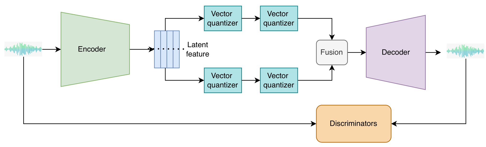
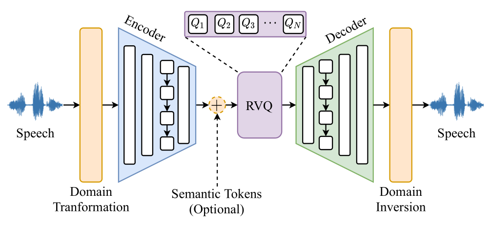

# 神经编解码器简要概述

## 2021.07.07 SoundStream - Google Research

SoundStream 架构图:
- 卷积编码器为输入音频样本产生隐表示
- 残差向量量化器使用可变的 $n_q$ 将隐表示量化.
- 训练时, 模型参数使用重构损失+对抗损失进行优化.
- 可选的条件输入可用于表明何时背景噪声需要被去除.
- 部署模型时, 发送端的编码器和量化器将压缩比特流发送到接收端, 然后解码音频信号.

---

## 2022.10.24 EnCodec - Meta AI FAIR

---

## 2023.05.04 HiFi-Codec - Tecent AI Lab

---

## 2023.08.31 SpeechTokenizer - 复旦大学

---

## 2023.09.14 FunCodec - 阿里巴巴达摩院语音实验室

---

## 2024.02.19 Language-Codec - 浙江大学+阿里巴巴达摩语音实验室

---