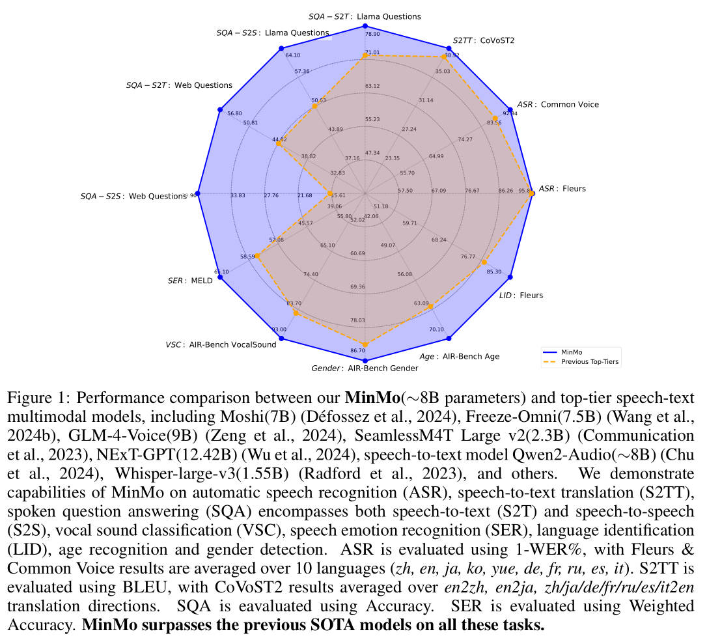

# MinMo

基本信息

- 标题: "MinMo: A Multimodal Large Language Model for Seamless Voice Interaction"
- 作者:
  - 01 Qian Chen,
  - 02 Yafeng Chen,
  - 03 Yanni Chen,
  - 04 Mengzhe Chen,
  - 05 Yingda Chen,
  - 06 Chong Deng,
  - 07 Zhihao Du,
  - 08 Ruize Gao,
  - 09 Changfeng Gao,
  - 10 Zhifu Gao,
  - 11 Yabin Li,
  - 12 Xiang Lv,
  - 13 Jiaqing Liu,
  - 14 Haoneng Luo,
  - 15 Bin Ma,
  - 16 Chongjia Ni,
  - 17 Xian Shi,
  - 18 Jialong Tang,
  - 19 Hui Wang,
  - 20 Hao Wang,
  - 21 Wen Wang,
  - 22 Yuxuan Wang,
  - 23 Yunlan Xu,
  - 24 Fan Yu,
  - 25 Zhijie Yan,
  - 26 Yexin Yang,
  - 27 Baosong Yang,
  - 28 Xian Yang,
  - 29 Guanrou Yang,
  - 30 Tianyu Zhao,
  - 31 Qinglin Zhang,
  - 32 Shiliang Zhang,
  - 33 Nan Zhao,
  - 34 Pei Zhang,
  - 35 Chong Zhang,
  - 36 Jinren Zhou
- 链接:
  - [ArXiv](https://arxiv.org/abs/2501.06282)
  - [Publication]()
  - [Github]()
  - [Demo](https://funaudiollm.github.io/minmo/)
- 文件:
  - [ArXiv](_PDF/2501.06282v1__MinMo__A_Multimodal_Large_Language_Model_for_Seamless_Voice_Interaction.pdf)
  - [Publication] #TODO

## Abstract: 摘要

展开原文

Recent advancements in large language models (LLMs) and multimodal speech-text models have laid the groundwork for seamless voice interactions, enabling real-time, natural, and human-like conversations.
Previous models for voice interactions are categorized as native and aligned.
Native models integrate speech and text processing in one framework but struggle with issues like differing sequence lengths and insufficient pre-training.
Aligned models maintain text LLM capabilities but are often limited by small datasets and a narrow focus on speech tasks.
In this work, we introduce ***MinMo***, a Multimodal Large Language Model with approximately 8B parameters for seamless voice interaction.
We address the main limitations of prior aligned multimodal models.
We train ***MinMo*** through multiple stages of speech-to-text alignment, text-to-speech alignment, speech-to-speech alignment, and duplex interaction alignment, on 1.4 million hours of diverse speech data and a broad range of speech tasks.
After the multi-stage training, ***MinMo*** achieves state-of-the-art performance across various benchmarks for voice comprehension and generation while maintaining the capabilities of text LLMs, and also facilitates full-duplex conversation, that is, simultaneous two-way communication between the user and the system.
Moreover, we propose a novel and simple voice decoder that outperforms prior models in voice generation.
The enhanced instruction-following capabilities of ***MinMo*** supports controlling speech generation based on user instructions, with various nuances including emotions, dialects, and speaking rates, and mimicking specific voices.
For ***MinMo***, the speech-to-text latency is approximately 100ms, full-duplex latency is approximately 600ms in theory and 800ms in practice.
The ***MinMo*** project web page is [this https URL](https://funaudiollm.github.io/minmo), and the code and models will be released soon.

 

在大语言模型和多模态语音-文本模型的最新进展为无缝声音交互奠定了基础, 实现了实时, 自然, 人类般的对话.
以前的声音交互模型可以分为**原生模型 (Native Models)** 和**对齐模型 (Aligned Models)**.
- **原生模型 (Native Models)** 在一个框架中集成了语音和文本处理, 但存在如序列长度差异和预训练不足的问题.
- **对齐模型 (Aligned Models)** 保持了文本大语言模型的能力, 通常但受限于小数据集和语音任务的狭窄关注.

本文介绍了 ***MinMo***, 一个多模态大语言模型, 具有约 8B 参数, 用于无缝声音交互.
我们解决了先前多模态**对齐模型**的主要局限.
我们在 1.4 百万小时 (1400 K Hours) 的多样语音数据和广泛的语音任务上对 ***MinMo*** 进行多阶段训练: 语音到文本对齐, 文本到语音对齐, 语音到语音对齐和双工交互对齐.

经过多阶段训练后, ***MinMo*** 实现了声音理解和生成的 SoTA 性能, 同时保持了文本大语言模型的能力, 并支持全双工对话, 即用户和系统之间可以同时进行双向通信.

此外, 我们提出了一个新式且简单的声音解码器, 在声音生成方面超过了先前模型.

***MinMo*** 的增强指令跟随能力支持根据用户指令控制语音生成, 包括情感, 方言, 以及语速等多种细微差别, 还可以模仿特定的声音.

***MinMo*** 的语音到文本延迟大约为 100ms, 全双工延迟大约为 600ms (理论值) 和 800ms (实际值).
***MinMo*** 项目网页为 [https://funaudiollm.github.io/minmo](https://funaudiollm.github.io/minmo), 代码和模型将很快发布.

## 1·Introduction: 引言

展开原文

Seamless voice interaction indicates that **a user experiences real-time, natural, relevant, and human-like spoken conversation with the system**.
Facilitating seamless voice interaction poses great challenges:
(1) the system needs to understand audio accurately and comprehensively, including comprehending the content and also paralinguistic cues in speech (e.g., emotion, prosody) as well as audio events;
(2) the system is expected to produce natural and expressive speech response;
(3) the system should provide relevant and reasonable response to the user, as an intelligent chatbot;
(4) the system is expected to support full-duplex conversation (simultaneous two-way communication), that is, the system listens while speaking and the user is free to interrupt when the system is speaking, then the system either continues the speech, or concedes it, listens to the user, and provides response to the new user query.

In recent years, seamless voice interaction systems have gained significant momentum, especially with the advancements in multimodal large language models, such as [GPT-4o](2024.09.06_GPT-4o.md) and [Moshi](2024.09.17_Moshi.md).
These systems not only produce natural and expressive speech but also understand cues beyond words, including emotional tones and audio events.
Current multimodal language models for voice interaction can be categorized into two main categories.
The first category includes **native multimodal models**, such as [Moshi](2024.09.17_Moshi.md) and [GLM-4-Voice](2024.12.03_GLM-4-Voice.md).
These models typically use a decoder-only Transformer as the backbone to simultaneously model understanding and generation of both speech and text modalities within a single framework; they usually require pre-training with both speech and text data.
These models suffer from two major limitations.
Firstly, after speech discretization, speech token sequences are often more than twice the length of text (e.g., 12.5 tokens per second in Moshi).
This discrepancy in sequence length poses challenges as model sizes grow, such as the 175B [GPT-3](../TextLM/2020.05.28_GPT-3.md).
Secondly, the scarcity of speech data compared to text leads to highly imbalanced speech-text training data and in turn causes catastrophic forgetting ([Freeze-Omni](2024.11.01_Freeze-Omni.md)).

The second category includes **aligned multimodal models**, integrating voice capabilities while aiming to maintain the capabilities of the existing pre-trained text LLM.
This results in intermediate outputs that still contain text, as seen in models such as [LLaMA-Omni](2024.09.10_LLaMA-Omni.md) and [Freeze-Omni](2024.11.01_Freeze-Omni.md).
However, these alignment-based models are typically trained on limited speech data (200K samples for LLaMA-Omni and 120K hours for Freeze-Omni), leading to questions on the impact of larger speech datasets on model capabilities and whether the chat capabilities of the original text-LLM might be compromised.
Furthermore, investigation of extensive speech tasks has not been conducted on these models, such as speech translation, emotion recognition, speaker analysis, language identification, and audio event detection.
Moreover, these models lack systematic evaluations of instruction-following capabilities for rich and nuanced speaking styles, as well as lacking development and evaluation of full-duplex conversation capabilities, for achieving seamless voice interaction.

In this work, we introduce a new multimodal large language model ***MinMo***, to address these limitations of existing aligned multimodal models.
***MinMo*** is trained on over 1.4 million hours of speech data, encompassing various tasks such as Speech-to-Text, Text-to-Speech, and Speech-to-Speech, as detailed in Table.02.
This extensive training enables ***MinMo*** to achieve state-of-the-art (SOTA) performance across various benchmarks, as shown in Figure.01.
We also apply methods that effectively mitigate catastrophic forgetting of the chat capabilities of the original text-LLM while enhancing voice comprehension and generation after training on such large-scale datasets.

We also propose a novel voice decoder that balances structural simplicity and competitive voice generation performance.
LLaMA-Omni uses a non-autoregressive (NAR) streaming Transformer, which takes the output hidden states of the LLM as input and employs connectionist temporal classification (CTC) to predict the discrete speech token sequence of the response.
This approach suffers from inferior performance compared to autoregressive speech decoder.
Freeze-Omni uses three speech decoders, including NAR prefix speech decoder, NAR speech decoder, and AR speech decoder, which complicates the model structure.
Different from both of these strategies, we design an AR streaming Transformer for ***MinMo***, which mixes the output hidden states of the LLM with speech tokens, based on a fixed ratio, as shown in Figure.03.

Our contributions can be summarized as follows:

- We propose ***MinMo***, an end-to-end aligned multimodal large model that gains audio understanding, audio generation, and end-to-end duplex speech interaction capabilities by adapting a pre-trained text large language model (LLM) through a multi-stage alignment strategy over 1.4 million hours of audio data covering a wide range of speech tasks.
***MinMo*** achieves state-of-the-art (SOTA) performance on multiple open-source benchmarks, including spoken dialogue, multilingual speech recognition, speech translation, emotion recognition, and speaker analysis.
Different from previous multimodal models that often suffer from notable catastrophic forgetting of capabilities of the text LLM and significant performance degradation on text tasks, ***MinMo*** has minimal loss in the original capabilities of the text LLM.

- We propose a novel alignment method for streaming end-to-end audio generation, by exploring the use of the hidden layer representations of the text model as inputs to the Voice Decoder for aligning the audio output modality.
Experimental results demonstrate that our streaming voice decoder effectively balances structural simplicity, low latency, and high voice generation performance, and outperforms previous models.
Additionally, while most existing voice interaction systems only support controlling the content of the response, ***MinMo*** enhances instruction-following capabilities and enables the generation of speech corresponding to user-specified emotions, dialects, and speaking rates, as well as mimicking specific voices with a 98.4\% instruction-following accuracy.

- We develop a mechanism that effectively facilitates full-duplex interactions with ***MinMo***.
Specifically, we implement a full-duplex prediction module that harnesses the text LLM's semantic understanding capabilities to decide whether to continue system response, or concede, listen, and respond to new user query.
For ***MinMo***, the speech-to-text latency is approximately 100ms; the full-duplex latency is approximately 600ms in theory and 800ms in practice.

 

无缝声音交互意味着**用户可以体验到与系统的实时, 自然, 相关, 且人类般的口语对话**.
推进无缝声音交互面临着巨大的挑战:
1. 系统需要准确且全面地理解音频, 包括理解语音中内容和副语言线索 (如情感, 韵律) 以及音频事件;
2. 系统被期望产生自然而富有表现力的语音响应;
3. 系统应当提供与用户相关且合理的响应, 作为智能聊天机器人;
4. 系统被期望支持全双工对话 (即同时进行双向通信), 即系统在说话时同时监听, 用户可以随时中断系统发言, 然后系统继续说话或放弃, 听取用户的新查询并提供相应的响应.

近年来, 无缝声音交互系统已经获得了显著发展, 尤其是随着多模态大语言模型的发展, 如 [GPT-4o](2024.09.06_GPT-4o.md) 和 [Moshi](2024.09.17_Moshi.md).
这些系统不仅产生自然而富有表现力的语音, 还能理解单词之外的线索, 如情感声调和音频事件.

现有的语音交互的多模态语言模型可以分为两大类: **原生多模态模型 (Native Multimodal Models)** 和 **对齐多模态模型 (Aligned Multimodal Models)**.
- 原生多模态模型, 如 [Moshi](2024.09.17_Moshi.md) 和 [GLM-4-Voice](2024.12.03_GLM-4-Voice.md)
  - 特点: 通常使用仅解码器的 Transformer 架构作为主干, 在单个框架内同时对语音和文本模态进行理解和生成, 它们通常需要使用语音和文本数据进行预训练.
  - 缺点: 它们有两个主要的局限性.
    - 在语音离散化后, 语音 Token 序列通常是文本长度的两倍 (如 Moshi 的 12.5 个 Token/秒). 这一序列长度的差异随着模型尺寸增长会带来挑战, 如 175B [GPT-3](../TextLM/2020.05.28_GPT-3.md).
    - 与文本相比, 语音数据稀缺, 导致语音-文本训练数据的高度失衡, 从而导致灾难性遗忘 ([Freeze-Omni](2024.11.01_Freeze-Omni.md)).
- 对齐多模态模型, 如 [LLaMA-Omni](2024.09.10_LLaMA-Omni.md) 和 [Freeze-Omni](2024.11.01_Freeze-Omni.md)
  - 特点: 集成语音能力但目标是维持现有预训练文本大语言模型的能力. 这使得模型中间输入仍然包含文本.
  - 缺点:
    - 这些基于对齐的模型通常在有限的语音数据 (LLaMA-Omni 200K 样本, Freeze-Omni 120K 小时) 上进行训练, 引发了更大的语音数据及对模型能力影响的疑问, 以及原始文本大语言模型的对话能力是否有所损害.
    - 这些模型尚未对广泛的语音任务进行深入研究, 例如语音翻译, 情感识别, 说话人分析, 语言识别, 以及音频事件检测.
    - 这些模型缺乏对丰富且细腻说话风格的指令跟随能力方面的系统性评估, 以及缺乏对全双工对话能力的开发和评估, 以实现无缝声音交互.

在本文中, 我们提出了一种新的多模态大语言模型 ***MinMo***, 以解决这些现有对齐多模态模型的局限性.

***MinMo*** 在超过 1.4 百万小时的语音数据上训练, 涵盖了各种任务 (语音转文本, 文本转语音, 语音到语音) 如表格 02 所示.

这种广泛训练使得 ***MinMo*** 在各种基准测试上达到了 SoTA 性能, 如图 01 所示.

我们还应用了有效缓解在大规模数据集上训练后原始文本大语言模型对话能力灾难性遗忘同时增强语音理解和生成的方法.

我们还提出了一个新式声音解码器以平衡结构简单性和具有竞争力的声音生成性能.
- LLaMA-Omni 使用了非自回归流式 Transformer, 接受 LLM 的输出隐藏状态作为输入, 并采用 CTC 来预测响应对应的离散语音 Token 序列. 这种方法相比自回归语音解码器, 表现较差.
- Freeze-Omni 使用了三种语音解码器, 包括 NAR 前缀语音解码器, NAR 语音解码器和 AR 语音解码器, 使得模型结构变得复杂.

和上述策略不同, 我们为 ***MinMo*** 设计了 AR 流式 Transformer, 将 LLM 的输出隐藏状态和语音 Token 以固定比例混合, 如图 03 所示.

我们的贡献总结如下:
- 我们提出了 ***MinMo***, 一种端到端的对齐多模态大语言模型, 通过在 1.4 百万小时的音频数据, 涵盖广泛语音任务上进行多阶段对齐策略来使预训练文本大语言模型获得音频理解, 音频生成和端到端双工语音交互能力.
  ***MinMo*** 在多个开源基准上获得了 SoTA 性能, 包括口语对话, 多语言语音识别, 语音翻译, 情感识别, 说话人分析等.
  和之前的多模态模型受限于文本大语言模型能力的显著灾难性遗忘和在文本任务上的显著性能退化不同, ***MinMo*** 在文本大语言模型的原始能力上保持了最小损失.

- 我们提出了一个用于流式端到端音频生成的新的对齐方法, 通过探索文本模型的隐藏层表示的使用, 作为声音解码器的输入来对齐音频输出模态.
  实验结果表明我们的流式声音解码器有效地平衡了结构简单性, 低延迟, 以及高音频生成性能, 并优于之前的模型.
  此外, 虽然大多数现有的声音交互系统只支持控制响应的内容, ***MinMo*** 增强了指令跟随能力, 并能够生成与用户指定的情感, 方言, 以及发音速度, 以及模仿特定声音, 其指令跟随准确率达到 98.4%.

- 我们开发了一种机制, 有效地促进与 ***MinMo*** 的全双工交互.
  具体来说, 我们实现了一个全双工预测模块, 利用文本 LLM 的语义理解能力来决定是否继续系统响应, 还是放弃, 听取, 和响应新的用户查询.
  对于 ***MinMo***, 语音到文本延迟约为 100ms, 全双工延迟理论上约为 600ms, 实际上约为 800ms.

## 2·Related Works: 相关工作

### Multimodal Spoken Dialogue Models: 多模态口语对话模型

展开原文

A variety of speech foundation models have been developed for generic audio understanding, but not systematically explored for voice interaction.
For example, [Qwen2-Audio](2024.07.15_Qwen2-Audio.md) integrates Whisper speech encoder with a pre-trained text LLM and adapts the LLM for speech understanding capabilities through multi-task pre-training and instruction-based supervised fine-tuning.
[SALMONN](2023.10.20_SALMONN.md) is another speech-text LLM for generic audio understanding, by integrating separate speech and audio encoders with a pre-trained text LLM through Q-Former and adopting LoRA for modality alignment.

Since this work aims to develop an end-to-end multimodal model for seamless voice interaction, we focus on comparing ***MinMo*** to speech-text models for voice interaction (or called multimodal spoken dialogue models).
Contemporaneously or inspired by GPT-4o, there have been active developments of multimodal spoken dialogue models managing to achieve real-time voice conversations with user.
[WavChat](../../Surveys/2024.11.15_WavChat_60P/Main.md) provides an in-depth overview of recent spoken dialogue models.
Some works support traditional turn-based voice chat (i.e., half-duplex communication), but cannot handle full-duplex voice interaction (i.e., simultaneous two-way communication).
These models include collaborative systems and end-to-end frameworks.
[PSLM](2024.06.18_PSLM.md) is a collaborative system since it replies on ASR to process audio input, which discards paralinguistic information and causes error propagation.
PSLM generates speech and text tokens in parallel hence it reduces the speech generation latency; however, it suffers from reduced response quality.
Different from the collaborative systems such as PSLM, end-to-end frameworks directly accept audio input and generate audio output.
[LLaMA-Omni](2024.09.10_LLaMA-Omni.md) and [Mini-Omni](2024.08.27_Mini-Omni.md) are two recent end-to-end frameworks that have not been trained for full-duplex communication.
LLaMA-Omni integrates Whisper speech encoder, speech adapter, streaming speech decoder, and vocoder with a pre-trained text LLM backbone.
The speech decoder generates discrete units corresponding to generated text prefix in an NAR manner.
The model is trained with a two-stage strategy: in the first stage, the speech encoder is frozen, and the speech adapter and LLM are trained autoregressively; in the second stage, the speech encoder, speech adapter, and LLM are frozen and only the speech decoder is trained using the CTC loss.
LLaMA-Omni is evaluated on speech-to-text instruction-following and speech-to-speech instruction-following tasks.
Mini-Omni also adopts Whisper encoder and uses adapter for minimal training in order to reserve LLM's capabilities.
The model is trained through three stages of modality alignment, adapter training, and multi-modal fine-tuning.
Mini-Omni simultaneously generates text and audio tokens, while padding N tokens to ensure that the corresponding text tokens are produced first to guide audio token generation.

Our ***MinMo*** facilitates full-duplex spoken dialogues.
Existing full-duplex voice chat systems can also be categorized into collaborative systems and end-to-end models.
Among collaborative systems, [VITA](2024.08.09_VITA.md) runs two models at the same time, namely, the generation model and the monitoring model, to support full-duplex communication.
When the generation model is generating system response, the monitoring model monitors the environment and once it detects effective user interruption, it combines context and provides response to the new user query, while the generation model pauses and switches to the monitoring role.
Notably, VITA still relies on an external TTS module to generate speech output.
Alternatively, [another collaborative system](2024.05.29_A_Full_Duplex_Speech_Dialogue_Scheme_Based_on_LLMs.md) operates with LLM interfacing with an ASR module and a streaming TTS module.
The system does not require modality alignment; instead, supervised fine-tuning is conducted on a pre-trained text LLM with the following paradigm: At each time step, the LLM either processes an input token, or generates a text token, or outputs a special control token for state transitions between SPEAK and LISTEN.
All these tasks are defined as next token prediction on a serialized, single-stream view of dialogues.
Full-duplex dialogue learning is conducted on data synthesized by GPT-4 to generate dialogues with different types of user interruptions.
Notably, with its cascaded architecture, this system suffers from high latency up to 680ms.

Among end-to-end full-duplex models, the early work of [dGSLM](2022.03.30_dGSLM.md) proposes a Siamese architecture to jointly process both audio token streams of user speech and system speech.
However, it suffers from several weaknesses: it relies on speech-only training, hence does not leverage capabilities of a pre-trained text LLM; it only uses semantic tokens, hence does not sufficiently model acoustic information; it does not support online mode.
[LSLM](2024.08.05_LSLM.md) uses a decoder-only Transformer to generate speaking tokens and a streaming SSL encoder to process listening tokens.
It introduces an interruption token to stop speaking when detecting a turn-taking attempt from the user.
However, the model is insufficient in generating reasonable responses.
Among the more recent end-to-end full-duplex models, [Moshi](2024.09.17_Moshi.md), [GLM-4-Voice](2024.12.03_GLM-4-Voice.md), [SyncLM](2024.09.23_SyncLLM.md), [IntrinsicVoice](2024.10.09_IntrinsicVoice.md), and [Omni-Flatten](2024.10.23_OmniFlatten.md) are **native multimodal models**.
They simultaneously model understanding and generation of both speech and text modalities within a single framework, based on a GPT backbone, and require self-supervised autoregressive pre-training using both speech and text data.
As discussed in Introduction, these native multimodal models need to tackle the challenges due to significant discrepancy between sequence lengths of speech tokens and text tokens, and also highly imbalanced speech-text training data and the resulting catastrophic forgetting.
IntrinsicVoice employs a GroupFormer to generate HuBERT tokens from the LLM’s hidden states, effectively shortening speech sequences to lengths comparable to text sequences.
OmniFlatten utilizes a multi-stage progressive post-training strategy that incorporates a chunk-based flattened single stream of speech tokens and text tokens to learn full-duplex and text-free speech-to-speech interaction.
Different from these native multimodal models, our ***MinMo*** is in the category of **aligned multimodal models**, which also include LLaMA-Omni, [Mini-Omni2](2024.10.15_Mini-Omni2.md), and [Freeze-Omni](2024.11.01_Freeze-Omni.md).
Aligned multimodal models integrate voice capabilities while aiming to maintain the capabilities of the existing pre-trained text LLM.
Mini-Omni2 introduces a command-based interruption mechanism for supporting full-duplex conversation; however, it is only evaluated on the ASR task and compared to Whisper, VITA, and Mini-Omni.
[Freeze-Omni](2024.11.01_Freeze-Omni.md) is a speech-to-speech model that freezes the pre-trained text LLM to reserve the LLM's capabilities.
It supports streaming input speech and generates streaming output speech, uses multi-task training, and conducts chunk-level state prediction for modeling full-duplex voice interaction.
Our ***MinMo*** differs from these aligned multimodal models in the following ways.
We explore training ***MinMo*** on much larger speech datasets (1.4 million hours of diverse speech data in contrast to 200K samples for LLaMA-Omni and 120K hours for Freeze-Omni) and on much more extensive speech tasks.
***MinMo*** also differs from existing aligned multimodal models with a novel speech decoder, enhanced instruction following capabilities, and systematic training and evaluation of full-duplex spoken conversation capabilities.

 

许多语音基座模型被开发出来用于一般音频理解, 但没有系统地探索语音互动.
- [Qwen2-Audio](2024.07.15_Qwen2-Audio.md) 为预训练文本大语言模型集成了 Whisper 语音编码器, 并通过多任务预训练和基于指令的监督微调来调整 LLM.
- [SALMONN](2023.10.20_SALMONN.md) 是另一个用于通用音频理解的语音-文本大语言模型, 通过在 Q-Former 和使用 LoRA 进行模态对齐来将单独的语音和音频编码器集成到预训练文本大语言模型.

由于本工作旨在开发一个端到端的多模态模型来实现无缝声音交互, 我们着重于比较 ***MinMo*** 与用于语音互动的语音-文本模型 (或称**多模态口语对话模型**).
与 GPT-4o 同期或是受其启发, 已经有多模态口语对话模型的积极开发以实现和用户的实时语音对话.
- [WavChat](../../Surveys/2024.11.15_WavChat_60P/Main.md) 提供了关于最近口语对话模型的深入概述.

有一些工作支持传统的轮次声音聊天 (即半双工通信), 但不能处理全双工声音互动 (即同时双向通信).
这些模型包括 **协作 (Collaborative) 系统** 和 **端到端 (End-to-End) 框架**.

**协作系统**:
- [PSLM](2024.06.18_PSLM.md) 是一个协作系统因为它依赖于 ASR 来处理音频输入, 这会丢弃副语言信息并导致错误传播. PSLM 并行地生成语音和文本 Token, 因此减少了语音生成延迟.

**端到端框架** (直接接受音频输入并生成音频输出):

- [LLaMA-Omni](2024.09.10_LLaMA-Omni.md) 和 [Mini-Omni](2024.08.27_Mini-Omni.md) 是两个近期的端到端框架, 但还没有针对全双工通信进行训练.
- LLaMA-Omni 将 Whisper 语音编码器, 语音适配器, 流式语音解码器, 声码器和预训练文本大语言模型骨干集成在一起.
语音解码器生成离散单元, 对应于以 NAR 方式生成文本前缀.
模型以两阶段策略训练:
第一阶段冻结语音编码器, 自回归地训练语音适配器和 LLM.
第二阶段冻结语音编码器, 语音适配器和 LLM, 只是用 CTC 损失训练语音解码器.
LLaMA-Omni 在语音转文本指令跟随和语音转语音指令跟随任务上进行评估.

- Mini-Omni 也采用 Whisper 编码器并使用适配器进行最小训练, 以保留 LLM 的能力.
模型通过三阶段进行训练: 模态对齐, 适配器训练, 多模态微调.
Mini-Omni 同时生成文本和音频 Tokens, 同时填充 N 个 Token 以确保先生成对应的文本 Token 以指导音频 Token 生成.

---

我们的 ***MinMo*** 推进了全双工口语对话.
现有的全双工声音聊天系统也可以分为**协作系统**和**端到端模型**.

**协作系统**:
- [VITA](2024.08.09_VITA.md) 同时运行两个模型, 即生成模型和监控模型, 以支持全双工通信.
  当生成模型正在生成系统响应时, 监控模型负责监控环境, 一旦它检测到有效的用户中断, 它结合上下文并为新的用户查询提供响应, 而生成模型暂停并切换为监控视角.
  值得注意的是, VITA 仍然依赖于外部的 TTS 模块来生成语音输出.
- [另一个协作系统](2024.05.29_A_Full_Duplex_Speech_Dialogue_Scheme_Based_on_LLMs.md) 将 LLM 与 ASR 模块和流式 TTS 模块集成.
  它并不需要模态对齐, 它按照以下范式在预训练文本 LLM 上进行监督微调:
  在每个时间步, LLM 要么处理输入 Token 要么生成文本 Token, 要么输出特殊控制 Token 用于 SPEAK 和 LISTEN 之间的状态转移.
  所有这些任务被定义为在一个序列化单流视角下的对话上的 Next Token Prediction.
  全双工对话学习则通过 GPT-4 生成具有不同类型用户中断的对话来进行数据合成.
  值得注意的是, 由于采用了级联架构, 这一系统的延迟高达 680ms.

**端到端模型**:
- [dGSLM](2022.03.30_dGSLM.md) 作为早期工作提出了孪生架构来联合处理用户语音和系统语音的音频 Token 流.
然而它有几个弱点: 依赖于仅语音训练, 因此没有利用预训练文本 LLM 的能力; 只使用了语义 Token 因此没有充分建模声学信息; 不支持在线模式.
- [LSLM](2024.08.05_LSLM.md) 使用仅解码器的 Transformer 生成说话的 Token, 并使用流式 SSL 编码器处理听取的 Token.
  它引入了中断 Token 来当检测到用户试图轮次切换时停止说话.
  然而, 模型在生成合理响应方面不足.

- 在更近期的端到端全双工模型中, [Moshi](2024.09.17_Moshi.md), [GLM-4-Voice](2024.12.03_GLM-4-Voice.md), [SyncLM](2024.09.23_SyncLLM.md), [IntrinsicVoice](2024.10.09_IntrinsicVoice.md), 和 [Omni-Flatten](2024.10.23_OmniFlatten.md) 是**原生多模态模型**.
  它们在基于 GPT 骨干的单个框架中同时建模语音和文本模态的理解和生成, 需要语音和文本数据进行自监督自回归预训练.
  如在引言中讨论的那样, 这些原生多模套模型需要处理由于语音 Token 和文本 Token 序列长度的显著不同带来的挑战, 以及高度不平衡的语音文本训练数据, 和导致的灾难性遗忘.
- IntrinsicVoice 使用 GroupFormer 从 LLM 的隐藏状态生成 HuBERT Token, 有效缩短语音序列长度到与文本序列长度相当.
- OmniFlatten 采用多阶段逐步后训练策略, 融合了分块平铺的单流语音 Token 和文本 Token 来学习全双工和无文本语音到语音交互.

和这些原生多模态模型不同, 我们的 ***MinMo*** 属于**对齐多模态模型**, 同类模型有 LLaMA-Omni, [Mini-Omni2](2024.10.15_Mini-Omni2.md), 和 [Freeze-Omni](2024.11.01_Freeze-Omni.md).
对齐多模态模型在集成声音能力的同时维持现有预训练文本大语言模型的能力.
- Mini-Omni2 引入了基于命令的中断机制以支持全双工对话, 然而, 它只在 ASR 上评估, 和 Whisper, VITA, Mini-Omni 进行对比.
- [Freeze-Omni](2024.11.01_Freeze-Omni.md) 是语音到语音模型, 将预训练文本 LLM 冻结来保留 LLM 的能力.
  它支持流式语音输入和输出, 使用多任务训练并构建了分块级别的状态预测以建模全双工声音交互.

我们的 ***MinMo*** 和这些对齐多模态模型在以下方面有所不同:
- 我们在大得多的语音数据集 (1.4 百万小时的多样语音数据) 和更广泛的语音任务上训练 (LLaMA-Omni 使用了 200K 样本, Freeze-Omni 使用了 120K 小时).
- 我们采用了新式语音解码器, 增强了指令跟随能力, 实现了对全双工口语对话能力的系统性训练和评估.

### Text Style-Controllable Speech Synthesis: 文本风格可控语音合成

A distinctive feature of multimodal spoken dialogue models, compared to text-based dialogue models, is their ability to comprehend and generate acoustic information beyond mere textual content.
The speech modality not only contains the content but also acoustic information such as emotion, dialect, and speaking rate.
An intelligent multimodal spoken dialogue model should be able to comprehensively understand the acoustic information in input speech (e.g., emotion) and also ideally generate responses with specified emotions, dialects, and speaking rate, as well as mimicking specific voices, so that the system can achieve a deeper level of understanding and response in communication.
Collaborative systems, such as [ParalinGPT](2023.12.23_ParalinGPT.md), [E-Chat](2023.12.31_E-chat.md), and [Spoken-LLM](2024.02.20_Spoken-LLM.md), incorporate paralinguistic features to enhance the understanding of acoustic information such as emotions.
These systems can be cascaded with a style-controllable Text-to-Speech (TTS) system to generate responses with specific emotion, speaking rate, and volume.
Significant progresses have been made in text-style controllable TTS, such as [Salle (TextrolSpeech)](../../Datasets/2023.08.28_TextrolSpeech.md), [PromptTTS](../Acoustic/2022.11.22_PromptTTS.md), [PromptTTS2](../Acoustic/2023.09.05_PromptTTS2.md), [InstructTTS](../Acoustic/2023.01.31_InstructTTS.md), and [ControlSpeech](../SpeechLM/2024.06.03_ControlSpeech.md).
In contrast to these collaborative systems, [Moshi](2024.09.17_Moshi.md) uses a TTS engine with a single actor's voice and recorded monologues in over 70 speaking styles to synthesize training data to support understanding and generation of acoustic information in an end-to-end model.
[GLM-4-Voice](2024.12.03_GLM-4-Voice.md) employs high-quality, multi-turn spoken dialogues tailored to specific speech style requirements, such as speaking rate, emotion, or dialect, to support style-controllable spoken dialogues.
However, to the best of our knowledge, no previous work has demonstrated that aligned multimodal models can support style-controllable voice generation.
Contrary to previous claims that aligned multimodal models such as LLaMA-Omni and Freeze-Omni only allow language models to control the content of speech but not the style and prosody ([GLM-4-Voice](2024.12.03_GLM-4-Voice.md)), in this work, we propose a novel streaming voice decoder for the aligned multimodal model .
***MinMo*** and find that this decoder enhances instruction-following capabilities and enables .
***MinMo*** to generate speech corresponding to user-specified emotions, dialects, speaking rates, as well as mimicking specific voices.

## 3·Methodology: 方法

### Model Architecture: 模型架构

Figure.03 illustrates the model architecture of ***MinMo***.
***MinMo*** employs a lightweight modality alignment approach on a pretrained text LLM.
Table.01 provides detailed descriptions of each module in ***MinMo***.

The **Voice Encoder** is initialized with the pretrained SenseVoice-large encoder module ([FunAudioLLM](../SpeechLM/2024.07.04_FunAudioLLM.md)), which provides robust voice understanding capabilities and supports multilingual speech recognition, emotion recognition, and audio event detection.
The **Input Projector** consists of a randomly initialized two-layer Transformer combined with a CNN layer for dimensional alignment and downsampling.
We use the [pretrained Qwen2.5-7B-instruct model [URL]](https://huggingface.co/Qwen/Qwen2.5-7B-Instruct) ([Qwen2.5](../TextLM/2024.12.19_Qwen2.5.md)) as the pre-trained text LLM, due to its outstanding performance on various benchmarks.
We utilize the streaming audio generation mechanism of [CosyVoice 2](../SpeechLM/2024.12.13_CosyVoice2.md), due to its low latency and competitive speech synthesis performance.
For every batch of five text tokens received, we pass these tokens and their corresponding final hidden layer vectors simultaneously to the **Output Projector** and the **Voice Token LM**.
The **Output Projector** is a single-layer linear module randomly initialized for dimensional alignment.
The **Voice Token LM** uses the pretrained CosyVoice 2 LM module.
The **Voice Token LM** then autoregressively generates fifteen speech tokens, ensuring efficient and seamless audio synthesis.
These audio tokens are processed in real time by the **Token2wav Synthesizer** module to produce the final audio output.
The **Token2wav Synthesizer** comprises a pretrained flow-matching model, which converts tokens to mel spectrograms, and a pretrained vocoder, which transforms mel spectrograms into waveforms, both sourced from CosyVoice 2.
***MinMo*** is fully trained end-to-end using additional hidden embeddings, which facilitate control of speech styles, such as emotion, dialect, and speaking rate, based on user instructions.
Details of voice generation are elaborated in Section~\ref{sec:voice_decoder}.
The **Full Duplex Predictor** module
consists of a single-layer Transformer and a linear softmax output layer, both randomly initialized.
This module performs real-time prediction on whether to engage with user commands or temporarily halt the ongoing system broadcast to allow for processing further audio input from the user.
Once the Full Duplex Predictor decides that a system response is appropriate, ***MinMo*** produces text outputs and concurrently generates the audio tokens in a token-by-token manner.

***MinMo*** has approximately 8 billion parameters in total.
The training procedure of ***MinMo*** is detailed in Section~\ref{sec:minmo_training}.
The end-to-end latency from receiving the user's audio input to delivering the audio response is approximately 600 ms, when tested on the L20 GPU.

### Streaming Voice Decoder: 流式声音解码器

To facilitate natural voice responses for MinMo, we introduce a novel voice decoder that transforms textual outputs from an LLM into speech.
As illustrated at the top of Figure.03, our voice decoder comprises three components: **an output projector**, **a voice token language model (LM)**, and **a streaming token-to-wave (token2wav) synthesizer**.

The output projector aligns the dimensions of the LLM with those of the voice decoder.
The hidden states from the LLM contain rich contextual information but are semantically ambiguous; whereas, the sampled text tokens are more precise and consistent with the generated text.
Meanwhile, the hidden states of the current round of user input contain explicit instruction information.
For every dialog turn, the embeddings of user input, and hidden states of the LLM’s last layer output will be concatenated along the feature dimension to form the query embeddings.
The query embeddings, and embeddings of five sampled text tokens along with the hidden states of the LLM’s last layer output will be concatenated along the sequence dimension and fed into the projector.
In this report, the projector’s outputs are referred to as **semantic vectors**, which represent rich and accurate semantic information.

Following the output projector, a voice token LM is employed to generate speech tokens autoregressively.
This LM operates on sequences interleaving text and speech tokens.
Specifically, we intermix the semantic vectors and speech tokens in a fixed ratio of 5:15, that is,  every five semantic vectors are followed by fifteen speech tokens.
During training, a teacher forcing strategy is applied, and a special token is introduced to signal that the next semantic vectors should be concatenated.
Once the LLM's textual response is complete and the semantic vectors are exhausted, we insert a "turn of speech" token to signal the voice token LM that subsequent tokens should be speech tokens exclusively.
The speech synthesis process concludes when the "end of speech" token is generated.

For reconstructing waveforms from the speech tokens, we utilize an off-the-shelf streaming token2wav synthesizer, as described by [CosyVoice 2](../SpeechLM/2024.12.13_CosyVoice2.md).
The token2wav synthesizer incorporates a chunk-aware flow matching model and a mel-to-wave vocoder, capable of synthesizing waveforms in chunks of fifteen tokens.

The theoretical latency of the voice decoder can be computed as follows:

$$
Latency = 5d_{llm} + 15d_{lm} + 15d_{syn}
$$

where $d_{llm}$ denotes the computation time for the LLM to generate one text token, $d_{lm}$ denotes the time for the LM to generate one speech token, and $d_{syn}$ denotes the time for the token2wav synthesizer to generate the waveforms corresponding to each speech token.

### Tasks & Training Data: 任务和训练数据

The training tasks for ***MinMo*** consist of four categories, including **Speech-to-Text**, **Text-to-Speech**, **Speech-to-Speech**, and **Speech-to-ControlToken** tasks.
The specific tasks within each category and their corresponding data scales are presented in Table.02.

#### Speech-to-Text Tasks

This category consists of approximately 1.2 million hours of speech-text paired data, including tasks such as automatic speech recognition (ASR), speech-to-text translation (S2TT), language identification (LID), contextual biasing speech recognition, speech emotion recognition (SER), audio event detection (AED), speaker analysis, spoken language smoothing.
The training data for these tasks is organized in the ChatML format, illustrated by the following example:

Here, `task_instruction` corresponds to the natural language descriptions for different speech-to-text tasks.
For instance, `Speech Transcription` may be used for speech recognition tasks, while `Translate {SRC_LANG} into {TGT_LANG}` may be used for speech translation tasks.
`wav_path` refers to the input audio file path, while `task_output` refers to the output of each task.

#### Text-to-Speech Tasks

The data for this category mainly consists of basic speech synthesis data, which is the same data used for training CosyVoice 2.
It includes 170,000 hours of text-speech paired data and supports four languages: Chinese, English, Korean, and Japanese.
Additionally, there are approximately 1,000 hours of audio generation data controlled by instructions.
The instructions are expanded to include natural language descriptions, generated by Qwen-Max\footnote{\url{https://help.aliyun.com/zh/model-studio/developer-reference/use-qwen-by-calling-api}}, utilizing human-labeled attributes such as emotion, speaking rate, dialect, and role-playing.

#### Speech-to-Speech Tasks

The Speech-to-Speech data is primarily sourced through simulation, encompassing approximately 10,000 hours of multi-turn conversational speech and 100 hours of style-controllable multi-turn conversational speech.
The method for simulating speech-to-speech chat data is as follows:

- For text chat data primarily sourced from [Alpaca](../../Datasets/Alpaca.md) and [ShareGPT [URL]](https://sharegpt.com/), we utilize the zero-shot in-context generation method from [CosyVoice](../SpeechLM/2024.07.07_CosyVoice.md) to convert user text into user speech.
We fine-tune CosyVoice's base model with 2 hours of data from a selected speaker to create a speech synthesis model for the target speaker, referred to as \textit{CosyVoice-SFT}.
This model synthesizes the assistant's speech (i.e., system speech).
The advantage of using zero-shot in-context generation for user speech synthesis is its ability to ensure diversity in the generated user speech, thereby enhancing the generalizability of MinMo.
- To address the differences between synthesized and real audio, we select suitable real speech from the ASR data as user speech queries and use the corresponding text as input for Qwen-Max to generate response text, which is then synthesized into assistant speech using the CosyVoice-SFT model.
This approach further enhances the model's robustness to real user audio inputs.
- To generate conversational speech that covers different speaking styles, we initially employ Qwen-Max to create a rich collection of style-controllable, multi-turn text dialogues.
User queries are converted into speech using zero-shot generation by Cosyvoice.
Subsequently, we employ Cosyvoice 2 to generate the assistant's expressive speech.
Specifically, we input the assistant's response content along with an instructional prompt into Cosyvoice 2 to synthesize speech in specific styles.
Additionally, a small, diverse, and preliminary recorded voice corpus is used as prompt speech to synthesize the expressive response speech by zero-shot generation.
The former method enhances the diversity of the simulated speech, while the latter more effectively builds the expressiveness of various styles.

#### Speech-to-ControlToken Task

The Speech-to-ControlToken data primarily consists of two parts.
The first part is extracted from existing \textit{real} voice interaction data, while the second part is \textit{simulated} using text dialogue data.
Specifically, the existing real voice interaction data includes resources such as Alimeeting~\citep{yu2022m2met}, Fisher~\citep{cieri2004fisher}, and our in-house voice interaction data, a total of approximately 3000 hours.
The simulated data mainly includes the open-source MOSS dataset~\citep{sun2024moss} and spoken dialogues by synthesizing our in-house text dialogue data, yielding about 1000 hours of voice chat data.
When constructing duplex training data using these voice interaction data, we apply heuristic rules for automatically annotating duplex labels on the samples, as follows.

- For assistant's turn-taking, the endpoint of the user’s turn is taken as the starting point of the assistant's turn.
- For user's turn-taking, a time gap T after the assistant’s turn ends
is taken as the starting point of the user's turn, where $T \sim \mathcal{N}(0.6, 0.4^2) $.
- For user's back-channel, we select instances from the voice interaction data when the user (taking one speaker in a dialogue as the user) is unable to interrupt the other speaker and treat them as training samples of user's back-channels.

### Model Training: 模型训练

***MinMo*** is trained progressively through four stages of alignment:  (1) Speech-to-Text Alignment, (2) Text-to-Speech Alignment, (3) Speech-to-Speech Alignment, and (4) Duplex Interaction Alignment.

Through the four alignment stages, ***MinMo*** gains its end-to-end audio comprehension and generation capabilities while retaining the capabilities of the backbone text LLM, achieving low latency and facilitating a seamless voice chat experience for the user, similar to GPT-4o.
The four stages are detailed as follows.

#### Speech-to-Text Alignment

This first stage aligns the audio modality's input latent space and the semantic space of a pre-trained text LLM using Speech-to-Text data shown in Table \ref{tab:MinMo_data}.
This phase includes stepwise updates of the Input Projector and Voice Encoder in Figure~\ref{fig:MinMo}, as well as updating the text LLM using LoRA.
Considering that the Voice Encoder and LLM (Qwen2.5-7B) are pre-trained while the Input Projector's parameters are randomly initialized, we perform a pre-alignment training (\textbf{Pre-align}) using a subset of the Speech-to-Text data shown in Table.02, updating only the Input Projector.
This Pre-align phase effectively prevents the randomly initialized parameters from having large-gradient influences on the pre-trained Voice Encoder at the initial training stage.
After Pre-align, we use the full Speech-to-Text data for training both the Input Projector and the Voice Encoder while keeping LLM parameters frozen—a process called \textbf{Full-Align}.
Following Full-Align, \textbf{instruction fine-tuning (SFT)} is conducted using approximately 1.3 million samples covering various tasks.
During this stage, LLM is updated using LoRA, enhancing the model's ability to follow instructions.
The specific data proportions used in the Full-Align and SFT stages are illustrated in Figure~\ref{fig:S2T_Data}.
The Pre-Align phase uses about 1/10 of the Full-Align data.

#### Text-to-Speech Alignment

This second stage aligns the semantic space of the text LLM with the audio modality's output latent space, using Text-to-Speech data.
This phase first trains the Output Projector and then jointly trains the Output Projector and the Voice Token LM while keeping other ***MinMo*** parameters frozen.
In addition to the basic text-to-speech functionality, we leverage the end-to-end framework to enable ***MinMo*** to follow user instructions in voice interactions, delivering more expressive and entertaining audio responses.
For instance, user can control the emotion, speaking rate, dialectal accent, or speaker style of the audio output via instructions.
Approximately 1,000 hours of Instruct Speech Synthesis data are constructed, formatted as shown in Table~\ref{tab:example_instruct}.

#### Speech-to-Speech Alignment

This third stage continues training of ***MinMo*** using about 10,000 hours of paired audio data.
Consistent with the Text-to-Speech Alignment phase, we continue updating only the Output Projector and the Voice Token LM.
The training data for speech-to-speech alignment includes not only general speech-to-speech dialogues but also audio generation instructions with various settings, such as adopting specific dialects, speaking rates, and emotions for spoken dialogues.
We find that even without updating the LLM, just by leveraging embeddings aligned with a small-scale instruction dataset (<150 hours), the large model can still learn quite effective control capabilities for audio generation.

#### Duplex Interaction Alignment

After completing the first three training stages, ***MinMo*** acquires capabilities for audio understanding, audio generation, and half-duplex voice conversation.
On this foundation, we further add a full-duplex module trained with 4,000 hours of long-form human-human spoken conversation.
The Full Duplex Predictor module is exclusively trained during this stage.
The Full Duplex Predictor takes the hidden embeddings of the LLM as input to predict whether the model needs to generate a response.
The Full Duplex Predictor leverages the LLM's inherent semantic understanding capabilities to determine: 1) whether the model should respond to the current user query, and 2) whether the model should stop ongoing audio output to listen to the user query and provide an appropriate response.

## 4·Experiments & 5·Results: 实验 & 结果

We evaluate ***MinMo*** across multiple benchmarks, as detailed in Table.04.
These evaluation benchmarks cover speech recognition and speech translation tasks (multilingual speech recognition, multilingual speech translation, language identification, and contextual biasing speech recognition), speech analysis and understanding tasks (speech emotion recognition, speaker analysis, and audio event understanding), and speech-to-text enhancement tasks (spoken language smoothing, punctuation, and inverse text normalization).
Additionally, we evaluate ***MinMo*** on voice generation tasks (text-to-speech and instruction-following voice generation) and voice chat tasks (including spoken question answering, spoken dialogue, and full-duplex interaction tasks).

### Speech Recognition and Translation

#### Multilingual Speech Recognition

We evaluate ***MinMo***'s speech-to-text transcription capabilities on public test sets in Mandarin, English, Japanese, Korean, and six other languages.
These include Aishell-2 \citep{du2018aishell}, LibriSpeech test clean/other \citep{panayotov2015librispeech}, WenetSpeech \citep{zhang2022wenetspeech}, Fleurs \citep{conneau2023fleurs}, and Common Voice \citep{ardila2019common}.
Table~\ref{tab:multilingual_asr_performance} presents the results from different models.
For Mandarin (ZH), Japanese (JA), Korean (KO), and Cantonese (YUE), we employ the character error rate (CER) for evaluating transcription performance.
For English (EN), German (DE), French (FR), Russian (RU), Spanish (ES), and Italian (IT), the word error rate (WER) is utilized as the evaluation metric.
Note that all baseline model results are reproduced and processed using the same procedures as conducted on ***MinMo***'s results, for fair comparisons.
Post-processing is based on a modified [Whisper](../SpeechLM/2022.12.06_Whisper.md) normalizer, with modifications primarily for improved number normalization.
In Table~\ref{tab:multilingual_asr_performance}, the "w/ LID" column indicates that language identification (LID) information, such as English, Chinese, or Korean, is included as part of the decoding prompt, while the "w/o LID" column denotes results without the additional LID information.
Results in parentheses are directly cited from the papers.

As shown in Table \ref{tab:multilingual_asr_performance}, ***MinMo*** achieves superior ASR performance on most test sets across various languages, compared to [Whisper Large v3](../SpeechLM/2022.12.06_Whisper.md) and [Qwen2-Audio](2024.07.15_Qwen2-Audio.md).

The "w/ LID" columns for Whisper Large-v3 and Qwen2-Audio show similar results to those reported in the original papers.
Testing on Common Voice with or without LID information as a prompt shows a significant gap in average error rates for Whisper Large v3 and Qwen2-Audio, indicating that these two models strongly depend on the LID information.
In contrast, ***MinMo*** demonstrates robust and consistent ASR performance regardless of the presence of the language identification.

#### Multilingual Speech Translation

We evaluate speech-to-text translation capabilities on the Fleurs \citep{conneau2023fleurs} and CoVoST2 \citep{wang2021covost} test sets.
On the Fleurs test set, we report results for all translation directions supported by our model; whereas, on the CoVoST2 test set, we only report results for translating from English to other languages (en2xx) and vice versa (xx2en), due to dataset limitations, as it primarily focuses on English-centric translation pairs.
As shown in Table~\ref{tab:s2tt_performance}, our end-to-end ***MinMo*** consistently outperforms the cascaded model by pipelining Whisper Large V3 and Qwen2.5-7B-Instruct, in terms of BLEU scores.
Compared to other end-to-end baselines, ***MinMo*** achieves SOTA performance on Chinese$\leftrightarrow$English and Japanese$\leftrightarrow$English translations and top-tier performance on other language pairs.
We attribute this strong performance to the extensive speech translation training data (451K hours of S2TT training data as in Table~\ref{tab:MinMo_data}) and the powerful audio encoder.
Notably, even though we only augment our training data with the CoVoST2 set, excluding the Fleurs set, our model maintains consistent performance across both test sets, indicating high robustness.

#### Language Identification

For evaluation of language identification performance, we use the Fleurs dataset, which covers 102 languages.
\textbf{***MinMo*** achieves language identification accuracy of 85.3\%, outperforming all previous models shown in Table~\ref{tab:language_identification}}.
Specifically, zero-shot Whisper-V3 often miscategorizes Cantonese as Chinese while ***MinMo*** accurately identifies Cantonese.
The accuracy of Zero-shot Whisper is not competitive due to the fact that it misses training data for 20 languages in the Fleurs dataset; whereas, the LID training data of ***MinMo*** covers all 102 languages in Fleurs.

#### Contextual Biasing Speech Recognition

Contextual biasing, or hotword customization, allows users to obtain customized ASR results with specific contexts or hotwords.
***MinMo*** enhances ASR capabilities by integrating advanced prompts for contextual biasing.
We prepare corresponding training data for alignment and SFT stages, by organizing hotwords within prompts preceding speech processing instructions, to enable effective customization.
Evaluations include hotwords biasing test and general biasing test, as shown in Table~\ref{hwtest}.
The hotwords biasing test involves three data sets used by SeACo-Paraformer~\citep{10446106}, which contain hotwords for biasing evaluation.
The general biasing test uses data sets with fewer hotwords to assess resistance to irrelevant ones.

We compare ***MinMo*** with the baseline model SeACo-Paraformer~\citep{10446106}, which is an open-source ASR system with strong Chinese hotword biasing performance.
Table~\ref{hwtest1} shows that ***MinMo*** outperforms the competitive baseline SeACo-Paraformer in terms of ASR accuracy (both with and without hotwords) and also recall rates of hard-case hotwords.
Table.10 further demonstrates that \textbf{***MinMo*** achieves contextual biasing capability in multiple languages, without compromising its general ASR performance}.

### Speech Analysis and Understanding

#### Speech Emotion Recognition

We evaluate the Speech Emotion Recognition (SER) capability of ***MinMo*** using seven widely used emotion recognition datasets from EmoBox, including CREMA-D~\citep{cremad}, MELD~\citep{meld}, IEMOCAP~\citep{IEMOCAPIE}, MSP-Podcast~\citep{msppodcast}, CASIA~\citep{casia}, MER2023~\citep{lian2023mer2023multilabellearning}, and ESD~\citep{esd}.
These datasets include both Chinese and English languages and scenarios such as acting, TV dramas, and daily conversations.
We adopt unweighted average accuracy (UA), weighted average accuracy (WA), and macro F1 Score (F1) as evaluation metrics.
Results on these test sets from the recent SER toolkit EmoBox~\citep{emobox} are cited.
We also evaluate the baseline audio-LLM models SALMONN and Qwen-Audio using their released model checkpoints.
As shown in Table~\ref{tab:ser_performace}, ***MinMo*** outperforms the baseline audio-LLM models on most datasets, particularly achieving nearly 100\% accuracy on acting audio datasets (CASIA, CREMA-D, ESD).
It is important to point out that the comparison between ***MinMo*** and the baseline models SALMONN and Qwen-Audio on the aforementioned datasets is inconclusive, since the optimal prompts and post-processing methods for the baseline models are unclear.
Therefore, we further utilize the Air-Bench benchmark, which is specifically designed for evaluating large audio language models with \textit{standardized} post-processing and scoring scripts for fair comparison.
As shown in Table.12, ***MinMo*** outperforms all the baseline models on all tasks on this benchmark, including Language ID, Gender, Age, Emotion, Vocal Sound classification tasks, except for being outperformed by Qwen-Audio on the sound question classification task.

In addition to Chinese and English languages, we also evaluate ***MinMo*** on low-resource languages in a zero-shot setting, as shown in Table~\ref{tab:emobox}.
All utterances and reference labels are derived from the EmoBox benchmark, which provides the official training and evaluation partitions for the 32 publicly available SER datasets in 14 languages.
EmoBox evaluates the SER capabilities of 10 different pre-trained models across all datasets,
with the classification results used as reference labels in Table~\ref{tab:emobox}.
Despite the absence of in-domain audio used in training, ***MinMo*** achieves the best F1 score on most languages, even for those languages not included in the original training data of ***MinMo***.
These results highlight ***MinMo***'s excellent cross-lingual generalization capability.

#### Audio Event Understanding

We compare ***MinMo***'s voice and audio event understanding capabilities against other Audio-LLM models, using the Air-Bench benchmark.
The results are shown in Table.12.
On the voice sound classification task (Vocal Sound), ***MinMo*** surpasses all baseline models.
However, we find that on more complex sound question-answering tasks, ***MinMo*** performs worse than Qwen-Audio although still outperforming other models.
This can be attributed to two factors: first, with the voice encoder and the training paradigm, ***MinMo*** is primarily designed for voice interaction, hence some sound questions may exceed its scope; second, during evaluation, ***MinMo*** predicts what happens in the audio rather than strictly choosing the options provided by the Air-Bench, hence some correct or similar-to-correct responses generated by ***MinMo*** are aligned with incorrect choices by the post processing script.

#### Speaker Analysis

Speaker analysis involves several tasks that are essential for understanding and interacting with audio data, including gender detection, age estimation, speaker counting, speaker identification, multi-speaker recognition, and target speaker recognition.
In this report, we focus on evaluating ***MinMo***'s performance in gender detection and age estimation.
Table.12 compares ***MinMo*** against the baseline models on these tasks on the AIR-Bench benchmark, in terms of classification accuracy.
The results reveal that ***MinMo*** outperforms all the baseline models on gender detection and age estimation tasks.

### Speech-to-Text Enhancement

#### Spoken Language Smoothing

The spoken language smoothing task takes the ASR transcripts of spoken language, and outputs formal-style written text.
Examples of spoken language smoothing are shown in Table~\ref{tab:sample_smooth}.
For this task, we construct a multi-domain dataset for training and evaluation, by extending the SWAB dataset~\citep{liu2024recording} that we create for spoken-to-written conversion of ASR transcripts.
The SWAB dataset is derived from Chinese and English meetings, podcasts, and lectures.
After the generation of ASR transcripts for the original videos and audios, approximately ten annotators create formal-style written text based on the ASR transcripts while preserving their original content.
The training set of SWAB comprises 20,000 paragraphs, and the test set includes 100 randomly sampled paragraphs in both Chinese and English.
We conduct full fine-tuning and compare ***MinMo*** with Qwen2.5-7B-based model on the SWAB test set, with results shown in Table~\ref{tab:result_smooth}.
For objective metrics, we calculate BLEU~\citep{DBLP:conf/acl/PapineniRWZ02}, ROUGE~\citep{lin2004rouge}, and BLEURT~\citep{DBLP:conf/acl/SellamDP20} with the human target as reference.
Notably, we observe that the spoken language smoothing task shows significant subjectivity and diversity; therefore, objective metrics based on lexical matching may not adequately reflect the performance.
Consequently, we use human and LLM annotations to provide rankings of **faithfulness (S-Faithful)** (i.e., faithfulness to the original content) and **formality (S-Formal)**.
The prompts for automated LLM scoring are presented in Appendix~\ref{appendix_spoken_Language_smoothing}.
Table~\ref{tab:result_smooth} shows that the performance of our model and Qwen2.5-7B is comparable, suggesting that ***MinMo*** possesses reasonable capability to smooth spoken language.

#### Punctuation Insertion & Inverse Text Normalization

For the punctuation insertion (PUNC) and Inverse Text Normalization (ITN) tasks, we use the Chinese and English data from the Fleurs dataset.
We compare ***MinMo*** against SenseVoice-L and whisper-large-v3, as shown in Table~\ref{tab:result_itn_punc}.
Given the subjectivity of the punctuation insertion and ITN tasks, we employ GPT-4 Turbo to rank the three outcomes for evaluation.
The task prompt for automated scoring is available in Appendix~\ref{appendix_punc_itn}.
The first place receives 3 points, the second place 2 points, and the third place 1 point.
The final score is the average of all scores.
When preparing the test data, we use randomized option shuffling and multiple scoring rounds to reduce uncertainty when using ChatGPT for evaluation.
The final results demonstrate that ***MinMo*** performs better in the subjective evaluations of punctuation insertion and ITN.

### Voice Generation

#### Text-to-Speech (TTS)

To evaluate the synthesis accuracy of our voice decoder, we converted the recent SEED test set \citep{seed-tts} into the ChatLM format.
In this format, the text is presented as the user content prefixed with a "Copy:" command, and the LLM is expected to replicate this text.
The test set comprises 2,020 cases in Chinese and 1,088 cases in English.
For the Chinese cases, we utilized the Paraformer-zh model \citep{Paraformer}, while the English cases were processed using [Whisper-large V3](../SpeechLM/2022.12.06_Whisper.md).
Given the instruction non-following issue with LLMs, we applied a teacher forcing scheme during inference to minimize discrepancies between the input and output text.
The content consistency of the voice decoder was evaluated using CER for Chinese and WER for English.

Our findings indicate that even with the teacher forcing scheme, only about 20\% of the test cases had identical input and output text from the LLM.
Because inconsistent input and output can lead to confused hidden states for the voice decoder, only test cases with consistent input-output text were included for error rate calculation.
The results are presented in Table \ref{tab:tts}.
We observed that ***MinMo***'s voice decoder has slightly reduced content consistency and speech quality on the Chinese test sets compared to the TTS baseline, [CosyVoice 2.0-SFT](../SpeechLM/2024.12.13_CosyVoice2.md).
On the English test set, ***MinMo*** achieves similar content consistency but with a slightly lower NMOS score.
This reduction can be attributed to the differing acoustic characteristics of the fine-tuned speakers, which affect both the recognition model and NMOS scorer.
However, this reduction does not significantly hinder human understanding.
Therefore, subjective evaluation might be more appropriate for speech-to-speech voice chat models, which will be explored in our future work.

#### Instruction-following Voice Generation

To evaluate the performance of instruction-following voice generation, we develop a multi-turn Chinese speech-to-speech test set consisting of 30 sessions and 122 turns, incorporating 12 types of instructional controls.
These controls include emotions (happy, sad, surprised, angry, fearful), dialects (Cantonese, Sichuan), speaking rates (fast, slow), role-playing (robot, Peppa), and a default style.
To assess the accuracy of instruction-following voice generation, listeners classify the generated audio according to the instruction type.
As shown in Table \ref{tab:res-instruct}, ***MinMo*** demonstrates superior instruction control accuracy compared to the baseline GLM-4-Voice, particularly in dialects and role-playing.

### Voice Chat

#### Spoken Question Answering and Spoken Dialogue

To transfer the dialog capabilities of the base model to the speech modality, we construct multi-turn conversational data for both speech-to-text (speech2text) and speech-to-speech (speech2speech) scenarios.
The speech2text data is primarily divided into two parts.
First, it originates from open-source multi-turn text-only data, where we synthesize the user turns using zero-shot Text-to-Speech (TTS) technology.
Second, we use real Automatic Speech Recognition (ASR) training data as chat queries to obtain text responses from the large model, thereby generating interactive training data for speech2text.

To evaluate the question-answering capabilities of ***MinMo*** in the speech modality, we initially utilize three datasets, namely Llama Questions ~\citep{nachmani2024spokenquestionansweringspeech}, Trivia QA ~\citep{joshi2017triviaqalargescaledistantly}, and Web Questions ~\citep{DBLP:conf/emnlp/BerantCFL13}, similar to the approach by [Moshi](2024.09.17_Moshi.md), [GLM-4-Voice](2024.12.03_GLM-4-Voice.md) and [Freeze-Omni](2024.11.01_Freeze-Omni.md).
These datasets are employed to assess the model's knowledge question-answering ability in both speech-to-text and speech-to-speech modes.
The baseline results for these datasets are taken from the original table of the respective papers.
It is noteworthy that, due to the absence of a publicly available specific test set for the Trivia QA, we adhere to the GLM configuration by randomly selecting 1,000 samples from the validation set of web questions as our test set.
However, because of the inconsistency in test samples, the results on Trivia QA are not guaranteed to be absolutely comparable and should be considered as reference only.
Additionally, since the original format of these three datasets is text-based, during testing, we use [CosyVoice 2](../SpeechLM/2024.12.13_CosyVoice2.md) to perform TTS synthesis on the input question texts.

As illustrated in the table~\ref{tab:s2t_chat_moshi}, the ***MinMo*** model demonstrates a significant advantage over existing baselines in the Speech-to-Speech (S2S) mode, achieving new state-of-the-art (SOTA) results.
In the Speech-to-Text (S2T) mode, it also attains SOTA performance on the Llama Question and Web Question datasets.
However, the test results of ***MinMo*** still indicate a noticeable performance decline in the S2S mode compared to the S2T mode.
We attribute this to the fact that many answers in the test set are rich in textual structure and specialized vocabulary, which imposes greater demands on the model's text-to-speech (TTS) capabilities.
Additionally, the automatic speech recognition (ASR) model used to obtain the answers text for speech in the S2S evaluation can also impact the S2S metrics to some extent.

In order to further analyze ***MinMo***'s voice interaction capabilities, we additionally constructed two test sets.
The evaluation criteria are divided into two parts: first, assessing the preservation of ***MinMo***'s logical reasoning abilities in the speech modality; second, evaluating ***MinMo***'s spoken response capabilities in casual voice interactions.
To facilitate this analysis, we construct two evaluation test sets: the Alpaca test set ([AlpacaEval](../../Evaluations/AlpacaEval.md)), which emphasizes logical reasoning capabilities, and the ChitChat test set, which targets casual conversational scenarios.
Referencing the work of~\citet{DBLP:conf/nips/ZhengC00WZL0LXZ23}, the evaluation capabilities of current high-quality large models align well with human assessments.
Therefore, to enhance evaluation efficiency, we employ automated scoring using large models.
The specific task prompt for the automated scoring can be found in the appendix~\ref{sec:appendix}.
We used Qwen-Max as the scoring model, with each dialogue sample receiving a score ranging from 0 to 10.
The average score of the samples is taken as the final score.

From Table~\ref{tab:s2t_chat_exp}, it can be observed that by incorporating additional speech2text task data into ***MinMo*** training, we are able to effectively maintain the conversational capabilities of the base model.
Compared to the performance of the ASR combined with the text-only base model, ***MinMo***'s conversational ability remains largely consistent.
However, ***MinMo***'s response scores are slightly lower than the quality of Ground Truth responses.
We believe this discrepancy can be attributed to two main reasons.
Firstly, the integration of multiple speech tasks and the implementation of LoRA training on the base model have somewhat diminished the logical generation capabilities of the original Large Language Model (LLM).
The table shows that, compared to the ChitChat test set, ***MinMo*** exhibits greater performance variations on the Alpaca test set.
Second, there is room for further improvement in ***MinMo***'s audio comprehension capabilities, and there remains potential for reducing the Character Error Rate (CER) in ASR tasks.

#### Full Duplex Spoken Dialogue

To assess the capabilities of ***MinMo*** in full-duplex voice interaction, we construct three test sets: the Chinese Alimeeting dataset, the English Fisher dataset, and a simulated test set designed to more closely resemble real human-machine dialogue scenarios.
We evaluate ***MinMo***'s full-duplex capabilities from two perspectives: prediction performance and prediction efficiency.
Regarding prediction performance, the evaluation is divided into three tasks: assistant turn-taking, user turn-taking, and user back-channeling.
For the turn-taking tasks, we employe the positive F1 score as our analytical metric and also introduced the offset distance ( K ) to better analyze the model's performance.
For the user back-channel task, we utilize accuracy to assess ***MinMo***'s ability to recognize back-channel utterances.

From Table \ref{tab:fd_performance}, it can be observed that the ***MinMo*** model demonstrates commendable results on the human-machine conversation dataset, irrespective of whether it is user turn-taking or assistant turn-taking.
At K=10, the prediction performance approaches 99\%.
On the test set of actual human-human conversations, the performance of the ***MinMo*** model on assistant turn-taking shows a certain degree of decline compared to the human-machine conversation test set.
We believe this is primarily due to the high variability in background noise, speech speed, pauses, and other factors in real human conversations, which can lead to some degree of misjudgment by the model on the assistant turn-taking task.
However, for user turn-taking prediction in human-human conversations, the ***MinMo*** model still maintains a high level of sensitivity and predictive performance, ensuring the system promptly stops speaking when the user talks, thereby avoiding overlapping speech with the user.
This sensitivity and respect for user speech also explain why the ***MinMo*** model maintains a prediction accuracy of 70\%-80\% for user back-channel comments, as shown in the table.
This is consistent with the tuning of the user turn-taking model, indicating a certain trade-off between the two.

For the efficiency analysis of the ***MinMo*** duplex mode, we also conduct tests separately on both human-human dialogue and human-machine dialogue test sets.
As shown in Table \ref{tab:fd_efficiency}, the average response delay of ***MinMo*** in user turn-taking is 250ms.
The fastest response speed is observed in the human-machine test set, at 88.8ms, while the most challenging Alimeeting test set shows a delay of 448.8ms.
In terms of assistant turn-taking, the average response delay of ***MinMo*** is around 660ms, which is longer compared to the response time required for user turn-taking prediction.
We attribute this to the fact that user turn-taking involves the beginning part of the user's speech, whereas assistant turn-taking involves the part where the user's turn is nearly finished.
Therefore, the contextual semantic information for assistant turn-taking is more comprehensive, which results in a shorter time lag needed for decision-making.

#### Full Duplex System Latency

The duplex interaction of ***MinMo*** consists of four modules: the Full-duplex predictor, responsible for duplex control, the speech-to-text module (Voice Encoder+Input Projector+LLM), the text-to-speech token module (Output Projector+Voice Token LM), and the Token2Wav module.
The latencies for each module are shown in Table \ref{table:latency_analysis}.
Taking Assistant Turn-taking as an example, when the user's actual speech concludes, the duplex model typically requires a delay of 250 ms for evaluation.
The prediction of the initial five text tokens in the Speech-to-Text process takes approximately 150 ms.
Predicting the initial 15 speech tokens requires about 70 ms, and transitioning from speech tokens to the first audio packet takes an additional 130 ms.
Consequently, when developing a full-duplex voice dialogue system based on ***MinMo***, the standard experiential delay for assistant turn-taking is approximately 250 + 150 + 70 + 130 = 600 ms.
The aforementioned numerical estimates are derived during testing using the L20 GPU and BF16 model format.

## 6·Conclusions: 结论

This research introduces ***MinMo***, an advanced multimodal large language model designed to overcome the limitations of existing aligned multimodal models in seamless voice interaction.
Trained on an extensive dataset of over 1.4 million hours of speech, ***MinMo*** showcases state-of-the-art performance across diverse benchmarks, including spoken dialogue, multilingual speech recognition, and emotion recognition.
By leveraging a multi-stage alignment strategy, ***MinMo*** adeptly balances audio understanding and generation while minimizing the catastrophic forgetting often observed in text-based LLMs.
A key innovation is ***MinMo***'s novel alignment method for streaming end-to-end audio generation.
By utilizing hidden layer representations of the text model, ***MinMo***’s voice decoder achieves structural simplicity and competitive performance with low latency.
This approach significantly enhances the model’s instruction-following capabilities, enabling nuanced speech generation that accurately reflects user-specified emotions, dialects, and speaking styles.
Furthermore, ***MinMo*** supports full-duplex interactions, facilitating a seamless conversational experience with a latency of approximately 600ms.
In conclusion, ***MinMo*** represents a substantial advancement in the field of voice interaction systems.
It not only addresses the inherent challenges of sequence length discrepancies and data imbalance but also sets a new standard for natural and expressive voice interactions, paving the way for future developments in multimodal language models.

### Limitations: 局限性

***MinMo*** has certain limitations that need to be addressed.
Firstly, ***MinMo*** integrates audio understanding and audio generation capabilities based on a pre-trained text large model by using alignment.
The text large model only participates in LoRA updates, and its ability to follow diverse instructions, such as language and task following, needs improvement.
Further exploration is needed to determine whether using more high-quality text data for more comprehensive updates of the text large model can enhance its instruction-following ability.
Secondly, there are some long-tail pronunciation error issues in ***MinMo***'s end-to-end audio generation.
This problem partly arises from retaining some one-to-many tokens of the LLM, and partly because some special symbols in the end-to-end modeled output text cannot be effectively converted into speech.
Data scaling can be explored to address these long-tail issues.
Additionally, the overall efficiency of audio generation controlled by instructions in ***MinMo*** needs to be improved.
This is partly due to the overall small size of the current instruction data and the limitation of only using hidden embeddings for end-to-end alignment, which restricts the transmission of historical information.
Finally, while ***MinMo*** implements a duplex module based on semantics, it still requires separate AEC and VAD modules.
In the future, a fully end-to-end duplex model will be explored.