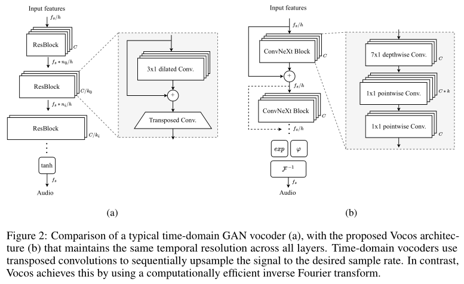
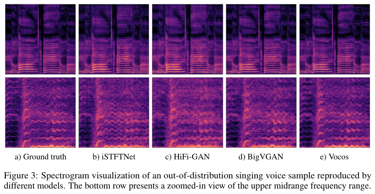

# Vocos: Closing the Gap between Time-Domain and Fourier-Based Neural Vocoders for High-Quality Audio Synthesis

基本信息

- 标题: Vocos: Closing the Gap between Time-Domain and Fourier-Based Neural Vocoders for High-Quality Audio Synthesis
- 作者:
  - [Hubert Siuzdak](../../Authors/Hubert_Siuzdak.md)
- 机构:
  - [Gemelo AI](../../Institutions/Gemolo.AI.md)
- 时间:
  - 2023.06.01 ArXiv v1
  - 2023.10.03 ArXiv v2
  - 2024.05.29 ArXiv v3
- 发表:
  - 2024.01.16 [ICLR2024](../../Publications/ICLR.md) Accepted (Poster) 5/8/5/6
- 链接:
  - [ArXiv](https://arxiv.org/abs/2306.00814)
  - [Demo](https://gemelo-ai.github.io/vocos/)
  - [Github](https://github.com/gemelo-ai/vocos)
- 标签:
  - [声码器](../../Tags/Vocoder.md)
  - [开源](../../Tags/OpenSource.md)
- 页数: 15
- 引用: ?
- 被引: 11

## Abstract·摘要

原文

> Recent advancements in neural vocoding are predominantly driven by Generative Adversarial Networks (GANs) operating in the time-domain.
> While effective, this approach neglects the inductive bias offered by time-frequency representations, resulting in redundant and computationally-intensive upsampling operations.
> Fourier-based time-frequency representation is an appealing alternative, aligning more accurately with human auditory perception, and benefitting from well-established fast algorithms for its computation.
> Nevertheless, direct reconstruction of complex-valued spectrograms has been historically problematic, primarily due to phase recovery issues.
> This study seeks to close this gap by presenting Vocos, a new model that directly generates Fourier spectral coefficients.
> Vocos not only matches the state-of-the-art in audio quality, as demonstrated in our evaluations, but it also substantially improves computational efficiency, achieving an order of magnitude increase in speed compared to prevailing time-domain neural vocoding approaches.
> The source code and model weights have been open-sourced at https://github.com/gemelo-ai/vocos.

 

神经声码器的近期进展主要由在时域中运行的生成对抗网络驱动.
尽管有效, 但这一方法忽略了由时频表示提供的归纳偏置, 导致冗余且计算密集的上采样操作.
基于傅里叶的时频表示是一个吸引人的替代方案, 它能更准确地与人类听觉感知相吻合, 并受益于计算其的成熟快速算法.
然而, 直接重建复值频谱图一直是个历史问题, 主要是因为相位恢复的难题.
本研究旨在通过提出 Vocos 来填补这一空白, Vocos 是一种直接生成傅里叶谱系数的新模型.
Vocos 不仅在评估中证明了其音频质量和当前最先进水平相媲美, 而且显著提高了计算效率, 与主流的时域神经声码器方法相比, 速度提高了几个数量级.
源代码和模型权重已在 https://github.com/gemelo-ai/vocos 开放.

## 1.Introduction

原文

> Sound synthesis, the process of generating audio signals through electronic and computational means, has a long and rich history of innovation .
> Within the scope of text-to-speech (TTS), concatenative synthesis (Moulines & Charpentier, 1990; Hunt & Black, 1996) and statistical parametric synthesis (Yoshimura et al., 1999) were the prevailing approaches.
> The latter strategy relied on a source-filter theory of speech production, where the speech signal was seen as being produced by a source (the vocal cords) and then shaped by a filter (the vocal tract).
> In this framework, various parameters such as pitch, vocal tract shape, and voicing were estimated and then used to control a vocoder (Dudley, 1939) which would reconstruct the final audio signal.
> While vocoders evolved significantly (Kawahara et al., 1999; [WORLD](../../Models/TTS3_Vocoder/2016.07.01_WORLD.md)), they tended to oversimplify speech production, generating a distinctive ”buzzy” sound and thus compromising the naturalness of the speech.

> A significant breakthrough in speech synthesis was achieved with the introduction of [WaveNet](../../Models/TTS3_Vocoder/2016.09.12_WaveNet.md), a deep generative model for raw audio waveforms.
> WaveNet proposed a novel approach to handle audio signals by modeling them autoregressively in the time-domain, using dilated convolutions to broaden receptive fields and consequently capture long-range temporal dependencies.
> In contrast to the traditional parametric vocoders which incorporate prior knowledge about audio signals, WaveNet solely depends on end-to-end learning.

> Since the advent of WaveNet, modeling distribution of audio samples in the time-domain has become the most popular approach in the field of audio synthesis.
> The primary methods have fallen into two major categories: autoregressive models and non-autoregressive models.
> Autoregressive models, like WaveNet, generate audio samples sequentially, conditioning each new sample on all previously generated ones ([SampleRNN](../../Models/TTS3_Vocoder/2016.12.22_SampleRNN.md); [WaveRNN](../../Models/TTS3_Vocoder/2018.02.23_WaveRNN.md); [LPCNet](../../Models/TTS3_Vocoder/2018.10.28_LPCNet.md)).
> On the other hand, non-autoregressive models generate all samples independently, parallelizing the process and making it more computationally efficient ([Parallel WaveNet](../../Models/TTS3_Vocoder/2017.11.28_Parallel_WaveNet.md); [WaveGlow](../../Models/TTS3_Vocoder/2018.10.31_WaveGlow.md); Donahue et al., 2018).

 

声音合成, 即通过电子和计算手段生成音频信号的过程, 拥有一段漫长且丰富的创新历史.
在文本到语音 (TTS) 的领域内, 连接合成 (Moulines & Charpentier, 1990; Hunt & Black, 1996) 和统计参数合成 (Yoshimura et al., 1999) 曾是主流方法.
后一种策略依赖于语音产生的源滤波理论, 其中语音信号被视为由源 (声带) 产生, 然后通过滤波器 (声道) 塑形.
在这一框架中, 诸如音高, 声道形状和发声等各类参数被估算, 并用于控制声码器 (Dudley, 1939), 后者将重构最终的音频信号.
尽管声码器经历了显著的演进 (Kawahara et al., 1999; Morise et al., 2016), 它们往往过度简化语音产生过程, 产生一种独特的“嗡嗡”声, 从而损害了语音的自然度.

语音合成领域的一个重要突破是 WaveNet 的引入, 这是一种用于原始音频波形的深度生成模型.
WaveNet提出了一种新颖的方法来处理音频信号, 通过在时域中自回归地建模它们, 使用膨胀卷积来扩大感受野, 从而捕捉长距离的时间依赖性.
与传统的包含音频信号先验知识的参数声码器不同, WaveNet完全依赖于端到端学习.

自WaveNet问世以来, 在时域中建模音频样本分布已成为音频合成领域最流行的方法.
主要方法可以分为两大类：自回归模型和非自回归模型.
自回归模型, 如WaveNet, 按顺序生成音频样本, 每个新样本都依赖于所有先前生成的样本 (Mehri et al., 2016; Kalchbrenner et al., 2018;) .
另一方面, 非自回归模型独立生成所有样本, 并行化过程, 使其在计算上更高效 (Oord et al., 2018; Prenger et al., 2019; Donahue et al., 2018) .

### 1.1.Challenges of Modeling Phase Spectrum

原文

> Despite considerable advancements in time-domain audio synthesis, efforts to generate spectral representations of signals have been relatively limited.
> While it’s possible to perfectly reconstruct the original signal from its Short-Time Fourier Transform (STFT), in many applications, only the magnitude of the STFT is utilized, leading to inherent information loss.
> The magnitude of the STFT provides a clear understanding of the signal by indicating the amplitude of different frequency components throughout its duration.
> In contrast, phase information is less intuitive and its manipulation can often yield unpredictable results.

> Modeling the phase distribution presents challenges due to its intricate nature in the time-frequency domain.
> Phase spectrum exhibits a periodic structure causing wrapping around the principal values within the range of $(−\pi, \pi]$ (Figure 1).
> Furthermore, the literature does not provide a definitive answer regarding the perceptual importance of phase-related information in speech (Wang & Lim, 1982; Paliwal et al., 2011).
> However, improved phase spectrum estimates have been found to minimize perceptual impairments (Saratxaga et al., 2012).
> Researchers have explored the use of deep learning for directly modeling the phase spectrum, but this remains a challenging area (Williamson et al., 2015).

 

尽管在时域音频合成方面取得了显著进展, 但对于生成信号频谱表示的努力相对有限.
虽然可以从其短时傅里叶变换 (STFT) 完美重建原始信号, 但在许多应用中, 仅使用STFT的幅度, 导致固有信息丢失.
STFT的幅度通过指示信号持续时间内不同频率成分的振幅, 提供了对信号的清晰理解.
相比之下, 相位信息不那么直观, 其操纵往往会产生不可预测的结果.

由于相位在时频域中的复杂性质, 建模相位分布存在挑战.
相位谱表现出周期性结构, 导致在 $(−\pi, \pi]$ 范围内围绕主值缠绕 (图 01) .

此外, 文献中对于语音中与相位相关的信息感知重要性没有给出明确的答案 (Wang & Lim, 1982; Paliwal et al., 2011) .
然而, 改进的相位谱估计已被发现可以最小化感知损伤 (Saratxaga et al., 2012) .
研究人员已经探索了使用深度学习直接建模相位谱的方法, 但这仍然是一个具有挑战性的领域 (Williamson et al., 2015) .

### 1.2.Contribution

原文

> Attempts to model Fourier-related coefficients with generative models have not achieved the same level of success as has been seen with modeling audio in the time-domain.
> This study focuses on bridging that gap with the following contributions:
> - We propose Vocos – a GAN-based vocoder, trained to produce complex STFT coefficients of an audio clip.
> Unlike conventional neural vocoder architectures that rely on transposed convolutions for upsampling, this work proposes maintaining the same feature temporal resolution across all layers.
> The upsampling to waveform is realized through the Inverse Fast Fourier Transform.
> - To estimate phase angles, we propose a simple activation function defined in terms of a unit circle.
> This approach naturally incorporates implicit phase wrapping, ensuring meaningful values across all phase angles.
> - As Vocos maintains a low temporal resolution throughout the network, we revisited the need to use dilated convolutions, typical to time-domain vocoders.
> Our results indicate that integrating ConvNeXt (Liu et al., 2022) blocks contributes to better performance.
> - Our extensive evaluation shows that Vocos matches the state-of-the-art in audio quality while demonstrating over an order of magnitude increase in speed compared to time-domain counterparts.
> The source code and model weights have been made open-source, enabling further exploration and potential advancements in the field of neural vocoding.

 

尝试使用生成模型对与傅里叶相关的系数进行建模的努力, 并未达到与时域中建模音频相同的成功水平.
本研究旨在通过以下贡献来弥合这一差距：
- 我们提出了Vocos——一种基于GAN的声码器, 训练用于生成音频片段的复数STFT系数.
与依赖转置卷积进行上采样的传统神经声码器架构不同, 本工作建议在所有层中保持相同的特征时间分辨率.
波形的上采样通过逆快速傅里叶变换实现.
- 为了估计相位角, 我们提出了一种简单的激活函数, 其定义基于单位圆.
这种方法自然地包含了隐式的相位缠绕, 确保所有相位角都具有有意义的值.
- 由于Vocos在整个网络中保持较低的时间分辨率, 我们重新审视了使用膨胀卷积的需求, 这是时域声码器的典型特征.
我们的结果表明, 整合ConvNeXt (Liu et al., 2022) 块有助于提高性能.
- 我们的广泛评估显示, Vocos在音频质量上与当前最先进水平相匹配, 同时与时域对应方法相比, 速度提高了几个数量级.
源代码和模型权重已开源, 为该领域的进一步探索和潜在进展提供了可能.

## 2.Related Works

原文

> ### GAN-based vocoders 
> [Generative Adversarial Networks (GANs)](../_Basis/2014.06.10_GAN.md), have achieved significant success in image generation, sparking interest from audio researchers due to their ability for fast and parallel waveform generation (Donahue et al., 2018; Engel et al., 2018).
> Progress was made with the introduction of advanced critics, such as the multi-scale discriminator (MSD) (Kumar et al., 2019) and the multi-period discriminator (MPD) ([HiFi-GAN](../../Models/TTS3_Vocoder/2020.10.12_HiFi-GAN.md)).
> These works also adopted a feature-matching loss to minimize the distance between the discriminator feature maps of real and synthetic audio.
> To discriminate between real and generated samples, also multi-resolution spectrograms (MRD) were employed (Jang et al., 2021).

> At this point the standard practice involves using a stack of dilated convolutions to increase the receptive field, and transposed convolutions to sequentially upsample the feature sequence to the waveform.
> However, this design is known to be susceptible to aliasing artifacts, and there are works suggesting more specialized modules for both the discriminator (Bak et al., 2022) and generator (Lee et al., 2022).
> The historical jump in quality is largely attributed to discriminators that are able to capture implicit structures by examining input audio signal at various periods or scales.
> It has been argued (You et al., 2021) that the architectural details of the generators do not significantly affect the vocoded outcome, given a well-established multi-resolution discriminating framework.
> Contrary to these methods, Vocos presents a carefully designed, frequency-aware generator that models the distribution of Fourier spectral coefficients, rather than modeling waveforms in the time domain.

 

**基于GAN的声码器**
生成对抗网络 (GANs) 在图像生成方面取得了显著成功, 由于其能够快速并行生成波形, 引起了音频研究人员的兴趣 (Donahue et al., 2018; Engel et al., 2018) .
随着先进批评器的引入, 如多尺度判别器 (MSD)  (Kumar et al., 2019) 和多周期判别器 (MPD), 取得了进展.
这些工作还采用了特征匹配损失来最小化真实音频和合成音频的判别器特征图之间的距离.
为了区分真实和生成的样本, 还使用了多分辨率频谱图 (MRD)  (Jang et al., 2021) .

目前, 标准做法涉及使用一叠膨胀卷积来增加感受野, 并使用转置卷积来顺序上采样特征序列到波形.
然而, 这种设计容易受到混叠伪影的影响, 并且有工作建议为判别器 (Bak et al., 2022) 和生成器 (Lee et al., 2022) 使用更专门的模块.
质量的历史性飞跃主要归功于能够通过在不同周期或尺度上检查输入音频信号来捕捉隐式结构的判别器.
有人认为 (You et al., 2021), 在建立的多分辨率判别框架下, 生成器的架构细节对声码结果的影响不大.
与这些方法相反, Vocos提出了一种精心设计的, 频率感知的生成器, 它建模傅里叶谱系数的分布, 而不是在时域中建模波形.

原文

> ### Phase and Magnitude Estimation 
> Historically, the phase estimation problem has been at the core of audio signal reconstruction.
> Traditional methods usually rely on the Griffin-Lim algorithm (Griffin & Lim, 1984), which iteratively estimate the phase by enforcing spectrogram consistency.
> However, the Griffin-Lim method introduces unnatural artifacts into synthesized speech.
> Several methods have been proposed for reconstructing phase using deep neural networks, including likelihood-based approaches (Takamichi et al., 2018) and GANs (Oyamada et al., 2018).
> Another line of work suggests perceptual phase quantization (Kim, 2003), which has proven promising in deep learning by treating the phase estimation problem as a classification problem (Takahashi et al., 2018).

> Despite their effectiveness, these models assume the availability of a full-scale magnitude spectrogram, while modern audio synthesis pipelines often employ more compact representations, such as mel-spectrograms (Shen et al., 2018).
> Furthermore, recent research is focusing on leveraging latent features extracted by pretrained deep learning models (Polyak et al., 2021; Siuzdak et al., 2022).

> Closer to this paper are studies that estimate both the magnitude and phase spectrum.
> This can be done either implicitly, by predicting the real and imaginary parts of the STFT, or explicitly, by parameterizing the model to generate the phase and magnitude components.
> In the former category, Gritsenko et al. (2020) presents a variant of a model trained to produce STFT coefficients.
> They recognized the significance of adversarial objective in preventing robotic sound quality, however they were unable to train it successfully due to its inherent instability.
> On the other hand, iSTFTNet (Kaneko et al., 2022) proposes modifications to HiFi-GAN, enabling it to return magnitude and phase spectrum.
> However, their optimal model only replaces the last two upsample blocks with inverse STFT, leaving the majority of the upsampling to be realized with transposed convolutions.
> They find that replacing more upsampling layers drastically degrades the quality.
> Pasini & Schl¨uter (2022) were able to successfully model the magnitude and phase spectrum of audio with higher frequency resolution, although it required multi-step training (Caillon & Esling, 2021), because of the adversarial objective instability.
> Also, the initial studies using GANs to generate invertible spectrograms involved estimating instantaneous frequency (Engel et al., 2018).
> However, these were limited to a single dataset containing only individual musical instrument notes, with the assumption of a constant instantaneous frequency.

 

**相位和幅度估计**
历史上, 相位估计问题一直是音频信号重建的核心.
传统方法通常依赖于Griffin-Lim算法 (Griffin & Lim, 1984), 该算法通过强制频谱图一致性迭代估计相位.
然而, Griffin-Lim方法在合成语音中引入了不自然的伪影.
已经提出了几种使用深度神经网络重建相位的方法, 包括基于似然的方法 (Takamichi et al., 2018) 和GANs (Oyamada et al., 2018) .
另一系列工作建议感知相位量化 (Kim, 2003), 通过将相位估计问题视为分类问题, 在深度学习中已被证明是有前途的 (Takahashi et al., 2018) .

尽管这些模型有效, 但它们假设可以使用全尺度幅度频谱图, 而现代音频合成管道通常采用更紧凑的表示, 如梅尔频谱图 (Shen et al., 2018) .
此外, 最近的研究集中在利用预训练深度学习模型提取的潜在特征上 (Polyak et al., 2021; Siuzdak et al., 2022) .

与本文更接近的是估计幅度和相位谱的研究.
这可以通过隐式地预测STFT的实部和虚部, 或者显式地参数化模型以生成相位和幅度组件来完成.
在前一类中, Gritsenko et al. (2020) 提出了一种模型变体, 训练用于生成STFT系数.
他们认识到对抗性目标在防止机器人声音质量方面的重要性, 但由于其固有的不稳定性, 他们无法成功训练它.
另一方面, iSTFTNet (Kaneko et al., 2022) 提出了对HiFi-GAN的修改, 使其能够返回幅度和相位谱.
然而, 他们的最佳模型仅用逆STFT替换了最后两个上采样块, 将大部分上采样留给转置卷积实现.
他们发现, 替换更多的上采样层会大大降低质量.
Pasini & Schl¨uter (2022) 能够成功地对具有更高频率分辨率的音频的幅度和相位谱进行建模, 尽管由于对抗性目标的不稳定性, 它需要多步骤训练 (Caillon & Esling, 2021) .
此外, 最初使用GAN生成可逆频谱图的研究涉及估计瞬时频率 (Engel et al., 2018) .
然而, 这些研究仅限于包含单个乐器音符的单个数据集, 并假设瞬时频率恒定.

## 3.Methodology

### 3.1.Overview

原文

> At its core, the proposed GAN model uses Fourier-based time-frequency representation as the target data distribution for the generator.
> Vocos is constructed without any transposed convolutions; instead, the upsample operation is realized solely through the fast inverse STFT.
> This approach permits a unique model design compared to time-domain vocoders, which typically employ a series of upsampling layers to inflate input features to the target waveform’s resolution, often necessitating upscaling by several hundred times.
> In contrast, Vocos maintains the same temporal resolution throughout the network (Figure 2).
> This design, known as an isotropic architecture, has been found to work well in various settings, including [Transformer](../../Models/_Basis/2017.06.12_Transformer.md).
> This approach can also be particularly beneficial for audio synthesis.
> Traditional methods often use transposed convolutions that can introduce aliasing artifacts, necessitating additional measures to mitigate the issue (Karras et al., 2021; Lee et al., 2022).
> Vocos eliminates learnable upsampling layers, and instead employs the well-establish inverse Fourier transform to reconstruct the original-scale waveform.
> In the context of converting mel-spectrograms into audio signal, the temporal resolution is dictated by the hop size of the STFT.

> Vocos uses the Short-Time Fourier Transform (STFT) to represent audio signals in the time-frequency domain:

$$
  STFT_{x}[m,k]=\sum_{n=0}^{N-1} x[n] w[n-m] e^{-j2\pi kn/N} \tag{01}
$$

> The STFT applies the Fourier transform to successive windowed sections of the signal.
> In practice, the STFT is computed by taking a sequence of Fast Fourier Transforms (FFTs) on overlapping, windowed frames of data, which are created as the window function advances or “hops” through time.

 

在核心部分, 所提出的GAN模型使用基于傅里叶的时频表示作为生成器的目标数据分布.
Vocos 的构建不包含任何转置卷积；相反, 上采样操作仅通过快速逆STFT实现.
这种方法与通常采用一系列上采样层将输入特征膨胀到目标波形分辨率的时域声码器相比, 允许了一种独特的模型设计, 通常需要数百倍的上采样.
相比之下, Vocos 在整个网络中保持相同的时间分辨率 (图 02) .

这种设计, 称为各向同性架构, 已在包括 Transformer 在内的各种设置中被发现效果良好.
这种方法对音频合成也可能特别有益.
传统方法通常使用转置卷积, 这可能引入混叠伪影, 需要采取额外措施来缓解问题 (Karras et al., 2021; Lee et al., 2022) .
Vocos 消除了可学习的上采样层, 并改用已建立的逆傅里叶变换来重建原始尺度的波形.
在将梅尔频谱图转换为音频信号的上下文中, 时间分辨率由STFT的跳跃大小决定.

Vocos 使用短时傅里叶变换 (STFT) 在时频域中表示音频信号：

$$
  STFT_{x}[m,k]=\sum_{n=0}^{N-1} x[n] w[n-m] e^{-j2\pi kn/N} \tag{01}
$$

STFT对信号的连续窗口化部分应用傅里叶变换.
实际上, STFT通过对重叠的, 窗口化的数据帧序列进行一系列快速傅里叶变换 (FFTs) 来计算, 这些数据帧随着窗口函数在时间上推进或“跳跃”而创建.

### 3.2.Model

原文

> #### Backbone 
> Vocos adapts ConvNeXt (Liu et al., 2022) as the foundational backbone for the generator.
> It first embeds the input features into a hidden dimensionality and then applies a stack of 1D convolutional blocks.
> Each block consists of a depthwise convolution, followed by an inverted bottleneck that projects features into a higher dimensionality using pointwise convolution.
> GELU (Gaussian Error Linear Unit) activations are used within the bottleneck, and Layer Normalization is employed between the blocks.

 

#### 主干网络

Vocos 将 ConvNeXt 作为生成器的基础主干.
它首先将输入特征嵌入到隐藏维度中, 之后应用一维卷积块的堆叠.
每个块由深度可分离卷积和反向瓶颈组成, 后者使用逐点卷积将特征投影到更高维度.
瓶颈内使用高斯误差线性单元 (Gaussian Error Linear Unit, GELU) 激活函数, 块之间应用层归一化.

原文

> #### Head 
> Fourier transform of real-valued signals is conjugate symmetric, so we use only a single side band spectrum, resulting in $n_{fft}/2 + 1$ coefficients per frame.
> As we parameterize the model to output phase and magnitude values, hidden-dim activations are projected into a tensor $h$ with $n_{fft}+2$ channels and splitted into:

$$
  m, p = h[1:(n_{fft}/2+1)], h[(n_{fft}/2+2):n]
$$

> To represent the magnitude, we apply the exponential function to $m$: $M = \exp(m)$.

> We map $p$ onto the unit circle by calculating the cosine and sine of $p$ to obtain $x$ and $y$, respectively:

$$
  x=\cos(p), y=\sin(p)
$$

> Finally, we represent complex-valued coefficients as: $STFT = M · (x + jy)$.

> Importantly, this simple formulation allows to express phase angle $\phi = \arctan2(y, x)$ for any real argument $p$, and it ensures that $\phi$ is correctly wrapped into the desired range $(−\pi, \pi]$.

 

#### 头部

实值信号的傅里叶变换是共轭对称的, 因此只使用单侧带谱, 因此每帧有 $n_{fft}/2 + 1$ 个系数.
由于我们参数化模型以输出相位和幅度值, 隐藏维度的激活值被投影到张量 $h$ 中, 其有 $n_{fft}+2$ 个通道, 并被分割为:

$$
  m, p = h[1:(n_{fft}/2+1)], h[(n_{fft}/2+2):n]
$$

为了表示幅度, 我们对 $m$ 应用指数函数: $M = \exp(m)$.

我们将 $p$ 映射到单位圆上, 通过计算 $p$ 的余弦和正弦来获得 $x$ 和 $y$:

$$
  x=\cos(p), y=\sin(p)
$$

最后, 我们用复数值系数表示: $STFT = M · (x + jy)$.

重要的是, 这一简单的形式能够表示相位角 $\phi = \arctan2(y, x)$, 对于任何实参数 $p$, 并确保 $\phi$ 被正确包装到所需范围 $(−\pi, \pi]$ 中.

原文

> #### Discriminator 
> We employ the multi-period discriminator (MPD) as defined by Kong et al. (2020), and multi-resolution discriminator (MRD) (Jang et al., 2021).

 

#### 判别器

我们采用了由 Kong et al. (2020) 定义的多周期判别器 (MPD) 和多分辨率判别器 (MRD) (Jang et al., 2021).

### 3.3.Loss

原文

> Following the approach proposed by Kong et al. (2020), the training objective of Vocos consists of reconstruction loss, adversarial loss and feature matching loss.
> However, we adopt a hinge loss formulation instead of the least squares GAN objective, as suggested by Zeghidour et al. (2021):

$$
  Loss_{G}(\hat{x}) = \dfrac{1}{K}\sum_{k} \max(0, 1-D_{k}(\hat{x}))
$$

$$
  Loss_{D}(x,\hat{x}) = \dfrac{1}{K}\sum_{k} \max(0,1-D_{k}(x))+\max(0,1+D_{k}(\hat{x}))
$$

> where $D_{k}$ is the $k$-th subdiscriminator.
> The reconstruction loss, denoted as $Loss_{mel}$, is defined as the $L_1$ distance between the mel-scaled magnitude spectrograms of the ground truth sample $x$ and the synthesized sample: $\hat{x}$: 

$$
  Loss_{mel} = \|M(x) − M(\hat{x})\|_{1}.
$$

> The feature matching loss, denoted as $L_{feat}$ is calculated as the mean of the distances between the lth feature maps of the kth subdistriminator: 

$$
  Loss_{feat} = \dfrac{1}{KL}\sum_{k}\sum_{l}\|D_{k}^{l}(x)-D_{k}^{l}(\hat{x})\|_{1}.
$$

 

遵循 Kong 等人的方法, Vocos 的训练目标由重构损失, 对抗损失, 特征匹配损失组成.
然而, 我们使用合页损失形式而不是最小二乘 GAN 目标, 如 Zeghidour 等人建议的那样:

$$
  Loss_{G}(\hat{x}) = \dfrac{1}{K}\sum_{k} \max(0, 1-D_{k}(\hat{x}))
$$

$$
  Loss_{D}(x,\hat{x}) = \dfrac{1}{K}\sum_{k} \max(0,1-D_{k}(x))+\max(0,1+D_{k}(\hat{x}))
$$

其中 $D_{k}$ 是第 $k$ 个子判别器.

重构损失, 记为 $Loss_{mel}$, 定义为真实样本 $x$ 和合成样本 $\hat{x}$ 的梅尔频谱图的 $L_1$ 距离:

$$
  Loss_{mel} = \|M(x) − M(\hat{x})\|_{1}.
$$

特征匹配损失, 记为 $Loss_{feat}$, 计算为第 $k$ 个子判别器的第 $l$ 个特征图之间的距离的均值:

$$
  Loss_{feat} = \dfrac{1}{KL}\sum_{k}\sum_{l}\|D_{k}^{l}(x)-D_{k}^{l}(\hat{x})\|_{1}.
$$

## 4.Results

### 4.1.Mel-Spectrograms

原文

> Reconstructing audio waveforms from mel-spectrograms has become a fundamental task for vocoders in contemporary speech synthesis pipelines.
> In this section, we assess the performance of Vocos relative to established baseline methods.

> #### Data 
> The models are trained on the [LibriTTS dataset](../../Datasets/2019.04.05_LibriTTS.md), from which we use the entire training subset (both train-clean and train-other).
> We maintain the original sampling rate of 24 kHz for the audio files.
> For each audio sample, we compute mel-scaled spectrograms using parameters: $n_{fft} = 1024$, $hop_{n} = 256$, and the number of Mel bins is set to $100$.
> A random gain is applied to the audio samples, resulting in a maximum level between $-1$ and $-6$ dBFS.

> #### Training Details 
> We train our models up to 2 million iterations, with 1 million iterations per generator and discriminator.
> During training, we randomly crop the audio samples to $16384$ samples and use a batch size of $16$.
> The model is optimized using the AdamW optimizer with an initial learning rate of $2\times 10^{-4}$ and betas set to $(0.9, 0.999)$.
> The learning rate is decayed following a cosine schedule.

> ##### Baseline Methods 
> Our proposed model, Vocos, is compared to: iSTFTNet (Kaneko et al., 2022), BigVGAN (Lee et al., 2022), and [HiFi-GAN](../../Models/TTS3_Vocoder/2020.10.12_HiFi-GAN.md).
> These models are retrained on the same LibriTTS subset for up to 2 million iterations, following the original training details recommended by the authors.
> We use the official implementations of BigVGAN1 and HiFi-GAN2, and a community open-sourced version of iSTFTNet3.

 

从梅尔频谱图重建音频波形已成为当代语音合成管道中声码器的基本任务.
在本节中, 我们评估Vocos相对于已建立的基线方法的性能.

#### 数据
模型在 [LibriTTS数据集](../../Datasets/2019.04.05_LibriTTS.md) 上进行训练, 我们使用了整个训练子集 (包括train-clean和train-other) .
我们保持音频文件的原始采样率为 24 kHz.
对于每个音频样本, 我们使用参数 $n_{fft} = 1024$, $hop_{n} = 256$ 计算梅尔尺度频谱图, 梅尔仓的数量设置为 $100$.
对音频样本应用随机增益, 导致最大电平在 $-1$ 和 $-6$ dBFS 之间.

#### 训练细节
我们训练模型达到 200 万次迭代, 其中每个生成器和判别器各 100 万次迭代.
在训练期间, 我们随机将音频样本裁剪为 $16384$ 个样本, 并使用批量大小为 $16$.
模型使用 AdamW 优化器进行优化, 初始学习率为 $2\times 10^{-4}$, beta值设置为 $(0.9, 0.999)$.
学习率遵循余弦调度进行衰减.

#### 基线方法
我们提出的模型 Vocos 与以下模型进行了比较：iSTFTNet (Kaneko et al., 2022), BigVGAN (Lee et al., 2022), 和 HiFi-GAN.
这些模型在相同的 LibriTTS 子集上重新训练, 最多达到 200 万次迭代, 遵循作者推荐的原始训练细节.
我们使用了 BigVGAN 和 HiFi-GAN 的官方实现, 以及 iSTFTNet 的社区开源版本.

#### 4.1.1.Evaluation

原文

> ##### Objective Evaluation 
> For objective evaluation of our models, we employ the UTMOS (Saeki et al., 2022) automatic Mean Opinion Score (MOS) prediction system.
> Although UTMOS can yield scores highly correlated with human evaluations, it is restricted to 16 kHz sample rate.
> To assess perceptual quality, we also utilize ViSQOL (Chinen et al., 2020) in audio-mode, which operates in the full band.
> Our evaluation process also encompasses several other metrics, including the Perceptual Evaluation of Speech Quality (PESQ) (Rix et al., 2001), periodicity error, and the F1 score for voiced/unvoiced classification (V/UV F1), following the methodology proposed by Morrison et al. (2021).
> The results are presented in Table 1.
> Vocos achieves superior performance in most of the metrics compared to the other models.
> It obtains the highest scores in VISQOL and PESQ.
> Importantly, it also effectively mitigates the periodicity issues frequently associated with time-domain GANs.
> BigVGAN stands out as the closest competitor, especially in the UTMOS metric, where it slightly outperforms Vocos.

> In our ablation study, we examined the impact of specific design decisions on Vocos’s performance:
> - Vocos with absolute phase: In this variant, we predict phase angles using a tanh nonlinearity, scaled to fit within the range of $[−\pi, \pi]$.
> This formulation does not give the model an inductive bias regarding the periodic nature of phase, and the results show it leads to degraded quality.
> This finding emphasizes the importance of implicit phase wrapping in the effectiveness of Vocos.
> - Vocos with Snake activation: Although Snake (Ziyin et al., 2020) has been shown to enhance time-domain vocoders such as BigVGAN, in our case, it did not result in performance gains; in fact, it showed a slight decline.
> The primary purpose of the Snake function is to induce periodicity, addressing the limitations of time-domain vocoders.
> Vocos, on the other hand, explicitly incorporates periodicity through the use of Fourier basis functions, eliminating the need for specialized modules like Snake.
> - Vocos without ConvNeXt: Replacing ConvNeXt blocks with traditional ResBlocks with dilated convolutions, slightly lowers scores across all evaluated metrics.
> This finding highlights the integral role of ConvNeXt blocks in Vocos, contributing significantly to its overall success.

 

##### 客观评估
为了客观评估我们的模型, 我们采用了 UTMOS (Saeki et al., 2022) 自动平均意见得分 (MOS) 预测系统.
尽管 UTMOS 可以产生与人类评估高度相关的分数, 但它仅限于 16 kHz 采样率.
为了评估感知质量, 我们还使用了全频带操作的 ViSQOL (Chinen et al., 2020) 的音频模式.
我们的评估过程还包括其他几个指标, 包括语音质量感知评估 (PESQ)  (Rix et al., 2001), 周期性误差, 以及遵循 Morrison 等人 (2021) 提出的方法的浊音/清音分类 (V/UV F1) 的F1分数.
结果显示在表 01 中.

Vocos 在大多数指标上与其他模型相比表现更优.
它在 VISQOL 和 PESQ 上获得了最高分数.
重要的是, 它还有效地缓解了与时域GANs相关的周期性问题.
BigVGAN 作为最接近的竞争对手脱颖而出, 特别是在 UTMOS 指标上, 它略微超过了 Vocos.

在我们的消融研究中, 我们检查了特定设计决策对 Vocos 性能的影响：
- Vocos 与绝对相位：在这个变体中, 我们使用 tanh 非线性预测相位角, 缩放到范围 $[−\pi, \pi]$.
这种公式没有给模型关于相位周期性质的归纳偏置, 结果显示它导致质量下降.
这一发现强调了 Vocos 有效性中隐式相位缠绕的重要性.
- Vocos 与 Snake 激活：尽管 Snake (Ziyin et al., 2020) 已被证明可以增强 BigVGAN 等时域声码器, 但在我们的情况下, 它并没有导致性能提升；实际上, 它显示了轻微的下降.
Snake 函数的主要目的是诱导周期性, 解决时域声码器的局限性.
另一方面, Vocos 通过使用傅里叶基函数明确地包含了周期性, 消除了对 Snake 等专用模块的需求.
- Vocos 不带 ConvNeXt：用具有膨胀卷积的传统 ResBlocks 替换 ConvNeXt 块, 在所有评估指标上略微降低了分数.
这一发现强调了 ConvNeXt 块在 Vocos 中的核心作用, 对它的整体成功做出了重大贡献.

原文

> ##### Subjective Evaluation 
> We conducted crowd-sourced subjective assessments, using a 5-point Mean Opinion Score (MOS) to evaluate the naturalness of the presented recordings.
> Participants rated speech samples on a scale from 1 (’poor - completely unnatural speech’) to 5 (’excellent - completely natural speech’).
> Following (Lee et al., 2022), we also conducted a 5-point Similarity Mean Opinion Score (SMOS) between the reproduced and ground-truth recordings.
> Participants were asked to assign a similarity score to pairs of audio files, with a rating of 5 indicating ’Extremely similar’ and a rating of 1 representing ’Not at all similar’.

> To ensure the quality of responses, we carefully selected participants through a third-party crowdsourcing platform.
> Our criteria included the use of headphones, fluent English proficiency, and a declared interest in music listening as a hobby.
> A total of 1560 ratings were collected from 39 participants.

> The results are detailed in Table 2.
> Vocos performs on par with the state-of-the-art in both perceived quality and similarity.
> Statistical tests show no significant differences between Vocos and BigVGAN in MOS and SMOS scores, with p-values greater than 0.05 from the Wilcoxon signed-rank test.

 

##### 主观评估
我们进行了众包主观评估, 使用5点平均意见得分 (MOS) 来评估呈现录音的自然度.
参与者根据 1 ('差 - 完全不自然的语音') 到 5 ('优秀 - 完全自然的语音') 的评分标准对语音样本进行评分.
遵循 (Lee et al., 2022), 我们还进行了 5 点相似性平均意见得分 (SMOS), 比较重现录音和真实录音之间的相似性.
参与者被要求为成对的音频文件分配相似性得分, 评分5表示'极其相似', 评分1表示'完全不相似'.

为了确保响应质量, 我们通过第三方众包平台仔细选择了参与者.
我们的标准包括使用耳机, 流利的英语水平以及声明对音乐聆听作为爱好的兴趣.
总共从 39 名参与者那里收集了 1560 个评分.

结果详见表 02.

Vocos 在感知质量和相似性方面与当前最先进水平相当.
统计测试显示, 在 MOS 和 SMOS 分数上, Vocos 和 BigVGAN 之间没有显著差异, Wilcoxon 符号秩检验的 p 值大于 0.05.

原文

> ##### Out-of-Distribution Data 
> A crucial aspect of a vocoder is its ability to generalize to unseen acoustic conditions.
> In this context, we evaluate the performance of Vocos with out-of-distribution audio using the MUSDB18 dataset (Rafii et al., 2017), which includes a variety of multi-track music audio like vocals, drums, bass, and other instruments, along with the original mixture.
> The VISQOL scores for this evaluation are provided in Table 3.
> From the table, Vocos consistently outperforms the other models, achieving the highest scores across all categories.

> Figure 3 presents spectrogram visualization of an out-of-distribution singing voice sample, as reproduced by different models.
> Periodicity artifacts are commonly observed when employing time-domain GANs.
> BigVGAN, with its anti-aliasing filters, is able to recover some of the harmonics in the upper frequency ranges, marking an improvement over HiFi-GAN.
> Nonetheless, Vocos appears to provide a more accurate reconstruction of these harmonics, without the need for additional modules.

 

##### 分布外数据
声码器的一个重要方面是其能够泛化到未见过的声学条件.
在此背景下, 我们使用 MUSDB18 数据集 (Rafii et al., 2017) 评估了 Vocos 在分布外音频上的性能, 该数据集包括各种多轨音乐音频, 如人声, 鼓, 贝斯和其他乐器, 以及原始混合音轨.
此评估的 VISQOL 分数见表 03.

从表中可以看出, Vocos 在所有类别中始终优于其他模型, 取得了最高分数.

图 03 展示了由不同模型重现的分布外歌唱声音样本的频谱图可视化.
在使用时域 GAN 时, 周期性伪影是常见的.
BigVGAN 通过其抗混叠滤波器能够在高频范围内恢复一些谐波, 标志着对 HiFi-GAN 的改进.
尽管如此, Vocos 似乎提供了这些谐波的更准确重建, 无需额外的模块.

### 4.2.Neural Audio Codec

原文

> While traditionally, neural vocoders reconstruct the audio waveform from a mel-scaled spectrogram – an approach widely adopted in many speech synthesis pipelines – recent research has started to utilize learnt features (Siuzdak et al., 2022), often in a quantized form ([AudioLM](../../Models/Speech_LLM/2022.09.07_AudioLM.md)).

> In this section, we draw a comparison with [EnCodec](../../Models/Speech_Neural_Codec/2022.10.24_EnCodec.md), an open-source neural audio codec, which follows a typical time-domain GAN vocoder architecture and uses Residual Vector Quantization (RVQ) ([SoundStream](../../Models/Speech_Neural_Codec/2021.07.07_SoundStream.md)) to compress the latent space.
> RVQ cascades multiple layers of Vector Quantization, iteratively quantizing the residuals from the previous stage to form a multi-stage structure, thereby enabling support for multiple bandwidth targets.
> In [EnCodec](../../Models/Speech_Neural_Codec/2022.10.24_EnCodec.md), dedicated discriminators are trained for each bandwidth.
> In contrast, we have adapted Vocos to be a conditional GAN with a projection discriminator (Miyato & Koyama, 2018), and have incorporated adaptive layer normalization (Huang & Belongie, 2017) into the generator.

> #### Audio Reconstruction 
> We utilize the open-source model checkpoint of [EnCodec](../../Models/Speech_Neural_Codec/2022.10.24_EnCodec.md) operating at 24 kHz.
> To align with [EnCodec](../../Models/Speech_Neural_Codec/2022.10.24_EnCodec.md), we scale down Vocos to match its parameter count (7.9M) and train it on clean speech segments sourced from the DNS Challenge (Dubey et al., 2022).
> Our evaluation, conducted on the DAPS dataset (Mysore, 2014) and detailed in Table 4, reveals that despite [EnCodec](../../Models/Speech_Neural_Codec/2022.10.24_EnCodec.md)’s reconstruction artifacts not significantly impacting PESQ and Periodicity scores, they are considerably reflected in the perceptual score, as denoted by UTMOS.
> In this regard, Vocos notably outperforms [EnCodec](../../Models/Speech_Neural_Codec/2022.10.24_EnCodec.md).
> We also performed a crowd-sourced subjective assessment to evaluate the naturalness of these samples.
> The results, as shown in Table 5, indicate that Vocos consistently achieves better performance across a range of bandwidths, based on evaluations by human listeners.

> #### End-to-End Text-to-Speech 
> Recent progress in text-to-speech (TTS) has been notably driven by language modeling architectures employing discrete audio tokens.
> Bark (Suno AI, 2023), a widely recognized open-source model, leverages a GPT-style, decoder-only architecture, with [EnCodec](../../Models/Speech_Neural_Codec/2022.10.24_EnCodec.md)’s 6kbps audio tokens serving as its vocabulary.
> Vocos trained to reconstruct [EnCodec](../../Models/Speech_Neural_Codec/2022.10.24_EnCodec.md) tokens can effectively serve as a drop-in replacement vocoder for Bark.
> We have provided text-to-speech samples from Bark and Vocos on our website and encourage readers to listen to them for a direct comparison.4.

 

尽管传统上, 神经声码器从梅尔尺度频谱图重建音频波形——这种方法在许多语音合成管道中被广泛采用——但最近的研究已经开始利用学习到的特征 (Siuzdak et al., 2022), 通常以量化形式 ([AudioLM](../../Models/Speech_LLM/2022.09.07_AudioLM.md)).

在本节中, 我们将与 [EnCodec](../../Models/Speech_Neural_Codec/2022.10.24_EnCodec.md) (D'efossez et al., 2022) 进行比较, [EnCodec](../../Models/Speech_Neural_Codec/2022.10.24_EnCodec.md) 是一个开源的神经音频编解码器, 它遵循典型的时域GAN声码器架构, 并使用残差向量量化 (RVQ)  ([SoundStream](../../Models/Speech_Neural_Codec/2021.07.07_SoundStream.md)) 来压缩潜在空间.
RVQ通过多层向量量化级联, 迭代量化前一阶段的残差, 形成多级结构, 从而支持多个带宽目标.
在 [EnCodec](../../Models/Speech_Neural_Codec/2022.10.24_EnCodec.md) 中, 为每个带宽训练专门的判别器.
相比之下, 我们已经将 Vocos 适配为具有投影判别器 (Miyato & Koyama, 2018) 的条件 GAN, 并在生成器中集成了自适应层归一化 (Huang & Belongie, 2017) .

#### 音频重建
我们使用运行在 24 kHz 的 [EnCodec](../../Models/Speech_Neural_Codec/2022.10.24_EnCodec.md) 的开源模型检查点.
为了与 [EnCodec](../../Models/Speech_Neural_Codec/2022.10.24_EnCodec.md) 对齐, 我们将 Vocos 缩减到与其参数计数 (7.9M) 匹配, 并使用来自 DNS 挑战 (Dubey et al., 2022) 的干净语音段对其进行训练.
我们的评估在 DAPS 数据集 (Mysore, 2014) 上进行, 并在表 04 中详细说明, 揭示尽管 [EnCodec](../../Models/Speech_Neural_Codec/2022.10.24_EnCodec.md) 的重建伪影对 PESQ 和周期性分数的影响不大, 但它们在感知分数上得到了显著反映, 如 UTMOS 所示.

在这方面, Vocos 明显优于 [EnCodec](../../Models/Speech_Neural_Codec/2022.10.24_EnCodec.md).
我们还进行了一项众包主观评估, 以评估这些样本的自然度.
结果如表 05 所示, 表明根据人类听众的评估, Vocos 在各种带宽上始终表现更好.

#### 端到端文本到语音
文本到语音 (TTS) 的最新进展显著地由采用离散音频令牌的语言建模架构推动.
Bark (Suno AI, 2023) 是一个广泛认可的开源模型, 它利用了GPT风格的仅解码器架构, 其中 [EnCodec](../../Models/Speech_Neural_Codec/2022.10.24_EnCodec.md) 的 6 kbps 音频令牌作为其词汇.
训练用于重建 [EnCodec](../../Models/Speech_Neural_Codec/2022.10.24_EnCodec.md) 令牌的 Vocos 可以有效地作为 Bark 的即插即用替代声码器.
我们在我们的网站上提供了来自 Bark 和 Vocos 的文本到语音样本, 并鼓励读者直接比较它们.

### 4.3.Inference Speed

原文

> Our inference speed benchmarks were conducted using an Nvidia Tesla A100 GPU and an AMD EPYC 7542 CPU.
> The code was implemented in Pytorch, with no hardware-specific optimizations.

> The forward pass was computed using a batch of 16 samples, each one second long.
> Table 6 presents the synthesis speed and model footprint of Vocos in comparison to other models.

> Vocos showcases notable speed advantages compared to other models, operating approximately 13 times faster than HiFi-GAN and nearly 70 times faster than BigVGAN.
> This speed advantage is particularly pronounced when running without GPU acceleration.
> This is primarily due to the use of the Inverse Short-Time Fourier Transform (ISTFT) algorithm instead of transposed convolutions.
> We also evaluate a variant of Vocos that utilizes ResBlock’s dilated convolutions instead of ConvNeXt blocks.
> Depthwise separable convolutions offer an additional speedup when executed on a GPU.

 

我们的推理速度基准测试是在 Nvidia Tesla A100 GPU和AMD EPYC 7542 CPU 上进行的.
代码是用 Pytorch 实现的, 没有进行硬件特定的优化.

正向传递计算使用了一批 16 个样本, 每个样本一秒钟长.
表 06 展示了 Vocos 与其他模型相比的合成速度和模型足迹.

Vocos 展示了与其他模型相比显著的速度优势, 运行速度大约比 HiFi-GAN 快13倍, 比 BigVGAN 快近70倍.
在没有 GPU 加速的情况下, 这种速度优势尤其明显.
这主要是因为使用了逆短时傅里叶变换 (ISTFT) 算法而不是转置卷积.
我们还评估了 Vocos 的一个变体, 该变体使用 ResBlock 的膨胀卷积而不是 ConvNeXt 块.
当在GPU上执行时, 深度可分离卷积提供了额外的加速.

## 5.Conclusions

原文

> This paper introduces Vocos, a novel neural vocoder that bridges the gap between time-domain and Fourier-based approaches.
> Vocos tackles the challenges associated with direct reconstruction of complex-valued spectrograms, with careful design of generator that correctly handle phase wrapping.
> It achieves accurate reconstruction of the coefficients in Fourier-based time-frequency representations.

> The results demonstrate that the proposed vocoder matches state-of-the-art audio quality while effectively mitigating periodicity issues commonly observed in time-domain GANs.
> Importantly, Vocos provides a significant computational efficiency advantage over traditional time-domain methods by utilizing inverse fast Fourier transform for upsampling.

> Overall, the findings of this study contribute to the advancement of neural vocoding techniques by incorporating the benefits of Fourier-based time-frequency representations.
> The open-sourcing of the source code and model weights allows for further exploration and application of the proposed vocoder in various audio processing tasks.

 

本文介绍了 Vocos, 一种新颖的神经声码器, 它弥合了时域和基于傅里叶的方法之间的差距.
Vocos 解决了与直接重建复值频谱图相关的挑战, 通过精心设计的生成器正确处理相位缠绕.
它实现了基于傅里叶的时频表示中系数的准确重建.

结果表明, 所提出的声码器在音频质量上与当前最先进水平相匹配, 同时有效地缓解了在时域 GANs 中常见的周期性问题.
重要的是, Vocos 通过使用逆快速傅里叶变换进行上采样, 提供了比传统时域方法显著的计算效率优势.

总体而言, 本研究的发现通过结合基于傅里叶的时频表示的优点, 为神经声码技术的进步提供了贡献.
源代码和模型权重的开源允许对所提出的声码器在各种音频处理任务中进行进一步的探索和应用.

附录

## Appendix A.Modified Discrete Cosine Transform (MDCT)

> While STFT is widely used in audio processing, there are other time-frequency representations with different properties.
> In audio coding applications, it is desirable to design the analysis/synthesis system in such a way that the overall rate at the output of the analysis stage equals the rate of the input signal.
> Such systems are described as being critically sampled.
> When we transform the signal via the DFT, even a slight overlap between adjacent blocks increases the data rate of the spectral representation of the signal.
> With 50% overlap between adjoining blocks, we end up doubling our data rate.

> The Modified Discrete Cosine Transform (MDCT) with its corresponding Inverse Transform (IMDCT) have become a crucial tool in high-quality audio coding as they enable the implementation of a critically sampled analysis/synthesis filter bank.
> A key feature of these transforms is the Time-Domain Aliasing Cancellation (TDAC) property, which allows for the perfect reconstruction of overlapping segments from a source signal.

> The MDCT is defined as follows:

> for k = 0, 1, . . ., N − 1 and N is the length of the window.

> The MDCT is a lapped transform and thus produces N output coefficients from 2N input samples, allowing for a 50% overlap between blocks without increasing the data rate.

> There is a relationship between the MDCT and the DFT through the Shifted Discrete Fourier Transform (SDFT) (Wang & Vilermo, 2003).
> It can be leveraged to implement a fast version of the MDCT using FFT (Bosi & Goldberg, 2002).
> See Appendix A.3.

### A.1 VOCOS and MDCT

> MDCT is attractive in audio coding because of its its efficiency and compact representation of audio signals.
> In the context of deep learning, this might be seen as reduced dimensionality, potentially advantageous as it requires fewer data points during generation.

> While STFT coefficients can be conveniently expressed in polar form, providing a clear interpretation of both magnitude and phase, MDCT represents the signal only in a real subspace of the complex space needed to accurately convey spectral magnitude and phase.
> Naive approach would be to treat raw unnormalized hidden outputs of the network as MDCT coefficients and convert it back to time-domain with IMDCT.
> In our preliminary experiments we found that it led to slower convergence.
> However we can easily observe that the MDCT spectrum, similarly to the STFT, can be more perceptually meaningful on the logarithmic scale, which reflects the logarithmic nature of human auditory perception of sound intensity.
> But as the MDCT can take also negative values, they cannot be represented using the conventional logarithmic transformation.

> One solution is to utilize a symmetric logarithmic function.
> In the context of deep learning, Hafner et al. (2023) introduces such function and its inverse, referred to as symlog and symexp respectively:

> The symlog function compresses the magnitudes of large values, irrespective of their sign.
> Unlike the conventional logarithm, it is symmetric around the origin and retains the input sign.
> We note the correspondence with the µ-law companding algorithm, a well-established method in telecommunication and signal processing.

> An alternative approach involves parametrizing the model to output the absolute value of the MDCT coefficients and its corresponding sign.
> While the MDCT does not directly convey information about phase relationships, this strategy may offer advantages as the sign of the MDCT can potentially provide additional insights indirectly.
> For example, an opposite sign could imply a phase difference

