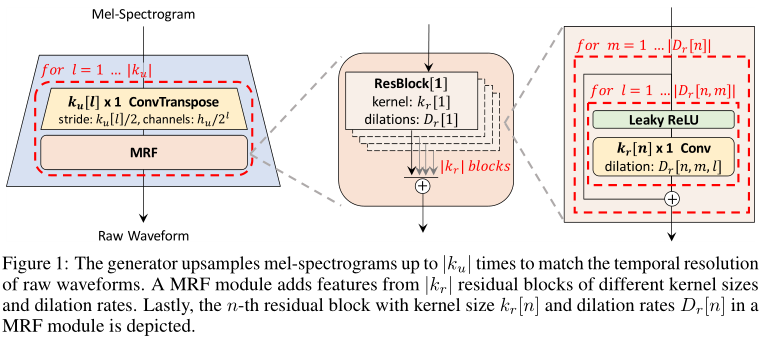

# HiFi-GAN:

<details>
<summary>基本信息</summary>

- 标题: "HiFi-GAN: Generative Adversarial Networks for Efficient and High Fidelity Speech Synthesis"
- 作者:
  - 01 Jungil Kong
  - 02 Jaehyeon Kim
  - 03 Jaekyoung Bae
- 链接:
  - [ArXiv](https://arxiv.org/abs/2010.05646)
  - [Publication](https://dl.acm.org/doi/abs/10.5555/3495724.3497152)
  - [Github](https://github.com/jik876/hifi-gan)
  - [Demo](https://jik876.github.io/hifi-gan-demo/)
- 文件:
  - [ArXiv](_PDF/2010.05646v2__HiFi-GAN__Generative_Adversarial_Networks_for_Efficient_&_High_Fidelity_Speech_Synthesis.pdf)
  - [Publication](_PDF/2010.05646p0__HiFi-GAN__NeurIPS2020.pdf)

</details>

## Abstract: 摘要

<table><tr><td width="50%">

Several recent work on speech synthesis have employed [Generative Adversarial Networks (GANs)](../_Basis/2014.06.10_GAN.md) to produce raw waveforms.
Although such methods improve the sampling efficiency and memory usage, their sample quality has not yet reached that of autoregressive and flow-based generative models.
In this work, we propose ***HiFi-GAN***, which achieves both efficient and high-fidelity speech synthesis.
As speech audio consists of sinusoidal signals with various periods, we demonstrate that modeling periodic patterns of an audio is crucial for enhancing sample quality.
A subjective human evaluation ([Mean Opinion Score, MOS](../../Evaluations/MOS.md)) of a single speaker dataset indicates that our proposed method demonstrates similarity to human quality while generating 22.05 kHz high-fidelity audio 167.9 times faster than real-time on a single V100 GPU.
We further show the generality of ***HiFi-GAN*** to the mel-spectrogram inversion of unseen speakers and end-to-end speech synthesis.
Finally, a small footprint version of ***HiFi-GAN*** generates samples 13.4 times faster than real-time on CPU with comparable quality to an autoregressive counterpart.

</td><td>

语音合成领域的几项近期工作都采用了生成对抗网络来生成原始波形.
尽管这种方法能够提升采样效率和内存利用, 它们的样本质量还没有达到自回归和基于流模型的生成模型的效果.
本项工作提出了 ***HiFi-GAN***, 能够实现高效和高质量的语音合成.
由于语音音频由具有不同周期的正弦信号组成, 我们演示了建模音频的周期模式对于增强样本质量十分重要.
单个说话人数据集的主观人类评估 MOS 表明本工作提出的方法生成的音频和人类质量相近, 且在单个 V100 GPU 上生成 22.05 kHz 高质量音频的速度比实时速度快 167.9 倍.
我们进一步展示了 ***HiFi-GAN*** 的泛化性, 即对未见过的发言人进行梅尔频谱的逆向工程, 以及端到端的语音合成.
最后, 我们提出了一种体积小的 ***HiFi-GAN*** 版本, 它在 CPU 上以与自回归模型相当的质量生成音频, 且生成速度比实时速度快 13.4 倍.

</td></tr></table>

## 1·Introduction: 引言

<details>
<summary>展开原文</summary>

Voice is one of the most frequent and naturally used communication interfaces for humans.
With recent developments in technology, voice is being used as a main interface in artificial intelligence (AI) voice assistant services such as Amazon Alexa, and it is also widely used in automobiles, smart homes and so forth.
Accordingly, with the increase in demand for people to converse with machines, technology that synthesizes natural speech like human speech is being actively studied.

Recently, with the development of neural networks, speech synthesis technology has made a rapid progress.
Most neural speech synthesis models use a two-stage pipeline:
1. predicting a low resolution intermediate representation such as mel-spectrograms (Shen et al., 2018, Ping et al., 2017, Li et al., 2019) or linguistic features ([Oord et al.(WaveNet·2016)](../Vocoder/2016.09.12_WaveNet.md)) from text,
2. synthesizing raw waveform audio from the intermediate representation ([Oord et al.(WaveNet·2016)](../Vocoder/2016.09.12_WaveNet.md), Prenger et al., 2019, Kumar et al., 2019).

The first stage is to model low-level representations of human speech from text, whereas the second stage model synthesizes raw waveforms with up to 24,000 samples per second and up to 16 bit fidelity.
In this work, we focus on designing a second stage model that efficiently synthesizes high fidelity waveforms from mel-spectrograms.

Various work have been conducted to improve the audio synthesis quality and efficiency of second stage models.
[WaveNet (2016)](../Vocoder/2016.09.12_WaveNet.md) is an autoregressive (AR) convolutional neural network that demonstrates the ability of neural network based methods to surpass conventional methods in quality..

However, because of the AR structure, WaveNet generates one sample at each forward operation; it is prohibitively slow in synthesizing high temporal resolution audio.
Flow-based generative models are proposed to address this problem.
Because of their ability to model raw waveforms by transforming noise sequences of the same size in parallel, flow-based generative models fully utilize modern parallel computing processors to speed up sampling.
[Parallel WaveNet (2019)](../Vocoder/2019.10.25_Parallel_WaveGAN.md) is an inverse autoregressive flow (IAF) that is trained to minimize its Kullback-Leibler divergence from a pre-trained WaveNet called a teacher.
Compared to the teacher model, it improves the synthesis speed to 1,000 times or more, without quality degradation.
[WaveGlow (2018)](../Vocoder/2018.10.31_WaveGlow.md) eliminates the need for distilling a teacher model, and simplifies the learning process through maximum likelihood estimation by employing efficient bijective flows based on Glow (Kingma and Dhariwal, 2018).
It also produces high-quality audio compared to WaveNet.
However, it requires many parameters for its deep architecture with over 90 layers.

[Generative adversarial networks (GANs) (2014)](../_Basis/2014.06.10_GAN.md), which are one of the most dominant deep generative models, have also been applied to speech synthesis.
Kumar et al. (2019) proposed a multi-scale architecture for discriminators operating on multiple scales of raw waveforms.
With sophisticated architectural consideration, the MelGAN generator is compact enough to enable real-time synthesis on CPU.
Yamamoto et al. (2020) proposed multi-resolution STFT loss function to improve and stabilize GAN training and achieved better parameter efficiency and less training time than an IAF model, ClariNet (Ping et al., 2018).
Instead of mel-spectrograms, [GAN-TTS (2019)](../Vocoder/2019.09.25_GAN-TTS.md) successfully generates high quality raw audio waveforms from linguistic features through multiple discriminators operating on different window sizes.
The model also shows fewer FLOPs compared to Parallel WaveNet.
Despite the advantages, there is still a gap in sample quality between the GAN models and AR or flow-based models.

We propose ***HiFi-GAN***, which achieves both higher computational efficiency and sample quality than AR or flow-based models.
As speech audio consists of sinusoidal signals with various periods, modeling the periodic patterns matters to generate realistic speech audio.
Therefore, we propose a discriminator which consists of small sub-discriminators, each of which obtains only a specific periodic parts of raw waveforms.
This architecture is the very ground of our model successfully synthesizing realistic speech audio.
As we extract different parts of audio for the discriminator, we also design a module that places multiple residual blocks each of which observes patterns of various lengths in parallel, and apply it to the generator.

***HiFi-GAN*** achieves a higher MOS score than the best publicly available models, WaveNet and WaveGlow.
It synthesizes human-quality speech audio at speed of 3.7 MHz on a single V100 GPU.
We further show the generality of ***HiFi-GAN*** to the mel-spectrogram inversion of unseen speakers and end-to-end speech synthesis.
Finally, the tiny footprint version of ***HiFi-GAN*** requires only 0.92M parameters while outperforming the best publicly available models and the fastest version of ***HiFi-GAN*** samples 13.44 times faster than real-time on CPU and 1,186 times faster than real-time on single V100 GPU with comparable quality to an autoregressive counterpart.

Our audio samples are available on the demo web-site, and we provide the implementation as open source for reproducibility and future work.

</details>
<br>

## 2·Related Works: 相关工作

## 3·Methodology: 方法

### 2.1·Overview·概览

<details>
<summary>展开</summary>

***HiFi-GAN*** consists of one generator and two discriminators: multi-scale and multi-period discriminators.
The generator and discriminators are trained adversarially, along with two additional losses for improving training stability and model performance.

</details>
<br>

***HiFi-GAN*** 由一个生成器和两个判别器 (多尺度判别器, 多周期判别器) 组成.
生成器和判别器以对抗的方式训练, 并在训练过程中引入额外两种的损失以提高模型性能和稳定性.

### 2.2·Generator·生成器

<details>
<summary>展开原文</summary>

The generator is a fully convolutional neural network.
It uses a mel-spectrogram as input and upsamples it through transposed convolutions until the length of the output sequence matches the temporal resolution of raw waveforms.
Every transposed convolution is followed by a multi-receptive field fusion (MRF) module, which we describe in the next paragraph.
Fig.01 shows the architecture of the generator.
As in previous work (Mathieu et al., 2015, Isola et al., 2017, [MelGAN (2019)](../Vocoder/2019.10.08_MelGAN.md)), noise is not given to the generator as an additional input.

</details>
<br>

生成器采用全卷积神经网络.
它接收梅尔频谱作为输入, 通过转置卷积上采样直到输出序列的长度与原始波形的时间分辨率相匹配.
每个转置卷积后跟随一个**多感受野融合 (Multi-Receptive Field Fusion, MRF) 模块**, 将在下一段中进行介绍.
图 01 展示了生成器的架构.



- 第一个子图: 生成器对梅尔频谱上采样 $|k_u|$ 次以匹配原始波形的时间分辨率.
- 第二个子图: MRF 模块将来自具有不同卷积核大小和膨胀率的 $|k_r|$ 个残差块的输出特征相加.
- 第三个子图: MRF 模块中具有卷积核大小 $k_{r}[n]$ 和膨胀率 $D_{r}[n]$ 的第 $n$ 个残差块.

和之前的工作相同 (列举如下), 噪声不作为额外的输入传给生成器.

- Deep Multi-Scale Video Prediction Beyond Mean Square Error
- Image-to-Image Translation with Conditional Adversarial Networks
- MelGAN: Generative Adversarial Networks for Conditional Waveform Synthesis

<details>
<summary>代码</summary>

```python
class Generator(torch.nn.Module):
    def __init__(self, h):
        super(Generator, self).__init__()
        self.h = h
        self.num_kernels = len(h.resblock_kernel_sizes)
        self.num_upsamples = len(h.upsample_rates)
        self.conv_pre = weight_norm(Conv1d(80, h.upsample_initial_channel, 7, 1, padding=3))
        resblock = ResBlock1 if h.resblock == '1' else ResBlock2

        self.ups = nn.ModuleList()
        for i, (u, k) in enumerate(zip(h.upsample_rates, h.upsample_kernel_sizes)):
            self.ups.append(weight_norm(
                ConvTranspose1d(h.upsample_initial_channel//(2**i), h.upsample_initial_channel//(2**(i+1)),
                                k, u, padding=(k-u)//2)))

        self.resblocks = nn.ModuleList()
        for i in range(len(self.ups)):
            ch = h.upsample_initial_channel//(2**(i+1))
            for j, (k, d) in enumerate(zip(h.resblock_kernel_sizes, h.resblock_dilation_sizes)):
                self.resblocks.append(resblock(h, ch, k, d))

        self.conv_post = weight_norm(Conv1d(ch, 1, 7, 1, padding=3))
        self.ups.apply(init_weights)
        self.conv_post.apply(init_weights)

    def forward(self, x):
        x = self.conv_pre(x)
        for i in range(self.num_upsamples):
            x = F.leaky_relu(x, LRELU_SLOPE)
            x = self.ups[i](x)
            xs = None
            for j in range(self.num_kernels):
                if xs is None:
                    xs = self.resblocks[i*self.num_kernels+j](x)
                else:
                    xs += self.resblocks[i*self.num_kernels+j](x)
            x = xs / self.num_kernels
        x = F.leaky_relu(x)
        x = self.conv_post(x)
        x = torch.tanh(x)

        return x

    def remove_weight_norm(self):
        print('Removing weight norm...')
        for l in self.ups:
            remove_weight_norm(l)
        for l in self.resblocks:
            l.remove_weight_norm()
        remove_weight_norm(self.conv_pre)
        remove_weight_norm(self.conv_post)
```

</details>
<br>

#### Multi-Receptive Field Fusion (MRF) Fusion·多感受野融合

<details>
<summary>展开原文</summary>

We design the multi-receptive field fusion (MRF) module for our generator, which observes patterns of various lengths in parallel.
Specifically, MRF module returns the sum of outputs from multiple residual blocks.
Different kernel sizes and dilation rates are selected for each residual block to form diverse receptive field patterns.
The architectures of MRF module and a residual block are shown in Fig.01.
We left some adjustable parameters in the generator;
the hidden dimension $h_{u}$, kernel sizes $k_{u}$ of the transposed convolutions, kernel sizes $k_{r}$, and dilation rates $D_{r}$ of MRF modules can be regulated to match one’s own requirement in a trade-off between synthesis efficiency and sample quality.

</details>
<br>

我们为生成器设计了多感受野融合 (Multi-Receptive Field Fusion, MRF) 模块, 它能够并行地观察不同长度的模式.
具体来说, MRF 模块返回多个残差块的输出之和.
每个残差块采用不同的卷积核大小和膨胀率以形成多种感受野模式.
图 01 展示了 MRF 模块和残差块的架构.
我们在生成器中留下一些可调整的参数: 隐藏层维度 $h_{u}$, 转置卷积的卷积核大小 $k_{u}$, MRF 模块中的卷积核大小 $k_{r}$, 膨胀率 $D_{r}$, 这些参数可以根据个人需求进行调节, 以达到合理的合成效率和音频质量之间的平衡.

### 2.3·Discriminator·判别器

<details>
<summary>展开原文</summary>

Identifying long-term dependencies is the key for modeling realistic speech audio.
For example, a phoneme duration can be longer than 100 ms, resulting in high correlation between more than 2,200 adjacent samples in the raw waveform.
This problem has been addressed in the previous work (Donahue et al., 2018) by increasing receptive fields of the generator and discriminator.

</details>
<br>

识别长期依赖性是建模真实语音音频的关键所在.
例如, 一个音素持续时间可以超过 100 毫秒, 这使得原始波形中超过 2200 个相邻样本点间具有高度相关性.
这一问题在之前的工作 "Adversarial Audio Synthesis" (2018) 中通过增加生成器和判别器的感受野得到了解决.

<details>
<summary>展开原文</summary>

We focus on another crucial problem that has yet been resolved; as speech audio consists of sinusoidal signals with various periods, the diverse periodic patterns underlying in the audio data need to be identified.
To this end, we propose the multi-period discriminator (MPD) consisting of several sub-discriminators each handling a portion of periodic signals of input audio.
Additionally, to capture consecutive patterns and long-term dependencies, we use the **multi-scale discriminator (MSD)** proposed in [MelGAN (2019)](../Vocoder/2019.10.08_MelGAN.md), which consecutively evaluates audio samples at different levels.
We conducted simple experiments to show the ability of MPD and MSD to capture periodic patterns, and the results can be found in Appendix B.

</details>
<br>

我们主要关注另一个尚未解决的关键问题.
由于语音音频由具有各种周期的正弦信号组成, 因此需要识别音频数据中存在的各种不同周期模式.
为此, 我们提出了由数个子判别器组成的**多周期判别器 (Multi-Period Discriminator, MPD)**, 每个子判别器只处理输入音频周期信号的一部分.
此外, 为了捕获连续模式和长期依赖性, 我们使用 MelGAN (2019) 提出的**多尺度判别器 (Multi-Scale Discriminator, MSD)**, 它能在不同级别连续地评估输入音频样本.
我们构造简单的实验用于展示 MPD 和 MSD 在捕获周期模式方面的能力, 结果可以在附录 B 中找到.

#### Multi-Period Discriminator·多周期判别器

<details>
<summary>展开原文</summary>

MPD is a mixture of sub-discriminators, each of which only accepts equally spaced samples of an input audio; the space is given as period p.
The sub-discriminators are designed to capture different implicit structures from each other by looking at different parts of an input audio.
We set the periods to [2, 3, 5, 7, 11] to avoid overlaps as much as possible.
As shown in Fig.02b, we first reshape 1D raw audio of length $T$ into 2D data of height $T/p$ and width $p$ and then apply 2D convolutions to the reshaped data.
In every convolutional layer of MPD, we restrict the kernel size in the width axis to be 1 to process the periodic samples independently.
Each sub-discriminator is a stack of strided convolutional layers with leaky rectified linear unit (ReLU) activation.
Subsequently, weight normalization (Salimans and Kingma, 2016) is applied to MPD.
By reshaping the input audio into 2D data instead of sampling periodic signals of audio, gradients from MPD can be delivered to all time steps of the input audio.

</details>
<br>

多周期判别器是多个子判别器的混合, 每个子判别器仅接受输入音频中等间隔的样本, 间隔由周期 $p$ 给出.
这些子判别器被设计成通过关注输入音频的不同部分以捕捉彼此之间不同的隐式结构.
我们设置周期为 `[2,3,5,7,11]` 以尽可能避免重叠.
如图 02B 所示, 我们首先将长为 $T$ 的一维原始音频重塑为高为 $T/p$ 和宽度 $p$ 的二维数据, 然后应用二维卷积.
我们在 MPD 的每个卷积层中将卷积核的宽度设置为 1, 以独立处理周期样本.
每个子判别器是一系列带 Leaky ReLU 激活函数和步幅的卷积层的堆叠.
随后, 对 MPD 应用权重归一化 (Weight Normalization).
通过将输入音频重塑为二维数据而非采样音频的周期信号, 来自 MPD 的梯度可以传递到输入音频的所有时间步上.

<details>
<summary>代码</summary>

```python
class DiscriminatorP(torch.nn.Module):
    def __init__(self, period, kernel_size=5, stride=3, use_spectral_norm=False):
        super(DiscriminatorP, self).__init__()
        self.period = period
        norm_f = weight_norm if use_spectral_norm == False else spectral_norm
        self.convs = nn.ModuleList([
            norm_f(Conv2d(1, 32, (kernel_size, 1), (stride, 1), padding=(get_padding(5, 1), 0))),
            norm_f(Conv2d(32, 128, (kernel_size, 1), (stride, 1), padding=(get_padding(5, 1), 0))),
            norm_f(Conv2d(128, 512, (kernel_size, 1), (stride, 1), padding=(get_padding(5, 1), 0))),
            norm_f(Conv2d(512, 1024, (kernel_size, 1), (stride, 1), padding=(get_padding(5, 1), 0))),
            norm_f(Conv2d(1024, 1024, (kernel_size, 1), 1, padding=(2, 0))),
        ])
        self.conv_post = norm_f(Conv2d(1024, 1, (3, 1), 1, padding=(1, 0)))

    def forward(self, x):
        fmap = []

        # 1d to 2d
        b, c, t = x.shape
        if t % self.period != 0: # pad first
            n_pad = self.period - (t % self.period)
            x = F.pad(x, (0, n_pad), "reflect")
            t = t + n_pad
        x = x.view(b, c, t // self.period, self.period)

        for l in self.convs:
            x = l(x)
            x = F.leaky_relu(x, LRELU_SLOPE)
            fmap.append(x)
        x = self.conv_post(x)
        fmap.append(x)
        x = torch.flatten(x, 1, -1)

        return x, fmap


class MultiPeriodDiscriminator(torch.nn.Module):
    def __init__(self):
        super(MultiPeriodDiscriminator, self).__init__()
        self.discriminators = nn.ModuleList([
            DiscriminatorP(2),
            DiscriminatorP(3),
            DiscriminatorP(5),
            DiscriminatorP(7),
            DiscriminatorP(11),
        ])

    def forward(self, y, y_hat):
        y_d_rs = []
        y_d_gs = []
        fmap_rs = []
        fmap_gs = []
        for i, d in enumerate(self.discriminators):
            y_d_r, fmap_r = d(y)
            y_d_g, fmap_g = d(y_hat)
            y_d_rs.append(y_d_r)
            fmap_rs.append(fmap_r)
            y_d_gs.append(y_d_g)
            fmap_gs.append(fmap_g)

        return y_d_rs, y_d_gs, fmap_rs, fmap_gs
```

</details>
<br>

#### Multi-Scale Discriminator·多尺度判别器

<details>
<summary>展开原文</summary>

Because each sub-discriminator in MPD only accepts disjoint samples, we add MSD to consecutively evaluate the audio sequence.
The architecture of MSD is drawn from that of [MelGAN (2019)](../Vocoder/2019.10.08_MelGAN.md).
MSD is a mixture of three sub-discriminators operating on different input scales: raw audio,×2 average-pooled audio, and ×4 average-pooled audio, as shown in Fig.02a.
Each of the sub-discriminators in MSD is a stack of strided and grouped convolutional layers with leaky ReLU activation.
The discriminator size is increased by reducing stride and adding more layers.
Weight normalization is applied except for the first sub-discriminator, which operates on raw audio.
Instead, spectral normalization (Miyato et al., 2018) is applied and stabilizes training as it reported.
Note that MPD operates on disjoint samples of raw waveforms, whereas MSD operates on smoothed waveforms.
For previous work using multi-discriminator architecture such as MPD and MSD, [Binkowski et al. (GAN-TTS·2019)](../Vocoder/2019.09.25_GAN-TTS.md)’s work can also be referred.
The discriminator architecture proposed in the work has resemblance to MPD and MSD in that it is a mixture of discriminators, but MPD and MSD are Markovian window-based fully unconditional discriminator, whereas it averages the output and has conditional discriminators.
Also, the resemblance between MPD and RWD ([Binkowski et al.(GAN-TTS·2019)](../Vocoder/2019.09.25_GAN-TTS.md)) can be considered in the part of reshaping input audio, but MPD uses periods set to prime numbers to discriminate data of as many periods as possible, whereas RWD uses reshape factors of overlapped periods and does not handle each channel of the reshaped data separately, which are different from what MPD is aimed for.
A variation of RWD can perform a similar operation to MPD, but it is also not the same as MPD in terms of parameter sharing and strided convolution to adjacent signals.
More details of the architectural difference can be found in Appendix C.

</details>
<br>

由于 MPD 中每个子判别器仅接受不相交的样本, 因此我们添加 MSD 以连续地评估音频序列.
MSD 的架构来自 MelGAN.
MSD 是由三个子判别器的混合, 每个子判别器在不同输入尺度上操作: 原始音频, 平均池化的音频 ×2, 平均池化的音频 ×4, 如图 02A 所示.
MSD 中每个子判别器是具有 Leaky ReLU 激活函数, 带步幅和分组卷积层的堆叠.
判别器的大小通过减少步幅和增加层数来增加.
MDP 在处理原始音频时除了第一个子判别器外, 都应用了权重归一化, 而第一层应用了频谱归一化, 可以稳定训练过程.
注意到 MPD 在原始波形的不相交样本上处理, 而 MSD 在平滑波形上处理.

对于之前使用多判别器的架构例如 MPD 和 MSD, 可以参考 GAN-TTS 的工作.
该工作提出的判别器框架和 MPD, MSD 具有相似之处, 也是判别器的混合, 但 MPD 和 MSD 是基于马尔可夫窗的无条件判别器, 而它平均了输出且具有条件化判别器.

此外, MPD 与 RWD 的相似之处还有重塑输入音频的形状部分, 但 MPD 使用质数设置的周期来尽可能多地判别不同周期的数据, 而 RWD 使用重叠周期的重塑因子, 但不单独处理每个通道, 这和 MPD 的目的不同.
RWD 的变体可以应用类似 MPD 的操作, 但它在参数共享和相邻信号的步幅卷积方面也有所不同.
关于架构更多的不同之处可以在附录 C 中找到.

<details>
<summary>代码</summary>

```python
class DiscriminatorS(torch.nn.Module):
    def __init__(self, use_spectral_norm=False):
        super(DiscriminatorS, self).__init__()
        norm_f = weight_norm if use_spectral_norm == False else spectral_norm
        self.convs = nn.ModuleList([
            norm_f(Conv1d(1, 128, 15, 1, padding=7)),
            norm_f(Conv1d(128, 128, 41, 2, groups=4, padding=20)),
            norm_f(Conv1d(128, 256, 41, 2, groups=16, padding=20)),
            norm_f(Conv1d(256, 512, 41, 4, groups=16, padding=20)),
            norm_f(Conv1d(512, 1024, 41, 4, groups=16, padding=20)),
            norm_f(Conv1d(1024, 1024, 41, 1, groups=16, padding=20)),
            norm_f(Conv1d(1024, 1024, 5, 1, padding=2)),
        ])
        self.conv_post = norm_f(Conv1d(1024, 1, 3, 1, padding=1))

    def forward(self, x):
        fmap = []
        for l in self.convs:
            x = l(x)
            x = F.leaky_relu(x, LRELU_SLOPE)
            fmap.append(x)
        x = self.conv_post(x)
        fmap.append(x)
        x = torch.flatten(x, 1, -1)

        return x, fmap


class MultiScaleDiscriminator(torch.nn.Module):
    def __init__(self):
        super(MultiScaleDiscriminator, self).__init__()
        self.discriminators = nn.ModuleList([
            DiscriminatorS(use_spectral_norm=True),
            DiscriminatorS(),
            DiscriminatorS(),
        ])
        self.meanpools = nn.ModuleList([
            AvgPool1d(4, 2, padding=2),
            AvgPool1d(4, 2, padding=2)
        ])

    def forward(self, y, y_hat):
        y_d_rs = []
        y_d_gs = []
        fmap_rs = []
        fmap_gs = []
        for i, d in enumerate(self.discriminators):
            if i != 0:
                y = self.meanpools[i-1](y)
                y_hat = self.meanpools[i-1](y_hat)
            y_d_r, fmap_r = d(y)
            y_d_g, fmap_g = d(y_hat)
            y_d_rs.append(y_d_r)
            fmap_rs.append(fmap_r)
            y_d_gs.append(y_d_g)
            fmap_gs.append(fmap_g)

        return y_d_rs, y_d_gs, fmap_rs, fmap_gs
```

</details>
<br>

### 2.4.Training Loss Terms·训练损失项

### GAN Loss·GAN 损失

<details>
<summary>展开原文</summary>

For brevity, we describe our discriminators, MSD and MPD, as one discriminator throughout Section 2.4.
For the generator and discriminator, the training objectives follow LS GAN (Mao et al., 2017), which replace the binary cross-entropy terms of the [original GAN](../_Basis/2014.06.10_GAN.md) objectives with least squares loss functions for non-vanishing gradient flows.
The discriminator is trained to classify ground truth samples to 1, and the samples synthesized from the generator to 0.
The generator is trained to fake the discriminator by updating the sample quality to be classified to a value almost equal to 1.
GAN losses for the generator $G$ and the discriminator $D$ are defined as

$$
  Loss_{adv}(D;G) = E_{(x,s)} [(D(x)-1)^2+(D(G(s)))^2]
$$

$$
  Loss_{adv}(G;D) = E_{s} [(D(G(s))-1)^2]
$$

where $x$ denotes the ground truth audio and $s$ denotes the input condition, the mel-spectrogram of the ground truth audio.

</details>
<br>

为了简介起见, 我们在整个 2.4 节将 MSD 和 MPD 视为一个判别器.
对于生成器和判别器, 训练目标遵循 LS GAN, 它将原始 GAN 目标函数的二元交叉熵项替换为最小二乘损失函数, 以保持梯度流不消失.
判别器训练成将真实样本分类为 1, 生成器合成的样本判别为 0.
生成器训练以欺骗判别器, 提升样本质量以便被判别器分类为接近 1 的值.
生成器和判别器的损失如下:

$$
  Loss_{adv}(D;G) = E_{(x,s)} [(D(x)-1)^2+(D(G(s)))^2]
$$

$$
  Loss_{adv}(G;D) = E_{s} [(D(G(s))-1)^2]
$$

其中 $x$ 表示真实音频, $s$ 表示输入条件, 即真实音频的梅尔频谱.


### Mel-Spectrogram Loss·梅尔频谱损失

<details>
<summary>展开原文</summary>

In addition to the GAN objective, we add a mel-spectrogram loss to improve the training efficiency of the generator and the fidelity of the generated audio.
Referring to previous work (Isola et al., 2017), applying a reconstruction loss to GAN model helps to generate realistic results, and in Yamamoto et al. (2020)’s work, time-frequency distribution is effectively captured by jointly optimizing multi-resolution spectrogram and adversarial loss functions.
We used mel-spectrogram loss according to the input conditions, which can also be expected to have the effect of focusing more on improving the perceptual quality due to the characteristics of the human auditory system.
The mel-spectrogram loss is the L1 distance between the mel-spectrogram of a waveform synthesized by the generator and that of a ground truth waveform.
It is defined as

$$
  Loss_{Mel}(G) = E_{(x,s)}[\| \phi(x)-\phi(G(s))\|_1]
$$

where $\phi$ is the function that transforms a waveform into the corresponding mel-spectrogram.
The mel-spectrogram loss helps the generator to synthesize a realistic waveform corresponding to an input condition, and also stabilizes the adversarial training process from the early stages.

</details>
<br>

除了 GAN 目标函数, 我们添加了梅尔频谱损失以提升生成器的训练效率和生成音频的保真度.
据先前工作, 给 GAN 模型应用重构损失有助于生成真实结果, 且在 Yamamoto 的工作中, 通过联合优化多分辨率频谱和对抗损失函数能够有效捕捉时频分布.
我们根据输入条件使用梅尔频谱损失, 由于人耳听觉系统的特性, 希望有能够更专注于提高感知质量的效果.
梅尔频谱损失是生成器合成波形的梅尔频谱和真实波形的梅尔频谱之间的 L1 距离.
它定义如下:

$$
  Loss_{Mel}(G) = E_{(x,s)}[\| \phi(x)-\phi(G(s))\|_1]
$$

其中 $\phi$ 是将波形转换为对应梅尔频谱的函数.

梅尔频谱损失帮助生成器根据输入条件生成真实波形, 并从早期阶段稳定了对抗训练过程.

### Feature Matching Loss·特征匹配损失

<details>
<summary>展开原文</summary>

The feature matching loss is a learned similarity metric measured by the difference in features of the discriminator between a ground truth sample and a generated sample (Larsen et al., 2016, [MelGAN (2019)](../Vocoder/2019.10.08_MelGAN.md)).
As it was successfully adopted to speech synthesis ([MelGAN (2019)](../Vocoder/2019.10.08_MelGAN.md)), we use it as an additional loss to train the generator.
Every intermediate feature of the discriminator is extracted, and the L1 distance between a ground truth sample and a conditionally generated sample in each feature space is calculated.
The feature matching loss is defined as

$$
  Loss_{FM}(G;D) = E_{(x,s)} [\sum_{i=1}^T \dfrac{1}{N_i} \| D^i(x)-D^i(G(s))\|_1]
$$

where $T$ denotes the number of layers in the discriminator; $D_{i}$ and $N_{i}$ denote the features and the number of features in the $i$-th layer of the discriminator, respectively.

</details>
<br>

特征匹配损失是通过真实样本和生成样本对应的判别器特征的差异来衡量相似度度量.
由于它在语音合成中的成功, 我们将之作为额外损失来训练生成器.
判别器的每个中间特征都被提取, 然后真实样本和条件生成样本在每个特征空间上计算 L1 距离.
特征匹配损失定义如下:

$$
  Loss_{FM}(G;D) = E_{(x,s)} [\sum_{i=1}^T \dfrac{1}{N_i} \| D^i(x)-D^i(G(s))\|_1]
$$

其中 $T$ 表示判别器中的层数;
$D_{i}$ 和 $N_{i}$ 分别表示判别器第 $i$ 层的特征和特征数.

<details>
<summary>代码</summary>

```python
def feature_loss(fmap_r, fmap_g):
    loss = 0
    for dr, dg in zip(fmap_r, fmap_g):
        for rl, gl in zip(dr, dg):
            loss += torch.mean(torch.abs(rl - gl))

    return loss*2
```

</details>
<br>

### Final Loss·最终损失

<details>
<summary>展开原文</summary>

Our final objectives for the generator and discriminator are as

$$
  Loss_{G} = Loss_{Adv}(G;D) + \lambda_{fm} Loss_{FM}(G;D) + \lambda_{mel}Loss_{Mel}(G)
$$

$$
  Loss_{D} = Loss_{Adv}(D;G)
$$

where we set $\lambda_{fm}= 2$ and $\lambda_{mel}= 45$.
Because our discriminator is a set of sub-discriminators of MPD and MSD, Eq.05 and Eq.06 can be converted with respect to the sub-discriminators as

$$
  Loss_G = \sum_{k=1}^K [Loss_{Adv}(G;D_k)+\lambda_{fm} Loss_{FM}(G;D_k)] + \lambda_{mel}Loss_{Mel}(G)
$$

$$
  Loss_D = \sum_{k=1}^K [Loss_{Adv}(D_k;G)]
$$

where $D_{k}$ denotes the $k$-th sub-discriminator in MPD and MSD.

</details>
<br>

生成器和判别器的最后目标函数如下:

$$
  Loss_{G} = Loss_{Adv}(G;D) + \lambda_{fm} Loss_{FM}(G;D) + \lambda_{mel}Loss_{Mel}(G)
$$

$$
  Loss_{D} = Loss_{Adv}(D;G)
$$

其中 $\lambda_{fm}= 2$ 和 $\lambda_{mel}= 45$.

由于判别器是 MPD 和 MSD 的子判别器集合, 这两个式子可以分别转换为关于子判别器的形式:


$$
  Loss_{G} = \sum_{k=1}^K [Loss_{Adv}(G;D_k)+\lambda_{fm} Loss_{FM}(G;D_k)] + \lambda_{mel}Loss_{Mel}(G)
$$

$$
  Loss_{D} = \sum_{k=1}^K [Loss_{Adv}(D_k;G)]
$$


其中 $D_{k}$ 表示 MPD 和 MSD 中的第 $k$ 个子判别器.

## 4·Experiments: 实验

<details>
<summary>展开原文</summary>

For fair and reproducible comparison with other models, we used the LJSpeech dataset (Ito, 2017) in which many speech synthesis models are trained.
LJSpeech consists of 13,100 short audio clips of a single speaker with a total length of approximately 24 hours.
The audio format is 16-bit PCM with a sample rate of 22 kHz; it was used without any manipulation.
***HiFi-GAN*** was compared against the best publicly available models: the popular mixture of logistics (MoL) WaveNet ([Parallel WaveNet (2019)](../Vocoder/2019.10.25_Parallel_WaveGAN.md)). implementation (Yamamoto, 2018)3 and the official implementation of [WaveGlow (2018)](../Vocoder/2018.10.31_WaveGlow.md) and [MelGAN (2019)](../Vocoder/2019.10.08_MelGAN.md).
We used the provided pretrained weights for all the models.

To evaluate the generality of ***HiFi-GAN*** to the mel-spectrogram inversion of unseen speakers, we used the VCTK multi-speaker dataset (Veaux et al., 2017), which consists of approximately 44,200 short audio clips uttered by 109 native English speakers with various accents.
The total length of the audio clips is approximately 44 hours.
The audio format is 16-bit PCM with a sample rate of 44 kHz.
We reduced the sample rate to 22 kHz.
We randomly selected nine speakers and excluded all their audio clips from the training set.
We then trained MoL WaveNet, WaveGlow, and MelGAN with the same data settings; all the models were trained until 2.5M steps.

To evaluate the audio quality, we crowd-sourced 5-scale MOS tests via Amazon Mechanical Turk.
The MOS scores were recorded with 95% confidence intervals (CI).
Raters listened to the test samples randomly, where they were allowed to evaluate each audio sample once.
All audio clips were normalized to prevent the influence of audio volume differences on the raters.
All quality assessments in Section 4 were conducted in this manner, and were not sourced from other papers.

The synthesis speed was measured on GPU and CPU environments according to the recent research trends regarding the efficiency of neural networks ([MelGAN (2019)](../Vocoder/2019.10.08_MelGAN.md), Zhai et al., 2020, Tan et al., 2020).
The devices used are a single NVIDIA V100 GPU and a MacBook Pro laptop (Intel i7 CPU 2.6GHz).
Additionally, we used 32-bit floating point operations for all the models without any optimization methods.

To confirm the trade-off between synthesis efficiency and sample quality, we conducted experiments based on the three variations of the generator, V1, V2, and V3 while maintaining the same discriminator configuration.
For V1, we set hu= 512,ku= [16, 16, 4, 4],kr= [3, 7, 11], and `Dr= [[1, 1], [3, 1], [5, 1]] × 3]`.
V2 is simply a smaller version of V1, which has a smaller hidden dimension hu= 128but with exactly the same receptive fields.
To further reduce the number of layers while maintaining receptive fields wide, the kernel sizes and dilation rates of V3 were selected carefully.
The detailed configurations of the models are listed in Appendix A.1.
We used 80 bands mel-spectrograms as input conditions.
The FFT, window, and hop size were set to 1024, 1024, and 256, respectively.
The networks were trained using the AdamW optimizer (Loshchilov and Hutter, 2017) with β1= 0.8,β2= 0.99, and weight decay $\lambda = 0.01$.
The learning rate decay was scheduled by a 0.999 factor in every epoch with an initial learning rate of 2 × 10−4..

</details>
<br>

## 5·Results: 结果

### 4.1·Audio Quality and Synthesis Speed·音频质量和合成速度

<details>
<summary>展开原文</summary>

To evaluate the performance of our models in terms of both quality and speed, we performed the MOS test for spectrogram inversion, and the speed measurement.
For the MOS test, we randomly selected 50 utterances from the LJSpeech dataset and used the ground truth spectrograms of the utterances which were excluded from training as input conditions.

For easy comparison of audio quality, synthesis speed and model size, the results are compiled and presented in Table1.
Remarkably, all variations of ***HiFi-GAN*** scored higher than the other models.
V1 has 13.92M parameters and achieves the highest MOS with a gap of 0.09 compared to the ground truth audio; this implies that the synthesized audio is nearly indistinguishable from the human voice.
In terms of synthesis speed, V1 is faster than WaveGlow and MoL WaveNet.
V2 also demonstrates similarity to human quality with a MOS of 4.23 while significantly reducing the memory requirement and inference time, compared to V1.
It only requires 0.92M parameters.
Despite having the lowest MOS among our models, V3 can synthesize speech 13.44 times faster than real-time on CPU and 1,186 times faster than real-time on single V100 GPU while showing similar perceptual quality with MoL WaveNet.
As V3 efficiently synthesizes speech on CPU, it can be well suited for on-device applications..

</details>
<br>

### 4.2·Ablation Study·消融实验

<details>
<summary>展开原文</summary>

We performed an ablation study of MPD, MRF, and mel-spectrogram loss to verify the effect of each ***HiFi-GAN*** component on the quality of the synthesized audio.
V3 that has the smallest expressive power among the three generator variations was used as a generator for the ablation study, and the network parameters were updated up to 500k steps for each configuration.

The results of the MOS evaluation are shown in Table 2, which show all three components contribute to the performance.
RemovingMPDcauses a significant decrease in perceptual quality, whereas the absence of MSD shows a relatively small but noticeable degradation.
To investigate the effect ofMRF, one residual block with the widest receptive field was retained in each MRF module.
The result is also worse than the baseline.
The experiment on the mel-spectrogram loss shows that it helps improve the quality, and we observed that the quality improves more stably when the loss is applied.

To verify the effect of MPD in the settings of other GAN models, we introduced MPD in MelGAN.
MelGAN trained with MPD outperforms the original one by a gap of 0.47 MOS, which shows statistically significant improvement.

We experimented with periods of powers of 2 to verify the effect of periods set to prime numbers.
While the period 2 allows signals to be processed closely, it results in statistically significant degradation with a difference of 0.20 MOS from the baseline..

</details>
<br>

### 4.3·Generalization to Unseen Speakers·泛化到未见说话人

<details>
<summary>展开原文</summary>

We used 50 randomly selected utterances of nine unseen speakers in the VCTK dataset that were excluded from the training set for the MOS test.
Table 3 shows the experimental results for the mel-spectrogram inversion of the unseen speakers.
The three generator variations scored 3.77, 3.69, and 3.61.
They were all better than AR and flow-based models, indicating that the proposed models generalize well to unseen speakers.
Additionally, the tendency of difference in MOS scores of the proposed models is similar with the result shown in Section 4.1, which exhibits generalization across different datasets..

</details>
<br>

### 4.4·End-to-End Speech Synthesis·端到端语音合成

<details>
<summary>展开原文</summary>

We conducted an additional experiment to examine the effectiveness of the proposed models when applied to an end-to-end speech synthesis pipeline, which consists of text to mel-spectrogram and mel spectrogram to waveform synthesis modules.
We herein used Tacotron2 (Shen et al., 2018) to generate mel-spectrograms from text.
Without any modification, we synthesized the mel-spectrograms using the most popular implementation of Tacotron2 (Valle, 2018a) with the provided pre-trained weights.
We then fed them as input conditions into second stage models, including our models and WaveGlow used in Section 4.1.
(MelGAN and MoL WaveNet were excluded from comparison for their differences in pre-processing such as frequency clipping.
Mismatch in the input representation led to producing low quality audio when combined with Tacotron2.)

The MOS scores are listed in Table 4.
The results without fine-tuning show that all the proposed models outperform WaveGlow in the end-to-end setting, while the audio quality of all models are unsatisfactory compared to the ground truth audio.
However, when the pixel-wise difference in the mel-spectrogram domain between generated waveforms and a mel-spectrogram from Tacotron2 are investigated as demonstrated in Fig.03, we found that the difference is insignificant, which means that the predicted mel-spectrogram from Tacotron2 was already noisy.
To improve the audio quality in the end-to-end setting, we applied fine-tuning with predicted mel-spectrograms of Tacotron2 in teacher-forcing mode (Shen et al., 2018) to all the models up to 100k steps.
MOS scores of all the fine-tuned proposed models over 4, whereas fine-tuned WaveGlow did not show quality improvement.
We conclude that ***HiFi-GAN*** adapts well on the end-to-end setting with fine-tuning.

</details>
<br>

## 6·Conclusions: 结论

<details>
<summary>展开原文</summary>

In this work, we introduced ***HiFi-GAN***, which can efficiently synthesize high quality speech audio.
Above all, our proposed model outperforms the best performing publicly available models in terms of synthesis quality, even comparable to human level.
Moreover, it shows a significant improvement in terms of synthesis speed.
We took inspiration from the characteristic of speech audio that consists of patterns with various periods and applied it to neural networks, and verified that the existence of the proposed discriminator greatly influences the quality of speech synthesis through the ablation study.
Additionally, this work presents several experiments that are significant in speech synthesis applications.
***HiFi-GAN*** shows ability to generalize unseen speakers and synthesize speech audio comparable to human quality from noisy inputs in an end-to-end setting.
In addition, our small footprint model demonstrates comparable sample quality with the best publicly available autoregressive counterpart, while generating samples in an order-of-magnitude faster than real-time on CPU.
This shows progress towards on-device natural speech synthesis, which requires low latency and memory footprint.
Finally, our experiments show that the generators of various configurations can be trained with the same discriminators and learning mechanism, which indicates the possibility of flexibly selecting a generator configuration according to the target specifications without the need for a time-consuming hyper-parameter search for the discriminators.
We release ***HiFi-GAN*** as open source.
We envisage that our work will serve as a basis for future speech synthesis studies..

</details>
<br>

本项工作介绍了 ***HiFi-GAN***, 能够高效地合成高质量的语音音频.
我们的模型在合成质量上超过了最先进的公开模型, 甚至可以与人类水平相当.
此外, 它在合成速度方面也有显著的提升.
我们借鉴了语音音频的特性——包含不同周期的模式——并将其应用于神经网络, 验证了所提出的判别器的存在对语音合成质量的影响.
此外, 本项工作还展示了多个有关语音合成应用的实验.
***HiFi-GAN*** 在泛化到未见说话人和端到端语音合成方面都表现出色, 并能从噪声输入中合成语音音频与人类水平相当.
此外, 我们小型模型与最先进的自回归模型相比, 都能生成与人类水平相当的音频, 但在 CPU 上以实时速度生成.
这表明了迈向端到端语音合成的迈进, 要求低延迟和内存占用.
最后, 我们实验表明, 不同配置的生成器可以与判别器一起训练, 这表明了灵活选择生成器配置的可能性, 不需要耗时高昂的超参数搜索.
我们将 ***HiFi-GAN*** 作为开源项目发布.
我们期待未来语音合成研究将继续沿着这一方向发展.