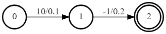
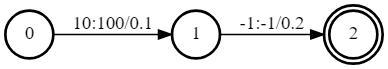
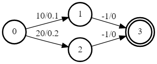
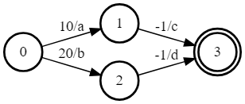
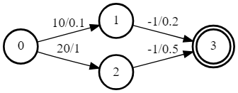
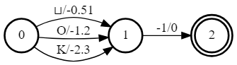
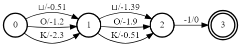
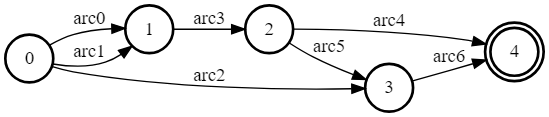
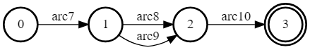

# k2 中的核心概念

> Please refer to [Moh97](https://k2-fsa.github.io/k2/core_concepts/index.html#id5), [MPR02](https://k2-fsa.github.io/k2/core_concepts/index.html#id6), and [MPR08](https://k2-fsa.github.io/k2/core_concepts/index.html#id7) for an introduction about **Weighted Finite State Acceptor (WFSA)** and **Weighted Finite State Transducer (WFST)**.

参考以下文章以了解**加权有限状态接受器 (Weighted Finite State Acceptor, WFSA)** 和**加权有限状态转换器 (Weighted Finite State Transducer, WFST)**.


- Mehryar Mohri. Finite-state transducers in language and speech processing. Computational linguistics, 23(2):269–311, 1997. URL: https://cs.nyu.edu/~mohri/pub/cl1.pdf.
- Mehryar Mohri, Fernando Pereira, and Michael Riley. Weighted finite-state transducers in speech recognition. Computer Speech & Language, 16(1):69–88, 2002. URL: https://cs.nyu.edu/~mohri/postscript/csl01.pdf.
- Mehryar Mohri, Fernando Pereira, and Michael Riley. Speech recognition with weighted finite-state transducers. In Springer Handbook of Speech Processing, pages 559–584. Springer, 2008. URL: https://wiki.eecs.yorku.ca/course_archive/2011-12/W/6328/_media/wfst-lvcsr.pdf.

> We use FSA to indicate either WFSA or WFST in k2.

我们在 k2 中使用 FSA 来指代 WFSA 或 WFST.

## A simple FSA example 一个简单的 FSA 示例

> A simple FSA is shown in Fig. 1.

图 01 展示了一个简单的 FSA 示例.



> - It has three states: 0, 1, and 2. State 0 is the start state and state 2 is the final state.
> - There are 2 arcs. The first arc is from state 0 to state 1 with label 10 and score 0.1. The second arc is from state 1 to the final state 2 with label -1 and score 0.2.

- 存在三个状态: `0`, `1`, `2`. 状态 `0` 是起始状态, 状态 `2` 是终止状态.
- 存在两条边: 
  - 从状态 `0` 到状态 `1` 的边, 带有标签 `10` 和分数 `0.1`, 
  - 从状态 `1` 到状态 `2` 的边, 带有标签 `-1` 和分数 `0.2`.

> ***Hint***: We use arc weight and arc score interchangeably in k2.

***提示***: 我们在 k2 中将边权重和边分数视为可互换的.

> The above FSA is created with the following code:

上述 FSA 可以以如下代码创建:

```python
import k2

s = '''
0 1 10 0.1
1 2 -1 0.2
2
'''
fsa = k2.Fsa.from_str(s)
fsa.draw('simple_fsa.svg')
```

> We summarize the unique features of FSA in k2 in below:
> - There is only one start state
> - The start state is always 0
> - All other states have a state number greater than 0
> - There is only one final state
> - The final state always has the largest state number
> - Arcs entering the final state always have -1 as the label
> - Arcs that do not enter the final state cannot have -1 as the label
> - States have no scores
> - All scores are on the arcs
> - We store weights in the positive sense rather than as costs

> ***Caution***: We store them as log-probs rather than negative log-probs, and call them "scores" to indicate this.
> They can come directly from the output of a log-softmax layer.

我们将 k2 中 FSA 的特性总结如下:
- 仅有一个起始状态;
- 起始状态总是为 `0`;
- 其他状态的状态数都大于 `0`;
- 仅有一个终止状态;
- 终止状态总是具有最大的状态数;
- 进入终止状态的边的标签总是为 `-1`;
- 进入非终止状态的边的标签不能为 `-1`;
- 状态没有分数;
- 所有分数都在边上;
- 我们以正的权重存储而不是以代价的角度.

***注意***: 我们将权重以对数概率的形式存储而不是负对数概率的形式, 并将其称为 "分数" 以表明这一点.
它们可以直接从一个 log-softmax 层的输出中获得.

> ***Hint***: Different from other frameworks, FSAs in k2 have only a single final state.
>
> If you want to convert an FSA from another framework to k2 that contains multiple final states, you can create an extra state and consider it as the super final state. For each final state in the FSA, add an arc to this super final state with label -1 and score equal to the final-weight of that final state. The resulting FSA will contain only a single final state.
>
> Similarly, if it contains multiple start states, you can add a super start state and set both the label and score of the arcs added from the super start state to the start state to 0.

***提示***: 不同于其他框架, k2 中的 FSAs 仅有一个终止状态.
若你想将其他框架中的包含多个终止状态的 FSA 转换到 k2, 你可以创建一个额外的状态并将其视为超终止状态.
对于 FSA 中的每个终止状态, 都添加一条带有 `-1` 标签的边到超终止状态, 且分数等于该终止状态的最终权重.
这样得到的 FSA 仅有一个终止状态.

类似地, 如果它包含多个起始状态, 你可以添加一个超起始状态, 并将超起始状态到起始状态的边的标签和分数设置为 0.

> ***Note***: k2 supports conversion of FSAs from OpenFST. See k2.Fsa.from_openfst().

***注意***: k2 支持从 OpenFST 转换 FSAs. 请参阅 [`k2.Fsa.from_openfst()`](https://k2-fsa.github.io/k2/python_api/api.html#k2.Fsa.from_openfst).

## Attributes 属性

> Arbitrary attributes can be attached to the arcs of an FSA. For example, we can attach a tensor attribute to an FSA indicating the output label of arcs so that the FSA is converted to an FST.

可以给 FSA 的边附加任意属性.
例如, 我们可以给 FSA 附加一个表示边的输出标签的张量属性, 使得 FSA 转换为 FST.

> The attached attributes are automaticaly propagated through operations, with autograd if they are real-valued tensors.

附加的属性如果是实值张量, 则会借助自动求导通过操作自动传播.

> The following code converts the above simple acceptor to a transducer:

下方代码将前面的简单接收器 FSA 转化为转换器 FST:

```python
import k2
import torch
s = '''
0 1 10 0.1
1 2 -1 0.2
2
'''
fsa = k2.Fsa.from_str(s)
fsa.aux_labels = torch.tensor([100, -1], dtype=torch.int32)
fsa.draw('simple_fst.svg')
```

> The resulting FST is visualized in Fig. 2.

图 02 展示了转换后的 FST.



> ***Caution***: There are NO output labels in k2. Every arc has a label and you can attach arbitrary attributes with arbitrary name to it.
> If the attached attribute is an N-D tensor, its `shape[0]` has to equal the number of arcs in the FSA.

***注意***: k2 中**没有**输出标签.
每条边都拥有一个标签, 并且能够给它附加任意名称的任意属性.
如果附加的属性是一个 N 维张量, 其 `shape[0]` 必须等于 FSA 中的边数.

> ***Note***: The visualization code handles the attributes `aux_labels` specially. Other than this, `aux_labels` is like any other attributes attached to the FSA.

***注意***: 可视化代码将对 `aux_labels` 属性特殊处理.
除此之外, `aux_labels` 就像其他附加到 FSA 的属性一样.

## Semirings 半环

> In the FSA literature, generality is achieved through the concept of “semirings”. The two most common are the “tropical semiring” and “log semiring”. The way we will explain these is a little different from the literature because we are using the opposite sign.

在 FSA 文献中, 一般性是通过 "半环" 这一概念实现的.
其中最常见的两个是 "热带半环 (Tropical Semiring)" 和 "对数半环 (Log Semiring)".
这里我们解释这些的方式与文献中稍有不同, 因为我们采用相反的符号.

> We won’t get into the formalism here, but it relates to what happens when you combine scores from multiple alternative paths.

我们不会在这进行形式化的讨论, 但它涉及到你将多个可选路径的分数进行合并时会发生什么.

> The two common semirings supported by k2 are:
> - tropical semiring: take the maximum score (or minimum cost)
> - log semiring: log-add the scores (or the negatives of the costs).

k2 支持的两个常用半环为:
- 热带半环: 取最大分数 (或最小代价)
- 对数半环: 对数相加分数 (或代价的相反数).

> While k2 only supports these two operations for the core operations, the framework is designed to be flexible through the concept of “attributes” which make it possible to implement the kinds of things that are normally accomplished through exotic semirings such as the Gallic semiring.

虽然 k2 只支持这两种操作作为核心操作, 但框架通过"属性"这一概念实现了灵活性, 使得它能够实现通过奇异半环 (如 "Gallic 半环") 实现的种种功能.

### Tropical Semiring·热带半环

> In tropical semirings, it takes the max score of alternative paths.

在热带半环中, 它取多个路径的最大分数.

> For example, for the FSA in Fig. 3:

例如, 图 03 中的 FSA:



> There are two paths from the start state to the final state:
> - Path 0: state 0 -> state 1 -> state 3, with score: 0.1 + 0 = 0.1
> - Path 1: state 0 -> state 2 -> state 3, with score: 0.2 + 0 = 0.2

有两条从起始状态到终止状态的路径:
- 路径 0: 状态 `0` -> 状态 `1` -> 状态 `3`, 分数: `0.1 + 0 = 0.1`
- 路径 1: 状态 `0` -> 状态 `2` -> 状态 `3`, 分数: `0.2 + 0 = 0.2`

> So in the tropical semiring, we would consider that “total score” of this FSA is `max(0.1, 0.2) == 0.2`.

所以在热带半环中, 我们将这一 FSA 的总分数视为 `max(0.1, 0.2) == 0.2`.

> In k2, you would use the following code to compute it:

在 k2, 你可以使用如下代码来计算:

```python
import k2
s = '''
0 1 10 0.1
0 2 20 0.2
1 3 -1 0
2 3 -1 0
3
'''
fsa = k2.Fsa.from_str(s)
fsa.draw('fsa2.svg')
fsa = k2.create_fsa_vec([fsa])
total_scores = fsa.get_tot_scores(log_semiring=False, use_double_scores=False)
print(total_scores)
# It prints: tensor([0.2000])
```

> ***Hint***: `k2.Fsa.get_tot_scores()` takes a vector of FSAs as input, so we use k2.create_fsa_vec() to turn an FSA into a vector of FSAs.
> Most operations in k2 take a vector of FSAs as input and process them in parallel.

***提示***: `k2.Fsa.get_tot_scores()` 接受 FSA 矢量作为输入, 所以我们使用 `k2.create_fsa_vec()` 将 FSA 转换为 FSA 矢量.
k2 中的大多数操作都接受 FSA 矢量作为输入并并行处理.

### Log Semiring·对数半环

> In log semirings, it takes the `log_add` score of alternative paths.

在对数半环中, 它取多个路径的对数相加分数.

> For example, if there are two paths with score `a` and `b`, then the total score is `log(exp(a) + exp(b))`.

例如, 如果有两条路径, 分数分别为 `a` 和 `b`, 那么总分数就是 `log(exp(a) + exp(b))`.

> Take the FSA in Fig. 3 as an example, the total score is `log(exp(0.1) + exp(0.2)) = 0.8444`.

同样以图 03 为例, 其总分数为 `log(exp(0.1) + exp(0.2)) = 0.8444`.

> The code in k2 looks like:

k2 中的代码如下:

```python
import k2
s = '''
0 1 10 0.1
0 2 20 0.2
1 3 -1 0
2 3 -1 0
3
'''
fsa = k2.Fsa.from_str(s)
fsa = k2.create_fsa_vec([fsa])
total_scores = fsa.get_tot_scores(log_semiring=True, use_double_scores=False)
print(total_scores)
# It prints: tensor([0.8444])
```

## Vectors of FSAs·FSAs 矢量

> The Python class `k2.Fsa` can represent either a single FSA or a 1-D vector of FSAs.

Python 类 `k2.Fsa` 可以表示单个 FSA 或一维矢量的 FSA.

> Most operations in k2 are done on a vector of FSAs in parallel.

k2 中的大多数操作都在 FSA 矢量上并行处理.

> ***Hint***: In the documentation, we usually use `FsaVec` to represent a vector of FSAs. However, there is actually no Python class `FsaVec`, only `k2.Fsa`.

***提示***: 在文档中, 我们通常使用 `FsaVec` 来表示 FSA 矢量. 然而, 实际上并没有 Python 类 `FsaVec`, 只有 `k2.Fsa`.

> ***Note***: `k2.create_fsa_vec()` can create a FsaVec from a list of FSAs. and `k2.Fsa.__getitem__()` selects an FSA with specified index from a FsaVec.

***注意***: `k2.create_fsa_vec()` 能够从 FSA 列表中创建一个 FSA 矢量, 而 `k2.Fsa.__getitem__()` 能够从 FSA 矢量中选择指定索引的 FSA.

## Autograd·自动求导

> Nearly all operations in k2 support autograd, which is compatible with PyTorch. It can be extended to support other frameworks as well, e.g., TensorFlow.

k2 中几乎所有操作都支持自动求导, 与 PyTorch 兼容.
它也可以扩展到其他框架, 例如 TensorFlow.

> Gradients are computed with respect to arc scores. We do not pose any constraints on where the arc scores can come from. For instance, they can be the output of some neural network or from some n-gram language models.

梯度是对边分数进行计算的.
我们不对边分数的来源做任何约束.
例如, 它们可以是一些神经网络的输出, 也可以是一些 n-gram 语言模型的输出.

> Autograd is implemented by keeping track of the “source arcs” of arcs that are the output of an operation. Internally, it outputs an arc map, saying for each output arc, which input arc it corresponds to.

自动求导是通过跟踪操作输出的 "源边" 实现的.
在内部, 它输出一个边映射, 指出对于每个输出边, 它对应于哪个输入边.

> For example, in composition an output arc would usually come from a pair of arcs, one in each input FSA.

例如, 在组合操作中, 输出边通常来自于一对边, 分别来自每个输入的 FSA.

> ***Hint***: arc map and autograd are implementation details and are not visible to Python API users.

***提示***: 边映射和自动求导是实现细节, 对于 Python API 用户不可见.

> In the following we give two examples about autograd with the following FSA in the context of computing total scores with tropical semiring and log semiring.

下面我们给出两个关于自动求导的例子, 分别在热带半环和对数半环情形下.



> Arc scores `a`, `b`, `c`, and `d` are some numbers not known yet. They can come from the output of some neural network and their value depends on the internal parameters of the neural network which are updated by some gradient descent based algorithms.

边分数 `a`, `b`, `c`, `d` 都是未知的数值.
它们可以来源于一些神经网络的输出, 其值依赖于神经网络的内部参数, 这些参数通过基于梯度下降的算法进行更新.

### Example 1: Autograd in tropical semiring·热带半环中的自动求导

> The following code shows how to compute the best score of the shortest path for the FSA given in Fig. 4:

下方代码展示了如何计算图 04 给出的 FSA 的最短路径的最佳分数:

```python
import k2

nnet_output = torch.tensor([0.1, 1, 0.2, 0.5], dtype=torch.float32)
# assume nnet_output is the output of some neural network
nnet_output.requires_grad_(True)
s = '''
0 1 10 0
0 2 20 0
1 3 -1 0
2 3 -1 0
3
'''
fsa = k2.Fsa.from_str(s)
fsa.scores = nnet_output
fsa.draw('autograd_tropical.svg')
fsa_vec = k2.create_fsa_vec([fsa])
total_scores = fsa_vec.get_tot_scores(log_semiring=False, use_double_scores=False)

total_scores.backward()
print(nnet_output.grad)
# It prints: tensor([0., 1., 0., 1.])
```



> Explanation:
> - We assume that `nnet_output = torch.tensor([a, b, c, d]) = torch.tensor([0.1, 1, 0.2, 0.5])` and we set `nnet_output.requires_grad_(True)` to simulate that it comes from the output of some neural network.
> - Arc 0: state 0 -> state 1, with score 0.1
> - Arc 1: state 0 -> state 2, with score 1
> - Arc 2: state 1 -> state 3, with score 0.2
> - Arc 3: state 2 -> state 3, witch score 0.5
> - Score of path 0: arc 0 -> arc 2 is 0.1 + 0.2 = 0.3
> - Score of path 1: arc 1 -> arc 3 is 1 + 0.5 = 1.5
> - The best path consists of arc 1 and arc 3.
> - The best score is `s = b + d = 1.5`
>
> So it is quite straightforward to compute the gradients of the best score s with respect to `a`, `b`, `c` and `d`.

$$
\begin{aligned}
\dfrac{\partial s}{\partial a} &= 0,\\
\dfrac{\partial s}{\partial b} = \dfrac{\partial (b+d)}{\partial b} &= 1,\\
\dfrac{\partial s}{\partial c} &= 0,\\
\dfrac{\partial s}{\partial d} =\dfrac{\partial (b+d)}{\partial d} &= 1,\\
\end{aligned}
$$

> Therefore, the gradient of `nnet_output` is `[0, 1, 0, 1]`.

解释:
- 我们假设神经网络的输出 `nnet_output` 即 `[a,b,c,d]` 为 `[0.1,1,0.2,0.5]`, 然后设置其需要求导以模拟其来源于一些神经网络的输出.
- 边 0: 状态 0 -> 状态 1, 分数 0.1
- 边 1: 状态 0 -> 状态 2, 分数 1
- 边 2: 状态 1 -> 状态 3, 分数 0.2
- 边 3: 状态 2 -> 状态 3, 分数 0.5
- 路径 0 的分数: 边 0 -> 边 2 的分数为 0.1 + 0.2 = 0.3
- 路径 1 的分数: 边 1 -> 边 3 的分数为 1 + 0.5 = 1.5
- 最佳路径由边 1 和 3 组成.
- 最佳分数为 `s = b + d = 1.5`

很容易能够计算出最佳分数 `s` 关于 `a`, `b`, `c`, `d` 的梯度.

因此, 最佳分数 `s` 对 `a`, `b`, `c`, `d` 的梯度为 `[0, 1, 0, 1]`.


### Example 2: Autograd in log semiring·对数半环中的自动求导

> For the log semiring, we just change:
> `total_scores = fsa_vec.get_tot_scores(log_semiring=False, use_double_scores=False)`
> to:
> `total_scores = fsa_vec.get_tot_scores(log_semiring=True, use_double_scores=False)`

对于对数半环, 我们只需要设置 `log_semiring=True`

> For completeness and ease of reference, we repost the code below.

为了完整性和参考方便, 我们再次展示代码.

```python
import k2

nnet_output = torch.tensor([0.1, 1, 0.2, 0.5], dtype=torch.float32)
# assume nnet_output is the output of some neural network
nnet_output.requires_grad_(True)
s = '''
0 1 10 0
0 2 20 0
1 3 -1 0
2 3 -1 0
3
'''
fsa = k2.Fsa.from_str(s)
fsa.scores = nnet_output
fsa.draw('autograd_log.svg')
fsa_vec = k2.create_fsa_vec([fsa])
total_scores = fsa_vec.get_tot_scores(log_semiring=True, use_double_scores=False)

total_scores.backward()
print(nnet_output.grad)
# It prints: tensor([0.2315, 0.7685, 0.2315, 0.7685])
```

> Explanation:
> In log semiring, the total score `s` is computed using `log_add`:

$$
  s = \log(\exp(a+c)+\exp(b+d))
$$

$$
\begin{aligned}
\dfrac{\partial s}{\partial a} &= \dfrac{\exp(a+c)}{\exp(a+c)+\exp(b+d)} =0.2315\\
\dfrac{\partial s}{\partial b} &= \dfrac{\exp(b+d)}{\exp(a+c)+\exp(b+d)} =0.7685\\
\dfrac{\partial s}{\partial c} &= \dfrac{\exp(a+c)}{\exp(a+c)+\exp(b+d)} =0.2315\\
\dfrac{\partial s}{\partial d} &= \dfrac{\exp(b+d)}{\exp(a+c)+\exp(b+d)} =0.7685\\
\end{aligned}
$$

> Therefore, the gradient of `nnet_output` is `[0.2315, 0.7685, 0.2315, 0.7685]`.

解释:
在对数半环中, 总分数 `s` 是通过对数相加计算的.
计算过程如上所示.
因此, `nnet_output` 的梯度为 `[0.2315, 0.7685, 0.2315, 0.7685]`.


> ***Note***: The example FSA is fairly simple and its main purpose is to demostrate how to use autograd in k2.
> All of this happens automagically.

***注意***: 示例 FSA 很简单, 其主要目的是演示如何在 k2 中使用自动求导.
所有这些都自动发生.

## Dense FSA Vector·密集 FSA 矢量

> We have mentioned that gradients are computed with respect to arc scores and arc scores may come from the output of some neural network.

可以注意到梯度是关于边分数进行计算的, 边分数可能来源于神经网络的输出.

> This brings up the question:
> **How to convert the output of a neural network to an FSA?**

这带来一个问题: **如何将一个神经网络的输出转化为 FSA?**

> To answer this question, we need to identify:
> - What are the states?
> - What are the arcs ?
>   - source state
>   - destination state
>   - label
>   - score

为了回答这一问题, 我们需要明确:
- 状态是什么?
- 边是什么?
  - 来源状态
  - 目标状态
  - 标签
  - 分数

> Let’s assume a neural network predicts the pseudo probabilities for three symbols:
> - blank
> - letter `O`
> - letter `K`

让我们假设一个神经网络预测三个符号的伪概率: `空`, `O`, `K`.

> At frame 0, suppose the last layer `log-softmax` of the network produces the following output:

在第 0 帧, 假设神经网络的最后一层的 `log-softmax` 输出如下:

||blank|letter O|letter K|
|---|:-:|:-:|:-:|
|frame 0|log(0.60) = -0.51|log(0.30) = -1.20|log(0.10) = -2.30|

> We would convert it to an FSA shown in Fig. 6.

我们将它转化为如图 06 所示的 FSA.




> Explanation:
> - The resulting FSA has 3 states
> - State `0` has 3 leaving arcs pointing to state `1` with scores from the network output at frame 0

解释:
- 结果 FSA 有 3 个状态;
- 状态 `0` 有 3 个离开边指向状态 `1`, 分数来源于网络在第 0 帧的输出.

> ***Note***: In other frameworks, the resulting FSA has only two states, i.e., state `1` is the final state. In k2, however, we require that arcs entering the final state have label `-1` on them. Therefore, the FSA has 3 states in k2.

***注意***: 在其他框架中, 得到的 FSA 仅有两个状态, 即状态 `1` 为终止状态;
在 k2 中, 我们要求到达终止状态的边需要有 `-1` 的标签, 因此 k2 中的 FSA 有 3 个状态.

> At frame 1, the network may produce the following output:

在第 1 帧, 神经网络可能输出如下:

||blank|letter O|letter K|
|---|:-:|:-:|:-:|
|frame 0|log(0.60) = -0.51|log(0.30) = -1.20|log(0.10) = -2.30|
|frame 1|log(0.25) = -1.39|log(0.15) = -1.90|log(0.60) = -0.51|

> The corresponding FSA is visualized in Fig. 7.

对应的 FSA 如图 07 所示.



> Explanation:
> - State `1` has 3 leaving arcs pointing to state `2` with scores from the network output at frame 1
> - The arcs from state `0` to state `1` remain the same

解释:
- 状态 `1` 有 3 个离开边指向状态 `2`, 分数来源于网络在第 1 帧的输出;
- 状态 `0` 到状态 `1` 的边保持不变.

> A short summary:
> The two examples shown in the above demonstrate how to construct an FSA from the output of a neural network with one frame and two frames. It is straightforward to extend it to N frames.

简单总结: 前面所示的两个例子说明了如何从神经网络的输出构造一个 FSA, 其中包含 1 帧和 2 帧. 很容易将其扩展到 N 帧.

> In practice, some frames in the output are just paddings and k2 supports constructing an FSA from a subset of frames from the output by specifying: the start frame index and number of frames (i.e., duration).

实际上, 输出的一些帧可能只是填充, k2 支持通过指定开始帧索引和帧数 (即持续时间) 来从输出的帧子集中构造 FSA.

> The meaning of `dense` in the name `dense fsa vector` is that for every frame in the network output, there exist as many arcs as the dimension of the output between two states in the resulting FSA.

`dense fsa vector` 中 `dense` 的意思是对于神经网络输出中的每一帧, 对应的 FSA 中两个状态之间存在数量等于网络输出的维度的边.

> Since the structure of the resulting FSA is quite regular, k2 only saves a 2-D tensor containing the scores and interprets it as an FSA on the fly when needed.

由于得到的 FSA 结构相当规则, k2 只保存包含分数的 2 维张量, 它会在需要时解释为 FSA.

> ***Hint***: Can you figure out the number of states and arcs of the resulting FSA from a 2-D tensor containing scores with m rows and n columns?

***提示***: 你能够从包含 m 行和 n 列的分数的 2 维张量中推断得到的 FSA 的状态数和边数吗?

#TODO

> To construct a vector of dense FSAs, you can either:
> - Extract multiple subsets from the network output and construct a dense FSA for each of them
> - Change the network to produce a batch of outputs and construct a dense FSA for each output in the batch

为了构造一个密集 FSA 矢量, 你可以:
- 从网络输出中提取多个子集, 并为每个子集构造一个密集 FSA;
- 修改网络使其输出一个批次的输出, 并为批次中的每个输出构造一个密集 FSA.

> Please refer to the constructor of [`k2.DenseFsaVec.__init__()`](https://k2-fsa.github.io/k2/python_api/api.html#k2.DenseFsaVec.__init__) to gain more insight.

参考 [`k2.DenseFsaVec.__init__()`]() 的构造函数获取更多信息.

## Ragged Arrays·不规则数组

> Ragged arrays are the core data structures in k2 designed by us independently. We were later told that TensorFlow was using the same ideas (See [tf.ragged](https://www.tensorflow.org/guide/ragged_tensor)).

不规则数组是我们独立设计的 k2 中的核心数据结构.
我们后来被告知 TensorFlow 也使用了相同的想法 (参见 [tf.ragged](https://www.tensorflow.org/guide/ragged_tensor)).

> Before describing what ragged arrays are. Let us first revisit how **Compressed Sparse Row matrices (CSR matrices)** are represented.

在描述什么是不规则数组之前, 首先回顾一下**压缩稀疏行矩阵**是如何表示的.

### Compressed Sparse Row matrices·压缩稀疏行矩阵

> For the following matrix:

对于如下矩阵:

$$
\begin{pmatrix}
  5&0&0&0\\
  0&8&0&0\\
  0&0&3&0\\
  0&6&0&0
\end{pmatrix}
$$

> It can be represented by 3 arrays in CSR format:
> - `values` = `[5, 8, 3, 6]`
> - `col_indexes` = `[0, 1, 2, 1]`
> - `row_indexes` = `[0, 1, 2, 3, 4]`
>
> where `values` contains the non-zero entries of the matrix (row-by-row). `col_indexes` contains the column indexes of the non-zero entries in `values`.
>
> For instance:
> - `values[0]` = 5 belongs to column 0, so `col_indexes[0]` = 0
> - `values[1]` = 8 belongs to column 1, so `col_indexes[1]` = 1
> - `values[3]` = 6 belongs to column 1, so `col_indexes[3]` = 1
>
> Note that values and col_indexes have the same number of elements.

它可以以 CSR 格式用 3 个数组表示, 它们分别是:
- 值 `values`: `[5,8,3,6]`;
- 列索引 `col_indexes`: `[0,1,2,1]`;
- 行索引 `row_indexes`: `[0,1,2,3,4]`;

其中值包含矩阵中的非零元素 (逐行).
列索引包含值中非零元素的列索引.

例如:
- `values[0]`=5 属于列 0, 所以 `col_indexes[0]` 为 0;
- `values[1]`=8 属于列 1, 所以 `col_indexes[1]` 为 1;
- `values[3]`=6 属于列 1, 所以 `col_indexes[3]` 为 1.

可以注意到值 `values` 和列索引 `col_indexes` 具有相同数量的元素.

> The most interesting part is `row_indexes`. It is NOT the row indexes of the non-zero entries in values. Instead, it encodes the index in values and col_indexes where the given row starts.
> - `row_indexes[0]` = 0, so the entries for row 0 start at index 0 in values
>   - `values[0]` = 5 is the first entry for row 0
> - `row_indexes[1]` = 1, so the entries for row 1 start at index 1 in values
>   - `values[1]` = 8 is the first entry for row 1
> - `row_indexes[2]` = 2, so the entries for row 2 start at index 2 in values
>   - `values[2]` = 3 is the first entry for row 2
> - `row_indexes[3]` = 3, so the entries for row 3 start at index 3 in values
>   - `values[3]` = 6 is the first entry for row 3

最有意思的部分是行索引 `row_indexes`. 它**不是**值 `values` 中的非零元素的行索引. 
相反, 它编码了 `values` 和 `col_indexes` 中给定行的起始索引.

- `row_indexes[0]`=0, 所以第 0 行的元素从索引 0 开始, 值 `values[0]` 为 5 为第 0 行的第一个元素;
- `row_indexes[1]`=1, 所以第 1 行的元素从索引 1 开始, 值 `values[1]` 为 8 为第 1 行的第一个元素;
- `row_indexes[2]`=2, 所以第 2 行的元素从索引 2 开始, 值 `values[2]` 为 3 为第 2 行的第一个元素;
- `row_indexes[3]`=3, 所以第 3 行的元素从索引 3 开始, 值 `values[3]` 为 6 为第 3 行的第一个元素.

> ***Caution***: Why is `row_indexes[4]` = 4?
> `row_indexes[3]` specifies where row 3 starts, whereas `row_indexes[4]` indicates where row 3 ends.

***注意***: 为什么 `row_indexes[4]`=4?
`row_indexes[3]` 指定了第 3 行的起始索引, 而 `row_indexes[4]` 表示第 3 行的结束索引.

---

> The above matrix contains one non-zero entries for each row. Let us see a more general matrix:

上面的矩阵在每行仅有一个非零元素. 
让我们看一个更一般的矩阵:

$$
\begin{pmatrix}
  10&20& 0& 0& 0& 0\\
   0&30& 0&40& 0& 0\\
   0& 0&50&60&70& 0\\
   0& 0& 0& 0& 0&80\\
\end{pmatrix}
$$

> The 3 arrays for the above matrix in CSR format look like:
> - `values` = [10, 20, 30, 40, 50, 60, 70, 80]
> - `col_indexes` = [ 0, 1, 1, 3, 2, 3, 4, 5]
> - `row_indexes` = [0, 2, 4, 7, 8]

其 CSR 格式的三个数组表示如下:
- 值 `values`: `[10,20,30,40,50,60,70,80]`;
- 列索引 `col_indexes`: `[0,1,1,3,2,3,4,5]`;
- 行索引 `row_indexes`: `[0,2,4,7,8]`.

> Explanation:
> - `values` contains the non-zero entries of the matrix
> - `values[0]` = 10 belongs to column 0, so `col_indexes[0]` = 0
> - `values[7]` = 80 belongs to column 5, so `col_indexes[7]` = 5
> - The first entry of row 0 is 10 which is the index 0 in `values`, so `row_indexes[0]` = 0
> - The first entry of row 1 is 30 which is the index 2 in `values`, so `row_indexes[1]` = 2
> - The first entry of row 2 is 50 which is the index 4 in `values`, so `row_indexes[2]` = 4
> - The first entry of row 3 is 80 which is the index 7 in `values`, so `row_indexes[3]` = 7
> - Row 3 contains only 1 element, so `row_indexes[4]` = `row_indexes[3]` + 1 = 8

解释:
- 值 `values` 包含矩阵中的非零元素;
- 值 `values[0]`=10 属于列 0, 所以 `col_indexes[0]` 为 0;
- 值 `values[7]`=80 属于列 5, 所以 `col_indexes[7]` 为 5;
- 第 0 行的第一个非零元素为 10, 它在值 `values` 中的索引为 0, 所以 `row_indexes[0]` 为 0;
- 第 1 行的第一个非零元素为 30, 它在值 `values` 中的索引为 2, 所以 `row_indexes[1]` 为 2;
- 第 2 行的第一个非零元素为 50, 它在值 `values` 中的索引为 4, 所以 `row_indexes[2]` 为 4;
- 第 3 行的第一个非零元素为 80, 它在值 `values` 中的索引为 7, 所以 `row_indexes[3]` 为 7;
- 第 3 行仅有一个元素, 所以 `row_indexes[4]`= `row_indexes[3]` + 1 = 8.

---

> ***Hint***: 
> We summarize the characteristics of `row_indexes` below:
> - It is non-decreasing
> - Its first entry is 0
> - Its last entry denotes the number of non-zero entries in the matrix
> - Its size is num_rows + 1
> - `row_indexes[i+1]` - `row_indexes[i]` gives the number of non-zero entries in row i
> - Row i contains all zeros if `row_indexes[i+1]` == `row_indexes[i]`

***提示***:
我们总结了 `row_indexes` 的特点如下:
- 它是非递减的;
- 它的第一个元素为 0;
- 它的最后一个元素表示矩阵中非零元素的数量;
- 它的大小为行数 + 1;
- `row_indexes[i+1]` - `row_indexes[i]` 给出了第 i 行中非零元素的数量;
- 如果 `row_indexes[i+1]` == `row_indexes[i]`, 则第 i 行全为零.

### Ragged Arrays in k2·k2 中的不规则数组

> Now we come back to ragged arrays in k2.
> In k2, `row_indexes` is called `row_splits`, compatible with TensorFlow’s RaggedTensor.

现在回到 k2 中的不规则数组.
在 k2 中, 行索引 `row_indexes` 被称为行分割 `row_splits`, 与 TensorFlow 的 RaggedTensor 兼容.

> For the following FSA:

对于如下 FSA:



> It is represented in k2 by two arrays:
> - `values` = [arc0, arc1, arc2, arc3, arc4, arc5, arc6]
> - `row_splits` = [0, 3, 4, 6, 7, 7]
>   - Here arc0 is an instance of C++ class `Arc`.

在 k2 中它将以两个数组表示:
- 值 `values`: `[arc0, arc1, arc2, arc3, arc4, arc5, arc6]`;
- 行分割 `row_splits`: `[0, 3, 4, 6, 7, 7]`.
  - 这里 `arc0` 是一个 C++ 类 `Arc` 实例.

> `values` saves all of the arcs ordered by state numbers in the FSA.

值 `values` 保存了 FSA 中按状态数排序的所有边.

> `row_splits[i]` specifies the where arcs of state i begin in the array values.
> - `row_splits[0]` = 0, the arcs of state 0 begin at index 0 in `values`
> - `row_splits[1]` = 3, the arcs of state 1 begin at index 3 in `values`
> - `row_splits[2]` = 4, the arcs of state 2 begin at index 4 in `values`
> - `row_splits[3]` = 6, the arcs of state 3 begin at index 6 in `values`
> - `row_splits` contains 6 entries, so the number of states is 6 - 1 = 5
> - The last entry of `row_splits` is 7, so there are 7 arcs in the FSA
> - `row_splits[1]` - `row_splits[0]` = 3, so state 0 has 3 arcs
> - `row_splits[2]` - `row_splits[1]` = 1, so state 1 has 1 arc
> - `row_splits[3]` - `row_splits[2]` = 2, so state 2 has 2 arcs
> - `row_splits[4]` - `row_splits[3]` = 1, so state 3 has 1 arc
> - `row_splits[5]` - `row_splits[4]` = 0, so state 4 has no arcs at all

行分割 `row_splits[i]` 指定了数组 `values` 中状态 i 的边的起始索引.
- `row_splits[0]`=0, 状态 0 的边从 `values` 的索引 0 开始;
- `row_splits[1]`=3, 状态 1 的边从 `values` 的索引 3 开始;
- `row_splits[2]`=4, 状态 2 的边从 `values` 的索引 4 开始;
- `row_splits[3]`=6, 状态 3 的边从 `values` 的索引 6 开始;
- `row_splits` 包含 6 个元素, 所以状态数为 6 - 1 = 5;
- `row_splits` 的最后一个元素为 7, 所以 FSA 中有 7 个边;
- `row_splits[1]` - `row_splits[0]`=3, 所以状态 0 有 3 个边, 即 `arc0, arc1, arc2`;
- `row_splits[2]` - `row_splits[1]`=1, 所以状态 1 有 1 个边, 即 `arc3`;
- `row_splits[3]` - `row_splits[2]`=2, 所以状态 2 有 2 个边, 即 `arc4, arc5`;
- `row_splits[4]` - `row_splits[3]`=1, 所以状态 3 有 1 个边, 即 `arc6`;
- `row_splits[5]` - `row_splits[4]`=0, 所以状态 4 没有边.

> ***Question***: To which state does arc i belong?
> The above question can be answered in $:cal\mathcal{O}(n)$ time, where n is the number of states, by iterating over row_splits.

***问题***: 边 i 属于哪个状态?
这一问题可以在 $\mathcal{O}(n)$ 时间内获得答案, `n` 为状态数, 通过遍历行分割 `row_splits` 实现.

> In k2, an extra array called `row_ids` is provided to implement such tasks in $\mathcal{O}(1)$ time. For arc i, `row_ids[i]` tells the state number to which this arc belongs.

在 k2 中, 额外的数组 `row_ids` 提供了实现这样任务的 $\mathcal{O}(1)$ 时间的方法. 对于边 i, `row_ids[i]` 告诉它所属的状态数.

> ***Hint***: 
> `row_ids` and `row_splits` contain nearly the same information. `row_ids` is provided to make some operations faster.

***提示***:
`row_ids` 和 `row_splits` 包含几乎相同的信息. `row_ids` 是为了使得一些操作更快.

---

> Next we show how to represent an FsaVec with a ragged array in k2. Assume that the FsaVec contains two FSAs, one given in Fig. 8 and the other is shown in Fig. 9:

接下来我们将展示如何在 k2 中用不规则数组表示 FsaVec. 
假设 FsaVec 包含两个 FSA, 第一个 FSA 如图 8 所示, 第二个 FSA 如图 9 所示:



> The `values` array is: [arc0, arc1, arc2, arc3, arc4, arc5, arc6, arc7, arc8, arc9, arc10].

值数组 `values` 为: `[arc0, arc1, arc2, arc3, arc4, arc5, arc6, arc7, arc8, arc9, arc10]`.

> There are two `row_splits` arrays:
> - `row_splits1` is `[0, 5, 9]`
>   - `row_splits1[0]` indicates the index into `row_splits2` where the state of FSA 0 begins
>   - `row_splits1[1]` indicates the index into `row_splits2` where the state of FSA 1 begins
>   - `row_splits1[2]` - `row_splits1[1]` is the number of states in FSA 1, which is 4
>   - `row_splits1[1]` - `row_splits1[0]` is the number of states in FSA 0, which is 5
>   - The last entry in `row_splits1` is 9, so there are 9 states in total in the FsaVec
>   - The size of `row_splits1` is 3, so there are 3 - 1 = 2 FSAs in the FsaVec
> - `row_splits2` is `[0, 3, 4, 6, 7, 7, 8, 10, 11, 11]`
>   - Since `row_splits1[0]` = 0 and `row_splits1[1]` = 5, `row_splits2[0]` to `row_splits2[5]` represent the information of FSA 0
>       - `row_splits2[0]` is 0, indicating the arcs of state 0 in FSA 0 begin at index 0 in `values`
>       - `row_splits2[1]` is 3, indicating the arcs of state 1 in FSA 0 begin at index 3 in `values`
>       - `row_splits2[4]` is 7, indicating the arcs of state 4 in FSA 0 begin at index 7 in `values`
>       - `row_splits2[5]` - `row_splits2[4]` = 7 - 7 is 0, indicating the number of arcs of state 4 in FSA 0 is 0
>   - Since `row_splits1[1]` = 5 and `row_splits1[2]` = 9, `row_splits2[5]` to `row_splits2[9]` represent the information of FSA 1
>       - `row_splits2[5]` is 7, indicating the arcs of state 0 in FSA 1 begin at index 7 in `values`
>       - `row_splits2[6]` is 8, indicating the arcs of state 1 in FSA 1 begin at index 8 in `values`
>       - `row_splits2[7]` is 10, indicating the arcs of state 2 in FSA 1 begin at index 10 in `values`
>       - `row_splits2[9]` - `row_splits2[8]` = 11 - 11 is 0, indicating the number of arcs of state 3 in FSA 1 is 0

有两个 `row_splits` 数组:
- `row_splits1` 为 `[0, 5, 9]`:
  - `row_splits1[0]` 表示 FSA 0 的状态开始索引;
  - `row_splits1[1]` 表示 FSA 1 的状态开始索引;
  - `row_splits1[2]` - `row_splits1[1]` 表示 FSA 1 的状态数, 即 4;
  - `row_splits1[1]` - `row_splits1[0]` 表示 FSA 0 的状态数, 即 5;
  - `row_splits1` 的最后一个元素为 9, 所以 FsaVec 中总共有 9 个状态;
  - `row_splits1` 的大小为 3, 所以 FsaVec 中有 3-1=2 个 FSA;
- `row_splits2` 为 `[0, 3, 4, 6, 7, 7, 8, 10, 11, 11]`:
  - 由于 `row_splits1[0]`=0 和 `row_splits1[1]`=5, `row_splits2[0]` 到 `row_splits2[5]` 代表 FSA 0 的信息;
    - `row_splits2[0]`=0, 表示 FSA 0 的状态 0 的边从 `values` 的索引 0 开始;
    - `row_splits2[1]`=3, 表示 FSA 0 的状态 1 的边从 `values` 的索引 3 开始;
    - `row_splits2[4]`=7, 表示 FSA 0 的状态 4 的边从 `values` 的索引 7 开始;
    - `row_splits2[5]` - `row_splits2[4]`=0, 表示 FSA 0 的状态 4 的边数为 0;
  - 由于 `row_splits1[1]`=5 和 `row_splits1[2]`=9, `row_splits2[5]` 到 `row_splits2[9]` 代表 FSA 1 的信息;
    - `row_splits2[5]`=7, 表示 FSA 1 的状态 0 的边从 `values` 的索引 7 开始;
    - `row_splits2[6]`=8, 表示 FSA 1 的状态 1 的边从 `values` 的索引 8 开始;
    - `row_splits2[7]`=10, 表示 FSA 1 的状态 2 的边从 `values` 的索引 10 开始;
    - `row_splits2[9]` - `row_splits2[8]`=0, 表示 FSA 1 的状态 3 的边数为 0.

### Summary·总结

> FSA and FsaVec are represented as ragged arrays in k2
> With ragged arrays, it’s straightforward to get the following information with no loops:
> - Number of states in the FSA
> - Number of arcs in the FSA
> - Number of arcs of a certain state in the FSA
> - To which state arc i belongs

FSA 和 FsaVec 在 k2 中用不规则数组表示.
采用不规则数据, 可以在不使用循环的情况下获得以下信息:
- FSA 中状态数;
- FSA 中边数;
- FSA 中某状态的边数;
- 边 i 所属的状态.