# Python 教程

## Ragged Tensor Tutorials·不规则张量教程

### Basics·基本

> A ragged tensor or ragged array in k2 can be used to store the following kinds of data:
> 1. A list of lists. Each sub list may contain different number of entries. That is, they can have different lengths.
> `a = [ [1, 2], [2, 3, 4], [], [1] ]`
> 2. A list-of-list of lists.
> `b = [ [[1., 2.5], [2, 3, 4]], [[]], [[10, 20], []] ]`
> 3. A list-of-list-of-list-of… lists. List can be nested in any number of levels.

k2 中的不规则张量或不规则数组可以用于存储以下几种数据:
1. 列表的列表, 每个子列表可能包含不同数量的元素. 也就是说, 它们可能有不同的长度.
2. 列表-列表的列表.
3. 列表-列表-列表-列表-… 的列表. 列表可以嵌套在任意数量的层次中.

> ***Note***: Ragged arrays are the core data structures in k2, designed by us independently. We were later told that TensorFlow was using the same ideas (See [tf.ragged](https://www.tensorflow.org/guide/ragged_tensor)).

***注意***: 不规则数组是 k2 中的核心数据结构, 由我们独立设计.
我们后来被告知 TensorFlow 也使用了相同的想法 (参见 [tf.ragged](https://www.tensorflow.org/guide/ragged_tensor)).

> In k2, a ragged tensor contains two parts:
> - a shape, which is of type `k2.RaggedShape`
> - a value, which can be accessed as a contiguous [PyTorch tensor](https://pytorch.org/docs/stable/tensors.html).

在 k2 中, 不规则张量包含两个部分:
- 形状, 类型为 `k2.RaggedShape`
- 值, 可以作为连续的 PyTorch 张量访问.

> ***Hint***: The value is stored contiguously in memory.

***提示***: 值在内存中连续存储.

> ***Attention***: What is the dimension of the value as a torch tensor?

***注意***: 值作为 torch 张量的维度是多少?

> It depends on the data type of of the ragged tensor. 
> For instance,
> - if the data type is `int32_t`, the value is accessed as a 1-D torch tensor with dtype `torch.int32`.
> - if the data type is `float`, the value is accessed as a 1-D torch tensor with dtype `torch.float32`.
> - if the data type is `double`, the value is accessed as a 1-D torch tensor with dtype `torch.float64`.

这依赖于不规则张量的数据类型.
例如:
- 如果数据类型是 `int32_t`, 值作为 1 维 torch 张量访问, 其 dtype 为 `torch.int32`.
- 如果数据类型是 `float`, 值作为 1 维 torch 张量访问, 其 dtype 为 `torch.float32`.
- 如果数据类型是 `double`, 值作为 1 维 torch 张量访问, 其 dtype 为 `torch.float64`.

> If the data type is `k2::Arc`, which has the following definition in C++:

如果数据类型为 `k2::Arc`, 其在 C++ 中的定义如下:

```
struct Arc {
  int32_t src_state;
  int32_t dest_state;
  int32_t label;
  float score;
};
```

> the value is acessed as a 2-D torch tensor with dtype `torch.int32`. 
> The 2-D tensor has 4 columns: the first column contains `src_state`, the second column contains `dest_state`, the third column contains `label`, and the fourth column contains `score` (The float type is reinterpreted as int type without any conversions).

值作为 2 维 torch 张量访问, 其 dtype 为 `torch.int32`.
2 维张量有四列:
- 第一列包含来源状态 `src_state`;
- 第二列包含目标状态 `dest_state`;
- 第三列包含标签 `label`;
- 第四列包含得分 `score`; 

(float 类型被重新解释为 int 类型, 而无需任何转换).

> There are only 1-D and 2-D value tensors in k2 at present.

目前 k2 中只有 1 维和 2 维值张量.

### Operations·操作 (暂无)

#TODO 

## FSA Tutorials·FSA 教程

> In this tutorial, we will show:
> - How to create an FSA in k2.
> - How to create a 1-D vector of FSAs in k2.
> - Common methods of `k2.Fsa`

### A Single FSAs·单个 FSA

> The following code shows how to create an FSA in k2:

下方代码展示了如何在 k2 中创建 FSA:

```python
s = '''
  0 1 10 0.1
  0 2 20 0.2
  1 2 30 0.3
  1 3 -1 0.4
  2 3 -1 0.5
  3
'''
fsa = k2.Fsa.from_str(s)
```

#TODO add links

> Please refer to `k2.Fsa.from_str()` for the format of the string s that must have.

访问 `k2.Fsa.from_str()` 以获取字符串 s 的格式要求.

#### Visualization·可视化

> The resulting FSA can be visualized via the following two APIs:
> - `k2.to_dot()`
> - `k2.Fsa.draw()`

创建的 FSA 可以通过以下两个 API 进行可视化:
- `k2.to_dot()`
- `k2.Fsa.draw()`

> ***Hint***: You have to install `graphviz` in order to use the above two APIs. It can be installed using the following command: `pip install graphviz`

***提示***: 你需要安装 `graphviz` 以使用上述两个 API. 你可以使用以下命令安装: `pip install graphviz`

> The return value of `k2.to_dot()` can be visualized automagically in a jupyter notebook. 
> Fig.10 is a screenshot of invoking `k2.to_dot()` for the above FSA.

`k2.to_dot()` 的返回值可以自动在 jupyter notebook 中可视化.
图 10 是对上述 FSA 使用 `k2.to_dot()` 的截图.

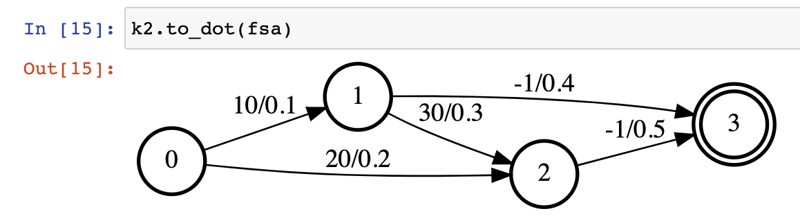

> `k2.Fsa.draw()` is able to save the resulting FSA to a file for offline visualization. Its return value can also be displayed in a jupyter notebook. A screenshot of running k2.Fsa.draw() for the above FSA is shown in

`k2.Fsa.draw()` 能够将结果 FSA 保存到文件, 以供离线可视化. 它的返回值也可以在 jupyter notebook 中显示. 上述 FSA 使用 `k2.Fsa.draw()` 的截图如图 11 所示.

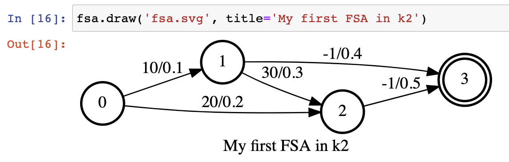

> The generated fsa.svg is visualized in Fig.12.

生成的 fsa.svg 如图 12 所示.


#### Symbol table·符号表

> You can also attach a symbol table to the above FSA:

你还可以将符号表附加到上述 FSA:

```python
sym_str = '''
  a 10
  b 20
  c 30
'''
fsa.labels_sym = k2.SymbolTable.from_str(sym_str)
fsa.draw('fsa_symbols.svg', title='An FSA with symbol table')
```

> The visualization result is given in Fig.13.

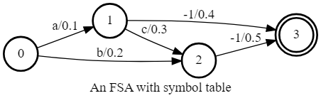

> To attach a symbol table to an FSA, just assign an instance of class `k2.SymbolTable` to the `labels_sym` attribute of the FSA.

为了给 FSA 附加符号表, 只需将 `k2.SymbolTable` 实例赋值给 `labels_sym` 属性即可.

#### Auxiliary Labels·辅助标签

> You can also attach an integer attribute to every arc in the FSA. If the attribute name is `aux_labels`, the resulting FSA is viewed as an FST in k2.

你可以为 FSA 中的每条边附加整数属性.
如果属性名称为 `aux_labels`, 则创建的 FSA 被视为 k2 中的 FST.

> An example is given below.

下面给出一个例子.

```python
fsa.aux_labels = torch.tensor([10, 0, 30, -1, -1]).to(torch.int32)
fsa.draw('fsa_aux.svg', title='An FSA with aux_labels')
```

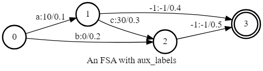

> ***Hint***: We require that `aux_labels` is either a `torch.Tensor` with dtype `torch.int32` or a ragged tensor of type `k2.RaggedInt`. 
> Also note that the `aux_labels` for arcs entering the final state are `-1`.

***提示***: 我们要求 `aux_labels` 是数据类型为 `torch.int32` 的 `torch.Tensor` 类型或类型为 `k2.RaggedInt` 的不规则张量.
同样需要注意所有进入终止状态的边的 `aux_labels` 均为 `-1`.

#### Auxiliary Symbol Table·辅助符号表

> If an FSA is assigned an attribute with name aux_labels_sym, its aux_labels is visualized with human readable strings instead of integer IDs

> The following is an example.

```python
aux_labels_sym = k2.SymbolTable.from_str('''
  A 10
  B 30
''')
fsa.aux_labels_sym = aux_labels_sym
fsa.draw('fsa_aux_symbols.svg', title='An FSA with aux_symbols')
fsa_aux_symbols.svg
```
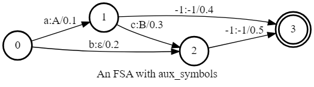

#### invert

> `labels` and `aux_labels` can be swapped using `k2.Fsa.invert()` or `k2.Fsa.invert_()`:

标签和辅助标签可以使用 `k2.Fsa.invert()` 或 `k2.Fsa.invert_()` 进行交换:

```python
fsa.invert_()
fsa.draw('fsa_invert.svg')
```

> fsa_invert.svg is shown in Fig.16.

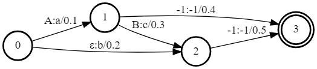

> ***Caution***: It is a convention in k2 that a method with name ending with an underscore changes the object in-place.
>  `k2.Fsa.invert()` returns a new FSA, whereas `k2.Fsa.invert_()` modifies self in-place.

#### scores

> `scores` is one of the most important attributes of an FSA. 
> There is a score for every arc and `k2.Fsa.scores` returns the scores of an FSA in a 1-D `torch.Tensor` with dtype torch.float32:

分数是 FSA 的一个重要属性.
每条边都有一个分数, `k2.Fsa.scores` 返回 FSA 的分数, 其类型为 1 维 `torch.Tensor` 类型, 元素类型为 `torch.float32`:

```python
print(fsa.scores)
# it prints:
#   tensor([0.1000, 0.2000, 0.3000, 0.4000, 0.5000])
```

#### Device·设备

> k2 supports CPU as well as CUDA. 
> - You can tell whether an FSA is on CPU with `k2.Fsa.is_cpu()`;
> - To test whether an FSA is on CUDA GPU or not, you can use `k2.Fsa.is_cuda()`;
> - An FSA can be moved to a different device with `k2.Fsa.to()`.
> - Note that you can use `k2.Fsa.device` to get the device on which the current FSA resides.

k2 支持 CPU 以及 CUDA. 
- 使用 `k2.Fsa.is_cpu()` 判断 FSA 是否在 CPU 上;
- 使用 `k2.Fsa.is_cuda()` 判断 FSA 是否在 CUDA GPU 上;
- FSA 可以使用 `k2.Fsa.to()` 移动到不同的设备.
- 注意你可以使用 `k2.Fsa.device` 获取当前 FSA 所在的设备.

```python
print(fsa.is_cpu())
If fsa is on CPU, the above code prints True; otherwise, it prints False.
print(fsa.is_cuda())
If it prints True, the fsa is on a CUDA GPU; otherwise, it is on CPU.

device = torch.device('cpu')

fsa = fsa.to(device)
assert fsa.is_cpu()
assert fsa.device == torch.device('cpu')

fsa = fsa.to('cuda:1')
assert fsa.is_cuda()
assert fsa.device == torch.device('cuda', 1)
```

### A list of FSAs: FsaVec·FSAs 列表: FsaVec

> You can use `k2.create_fsa_vec()` to create a FsaVec from a list of FSAs.
> For example, `fsa_vec = k2.create_fsa_vec([fsa, fsa])`

你可以使用 `k2.create_fsa_vec()` 从 FSA 列表创建 FsaVec.
例如, `fsa_vec = k2.create_fsa_vec([fsa, fsa])`

> Both FsaVec and FSA are represented by a single Python class `k2.Fsa`. 
> You can tell whether an instance of `k2.Fsa` is a single FSA or a FsaVec from its property `k2.Fsa.shape`:
> - For a single FSA, `k2.Fsa.shape` returns a tuple with two elements `(num_states, None)`
> - For a FsaVec, `k2.Fsa.shape` returns a tuple with three elements `(num_fsas, None, None)`

FSA 矢量和 FSA 都由单个 Python 类 `k2.Fsa` 表示.
你可以通过 `k2.Fsa.shape` 属性判断一个 `k2.Fsa` 实例是否为单个 FSA 还是 FsaVec:
- 对于单个 FSA, `k2.Fsa.shape` 返回一个两个元素的元组 `(num_states, None)`
- 对于 FsaVec, `k2.Fsa.shape` 返回一个具有三个元素的元组 `(num_fsas, None, None)`

## FSA Algorithms Tutorials·FSA 算法教程

> This tutorial describes algorithms supported by k2. Most of the algorithms support both CPU and CUDA. A few of them support only CPU, which is documented explicitly in the corresponding documentation.

这部分教程描述了 k2 支持的算法. 其中大多数算法都支持 CPU 和 CUDA. 少数算法只支持 CPU, 这些算法在对应的文档中有明确说明.

> ***Note***: All algorithms support FsaVec. A few of them also support single FSAs.

***注意***: 所有算法都支持 FsaVec. 少数算法也支持单个 FSA.

### invert

> `k2.invert()` swaps the `labels` and `aux_labels` of a `k2.Fsa`.

`k2.invert()` 可以将 `labels` 和 `aux_labels` 字段进行交换.

> The following is an example swapping the `labels` and `aux_labels` of an FSA.

下面给出一个交换 `labels` 和 `aux_labels` 的 FSA 的例子.

```python
s = '''
0 1 2 10 0.1
1 2 -1 -1 0.2
2
'''
fsa = k2.Fsa.from_str(s, acceptor=False)
inverted_fsa = k2.invert(fsa)
fsa.draw('before_invert.svg', title='before invert')
inverted_fsa.draw('after_invert.svg', title='after invert')
```

> Its outputs are given below:

其输出如下:


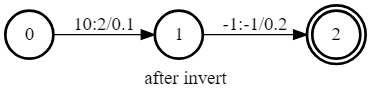

> When `aux_labels` is a ragged tensor, new arcs will be added after the invert.

当 `aux_labels` 是一个不规则张量, 那么在 `k2.invert()` 之后会增加新的边.

> The following code applies `k2.invert()` to an FSA with ragged tensors as `aux_labels`.

下面给出一个使用不规则张量作为 `aux_labels` 的 FSA 的例子.

```python
s = '''
0 1 2 0.1
1 2 -1 0.2
2
'''
fsa = k2.Fsa.from_str(s)
fsa.aux_labels = k2.RaggedTensor('[ [10 20] [-1] ]')
inverted_fsa = k2.invert(fsa)
fsa.draw('before_invert_aux.svg',
         title='before invert with ragged tensors as aux_labels')
inverted_fsa.draw('after_invert_aux.svg', title='after invert')
```

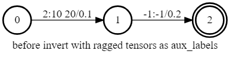
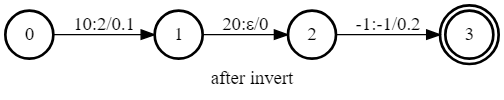

> ***Note***: 
> - `k2.invert()` supports CUDA as well as CPU.
> - autograd is also supported.
> - Its input can be either a single FSA or a FsaVec.

***注意***: 
- `k2.invert()` 支持 CUDA 以及 CPU.
- autograd 也支持.
- 输入可以是单个 FSA 或者 FsaVec.

### arc_sort

> `k2.intersect()` and `k2.compose()` require two arc-sorted inputs. 
> You can use `k2.arc_sort()` to convert an unsorted FSA/FsaVec into a sorted FSA/FsaVec.

`k2.intersect()` 和 `k2.compose()` 都要求两个排序好的 FSA/FsaVec 作为输入.
你可以使用 `k2.arc_sort()` 将一个未排序的 FSA/FsaVec 转换成一个排序好的 FSA/FsaVec.

> An FSA is sorted if for each state, its leaving arcs are sorted by labels in ascending order. 
> If there is a tie, destination states are used for sorting.

一个 FSA 被排序, 即当每个状态的出边按照标签的升序排列.
如果有相同的标签, 则使用目标状态进行排序.

> ***Caution***: Arcs entering the final state have label `-1`. During sorting, `-1` is reinterpreted as an unsigned number. Internally, all labels are reinterpreted as unsigned numbers during sorting.

***注意***: 进入终止状态的边的标签为 `-1`. 在排序时, `-1` 会被解释为无符号数. 排序时, 所有标签都被解释为无符号数.

> An example of `k2.arc_sort()` is given below.

下面给出一个 `k2.arc_sort()` 的例子.

```python
s = '''
0 2 -1  0.0
0 1 2 0.2
0 1 1 0.3
1 2 -1 0.4
2
'''
fsa = k2.Fsa.from_str(s)
sorted_fsa = k2.arc_sort(fsa)
fsa.draw('before_sort.svg', title='before sort')
sorted_fsa.draw('after_sort.svg', title='after sort')
```

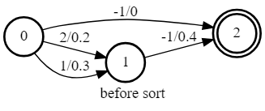
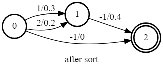

> ***Note***: 
> - `k2.arc_sort()` supports CUDA as well as CPU.
> - autograd is also supported.
> - Its input can be either a single FSA or a FsaVec.

***注意***: 
- `k2.arc_sort()` 支持 CUDA 以及 CPU.
- autograd 也支持.
- 输入可以是单个 FSA 或者 FsaVec.

> ***Hint***: Inside `k2.arc_sort()` it checks whether the input FSA is sorted or not. If the input is already sorted, it is returned directly. Otherwise, a new sorted FSA is returned.

***提示***: `k2.arc_sort()` 内部会检查输入 FSA 是否已经排序. 如果输入已经排序, 则直接返回. 否则, 返回一个新的排序  FSA.

### intersect

> The following is an example of `k2.intersect()`.

下面给出一个 `k2.intersect()` 的例子.

```python
s1 = '''
0 1 0 0.1
0 1 1 0.2
1 1 2 0.3
1 2 -1 0.4
2
'''

s2 = '''
0 1 1 1
0 1 2 2
1 2 -1 3
2
'''

a_fsa = k2.Fsa.from_str(s1)
b_fsa = k2.Fsa.from_str(s2)
c_fsa = k2.intersect(a_fsa, b_fsa)

a_fsa.draw('a_fsa_intersect.svg', title='a_fsa')
b_fsa.draw('b_fsa_intersect.svg', title='b_fsa')
c_fsa.draw('c_fsa_intersect.svg', title='c_fsa')
```

> The outputs are shown below

输出结果如下所示:

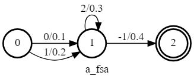
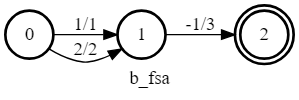


> `k2.intersect()` has an optional argument `treat_epsilons_specially`. 
> Its default value is True. 
> If it is set to False, then the label 0 is treated as a normal label.

`k2.intersect()` 有可选参数 `treat_epsilons_specially`. 
其默认值为 `True`.
如果设置为 `False`, 则标签 0 被视为普通标签.

> The following is an example setting `treat_epsilons_specially` to False.

下面给出一个设置 `treat_epsilons_specially` 为 `False` 的例子.

```python
s1 = '''
0 1 0 0.1
0 1 1 0.2
1 1 2 0.3
1 2 -1 0.4
2
'''

s2 = '''
0 1 1 1
0 1 2 2
1 2 -1 3
2
'''

a_fsa = k2.Fsa.from_str(s1)
b_fsa = k2.Fsa.from_str(s2)
c_fsa = k2.intersect(a_fsa, b_fsa, treat_epsilons_specially=False)

a_fsa.draw('a_fsa_intersect2.svg', title='a_fsa')
b_fsa.draw('b_fsa_intersect2.svg', title='b_fsa')
c_fsa.draw('c_fsa_intersect2.svg', title='c_fsa')
```

> The outputs are shown below

输出结果如下所示:

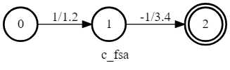

> `k2.add_epsilon_self_loops()` can be used to add epsilon self loops to an FSA when `treat_epsilons_specially` is `False` but you want to treat them specially. 

`k2.add_epsilon_self_loops()` 可以用来在 `treat_epsilons_specially` 为 `False` 时, 将 epsilon 自环添加到 FSA 中, 但你希望将它们视为特殊情况.

> The following is an example using `k2.add_epsilon_self_loops()` with `treat_epsilons_specially == False`.

下面给出一个使用 `k2.add_epsilon_self_loops()` 并设置 `treat_epsilons_specially` 为 `False` 的例子.

```python
s1 = '''
0 1 0 0.1
0 1 1 0.2
1 1 2 0.3
1 2 -1 0.4
2
'''

s2 = '''
0 1 1 1
0 1 2 2
1 2 -1 3
2
'''

a_fsa = k2.Fsa.from_str(s1)
b_fsa = k2.Fsa.from_str(s2)
b_fsa = k2.add_epsilon_self_loops(b_fsa)
c_fsa = k2.intersect(a_fsa, b_fsa, treat_epsilons_specially=False)

a_fsa.draw('a_fsa_intersect3.svg', title='a_fsa')
b_fsa.draw('b_fsa_intersect3.svg', title='b_fsa')
c_fsa.draw('c_fsa_intersect3.svg', title='c_fsa')
```

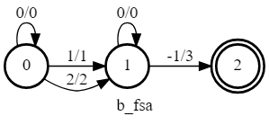
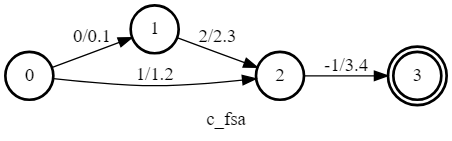

> Note that `c_fsa` contains two paths even if `treat_epsilons_specially` is `False` since we have added epsilon self loops to `b_fsa`.

注意 `c_fsa` 包含两条路径, 即使 `treat_epsilons_specially` 为 `False`, 因为我们已经将 epsilon 自环添加到 `b_fsa` 中.

> ***Note***: 
> - `k2.intersect()` works ONLY on CPU when `treat_epsilons_specially=True`. 
> When `treat_epsilons_specially=False` and both `a_fsa` and `b_fsa` are on GPU, then this function works on GPU; 
> in this case, the two input FSAs do not need to be arc sorted.
> - autograd is also supported.
> - Its input can be either a single FSA or a FsaVec.
> - The input FSAs have to be arc sorted when `treat_epsilons_specially=True`.

***注意***:
- `k2.intersect()` 在 `treat_epsilons_specially=True` 时仅支持 CPU.
  当 `treat_epsilons_specially=False` 且 `a_fsa` 和 `b_fsa` 都在 GPU 上时, 则该函数在 GPU 上运行; 
在这种情况下, 输入 FSA 不需要排序.
- autograd 也支持.
- 输入可以是单个 FSA 或者 FsaVec.
- 当 `treat_epsilons_specially=True` 时, 输入 FSA 必须排序.

### compose

> The composition is a straightforward generalization of the intersection from acceptors to transducers. The following is an example of `k2.compose()`.

组合是从接受器到转换器的交集的直接推广. 
下面给出一个 `k2.compose()` 的例子.

```python
s = '''
0 1 1 1 0
1 2 2 2 0
2 3 -1 -1 0
3
'''

a_fsa = k2.ctc_topo(max_token=2, modified=False) 
b_fsa = k2.Fsa.from_str(s, acceptor=False)
c_fsa = k2.compose(a_fsa, b_fsa)

a_fsa.draw('a_fsa_compose.svg', title='a_fsa')
b_fsa.draw('b_fsa_compose.svg', title='b_fsa')
c_fsa.draw('c_fsa_compose.svg', title='c_fsa')
```

> The outputs are shown below

下面给出输出结果:

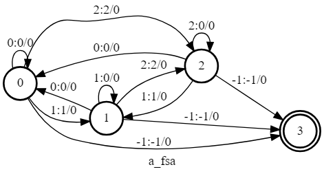

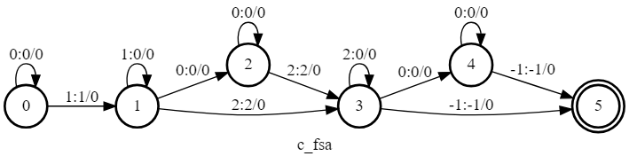

> `k2.compose()` has an optional argument `treat_epsilons_specially`. 
> Its default value is `True`. 
> If it is set to `False`, then the label 0 is treated as a normal label. 

`k2.compose()` 有可选参数 `treat_epsilons_specially`. 
其默认值为 `True`.
如果设置为 `False`, 则标签 0 被视为普通标签.

> The following is an example setting `treat_epsilons_specially` to `False`.

下面给出一个设置 `treat_epsilons_specially` 为 `False` 的例子.

```python
s = '''
0 1 1 1 0
1 2 2 2 0
2 3 -1 -1 0
3
'''

a_fsa = k2.ctc_topo(max_token=2, modified=False) 
b_fsa = k2.Fsa.from_str(s, acceptor=False)
c_fsa = k2.compose(a_fsa, b_fsa, treat_epsilons_specially=False)

a_fsa.draw('a_fsa_compose2.svg', title='a_fsa')
b_fsa.draw('b_fsa_compose2.svg', title='b_fsa')
c_fsa.draw('c_fsa_compose2.svg', title='c_fsa')
```

> The outputs are shown below

输出结果如下所示:

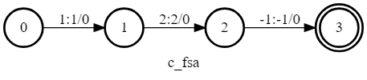

> Note that `c_fsa` contains a single path when `treat_epsilons_specially` is `False`.

注意到 `c_fsa` 只包含一条路径, 即使 `treat_epsilons_specially` 为 `False`.

> `k2.add_epsilon_self_loops()` can be used to add epsilon self loops to an FSA when `treat_epsilons_specially` is `False` but you want to treat them specially. 

`k2.add_epsilon_self_loops()` 可以用来在 `treat_epsilons_specially` 为 `False` 时, 将 epsilon 自环添加到 FSA 中, 但你希望将它们视为特殊情况.

> The following is an example using `k2.add_epsilon_self_loops()` with `treat_epsilons_specially == False`.

下面给出一个使用 `k2.add_epsilon_self_loops()` 并设置 `treat_epsilons_specially` 为 `False` 的例子.

```python
s = '''
0 1 1 1 0
1 2 2 2 0
2 3 -1 -1 0
3
'''

a_fsa = k2.ctc_topo(max_token=2, modified=False)
b_fsa = k2.Fsa.from_str(s, acceptor=False)
b_fsa = k2.add_epsilon_self_loops(b_fsa)
c_fsa = k2.compose(a_fsa, b_fsa, treat_epsilons_specially=False)

a_fsa.draw('a_fsa_compose3.svg', title='a_fsa')
b_fsa.draw('b_fsa_compose3.svg', title='b_fsa')
c_fsa.draw('c_fsa_compose3.svg', title='c_fsa')
```

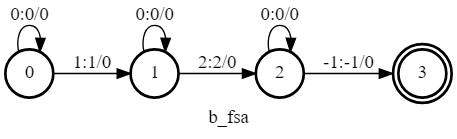


> Note that `c_fsa` contains more than one paths even if `treat_epsilons_specially` is `False` since we have added epsilon self loops to `b_fsa`.

注意到 `c_fsa` 包含多条路径, 即使 `treat_epsilons_specially` 为 `False`, 因为我们已经将 epsilon 自环添加到 `b_fsa` 中.

> ***Note***: 
> - `k2.compose()` works ONLY on CPU when `treat_epsilons_specially=True`. 
> When `treat_epsilons_specially=False` and both `a_fsa` and `b_fsa` are on GPU, then this function works on GPU; 
> in this case, the two input FSAs do not need to be arc sorted.
> - autograd is also supported.
> - Its input can be either a single FSA or a FsaVec.
> - The input FSAs have to be arc sorted when treat_epsilons_specially=True.

***注意***:
- `k2.compose()` 在 `treat_epsilons_specially=True` 时仅支持 CPU.
  当 `treat_epsilons_specially=False` 且 `a_fsa` 和 `b_fsa` 都在 GPU 上时, 则该函数在 GPU 上运行; 
  在这种情况下, 输入 FSA 不需要排序.
- autograd 也支持.
- 输入可以是单个 FSA 或者 FsaVec.
- 当 `treat_epsilons_specially=True` 时, 输入 FSA 必须排序.

### connect

> `k2.connect()` removes states that are neither accessible nor co-accessible. 
> It is often used after `k2.intersect()` or `k2.compose()`.

`k2.connect()` 移除不可达状态和不可交通状态. 
它通常在 `k2.intersect()` 或 `k2.compose()` 之后使用.

> The following is an example.

下面给出一个例子.

```python
s1 = '''
0 0 1 0.1
0 1 2 0.2
1 2 -1 0.3
2
'''
s2 = '''
0 1 1 1
0 1 2 2
1 2 -1 3
2
'''
a_fsa = k2.Fsa.from_str(s1)
b_fsa = k2.Fsa.from_str(s2)
c_fsa = k2.intersect(a_fsa, b_fsa)
connected = k2.connect(c_fsa)
a_fsa.draw('a_fsa_1.svg', title='a_fsa')
b_fsa.draw('b_fsa_1.svg', title='b_fsa')
c_fsa.draw('before_connect.svg', title='intersect(a_fsa, b_fsa)')
connected.draw('after_connect.svg', title='after connect')
```
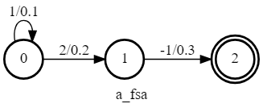

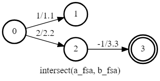
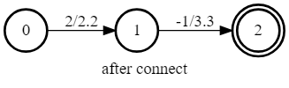

> ***Note***: 
> - k2.connect() supports ONLY CPU
> - autograd is also supported.
> - Its input can be either a single FSA or a FsaVec.

***注意***:
- `k2.connect()` 只支持 CPU.
- autograd 也支持.
- 输入可以是单个 FSA 或者 FsaVec.

### get_forward_scores

> `k2.Fsa.get_forward_scores()` computes and returns forward scores per state (like alphas in Baum-Welch) or forward best-path scores if `log_semiring` is `False`.

若 `log_semiring` 为 `False`, `k2.Fsa.get_forward_scores()` 计算每个状态的前向分数 (类似于 Baum-Welch 中的 alphas) 或前向最佳路径分数.
 
> ***Caution***: Arc scores are in log scale.

***注意***: 边分数以对数尺度表示.

> We will use the following code as an example to demonstrate how `k2.Fsa.get_forward_scores()` works in k2.

我们将使用以下代码作为示例, 展示 `k2.Fsa.get_forward_scores()` 在 k2 中的工作原理.

```python
s = '''
0 1 1 1.2
0 1 3 0.8
0 2 2 0.5
1 2 5 0.1
1 3 -1 0.6
2 3 -1 0.4
3
'''
fsa = k2.Fsa.from_str(s)
fsa.draw('get_forward_scores.svg', title='get_forward_scores example')
fsa_vec = k2.create_fsa_vec([fsa])
log_semiring = fsa_vec.get_forward_scores(use_double_scores=True,
                                          log_semiring=True)
tropical_semiring = fsa_vec.get_forward_scores(use_double_scores=True,
                                               log_semiring=False)
print('get_forward_scores for log semiring:', log_semiring)
print('get_forward_scores for tropical semiring:', tropical_semiring)
get_forward_scores
```
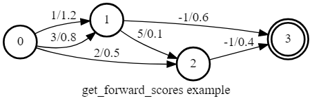

> The outputs are:

输出结果如下:

```python
get_forward_scores for log semiring: 
tensor([0.0000, 1.7130, 2.0513, 3.0777], dtype=torch.float64)

get_forward_scores for tropical semiring: 
tensor([0.0000, 1.2000, 1.3000, 1.8000], dtype=torch.float64)
```

> `k2.Fsa.get_forward_scores()` has two arguments:
> - `use_double_scores`
> When it is `True`, double precision floats are used in the computation and the returned tensor has dtype `torch.float64`; 
> when it is `False`, the computation uses single precision floats and returned tensor’s dtype is `torch.float32`.
> - `log_semiring`
> When it is `True`, this function combines path scores with LogAdd, e.g., $\log(e^a + e^b)$. 
> When it is `False`, path scores are combined with $\max(a, b)$

`k2.Fsa.get_forward_scores()` 有两个参数:
- `use_double_scores`
当它为 `True` 时, 计算使用双精度浮点数, 返回的张量的 dtype 为 `torch.float64`; 
当它为 `False` 时, 计算使用单精度浮点数, 返回的张量的 dtype 为 `torch.float32`.
- `log_semiring`
当它为 `True` 时, 该函数将路径分数与 LogAdd 相结合, 例如 $\log(e^a + e^b)$. 
当它为 `False` 时, 路径分数与 $\max(a, b)$ 相结合.

> The following two subsections illustrate step by step how to obtain the above printed results. For ease of reference, we use $f_i$ to denote the forward score of state `i`.

下面两个小节详细说明了如何获得以上打印出的结果. 为了便于参考, 我们使用 $f_i$ 表示状态 `i` 的前向分数.

#### `log_semiring==True`

> It uses LogAdd to combine path scores.
> 1. State 0 is the start state and $f_0$ is defined to be 0.
> 2. $f_1$ is computed with the following formula: $f_1 = \log(e^{f_0 + 1.2} + e^{f_0 + 0.8}) = \log(e^{1.2} + e^{0.8}) = 1.7130$
> where 1.2 is the score of one of the two arcs from state 0 to state 1; 0.8 is the score of the other arc from state 0 to state 1.
> 3. $f_2$ is computed by: $f_2 = \log(e^{f_0 + 0.5} + e^{f_1 + 0.1}) = \log(e^{0.5} + e^{1.8130}) = 2.0513$
> 4. $f_3$ can be computed from $f_1$ and $f_2$: $f_3 = \log(e^{f_1 + 0.6} + e^{f_2 + 0.4}) = \log(e^{2.3130} + e^{2.4513}) = 3.0777$

将使用 `LogAdd` 结合路径分数.
1. 状态 0 是起始状态, 且 $f_0$ 定义为 0.
2. $f_1$ 由以下公式计算:
   $f_1 = \log(e^{f_0 + 1.2} + e^{f_0 + 0.8}) = \log(e^{1.2} + e^{0.8}) = 1.7130$
   其中 1.2 是状态 0 到状态 1 的两条边的分数之一, 0.8 是另一条边的分数.
3. $f_2$ 由以下公式计算:
   $f_2 = \log(e^{f_0 + 0.5} + e^{f_1 + 0.1}) = \log(e^{0.5} + e^{1.8130}) = 2.0513$
4. $f_3$ 可以由 $f_1$ 和 $f_2$ 计算得出:
   $f_3 = \log(e^{f_1 + 0.6} + e^{f_2 + 0.4}) = \log(e^{2.3130} + e^{2.4513}) = 3.0777$

#### `log_semiring==False`

> It uses `max` to combine path scores.
> - State 0 is the start state and $f_0$ is defined to be 0
> - $f_1 = \max(f_0 + 1.2, f_0 + 0.8) = \max(1.2, 0.8) = 1.2$
> - $f_2 = \max(f_0 + 0.5, f_1 + 0.1) = \max(0.5, 1.3) = 1.3$
> - $f_3 = \max(f_1 + 0.6, f_2 + 0.4) = \max(1.8, 1.7) = 1.8$

将使用 `max` 结合路径分数.
- 状态 0 是起始状态, 且 $f_0$ 定义为 0
- $f_1 = \max(f_0 + 1.2, f_0 + 0.8) = \max(1.2, 0.8) = 1.2$
- $f_2 = \max(f_0 + 0.5, f_1 + 0.1) = \max(0.5, 1.3) = 1.3$
- $f_3 = \max(f_1 + 0.6, f_2 + 0.4) = \max(1.8, 1.7) = 1.8$

> ***Note***: 
> - `k2.Fsa.get_forward_scores()` supports CUDA as well as CPU.
> - autograd is also supported.
> - It supports only FsaVec.

***注意***:
- `k2.Fsa.get_forward_scores()` 支持 CUDA 以及 CPU.
- autograd 也支持.
- 仅支持 FsaVec.

### get_tot_scores

> `k2.Fsa.get_tot_scores()` computes and returns forward scores of the final state of each FSA. 
> Refer to `get_forward_scores` for how to compute forward scores.

`k2.Fsa.get_tot_scores()` 计算并返回每个 FSA 的最终状态的前向分数. 
参考 `get_forward_scores` 了解如何计算前向分数.

> The following is an example of `k2.Fsa.get_tot_scores()`.

下面给出一个 `k2.Fsa.get_tot_scores()` 的例子.

```python
s = '''
0 1 1 1.2
0 1 3 0.8
0 2 2 0.5
1 2 5 0.1
1 3 -1 0.6
2 3 -1 0.4
3
'''
fsa = k2.Fsa.from_str(s)
fsa.draw('get_tot_scores.svg', title='get_tot_scores example')
fsa_vec = k2.create_fsa_vec([fsa])
log_semiring = fsa_vec.get_tot_scores(use_double_scores=True,
                                      log_semiring=True)
tropical_semiring = fsa_vec.get_tot_scores(use_double_scores=True,
                                           log_semiring=False)
print('get_tot_scores for log semiring:', log_semiring)
print('get_tot_scores for tropical semiring:', tropical_semiring)
get_tot_scores
```
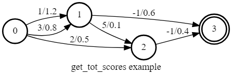

> It prints:

输出结果如下:

```
get_tot_scores for log semiring: tensor([3.0777], dtype=torch.float64)
get_tot_scores for tropical semiring: tensor([1.8000], dtype=torch.float64)
```

> ***Note***: 
> - `k2.Fsa.get_tot_scores()` supports CUDA as well as CPU.
> - autograd is also supported.
> - It supports only FsaVec.

***注意***:
- `k2.Fsa.get_tot_scores()` 支持 CUDA 以及 CPU.
- autograd 也支持.
- 仅支持 FsaVec.

## _k2·_k2 教程

If you have used PyTorch, you have probably seen `torch._C`

若你使用过 PyTorch, 那么你可能已经看过 `torch._C`

```
import torch
import torch._C
print(torch._C.__file__)
/star-fj/fangjun/py38/lib/python3.8/site-packages/torch/_C.cpython-38-x86_64-linux-gnu.so
```

> Similarly, we have `_k2` in k2:

类似地, 在 k2 中也有 `_k2`

```
import torch
import _k2
print(_k2.__file__)
/root/fangjun/open-source/k2/build-cpu-debug/lib/_k2.cpython-38-x86_64-linux-gnu.so
```

> You can see that both `_C` and `_k2` are contained in a shared library because they are implemented in C++.

你可以看到 `_C` 和 `_k2` 都包含在一个共享库中, 因为它们都是用 C++ 实现的.

> ***Hint***: In case you are interested in how to wrap C++ code to Python, please have a look at pybind11.

***提示***: 若你感兴趣于如何将 C++ 代码封装到 Python 中, 请参考 pybind11.

### How to debug `_k2`·如何调试 `_k2`

> This section introduces how to debug `_k2`.

本节介绍了如何调试 `_k2`.

#### Code with bugs

> Suppose you have the following `buggy` code,

假设你有如下 `buggy` 代码:

```python
#!/usr/bin/env python3

import k2

tensor = k2.RaggedTensor([[1, 2], [3]])
print(tensor[2])
```

#### Error logs of the buggy code

> After running it, you would get the following error logs:

在运行后, 你会得到如下错误日志:

```
[F] /root/fangjun/open-source/k2/k2/csrc/array.h:178:k2::Array1<T> k2::Array1<T>::Arange(int32_t, int32_t) const [with T = int; int32_t = int] Check failed: end >= start (0 vs. 3) 


[ Stack-Trace: ]
/root/fangjun/open-source/k2/build-cpu-debug/lib/libk2_log.so(k2::internal::GetStackTrace()+0x5b) [0x7f716d321105]
/root/fangjun/open-source/k2/build-cpu-debug/lib/_k2.cpython-38-x86_64-linux-gnu.so(+0xb52e2) [0x7f716dc362e2]
/root/fangjun/open-source/k2/build-cpu-debug/lib/_k2.cpython-38-x86_64-linux-gnu.so(+0x1b8676) [0x7f716dd39676]
/root/fangjun/open-source/k2/build-cpu-debug/lib/_k2.cpython-38-x86_64-linux-gnu.so(+0x1eab1d) [0x7f716dd6bb1d]
/root/fangjun/open-source/k2/build-cpu-debug/lib/_k2.cpython-38-x86_64-linux-gnu.so(+0x1fbf7f) [0x7f716dd7cf7f]
/root/fangjun/open-source/k2/build-cpu-debug/lib/_k2.cpython-38-x86_64-linux-gnu.so(+0x1fa291) [0x7f716dd7b291]
/root/fangjun/open-source/k2/build-cpu-debug/lib/_k2.cpython-38-x86_64-linux-gnu.so(+0x1f4b2f) [0x7f716dd75b2f]
/root/fangjun/open-source/k2/build-cpu-debug/lib/_k2.cpython-38-x86_64-linux-gnu.so(+0x1f4ba3) [0x7f716dd75ba3]
/root/fangjun/open-source/k2/build-cpu-debug/lib/_k2.cpython-38-x86_64-linux-gnu.so(+0x916e0) [0x7f716dc126e0]
/star-fj/fangjun/open-source/pyenv/versions/3.8.0/lib/libpython3.8.so.1.0(PyCFunction_Call+0xf5) [0x7f723baa2535]
/star-fj/fangjun/open-source/pyenv/versions/3.8.0/lib/libpython3.8.so.1.0(_PyObject_MakeTpCall+0x9e) [0x7f723ba9f80e]
/star-fj/fangjun/open-source/pyenv/versions/3.8.0/lib/libpython3.8.so.1.0(+0xa3c8b) [0x7f723baa3c8b]
/star-fj/fangjun/open-source/pyenv/versions/3.8.0/lib/libpython3.8.so.1.0(+0x11b93e) [0x7f723bb1b93e]
/star-fj/fangjun/open-source/pyenv/versions/3.8.0/lib/libpython3.8.so.1.0(+0x11baa7) [0x7f723bb1baa7]
/star-fj/fangjun/open-source/pyenv/versions/3.8.0/lib/libpython3.8.so.1.0(PyObject_GetItem+0x49) [0x7f723ba85de9]
/star-fj/fangjun/open-source/pyenv/versions/3.8.0/lib/libpython3.8.so.1.0(_PyEval_EvalFrameDefault+0x5025) [0x7f723ba72355]
/star-fj/fangjun/open-source/pyenv/versions/3.8.0/lib/libpython3.8.so.1.0(_PyEval_EvalCodeWithName+0xb67) [0x7f723bba0f47]
/star-fj/fangjun/open-source/pyenv/versions/3.8.0/lib/libpython3.8.so.1.0(PyEval_EvalCodeEx+0x3e) [0x7f723bba0ffe]
/star-fj/fangjun/open-source/pyenv/versions/3.8.0/lib/libpython3.8.so.1.0(PyEval_EvalCode+0x1b) [0x7f723bba102b]
/star-fj/fangjun/open-source/pyenv/versions/3.8.0/lib/libpython3.8.so.1.0(PyRun_FileExFlags+0x122) [0x7f723bbe6902]
/star-fj/fangjun/open-source/pyenv/versions/3.8.0/lib/libpython3.8.so.1.0(PyRun_SimpleFileExFlags+0xfd) [0x7f723bbe6add]
/star-fj/fangjun/open-source/pyenv/versions/3.8.0/lib/libpython3.8.so.1.0(Py_RunMain+0x7a0) [0x7f723bc0a750]
/star-fj/fangjun/open-source/pyenv/versions/3.8.0/lib/libpython3.8.so.1.0(Py_BytesMain+0x56) [0x7f723bc0ac26]
/lib/x86_64-linux-gnu/libc.so.6(__libc_start_main+0xe7) [0x7f723b630bf7]
python3(_start+0x2a) [0x55f05c1e378a]

Traceback (most recent call last):
  File "test.py", line 6, in <module>
    print(tensor[2])
RuntimeError: 
    Some bad things happened. Please read the above error messages and stack
    trace. If you are using Python, the following command may be helpful:

      gdb --args python /path/to/your/code.py

    (You can use `gdb` to debug the code. Please consider compiling
    a debug version of k2.).

    If you are unable to fix it, please open an issue at:

      https://github.com/k2-fsa/k2/issues/new
```

#### Ways to debug·调试方法

#TODO 添加内部链接

> In order debug it, please first follow [Build a debug version](https://k2-fsa.github.io/k2/installation/for_developers.html#build-a-debug-version) to build a debug version of k2 so that you can use `gdb` to debug the code.

为了调试它, 请首先按照 [Build a debug version](https://k2-fsa.github.io/k2/installation/for_developers.html#build-a-debug-version) 指示, 构建一个调试版的 k2, 这样你就可以使用 `gdb` 调试代码了.

> ***Note***: Since the underlying implementation is in C++ you can you use `gdb` to debug it, even if you are using Python.

***注意***: 由于底层实现是用 C++ 实现的, 所以你可以使用 `gdb` 调试它, 即使你使用 Python.

> First, let us use `gdb` to run our code:

首先, 使用 `gdb` 运行我们的代码:

```
(py38) kuangfangjun:build-cpu-debug$ gdb --args python3 ./test.py
```

> You will see the following output:

你将看到如下输出:

```
GNU gdb (Ubuntu 8.1-0ubuntu3.2) 8.1.0.20180409-git
Copyright (C) 2018 Free Software Foundation, Inc.
License GPLv3+: GNU GPL version 3 or later <http://gnu.org/licenses/gpl.html>
This is free software: you are free to change and redistribute it.
There is NO WARRANTY, to the extent permitted by law.  Type "show copying"
and "show warranty" for details.
This GDB was configured as "x86_64-linux-gnu".
Type "show configuration" for configuration details.
For bug reporting instructions, please see:
<http://www.gnu.org/software/gdb/bugs/>.
Find the GDB manual and other documentation resources online at:
<http://www.gnu.org/software/gdb/documentation/>.
For help, type "help".
Type "apropos word" to search for commands related to "word"...
Reading symbols from python3...done.
warning: File "/star-fj/fangjun/open-source/pyenv/versions/3.8.0/bin/python3.8-gdb.py" auto-loading has been declined by your `auto-load safe-path' set to "$debugdir:$datadir/auto-load".
To enable execution of this file add
        add-auto-load-safe-path /star-fj/fangjun/open-source/pyenv/versions/3.8.0/bin/python3.8-gdb.py
line to your configuration file "/root/fangjun/.gdbinit".
To completely disable this security protection add
        set auto-load safe-path /
line to your configuration file "/root/fangjun/.gdbinit".
For more information about this security protection see the
"Auto-loading safe path" section in the GDB manual.  E.g., run from the shell:
        info "(gdb)Auto-loading safe path"
(gdb)
```

> Next, enter `catch throw` so that it stops the process on exception:

然后输入 `catch throw` 命令, 这样程序会在异常发生时停止:

```
(gdb) catch throw
Catchpoint 1 (throw)
```

> Then we can run the program with `run`:

然后我们可以使用 `run` 命令运行程序:

```
(gdb) run
Starting program: /star-fj/fangjun/py38/bin/python3 ./test.py
[Thread debugging using libthread_db enabled]
Using host libthread_db library "/lib/x86_64-linux-gnu/libthread_db.so.1".
[New Thread 0x7fff90f66700 (LWP 1184088)]
[New Thread 0x7fff90765700 (LWP 1184089)]
... ...
[F] /root/fangjun/open-source/k2/k2/csrc/array.h:179:k2::Array1<T> k2::Array1<T>::Arange(int32_t, int32_t) const [with T = int; int32_
t = int] Check failed: end <= dim_ (32767 vs. 3)


[ Stack-Trace: ]
/root/fangjun/open-source/k2/build-cpu-debug/lib/libk2_log.so(k2::internal::GetStackTrace()+0x5b) [0x7fff2913c105]
/root/fangjun/open-source/k2/build-cpu-debug/lib/_k2.cpython-38-x86_64-linux-gnu.so(+0xb52e2) [0x7fff29a512e2]
... ...
/lib/x86_64-linux-gnu/libc.so.6(__libc_start_main+0xe7) [0x7ffff7458bf7]
/star-fj/fangjun/py38/bin/python3(_start+0x2a) [0x55555555478a]


Thread 1 "python3" hit Catchpoint 1 (exception thrown), 0x00007ffff2553d1d in __cxa_throw ()
   from /usr/lib/x86_64-linux-gnu/libstdc++.so.6
(gdb)
```

> We can find the backtrace with `backtrace`:

我们可以使用 `backtrace` 命令查看回溯:

```
(gdb) backtrace
#0  0x00007ffff2553d1d in __cxa_throw () from /usr/lib/x86_64-linux-gnu/libstdc++.so.6
#1  0x00007fff29a51365 in k2::internal::Logger::~Logger (this=0x7fffffffd5e0, __in_chrg=<optimized out>)
    at /root/fangjun/open-source/k2/k2/csrc/log.h:195
#2  0x00007fff29b54786 in k2::Array1<int>::Arange (this=0x555558db63f8, start=3, end=32767)
    at /root/fangjun/open-source/k2/k2/csrc/array.h:179
#3  0x00007fff29b86b1d in k2::<lambda(k2::RaggedAny&, int32_t)>::operator()(k2::RaggedAny &, int32_t) const (
    __closure=0x555558d973e8, self=..., i=2) at /root/fangjun/open-source/k2/build-cpu-debug/k2/python/csrc/torch/v2/any.cc:107
#4  0x00007fff29b97f7f in pybind11::detail::argument_loader<k2::RaggedAny&, int>::call_impl<pybind11::object, k2::PybindRaggedAny(pybind11::module&)::<lambda(k2::RaggedAny&, int32_t)>&, 0, 1, pybind11::detail::void_type>(k2::<lambda(k2::RaggedAny&, int32_t)> &, std::index_sequence, pybind11::detail::void_type &&) (this=0x7fffffffd820, f=...)
    at /star-fj/fangjun/open-source/k2/build-cpu-debug/_deps/pybind11-src/include/pybind11/cast.h:1439
#5  0x00007fff29b96291 in pybind11::detail::argument_loader<k2::RaggedAny&, int>::call<pybind11::object, pybind11::detail::void_type,
k2::PybindRaggedAny(pybind11::module&)::<lambda(k2::RaggedAny&, int32_t)>&>(k2::<lambda(k2::RaggedAny&, int32_t)> &) (
    this=0x7fffffffd820, f=...) at /star-fj/fangjun/open-source/k2/build-cpu-debug/_deps/pybind11-src/include/pybind11/cast.h:1408
#6  0x00007fff29b90b2f in pybind11::cpp_function::<lambda(pybind11::detail::function_call&)>::operator()(pybind11::detail::function_call &) const (__closure=0x0, call=...)
    at /root/fangjun/open-source/k2/build-cpu-debug/_deps/pybind11-src/include/pybind11/pybind11.h:249
#7  0x00007fff29b90ba3 in pybind11::cpp_function::<lambda(pybind11::detail::function_call&)>::_FUN(pybind11::detail::function_call &)
    () at /root/fangjun/open-source/k2/build-cpu-debug/_deps/pybind11-src/include/pybind11/pybind11.h:224
#8  0x00007fff29a2d6e0 in pybind11::cpp_function::dispatcher (self=0x7fff29fd4a50, args_in=0x7ffff64adb40, kwargs_in=0x0)
    at /root/fangjun/open-source/k2/build-cpu-debug/_deps/pybind11-src/include/pybind11/pybind11.h:929
#9  0x00007ffff78ca535 in cfunction_call_varargs (kwargs=<optimized out>, args=<optimized out>, func=0x7fff29fd6310)
    at Objects/call.c:742
```

> The remaining steps are the same for debugging a C/C++ program with `gdb`.

剩余的步骤和调试 C/C++ 程序的 `gdb` 过程相同.

#### Summary

> The most important parts of the debugging process are:
> 1. Build a debug version of k2
> 2. Run `catch throw`
> 3. View the backtrace on exception

调试过程的关键步骤有:
1. 构建 k2 的调试版本
2. 运行`catch throw`
3. 异常发生时查看回溯