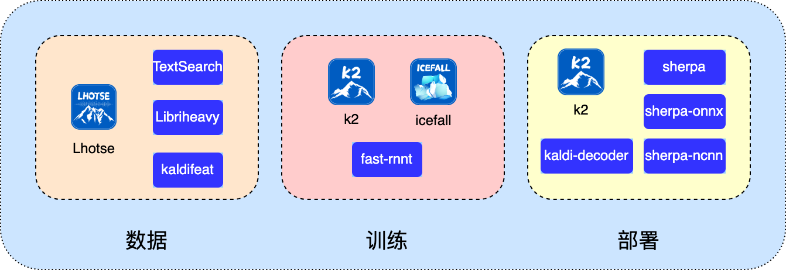

# 新一代 Kaldi

- [Github](https://github.com/k2-fsa/)
- [Github 文档 1.24.4](https://k2-fsa.github.io/k2/index.html)
- [中文主页](https://k2-fsa.org/zh-CN)
- [知乎主页](https://www.zhihu.com/people/yaozengwei)

## 简介

新一代 Kaldi 是一个开源的智能语音工具集, 几乎涵盖了构建智能语音系统的方方面面.

下图简单罗列了新一代 Kaldi 的项目矩阵, 包括从数据, 训练到部署全链条.

从[什么是 Next-Gen Kaldi](https://mp.weixin.qq.com/s/f0vpatseghLi2piYpUpmQQ) 可以了解到新一代 Kaldi 的起源与故事.

## 示例入口

智能语音领域包含非常多的子任务和子领域，新一代 Kaldi 目前支持语音识别(ASR)、语音合成(TTS)、关键词检测(KWS)、话音检测(VAD)、说话人识别(Speaker identification)、语种识别(Spoken language identification) 等等。其中有些提供了包含训练和部署全链路的技术，有些是基于优秀的第三方开源库做的部署支持，具体细节如下所示：

|任务|训练|部署|
|---|:-:|:-:|
|语音识别 (ASR)|[文档]()|[文档]()|
|语音合成 (TTS)|[文档]()|[文档]()|
|关键词 (KWS)|[文档]()|[文档]()|
|话音检测 (VAD)|×|[文档]()|
|说话人识别 (Speaker identification)|×|[文档]()|
|语种识别 (Spoken language identification)|×|[文档]()|

## [核心概念](Core.md)

## 相关论文

- **Zipformer**: A Faster and Better Encoder for Automatic Speech Recognition
  作者: 姚增伟, 郭理勇, 杨笑宇, 康魏, 匡方军, 杨亦凡, 金增锐, 林珑, Daniel Povey
  [ArXiv](https://arxiv.org/abs/2310.11230) 2023.10.17v1 → 2024.04.10v4
  ICLR 2024
  [开源代码 IceFall](https://github.com/k2-fsa/icefall/blob/master/egs/librispeech/ASR/zipformer/zipformer.py)
  [官方解读](https://k2-fsa.org/zh-CN/blog/2023/12/15/zipformer-details/)

- **Libriheavy**: A 50,000 Hours ASR Corpus with Punctuation Casing and Context
  康魏, 杨笑宇, 姚增伟, 匡方军, 杨亦凡, 郭理勇, 林珑, Daniel Povey
  [Arxiv](https://arxiv.org/abs/2309.08105) 2023.09.15v1 → 2024.01.15v2
  ICASSP 2024
  [开源代码](https://github.com/k2-fsa/libriheavy)

- PromptASR for Contextualized ASR with Controllable Style
  杨笑宇, 康魏, 姚增伟, 杨亦凡, 郭理勇, 匡方军, 林珑, Daniel Povey
  [ArXiv](https://arxiv.org/abs/2309.07414) 2023.09.14v1 → 2024.01.24v3
  ICASSP 2024
  [开源代码 IceFall](https://github.com/k2-fsa/icefall/pull/1250)

- Blank-Regularized CTC for Frame Skipping in Neural Transducer 
  杨亦凡, 杨笑宇, 郭理勇, 姚增伟, 康魏, 匡方军, 林珑, Xie Chen, Daniel Povey
  [ArXiv](https://arxiv.org/abs/2305.11558) 2023.05.19v1
  Interspeech 2023
  [开源代码 Icefall](https://github.com/k2-fsa/icefall/pull/730)

- Delay-Penalized CTC Implemented Based on Finite State Transducer
  姚增伟, 康魏, 匡方军, 郭理勇, 杨笑宇, 杨亦凡, 林珑, Daniel Povey
  [ArXiv](https://arxiv.org/abs/2305.11539) 2023.05.19v1
  Interspeech 2023
  [开源代码 Icefall](https://github.com/k2-fsa/icefall/pull/669)

- Delay-Penalized Transducer for Low-Latency Streaming ASR
  康魏, 姚增伟, 匡方军, 郭理勇, 杨笑宇, 林珑, Piotr Żelasko, Daniel Povey
  [ArXiv](https://arxiv.org/abs/2211.00490) 2022.10.31v1
  ICASSP 2023
  [开源代码 IceFall](https://github.com/k2-fsa/icefall/pull/654)
  [开源代码 k2](https://github.com/k2-fsa/k2/pull/976)

- Fast and Parallel Decoding for Transducer
  康魏, 郭理勇, 匡方军, 林珑, 罗明双, 姚增伟, 杨笑宇, Piotr Żelasko, Daniel Povey
  [ArXiv](https://arxiv.org/abs/2211.00484) 2022.10.31v1
  ICASSP 2023
  [开源代码 IceFall](https://github.com/k2-fsa/icefall/pull/250)
  [开源代码 k2](https://github.com/k2-fsa/k2/pull/926)

- Predicting Multi-Codebook Vector Quantization Indexes for Knowledge Distillation
  郭理勇, 杨笑宇, 王全东, 孔玉祥, 姚增伟, Fan Cui, 匡方军, 康魏, 林珑, 罗明双, Piotr Żelasko, Daniel Povey, 
  [ArXiv](https://arxiv.org/abs/2211.00508) 2022.10.31v1
  ICASSP 2023
  [开源代码 Icefall](https://github.com/k2-fsa/icefall/pull/387)
  
- Pruned RNN-T for Fast, Memory-Efficient ASR Training
  匡方军, 郭理勇, 康魏, 林珑, 罗明双, 姚增伟, Daniel Povey
  [ArXiv](https://arxiv.org/abs/2206.13236) 2022.06.23v1
  Interspeech 2022
  [开源代码 k2](https://github.com/k2-fsa/k2/pull/891)