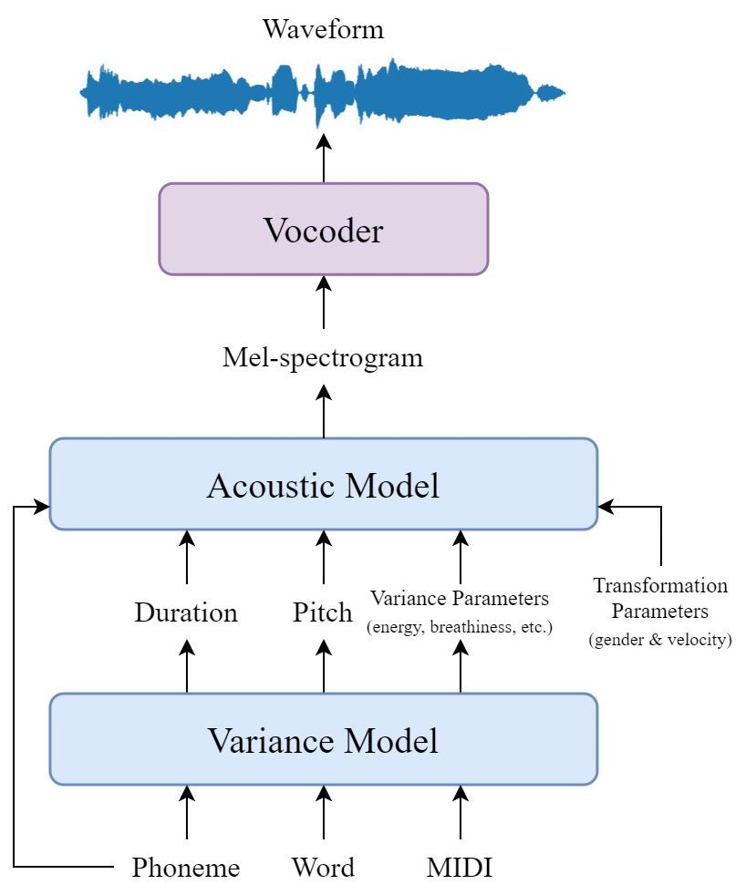
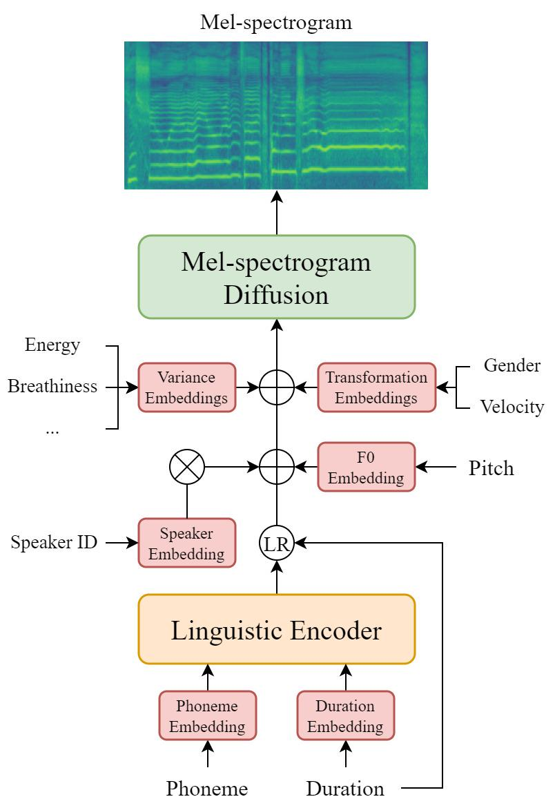
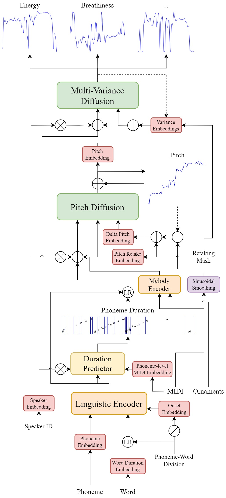

# DiffSinger (OpenVPI 维护版本)

## DiffSinger 声库制作简介

- [中文原文: 飞书文档](https://ecn4x4y9jhjs.feishu.cn/wiki/KUYxw1zmQiBSybkEnYUcj01pnwb)

### 1.工作原理简介

一个完整的 DiffSinger 声库包括了**声学 (Acoustic) 模型**和**唱法 (Variance) 模型**两部分.

**声学模型**
- 必须的输入信息有:
  - 音素序列 (Phoneme),
  - 音素持续时间序列 (Duration),
  - 音高 (Pitch)
- 可选的输入信息有:
  - 唱法联合预测参数 (Variance Parameters), 即气声/张力等.
    - 这些曲线参数是从录音中提取的特征, 可以控制唱歌声音的音色和风格.
    - 注: 唱法参数没有默认值, 通常从唱法模型中获取.
    - 具体参阅: 声学训练配置 `use_energy/breath/voicing/tention_embed`.
  - 数据增强参数 (Transformation Parameters), 即性别偏移/发音速度.
    - 这些参数通过启用数据增强获得.
    - 具体参阅: 声学训练配置 `augmentation_args/use_key_shift_embed/use_speed_embed`
  - 说话者 ID
    - 声学模型支持一个模型使用多个数据集训练.
    - 若声学模型为多人模型, 可以在同一模型中使用不同的说话者, 或混合他们的音色和风格.
    - 具体参阅: 声学训练配置 `speakers/spk_ids/use_spk_id`
- 唯一输出: Mel 频谱图, 通过声码器 Vocoder 将其转换为波形.

**唱法模型**
- 输入信息:
  - 音素序列
  - 单词划分
  - 单词持续时间
  - 音乐乐谱 (MIDI)
- 可能输出信息 (被声学模型使用)
  - 音素持续时间 (序列)
  - 音高曲线
  - 其他控制参数 (唱法参数曲线)
- 功能由输出定义, 有三个主要的预测模块可以独立启用/禁用:
  - 持续时间预测 (Duration Predictor): 预测音素的持续时间, 具体参阅唱法训练配置 `predict_dur`;
  - 音高扩散 (Pitch Diffusion): 预测音高曲线, 具体参阅唱法训练配置 `predict_pitch`;
  - 多唱法扩散 (Multi-Variance Diffusion): 联合预测其他唱法参数, 具体参阅唱法训练配置 `predict_breath/energy/voicing/tention`.

### 2.数据集准备

**声学模型数据集**包含切片音频 (`wavs`) 与标注转录文件 (`transcriptions.csv`):

按照如下步骤可以制备一份声学模型数据集:
- 干声获取: 准备符合要求的音频数据;
- 数据预处理: 将音频切为片段, 并制备标注了每个片段对应拼音的 lab 文件;
- 数据集制作: 制备标注了每个片段时间戳对应音素的 TextGrid 文件, 并构建声学数据集.

#### 干声获取

##### 单人模型

要训练声学模型, 标注转录文件至少具有三列:
- `name`: 音频文件名, wavs 文件夹下具有该列的所有对应录音, 为单声道 WAV 格式;
- `ph_seq`: 音素序列;
- `ph_dur`: 音素持续时间序列 (单位: 秒).

**唱法模型数据集**可以在声学模型数据集的基础上添加属性以制备一份唱法模型数据集.

具体根据启用的功能, 在 `transcriptions.csv` 文件中必须具有以下表格列出的所有必需属性:

| 列名 | `name` | `ph_seq` | `ph_dur` | `ph_num` | `note_seq` | `note_dur` |
| :-: | :-: | :-: | :-: | :-: | :-: | :-: |
| 音素时长预测 | √ | √ | √ | √ | | |
| 音高预测 | √ | √ | √  | | √ | √ |
| 唱法参数预测 | √ | √ | √ | | | |

## 3.模型训练

声学模型和唱法模型训练步骤相同, 仅在训练配置等细节上有额外注意项.

1.预处理与训练 (制作好的数据集用于训练, 模型以 .ckpt 格式保存)
  - 环境配置与基础准备;
  - 数据集预处理与训练
2. 推理
  - 使用 .ds 参数文件结合 .ckpt 文件进行推理;
3. 导出
  - 将 .ckpt 文件转换为 .onnx 文件, 使其适配 Openutau 编辑器.
4. 声库打包
  - 按照打包与使用声库音源要求进行 Openutau for Diffsinger 声库打包.
