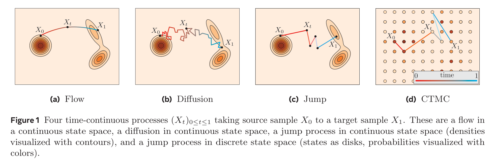

# Flow Matching: Guide & Code

基本信息

- 标题: "Flow Matching Guide and Code"
- 作者:
  - 01 Yaron Lipman
  - 02 Marton Havasi
  - 03 Peter Holderrieth,
  - 04 Neta Shaul,
  - 05 Matt Le,
  - 06 Brian Karrer,
  - 07 Ricky T. Q. Chen,
  - 08 David Lopez-Paz,
  - 09 Heli Ben-Hamu,
  - 10 Itai Gat
- 链接:
  - [ArXiv](https://arxiv.org/abs/2412.06264)
  - [Publication]
  - [Github](https://github.com/facebookresearch/flow_matching)
  - [Demo]
- 文件:
  - [ArXiv](../2412.06264v1_Flow_Matching_Guide_&_Code.pdf)
  - [Publication] #TODO

## Abstract: 摘要

展开原文

***Flow Matching (FM)*** is a recent framework for generative modeling that has achieved state-of-the-art performance across various domains, including image, video, audio, speech, and biological structures.
This guide offers a comprehensive and self-contained review of FM, covering its mathematical foundations, design choices, and extensions.
By also providing a PyTorch package featuring relevant examples (e.g., image and text generation), this work aims to serve as a resource for both novice and experienced researchers interested in understanding, applying and further developing FM.

 

***流匹配 (Flow Matching, FM)*** 是用于生成式建模的近期框架, 在多个领域都实现了最先进的性能 (包括图像, 视频, 音频, 语音, 以及生物结构).
本指南提供了流匹配的全面且独立的回顾, 涵盖了数学基础, 设计选择, 以及扩展.
也通过提供 PyTorch 包来提供相关示例 (例如, 图像和文本生成), 这一工作旨在为对理解, 应用和进一步开发流匹配感兴趣的初学者和经验丰富的研究人员提供资源.

### 1·Introduction: 引言

展开原文

***Flow Matching (FM)*** [^1] [^2] [^3] is a simple framework for generative modeling framework that has pushed the state-of-the-art in various fields and large-scale applications including generation of images [^4], videos [^5], speech [^6], audio [^7], proteins [^8], and robotics [^9].
This manuscript and its accompanying codebase have two primary objectives.
First, to serve as a comprehensive and self-contained reference to Flow Matching, detailing its design choices and numerous extensions developed by the research community.
Second, to enable newcomers to quickly adopt and build upon Flow Matching for their own applications.

The framework of Flow Matching is based on learning a velocity field (also called vector field).
Each velocity field defines a flow $\psi_t$ by solving an ordinary differential equation (ODE) in a process called simulation.
A flow is a deterministic, time-continuous bijective transformation of the $d$-dimensional Euclidean space, $\mathbb{R}^d$.
The goal of Flow Matching is to build a flow that transforms a sample $X_0 \sim p$ drawn from a source distribution $p$ into a target sample $X_1:= \psi_1(X_0)$ such that $X_1\sim q$ has a desired distribution $q$, see Figure.01 (a).
Flow models were introduced to the machine learning community by [^10] [^11] as Continuous Normalizing Flows (CNFs).
Originally, flows were trained by maximizing the likelihood $p(X_1)$ of training examples $X_1$, resulting in the need of simulation and its differentiation during training.
Due to the resulting computational burdens, later works attempted to learn CNFs without simulation [^12] [^13], evolving into modern-day Flow Matching algorithms [^1] [^2] [^3] [^14] [^15] [^16].
The resulting framework is a recipe comprising two steps [^1], see Figure.02:
First, choose a probability path $p_t$ interpolating between the source $p$ and target $q$ distributions.
Second, train a velocity field (neural network) that defines the flow transformation $\psi_t$ implementing $p_t$.

The principles of FM can be extended to state spaces $\mathcal{S}$ other than $\mathbb{R}^d$ and even evolution processes that are not flows.
- Recently, ***Discrete Flow Matching*** [^17] [^18] develops a Flow Matching algorithm for time-continuous Markov processes on discrete state spaces, also known as **Continuous Time Markov Chains (CTMC)**, see Figure.01 (c).
This advancement opens up the exciting possibility of using Flow Matching in discrete generative tasks such as language modeling.
- ***Riemannian Flow Matching*** [^19] extends Flow Matching to flows on Riemannian manifolds $\mathcal{S}=\mathcal{M}$ that now became the state-of-the-art models for a wide variety of applications of machine learning in chemistry such as protein folding [^20] [^21].
- Even more generally, ***Generator Matching*** [^22] shows that the Flow Matching framework works for any modality and for general **Continuous Time Markov Processes (CTMPs)** including, as illustrated in Figure.01, flows, diffusions, and jump processes in continuous spaces, in addition to CTMC in discrete spaces.

Remarkably, for any such CTMP, the Flow Matching recipe remains the same, namely:
First, choose a path $p_t$ interpolating source $p$ and target $q$ on the relevant state space $\mathcal{S}$.
Second, train a generator, which plays a similar role to velocities for flows, and defines a CTMP process implementing $p_t$.
This generalization of Flow Matching allows us to see many existing generative models in a unified light and develop new generative models for any modality with a generative Markov process of choice.

Chronologically, ***Diffusion Models*** were the first to develop simulation-free training of a CTMP process, namely a diffusion process, see Figure.01 (b).
Diffusion Models were originally introduced as discrete time Gaussian processes [^23] [^24] and later formulated in terms of continuous time Stochastic Differential Equations (SDEs) [^25].
In the lens of Flow Matching, Diffusion Models build the probability path $p_t$ interpolating source and target distributions in a particular way via forward noising processes modeled by particular SDEs.
These SDEs are chosen to have closed form marginal probabilities that are in turn used to parametrize the generator of the diffusion process (i.e., drift and diffusion coefficient) via the score function [^26].
This parameterization is based on a reversal process to the forward noising process [^27].
Consequently, Diffusion Models learn the score function of the marginal probabilities.
Diffusion Models' literature suggested also other parametrizations of the generator besides the score, including noise prediction, denoisers [^28], or $v$-prediction [^29] --- where the latter coincides with velocity prediction for a particular choice of probability path $p_t$.
Diffusion bridges [^30] offers another approach to design $p_t$ and generators for diffusion process that extends diffusion models to arbitrary source-target couplings.
In particular these constructions are build again on SDEs with marginals known in closed form, and again use the score to formulate the generator (using Doob's $h$-transform).
[^31] [^32] show that the linear version of Flow Matching can be seen as a certain limiting case of bridge matching.

The rest of this manuscript is organized as follows.
- Section.2 offers a self-contained "cheat-sheet" to understand and implement vanilla Flow Matching in PyTorch.
- Section 3 offers a rigorous treatment of flow models, arguably the simplest of all CTMPs, for continuous state spaces.
- In Section 4, we introduce the Flow Matching framework in $\mathbb{R}^d$ and its various design choices and extensions.
- We show that flows can be constructed by considering the significantly simpler conditional setting, offering great deal of flexibility in their design, e.g., by readily extending to Riemannian geometries, described in Section 5.
- Section 6 provides an introduction to Continuous Time Markov Chains (CTMCs) and the usage as generative models on discrete state spaces.
- Then, Section 7 discusses the extension of Flow Matching to CTMC processes.
- In Section 8, we provide an introduction to using Continuous Time Markov Process (CTMPs) as generative models for arbitrary state spaces.
- In Section 9, we describe Generator Matching (GM) - a generative modeling framework for arbitrary modalities that describes a scalable way of training CTMPs.
GM also unifies all models in previous sections into a common framework.
- Finally, due to their wide-spread use, we discuss in Section.10 denoising diffusion models as a specific instance of the FM family of models.

 

***流匹配 (Flow Matching, FM)*** [^1] [^2] [^3] 是一个简单的生成式建模框架, 在多个领域和大规模应用中推动了最先进的结果, 包括图像 [^4], 视频 [^5], 语音 [^6], 音频 [^7], 蛋白质 [^8], 机器人 [^9] 生成.

本文和配套代码库有两个主要目标:
1. 作为流匹配的全面且独立的参考资料, 详细说明其设计选择和研究社区开发的许多扩展.
2. 帮助新手快速采用和基于流匹配构建自己的应用.

---

流匹配的框架是基于学习一个**速度场/矢量场 (Velocity Field/Vector Field)**.
每个速度场通过在一个称为**模拟 (Simulation)** 的过程中求解一个常微分方程, 定义了一个**流 (Flow)** $\psi_t$.
流是 $d$ 维欧氏空间 $\mathbb{R}^d$ 中的一个确定性的, 时间连续的双射变换.

流匹配的目标是构建一个流, 它将一个来自源分布 $p$ 的样本 $X_0$ 转换为目标样本 $X_1:= \psi_1(X_0)$, 使得 $X_1\$ 服从所需的分布 $q$, 如图 01 (a) 所示.

流模型最初是以***连续规范化流 (Continuous Normalizing Flows, CNFs)*** 的形式引入机器学习社区[^10] [^11].
最初, 流通过最大化训练样本 $X_1$ 的似然 $p(X_1)$ 来训练, 这需要在训练过程中进行模拟和微分.
由于导致的计算负担, 后续工作[^12] [^13]试图不进行模拟来学习连续规范化流, 并逐渐演变为现代流匹配算法 [^1] [^2] [^3] [^14] [^15] [^16].

最后的框架[^1]包含两个步骤, 见图 02:
1. 首先, 选择一个在源分布和目标分布之间进行插值的概率路径 $p_t$.
2. 然后, 训练一个速度场 (神经网络) 来定义实现 $p_t$ 的流转换 $\psi_t$.

---

流匹配的原理可以推广到 $\mathbb{R}^d$ 之外的状态空间 $\mathcal{S}$, 甚至是非流的演化过程.

- 最近, ***离散流匹配 (Discrete Flow Matching)*** [^17] [^18] 开发了一种用于离散状态空间上时间连续的马尔可夫过程, 也称为**连续时间马尔可夫链 (Continuous Time Markov Chain, CTMC)** 的流匹配算法, 如图 01 (c).
  这一进展为离散生成任务 (如语言建模) 中使用流匹配开辟了令人兴奋的可能性.
- ***黎曼流匹配 (Riemannian Flow Matching)*** [^19] 将流匹配推广到黎曼流形 $\mathcal{S}=\mathcal{M}$ 上, 这已经成为机器学习在化学领域的最先进模型, 如蛋白质折叠 [^20] [^21].
- 甚至更一般地, ***生成器匹配 (Generator Matching)*** [^22] 表明, 流匹配框架对任何模态和一般的**连续时间马尔可夫过程 (Continuous Time Markov Processes, CTMPs)** 都适用, 包括, 如图 01 所示的在连续空间中的流, 扩散, 跳跃过程, 以及离散空间中的连续时间马尔可夫链.

值得注意的是, 对于任意这样的 CTMP, 流匹配步骤保持相同, 即:
1. 首先, 在相关状态空间 $\mathcal{S}$ 上选择一个在源分布和目标分布之间进行插值的概率路径 $p_t$.
2. 训练一个生成器, 其作用类似于流的速度场, 并定义了实现 $p_t$ 的 CTMP 过程.

这种流匹配的通用化使得我们能够以统一的视角看待许多现有的生成模型, 并为任意模态开发基于所选马尔可夫过程的新生成模型.

---

从时间顺序上看, ***扩散模型***是第一个开发出训练时无需模拟的 CTMP 过程的方法, 即扩散过程, 见图.01 (b).
扩散模型最初是作为离散时间高斯过程[^23] [^24]引入的, 后续被形式化为连续时间随机微分方程 [^25].
从流匹配的角度看, 扩散模型通过特定的随机微分方程建模的前向加噪过程, 以一种特别的方式构建了在源分布和目标分布之间插值的概率路径 $p_t$.
这些随机微分方程被选择为具有封闭形式的边际概率, 通过得分函数 [^26] 依次用于参数化扩散过程的生成器 (即漂移和扩散系数).
这一参数化基于前向加噪过程的逆过程 [^27].
因此, 扩散模型学习的是边际概率的得分函数.

#TODO: 需要细化

扩散模型的文献还提出了除了得分以外的生成器的其他参数化方法, 包括噪声预测, 去噪器 [^28], 或 $v$-预测 [^29], 其中后者与特定概率路径 $p_t$ 选择的速度预测相一致.
扩散桥 (Diffusion Bridges [^30]) 为扩散过程提供了另一种设计 $p_t$ 和生成器的方法, 它扩展了扩散模型到任意源-目标耦合.
特别地, 这些构造基于具有封闭形式的边际概率的随机微分方程, 并再次使用得分函数来形式化生成器 (使用 Doob 的 $h$-变换).
[^31] [^32] 表明线性版本的流匹配可以视为桥匹配的某种极限情况.

---

本文的剩余部分组织如下:
- [第二节: 快速教程](#Sec.02)提供了一个独立的速查表, 以理解并在 PyTorch 中实现原始的流匹配.
- [第三节: 流模型](Sec.03.md)提供了连续状态空间中的流模型的严谨讨论, 可以说是所有 CTMPs 中最简单的一种.
- [第四节: 流匹配](Sec.04.md)介绍了 $\mathbb{R}^d$ 中的流匹配框架和各种设计选择和扩展.
- [第五节: 非欧流匹配](Sec.05.md)展示了可以通过考虑更简单的条件设置来构建流, 为设计提供了极大的灵活性, 例如可以轻松扩展到黎曼几何.
- [第六节: 连续时间马尔可夫链模型](Sec.06.md)介绍了连续时间马尔可夫链及其在离散状态空间上作为生成模型的用法.
- [第七节: 离散流匹配](Sec.07.md)讨论了流匹配推广到连续时间马尔可夫链模型.
- [第八节: 连续时间马尔可夫过程模型](Sec.08.md)提供了使用连续时间马尔可夫过程作为任意状态过程的生成模型的介绍.
- [第九节: 生成器匹配](Sec.09.md)描述了生成器匹配, 一种用于任意模态的生成建模框架, 描述了训练 CTMPs 的可扩展方式. GM 还将所有先前章节中的模型统一到一个框架中.
- [第十节: 与扩散模型和其他去噪模型的关系](Sec.10.md)讨论了去噪扩散模型作为流匹配系列模型的一个特定实例.

[^1]: [Flow Matching for Generative Modeling](../../../../Models/Diffusion/2022.10.06_Flow_Matching.md) (2022)
[^2]: Building Normalizing Flows with Stochastic Interpolants (2022)
[^3]: Flow Straight and Fast: Learning to Generate and Transfer Data with Rectified Flow (2022)
[^4]: esser2024scaling
[^5]: polyak2024moviegencastmedia
[^6]: [VoiceBox](../../../../Models/SpeechLM/2023.06.23_VoiceBox.md)
[^7]: [Audiobox](../../../../Models/SpeechLM/2023.12.25_Audiobox.md)
[^8]: huguet2024sequence
[^9]: black2024robotics
[^10]: Neural Ordinary Differential Equations (2018)
[^11]: FFJORD: Free-Form Continuous Dynamics for Scalable Reversible Generative Models (2018)
[^12]: Moser Flow: Divergence-Based Generative Modeling on Manifolds (2021)
[^13]: Matching Normalizing Flows and Probability Paths on Manifolds (2022)
[^14]: Action Matching: Learning Stochastic Dynamics from Samples (2023)
[^15]: Iterative α-(de) Blending: A Minimalist Deterministic Diffusion Model (2023)
[^16]: Improving and Generalizing Flow-Based Generative Models with Minibatch Optimal Transport (2023)
[^17]: Generative Flows On Discrete State-Spaces: Enabling Multimodal Flows with Applications to Protein Co-Design (2024)
[^18]: Discrete Flow Matching (2024)
[^19]: Flow Matching on General Geometries (2024)
[^20]: yim2023fast
[^21]: bose2023se
[^22]: holderrieth2024gm
[^23]: sohl2015deep,
[^24]: ho2020denoising
[^25]: song2021sde
[^26]: song2019generative
[^27]: anderson1982reverse
[^28]: kingma2021variational
[^29]: salimans2022progressive
[^30]: peluchetti2023non
[^31]: shi2023diffusion,
[^32]: liu2023i2sb