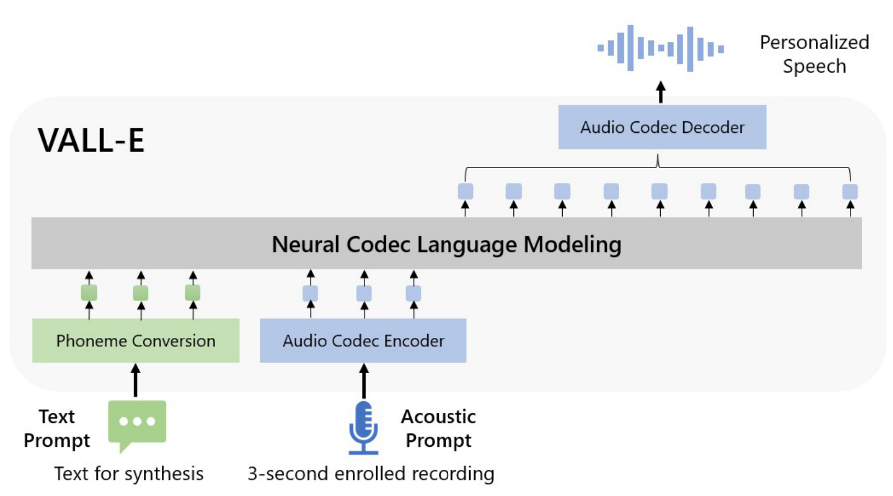
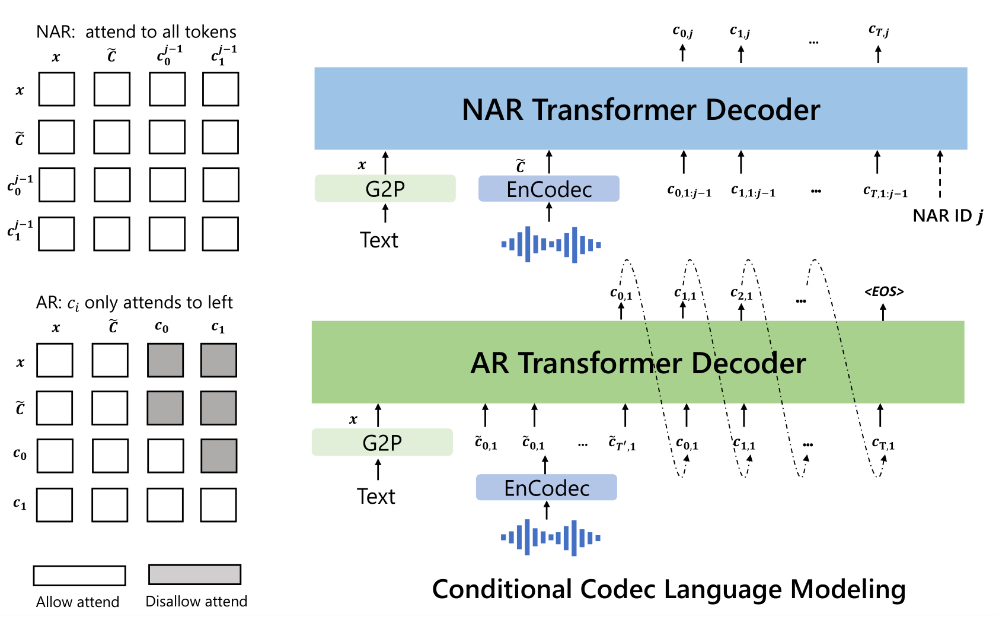

# VALL-E: Neural Codec Language Models are Zero-Shot Text to Speech Synthesizers

[王程一](../Authors/王程一_(Chengyi_Wang).md) [陈三元](../Authors/陈三元_(Sanyuan_Chen).md), [吴俣](../Authors/吴俣_(Yu_Wu).md), [Ziqiang Zhang](../Authors/Ziqiang_Zhang.md), [周龙](../Authors/周龙_(Long_Zhou).md), [刘树杰](../Authors/刘树杰_(Shujie_Liu).md), [Zhuo Chen](../Authors/Zhuo_Chen.md), [Yanqing Liu](../Authors/Yanqing_Liu.md), [Huaming Wang](../Authors/Huaming_Wang.md), [Jinyu Li](../Authors/Jinyu_Li.md), [Lei He](../Authors/Lei_He.md), [Sheng Zhao](../Authors/Sheng_Zhao.md), [韦福如](../Authors/韦福如_(Furu_Wei).md)

## Abstract

> We introduce a language modeling approach for <u>*text-to-speech synthesis (TTS)*</u>.
> Specifically, we train a neural codec language model (called <u>**VALL-E**</u>) using discrete codes derived from an off-the-shelf neural audio codec model, and regard TTS as a conditional language modeling task rather than continuous signal regression as in previous work.
> During the pre-training stage, we scale up the TTS training data to 60K hours of English speech which is hundreds of times larger than existing systems.
> <u>**VALL-E**</u> emerges in-context learning capabilities and can be used to synthesize high-quality personalized speech with only a 3-second enrolled recording of an unseen speaker as an acoustic prompt.
> Experiment results show that <u>**VALL-E**</u> significantly outperforms the state-of-the-art zero-shot TTS system in terms of speech naturalness and speaker similarity.
> In addition, we find that <u>**VALL-E**</u> could preserve the speaker’s emotion and acoustic environment of the acoustic prompt in synthesis.
> See https://aka.ms/valle for demos of our work.

我们介绍了一种用于语音合成的语言建模方法.
具体来说, 我们使用从现成的神经音频编解码器模型中导出的离散编码训练了一个神经编解码器语言模型 (称为 VALL-E), 并将 TTS 视为一个条件语言建模任务, 而不是像以前的工作那样视为连续信号回归任务.
在预训练阶段, 我们将 TTS 训练数据扩展到 60K 小时的英语语音, 这比现有系统大数百倍.
VALL-E 展现出上下文学习能力, 并可用于使用仅 3 秒的未见说话者的输入录音作为声学提示来合成高质量的个性化语音.
实验结果表明 VALL-E 在语音自然度和说话者相似度方面显著优于最先进的零次语言合成系统.
此外, 我们发现 VALL-E 可以在合成中保留声学提示中的说话者的情感和声学环境
请访问 https://aka.ms/valle 查看本项工作的示例.

## 1.Introduction

> The last decade has yielded dramatic breakthroughs in speech synthesis through the development of neural networks and end-to-end modeling.
> Currently, cascaded <u>*text-to-speech (TTS)*</u> systems ([Tacotron2 (2017)](2017.12_Tacotron2.md), [FastSpeech (2019)](2019.05_FastSpeech.md), [Transformer TTS (2018)](2018.09_Transformer_TTS.md)) usually leverage a pipeline with an acoustic model and a vocoder using mel spectrograms as the intermediate representations.
> While advanced TTS systems can synthesize high-quality speech from single or multiple speakers ([DelightfulTTS2 (2022)](2022.07_DelightfulTTS2.md), [VITS (2021)](2021.06_VITS.md)), it still requires high-quality clean data from the recording studio.
> Large-scale data crawled from the Internet cannot meet the requirement, and always lead to performance degradation.
> Because the training data is relatively small, current TTS systems still suffer from poor generalization.
> Speaker similarity and speech naturalness decline dramatically for unseen speakers in the zero-shot scenario.

> To tackle the zero-shot TTS problem, existing work leverages speaker adaptation [Chen et al., 2019, Wang et al., 2020] and speaker encoding [Arik et al., 2018, [YourTTS (2021)](2021.12_YourTTS.md)] methods, requiring additional fine-tuning, complex pre-designed features, or heavy structure engineering.

> Instead of designing a complex and specific network for this problem, the ultimate solution is to train a model with large and diverse data as much as possible, motivated by success in the field of text synthesis [Brown et al., 2020, Chowdhery et al., 2022].
> Recent years have witnessed notable performance improvement for data increase in the text language model, from 16GB of uncompressed text [Devlin et al., 2019], to 160GB [Liu et al., 2019], to 570GB [Brown et al., 2020], and finally, around 1TB [Chowdhery et al., 2022].
> Transferring this success to the field of speech synthesis, we introduce <u>**VALL-E**</u>, the first language model-based TTS framework leveraging large, diverse, and multi-speaker speech data.

> As shown in [Fig.01](), to synthesize personalized speech (e.g., zero-shot TTS), <u>**VALL-E**</u> generates the corresponding acoustic tokens conditioned on the acoustic tokens of the 3-second enrolled recording and the phoneme prompt, which constrain the speaker and content information respectively.
> Finally, the generated acoustic tokens are used to synthesize the final waveform with the corresponding neural codec decoder [Défossez et al., 2022].
> The discrete acoustic tokens derived from an audio codec model enable us to treat TTS as conditional codec language modeling and advanced prompting-based large-model techniques (as in GPTs [Brown et al., 2020])can be leveraged for the TTS tasks.
> The acoustic tokens also allow us to generate diverse synthesized results in TTS by using different sampling strategies during inference.

> We train <u>**VALL-E**</u> with LibriLight [Kahn et al., 2020], a corpus consisting of 60K hours of English speech with over 7000 unique speakers.
> The original data is audio-only, so we employ a speech recognition model to generate the transcriptions.
> Compared to previous TTS training datasets, such as LibriTTS [Zen et al., 2019], our data contain more noisy speech and inaccurate transcriptions but provide diverse speakers and prosodies.
> We believe the proposed approach is robust to the noise and generalize well by leveraging large data.
> It is worth noting that existing TTS systems are always trained with dozens of hours of single-speaker data or hundreds of hours of multi-speaker data, which is over hundreds of times smaller than <u>**VALL-E**</u>.
> [Tab.01]() summarizes the innovation of <u>**VALL-E**</u>, a language model approach for TTS, using audio codec codes as intermediate representations, leveraging large and diverse data, leading to strong in-context learning capabilities.

|Table 1|Current Systems|VALL-E|
|:-:|:-:|:-:|
|Intermediate Representation|Mel Spectrogram|Audio Codec Code|
|Objective Function|Continuous Signal Regression|Language Model|
|Training Data|≤600 Hours| 60K Hours|
|In-Context Language|×|√|

> We evaluate <u>**VALL-E**</u> on LibriSpeech [Panayotov et al., 2015] and VCTK [Veaux et al., 2016]datasets, where all test speakers are unseen in the training corpus.
> <u>**VALL-E**</u> significantly outperforms the state-of-the-art zero-shot TTS system ([YourTTS (2021)](2021.12_YourTTS.md)) in terms of speech naturalness and speaker similarity, with +0.12 comparative mean option score (CMOS) and +0.93 similarity mean option score (SMOS) improvement on LibriSpeech.
> <u>**VALL-E**</u> also beats the baseline on VCTK with+0.11 SMOS and +0.23 CMOS improvements.
> It even achieves a +0.04 CMOS score against ground truth, showing the synthesized speech of unseen speakers is as natural as human recordings on VCTK.
> Moreover, the qualitative analysis shows that <u>**VALL-E**</u> is able to synthesize diverse outputs with the same text and target speaker, which could benefit pseudo-data creation for the speech recognition task.
> We also find that <u>**VALL-E**</u> could keep the acoustic environment (e.g., reverberation) and emotion (e.g. anger) of the acoustic prompt.

> In summary, we make the following contributions.
> - We propose <u>**VALL-E**</u>, the first TTS framework with strong in-context learning capabilities as GPT-3, which treats TTS as a language model task with audio codec codes as an intermediate representation to replace the traditional mel spectrogram.
> It has in-context learning capability and enables prompt-based approaches for zero-shot TTS, which does not require additional structure engineering, pre-designed acoustic features, and fine-tuning as in previous work.
> - We build a generalized TTS system in the speaker dimension by leveraging a huge amount of semi-supervised data, suggesting that simple scaling up semi-supervised data has been underestimated for TTS.
> - <u>**VALL-E**</u> is able to provide diverse outputs with the same input text and keep the acoustic environment and speaker’s emotion of the acoustic prompt.
> - We verify that <u>**VALL-E**</u> synthesizes natural speech with high speaker similarity by prompt-ing in the zero-shot scenario.
> Evaluation results show that <u>**VALL-E**</u> significantly outperforms the state-of-the-art zero-shot TTS system on LibriSpeech and VCTK.
> 
> We encourage the reader to listen to our samples on the demo page https://aka.ms/valle.

## 2.Related Work
### 2.1.Zero-Shot TTS
> Current TTS methods can be categorized into cascaded and end-to-end methods.
> Cascaded TTS systems ([Tacotron2 (2017)](2017.12_Tacotron2.md), [FastSpeech (2019)](2019.05_FastSpeech.md), [Transformer TTS (2018)](2018.09_Transformer_TTS.md)) usually leverage a pipeline with an acoustic model and a vocoder using mel spectrograms as the intermediate representations.
> To tackle the drawbacks of the vocoder, end-to-end TTS models ([VITS (2021)](2021.06_VITS.md), [DelightfulTTS2 (2022)](2022.07_DelightfulTTS2.md)) are proposed to jointly optimize the acoustic model and vocoder.
> In real scenarios, it is highly desirable to customize a TTS system to an arbitrary voice with rare enrolled recordings.
> Therefore, there is growing interest in the zero-shot multi-speaker TTS techniques, and most of work is done in the context of cascaded TTS systems.
> As the pioneers, Arik et al.2018 proposes speaker adaptation and speaker encoding approaches.
> In the line of speaker adaptation, the following work [Chen et al., 2019, Wang et al., 2020, Chen et al., 2021] tries to improve the adaptation efficiency with less target speaker data and speaker-specific parameters.
> Huang et al.[2022] applies meta-learning on speaker adaptation, which only requires 5-shot to build a well-performed system.
> In parallel, speaker encoding-based methods achieved great progress in recent years.
> A speaker encoding based system contains a speaker encoder and a TTS component, where the speaker encoder could be pre-trained on the speaker verification task [Jia et al., 2018].
> In Jia et al.[2018] and Arik et al.[2018], the experiments show that the model is able to generate high-quality outputs with 3 seconds enrolled recordings for in-domain speakers.
> To improve the quality of unseen speakers, advanced speaker embedding models [Cai et al., 2018] can be employed, but it is still undesirable according to Tan et al.[2021].
> Another way is to design advanced but complex speaker encoder [Wu et al., 2022].Diffusion model based TTS [Popov et al., 2021, Kim et al., 2022] is also extended to zero-shot TTS [Kang et al., 2022] and achieved good results.
> Compared to previous work [[FastSpeech (2019)](2019.05_FastSpeech.md), Du et al.,2022], our work follows the line of cascaded TTS but first uses audio codec code as intermediate representations.
> It is the first one that has strong in-context learning capabilities as GPT-3, which does not require fine-tuning, pre-designed features, or a complex speaker encoder.

### 2.2.Spoken Generative Pre-Trained Models
> Self-supervised learning is widely investigated in the field of speech understanding [[Wav2Vec2.0 (2020)](2020.06_Wav2Vec2.0.md), [HuBERT (2021)](2021.06_HuBERT.md), Chen et al., 2022] and speech-to-speech generation [Lakhotia et al., 2021, [AudioLM (2022)](2022.09_AudioLM.md)].
> In the context of speech-to-speech generation, a hot topic is how to synthesize speech in a textless setting.
> GSLM [Lakhotia et al.,2021] proposes to synthesize speech based on [HuBERT (2021)](2021.06_HuBERT.md) codes, and Polyak et al.[2021] improves the performance by combining HuBERT codes with codes of VQVAE and a speaker encoder.
> [AudioLM (2022)](2022.09_AudioLM.md) follows a similar way but use audio codecs [Zeghidour et al.,2022] to synthesize speech, together with semantic codes.
> It should be noted that AudioLM is able to synthesize speech based on audio codecs without training an additional vocoder such as [HifiGAN (2020)](2020.10_HiFi-GAN.md).
> AudioLM is a speech-to-speech model, whereas <u>**VALL-E**</u> is a TTS model, so we can explicitly control the content in speech synthesis.
> Another direction is to apply pre-training to the neural TTS.
> Chung et al.[2018] pre-trains speech decoder in TTS through autoregressive mel-spectrogram prediction.
> In Ao et al.[2022], the authors propose a unified-modal encoder-decoder framework SpeechT5, which can leverage unlabeled speech and text data to pre-train all components of TTS model.
> Tjandra et al.[2019] quantizes unlabeled speech into discrete tokens by a VQVAE model [van den Oord et al., 2017], and train a model with the token-to-speech sequence.
> They demonstrate that the pre-trained model only requires a small amount of real data for fine-tuning.
> Bai et al.[2022] proposes mask and reconstruction on mel spectrogram and showing better performance on speech editing and synthesis.
> Previous TTS pre-training work leverages less than 1K hours of data, whereas <u>**VALL-E**</u> is pre-trained with 60K hours of data.
> Furthermore, <u>**VALL-E**</u> is the first to use audio codec codes as intermediate representations, and emerge in-context learning capability in zero-shot TTS.

## 3.Background: Speech Quantization
> Since audio is typically stored as a sequence of 16-bit integer values, a generative model is required to output $2^{16}=65,536$ probabilities per timestep to synthesize the raw audio.
> In addition, the audio sample rate exceeding ten thousand leads to an extraordinarily long sequence length, making it more intractable for raw audio synthesis.
> To this end, speech quantization is required to compress integer values and sequence length. 
> $\mu$-law transformation can quantize each timestep to 256 values and reconstruct high-quality raw audio.
> It is widely used in speech generative models, such as WaveNet [van den Oord et al., 2016], but the inference speed is still slow since the sequence length is not reduced.
> Recently, vector quantization is widely applied in self-supervised speech models for feature extraction, such as vq-wav2vec [Baevski et al., 2020a] and [HuBERT (2021)](2021.06_HuBERT.md).
> The following work [Lakhotia et al., 2021, Du et al., 2022] shows the codes from self-supervised models can also reconstruct content, and the inference speed is faster than WaveNet.
> However, the speaker identity has been discarded and the reconstruction quality is low [AudioLM (2022)](2022.09_AudioLM.md).
> [AudioLM (2022)](2022.09_AudioLM.md) trains speech-to-speech language models on both k-means tokens from a self-supervised model and acoustic tokens from a neural codec model, leading to high-quality speech-to-speech generation.

> In this paper, we follow [AudioLM (2022)](2022.09_AudioLM.md) to leverage neural codec models to represent speech in discrete tokens.
> To compress audio for network transmission, codec models are able to encode waveform into discrete acoustic codes and reconstruct high-quality waveform even if the speaker is unseen in training.
> Compared to traditional audio codec approaches, the neural-based codec is significantly better at low bitrates, and we believe the quantized tokens contain sufficient information about the speaker and recording conditions.
> Compared to other quantization methods,the audio codec shows the following advantages: 
> 1. It contains abundant speaker information and acoustic information, which could maintain speaker identity in reconstruction compared to [HuBERT (2021)](2021.06_HuBERT.md) codes.
> 2. There is an off-the-shelf codec decoder to convert discrete tokens into a waveform, without the additional efforts on vocoder training like VQ-based methods that operated on spectrum [Du et al., 2022].
> 3. It could reduce the length of time steps for efficiency to address the problem in $\mu$-law transformation [van den Oord et al., 2016].

> We adopt a pre-trained neural audio codec model, EnCodec [Défossez et al., 2022], as our tokenizer.
> EnCodec is a convolutional encoder-decoder model, whose input and output are both 24 kHz audio across variable bitrates.
> The encoder produces embeddings at 75 Hz for input waveforms at 24 kHz,which is a 320-fold reduction in the sampling rate.
> Each embedding is modeled by a <u>*residual vector quantization (RVQ)*</u>, in which we choose eight hierarchy quantizers with 1024 entries each as shown in [Fig.02]().

> This configuration corresponds to EnCodec at 6K bitrates for 24 kHz audio reconstruction.
> In this setting, given a 10-second waveform, the discrete representation is a matrix with750 × 8entries, where 750 =24,000×10/320 is the downsampled time step and 8 is the number of quantizers.
> It is fine to choose other bitrate settings.
> A larger bitrate corresponds to more quantizers and better reconstruction quality.
> For example, if we choose EnCodecc at 12K bitrates, there are 16 quantizers are needed and the 10-second waveform corresponds to a matrix with 750×16 entries.
> With the discrete codes from all quantizers, the convolutional decoder of EnCodec generates real-valued embeddings and reconstructs the waveform at 24 kHz.

## 4.VALL-E
### 4.1.Problem Formulation: Regarding TTS as Conditional Codec Language Modeling

> Given a dataset $\mathcal{D}=\{\mathbf{x}_i, \mathbf{y}_i\}$, where $\mathbf{y}$ is an audio sample and $\mathbf{x} = \{x_0,x_1, \cdots x_L\}$ is its corresponding phoneme transcription, we use a pre-trained neural codec model to encode each audio sample into discrete acoustic codes, denoted as $\text{Encodec}(\mathbf{y}) = C^{T\times 8}$, where $C$ represents the two-dimensional acoustic code matrix, and $T$ is the downsampled utterance length.
> The row vector of each acoustic code matrix $c_{t,:}$ represents the eight codes for frametand the column vector of each acoustic code matrix $c_{:,j}$ represents the code sequence from the $j$-th codebook, where $j \in \{1,\cdots 8\}$.
> After quantization, the neural codec decoder is able to reconstruct the waveform, denoted as $\text{Decodec}(C)\approx\hat{\mathbf{y}}$.

> Zero-shot TTS requires the model to synthesize high-quality speech for unseen speakers.
> In this work, we regard zero-shot TTS as a conditional codec language modeling task.
> We train a neural language model to generate an acoustic code matrix $C$ conditioned on a phoneme sequence $\mathbf{x}$ and an acoustic prompt matri $\tilde{C}^{T'\times 8}$ with the optimization objective of $\max p(C|\mathbf{x},\tilde{C})$.
> Here, $\tilde{C}$ is obtained by the same neural codec with an enrolled recording as the input.
> We expect the neural language model learns to extract the content and speaker information from the phoneme sequence and the acoustic prompt, respectively.
> During inference, given a phoneme sequence and a 3-second enrolled recording of the unseen speaker, the acoustic code matrix with corresponding content and speaker’s voice is firstly estimated by the trained language model.
> Then the neural codec decoder synthesizes the high-quality speech.

### 4.2.Training: Conditional Codec Language Modeling
> The neural speech codec model allows us to operate on discrete audio representations.
> Due to residual quantization in the neural codec model, the tokens have a hierarchical structure: tokens from previous quantizers recover acoustic properties like speaker identity, while the consecutive quantizers learn fine acoustic details.
> Each quantizer is trained to model the residual from the previous quantizers.
> Motivated by this, we design two conditional language models in a hierarchical manner.

> For the discrete tokens from the first quantizer $c_{:,1}$, we train an <u>*autoregressive (AR)*</u> decoder-only language model.
> It is conditioned on the phoneme sequencexand the acoustic prompt $\tilde{C}_{:,1}$, formulated as 
> $$
>   p(c_{:,1}|\mathbf{x}, \tilde{C}_{:,1}; \theta_{AR}) =\prod_{t=0}^T p(c_{t,1}|c_{<t,1},\tilde{c}_{:,1}, \mathbf{x}; \theta_{AR}) \tag{1}
> $$
> 
> Since <u>**VALL-E**</u> is a decoder-only LM, the concatenation of $\tilde{c}_{:,1}$ and $c_{:,1}$ is a whole sequence, and we do not distinguish them or insert a specific token in training.
> Only $c_{:,1}$ is predicted while the prefix $\tilde{c}_{:,1}$ is given during inference.

> For the discrete tokens from the second to the last quantizers, $c_{:,j}\in[2,8]$, we train a <u>*non-autoregressive (NAR)*</u> language model.
> Since the tokens can not access each other in a NAR manner, to constrain the speaker identity, the acoustic prompt matrix $\tilde{C}$ is used as an acoustic prompt.
> Thus, the model is conditioned on the phoneme sequencex, the acoustic prompt $\tilde{C}$ and the predicted acoustic tokens belong to the previous codebooks $C_{:,<j}$:
> $$
>   p(C_{:,2:8}|\mathbf{x},\tilde{C};\theta_{NAR})=\prod_{j=2}^{8}p(c_{:,j}|C_{:,<j},\mathbf{x},\tilde{C};\theta_{NAR}) \tag{2}
> $$
> 
> The combination of the AR model and the NAR model provides a good trade-off between speech quality and inference speed.
> On the one hand, the rate of the generated speech should be consistent with the enrolled recording, and it is hard to train a length predictor for different speakers since their speaking speed may be very diverse.
> In this case, the AR model is a more natural choice with its flexibility for acoustic sequence length prediction.
> On the other hand, for the consecutive stages, as the number of output slots follows the sequence length of the first stage, NAR can reduce the time complexity from $\mathcal{O}(T)$ to $\mathcal{O}(1)$.
> Overall, the prediction of C can be modeled as:
> $$
>   p(C|\mathbf{x},\tilde{C};\theta)=p(c_{:,1}|\tilde{C}_{:,1}, \mathbf{X}; \theta_{AR}) \prod_{j=2}^{8}p(c_{:,j}|c_{:,<j},\mathbf{x},\tilde{C};\theta_{NAR}) \tag{3}
> $$

#### 4.2.1.Autoregressive Codec Language Modeling 
> The autoregressive language model generates the tokens from the first quantizer.
> It comprises a phoneme embedding $W_x$, an acoustic embedding $W_a$, a transformer decoder, and a prediction layer.
> In order to generate speech with specific content, we use the phoneme sequence as the phoneme prompt of the language model.
> Thus, the model input is the concatenation of $\mathbf{x}$ and $\mathbf{c}_{:,1}$, and two special `<EOS>` tokens are appended after each of them.
> We compute sinuous position embedding separately for prompt and input tokens.
> For the causal transformer model, each tokenct,1can attend to $(\mathbf{x}, c_{\leq t,1})$ as illustrated in the left part of [Fig.03]().

> The model is optimized to maximize the probability of the next token in the first codebook.
> We share the parameters of the output projection layer with the parameters of the acoustic embedding $W_a$.

> In the AR model, we do not explicitly extract an audio clip as the prompt in training.
> The training process is pure casual language model training.
> In this way, any prefix sequence $c_{<t,1}$ is treated as a prompt for the latter part of the sequence $c_{\geq t,1}$.
> During inference, given an enrolled recording, we should concatenate the phoneme sequence of the enrolled recording and the phoneme sequence for synthesis together.
> Meanwhile, the acoustic token sequence of the enrolled recording is used as the prefix in AR decoding, as formulated in [Eq.01]().
> We will study the superiority of this setting in the experiment.

#### 4.2.2.Non-Autoregressive Codec Language Modeling 
> When we obtain the first quantizer codes by the AR model, we employ a non-autoregressive (NAR) model to generate codes of the other seven quantizers.
> The NAR model has a similar architecture to the AR model, except that it contains eight separate acoustic embedding layers.
> In each training step, we randomly sample a training stage $i\in [2, 8]$.
> The model is trained to maximize the acoustic tokens from the $i$-th quantizer codebook.
> The acoustic tokens from stage $1$ to stage $i−1$ are embedded and summed up as model input:
> $$
> \begin{align}e_{c_{t,j}}&=W_a^j\odot c_{t,j}\tag{4}\\\mathbf{e_{c_t}}&=\sum_{j=1}^{i-1}e_{c_t,j}\tag{5}\end{align}
> $$
> 
> where $\odot$ indicates index selection.

> The phoneme sequence is also regarded as the prompt of the language model.
> Besides, to clone the unique voice of the given speaker, we also use the acoustic tokens from the enrolled speech as the acoustic prompt.
> Specifically, we first tokenize the enrolled speech with the neural codec model as $\tilde{C}^{T\times 8}$.
> The embedded representations from all of the eight codebooks are summed up as the acoustic prompt $e_{\tilde{c}_t}=\sum_{j=1}^8 e_{\tilde{c}_{t,j}}$.
> To predict the acoustic tokens from thei-th codebook, the transformer input is the concatenation of $(\mathbf{e}_{\mathbf{x}}, \mathbf{e}_{\tilde{c}}, \mathbf{e}_{c_{:,<i}})$.
> The positional embeddings are also computed separately for prompts and the acoustic sequence.
> The current stage $i$ is injected into the network with Adaptive Layer Normalization [Xu et al., 2019] operator, i.e., $\text{AdaLN}(h, i) = a_i\text{LayerNorm}(h) + b_i$, where $h$ is the intermediate activations, $a_i$ and $b_i$ are obtained from a linear projection of the stage embedding.
> Unlike AR, the NAR model allows each token to attend to all the input tokens in the self-attention layer.
> We also share the parameters of the acoustic embedding layer and the output prediction layer, which means the weights of thej-th prediction layer are the same as the $(j + 1)$-th acoustic embedding layer.

### 4.3.Inference: In-Context Learning via Prompting 

> In-context learning is a surprising ability of the text-based language model, which is able to predict labels for unseen inputs without additional parameter updates.
> For TTS, if the model can synthesize high-quality speech for unseen speakers without fine-tuning, the model is believed to have in-context learning capability.
> However, the in-context learning capability of existing TTS systems is not strong,because they either require additional fine-tuning or degrade dramatically for unseen speakers.

> For language models, prompting is necessary to enable in-context learning in the zero-shot scenario.
> We design prompts and inference as follows.
> We first convert the text into a phoneme sequence and encode the enrolled recording into an acoustic matrix, forming the phoneme prompt and acoustic prompt.
> Both prompts are used in the AR and NAR models.
> For the AR model, we use sampling-based decoding conditioned on the prompts since we observe that beam search may lead the LM into an infinity loop.
> Furthermore, the sampling-based method could significantly increase the diversity of the output.
> For the NAR model, we use greedy decoding to choose the token with the highest probability.
> Finally, we use the neural codec decoder to generate the waveform conditioned on the eight code sequences.

> The acoustic prompt may or may not semantically relate to the speech to be synthesized, resulting in two cases:
> - <u>**VALL-E**</u>: 
> Our main interest is to generate given content for unseen speakers.
> The model is given a text sentence, a segment of enrolled speech, and its corresponding transcription.
> We prepend the transcription phoneme of the enrolled speech to the phoneme sequence of the given sentence as the phoneme prompt, and use the first layer acoustic token of the enrolled speech˜c:,1as an acoustic prefix.
> With the phoneme prompt and the acoustic prefix, <u>**VALL-E**</u> generates the acoustic tokens for the given text cloning the voice of this speaker.
> - <u>**VALL-E-continual**</u>: 
> In this setting, we use the whole transcription and the first 3 seconds of the utterance as the phoneme and acoustic prompts respectively, and ask the model to generate the continuations.
> The inference process is the same as setting <u>**VALL-E**</u>, except that the enrolled speech and the generated speech are semantically continuous.

## 5.Experiment
### 5.1.Experiment Setup
### 5.2.LibriSpeech Evaluation
### 5.3.VCTK Evaluation
### 5.4.Qualitative Analysis

## 6.Conclusion, Limitations, Future Work

> We introduced <u>**VALL-E**</u>, a language model approach for TTS with audio codec codes as intermediate representations. 
> We pre-train <u>**VALL-E**</u> with 60K hours of speech data, and show the in-context learning capability in zero-shot scenarios. 
> We achieve new state-of-the-art zero-shot TTS results on LibriSpeech and VCTK. 
> Furthermore, <u>**VALL-E**</u> could keep the acoustic environment and speaker’s emotion in synthesis, and provide diverse outputs in different sampling-based decoding processes.

> Despite making significant progress, <u>**VALL-E**</u> still suffers from several issues.

> **Synthesis robustness**
> We observe that some words may be unclear, missed, or duplicated in speech synthesis. 
> It is mainly because the phoneme-to-acoustic language part is an autoregressive model, in which disordered attention alignments exist and no constraints to solving the issue. 
> The phenomenon is also observed in vanilla Transformer-based TTS, which was addressed by applying non-autoregressive models or modifying the attention mechanism in modeling. 
> In the future, we would like to leverage these techniques to solve the issue.

> **Data coverage**
> Even if we use 60K hours of data for training, it still cannot cover everyone’s voice,especially accent speakers. 
> The worse result on VCTK than LibriSpeech also implies insufficient coverage of accent speakers. Moreover, the diversity of speaking styles is not enough, as LibriLight is an audiobook dataset, in which most utterances are in reading style. 
> In the future, we will further scale up the training data to improve the model performance across prosody, speaking style, and speaker similarity perspectives. 
> We believe the zero-shot TTS task could be almost solved through our approach with model and data scale-up.

> **Model Structure**
> Now, we use two models to predict codes of different quantizers. 
> A promising direction is to predict them with a large universal model. 
> Another interesting direction is using full NAR models to speed up model inference in the framework.

> **Broader impacts**
> Since <u>**VALL-E**</u> could synthesize speech that maintains speaker identity, it may carry potential risks in misuse of the model, such as spoofing voice identification or impersonating a specific speaker. 
> To mitigate such risks, it is possible to build a detection model to discriminate whether an audio clip was synthesized by <u>**VALL-E**</u>. 
> We will also put Microsoft AI Principles∗into practice when further developing the models.
