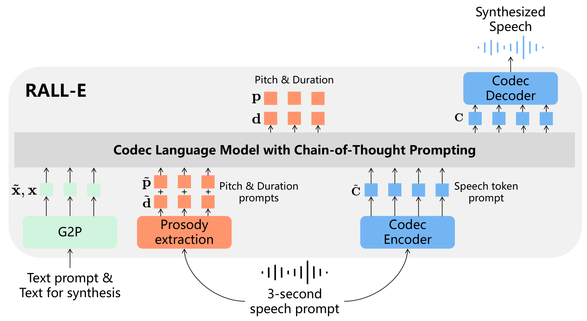

# RALL-E: Robust Codec Language Modeling with Chain-of-Thought Prompting for Text-to-Speech Synthesis

@import "../style.less"

## Abstract

> We present **RALL-E**, a robust language modeling method for <term>text-to-speech (TTS)</term> synthesis.
> While previous work based on <term>large language models (LLMs)</term> shows impressive performance on zero-shot TTS, such methods often suffer from poor robustness, such as unstable prosody (weird pitch and rhythm/duration) and a high <term>word error rate (WER)</term>, due to the autoregressive prediction style of language models.
> The core idea behind **RALL-E** is <term>chain-of-thought (CoT)</term> prompting, which decomposes the task into simpler steps to enhance the robustness of LLM-based TTS.
> To accomplish this idea, **RALL-E** first predicts prosody features (pitch and duration) of the input text and uses them as intermediate conditions to predict speech tokens in a CoT style.
> Second, **RALL-E** utilizes the predicted duration prompt to guide the computing of self-attention weights in Transformer to enforce the model to focus on the corresponding phonemes and prosody features when predicting speech tokens.
> Results of comprehensive objective and subjective evaluations demonstrate that, compared to a powerful baseline method [VALL-E (2023)](2023.01_VALL-E.md), **RALL-E** significantly improves the WER of zero-shot TTS from 6.3% (without reranking) and 2.1% (with reranking) to 2.8% and 1.0%, respectively.
> Furthermore, we demonstrate that **RALL-E** correctly synthesizes sentences that are hard for [VALL-E (2023)](2023.01_VALL-E.md) and reduces the error rate from 68% to 4%.

## 1.Introduction

> <term>Large language models (LLMs)</term> have demonstrated great progress in natural language generation [1, 20].
> With a sufficient model size LLMs emerge powerful in-context learning abilities that can handle unseen tasks with a text instruction (usually called prompt) in a zero-shot or few-shot manner [31].
> Moreover, the simple yet effective next-token prediction task of LLMs makes it easy to apply LLMs on other fields, such as vision [5] and speech synthesis [29], as long as the data can be converted to discrete speech tokens.
> This work focuses on the language modeling of text-to-speech (TTS) synthesis.
> Recent work [14,29] have shown that TTS can be modeled by a decoder-only language model by using a neural codec [4,34] to convert continuous waveforms into discrete tokens.
> These methods, typically leverage tens of thousands of hours of speech data, emerge in-context learning ability that can clone a speaker’s voice by providing a short audio prompt to the language model, and thus have impressive performance on zero-shot TTS.
> However, due to the sequential generation property of language models, such codec language models suffer from poor robustness.
> Although the autoregressive (AR) prediction style of language models enables the model to generate speech with diverse prosody patterns, they can also cause bad cases with unnatural prosody.
> Moreover, since there is no strict alignment between text and speech, the models can omit or repeat words in the input text.
> This is quite different from TTS methods based on non-autoregressive (NAR) generative models [12,16,25], which predicts all tokens at the same time, thus have high robustness but relatively low diversity.
> As suggested by previous work [12,33], LLM-based TTS have a higher word error rate (WER) than NAR TTS even if they have similar performance on other metrics.
> To alleviate this problem, a simple but effective method is to sample the same input text multiple times and select the best one [14,33].
> However, such a reranking method further increases the inference time.
> In this paper, we present **RALL-E** (the abbreviation of robust [VALL-E (2023)](2023.01_VALL-E.md)), a method to improve the robustness of LLM-based TTS.
> The core idea of **RALL-E** is inspired from the chain-of-thought (CoT) prompting [32].
> In CoT prompting, the LLM is instructed to generate an intermediate result that is used as a condition for the prediction of the final result.
> The CoT prompting breaks a complex task into several simpler steps, so that can improve the robustness of LLMs, especially on hard tasks like arithmetic [32].
> To adapt CoT prompting to LLM-based TTS, **RALL-E** predicts prosody tokens (pitch and duration) before predicting speech tokens to stabilize the prosody.
> Given an input sentence, **RALL-E** first predicts phoneme-level pitch and duration of the input, then predicts speech tokens conditioning on both the input phonemes and the predicted prosody tokens.
> Furthermore, **RALL-E** utilizes the predicted duration to mask irrelevant phonemes and prosody tokens when computing self-attention weights, so that the codec language model is enforced to concentrate on tokens around the phoneme and prosody token the speech token corresponds to.
> We use VALL-E [29], a recent powerful LLM-based TTS method, as the baseline, and conduct experiments on a large dataset with 44K hours speech data.
> Results of comprehensive objective and subjective evaluations demonstrate that RALL significantly improves the robustness of LLM-based TTS by reducing the WER on the LibriSpeech [18] test-clean set from6.3%(w/o reranking) and2.1%(with reranking) to2.8%and 1.0%, respectively.
> Furthermore, we evaluate the performance of **RALL-E** on 50 particularly hard sentences.
> As demonstrated in Table 1, compared to VALL-E, **RALL-E** significantly reduces WER from68%to4%by eliminating almost all types of error, which demonstrates the superior robustness of **RALL-E** (see Section 4.4 for more details).
> The contributions of this work are summarized as follows: •We present RALL-E, a robust codec language modeling method with chain-of-thought prompting for TTS.
> **RALL-E** improves the robustness of LLM-based TTS by (1) incorporating prosody tokens as chain-of-thought prompting to stabilize the generation of speech tokens and (2) using duration-guided masking to enhance the alignment between phoneme and speech tokens.
> •We conduct comprehensive objective and subjective evaluations.
> Experimental results demonstrate that **RALL-E** obtains significantly better robustness than the baseline VALL-E and two previous works.
> •We further evaluate **RALL-E** on sentences that are particularly hard to synthesize for LLM-based TTS.
> The results demonstrate that **RALL-E** correctly synthesizes hard sentences and reduces the error rate from68%to4%compared to VALL-E, which closely approaches the performance of non-autoregressive TTS.
> Audio samples can be found at https://ralle-demo.github.io/RALL-E.

## 2.Related Work

### LLM-Based TTS

> Inspired by the success of LLMs [1,20], several recent works adopt language models to model TTS ([SPEAR-TTS (2023)](2023.02_SPEAR-TTS.md), [VALL-E (2023)](2023.01_VALL-E.md), Uniaudio (2023)) and begin to use decoder-only architecture based on [Transformer (2017)](2017.06_Transformer.md).
> In such models, text and speech tokens are concatenated together and fed to a single transformer.
> The whole model is trained on a next-token prediction task like a language model.
> The LLM-based TTS systems are typically trained on tens of thousands of hours of speech data and have hundreds of millions of parameters, hence can leverage the emergent abilities of LLMs like in-context learning [31] to enable zero-shot TTS [29].
> Besides, recent works [22,30,33] have shown the decoder-only architecture can be used to learn multiple tasks, as the input and output are processed jointly by a language model, and the model can be signaled to generate results for different tasks by inputting pre-defined special tokens.
> **RALL-E** focuses on the robustness problem of LLM-based TTS.

### Robust Autoregressive TTS

> The robustness of AR TTS is a popular topic in the literature.
> For encoder-decoder AR TTS, several previous works enforce the attention weights to be monotonic [2,9, 36] that can effectively improve the robustness.
> In addition, Shen et al.[24] proposed a non-attentive Tacotron, in which the attention module was replaced by a duration predictor to determine the alignment path before decoding.
> For decoder-only TTS, a key difference is that the attention weights are computed on text and context at the same time, hence the whole attention weights should not be monotonic.
> Song et al. proposed [ELLA-V (2024)](2024.01_ELLA-V.md) that interleaves the speech tokens with phonemes by inserting a phoneme token and a specialEndOfPhone(EOP) token at the beginning and end of the speech tokens corresponding to the phoneme, respectively.
> While the inserted phoneme and the EOP token indicate the duration of each phoneme, such an implicit way entangles the prediction of speech tokens and duration together.
> **RALL-E** disentangles the predictions of duration and speech tokens by predicting the duration of all phonemes before the speech tokens, hence has higher controllability over the generation process.
> Du et al. proposed [VALL-T (2024)](2024.01_VALL-T.md) that uses an unsupervised transducer loss [7] to implicitly model the duration of phonemes.
> Compared to RALL-E, although VALL-T doesn’t rely on external alignment tools during training, its training time is considerably decelerated since the transducer loss requires the model to perform a forward process for every phoneme.
> Besides, like ELLA-V, VALL-T also entangles the predictions of duration and speech tokens, thus has weaker controllability than RALL-E.

## 3.RALL-E

> The overview of **RALL-E** is illustrated in Fig.1.

> The core idea of **RALL-E** is CoT prompting that generates intermediate results to assist and stabilize the generation of speech tokens and improve the robustness of LLM-based TTS.
> To accomplish this idea, we first propose to predict two kinds of phoneme-level prosody tokens: pitch and duration before predicting the speech tokens.
> The distributions of the prosody tokens are modeled together with speech tokens by a single Transformer so that they can influence the duration and pitch of the predicted speech tokens.
> To further utilize the predicted duration to guide the generation and improve the robustness, we propose duration-guided masking to enhance the alignment between speech tokens, phonemes, and prosody tokens learned by the language model.
> At each decoding step of the speech tokens, **RALL-E** masks phonemes and prosody tokens that are irrelevant to the synthesis of the current speech token based on the duration information.
> In the following sections, we first briefly introduce VALL-E since we apply the proposed method to it in the experiments.
> We then formulate and introduce **RALL-E** in detail.
> It should be stressed that, though we use [VALL-E (2023)](2023.01_VALL-E.md) to implement **RALL-E**, the proposed method can be applied in any decoder-only AR TTS model.

### 3.1.Preliminary: VALL-E

> We inherit most symbols from the original paper of [VALL-E (2023)](2023.01_VALL-E.md) for ease of reading.
> Readers are recommended to refer to the original paper for more details.

> Generally, [VALL-E (2023)](2023.01_VALL-E.md) is a decoder-only LLM-based TTS system that uses two <algo>Transformers</algo> [28] to predict speech tokens from the text.
> The speech tokens here are extracted from EnCodec [4], a neural audio codec based on residual vector quantization (RVQ) [34] that can convert continuous speech signal into discrete tokens.
> After predicting the discrete tokens, the waveforms can be reconstructed by feeding the tokens into the decoder of EnCodec.
> An RVQ typically contains $N$ quantization layers ($N = 8$ in [VALL-E (2023)](2023.01_VALL-E.md)), hence at each time step the encoded speech has $N$ tokens. 
> Formally, given speech $\mathbf{y}$ and its transcription $\mathbf{x}$, the discrete speech token matrix $\mathbf{C}$ encoded by the codec has a shape of $T \times N$, where $T$ is the total time step.
> In addition tox, to clone a speaker’s voice and utilize the in-context learning ability of LLMs, <algo>[VALL-E (2023)](2023.01_VALL-E.md)</algo> receives a short prompt $\tilde{\mathbf{C}}^{T'\times N}$ as input before predicting $\mathbf{C}$.
> Hence, [VALL-E (2023)](2023.01_VALL-E.md) models and maximizes the following distribution:
> $$
>   \mathbb{P}(\mathbf{C}|\mathbf{x},\tilde{\mathbf{C}}).\tag{1}
> $$

> [VALL-E (2023)](2023.01_VALL-E.md) predicts speech tokens hierarchically where the speech tokens of the 1st layer of RVQ are first predicted by an AR Transformer, and the tokens of the rest layers are predicted by a NAR Transformer.
> This is because RVQ uses a residual quantization method, i.e. higher layers encode the information that is not encoded by the lower layers, hence tokens of the1st layer contain most information of the waveforms, and the information encoded by the rest layers gradually decreases.
> The AR Transformer takes the phoneme sequence $\mathbf{x}$, and speech tokens of the1st layer of the prompt $\tilde{c}_{:,1}$ as input to predict the target speech tokens of the1st layer $\mathbf{c}_{:,1}$ sequentially, i.e. maximizes the following distribution:
> $$
> \mathbb{P}(\mathbf{c}_{:,1}\mid\mathbf{x},\tilde{\mathbf{c}}_{:,1};\theta_{AR})=\prod_{t=1}^T\mathbb{P}(\mathbf{c}_{t,1}\mid\mathbf{x},\mathbf{c}_{<t,1},\tilde{\mathbf{c}}_{:,1};\theta_{AR}),\tag{2}
> $$
>
> where $\theta_{\text{AR}}$ is the trainable parameters of the AR Transformer.
> The NAR Transformer predicts all target speech tokens $\mathbf{c}_{:,j}$ of the $j$-th layer at the same time with the phoneme sequence $\mathbf{x}$, the prompt $\tilde{\mathbf{C}}$, and target speech tokens $\mathbf{c}_{:,<j}$ of all layers less than $j$ as the conditions, i.e. maximizes the following distribution:
> $$
> \mathbb{P}(\mathbf{c}_{:,2:N}\mid\mathbf{x},\tilde{\mathbf{C}};\theta_{NAR})=\prod_{j=2}^N\mathbb{P}(\mathbf{c}_{:,j}\mid\mathbf{x},\mathbf{c}_{:,<j},\tilde{\mathbf{C}};\theta_{NAR}),\tag{3}
> $$
>
> where $\theta_{\text{NAR}}$ is the trainable parameters of the NAR Transformer.
> By combining Eq.2 and Eq.3, [VALL-E (2023)](2023.01_VALL-E.md) breaks Eq.1 into the following form:
> $$
> \mathbb{P}(\mathbf{C}\mid\mathbf{x},\tilde{\mathbf{C}})=\mathbb{P}(\mathbf{c}_{:,1}\mid\mathbf{x},\tilde{\mathbf{c}}_{:,1};\theta_{AR})\mathbb{P}(\mathbf{c}_{:,2:N}\mid\mathbf{x},\tilde{\mathbf{C}};\theta_{NAR}).\tag{4}
> $$
> 
> It is noteworthy that in practice the two Transformers have the same architecture but have different attention masks during computation. Specifically, both the two Transformers use a bidirectional mask for the phoneme sequence $\mathbf{x}$, which means every phoneme $x_i$ can attend to all other phonemes $x_{\neq i}$.
> However, for the speech tokens, the AR Transformers uses a unidirectional mask so that $\mathbf{c}_{t,1}$ can only attend to previous tokens $\mathbf{c}_{<t,1}$, while the NAR Transformer still uses a bidirectional mask.

### 3.2.Prosody Tokens as Chain-of-Thought Prompts

> One of the problems of LLM-based TTS is that it directly generates speech from phonemes with no restriction on the prosody, e.g. pitch, duration, etc, which usually results in speech with unstable prosody.
> A similar problem is also observed in Wei et al.[32]where the authors find LLMs cannot directly answer a complex question like arithmetic and propose CoT prompting to solve this problem.
> The idea of CoT prompting is breaking a complex task into several simpler tasks so that LLMs can utilize the intermediate results to reach the final answers.
> As shown in Wei et al.[32], by CoT prompting the correct rate of LLMs on complex tasks can be significantly improved.
> This motivates us to adapt CoT prompting to LLM-based TTS by generating intermediate prosody tokens before generating speech tokens to alleviate the robustness problem of LLM-based TTS.
> To incorporate pitch and duration in the AR Transformer of [VALL-E (2023)](2023.01_VALL-E.md), we first get the alignment between phonemes and speech tokens and extract the pitch value for each speech token.
> We then compute phoneme-level pitch value based on the duration and linearly quantize it to $M_p$ buckets.
> We define a maximal duration valueMd, and all duration values that exceed $M_d$ will be truncated to the maximum.
> **RALL-E** predicts the two prosody tokens before the speech tokens in a CoT style.
> Formally, assume $p$, $d$ are the discrete pitch and duration sequences of the target speech tokens $\mathbf{C}$, $\tilde{\mathbf{p}}$, $\tilde{\mathbf{d}}$ are the ones of the prompt $\tilde{\mathbf{C}}$, we model and maximize the following distribution:
> $$
> \mathbb{P}(\mathbf{p},\mathbf{d}\mid\mathbf{x},\tilde{\mathbf{p}},\tilde{\mathbf{d}};\theta_{AR})=\prod_{t=1}^L\mathbb{P}(p_t,d_t\mid\mathbf{x},\mathbf{p}_{<t},\mathbf{d}_{<t},\tilde{\mathbf{p}},\tilde{\mathbf{d}};\theta_{AR}),\tag{5}
> $$ 
> 
> where $L$ is the length of $\mathbf{x}$. 
> In practice, the model predicts $p_t$ and $d_t$ with two separate heads, and their embeddings are summed up and fed to the model for the prediction of the next step. 
> **RALL-E** then predicts the speech tokens with $p$ and $d$ as a new condition, which makes Eq.2 becomes:
> $$
> \mathbb{P}(\mathbf{c}_{:,1}\mid\mathbf{x},\tilde{\mathbf{c}}_{:,1},\mathbf{p},\tilde{\mathbf{p}},\mathbf{d},\tilde{\mathbf{d}};\theta_{AR})=\prod_{t=1}^T\mathbb{P}(\mathbf{c}_{t,1}\mid\mathbf{x},\mathbf{c}_{<t,1},\tilde{\mathbf{c}}_{:,1},\mathbf{p},\tilde{\mathbf{p}},\mathbf{d},\tilde{\mathbf{d}};\theta_{AR}).\tag{6}
> $$
> The above two equations can be jointly optimized by the AR Transformer. Although the proposed method adds additional $L$ decoding steps, since $L<<T$, it intuitively has little influence on the efficiency.

> For the NAR Transformer, we simply sum the embeddings of the phoneme, pitch, and duration together as the input. This makes Eq.3 becomes:
> $$
> \begin{aligned}\mathbb{P}(\mathbf{c}_{:,2:N}\mid\mathbf{x},\tilde{\mathbf{C}},\mathbf{p},\tilde{\mathbf{p}},\mathbf{d},\tilde{\mathbf{d}};\theta_{NAR})&=\prod_{j=2}^N\mathbb{P}(\mathbf{c}_{:,j}\mid\mathbf{x},\mathbf{c}_{:,<j},\tilde{\mathbf{C}},\mathbf{p},\tilde{\mathbf{p}},\mathbf{d},\tilde{\mathbf{d}};\theta_{NAR}).\end{aligned}\tag{7}
> $$ 

### 3.3.Enhancing Alignment with Duration-Guided Masking

> As the left side of Fig.2 illustrates, since the speech token attends to all phonemes in the AR Transformer of [VALL-E (2023)](2023.01_VALL-E.md), the alignment between the phonemes and the speech tokens is implicitly modeled by the self-attention of [VALL-E (2023)](2023.01_VALL-E.md).
> This can be imprecise and causes errors like word omissions or hallucinations.
> Though **RALL-E** introduces prosody CoT prompting to guide and stabilize the generation, we still find the model can fail to align in the experiments.
> We thus propose duration guided masking to fully utilize the intermediate duration results and boost the robustness.

> As the right side of Fig.2 illustrates, in the proposed duration-guided masking, the speech token is restricted to only attend on a phoneme (prosody token) window centered at the phoneme (prosody token) it corresponds to.
> We define the window size ask, thus each speech token can attend on $2k + 1$ phonemes and $2k + 1$ prosody tokens.
> All phonemes and prosody tokens at other positions will be masked out, hence their attention weights are always zero.
> When $k = 0$ the speech token strictly attends to the phoneme it corresponds to.
> If the alignment is perfect this should be enough.
> However, in the experiments, we found that the alignment results obtained by our alignment tool usually have errors.
> We thus loosen the restriction by also allowing the speech token to attend at the near phonemes of the corresponding phoneme.
> Another reason for this design is that the pronunciation of a phoneme is usually dependent on near phonemes.
> As one will see in [Section.4.3]() and [Appendix.A](), the experimental results verify the effectiveness of this design.
> For the NAR Transformer, we obtained almost no gain when applying the proposed masking strategy to it in our preliminary experiments.

> Thus we only apply the masking strategy on the AR Transformer.
> The general inference procedure follows [VALL-E (2023)](2023.01_VALL-E.md) with two differences.
> First, before sampling the speech tokens $\mathbf{c}_{:,1}$ the prosody tokens $\mathbf{p}$ and $\mathbf{d}$ are sampled conditioning on the phoneme sequence $\mathbf{x}$ and acoustic prompt $\tilde{\mathbf{p}}$, $\tilde{\mathbf{d}}$.
> Second, although normal language models depend on a special token <eos>as the stop condition, since we know the total duration $D = \sum^L_{t=1}d_t$, we propose a duration guided inference method that forces the inference to stop at the $D$-th step.
> This method ensures no phoneme is omitted or repeated as it continues the inference if the `<eos>` token is predicted before the $D$-th step and stops at the right step as guided by the predicted duration..

## 4.Experiments

### 4.1.Setup

#### Data

#### Model Configuration

#### Training and Inference

#### Baseline Methods

#### Objective Metrics
##### Word Error Rate (WER)
##### Reranked WER (WER-R)
##### Substitution (Sub), Deletion (Del), Insertion (Ins)
##### UTMOS
##### Speaker Similarity (SIM)

#### Subjective Metrics

### 4.2.Main Results

### 4.3.Ablation Study

### 4.4.Evaluation on Hard Sentences

## 5.Conclusion

> This paper presents **RALL-E**, a robust codec language modeling method with CoT prompting for TTS.
> To address the robustness problem of LLM-based TTS, **RALL-E** (1) incorporates prosody features (pitch and duration) in the LLM as a CoT prompting to assist and stabilize the generation of speech tokens, and (2) proposes duration-guided masking that enforces the model to attend on relevant phonemes (prosody features) corresponding to each speech token.
> We conduct comprehensive objective and subjective evaluations and demonstrate that **RALL-E** can significantly improve the robustness of LLM-based TTS compared to the baseline [VALL-E (2023)](2023.01_VALL-E.md) and two previous works.
> Furthermore, we show that **RALL-E** can correctly synthesize sentences that are particularly hard to synthesize for [VALL-E (2023)](2023.01_VALL-E.md) with a 4% error rate that even approaches the performance of non-autoregressive TTS.

## A.Window Size Study

## B.Transcript of the 50 hard sentences
