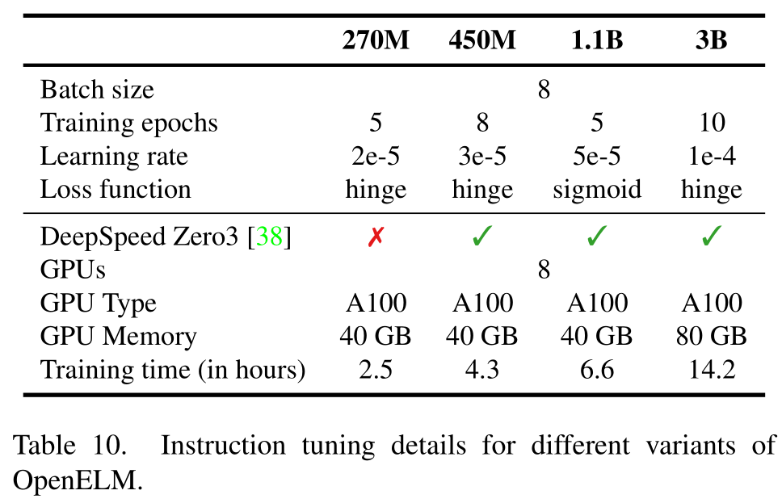

# OpenELM: An Efficient Language Model Family with Open-source Training and Inference Framework

| 作者  | 机构  |
| --- | --- |
|[Sachin Mehta](../Authors/Sachin_Mehta.md)|[Apple](../Institutions/Apple.md)|
|[Mohammad Hossein Sekhavat](../Authors/Mohammad_Hossein_Sekhavat.md)|[Apple](../Institutions/Apple.md)|
|[Qingqing Cao](../Authors/Qingqing_Cao.md)|[Apple](../Institutions/Apple.md)|
|[Maxwell Horton](../Authors/Maxwell_Horton.md)|[Apple](../Institutions/Apple.md)|
|[Yanzi Jin](../Authors/Yanzi_Jin.md)|[Apple](../Institutions/Apple.md)|
|[Chenfan Sun](../Authors/Chenfan_Sun.md)|[Apple](../Institutions/Apple.md)|
|[Iman Mirzadeh](../Authors/Iman_Mirzadeh.md)|[Apple](../Institutions/Apple.md)|
|[Mahyar Najibi](../Authors/Mahyar_Najibi.md)|[Apple](../Institutions/Apple.md)|
|[Dmitry Belenko](../Authors/Dmitry_Belenko.md)|[Apple](../Institutions/Apple.md)|
|[Peter Zatloukal](../Authors/Peter_Zatloukal.md)|[Apple](../Institutions/Apple.md)|
|[Mohammad Rastegari](../Authors/Mohammad_Rastegari.md)|[Apple](../Institutions/Apple.md)|

## Abstract·摘要

> The reproducibility and transparency of large language models are crucial for advancing open research, ensuring the trustworthiness of results, and enabling investigations into data and model biases, as well as potential risks.
> To this end, we release ==**OpenELM**==, a state-of-the-art open language model.
> ==**OpenELM**== uses a layer-wise scaling strategy to efficiently allocate parameters within each layer of the Transformer model, leading to enhanced accuracy.
> For example, with a parameter budget of approximately one billion parameters, ==**OpenELM**== exhibits a 2.36% improvement in accuracy compared to OLMo while requiring 2× fewer pre-training tokens.

大语言模型的可复现性和透明度对于先进开放研究至关重要, 确保结果的可信度, 能够深入研究数据和模型偏见, 以及潜在风险.
为此, 我们发布了 OpenELM, 一个当前最先进的开源语言模型.
OpenELM 使用逐层缩放策略以有效地在 Transformer 模型的每个层中分配参数, 从而增强精度.
例如, 对于一个参数规模约为 1 亿的模型, OpenELM 相较于 OLMo 提高了 2.36% 的准确率, 而只要求 2 倍少于 OLMo 的预训练数据.

> Diverging from prior practices that only provide model weights and inference code, and pre-train on private datasets, our release includes the complete framework for training and evaluation of the language model on publicly available datasets, including training logs, multiple checkpoints, and pre-training configurations.
> We also release code to convert models to MLX library for inference and fine-tuning on Apple devices.
> This comprehensive release aims to empower and strengthen the open research community, paving the way for future open research endeavors.

和之前的研究只提供模型权重和推理代码, 以及在私有数据集上预训练不同, 我们还发布了在公开数据集上训练和推理的完整框架, 包括训练日志, 多个检查点, 以及预训练配置.
我们还发布了用于将模型转换为 MLX 库用于在 Apple 设备上进行推理和微调的代码.
此完整的发布旨在激发和加强开放研究社区, 为未来开放研究奠定基础.

> Our source code along with pre-trained model weights and training recipes is available at https://github.com/apple/corenet.
> Additionally, ==**OpenELM**== models can be found on HuggingFace at: https://huggingface.co/apple/OpenELM.

我们的源代码, 预训练模型权重和训练方法都在 Github 上发布, 地址为 https://github.com/apple/corenet.
另外, OpenELM 模型可以在 HuggingFace 上找到, 地址为 https://huggingface.co/apple/OpenELM.

## 1.Introduction·引言

> Transformer-based [48] large language models (LLM) are revolutionizing the field of natural language processing [7,46].
> These models are isotropic, meaning that they have the same configuration (e.g., number of heads and feed-forward network dimensions) for each Transformer layer.
> Though such isotropic models are simple, they may not allocate parameters efficiently inside the model.

基于 Transformer 的大型语言模型 (LLM) 正在变革自然语言处理领域.
这些模型是各向同性的, 这意味着它们的每个 Transformer 层都具有相同的配置 (例如, 注意力头数和前馈网络维度).
虽然这样的各向同性模型很简单, 但它们可能在模型内部不充分地分配参数.

> In this work, we develop and release ==**OpenELM**==, a family of pre-trained and fine-tuned models on publicly available datasets.
> At the core of ==**OpenELM**== lies layer-wise scaling [30], enabling more efficient parameter allocation across layers.
> This method utilizes smaller latent dimensions in the attention and feed-forward modules of the Transformer layers closer to the input, and gradually widening the layers as they approach the output.

本项工作开发并发布了 OpenELM, 一类在公开可用数据集上预训练和微调的模型.
OpenELM 的核心是逐层缩放, 它使得参数分配更加有效.
这种方法在 Transformer 层的注意力模块和前馈模块中使用较小的隐藏层维度, 并随着接近输出不断加宽.

> We release the complete framework, encompassing data preparation, training, fine-tuning, and evaluation procedures, alongside multiple pre-trained checkpoints and training logs, to facilitate open research.
> Importantly, ==**OpenELM**== outperforms existing open LLMs that are pre-trained using publicly available datasets (Tab.01). 
> For example, ==**OpenELM**== with 1.1 billion parameters outperforms OLMo [17], which has 1.2 billion parameters, by 2.36% while requiring 2× fewer pre-training tokens.

我们发布了完整框架, 包括数据准备, 训练, 微调, 评估过程, 以及多个预训练检查点和训练日志, 以促进开放研究.
重要的是, OpenELM 的性能优于其他现有的在公开可用数据集上预训练的大语言模型, 参阅表格 01.
例如, 1.1 亿参数的 OpenELM 优于 1.2 亿参数的 OLMo, 仅需 2 倍少于 OLMo 的预训练数据, 且准确率提高 2.36%.

## 2.Pre-Training·预训练

> This section describes the framework, including model architecture (2.1), pre-training data (2.2), training hyper-parameters (2.3), and evaluation (2.4).

本节介绍了整体框架, 包括模型架构, 预训练数据, 训练超参数和评估.

### 2.1.OpenELM Architecture·架构

> We adopt the decoder-only Transformer-based architecture.
> Following state-of-the-art LLMs, we:
> 1. do not use learnable bias parameters in any fully-connected (a.k.a., linear) layers, 
> 2. apply pre-normalization using RMSNorm [53] and also, use rotatory positional embedding (ROPE) [43] for encoding positional information, 
> 3. use Grouped Query Attention (GQA) [1] instead of Multi-Head Attention (MHA), 
> 4. replace the feed forward network (FFN) with SwiGLU FFN [41], 
> 5. use flash attention [13] for computing the scaled dot-product attention,
> 6. use the same tokenizer as [LLaMA](../2023.02_LLaMA/2023.02_LLaMA.md).

我们采用基于仅用 Transformer 解码器的架构.
遵循当前最先进的大语言模型, 我们:
1. 不在任何全连接层中使用可训练的偏置参数;
2. 使用 RMSNorm 进行预归一化, 并使用旋转位置嵌入 (ROPE) 来编码位置信息;
3. 使用 Grouped Query Attention (GQA) 而不是多头注意力;
4. 将前馈神经网络替换为 SwiGLU FFN;
5. 使用 Flash Attention 计算缩放点积注意力;
6. 使用和 LLaMA 相同的分词器.

> Existing LLMs use the same configuration for each Transformer layer in the model, resulting in a uniform allocation of parameters across layers.
> Unlike these models, each Transformer layer in ==**OpenELM**== has a different configuration (e.g., number of heads and feed forward network dimension), resulting in variable number of parameters in each layer of the model.
> This lets ==**OpenELM**== to better utilize the available parameter budget for achieving higher accuracies.
> We implement this non-uniform allocation of parameters across layers using layer-wise scaling (also referred as block-wise scaling in [30]).

现有的大语言模型为每个 Transformer 层都使用相同的配置, 使得参数分配在各层上是均匀的.
和这些模型不同, OpenELM 中每个 Transformer 层都有不同配置 (例如, 注意力头数和前馈网络维度), 使得模型每层都具有不同参数数量.
这使得 OpenELM 能够更好地利用可用参数预算实现更高的准确率.
我们使用逐层缩放 (也称为块级缩放) 来实现非均匀分配参数.

#### Layer-Wise Scaling·逐层缩放

> A standard Transformer layer is composed of multi-head attention (MHA) and feed-forward network (FFN).
> For non-uniform allocation of parameters in the Transformer layer, we adjust the number of attention heads and the FFN multiplier in each Transformer layer.

一个标准的 Transformer 层由多头注意力 (MHA) 和前馈网络 (FFN) 组成.
为了实现非均匀分配参数, 我们调整每个 Transformer 层的注意力头数和 FFN 乘数.

> Assume that the standard Transformer model with uniform parameter allocation has $N$ Transformer layers and the dimensionality of the input to each layer is $d_{model}$.
> The MHA has $n_h$ heads and dimension of each head is $d_h=\dfrac{d_{model}}{n_h}$.
> Also, the hidden dimension for FFN is $d_{FFN}= m\cdot d_{model}$, where $m$ is a scalar FFN multiplier.

假设均匀参数分配的标准的 Transformer 模型有 $N$ 个 Transformer 层, 输入到每个层的维度为 $d_{model}$.
多头注意力有 $n_h$ 个注意力头, 每个注意力头的维度为 $d_h=\dfrac{d_{model}}{n_h}$.
前馈网络的隐藏层维度为 $d_{FFN}= m\cdot d_{model}$, 其中 $m$ 是标量的 FFN 乘数.

> We introduce parameters $\alpha$ and $\beta$ to scale the number of attention heads $n_h$ and FFN multiplier $m$ per layer respectively.
> For the $i$-th layer, $n_h$ and $m$ are computed as 

我们引入参数 $\alpha$ 和 $\beta$ 来分别缩放每个层的注意力头数 $n_h$ 和前馈网络乘数 $m$.
对于第 $i$ 层, $n_h$ 和 $m$ 计算如下:

$$
  n_h^i = \dfrac{\alpha^i\cdot d_{model}}{d_h},\quad m^i = \beta^i
$$

> where

其中

$$
  \alpha^i = \alpha_{min} + \dfrac{\alpha_{max} - \alpha_{min}}{N-1}\cdot i
$$

$$
  \beta^i = \beta_{min} + \dfrac{\beta_{max} - \beta_{min}}{N-1}\cdot i
$$

$$
  0\leq i <N
$$

> Here, $\alpha_{min}$ and $\alpha_{max}$ are the hyper-parameters that allow us to scale the attention heads.
> Similarly, $\beta_{min}$ and $\beta_{max}$ let us to vary the width of FFN layers.
> Therefore, varying the configuration of standard Transformer layers using $\alpha$ and $\beta$ results in non-uniform allocation of parameters in the model.
> Note, setting $\alpha_{min}=\alpha_{max}= 1.0$ and $m_i= m$ produces the standard uniform Transformer model.

这里的 $\alpha_{min}$ 和 $\alpha_{max}$ 是允许我们缩放注意力头的超参数.
类似地, $\beta_{min}$ 和 $\beta_{max}$ 允许我们调整 FFN 层的宽度.
因此, 使用 $\alpha$ 和 $\beta$ 调整标准 Transformer 层的配置, 使得模型中的参数分配不均匀.
注意, 设置 $\alpha_{min}=\alpha_{max}= 1.0$ 和 $m_i= m$ 将得到标准均匀分配参数的 Transformer 模型.

### 2.2.Pre-Training Data·预训练数据

> For pre-training, we use public datasets.
> Specifically, our pre-training dataset contains RefinedWeb [35], deduplicated PILE [15], a subset of RedPajama [11], and a subset of Dolma v1.6 [42], totaling approximately 1.8 trillion tokens.
> These details are also summarized in Tab.02.

对于预训练, 我们使用公开数据集.
具体来说, 我们的预训练数据集包括 RefinedWeb, 去重的 PILE, RedPajama 的子集, Dolma v1.6 的子集, 总计约 1.8 万亿个 Token.
这些细节在表格 02 中进行了总结.

|Source|Subset|Tokens
|---|---|---|
|RefinedWeb||665 B
|RedPajama|Github Books ArXiv Wikipedia StackExchange C4|59 B 26 B 28 B 24 B 20 B 175 B|
|PILE||207 B|
|Dolma|The Stack Reddit PeS2o Project Gutenberg Wikipedia + Wikibooks|411 B 89 B 70 B 6 B 4.3B|

#### On-the-Fly Tokenization & Data Filtering·即时分词和数据过滤

> Unlike previous approaches that utilize pre-tokenized data [5,17], we filter and tokenize text data on-the-fly.
> This facilitates seamless experimentation with various tokenizers, thereby significantly simplifying prototyping and research endeavors.
> In our experiments, we use the same tokenizer as used in [LLaMA](../2023.02_LLaMA/2023.02_LLaMA.md).

与之前使用预分词数据的方法不同, 我们过滤并即时分词文本数据.
这样可以促进不同分词器的无缝实验, 从而大大简化原型设计和研究工作.
在我们的实验中, 我们采用 LLaMA 的分词器.

> To filter out low-length sequences, we apply two filtering methods.
> The first method operates at the character-level, checking if the number of characters in the sequence is below a specified threshold.
> The second method operates at the token-level, where it examines whether the sequence contains fewer tokens than a specified threshold.
> Sequences that are shorter than either of these thresholds are skipped.
> In our experiments, we use 200 characters and 256 tokens as character and token-level filtering thresholds.

为了过滤掉低长度的序列, 我们采用两种过滤方法.
第一种方法在字符级别上进行, 检查序列中字符的数量是否低于指定阈值.
第二种方法在 Token 级别上进行, 它检查序列中 Token 的数量是否包含少于指定阈值.
如果序列长度低于这两种阈值中的任何一个, 则跳过该序列.
在我们的实验中, 我们使用 200 个字符和 256 个 Token 作为字符级别和 Token 级别的过滤阈值.

### 2.3.Training Details·训练细节

> We train ==**OpenELM**== variants for 350k iterations (or training steps) using CoreNet (formerly CVNets [29]).
> We use [AdamW](../../Optimizers/AdamW.md) as an optimizer.
> We use a cosine learning rate schedule [27], with warm up of 5k iterations, and decay the final learning rate down to 10% of maximum learning rate.
> We use a weight decay of 0.1 and gradient clipping of 1.0.
> We train four variants of ==**OpenELM**== (270M, 450M, 1.1B, and 3B), and for some, we use FSDP [56] and activation checkpointing [8].
> Please refer to Appendix A for additional pre-training details.

我们使用 CoreNet (前身为 CVNets) 训练 350k 次迭代/训练步数得到 OpenELM 变体.
我们使用 AdamW 作为优化器.
我们使用余弦学习率调度, 其中五千次迭代预热, 然后衰减最终学习率到最大学习率的 10%.
我们使用权重衰减 0.1 和梯度裁剪 1.0.
我们训练四个 OpenELM 变体 (270M, 450M, 1.1B, 3B), 其中一些使用 FSDP 和激活检查点.
请参阅附录 A (表格 09) 获取更多预训练细节.

### 2.4.Evaluation Details·评估细节

> Following previous works, we evaluate the performance across different tasks using LM Evaluation Harness [16]:

遵循之前的工作, 我们使用 LM Evaluation Harness [16] 评估在不同任务的性能:

#### Standard Zero-Shot Tasks·标准零样本任务

> We consider 7 standard common-sense reasoning tasks: ARC easy and challenge [10], BoolQ [9], HellaSwag [52], PIQA [6], SciQ [49], and WinoGrande [39].

我们考虑七个标准常识推理任务:
- ARC easy
- ARC challenge
- BoolQ
- HellaSwag
- PIQA
- SciQ
- WinoGrande

#### OpenLLM Leaderboard Tasks·OpenLLM 排行榜任务

> We use 5 tasks from OpenLLM leaderboard [4]: ARC challenge, HellaSwag, MMLU [20], TruthfulQA [24], and WinoGrande.

我们使用 OpenLLM 排行榜的五个任务:
- ARC challenge
- HellaSwag
- MMLU
- TruthfulQA
- WinoGrande

#### LLM360 Leaderboard Tasks·LLM360 排行榜任务

> We use 7 tasks from LLM360 leaderboard [26] for evaluation: ARC challenge, CrowS-Pairs (English version) [32], HellaSwag, WinoGrande, MMLU, PIQA, and RACE [23].

我们使用 LLM360 排行榜的七个任务进行评估:
- ARC challenge
- CrowS-Pairs (英文版本)
- HellaSwag
- WinoGrande
- MMLU
- PIQA
- RACE

> These evaluation frameworks, built on top of LM Evaluation Harness, allows us to comprehensively evaluate ==**OpenELM**== in terms of reasoning (e.g., ARC-c, HellaSwag, and PIQA), knowledge understanding (e.g., MMLU and RACE), and misinformation & bias (e.g., TruthfulQA and CrowS-Pairs).

这些建立在 LM Evaluation Harness 之上的评估框架, 允许我们全面评估 OpenELM 在推理 (ARC-c, HellaSwag, PIQA), 知识理解 (MMLU 和 RACE) 和误导性信息和偏见 (TruthfulQA 和 CrowS-Pairs) 方面的能力.

> While there may be some overlap in tasks among these frameworks, they primarily differ in the few-shot settings, as outlined in Tab.03.

尽管这些框架中的任务可能存在重叠, 但它们主要区别在于少样本设置, 如表格 03 所示.

## 3.Experimental Results·实验结果

### Pre-Training Results·预训练结果

> We evaluate the performance of ==**OpenELM**== on zero-shot and few-shot settings (Tab.03).
> We compare ==**OpenELM**== with publicly available LLMs, namely PyThia [5], Cerebras-GPT [14], TinyLlama [54], OpenLM [18], MobiLlama [44], and OLMo [17].
> The works most closely related to ours are MobiLlama and OLMo.
> These models are trained on comparable dataset mixtures, with similar or larger number of pre-training tokens.

我们在零样本和少样本设置下评估 OpenELM 的性能 (表格 03).
我们比较 OpenELM 与公开可用的大语言模型, 包括 PyThia, Cerebras-GPT, TinyLlama, OpenLM, MobiLlama, 和 OLMo.
与我们的工作最接近的模型是 MobiLlama 和 OLMo.
这些模型都在规模差距不大的混合数据集中进行训练, 具有相似或更大的预训练 Token 数量.

> In Fig.01, the accuracy of ==**OpenELM**== is plotted against training iterations for 7 standard zero-shot tasks.
> We observe an overall increase in accuracy with longer training durations across most tasks.
> Additionally, the checkpoint obtained by averaging the last five checkpoints, collected at intervals of 5000 iterations, demonstrates comparable or slightly better accuracy compared to the final checkpoint obtained after 350k iterations.
> This improvement is likely due to noise reduction through weight averaging.
> Consequently, we use the averaged checkpoint for our main evaluations in Tab.04, instruction tuning experiments in Tab.05, and parameter-efficient tuning experiments in Tab.06.

在图 01 中, 我们绘制了 OpenELM 在 7 个标准零样本任务上的准确度随训练迭代次数的变化曲线.
我们观察到, 在大多数任务中, 训练持续时间越长, 准确度越高.
此外, 我们收集的最后五个检查点的平均值, 间隔为 5000 次迭代, 与 350k 次迭代后获得的最终检查点的准确度相当或稍好.
这种改进可能是通过加权平均而导致的噪声降低.
因此, 我们采用平均检查点用于表格 04 的主要评估, 表格 05 的指令调优实验, 以及表格 06 的参数高效调优实验.

> The results in Tab.04 span across various evaluation frameworks, and highlights ==**OpenELM**==’s effectiveness over existing methods.

表格 04 中的结果涵盖了各种评估框架, 并突出了 OpenELM 相对于现有方法的有效性.

> For instance, an ==**OpenELM**== variant with 1.1 billion parameters achieves 1.28% (Tab.04a), 2.36% (Tab.04b), and 1.72% (Tab.04c) higher accuracy compared to OLMo with 1.2 billion parameters.
> Remarkably, ==**OpenELM**== achieves this level of accuracy while using 2× less pretraining data.

例如 1.1 亿参数的 OpenELM 变体相对于 1.2 亿参数的 OLMo, 准确度提高了 1.28%, 2.36%, 和 1.72% 点.
需要注意的是, OpenELM 取得了如此高的准确度, 而仅使用其一半规模的预训练数据.

### Instruction Tuning Results·指令调优结果

> We use the cleaned variant of UltraFeedback [3, 12] dataset that consists of 60k prompts for instruction tuning.
> We do instruction tuning using Alignment Handbook library [47].
> For optimization, we use either the statistical rejection sampling method [25] or the direct preference optimization method [37].
> These sampling method details along with other hyper-parameters and fine-tuning details are given in Appendix B.

我们使用 UltraFeedback 数据集的清洗版本, 包含六万个提示用于指令调优.
我们使用 Alignment Handbook 库进行指令调优.
对于优化, 我们采用统计拒绝采样方法或直接偏好优化方法.
这些采样方法的详细信息以及其他超参数和微调细节, 请参阅附录 B.

> We conducted a grid search to determine optimal values for the learning rate and training epochs. 
> For the learning rate, we explored values in the range of [2e-5, 3e-5, 5e-5, 8e-5, 1e-4], while for training epochs, we investigated the range of [3, 5, 8, 10]. 
> The final recipe selected is the one that yielded the highest average accuracy across various tasks as presented in Tab.03a and Tab.03c.

我们采用网格搜索确定最佳的学习率和训练 Epoch 数.
对于学习率, 我们探索范围为 [2e-5, 3e-5, 5e-5, 8e-5, 1e-4], 而对于训练 Epoch, 我们调查范围为 [3, 5, 8, 10].
最终的选择是那些在不同任务上获得平均准确度最高的配置.

> We fine-tune all the models with BFloat16 as a data type.
> We use activation checkpointing along with gradient accumulation with a step size of two. 
> We use the AdamW optimizer with default beta values. 
> We use the cosine learning rate scheduler with a warm-up ratio of 0.1, and we set the weight decay to 0 and loss temperature beta to 0.01.
> We set the maximum context length to 1024 and maximum prompt length to 512. Other hyper-parameters are included in Tab.10.

我们使用 BFloat16 作为数据类型对模型进行微调.
我们使用激活检查点和梯度累积, 步长为 2.
我们使用 AdamW 优化器, 并使用默认的参数.
我们使用余弦学习率调度, 预热率为 0.1, 权重衰减为 0, 损失温度参数为 0.01.
我们设置最大上下文长度为 1024, 最大提示长度为 512. 其他超参数请参阅表格 10.

> Tab.05 shows that instruction tuning consistently improves ==**OpenELM**==’s average accuracy by 1-2% across different evaluation frameworks.

表格 05 展示了指令调优在不同评估框架下的平均准确度提高 1-2% 左右.

### Parameter-Efficient Fine-Tuning (PEFT) Results·参数高效微调结果

> We use the CommonSense reasoning training and evaluation setup [22].
> This setup provides 170k training samples across 8 multiple-choice datasets for PEFT studies with different methods, including LoRA [21] and DoRA [51].
> We integrate ==**OpenELM**== with these methods, and finetune the resulting model for three epochs using 8 NVIDIA H100 GPUs.
> Tab.06 shows that PEFT methods can be applied to ==**OpenELM**==.
> LoRA and DoRA deliver similar accuracy on average across the given CommonSense reasoning datasets.

我们使用 CommonSense 推理训练和评估设置.
该设置提供了 170k 训练样本, 8 个多选数据集, 用于 PEFT 研究, 包括 LoRA 和 DoRA.
我们将 OpenELM 与这些方法集成, 并使用 8 个 NVIDIA H100 GPU 微调结果模型, 微调 3 个 Epoch.
表格 06 展示了 PEFT 方法可以应用于 OpenELM.
LoRA 和 DoRA 在给定的 CommonSense 推理数据集上, 平均准确度相当.

## 4.Benchmarking·基准测试

### Hardware·硬件

> We benchmark on modern, consumer-grade hardware with BFloat16 as the data type.
> Specifically, CUDA benchmarks were performed on a workstation with an Intel i9-13900KF CPU, equipped with 64 GB of DDR5-4000 DRAM, and an NVIDIA RTX 4090 GPU with 24 GB of VRAM, running Ubuntu 22.04.
> PyTorch v2.2.2 [34] was used, with the most recent versions of models and the associated libraries.
> HuggingFace Transformers v4.39.3 [50] was used to benchmark HuggingFace models.
> We did not use Torch Inductor for model compilation.

我们在现代消费者级硬件上采用 BFloat16 作为数据类型进行基准测试.
具体来说, CUDA 基准是在一台工作站上进行的, 其 CPU 为 Intel i9-13900KF, 内存为 64 GB DDR5-4000, GPU 为 NVIDIA RTX 4090, 操作系统为 Ubuntu 22.04.
我们使用 PyTorch v2.2.2, 并使用最新版本的模型和相关库.
我们使用 HuggingFace Transformers v4.39.3 作为 HuggingFace 模型基准.
我们没有使用 Torch Inductor 进行模型编译.

> To benchmark ==**OpenELM**== models on the Apple silicon, we used an Apple MacBook Pro with an M2 Max system-on-chip and 64GiB of RAM, running macOS 14.4.1.
> We ported the code and the weights of ==**OpenELM**== to Apple MLX v0.10.0 [19].
> To maximize the throughput, lazy evaluation was used in MLX with 8 tokens evaluated at a time.

为了在 Apple silicon 上对 OpenELM 模型进行基准, 我们使用一台 Apple MacBook Pro, 其系统芯片为 M2 Max, 内存为 64GiB, 操作系统为 macOS 14.4.1.
我们将 OpenELM 代码和权重移植到 Apple MLX v0.10.0.
为了最大限度地提高吞吐量, 我们在 MLX 中使用惰性评估, 一次评估 8 个 Token.

### Evaluation·评估

> We provide two separate measurements for token throughput (measured in terms of tokens processed per second): (1) prompt processing (pre-fill), and (2) token generation.
> Additionally, we also report the total combined throughput.
> We benchmark all models sequentially, and execute one full “dry run” generating 1024 tokens for the first model, since we found that this significantly increases the throughput of generation for subsequent models.
> Before measurement for each individual model, we warm up the model by executing a single forward pass to allow the frameworks to perform further auto-tuning, if any.
> In all experiments, we use key-value caching and generate 1024 tokens in addition to the prompt tokens in all tests.
> Static key-value cache was used whenever supported.
> The same prompt was used for all runs, resulting in prompt lengths of 35-36 tokens (depending on the tokenizer).

我们提供两个单独的度量用于 Token 吞吐量 (以每秒处理 Token 为单位):
1. 提示处理 (预填充)
2. Token 生成

此外, 我们还报告总体吞吐量.
我们按顺序对所有模型进行基准测试, 并对第一个模型执行完整的 "干净运行", 因为我们发现, 这样可以显著提高后续模型生成的吞吐量.
在对每个模型进行评估之前, 我们通过执行一次前向传播来预热模型, 以便框架完成进一步的自动调优, 如果有.
在所有实验中, 我们都使用键值缓存, 并在所有测试中生成 1024 个 Token, 而提示 Token 数量取决于 Tokenizer.
静态键值缓存是可选的.
所有运行都是用相同的提示, 因此提示长度为 35-36 个 Token.

### Results·结果

> Tab.07a and Tab.07b shows the benchmarking results on GPU and MacBook Pro respectively.
> Despite ==**OpenELM**==’s higher accuracy for a similar parameter count, we observe that it is slower than OLMo.
> While the primary focus of this study is reproducibility rather than inference performance, we did comprehensive profiling to understand the bottlenecks.
> Our analysis reveals that a significant portion of ==**OpenELM**==’s processing time can be attributed to our naive implementation of RMSNorm (Tab.08).
> Specifically, naive RMSNorm implementation results in many individual kernel launches each of which processes a small input, rather than a launch of a single, fused kernel, as would be the case with e.g. LayerNorm.
> By replacing the naive RMSNorm with Apex’s RMSNorm [33], we observe a notable increase in ==**OpenELM**==’s throughput.
> However, a substantial performance gap persists compared to the models that use optimized LayerNorm, in part because (1) ==**OpenELM**== has 113 RMSNorm layers as compared to 33 LayerNorm layers in OLMo and (2) Apex’s RMSNorm is not optimized for small inputs.
> To further illustrate the performance degradation attributable to RMSNorm, we replaced the LayerNorm in OLMo with RMSNorm, and observed a significant drop in generation throughput.
> In future work, we plan to explore optimization strategies to further improve the inference efficiency of ==**OpenELM**==.

表格 07a 和表格 07b 分别展示了 GPU 和 MacBook Pro 上的基准测试结果.
尽管在相似的参数数量下 OpenELM 的准确度更高, 但我们观察到它比 OLMo 慢.
尽管本研究的主要关注点是可复现性而不是推理性能, 但我们进行了全面的分析, 以理解瓶颈.
我们的分析表明, OpenELM 的大部分处理时间都和我们对 RMSNorm 的原始实现有关 (表格 08).
具体来说, 原始 RMSNorm 实现使得启动许多处理小输入的核, 而不是启动单个的融合核, 如 LayerNorm.
通过将原始 RMSNorm 替换为 Apex 的 RMSNorm, 我们观察到 OpenELM 的吞吐量显著提高.
然而, 和使用 LayerNorm 的模型相比仍然存在实质的性能差距, 部分原因是 (1) OpenELM 有 113 个 RMSNorm 层, 而 OLMo 有 33 个 LayerNorm 层 (2) Apex 的 RMSNorm 并未针对小输入进行优化.
为了进一步说明 RMSNorm 导致的性能退化, 我们将 OLMo 中的 LayerNorm 替换为 RMSNorm, 并观察到生成吞吐量显著下降.
在未来工作中, 我们计划探索优化策略, 以进一步提高 OpenELM 的推理效率.

## 5.Conclusion·结论

> This work releases ==**OpenELM**==, a decoder-only Transformer-based open language model.
> The ==**OpenELM**== uses a layer-wise scaling method for efficient parameter allocation within the Transformer model,resulting in improved accuracy compared to existing models.
> Additionally, we have made the entire framework open-source, including training logs, multiple checkpoints, pre-training configurations, and MLX inference code.
> This extensive release aims to empower and strengthen the open research community, facilitating future research efforts.

本项工作发布了 OpenELM, 一个基于仅有 Transformer 解码器的开源语言模型.
OpenELM 使用逐层缩放方法, 有效地在 Transformer 模型中分配参数, 从而与现有模型相比, 准确度得到提高.
此外, 我们已经将整个框架开源, 包括训练日志, 多个检查点, 预训练配置, 和 MLX 推理代码.
这一详尽发布旨在激发和加强开放研究社区, 促进未来研究工作.

## Broader Impact·更广泛的影响

> The release of ==**OpenELM**== models aims to empower and enrich the open research community by providing access to state-of-the-art language models.
> Trained on publicly available datasets, these models are made available without any safety guarantees.
> Consequently, there exists the possibility of these models producing outputs that are inaccurate, harmful, biased, or objectionable in response to user prompts.
> Thus, it is imperative for users and developers to undertake thorough safety testing and implement appropriate filtering mechanisms tailored to their specific requirements.

OpenELM 模型的发布旨在激发和丰富开放研究社区, 提供对最新语言模型的访问.
这些模型在公开可用的数据集上进行训练, 无任何安全保证.
所以用户和开发者应认真测试这些模型的安全性, 并根据具体需求实现适当的过滤机制.
对于用户和开发者来说, 保证模型的准确性, 安全性, 公平性, 以及不受用户提示的干扰是至关重要的.