# Sapphire-TTS-Collection

本仓库收集/整理/学习语音合成技术相关资料.
(可能含有部分 NLP 和其他语音相关技术)
仍在初步更新中

## 推荐链接

- [Speech.Zone](https://speech.zone)
- [语音之家](https://www.speechhome.com)
- 课题组 [X-LANCE@SJTU](https://x-lance.sjtu.edu.cn)
- 课题组 [ASLP@NPU](http://www.npu-aslp.org)
- 课题组 [Speech@NTU](https://www.youtube.com/@HungyiLeeNTU)

## 同类项目

- [Awesome Audio Plaza](https://github.com/metame-ai/awesome-audio-plaza) by Metame AI 
- [Speech Trident](https://github.com/ga642381/speech-trident) by 李宏毅 Team 
- [WavChat](https://github.com/jishengpeng/WavChat) by 浙江大学 (赵洲 Team) & 微软 & 阿里巴巴 & 腾讯优图实验室 
- [Neural Codec & Speech Language Models](https://github.com/LqNoob/Neural-Codec-and-Speech-Language-Models) by LqNoob 
- [Awesome MLLM](https://github.com/BradyFU/Awesome-Multimodal-Large-Language-Models) by VITA Team 
- [Awesome Large Speech Model](https://github.com/huangcanan/Awesome-Large-Speech-Model) by Huang Can'an 
- [VoiceBench](https://github.com/MatthewCYM/VoiceBench) by 新加坡国立大学 
- [Awesome Controllable Speech Synthesis](https://github.com/imxtx/awesome-controllabe-speech-synthesis) by 香港科技大学 (广州) 
- [Awesome-Multimodal-Next-Token-Prediction](https://github.com/LMM101/Awesome-Multimodal-Next-Token-Prediction) by Liang Chen (Leader) 

## 开源项目·Text-to-Speech

|项目名称|项目时点|模型版本|
|---|---|---|
| [* ](https://arxiv.org/abs/2601.15621)| |- 2026.01.29  - 2026.01.29  - 2026.01.29  - 2026.01.23  - 2026.01.29   - 2026.01.29  - 2026.01.29 |
| [* ](https://arxiv.org/abs/2509.24650)| |- [2025.09.20 ](https://modelscope.cn/models/OpenBMB/VoxCPM-0.5B) - [2026.01.14 ](https://modelscope.cn/models/OpenBMB/VoxCPM1.5)|
|| |- [2025.09.23 -0.5B-green)](https://huggingface.co/ResembleAI/chatterbox) - [2025.12.15 ](https://huggingface.co/ResembleAI/chatterbox-turbo)|
| [* ](https://arxiv.org/abs/2503.01710)| |- [2025.03.07 ](https://huggingface.co/SparkAudio/Spark-TTS-0.5B)|
| [* ](https://arxiv.org/abs/2502.05512) [* ](https://arxiv.org/abs/2601.15621) [* ](https://arxiv.org/abs/2601.03888)| |- [2025.04.28 ](https://modelscope.cn/models/IndexTeam/Index-TTS) - [2025.05.15 ](https://modelscope.cn/models/IndexTeam/IndexTTS-1.5) - [2026.01.21 ](https://modelscope.cn/models/IndexTeam/IndexTTS-2) - 2026.00.00 |
|| |- 2025.04.17  - 2025.04.27  - 2025.01.17  - 2025.01.17  - 2025.05.19  - 2025.09.08 |
| [* ](https://arxiv.org/abs/2409.00750)| |- [2025.04.13 ](https://huggingface.co/amphion/MaskGCT)|
| [* ](https://arxiv.org/abs/2410.06885)| |- [2024.10.15 ](https://www.modelscope.cn/models/SWivid/E2-TTS_Emilia-ZH-EN) - 2024.10.15  - [2025.03.12 ](https://www.modelscope.cn/models/SWivid/F5-TTS_Emilia-ZH-EN)|
| [* ](https://arxiv.org/abs/2409.03283) [* ](https://arxiv.org/abs/2503.20499)  [* ](https://arxiv.org/abs/2509.02020)|    |- [2025.09.17 ](https://huggingface.co/FireRedTeam/FireRedTTS) - [2025.09.17 ](https://huggingface.co/FireRedTeam/FireRedTTS-1S) - [2025.09.17 ](https://huggingface.co/FireRedTeam/FireRedTTS2)|
| [* ](https://arxiv.org/abs/2407.05407) [* ](https://arxiv.org/abs/2412.10117) [* ](https://arxiv.org/abs/2505.17589)| |- [2025.12.17 ](https://www.modelscope.cn/models/iic/CosyVoice-300M) - [2026.01.29 ](https://www.modelscope.cn/models/iic/CosyVoice2-0.5B) - [2026.01.29 ](https://www.modelscope.cn/models/FunAudioLLM/Fun-CosyVoice3-0.5B-2512)|
|| |- [2024.10.22 ](https://huggingface.co/2Noise/ChatTTS) - 2024.00.00 |
| [* ](https://arxiv.org/abs/2402.01912)| |- [2024.05.01 ](https://huggingface.co/parler-tts/parler_tts_mini_v0.1) - [2024.11.25 ](https://huggingface.co/parler-tts/parler_tts_mini_v1) - [2024.11.23 ](https://huggingface.co/parler-tts/parler_tts_large_v1) - [2024.10.30 ](https://huggingface.co/parler-tts/parler_tts_mini_v1.1) - [2024.05.22 ](https://huggingface.co/parler-tts/parler-tts-mini-expresso)|
|| |- 2024.01.16  - 2024.08.07  - 2025.02.11  - 2025.02.11  - 2025.06.04  - [2025.06.04 ](https://huggingface.co/lj1995/GPT-SoVITS) **s1**: GPT Part; **s2**: Synthesizer Part|
| [* ](https://arxiv.org/abs/2312.01479)| |- [2023.12.26 ](https://myshell-public-repo-host.s3.amazonaws.com/openvoice/checkpoints_1226.zip) - [2024.04.17 ](https://myshell-public-repo-host.s3.amazonaws.com/openvoice/checkpoints_v2_0417.zip)|
| [* ](https://arxiv.org/abs/2411.01156)| |- [2024.05.20 ](https://huggingface.co/fishaudio/fish-speech-1) - [2024.07.02 ](https://huggingface.co/fishaudio/fish-speech-1.2) - [2024.08.02 ](https://huggingface.co/fishaudio/fish-speech-1.2-sft) - [2024.11.05 ](https://huggingface.co/fishaudio/fish-speech-1.4) - [2025.03.25 ](https://huggingface.co/fishaudio/fish-speech-1.5) - [2025.06.03 ](https://huggingface.co/fishaudio/openaudio-s1-mini) - 2025.06.03 |
| [* ](https://arxiv.org/abs/2309.03199)| |- [2023.09.17 ](https://drive.google.com/drive/folders/17C_gYgEHOxI5ZypcfE_k1piKCtyR0isJ?usp=sharing)|
|| |Github Releases|
 [* ](https://arxiv.org/abs/2305.07243)| |- [2023.10.25 ](https://huggingface.co/Manmay/tortoise-tts)|
| [* ](https://arxiv.org/abs/2106.06103)| |[- 2021.06.10 ](https://drive.google.com/drive/folders/1ksarh-cJf3F5eKJjLVWY0X1j1qsQqiS2?usp=sharing)|
| [* ](https://arxiv.org/abs/2406.04904)| |- [2023.11.11 ](https://huggingface.co/coqui/XTTS-v1) - [2023.12.12 ](https://huggingface.co/coqui/XTTS-v2)|
| Toolkits| ||
| Toolkits| ||

<!--

```mermaid
---
config:
  gitGraph:
    rotateCommitLabel: false
---
gitGraph BT:
    commit id: "START"
    checkout main
    commit id: "百度创建 PaddleSpeech" tag: "2017.05.22"
    commit id: "Coqui AI 创建 TTS" tag: "2018.01.22"
    commit id: "Coqui.AI 发布 XTTS V2" tag: "2020.05.20"
    commit id: "韩国 Kakao 创建 VITS" tag: "2021.05.27"
    branch VITS
    checkout VITS
    commit id: "发布 VITS 论文" tag: "2021.06.11"
    commit id: "VITS 最近更新" type: REVERSE tag: "2021.06.14"
    checkout main
    commit id: "James Betker 创建 TorToiSe-TTS" tag: "2022.01.28"
    commit id: "FishAudio 创建 BERT-VITS2" tag: "2023.07.21"
    branch BERT-VITS2
    checkout main
    commit id: "瑞典皇家理工学院创建 Matcha-TTS" tag: "2023.09.06"
    commit id: "FishAudio 创建 FishSpeech" tag: "2023.10.10"
    branch FishSpeech
    checkout main
    commit id: "MyShell AI & 清华大学 创建 OpenVoice" tag: "2023.11.29"
    branch OpenVoice
    checkout main
    commit id: "花儿不哭创建 GPT-SoVITS" tag: "2024.01.15"
    branch GPT-SoVITS
    checkout GPT-SoVITS
    commit id: "发布 GPT-SoVITS V1" tag: "2024.01.15"
    checkout main
    commit id: "HuggingFace 创建 Parler-TTS" tag: "2024.02.13"
    commit id: "MyShell AI 创建 MeloTTS" tag: "2024.02.20"
    branch MeloTTS
    checkout OpenVoice
    commit id: "OpenVoice V2" tag: "2024.04.18"
    checkout FishSpeech
    commit id: "FishSpeech V1.1" tag: "2024.05.10"
    checkout main
    commit id: "2Noise 创建 ChatTTS" tag: "2024.05.28"
    branch ChatTTS
    checkout FishSpeech
    commit id: "FishSpeech V1.2" tag: "2024.07.02"
    checkout main
    commit id: "阿里创建 FunAudioLLM"
    branch CosyVoice
    checkout CosyVoice
    commit id: "创建 CosyVoice" tag: "2024.07.03"
    commit id: "开源 300M" tag: "2024.07.05"
    commit id: "发布 CosyVoice 论文" tag: "2024.07.07"
    commit id: "修订 CosyVoice 论文v2" tag: "2024.07.09"
    checkout GPT-SoVITS
    commit id: "发布 V2" tag: "2024.08.02"
    checkout main
    commit id: "小红书创建 FireRedTTS"
    branch FireRedTTS
    checkout FireRedTTS
    commit id: "FireRedTTS" tag: "2024.08.15"
    checkout main
    commit id: "CUHK 发布 MaskGCT 论文" tag: "2024.09.01"
    branch MaskGCT
    checkout FishSpeech
    commit id: "FishSpeech V1.4" tag: "2024.09.10"
    checkout main
    commit id: "SJTU 创建 F5-TTS" tag: "2024.10.08"
    branch F5-TTS
    checkout MaskGCT
    commit id: "修订 MaskGCT 论文v2" tag: "2024.10.11"
    commit id: "修订 MaskGCT 论文v3" tag: "2024.10.20"
    commit id: "添加 MaskGCT 到 Amphion" tag: "2024.10.20"
    checkout main
    commit id: "OuteAI 创建 OuteTTS" tag: "2024.11.04"
    checkout FishSpeech
    commit id: "FishSpeech V1.5" tag: "2024.12.03"
    checkout CosyVoice
    commit id: "更新 CosyVoice-2" tag: "2024.12.11"
    commit id: "开源 CosyVoice-2 (0.5B)" tag: "2024.12.12"
    commit id: "发布 CosyVoice-2 论文" tag: "2024.12.13"
    commit id: "修订 CosyVoice-2 论文v2" tag: "2024.12.18"
    commit id: "修订 CosyVoice-2 论文v3" tag: "2024.12.25"
    checkout FishSpeech
    commit id: "FishSpeech V1.5.1" tag: "2024.12.25"
    checkout MeloTTS
    commit id: "MeloTTS 最近更新" type: REVERSE tag: "2024.12.25"
    checkout main
    commit id: "哔哩哔哩创建 IndexTTS" tag: "2025.02.06"
    branch IndexTTS
    checkout IndexTTS
    commit id: "发布 IndexTTS 论文" tag: "2025.02.08"
    checkout GPT-SoVITS
    commit id: "发布 V3" tag: "2025.02.11"
    checkout main
    commit id: "HKUST etc 创建 SparkTTS" tag: "2025.02.25"
    branch SparkTTS
    commit id: "发布 SparkTTS 论文" tag: "2025.03.03"
    commit id: "SparkTTS 最近更新" type: REVERSE tag: "2025.04.09"
    checkout FireRedTTS
    commit id: "FireRedTTS-1S" tag: "2025.04.15"
    checkout OpenVoice
    commit id: "OpenVoice 最近更新" type: REVERSE tag: "2025.04.19"
    checkout GPT-SoVITS
    commit id: "发布 V4" tag: "2025.04.20"
    checkout IndexTTS
    commit id: "IndexTTS-1.5" tag: "2025.05.14"
    checkout CosyVoice
    commit id: "发布 CosyVoice-3 论文" tag: "2025.05.23"
    checkout MaskGCT
    commit id: "MaskGCT 最近更新" type: REVERSE tag: "2025.05.26"
    checkout CosyVoice
    commit id: "修订 CosyVoice-3 论文v2" tag: "2025.05.27"
    checkout FishSpeech
    commit id: "OpenAudio-S1" tag: "2025.06.03"
    checkout GPT-SoVITS
    commit id: "发布 V2Pro, V2Pro+" tag: "2025.06.04"
    checkout IndexTTS
    commit id: "发布 IndexTTS-2 论文" tag: "2025.06.23"
    checkout VITS
    branch ParaStyleTTS
    commit id: "创建 ParaStyleTTS" tag: "2025.08.16"
    checkout main
    commit id: "微软研究开源 VibeVoice-TTS" tag: "2025.08.25"
    branch VibeVoice
    commit id: "发布 VibeVoice 论文" tag: "2025.08.26"
    checkout FireRedTTS
    commit id: "FireRedTTS-2" tag: "2025.09.02"
    checkout IndexTTS
    commit id: "修订 IndexTTS-2 论文v2" tag: "2025.09.03"
    checkout VibeVoice
    commit id: "创建 VibeVoice" tag: "2025.09.05"
    checkout IndexTTS
    commit id: "开源 IndexTTS-2" tag: "2025.09.08"
    checkout main
    commit id: "面壁智能创建 VoiceCPM" tag: "2025.09.16"
    branch VoiceCPM
    checkout VoiceCPM
    commit id: "开源 VoiceCPM (0.5B)" tag: "2025.09.16"
    commit id: "发布 VoiceCPM 论文" tag: "2025.09.29"
    checkout main
    commit id: "XMU SJTU ZJU 发布 UniVoice 论文" tag: "2025.10.06"
    branch UniVoice
    checkout ParaStyleTTS
    commit id: "发布 ParaStyleTTS 论文" tag: "2025.10.21"
    checkout FireRedTTS
    commit id: "FireRedTTS 最近更新" type: REVERSE tag: "2025.10.26"
    checkout UniVoice
    commit id: "创建 UniVoice" tag: "2025.10.28"
    commit id: "UniVoice 最近更新" type: REVERSE tag: "2025.10.30"
    commit id: "修订 UniVoice 论文v2" tag: "2025.11.20"
    checkout ChatTTS
    commit id: "ChatTTS 最近更新" type: REVERSE tag: "2025.11.27"
    checkout IndexTTS
    commit id: "IndexTTS 最近更新" type: REVERSE tag: "2025.12.02"
    checkout main
    commit id: "BIT & 快手 & CAS 创建 M3-TTS" tag: "2025.12.04"
    branch M3-TTS
    checkout M3-TTS
    commit id: "发布 M3-TTS 论文" tag: "2025.12.04"
    checkout VibeVoice
    commit id: "开源 VibeVoice-RealTime (0.5B)" type: REVERSE tag: "2025.12.05"
    checkout VoiceCPM
    commit id: "开源 VoiceCPM-1.5" tag: "2025.12.05"
    checkout CosyVoice
    commit id: "开源 Fun-CosyVoice-3 (0.5B)" tag: "2025.12.10"
    commit id: "更新 CosyVoice-3 代码" tag: "2025.12.12"
    checkout M3-TTS
    commit id: "M3-TTS 最近更新" type: REVERSE tag: "2025.12.18"
    checkout ParaStyleTTS
    commit id: "ParaStyleTTS 最近更新" type: REVERSE tag: "2025.12.21"
    checkout GPT-SoVITS
    commit id: "GPT-SoVITS 最近更新" type: REVERSE tag: "2025.12.30"
    checkout IndexTTS
    commit id: "发布 IndexTTS-2.5 论文" tag: "2026.01.07"
    commit id: "修订 IndexTTS-2.5 论文v2" tag: "2026.01.08"
    checkout BERT-VITS2
    commit id: "BERT-VITS2 最近更新" type: REVERSE tag: "2026.01.03"
    checkout FishSpeech
    commit id: "FishSpeech 最近更新" type: REVERSE tag: "2026.01.08"
    checkout main
    commit id: "CUHK & 华为发布 FlexiVoice 论文" type: REVERSE tag: "2026.01.08"
    checkout IndexTTS
    commit id: "修订 IndexTTS-2.5 论文v3" tag: "2026.01.09"
    checkout main
    commit id: "阿里 QwenLM 创建 Qwen3-TTS" tag: "2026.01.22"
    branch Qwen3-TTS
    commit id: "开源 12Hz 0.6B Base" tag: "2026.01.21"
    commit id: "开源 12Hz 0.6/1.7B Custom Voice" tag: "2026.01.21"
    commit id: "开源 12Hz 1.7B VoiceDesign" tag: "2026.01.21"
    commit id: "发布 Qwen3-TTS 论文" tag: "2026.01.22"
    commit id: "开源 12Hz 1.7B Base" tag: "2026.01.23"
    checkout VoiceCPM
    commit id: "VoiceCPM 最近更新" type: REVERSE tag: "2026.01.24"
    checkout Qwen3-TTS
    commit id: "Qwen3-TTS 最近更新" type: REVERSE tag: "2026.01.26"
    checkout F5-TTS
    commit id: "F5-TTS 最近更新" type: REVERSE tag: "2026.01.28"
    checkout VibeVoice
    commit id: "VibeVoice 最近更新" type: REVERSE tag: "2026.01.28"
    checkout CosyVoice
    commit id: "CosyVoice 最近更新" type: REVERSE tag: "2026.01.30"
    checkout main
    commit id: "2026.02"
```

-->