```mermaid
---
config:
  gitGraph:
    rotateCommitLabel: false
---
gitGraph BT:
    commit id: "START"
    checkout main
    commit id: "百度创建 PaddleSpeech" tag: "2017.05.22"
    commit id: "Coqui AI 创建 TTS" tag: "2018.01.22"
    commit id: "Coqui.AI 发布 XTTS V2" tag: "2020.05.20"
    commit id: "韩国 Kakao 创建 VITS" tag: "2021.05.27"
    branch VITS
    checkout VITS
    commit id: "发布 VITS 论文" tag: "2021.06.11"
    commit id: "VITS 最近更新" type: REVERSE tag: "2021.06.14"
    checkout main
    commit id: "James Betker 创建 TorToiSe-TTS" tag: "2022.01.28"
    commit id: "2noise 创建 MassTTS" tag: "2023.04.13"
    commit id: "FishAudio 创建 BERT-VITS2" tag: "2023.07.21"
    commit id: "瑞典皇家理工学院创建 Matcha-TTS" tag: "2023.09.06"
    commit id: "FishAudio 创建 FishSpeech" tag: "2023.10.10"
    branch FishSpeech
    checkout main
    commit id: "MyShell AI & 清华大学 创建 OpenVoice" tag: "2023.11.29"
    branch OpenVoice
    checkout main
    commit id: "花儿不哭创建 GPT-SoVITS" tag: "2024.01.15"
    branch GPT-SoVITS
    checkout GPT-SoVITS
    commit id: "发布 GPT-SoVITS V1" tag: "2024.01.15"
    checkout main
    commit id: "HuggingFace 创建 Parler-TTS" tag: "2024.02.13"
    commit id: "MyShell AI 创建 MeloTTS" tag: "2024.02.20"
    checkout OpenVoice
    commit id: "OpenVoice V2" tag: "2024.04.18"
    checkout FishSpeech
    commit id: "FishSpeech V1.1" tag: "2024.05.10"
    checkout main
    commit id: "2Noise 创建 ChatTTS" tag: "2024.05.28"
    checkout FishSpeech
    commit id: "FishSpeech V1.2" tag: "2024.07.02"
    checkout main
    commit id: "阿里创建 FunAudioLLM"
    branch CosyVoice
    checkout CosyVoice
    commit id: "创建 CosyVoice" tag: "2024.07.03"
    commit id: "开源 300M" tag: "2024.07.05"
    commit id: "发布 CosyVoice 论文" tag: "2024.07.07"
    commit id: "修订 CosyVoice 论文v2" tag: "2024.07.09"
    checkout GPT-SoVITS
    commit id: "发布 V2" tag: "2024.08.02"
    checkout main
    commit id: "小红书创建 FireRedTTS"
    branch FireRedTTS
    checkout FireRedTTS
    commit id: "FireRedTTS" tag: "2024.08.15"
    checkout FishSpeech
    commit id: "FishSpeech V1.4" tag: "2024.09.10"
    checkout main
    commit id: "SJTU 创建 F5-TTS" tag: "2024.10.08"
    branch F5-TTS
    checkout main
    commit id: "CUHK 创建 MaskGCT" tag: "2024.10.19"
    commit id: "OuteAI 创建 OuteTTS" tag: "2024.11.04"
    checkout FishSpeech
    commit id: "FishSpeech V1.5" tag: "2024.12.03"
    checkout CosyVoice
    commit id: "更新 CosyVoice-2" tag: "2024.12.11"
    commit id: "开源 CosyVoice-2 (0.5B)" tag: "2024.12.12"
    commit id: "发布 CosyVoice-2 论文" tag: "2024.12.13"
    commit id: "修订 CosyVoice-2 论文v2" tag: "2024.12.18"
    commit id: "修订 CosyVoice-2 论文v3" tag: "2024.12.25"
    checkout FishSpeech
    commit id: "FishSpeech V1.5.1" tag: "2024.12.25"
    checkout main
    commit id: "哔哩哔哩创建 IndexTTS" tag: "2025.02.06"
    branch IndexTTS
    checkout IndexTTS
    commit id: "发布 IndexTTS 论文" tag: "2025.02.08"
    checkout GPT-SoVITS
    commit id: "发布 V3" tag: "2025.02.11"
    checkout FireRedTTS
    commit id: "FireRedTTS-1S" tag: "2025.04.15"
    checkout GPT-SoVITS
    commit id: "发布 V4" tag: "2025.04.20"
    checkout IndexTTS
    commit id: "IndexTTS-1.5" tag: "2025.05.14"
    checkout CosyVoice
    commit id: "发布 CosyVoice-3 论文" tag: "2025.05.23"
    commit id: "修订 CosyVoice-3 论文v2" tag: "2025.05.27"
    checkout FishSpeech
    commit id: "OpenAudio-S1" tag: "2025.06.03"
    checkout GPT-SoVITS
    commit id: "发布 V2Pro, V2Pro+" tag: "2025.06.04"
    checkout IndexTTS
    commit id: "发布 IndexTTS-2 论文" tag: "2025.06.23"
    checkout main
    checkout FireRedTTS
    commit id: "FireRedTTS-2" tag: "2024.09.02"
    checkout IndexTTS
    commit id: "修订 IndexTTS-2 论文v2" tag: "2025.09.03"
    commit id: "开源 IndexTTS-2" tag: "2025.09.08"
    checkout main
    commit id: "面壁智能创建 VoiceCPM" tag: "2025.09.16"
    branch VoiceCPM
    checkout VoiceCPM
    commit id: "开源 VoiceCPM (0.5B)" tag: "2025.09.16"
    commit id: "发布 VoiceCPM 论文" tag: "2025.09.29"
    checkout main
    commit id: "XMU SJTU ZJU 发布 UniVoice 论文" tag: "2025.10.06"
    branch UniVoice
    checkout FireRedTTS
    commit id: "FireRedTTS 最近更新" type: REVERSE tag: "2025.10.26"
    checkout UniVoice
    commit id: "创建 UniVoice" tag: "2025.10.28"
    commit id: "UniVoice 最近更新" type: REVERSE tag: "2025.10.30"
    commit id: "修订 UniVoice 论文v2" tag: "2025.11.20"
    checkout IndexTTS
    commit id: "IndexTTS 最近更新" type: REVERSE tag: "2025.12.02"
    checkout main
    commit id: "BIT & 快手 & CAS 创建 M3-TTS" tag: "2025.12.04"
    branch M3-TTS
    checkout M3-TTS
    commit id: "发布 M3-TTS 论文" tag: "2025.12.04"
    checkout VoiceCPM
    commit id: "开源 VoiceCPM-1.5" tag: "2025.12.05"
    checkout CosyVoice
    commit id: "开源 Fun-CosyVoice-3 (0.5B)" tag: "2025.12.10"
    commit id: "更新 CosyVoice-3 代码" tag: "2025.12.12"
    checkout M3-TTS
    commit id: "M3-TTS 最近更新" type: REVERSE tag: "2025.12.18"
    checkout GPT-SoVITS
    commit id: "GPT-SoVITS 最近更新" type: REVERSE tag: "2025.12.30"
    checkout IndexTTS
    commit id: "发布 IndexTTS-2.5 论文" tag: "2026.01.07"
    commit id: "修订 IndexTTS-2.5 论文v2" tag: "2026.01.08"
    checkout main
    commit id: "CUHK & 华为发布 FlexiVoice 论文" type: REVERSE tag: "2026.01.08"
    checkout IndexTTS
    commit id: "修订 IndexTTS-2.5 论文v3" tag: "2026.01.09"
    checkout main
    commit id: "阿里 QwenLM 创建 Qwen3-TTS" tag: "2026.01.22"
    branch Qwen3-TTS
    commit id: "发布 Qwen3-TTS 论文" tag: "2026.01.22"
    commit id: "开源 12Hz 1.7B Base" tag: "2026.01.23"
    checkout VoiceCPM
    commit id: "VoiceCPM 最近更新" type: REVERSE tag: "2026.01.24"
    checkout Qwen3-TTS
    commit id: "Qwen-TTS 最近更新" type: REVERSE tag: "2026.01.26"
    checkout F5-TTS
    commit id: "F5-TTS 最近更新" type: REVERSE tag: "2026.01.28"
    checkout Qwen3-TTS
    commit id: "开源 12Hz 0.6B Base" tag: "2026.01.29"
    commit id: "开源 12Hz 0.6/1.7B Custom Voice" tag: "2026.01.29"
    commit id: "开源 12Hz 1.7B VoiceDesign" tag: "2026.01.29"
    checkout CosyVoice
    commit id: "CosyVoice 最近更新" type: REVERSE tag: "2026.01.30"
    checkout main
    commit id: "2026.02"
```

# Sapphire-TTS-Collection

本仓库收集/整理/学习语音合成技术相关资料.
(可能含有部分 NLP 和其他语音相关技术)
仍在初步更新中

## 推荐链接

- [Speech.Zone](https://speech.zone)
- [语音之家](https://www.speechhome.com)
- 课题组 [X-LANCE@SJTU](https://x-lance.sjtu.edu.cn)
- 课题组 [ASLP@NPU](http://www.npu-aslp.org)
- 课题组 [Speech@NTU](https://www.youtube.com/@HungyiLeeNTU)

## 同类项目

- [Awesome Audio Plaza](https://github.com/metame-ai/awesome-audio-plaza) by Metame AI 
- [Speech Trident](https://github.com/ga642381/speech-trident) by 李宏毅 Team 
- [WavChat](https://github.com/jishengpeng/WavChat) by 浙江大学 (赵洲 Team) & 微软 & 阿里巴巴 & 腾讯优图实验室 
- [Neural Codec & Speech Language Models](https://github.com/LqNoob/Neural-Codec-and-Speech-Language-Models) by LqNoob 
- [Awesome MLLM](https://github.com/BradyFU/Awesome-Multimodal-Large-Language-Models) by VITA Team 
- [Awesome Large Speech Model](https://github.com/huangcanan/Awesome-Large-Speech-Model) by Huang Can'an 
- [VoiceBench](https://github.com/MatthewCYM/VoiceBench) by 新加坡国立大学 
- [Awesome Controllable Speech Synthesis](https://github.com/imxtx/awesome-controllabe-speech-synthesis) by 香港科技大学 (广州) 
- [Awesome-Multimodal-Next-Token-Prediction](https://github.com/LMM101/Awesome-Multimodal-Next-Token-Prediction) by Liang Chen (Leader) 

## 开源项目·Text-to-Speech

| 创建时间 更新时间 | 名称 | 仓库 | 架构 |
| --- | --- | :-: | --- |
|2026.01.22 2026.01.26|**Qwen3-TTS-0.6B/1.7B** |[Official](https://github.com/QwenLM/Qwen3-TTS) Apache-2.0 ||
|2025.09.16 2025.09.30|**VoxCPM-0.5B** 面壁智能|[Official](https://github.com/OpenBMB/VoxCPM) Apache-2.0 |LocEnc + TSLM (MiniCPM4) + FSQ + RALM + LocDiT + AudioVAE|
|2025.09.08 2025.10.02|**IndexTTS-2** Bilibili|[Official](https://github.com/index-tts/index-tts) Bilibili |
|2025.09.02 2025.09.17|**FireRedTTS2** 小红书|[Official](https://github.com/FireRedTeam/FireRedTTS2) Apache-2.0 |
|2025.06.04 2025.09.10|**GPT-SoVITS V2Pro&V2ProPlus** @RVC-Boss|[Official](https://github.com/RVC-Boss/GPT-SoVITS) MIT |
|2025.06.03 2025.09.23|**OpenAudioS1** FishAudio|[Official](https://github.com/fishaudio/fish-speech) Apache-2.0 |
|2025.05.14 2025.09.08|**IndexTTS-1.5** Bilibili|[Official](https://github.com/index-tts/index-tts) Bilibili |
|2025.04.20 2025.06.04|**GPT-SoVITS V4** @RVC-Boss|[Official](https://github.com/RVC-Boss/GPT-SoVITS) MIT |
|2025.04.15 2025.05.26|**FireRedTTS1S** 小红书|[Official](https://github.com/FireRedTeam/FireRedTTS/tree/fireredtts-1s) MPL-2.0 |
|2025.02.11 2025.04.20|**GPT-SoVITS V3** @RVC-Boss|[Official](https://github.com/RVC-Boss/GPT-SoVITS) MIT |
|2025.02.06 2025.05.14|**IndexTTS** Bilibili|[Official](https://github.com/index-tts/index-tts) Bilibili |
|2024.12.25 2025.05.31|**FishSpeech V1.5.1** FishAudio|[Official](https://github.com/fishaudio/fish-speech) Apache-2.0 |
|2024.12.11 2025.09.28|**CosyVoice2-0.5B** 阿里巴巴|[Official](https://github.com/FunAudioLLM/CosyVoice) Apache-2.0 |S^3 Tokenizer (FSQ) + TSLM (Qwen2.5-0.5B) + Chunk-Aware Flow Matching + HiFi-GAN|
|2024.12.03 2024.12.25|**FishSpeech V1.5** FishAudio|[Official](https://github.com/fishaudio/fish-speech) Apache-2.0 |
|2024.11.04 2025.06.21| **OuteTTS** OuteAI|[Official](https://github.com/edwko/OuteTTS/) Apache-2.0  | [Blog](https://www.outeai.com/blog/outetts-0.1-350m)|
|2024.10.19 2025.02.26|**MaskGCT** 港中深&广州趣玩|[Official](https://github.com/open-mmlab/Amphion/tree/main/models/tts/maskgct) MIT |
|2024.10.08 2025.09.13|**F5-TTS** 上交&剑桥&吉利汽车研究院|[Official](https://github.com/SWivid/F5-TTS) MIT |Flow Matching|
|2024.09.10 2024.12.03|**FishSpeech V1.4** FishAudio|[Official](https://github.com/fishaudio/fish-speech) Apache-2.0 |
|2024.08.15 2024.10.17|**FireRedTTS** 小红书|[Official](https://github.com/FireRedTeam/FireRedTTS) MPL-2.0 |
|2024.08.02 2025.02.11|**GPT-SoVITS V2** @RVC-Boss|[Official](https://github.com/RVC-Boss/GPT-SoVITS) MIT |
|2024.07.03 2024.12.11|**CosyVoice** 阿里巴巴语音实验室|[Official](https://github.com/FunAudioLLM/CosyVoice) Apache-2.0 |
|2024.07.02 2024.09.10|**FishSpeech V1.2** FishAudio|[Official](https://github.com/fishaudio/fish-speech) Apache-2.0 |
|2024.05.28 2025.05.23|**ChatTTS** @2noise 团队|[Official](https://github.com/2noise/ChatTTS) AGPL-3.0 |
|2024.05.10 2024.07.02|**FishSpeech V1.1** FishAudio|[Official](https://github.com/fishaudio/fish-speech) Apache-2.0 |
|2024.04.18 2025.04.19|**OpenVoice V2** MIT&MyShell AI&清华大学|[Official](https://github.com/myshell-ai/OpenVoice) MIT |
|2024.02.20 2024.12.25|**MeloTTS** MIT&MyShell AI&清华大学|[Official](https://github.com/myshell-ai/MeloTTS/) MIT |
|2024.02.13 2024.12.10|**Parler-TTS** HuggingFace(Reproduce)|[Reproduce](https://github.com/huggingface/parler-tts/) Apache-2.0 |
|2024.01.15 2024.08.02|**GPT-SoVITS** @RVC-Boss|[Github](https://github.com/RVC-Boss/GPT-SoVITS) MIT |
|2023.11.29 2024.04.18|**OpenVoice** MIT&MyShell AI&清华大学|[Official](https://github.com/myshell-ai/OpenVoice) MIT |
|2023.10.10 2024.05.10|**FishSpeech** FishAudio|[Official](https://github.com/fishaudio/fish-speech) Apache-2.0 |
|2023.09.06 2025.09.17|**Matcha-TTS** 瑞典皇家理工学院|[Github](https://github.com/shivammehta25/Matcha-TTS) MIT |
|2023.07.21 2025.09.27|**BERT-VITS2** FishAudio|[Github](https://github.com/fishaudio/Bert-VITS2) AGPL-3.0 |
|2023.04.13 2023.04.14|**MassTTS** @2noise 团队|[Github](https://github.com/anyvoiceai/MassTTS) Apache-2.0 |
|2022.01.28 2024.11.20|**TorToise-TTS** @neonbjb|[Github](https://github.com/neonbjb/tortoise-tts) Apache-2.0 |
|2020.05.20 2024.02.10|**XTTS v2** @Coqui.AI|[Github](https://github.com/coqui-ai/TTS) MPL-2.0 |
|2017.11.14 2025.09.28|**PaddleSpeech** @百度飞桨|[Github](https://github.com/PaddlePaddle/PaddleSpeech) Apache-2.0 |

