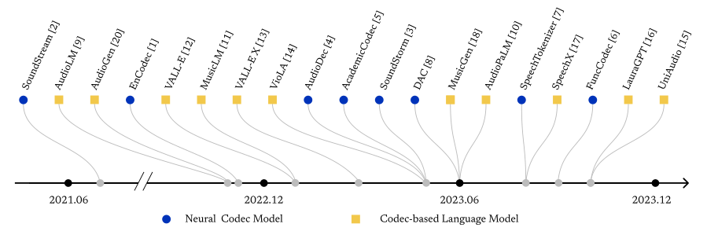
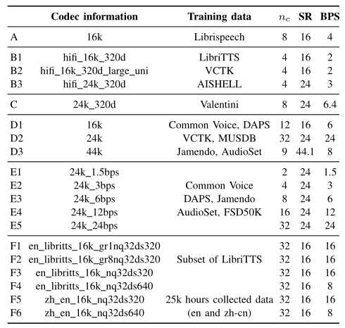
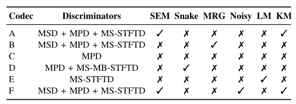
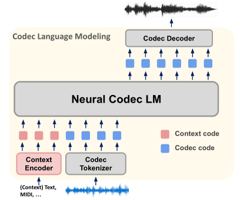
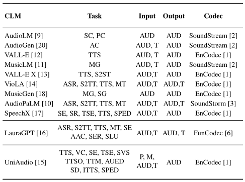

# Towards Audio Language Modeling: An Overview

基本信息

- 标题: "Towards Audio Language Modeling: An Overview."
- 作者:
  - 01 Haibin Wu
  - 02 Xuanjun Chen
  - 03 Yi-Cheng Lin
  - 04 Kai-wei Chang
  - 05 Ho-Lam Chung
  - 06 Alexander H. Liu
  - 07 Hung-Yi Lee
- 链接:
  - [ArXiv](https://arxiv.org/abs/2402.13236v1)
  - [Publication]()
  - [Github]()
  - [Demo]()
- 文件:
  - [ArXiv:2402.13236v1](PDF/2024.02.20_2402.13236v1__Survey__Towards_Audio_Language_Modeling__An_Overview.pdf)
  - [Publication] #TODO

## 摘要

<!--
Neural audio codecs are initially introduced to compress audio data into compact codes to reduce transmission latency.
Researchers recently discovered the potential of codecs as suitable tokenizers for converting continuous audio into discrete codes, which can be employed to develop audio language models (LMs).
Numerous high-performance neural audio codecs and codec-based LMs have been developed.
The paper aims to provide a thorough and systematic overview of the neural audio codec models and codec-based LMs.
-->
最初引入神经音频编解码器是用于压缩音频数据为紧凑编码以降低传输延迟.
最近研究人员发现编解码器作为将连续音频转换为离散代码的分词器的潜力, 这可以用于开发音频语言模型.
许多高性能的神经音频编解码器和基于编解码器的语言模型已经被开发出来.
本文旨在提供有关神经音频编解码器模型和基于编解码器的语言模型的全面综述.

## 1·引言

<!--
Neural audio codec models were first introduced to compress audio for efficient data transmission.
The encoder converts the audio into codec codes, which are then transmitted.
The receiver then uses the codec decoder to reconstruct the audio using the received codes.
-->
神经音频编解码模型首次引入用于压缩音频以高效数据传输.
编码器将音频转换为编解码器编码, 然后传输.
接收方使用编解码器的解码器使用收到的编码重构音频.

<!--
Language modeling has proven to be highly successful in the field of Natural Language Processing (NLP).
Audio data encompasses not only textual content but also rich information about speaker timbre, emotion, and general audio, offering deeper possibilities for language model applications.
Researchers, especially those in large companies with significant computational resources, recently leverage the potential of neural codecs (**EnCodec**[^Defossez2022EnCodec], **SoundStream**[^Zeghidour2021SoundStream], **SoundStorm**[^Borsos2023SoundStorm], **AudioDec**[^Wu2023AudioDec], **AcademiCodec**[^Yang2023HiFi-Codec], **FunCodec**[^Du2023FunCodec], **SpeechTokenizer**[^Zhang2023SpeechTokenizer], **DAC**[^Kumar2023DAC]) as suitable tokenizers for converting continuous audio into discrete codes, which can be employed to develop audio language models (LMs) (**AudioLM**[^Borsos2022AudioLM], **AudioPaLM**[^Rubenstein2023AudioPaLM], **MusicLM**[^Agostinelli2023MusicLM], **VALL-E**[^Wang2023VALL-E], **VALL-E X**[^Zhang2023VALL-EX], **VioLA**[^Wang2023VioLA], **UniAudio**[^Yang2023UniAudio], **LauraGPT**[^Chen2023LauraGPT], **SpeechX**[^Wang2023SpeechX], **MusicGen**[^Copet2023MusicGen], **Stack-Delay**[^Lan2023Stack-Delay], **AudioGen**[^Kreuk2022AudioGen]).
The current codec-based language models and codec models are summarized in [Figure.01](#fig:framework).
These findings promptly garnered the community's attention, sparking a fervor for developing codecs tailored to audio language modeling.
Numerous high-performance neural audio codec models and audio LMs have been developed.
-->
语言建模已经被证明在自然语言处理领域是高度成功的.
音频数据不仅包含文本内容还有关于说话人音色, 情感, 以及一般音频的丰富信息, 为语言模型应用提供了更深层次的可能性.
研究人员, 尤其是那些拥有大量计算资源的大型公司的研究人员, 最近开始利用神经编解码器 (如 **EnCodec**[^Defossez2022EnCodec], **SoundStream**[^Zeghidour2021SoundStream], **SoundStorm**[^Borsos2023SoundStorm], **AudioDec**[^Wu2023AudioDec], **AcademiCodec**[^Yang2023HiFi-Codec], **FunCodec**[^Du2023FunCodec], **SpeechTokenizer**[^Zhang2023SpeechTokenizer], **DAC**[^Kumar2023DAC]) 的潜力, 将其作为合适的分词器把连续的音频转化为离散编码, 从而用于开发音频语言模型 (如 **AudioLM**[^Borsos2022AudioLM], **AudioPaLM**[^Rubenstein2023AudioPaLM], **MusicLM**[^Agostinelli2023MusicLM], **VALL-E**[^Wang2023VALL-E], **VALL-E X**[^Zhang2023VALL-EX], **VioLA**[^Wang2023VioLA], **UniAudio**[^Yang2023UniAudio], **LauraGPT**[^Chen2023LauraGPT], **SpeechX**[^Wang2023SpeechX], **MusicGen**[^Copet2023MusicGen], **Stack-Delay**[^Lan2023Stack-Delay], **AudioGen**[^Kreuk2022AudioGen]).
当前基于编解码器的语言模型和编解码器模型总结在[图 01](#fig:framework) 中.
这些发现迅速引起了社区的关注, 激发了开发专门为音频语言建模定义的编解码器的热潮.
许多高性能的神经音频编解码器模型和音频语言模型已经被开发出来.

<a id="fig:framework">
<!--
Timeline of current neural codec models and codec-based language models.
-->
图 01: 当前神经音频编解码器模型和基于编解码器的语言模型的时间线.
</a>

<!--
An ideal codec should maintain content while preserving paralinguistic and speaker-related information.
Similarly, a universal audio language model should be able to generalize across various audio types, such as speech, music, and general audio, covering a wide range of applications.
The arms race in developing codecs and audio LMs is still ongoing.
-->
一个理想的编解码器应该在保持内容的同时, 保留伴随语言和说话人相关的信息.
类似地, 一个通用的音频语言模型应该能够跨多种音频类型进行泛化, 例如语音, 音乐和一般音频, 从而覆盖广泛的应用场景.
开发编解码器和音频语言模型的竞赛仍在继续.

<!--
Given the significant advancements in codecs and audio language models over the past three years as shown in [Figure.01](#fig:framework), there has yet to be a comprehensive review comparing them and providing inspiration to the community.
In this study, we aim to fill this research gap by thoroughly reviewing and comparing various existing neural codec models and audio codec-based language models.
Firstly, we specifically conduct an in-depth analysis of six representative open-source neural codec models to cover their training methodologies, implementation settings, and training data.
Secondly, we expand our analysis to include eleven diverse codec-based language models, examining how they utilize the codecs and the tasks to which they can be applied.
Through this comprehensive review, we aim to offer the community insights into the diverse methodologies and potential directions in the field of neural codecs and codec-based language modeling.
-->
鉴于过去三年中编解码器和音频语言模型所取得的显著进步 (如[图 01](#fig:framework) 所示), 目前尚未有一篇全面的综述来比较它们并为社区提供启发.
在本研究中, 我们的目标是通过详尽回顾和比较各种现有的神经编解码器模型和基于编解码器的音频语言模型.
首先, 我们特别地对六个代表性的开源神经编解码器模型进行深入分析, 涵盖它们的训练方法, 实现细节和训练数据.
其次, 我们将分析扩展到包括十一个不同的基于编解码器的语言模型, 探讨它们如何利用编解码器和可以应用的任务.
通过这一全面的回顾, 我们期望为社区提供关于神经编解码器和基于编解码器的语言建模领域中多样化方法和潜在方向的见解.

## 2·神经音频编解码器的综合对比

<!--
Codec models aim to compress and decompress speech signals efficiently.
Traditional codecs are developed based on psycho-acoustics and speech synthesis (**Opus**[^Valin2012Opus], **Survey20150419**[^Dietz2015Overview]).
Recently, the neural codec models demonstrated highly effective for compression and signal reconstruction, outperforming traditional codecs.
Considering the broad spectrum of codec models within the research community, each trained with its distinct configurations and training techniques, there is a clear need for a thorough examination that covers the training methodologies, implementation settings, and training data employed across these codec models.
The six codec models have distinct training details, resulting in a collection of fifteen different codec models, as summarized in [Table.01](#tab:codec_info).
-->
编解码器模型的目标是高效地压缩和解压缩语音信号.
传统的编解码器是基于心理声学和语音合成开发的 (**Opus**[^Valin2012Opus], **Survey20150419**[^Dietz2015Overview]).
近期, 神经编解码器模型在压缩和信号重建方面表现出了极高效率, 超越了传统编解码器.
考虑到研究社区中编解码器模型的广泛范围, 每个模型都使用其独特的配置和训练技术进行训练, 显然需要进行一次彻底的检查, 以涵盖这些编解码器模型所采用的训练方法, 实现设置和训练数据.
以下六个编解码器模型有着不同的训练细节, 从而形成一个包含十五个不同编解码器模型的集合, 如[表 01](#tab:codec_info) 所示.

<a id="tab:codec_info">
<!--
Tab.01: Codec Information Comparison.
`A-F` represents different neural codec models, where
- `A` is **SpeechTokenizer**[^Zhang2023SpeechTokenizer],
- `B` is **AcademiCodec**[^Yang2023HiFi-Codec],
- `C` is **AudioDec**[^Wu2023AudioDec],
- `D` is **Descript-Audio-Codec (DAC)**[^Kumar2023DAC],
- `E` is **EnCodec**[^Defossez2022EnCodec],
- `F` is **FunCodec**[^Du2023FunCodec].
- $n_c$ represents the codebook number,
- `SR` represents the Sample Rate,
- `BPS` represents the bit rate in unit Bits Per Second.
-->
表 01: 编解码器信息对比.
`A-F` 表示不同的神经编解码器模型, 其中
- `A` 是 **SpeechTokenizer**[^Zhang2023SpeechTokenizer],
- `B` 是 **AcademiCodec**[^Yang2023HiFi-Codec],
- `C` 是 **AudioDec**[^Wu2023AudioDec],
- `D` 是 **Descript-Audio-Codec (DAC)**[^Kumar2023DAC],
- `E` 是 **EnCodec**[^Defossez2022EnCodec],
- `F` 是 **FunCodec**[^Du2023FunCodec].
- $n_c$ 表示码本数量,
- `SR` 表示采样率,
- `BPS` 表示比特率单位为每秒比特数.
</a>

### 编解码器的简要方法概述

<!--
**SoundStream**[^Zeghidour2021SoundStream] stands as one of the pioneering implementations of neural codec models, embodying a classic neural codec architecture comprising encoder, quantizer, and decoder modules.
It utilizes the streaming **SEANets**[^Tagliasacchi2020SEANet] as its encoder and decoder.
The quantizer incorporates a speech enhancement system with a Residual Vector Quantization (RVQ) (**MelGAN**[^Kumar2019MelGAN], **SoundStream**[^Zeghidour2021SoundStream]) bottleneck to obtain parallel token streams.
During training, the model parameters are optimized using a combination of reconstruction and adversarial loss.
**SoundStorm**[^Borsos2023SoundStorm] is an improved version of **SoundStream** to achieve both efficiency and high-quality audio generation.
It accomplishes this by employing an architecture specifically tailored to the hierarchical structure of audio tokens.
Moreover, it pioneers a parallel, non-autoregressive decoding scheme, which relies on confidence-based strategies for residual vector-quantized token sequences.
-->
**SoundStream**[^Zeghidour2021SoundStream] 作为神经编解码器模型的先驱之一, 体现了一个经典的神经编解码器架构, 由编码器, 量化器和解码器模块组成.
它使用了流式 **SEANets**[^Tagliasacchi2020SEANet] 作为编码器和解码器.
量化器集成了一个带有残差向量量化 (**MelGAN**[^Kumar2019MelGAN], **SoundStream**[^Zeghidour2021SoundStream]) 瓶颈的语音增强系统以获得并行的 Token 流.
在训练时, 模型参数使用重构损失和对抗损失的结合进行优化.
**SoundStorm**[^Borsos2023SoundStorm] 是 **SoundStream** 的改进版本, 实现了高效和高质量音频生成.
该模型通过采用专门针对音频 Token 的层次结构的架构来实现这一点.
此外, 它首创了一种并行的, 非自回归的解码方案, 该方案依赖于基于置信度的策略来处理残差向量量化后的 Token 序列.

<!--
**EnCodec**[^Defossez2022EnCodec] builds upon a framework similar to **SoundStream**.
Nonetheless, it further augments its capabilities by integrating supplementary **LSTM** [^Hochreiter1997LSTM] layers and harnessing a **Transformer**-based language model [^Vaswani2017Transformer] to model the RVQ codes, thereby amplifying its sequence modeling performance.
Then, there is a stream of work aimed at making codec models more general and powerful.
**AudioDec**[^Wu2023AudioDec] represents an enhanced version of **EnCodec**, implementing a group convolution mechanism to facilitate the real-time operation of the streamable network while also harnessing the capabilities of **HiFi-GAN**[^Kong2020HiFi-GAN] to effectively generate high-fidelity audio at a high sampling rate of 48 kHz.
-->
**EnCodec**[^Defossez2022EnCodec] 建立在类似于 **SoundStream** 的框架之上.
但它通过整合追加的 **LSTM**[^Hochreiter1997LSTM] 层和利用基于 **Transformer**[^Vaswani2017Transformer] 的语言模型来建模 RVQ 编码以进一步增强其能力, 从而扩大其序列建模性能.
然后有一系列工作旨在使编解码器模型更加通用和强大.
**AudioDec**[^Wu2023AudioDec]  是 **EnCodec** 的增强版本, 应用了组卷积机制, 以促进流式网络的实时操作, 同时利用 **HiFi-GAN**[^Kong2020HiFi-GAN] 的能力, 在 48kHz 的高采样率下有效地生成高保真度的音频.

<!--
In the AcademiCodec model introduced by [^Yang2023HiFi-Codec], a novel technique known as group-residual vector quantization is presented.
It employs multiple parallel RVQ groups.
This technique is specifically tailored for generation tasks.
It aims to enhance the reconstruction performance while using a limited number of codebooks, consequently achieving an impressively low bit rate per second (BPS).
This low BPS is of utmost significance as it effectively addresses the challenge of lengthy speech tokens in speech language modeling, resulting in reduced sequence lengths.
-->
**AcademiCodec/HiFi-Codec**[^Yang2023HiFi-Codec] 模型提出了一个新的技术, 组残差向量量化.
它采用了多个并行的 RVQ 组.
这一技术是专门为生成任务而设计的.
其目的是在使用有限的码本的同时提高重构性能, 因此实现了惊人的低码率每秒 (BPS).
这种低码率对于长语音 Token 在语音语言建模中的挑战是至关重要的, 能使得序列长度减少.

<!--
**SpeechTokenizer**[^Zhang2023SpeechTokenizer] is a unified speech tokenizer designed for speech language models.
It implements an Encoder-Decoder architecture enhanced with RVQ.
By integrating both semantic and acoustic tokens, **SpeechTokenizer** hierarchically separates various aspects of speech information across different RVQ layers.
Specifically, **SpeechTokenizer** is designed to regularize the first RVQ layer to highlight semantic information by learning the **HuBERT** tokens [^Hsu2021HuBERT].
Using such techniques can enhance the disentanglement of information across different RVQ layers.
-->
**SpeechTokenizer**[^Zhang2023SpeechTokenizer] 是为语音语言模型设计的统一语音分词器.
它采用了 RVQ 增强的编码器-解码器架构.
通过整合语义 Token 和声学 Token, **SpeechTokenizer** 逐层地将语音信息分离到不同的 RVQ 层.
具体来说, **SpeechTokenizer** 被设计成通过学习 **HuBERT**[^Hsu2021HuBERT] Token 正则化第一个 RVQ 层, 以突出语义信息.
采用这样的技术可以增强不同 RVQ 层之间的信息解耦.

<!--
**Descript-audio-codec (DAC)**[^Kumar2023DAC], a universal neural codec model, distinguishes itself through its exceptional ability to maintain high-fidelity audio quality across a wide spectrum of data types, encompassing general audio, music, and speech.
It accomplishes this feature by employing a number of training techniques, such as periodic activation functions (**Snake**[^Liu2020Snake]), enhanced residual vector quantization using factorized and L2-normalized codes, random quantizer dropout to preserve audio reconstruction quality, as well as refining adversarial and reconstruction loss during the training process.
The authors highlight the crucial importance of the periodic activation function among the employed techniques.
-->
**Descript-audio-codec (DAC)**[^Kumar2023DAC] 是一种通用神经编解码器模型, 其独特的能力能够在广泛的数据类型范围内 (一般音频, 音乐和语音) 保持高保真度的音频质量.
它通过采用多种训练技术来实现这一特性, 例如周期激活函数 (**Snake**[^Liu2020Snake]), 使用因子化和 L2 归一化编码的增强残差向量量化, 随机量化器失活以保持音频重建质量, 以及在训练过程中细化对抗损失和重构损失.
作者强调了周期性激活函数在所采用技术中的关键重要性.

<!--
Unlike most models focusing on the time domain, **FunCodec**[^Du2023FunCodec] proposes a frequency-domain codec.
The authors claim they can achieve comparable performance with fewer parameters and lower computation complexity.
Meanwhile, it also finds that incorporating semantic information in the codec tokens improves speech quality at low bit rates.
-->
与大部分模型关注时域不同, **FunCodec**[^Du2023FunCodec] 提出了频域编解码器.
作者声称他们可以用较少参数和较低计算复杂度获得相当的性能.
同时还发现将语义信息整合到编解码器 Token 中可以提高低码率下的语音质量.

### 方法论角度的对比

<!--
We compare several techniques proposed by these codecs in [Table.02](#tab:codec_compare).
The abbreviation "A-F" represents different codec models.
Please refer to [Table.01](#tab:codec_info) for the corresponding model full name.
-->
我们比较这些编解码器提出的数种技术, 如[表 02](#tab:codec_compare) 所示.
缩写 `A-F` 表示不同的编解码器模型.
请参考[表 01](#tab:codec_info) 以获取相应模型的全称.

<a id="tab:codec_compare">
<!--
Tab.02: Comparison between codec implementation strategy.
- `SEM` represents codec including Semantic Tokens.
- `SNAKE` represents the codec model that employs Snake Activation.
- `MRG` represents codec has Multiple Residual Groups.
- `NOISY` represents codec utilizes Noisy data in training.
- `LM` represents the model including Language Model training.
- `KM` represents codec uses K-Means to cluster samples as initialization of VQ codebook.
-->
表 02: 编解码器实现策略的比较.
- `SEM` 表示编解码器包括语义 Token.
- `SNAKE` 表示采用蛇形激活的编解码器模型.
- `MRG` 表示编解码器具有多个残差组.
- `NOISY` 表示编解码器在训练中采用噪声数据.
- `LM` 表示模型包括语言模型训练.
- `KM` 表示编解码器使用 K-Means 聚类样本作为 VQ 码本的初始化.
</a>

#### 判别器部分
<!--
The design of discriminators constitutes a pivotal element within codec models.

- **EnCodec** initially introduces the **Multi-Scale-STFT Discriminator (MS-STFTD)**.
- In contrast to the **Multi-Scale Discriminator (MSD)** proposed in **MelGAN**[^Kumar2019MelGAN], which captures long-term dependencies, the **Multi-Period Discriminator (MPD)** proposed in **HiFi-GAN**[^Kong2020HiFi-Gan] exhibits a capacity to discern more nuanced periodic details.
Consequently, **AudioDec** replaces the conventionally employed **STFTD** with a **HiFi-GAN-based MPD**, observing an enhancement in audio quality within their model.
- **AcademiCodec** integrates prior research efforts by incorporating the **MS-STFTD** from **EnCodec** and both **HiFi-GAN-based MPD** and **MSD**.
- Both **SpeechTokenizer** and **FunCodec** adopt identical discriminators to **AcademiCodec**, with **FunCodec** offering a unified interface adaptable to any combination of these three discriminator types.
- **DAC** identifies that employing **MSD** and **MPD** alone generates audio displaying blurriness and artifacts.
To address this, they propose the application of a **Multi-Scale, Multi-Band STFT Discriminator (MS-MB-STFTD)** to improve phase modeling and mitigate aliasing artifacts.
-->
判别器的设计是编解码器模型中的关键元素.
- **EnCodec** 最初引入了 **多尺度短时傅里叶变换判别器 (Multi-Scale-STFT Discriminator, MS-STFTD)**.
- 与 **MelGAN**[^Kumar2019MelGAN] 提出的**多尺度判别器 (Multi-Scale Discriminator, MSD)** 用于捕获长期依赖不同, **HiFi-GAN**[^Kong2020HiFi-GAN] 提出的**多周期判别器 (Multi-Period Discriminator, MPD)** 具有更强的能力来辨别更微妙的周期细节.
因此, **AudioDec** 将传统使用的**短时傅里叶变换判别器 (STFTD)** 替换为基于 **HiFi-GAN** 的 **MPD**, 观察其模型中的音频质量提升.
- **AcademiCodec** 整合了先前研究的努力, 即混合了 **EnCodec** 的 **MS-STFTD**, 基于 **HiFi-GAN** 的 **MPD** 和 **MSD**.
- **SpeechTokenizer** 和 **FunCodec** 都采用了和 **AcademiCodec** 相同的判别器, 其中 **FunCodec** 提供了一个统一的接口, 可以适应这三种判别器的任意组合.
- **DAC** 发现, 仅仅使用 **MSD** 和 **MPD** 生成的音频会出现模糊和伪影.
为了解决这一问题, 他们提出了一个**多尺度多频带的 STFT 判别器 (Multi-Scale Multi-Band STFT Discriminator, MS-MB-STFT-D)** 用于提升相位建模和减轻混叠伪影.

#### 量化器部分
<!--
- **SpeechTokenizer** utilizes semantic tokens from **HuBERT** L9 as a teacher for the RVQ process.
This guidance enables the disentanglement of content information into the first layer of the tokenizer, while paralinguistic information is retained in subsequent layers.
- **FunCodec** seeks to integrate semantic information by combining, adding, or residualizing the audio codec with semantic tokens.
The study reveals that including semantic tokens enhances audio quality, particularly with the residual inclusion method.
- Additionally, **SpeechTokenizer** and **FunCodec** utilize K-means to cluster samples in the first mini-batch for initializing the VQ codebook, leading to improved code utilization.
- **DAC** follows the approach of **BigVGAN**[^Lee2022BigVGAN], employing **snake activation**[^Liu2020Snake] for trainable control over the frequency of periodic signals.
- **AcademiCodec** employs multiple RVQ codebooks (multiple residual groups) to represent intermediate features.
They demonstrate that using multiple residual groups achieves good reconstruction performance while employing only a few codebooks.
- **EnCodec** trains an additional small **Transformer** model for entropy coding over the quantized units, which reduces bandwidth and accelerates encoding and decoding.
-->
- **SpeechTokenizer** 利用 **HuBERT** L9 提供的语义 Token 作为教师来指导 RVQ 过程.
这一指导使得内容信息在 Tokenizer 的第一层被分离, 而其他语言相关的信息在后续层中被保留.
- **FunCodec** 试图通过将音频编解码器和语义信息进行组合, 添加或残差化, 来整合语义信息.
研究表明, 包含语义 Token 可以增强音频质量, 尤其是采用残差化的方法.
- 此外, **SpeechTokenizer** 和 **FunCodec** 都利用 K-Means 聚类样本在第一个小批量中初始化 VQ 码本, 进而提高码本利用率.
- **DAC** 遵循 **BigVGAN**[^Lee2022BigVGAN] 的方法, 采用**蛇形激活**[^Liu2020Snake] 对周期信号的频率进行可训练控制.
- **AcademiCodec** 采用多个 RVQ 码本 (多个残差组) 来表示中间特征.
他们证明, 使用多个残差组可以仅使用少量码本获得良好的重构性能.
- **EnCodec** 训练了一个额外的小型 **Transformer** 模型用于对量化单元进行熵编码, 这可以减少带宽并加速编码和解码.

### 实现细节

<!--
We compare the codebook number, training data, sampling rate, and bit rate per second in [Table.01](#tab:codec_info).

From the training data perspective, **SpeechTokenizer**[^Zhang2023SpeechTokenizer], **AudioDec**[^Wu2023AudioDec], and **FunCodec**[^Du2023FunCodec] utilize only English speech dataset.
**AcademiCodec**[^Yang2023HiFi-Codec] incorporates bilingual speech datasets, including AISHELL for Chinese and LibriTTS and VCTK for English.
Both **DAC**[^Kumar2023DAC], and **EnCodec**[^Defossez2022EnCodec] encompass diverse modality data, including speech, music, and audio, in the training data.
-->
我们在[表 01](#tab:codec_info) 中比较了码本数量, 训练数据, 采样率和每秒比特率.
从训练数据的角度看:
- **SpeechTokenizer**[^Zhang2023SpeechTokenizer], **AudioDec**[^Wu2023AudioDec], and **FunCodec**[^Du2023FunCodec] 只使用了英语语音数据集.
- **AcademiCodec**[^Yang2023HiFi-Codec] 包含了双语语音数据集, 包括 AISHELL 用于中文, **LibriTTS** 和 **VCTK** 用于英语.
- **DAC**[^Kumar2023DAC] 和 **EnCodec**[^Defossez2022EnCodec] 在训练数据中包含了多种模态数据, 包括语音, 音乐, 以及音频.

## 3·现有基于编解码器的语音语言模型

<!--
As shown in [Figure.02](#fig:codec_lm), the process of neural codec-based audio language modeling begins by converting context information, such as text and MIDI, into context codes, while simultaneously encoding the audio into codec codes.
These context and codec codes are then employed in the language modeling phase to generate the desired target codec code sequence.
Subsequently, the target codec code sequence is passed to the codec decoder to produce the audio output.
The entire pipeline embodies an audio-to-audio modeling approach.
-->
如[图 02](#fig:codec_lm) 所示, 基于神经编解码器的音频语言建模过程首先将内容信息 (文本和 MIDI) 转化为内容编码, 同时将音频编码为编解码器编码.
这些内容和编解码器编码之后在语言建模阶段用于生成所需的目标编解码器代码序列.
之后, 目标编解码器编码序列传递到编解码器解码器以产生音频输出.
整个流程体现了一种音频到音频的建模方法.

<a id="fig:codec_lm">
<!--
Fig.02: Codec-Based Language Modeling.
-->
图 02: 基于编解码器的语言建模.
</a>

### 基于编解码器的语言模型概览

<!--
- **AudioLM**[^Borsos2022AudioLM] is the pioneering model in introducing codec codes for language modeling, utilizing a hierarchical approach that encompasses two distinct stages.
The first stage generates semantic tokens using a self-supervised **W2V-BERT** model [^Chung2021W2V-BERT].
These tokens are then leveraged in the second stage as conditioning elements to create acoustic tokens using a **SoundStream**[^Zeghidour2021SoundStream] neural codec.
-->
- **AudioLM**[^Borsos2022AudioLM] 是引入编解码器编码进行语言建模的先驱模型, 采用分层的架构, 包含两个不同的阶段.
第一阶段使用自监督的 **W2V-BERT** 模型[^Chung2021W2V-BERT] 生成语义 Token.
这些 Token 随后在第二阶段作为条件元素, 采用 **SoundStream** 神经编解码器来创建声学 Token.

<!--
- **VALL-E**[^Wang2023VALL-E], **VALL-E X**[^Zhang2023VALL-EX], and **SpeechX**[^Wang2023SpeechX], all originate from Microsoft and are neural codec language models trained to generate discrete codes derived from **EnCodec**[^Defossez2022EnCodec], based on textual or acoustic inputs.
  - **VALL-E** can generate high-quality personalized speech with only a 3-second enrollment recording from an unseen speaker.
  - Furthermore, **VALL-E X** can produce high-quality speech in the target language with just a single speech utterance in the source language as a prompt.
  - Additionally, **SpeechX** introduces a unified framework to address not only zero-shot TTS but also various types of speech transformation tasks, including speech enhancement and speech editing.
-->
- **VALL-E**[^Wang2023VALL-E], **VALL-E X**[^Zhang2023VALL-EX], 和 **SpeechX**[^Wang2023SpeechX] 都是来自微软的神经编解码器语言模型, 基于文本或声学输入, 被训练以生成来自 **EnCodec**[^Defossez2022EnCodec] 的离散编码.
  - **VALL-E** 可以生成仅使用未见过的说话人的 3 秒录音的高质量个性化语音.
  - 此外, **VALL-E X** 可以在目标语言生成高质量语音, 只需使用源语言中的单个语音作为提示.
  - 另外, **SpeechX** 引入了一个统一的框架来处理零样本 TTS, 以及各种类型的语音转换任务, 包括语音增强和语音编辑.

<!--
- What sets **VioLA** [^Wang2023VioLA], **AudioPaLM** [^Rubenstein2023AudioPaLM], and **LauraGPT**[^Chen2023LauraGPT] apart is their dual capability to generate both text and audio.
  - **VioLA** tries to tackle the question "Is one decoder-only generative model all you need for speech recognition, synthesis, and translation?" by employing language modeling that integrates both text tokens and audio tokens (extracted by **EnCodec**[^Defossez2022EnCodec]), along with the use of task IDs and language IDs.
  - **AudioPaLM** constructs a unified vocabulary comprising both text and audio tokens.
  It is a decoder-only, autoregressive model capable of processing and generating both text and speech.
  Additionally, **AudioPaLM**'s initialization stems from **PaLM-2**[^Anil2023PaLM2], a text-only language model.
  **AudioPaLM**'s approach to audio tokenization resembles that of **AudioLM**.
  Moreover, **AudioPaLM** adopts and extends the **SoundStream** model to **SoundStorm** [^Borsos2023SoundStorm].
  - **LauraGPT**[^Chen2023LauraGPT] is a versatile language model built on a decoder-only text-based language model, **Qwen-2B**[^Bai2023Qwen].
  **LauraGPT** has the capability to process both audio and text inputs, generating outputs in either modality.
  **LauraGPT** encodes input audio into continuous representations using a **Conformer** encoder and decodes output audio using **FunCodec**[^Du2023FunCodec] discrete codes.
  The authors claim this specific audio features design for inputs and outputs will result in improved performance for speech generation using some preliminary experimental results.
-->
- **VioLA**[^Wang2023VioLA], **AudioPaLM** [^Rubenstein2023AudioPaLM], 和 **LauraGPT**[^Chen2023LauraGPT] 与其他模型的不同之处, 是它们具有生成文本和音频的双重能力.
  - **VioLA** 试图解决 "是否只需要一个仅解码器架构的生成模型就能完成语音识别, 语音合成和语音翻译?" 的问题. 通过集成文本 Token 和音频 Token (由 **EnCodec**[^Defossez2022EnCodec] 提取), 以及任务 ID 和语言 ID 进行语言建模.
  - **AudioPaLM** 构造了一个统一的词表, 包括文本和音频 Token.
  它是仅解码器架构的自回归模型, 能够处理和生成文本和语音.
  此外, **AudioPaLM** 的初始化来自 **PaLM-2**[^Anil2023PaLM2], 一个文本语言模型.
  **AudioPaLM** 对音频 Token 化的处理与 **AudioLM** 类似.
  此外, **AudioPaLM** 采用和扩展了 **SoundStream** 模型到 **SoundStorm** [^Borsos2023SoundStorm].
  - **LauraGPT**[^Chen2023LauraGPT] 是在仅解码器架构的文本语言模型 **Qwen-2B**[^Bai2023Qwen] 上构建的多功能语言模型.
  **LauraGPT** 具有处理音频和文本输入的能力, 生成输出的形式可以是任意的.
  **LauraGPT** 使用 **Conformer** 编码器对输入音频进行连续表示, 并使用 **FunCodec**[^Du2023FunCodec] 离散编码解码得到输出音频.
  作者通过一些初步的实验结果声称,输入和输出的特殊音频特征设计, 会使得语音生成的性能提升.

<!--
- **UniAudio**[^Yang2023UniAudio] utilizes language modeling to generate a wide range of audio types, including speech, sounds, music, and singing, using textual or acoustic tokens as inputs.
**UniAudio** stands out for its ability to enhance autoregressive prediction speed by introducing a multi-scale Transformer model [^Yu2023MegaByte], which employs a large global transformer to predict the first-layer codec codes and a small local transformer to predict the codec codes for the subsequent codec layers.
The codec model in **UniAudio** is revised from **EnCodec**.
-->
- **UniAudio**[^Yang2023UniAudio] 使用语言建模生成各种音频类型, 包括语音, 声音, 音乐, 以及歌唱, 基于文本或声学 Token 作为输入.
**UniAudio** 的突出之处在于它引入了多尺度 Transformer 模型[^Yu2023MegaByte] 来提高自回归预测的速度, 其中包含一个大型全局 Transformer 来预测编解码器的第一层编码, 以及一个小型局部 Transformer 来预测后续编解码器层的编码.
**UniAudio** 中的编解码器模型由 **EnCodec** 改进而来.

<!--
Additionally, there are other codec-based language models designed for sound modeling.
- **AudioGen**[^Kreuk2022AudioGen] trained a **SoundStream** model to get audio tokens and subsequently trained a language model to utilize textual features as conditions for generating audio tokens.
- **MusicLM**[^Agostinelli2023MusicLM] follows a training strategy similar to **AudioLM** but extends its scope to encompass music features.
It approaches the task of conditional music generation through a hierarchical sequence-to-sequence modeling approach.
Initially, it utilizes music tokens from **MuLan**[^Huang2022MuLan] to generate semantic tokens from the **W2V-BERT** model.
Subsequently, it employs both music tokens and semantic tokens to generate acoustic features through **SoundStream**.
- **MusicGen**[^Copet2023MusicGen] is a music language model designed to work with **EnCodec** discrete tokens.
It accepts textual descriptions or melodic features as input conditions to generate tokens, which can be reconstructed to high-fidelity music.
-->
此外, 还有其他基于编解码器的语言模型, 用于声音建模.
- **AudioGen**[^Kreuk2022AudioGen] 训练了一个 **SoundStream** 模型来获取音频 Token, 随后训练了一个语言模型来利用文本特征作为条件生成音频 Token.
- **MusicLM**[^Agostinelli2023MusicLM] 遵循与 **AudioLM** 类似的训练策略, 但扩展了其范围, 包括音乐特征.
它采用分层序列到序列建模的方法来解决条件音乐生成问题.
首先, 它使用 **MuLan**[^Huang2022MuLan] 中的音乐 Token 来生成语义 Token, 并使用 **W2V-BERT** 模型生成语义 Token.
随后, 它将音乐 Token 和语义 Token 结合起来, 通过 **SoundStream** 生成声学特征.
- **MusicGen**[^Copet2023MusicGen] 是一款音乐语言模型, 专门用于处理 **EnCodec** 离散 Token.
它接受文本描述或旋律特征作为输入条件, 生成 Token, 这些 Token 可以重构为高保真的音乐.

<!--
Another branch of speech language modeling aims to utilize discrete units obtained by quantizing self-supervised speech representations.
While these discrete units contain rich acoustic and linguistic information[^Wells2022Phonetic], they lack speaker and paralinguistic information[^Polyak2021Speech].
This research direction focuses on modeling the semantics of speech, with the optional use of encoders to learn about speaker characteristics and prosody.
Pioneering work is speech-resynthesis[^Polyak2021Speech], which utilizes these discrete units in conjunction with prosody and speaker encoders to encode speech into low-bitrate codes.
These codes can then be resynthesized into a speech signal with a decoder to achieve low-bitrate transmission.

Additionally, these discrete units can be regarded as "pseudo-text", serving as a foundation for training textless speech language models.
Notable examples include GSLM[^Lakhotia2021GSLM], pGSLM[^Kharitonov2021pGSLM], dGSLM[^Nguyen2022dGSLM], and TWIST[^Hassid2023TWIST].
By engaging in the pre-trained task of next-token prediction, these speech LMs perform spoken language modeling and can conduct the task of speech continuation.
-->
语音语言建模的另一个分支旨在利用由自监督语音表示量化获得的离散单元.
这些离散单元包含丰富的声学和语言学信息[^Wells2022Phonetic], 但缺乏说话人和副语言信息[^Polyak2021Speech].
这一研究方向注重于建模语音的语义, 可选地使用编码器来学习说话人特征和韵律.
开创性工作是语音重合成[^Polyak2021Speech], 它利用这些离散单元与韵律和说话人编码器结合起来, 将语音编码为低比特率编码.
这些编码可以由解码器重新合成语音信号, 以实现低比特率传输.

此外, 这些离散单元可以视为 "伪文本", 作为训练无文本语音语言模型的基础.
值得注意的例子有 **GSLM**[^Lakhotia2021GSLM], **pGSLM**[^Kharitonov2021pGSLM], **dGSLM**[^Nguyen2022dGSLM], 和 **TWIST**[^Hassid2023TWIST].
通过参与预训练的下一个 Token 预测任务, 这些语音语言模型可以进行口语语言建模, 并能够进行语音续写任务.

<!--
In the field of speech translation, recent advancements have been made possible through these discrete units.
- [^Popuri2022Enhanced] pre-trained a Unit mBART combined with a **Wav2Vec2.0** [^Baevski2020Wav2Vec2.0] encoder to directly predict the translated discrete units.
- **UnitY**[^Inaguma2022UnitY] further incorporates text modality to enhance speech translation.
- The **Seamless** models[^Barrault2023SeamlessM4T], [^Barrault2023Seamless] integrate the **UnitY** framework to perform expressive and streaming speech-to-text and speech-to-speech translation.
-->
在语音翻译领域, 通过这些离散单元, 最近取得的进展已经成为可能.
- [^Popuri2022Enhanced] 预训练了一个和 **Wav2Vec2.0**[^Baevski2020Wav2Vec2.0] 编码器结合的 Unit mBART, 直接预测语言翻译后的离散单元.
- **UnitY**[^Inaguma2022UnitY] 进一步融合了文本模态, 提升了语音翻译.
- **SeamlessM4T**[^Barrault2023SeamlessM4T], **Seamless**[^Barrault2023Seamless] 集成了 **UnitY** 框架, 实现了高级和流畅的语音到文本和语音到语音的翻译.

<!--
With the development of these powerful speech LMs, researchers have begun to explore the use of prompting on speech LMs for various speech processing tasks, including prompt tuning (**SpeechPrompt**[^Chang2022SpeechPrompt], **SpeechPromptV2**[^Chang2023SpeechPromptV2], **SpeechGen**[^Wu2023SpeechGen]), in-context learning (ICL to Speech LM[^Hsu2023Exploring]), and instruction tuning (**Text-Instruction-Guided Voice Conversion**[^Kuan2023Towards], **Dynamic-SUPERB**[^Huang2023Dynamic-SUPERB]).
-->
随着这些强力语音语言模型的发展, 研究人员开始探索在语音语言模型对于各种语音处理任务的提示使用, 包括
- 提示调参: **SpeechPrompt**[^Chang2022SpeechPrompt], **SpeechPromptV2**[^Chang2023SpeechPromptV2], **SpeechGen**[^Wu2023SpeechGen]
- 上下文学习: ICL 用于语音语言模型 [^Hsu2023Exploring]
- 指令微调: **文本指令引导声音转换**[^Kuan2023Towards], **Dynamic-SUPERB**[^Huang2023Dynamic-SUPERB]

### 基于编解码器的音频语言模型的对比

<!--
In [Table.03](#tab:clm_model), we compare the inputs, outputs, and downstream tasks of different codec-based language models.
We also summarize that the downstream tasks conducted by different codec-based language models: Speech Continuation (SC), Piano Continuation (PC), Audio Continuation (AC), Text-to-Speech (TTS), Music Generation (MG), Stereophonic Generation (SG), Speech to Speech Translation (S2ST), Automatic Speech Recognition (ASR), Spoken Language Understanding (SLU), Automated Audio Captioning (AAC), Speech to Text Translation (S2TT), Machine Translation (MT), Speech Enhancement (SE), Speech Removal (SR), Target Speaker Extraction (TSE), Speech Editing (SPED), Voice Conversion (VC), Singing Voice Synthesis (SVS), Text-to-Sound (TTSO), Text-to-Music (TTM), Audio Editing (AUED), Speech Dereverb (SD), Instructed TTS (ITTS).
Finally, we show the codec models adopted by different LMs.
-->
在[表 03](#tab:clm_model)中,我们对比了不同基于编解码器的语言模型的输入, 输出和下游任务.
我们还总结了由不同基于编解码器的语言模型引导的下游任务:
- 语音续写 (Speech Continuation, SC),
- 钢琴续写 (Piano Continuation, PC),
- 音频续写 (Audio Continuation, AC),
- 文本转语音 (Text-to-Speech, TTS),
- 音乐生成 (Music Generation, MG),
- 立体声生成 (Stereophonic Generation, SG),
- 语音转语音翻译 (Speech to Speech Translation, S2ST),
- 自动语音识别 (Automatic Speech Recognition, ASR),
- 口语理解 (Spoken Language Understanding, SLU),
- 自动音频字幕 (Automated Audio Captioning, AAC),
- 语音转文本 (Speech to Text Translation, S2TT),
- 机器翻译 (Machine Translation, MT),
- 语音增强 (Speech Enhancement, SE),
- 语音去除 (Speech Removal, SR),
- 目标说话人提取 (Target Speaker Extraction, TSE),
- 语音编辑 (Speech Editing, SPED),
- 声音转换 (Voice Conversion, VC),
- 歌唱声音合成 (Singing Voice Synthesis, SVS),
- 文本转声音 (Text-to-Sound, TTSO),
- 文本转音乐 (Text-to-Music, TTM),
- 音频编辑 (Audio Editing, AUED),
- 语音反混响 (Speech Dereverb, SD),
- 指导式文本转语音 (Instructed TTS, ITTS).

最后我们展示了不同语言模型采用的编解码器模型.

<a id="tab:clm_model">
<!--
Tab.03: Codec-Based Language Models Comparison.
`T` means Text,
`Aud` means Audio,
`P` means Phoneme,
`M` means MIDI.
-->
表 03: 编解码器语言模型对比.
`T` 表示文本,
`Aud` 表示音频,
`P` 表示音素,
`M` 表示 MIDI.
</a>

## 4·结论

<!--
The paper fills the research blank to review the neural codec models and LMs built upon them.
We hope the comprehensive review and comparisons can inspire future research works to boost the development of neural codec models and codec-based LMs.
-->
本文填补了当前研究的空白, 对神经编解码器模型和基于其上的语言模型进行了回顾.
我们希望这一全面的回顾和比较能够启发未来的研究工作, 推动神经编解码器模型和基于编解码器的语言模型的发展.

## 参考文献

[^Defossez2022EnCodec]: [**EnCodec**: High Fidelity Neural Audio Compression](../Models/Tokenizers/2022.10.24_EnCodec.md). ArXiv:2210.13438/TMLR2023.
[^Zeghidour2021SoundStream]: [**SoundStream**: An End-to-End Neural Audio Codec](../Models/Tokenizers/2021.07.07_SoundStream.md). ArXiv:2107.03312/TASLP2021.
[^Borsos2023SoundStorm]: [**SoundStorm**: Efficient Parallel Audio Generation](../Models/SpeechLM/ST2S/2023.05.16_SoundStorm.md). ArXiv:2305.09636.
[^Wu2023AudioDec]: [**AudioDec**: An Open-Source Streaming High-Fidelity Neural Audio Codec](../Models/Tokenizers/2023.05.26_AudioDec.md). ArXiv:2305.16608/ICASSP2023.
[^Yang2023HiFi-Codec]: [**HiFi-Codec**: Group-Residual Vector Quantization for High Fidelity Audio Codec](../Models/Tokenizers/2023.05.04_HiFi-Codec.md). ArXiv:2305.02765.
[^Du2023FunCodec]: [**FunCodec**: A Fundamental, Reproducible and Integrable Open-Source Toolkit for Neural Speech Codec](../Models/Tokenizers/2023.09.14_FunCodec.md). ArXiv:2309.07405/ICASSP2024.
[^Zhang2023SpeechTokenizer]: [**Speechtokenizer**: Unified Speech Tokenizer for Speech Large Language Models](../Models/Tokenizers/2023.08.31_SpeechTokenizer.md). ArXiv:2308.16692/ICLR2024.
[^Kumar2023DAC]: [**DAC**: High-Fidelity Audio Compression with Improved RVQGAN](../Models/Tokenizers/2023.06.11_Descript-Audio-Codec.md). ArXiv:2306.06546/NeurIPS2023.
[^Borsos2022AudioLM]: [**AudioLM**: A Language Modeling Approach to Audio Generation](../Models/SpeechLM/PureSpeechLM/2022.09.07_AudioLM.md). ArXiv:2209.03143/TASLP2023.
[^Rubenstein2023AudioPaLM]: [**AudioPaLM**: A Large Language Model That Can Speak and Listen](../Models/SpeechLM/ST2ST/2023.06.22_AudioPaLM.md). ArXiv:2306.12925.
[^Agostinelli2023MusicLM]: [**MusicLM**: Generating Music From Text](../Models/Music/2023.01.26_MusicLM.md). ArXiv:2301.11325.
[^Wang2023VALL-E]: [**VALL-E**: Neural Codec Language Models are Zero-Shot Text to Speech Synthesizers](../Models/SpeechLM/ST2S/2023.01.05_VALL-E.md). ArXiv:2301.02111.
[^Zhang2023VALL-EX]: [**VALL-E X**: Speak Foreign Languages with Your Own Voice: Cross-Lingual Neural Codec Language Modeling](../Models/SpeechLM/ST2S/2023.03.07_VALL-E_X.md). ArXiv:2303.03926.
[^Wang2023VioLA]: [**VioLA**: Unified Codec Language Models for Speech Recognition, Synthesis, and Translation](../Models/SpeechLM/ST2ST/2023.05.25_VioLA.md). ArXiv:2305.16107.
[^Yang2023UniAudio]: [**UniAudio**: An Audio Foundation Model Toward Universal Audio Generation](../Models/SpeechLM/ST2S/2023.10.01_UniAudio.md). ArXiv:2310.00704.
[^Chen2023LauraGPT]: [**LauraGPT**: Listen, Attend, Understand, and Regenerate Audio with GPT](../Models/SpeechLM/ST2ST/2023.10.07_LauraGPT.md). ArXiv:2310.04673.
[^Wang2023SpeechX]: [**SpeechX**: Neural Codec Language Model as a Versatile Speech Transformer](../Models/SpeechLM/ST2S/2023.08.14_SpeechX.md). ArXiv:2308.06873/TASLP2024.
[^Copet2023MusicGen]: [**MusicGen**: Simple and Controllable Music Generation](../Models/Music/2023.06.08_MusicGen.md). ArXiv:2306.05284/NeurIPS2023.
[^Lan2023Stack-Delay]: [**Stack-and-Delay**:  A New Codebook Pattern for Music Generation](../Models/Music/2023.09.15_Stack-Delay.md). ArXiv:2309.08804.
[^Kreuk2022AudioGen]: [**AudioGen**: Textually Guided Audio Generation](../Models/SpeechLM/ST2S/2022.09.30_AudioGen.md). ArXiv:2209.15352/ICLR2023.
[^Valin2012Opus]: [**Opus**: RFC 6716: Definition of the Opus Audio Codec](../Models/Tokenizers/2012.09.01_Opus.md). RFC2012.
[^Dietz2015Overview]: [Overview of the EVS Codec Architecture](2015.04.19_Dietz2015Overview.md). ICASSP2015.
[^Tagliasacchi2020SEANet]: [**SEANet**: A Multi-modal Speech Enhancement Network](../Models/_Basis/2020.09.04_SEANet.md). ArXiv:2009.02095/InterSpeech2020.
[^Kumar2019MelGAN]: [**MelGAN**: Generative Adversarial Networks for Conditional Waveform Synthesis](../Models/Vocoder/2019.10.08_MelGAN.md). ArXiv:1910.06711/NeurIPS2019.
[^Hochreiter1997LSTM]: [**LSTM**: Long Short-Term Memory](../Models/_Basis/1997.11.15_LSTM.md). Neural Computation 1997.
[^Vaswani2017Transformer]: [**Transformer**: Attention Is All You Need](../Models/_Basis/2017.06.12_Transformer.md). ArXiv:1706.03762/NeurIPS2017.
[^Kong2020HiFi-GAN]: [**HiFi-GAN**: Generative Adversarial Networks for Efficient and High Fidelity Speech Synthesis](../Models/Vocoder/2020.10.12_HiFi-GAN.md). ArXiv:2006.05694/NeurIPS2020.
[^Hsu2021HuBERT]: [**HuBERT**: Self-Supervised Speech Representation Learning by Masked Prediction of Hidden Units](../Models/Tokenizers/2021.06.14_HuBERT.md). ArXiv:2106.07447/TASLP2021.
[^Liu2020Snake]: [**Snake**: Neural Networks Fail to Learn Periodic Functions and How to Fix It](../Modules/Activation/2020.06.15_Snake.md). ArXiv:2006.08195/NeurIPS2020.
[^Lee2022BigVGAN]: [**BigVGAN**: Large-Scale Generative Adversarial Networks for High-Fidelity Audio Synthesis](../Models/Vocoder/2022.06.09_BigVGAN.md). ArXiv:2206.04658/ICLR2023.
[^Chung2021W2V-BERT]: [**W2V-BERT**: Combining Contrastive Learning and Masked Language Modeling for Self-Supervised Speech Pre-Training](../Models/Tokenizers/2021.08.07_W2V-BERT.md). ArXiv:2108.06209/ASRU2021.
[^Anil2023PaLM2]: [**PaLM2**: PaLM 2 Technical Report](../Models/TextLM/2023.05.17_PaLM2.md). ArXiv:2305.10403.
[^Bai2023Qwen]: [**Qwen**: Qwen Technical Report](../Models/TextLM/2023.09.28_Qwen.md). ArXiv:2309.16609.
[^Yu2023MegaByte]: [**MegaByte**: Predicting Million-Byte Sequences with Multiscale Transformers](../Models/SpeechLM/2023.05.12_MegaByte.md). ArXiv:2305.07185.
[^Huang2022MuLan]: [**MuLan**: A Joint Embedding of Music Audio and Natural Language](../Models/Music/2022.08.26_MuLan.md). ArXiv:2208.12415/ISMIR2022.
[^Wells2022Phonetic]: [Phonetic Analysis of Self-Supervised Representations of English Speech](../Models/Tokenizers/2022.09.18_Wells2022Phonetic.md). InterSpeech2022.
[^Polyak2021Speech]: [Speech Resynthesis from Discrete Disentangled Self-Supervised Representations](../Models/Tokenizers/2021.04.01_Resynthesis.md). ArXiv:2104.00355/InterSpeech2021.
[^Lakhotia2021GSLM]: [**GSLM**: On Generative Spoken Language Modeling from Raw Audio](../Models/SpeechLM/PureSpeechLM/2021.02.01_GSLM.md). ArXiv:2102.01192/TACL2021.
[^Kharitonov2021pGSLM]: [**pGSLM**: Text-Free Prosody-Aware Generative Spoken Language Modeling](../Models/SpeechLM/PureSpeechLM/2021.09.07_pGSLM.md). ArXiv:2109.03264/ACL2022.
[^Nguyen2022dGSLM]: [**dGSLM**: Generative Spoken Dialogue Language Modeling](../Models/SpeechLM/Interaction/2022.03.30_dGSLM.md). ArXiv:2203.16502/TACL2023.
[^Hassid2023TWIST]: [**TWIST**: Textually Pretrained Speech Language Models](../Models/SpeechLM/PureSpeechLM/2023.05.22_TWIST.md). ArXiv:2305.13009/NeurIPS2023.
[^Popuri2022Enhanced]: [Enhanced Direct Speech-to-Speech Translation Using Self-Supervised Pre-training and Data Augmentation](../Models/-S2ST/2022.04.06_Popuri2022Enhanced.md). ArXiv:2204.02967/InterSpeech2022.
[^Baevski2020Wav2Vec2.0]: [**Wav2Vec 2.0**: A Framework for Self-Supervised Learning of Speech Representations](../Models/Tokenizers/2020.06.20_Wav2Vec2.0.md). ArXiv:2006.11477/NeurIPS2020.
[^Inaguma2022UnitY]: [**UnitY**: Two-Pass Direct Speech-to-Speech Translation with Discrete Units](../Models/_Basis/2022.12.15_UnitY.md). ArXiv:2212.08055/ACL2023.
[^Barrault2023SeamlessM4T]: [**SeamleassM4T**: Massively Multilingual and Multimodal Machine Translation](../Models/_Basis/2023.08.22_SeamlessM4T.md). ArXiv:2308.11596.
[^Barrault2023Seamless]: [**Seamless**: Multilingual Expressive and Streaming Speech Translation](../Models/SpeechLM/2023.12.08_Seamless.md). ArXiv:2312.05187.
[^Chang2022SpeechPrompt]: [**SpeechPrompt**: A Simple and Effective Method for Improving Text-to-Speech Synthesis](../Models/SpeechLM/2022.03.31_SpeechPrompt.md). ArXiv:2203.16773/InterSpeech2022.
[^Chang2023SpeechPromptV2]: [**SpeechPrompt V2**: Prompt Tuning for Speech Classification Tasks](../Models/SpeechLM/2023.03.01_SpeechPrompt_v2.md). ArXiv:2303.00733.
[^Wu2023SpeechGen]: [**SpeechGen**: Unlocking the Generative Power of Speech Language Models with Prompts](../Models/SpeechLM/ST2S/2023.06.03_SpeechGen.md). ArXiv:2306.02207.
[^Hsu2023Exploring]: [Exploring In-Context Learning of Textless Speech Language Model for Speech Classification Tasks](../Models/_Full/2023.10.19_Hsu2023Exploring.md). ArXiv:2310.12477/InterSpeech2024.
[^Kuan2023Towards]: [Towards General-Purpose Text-Instruction-Guided Voice Conversion](../Models/-VC/2023.09.25_Kuan2023Towards.md). ArXiv:2309.14324/ASRU2023.
[^Huang2023Dynamic-SUPERB]: [**Dynamic-SUPERB**: Dynamic-SUPERB: Towards A Dynamic, Collaborative, and Comprehensive Instruction-Tuning Benchmark for Speech](../Evaluations/2023.09.18_Dynamic-SUPERB.md). ArXiv:2309.09510.