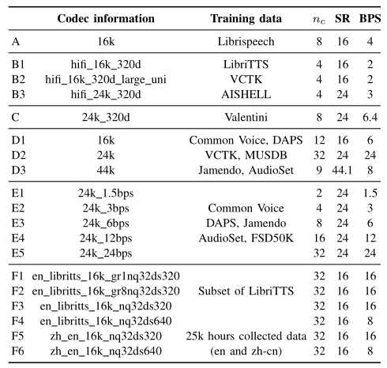
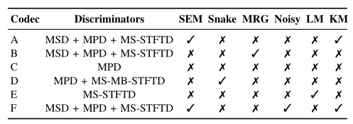

# Towards Audio Language Modeling: An Overview

作者列表

- Haibin Wu, 
- Xuanjun Chen, 
- Yi-Cheng Lin, 
- [Kai-wei Chang](../../Authors/张凯为_Kai-wei_Chang.md), 
- Ho-Lam Chung, 
- Alexander H. Liu, 
- [Hung-yi Lee](../../Authors/李宏毅_Hung-Yi_Lee.md)

## Abstract·摘要

> Neural audio codecs are initially introduced to compress audio data into compact codes to reduce transmission latency.
> Researchers recently discovered the potential of codecs as suitable tokenizers for converting continuous audio into discrete codes, which can be employed to develop audio language models (LMs).
> Numerous high-performance neural audio codecs and codec-based LMs have been developed.
> The paper aims to provide a thorough and systematic overview of the neural audio codec models and codec-based LMs.

最初引入神经音频编解码器是用于压缩音频数据为紧凑编码以降低传输延迟.
最近研究人员发现编解码器作为将连续音频转换为离散代码的分词器的潜力, 这可以用于开发音频语言模型.
许多高性能的神经音频编解码器和基于编解码器的语言模型已经被开发出来.
本文旨在提供有关神经音频编解码器模型和基于编解码器的语言模型的全面综述.

## 1.Introduction·引言

> Neural audio codec models were first introduced to compress audio for efficient data transmission. 
> The encoder converts the audio into codec codes, which are then transmitted.
> The receiver then uses the codec decoder to reconstruct the audio using the received codes.

神经音频编解码模型首次引入用于压缩音频以高效数据传输.
编码器将音频转换为编解码器编码, 然后传输.
接收方使用编解码器的解码器使用收到的编码重构音频.

> Language modeling has proven to be highly successful in the field of Natural Language Processing (NLP). 
> Audio data encompasses not only textual content but also rich information about speaker timbre, emotion, and general audio, offering deeper possibilities for language model applications.
> Researchers, especially those in large companies with significant computational resources, recently leverage the potential of neural codecs ([Encodec (2022)](../../Models/Speech_Neural_Codec/2022.10.24_EnCodec.md), [SoundStream (2021)](../../Models/Speech_Neural_Codec/2021.07.07_SoundStream.md), [SoundStorm (2023)](../../Models/Speech_LLM/2023.05.16_SoundStorm.md), [AudioDec (2023)](../../Models/Speech_Neural_Codec/2023.05.26_AudioDec.md), [AcademiCodec/HiFi-Codec (2023)](../../Models/Speech_Neural_Codec/2023.05.04_HiFi-Codec.md), [FunCodec (2023)](../../Models/Speech_Neural_Codec/2023.09.14_FunCodec.md), [SpeechTokenizer (2023)](../../Models/Speech_Neural_Codec/2023.08.31_SpeechTokenizer.md), [Descript-Audio-Codec (2023)](../../Models/Speech_Neural_Codec/2023.06.11_Descript-Audio-Codec.md)) as suitable tokenizers for converting continuous audio into discrete codes, which can be employed to develop audio language models (LMs) [9]–[20].
> The current codec-based language models and codec models are summarized in [Fig.01](#Fig.01). 
> These findings promptly garnered the community’s attention, sparking a fervor for developing codecs tailored to audio language modeling. 
> Numerous high performance neural audio codec models and audio LMs have been developed.

语言建模已经被证明在自然语言处理领域是高度成功的.
音频数据不仅包含文本内容还有关于说话人音色, 情感, 以及一般音频的丰富信息, 为语言模型应用提供了更深层次的可能性.
研究人员, 尤其是那些拥有大量计算资源的大型公司的研究人员, 最近开始利用神经编解码器的潜力, 将其作为合适的分词器把连续的音频转化为离散编码, 从而用于开发音频语言模型.
当前基于编解码器的语言模型和编解码器模型总结在[图 01](#Fig.01) 中.
这些发现迅速引起了社区的关注, 激发了开发专门为音频语言建模定义的编解码器的热潮.
许多高性能的神经音频编解码器模型和音频语言模型已经被开发出来.

> Fig.01: Timeline of Current Neural Codec Models and Codec-Based Language Models

> An ideal codec should maintain content while preserving paralinguistic and speaker-related information. 
> Similarly, a universal audio language model should be able to generalize across various audio types, such as speech, music, and general audio, covering a wide range of applications. 
> The arms race in developing codecs and audio LMs is still ongoing.

一个理想的编解码器应该在保持内容的同时, 保留伴随语言和说话人相关的信息.
类似地, 一个通用的音频语言模型应该能够跨多种音频类型进行泛化, 例如语音, 音乐和一般音频, 从而覆盖广泛的应用场景.
开发编解码器和音频语言模型的竞赛仍在继续.

> Given the significant advancements in codecs and audio language models over the past three years as shown in [Fig.01](#Fig.01), there has yet to be a comprehensive review comparing them and providing inspiration to the community.
> In this study, we aim to fill this research gap by thoroughly reviewing and comparing various existing neural codec models and audio codec-based language models.
> Firstly, we specifically conduct an in-depth analysis of six representative open-source neural codec models to cover their training methodologies, implementation settings, and training data. 
> Secondly, we expand our analysis to include eleven diverse codec-based language models, examining how they utilize the codecs and the tasks to which they can be applied. 
> Through this comprehensive review, we aim to offer the community insights into the diverse methodologies and potential directions in the field of neural codecs and codec-based language modeling.

鉴于过去三年中编解码器和音频语言模型所取得的显著进步 (如[图 01](#Fig.01) 所示), 目前尚未有一篇全面的综述来比较它们并为社区提供启发.
在本研究中, 我们的目标是通过详尽回顾和比较各种现有的神经编解码器模型和基于编解码器的音频语言模型.
首先, 我们特别地对六个代表性的开源神经编解码器模型进行深入分析, 涵盖它们的训练方法, 实现细节和训练数据.
其次, 我们将分析扩展到包括十一个不同的基于编解码器的语言模型, 探讨它们如何利用编解码器和可以应用的任务.
通过这一全面的回顾, 我们期望为社区提供关于神经编解码器和基于编解码器的语言建模领域中多样化方法和潜在方向的见解.

## 2.Comprehensive Comparison for Neural Audio Codec Models·神经音频编解码器模型的综合比较

> Codec models aim to compress and decompress speech signals efficiently.
> Traditional codecs are developed based on psycho-acoustics and speech synthesis [21], [22].
> Recently, the neural codec models demonstrated highly effective for compression and signal reconstruction, outperforming traditional codecs.
> Considering the broad spectrum of codec models within the research community, each trained with its distinct configurations and training techniques, there is a clear need for a thorough examination that covers the training methodologies, implementation settings, and training data employed across these codec models.
> The six codec models have distinct training details, resulting in a collection of fifteen different codec models, as summarized in [Tab.01](#Tab.01).

编解码器模型的目标是高效地压缩和解压缩语音信号.
传统的编解码器是基于心理声学和语音合成开发的.
近期, 神经编解码器模型在压缩和信号重建方面表现出了极高效率, 超越了传统编解码器.
考虑到研究社区中编解码器模型的广泛范围, 每个模型都使用其独特的配置和训练技术进行训练, 显然需要进行一次彻底的检查, 以涵盖这些编解码器模型所采用的训练方法, 实现设置和训练数据.
以下六个编解码器模型有着不同的训练细节, 从而形成一个包含十五个不同编解码器模型的集合, 如[表 01](#Tab.01) 所示.

> Tab.01: Codec Information Comparison. 
> `A-F` represents different neural codec models, where 
> - `A` is [SpeechTokenizer (2023)](../../Models/Speech_Neural_Codec/2023.08.31_SpeechTokenizer.md), 
> - `B` is [AcademiCodec/HiFi-Codec (2023)](../../Models/Speech_Neural_Codec/2023.05.04_HiFi-Codec.md), 
> - `C` is [AudioDec (2023)](../../Models/Speech_Neural_Codec/2023.05.26_AudioDec.md), 
> - `D` is [Descript-Audio-Codec (DAC) (2023)](../../Models/Speech_Neural_Codec/2023.06.11_Descript-Audio-Codec.md), 
> - `E` is [Encodec (2022)](../../Models/Speech_Neural_Codec/2022.10.24_EnCodec.md),
> - `F` is [FunCodec (2023)](../../Models/Speech_Neural_Codec/2023.09.14_FunCodec.md). 
> 
> $n_c$ represents the codebook number, `SR` represents the Sample Rate, and `BPS` represents the bit rate in unit Bits Per Second.

### 2.1.Brief Method Overview for Codecs·编解码器的简要方法概述

> [SoundStream (2021)](../../Models/Speech_Neural_Codec/2021.07.07_SoundStream.md) stands as one of the pioneering implementations of neural codec models, embodying a classic neural codec architecture comprising encoder, quantizer, and decoder modules.
> It utilizes the streaming [SEANets (2020)](../../Models/_Basis/2020.09.04_SEANet.md) as its encoder and decoder.
> The quantizer incorporates a speech enhancement system with a **Residual Vector Quantization (RVQ)** ([SoundStream (2021)](../../Models/Speech_Neural_Codec/2021.07.07_SoundStream.md), [MelGAN (2019)](../../Models/TTS3_Vocoder/2019.10.08_MelGAN.md)) bottleneck to obtain parallel token streams.
> During training, the model parameters are optimized using a combination of reconstruction and adversarial loss.
> [SoundStorm (2023)](../../Models/Speech_LLM/2023.05.16_SoundStorm.md) is an improved version of [SoundStream](../../Models/Speech_Neural_Codec/2021.07.07_SoundStream.md) to achieve both efficiency and high-quality audio generation.
> It accomplishes this by employing an architecture specifically tailored to the hierarchical structure of audio tokens.
> Moreover, it pioneers a parallel, non-autoregressive decoding scheme, which relies on confidence-based strategies for residual vector-quantized token sequences.

[SoundStream (2021)](../../Models/Speech_Neural_Codec/2021.07.07_SoundStream.md) 作为神经编解码器模型的先驱之一, 体现了一个经典的神经编解码器架构, 由编码器, 量化器和解码器模块组成.
它使用了流式 [SEANets (2020)](../../Models/_Basis/2020.09.04_SEANet.md) 作为编码器和解码器.
量化器集成了一个带有残差向量量化瓶颈的语音增强系统以获得并行的 Token 流.
在训练时, 模型参数使用重构损失和对抗损失的结合进行优化.

[SoundStorm (2023)](../../Models/Speech_LLM/2023.05.16_SoundStorm.md) 是 [SoundStream](../../Models/Speech_Neural_Codec/2021.07.07_SoundStream.md) 的改进版本, 实现了高效和高质量音频生成.
该模型通过采用专门针对音频 Token 的层次结构的架构来实现这一点.
此外, 它首创了一种并行的, 非自回归的解码方案, 该方案依赖于基于置信度的策略来处理残差向量量化后的 Token 序列.

> [Encodec (2022)](../../Models/Speech_Neural_Codec/2022.10.24_EnCodec.md) builds upon a framework similar to [SoundStream](../../Models/Speech_Neural_Codec/2021.07.07_SoundStream.md).
> Nonetheless, it further augments its capabilities by integrating supplementary LSTM [25] layers and harnessing a [Transformer (2017)](../../Models/_Basis/2017.06.12_Transformer.md)-based language model to model the RVQ codes, thereby amplifying its sequence modeling performance.
> Then, there is a stream of work aimed at making codec models more general and powerful.
> [AudioDec (2023)](../../Models/Speech_Neural_Codec/2023.05.26_AudioDec.md) represents an enhanced version of [Encodec](../../Models/Speech_Neural_Codec/2022.10.24_EnCodec.md), implementing a group convolution mechanism to facilitate the real-time operation of the streamable network while also harnessing the capabilities of [HiFi-GAN (2020)](../../Models/TTS3_Vocoder/2020.10.12_HiFi-GAN.md) to effectively generate high-fidelity audio at a high sampling rate of 48 kHz. 

[Encodec (2022)](../../Models/Speech_Neural_Codec/2022.10.24_EnCodec.md) 建立在类似于 [SoundStream](../../Models/Speech_Neural_Codec/2021.07.07_SoundStream.md) 的框架之上.
然而, 它通过整合追加的 LSTM 层和利用基于 [Transformer (2017)](../../Models/_Basis/2017.06.12_Transformer.md) 的语言模型来建模 RVQ 编码以进一步增强其能力, 从而扩大其序列建模性能.
因此, 有一系列工作旨在使编解码器模型更加通用和强大.
[AudioDec (2023)](../../Models/Speech_Neural_Codec/2023.05.26_AudioDec.md) 是 [Encodec](../../Models/Speech_Neural_Codec/2022.10.24_EnCodec.md) 的增强版本, 应用了组卷积机制, 以促进流式网络的实时操作, 同时利用 [HiFi-GAN (2020)](../../Models/TTS3_Vocoder/2020.10.12_HiFi-GAN.md) 的能力, 在 48k Hz 的高采样率下有效地生成高保真度的音频.

> In the [AcademiCodec/HiFi-Codec (2023)](../../Models/Speech_Neural_Codec/2023.05.04_HiFi-Codec.md) model, a novel technique known as group-residual vector quantization is presented.
> It employs multiple parallel RVQ groups.
> This technique is specifically tailored for generation tasks.
> It aims to enhance the reconstruction performance while using a limited number of codebooks, consequently achieving an impressively low bit rate per second (BPS).
> This low BPS is of utmost significance as it effectively addresses the challenge of lengthy speech tokens in speech language modeling, resulting in reduced sequence lengths.

[AcademiCodec/HiFi-Codec (2023)](../../Models/Speech_Neural_Codec/2023.05.04_HiFi-Codec.md) 模型提出了一个新的技术, 组残差向量量化.
它采用了多个并行的 RVQ 组.
这一技术是专门为生成任务而设计的.
其目的是在使用有限的码本的同时提高重构性能, 因此实现了惊人的低码率每秒 (BPS).
这种低码率对于长语音 Token 在语音语言建模中的挑战是至关重要的, 能使得序列长度减少.

> [SpeechTokenizer (2023)](../../Models/Speech_Neural_Codec/2023.08.31_SpeechTokenizer.md) is a unified speech tokenizer designed for speech language models.
> It implements an Encoder-Decoder architecture enhanced with RVQ.
> By integrating both semantic and acoustic tokens, [SpeechTokenizer](../../Models/Speech_Neural_Codec/2023.08.31_SpeechTokenizer.md) hierarchically separates various aspects of speech information across different RVQ layers.
> Specifically, [SpeechTokenizer](../../Models/Speech_Neural_Codec/2023.08.31_SpeechTokenizer.md) is designed to regularize the first RVQ layer to highlight semantic information by learning the [HuBERT (2021)](../../Models/Speech_Representaion/2021.06.14_HuBERT.md) tokens.
> Using such techniques can enhance the disentanglement of information across different RVQ layers.

[SpeechTokenizer (2023)](../../Models/Speech_Neural_Codec/2023.08.31_SpeechTokenizer.md) 是为语音语言模型设计的统一语音分词器.
它采用了 RVQ 增强的编码器-解码器架构.
通过整合语义 Token 和声学 Token, [SpeechTokenizer](../../Models/Speech_Neural_Codec/2023.08.31_SpeechTokenizer.md) 逐层地将语音信息分离到不同的 RVQ 层.
具体来说, [SpeechTokenizer](../../Models/Speech_Neural_Codec/2023.08.31_SpeechTokenizer.md) 被设计成通过学习 [HuBERT (2021)](../../Models/Speech_Representaion/2021.06.14_HuBERT.md) Token 正则化第一个 RVQ 层, 以突出语义信息.
采用这样的技术可以增强不同 RVQ 层之间的信息解耦.

> [Descript-Audio-Codec (DAC) (2023)](../../Models/Speech_Neural_Codec/2023.06.11_Descript-Audio-Codec.md), a universal neural codec model, distinguishes itself through its exceptional ability to maintain high-fidelity audio quality across a wide spectrum of data types, encompassing general audio, music, and speech.
> It accomplishes this feature by employing a number of training techniques, such as periodic activation functions [29], enhanced residual vector quantization using factorized and L2-normalized codes, random quantizer dropout to preserve audio reconstruction quality, as well as refining adversarial and reconstruction loss during the training process.
> The authors highlight the crucial importance of the periodic activation function among the employed techniques.

[Descript-Audio-Codec (DAC) (2023)](../../Models/Speech_Neural_Codec/2023.06.11_Descript-Audio-Codec.md) 是一种通用神经编解码器模型, 其独特的能力能够在广泛的数据类型范围内 (一般音频, 音乐和语音) 保持高保真度的音频质量.
它通过采用多种训练技术来实现这一特性, 例如周期激活函数, 使用因子化和 L2 归一化编码的增强残差向量量化, 随机量化器失活以保持音频重建质量, 以及在训练过程中细化对抗损失和重构损失.
作者强调了周期性激活函数在所采用技术中的关键重要性.

> Unlike most models focusing on the time domain, [FunCodec (2023)](../../Models/Speech_Neural_Codec/2023.09.14_FunCodec.md) proposes a frequency-domain codec.
> The authors claim they can achieve comparable performance with fewer parameters and lower computation complexity.
> Meanwhile, it also finds that incorporating semantic information in the codec tokens improves speech quality at low bit rates.

与大部分模型关注时域不同, [FunCodec (2023)](../../Models/Speech_Neural_Codec/2023.09.14_FunCodec.md) 提出了频域编解码器.
作者声称他们可以用较少参数和较低计算复杂度获得相当的性能.
同时还发现将语义信息整合到编解码器 Token 中可以提高低码率下的语音质量.

### 2.2.Comparison from Methodology Angles·方法论角度的比较

> We compare several techniques proposed by these codecs in [Tab.02](#Tab.02).
> The abbreviation `A-F` represents different codec models.
> Please refer to [Tab.01](#Tab.01) for the corresponding model full name.

我们比较这些编解码器提出的数种技术, 如[表 02](#Tab.02) 所示.
缩写 `A-F` 表示不同的编解码器模型. 
请参考[表 01](#Tab.01) 以获取相应模型的全称.

> Tab.02: Comparison between codec implementation strategy. 
> - `SEM` represents codec including Semantic Tokens. 
> - `SNAKE` represents the codec model that employs Snake Activation. 
> - `MRG` represents codec has Multiple Residual Groups.
> - `NOISY` represents codec utilizes Noisy data in training. 
> - `LM` represents the model including Language Model training. 
> - `KM` represents codec uses K-Means to cluster samples as initialization of VQ codebook.

#### 2.2.1.Discriminators·判别器

> The design of discriminators constitutes a pivotal element within codec models.
> [Encodec](../../Models/Speech_Neural_Codec/2022.10.24_EnCodec.md) initially introduces the **Multi-Scale-STFT Discriminator (MS-STFTD)**.
> In contrast to the **Multi-Scale Discriminator (MSD)** proposed in [MelGAN (2019)](../../Models/TTS3_Vocoder/2019.10.08_MelGAN.md), which captures long-term dependencies, the **Multi-Period Discriminator (MPD)** proposed in [HiFi-GAN (2020)](../../Models/TTS3_Vocoder/2020.10.12_HiFi-GAN.md) exhibits a capacity to discern more nuanced periodic details.
> Consequently, [AudioDec](../../Models/Speech_Neural_Codec/2023.05.26_AudioDec.md) replaces the conventionally employed **STFTD** with a [HiFi-GAN](../../Models/TTS3_Vocoder/2020.10.12_HiFi-GAN.md)-based MPD, observing an enhancement in audio quality within their model.
> [AcademiCodec](../../Models/Speech_Neural_Codec/2023.05.04_HiFi-Codec.md) integrates prior research efforts by incorporating the **MS-STFTD** from [Encodec](../../Models/Speech_Neural_Codec/2022.10.24_EnCodec.md) and both [HiFi-GAN](../../Models/TTS3_Vocoder/2020.10.12_HiFi-GAN.md)-based **MPD** and **MSD**.
> Both [SpeechTokenizer](../../Models/Speech_Neural_Codec/2023.08.31_SpeechTokenizer.md) and [FunCodec](../../Models/Speech_Neural_Codec/2023.09.14_FunCodec.md) adopt identical discriminators to [AcademiCodec](../../Models/Speech_Neural_Codec/2023.05.04_HiFi-Codec.md), with [FunCodec](../../Models/Speech_Neural_Codec/2023.09.14_FunCodec.md) offering a unified interface adaptable to any combination of these three discriminator types.
> [DAC](../../Models/Speech_Neural_Codec/2023.06.11_Descript-Audio-Codec.md) identifies that employing MSD and MPD alone generates audio displaying blurriness and artifacts.
> To address this, they propose the application of a **Multi-Scale Multi-Band STFT Discriminator (MS-MB-STFT-D)** to improve phase modeling and mitigate aliasing artifacts.

判别器的设计是编解码器模型中的关键元素.
[Encodec](../../Models/Speech_Neural_Codec/2022.10.24_EnCodec.md) 最初引入了 **多尺度短时傅里叶变换判别器 (Multi-Scale-STFT Discriminator, MS-STFTD)**.
与 [MelGAN (2019)](../../Models/TTS3_Vocoder/2019.10.08_MelGAN.md) 提出的**多尺度判别器 (Multi-Scale Discriminator, MSD)** 用于捕获长期依赖不同, [HiFi-GAN (2020)](../../Models/TTS3_Vocoder/2020.10.12_HiFi-GAN.md) 提出的**多周期判别器 (Multi-Period Discriminator, MPD)** 具有更强的能力来辨别更微妙的周期细节.
因此, [AudioDec](../../Models/Speech_Neural_Codec/2023.05.26_AudioDec.md) 将传统使用的**短时傅里叶变换判别器 (STFTD)** 替换为基于 [HiFi-GAN](../../Models/TTS3_Vocoder/2020.10.12_HiFi-GAN.md) 的多周期判别器, 观察其模型中的音频质量提升.

[AcademiCodec](../../Models/Speech_Neural_Codec/2023.05.04_HiFi-Codec.md) 整合了先前研究的努力, 即混合了 [Encodec](../../Models/Speech_Neural_Codec/2022.10.24_EnCodec.md) 的 **MS-STFTD**, 基于 [HiFi-GAN](../../Models/TTS3_Vocoder/2020.10.12_HiFi-GAN.md) 的 **MPD** 和 **MSD**.

[SpeechTokenizer](../../Models/Speech_Neural_Codec/2023.08.31_SpeechTokenizer.md) 和 [FunCodec](../../Models/Speech_Neural_Codec/2023.09.14_FunCodec.md) 都采用了和 [AcademiCodec](../../Models/Speech_Neural_Codec/2023.05.04_HiFi-Codec.md) 相同的判别器, 其中 [FunCodec](../../Models/Speech_Neural_Codec/2023.09.14_FunCodec.md) 提供了一个统一的接口, 可以适应这三种判别器的任意组合.

[DAC](../../Models/Speech_Neural_Codec/2023.06.11_Descript-Audio-Codec.md) 发现, 仅仅使用 **MSD** 和 **MPD** 生成的音频会出现模糊和伪影.
为了解决这一问题, 他们提出了一个**多尺度多频带的 STFT 判别器 (Multi-Scale Multi-Band STFT Discriminator, MS-MB-STFT-D)** 用于提升相位建模和减轻混叠伪影.

#### 2.2.2 Quantizer·量化器

> [SpeechTokenizer](../../Models/Speech_Neural_Codec/2023.08.31_SpeechTokenizer.md) utilizes semantic tokens from [HuBERT L9](../../Models/Speech_Representaion/2021.06.14_HuBERT.md) as a teacher for the RVQ process.
> This guidance enables the disentanglement of content information into the first layer of the tokenizer, while paralinguistic information is retained in subsequent layers.
> [FunCodec](../../Models/Speech_Neural_Codec/2023.09.14_FunCodec.md) seeks to integrate semantic information by combining, adding, or residualizing the audio codec with semantic tokens.
> The study reveals that including semantic tokens enhances audio quality, particularly with the residual inclusion method.
> Additionally, [SpeechTokenizer](../../Models/Speech_Neural_Codec/2023.08.31_SpeechTokenizer.md) and [FunCodec](../../Models/Speech_Neural_Codec/2023.09.14_FunCodec.md) utilize K-means to cluster samples in the first mini-batch for initializing the VQ codebook, leading to improved code utilization.
> [DAC](../../Models/Speech_Neural_Codec/2023.06.11_Descript-Audio-Codec.md) follows the approach of [BigVGAN (2022)](../../Models/TTS3_Vocoder/2022.06.09_BigVGAN.md), employing snake activation [29] for trainable control over the frequency of periodic signals.
> [AcademiCodec](../../Models/Speech_Neural_Codec/2023.05.04_HiFi-Codec.md) employs multiple RVQ codebooks (multiple residual groups) to represent intermediate features.
> They demonstrate that using multiple residual groups achieves good reconstruction performance while employing only a few codebooks.
> [Encodec (2022)](../../Models/Speech_Neural_Codec/2022.10.24_EnCodec.md) trains an additional small [Transformer](../../Models/_Basis/2017.06.12_Transformer.md) model for entropy coding over the quantized units, which reduces bandwidth and accelerates encoding and decoding.

[SpeechTokenizer](../../Models/Speech_Neural_Codec/2023.08.31_SpeechTokenizer.md) 利用从 [HuBERT L9](../../Models/Speech_Representaion/2021.06.14_HuBERT.md) 提取的语义 Token 作为教师来指导 RVQ 过程.
这一指导使得内容信息在分词器的第一层被分离, 而其他语言相关的信息在后续层中被保留.

[FunCodec](../../Models/Speech_Neural_Codec/2023.09.14_FunCodec.md) 试图通过结合, 添加或残差化音频编解码器和语义 Token 来融合语义信息.
研究表明包含语义 Token 可以提高音频质量, 特别是使用残差化包含方式.

此外, [SpeechTokenizer](../../Models/Speech_Neural_Codec/2023.08.31_SpeechTokenizer.md) 和 [FunCodec](../../Models/Speech_Neural_Codec/2023.09.14_FunCodec.md) 利用 K-means 对第一个小批量样本进行聚类, 以便初始化 VQ 码本, 进而提高码本利用率.

[DAC](../../Models/Speech_Neural_Codec/2023.06.11_Descript-Audio-Codec.md) 遵循 [BigVGAN (2022)](../../Models/TTS3_Vocoder/2022.06.09_BigVGAN.md) 的方法, 应用蛇形激活来实现对周期信号频率的可训练控制.

[AcademiCodec](../../Models/Speech_Neural_Codec/2023.05.04_HiFi-Codec.md) 采用多个 RVQ 码本 (多个残差组) 来表示中间特征.
他们证明使用多个残差组可以在仅使用少量码本的情况下实现良好的重建性能.

[Encodec (2022)](../../Models/Speech_Neural_Codec/2022.10.24_EnCodec.md) 训练了一个额外的小型 [Transformer](../../Models/_Basis/2017.06.12_Transformer.md) 模型来对量化单元进行熵编码, 这可以减少带宽并加速编码和解码.

### 2.3.Implementation Details·实现细节

> We compare the codebook number, training data, sampling rate, and bit rate per second in [Tab.01](#Tab.01).
> From the training data perspective, [SpeechTokenizer (2023)](../../Models/Speech_Neural_Codec/2023.08.31_SpeechTokenizer.md), [AudioDec (2023)](../../Models/Speech_Neural_Codec/2023.05.26_AudioDec.md), and [FunCodec (2023)](../../Models/Speech_Neural_Codec/2023.09.14_FunCodec.md) utilize only English speech dataset.
> [AcademiCodec/HiFi-Codec (2023)](../../Models/Speech_Neural_Codec/2023.05.04_HiFi-Codec.md) incorporates bilingual speech datasets, including [AISHELL](../../Datasets/AISHELL.md) for Chinese and [LibriTTS](../../Datasets/LibriTTS.md) and [VCTK](../../Datasets/VCTK.md) for English.
> Both [DAC (2023)](../../Models/Speech_Neural_Codec/2023.06.11_Descript-Audio-Codec.md), and [Encodec (2022)](../../Models/Speech_Neural_Codec/2022.10.24_EnCodec.md) encompass diverse modality data, including speech, music, and audio, in the training data.

我们在[表 01](#Tab.01) 中比较了码本数量, 训练数据, 采样率, 和每秒比特率.
从训练数据的角度看:
- [SpeechTokenizer (2023)](../../Models/Speech_Neural_Codec/2023.08.31_SpeechTokenizer.md), [AudioDec (2023)](../../Models/Speech_Neural_Codec/2023.05.26_AudioDec.md), 和 [FunCodec (2023)](../../Models/Speech_Neural_Codec/2023.09.14_FunCodec.md) 只使用了英语语音数据集.
- [AcademiCodec/HiFi-Codec (2023)](../../Models/Speech_Neural_Codec/2023.05.04_HiFi-Codec.md) 包含了双语语音数据集, 包括 [AISHELL](../../Datasets/AISHELL.md) 用于中文, [LibriTTS](../../Datasets/LibriTTS.md) 和 [VCTK](../../Datasets/VCTK.md) 用于英语.
- [DAC (2023)](../../Models/Speech_Neural_Codec/2023.06.11_Descript-Audio-Codec.md) 和 [Encodec (2022)](../../Models/Speech_Neural_Codec/2022.10.24_EnCodec.md) 在训练数据中包含了多种模态数据, 包括语音, 音乐, 以及音频.

## 3.Current Codec-Based Speech Language Models·现有的基于编解码器的语音语言模型

> As shown in [Fig.02](#Fig.02), the process of neural codec-based audio language modeling begins by converting context information, such as text and MIDI, into context codes, while simultaneously encoding the audio into codec codes.
> These context and codec codes are then employed in the language modeling phase to generate the desired target codec code sequence.
> Subsequently, the target codec code sequence is passed to the codec decoder to produce the audio output.
> The entire pipeline embodies an audio-to-audio modeling approach.

> Fig.02: Codec-Based Language Modeling.

如[图 02](#Fig.02) 所示, 基于神经编解码器的音频语言建模过程首先将内容信息 (文本和 MIDI) 转化为内容编码, 同时将音频编码为编解码器编码.
这些内容和编解码器编码之后在语言建模阶段用于生成所需的目标编解码器代码序列.
之后, 目标编解码器编码序列传递到编解码器解码器以产生音频输出.
整个流程体现了一种音频到音频的建模方法.

### 3.1.Overview of Codec-Based Language Models·编解码器语言模型概览

> [AudioLM (2022)](../../Models/Speech_LLM/2022.09.07_AudioLM.md) is the pioneering model in introducing codec codes for language modeling, utilizing a hierarchical approach that encompasses two distinct stages.
> The first stage generates semantic tokens using a self-supervised w2v-BERT model [32].
> These tokens are then leveraged in the second stage as conditioning elements to create acoustic tokens using a [SoundStream (2021)](../../Models/Speech_Neural_Codec/2021.07.07_SoundStream.md) neural codec.

> VALL-E [12], VALL-E X [13], and SpeechX [17], all originate from Microsoft and are neural codec language models trained to generate discrete codes derived from [Encodec (2022)](../../Models/Speech_Neural_Codec/2022.10.24_EnCodec.md), based on textual or acoustic inputs.
> VALL-E can generate high-quality personalized speech with only a 3-second enrollment recording from an unseen speaker.
> Furthermore, VALL-E X can produce high-quality speech in the target language with just a single speech utterance in the source language as a prompt.
> Additionally, SpeechX introduces a unified framework to address not only zero-shot TTS but also various types of speech transformation tasks, including speech enhancement and speech editing.

> What sets ViaLA [14], AudioPaLM [10], and LauraGPT [16] apart is their dual capability to generate both text and audio.
> VioLA tries to tackle the question “Is one decoder-only generative model all you need for speech recognition, synthesis, and translation?” by employing language modeling that integrates both text tokens and audio tokens (extracted by [Encodec (2022)](../../Models/Speech_Neural_Codec/2022.10.24_EnCodec.md)), along with the use of task IDs and language IDs.
> AudioPaLM constructs a unified vocabulary comprising both text and audio tokens.
> It is a decoder-only, autoregressive model capable of processing and generating both text and speech.
> Additionally, AudioPaLM’s initialization stems from PaLM-2 [33], a text-only language model.
> AudioPaLM’s approach to audio tokenization resembles that of AudioLM.
> Moreover, AudioPaLM adopts and extends the [SoundStream (2021)](../../Models/Speech_Neural_Codec/2021.07.07_SoundStream.md) model to [SoundStorm (2023)](../../Models/Speech_LLM/2023.05.16_SoundStorm.md).
> LauraGPT [16] is a versatile language model built on a decoder-only text-based language model, Qwen-2B [34].
> LauraGPT has the capability to process both audio and text inputs, generating outputs in either modality.
> LauraGPT encodes input audio into continuous representations using a Conformer encoder and decodes output audio using [FunCodec (2023)](../../Models/Speech_Neural_Codec/2023.09.14_FunCodec.md) discrete codes.
> The authors claim this specific audio features design for inputs and outputs will result in improved performance for speech generation using some preliminary experimental results.

> UniAudio [15] utilizes language modeling to generate a wide range of audio types, including speech, sounds, music, and singing, using textual or acoustic tokens as inputs.
> UniAudio stands out for its ability to enhance autoregressive prediction speed by introducing a multi-scale Transformer model [35], which employs a large global transformer to predict the first-layer codec codes and a small local transformer to predict the codec codes for the subsequent codec layers.
> The codec model in UniAudio is revised from [Encodec (2022)](../../Models/Speech_Neural_Codec/2022.10.24_EnCodec.md).

> Additionally, there are other codec-based language models designed for sound modeling.
> AudioGen [20] trained a [SoundStream (2021)](../../Models/Speech_Neural_Codec/2021.07.07_SoundStream.md) model to get audio tokens and subsequently trained a language model to utilize textual features as conditions for generating audio tokens.
> MusicLM [11] follows a training strategy similar to AudioLM but extends its scope to encompass music features.
> It approaches the task of conditional music generation through a hierarchical sequence-to-sequence modeling approach.
> Initially, it utilizes music tokens from Mulan [36] to generate semantic tokens from the w2v-BERT model.
> Subsequently, it employs both music tokens and semantic tokens to generate acoustic features through [SoundStream (2021)](../../Models/Speech_Neural_Codec/2021.07.07_SoundStream.md).
> MusicGen [18] is a music language model designed to work with EnCodec discrete tokens.
> It accepts textual descriptions or melodic features as input conditions to generate tokens, which can be reconstructed to high-fidelity music.

> Another branch of speech language modeling aims to utilize discrete units obtained by quantizing self-supervised speech representations.
> While these discrete units contain rich acoustic and linguistic information [37], they lack speaker and paralinguistic information [38].
> This research direction focuses on modeling the semantics of speech, with the optional use of encoders to learn about speaker characteristics and prosody.
> Pioneering work is speech-resynthesis [38], which utilizes these discrete units in conjunction with prosody and speaker encoders to encode speech into low-bitrate codes.
> These codes can then be resynthesized into a speech signal with a decoder to achieve low-bitrate transmission.
> Additionally, these discrete units can be regarded as “pseudo-text,” serving as a foundation for training textless speech language models.
> Notable examples include GSLM [39], pGSLM [40], dGSLM [41], and TWIST [42].
> By engaging in the pre-trained task of next-token prediction, these speech LMs perform spoken language modeling and can conduct the task of speech continuation.
> In the field of speech translation, recent advancements have been made possible through these discrete units. [43] pre-trained a Unit mBART combined with a wav2vec 2.0 [44] encoder to directly predict the translated discrete units.
> UnitY [45] further incorporates text modality to enhance speech translation.
> The Seamless models [46], [47] integrate the UnitY framework to perform expressive and streaming speech-to-text and speech-to-speech translation.
> With the development of these powerful speech LMs, researchers have begun to explore the use of prompting on speech LMs for various speech processing tasks, including prompt tuning [48]–[50], in-context learning [51], and instruction tuning [52], [53].

### 3.2.Comparison for Codec-Based Audio Language Models

> In Tab.03, we compare the inputs, outputs, and downstream tasks of different codec-based language models.
> We also summarize that the downstream tasks conducted by differ-ent codec-based language models: Speech Continuation (SC), Piano Continuation (PC), Audio Continuation (AC), Text-to-Speech (TTS), Music Generation (MG), Stereophonic Generation (SG), Speech to Speech Translation (S2ST), Automatic Speech Recognition (ASR), Spoken Language Understanding (SLU), Automated Audio Captioning (AAC), Speech to Text Translation (S2TT), Machine Translation (MT), Speech Enhancement (SE), Speech Removal (SR), Target Speaker Extraction (TSE), Speech Editing (SPED), Voice Conversion (VC), Singing Voice Synthesis (SVS), Text-to-Sound (TTSO), Text-to-Music (TTM), Audio Editing (AUED), Speech Dereverb (SD), Instructed TTS (ITTS).
> Finally, we show the codec models adopted by different LMs.

## 4.Conclusions

> The paper fills the research blank to review the neural codec models and LMs built upon them.
> We hope the comprehensive review and comparisons can inspire future research works to boost the development of neural codec models and codec-based LMs.