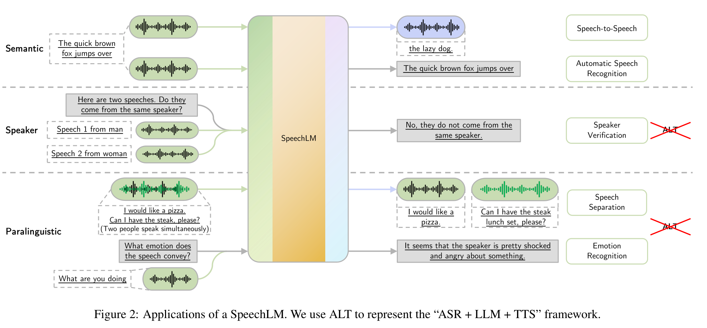

# Recent Advances in Speech Language Models: A Survey

基本信息

- 标题: "Recent Advances in Speech Language Models: A Survey"
- 作者:
  - 01 Wenqian Cui - 香港中文大学 CUHK
  - 02 Dianzhi Yu - 香港中文大学 CUHK
  - 03 Xiaoqi Jiao - 腾讯 LightSpeed Studios
  - 04 Ziqiao Meng - 香港中文大学 CUHK
  - 05 Guangyan Zhang - 腾讯 LightSpeed Studios
  - 06 Qichao Wang - 腾讯 AI Lab
  - 07 Yiwen Guo - 独立研究者
  - 08 Irwin King - 香港中文大学 CUHK
- 链接:
  - [ArXiv](https://arxiv.org/abs/2410.03751)
  - [Publication]
  - [Github]
  - [Demo]
- 文件:
  - [ArXiv](2410.03751v1__Survey__Recent_Advances_in_Speech_Language_Models__A_Survey.pdf)
  - [Publication] #TODO

## Abstract: 摘要

展开原文

Large Language Models (LLMs) have recently garnered significant attention, primarily for their capabilities in text-based interactions.
However, natural human interaction often relies on speech, necessitating a shift towards voice-based models.
A straightforward approach to achieve this involves a pipeline of "Automatic Speech Recognition (ASR) + LLM + Text-to-Speech (TTS)", where input speech is transcribed to text, processed by an LLM, and then converted back to speech.
Despite being straightforward, this method suffers from inherent limitations, such as information loss during modality conversion and error accumulation across the three stages.
To address these issues, Speech Language Models (SpeechLMs)---end-to-end models that generate speech without converting from text---have emerged as a promising alternative.
This survey paper provides the first comprehensive overview of recent methodologies for constructing SpeechLMs, detailing the key components of their architecture and the various training recipes integral to their development.
Additionally, we systematically survey the various capabilities of SpeechLMs, categorize the evaluation metrics for SpeechLMs, and discuss the challenges and future research directions in this rapidly evolving field.

 

大语言模型 (Large Language Models, LLMs) 最近获得了越来越多的关注, 主要用于文本交互的能力.
然而, 自然的人类交互往往依赖于语音, 因此需要转移到基于声音的模型.
实现这一目标的一个直接的方法是使用 "自动语音识别 (Automatic Speech Recognition, ASR) + 大语言模型 LLM + 文本转语音 (Text-to-Speech, TTS)" 构成的流程, 其中输入的语音被转录为文本, 然后被 LLM 处理, 并转换回语音.
尽管这种方法很直接, 但它也存在固有的限制, 如在模态转换过程中的信息丢失和三个阶段的错误累积.
为了解决这些问题, 出现了**语音语言模型 (Speech Language Models, SpeechLMs)**, 即无需从文本转换而直接生成语音的模型, 成为一个有前途的替代方案.
本综述首次全面概述了构造语音语言模型的近期方法, 详细介绍了其架构的关键组件和用于开发的各种训练方法.
此外, 我们系统地调查了语音语言模型的各种能力, 分类了评估指标, 并讨论了该领域的挑战和未来研究方向.

## 1.Introduction: 引言

Large Language Models (LLMs) have demonstrated remarkable capabilities in generating text and performing a wide array of natural language processing tasks ([GPT-4 (2023)](../../Models/LLM/2023.03.15_GPT-4.md); [LLaMA3 (2024)](../../Models/LLM/2024.07.31_LLaMA3.md); [OPT (2022)](../../Models/LLM/2022.05.02_OPT.md)), serving as powerful foundation models for AI-driven language understanding and generation.
Their success has also spurred numerous applications in various other domains, yet the reliance solely on text-based modalities presents a significant limitation.
This leads to the development of speech-based generative models, which allow to interact with humans more naturally and intuitively.
The inclusion of speech not only facilitates real-time voice interactions but also enriches communication by combining both text and speech information ([dGSLM (2022)](../../Models/Speech_LLM/2022.03.30_dGSLM.md); [SpiRit-LM (2024)](../../Models/Speech_LLM/2024.02.08_SpiRit-LM.md)).

Given the extensive mutual information between text and speech, it is natural to modify existing LLMs to enable speech interaction capabilities.
A straightforward approach is to adopt an "Automatic Speech Recognition (ASR) + LLM + Text-to-Speech (TTS)" framework (Fig.01 (a)) ([AudioGPT (2023)](../../Models/Speech_LLM/2023.04.25_AudioGPT.md)).
In this setup, the user's spoken input is first processed by the ASR module, which converts it into text.
The LLM then generates a text response based on this transcription.
Finally, the TTS module transforms the text response back into speech, which is played back to the user.
However, this naive solution mainly suffers from the following two problems.
(1) **Information loss.** Speech signals not only contain semantic information (i.e., the meaning of the speech) but also paralinguistic information (e.g., pitch, timbre, tonality, etc.).
Putting a text-only LLM in the middle will cause the complete loss of paralinguistic information in the input speech ([SpeechGPT (2023)](../../Models/Speech_LLM/2023.05.18_SpeechGPT.md)).
(2) **Cumulative error.** A staged approach like this can easily lead to cumulative errors throughout the pipeline, particularly in the ASR-LLM stage ([AudioChatLLaMA (2023)](../../Models/Speech_LLM/2023.11.12_AudioChatLLaMA.md)).
Specifically, transcription errors that occur when converting speech to text in the ASR module can negatively impact the language generation performance of the LLM.

The limitations of the naive ASR + LLM + TTS framework have led to the development of Speech Language Models (SpeechLMs, Fig.01 (b)).
Unlike the naive framework, SpeechLMs directly encode speech waveforms into discrete tokens, capturing essential features and information from audio (\cref{sec:speechencoder}).
Although individual speech tokens may not carry word-level semantic meaning, they capture the semantic information of speech utterances and retain valuable paralinguistic information, which prevents the information loss.
SpeechLMs then model these tokens autoregressively, without solely relying on text input, which allows them to use the additional paralinguistic information to generate more expressive and nuanced speech (\cref{sec:languagemodel}).
Finally, the generated tokens are synthesized back to speech (\cref{sec:vocoder}).
By working directly with the encoded speech tokens, SpeechLMs effectively mitigate the cumulative errors, as their training is integrated with the speech encoding, whereas the training of LLMs (language modeling) is completely independent of the ASR (speech recognition) module in the naive framework.

Beyond basic conversational abilities, SpeechLMs hold the potential to undertake more complex tasks, such as encoding speaker-specific information and emotional nuances (Fig.02).
This capability allows SpeechLMs to distinguish between different speakers during a conversation and to comprehend and generate speech imbued with specific emotional tones.
Such advancements are crucial for applications in areas like personalized assistants, emotion-aware systems, and more nuanced human-computer interaction scenarios.
Furthermore, SpeechLMs can be designed to enable real-time voice interaction, where the model can be interrupted by humans or choose to speak while the user is still speaking, which resembles the pattern of human conversations more closely.

In this survey, we present the first comprehensive overview of recent endeavors in constructing SpeechLMs.
We explore the various components that constitute their architecture (\cref{sec:components}) and the training recipes (\cref{sec:trainingRecipes}) involved in their development.
we aim to elucidate the current state of the field by analyzing these models from the above perspectives.
Additionally, we survey the downstream applications of SpeechLMs (\cref{sec:downstreamApps}), classify metrics to evaluate SpeechLMs (\cref{sec:evaluation}), discuss the challenges encountered in this rapidly evolving area, and outline promising future research directions that could drive further advancements in SpeechLM technology (\cref{sec:challenges}).
Our contributions are summarized as follows:

- We present the first survey in the field of SpeechLMs.
- We propose a novel taxonomy (Fig.03) of classifying SpeechLMs from the underlying components and the training recipes.
- We propose a novel classification system for the \mbox{evaluation} methods for SpeechLMs.
- We identify several challenges in building SpeechLMs.

## 2.Problem Formulation: 问题形式化

In this section, we provide a formal definition of Speech Language Models.
A Speech Language Model (SpeechLM) is an autoregressive foundation model that processes and generates speech data, utilizing contextual understanding for coherent sequence generation.
It supports both speech and text modalities, such as speech-in-text-out, text-in-speech-out, or speech-in-speech-out, enabling a wide range of tasks with context-aware capabilities.
We note that the concept of SpeechLM is in contrast to traditional text-based language models, such as LLM, where the only modality being processed within the model is text.
Therefore, to avoid confusion, we call those text-based language models TextLMs throughout this survey.

We offer a unified framework in which SpeechLMs can process and generate speech data, text data, or even interleaved speech and text data.
Specifically, an audio waveform $\textbf{a} = (a_1, a_2, \ldots, a_Q)$ consists of a sequence of audio samples $a_i \in \mathbb{R}$ of length $Q$, where $1 \leq q \leq Q$.
Similarly, a text span $\textbf{t} = (t_1, t_2, \ldots, t_K)$ consists of a sequence of text tokens $t_j$ (word, subword, character, etc.) of length $K$.
Let $\textbf{M} = (M_1, M_2, \ldots, M_N)$ denote a multimodal sequence of length $N$, where each element $M_i \in \{a_i, t_j\}$.
We define $\textbf{M}^{\text{in}} = (M_1^{\text{in}}, M_2^{\text{in}}, \ldots, M_{N_\text{in}}^{\text{in}})$ as the input multimodal sequence and $\textbf{M}^{\text{out}} = (M_1^{\text{out}}, M_2^{\text{out}}, \ldots, M_{N_\text{out}}^{\text{out}})$ as the output multimodal sequence, where $N_\text{in} \geq 0$ and $N_\text{out} \geq 0$.
Then, A SpeechLM parameterized by $\theta$ can then be represented as:

$$
    \textbf{M}^{\text{out}} = SpeechLM(\textbf{M}^{\text{in}}; \theta).
$$

## [3.Components in SpeechLM: 语音语言模型的组件](Sec.03.Components.md)

## [4.Training Recipes: 训练方法](Sec.04.Recipes.md)

## [5.Downstream Applications: 下游应用](Sec.05.Applications.md)

## [6.Evaluation: 评估](Sec.06.Evaluations.md)

## 7.Challenges and Future Directions: 挑战与未来方向

While SpeechLMs have demonstrated impressive abilities, the research in this area is still in its infancy.
In this section, we survey challenges, unsolved questions, and possible directions for future research in the study of SpeechLMs.

### 7.1.Understanding Different Component Choices

Current research on SpeechLMs encompasses key components such as speech tokenizers, language models, and vocoders, each offering a diverse range of options.
While some studies have compared various component choices—primarily focusing on speech tokenizers—the comparisons tend to be limited in scope and depth ([GSLM (2021)](../../Models/Speech_LLM/2021.02.01_GSLM.md);  [AudioPaLM (2023)](../../Models/Speech_LLM/2023.06.22_AudioPaLM.md)).
Consequently, there remains a significant gap in understanding the advantages and disadvantages of different component selections.
Therefore, studies aimed at comprehensively comparing these choices are essential.
Such an investigation would yield valuable insights and serve as a guide for selecting more efficient components when developing SpeechLMs.

### 7.2.End-to-End Training

Although SpeechLMs can generate speech directly without relying on text signals, they still need to train the three components separately.
This separate optimization may hinder the model's overall potential.
Consequently, it would be worthwhile to investigate whether training can be conducted in an end-to-end manner, allowing gradients to be back-propagated from the vocoder's output to the tokenizer's input.
By exploring this fully end-to-end approach, we could potentially enable SpeechLMs to produce more coherent, contextually relevant, and high-fidelity speech outputs.

### 7.3.Real-Time Speech Generation

Enabling real-time speech generation is crucial in SpeechLM as it fosters a more interactive way of engaging with humans.
However, the most adopted approaches described in [section 3](Sec.03.Components.md) still result in noticeable delays between input and output speech generation.
This delay occurs because a typical vocoder must wait for the entire sequence of output tokens to be generated by the language model before functioning, making it the most time-consuming process in the inference pipeline.
One potential solution to improve latency is to develop a streamable vocoder, allowing it to begin synthesizing output speech while the language model generates output speech tokens.
Another option could involve the SpeechLM autonomously generating audio samples in waveform.
Overall, this area of real-time speech generation remains under-explored and requires further investigation.

### 7.4.Safety Risks in SpeechLMs

Safety is a highly significant subject in the field of Machine Learning, particularly when it comes to large-scale generative AI models.
While there has been extensive research on safety concerns in TextLMs, the safety issues in SpeechLMs have not been thoroughly investigated.
The safety challenges in SpeechLMs present both similarities and unique aspects compared to TextLMs, as highlighted in OpenAI's recent report on the safety issues of [GPT-4o (2024)](../../Models/LLM/2024.09.06_GPT-4o.md)'s voice model.
Therefore, it is crucial for future research to explore safety vulnerabilities in SpeechLMs and develop safer SpeechLMs.

Primary concerns for the safety issues in SpeechLMs include but are not limited to toxicity and privacy.

Toxicity refers to the harmful nature of the content generated by SpeechLMs.
For instance, these models might produce semantically dangerous content, such as instructions for making explosives.
Additionally, they could generate acoustically inappropriate content, like erotic speech ([GPT-4o (2024)](../../Models/LLM/2024.09.06_GPT-4o.md)), which presents a unique challenge.

Privacy involves the risk of revealing personal information from the speech input after it has been processed by a SpeechLM.
For example, the model might infer the speaker's identity based on the semantic content or acoustic features of the input.
Even more concerning is the potential for the model to make biased inferences about the speaker, such as their ethnicity or religious beliefs, based on insufficient (e.g., acoustic) information ([GPT-4o (2024)](../../Models/LLM/2024.09.06_GPT-4o.md)).

### 7.5.Performance on Rare Languages

SpeechLMs directly model speech data, which allows them to more effectively handle "low-resource" languages compared to TextLMs.
"Low-resource" languages are those that lack extensive textual data, making it challenging for TextLMs to model them efficiently.
In contrast, SpeechLM provides a better solution by modeling the speech data of these "low-resource" languages, which often have more available audio data than text ([GSLM (2021)](../../Models/Speech_LLM/2021.02.01_GSLM.md)).
Therefore, future research could focus on training SpeechLMs in "low-resource" languages or dialects to expand their capabilities.

## 8.Conclusions: 结论

展开原文

This survey provides a comprehensive overview of recent advancements in Speech Language Models (SpeechLMs).
We begin by addressing the limitations of the naive framework that combines Automatic Speech Recognition (ASR), Large Language Models (LLMs), and Text-to-Speech (TTS) systems for voice interactions.
Next, we highlight the key advantages offered by SpeechLMs.
Following this, we explore the architectures of SpeechLMs, detailing the components involved and their training recipes.
We also discuss their capabilities in various downstream applications as well as their various evaluation methods.
Finally, we identify the major challenges in developing SpeechLMs and outline potential directions for future research.
We hope this survey will illuminate the field and assist the research community in creating more powerful Speech Language Models.

 

本综述提供了关于语音语言模型 (Speech Language Models, SpeechLMs) 近期进展的全面概览.
我们首先讨论了将自动语音识别 (Automatic Speech Recognition, ASR), 大语言模型 (Large Language Models, LLMs), 以及文本转语音 (Text-to-Speech, TTS) 系统结合起来用于语音交互的简单框架的局限性.
然后, 我们着重介绍了语音语言模型 (Speech Language Models, SpeechLMs) 提供的关键优势.
接下来, 我们探索了语音语言模型 (Speech Language Models, SpeechLMs) 的架构, 详细介绍了所涉及的组件及其训练方法.
我们还讨论了它们在不同下游应用中的能力, 以及它们的各种评估方法.
最后, 我们确定了开发语音语言模型 (Speech Language Models, SpeechLMs) 的主要挑战, 并概述了未来研究的潜在方向.
希望本综述能够照亮该领域, 并为研究社区提供更强大的语音语言模型.
